# 2 使用 Jenkins 的管道作为代码

本章涵盖

+   管道作为代码如何与 Jenkins 一起工作

+   Jenkinsfile 结构和语法的概述

+   Blue Ocean 的新 Jenkins 用户体验介绍

+   声明式与脚本式 Jenkins 管道

+   在 Jenkins 项目中集成 GitFlow 模型

+   在编写复杂的 CI/CD 管道 Jenkinsfile 时的生产力和效率技巧

毫无疑问，云计算对公司在构建、扩展和维护技术产品的方式产生了重大影响。只需点击几个按钮就能配置机器、数据库和其他基础设施的能力，导致了我们以前从未见过的开发者生产力的提升。

虽然启动简单的云架构很容易，但在配置复杂的云架构时，错误很容易发生。人为错误始终存在，尤其是在你可以通过点击云提供商网页控制台上的按钮来启动云基础设施的情况下。

避免这些错误的方法是通过自动化，而基础设施即代码 (IaC) 正在帮助工程师快速且无错误地自动启动云环境。DevOps 的增长和对其实践的采用导致了更多工具可以更大程度地实现 IaC 范式。

在过去，设置 CI/CD 工作流程一直是一个手动过程。通常是通过定义一系列针对各种管道任务的独立作业来完成的。每个作业都是通过网页表单配置的——填写文本框、从下拉列表中选择条目等等。然后，这些作业系列被串联起来，每个作业触发下一个作业，形成一个管道。

在 Jenkins 2 发布之前，Jenkins 在这个领域有些落后。尽管它被广泛使用，并且是创建 CI/CD 管道的首选工作流程工具，但这种方式创建和连接 Jenkins 作业以形成一个管道具有挑战性。它不符合 IaC 的定义。作业配置仅以可扩展标记语言 (XML) 文件的形式存储在 Jenkins 配置区域中。这意味着文件不易阅读或直接修改。Jenkins 应用程序本身提供了用户的主要视图和访问方式。

注意，Jenkins 2 是我们通常用于指代支持 pipeline-as-code 功能以及其他新特性的新版本的名称。

由于它是每个项目的重要部分，因此管道配置应作为代码进行管理并自动部署。这也允许我们管理管道本身，应用适用于应用程序代码的相同标准。这就是管道作为代码发挥作用的地方。

## 2.1 介绍 Jenkinsfile

*管道* *作为代码* (PaC) 描述了一组功能，允许 Jenkins 用户使用代码定义管道作业过程，这些代码存储和版本化在源代码仓库中。这些功能允许 Jenkins 发现、管理和运行多个源代码仓库和分支的作业—消除了手动创建和管理作业的需求。

PaC 帮助您以可重复、一致的方式自动化 CI/CD 工作流程，这带来了许多好处：

+   *速度*—您可以快速轻松地为沙盒、预发布和生产环境编写 CI/CD 工作流程，这有助于您按时交付产品。

+   *一致性*—PaC 完全标准化了 CI/CD 的设置，因此减少了任何人为错误或偏差的可能性。

+   *风险管理*—由于管道可以进行版本控制，PaC 允许记录、日志记录、跟踪和测试您 CI/CD 工作流程中的每个更改，就像应用程序代码一样。因此，在出现故障的情况下，您可以回滚到工作版本。

+   *效率*—它最小化了人为错误的发生，并有助于您的应用程序部署更加顺畅。

核心是简单的：采用 PaC 范式将创造一种产生更好软件的文化，并将节省您大量金钱、时间和因通过 UI 和网页表单实施复杂的 CI/CD 工作流程而带来的头痛。那么 PaC 是如何与 Jenkins 一起工作的呢？

要使用 PaC 与 Jenkins 一起使用，项目必须在代码仓库顶层文件夹中包含一个名为 Jenkinsfile 的文件。此模板文件包含一组指令或步骤，称为 *阶段*，每次开发团队将新功能推送到代码仓库时，都会在 Jenkins 上执行。由于 Jenkinsfile 与源代码一起生活，我们可以像对任何其他文件一样，始终在源代码控制中拉取、编辑和推送 Jenkinsfile。我们还可以对管道脚本进行代码审查。

Jenkinsfile 使用基于 Groovy 编程语言的领域特定语言 (DSL) 来定义整个 CI/CD 工作流程。图 2.1 是一个经典 CI/CD 工作流程的示例。


图 2.1 CI/CD 工作流程

这些阶段可以使用 `stage` 关键字在 Jenkinsfile 中描述。*阶段*是一个包含一系列步骤的块。它可以用来可视化管道过程。以下列表是用于图 2.1 的简单 Jenkinsfile 的示例。

列表 2.1 Jenkinsfile 阶段

```
node('workers'){
    try {
        stage('Checkout'){
            checkout scm
        }

        stage('Quality Test'){.
            echo "Running quality tests"
        }

        stage('Unit Test'){
            echo "Running unit tests"
        }

        stage('Security Test').
            echo "Running security checks"
        }

        stage('Build'){.
            echo "Building artifact"
        }

        stage('Push'){.
           echo "Storing artifact"
        }

        stage('Deploy').
            echo "Deploying artifact"
        }

        stage('Acceptance Tests'){
            echo "Running post-integrations tests"
        }
    } catch(err){
        echo "Handling errors".
    } finally.
       echo "Cleaning up"
    }
}
```

我们将在下一章深入探讨语法，但就目前而言，让我们关注阶段正在做什么：

+   *检出*—从源代码仓库拉取最新更改，这些仓库可以是 GitHub、Bitbucket、Mercurial 或任何源代码管理工具。

+   *质量测试*—包含执行静态代码分析以衡量代码质量、识别错误、漏洞和代码问题的说明。可以通过集成外部工具（如 SonarQube）来自动化修复代码质量违规行为并减少技术债务。

+   *单元测试*——在这个阶段，将执行单元测试。如果测试成功，将生成一个代码覆盖率报告，该报告可以被 Jenkins 插件消费，以显示项目的健康状况的可视概述，并跟踪随着项目增长而变化的代码覆盖率指标。代码覆盖率可以表明您的应用程序代码在测试期间执行的程度，并可以提供一些关于您的团队是否应用了良好的测试实践（如测试驱动开发（TDD）或行为驱动开发（BDD））的指示。

+   *安全测试*——负责识别项目依赖项并检查是否存在任何已知、公开披露的漏洞。将发布一个安全报告，其中包含按严重程度（关键、高、中、低）分组的发现总数。一个著名的开源 Jenkins 插件是 OWASP Dependency-Check ([`mng.bz/MvR7`](https://shortener.manning.com/MvR7))。

+   *构建*——在这个阶段，将安装所需的依赖项，编译源代码，并构建一个工件（Docker 镜像、zip 文件、Maven JAR 等）。

+   *推送*——前一个阶段构建的工件将被版本化并存储在远程仓库中。

+   *部署*——在这个阶段，工件将被部署到沙盒/测试环境进行质量保证，或者用户批准部署后部署到生产环境。

+   *验收测试*——更改部署后，将执行一系列的烟雾测试和验证测试，以验证部署的应用程序是否按预期运行。这些测试可以是简单的健康检查，使用 cURL 命令，或者复杂的 API 调用。

如果这些阶段中的任何一个抛出异常或错误，管道构建的状态将被设置为失败。这种默认行为可以通过使用`try-catch`块来覆盖。`finally`块可以用来清理 Jenkins 工作空间（临时文件或构建包）或执行后脚本命令，例如向开发团队发送 Slack 通知以提醒构建状态。

注意：如果您不完全理解列表 2.1 中 Jenkinsfile 的步骤，请不要担心。您将在第 7、8 和 9 章中深入解释如何实现每个阶段。

当谈到 CI 工具时，使 Jenkins 成为领导者之一的因素是其背后的生态系统。您可以使用免费的开源插件自定义您的 Jenkins 实例。一个必备的插件是 Pipeline Stage View ([`plugins.jenkins.io/pipeline-rest-api`](https://plugins.jenkins.io/pipeline-rest-api))，如图 2.2 所示。它允许您可视化您的管道阶段。当您有复杂的构建管道并希望跟踪每个阶段的进度时，这个插件非常方便。

管道输出被组织成一个矩阵，每一行代表一个作业的运行，每一列映射到管道中定义的阶段。当你运行一些构建时，阶段视图将显示 Checkout（检出）、Quality Test（质量测试）、Unit Test（单元测试）、Security Test（安全测试）、Build（构建）、Push（推送）和 Deploy（部署）列，每行显示这些阶段的状态。当鼠标悬停在阶段单元格上时，你可以点击日志按钮来查看在该阶段打印的日志消息。

注意：本书的第三部分介绍了如何创建 Jenkins 作业并定义如图 2.2 所示的管道。

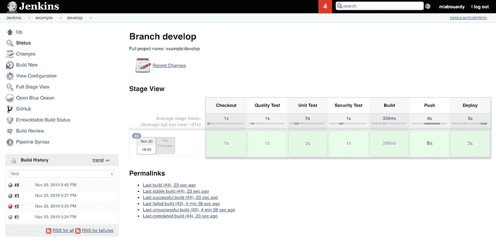

图 2.2 Jenkins Pipeline 阶段视图

你可以将这个 UI 进一步扩展，并安装 Blue Ocean 插件([`plugins.jenkins.io/blueocean/`](https://plugins.jenkins.io/blueocean/))，以便快速直观地理解 CI/CD 阶段，如图 2.3 所示。此插件需要 Jenkins 版本 2.7 或更高版本。

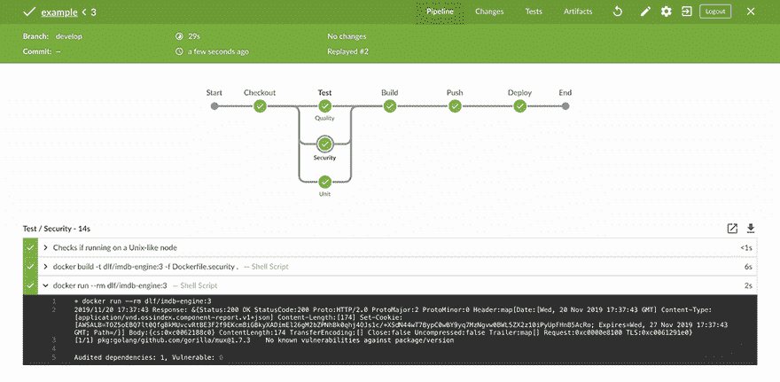

图 2.3 Blue Ocean 插件对管道的详细视图

注意：第五章介绍了如何安装和配置 Jenkins Blue Ocean 插件。

### 2.1.1 Blue Ocean 插件

你也可以通过点击红色的阶段来排查管道故障，轻松识别问题，而无需查看数千个输出日志。

在选择 Jenkins 时，用户界面是一个很大的担忧，许多用户认为它过时、不直观，当有多个项目时很难导航。这就是为什么 Jenkins 核心团队在 2017 年 4 月推出了 Blue Ocean，为 Jenkins 提供了一个新的、现代的用户体验。

Blue Ocean 是基于现代设计的新 Jenkins 用户体验，它允许用户图形化创建、个性化、可视化和诊断 CD 管道。它捆绑了 Jenkins Pipeline 插件，或作为单独的插件提供([www.jenkins.io/doc/book/blueocean/getting-started/](http://www.jenkins.io/doc/book/blueocean/getting-started/))。

注意：Jenkins 经典 UI 与其通常的 JENKINS_URL/jenkins 位置并排存在。Blue Ocean 插件可以通过在 Jenkins 服务器 URL 末尾附加`/blue`来获取。

你的团队中的任何人都可以通过几步点击创建一个 CI/CD 管道。Blue Ocean 与 Git 和 GitHub 无缝集成。它提示你输入凭证以访问 Git 服务器上的存储库，以便根据这些存储库创建管道（图 2.4）。

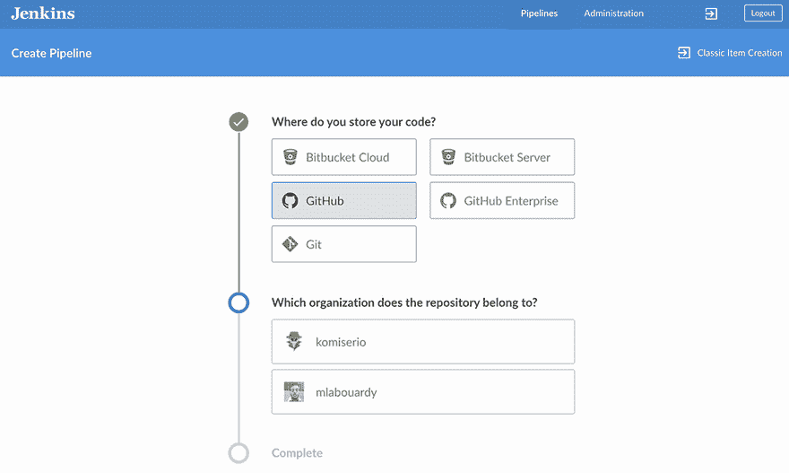

图 2.4 Blue Ocean 模式中的新管道

你还可以通过使用直观的视觉管道编辑器（图 2.5）从头到尾创建一个完整的 CI/CD 管道。这是一种编写管道原型和调试管道阶段的好方法，在生成可工作的 Jenkinsfile 之前。

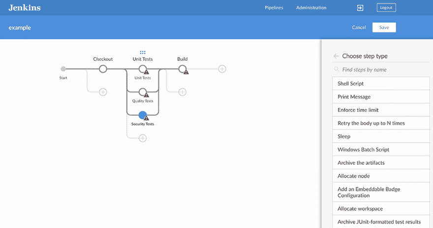

图 2.5 使用管道编辑器定义阶段

使用可视化编辑器创建的任何管道都可以在您喜欢的文本编辑器中进行编辑，从而带来 PaC 的所有好处。图 2.6 展示了 Windows 用户按 Ctrl-S 和 macOS 用户按 Command-S 按钮生成的管道脚本示例。

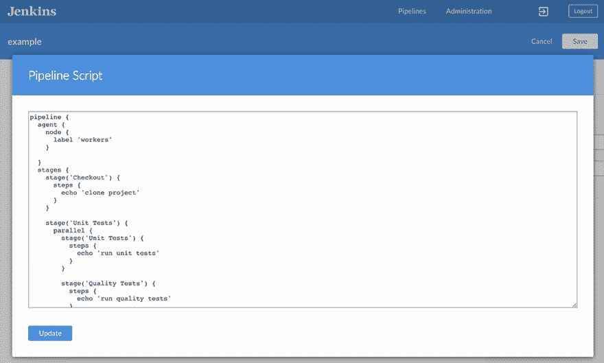

图 2.6 由管道编辑器生成的 Jenkinsfile。

您现在可以将内容复制并粘贴到名为 Jenkinsfile 的新文件中，并将其放置在代码仓库中的源代码旁边。或者，您可以直接从 Blue Ocean 编辑器上传文件，提供适当的描述和目标 Git 分支（图 2.7）。

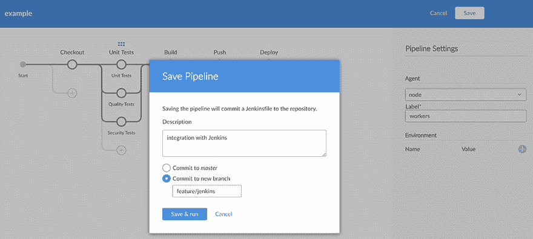

图 2.7 将 Jenkinsfile 提交到 Git 仓库。

文件提交后，管道将被触发，并执行管道中定义的阶段。

请记住，Blue Ocean 不支持 Jenkins 的所有功能，例如管理、节点管理或凭据设置。然而，您始终可以通过点击 Blue Ocean 导航栏右上角的退出图标切换回经典 Jenkins UI。

注意：这只是 Blue Ocean 主要功能的预览。在第七章中，我们将更深入地探讨每个功能。

现在您已经熟悉了 Jenkinsfile 的工作原理，让我们看看如何使用 Jenkins 编写自己的管道代码。Jenkins 2 允许两种结构和语法的风格来构建工作流程。这些被称为脚本和声明式管道。

### 2.1.2 脚本管道

*脚本管道*是编写管道代码的传统方式。在这个管道中，Jenkinsfile 是在 Jenkins UI 实例上编写的。管道步骤被包裹在一个节点块中（由开闭花括号表示）。在这里，节点指的是 *Jenkins 代理*（以前称为 *从属实例*）。

节点通过标签映射到 Jenkins 集群。*标签*只是一个标识符，当通过 Jenkins 的“管理节点”部分配置节点时添加，如图 2.8 所示。

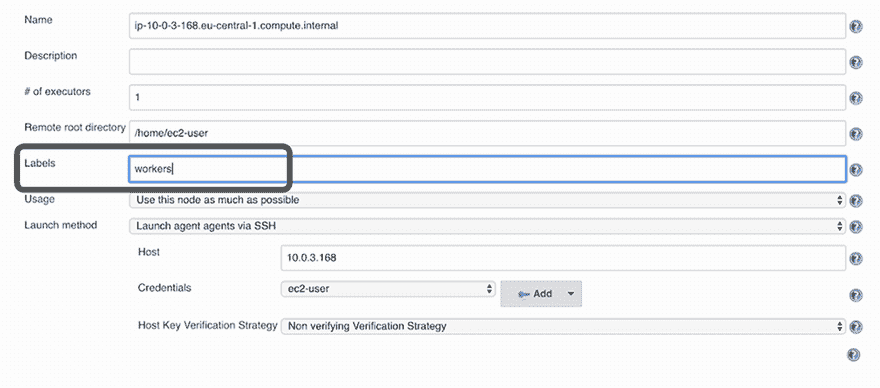

图 2.8 分配标签到 Jenkins 工作节点

注意：下一章将介绍 Jenkins 分布式模式的工作原理以及如何使用节点代理来从 Jenkins 转移工作。

节点块内的步骤可以包括并使用任何有效的 Groovy 代码。可以通过创建一个新的管道项目并在管道编辑器部分输入代码来定义管道，如图 2.9 所示。


图 2.9 使用内联 Jenkinsfile 与 Pipeline 脚本

虽然这个简单的节点块在技术上是一个有效的语法，但 Jenkins 管道通常具有更细粒度的级别——阶段。*阶段*是将管道划分为逻辑功能单元的一种方式。它还用于将步骤和 Groovy 代码分组在一起，以创建目标功能。图 2.10 展示了使用阶段的先前管道的示例。

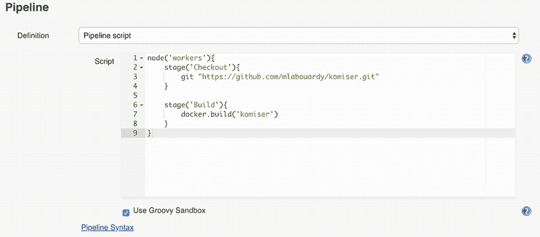

图 2.10 使用`stage`关键字定义逻辑单元

管道有两个阶段：

+   *检出*—用于克隆项目的 GitHub 仓库

+   *构建*—用于构建项目的 Docker 镜像

管道逻辑中有多少进入特定的阶段取决于开发者。然而，一般的做法是创建模仿传统管道各个部分的阶段。

脚本式管道使用基于 Groovy 的更严格的语法，因为它是在 Groovy 基础上构建的第一个管道。由于此 Groovy 脚本通常不适合所有用户，因此引入了声明式管道，以提供更简单、更灵活的 Groovy 语法。

注意：第十四章介绍了如何编写带有自定义 Groovy 脚本的共享 Jenkins 库，以实现代码模块化。

### 2.1.3 声明式管道

*声明式管道*是一个相对较新的功能（在 Pipeline 2.5 中引入，[`plugins.jenkins.io/workflow-aggregator`](https://plugins.jenkins.io/workflow-aggregator)），它支持 PaC 方法。它使得新 Jenkins 用户更容易阅读和编写管道代码。

此代码编写在 Jenkinsfile 中，可以将其检查到版本控制系统（VCS）中，如 SVN 或 SCM 系统，如 GitHub、GitLab、Bitbucket 或其他。图 2.11 是 GitHub 仓库根目录中存储的 Jenkinsfile 的一个示例。

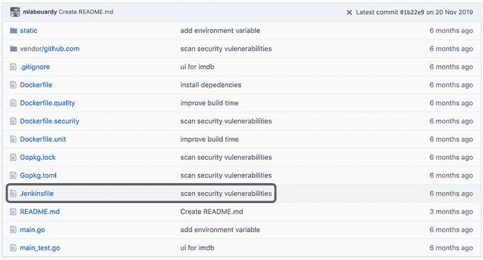

图 2.11 存储在源控制仓库中的 Jenkinsfile

在声明式语法中，您不能使用 Groovy 代码，如变量、循环或条件。您被限制在结构化部分/块和 DSL（Jenkins 领域特定语言）步骤中。

图 2.12 显示了脚本式和声明式管道之间的差异。声明式管道是受限的，并且具有明确的结构（例如，所有 DSL 语句都必须包含在`steps`指令中）。

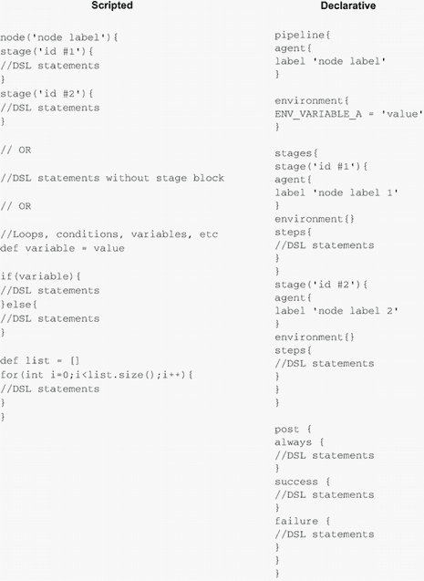

图 2.12 脚本式和声明式管道之间的差异

声明式管道提供了一种更严格的语法，因为每个管道都必须使用这些预定义的块属性或部分：

+   `agent`

+   `environment`

+   `post`

+   `stages`

+   `steps`

`agent`部分定义了管道将要执行的工作节点或机器。此部分必须在管道块内部的最顶层定义，或在阶段级别覆盖。代理可以是以下任何一种：

+   Jenkins 工作节点或节点（有关 Jenkins 上的分布式构建，请参阅第三章）

+   基于 Docker 镜像或自定义 Dockerfile 的 Docker 容器（在第九章中介绍）

+   部署在 Kubernetes 集群上的 Pod（在第十四章中介绍）

例如，您可以定义管道在自定义 Docker 容器上运行，如下所示。

列表 2.2 声明式管道代理定义

```
pipeline{
    agent {
        node {
            label 'workers'
        }

        dockerfile {
            filename 'Dockerfile'
            label 'workers'
        }

        kubernetes {
            label 'workers'
            yaml """
            kind: Pod
            metadata:
            name: jenkins-worker
            spec:
            containers:
            - name: nodejs
              image: node:lts
              tty: true
            """
        }
    }
}
```

注意：有关代理语法的更多信息，请参阅官方文档：[www.jenkins.io/doc/book/pipeline/syntax/](http://www.jenkins.io/doc/book/pipeline/syntax/)。

`environment`部分包含了一组运行管道步骤所需的环境变量。如果环境块在管道顶层定义，则这些变量将可用于所有步骤；否则，变量可以是阶段特定的。您还可以通过使用辅助方法`credentials()`来引用凭据变量，该方法以目标凭据的 ID 作为参数，如下面的列表所示。

列表 2.3 环境变量定义

```
pipeline{
    environment {
        REGISTRY_CREDENTIALS= credentials('DOCKER_REGISTRY')
        REGISTRY_URL = 'https://registry.domain.com'
    }

    stages {
        stage('Push'){
            steps{
                sh 'docker login $REGISTRY_URL --username $REGISTRY_CREDENTIALS_USR --password $REGISTRY_CREDENTIALS_PSW'
            }
        }
    }
}
```

通过引用`REGISTRY_CREDENTIALS_USR`和`REGISTRY_CREDENTIALS_PSW`环境变量，Docker 注册表的用户名和密码可以自动访问。然后，这些凭据被传递给`docker login`命令，在推送 Docker 镜像之前与 Docker 注册表进行身份验证。

`post`部分包含在管道或阶段运行完成后要运行的命令或脚本，具体取决于此部分在管道中的位置。然而，传统上，`post`部分应该放在管道的末尾。可以在`post`部分使用的命令示例包括提供 Slack 通知、清理作业工作空间以及根据构建状态执行后脚本。可以通过使用`currentBuild.result`变量或后置条件块`always`、`success`、`unstable`、`failure`等来获取管道构建状态。

以下列表是一个示例 Slack 通知。由`always`指令包裹的指令将无论构建状态如何都会运行，并且不会干扰最终状态。

列表 2.4 声明式管道中的构建后操作

```
pipeline{
    post {
        always {
            echo 'Cleaning up workspace'
        }
        success {
            slackSend (color: 'GREEN', message: \
                "${env.JOB_NAME} Successful build")
        }
        failure {
           slackSend (color: 'RED', message: "${env.JOB_NAME} Failed build")
        }
    }
}
```

此代码引用了`env.JOB_NAME`变量，它包含 Jenkins 作业的名称。

注意：第十章有专门的部分介绍如何使用 Jenkins 实现 Slack 通知。

`stages`部分是管道的核心。本部分定义了在高级别上要执行的操作。它包含了一系列针对 CI/CD 工作流程每个离散部分的更多阶段指令。

最后，`steps`部分包含了一系列在给定阶段指令中要执行的步骤。以下列表定义了一个`Test`阶段，其中包含运行单元测试和生成代码覆盖率报告的指令。

列表 2.5 在管道中运行自动化测试

```
pipeline{
    agent any
    stages {
        stage('Test'){
            steps {
                sh 'npm run test'
                sh 'npm run coverage'
            }
        }
    }
}
```

这些是在编写声明式管道时最常用的指令和部分。本书将涵盖更多指令。有关所有可用块的概述，请参阅 Pipeline 语法文档([www.jenkins.io/doc/book/pipeline/syntax/#stages](https://www.jenkins.io/doc/book/pipeline/syntax/#stages))。

声明性和脚本样式都可以用于在 Web UI 或使用 Jenkinsfile 中构建 CI/CD 管道。然而，通常认为将 Jenkinsfile 创建并提交到源代码控制仓库是一个最佳实践，以确保有一个单一的事实来源，并能够跟踪管道所经历的所有更改（审计）。

注意：在第七章至第十一章中，您将学习如何从头开始为各种应用程序架构编写脚本管道，以及如何将 Jenkinsfile 从脚本格式转换为声明性格式。

## 2.2 理解多分支管道

当您构建应用程序时，您必须将您的部署环境分开，以测试新更改而不影响生产。因此，为您的应用程序拥有多个环境是有意义的。为了能够实现这一点，您需要结构化您的代码仓库以使用多个分支，每个分支代表一个环境。例如，master 分支对应于当前的生产代码。

虽然如今随着云计算和 IaC 工具的采用，复制多个基础设施环境变得更加容易，但您仍然需要为每个目标分支配置 CI 工具。

幸运的是，在使用 Jenkinsfile 时，您的管道定义与应用程序代码源一起存储。Jenkins 将自动扫描应用程序代码仓库中的每个分支，并检查该分支是否有 Jenkinsfile。如果有，Jenkins 将自动在多分支管道项目中创建和配置一个子项目来运行该分支的管道。这消除了手动创建和管理管道的需求。

图 2.13 显示了在执行 Jenkinsfile 和源代码仓库后，多分支管道项目中的作业。Jenkins 自动扫描指定的仓库，并为包含 Jenkinsfile 的每个分支创建适当的项目。

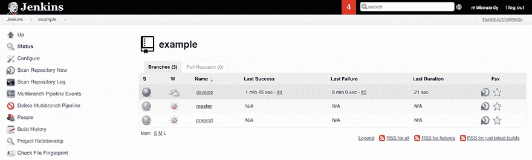

图 2.13 显示了 Jenkins 为每个带有 Jenkinsfile 的分支自动创建作业。

在图 2.13 中，每当 develop、preprod 或 master 分支中的任何分支发生新的代码更改时，Jenkins 都会触发构建。此外，每个分支可能具有不同的管道阶段。例如，您可能为 master 分支执行完整的 CI/CD 管道，而为 develop 分支仅执行 CI 管道（见图 2.14）。您可以使用多分支管道项目来实现这一点。

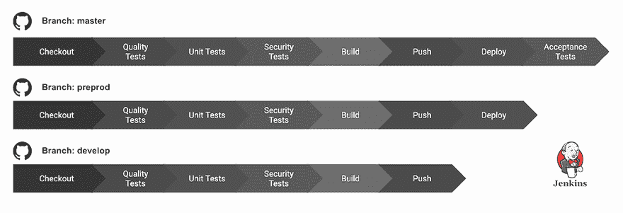

图 2.14 每个 Git 分支都可以有自己的 Jenkinsfile 阶段。

多分支管道还可以用于在合并到目标分支之前验证拉取请求。您可以配置 Jenkins 对应用程序代码执行预集成测试，如果测试失败，则阻止拉取请求合并，如图 2.15 所示。

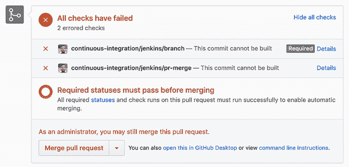

图 2.15 GitHub 拉取请求中的 Jenkins 构建状态

注意：第九章介绍了使用多分支管道来验证拉取/更改请求。

现在你已经熟悉了 Jenkins 多分支管道的基本知识，你必须遵循 Git 分支指南，以便在开发团队内部有一个共同的愿景和方法。那么，你应该为你的开发周期使用哪种 Git 分支策略？

## 2.3 探索 GitFlow 分支模型

存在几种 Git 分支策略。最有趣且使用最广泛的是 GitFlow。它包括以下基本分支：

+   *主分支*—一个对应当前生产代码的分支。除了热修复之外，你不能直接提交。可以使用 Git 标签来为主分支上的所有提交添加版本号（例如，你可以使用在[`semver.org/`](https://semver.org/)中详细说明的语义版本控制约定）。

+   *预生产*—一个发布分支，是生产的镜像。在将它们合并到主分支之前，可以用来测试在开发分支上开发的所有新功能。

+   *开发*—一个包含最新集成开发代码的开发集成分支。

+   *功能/X*—一个正在开发中的单个功能分支。每个新功能都位于自己的分支中，通常是从最新的开发分支创建的。

+   *热修复/X*—当你需要在生产代码中解决问题时，你可以使用热修复分支并为主分支打开一个拉取请求。这个分支基于主分支。

注意：在第七章到第十一章中给出了一个使用 GitFlow 与 Jenkins 多分支管道项目的完整示例。

Jenkins 中 GitFlow 的整体流程可以总结如下：

+   从主分支创建一个开发分支。

+   从开发分支创建一个预生产分支。

+   开发者基于开发分支创建一个新的功能分支。当功能完成时，创建一个拉取请求。

+   Jenkins 会自动运行此单个功能的预集成测试。如果测试成功，Jenkins 会将提交标记为成功。然后，开发团队将审查更改并将新功能分支的拉取请求合并到开发分支，并删除功能分支。

+   将在开发分支上触发构建，并将更改部署到沙盒/开发环境。

+   创建一个拉取请求以将开发分支合并到预生产分支。

+   当开发分支合并到预生产分支时，管道将在管道完成后触发将新功能部署到预发布环境。

+   一旦发布开始验证，预生产分支将被合并到主分支，并在用户批准后，将更改部署到生产环境。

+   如果在生产中检测到问题，将从一个主分支创建一个热分支。一旦热修复完成，它将被合并到开发和主分支。

注意：您可以使用 Git 命令行周围的 GitFlow 包装器（在多个操作系统上可用）来创建包含所有所需分支的项目蓝图。

图 2.16 总结了 GitFlow 的工作方式。

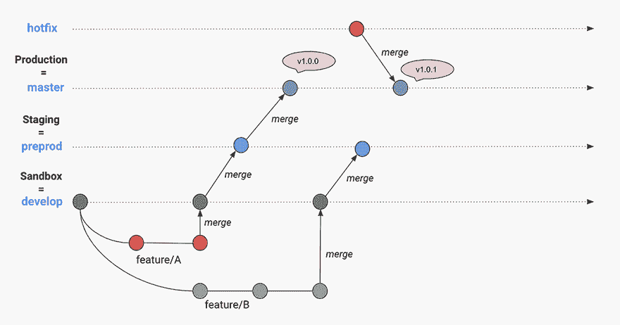

图 2.16 GitFlow 分支概述

GitFlow 并不能解决所有关于分支的问题。但是，当在大团队中工作时，它提供了一个更合理的分支结构和优秀的流程组织模型。此外，许多功能分支是并发开发的，这使得并行开发变得容易。对于较小项目（和较小团队），GitFlow 可能有些过度。因此，在接下来的章节中，我们通常会使用三个主要分支：

+   *主*分支，用于存储官方发布历史和在生产环境中运行的应用程序的源代码

+   *预生产*分支，用于存储在预发布环境中运行的新集成功能和准备合并到主分支的内容

+   *开发*分支，用于最新交付的开发更改和沙盒环境中运行的应用程序的镜像

## 2.4 使用 Jenkins 进行测试驱动开发

使用 Jenkinsfile 有一个潜在的缺点：当您在外部文件中工作而不是在 Jenkins 服务器环境中时，可能更难在前期发现问题。处理这个问题的一个方法是在 Jenkins 服务器上首先作为一个管道项目开发代码。然后，您可以在之后将其转换为 Jenkinsfile。

您还可以像本章前面所看到的那样，使用 Blue Ocean 模式作为游乐场，从头开始使用现代直观的管道编辑器设置 Jenkinsfile。测试新管道的另一种方法是声明性管道 lint 器应用程序，您可以在 Jenkins 之外运行它，以提前检测问题。

### 2.4.1 Jenkins 回放按钮

有时，当在 Jenkins 作业上工作时，您可能会发现自己陷入提交 Jenkinsfile、推送它并反复运行作业的循环。这可能是一个耗时且繁琐的工作流程，尤其是如果您的构建时间本身就很长。此外，您的 Git 历史记录将被垃圾提交（不必要的调试提交）填满。

如果您能在“沙盒”中修改您的 Jenkinsfile 并实时在系统上测试 Jenkinsfile，会怎么样？一个巧妙的小功能允许您修改 Jenkins 文件并重新运行作业。您可以反复进行，直到对结果满意，然后提交工作状态的 Jenkinsfile 而不会破坏任何东西。

现在，这要容易一些。如果您有一个没有按照预期进行构建的 Pipeline 构建，您可以使用构建侧边栏中的回放按钮，如图 2.17 所示。

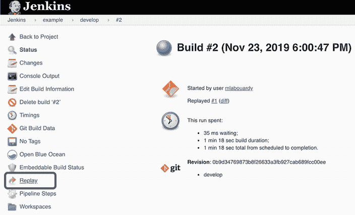

图 2.17 使用回放按钮重新运行构建

它与重建按钮有些相似，但允许你在运行作业之前编辑 Jenkinsfile 的内容。因此，你可以使用 UI 中的内置 Jenkinsfile 块（图 2.18），在提交到源代码控制（如 GitHub）之前测试你的管道。


图 2.18 在重新播放管道之前更新 Jenkinsfile

你可以更改你的管道代码并点击运行按钮重新运行作业。一旦你对更改满意，你就可以更新 Jenkinsfile 并应用更改，然后将它们提交到你的源代码管理（SCM）。

重放按钮功能允许快速修改和执行现有的管道，而无需更改管道配置或创建新的提交。这对于快速迭代和原型设计管道非常理想。

### 2.4.2 命令行管道检查器

对于高级用户，你可以使用 Jenkins RESTful API 通过发出如图 2.19 所示的参数的 HTTP/HTTPS POST 请求来验证 Jenkinsfile 的语法。

注意：为了在启用了跨站请求伪造（CSRF）保护的 Jenkins 服务器上使 API 端点工作，你需要请求一个 crumb 发行者并将其包含在发出的 HTTP 请求的 Authorization 头中。要生成这个 crumb，你需要请求以下 URL：JENKINS_URL/jenkins/crumbIssuer/api/json。

图 2.19 是使用 Jenkins Linter API 验证 Jenkinsfile 语法的示例。在这个例子中，我们使用了 Postman，并且 Jenkinsfile 表单数据已从开发机器加载。

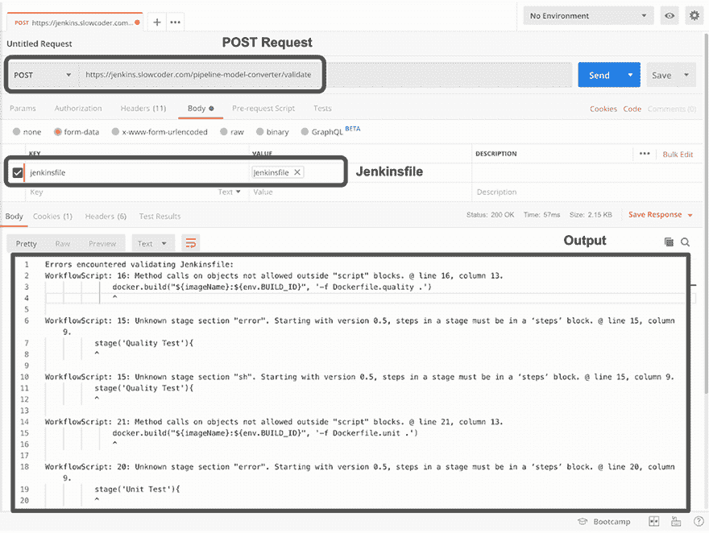

图 2.19 使用 Jenkins Linter API 的示例

API 响应将返回错误和警告，这可以在开发过程中节省时间，并允许你在编写 Jenkinsfile 时遵循最佳实践。

支持指定真实密码，但出于泄露密码的风险以及人们倾向于在不同地方重复使用相同密码的倾向，这并不推荐。验证 Jenkinsfile 的另一种方法是，从终端会话中运行以下命令（大多数操作系统都可用 cURL）：

```
curl -X POST -L --user USERNAME:TOKEN JENKINS_URL/pipeline-model-converter/validat.
-F "jenkinsfile=<Jenkinsfile"
```

注意：第七章介绍了从 Jenkins Web 仪表板创建 Jenkins API 令牌的另一种方法。

Jenkins 命令行界面（CLI），[www.jenkins.io/doc/book/managing/cli/](http://www.jenkins.io/doc/book/managing/cli/)，也可以使用`declarative-lint`选项在命令行中检查声明式管道，在真正运行之前。你可以通过 SSH 使用以下命令来检查 Jenkinsfile：

```
ssh -p $JENKINS_SSHD_PORT $JENKINS_HOSTNAME declarative-linter < Jenkinsfile
```

根据你运行 Jenkins 的 URL 和端口替换`JENKINS_HOSTNAME`和`JENKINS_SSHD_PORT`变量。如果你在自己的机器上运行 Jenkins，也可以使用 localhost 作为 URL。

### 2.4.3 IDE 集成

Jenkins CLI 或 API 在编写 Jenkinsfile 时减少了周转时间，但它的使用也有其不便之处。你需要像 SSH 这样的工具来连接到你的 Jenkins 服务器，并且你需要记住正确的命令来验证你的 Jenkinsfile。

幸运的是，你可以在你喜欢的集成开发环境（IDE）上安装扩展来自动化验证过程。例如，在 Visual Studio Code (VSCode) 中，你可以从市场安装 Jenkins Validation Linter。这个扩展，如图 2.20 所示，通过将 Jenkinsfile 发送到 Jenkins 服务器的 Pipeline Linter 端点来验证 Jenkinsfile。

注意：类似扩展和包可用于验证 Eclipse、Atom 和 Sublime Text 的 Jenkinsfile。

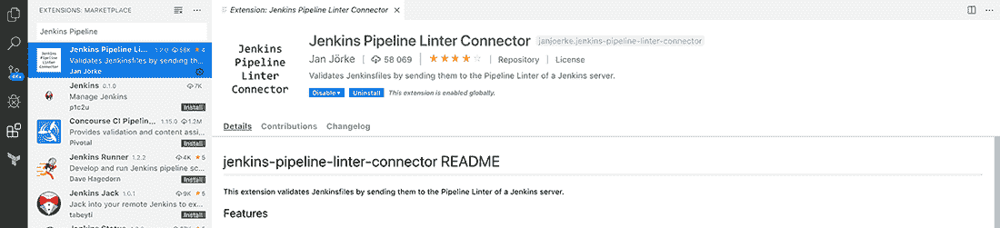

图 2.20 VSCode 的 Jenkins Pipeline Linter 扩展

一旦安装了扩展，你必须通过点击顶部导航栏中的“首选项”，然后选择“设置”，提供 Jenkins 服务器设置，包括服务器 URL（格式如下：JENKINS_URL/pipeline_model_converter/validate）和凭据（Jenkins 用户名和密码，或者如果启用了 CSRF 保护，则为令牌）。

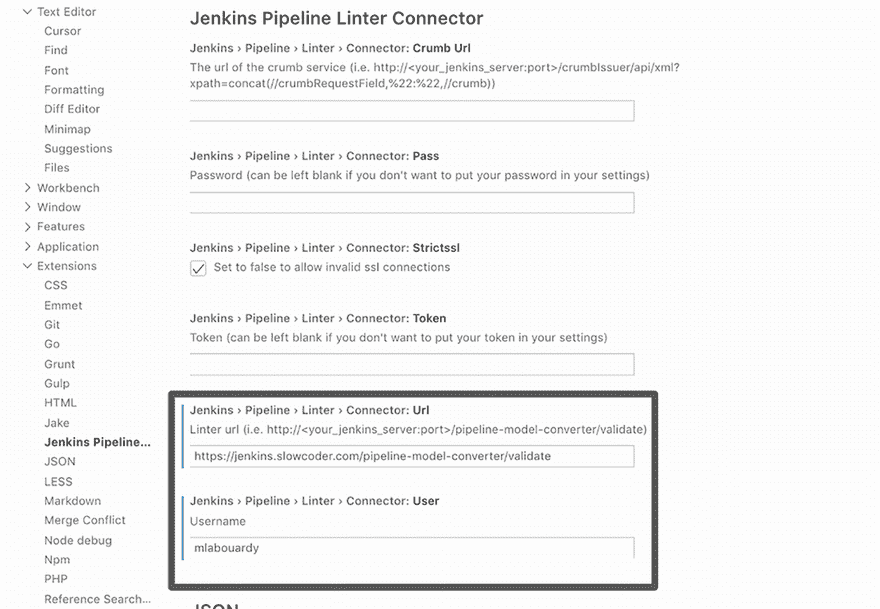

图 2.21 Jenkins Pipeline Linter 配置

一旦配置了设置，你可以在命令面板搜索栏中输入“验证 Jenkinsfile”命令（关键字快捷键 ⇧⌘P），如图 2.22 所示。

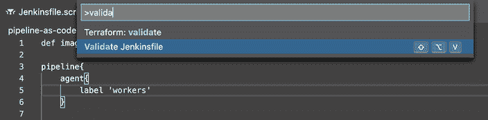

图 2.22 VSCode 命令面板

检查器将在终端中报告管道验证结果，如图 2.23 所示。

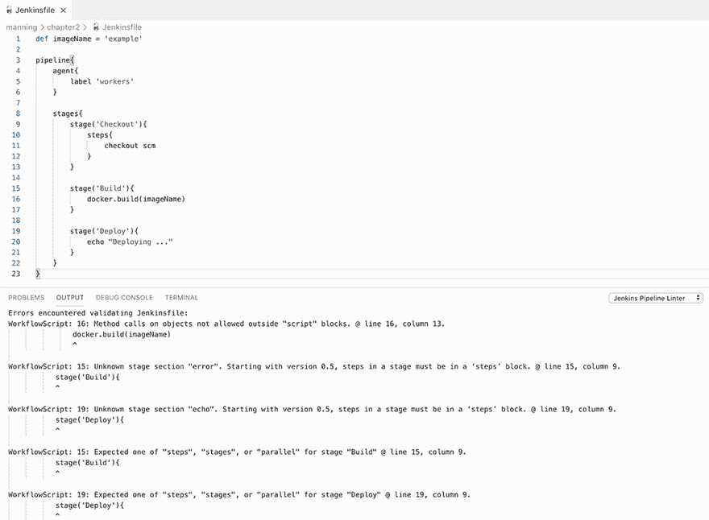

图 2.23 Jenkins Linter 输出示例

注意：在第八章中，你将学习如何为 CI 管道编写单元测试，并使用 Jenkins Pipeline Unit ([`github.com/jenkinsci/JenkinsPipelineUnit`](https://github.com/jenkinsci/JenkinsPipelineUnit)) 测试框架在本地模拟管道执行器。

## 摘要

+   基础设施即代码影响了 CI/CD 工具，使其接受管道即代码的概念。

+   Jenkinsfile 使用 Groovy 语法，并利用共享的 Jenkins 库来自定义 CI/CD 工作流程。

+   声明式管道鼓励声明式编程模型。脚本式管道遵循更命令式的编程模型。

+   蓝海编辑器可以简化新 Jenkins 管道的快速和轻松设置，最小化麻烦。

+   功能分支工作流程促进了拉取请求和更高效的协作。

+   GitFlow 为生产提供了专门的通道，以进行热修复，而不会中断其他工作流程或等待下一个发布周期。

+   Jenkins UI、回放按钮和代码检查器可以用来在提交到源代码控制之前测试新的管道，从而帮助你避免大量不必要的调试提交。
