# 5 使用 Terraform 发现 Jenkins 作为代码

本章涵盖

+   介绍基础设施即代码 (IaC)

+   使用支持基础设施即代码 (IaC) 的 HashiCorp Terraform

+   在安全的私有网络中部署 Jenkins

+   使用 AWS Auto Scaling 动态扩展 Jenkins 工作节点

在上一章中，我们使用了 HashiCorp Packer 来创建自定义 Jenkins 机器镜像；在本章中，我们将使用这些镜像（图 5.1）来部署机器。为此，我们将编写我们希望存在的 Jenkins 基础设施声明性定义，并使用自动化工具在给定的基础设施即服务 (IaaS) 提供商上部署资源。

在过去，管理 IT 基础设施是一项艰巨的工作。系统管理员必须手动管理和配置所有必需的硬件和软件，以便应用程序运行。然而，近年来，情况发生了巨大变化。云计算等趋势彻底改变并改善了组织设计、开发和维护 IT 基础设施的方式。这一趋势的关键组成部分之一被称为基础设施即代码。

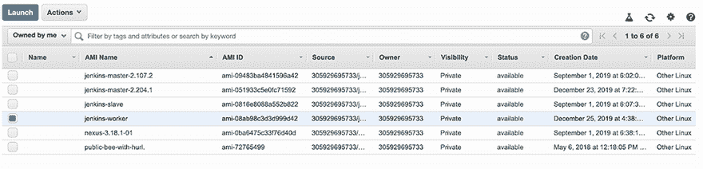

图 5.1 Jenkins 自定义机器镜像

## 5.1 介绍基础设施即代码

*基础设施* *即代码* (IaC) 允许您通过使用配置文件来管理您的基础设施。这降低了成本，减少了风险，并在云上更快地部署资源。另一个好处是，您的基础设施变得可测试、可重复、自我修复、幂等，最重要的是，易于理解，因为您的基础设施代码本质上将是您的文档。

可用几种 IaC 工具，每种都有自己的实现（图 5.2）。一些工具专注于特定的云，包括 AWS CloudFormation ([`aws.amazon.com/cloudformation/`](https://aws.amazon.com/cloudformation/))、Azure Resource Manager ([`azure.microsoft.com/features/resource-manager/`](https://azure.microsoft.com/features/resource-manager/))、OpenStack Heat ([`wiki.openstack.org/wiki/Heat`](https://wiki.openstack.org/wiki/Heat)) 和 Google Cloud Deployment Manager ([`cloud.google.com/deployment-manager`](https://cloud.google.com/deployment-manager))。其他工具试图连接所有云提供商并屏蔽它们的语义差异，以提供云无关的实现。这一类别包括 HashiCorp Terraform、HashiCorp Vagrant、Chef Provisioning 和 Pulumi。

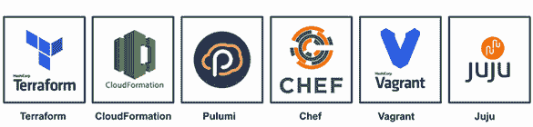

图 5.2 基础设施即代码工具

在本书中，我们将专注于使用 HashiCorp Terraform 来部署 Jenkins 组件。Terraform 提供了灵活的资源和服务提供者抽象，平台无关，并支持多个 IaaS 提供商，如 AWS、Microsoft Azure、Google Cloud Platform 和 DigitalOcean。此外，Terraform 是开源的，并附带简单统一的语法，对于新用户来说没有陡峭的学习曲线，并且对于任何基础设施部署用例都有易于访问的在线资源。

注意：配置管理工具如 Ansible 和 Puppet 是为了在现有服务器上安装和管理配置而构建的。Terraform 专注于服务器的引导和初始化以及其他基础设施资源。

在接下来的几节中，您将学习如何使用 Terraform 在 AWS 上部署 Jenkins 集群。

### 5.1.1 Terraform 使用

Terraform 使用推送方法：开发者或运维工程师在模板文件中描述所需的架构，Terraform 通过其 API 直接与云服务提供商交互。例如，如果目标云服务提供商是 AWS，Terraform 使用 Terraform AWS 提供商插件 ([`registry.terraform.io/providers/hashicorp/aws/latest`](https://registry.terraform.io/providers/hashicorp/aws/latest))，它底层使用 AWS 官方 SDK 来创建/更新或销毁资源。

为了维护基础设施的期望状态并检测变更，Terraform 生成一个名为 terraform.tfstate 的 JSON 文件，该文件存储了您管理的基础设施和配置的状态。Terraform 使用差异技术来在任何操作之前检测变更。因此，个人和团队可以安全且可预测地更改基础设施。

Terraform 本身是一个 CLI 工具，可以从其官方发布页面 ([www.terraform.io/downloads.html](http://www.terraform.io/downloads.html)) 下载，如图 5.3 所示，通过安装适用于您操作系统和架构的二进制文件。它支持所有主要操作系统。Windows、macOS 以及任何 Linux 发行版都支持 32 位和 64 位版本。

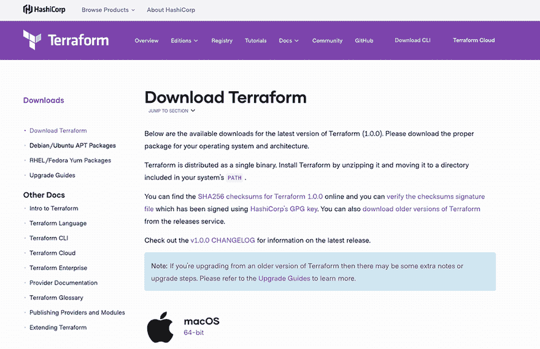

图 5.3 Terraform 下载页面

下载 zip 压缩文件后，将其解压到任何方便的文件夹中。请确保此文件夹包含在您的 `PATH` 环境变量中。要检查 Terraform 是否正确安装，请执行以下命令：

```
terraform --version
```

注意：在编写本书时，HashiCorp Terraform 的最新稳定版本是 1.0.0。

如果您得到类似 `Terraform vX.Y.Z` 的输出，恭喜！您已成功安装 Terraform。我们现在可以编写 Terraform 模板文件了。

## 5.2 部署 AWS VPC

如第三章所述，我们的 Jenkins 集群将部署在 VPC 内的私有子网中；请参阅图 5.4。我们可以将集群部署在 AWS 创建的默认 VPC 中。然而，为了完全控制网络拓扑，我们将从头创建一个 VPC，以将 Jenkins 集群与我们将在高级章节中部署的应用程序工作负载隔离开来。以下方案总结了目标 VPC 架构：

注意：为了理解 Amazon VPC 术语（子网、安全组、路由表等），请参阅第三章。

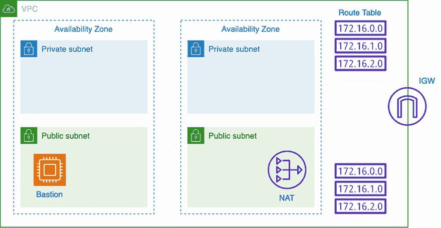

图 5.4 AWS 虚拟专用云架构

从本质上讲，这个 VPC 将被划分为子网。一些子网将是公共的，可以访问互联网；而一些将是私有的。然后，我们定义子网之间的路由规则，允许流量通过互联网网关或 NAT 网关进行传输。我们还将部署一个堡垒主机，以便能够 SSH 到 Jenkins 的私有实例，而无需将其暴露给公众。

### 5.2.1 AWS VPC

Terraform 使用一种称为 *HashiCorp 配置语言* (HCL) 的 DSL，这是一种声明性语言，用于描述基础设施资源。这些资源以 .tf 扩展名的简单文本文件进行描述。

我们不会编写一个大型的模板文件，而是将采用模块化开发方法，并将 Jenkins 集群部署拆分为多个模板文件。每个文件负责部署目标基础设施的一个组件或 AWS 资源。首先，创建一个包含以下内容的 terraform.tf 文件：

```
provider "aws" {
  region                  = var.region
  shared_credentials_file = var.shared_credentials_file
  profile                 = var.aws_profile
}
```

注意：在本章的其余部分，Terraform 将本地存储状态，这对于团队协作来说并不理想，因为状态可能包含敏感信息（如果您计划使用版本控制系统进行版本控制）。我建议使用远程后端，如 Amazon S3 来存储状态。

为了使 Terraform 能够与 IaaS 交互，它需要配置一个提供程序。在前面的代码块中，我们定义了 AWS 作为提供程序，并配置了与 AWS API 交互所需的凭据，以便随后创建 AWS 资源。AWS 提供程序支持多种身份验证方法：

+   通过在 `aws` 提供程序块中内联提供 `access_key` 和 `secret_key` 属性来提供静态凭据。

+   通过 `AWS_ACCESS_KEY_ID` 和 `AWS_SECRET_ACCESS_KEY` 变量提供环境变量。

+   默认情况下，位于 Linux 和 macOS 的 ~/.aws/credentials 文件以及 Windows 用户的 %USERPROFILE%\.aws\credentials 文件中的共享凭据文件。默认情况下，Terraform 将检查这些位置，但您可以通过提供 `shared_credentials_file` 属性在配置中指定不同的位置。此外，如果您在凭据文件中定义了多个配置文件，您可以通过设置 `profile` 属性通过 `AWS_PROFILE` 环境变量来指定要使用的配置文件。

+   如果你从 EC2 实例使用 Terraform，则需要一个 EC2 IAM 实例配置文件。Terraform 将从实例的元数据中获取临时访问令牌。当在 EC2 实例中运行时，这是一种比前面策略更受欢迎的方法，因为它可以避免硬编码凭证。

接下来，我们将在 vpc.tf 文件中声明一个 AWS VPC 资源。以下代码片段使用 CIDR 块 10.0.0.0/16 为 VPC，但您可以选择不同的 CIDR 块：

```
resource "aws_vpc" "default" {
  cidr_block           = var.cidr_block
  enable_dns_hostnames = true

  tags {
    Name   = var.vpc_name
    Author = var.author
  }
}
```

注意：所有可用的 AWS 资源都可以在 Terraform AWS 文档中找到，请参阅[www.terraform.io/docs/providers/aws/index.html](http://www.terraform.io/docs/providers/aws/index.html)。

注意使用变量而不是硬编码的值来创建可重用的资源（可移植性）并允许用户在运行时覆盖它们。我们将在 variables.tf 文件中定义变量列表，如下所示。

列表 5.1 Terraform 变量文件

```
variable "region" {
  description = "AWS region"
  type = string
}

variable "cidr_block" {
  description = "VPC CIDR block"
  default     = "10.0.0.0/16"
}
```

Terraform 变量是通过`variable`块创建的。它们有一个名称，以及可选的类型、默认值和描述参数。表 5.1 提供了变量的完整列表。

表 5.1 VPC 的 Terraform 变量

| 变量 | 类型 | 值 | 描述 |
| --- | --- | --- | --- |
| `region` | 字符串 | None | 部署 VPC 的区域名称，例如`eu-central-1`。 |
| `shared_credentials_file` | 字符串 | `~/.aws/credentials` | 共享凭证文件的路径。如果未设置且指定了配置文件，则使用`~/.aws/credentials`。 |
| `aws_profile` | 字符串 | `profile` | 在共享凭证文件中设置的 AWS 配置文件名称。 |
| `cidr_block` | 字符串 | `10.0.0.0/16` | VPC 的 CIDR 块。允许的块大小介于/16 子网掩码（65,536 个 IP 地址）和/28 子网掩码（16 个 IP 地址）之间。 |
| `vpc_name` | 字符串 | `management` | 确保您的 VPC 使用适当的命名来标记，以便更有效地管理，并遵循 AWS 资源标记最佳实践。 |
| `author` | 字符串 | None | VPC 的所有者名称。这是可选的，但建议您对 AWS 资源进行标记，以便按所有者或环境跟踪月度成本。 |

在运行 Terraform 之前，我们需要安装 Terraform 的 AWS 插件。您可以通过执行以下命令来完成此操作：

```
terraform init
```

这将安装 AWS 提供者插件并初始化一个新的配置：

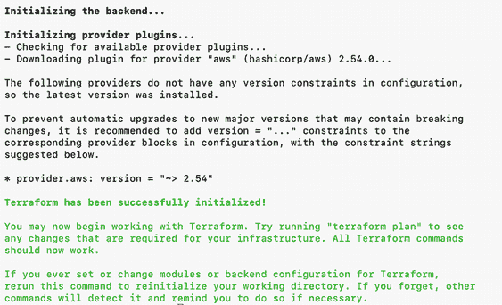

注意：为了能够使用本章中的 Terraform 示例，请将 VPCFullAccess 策略添加到与 Terraform 关联的 IAM 用户。

使用以下命令生成将要应用的变化的执行计划（用于干运行）：

```
terraform plan --var-file="variables.tfvars"
```

当运行`terraform plan`时，您可以使用`-var`选项在命令行上指定单个变量。然而，由于我们需要设置很多变量，使用名为 variables.tfvars 的变量定义文件会更方便和实用。

此文件包含在 variables.tf 文件中声明的动态变量，例如 AWS 区域和凭证文件。任何你定义了值的变量都需要存在于 variables.tf 中，如下所示。

列表 5.2 Terraform 动态变量

```
region="YOUR AWS REGION"
shared_credentials_file="PATH TO .aws/credentials FILE"
aws_profile="AWS PROFILE"
author="AUTHOR NAME"
```

注意：如果你将变量定义文件命名为 terraform.tfvars 或 terraform.tfvars.json，它们将被 Terraform 自动加载。

你也可以从环境变量中加载变量。Terraform 将解析任何以`TF_VAR`为前缀的环境变量。例如，如果 Terraform 找到一个名为`TF_VAR_aws_profile`的环境变量，它将使用其值作为`aws_profile`变量的字符串值。

`terraform plan`命令将显示目标计划，这在提前验证更改和避免不希望的变化方面特别有用。输出应该看起来像这样：

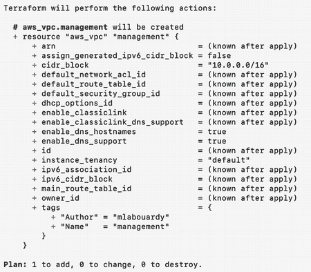

注意：我强烈建议加密状态和计划文件，因为它们可能存储机密信息。

我们可以看到将创建一个资源。现在我们放心了，Terraform 将会做正确的事情！我们可以使用以下命令应用更改：

```
terraform apply --var-file="variables.tfvars"
```

输入`yes`以应用操作，Terraform 将创建 AWS VPC 资源：

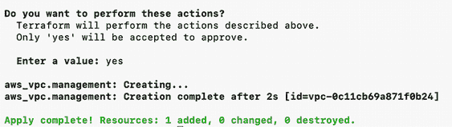

在 AWS VPC 仪表板上，你应该看到一个新的 VPC，名为*management*，并创建了 10.0.0.0/16 CIDR 块，如图 5.5 所示。

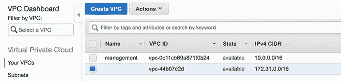

图 5.5 AWS VPC 仪表板

太棒了——我们有一个定制的 VPC！

### 5.2.2 VPC 子网

创建一个 VPC 是不够的；为了能够在这个隔离的网络中放置 Jenkins 实例，我们还需要一个子网。这个子网属于之前创建的 VPC，因此我们在创建它时必须传递一个 VPC ID。不过，我们不需要硬编码它。Terraform 通过插值语法允许我们通过其 ID 引用任何其他资源。

创建一个 subnets.tf 文件，其中包含两个公共子网和两个私有子网，分别位于不同的可用区以实现弹性，如下所示。每个子网都有自己的 CIDR 块，它是 VPC CIDR 块的子集。

列表 5.3 VPC 子网

```
resource "aws_subnet" "public_subnets" {
  vpc_id                  = aws_vpc.management.id
  cidr_block              = "10.0.${count.index * 2 + 1}.0/24"            ❶
  availability_zone       = element(var.availability_zones, count.index)  ❶
  map_public_ip_on_launch = true                                          ❷

  count = var.public_subnets_count

  tags = {
    Name   = "public_10.0.${count.index * 2 + 
              1}.0_${element(var.availability_zones, count.index)}"       ❸
    Author = var.author
  }
}

resource "aws_subnet" "private_subnets" {
  vpc_id                  = aws_vpc.management.id
  cidr_block              = "10.0.${count.index * 2}.0/24"
  availability_zone       = element(var.availability_zones, count.index)
  map_public_ip_on_launch = false

  count = var.private_subnets_count

  tags = {
    Name   = "private_10.0.${count.index * 2}.0_${element(var.availability_zones, count.index)}"
    Author = var.author
  }
}
```

❶ `count.index`变量具有独特的索引号（从 0 开始），用于在 10.0.0.0/16 范围内构建唯一的 CIDR 块

❷ 指定 true 以指示在子网中启动的实例应分配一个公共 IP 地址

❸ 为子网提供一个唯一的名称；例如，public_10.0.0.0_eu-central-1

代码使用`count`属性进行插值，为我们提供了一个参数化的子网。有了这个，我们可以使用如`10.0.${count.index*2+1}.0/24`之类的表达式来计算子网 CIDR 块。你也可以使用`cidrsubnet(prefix, newbits, netnum)`方法来计算 VPC CIDR 块内的子网地址。（有关更多详细信息，请参阅[`mng.bz/WBj0`](http://mng.bz/WBj0)上的文档。）

在 variables.tf 文件中将子网默认数量设置为 2，并定义子网所在的可用区作为变量。（您可以使用 `aws ec2 describe-availability-zones` 命令查看 AWS 区域内的可用区。）表 5.2 提供了 Terraform 变量的完整列表。

表 5.2 子网 Terraform 变量

| 变量 | 类型 | 值 | 描述 |
| --- | --- | --- | --- |
| `availability_zones` | 列表 | 无 | 启动 VPC 子网可用区的列表 |
| `public_subnets_count` | 数字 | 2 | 要创建的公共子网数量 |
| `private_subnets_count` | 数字 | 2 | 要创建的私有子网数量 |

运行 `terraform plan` 命令以生成操作计划。这验证了将应用于当前基础设施的配置：

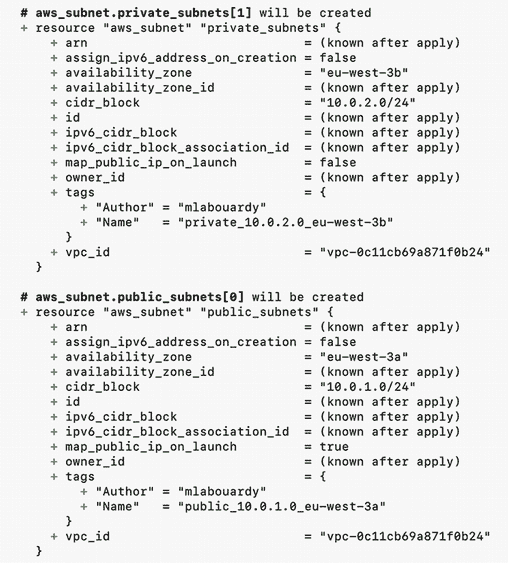

如果您对部署计划感到满意，请使用 `terraform apply` 命令应用配置。子网应创建在 VPC 内，如图 5.6 所示。

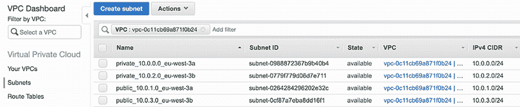

图 5.6 VPC 的公共和私有子网

在创建 VPC 和子网之后，您需要创建私有和公共路由表以定义 VPC 子网中的流量路由机制。

### 5.2.3 VPC 路由表

如前所述，VPC 的典型配置将其分为公共和私有子网。为了让部署在私有子网中的实例能够访问互联网而不暴露在公共网络中，我们将创建私有和公共路由表以进行细粒度的流量控制。

创建一个 public_rt.tf 文件，定义一个互联网网关资源，并将其附加到之前创建的 VPC：

```
resource "aws_internet_gateway" "igw" {
  vpc_id = aws_vpc.management.id

  tags = {
    Name   = "igw_${var.vpc_name}"
    Author = var.author
  }
}
```

在 public_rt.tf 文件中，定义一个公共路由表和一个将所有流量（0.0.0.0/0）指向互联网网关的路由：

```
resource "aws_route_table" "public_rt" {
  vpc_id = aws_vpc.management.id

  route {
    cidr_block = "0.0.0.0/0"
    gateway_id = aws_internet_gateway.igw.id
  }

  tags = {
    Name   = "public_rt_${var.vpc_name}"
    Author = var.author
  }
}
```

到目前为止，公共路由表尚未与任何子网关联。您需要将其与 VPC 中的公共子网关联，以便来自这些子网的流量被路由到互联网网关：

```
resource "aws_route_table_association" "public" {
  count          = var.public_subnets_count
  subnet_id      = element(aws_subnet.public_subnets.*.id, count.index)
  route_table_id = aws_route_table.public_rt.id
}
```

注意：我建议在用 Terraform 部署资源之前生成执行计划，以避免 Terraform 操作基础设施时出现任何意外。

一旦您使用 `terraform apply` 应用 Terraform 变更，请转到 VPC 仪表板并跳转到路由表部分。您应该看到公共路由表，如图 5.7 所示。

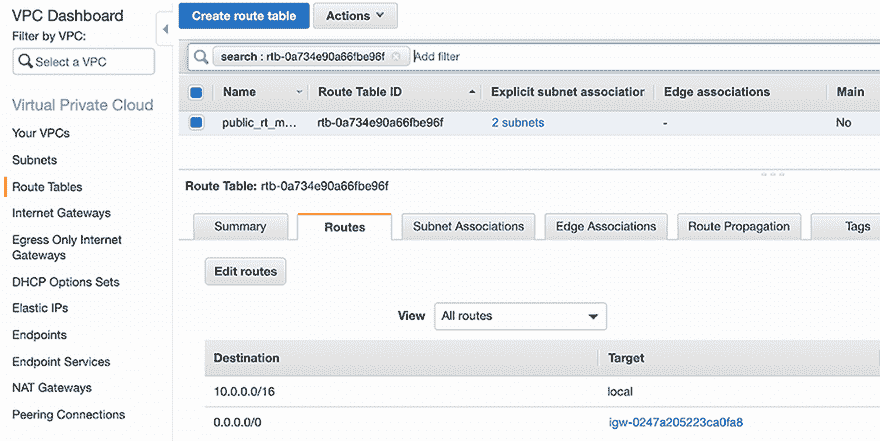

图 5.7 VPC 的公共路由表

在创建公共路由表后，继续创建私有路由表。

创建一个 private_rt.tf 文件，并在公共子网内定义一个 NAT 网关资源，以使稍后将在私有子网中部署的 Jenkins 实例能够连接到互联网。然后，将弹性 IP 地址与 NAT 网关关联，如下所示。

列表 5.4 VPC NAT 网关

```
resource "aws_eip" "nat" {
  vpc = true

  tags = {
    Name   = "eip-nat_${var.vpc_name}"
    Author = var.author
  }
}

resource "aws_nat_gateway" "nat" {
  allocation_id = aws_eip.nat.id
  subnet_id     = element(aws_subnet.public_subnets.*.id, 0)

  tags = {
    Name   = "nat_${var.vpc_name}"
    Author = var.author
  }
}
```

在同一文件中，创建一个具有将所有流量（0.0.0.0/0）转发到您创建的 NAT 网关 ID 的私有路由表，如下所示。

列表 5.5 私有路由表

```
resource "aws_route_table" "private_rt" {
  vpc_id = aws_vpc.management.id

  route {
    cidr_block     = "0.0.0.0/0"
    nat_gateway_id = aws_nat_gateway.nat.id
  }
  tags = {
    Name   = "private_rt_${var.vpc_name}"
    Author = var.author
  }
}
```

注意：如果您更喜欢管理 NAT 实例，可以将指向 NAT 网关的当前路由替换为指向 NAT 实例的路由。

最后，使用以下代码块将私有子网分配给私有路由表：

```
resource "aws_route_table_association" "private" {
  count          = var.private_subnets_count
  subnet_id      = element(aws_subnet.private_subnets.*.id, count.index)
  route_table_id = aws_route_table.private_rt.id
}
```

弹性 IP 地址是一个静态的公共 IPv4 地址，因此通过快速将地址重新映射到另一个 NAT 网关来掩盖 NAT 网关的故障可能是有用的。

使用`terraform apply`应用基础设施更改。应创建一个私有路由表，如图 5.8 所示。

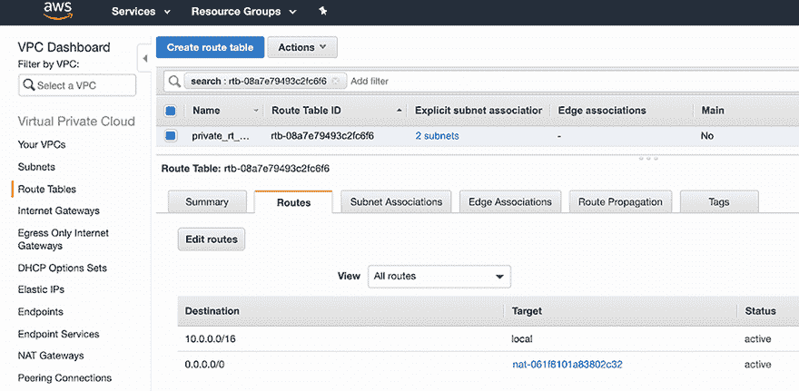

图 5.8 VPC 的私有路由表

应创建一个额外的路由表规则，将互联网流量指向 NAT 网关。这使私有子网中的 Jenkins 实例能够访问互联网。

我们的 Jenkins 集群将部署在私有子网中。因此，实例不会从互联网公开访问（因为集群没有公共 IP）。为了安全地访问 Jenkins 实例，我们将部署一个堡垒主机。

注意：如果您设置了类似 OpenVPN Access Server 的远程访问虚拟专用网络（VPN），则可以跳过此解决方案。有关说明，请参阅官方指南[`openvpn.net/aws-video-tutorials/byol/`](https://openvpn.net/aws-video-tutorials/byol/)。

### 5.2.4 VPC 堡垒主机

一个*堡垒主机*，也称为*跳板机*，通过一个受控的入口点提供对位于私有子网中的 EC2 实例的安全访问。堡垒主机是一种专用机器，部署在公共子网中，并可以访问私有子网内的私有实例。

这些实例通过 SSH 或 RDP 协议访问。与堡垒主机建立连接后，它允许使用 SSH 或 RDP 登录到其他实例。这样，它就像一个跳板。

在新的 bastion.tf 文件中，定义一个位于公共子网中的 EC2 实例资源，以便从外部互联网访问它：

```
resource "aws_instance" "bastion" {
  ami           = data.aws_ami.bastion.id
  instance_type = var.bastion_instance_type
  key_name = aws_key_pair.management.id
  vpc_security_group_ids = [aws_security_group.bastion_host.id]
  subnet_id = element(aws_subnet.public_subnets, 0).id
  associate_public_ip_address = true

  tags = {
    Name = "bastion"
    Author = var.author
  }
}
```

EC2 实例使用 Amazon 2 Linux 机器镜像。我们使用`aws_ami`数据源从 AWS 市场获取 AMI ID。启用`most_recent`属性以使用最近的 AMI，如果返回多个结果：

```
data "aws_ami" "bastion" {
  most_recent = true
  owners = ["amazon"]

  filter {
    name   = "name"
    values = ["amzn2-ami-hvm-*-x86_64-ebs"]
  }
}
```

注意：如果您想为堡垒主机添加额外的安全层，可以使用与第四章中描述的相同程序使用 HashiCorp Packer 创建自己的机器镜像。

在创建 EC2 时，我们附加了一个 SSH 密钥对，以便能够使用私钥通过 SSH 访问堡垒主机。该密钥对使用位于工作目录下的.ssh 文件夹中的我们的公共 SSH 密钥。您也可以使用`ssh-keygen`命令生成一个新的密钥对。以下是一个 Terraform 代码片段；`aws_key_pair`资源将 SSH 公钥文件位置作为参数：

```
resource "aws_key_pair" "management" {
  key_name   = "management"
  public_key = file(var.public_key)
}
```

默认情况下，SSH 访问新创建的 EC2 实例是禁用的。为了允许对堡垒主机进行 SSH 访问，我们将安全组关联到正在运行的实例。该安全组将允许来自任何地方（0.0.0.0/0）的端口 22（SSH）的入站（入口）流量。CIDR 源块可以用你自己的公共 IP 地址/32 或网络地址替换，以增强安全性并防止安全漏洞：

```
resource "aws_security_group" "bastion_host" {
  name        = "bastion_sg_${var.vpc_name}"
  description = "Allow SSH from anywhere"
  vpc_id      = aws_vpc.management.id

  egress {
    from_port   = 0
    to_port     = 0
    protocol    = "-1"
    cidr_blocks = ["0.0.0.0/0"]
  }

  ingress {
    from_port       = 22
    to_port         = 22
    protocol        = "tcp"
    cidr_blocks = ["0.0.0.0/0"]
  }

  tags = {
    Name   = "bastion_sg_${var.vpc_name}"
    Author = var.author
  }
}
```

你可以使用诸如 [icanhazip.com](https://icanhazip.com/) 这样的网站，通过以下代码块检索你的机器的公共 IP 地址：

```
data "http" "ip" {
  url = "http://ipv4.icanhazip.com"
}
```

如果你想在网络入口规则中使用它，你可以使用 `data.http.ip.body` 属性引用 IP 地址。

一旦我们的网络设置就绪，就在 variables.tf 中声明新的 Terraform 变量。有关变量的完整列表，请参阅 chapter5/variables.tf。

然后，使用 `terraform apply` 应用更改。一个公共 EC2 实例应该部署在 VPC 的公共子网中，如图 5.9 所示。

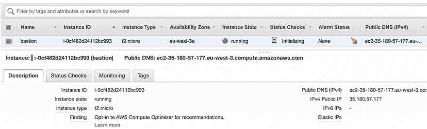

图 5.9 在公共子网中部署的堡垒主机

我们可以直接从 EC2 控制台中复制实例的公共 IP 地址。或者，我们可以使用 Terraform 输出功能，通过定义一个包含以下内容的 outputs.tf 文件，在终端会话中显示 IP 地址：

```
output "bastion" {
  value = ${aws_instance.bastion.public_ip}
}
```

要获取实例的 IPv4 公共 IP，你可以重新发出 `terraform apply` 或 `terraform output` 命令：


使用这段 Terraform 代码，我们已经准备好了堡垒主机，并可以使用它来设置 SSH 隧道以访问私有实例：

```
ssh -L TARGET_PORT:TARGET_INSTANCE_PRIVATE_IP:22 ec2-user@BASTION_IP
```

注意：你可以进一步部署一个自动扩展组（`min=1` 和 `max=1`），以确保堡垒主机实例始终可用。此外，为了成本优化，你可以使用 Spot 实例而不是按需实例。

创建这些文件后，目录结构应如下所示：

```
terraform.tf
vpc.tf
subnets.tf
private_rt.tf
public_rt.tf
bastion.tf
variables.tf
variables.tfvars
outputs.tf
```

文件可以命名为任何东西。我们根据每个文件上声明的 AWS 资源进行了命名，以便于方便和识别。请记住，所有以 .tf 结尾的文件都将由 Terraform 加载。

## 5.3 设置自愈 Jenkins 主

现在我们已经创建了 VPC，我们可以在私有子网中部署一个专门的 EC2 实例来托管 Jenkins 主组件，通过在 jenkins_master.tf 文件中定义 `aws_instance` 资源，并具有以下属性。该实例由一个 30 GB 的 EBS 卷（SSD）支持，这使得它适用于广泛的负载：

```
resource "aws_instance" "jenkins_master" {
  ami                    = data.aws_ami.jenkins-master.id
  instance_type          = var.jenkins_master_instance_type
  key_name               = aws_key_pair.management.id
  vpc_security_group_ids = [aws_security_group.jenkins_master_sg.id]
  subnet_id              = element(aws_subnet.private_subnets, 0)

  root_block_device {
    volume_type           = "gp3"
    volume_size           = 30
    delete_on_termination = false
  }

  tags = {
    Name   = "jenkins_master"
    Author = var.author
  }
}
```

30 GB 的存储值可以根据你将连续构建的项目数量和大小而变化，因为 Jenkins 设置和构建日志默认存储在主节点上。

注意：为 Jenkins 实例制定适当的标记策略对于云成本优化至关重要。它利用 AWS 账单中的过滤器功能，并强制执行跟踪和成本分配。

EC2 实例使用第四章中由 Packer 烘焙的 Jenkins 主 AMI，通过 `aws_ami` 数据资源引用：

```
data "aws_ami" "jenkins-master" {
  most_recent = true
  owners      = ["self"]

  filter {
    name   = "name"
    values = ["jenkins-master-*"]
  }
}
```

我们将向实例附加一个安全组，仅允许从堡垒主机进行 SSH 连接，并允许来自 VPC CIDR 块的端口 8080（Jenkins 网页仪表板）的入站流量；请参阅以下列表。

列表 5.6 Jenkins 安全组

```
resource "aws_security_group" "jenkins_master_sg" {
  name        = "jenkins_master_sg"
  description = "Allow traffic on port 8080 and enable SSH"
  vpc_id      = aws_vpc.management.id

  ingress {
    from_port       = "22"
    to_port         = "22"
    protocol        = "tcp"
    security_groups = [aws_security_group.bastion_host.id]
  }

  ingress {
    from_port       = "8080"
    to_port         = "8080"
    protocol        = "tcp"
    cidr_blocks     = [var.cidr_block]
  }

  egress {
    from_port   = "0"
    to_port     = "0"
    protocol    = "-1"
    cidr_blocks = ["0.0.0.0/0"]
  }

  tags = {
    Name   = "jenkins_master_sg"
    Author = var.author
  }
}
```

接下来，将用于部署 EC2 实例的实例类型定义为变量。为了简化，`t2.large`（8 GB 内存和 2vCPU）应该足够了，因为我们不会在主节点上分配执行器/工作者。因此，Jenkins 主机不会被构建作业所超载。

然而，Jenkins 需要的内存量取决于您的项目构建需求和相同构建所需的工具。每个构建节点连接将占用两个到三个线程，这相当于大约 2 MB 或更多的内存。如果您有很多用户将访问 Jenkins 用户界面，您还需要考虑 Jenkins 的 CPU 负载。

正因如此，我们将在稍后部署 Jenkins 工作者，将构建委托给工作者，并将大部分工作从主节点本身移除。因此，用于托管 Jenkins 主机的一般用途实例可以在计算和内存资源之间提供平衡。

注意：有关更多信息，请参阅 EC2 通用实例文档：[`aws.amazon.com/ec2/pricing/on-demand/`](https://aws.amazon.com/ec2/pricing/on-demand/)。

`t2.large` 实例类型可能是一个不错的选择（尽管这种实例类型不属于 AWS 免费层，所以当你完成实验后应该终止它或将其关闭）。在 variables.tfvars 文件中将它声明为一个变量：

```
variable "jenkins_master_instance_type" {
  type = string
  description = "Jenkins master EC2 instance type"
  default = "t2.large"
}
```

注意：我鼓励您在几个 Amazon EC2 实例类型上对项目构建进行基准测试，以选择最合适的配置。

使用以下命令生成执行计划：

```
terraform plan --var-file=variables.tfvars
```

您应该看到类似以下输出（为了简洁，已裁剪完整的 `terraform` `plan`）：

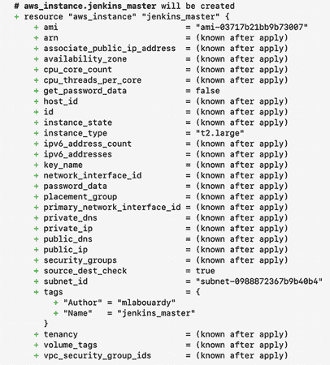

由于执行计划看起来很好，输入 `yes`，您将看到您的 Jenkins 主机 EC2 实例正在部署。一旦配置过程完成，实例应该可以在 EC2 仪表板上看到，如图 5.10 所示。

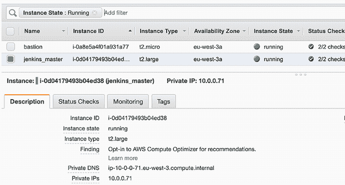

图 5.10 Jenkins 主机 EC2 实例

虽然这个实例是私有的（它没有公共 IP 地址），但我们可以通过使用堡垒主机并执行以下命令来设置 SSH 隧道（显然，使用不同的值）：

```
ssh -L 4000:10.0.0.71:22  ec2-user@35.180.122.81
ssh ec2-user@localhost -p 4000
```

您可以通过发出 `service jenkins status` 命令来检查 Jenkins 是否正在运行。图 5.11 显示了输出。

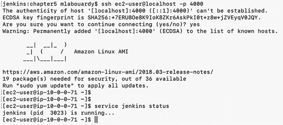

图 5.11 SSH 隧道连接

要访问 Jenkins 仪表板，我们将在 EC2 实例前面创建一个公共负载均衡器。这个弹性负载均衡器将在端口 80 上接受 HTTP 流量，并将其转发到端口 8080 上的 EC2 实例。它还会自动检查注册的 EC2 实例在端口 8080 上的健康状态。如果弹性负载均衡（ELB）发现实例不健康，它将停止向 Jenkins 实例发送流量。在 jenkins_master.tf 中声明负载均衡器资源：

```
resource "aws_elb" "jenkins_elb" {
    subnets                   = \
     [for subnet in aws_subnet.public_subnets : subnet.id]
    cross_zone_load_balancing = true
    security_groups           = [aws_security_group.elb_jenkins_sg.id]
    instances                 = [aws_instance.jenkins_master.id]

    listener {
      instance_port      = 8080
      instance_protocol  = "http"
      lb_port            = 80
      lb_protocol        = "http"
    }

    health_check {
      healthy_threshold   = 2
      unhealthy_threshold = 2
      timeout             = 3
      target              = "TCP:8080"
      interval            = 5
    }
    tags = {
      Name   = "jenkins_elb"
      Author = var.author
    }
}
```

负载均衡器将通过分配以下安全组配置接受来自任何地方的传入 HTTP 流量（您应该锁定来自您期望流量来源的特定 IP 地址范围的传入流量）。稍后，我们将添加一个 HTTPS 监听器，使用 SSL 协议在 HTTP 层上建立安全连接。在 jenkins_master.tf 中定义负载均衡器的安全组；以下是资源代码块：

```
resource "aws_security_group" "elb_jenkins_sg" {
    name        = "elb_jenkins_sg"
    description = "Allow http traffic"
    vpc_id      = aws_vpc.management.id

    ingress {
      from_port   = "80"
      to_port     = "80"
      protocol    = "tcp"
      cidr_blocks = ["0.0.0.0/0"]
    }

    egress {
      from_port   = "0"
      to_port     = "0"
      protocol    = "-1"
      cidr_blocks = ["0.0.0.0/0"]
    }

    tags = {
      Name   = "elb_jenkins_sg"
      Author = var.author
    }
}
```

接下来，更新 Jenkins 主安全组，仅允许来自负载均衡器安全组 ID 的流量在端口 8080 上：

```
ingress {
    from_port       = "8080"
    to_port         = "8080"
    protocol        = "tcp"
    security_groups = [aws_security_group.elb_jenkins_sg.id]
}
```

通过在 outputs.tf 文件中定义一个新的输出部分来输出负载均衡器的 DNS URL：

```
output "jenkins-master-elb" {
  value = aws_elb.jenkins_elb.dns_name
}
```

在您使用 Terraform 应用更改后，Jenkins 主负载均衡器 URL 应在您的终端会话中显示：

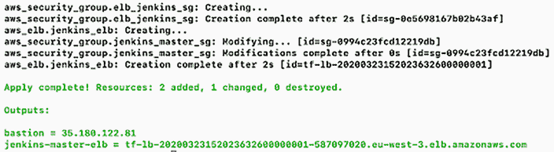

将您喜欢的浏览器指向 URL，您应该可以访问 Jenkins 网络仪表板。您可以在主页上看到“欢迎使用 Jenkins！”的消息（图 5.12）。

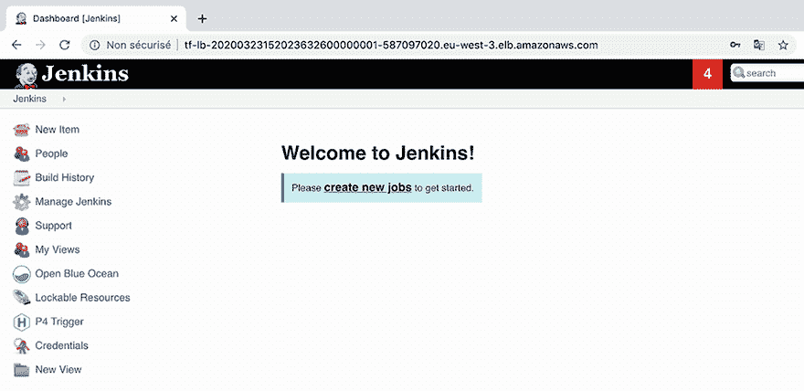

图 5.12 Jenkins 网络仪表板

太棒了！您已经有一个位于弹性负载均衡器后面的运行中的 Jenkins 服务器。

如果您的目标是设计高可用性架构，您需要在不同的可用区维护一个冗余的 Jenkins 主实例。然而，由于 Jenkins 主配置存储在$JENKINS_HOME 目录中，而不是集中式数据库中，您需要使用外部插件，如 CloudBees 的 High Availability Management 插件([`docs.cloudbees.com/plugins/ci/cloudbees-ha`](https://docs.cloudbees.com/plugins/ci/cloudbees-ha))，或者在一个共享网络驱动器上设置$JENKINS_HOME 目录，以便多个 Jenkins 主实例可以访问它。

注意：在第十四章中，我们将介绍如何使用类似 Amazon Elastic File System (EFS)的解决方案将卷挂载到多个实例共享$JENKINS_HOME 文件夹。

## 5.4 使用原生 SSL/HTTPS 运行 Jenkins

能够安全地访问 Jenkins 仪表板是一个加分项。这就是为什么我们将使用 AWS 提供的免费 SSL，在自定义域名上以 HTTPS 方式提供内容，并提供加密的网络连接；见图 5.13。

注意：如果您在本地运行 Jenkins，您可以生成一个自签名证书并部署一个反向代理，如 NGINX。如果您选择使用不同的云服务提供商，您可以使用 Let’s Encrypt 免费生成由证书颁发机构（CA）签发的证书。

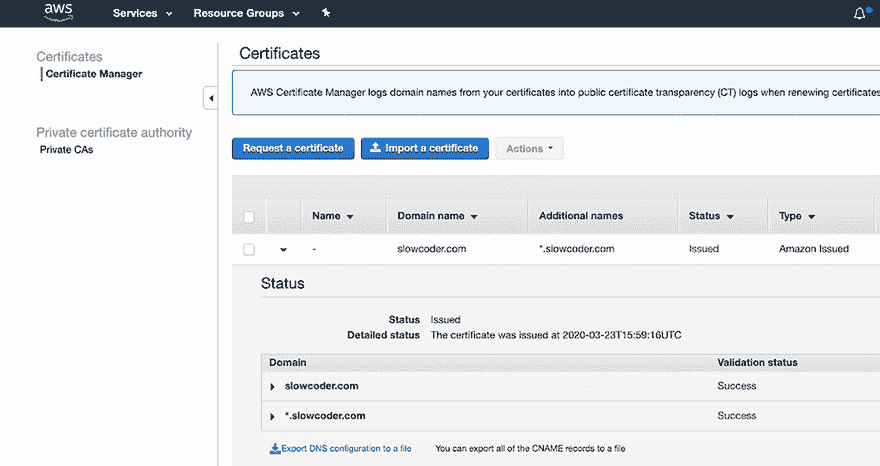

图 5.13 来自 AWS 证书管理器的免费 SSL 证书

您可以使用 AWS 证书管理器 (ACM) 轻松获取 SSL 证书。此服务使您能够在 AWS 管理的资源上轻松配置、管理和部署 SSL/TLS 证书。

前往 ACM 控制台并点击“请求证书”按钮以创建新的 SSL 证书。选择“请求公共证书”并添加您的域名。您还可能想通过添加一个星号来保护您的子域名。一旦 AWS 验证您拥有这些域名，状态将从“待验证”变为“已发行”。复制 SSL Amazon 资源名称 (ARN)。

更新负载均衡器资源以在端口 443 上启用 HTTPS 监听器。在 HTTPS 监听器上设置 ACM SSL ARN。负载均衡器使用证书终止连接，然后在将请求发送到 Jenkins 实例之前解密来自客户端的请求：

```
listener {
    instance_port      = 8080            ❶
    instance_protocol  = "http"          ❶
    lb_port            = 443             ❶
    lb_protocol        = "https"         ❶
    ssl_certificate_id = var.ssl_arn     ❶
}
```

❶ 暴露 HTTPS 监听器并将传入请求从端口 443 转发到 EC2 实例的端口 8080。

向负载均衡器安全组添加一个入站规则，以允许传入的 HTTPS 流量：

```
ingress {
    from_port   = "443"             ❶
    to_port     = "443"             ❶
    protocol    = "tcp"             ❶
    cidr_blocks = ["0.0.0.0/0"]     ❶
}
```

❶ 允许来自任何地方的端口 443 的入站流量

然后在 Route 53 服务中创建一个 A 记录，指向负载均衡器的完全限定域名 (FQDN)。DNS 记录的 Terraform 代码将类似于以下内容：

```
resource "aws_route53_record" "jenkins_master" {
  zone_id = var.hosted_zone_id
  name    = "jenkins.${var.domain_name}"                      ❶
  type    = "A"                                               ❶

  alias {                                                     ❶
    name                   = aws_elb.jenkins_elb.dns_name     ❶
    zone_id                = aws_elb.jenkins_elb.zone_id      ❶
    evaluate_target_health = true
  }
}
```

❶ 设置一个别名记录（jenkins.domain.com），指向 Jenkins 负载均衡器 FQDN

注意：如果您在 Amazon Route 53 中没有托管区域，您可以跳到下一节，并继续使用负载均衡器 FQDN。

此资源块将创建一个 A 记录，将 jenkins.domain.com URL 映射到 AWS 负载均衡器 FQDN 的别名。

最后，在 variables.tf 文件中定义引用的 Terraform 变量。表 5.3 列出了除本章先前定义的变量外还需要定义的变量。

表 5.3 DNS Terraform 变量

| 变量 | 类型 | 值 | 描述 |
| --- | --- | --- | --- |
| `hosted_zone_id` | 字符串 | 无 | 包含 A 记录的托管区域 ID |
| `domain_name` | 字符串 | 无 | 要使用的域名，例如 domain.com |
| `ssl_arn` | 字符串 | 无 | 您在 AWS ACM 中创建的 SSL 证书的 ARN |

定义一个 `output` 部分，通过引用 Route 53 A 记录资源来显示 Jenkins 公共 DNS URL：

```
output "jenkins-dns" {
  value = "https://${aws_route53_record.jenkins_master.name}"     ❶
}
```

❶ 将别名记录名称与 https:// 关键字连接起来，构建 Jenkins HTTPS URL

执行 `terraform apply` 命令以使更改生效。它应部署所需的资源并显示 Jenkins 仪表板 URL：

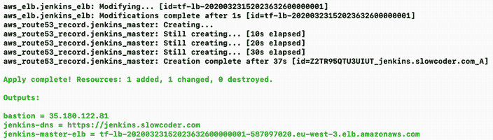

Jenkins 负载均衡器现在应该正在监听 HTTP（80）和 HTTPS（433）端口，如图 5.14 所示。

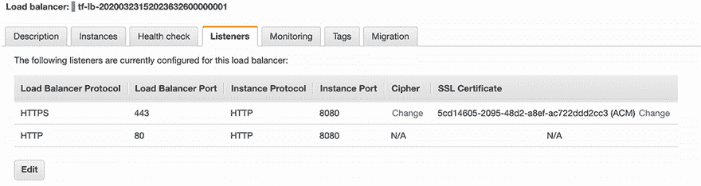

图 5.14 在 ELB 上允许 HTTPS 和 HTTP

将您的浏览器指向由 Terraform 创建的子域名。Jenkins 网络仪表板应通过 HTTPS 提供服务，如图 5.15 所示。

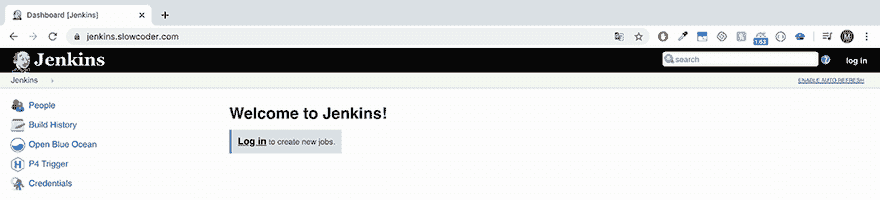

图 5.15 Jenkins 仪表板现在通过 HTTPS 提供服务。如果你使用的是 Chrome，你应该在 URL 栏中看到一个绿色的锁。

到目前为止，我们已经在公共负载均衡器后面部署了一个私有独立的 Jenkins 主实例，如图 5.16 所示。

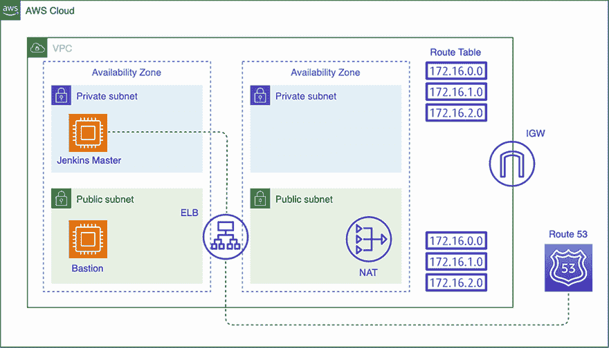

图 5.16 AWS 上的 Jenkins 独立设置

在下一节中，我们将部署额外的 Jenkins 工作节点以减轻 Jenkins 主节点的负载。

注意：定期备份你的 Jenkins EBS 卷对于确保在数据损坏或丢失的情况下可以恢复 Jenkins 实例至关重要。请参阅官方文档以获取说明：[`mng.bz/807P`](http://mng.bz/807P)。

## 5.5 动态自动扩展 Jenkins 工作节点池

运行单个 Jenkins 实例是一个好的开始，但在现实世界中，单个实例是一个单点故障。如果该实例崩溃或因构建过多而超负荷，开发者将无法交付他们的发布。解决方案是运行一个 Jenkins 工作节点集群，并根据资源利用率调整集群的大小。

### 5.5.1 启动配置

你当然可以部署 Jenkins 工作节点作为单独的 EC2 实例（重新运行前面的步骤）。然而，我们希望实例能够自动部署和替换以实现自动恢复。这就是为什么我们将依赖于一个标准的 AWS 功能，称为 *自动扩展组*。

注意：有关 AWS EC2 自动扩展功能如何工作的更多详细信息，请参阅第三章关于扩展 Jenkins 的架构。

创建自动扩展组的第一步是创建一个启动配置，它描述了如何配置每个 Jenkins 工作节点实例。在 jenkins_workers.tf 文件中声明一个 `aws_launch_configuration` 资源：

```
resource "aws_launch_configuration" "jenkins_workers_launch_conf" {
  name            = "jenkins_workers_config"
  image_id        = data.aws_ami.jenkins-worker.id                        ❶
  instance_type   = var.jenkins_worker_instance_type                      ❶
  key_name        = aws_key_pair.management.id                            ❶
  security_groups = [aws_security_group.jenkins_workers_sg.id]            ❶
  user_data       = data.template_file.user_data_jenkins_worker.rendered  ❷

  root_block_device {
    volume_type           = "gp2"                                         ❸
    volume_size           = 30                                            ❸
    delete_on_termination = false                                         ❸
  }

  lifecycle {
    create_before_destroy = true
  }
}
```

❶ 配置蓝图，使用预制的 Jenkins 工作节点 AMI 和应用于实例的密钥名称，并分配一个安全组

❷ 启动实例时提供的用户数据。它将自动将运行实例加入 Jenkins 集群。

❸ 自定义实例根块设备的详细信息

注意：你应该对你的项目进行性能基准测试，以确定所需的适当实例类型以及磁盘空间的大小。

与 Jenkins 主节点类似，工作节点将在私有子网中部署，并使用第四章中用 Packer 构建的 Jenkins 工作节点 AMI。

```
data "aws_ami" "jenkins-worker" {
  most_recent = true
  owners      = ["self"]            ❶

  filter {
    name   = "name"
    values = ["jenkins-worker*"]    ❶
  }
}
```

❶ 使用数据源资源获取预制的 Jenkins 工作节点 AMI 的 ID。

要设置 Jenkins 集群，主节点需要与工作节点建立双向连接。因此，我们需要允许来自 Jenkins 主安全组 ID 的 SSH 访问（允许堡垒主机进行 SSH 访问有助于未来的调试和故障排除）：

```
resource "aws_security_group" "jenkins_workers_sg" {
  name        = "jenkins_workers_sg"
  description = "Allow traffic on port 22 from Jenkins master SG"
  vpc_id      = aws_vpc.management.id

  ingress {
    from_port       = "22"                                          ❶
    to_port         = "22"                                          ❶
    protocol        = "tcp"                                         ❶
    security_groups = [aws_security_group.jenkins_master_sg.id,     ❶
aws_security_group.bastion_host.id]                                 ❶
  }

  egress {
    from_port   = "0"                                               ❷
    to_port     = "0"                                               ❷
    protocol    = "-1"                                              ❷
    cidr_blocks = ["0.0.0.0/0"]                                     ❷
  }

  tags = {
    Name   = "jenkins_workers_sg"
    Author = var.author
  }
}
```

❶ 允许来自 Jenkins 主和工作堡垒主机的安全组对端口 22（SSH）的入站流量

❷ 允许所有协议从任何地方出站流量（–1）

最后，我们定义了 `user-data`，这是一个在 Jenkins 工作者实例启动时执行的脚本。该脚本将 Jenkins 管理员凭据、Jenkins SSH 凭据 ID 以及 Jenkins IP 地址作为参数。

SSH 凭据 ID 指的是我们在第四章初始化时使用 Groovy 脚本创建的凭据；该凭据包含位于工作目录 .ssh 文件夹中的私有 SSH 密钥。私有 SSH 密钥将由 Jenkins 主服务器用于通过 SSH 添加 Jenkins 工作者：

```
data "template_file" "user_data_jenkins_worker" {
  template = "${file("scripts/join-cluster.tpl")}"

  vars = {
    jenkins_url            = "http://${aws_instance.jenkins_master.private_ip}:8080"
    jenkins_username       = var.jenkins_username
    jenkins_password       = var.jenkins_password
    jenkins_credentials_id = var.jenkins_credentials_id
  }
}
```

scripts/join-cluster.tpl 脚本将从 EC2 元数据（可在 169.254.169.254/latest/meta-data 获取）获取运行实例的私有 IP 地址。然后，脚本将使用以下列表中的 Groovy 脚本向 Jenkins 发送 HTTP 请求，将实例添加到集群中。

列表 5.7 自动加入 Jenkins 工作者

```
#!/bin/bash
JENKINS_URL="${jenkins_url}"                                              ❶
JENKINS_USERNAME="${jenkins_username}"                                    ❶
JENKINS_PASSWORD="${jenkins_password}"                                    ❶
TOKEN=$(curl -u $JENKINS_USERNAME:$JENKINS_PASSWORD                       ❷
''$JENKINS_URL'/crumbIssuer/api/xml?xpath= \                              ❷
concat(//crumbRequestField,":",//crumb)')                                 ❷
INSTANCE_NAME=$(curl -s 169.254.169.254/latest/meta-data/local-hostname)  ❸
INSTANCE_IP=$(curl -s 169.254.169.254/latest/meta-data/local-ipv4)        ❸
JENKINS_CREDENTIALS_ID="${jenkins_credentials_id}"

curl -v -u $JENKINS_USERNAME:$JENKINS_PASSWORD -H "$TOKEN" -d 'script=    ❹
import hudson.model.Node.Mode                                             ❹
import hudson.slaves.*                                                    ❹
import jenkins.model.Jenkins                                              ❹
import hudson.plugins.sshslaves.SSHLauncher                               ❹
DumbSlave dumb = new DumbSlave("'$INSTANCE_NAME'",                        ❹
"'$INSTANCE_NAME'",                                                       ❹
"/home/ec2-user",                                                         ❹
"3",                                                                      ❹
Mode.NORMAL,                                                              ❹
"workers",                                                                ❹
new SSHLauncher("'$INSTANCE_IP'", 22, "'$JENKINS_CREDENTIALS_ID'"),       ❹
RetentionStrategy.INSTANCE)                                               ❹
Jenkins.instance.addNode(dumb)                                            ❹
' $JENKINS_URL/script                                                     ❹
```

❶ 在 user_data_jenkins_worker Terraform 资源中将变量替换为给定的值

❷ 从 Jenkins 主服务器获取有效令牌

❸ 从 EC2 元数据获取实例私有 IP 地址和主机名

❹ 在请求负载中使用 Groovy 脚本向 Jenkins 服务器发送 GET 请求。该脚本将当前实例添加为 Jenkins 代理。

此配置允许每个工作者上并行运行三个执行器。如果您计划仅使用主服务器作为作业调度器，可以将其执行器数量设置为零，以确保项目构建仅在工作者机器上发生。资源块还定义了工作实例上的工作空间目录，工作代理可以使用该目录运行构建作业。此配置使用 /home/ec2-user 作为工作空间。此目录中不存储任何关键任务；所有重要内容在构建完成后都会传输回主实例，因此您通常不需要担心备份此目录。

我们还定义了一个名为 `workers` 的标签，因此每个工作实例都将加入该标签下的 Jenkins 集群。因此，您可以配置您的构建作业仅在工作者机器上运行。

接下来，在 variable.tf 文件中将 Jenkins 主服务器凭据和工作者实例类型定义为变量。表 5.4 列出了变量。

表 5.4 Jenkins 工作者的 Terraform 变量

| 变量 | 类型 | 值 | 描述 |
| --- | --- | --- | --- |
| `jenkins_username` | 字符串 | 无 | Jenkins 管理员用户名 |
| `jenkins_password` | 字符串 | 无 | Jenkins 管理员密码 |
| `jenkins_credentials_id` | 字符串 | 无 | Jenkins 工作者基于 SSH 的凭据 ID |
| `jenkins_worker_instance_type` | 字符串 | `t2.medium` | Jenkins 工作者 EC2 实例类型 |

注意：您可以通过使用 Amazon EC2 Spot 实例（[`aws.amazon.com/ec2/spot`](http://aws.amazon.com/ec2/spot)）或订阅 Amazon Savings Plans（[`aws.amazon.com/savingsplans/`](https://aws.amazon.com/savingsplans/））来显著降低 Jenkins 工作者的成本（高达 90% 的成本节省）。

最后，执行 `terraform apply` 命令以部署 Jenkins 工作节点。

### 5.5.2 自动扩展组

现在由于 Jenkins 工作节点的蓝图已定义在启动配置中，我们可以部署一个自动扩展组来基于启动配置部署类似的 Jenkins 工作节点。

使用 jenkins_workers.tf 文件中的 `aws_autoscaling_group` 资源创建 ASG：

```
resource "aws_autoscaling_group" "jenkins_workers" {
  name                 = "jenkins_workers_asg"
  launch_configuration = aws_launch_configuration.jenkins_workers_launch_conf.name
  vpc_zone_identifier  = \
 [for subnet in aws_subnet.private_subnets : subnet.id]     ❶
  min_size             = 2                                  ❶
  max_size             = 10                                 ❶
  depends_on = [aws_instance.jenkins_master, aws_elb.jenkins_elb]
  lifecycle {
    create_before_destroy = true
  }
  tag {
    key                 = "Name"
    value               = "jenkins_worker"
    propagate_at_launch = true
  }
  tag {
    key                 = "Author"
    value               = var.author
    propagate_at_launch = true
  }
}
```

❶ 在不同的子网中部署两个 EC2 实例的 ASG（最小），以提高容错能力

此 ASG 将运行 2 到 10 个工作节点（默认为 2 个初始启动），每个都带有名称 `jenkins_worker` 的标签。ASG 使用引用来填充启动配置名称。

注意：使用关键字 `depends_on` 确保在部署工作节点之前 Jenkins 主实例正在运行，因为工作节点需要 Jenkins 主 IP 以成功加入集群。

启动配置是不可变的，因此创建后无法修改它（例如，升级 Jenkins 工作节点实例类型或更改基础 AMI）。因此，您需要销毁启动配置并创建一个新的；这就是为什么使用 `create_before_destroy` 生命周期设置的原因。

要创建自动扩展组，请在您的终端会话中运行 `terraform apply` 命令：

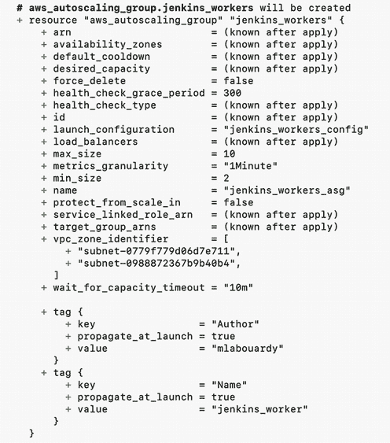

配置过程应只需几秒钟。当您刷新 EC2 控制台时，您将在仪表板中看到图 5.17 的输出。

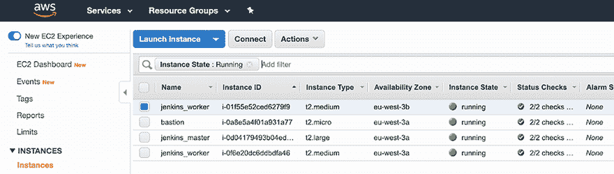

图 5.17 Jenkins 工作节点在 ASG 内部部署

注意：第十四章介绍了另一种方法：我们将使用 Docker 容器部署工作节点，以有效地使用 EC2 实例（在相同的服务器上独立运行多个构建）以及每次都在“干净”的构建环境中运行。

太好了！我们现在在 ASG 内部运行着两个 Jenkins 工作节点。

### 5.5.3 自动扩展缩放策略

到目前为止，工作节点的数量是静态和固定的。为了动态地调整工作节点的数量，我们将基于 CPU 利用率定义缩放策略。这为您提供了额外的容量来处理额外作业的构建，而无需维护过多的空闲 Jenkins 工作节点并支付额外费用。

创建一个 cloudwatch.tf 文件，并基于 CPU 利用率定义一个 AWS CloudWatch 指标警报。如果平均 CPU 利用率在 2 分钟内超过 80%，CloudWatch 警报将触发扩容事件以添加新的 Jenkins 工作节点实例，如下所示。

列表 5.8 CloudWatch 扩容警报

```
resource "aws_cloudwatch_metric_alarm" "high-cpu-jenkins-workers-alarm" {
  alarm_name          = "high-cpu-jenkins-workers-alarm"
  comparison_operator = "GreaterThanOrEqualToThreshold"
  evaluation_periods  = "2"
  metric_name         = "CPUUtilization"
  namespace           = "AWS/EC2"
  period              = "120"
  statistic           = "Average"
  threshold           = "80"

  dimensions = {
    AutoScalingGroupName = aws_autoscaling_group.jenkins_workers.name
  }

  alarm_description = "This metric monitors workers cpu utilization"
  alarm_actions     = [aws_autoscaling_policy.scale-out.arn]
}

resource "aws_autoscaling_policy" "scale-out" {
  name                   = "scale-out-jenkins-workers"
  scaling_adjustment     = 1
  adjustment_type        = "ChangeInCapacity"
  cooldown               = 300
  autoscaling_group_name = aws_autoscaling_group.jenkins_workers.name
}
```

注意：您可以选择要监控的内容，但最有用的指标可能是 CPU 利用率、内存利用率和网络利用率，以了解何时应该扩展并添加另一个 Jenkins 工作节点或通过终止工作节点进行缩容。

类似地，我们定义另一个 CloudWatch 警报来触发缩容事件，以移除 Jenkins 工作节点，如果平均 CPU 利用率在 2 分钟内低于 20%，请参阅以下列表。

列表 5.9 CloudWatch 缩容警报

```
resource "aws_cloudwatch_metric_alarm" "low-cpu-jenkins-workers-alarm" {
  alarm_name          = "low-cpu-jenkins-workers-alarm"
  comparison_operator = "LessThanOrEqualToThreshold"
  evaluation_periods  = "2"
  metric_name         = "CPUUtilization"
  namespace           = "AWS/EC2"
  period              = "120"
  statistic           = "Average"
  threshold           = "20"

  dimensions = {
    AutoScalingGroupName = aws_autoscaling_group.jenkins_workers.name
  }

  alarm_description = "This metric monitors ec2 cpu utilization"
  alarm_actions     = [aws_autoscaling_policy.scale-in.arn]
}

resource "aws_autoscaling_policy" "scale-in" {
  name                   = "scale-in-jenkins-workers"
  scaling_adjustment     = -1
  adjustment_type        = "ChangeInCapacity"
  cooldown               = 300
  autoscaling_group_name = aws_autoscaling_group.jenkins_workers.name
}
```

冷却时间设置为 300 秒，以确保 ASG 在之前的扩展活动生效之前不会启动或终止额外的 Jenkins 工作节点。

注意：当发生缩容事件时，ASG 将根据终止策略终止一个 Jenkins 工作节点。更多详细信息请参阅第三章。

如果你运行 `terraform apply` 命令，你会看到 Terraform 想要创建两个 CloudWatch 警报（输出已被裁剪以节省空间）：

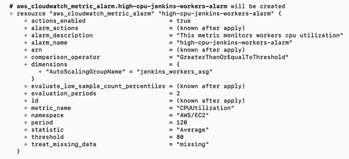

你可以通过登录 AWS 管理控制台，从控制台主页选择 EC2，然后在导航面板中选择自动扩展组来访问 Amazon EC2 自动扩展（图 5.18）。

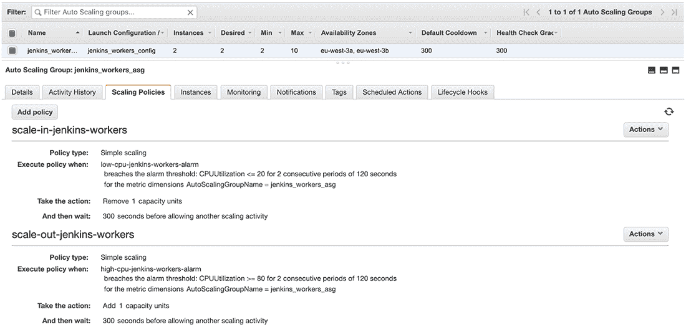

图 5.18 自动扩展组扩展策略

接下来，我们将运行 Stress 工具来测试工作节点 ASG 的扩展策略。

### 5.5.4 工作节点 CPU 利用率负载

通过从堡垒主机设置 SSH 隧道来 SSH 连接到 Jenkins 工作节点。使用 Yum 软件包管理器安装 Stress 工具：

```
sudo yum update
sudo yum install -y stress
```

要运行 Stress 工具，请输入以下命令。它将生成一个线程以使两个 CPU 核心达到最大（因为我们使用的是 `t2.large` 实例，所以这已经足够了）：

```
stress --cpu 2
```

这让你有机会看到当在 Jenkins 上构建实际工作负载并且 CloudWatch 警报开始触发时，自动扩展策略会发生什么。

你可以使用 `top` 命令来监控 Stress 工具创建的进程的 CPU 利用率，或者使用 EC2 实例上的 CloudWatch 指标。CPU 利用率将保持在 100% 一段时间，如图 5.19 所示。

注意：CloudWatch 基本监控每 5 分钟刷新一次，而我们的自动扩展策略需要一个指标连续满足 2 分钟，因此我们必须运行至少 5 分钟的负载测试，以确保我们的策略有足够的时间被触发。

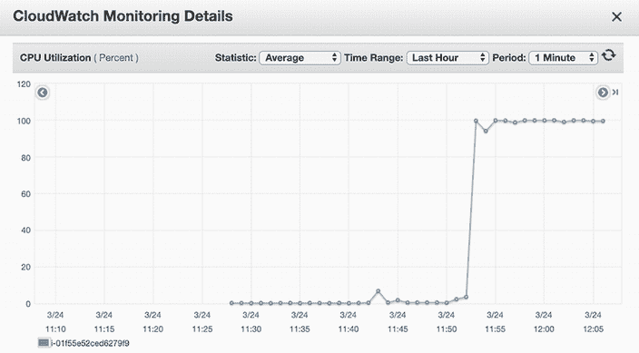

图 5.19 Jenkins 工作节点 CPU 利用率使用情况

CloudWatch 根据与 CloudWatch 警报相关的 CPU 利用率统计信息聚合指标数据点。当警报被触发时，扩展策略被触发，如图 5.20 所示。

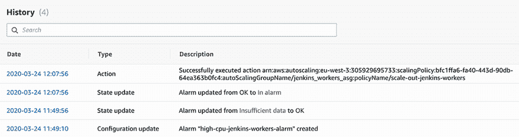

图 5.20 CloudWatch 扩展警报触发

当指标值达到 80% 时，组的期望容量增加一个实例，达到两个实例；请参阅图 5.21。

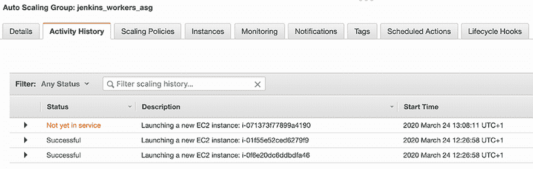

图 5.21 触发扩展策略

新实例运行后，用户数据脚本将被执行，工作节点将加入集群，如图 5.22 所示。

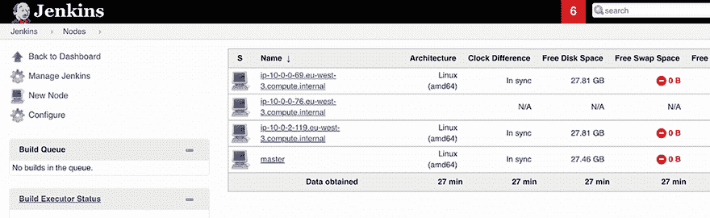

图 5.22 新的工作节点已自动加入集群。

如果指标值达到 20%，组的期望容量将减少一个实例；请参阅图 5.23。

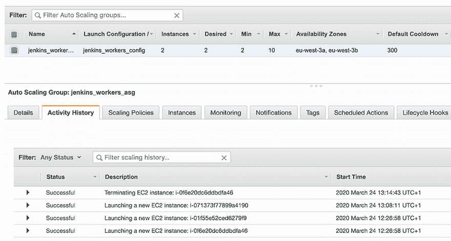

图 5.23 由于缩容事件终止未使用的节点

因此，终止的工作节点将无法访问，并在 Jenkins 网络仪表板上标记为离线（图 5.24）。

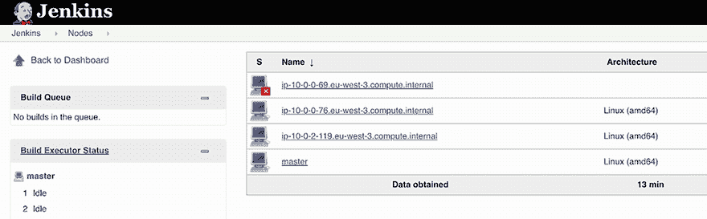

图 5.24 终止的 Jenkins 工作节点无法访问。

注意：当你完成 Terraform 的实验后，一个好的做法是删除你创建的所有资源，这样 AWS 就不会为此向你收费。运行 `terraform destroy` 命令以删除现有的 AWS 基础设施。

在本章中，你学习了如何使用基础设施即代码工具 Terraform 在 AWS 上部署一个高可用性、安全且弹性的 Jenkins 集群，以及如何使用预制的 Packer 镜像部署工作节点以进行扩展。图 5.25 总结了部署的架构。

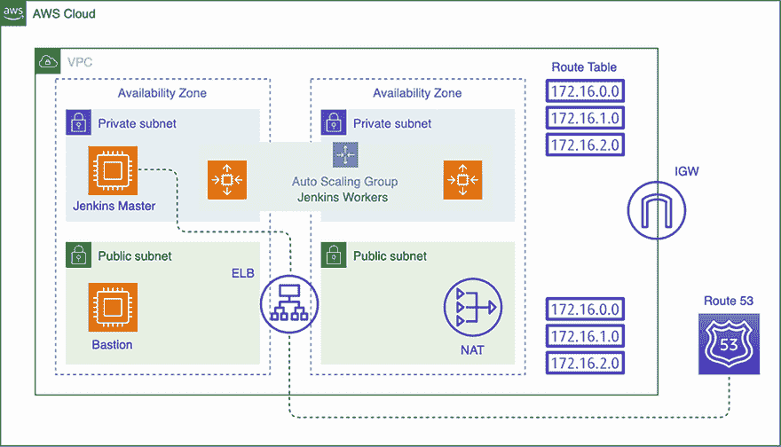

图 5.25 Jenkins 分布式构建在 AW 上。

Terraform 是一个与供应商无关的工具，可以管理多个资源提供者的基础设施。因此，在接下来的章节中，你将学习如何使用相同的配置文件在其他云提供商上部署前面的架构，例如 Microsoft Azure 和 Google Cloud Platform。

## 摘要

+   基础设施即代码是一种通过描述性或高级代码定义基础设施和网络组件的方法。

+   Terraform 是一个与任何云环境兼容的基础设施即代码工具，无论是私有云、本地部署还是公共提供商。Terraform 允许安全且方便地管理基础设施资源。

+   Jenkins 主节点应托管在具有足够 CPU 和网络带宽的实例上，以便处理并发用户。

+   Jenkins 工作节点应该是不可变的，能够快速丢弃，并以尽可能少的手动交互将其提升或添加到集群中。这可以通过利用 AWS 自动扩展组来实现。

+   通过在多个可用区之间分散 Jenkins 工作节点，为高可用性和容错性设计 Jenkins。
