# 3 定义 Jenkins 架构

本章涵盖

+   理解 Jenkins 分布式构建的工作原理

+   理解 Jenkins 主节点和工作节点的角色

+   在云中架构 Jenkins 以实现可扩展性

+   配置多个 Jenkins 主节点

+   准备 AWS 环境和 CLI 配置

在分布式微服务架构中，你可能需要定期构建、测试和部署多个服务。因此，拥有多个构建机器是有意义的。虽然你始终可以在独立模式下运行 Jenkins，但将所有构建都运行在中央机器上可能不是最佳选择，并且会导致单点故障（单个 Jenkins 服务器无法处理更大和更重的项目整个负载）。幸运的是，Jenkins 也可以配置为通过设置主/工作节点集群在机器/节点群上运行分布式构建，如图 3.1 所示。

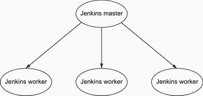

图 3.1 分布式主-工作节点架构

Jenkins 使用主-工作节点架构来管理分布式构建。每个组件都有特定的角色：

+   *Jenkins 主节点*——负责调度构建作业并将构建作业分配给工作节点以进行实际执行。它还监控工作节点的状态，并在 Web 仪表板上收集和汇总构建结果。

+   *Jenkins 工作节点*——也称为*slave*或*build agent*，这是一个在远程机器上运行的 Java 可执行程序，它监听来自 Jenkins 主节点的请求，并执行构建作业。你可以拥有任意数量的工作节点（多达 100+个节点）。工作节点可以动态添加和移除。因此，工作负载将自动分配给它们，并且工作节点将减轻主 Jenkins 服务器的负载。

注意：在 2016 年，Jenkins 社区决定开始从项目中移除冒犯性的术语。在 Jenkins 2.0 中，*slave*这个术语已被弃用，并由*agent*替代。

总结来说，Jenkins 可以以独立模式部署。然而，当你想在不同的环境中定期运行多个构建作业以满足不同项目的构建环境需求时，单个 Jenkins 服务器就不能简单地处理工作负载了。这就是为什么在这本书中，我们将重点关注*主-工作节点架构*。

## 3.1 理解主-工作节点架构

在主-工作节点架构中，Web 仪表板运行在 Jenkins 主实例上。主节点的角色是处理构建作业的调度，将构建作业派遣和委派给工作节点以进行实际执行，监控工作节点的状态（在线或离线），以及记录和展示构建结果。即使在分布式架构中，Jenkins 的一个主实例也可以直接执行构建作业。

Jenkins 工作节点可以在 Jenkins 仪表板或通过 Jenkins RESTful API 进行添加和配置。工作节点的角色是执行由主节点分配的构建作业。您可以通过给节点分配标签来配置一个项目始终在特定的节点上运行。标签是一个强大的功能；它们是虚拟的组名。在配置时，您可以给工作节点分配多个标签。标签还可以用来限制构建作业仅在具有特定标签名称的工作节点上运行——例如，限制作业仅在 CPU 优化的实例上构建。

要添加一个工作节点，您可以在管理员页面菜单中点击“管理 Jenkins”，然后点击“管理节点”并选择“添加新节点”。填写配置信息，包括节点名称、工作区名称和节点的 IP 地址。然后，输入一个标签，例如 `workers`（您可以在“标签”输入框中通过空格分隔来分配多个标签）。图 3.2 展示了如何将新的工作节点添加到 Jenkins 中。

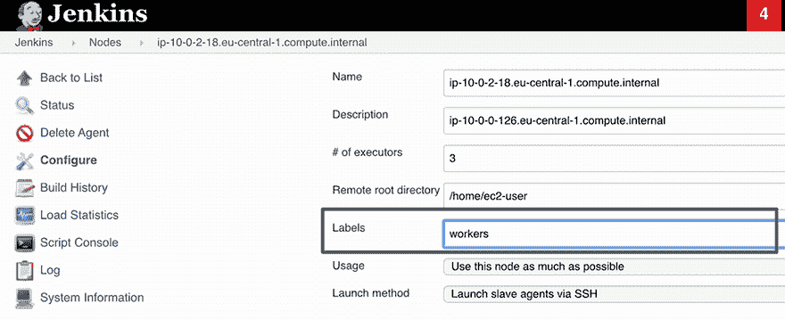

图 3.2 使用标签进行 Jenkins 作业分配

通过将 `workers` 标签分配给节点，您可以在 Jenkinsfile 中轻松引用它。在声明式管道中，您可以通过设置以下 `agent` 指令来限制管道仅在带有 `workers` 标签的节点上运行：

```
pipeline{
    agent{
        label 'workers'
    }
    stages{
       stage('Checkout'){}
    }
}
```

然而，脚本化的管道使用带有标签名称的 `node` 块包装器作为参数来定义管道的执行环境：

```
node('workers'){
    stage('Checkout'){}
}
```

如果对同一节点请求更多的构建作业，Jenkins 将自动创建一个作业队列。默认情况下，每个节点可以执行一个作业；然而，您可以通过设置标记为“执行器数量”的字段来增加节点运行作业的容量。在先前的例子中，节点配置了三个执行器，这意味着一次最多可以执行三个作业。如果启动了四个作业，前三个将执行，第四个将被添加到构建队列中。一旦节点可用，Jenkins 将按照请求的顺序执行剩余的作业。

要能够将工作节点添加到 Jenkins 集群，工作节点和主节点需要通过 TCP/IP 建立双向通信。另一个要求是在工作机器上安装 Java。由于 Java 是一种平台无关的编程语言，一个 Jenkins 集群可能包含运行在多种操作系统平台上的工作节点，如 Windows、Linux 或 macOS。这种架构带来了多个好处，例如拥有一个异构的构建农场，支持您可能需要使用不同操作系统或 CPU 架构运行构建/测试的所有环境。

在图 3.3 的示例中，使用工作节点代表您所需的环境中的每一个，会导致您拥有多个环境和配置来测试、构建和部署您的项目。构建作业的委托行为取决于每个项目的配置；一些项目可能选择使用标签“粘附”到特定机器上进行构建，而其他项目可能选择在可用的节点之间自由漫游。

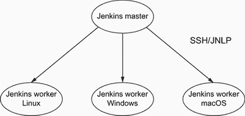

图 3.3 您可以通过使用 SSH 或 Java 网络启动协议（JNLP）来设置运行不同操作系统的多个工作节点

## 3.2 管理 Jenkins 工作节点

在管理 Jenkins 工作节点时，根据目标操作系统和其他架构考虑因素，有多种策略可供选择。这些策略会影响您配置工作节点的方式，因此我们需要分别考虑每个策略。

### 3.2.1 SSH

如果您在 UNIX 环境中工作，无疑最方便启动 Jenkins 工作节点的方式是使用安全外壳（SSH）。Jenkins 具有自己的内置 SSH 客户端，几乎所有 UNIX 环境都支持 SSH（通常为`sshd`）。

工作节点需要从主服务器可达，您将需要提供主机名、登录名和密码。您还可以为主实例上的 SSH 私钥文件提供路径，以使用公私钥认证，如图 3.4 所示。

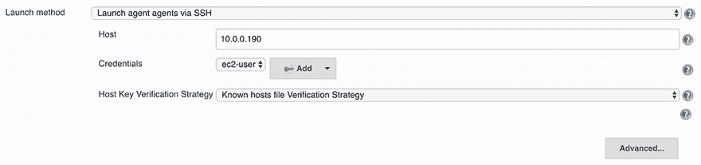

图 3.4 通过 SSH 启动 Jenkins 工作节点

注意：在第五章中，我们将使用 SSH 启动方法来设置 Jenkins 集群。

### 3.2.2 命令行

您可以通过 Jenkins 从主服务器执行命令来添加工作节点，如图 3.5 所示。当主服务器能够远程在其他机器上执行进程时，使用此方法。然而，远程模式自 Jenkins 2.54 以来已被弃用（因此在最新版本的 Jenkins 中可能不是一个有效的选项）。

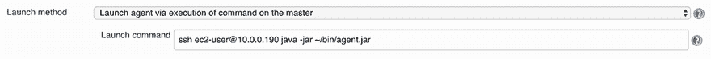

图 3.5 通过命令行启动 Jenkins 工作节点

### 3.2.3 JNLP

另一种选项是使用 Java Web Start（JWS）从工作节点本身启动代理。如果主服务器无法到达工作节点，例如，如果工作节点运行在防火墙的另一侧，这种方法很有用。它适用于您的节点运行在任何操作系统上。然而，它更适合管理 Windows 工作节点。

这种方法确实存在一些主要缺点：Jenkins 无法自动启动或重启工作节点。如果工作节点出现故障，主实例无法重启它。在 Windows 机器上执行此操作时，您至少需要手动启动 Jenkins 工作节点一次。这需要在该机器上打开浏览器，在 Jenkins 主服务器上打开工作节点页面，并使用非常显眼的 JNLP 图标启动工作节点。然而，一旦启动了工作节点，您就可以将其安装为 Windows 服务。

### 3.2.4 Windows 服务

Jenkins 还可以通过 Windows DCOM 服务器进程启动器服务（该服务在 Windows 上默认安装）将远程 Windows 工作节点作为 Windows 服务管理。选择此选项时，您需要提供 Windows 主机名、用户名和密码，如图 3.6 所示。

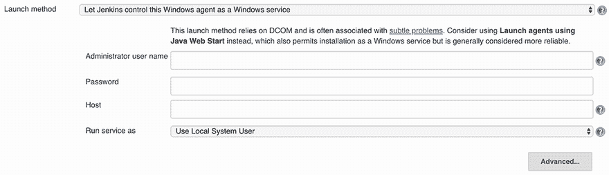

图 3.6 启动 Windows 工作节点

这种启动模式很方便，因为它不需要您物理连接到 Windows 机器来设置。然而，它也有局限性——特别是，您不能运行任何需要图形界面的应用程序。

一旦将工作节点添加到 Jenkins 集群中，主节点将主动监控其状态，如果认为某个工作节点无法安全执行构建作业，则会将其下线。您可以在“管理节点”页面中精细调整 Jenkins 要监控的内容，如图 3.7 所示。

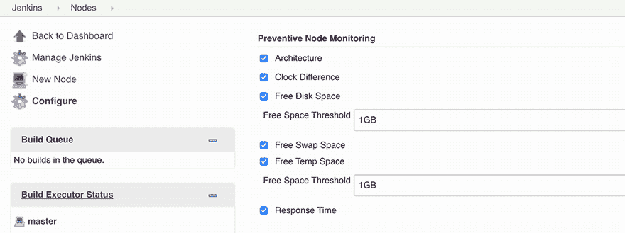

图 3.7 定义节点监控阈值

Jenkins 监控每个工作节点上$JENKINS_HOME 的可用磁盘空间，以及临时目录和交换空间的磁盘空间。它还跟踪主节点和工作节点之间的系统时钟差异。最后，它监控从主节点到工作节点的往返网络响应时间。如果这些标准中的任何一个低于某个阈值，则工作节点将被标记为离线。

最后，值得一提的是，默认情况下，Jenkins 尽可能多地使用工作节点。只要某个工作节点可以执行构建，Jenkins 就会使用它。

要控制 Jenkins 如何在可用工作节点上调度构建，您可以在图 3.8 所示的“使用”字段中进行配置，使用“仅构建与此节点匹配标签表达式的作业”选项来限制作业只能在工作节点名称和/或标签匹配的情况下执行。如果您想为某种特定的 Jenkins 作业保留工作节点，这将非常有用。此外，如果将“执行器数量”字段的值设置为 1，您可以确保在任何给定时间只执行一个作业。因此，不会有其他构建干扰。

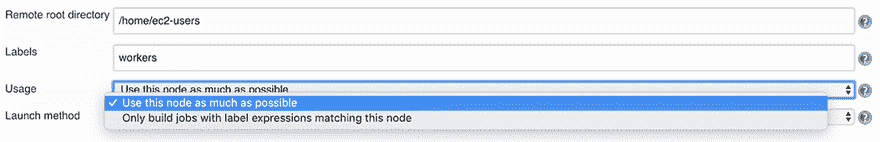

图 3.8 配置 Jenkins 工作节点使用

## 3.3 在 AWS 中为 Jenkins 进行扩展架构设计

到目前为止，我们已经介绍了 Jenkins 分布式构建的工作方式。本节将介绍如何在 AWS 上对 Jenkins 进行扩展架构设计。因此，您需要 AWS 账户来跟随示例。使用新的 AWS 账户，免费层应该可以覆盖所有示例，无需您支付任何费用。有关 AWS 免费层的更多信息以及如何创建新 AWS 账户的逐步指南，请访问[`aws.amazon.com/free/`](https://aws.amazon.com/free/)。

注意：尽管本节侧重于 AWS，但此内容同样可用于帮助在其他云服务提供商上设置 Jenkins 集群。第六章提供了逐步指南。

你可以部署的简单架构是一个独立或单节点设置。你只需从 AWS Marketplace（[`aws.amazon.com/marketplace`](https://aws.amazon.com/marketplace)）部署一个 Jenkins 服务器到 Amazon 弹性计算云（EC2）实例，如图 3.9 所示。

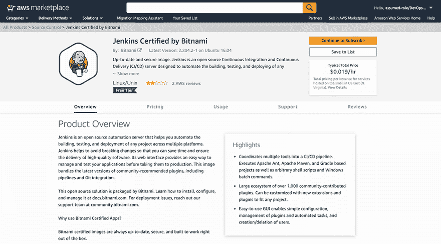

图 3.9 AWS Marketplace 上可用的 Jenkins 机器镜像

AWS Marketplace 包含来自安全、网络、存储、机器学习、商业智能、数据库和 DevOps 等流行类别的预配置的 Amazon 机器镜像（AMIs）。你可以通过选择 Jenkins 长期支持（LTS）版本和机器实例类型（基于资源需求）来快速通过几个点击启动 Jenkins 服务器。

你也可以通过使用包管理器（例如，APT 或 Yum）在基础机器镜像上安装 Jenkins。Jenkins 安装程序适用于多个 Linux 发行版以及 Windows 和 macOS。否则，你可以使用 Jenkins 官方 Docker 镜像设置一个 Jenkins 操场。

注意：第四章介绍了如何使用 HashiCorp Packer 从头开始创建自己的 Jenkins 机器镜像。

一旦你在 EC2 实例上安装了 Jenkins，你需要配置实例关联的安全组，以允许 8080 端口的流量。这是 Jenkins 仪表板暴露的端口。

*安全组*充当防火墙，控制允许到达 EC2 实例的流量（图 3.10）。为了控制流量，我们在安全组中创建规则。对于这种情况，需要添加以下安全规则。

+   允许入站（ingress）流量在端口 8080（Jenkins 仪表板端口号）。

+   （可选）允许从你的计算机的公网地址入站 SSH 流量，以便你可以连接到你的 Jenkins 实例进行调试或维护。

+   默认情况下，安全组包含一个出站规则，允许所有出站（egress）流量。


图 3.10 AWS 上的 Jenkins 独立架构由一个位于安全组后的 EC2 实例组成。

你可能需要设置一个与安全组规则类似的网络访问控制列表（ACL），以在你的实例上添加额外的安全层。安全组充当你的 Amazon EC2 实例的防火墙，在实例级别控制入站和出站流量。ACL 充当相关子网的防火墙，在子网级别控制入站和出站流量。

注意：虽然你可以通过垂直扩展 Jenkins 主机来吸收构建作业的负载峰值，但实例可扩展的程度是有限的。

虽然这种架构适用于较小的项目，但它无法扩展到更大和更复杂的项目。因此，我们将部署一个 Jenkins 集群，以在多个工人之间共享负载。而不是在 Jenkins 主实例上调度构建作业，它们将被分配给 Jenkins 工人。结果，将部署额外的 EC2 实例（图 3.11）作为构建服务器或 Jenkins 代理。

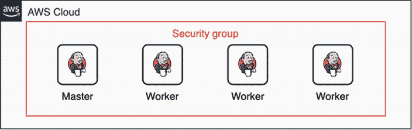

图 3.11 AWS 上的 Jenkins 分布式架构

这种架构要好得多。然而，分布式构建通常用于通过动态添加额外机器来吸收额外负载（例如，在构建活动中），因此工人的数量不应该预先固定。我们希望根据队列中等待作业的数量或工人集群的 CPU 利用率来添加或删除工人。这就是为什么，我们不会独立部署工人，而是将它们部署在 AWS 自动缩放组（ASG）内部；请参阅[`aws.amazon.com/autoscaling/`](https://aws.amazon.com/autoscaling/) [.](https://aws.amazon.com/autoscaling/.)

ASG 功能随 EC2 提供，允许您部署一组 EC2 实例，这些实例被视为自动缩放目的的逻辑分组。此外，Amazon EC2 自动缩放通过指定任何给定时间的最小和最大实例数量，帮助确保您拥有正确的实例数量。

为了根据构建作业按需创建和终止 Jenkins 工人，我们可以创建缩放策略。*缩放策略*是一组指令，用于根据 Amazon CloudWatch 警报调整 ASG 中实例的大小（[docs.aws.amazon.com/AmazonCloudWatch/latest/monitoring/AlarmThatSendsEmail](https://docs.aws.amazon.com/AmazonCloudWatch/latest/monitoring/AlarmThatSendsEmail.html)）。

Amazon CloudWatch 警报将监控 EC2 实例的 CPU 使用情况，例如。然后它将触发一个扩展或缩放事件，以自动向 Jenkins 集群添加或删除一个工人。例如，如果 Jenkins 工人的平均 CPU 利用率超过 80%，将触发一个扩展事件，并部署一个新的工人并将其添加到 Jenkins 集群中。同样，如果 Jenkins 工人的平均 CPU 利用率低于 20%，将触发一个缩放事件，并删除未使用的工人（提供基础设施成本优化）。

注意：在自动缩放组上创建警报时，警报使用所有 Jenkins 工人实例的聚合指标（平均 CPU 利用率）。这样，它不会仅仅因为一个工人太忙就添加实例。

当 CPU 利用率低于 20%时，缩放策略生效，ASG 将在可用实例上终止。如果您没有为 ASG 分配特定的终止策略，它将使用默认的终止策略。这意味着 ASG 将根据以下因素选择要终止的实例：

+   接近下一个计费小时的实例。

+   运行时间最长/最老的 EC2 实例。

+   最老的启动配置。*启动配置*是描述 Jenkins 工作节点实例应如何样子的蓝图或模板。

然而，您可以使用 Amazon EC2 终止保护来防止 Jenkins 工作节点意外终止。请参阅官方指南以获取说明：[`mng.bz/ePwz`](https://shortener.manning.com/ePwz)。

我们还可以根据内存利用率来配置扩展策略。然而，内存利用率是 CloudWatch 默认不可用的指标之一。由于 AWS 在 OS 级别无法访问实例，因此只能记录通过虚拟化层（如 CPU 和网络利用率）可监控的指标。

我们有多种方法可以解决这个问题。最常用的方法是安装一个指标收集代理在 EC2 实例上。有关如何获取内存利用率的更多详细信息，请参阅第十三章。

注意：为了能够自动添加工作节点，工作节点机器在启动时会运行一个 shell 脚本，并使用 Jenkins RESTful API 通过机器的私有 IP 地址（称为*集群发现*）自动注册到集群中。第四章和第五章将深入解释这一部分。

图 3.12 说明了如何通过使用 CloudWatch 扩展策略动态扩展 Jenkins 工作节点。


图 3.12 显示 Jenkins 工作节点属于一个 AWS 自动扩展组，并将根据组的平均 CPU 利用率动态扩展。

我们还可以使用自定义指标，如构建队列中等待作业的数量来触发扩展策略。要获取此信息，您可以使用开源解决方案（如 Prometheus [`prometheus.io/docs/introduction/overview/`](https://prometheus.io/docs/introduction/overview/)）来导出 Jenkins 集群指标，并创建一个 Lambda 函数来消费/抓取这些指标。从 Lambda 函数中，您可以使用 AWS API/SDK 在 Jenkins 工作节点自动扩展组上触发扩展或缩减事件。

注意第十三章介绍了如何监控 Jenkins 集群的健康状况以及如何在 Jenkins 上使用 Prometheus 导出器插件来公开服务器端指标。

图 3.13 演示了如何根据自定义指标动态扩展 Jenkins 工作节点。

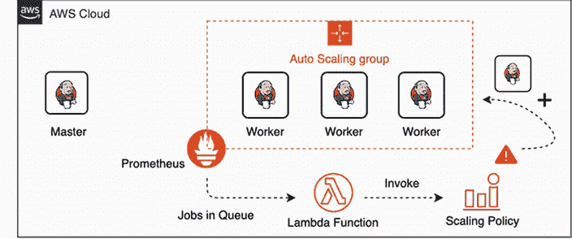

图 3.13 您可以通过集成 Prometheus 和 AWS Lambda 根据构建队列中等待作业的数量动态扩展 Jenkins 工作节点。

到目前为止，该架构很有前景。然而，它并不安全且弹性不足。为了确保我们的 Jenkins 集群安全，我们将在虚拟私有云（VPC）和私有子网中精确部署该架构。实际上，默认情况下，任何 EC2 实例都部署在 AWS 默认 VPC 中。但我们将创建一个非默认 VPC，以满足我们的特定需求，并使用特定的无类别域间路由（CIDR）块范围和子网大小。

亚马逊 VPC ([`aws.amazon.com/vpc`](https://aws.amazon.com/vpc)) 允许您在 AWS 云中配置一个逻辑上隔离的部分，您可以在其中定义一个虚拟网络来启动 AWS 资源。您对虚拟网络环境拥有完全的控制权，包括选择自己的 IP 地址范围、创建子网以及配置路由表和网络网关。

这里需要注意的一个重要点是，VPC 仍然是 AWS 云的一部分。它不是 AWS 提供的物理上分离的托管服务；它是 EC2 基础设施的逻辑隔离部分。这种隔离是在网络层完成的，类似于传统数据中心网络的隔离；只是我们作为最终用户，被屏蔽了其复杂性。图 3.14 显示了 AWS VPC 的网络拓扑。

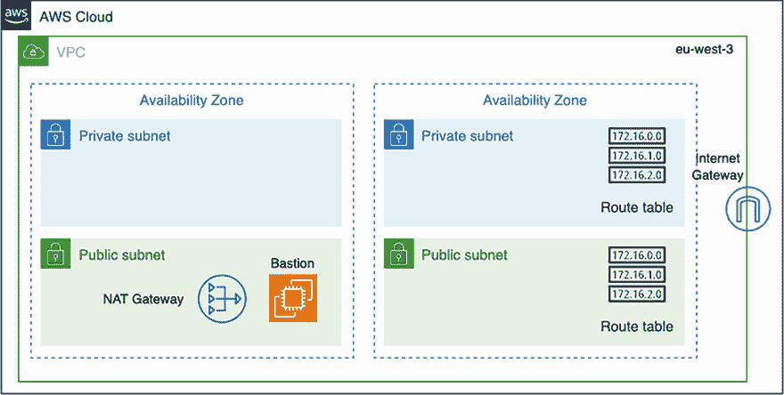

图 3.14 虚拟私有云由私有和公共子网组成。

我们将创建一个包含多个子网的 AWS VPC。子网不过是有效 IP 地址的一个范围。为了提高弹性，这些子网将在所选 AWS 区域的不同可用区中部署。

接下来，我们将部署一个互联网网关（IGW）并将其连接到 VPC。IGW 主要用于为 Jenkins 实例提供互联网连接（如果您的 Jenkins 工作节点中的构建作业需要从互联网下载外部包，这可能是必需的）。此外，IGW 将实例的私有 IP 地址映射到相关的公共或弹性 IP 地址 ([`mng.bz/p9QG`](https://shortener.manning.com/p9QG))，然后将子网外的流量路由到互联网。最后，我们创建一个公共路由表，其中包含将网络流量从公共子网路由到 IGW 的规则，如表 3.1 所示。

表 3.1 公共路由表

| 目标地址 | 目标 | 备注 |
| --- | --- | --- |
| 10.0.0.0/16 | local | 允许流量与特定的子网（10.0.0.0/16）流动 |
| 0.0.0.0/0 | IGW ID | 允许子网流量通过互联网。 |

但是私有子网中的实例怎么办？这就是网络地址转换（NAT）实例或网关发挥作用的地方。NAT 网关/实例将在公共子网内部创建，并将转发出站流量，不允许任何来自互联网的流量到达私有子网。这意味着实例可以访问互联网，而不会暴露在公共网络中（不会分配公共 IP 地址）。一旦 NAT 网关部署完成，我们需要在私有子网的路由表中添加一个条目，指向 NAT 网关；请参阅表 3.2。

表 3.2 私有路由表

| 目标地址 | 目标 | 备注 |
| --- | --- | --- |
| 10.0.0.0/16 | local | 允许流量与特定的子网（10.0.0.0/16）流动 |
| 0.0.0.0/0 | NAT ID | 允许子网流量通过 NAT 网关/实例 |

由于 Jenkins 实例将被部署到与互联网隔离的私有子网中，我们无法从本地桌面直接 SSH 到它们。一个基本的解决方案是部署一个特殊的实例，该实例充当代理，您可以使用它来 SSH 到您的 Jenkins 实例。这个特殊的实例被称为*堡垒主机*或*跳板机*。这个实例将部署在您的公共子网上，并且基本上只通过设置安全的 SSH 隧道/桥接路由来自本地网络的 SSH 流量。

注意：一个高级的解决方案是部署 OpenVPN 来建立安全的 TLS VPN 会话，以便安全地访问您的私有 Jenkins 实例。请参考“在 Amazon VPC 中设置 OpenVPN 访问服务器”的说明，链接为[`mng.bz/OQVn`](http://mng.bz/OQVn)。

一旦配置了 VPC，我们就可以继续部署一个在私有子网上运行的 Jenkins 服务器的专用 EC2 实例。同时，Jenkins 工作节点自动扩展组将在多个私有子网上部署。我们使用 CloudWatch 警报配置扩展策略，以根据构建活动动态扩展 Jenkins 工作节点。图 3.15 总结了当前的部署架构。

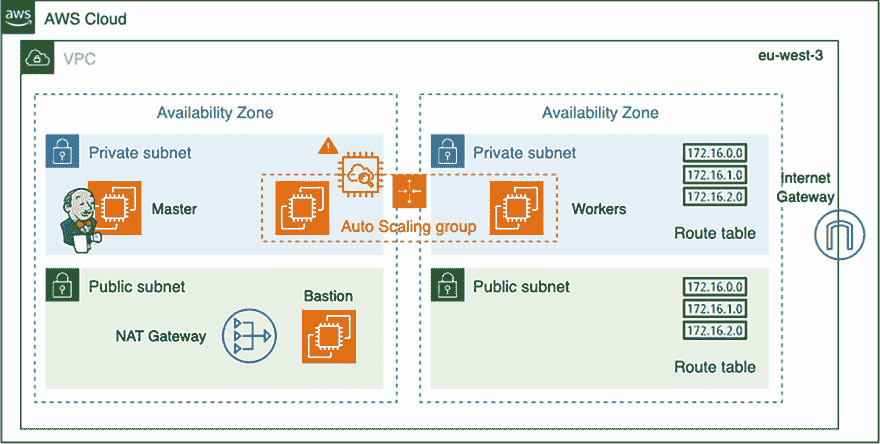

图 3.15 这个部署在私有子网中的 Jenkins 集群由一个工作节点自动扩展组（ASG）和一个持有 Jenkins 仪表板的 EC2 实例组成。

我们可以将这种架构进一步扩展，并在 Jenkins 实例前面配置一个面向公众的弹性负载均衡器，以便访问 Jenkins 网络仪表板。这样，您的 Jenkins 实例就不必直接暴露在互联网上。

注意：即使 Jenkins 核心默认不支持多个主节点，也可以有多个 Jenkins 实例。然后，使用负载均衡器来获取请求并将它们分配给多个 Jenkins 主节点。

负载均衡器将监听 HTTP（80）和 HTTPS（443）端口，并将传入请求发送到端口号为 8080 的实例。这样，它使用加密连接与 Jenkins 实例通信。表 3.3 总结了端口配置。

表 3.3 负载均衡器监听器配置

| 负载均衡器协议 | 负载均衡器端口 | 实例协议 | 实例端口 |
| --- | --- | --- | --- |
| HTTP | 80 | HTTP | 8080 |
| HTTPS | 443 | HTTP | 8080 |

如果您指定了 HTTPS 监听器，您将需要选择一个私有的安全套接字层（SSL）证书。负载均衡器使用证书来终止连接，然后在将请求发送到 Jenkins 实例之前解密来自客户端的请求。您可以使用 AWS 证书管理器（ACM）获取免费的 SSL 证书；您也可以导入自己的证书。

负载均衡器有一个公开可解析的 DNS 名称，因此它可以路由来自互联网的客户端请求到已注册到负载均衡器的 Jenkins 实例。此外，在设置 GitHub webhook 以在推送事件上持续触发 Jenkins 构建时，它也将非常有用。

注意：如果您计划坚持使用私有 Jenkins 实例，第七章解释了如何在防火墙后面的 Jenkins 实例上设置 GitHub webhook。

最后，如果您想使用友好的 DNS 名称来访问您的负载均衡器，而不是自动分配给负载均衡器的默认 DNS 名称，您可以为负载均衡器创建一个自定义域名并将其与负载均衡器的 DNS 名称关联。DNS 配置可以在 Amazon Route 53 上完成（[`aws.amazon.com/route53/`](https://aws.amazon.com/route53/))）。图 3.16 显示了最终的架构图。

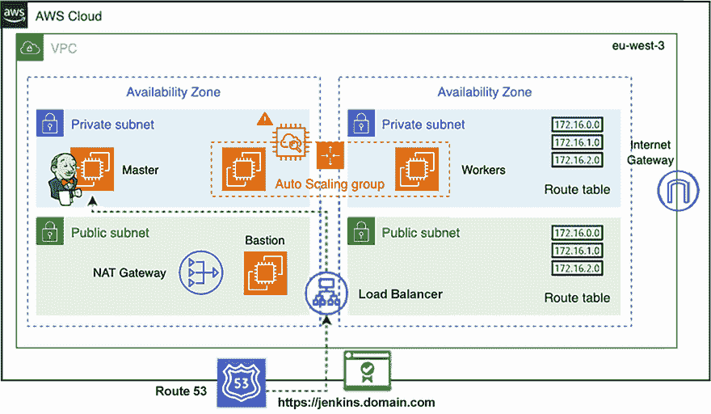

图 3.16 自定义 VPC 上的 Jenkins 集群部署

向 Jenkins 集群添加工作节点是扩展 Jenkins 的典型方式。然而，您可以使用带有代理（通常是 HAProxy 或 NGINX）的多个 Jenkins 主实例来主动监控主实例，并在活动主实例下线时将请求重定向到备份主实例。主实例的 Jenkins 架构将类似于图 3.17。

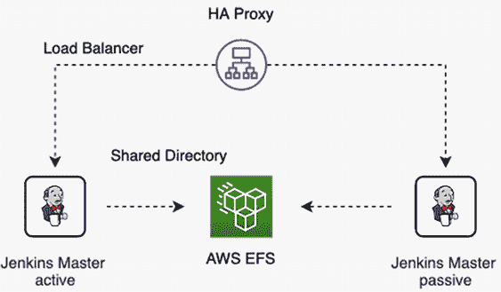

图 3.17 Jenkins 主实例高可用设置使用 Amazon Elastic File System 持久化 Jenkins 主目录。

如您所见，第一层是反向代理。每当有构建请求到来时，它将首先到达代理。然后，代理将决定请求可以路由到的实例。在这里，一个主实例将处于活动状态以处理请求，而另一个将处于被动状态。每当活动主实例出现问题并下线时，另一个主实例将变为活动状态，请求将恢复。（我们还可以在 ASG 内部部署 Jenkins 主实例以确保始终有足够的主实例用于备份）。这些请求将由变为活动状态的主实例处理。

第二层是 Amazon Elastic File System，或 EFS（[`aws.amazon.com/efs/`](https://aws.amazon.com/efs/))，它用作存储解决方案以持久化 Jenkins 主目录$JENKINS_HOME，以便两个 Jenkins 主实例都可以访问和存储 Jenkins 作业。此存储解决方案可以同时挂载到多个 Jenkins 实例。Amazon EFS，就像任何网络文件系统（NFS）服务器一样，支持完整的文件系统访问语义，例如强一致性和文件锁定。

如果您计划在 Kubernetes 集群或基于 Docker 的编排平台（如 AWS ECS 或 Fargate）上部署 Jenkins，也可以使用 EFS。由于 Jenkins 主容器可以在集群中的任何节点上启动，因此可以使用 EFS 将 Jenkins 数据目录持久化以保留其状态。

注意：第十四章介绍了如何在$JENKINS_HOME 目录中挂载 EFS 以确保 100%的数据共享，并且在发生故障的情况下数据不会丢失。

现在 Jenkins 架构已经明确，接下来我们将准备我们的 AWS 环境，然后安装和配置后续章节所需的工具。

### 3.3.1 准备 AWS 环境

本节将指导您安装和配置 AWS 命令行。命令行界面（CLI）是一个强大且必需的工具，我们将在后续章节中使用它。它将通过自动化 AWS 上 Jenkins 集群的部署和配置以及定义云原生应用的 CI/CD 步骤来为我们节省大量时间。

### 3.3.2 配置 AWS CLI

AWS CLI ([`aws.amazon.com/cli/`](https://aws.amazon.com/cli/)) 是一个强大的工具，可以从终端会话中管理您的 AWS 服务和资源。它是建立在 AWS API 之上的，因此可以通过 CLI 完成通过 AWS 管理控制台 ([`console.aws.amazon.com/console/home`](https://console.aws.amazon.com/console/home)) 可以完成的所有操作；这使得它成为一个方便的工具，可以通过脚本自动化和控制您的 AWS 基础设施。后续章节将提供有关使用 CLI 与 Jenkins 管理 AWS 中的云原生应用的信息。

让我们通过 AWS CLI 的安装过程；您可以在 AWS 管理控制台部分找到有关其配置和测试的信息。要开始，请参考官方文档，并根据您的操作系统说明安装 AWS CLI ([`mng.bz/Yw8N`](http://mng.bz/Yw8N))。

一旦安装了 AWS CLI，您需要将 AWS CLI 二进制文件路径添加到 `PATH` 环境变量中，如下所示。

+   对于 Windows，按 Windows 键并输入 `环境变量`。在环境变量窗口中，在系统变量部分突出显示 `PATH` 变量。编辑它，并在最后一个路径后放置一个分号，然后输入 CLI 二进制文件安装的文件夹的完整路径。

+   对于 Linux、Mac 或任何 UNIX 系统，打开您的 shell 配置文件（.bash_profile、.profile 或 .bash_login）并在文件末尾添加以下行：

```
export PATH=~/.local/bin:$PATH
```

最后，将配置文件加载到当前会话中。

```
source ~/.bash_profile
```

通过打开新的终端会话并输入以下命令来验证 CLI 是否正确安装：

```
aws --version
```

您应该能够看到 AWS CLI 版本；在我的情况下，已安装 2.0.0 版本。让我们测试一下，并以法兰克福地区为例列出 Amazon S3 存储桶。

```
aws s3 ls --region eu-central-1
```

之前的命令显示以下输出。

![Images/CH03_F17_UN_code.png]

当使用 CLI 时，您通常需要 AWS 凭据来验证 AWS 服务。您可以通过多种方式配置 AWS 凭据。

+   *环境凭证*—使用 `AWS_ACCESS_KEY_ID` 和 `AWS_SECRET_KEY` 变量。它们对于脚本编写或临时设置一个命名的配置文件为默认值非常有用。

    注意：如果您在终端提示符下设置环境变量，则这些值仅保存为当前会话的持续时间。为了使环境变量设置在所有终端会话中持久，请将它们存储在 /etc/profile 或当前用户的 ~/.bash_profile 中。

+   *共享凭证文件*——AWS CLI 将凭证存储在您主目录下 .aws 文件夹中的名为 *credentials* 的本地文件中。您可以通过将 `AWS_SHARED_CREDENTIALS_FILE` 环境变量设置为另一个本地路径来指定凭证文件的默认位置。

+   *IAM 角色*——如果您在 EC2 实例中使用 CLI，这可以消除在生产环境中管理凭证文件的需求。每个 Amazon EC2 实例都包含 AWS CLI 可以直接查询以获取临时凭证的元数据。

在下一节中，我将向您展示如何使用 AWS 身份和访问管理（IAM）服务为 AWS CLI 创建新用户。

### 3.3.3 创建和管理 IAM 用户

IAM ([`aws.amazon.com/iam/`](https://aws.amazon.com/iam/)) 是一项服务，允许您管理用户、组和他们对 AWS 服务的访问级别。强烈建议您不要使用 AWS 根账户执行任何除计费任务以外的任务，因为它具有创建和删除 IAM 用户、更改计费、关闭账户以及执行您 AWS 账户上所有其他操作的最终权限。因此，我们将创建一个新的 IAM 用户，并按照最小权限原则授予它访问正确 AWS 资源所需的权限。

注意：*最小权限原则*（PoLP）通过仅授予用户执行所需任务所需的最小访问级别或权限来实现。

使用您的 AWS 电子邮件地址和密码登录 AWS 管理控制台。然后，从安全、身份与合规部分打开 IAM 控制台或直接在搜索栏中输入 `IAM`；图 3.18 展示了控制台界面。

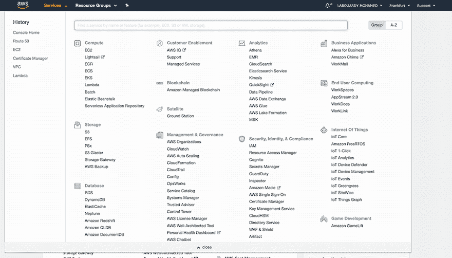

图 3.18 AWS 管理控制台

从导航面板中选择用户。点击添加用户按钮。然后为用户设置一个名称，并选择程序访问（如果您希望同一用户能够访问控制台，也可以选择 AWS 管理控制台访问），如图 3.19 所示。

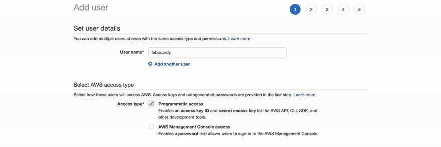

图 3.19 创建新的 IAM 用户

在设置权限部分，将 AmazonS3FullAccess 策略分配给用户，如图 3.20 所示。

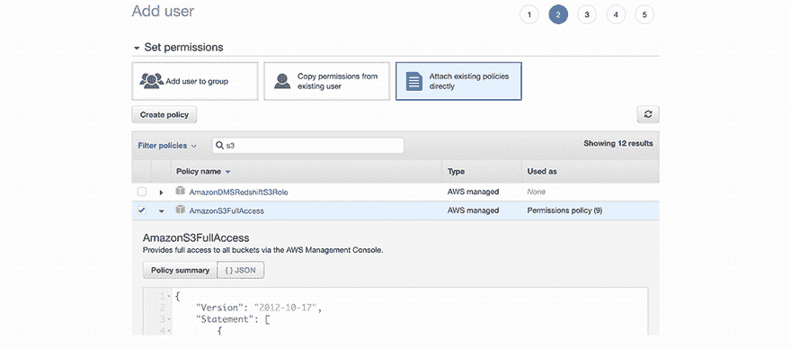

图 3.20 将 IAM 策略附加到用户

注意：最好细化权限，仅指定完成任务所需的权限（保留特权访问）。从最小权限集开始，仅在必要时添加更多权限。

在最后一页，您应该能看到用户的 AWS 凭证（图 3.21）。请确保将访问密钥保存在安全的位置，因为您将无法再次看到它们。

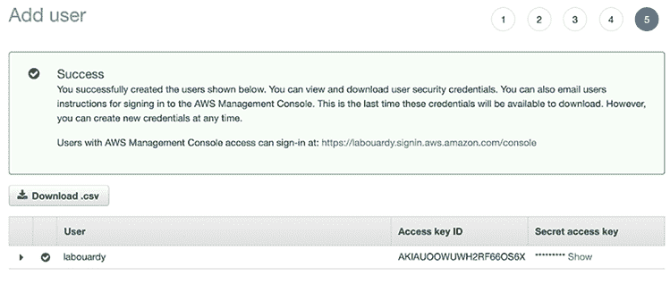

图 3.21 AWS 凭证生成

注意：您可以使用 IAM 用户来代表用户、应用程序或服务。在下一章中，我们将为 HashiCorp Terraform 和 Packer 工具创建专门的 IAM 用户。

接下来，使用`aws configure`命令配置 AWS CLI。CLI 会将前一个命令中指定的凭证存储在本地文件`~/.aws/credentials`下（或在 Windows 上的`%UserProfile%\.aws\credentials`），内容如下（将`eu-central-1`替换为您的 AWS 区域）：

```
[default]
region=eu-central-1
aws_access_key_id=ACCESS KEY ID
aws_secret_access_key=SECRET ACCESS KEY
```

注意：您可以通过使用`--region`命令行选项的`AWS_DEFAULT_REGION`环境变量来覆盖您的 AWS 资源所在区域。

应该就是这样；尝试以下命令，如果您有一个 S3 存储桶，您应该能够看到列出的凭证。否则，命令将返回无结果：

```
aws s3 ls
```

现在 AWS 环境已经设置好了，让我们开始部署 AWS 上的 Jenkins 集群。

## 摘要

+   在分布式构建模式下部署 Jenkins 允许解耦编排、构建执行，并提高性能。

+   Jenkins 是 DevOps 链中的关键组件，其停机可能会对 DevOps 环境产生不利影响。为了克服这些，您需要一个高可用性的 Jenkins 设置。

+   AWS CloudWatch 提供了一套丰富的指标来监控 EC2 实例的健康状况。收集的指标可以用于设置警报，并在警报触发时触发扩展策略，例如扩展 Jenkins 工作节点。

+   将构建项目的负载委托给工作节点被称为分布式构建。

+   您可以通过使用 Jenkins 标签来配置构建在特定的工作机器上运行。

+   非常推荐在 VPC 的私有子网中启动您的 Jenkins 部署，出于安全考虑。

+   通过给节点分配标签，您可以指定用于特定作业的资源，并为您的测试设置优雅的排队。
