# 4 使用 Packer 烘焙机器镜像

本章 涵盖

+   不可变基础设施概述

+   使用 Packer 烘焙 Jenkins 机器镜像

+   发现 Jenkins 基础插件

+   执行 Jenkins Groovy 脚本

+   使用 Packer 提供程序自动化 Jenkins 设置

在上一章中，你学习了 Jenkins 分布式模式架构的工作原理。在这一章中，我们将亲自动手，在 AWS 上部署一个 Jenkins 集群。为了快速回顾，你了解到 Jenkins 集群分为两个主要组件：主节点和从节点。在深入实施分布式构建架构之前，我们将部署独立模式，如图 4.1 所示，以涵盖一些基础知识。

要部署此架构，我们需要配置一台服务器（例如，AWS 中的 EC2 实例）。然后，我们将在该机器上安装和配置 Jenkins。虽然这个过程是可行的，但当我们想要扩展 Jenkins 部署时，它并不高效。此外，更新或升级 Jenkins 可能会耗时且痛苦，事情很容易出错——破坏你的 CI/CD 管道，并影响你的产品发布。

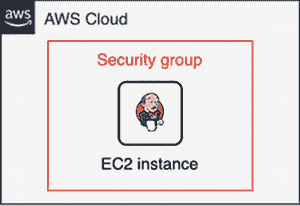

图 4.1 AWS 上的 Jenkins 独立架构

因此，我们不是在基础设施创建（EC2 实例部署）后安装 Jenkins 并在现有的 Jenkins 实例上应用更新（升级或维护的情况），所有更改都必须打包到一个新的机器镜像中。应该基于新镜像部署一个新的 Jenkins 实例，然后销毁旧服务器。这个过程创建了一个被称为 *不可变基础设施*的东西。

## 4.1 不可变基础设施

不可变基础设施的核心是那些在基础设施创建后重新创建和替换的不可变组件，而不是更新。这种不可变基础设施减少了出错的地方数量。这有助于减少不一致性并提高部署过程中的可靠性。

当不可变基础设施需要更新时，会使用预配置的镜像部署新的服务器，并销毁旧服务器。我们创建一个新的机器镜像，用于部署和使用，以创建新的服务器。在不可变基础设施中，我们将配置设置从服务器创建过程移动到构建过程。由于所有部署都是通过新镜像完成的，因此我们可以保留以前发布的版本历史，以便在需要回滚到旧构建时使用。这使我们能够减少部署时间和配置失败的机会，并扩展部署。图 4.2 阐述了不可变和可变基础设施之间的差异。

注意，从“黄金”机器镜像生成的新的实例 B 在不可变模式中实例 A 被销毁时进行配置。此外，请注意，在具有多个实例同时运行的精心设计的不可变模式中替换实例时，没有 Jenkins 停机时间。相比之下，在可变模式中，实例 A 并没有被替换。相同的实例通过手动或使用脚本或工具进行修改，Jenkins 从 v1.0 更新到 v2.0。

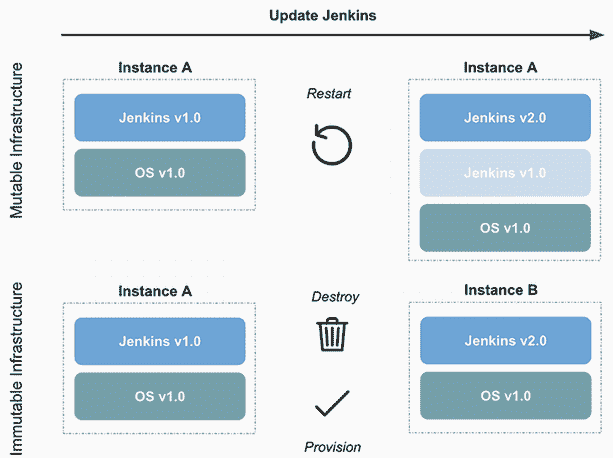

图 4.2 通过可变和不可变基础设施进行更新

在云计算时代，许多公司正在采用不可变基础设施来简化配置管理并通过使用基础设施即代码来提高可靠性。使用不可变基础设施时，我们不是在运行的服务器上进行更改，而是创建一个新的服务器。创建不可变基础设施很困难，需要复杂的构建和测试过程。实现不可变基础设施的最佳方式是使用经过充分测试和验证的工具。

多种工具和框架允许您构建不可变基础设施。其中最著名的是 HashiCorp Packer、HashiCorp Vagrant 和 Docker。在这本书中，我们将通过使用 Packer 来专注于机器镜像。目标是展示构建不可变基础设施的工作流程，并展示如何使用 Packer 实现完全自动化。然而，相同的流程也可以在采用其他替代方案时应用。

## 4.2 介绍 Packer

HashiCorp Packer ([www.packer.io](https://www.packer.io)) 是一个轻量级且易于使用的开源工具，可以自动化为多个平台创建任何类型的机器镜像。Packer 不是配置管理工具（如 Ansible、Puppet 或 Chef）的替代品。Packer 与这些工具协同工作，在创建镜像的同时安装和配置软件及其依赖项。

Packer 使用配置文件来创建机器镜像。然后它使用构建器在目标平台上启动实例，并运行配置器来配置应用程序或服务。一旦设置完成，它将关闭实例并保存带有任何所需后处理的新的烘焙机器实例。

使用 Packer 有许多优点。以下是一些：

+   *快速基础设施部署*—机器镜像使我们能够更快地启动配置好的机器。

+   *可扩展性*—Packer 在镜像创建过程中为机器安装和配置所有需要的软件和依赖项。相同的镜像可以用来生成任意数量的实例，而无需进行额外配置。（例如，可以使用相同的镜像部署多个 Jenkins 工作节点。）

+   *多提供者支持*—Packer 可以用于为多个云提供商（如 AWS、GCP 和 Microsoft Azure）创建镜像。

图 4.3 使用 Packer 的典型机器镜像构建过程

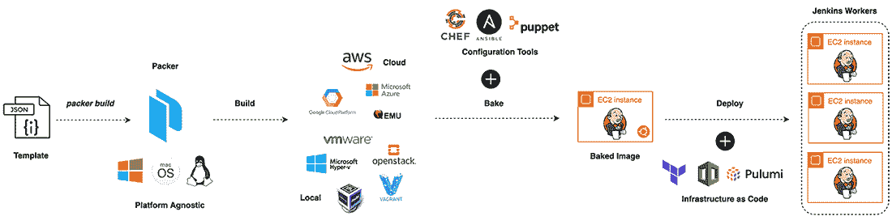

图 4.3 使用 Packer 构建 Jenkins 机器镜像

使用 Packer 的缺点是管理现有镜像：您需要通过使用标签或版本自行管理它们，并持续删除旧的、未使用的镜像（在 AWS 中，您需要为构成您的机器镜像或 AMI 的位存储付费）。

### 4.2.1 它是如何工作的？

图 4.4 说明了 Packer 用于烘焙机器镜像的过程。

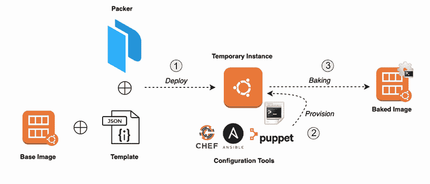

图 4.4 Packer 烘焙工作流程

下面是过程中的步骤：

1.  使用模板文件中定义的基镜像启动临时实例。

1.  使用配置管理工具如 Ansible、Chef 或 Puppet，或者使用简单的自动化脚本来配置实例到所需的状态。

1.  从临时运行实例创建新的机器镜像，并在镜像烘焙完成后关闭临时实例。

创建新的机器镜像后，从这个新镜像启动新的服务器将提供与临时实例上已完成的相同配置。这有助于提供平滑的部署过程。这也帮助我们快速扩展服务。

Packer 配置，也称为模板文件，可以写成 JSON 或 YAML 格式。它由以下三个主要组件组成：

+   *用户变量*—本节用于参数化 Packer 模板文件，以便我们可以将秘密、环境变量和其他参数从模板中排除。本节有助于模板文件的便携性，并有助于分离出我们模板中可以修改的部分。变量可以通过命令行、环境变量、HashiCorp Vault ([www.vaultproject.io](http://www.vaultproject.io/))或文件传递。本节是一个键值映射，变量名被分配了一个默认值。

+   *构建器*—本节包含 Packer 用于生成机器镜像的构建器列表。构建器负责创建实例并从它们生成机器镜像。构建器映射到单个机器镜像。本节包含包括类型（即构建器的名称）、访问密钥以及连接到平台（例如 AWS）所需的凭证等信息。

+   *提供者*—本节是可选的，其中包含 Packer 在创建机器镜像之前，在运行实例中安装和配置软件所使用的提供者列表。类型指定了提供者的名称，例如 Shell、Chef 或 Ansible。

注意：有关支持的构建器的完整列表，请参阅官方文档[www.packer.io/docs/builders/](http://www.packer.io/docs/builders/)。有关支持的提供者的完整列表，请参阅[www.packer.io/docs/provisioners/](http://www.packer.io/docs/provisioners/)。

Packer 在创建镜像时将配置烘焙到机器镜像中。这有助于在出现问题时创建相同的服务器。

### 4.2.2 安装和配置

Packer 是用 Go 编写的，它是一种编译型语言。因此，安装 Packer 很简单；您只需从 [www.packer.io/downloads/](http://www.packer.io/downloads/) 下载适合您的系统和架构的二进制文件即可。图 4.5 显示了下载页面。

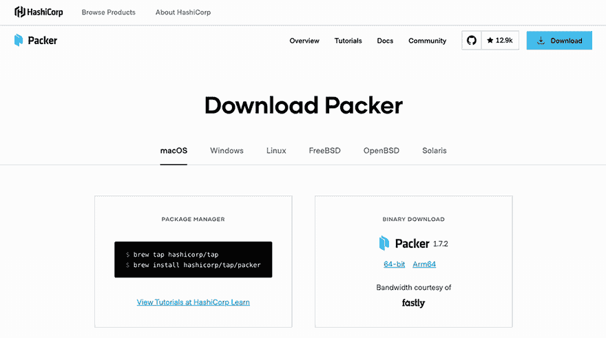

图 4.5 Packer 下载页面

注意：请确保您安装 Packer 二进制文件的目录位于 `PATH` 变量中。

安装 Packer 后，通过打开新的终端会话并执行以下命令来验证安装是否正常工作：

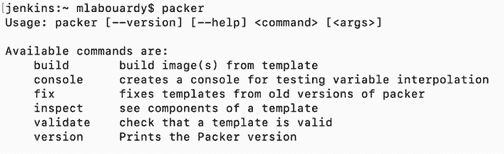

注意：在撰写本书时，Packer 的最新稳定版本为 1.7.2。

如果您收到错误信息，表明找不到 Packer，那么您的 `PATH` 环境变量设置不正确。否则，Packer 已安装，您就可以开始了！

### 4.2.3 烘焙机器镜像

安装 Packer 后，让我们直接进入主题并构建我们的第一个镜像。我们的第一个机器镜像将是一个预安装 Jenkins 的 Amazon EC2 AMI。要创建此 AMI，我们需要编写一个 Packer 配置文件。

注意：为了简洁起见，以下 Packer 模板文件已被裁剪。完整的模板可在 GitHub 仓库的 chapter4 文件夹下找到：[`mng.bz/GO8q`](https://shortener.manning.com/GO8q)。

创建一个 template.json 文件，并填充以下内容。

列表 4.1 用于独立 Jenkins 服务的 Packer 模板。

```
{
    "variables" : { .
        "region" : "AWS REGION",
        "aws_profile": "AWS PROFILE",
        "source_ami" : "AMAZON LINUX AMI ID",
        "instance_type": "EC2 INSTANCE TYPE"
    },
    "builders" : [.
        {
            "type" : "amazon-ebs",
            "profile" : "{{user `aws_profile`}}",
            "region" : "{{user `region`}}",
            "instance_type" : "{{user `instance_type`}}",
            "source_ami" : "{{user `source_ami`}}",
            "ssh_username" : "ec2-user",
            "ami_name" : "jenkins-master-2.204.1",
            "ami_description" : "Amazon Linux Image with Jenkins Server",
    ],
    "provisioners" : [            {
            "type" : "shell",
            "script" : "./setup.sh",
            "execute_command" : "sudo -E -S sh '{{ .Path }}'"
        }
    ]
}
```

此模板文件由三个主要部分组成：

+   `variables`

+   `builders`

+   `provisioners`

我们不是在模板文件中硬编码值，而是在 Packer 运行时可以覆盖的变量中使用。在我们的示例中，我们在表 4.1 中定义了变量。

将 `source_ami` 的值替换为适当的 Amazon Linux AMI ID。Amazon Linux AMI ID 可以通过前往 AWS 管理控制台并导航到 EC2 仪表板找到。点击启动 EC2 实例。在“选择 AMI”选项卡中，在图 4.6 所示的搜索栏中输入`Amazon Linux AMI`。

表 4.1 Packer 变量

| 变量 | 描述 |
| --- | --- |
| `region` | 启动 EC2 实例以创建 AMI 的 AWS 区域名称，例如 `eu-central-1`。虽然您始终可以从一个区域复制 AMI 到另一个区域，但为了简单起见，AMI 位置将与 Jenkins EC2 实例部署到的区域相同。 |
| `aws_profile` | 使用的 AWS 配置文件。有关 AWS CLI 配置的详细信息，请参阅第三章。如果您计划在 EC2 实例内部运行 Packer，也可以通过环境变量或使用 EC2 元数据提供 AWS 凭据。如果您计划使用 AWS 访问和秘密密钥，请勿在模板中保留它们，并且仅通过使用 `-var` 标志在运行时提供。 |
| `instance_type` | 在构建 AMI 时使用的 EC2 实例类型，例如`t2.micro`。支持的实例类型列表可以在[`aws.amazon.com/ec2/instance-types/`](https://aws.amazon.com/ec2/instance-types/)找到。 |
| `source_ami` | 用于启动临时 EC2 实例的基 AMI。在先前的示例中，我们使用的是官方的 Amazon Linux 镜像。您可能需要根据此模板运行时存在的镜像和您使用的 AWS 区域更改源 AMI ID。 |

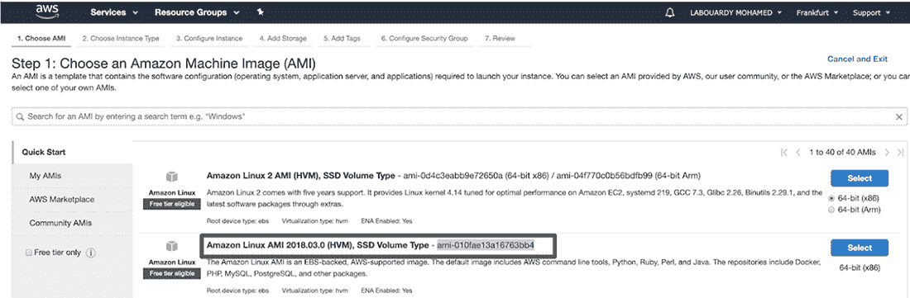

图 4.6 Amazon Linux 镜像标识符

您也可以通过在 Packer 模板文件中使用`source_ami_filter`属性以编程方式找到 ID。此属性将根据定义的过滤器自动填充`source_ami`属性。例如，以下片段选择最新的 Amazon Linux AMI（完整的模板文件可以从 chapter4/standalone/template-with-filter.json 复制）。

```
"builders" : [
        {
            "ami_name" : "jenkins-master-2.204.1",
            "ami_description" : "Amazon Linux Image with Jenkins Server",
            "source_ami_filter": {
                "filters": {
                  "virtualization-type": "hvm",
                  "name": "Amazon Linux AMI-*",
                  "root-device-type": "ebs"
                },
                "owners": ["amazon"],
                "most_recent": true
            }
        }
]
```

如果多个 AMI 都满足`source_ami_filter`中提供的所有过滤条件，则`most_recent`属性将选择最新的 Amazon Linux 镜像。

因为目标机器镜像是一个亚马逊机器镜像，所以我们使用`amazon-ebs`构建器。这是与 Packer 一起提供的亚马逊 EC2 AMI 构建器。这个构建器通过启动源 AMI，在其上提供配置，并将其重新打包成新的 AMI 来构建基于 EBS 的 AMI。根据目标平台，有多种构建器可供选择。EC2、VMware、VirtualBox 和其他平台都有单独的构建器。Packer 默认包含许多构建器，也可以扩展以添加新的构建器。

在`builder`部分中的`ami_name`属性是将在 AWS 控制台中管理 AMI 时出现的最终 AMI 的名称。名称必须是唯一的。为了帮助确保唯一性，我已经将其添加为安装的 Jenkins 服务器版本的名称前缀，但您也可以使用以下格式的当前时间戳：

```
"ami_name" : "jenkins-master-2.204.1-{{timestamp}}"
```

`{{timestamp}}`将被 Packer 模板引擎替换为当前协调通用时间（UTC）的 UNIX 时间戳。

`provisioners`阶段负责安装和配置所有必需的依赖项。Packer 完全支持多种现代配置管理工具，如 Ansible、Chef 和 Puppet。Bash 脚本也受到支持。为了简化 Jenkins AMI 的烘焙过程，我们定义了一个名为 setup.sh 的 bash 脚本，其内容如下。

列表 4.2 安装 Jenkins LTS 的 Bash 脚本

```
#!/bin/bash
yum remove -y java
yum install -y java-1.8.0-openjdk
wget -O /etc/yum.repos.d/jenkins.repo
http://pkg.jenkins-ci.org/redhat-stable/jenkins.repo
rpm --import https://jenkins-ci.org/redhat/jenkins-ci.org.key
yum install -y jenkins
chkconfig jenkins on
service jenkins start
```

脚本是自我解释的：它安装了 Java 开发工具包（JDK），这是运行 Jenkins 所必需的，然后安装 Jenkins 的最新稳定版本。在这里，我们安装了 Jenkins LTS 版本。尽管它在新功能方面可能落后，但它比每周发布版本提供了更多的稳定性。每周的 Jenkins 发布快速向需要它们的问题修复和新功能的用户和插件开发者提供。但对于更保守的用户来说，坚持一个变化较少且只接收重要问题修复的发布线更为可取。

一旦使用 Yum 软件包管理器安装了 Jenkins 软件包，脚本就会配置 Jenkins 在机器使用 `chkconfig` 命令重启后自动启动。

现在我们已经定义了模板文件，我们可以执行以下命令来验证模板文件的语法：

```
packer validate template.json
```

命令将返回零退出状态，表示 template.json 语法有效。

在我们将此模板用于构建镜像之前，我们需要将 AmazonEC2FullAccess 策略分配给第三章中为 Packer 创建的 IAM 用户，以便 Packer 能够部署 EC2 实例并从中创建机器镜像。

返回 AWS 控制台，导航到 IAM 仪表板，然后跳转到用户部分。然后，选择 Packer 用户并附加列表 4.3 中的策略，如图 4.7 所示。

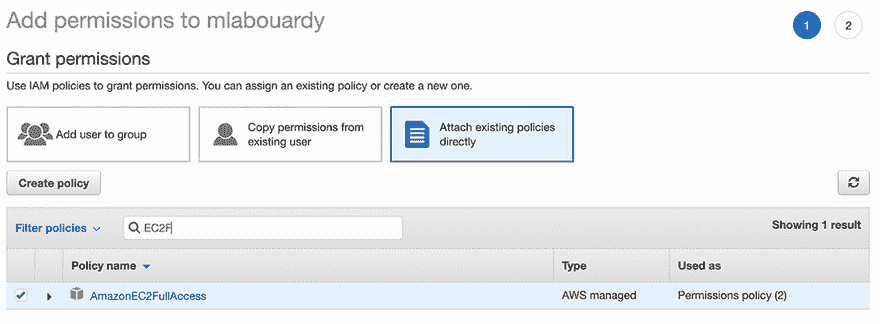

图 4.7 将 EC2 策略附加到 IAM 用户

注意：推荐的做法是提供 Packer 运行所需的最小权限集。以下列表是一个 IAM 策略，其中包含了 Amazon 插件运行所需的最小权限集。

列表 4.3 Packer 的 AWS IAM 策略

```
{
    "Version": "2012-10-17",
    "Statement": [{
        "Effect": "Allow",
        "Action" : [
          "ec2:AttachVolume",
          "ec2:AuthorizeSecurityGroupIngress",
          "ec2:CopyImage",
          "ec2:CreateImage",
          "ec2:CreateKeypair",
          "ec2:CreateSecurityGroup",
          "ec2:CreateSnapshot",
          "ec2:CreateTags",
          "ec2:CreateVolume",
          "ec2:DeleteKeyPair",
          "ec2:DeleteSecurityGroup",
          "ec2:DeleteSnapshot",
          "ec2:DeleteVolume",
          "ec2:DeregisterImage",
          "ec2:DescribeImageAttribute",
          "ec2:DescribeImages",
          "ec2:DescribeInstances",
          "ec2:DescribeInstanceStatus",
          "ec2:DescribeRegions",
          "ec2:DescribeSecurityGroups",
          "ec2:DescribeSnapshots",
          "ec2:DescribeSubnets",
          "ec2:DescribeTags",
          "ec2:DescribeVolumes",
          "ec2:DetachVolume",
          "ec2:GetPasswordData",
          "ec2:ModifyImageAttribute",
          "ec2:ModifyInstanceAttribute",
          "ec2:ModifySnapshotAttribute",
          "ec2:RegisterImage",
          "ec2:RunInstances",
          "ec2:StopInstances",
          "ec2:TerminateInstances"
        ],
        "Resource" : "*"
    }]
  }
```

配置了 IAM 用户后，现在是时候构建您的第一个镜像了。这是通过使用模板文件作为参数调用 `packer build` 命令来完成的：

```
packer build template.json
```

Packer 将根据模板文件中指定的配置部署 EC2 实例，然后在部署的实例上执行 bash 脚本。输出应该类似于以下内容。请注意，这个过程通常需要几分钟。

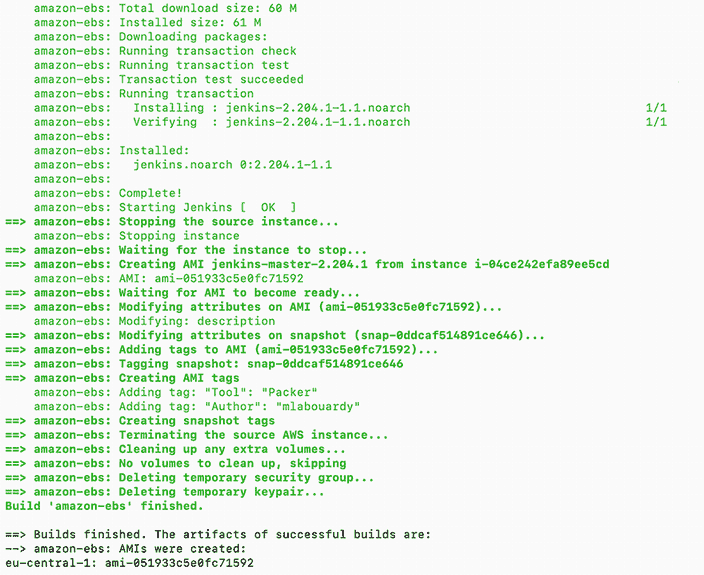

在运行 `packer build` 命令的末尾，Packer 将输出作为构建部分创建的工件。工件是构建的结果，通常代表 AMI ID。（您的 ID 一定会与前面的不同。）在这个例子中，我们只有一个工件：AMI 是在法兰克福区域（`eu-central-1`）创建的。

您可以使用相同的模板文件为不同的平台创建 Jenkins 机器镜像，所有这些镜像都来自相同的规范。这是一个很好的功能，允许您创建不同类型提供商的机器镜像，而无需重复编码。例如，我们可以修改模板以添加 Google Compute Cloud 和 Microsoft Azure 构建器，如下面的列表所示。完整的模板可在 GitHub 存储库中找到（chapter4/standalone/template-multiple-builders.json）。

列表 4.4 Jenkins 多平台机器镜像构建

```
{
    "builders": [
        {
            "type": "amazon-ebs",
            "profile": "{{user `aws_profile`}}",
            "region": "{{user `region`}}",
            "instance_type": "{{user `instance_type`}}",
            "source_ami": "{{user `source_ami`}}",
            "ssh_username": "ec2-user",
            "ami_name": "jenkins-master-2.204.1",
            "ami_description": "Amazon Linux Image with Jenkins Server",
        },
        {
            "type": "azure-arm",
            "subscription_id": "{{user `subscription_id`}}",
            "client_id": "{{user `client_id`}}",
            "client_secret": "{{user `client_secret`}}",
            "tenant_id": "{{user `tenant_id`}}",
            "managed_image_resource_group_name": "{{user `resource_group`}}",
            "managed_image_name": "jenkins-master-v22041",
            "os_type": "Linux",
            "image_publisher": "OpenLogic",
            "image_offer": "CentOS",
            "image_sku": "8.0",
            "location": "{{user `location`}}",
            "vm_size": "Standard_B1ms"
        },
        {
            "type": "googlecompute",
            "image_name": "jenkins-master-v22041",
            "account_file": "{{user `service_account`}}",
            "project_id": "{{user `project`}}",
            "source_image_family": "centos-8",
            "ssh_username": "packer",
            "zone": "{{user `zone`}}"
        }
    ]
}
```

Packer 将并行创建多个平台的多个 Jenkins 镜像，所有这些镜像都从单个模板配置。在这个例子中，Packer 可以并行创建 Amazon Machine Image、Azure 镜像和 Google Compute Engine 镜像，使用相同的脚本进行配置，从而产生几乎相同的 Jenkins 镜像。

注意：有关如何为 Azure 虚拟机和 Google Compute Engine 实例烘焙机器图像的逐步指南，请参阅第六章。

一旦创建 AMI，Packer 将终止临时 EC2 实例，烘焙好的 AMI 将在 EC2 仪表板上的镜像部分下的 AMIs 部分中可用，如图 4.8 所示。

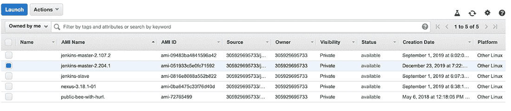

图 4.8 在镜像部分有一个新的烘焙镜像可用。

现在我们已经创建了 Jenkins AMI，让我们测试一下，看看 Jenkins 是否已正确安装。跳转到实例，点击启动实例按钮。然后，从我的 AMIs 部分选择 Packer 构建的 AMI，如图 4.9 所示。

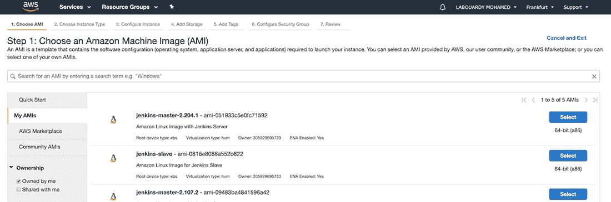

图 4.9 新 AMI 可以从我的 AMIs 部分选择。

对于实例类型，选择一种通用实例，例如`t2.micro`，它是免费层合格的。我们将在下一章中介绍 Jenkins 资源需求。

目前，将所有其他值保留在默认设置。导航到添加标签部分，并在值框中为您的 EC2 实例输入一个名称。这个名称，更准确地说是*标签*，将在实例启动时出现在控制台中。这使得跟踪正在运行的 Jenkins 实例变得容易。

配置安全组（控制实例流量的防火墙）以允许来自任何地方的 8080 端口的流量。8080 端口是 Jenkins Web 仪表板的默认端口。

注意：实例将在默认 VPC 内部署。在第五章中，我们将从头开始部署 Jenkins 集群到自定义 VPC，并介绍高级网络配置。

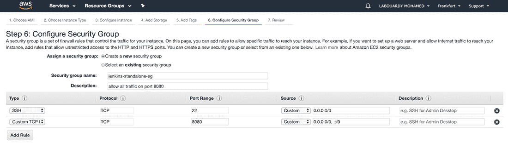

图 4.10 允许 8080 端口的流量

EC2 实例的安全组规则应类似于图 4.10。

确保允许来自您计算机的公共 IPv4 地址的 22 端口的入站流量，以便授权 SSH 流量。这是强制性的；否则，您将无法稍后解锁 Jenkins 仪表板。

最后，在审查部分验证配置细节，并选择一个 SSH 密钥对，或者如果你是第一次启动 EC2 实例，创建一个新的密钥对。这个配置将允许你通过 SSH 连接到你的实例。

一旦实例运行，将你的浏览器指向实例的公共 IP 地址，并指定端口 8080。Jenkins 设置向导应该会出现在屏幕上，如图 4.11 所示。恭喜你——你已经成功从使用 Packer 构建的定制 AMI 中部署了 Jenkins 实例。

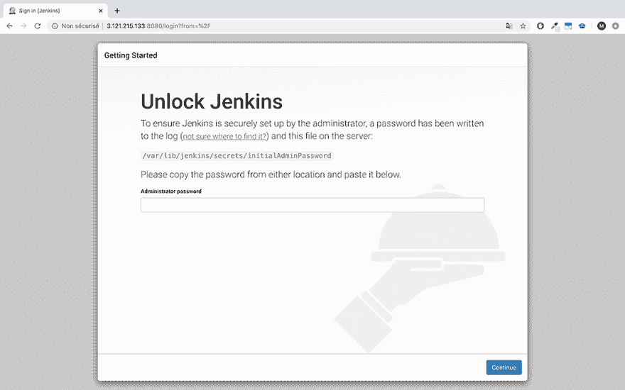

图 4.11 Jenkins 设置向导

你将被要求使用初始密码解锁 Jenkins。你可以在这个文件中找到这个密码：/var/lib/jenkins/secrets/initialAdminPassword。（以下章节将介绍如何为 Jenkins 创建自定义管理员账户。）

到目前为止，我们已经以独立模式部署了 Jenkins。图 4.12 总结了当前部署的架构。


图 4.12 AWS 中的 Jenkins 独立模式

注意：确保当你不再需要实例时终止它，以停止为此实例产生费用。

接下来，你将学习如何使用 Groovy 脚本来定制和配置 Jenkins 设置，同时烘焙 Jenkins 主 AMI。此外，我们还将创建另一个 Jenkins 工作节点镜像，以实现 Jenkins 的规模部署。

## 4.3 烘焙 Jenkins 主 AMI

我们可以使用上一节中构建的 AMI，但最终的 Jenkins 实例仍然有许多需要手动配置的设置，包括 Jenkins 管理员凭证、设置 CI/CD 管道的所需插件和安全检查。虽然你可以手动配置这些设置，但本书的目的是尽可能避免运营开销。我们希望在部署一个高可用性和容错性强的 Jenkins 集群时，使用自动化工具如 HashiCorp Packer 和 Terraform，通过少量命令自动化繁琐的任务。

注意：当我提到“高可用性”时，我指的是一个可以持续运行而不会出现故障的 Jenkins 集群。

要完全自动化 Jenkins 主实例，我们将使用 Jenkins 初始化脚本。我们将利用 Groovy 脚本的力量，并将它们放置在 $JENKINS_HOME/init.groovy.d 目录中。这个目录将在 Jenkins 启动时被消耗。因此，它可以用来预先配置 Jenkins 到目标所需状态。

### 4.3.1 启动时配置 Jenkins

这些脚本是用 Groovy 编写的，并在与 Jenkins 相同的 Java 虚拟机（JVM）中执行，允许完全访问 Jenkins 的领域模型（我们可以访问 Jenkins 及其所有插件中的类）。

注意：Groovy 脚本的另一种选择是 Jenkins 配置为代码（JCasC）插件。更多详情，请参考 GitHub 上的官方指南：[`mng.bz/zEJa`](http://mng.bz/zEJa)。

列表 4.5 中的 basic-security.groovy 脚本创建了一个具有完全管理员访问权限的 Jenkins 用户。（您需要将 `USERNAME` 和 `PASSWORD` 属性替换为您自己的值。）此外，默认情况下，匿名读取访问被禁用，这意味着 Jenkins 需要身份验证才能访问网页仪表板。但是，您可以在 `instance.save()` 语句之前添加 `strategy.setAllowAnonymousRead(true)` 指令来启用匿名读取访问。

列表 4.5 basic-security.groovy 脚本

```
#!groovy

import jenkins.model.*
import hudson.security.*

def instance = Jenkins.getInstance()                     ❶
def hudsonRealm = new HudsonPrivateSecurityRealm(false)
hudsonRealm.createAccount('USERNAME','PASSWORD')         ❷
instance.setSecurityRealm(hudsonRealm)

def strategy = new FullControlOnceLoggedInAuthorizationStrategy()
instance.setAuthorizationStrategy(strategy)              ❸
instance.save()
```

获取 Jenkins 模型的一个实例

通过注册密码为用户创建一个新的账户

❸   允许已登录用户完全访问

除了用户管理之外，我们还将为加强 Jenkins 的安全性设置一些基本配置，以防止 CSRF 攻击。启用 CSRF 保护后，所有发出的令牌都应该包含一个网络会话，以防止外部攻击者获取网络会话。但是，如果您的自动化脚本使用 CSRF 令牌进行身份验证，您可以通过安装 Strict Crumb Issuer 插件（在构建 Jenkins 图像时安装的插件列表中可用）来排除网络会话 ID 的验证标准。我们将在以下列表中通过 csrf-protection.groovy 脚本启用 CSRF 保护。

列表 4.6 csrf-protection.groovy 脚本

```
#!groovy

import hudson.security.csrf.DefaultCrumbIssuer
import jenkins.model.Jenkins

def instance = Jenkins.getInstance()
instance.setCrumbIssuer(new DefaultCrumbIssuer(true))     ❶
instance.save()
```

通过设置 crumb 发起器启用 CSRF 保护

此选项在新安装中默认启用，从 Jenkins 2.*x* 开始。您也可以通过更新 `JENKINS_JAVA_OPTIONS` 来启用 CSRF。添加以下参数：

```
JENKINS_JAVA_OPTIONS="-Dhudson.security.csrf.DefaultCrumbIssuer=true"
```

注意：如果您正在使用 Jenkins 代码检查功能来验证 Jenkinsfile 与受 CSRF 保护的 Jenkins 服务器，由于 Jenkins 2.96，您需要使用不需要 CSRF 令牌（crumb）的 API 令牌。

Jenkins 内置了一个 CLI，允许用户和管理员从脚本或 shell 环境访问 Jenkins。出于安全原因（防止远程访问），不建议使用 CLI。因此，我们将通过以下列表中的 disable-cli.groovy 脚本来禁用它。

列表 4.7 disable-cli.groovy 脚本

```
#!groovy

import jenkins.model.Jenkins

Jenkins jenkins = Jenkins.getInstance()      ❶
jenkins.CLI.get().setEnabled(false)          ❶
jenkins.save()
```

❶   获取 Jenkins 实例并禁用 CLI 访问

我们还将禁用 JNLP 和旧的未加密协议（JNLP-connect、JNLP2-connect、JNLP3-connect 和 CLI-connect），以消除网页仪表板中的警告信息。禁用-jnlp.groovy 脚本如下所示。

列表 4.8 disable-jnlp.groovy 脚本

```
#!groovy

import jenkins.model.Jenkins
import jenkins.security.s2m.*

Jenkins jenkins = Jenkins.getInstance()
jenkins.setSlaveAgentPort(-1)                                               ❶
HashSet<String> newProtocols = new HashSet<>(jenkins.getAgentProtocols());  ❷
newProtocols.removeAll(Arrays.asList(                                       ❷
        "JNLP3-connect", "JNLP2-connect", "JNLP-connect", "CLI-connect"     ❷
));                                                                         ❷
jenkins.setAgentProtocols(newProtocols);                                    ❷
jenkins.save()
```

设置 0 以指示随机可用的 TCP 端口，-1 以禁用此服务

❷   使用可用的代理协议初始化 HashSet 结构，从结构中删除旧的未加密协议，并保存新的列表

为开发或故障排除向新的本地 Jenkins 服务器添加凭据可能是一项艰巨的任务。然而，通过 Groovy 脚本和正确的设置，开发者可以自动化将所需的凭据添加到新的 Jenkins 服务器中。

列表 4.9 中的 Groovy 脚本基于我们将用于部署 Jenkins 工作节点实例的 AWS 密钥对创建 SSH 凭据。SSH 凭据对象是通过使用 `BasicSSHUserPrivateKey` 构造函数创建的，它接受凭据范围、用户名、SSH 私钥和密码短语作为参数。这些 SSH 凭据的使用将在第五章中说明。

列表 4.9 节点代理 Groovy 脚本

```
import jenkins.model.*
import com.cloudbees.plugins.credentials.*
import com.cloudbees.plugins.credentials.common.*
import com.cloudbees.plugins.credentials.domains.*
import com.cloudbees.plugins.credentials.impl.*
import com.cloudbees.jenkins.plugins.sshcredentials.impl.*
import hudson.plugins.sshslaves.*;

domain = Domain.global()
store = Jenkins.instance
.getExtensionList('com.cloudbees.plugins.credentials \
                   .SystemCredentialsProvider')[0].getStore()

slavesPrivateKey = new BasicSSHUserPrivateKey(CredentialsScope.GLOBAL,   ❶
         "Jenkins-workers",                                              ❶
         "Ec2-user",                                                     ❶
         new BasicSSHUserPrivateKey.UsersPrivateKeySource(),             ❶
         "", "")                                                         ❶
store.addCredentials(domain, slavesPrivateKey)                           ❶
```

❶ 创建一个类型为“SSH 用户名与私钥”的 Jenkins 凭据。构造函数接受用户名、私钥、密码短语和描述作为参数。

注意：现在每次 Jenkins 服务器重启时，脚本都会运行并为你应用配置。你不需要担心每次服务器重启时都要手动执行这些设置。

你可以使用 Groovy 初始化脚本来自定义 Jenkins 并强制执行所需的状态。尽管编写 Groovy 脚本需要了解 Jenkins 内部和 API，但你已经看到了如何在 Jenkins 初始化时使用 Groovy 脚本配置常见任务和设置。我们仍然需要安装插件以扩展 Jenkins 功能，以便能够构建 CI/CD 管道。

### 4.3.2 发现 Jenkins 插件

插件可以从 Jenkins 仪表板轻松安装。然而，本节的目的在于构建一个完全自动化的 Jenkins AMI，因为如果你想要安装许多插件，这个手动过程可能会相当长且无聊。因此，我们将使用 Jenkins 社区提供的脚本安装插件，包括它们的依赖项。这些脚本接受一个包含要安装的 Jenkins 插件列表的文件作为参数。

表 4.2 列出了一些最有用的插件，这些插件可以帮助开发者节省时间，并使他们的生活更加轻松。完整的列表可以在 GitHub 仓库的 chapter4/distributed/master/config/plugins.txt 中找到。

表 4.2 必备的 Jenkins 插件

| 插件 | 描述 |
| --- | --- |
| blueocean | 提供了新的 Jenkins 用户体验，具有复杂的 CI/CD 管道可视化以及一个捆绑的管道编辑器，该编辑器通过引导用户通过直观和可视化的过程创建管道，使自动化 CI/CD 工作流程变得易于接近。请参阅第二章以探索 Blue Ocean 模式的关键特性。 |
| git | 提供对任何 Git 服务器访问权限，并在 Jenkins 管道中支持基本的 Git 操作。它可以拉取、获取、检出、分支、列出、合并、标记和推送 Git 仓库。 |
| ssh-agent | 允许你通过 Jenkins 中的 ssh-agent 为构建提供 SSH 凭据。ssh-agent 是一个辅助程序，用于保存用于公钥认证的私钥。 |
| ssh-credentials | 允许你在 Jenkins 中存储 SSH 凭据。它用于通过 SSH 启动 Jenkins 工作节点，并在 Kubernetes 集群上远程执行 Docker 命令。 |
| slack | 提供了 Jenkins 与 Slack 的通知集成。它可以在 CI/CD 管道完成后发送 Slack 通知，显示 Jenkins 作业的构建状态。此插件需要在 Slack 端进行一些简单的设置，以便连接和发布消息。 |
| credentials-binding | 允许将凭证绑定到环境变量，以便在杂项构建步骤中使用。它为您提供了一个简单的方法来打包所有作业的秘密文件和密码，并在构建期间使用环境变量访问它们。 |
| github-pullrequest | 对于将 Jenkins 与 GitHub 仓库集成至关重要，它支持 GitHub 拉取请求、分支和自定义 webhook。每次打开拉取请求时，GitHub 都会触发一个新的钩子，一旦 Jenkins 收到钩子，它就会运行相关的作业。 |
| job-dsl | 允许以程序化的形式在可读文件中定义作业。它可以用来为 Jenkins freestyle 作业创建复杂的管道。 |
| jira | 几乎做了它所说的所有事情。它允许开发者在 Jenkins 中集成 Jira ([www.atlassian.com/software/jira](http://www.atlassian.com/software/jira))，以在 CI/CD 管道中更新 Jira 开放问题。它还将构建和部署信息与相关的 Jira 票据关联，并在 Jira 板上暴露有关管道的关键信息。 |
| htmlpublisher | 在构建时生成 HTML 报告非常有用。它可以用来生成代码覆盖率 HTML 报告，并以用户友好的方式跟踪测试覆盖应用程序源代码的百分比。 |
| email-ext | 可以用来发送电子邮件通知。它高度可定制：您可以配置通知触发器、内容和收件人。此外，它支持电子邮件正文的纯文本和 HTML 格式。 |
| sonar | 允许轻松集成 SonarQube ([www.sonarqube.org](http://www.sonarqube.org/))，这是一个开源平台，用于持续检查代码质量和代码安全性。 |
| embeddable-build-status | 为您的所有 Jenkins 作业生成徽章，实时显示它们的构建状态。您可以将这些徽章添加到 Git 仓库的 README.md 文件中。 |

注意：这些只是我们将要使用的一些插件，未来的章节将提供更多插件以供探索。

在 Jenkins 管道中，有超过一千个插件可供使用，几乎支持构建、部署和自动化项目的所有解决方案、工具和流程。如图 4.13 所示的 Jenkins 插件索引，在 [`plugins.jenkins.io/`](https://plugins.jenkins.io/) 上有超过 1,800 个插件，免费下载和使用。

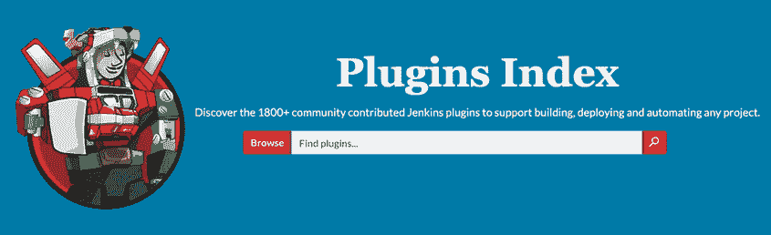

图 4.13 Jenkins 插件

注意：在安装 Jenkins 插件之前，请务必查看插件描述页面中的变更日志，因为并非所有插件都安全使用。此外，始终选择可用的最新稳定版本。

现在您对基本的 Jenkins 插件更加熟悉了。让我们继续安装它们。

列表 4.10 中的脚本将逐行遍历包含 Jenkins 插件列表的文件，然后向 Jenkins 插件索引发出 cURL 命令以下载插件。最后，脚本将下载的插件文件复制到 /var/lib/jenkins/plugins 文件夹。列表展示了主要功能，完整的脚本可以从 GitHub 仓库 chapter4/distributed/master/config/install-plugins.sh 下载。

列表 4.10 install-plugins.sh 脚本

```
#!/bin/bash
installPlugin() {
  if [ -f ${plugin_dir}/${1}.hpi -o -f ${plugin_dir}/${1}.jpi ]; then
    if [ "$2" == "1" ]; then
      return 1
    fi
    echo "Skipped: $1 (already installed)"
    return 0
  else
    echo "Installing: $1"
    curl -L --silent --output ${plugin_dir}/${1}.hpi  https://updates.jenkins-ci.org/latest/${1}.hpi
    return 0
  fi
}
```

.hpi 扩展名代表 *Hudson 插件*（记住，Jenkins 是 Hudson 项目的分支）。随着从 Hudson 转向 Jenkins，这变成了 *Jenkins 插件*，因此出现了 .jpi 格式。自从 Jenkins v1.5 版本发布以来，所有 .hpi 插件文件在启动时都会自动重命名为 .jpi。

到目前为止，我们已经配置并自动化了所有设置即插即用 Jenkins 服务器所需的任务。因此，在 Jenkins 启动时无需设置向导（见图 4.11）。因此，我们将通过编写 Groovy 初始化脚本来禁用它。创建一个包含以下内容的 skip-jenkins-setup.groovy 脚本。

列表 4.11 skip-jenkins-setup.groovy 脚本

```
#!groovy

import jenkins.model.*
import hudson.util.*;
import jenkins.install.*;

def instance = Jenkins.getInstance()
instance.setInstallState(InstallState.INITIAL_SETUP_COMPLETED)
```

最后，我们将更新第一部分使用的 Packer 模板文件，通过使用文件 *provisioner* ([www.packer.io/docs/provisioners/file/](https://www.packer.io/docs/provisioners/file/)) 将之前描述的 Groovy 脚本复制到临时实例。接下来，我们使用 shell provisioner 将这些文件移动到 init.groovy.d 文件夹。template.json 文件应类似于以下列表。

列表 4.12 Jenkins 主机模板文件

```
{
    "variables" : {...},                                         ❶
    "builders" : [
        {
            "type" : "amazon-ebs",
            "profile" : "{{user `aws_profile`}}",
            "region" : "{{user `region`}}",
            "instance_type" : "{{user `instance_type`}}",
            "source_ami" : "{{user `source_ami`}}",
            "ssh_username" : "ec2-user",
            "ami_name" : "jenkins-master-2.204.1",               ❷
            "ami_description" : "Amazon Linux Image with Jenkins Server"
        }
    ],
    "provisioners" : [
        {
            "type" : "file",                                     ❸
            "source" : "./scripts",                              ❸
            "destination" : "/tmp/"                              ❸
        },
        {
            "type" : "file",                                     ❹
            "source" : "./config",                               ❹
            "destination" : "/tmp/"                              ❹
        },
        {
            "type" : "file",                                     ❺
            "source" : "{{user `ssh_key`}}",                     ❺
            "destination" : "/tmp/id_rsa"                        ❺
        },
        {
            "type" : "shell",                                    ❻
            "script" : "./setup.sh",                             ❻
            "execute_command" : "sudo -E -S sh '{{ .Path }}'"    ❻
        }
    ]
}
```

❶ 应在此处声明变量列表，例如：aws_profile、region、instance_type 和 source_ami

❷ 烘焙机器镜像的名称。版本号（2.204.1）应根据您当前安装的版本进行替换。

❸ 将 Groovy 脚本文件夹从本地机器复制到主机机的 /tmp 文件夹

❹ 将配置文件从本地机器复制到主机机的 /tmp 文件夹

❺ 将用户私有的 SSH 密钥复制到 /tmp 文件夹

❻ 执行 setup.sh 脚本来将文件从 /tmp 文件夹复制到正确的文件夹，并安装 Jenkins 及其依赖项

备注：为了简洁，省略了变量部分。完整的模板文件可以在 GitHub 上找到，位于 chapter4/distributed/master/template.json。

SSH 密钥可以使用 `ssh-keygen` 生成。该命令将提供一系列提示。请随意使用默认值。然而，从安全角度考虑，输入密码短语是个好主意。表 4.3 提供了 Packer 变量的完整列表。

表 4.3 Jenkins 主机 Packer 变量

| 变量 | 描述 |
| --- | --- |
| `region` | Jenkins 主机机器镜像将被创建的 AWS 区域，例如 `eu-central-1` （也称为法兰克福）。 |
| `aws_profile` | 在 AWS 共享凭证文件中使用的配置文件。有关指定配置文件的更多详细信息，请参阅 Amazon 的文档：[`docs.aws.amazon.com/sdk-for-go/v1/developer-guide/configuring-sdk.html`](https://docs.aws.amazon.com/sdk-for-go/v1/developer-guide/configuring-sdk.html)。 |
| `instance_type` | 在烘焙目标 AMI 时使用的 EC2 实例类型，例如 `t2.micro`，它是免费层合格的。 |
| `source_ami` | 将作为临时实例基础的源 AMI。我们使用官方的 Amazon Linux 映像。ID 应根据您使用的 AWS 区域进行更新。请参考图 4.6 以获取示例。 |
| `ssh_key` | 私有 SSH 密钥位置 (~/.ssh/id_rsa)，这是您将用于 SSH 到 Jenkins 工作实例的相同密钥。在启动时将执行一个 Groovy 脚本，将私有密钥作为凭证添加到 Jenkins 主机，以通过 SSH 设置与 Jenkins 工作实例的初始连接。 |

一旦文件上传到由 Packer 构建的临时实例，就会执行 setup.sh 脚本来安装 Jenkins LTS 版本。接下来，脚本安装 Git 客户端（用于在高级章节中克隆 GitHub 仓库）。然后，它将工作实例的私有 SSH 密钥复制到 /var/lib/jenkins/.ssh 文件夹并设置权限。最后，它将 Groovy 脚本移动到初始化文件夹，通过执行 install-plugins.sh 脚本来安装基本插件，并启动 Jenkins 服务器。

值得注意的是，脚本文件已上传到 /tmp 文件夹；Packer 只能上传到配置用户 (`ec2-user`) 有权限访问的位置。以下列表包含 setup.sh 的内容。

列表 4.13 setup.sh 脚本（安装 Jenkins）

```
#!/bin/bash
yum remove -y java
yum install -y java-1.8.0-openjdk                                        ❶
wget -O /etc/yum.repos.d/jenkins.repo                                    ❶
http://pkg.jenkins-ci.org/redhat-stable/jenkins.repo                     ❶
rpm --import https://jenkins-ci.org/redhat-stable/jenkins-ci.org.key     ❶
yum install -y jenkins                                                   ❶
chkconfig jenkins on                                                     ❶

yum install -y git                                                       ❷
mkdir /var/lib/jenkins/.ssh                                              ❸
touch /var/lib/jenkins/.ssh/known_hosts                                  ❸
chown -R jenkins:jenkins /var/lib/jenkins/.ssh                           ❸
chmod 700 /var/lib/jenkins/.ssh                                          ❸
mv /tmp/id_rsa /var/lib/jenkins/.ssh/id_rsa                              ❸
chmod 600 /var/lib/jenkins/.ssh/id_rsa                                   ❸
chown -R jenkins:jenkins /var/lib/jenkins/.ssh/id_rsa                    ❸

mkdir -p /var/lib/jenkins/init.groovy.d                                  ❹
mv /tmp/*.groovy /var/lib/jenkins/init.groovy.d/                         ❹
mv /tmp/jenkins /etc/sysconfig/jenkins
chmod +x /tmp/install-plugins.sh                                         ❺
bash /tmp/install-plugins.sh                                             ❺
service jenkins start                                                    ❻
```

❶ 安装 JDK（最低版本 v1.8.0），这是 Jenkins 运行所必需的

❷ 安装 Git 客户端，在后续章节中克隆 GitHub 项目仓库时将需要使用

❸ 将用于部署 Jenkins 工作实例/代理的私有 SSH 密钥复制到 JENKINS_HOME

❹ 将 Groovy 脚本移动到 init.groovy.d

❺ 通过运行 install-plugins.sh 安装所需的依赖项

❻ 启动 Jenkins 服务

模板目录结构应如下所示。脚本目录包含初始配置和种子脚本。配置文件夹包含要安装的基本插件的列表，以及从 Jenkins 插件索引安装插件的 shell 脚本：

```
├── config
│     ├── install-plugins.sh
│     ├── jenkins
│     └── plugins.txt
├── scripts
│     ├── basic-security.groovy
│     ├── csrf-protection.groovy
│     └── disable-cli.groovy
│     ├── disable-jnlp.groovy
│     ├── node-agent.groovy
│     └── skip-jenkins-setup.groovy
├── setup.sh
└── template.json
```

注意：Jenkins 在 /etc/sysconfig/jenkins 文件中捕获启动配置参数。如果您想添加 Java 参数，那就是您要找的文件。

在构建 AMI 之前，通过发出 `packer` 的 `validate` 命令验证模板文件的语法正确性是个好主意。如果模板有效，预期的输出是 `Template validated successfully`。

现在模板已验证，我们将使用 `packer` 的 `build` 命令来烘焙 AMI：

```
packer build template.json
```

该过程可能需要几分钟。预期输出类似于以下内容。

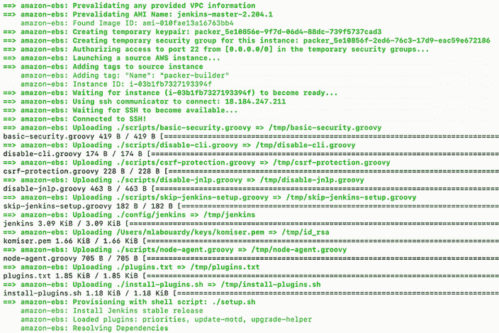

如果脚本成功，Packer 应该显示包含 AMI ID 的消息，并且 Jenkins 主节点 AMI 将在 EC2 仪表板中可用，如图 4.14 所示。

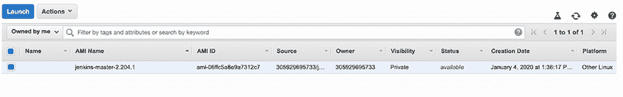

图 4.14 Jenkins 主节点 AMI

注意：AMI 名称应该是唯一的。因此，如果已经存在，您可能需要从您的 AWS 账户中删除现有的镜像。

最后，我们可以基于烘焙的 AMI 启动一个 EC2 实例。一旦实例运行，将您的浏览器指向实例的公共 IP 地址的 8080 端口。过一会儿，您将看到图 4.15 中的屏幕。


图 4.15 Jenkins 网页仪表板

这次，设置向导应该会消失，并且应该添加许多功能。使用列表 4.5 中的基本安全.groovy 脚本中定义的管理员凭据登录。登录后，您可以通过转到左侧的凭据项来验证 Jenkins 凭据是否已创建；请参见图 4.16。到目前为止，只创建了 Jenkins 工作节点 SSH 凭据（请参见列表 4.9），但您可以通过自定义 Groovy 脚本来创建针对 GitHub、Nexus 或 SonarQube 等外部服务的其他凭据。

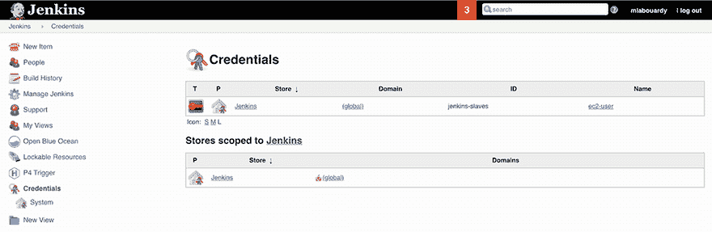

图 4.16 Jenkins 凭据

此外，还安装了基本插件。从主页跳转到管理 Jenkins，然后导航到插件。您应该在已安装选项卡上看到默认安装的插件列表，如图 4.17 所示。

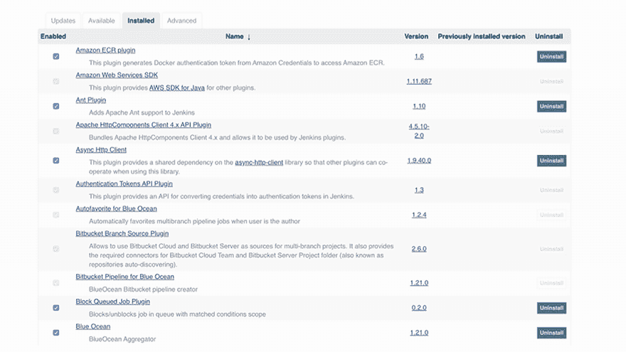

图 4.17 Jenkins 已安装插件

现在我们已经将 Jenkins 配置定义为代码，我们可以在不同的机器上尽可能多地启动它，以获得相同的结果。而且我们没有经历任何繁琐的 GUI 手动操作。

## 4.4 烘焙 Jenkins 工作节点 AMI

Jenkins 工作节点 AMI 烘焙过程应该是直接的；请参见以下列表。一个实例要成为 Jenkins 工作节点或构建代理的唯一要求是拥有 JDK。现代 Jenkins 版本需要 Java 8 运行环境。

列表 4.14 Jenkins 工作节点模板文件

```
{
    "variables" : {...},
    "builders" : [
        {
            "type" : "amazon-ebs",
            "profile" : "{{user `aws_profile`}}",
            "region" : "{{user `region`}}",
            "instance_type" : "{{user `instance_type`}}",
            "source_ami" : "{{user `source_ami`}}",
            "ssh_username" : "ec2-user",
            "ami_name" : "jenkins-worker",
            "ami_description" : "Jenkins worker's AMI",

    ],
    "provisioners" : [
        {
            "type" : "shell",
            "script" : "./setup.sh",
            "execute_command" : "sudo -E -S sh '{{ .Path }}'"
        }
    ]
}
```

表 4.4 中的变量应在模板文件构建时间内提供，或使用 `-var` 标志。

表 4.4 Jenkins 工作节点 Packer 变量

| 变量 | 描述 |
| --- | --- |
| `region` | AWS 区域，其中将创建 Jenkins 工作节点机器镜像。类似于 Jenkins 主节点 AWS 区域值。 |
| `aws_profile` | 在 AWS 共享凭据文件中使用的配置文件。有关指定配置文件的更多详细信息，请参阅 Amazon 的文档：[`mng.bz/01Yx`](http://mng.bz/01Yx)。 |
| `instance_type` | 在烘焙目标 AMI 时使用的 EC2 实例类型，例如`t2.micro`，它符合免费层资格。 |
| `source_ami` | 将作为临时实例基础的源 AMI。我们使用官方的 Amazon Linux 镜像。ID 应根据您使用的 AWS 区域进行更新。 |

Packer 将使用 shell 提供程序来安装 JDK，以及您可能需要运行构建的任何工具（例如 Git 或 Docker）。您可以将此脚本进一步扩展，创建一个名为`jenkins`的用户，并为其创建一个主目录以存储 Jenkins 作业工作空间，如下所示。

列表 4.15 setup.sh 脚本。

```
#!/bin/bash
yum remove -y java
yum update -y
yum install -y git docker java-1.8.0-openjdk
usermod -aG docker ec2-user
systemctl enable docker
```

注意：Docker 是必需的，因为我们将在接下来的章节中为 Docker 化的微服务定义 CI/CD 管道。

输出`packer build`命令以烘焙 Jenkins 工作节点 AMI。一旦图像烘焙过程完成，工作节点的 AMI 将在 EC2 仪表板上可用，如图 4.18 所示。


图 4.18 Jenkins 工作节点 AMI

注意：在运行前面的示例之后，您的 AWS 账户现在已关联了一个 AMI。这些 AMI 由 Amazon 存储在 S3 中，因此除非您希望每月支付约 0.01 美元的费用，否则如果您不需要这些镜像，您可能希望删除它们。

现在我们已经准备好了 Jenkins 集群 AMI，我们将在下一章中使用它们，通过 HashiCorp Terraform IaC 工具在 AWS 上部署我们的集群。图 4.19 说明了 Terraform 的集成方式。

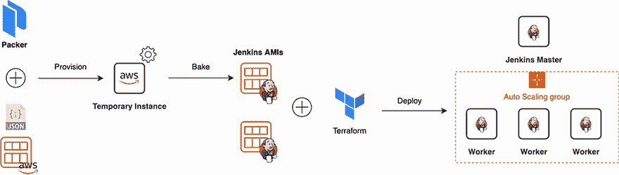

图 4.19 Packer 将从模板文件中提供一个临时实例，并使用所有需要的配置和依赖项配置该实例。然后，Terraform 将基于烘焙的镜像部署 EC2 实例。

如果您计划采用不可变基础设施方法来升级 Jenkins 或安装额外的插件，使用 Packer 触发配置过程可能会变得具有挑战性。这就是为什么您应该选择自动化，并使用 Jenkins 设置一个管道来自动化 AMI 的烘焙工作流程。基本工作流程将使用 GitHub 存储 Packer 模板文件，并在推送事件上触发 Jenkins 上的构建。作业将验证模板更改，启动烘焙过程（1），并基于新的烘焙 AMI 创建一个 EC2 实例（2）。图 4.20 总结了整个工作流程。

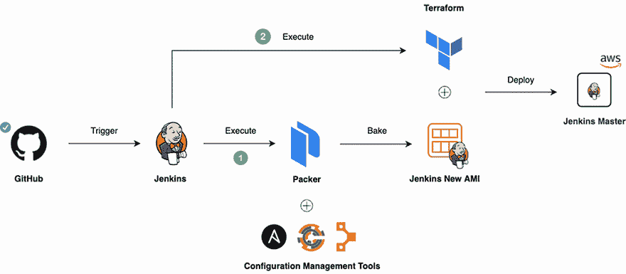

图 4.20 使用 Jenkins 自动化 AMI

注意：第七章介绍了如何设置 GitHub 钩子，以便在发生推送或合并事件时持续触发 Jenkins 构建作业。

## 摘要

+   HashiCorp Packer 利用不可变基础设施的力量来烘焙包含所有所需依赖项的自定义机器镜像。

+   设置 Jenkins 是一个复杂的过程，因为 Jenkins 及其插件都需要调整和配置，在“管理 Jenkins”部分的 Web UI 中需要设置数十个参数。

+   在 init.groovy 目录中的配置脚本在 Jenkins 启动时按字母顺序执行。这对于设置种子和配置作业接口是理想的。

+   Jenkins 提供了数千个插件来支持构建、部署和自动化任何项目。

+   每周发布的 Jenkins 版本迅速为需要它们的用户和插件开发者提供错误修复和新功能。然而，长期支持版本因其稳定性而更受欢迎。
