# 6 在多个云服务提供商上部署高可用性 Jenkins

本章涵盖

+   使用 Packer 自动化 Jenkins VM 的构建过程

+   在 Azure、GCP 和 DigitalOcean 上部署 Jenkins 集群

+   通过按需创建 Jenkins 工作节点来降低部署成本

+   使用相同的 Packer 模板在不同的云服务提供商中创建相同的 Jenkins 机器镜像

你已经看到了如何在 AWS 上部署 Jenkins 集群来实现容错。本章将尝试通过使用相同的工具和流程来自动化在 Microsoft Azure、Google Cloud Platform 和 DigitalOcean 等不同云服务提供商上创建集群，从而在基础设施级别实现相同的需求速度和自动化——从基础设施即服务（IaaS）到平台即服务（PaaS）提供商。

你可能会注意到本章的一些部分与上一章中你阅读的内容相似，甚至完全相同。这种部分重复的原因是为了实现本书的目标，即说明如何使用 Jenkins 与云原生应用结合使用——因为并非每个人都将 AWS 作为他们的主要云服务提供商，我希望这本书对其他人以及跳过第五章直接到这里的人都有用。

注意：使用本章中详细说明的提供商带来一些好处和缺点。无论你选择哪个提供商，你都会在某个阶段遇到问题。

## 6.1 谷歌云平台

我们都知道 AWS 没有最友好的 Web 控制台。*谷歌云平台*（GCP）通过提供更好的用户体验而成功超越了 AWS。GCP 由各种服务组成，从计算到网络，再到比其竞争对手（AWS）便宜 25%的提取-转换-加载（ETL）管道，这得益于更低的增量计费（10 分钟而不是 1 小时）。

此外，GCP 在处理大数据方面拥有更多专业知识，例如 BigQuery ([`cloud.google.com/bigquery`](https://cloud.google.com/bigquery))、Cloud Bigtable ([`cloud.google.com/bigtable`](https://cloud.google.com/bigtable)) 和 Dataflow ([`cloud.google.com/dataflow`](https://cloud.google.com/dataflow))等服务。此外，您还可以在 Kubernetes 上运行容器工作负载，并使用 TensorFlow 部署机器学习（ML）模型；Kubernetes 和 TensorFlow 都源自 Google。然而，与市场上最老练、最成熟的云服务提供商 AWS 相比，GCP 仍缺乏一些功能。

那么，为什么要在 GCP 上使用 Jenkins 呢？您可以与 Kubernetes 实现无缝集成；使用 Google Kubernetes Engine (GKE) 等服务，您可以运行短暂的 Jenkins 工作节点，确保每个构建都在干净的环境中运行。原生支持 Docker 容器是另一个原因，例如使用容器注册服务来存储和管理 CI/CD 管道中构建的 Docker 镜像。此外，您还可以集成安全性和合规性，并获取有关构建工件漏洞影响和可用修复的详细报告。最后，当您使用 GCP 虚拟机 (VM) 加速 Jenkins 构建时，您将按使用量付费。

话虽如此，让我们转到 GCP 上使用 Terraform 和 Packer 部署 Jenkins 集群的步骤。要开始，请使用 Gmail 地址注册一个免费帐户（[`console.cloud.google.com/`](https://console.cloud.google.com/)）。您将自动获得 12 个月的免费试用，并享有 300 美元的信用额度。您需要提供信用卡详细信息，但在试用期间结束或用完 300 美元信用额度之前，您不会产生额外费用。

注意：部署 Jenkins 集群的预估成本为 $0.00。此成本假设您处于 GCP 免费层限制内，并且在部署基础设施后的 1 小时内终止所有资源。

### 6.1.1 构建 Jenkins 虚拟机镜像

为了让 Packer 构建自定义镜像，它需要与 GCP 交互。因此，我们需要为 Packer 创建一个专用的服务帐户，以便授权其访问 Google API 中的资源。

前往 GCP 控制台并导航到图 6.1 所示的 IAM & Admin 仪表板。在服务帐户部分，创建一个名为`Packer`的新服务帐户，然后单击“创建”按钮。

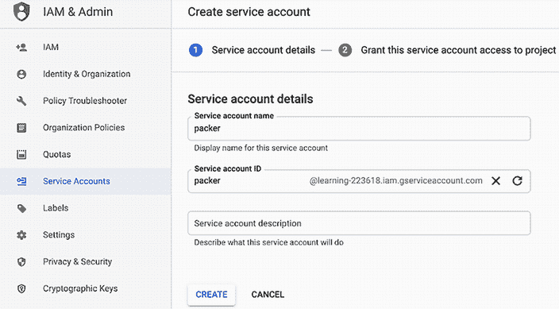

图 6.1 创建 Packer 服务帐户

将项目所有者角色分配给服务帐户（或至少选择 Compute Engine Instance Admin 和 Service Account User 角色），然后单击“继续”按钮，如图 6.2 所示。

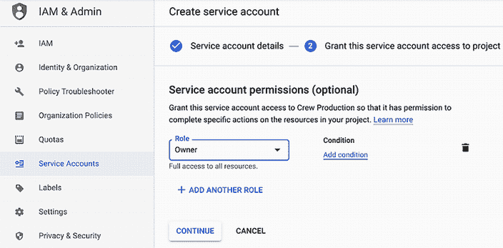

图 6.2 设置 Packer 服务帐户权限

每个服务帐户都与一个密钥（JSON 或 P12 格式）相关联，该密钥由 GCP 管理。此密钥用于服务到服务的身份验证。通过单击“创建密钥”按钮下载 JSON 密钥。服务帐户文件将在计算机上创建和下载。复制此 JSON 文件并将其放置在安全文件夹中。确保在您的 GCP 项目中启用了 Google Compute Engine API。

注意：如果您不熟悉 Packer，请参阅第四章以获取安装和配置的逐步指南。

接下来，更新第四章列表 4.16 中提供的 Jenkins 工作节点 Packer 模板文件，或从第六章 GitHub 仓库 chapter6/gcp/packer/worker/setup.sh 复制并粘贴以下内容。

列表 6.1 Jenkins 工作节点模板文件。

```
{
    "variables" : {
        "service_account" : "SERVICE ACCOUNT JSON FILE PATH",     ❶
        "project": "GCP PROJECT ID",                              ❶
        "zone": "GCP ZONE ID"                                     ❶
    },
    "builders" : [
        {
            "type": "googlecompute",
            "image_name" : "jenkins-worker",
            "account_file": "{{user `service_account`}}",
            "project_id": "{{user `project`}}",
            "source_image_family": "centos-8",
            "ssh_username": "packer",
            "zone": "{{user `zone`}}"
          }
    ],
    "provisioners" : [
        {
            "type" : "shell",                                     ❷
            "script" : "./setup.sh",                              ❷
            "execute_command" : "sudo -E -S sh '{{ .Path }}'"     ❷
        }
    ]
}
```

❶ 定义在运行时提供的变量。这些值可以从 GCP 仪表板中获取。

❷ 以特权模式运行 shell 脚本以安装 Git 客户端、Docker 和所需的依赖项

注意：如果您从配置了 GCE 服务账户的 Google Compute Engine (GCE)实例运行烘焙过程，则不需要 JSON 账户文件。Packer 将从元数据服务器获取凭证。

列表 6.1 使用`googlecompute`构建器在 CentOS 基础镜像之上创建机器镜像。然后它使用第四章列表 4.13 中提供的 shell 脚本来配置临时机器以安装所有需要的依赖项——Git、JDK 和 Docker。

Packer 的强大之处在于利用模板文件来创建与目标平台无关的相同虚拟机镜像。因此，我们可以使用相同的模板文件为 AWS、GCP 或 Azure 构建相同的 Jenkins 镜像。

注意：脚本化的 shell 在第四章中有详细解释。所有源代码都可以在 GitHub 仓库的 chapter6 文件夹中找到。

列表 6.1 中的模板文件使用了一组变量，例如之前创建的服务账户密钥文件、构建器机器将要部署的区域名称以及将拥有镜像的 Google Cloud 项目 ID。"service_account"变量可以隐式指定，如果您指定了带有`GOOGLE_APPLICATION_CREDENTIALS`环境变量的 JSON 文件路径。

Packer 将从 CentOS 8 部署一个临时实例。可在“镜像”仪表板中找到可用镜像列表，如图 6.3 所示。

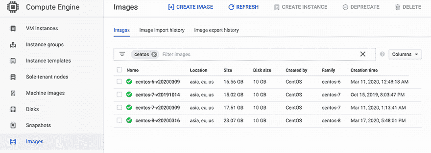

图 6.3 来自 GCE 镜像的 CentOS 基础镜像

注意：您也可以使用`gcloud compute images list`命令列出特定 GCP 位置上的可用镜像。

在提供所有必要的变量后，发出`packer build`命令。输出应类似于以下输出，这里为了简洁已裁剪：

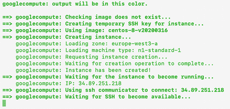

一旦烘焙过程完成，Jenkins 工作节点镜像应该可以在 Google Compute Engine (GCE)控制台上找到，如图 6.4 所示。

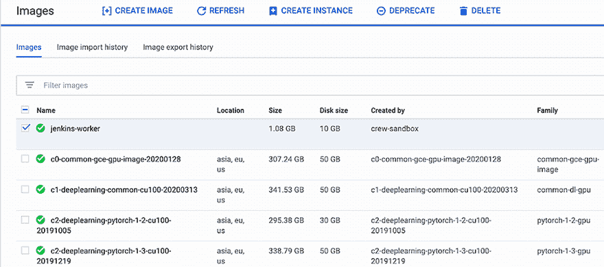

图 6.4 Jenkins 工作节点自定义镜像

接下来，为了构建 Jenkins 主机的机器镜像，我们将使用第四章列表 4.12 中提供的相同蓝图。唯一的区别是`builders`部分使用了`googlecompute`。完整的模板文件，如以下列表所示，可以从 chapter6/gcp/packer/master/setup.sh 下载。

列表 6.2 Jenkins 主模板文件。

```
{
    "variables" : {
        "service_account" : "SERVICE ACCOUNT JSON PATH",
        "project": "PROJECT ID",
        "zone": "ZONE ID",
        "ssh_key" : "PRIVATE SSH KEY PATH"
    },
    "builders" : [
        {
            "type": "googlecompute",
            "image_name" : "jenkins-master-v22041",
            "account_file": "{{user `service_account`}}",
            "project_id": "{{user `project`}}",
            "source_image_family": "centos-8",
            "ssh_username": "packer",
            "zone": "{{user `zone`}}"
          }
    ],
    "provisioners" : [
       ...
    ]
}
```

注意：此代码列表已在 GitHub 仓库中存在。您无需输入它。这里仅展示用于说明。

在我们从模板中构建镜像之前，让我们通过运行以下命令来验证模板：

```
packer validate template.json
```

在模板经过适当验证后，是时候构建 Jenkins 镜像了。这是通过调用带有模板文件的`packer build`命令来完成的。输出应类似于以下内容。请注意，此过程通常需要几分钟时间：

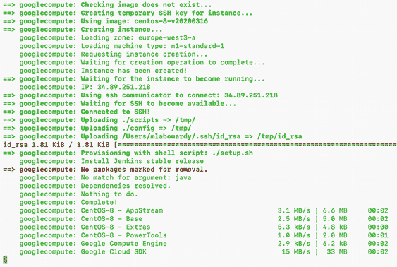

当 Packer 完成镜像构建后，前往 GCP 控制台，新创建的镜像将在“镜像”部分，如图 6.5 所示。


图 6.5 Jenkins 主自定义镜像

到目前为止，你已经学会了如何在 GCP 上自动化构建 Jenkins 机器镜像的过程。在下一节中，我们将使用 Terraform 根据这些镜像部署 VM 实例。但首先，我们将部署一个私有网络，我们的 Jenkins 集群将在这个网络中隔离。

### 6.1.2 使用 Terraform 配置 GCP 网络

在本节结束时，你将有一个在不同区域运行的独立 VPN，如图 6.6 所示。

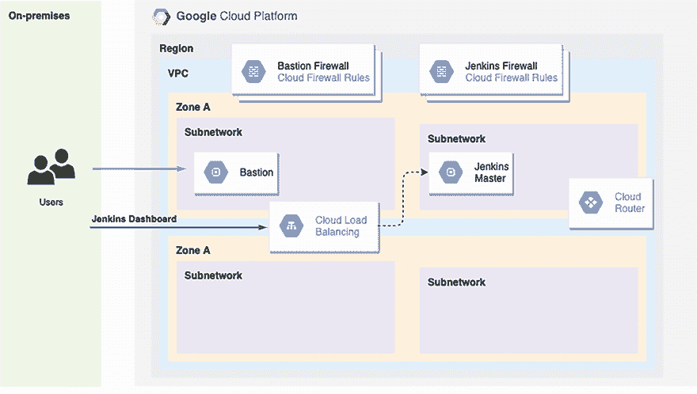

图 6.6 Google VPN 架构由多个在不同区域部署的子网络组成。要访问私有实例，可以使用堡垒主机。

VPC 将在单个 GCP 区域启动。它将被细分为子网，每个子网都在单个区域中。在公共子网中，将部署一个 Google 计算实例，其角色为堡垒主机，以提供对私有子网中部署的实例的远程访问。

在 IAM 控制台，如图 6.7 所示，为 Terraform 创建一个具有项目所有者权限的专用服务账户并下载 JSON 私钥。此文件包含 Terraform 管理 GCP 项目中资源所需的凭证。

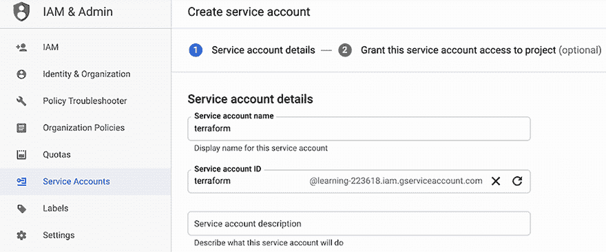

图 6.7 Terraform 服务账户

创建一个 terraform.tf 文件，声明`google`作为提供者，并将其配置为使用之前步骤中创建的服务账户；请参阅以下列表。

列表 6.3 声明 Google 作为提供者

```
provider "google" {
  credentials = file(var.credentials_path)
  project     = var.project
  region      = var.region
}
```

创建一个 network.tf 文件并定义一个区域 VPC 网络，如下所示列表。（如果你计划在多个 GCP 区域部署 Jenkins 实例，你需要将路由模式更改为全局。）

列表 6.4 定义名为 management 的 GCP 网络

```
resource "google_compute_network" "management" {
  name = var.network_name
  auto_create_subnetworks = false
  routing_mode = "REGIONAL"
}
```

在同一文件中，声明两个公共子网和两个私有子网，如下所示列表。每个子网都有自己的 CIDR 块，它是网络 CIDR 块的子集（10.0.0.0/16）。

列表 6.5 定义公共和私有子网

```
resource "google_compute_subnetwork" "public_subnets" {
  count = var.public_subnets_count
  name          = "public-10-0-${count.index * 2 + 1}-0"
  ip_cidr_range = "10.0.${count.index * 2 + 1}.0/24"           ❶
  region        = var.region
  network       = google_compute_network.management.self_link
}

resource "google_compute_subnetwork" "private_subnets" {
  count = var.private_subnets_count
  name          = "private-10-0-${count.index * 2}-0"
  ip_cidr_range = "10.0.${count.index * 2}.0/24"               ❶
  region        = var.region
  network       = google_compute_network.management.self_link
  private_ip_google_access = true
}
```

❶ 使用 count.index 变量在 10.0.0.0/16 块内定义一个唯一的 CIDR 范围

在使用`terraform apply`应用更改之前，声明用于参数化和自定义部署的变量在 variables.tf 中。表 6.1 列出了变量。

表 6.1 GCP Terraform 变量

| 名称 | 类型 | 值 | 描述 |
| --- | --- | --- | --- |
| `credentials_path` | 字符串 | 无 | JSON 格式的服务账户密钥文件的路径。这可以使用 `GOOGLE_CREDENTIALS` 环境变量来指定。 |
| `project` | 字符串 | 无 | 管理资源时的默认项目。如果在资源上指定了另一个项目，则该项目将具有优先权。这也可以使用 `GOOGLE_PROJECT` 环境变量来指定。 |
| `region` | 字符串 | 无 | 管理资源时的默认区域。如果在区域资源上指定了另一个区域，则该区域将具有优先权。或者，也可以使用 `GOOGLE_REGION` 环境变量来指定。 |
| `network_name` | 字符串 | `management` | 虚拟网络名称。名称长度必须为 1-63 个字符，并匹配正则表达式 `a-z?` |
| `public_subnets_count` | 数字 | 2 | 公共子网的数量。默认情况下，我们将为容错性在不同的区域创建两个公共子网。 |
| `private_subnets_count` | 数字 | 2 | 私有子网的数量。默认情况下，我们将为容错性在不同的区域创建两个私有子网。 |

我们现在可以运行 Terraform 来部署基础设施。首先，初始化 Terraform 以下载 Google Cloud 提供者插件的最新版本：

```
terraform init
```

命令输出如下：


运行 `plan` 步骤以验证配置语法并预览将要创建的内容：

```
terraform plan --var-file=variables.tfvars
```

注意：为了设置大量变量，在变量定义文件（文件名以 .tfvars 或 .tfvars.json 结尾）中指定它们的值会更方便，然后使用 `-var-file` 标志在命令行上指定该文件。

现在执行 `terraform apply` 命令以应用这些更改：

```
terraform apply --var-file=variables.tfvars
```

您将看到类似以下内容的输出（为了简洁而裁剪）：

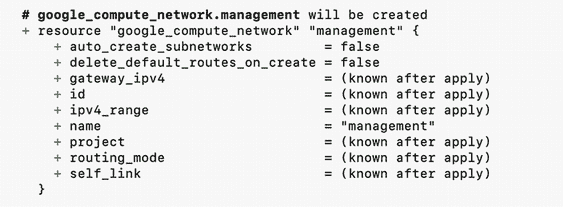

配置私有网络应该只需几分钟。完成后，您应该看到类似于图 6.8 的内容。

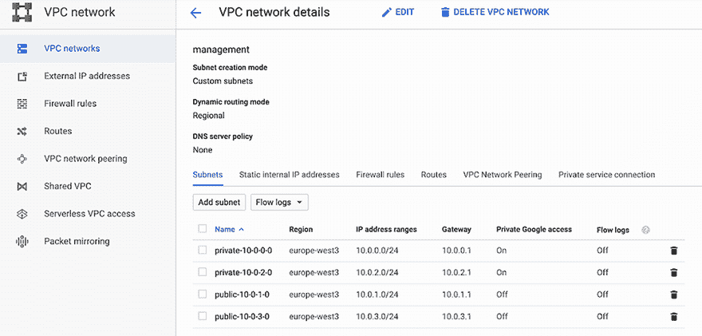

图 6.8 VPC 网络及其公共和私有子网

要能够通过 SSH 连接到私有 Jenkins 实例，我们将部署一个堡垒主机。创建 bastion.tf 并在公共子网中定义一个具有静态 IPv4 公共 IP 地址的 VM 实例。要使用终端（而不是 GCP 控制台）通过 SSH 连接到堡垒实例，您必须生成并上传一个公共 SSH 密钥（默认位于 ~/.ssh/id_rsa.pub 下，或使用 `ssh-keygen` 生成一个新的密钥）。以下列表中定义的 `metadata` 属性引用了公共 SSH 密钥。

列表 6.6 堡垒主机资源

```
resource "google_compute_address" "static" {
  name = "ipv4-address"
}
resource "google_compute_instance" "bastion" {
  project      = var.project
  name         = "bastion"
  machine_type = var.bastion_machine_type
  zone         = var.zone
  tags = ["bastion"]
  boot_disk {
    initialize_params {
      image = var.machine_image
    }
  }
  network_interface {
    subnetwork = google_compute_subnetwork.public_subnets[0].self_lin.

    access_config {
      nat_ip = google_compute_address.static.address
    }
  }
  metadata = {
    ssh-keys = "${var.ssh_user}:${file(var.ssh_public_key)}"
  }
}
```

在同一文件中，创建一个防火墙规则以允许从堡垒主机上的任何地方进行 SSH，如下所示列表。（建议只启用来自您希望允许访问的 IP 地址的入站流量..）

列表 6.7 堡垒主机防火墙规则

```
resource "google_compute_firewall" "allow_ssl_to_bastion" {
  project = var.project
  name    = "allow-ssl-to-bastion"
  network = google_compute_network.management.self_link

  allow {
    protocol = "tcp"                ❶
    ports    = ["22"]               ❶
  }                                 ❶

  source_ranges = ["0.0.0.0/0"]     ❶

  source_tags = ["bastion"]
}
```

❶ 允许来自任何地方的端口 22（SSH）的入站流量

最后，创建一个 outputs.tf 文件，并使用 Terraform 的 `output` 变量作为助手来暴露堡垒虚拟机的公共 IP 地址：

```
output "bastion" {
    value = "${google_compute_instance.bastion.network_interface
    .0.access_config.0.nat_ip }"       ❶
}
```

❶ 输出堡垒实例的公共 IP 地址

在 `terraform apply` 命令完成后，您应该看到类似以下输出的内容：

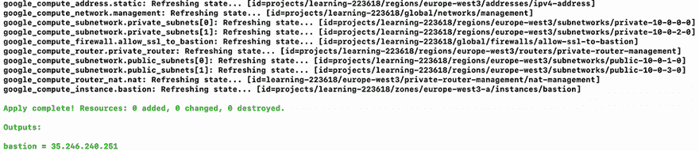

在 GCE 控制台中，应该部署一个新的虚拟机实例，如图 6.9 所示。

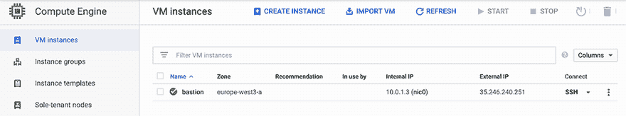

图 6.9 堡垒虚拟机实例

跳转盒部署完成后，我们现在可以访问 VPC 网络中的私有实例。

### 6.1.3 在 Google Compute Engine 上部署 Jenkins

现在 VPC 已创建，我们将在私有子网中基于 Jenkins 主镜像部署一个虚拟机实例，并公开一个负载均衡器以访问端口 8080 上的 Jenkins 网络仪表板，如图 6.10 所述。

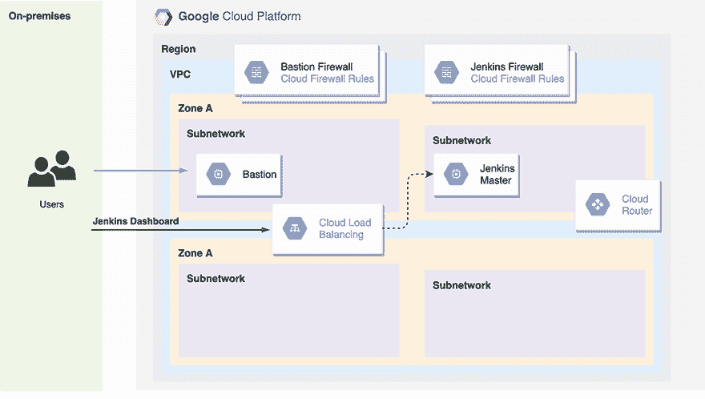

图 6.10 VPC 内的 Jenkins 主虚拟机

创建一个 jenkins_master.tf 文件，并定义一个具有以下列表中属性的私有计算实例。

列表 6.8 Jenkins 主计算实例

```
resource "google_compute_instance" "jenkins_master" {
  project      = var.project
  name         = "jenkins-master"
  machine_type = var.jenkins_master_machine_type
  zone         = var.zone

  tags = ["jenkins-ssh", "jenkins-web"]      ❶

  depends_on = [google_compute_instance.bastion]

  boot_disk {
    initialize_params {
      image = var.jenkins_master_machine_image
    }
  }

  network_interface {
    subnetwork = google_compute_subnetwork.private_subnets[0].self_lin.
  }

  metadata = {
    ssh-keys = "${var.ssh_user}:${file(var.ssh_public_key)}"
  }
}
```

❶ 将 jenkins-ssh 和 jenkins-web 网络连接到虚拟机实例。这些组分别允许端口 22 和 8080（Jenkins 仪表板）上的入站流量。

计算实例使用以下防火墙，仅允许堡垒主机上的 SSH 访问和来自任何地方的端口 8080 的入站流量。（我建议限制流量到您的网络 CIDR 块。）

列表 6.9 Jenkins 主防火墙和流量控制

```
resource "google_compute_firewall" "allow_ssh_to_jenkins" {
  project = var.project
  name    = "allow-ssh-to-jenkins"
  network = google_compute_network.management.self_link

  allow {
    protocol = "tcp"           ❶
    ports    = ["22"]          ❶
  }

  source_tags = ["bastion", "jenkins-ssh"]
}

resource "google_compute_firewall" "allow_access_to_ui" {
  project = var.project
  name    = "allow-access-to-jenkins-web"
  network = google_compute_network.management.self_link

  allow {
    protocol = "tcp"          ❷
    ports    = ["8080"]       ❷
  }

  source_ranges = ["0.0.0.0/0"]

  source_tags = ["jenkins-web"]
}
```

❶ 允许端口 22（SSH）上的入站流量

❷ 允许端口 8080 上的入站流量，其中 Jenkins 仪表板被暴露

使用 `terraform apply` 来部署 Jenkins 计算实例。一旦部署完成，将部署一个新的虚拟机，如图 6.11 所示。

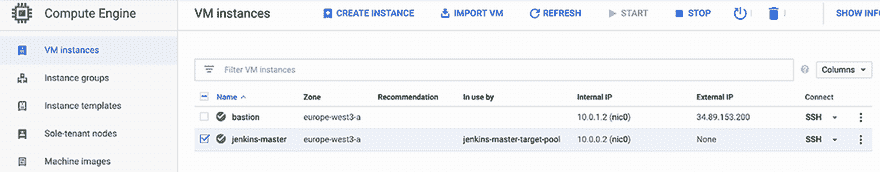

图 6.11 Jenkins 主虚拟机实例

实例部署在私有子网内。为了能够访问 Jenkins 网络仪表板，我们需要在虚拟机实例前面部署一个公共负载均衡器。

GCP 上的负载均衡与其他云提供商不同。主要区别在于 GCP 使用转发规则而不是路由实例。这些转发规则与后端服务、目标池和健康检查结合，在实例组中构建一个功能性的负载均衡器。

首先，我们定义一个目标池资源，该资源定义了应接收传入流量的实例，如下一列表所示。在我们的情况下，目标池将包括 Jenkins 主 VM 实例。

列表 6.10 Jenkins 主目标池

```
resource "google_compute_target_pool" "jenkins-master-target-pool" {
    name             = "jenkins-master-target-pool"
    session_affinity = "NONE"
    region = var.region

    instances = [
        Google_compute_instance.jenkins_master.self_link     ❶
    ]

    health_checks = [
        google_compute_http_health_check.jenkins_master_health_check.name
    ]
}
```

❶ 将 Jenkins 主 VM 实例定义为网络负载均衡器的目标

只有当云负载均衡器处于运行状态并准备好接收流量时，才会将流量转发到 Jenkins 主机。这就是为什么我们定义了一个健康检查资源，在端口 8080 上以特定频率向 Jenkins 主机发送健康检查请求；请参阅以下列表。

列表 6.11 Jenkins 主健康检查

```
resource "google_compute_http_health_check" "jenkins_master_health_check" {
  name         = "jenkins-master-health-check"
  request_path = "/"         ❶
  port = "8080"              ❶
  timeout_sec        = 4     ❶
  check_interval_sec = 5     ❶
}
```

❶ 定义了如何通过 HTTP 检查 Jenkins 主机的健康状态模板

最后，在下一个列表中，我们定义了一个转发规则，将流量导向之前定义的目标池。

列表 6.12 负载均衡器转发规则

```
resource "google_compute_forwarding_rule" "jenkins_master_forwarding_rule" {
  name   = "jenkins-master-forwarding-rule"
  region = var.region
  load_balancing_scheme = "EXTERNAL"                                        ❶
  target = google_compute_target_pool.jenkins-master-target-pool.self_link  ❶
  port_range            = "8080"                                            ❶
  ip_protocol           = "TCP"                                             ❶
}
```

❶ 如果入站数据包与给定的 IP 地址、IP 协议和端口号范围匹配，它将被转发到 Jenkins 主机目标池。

使用 `terraform apply` 来部署公共负载均衡器。在网络服务仪表板上，您应该看到图 6.12 中所示的配置。

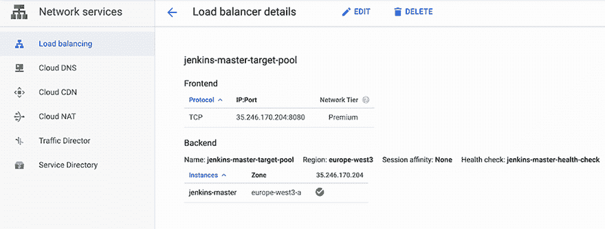

图 6.12 以 Jenkins VM 作为后端的公共负载均衡器

作为后端，负载均衡器使用 Jenkins 主机实例，并将入站流量在 8080 端口转发到同一端口的后端。同时，它还在 8080 端口上设置了一个 HTTP 健康检查。

要显示负载均衡器的 IP 地址，在 outputs.tf 文件中创建一个输出部分：

```
output "jenkins" {
   value = google_compute_forwarding_rule \
.jenkins_master_forwarding_rule.ip_address
}
```

在控制台上执行 `terraform output` 命令，Jenkins 负载均衡器 IP 地址应该会显示出来：


您现在可以将浏览器指向 8080 端口的 IP 地址，并看到 Jenkins 欢迎屏幕。如果您看到如图 6.13 所示的屏幕，您已成功在 GCP 上部署了 Jenkins！

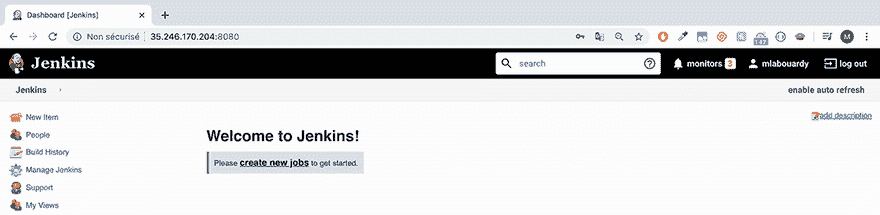

图 6.13 访问 Jenkins 仪表板的公共负载均衡器 IP 地址

注意：转发规则可能需要几分钟才能配置。在创建过程中，您可能在浏览器中看到 404 和 500 错误。

### 6.1.4 在 GCP 上启动自动管理的工人

不可否认，Jenkins 最强大的功能之一是能够在多个工作节点之间调度构建作业。设置一个构建机器的农场相当简单，无论是为了在多台机器之间共享负载，还是为了在不同的环境中运行构建作业。这是一种有效的策略，有可能显著提高您的 CI 基础设施的容量。

Jenkins 工作节点的需求也可能随时间波动。如果您与产品发布周期一起工作，您可能需要在周期的后期运行更多的工人。因此，为了避免在 Jenkins 工作节点空闲时支付额外资源，我们将在实例组内部部署 Jenkins 工作节点，并设置自动扩展策略来触发扩展或缩减事件，分别添加或删除 Jenkins 工作节点，基于如 CPU 利用率等指标。

注意：在第十三章中，我们将介绍如何使用 Prometheus 等开源解决方案来导出 Jenkins 自定义指标，包括其与 Jenkins 工作节点扩展过程的集成。

图 6.14 总结了本节将要部署的架构。

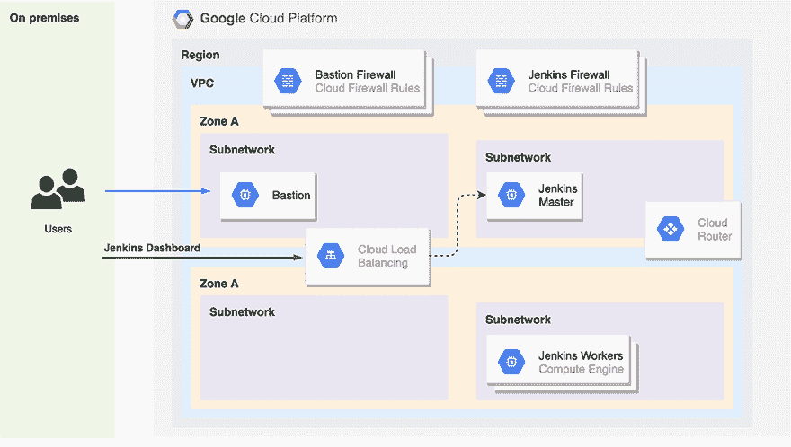

图 6.14 Google Cloud 上 Jenkins 集群部署

首先，创建一个 jenkins_workers.tf 文件，并定义将用作定义 Jenkins 工作节点配置的蓝图；请参阅以下列表。

列表 6.13 Jenkins 工作模板配置

```
resource "google_compute_instance_template" "jenkins-worker-template" {
  name_prefix = "jenkins-worker"
  description = "Jenkins workers instances template"
  region       = var.region

  tags = ["jenkins-worker"]
  machine_type         = var.jenkins_worker_machine_type
  metadata_startup_script = data.template_file.jenkins_worker_startup_script.rendered      ❶
  disk {
    source_image = var.jenkins_worker_machine_image
    disk_size_gb = 50
  }
  network_interface {
    network = google_compute_network.management.self_lin.
    subnetwork = google_compute_subnetwork.private_subnets[0].self_lin.
  }

  metadata = {
    ssh-keys = "${var.ssh_user}:${file(var.ssh_public_key)}"
  }
}
```

❶ 一个在 VM 实例首次启动时执行的 shell 脚本。该脚本将自动将实例加入为 Jenkins 代理。

我们将在私有子网络内部署实例，并执行以下列表中的启动脚本，使正在运行的虚拟机加入集群。此脚本类似于第五章列表 5.7 中提供的 shell 脚本。

列表 6.14 Jenkins 工作启动脚本

```
data "template_file" "jenkins_worker_startup_script" {
  template = "${file("scripts/join-cluster.tpl")}"

  vars = {
    jenkins_url            = "http://${google_compute_forwarding_rule.
jenkins_master_forwarding_rule.ip_address}:8080"                 ❶
    jenkins_username       = var.jenkins_username                ❶
    jenkins_password       = var.jenkins_password                ❶
    jenkins_credentials_id = var.jenkins_credentials_id          ❶
  }
}
```

❶ `join-cluster.tpl` 模板文件接受 Jenkins 凭据和 URL 作为参数。这些值将在运行时进行插值。

我们将使用 Google Cloud 元数据服务器来获取实例名称和私有 IP 地址。元数据服务器请求的输出是 JSON 格式，因此我们将使用`jq`实用程序来解析 JSON 并获取目标属性。

```
INSTANCE_NAME=$(curl -s metadata.google.internal/0.1/meta-data/hostname)
INSTANCE_IP=$(curl -s metadata.google.internal/0.1/meta-data/networ.
| jq -r '.networkInterface[0].ip')
```

接下来，我们将定义一个防火墙规则，允许从 Jenkins 主节点和堡垒主机到 Jenkins 工作节点的 SSH 访问，如下所示。

列表 6.15 Jenkins 主防火墙和流量控制

```
resource "google_compute_firewall" "allow_ssh_to_worker" {
  project = var.project
  name    = "allow-ssh-to-worker"
  network = google_compute_network.management.self_link
  allow {
    protocol = "tcp"      ❶
    ports    = ["22"]     ❶
  }
  source_tags = ["bastion", "jenkins-ssh", "jenkins-worker"]
}
```

❶ 允许端口 22（SSH）上的入站流量

然后，我们基于模板文件定义一个实例组，默认目标大小为两个工作节点；请参阅下一列表。

列表 6.16 Jenkins 工作实例组

```
resource "google_compute_instance_group_manager" "jenkins-workers-group" {
  provider = google-beta
  name = "jenkins-workers"
  base_instance_name = "jenkins-worker"
  zone               = var.zone

  version {
    instance_template  = google_compute_instance_template
.jenkins-worker-template.self_link                            ❶
  }

  target_pools = [google_compute_target_pool
.jenkins-workers-pool.id]
  target_size = 2                                             ❶
}

resource "google_compute_target_pool" "jenkins-workers-pool" {
  provider = google-beta
  name = "jenkins-workers-pool"
}
```

❶ 从一个公共实例模板（jenkins-worker-template）创建和管理同质 VM 实例池（两个实例）

一旦使用 `terraform apply` 部署了新资源，应该有两个工作实例正在运行，如图 6.15 所示。

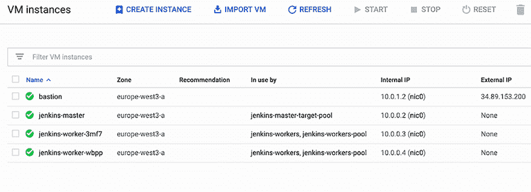

图 6.15 Jenkins 工作实例组

然而，目前工作节点的数量是静态和固定的。为了能够为重构建作业扩展 Jenkins 工作节点，我们将基于 CPU 利用率部署一个自动扩展器。定义以下资源以触发超过 80%CPU 利用率的扩展事件。在 jenkins_workers.tf 中添加以下列表中的代码。

列表 6.17 Jenkins 工作自动扩展器

```
resource "google_compute_autoscaler" "jenkins-workers-autoscaler" {
  name   = "jenkins-workers-autoscaler"
  zone   = var.zone
  target = google_compute_instance_group_manager.jenkins-workers-group.id

  autoscaling_policy {
    max_replicas    = 6       ❶
    min_replicas    = 2       ❶
    cooldown_period = 60      ❶

    cpu_utilization {
      target = 0.8            ❶
    }
  }
}
```

❶ 根据自动扩展策略在托管实例组中扩展 Jenkins 工作实例。该策略基于实例的 CPU 利用率。

一旦使用 Terraform 部署了更改，将在 Jenkins 工作实例组上配置自动扩展策略，如图 6.16 所示。

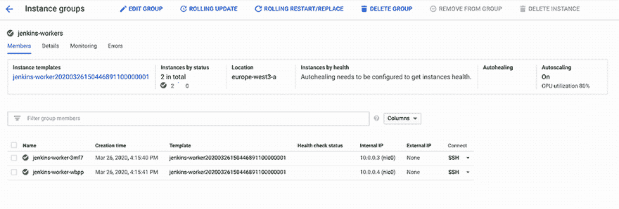

图 6.16 基于 CPU 利用率的实例组扩展

因此，在启动脚本执行后，工作节点将自动加入集群（图 6.17）。太棒了！您已经在 GCP 上运行了一个 Jenkins 集群。

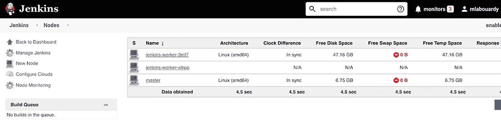

图 6.17 Jenkins 工作虚拟机实例已加入集群。

## 6.2 微软 Azure

微软 Azure 和 AWS 通过提供一个云服务集合，采用类似的方法。然而，通常使用微软软件的组织有一个企业协议，该协议提供该软件的折扣。这些组织通常可以获得使用 Azure 的显著激励。

如果你计划使用 Azure，你可以从 Azure Marketplace 部署 Jenkins 解决方案模板。然而，如果你想要完全控制 Jenkins，请遵循本节学习如何从头开始构建 Jenkins 集群，并根据 Azure 虚拟机按需扩展你的 Jenkins 工作节点。

注意：虽然 Azure 和 Google Cloud 已经看到了相当显著的增长，但 AWS 仍然是领导者。这主要是因为 AWS 是第一个投资并塑造云计算行业的。Google Cloud 和 Azure 还有一些追赶的余地。

在开始之前，如果你是 Azure 的新用户，你可以注册一个 Azure 免费账户([`portal.azure.com/`](https://portal.azure.com/))，以免费$200 信用额度开始探索。

### 6.2.1 在 Azure 中构建金 Jenkins VM 镜像

在构建过程中，Packer 在构建源虚拟机时会创建临时 Azure 资源。因此，它需要被授权与 Azure API 交互。

使用以下命令创建一个具有创建和管理资源权限的 Azure 服务主体（SP）。SP 代表一个访问你的 Azure 资源的应用程序。它通过客户端 ID（也称为*应用程序 ID*）进行标识，可以使用密码或证书进行身份验证。

要创建一个服务主体（SP），请复制以下命令：

```
$sp = New-AzADServicePrincipal -DisplayName "PackerServicePrincipal"
$BSTR = [System.Runtime
.InteropServices.Marshal]::SecureStringToBSTR($sp.Secret)
$plainPassword = [System.Runtime
.InteropServices.Marshal]::PtrToStringAuto($BSTR)
New-AzRoleAssignment -RoleDefinitionName
 Contributor -ServicePrincipalName $sp.ApplicationId
```

你可以在 Azure PowerShell 上执行这些命令，如图 6.18 所示。

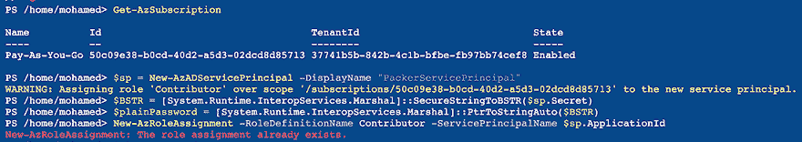

图 6.18 创建 Azure 凭据

然后通过执行以下命令输出密码和应用程序 ID：

```
$plainPassword
$sp.ApplicationId
```

将应用程序 ID 和密码保存以备后用。

要对 Azure 进行身份验证，你还需要获取你的 Azure 租户和订阅 ID，这些可以通过`Get-AzSubscription`或从 Azure Active Directory (AD)获取。AD，如图 6.19 所示，是一个身份管理服务，它通过正确的角色和权限控制对 Azure 资源的访问和安全。

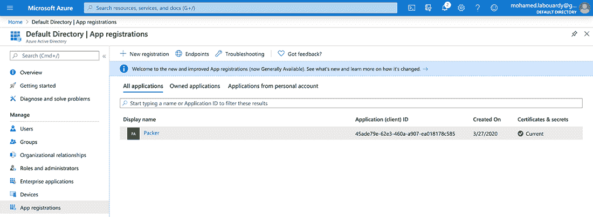

图 6.19 Packer 在 Azure Active Directory 上的注册

注意客户端 ID 和密钥。这将在 Packer 中用作在 Azure 中配置资源的凭据。

要构建 Jenkins 工作节点镜像，创建一个 template.json 文件。在模板中，你定义执行实际构建过程的构建器和配置器。Packer 有一个名为`azure-arm`的 Azure 构建器，允许你定义 Azure 镜像。将以下内容添加到 template.json 或从 chapter6/azure/packer/worker/template.json 下载完整的模板。

列表 6.18 带有 Azure 构建器的 Jenkins 工作节点模板

```
{
    "variables" : {
        "subscription_id" : "YOUR SUBSCRIPTION ID",     ❶
        "client_id": "YOUR CLIENT ID",                  ❶
        "client_secret": "YOUR CLIENT SECRET",          ❶
        "tenant_id": "YOUR TENANT ID",                  ❶
        "resource_group": "RESOURCE GROUP NAME",        ❶
        "location": "LOCATION NAME"                     ❶
    },
    "builders" : [
        {
            "type": "azure-arm",
            "subscription_id": "{{user `subscription_id`}}",
            "client_id": "{{user `client_id`}}",
            "client_secret": "{{user `client_secret`}}",
            "tenant_id": "{{user `tenant_id`}}",
            "managed_image_resource_group_name": "{{user `resource_group`}}",
            "managed_image_name": "jenkins-worker",
            "os_type": "Linux",
            "image_publisher": "OpenLogic",            ❷
            "image_offer": "CentOS",                   ❷
            "image_sku": "8.0",                        ❷
            "location": "{{user `location`}}",         ❷
            "vm_size": "Standard_B1s"                  ❷
        }
    ],
    "provisioners" : [
        {
            "type" : "shell",
            "script" : "./setup.sh",
            "execute_command" : "sudo -E -S sh '{{ .Path }}'"
        }
    ]
}
```

❶ 运行时变量列表，使 Packer 模板可移植和可重复使用

❷ Packer 将基于 CentOS 8.0 机器镜像部署一个类型为 Standard_B1s（1 RAM 和 1vCPU）的实例。

如果你在一个虚拟机上运行 Packer，你可以为虚拟机分配一个托管标识。不需要设置任何配置属性。

列表 6.18 中的模板部署了一个基于 CentOS 8.0 的临时实例，并使用 shell 脚本安装所需的依赖项。选择 CentOS 并非偶然。Amazon Linux 镜像和 CentOS 具有相似之处，特别是对 Yum 包管理器的支持。为了使用前几章中提供的相同脚本并保持 Jenkins 镜像的一致性和相同性，我们将使用 CentOS。

使用`packer build`命令烘焙镜像。以下是一个输出示例：

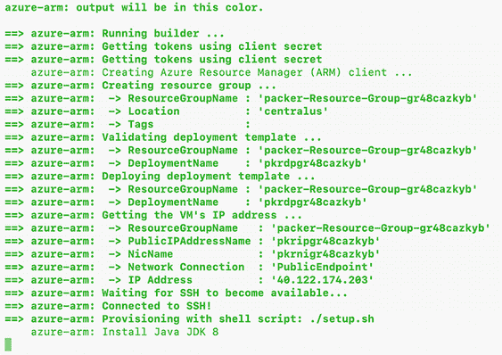

Packer 构建虚拟机、运行配置程序和烘焙 Jenkins 工作镜像需要几分钟时间。一旦完成，镜像将在`resource_group`变量设置的资源组中创建，如图 6.20 所示。

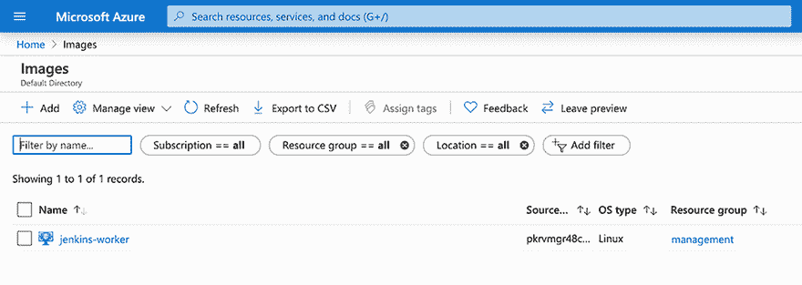

图 6.20 Jenkins 工作机镜像

将应用类似的流程来构建 Jenkins 主镜像。以下为 template.json 文件（完整的模板可在 chapter6/azure/packer/master/template.json 中找到）。

列表 6.19 带有 Azure 构建器的 Jenkins 工作模板

```
{
    "variables" : {...},     ❶
    "builders" : [
        {
            "type": "azure-arm",
            "subscription_id": "{{user `subscription_id`}}",
            "client_id": "{{user `client_id`}}",
            "client_secret": "{{user `client_secret`}}",
            "tenant_id": "{{user `tenant_id`}}",
            "managed_image_resource_group_name": "{{user `resource_group`}}",
            "managed_image_name": "jenkins-master-v22041",
            "os_type": "Linux",
            "image_publisher": "OpenLogic",
            "image_offer": "CentOS",
            "image_sku": "8.0",
            "location": "{{user `location`}}",
            "vm_size": "Standard_B1ms"
        }
    ],
    "provisioners" : [
       ...
    ]
}
```

❶ 为了简洁起见，省略了变量列表；完整的列表在列表 6.18 中。

一旦定义了模板，就使用 Packer 烘焙镜像。烘焙过程需要几分钟来创建镜像。一旦镜像创建完成，它应该可以从 Azure 门户的镜像仪表板中访问，如图 6.21 所示。

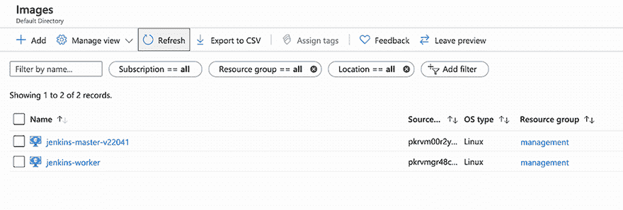

图 6.21 Jenkins 主机机器镜像

现在有了 Jenkins 主和工镜像，您现在可以使用 Terraform 从自定义镜像创建 Jenkins 集群。

### 6.2.2 部署私有虚拟网络

在部署 Jenkins 集群之前，我们需要设置一个与图 6.22 所示的架构相同的私有网络，以保护集群的访问安全。

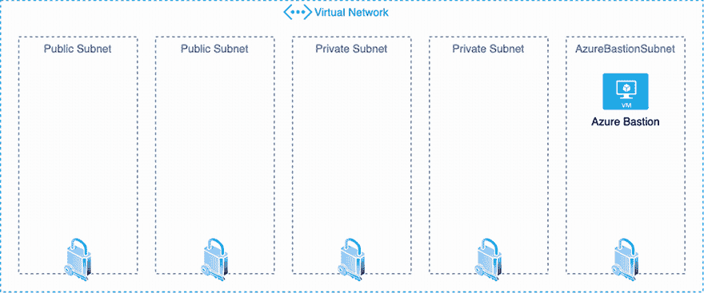

图 6.22 Azure 上的 VPN

注意：为了使 Terraform 能够将资源部署到 Azure，请按照第 6.2.1 节中描述的相同步骤创建一个 Azure Active Directory 服务主体。

创建一个 terraform.tf 文件并声明`azurerm`为提供者，如下所示。`provider`部分告诉 Terraform 使用 Azure 提供者。要获取`subscription_id`、`client_id`、`client_secret`和`tenant_id`的值，请参阅第 6.2.1 节。

列表 6.20 定义 Azure 提供者

```
provider "azurerm" {
  version = "=1.44.0"

  subscription_id = var.subscription_id
  client_id       = var.client_id
  client_secret   = var.client_secret
  tenant_id       = var.tenant_id
}
```

运行`terraform init`以下载最新的 Azure 插件并构建.terraform 目录：

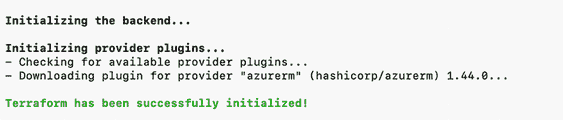

接下来，创建一个 virtual_network.tf 文件，在该文件中定义一个名为`management`的虚拟网络，该网络位于 10.0.0.0/16 地址空间内，包含公共和私有子网，以及一个名为`AzureBastionSubnet`的额外子网，用于堡垒主机，如下所示。

列表 6.21 Azure 虚拟网络定义

```
data "azurerm_resource_group" "management" {
  name = var.resource_group
}

resource "azurerm_virtual_network" "management" {
  name                = "management"
  location            = var.location
  resource_group_name = data.azurerm_resource_group.management.name
  address_space       = [var.base_cidr_block]
  dns_servers         = ["10.0.0.4", "10.0.0.5"]                ❶

  dynamic "subnet" {
    for_each = [for s in var.subnets: {                         ❷
      name   = s.name                                           ❷
      prefix = cidrsubnet(var.base_cidr_block, 8, s.number)     ❷
    }]                                                          ❷

    content {                                                   ❷
      name           = subnet.value.name                        ❷
      address_prefix = subnet.value.prefix                      ❷
    }                                                           ❷
  }

  subnet {
    name           = "AzureBastionSubnet"                       ❸
    address_prefix = cidrsubnet(var.base_cidr_block, 11, 224)   ❸
  }

  tags = {
    environment = "management"
  }
}
```

❶ DNS 服务器 IP 地址列表

❷ 在 10.0.0.0/16 空间内定义子网列表

❸ 定义一个专用的子网，其中将部署堡垒主机

注意：我们可以在 Azure 中使用键值对标记我们的资源。这对于成本优化很有用。因此，我们将添加 `environment` 标记并设置值为 management，以标记我们创建的所有资源。

在应用更改之前，在 variables.tf 中声明用于参数化和自定义 Terraform 部署的变量。表 6.2 列出了变量。

表 6.2 Azure Terraform 变量

| 名称 | 类型 | 值 | 描述 |
| --- | --- | --- | --- |
| `subscription_id` | 字符串 | None | 要使用的订阅 ID。这也可以从 `ARM_SUBSCRIPTION_ID` 环境变量中获取。 |
| `client_id` | 字符串 | None | 要使用的客户端 ID。这也可以从 `ARM_CLIENT_ID` 环境变量中获取。 |
| `client_secret` | 字符串 | None | 要使用的客户端密钥。这也可以从 `ARM_CLIENT_SECRET` 环境变量中获取。 |
| `tenant_id` | 字符串 | None | 要使用的租户/目录 ID。这也可以从 `ARM_TENANT_ID` 环境变量中获取 |
| `resource_group` | 字符串 | None | 创建虚拟网络的资源组名称。 |
| `location` | 字符串 | None | 虚拟网络创建的位置/区域。更改此设置将强制创建新的资源。有关支持位置的全列表，请参阅 Azure 位置文档。 |
| `base_cidr_block` | 字符串 | `10.0.0.0/16` | 用于虚拟网络的地址空间（CIDR 块）。 |
| `subnets` | 映射 | None | 一个包含要在虚拟网络内部创建的子网列表的映射。 |

当使用客户端证书作为服务主体进行身份验证时，应设置以下字段：`client_certificate_password` 和 `client_certificate_path`。

现在是时候运行 `terraform` `apply` 命令了。Terraform 将调用 Azure API 来设置新的虚拟网络，如下所示：

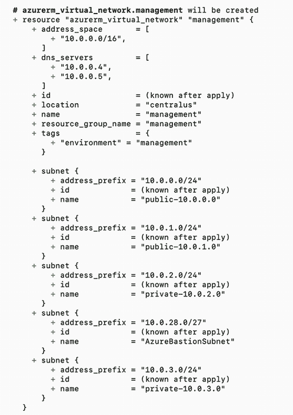

要在 Azure 门户中验证结果，请浏览到管理资源组。新的虚拟网络位于此组下，如图 6.23 所示。

要访问私有 Jenkins 机器，我们需要部署网关或代理服务器，也称为跳板或堡垒主机。幸运的是，Azure 提供了一个名为 Azure Bastion 的托管服务，它提供远程桌面协议 (RDP) 和 SSH 访问任何 VM，无需管理加固的堡垒实例并应用安全补丁（无运营开销）。

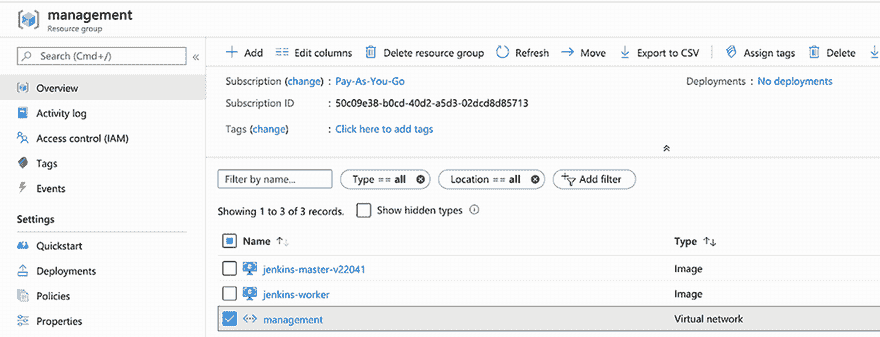

图 6.23 管理虚拟网络

要将 Azure Bastion 服务部署到现有的 Azure 虚拟网络中，创建一个包含以下内容的 bastion.tf 文件。堡垒主机服务将部署到专用的 `AzureBastionSubnet` 子网中：

列表 6.22 Azure Bastion 服务部署

```
resource "azurerm_public_ip" "bastion_public_ip" {
  name                = "bastion-public-ip"
  location            = var.location
  resource_group_name = data.azurerm_resource_group.management.name
  allocation_method   = "Static"                                       ❶
  sku                 = "Standard"
}
data "azurerm_subnet" "bastion_subnet" {
  name                 = "AzureBastionSubnet"
  virtual_network_name = azurerm_virtual_network.management.name
  resource_group_name  = data.azurerm_resource_group.management.name
  depends_on = [azurerm_virtual_network.management]
}
resource "azurerm_bastion_host" "bastion" {
  name                = "bastion"
  location            = var.location
  resource_group_name = data.azurerm_resource_group.management.name
  depends_on = [azurerm_virtual_network.management]
.
  ip_configuration {
    name                 = "bastion-configuration"
    subnet_id            = data.azurerm_subnet.bastion_subnet.id       ❷
    public_ip_address_id = azurerm_public_ip.bastion_public_ip.id      ❷
  }
}
```

❶ 请求静态公共 IP 地址

❷ 引用要创建堡垒主机的子网。它还将已配置的公共 IP 地址关联到堡垒主机。

使用 Terraform 输出变量作为辅助工具，通过引用`azurerm_public_ip`资源来公开堡垒 IP 地址。

列表 6.23 堡垒主机公共 IP 地址

```
output "bastion" {
    value = azurerm_public_ip.bastion_public_ip.ip_address
}
```

运行`terraform apply`以应用配置。堡垒服务将部署到`management`资源组中，如图 6.24 所示。

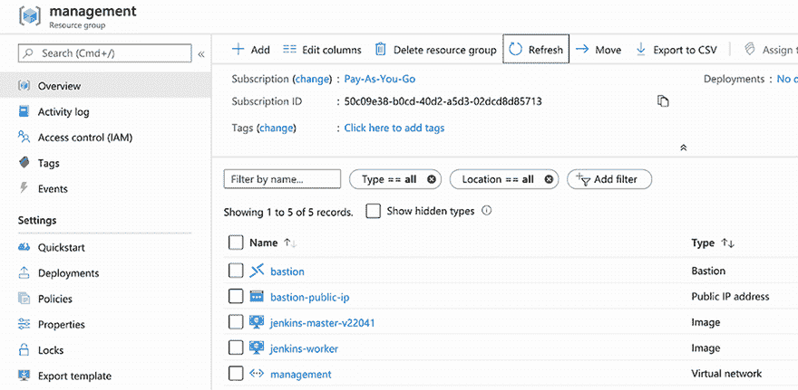

图 6.24 Azure 堡垒主机

### 6.2.3 部署 Jenkins 主虚拟机

部署 VPN 后，我们可以部署我们的 Jenkins 集群。图 6.25 总结了目标架构。

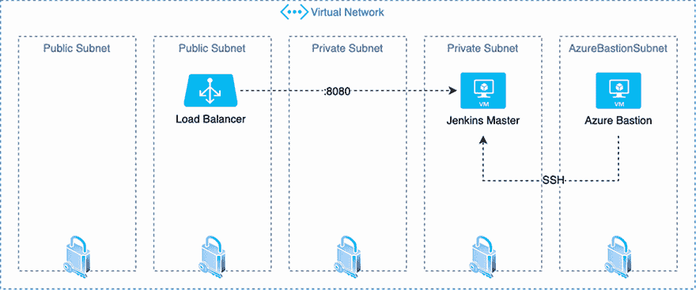

图 6.25 私有子网内的 Jenkins VM

部署一个基于之前使用 Packer 构建的 Jenkins 主镜像的虚拟机。在`jenkins_master.tf`中定义资源，以下代码。

列表 6.24 Jenkins 主虚拟机

```
data "azurerm_image" "jenkins_master_image" {
  name                = var.jenkins_master_image
  resource_group_name = data.azurerm_resource_group.management.name
}

resource "azurerm_virtual_machine" "jenkins_master" {
  name                = "jenkins-master"
  resource_group_name = data.azurerm_resource_group.management.name
  location            = var.location
  vm_size             = var.jenkins_vm_size

  network_interface_ids = [
    azurerm_network_interface.jenkins_network_interface.id,
  ]

  os_profile {
    computer_name  = var.config["os_name"]
    admin_username = var.config["vm_username"]
  }

  os_profile_linux_config {
    disable_password_authentication = true                                 ❶
    ssh_keys {                                                             ❶
      path     = "/home/${var.config["vm_username"]}/.ssh/authorized_keys" ❶
      key_data = file(var.public_ssh_key)                                  ❶
    }                                                                      ❶
  }

  storage_os_disk {
    name = "main"
    caching           = "ReadWrite"
    managed_disk_type = "Standard_LRS"                                     ❷
    create_option     = "FromImage"                                        ❷
    disk_size_gb      = "30"                                               ❷
  }

  storage_image_reference {
    id = data.azurerm_image.jenkins_master_image.i                         ❸
  }

  delete_os_disk_on_termination = true                                     ❹
}
```

❶ 禁用密码验证并启用 SSH 作为认证机制

❷ 指定应创建的托管磁盘类型。可能的值是 Standard_LRS、StandardSSD_LRS 或 Premium_LRS。

❸ 从烘焙的 Jenkins 主镜像配置 VM

❹ 删除 VM 时自动删除 OS 磁盘

注意：我们为虚拟机允许了 30GB 的磁盘大小。Jenkins 需要一些磁盘空间来执行构建并保存存档和构建日志。

SSH 密钥数据位于`ssh_key`部分，用户名位于禁用密码验证的`os_profile`部分。

Jenkins 虚拟机使用具有可扩展 CPU 性能的 B 系列 Azure VM 家族。这个 VM 家族在计算和网络带宽之间提供了正确的平衡。我建议根据你的项目构建需求和需求选择你的 VM 家族类型。

列表 6.24 创建了一个名为`jenkins-master`的 VM，现在我们将附加虚拟网络接口，如下所示。

列表 6.25 Jenkins VM 网络配置

```
data "azurerm_subnet" "private_subnet" {
  name                 = var.subnets[2].name
  virtual_network_name = azurerm_virtual_network.management.name
  resource_group_name  = data.azurerm_resource_group.management.name
  depends_on = [azurerm_virtual_network.management]
}

resource "azurerm_network_interface" "jenkins_network_interface" {
  name                = "jenkins_network_interface"
  location            = var.location
  resource_group_name = data.azurerm_resource_group.management.name
  depends_on = [azurerm_virtual_network.management]

  ip_configuration {
    name                          = "internal"                             ❶
    subnet_id                     = data.azurerm_subnet.private_subnet.id  ❶
    private_ip_address_allocation = "Dynamic"                              ❶
  }
}
```

❶ 在私有子网中部署 Jenkins 主实例并分配一个动态私有 IP 地址

虚拟网络接口将 Jenkins 主实例连接到私有网络子网。

一旦你在`variables.tfvars`中提供了所需的 Terraform 变量，就执行`terraform apply`。从你的 Packer 镜像和预期资源创建 Jenkins VM（如图 6.26 所示）需要几分钟。

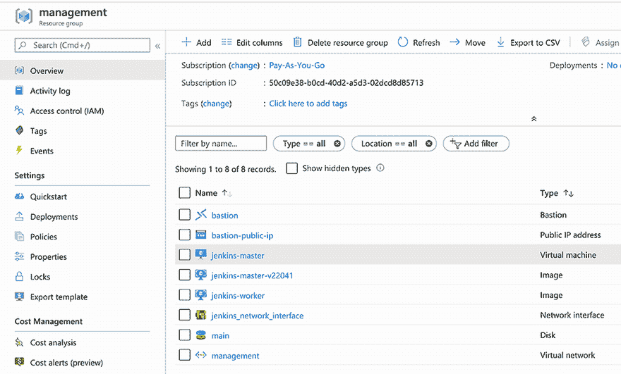

图 6.26 Jenkins 主虚拟机

Jenkins 虚拟机应仅通过堡垒主机访问。图 6.27 确认该机器是在私有子网中部署的。

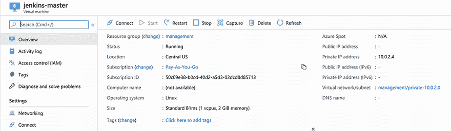

图 6.27 在私有子网中部署的 Jenkins 主实例

然而，要访问 Jenkins 仪表板，我们将在 VM 前面部署一个负载均衡器。在`loadbalancers.tf`文件上创建一个文件，定义一个 Azure 负载均衡器和一条安全规则来服务 Jenkins 仪表板，并将其附加到公共 IP 地址，如下所示。

列表 6.26 Jenkins 仪表板负载均衡器配置

```
resource "azurerm_public_ip" "jenkins_lb_public_ip" {
 name                         = "jenkins-lb-public-ip"
 location                     = var.location
 resource_group_name          = data.azurerm_resource_group.management.name
 allocation_method            = "Static"
}
resource "azurerm_lb" "jenkins_lb" {
 name                = "jenkins-lb"
 location            = var.location
 resource_group_name = data.azurerm_resource_group.management.name

 frontend_ip_configuration {
   name                 = "publicIPAddress"                             ❶
   public_ip_address_id = azurerm_public_ip.jenkins_lb_public_ip.id     ❶
 }
}
resource "azurerm_lb_rule" "jenkins_lb_rule" {
  name = "jenkins-lb-rule"
  resource_group_name = data.azurerm_resource_group.management.name
  protocol = "tcp"                                                      ❷
  enable_floating_ip = false                                            ❷
  probe_id = azurerm_lb_probe.jenkins_lb_probe.id                       ❷
  loadbalancer_id = azurerm_lb.jenkins_lb.id                            ❷
  backend_address_pool_id = azurerm_lb_backend_address_pool
.jenkins_backend.id    .
  frontend_ip_configuration_name = "publicIPAddress"                    ❸
  frontend_port = 80                                                    ❸
  backend_port = 8080                                                   ❸
}
```

❶ 将公网 IP 地址关联到负载均衡器

❷ 负载均衡器监听 80 端口以接收传入请求，并通过 8080 端口与 Jenkins 主实例通信。

❸ 负载均衡器监听 80 端口以接收传入请求，并通过 8080 端口与 Jenkins 主实例通信。

在同一文件中，定义一个 Azure 后端地址池并将其分配给负载均衡器。然后设置端口 8080 的健康检查，如下所示。

列表 6.27 Jenkins 仪表板健康检查

```
resource "azurerm_lb_backend_address_pool" "jenkins_backend" {
 resource_group_name = data.azurerm_resource_group.management.name
 loadbalancer_id     = azurerm_lb.jenkins_lb.id
 name                = "jenkins-backend"
}
resource "azurerm_lb_probe" "jenkins_lb_probe" {
  resource_group_name = data.azurerm_resource_group.management.name
  loadbalancer_id     = azurerm_lb.jenkins_lb.id
  name                = "jenkins-lb-probe"
  protocol            = "Http"
  request_path        = "/"        ❶
  port                = 8080       ❷
}
```

❶ 用于从后端端点请求健康状态的 URI

❷ 探针查询后端端点的端口

Azure 允许通过安全组打开端口以允许流量，这也可以在 Terraform 配置中管理。将以下内容添加到 security_groups.tf 中，然后运行`plan/apply`以创建允许在端口 8080 上入站流量和在 TCP 端口 22 上 SSH 流量的安全规则。

列表 6.28 Jenkins 主安全组

```
resource "azurerm_network_security_group" "jenkins_security_group" {
  name          = "jenkins-sg"
  location      = var.location
  resource_group_name   = data.azurerm_resource_group.management.name

  security_rule {
    name            = "AllowSSH"                ❶
    priority        = 100                       ❶
    direction       = "Inbound"                 ❶
    access          = "Allow"                   ❶
    protocol        = "Tcp"                     ❶
    source_port_range           = "*"           ❶
    destination_port_range      = "22"          ❶
    source_address_prefix       = "*"           ❶
    destination_address_prefix  = "*"           ❶
  }

  security_rule {
    name            = "AllowHTTP"               ❷
    priority        = 200                       ❷
    direction       = "Inbound"                 ❷
    access          = "Allow"                   ❷
    protocol        = "Tcp"                     ❷
    source_port_range           = "*"           ❷
    destination_port_range      = "8080"        ❷
    source_address_prefix       = "Internet"    ❷
    destination_address_prefix  = "*"           ❷
  }
}
```

❶ 允许来自任何地方的 22 端口（SSH）的入站流量

❷ 允许在 8080 端口上入站流量，这是 Jenkins Web 仪表板提供服务的端口

最后，将安全组分配给连接到 Jenkins 主虚拟机的虚拟网络接口，如下所示。

列表 6.29 Jenkins 网络接口配置

```
resource "azurerm_network_interface" "jenkins_network_interface" {
  name                = "jenkins_network_interface"
  location            = var.location
  resource_group_name = data.azurerm_resource_group.management.name
  network_security_group_id = azurerm_network_security_group.jenkins_security_group.id
  depends_on = [azurerm_virtual_network.management]

  ip_configuration {
    name                          = "internal"                             ❶
    subnet_id                     = data.azurerm_subnet.private_subnet.id  ❶
    private_ip_address_allocation = "Dynamic"                              ❶
    load_balancer_backend_address_pools_ids =                              ❶
    [azurerm_lb_backend_address_pool.jenkins_backend.id]                   ❶
  }
}
```

❶ 将 Jenkins 安全组分配给配置在私有子网中的虚拟网络接口

使用`terraform apply`命令应用更改。一旦 Terraform 完成，您的负载均衡器就准备好了。通过在 outputs.tf 中添加以下代码获取其公网 IP 地址。

列表 6.30 Jenkins 主防火墙和流量控制

```
output "jenkins" {
    value = azurerm_public_ip.jenkins_lb_public_ip.ip_address
}
```

让我们使用 Azure 门户验证资源。如图 6.28 所示，Terraform 在`management`资源组下创建了所有预期的资源。

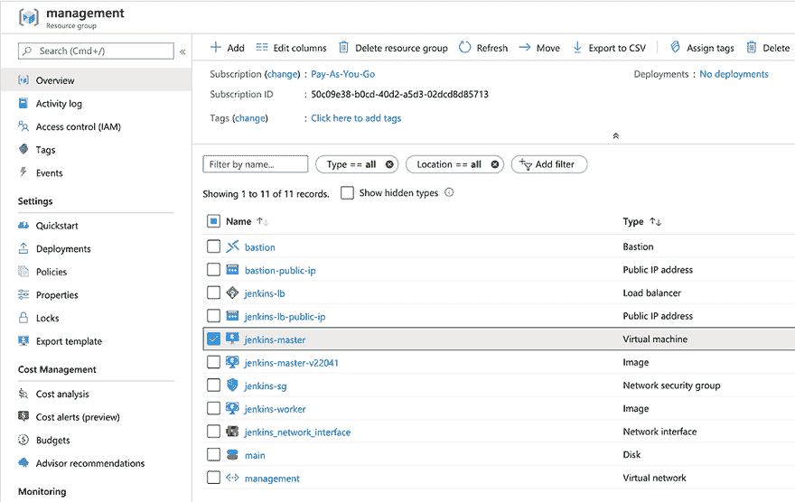

图 6.28 指向 Jenkins 主 VM 的公共负载均衡器

现在，将您的网络浏览器指向地址栏中负载均衡器的公网 IP 地址。默认的 Jenkins 主页将显示，如图 6.29 所示。

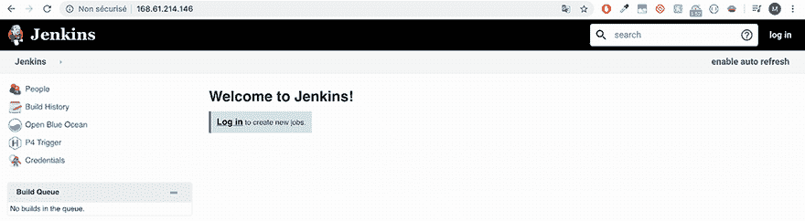

图 6.29 可通过 LB 公网 IP 地址访问的 Jenkins 仪表板

在烘焙 Jenkins 主机镜像时，您可以使用 Groovy 初始化脚本中定义的管理凭据进行登录。

### 6.2.4 将自动扩展应用于 Jenkins 工作节点

我们已经准备好将 Jenkins 工作节点部署到从主节点卸载构建项目。这些工作节点将在一个自动扩展集中动态配置。图 6.30 展示了目标部署架构。

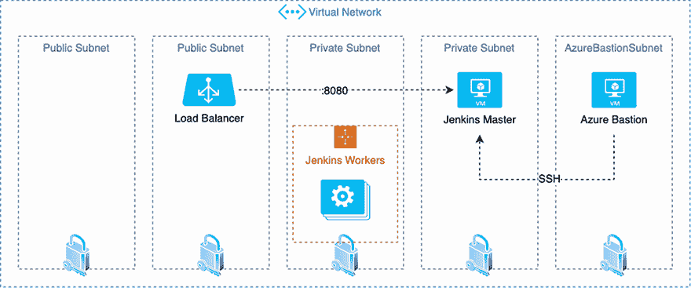

图 6.30 Jenkins 工作节点规模集

我们需要在机器规模集中部署 Jenkins 工作节点。一个 Jenkins 工作节点将基于之前使用 Packer 构建的 Jenkins 工作节点镜像，并在私有子网内部署。使用以下内容创建 jenkins_workers.tf。

列表 6.31 Jenkins 工作节点机器规模集

```
data "azurerm_image" "jenkins_worker_image" {
  name                = var.jenkins_worker_image                            ❶
  resource_group_name = data.azurerm_resource_group.management.name
}
resource "azurerm_virtual_machine_scale_set" "jenkins_workers_set" {
  name                = "jenkins-workers-set"
  location            = var.location
  resource_group_name = data.azurerm_resource_group.management.name
  upgrade_policy_mode = "Manual"
  sku {
    name     = var.jenkins_vm_size
    tier     = "Standard"
    capacity = 2
  }
  storage_profile_image_reference {
    id = data.azurerm_image.jenkins_worker_image.id
  }
  storage_profile_os_disk {
    caching           = "ReadWrite"
    create_option     = "FromImage"
    managed_disk_type = "Standard_LRS"
  }
  os_profile {
    computer_name_prefix = "jenkins-worker"
    admin_username = var.config["vm_username"]
    custom_data = data.template_file.jenkins_worker_startup_script.rendered
  }
  os_profile_linux_config {
    disable_password_authentication = true                                  ❷
    ssh_keys {                                                              ❷
      path     = "/home/${var.config["vm_username"]}/.ssh/authorized_keys"  ❷
      key_data = file(var.public_ssh_key)                                   ❷
    }                                                                       ❷
  }
  network_profile {
    name    = "private-network"                                             ❸
    primary = true                                                          ❸
    network_security_group_id =                                             ❸
      azurerm_network_security_group.jenkins_worker_security_group.id       ❸
    ip_configuration {                                                      ❸
      name = "private-ip-configuration"                                     ❸
      primary = true                                                        ❸
      subnet_id = data.azurerm_subnet.private_subnet.id                     ❸
    }
  }
}
```

❶ 引用 Jenkins 工作节点机器镜像 ID

❷ 禁用密码认证并配置 SSH 凭证

❸ 将安全组分配给虚拟机实例并请求私有 IP 地址

注意：您应该在多个 Azure VM 家族类型上测试您的项目，以确定适合 Jenkins 工作节点的机器类型以及磁盘空间的大小。

每个工作节点机器将在运行时执行一个自定义脚本（chapter6/azure/terraform/scripts/join-cluster.tpl），以加入 Jenkins 集群；请参阅以下列表。

列表 6.32 Jenkins 工作节点启动脚本

```
data "template_file" "jenkins_worker_startup_script" {
  template = "${file("scripts/join-cluster.tpl")}"       ❶

  vars = {
    jenkins_url            = "http://${azurerm_public_ip.jenkins_lb_public_ip.ip_address}:8080"
    jenkins_username       = var.jenkins_username
    jenkins_password       = var.jenkins_password
    jenkins_credentials_id = var.jenkins_credentials_id
  }
}
```

❶ 初始化脚本以自动将虚拟机作为 Jenkins 代理加入

该脚本将使用 Azure 实例元数据服务（IMDS）获取有关机器的私有 IP 地址和主机名的信息，并将向 Jenkins RESTful API 发出 POST HTTP 请求，以建立与机器的双向连接并加入集群：

```
INSTANCE_NAME=$(curl -s http://169.254.169.254/metadata/instance/compute/name
?api-version=2019-06-01&format=text)
INSTANCE_IP=$(curl -s http://169.254.169.254/metadata/instance/network/interface/0/ipv4/ipAddress/0/privateIpAddress
?api-version=2017-08-01&format=text)
```

将安全组附加到与规模集连接的虚拟网络接口。它允许在 22 端口（SSH）上的入站流量，如下面的列表所示。

列表 6.33 Jenkins 工作节点安全组

```
resource "azurerm_network_security_group" "jenkins_worker_security_group" {
  name      = "jenkins-worker-sg"
  location    = var.location
  resource_group_name   = data.azurerm_resource_group.management.name
  security_rule {
     name      = "AllowSSH"                 ❶
     priority  = 100                        ❶
     direction = "Inbound"                  ❶
     access    = "Allow"                    ❶
     protocol  = "Tcp"                      ❶
     source_port_range             = "*"    ❶
     destination_port_range      = "22"     ❶
     source_address_prefix       = "*"      ❶
     destination_address_prefix  = "*"      ❶
  }
}
```

❶ 允许来自任何地方的 22 端口（SSH）的入站流量。建议限制对您的网络 CIDR 块的访问。

部署完成后，资源组的内文将类似于图 6.31 所示。

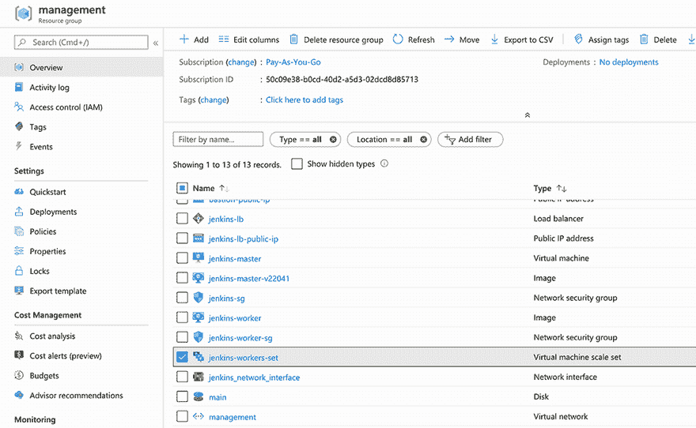

图 6.31 Jenkins 工作节点虚拟机规模集

默认情况下，将有两个 Jenkins 工作节点运行，如图 6.32 所示。

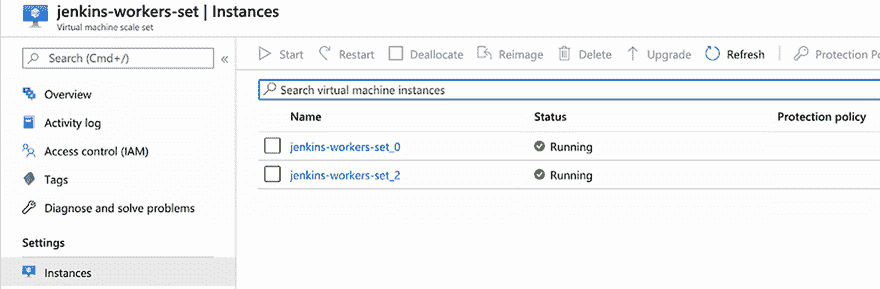

图 6.32 Jenkins 工作节点静态数量

为了能够根据构建作业和正在运行的流水线进行扩展，我们将使用 Azure 自动缩放策略，根据工作机的 CPU 利用率触发扩展或缩减。在 jenkins_workers.tf 中，添加以下`resource`块。

列表 6.34 Jenkins 工作节点自动缩放策略

```
resource "azurerm_monitor_autoscale_setting" "jenkins_workers_autoscale" {
  name                = "jenkins-workers-autoscale"
  resource_group_name = data.azurerm_resource_group.management.name
  location            = var.location
  target_resource_id  = azurerm_virtual_machine_scale_set.jenkins_workers_set.id

  profile {
    name = "jenkins-autoscale"
    capacity {
      default = 2                                                ❶
      minimum = 2                                                ❶
      maximum = 10                                               ❶
    }
    rule {
      metric_trigger {                                           ❷
        metric_name        = "Percentage CPU"                    ❷
        metric_resource_id =                                     ❷
     azurerm_virtual_machine_scale_set.jenkins_workers_set.id    ❷
        time_grain         = "PT1M"                              ❷
        statistic          = "Average"                           ❷
        time_window        = "PT5M"                              ❷
        time_aggregation   = "Average"                           ❷
        operator           = "GreaterThan"                       ❷
        threshold          = 80                                  ❷
      }                                                          ❷
      scale_action {                                             ❷
        direction = "Increase"                                   ❷
        type      = "ChangeCount"                                ❷
        value     = "1"                                          ❷
        cooldown  = "PT1M"                                       ❷
      }                                                          ❷
    }

    rule {
      metric_trigger {                                           ❸
        metric_name        = "Percentage CPU"                    ❸
        metric_resource_id =                                     ❸
     azurerm_virtual_machine_scale_set.jenkins_workers_set.id    ❸
        time_grain         = "PT1M"                              ❸
        statistic          = "Average"                           ❸
        time_window        = "PT5M"                              ❸
        time_aggregation   = "Average"                           ❸
        operator           = "LessThan"                          ❸
        threshold          = 20                                  ❸
      }                                                          ❸

      scale_action {                                             ❸
        direction = "Decrease"                                   ❸
        type      = "ChangeCount"                                ❸
        value     = "1"                                          ❸
        cooldown  = "PT1M"                                       ❸
      }                                                          ❸
    }
  }
}
```

❶ 定义 Jenkins 工作节点的最小和最大数量

❷ 监控工作节点的 CPU 利用率——如果达到 80%，将部署新的 Jenkins 工作节点虚拟机。

❸ 监控工作节点的 CPU 利用率——如果低于 20%，将终止现有的 Jenkins 工作节点虚拟机。

使用`terraform apply`应用更改。然后，前往 Jenkins 工作节点规模集配置。在缩放部分，定义一个新的自动缩放策略，如图 6.33 所示。

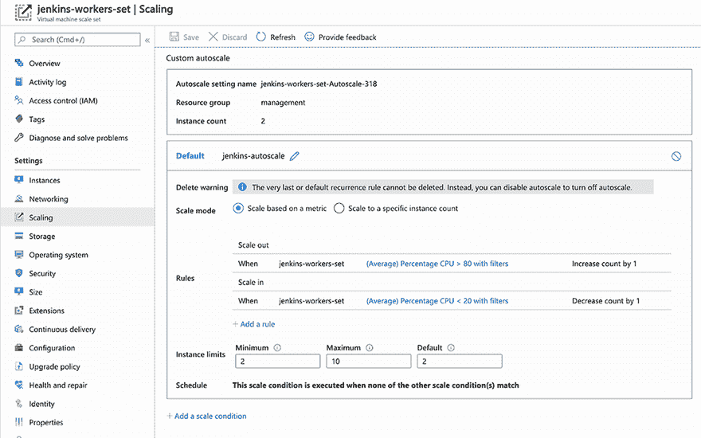

图 6.33 Jenkins 工作节点自动缩放策略

注意：一旦您完成对 Jenkins 集群的实验，您可能希望拆除所有创建的内容，以免产生额外的费用。

太好了！您现在能够在 Microsoft Azure 上部署一个自我修复的 Jenkins 集群。

## 6.3 DigitalOcean

当我们想到云服务提供商时，我们通常指的是行业中的三大巨头：Azure、Google Cloud 和 AWS。与众所周知的服务提供商不同，DigitalOcean ([www.digitalocean.com](https://www.digitalocean.com)) 相对较新。你可能会想知道为什么你应该选择 DigitalOcean 而不是其他提供商。原因在于三大巨头与 DigitalOcean 之间的差异。

它们在许多方面都存在差异。一个是小的，而其他（AWS、GCP 和 Azure）则是巨大的。DigitalOcean 提供虚拟机（称为*Droplets*）。没有花哨的功能。你不会迷失在服务目录中，因为它们几乎不存在。此外，DigitalOcean 的界面因其友好的设计而允许开发者快速设置机器。而且，它价格合理，有更便宜的实例，这对于初涉商业和初创企业来说是一个良好的起点。（如果你还没有 DigitalOcean 账户，你需要创建一个；你将获得 100 美元的免费信用额。）

要使用 Packer 与 DigitalOcean，我们首先需要生成一个 DigitalOcean API 令牌。这可以在 DigitalOcean 应用程序和 API 页面上完成。点击“生成新令牌”按钮以获取具有读写权限的令牌，如图 6.34 所示。

![Images/CH06_F34_Labouardy.png]

图 6.34 Packer API 访问令牌

### 6.3.1 创建 Jenkins DigitalOcean 快照

我们使用的是与列表 6.1 和 6.2 中相同的模板；唯一的区别是使用`digitalocean` Packer 构建器与 DigitalOcean API 交互。构建器使用 CentOS 源镜像并运行必要的配置程序——在启动后安装构建 Jenkins 作业所需的工具，然后将其快照到一个可重复使用的镜像中；请参阅以下列表。这个可重复使用的镜像然后可以作为在 DigitalOcean 中通过 Terraform 启动的新 Jenkins 工作节点的基石。 

列表 6.35 使用 DigitalOcean 构建器的 Jenkins 工作节点镜像

```
{
    "variables" : {
        "api_token" : "DIGITALOCEAN API TOKEN",     ❶
        "region": "DIGITALOCEAN REGION"             ❶
    },
    "builders" : [
        {
            "type": "digitalocean",
            "api_token": "{{user `api_token`}}",
            "image": "centos-8-x64",                ❷
            "region": "{{user `region`}}",
            "size": "512mb",
            "ssh_username": "root",
            "snapshot_name": "jenkins-worker"
        }
    ],
    "provisioners" : [
        {
            "type" : "shell",
            "script" : "./setup.sh",
            "execute_command" : "sudo -E -S sh '{{ .Path }}'"
        }
    ]
}
```

❶ DigitalOcean API 令牌和目标区域

❷ 构建的 Droplet 将基于 CentOS 8。

包含你的 DigitalOcean API 令牌和目标区域（有关支持区域的列表，请参阅官方文档：[`mng.bz/EDRJ`](http://mng.bz/EDRJ)）。然后运行`packer` `build` `template.json`命令。几分钟后，你将在 DigitalOcean 账户中获得一个可工作的 Jenkins 工作节点镜像，如图 6.35 所示。

![Images/CH06_F35_Labouardy.png]

图 6.35 Jenkins 工作节点镜像快照

类似地，更新列表 6.2 中引用的 Jenkins 主模板，以使用`digitalocean`构建器。配置部分创建了一个基于用于部署 Jenkins 工作节点的私有 SSH 密钥的 Jenkins 凭据。这是必需的，因为 Jenkins 需要通过 SSH 与工作节点建立双向连接。

列表 6.36 使用 DigitalOcean 构建器的 Jenkins 主镜像

```
{
    "variables" : {
        "api_token" : "DIGITALOCEAN API TOKEN",
        "region": "DIGITALOCEAN REGION",
        "ssh_key" : "PRIVATE SSH KEY FILE"
    },
    "builders" : [
        {
            "type": "digitalocean",
            "api_token": "{{user `api_token`}}",
            "image": "centos-8-x64",
            "region": "{{user `region`}}",
            "size": "2gb",
            "ssh_username": "root",
            "snapshot_name": "jenkins-master-2.204.1"
        }
    ],
    "provisioners" : [
        ...
    ]
}
```

为了简洁，此模板已被裁剪。完整的 JSON 文件可以从 [chapter6/digitalocean/packer/master/template.json](https://github.com/mlabouardy/pipeline-as-code-with-jenkins/blob/master/chapter6/digitalocean/packer/master/template.json) 下载。

运行 `packer` `validate` 命令以确保一切正常。然后发出一个 `packer` `build` 命令。一旦构建和配置部分完成，Jenkins 主机快照应该准备好使用，如图 6.36 所示。

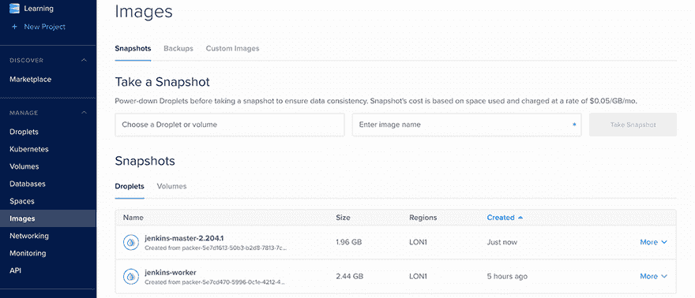

图 6.36 Jenkins 主机镜像快照

### 6.3.2 部署 Jenkins 主机 Droplet

在这一步，你需要编写 Terraform 模板文件来自动部署包含你刚刚使用 Packer 构建的 Jenkins 主机和工作节点的快照。

定义一个 terraform.tf 文件并声明 DigitalOcean 为提供者。在可以使用之前，提供者需要配置正确的 API 令牌，如下所示。

列表 6.37 定义 DigitalOcean 提供者

```
provider "digitalocean" {
  token = var.token
}
```

运行 `terraform` `init` 下载将 Terraform 指令转换为 API 调用的 DigitalOcean 插件：

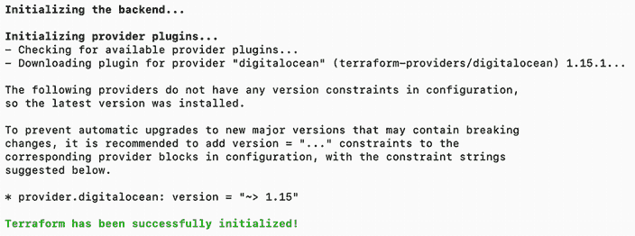

在 jenkins_master.tf 文件中定义一个名为 `jenkins-master` 的 `digitalocean_droplet` 类型的单个资源，如下所示。然后根据变量值设置其参数，并将来自你的 DigitalOcean 账户的 SSH 密钥（使用其指纹）添加到 Droplet 资源中。部署的 Droplet 类型将为 `s-1vcpu-2gb`，它包含 1 GB RAM 和 1vCPU。

对于更重的负载和更大的项目，以及处理连接到 Jenkins 网络仪表板的并发用户，可能需要一个大型 Droplet 类型。请参阅官方文档以获取可用的 Droplet 大小列表：[`mng.bz/N4yD`](http://mng.bz/N4yD)。

列表 6.38 Jenkins 主机 Droplet

```
data "digitalocean_image" "jenkins_master_image" {
  name = var.jenkins_master_image
}
resource "digitalocean_droplet" "jenkins_master" {
  name   = "jenkins-master"
  image  = data.digitalocean_image.jenkins_master_image.id     ❶
  region = var.region
  size   = "s-1vcpu-2gb"                                       ❷
  ssh_keys = [var.ssh_fingerprint]
}
```

❶ 使用之前用 Packer 打包的 Jenkins 主机镜像

❷ 配置一个具有 2 GB RAM 和 1vCPU 的 Droplet

在 DigitalOcean 上，你可以将你的 SSH 公钥上传到你的账户，这样你就可以在创建 Droplet 时将其添加到 Droplet 中（如图 6.37 所示）。这让你可以在 Jenkins 主机上无需密码登录，同时仍然保持安全。

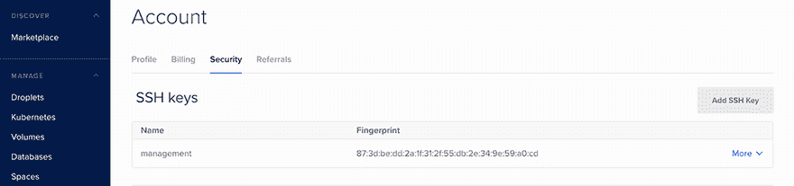

图 6.37 添加公共 SSH 密钥

接下来，将防火墙附加到 Jenkins 主机 Droplet 上，允许来自任何地方的 22 和 8080 端口的入站流量；请参阅以下列表。出于安全考虑，我建议将 SSH 入站流量限制到你的 CIDR 网络块。

列表 6.39 Jenkins 主机 Droplet 的防火墙

```
resource "digitalocean_firewall" "jenkins_master_firewall" {
  name = "jenkins-master-firewall"

  droplet_ids = [digitalocean_droplet.jenkins_master.id]

  inbound_rule {
    protocol         = "tcp"                          ❶
    port_range       = "22"                           ❶
    source_addresses = ["0.0.0.0/0", "::/0"]          ❶
  }

  inbound_rule {
    protocol         = "tcp"                          ❷
    port_range       = "8080"                         ❷
    source_addresses = ["0.0.0.0/0", "::/0"]          ❷
  }
  outbound_rule {
    protocol              = "tcp"                     ❸
    port_range            = "1-65535"                 ❸
    destination_addresses = ["0.0.0.0/0", "::/0"]     ❸
  }

  outbound_rule {
    protocol              = "udp"                     ❸
    port_range            = "1-65535"                 ❸
    destination_addresses = ["0.0.0.0/0", "::/0"]     ❸
  }

  outbound_rule {
    protocol              = "icmp"                    ❸
    destination_addresses = ["0.0.0.0/0", "::/0"]     ❸
  }
}
```

❶ 允许来自任何地方的 22（SSH）端口的入站流量

❷ 允许来自任何地方的 8080 端口的入站流量，其中 Jenkins 网络仪表板提供服务

❸ 允许来自任何地方的任何端口出站流量

将以下代码粘贴到 outputs.tf 文件中，以显示部署完成后 Jenkins 主机 Droplet 的 IP 地址。

列表 6.40 Jenkins 主机公共 IP 地址

```
output "master" {
  value = digitalocean_droplet.jenkins_master.ipv4_address
}
```

在新的 variable.tf 文件中定义表 6.3 中列出的 Terraform 变量。在 variables.tfvars 中设置它们的值，以将秘密和敏感信息从模板文件中排除。

表 6.3 DigitalOcean Terraform 变量

| 名称 | 类型 | 值 | 描述 |
| --- | --- | --- | --- |
| `token` | 字符串 | 无 | 这是 DigitalOcean API 令牌。或者，也可以使用 `DIGITALOCEAN_TOKEN` 环境变量指定。 |
| `region` | 字符串 | 无 | 部署 Jenkins 主机的 DigitalOcean 区域。 |
| `jenkins_master_image` | 字符串 | 无 | 使用 Packer 前期构建的 Jenkins 主机镜像的名称。 |
| `ssh_fingerprint` | 字符串 | 无 | SSH ID 或指纹。要检索信息，请转到 DigitalOcean 安全仪表板。 |

运行 `terraform plan` 命令以在执行前查看部署的影响：

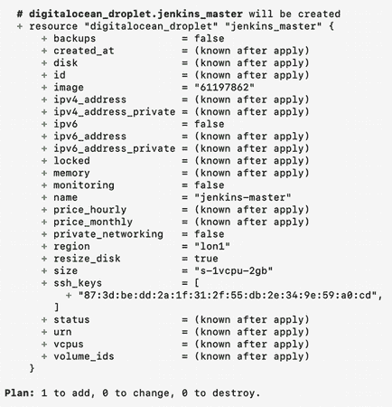

现在，您可以使用 `terraform apply` 命令验证并部署到 Droplet 上。部署过程应该只需几秒钟即可完成。然后，新的 Jenkins 主机 Droplet 将在 Droplets 控制台中可用，Terraform 应该显示 Jenkins 主机 Droplet 的 IP 地址，如图 6.38 所示。

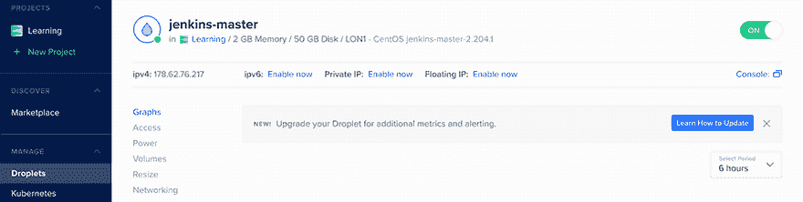

图 6.38 Jenkins 主机 Droplet

打开您喜欢的浏览器，并连接到前一个命令返回的公共 IPv4。应该显示预配置的 Jenkins 仪表板；见图 6.39。

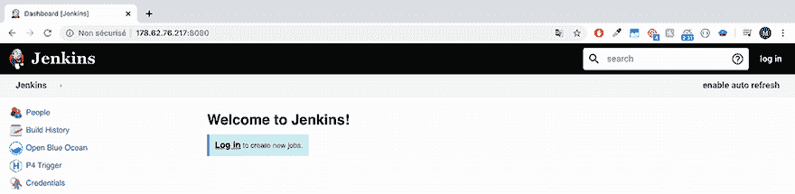

图 6.39 使用 Droplet 公共 IP 访问 Jenkins 仪表板

### 6.3.3 构建 Jenkins 工作节点 Droplets

现在将构建作业委托给工作节点，并卸载 Jenkins 主机 Droplet。将部署几个构建工作节点以吸收构建活动。

创建一个 jenkins_workers.tf 文件，在其中定义 Jenkins 工作节点 Droplets。工作节点将从 Jenkins 工作节点镜像启动。

列表 6.41 Jenkins 工作节点 Droplets

```
data "digitalocean_image" "jenkins_worker_image" {
  name = var.jenkins_worker_image
}

data "template_file" "jenkins_worker_startup_script" {
  template = "${file("scripts/join-cluster.tpl")}"                         ❶

  vars = {
    jenkins_url            = "http://${digitalocean_droplet.jenkins_master.ipv4_address}:8080"
    jenkins_username       = var.jenkins_username
    jenkins_password       = var.jenkins_password
    jenkins_credentials_id = var.jenkins_credentials_id
  }
}
resource "digitalocean_droplet" "jenkins_workers" {
  count = var.jenkins_workers_count                                        ❷
  name   = "jenkins-worker"
  image  = data.digitalocean_image.jenkins_worker_image.id
  region = var.region
  size   = "s-1vcpu-2gb"                                                   ❸
  ssh_keys = [var.ssh_fingerprint]
  user_data = data.template_file.jenkins_worker_startup_script.rendered    ❹
  depends_on = [digitalocean_droplet.jenkins_master]
}
```

❶ 该脚本用于使 Droplet 自动加入集群作为 Jenkins 代理/工作节点。

❷ 指示要创建的 Jenkins 工作节点数量

❸ 在此 Droplet 配置中，我们使用 1 GB 的 RAM 和 1vCPU 作为 Jenkins 工作节点的配置。

❹ 启动脚本通过 user_data 部分传递，以便在 Droplet 首次运行时执行。

`count` 变量用于定义要部署的工作节点数量。每个 Droplet 启动时将执行一个 shell 脚本。此脚本类似于前面章节中提供的脚本，但使用 DigitalOcean 元数据服务器来获取 Droplet IP 地址和主机名：

```
INSTANCE_NAME=$(curl -s http://169.254.169.254/metadata/v1/hostname)
INSTANCE_IP=$(curl -s http://169.254.169.254/metadata/v1/
interfaces/public/0/ipv4/address)
```

最后，为了在 Jenkins 主机和节点之间设置双向连接，我们定义了一个防火墙，允许 TCP 端口 22 的入站流量。

列表 6.42 Jenkins 工作节点防火墙

```
resource "digitalocean_firewall" "jenkins_workers_firewall" {
  name = "jenkins-workers-firewall"

  droplet_ids .
[for worker in digitalocean_droplet.jenkins_workers : worker.id   ]

  inbound_rule {
    protocol         = "tcp"                                         ❶
    port_range       = "22"                                          ❶
    source_droplet_ids = [digitalocean_droplet.jenkins_master.id]    ❶
  }
}
```

❶ 允许 Jenkins 主机通过 SSH 连接到 Jenkins 工作节点

几分钟后，工作节点的 Droplets 将完成配置，您将看到类似于图 6.40 的输出。

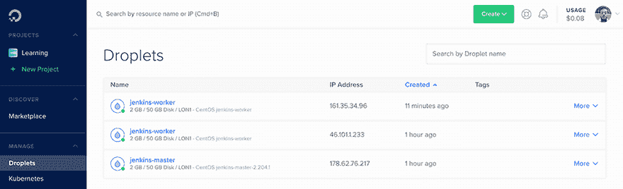

图 6.40 Jenkins 工作节点 Droplets

返回 Jenkins 仪表板。新部署的工作节点应在执行第五章列表 5.7 中的用户数据脚本后加入集群；见图 6.41。

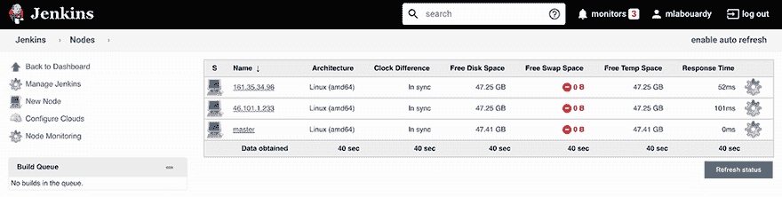

图 6.41 工作节点 Droplets 加入集群

您可以通过在 Jenkins 主 Droplet 前部署负载均衡器，将流量转发到端口 8080，并创建一个指向负载均衡器 FQDN 的 DNS 记录来进一步扩展此架构；见图 6.42。

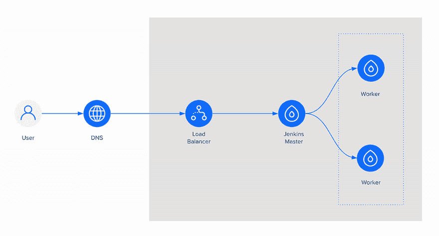

图 6.42 DigitalOcean 上的 Jenkins 集群架构

完成后，通过运行以下命令清理基础设施：

```
terraform destroy --var-file=variables.tfvars
```

本章介绍了如何使用 IaC 工具从零开始部署和操作具有弹性和自我修复能力的 Jenkins 集群，并在多个云服务提供商上实现。我还解释了如何通过自动缩放策略和指标警报来设计可扩展的 Jenkins 工作节点。在下一章中，我们将实现 Jenkins 上的代码管道，用于多种云原生应用程序，如 Docker 化的微服务和无服务器应用程序。

## 摘要

+   Packer 的强大之处在于利用模板文件来创建与目标平台无关的相同 Jenkins 机器镜像。

+   在 Google Cloud Platform 上部署 Jenkins 带来了对 Kubernetes 的无缝原生支持。

+   Azure 提供了各种基于云的服务，可能是在云上运行 Jenkins 的良好替代方案。

+   在 DigitalOcean 上运行 Jenkins 可以是初涉商业和初创企业的成本效益解决方案。
