# 7 为微服务定义管道代码

本章涵盖了

+   使用 Jenkins 多分支管道插件和 GitFlow 模型

+   定义容器化微服务的多分支管道

+   使用 GitHub 钩子触发 Jenkins 作业的推送事件

+   将 Jenkins 作业配置导出为 XML 并克隆 Jenkins 作业

之前的章节介绍了如何通过使用自动化工具：HashiCorp Packer 和 Terraform 在多个云服务提供商上部署 Jenkins 集群。在本章中，我们将定义一个针对 Docker 化微服务的持续集成（CI）管道。

在第一章中，你了解到 CI 是在将源代码更改集成到中央存储库之前，持续测试和构建所有更改。图 7.1 总结了此工作流程的阶段。

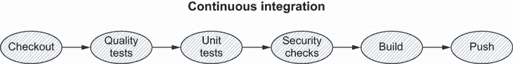

图 7.1 持续集成阶段

每次对源代码的更改都会触发 CI 管道，启动自动化测试。这带来了许多好处：

+   早期检测错误和问题，这导致维护时间和成本显著降低

+   确保随着系统的发展，代码库继续工作并满足规范要求

+   通过建立快速反馈循环来提高团队速度

尽管自动化测试带来了许多好处，但它们的实现和执行非常耗时。因此，我们将使用基于目标服务运行时和要求的测试框架。

一旦测试成功，源代码将被编译并构建一个工件。然后它将被打包并存储在远程注册表中，以便进行版本控制和后续部署。

第八章介绍了如何编写一个经典的 CI 管道，用于容器化微服务。最终结果将类似于图 7.2 中的 CI 管道。

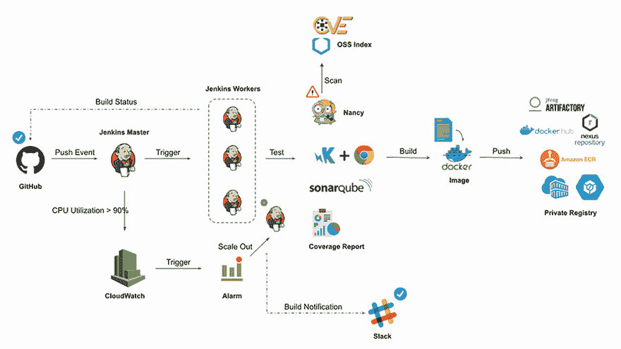

图 7.2 目标 CI 管道

这些步骤涵盖了持续集成过程的最基本流程。在接下来的章节中，一旦你对这个工作流程感到舒适，我们将更进一步。我们将从零开始创建我们的多分支管道，使用 Jenkins 和 GitHub 钩子持续运行管道。

## 7.1 介绍基于微服务的应用程序

为微服务架构创建一个可靠的 CI/CD 流程可能具有挑战性。管道的目标是允许团队快速独立地构建和部署他们的服务，而不会干扰其他团队或破坏整个应用程序的稳定性。

为了说明如何从头开始定义容器化微服务的 CI/CD 管道，我实现了一个基于微服务架构的简单 Web 应用程序。我们将集成并部署一个名为 Watchlist 的基于 Web 的应用程序，用户可以浏览史上最伟大的 100 部电影，并将它们添加到他们的观看列表中。

项目包括测试、基准测试以及运行应用程序本地和云端的所需一切。部署的应用程序将类似于图 7.3。

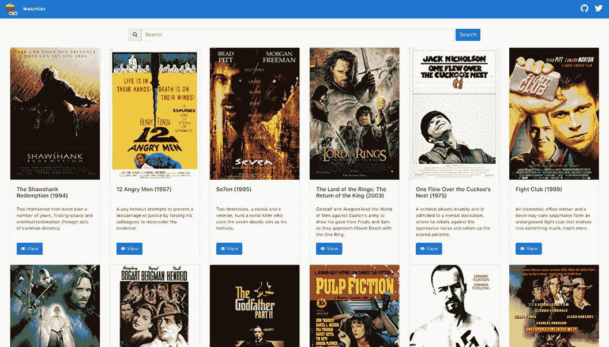

图 7.3 观看列表市场 UI

图 7.4 说明了应用程序架构和流程。


图 7.4 加载器服务将 JSON 格式的电影数组逐个转发到消息队列（例如，Amazon SQS）。从那里，解析器服务将消费这些项目，从 IMDb 数据库中获取电影的详细信息，并将结果保存到 MongoDB 中。最后，通过商店服务通过 RESTful API 提供数据，并通过市场 UI 进行可视化。

注意 *Amazon Simple Queue Service*（SQS）是一个分布式消息队列服务。它旨在提供一个高度可扩展的托管消息队列，以解决由生产者-消费者问题引起的问题，并解耦分布式应用程序服务。有关更多详细信息，请参阅[`aws.amazon.com/sqs/`](https://aws.amazon.com/sqs/)。

架构由多种语言编写的多个服务组成，以展示微服务范式的优势以及使用 Jenkins 来自动化不同运行时环境的构建和部署过程。表 7.1 列出了微服务。

表 7.1 应用程序微服务

| 服务 | 语言 | 描述 |
| --- | --- | --- |
| 加载器 | Python | 负责读取包含电影列表的 JSON 文件，并将每个电影项目推送到 Amazon SQS。 |
| 解析器 | Golang | 负责通过订阅 SQS 并从 IMDb 网站（[www.imdb.com](https://www.imdb.com)）抓取电影信息，并将元数据（电影名称、封面、描述等）存储到 MongoDB 中。 |
| 商店 | Node.js | 负责提供 RESTful API，具有端点用于从 MongoDB 服务器中的观看列表数据库中获取电影列表和插入新电影。 |
| 市场平台 | Angular 和 TypeScript | 负责通过调用 Store RESTful API 提供前端以浏览电影。 |

在我们深入探讨应用程序的 CI 工作流程之前，让我们看看分布式应用程序源代码将如何组织。当你开始转向微服务时，你将面临的一个重大挑战就是代码库的组织。

你是为每个服务创建一个仓库，还是为所有服务创建一个单一仓库？每种模式都有其自身的优缺点。

+   *多个仓库*——你可以有多个团队独立开发一个服务（清晰的归属感）。此外，较小的代码库更容易维护、测试和部署，且团队协调较少。然而，独立的团队可能会在组织内部产生局部知识，导致团队缺乏对项目整体图景的理解。

+   *单仓库*——拥有单个源代码控制仓库可以简化项目组织，减少管理项目依赖的开销。它也有助于提高团队在单仓库上工作时的工作文化。然而，版本控制可能会变得更加复杂，性能和可扩展性问题也可能出现。

这两种模式都有优点和缺点，都不是万能的解决方案。你应该了解它们的优点和局限性，并据此做出明智的决定，选择最适合你和你项目的方案。

你的代码库结构将影响 CI/CD 管道的构建。一个项目托管在单个仓库中可能会导致一个相当复杂的单一管道。管道的大小和复杂性通常是巨大的痛点。随着组织内部服务数量的增加，管道的管理也成为一个更大的问题。最终，大多数管道都变成了一个混乱的混合体，其中包含了 npm、pip 和 Maven 脚本，到处散布着一些 bash 脚本。另一方面，采用多仓库策略可能会导致需要管理的多个管道和代码重复。幸运的是，有解决方案可以减少管道管理，包括使用共享管道段和共享 Groovy 脚本。

注意：第十四章介绍了如何在 Jenkins 中编写共享库以在多个管道之间共享通用代码和步骤。

本书将说明如何为这两种模式构建 CI/CD 管道。对于微服务，我们将采用多仓库策略。在构建无服务器函数的 CI/CD 管道时，我们将涵盖单仓库方法。

首先，创建四个 Git 仓库以存储每个服务的源代码（Loader、Parser、Store 和 Marketplace）。在这本书中，我使用 GitHub，但任何源代码管理系统都可以使用，例如 GitLab、Bitbucket，甚至是 SVN。确保你在将要执行以下章节中提到的步骤的机器上安装了 Git。

注意：在本书中，我们将使用 GitFlow 模型进行分支管理。更多信息请参阅第二章。

一旦创建了仓库，就将它们克隆到你的工作区，并创建三个主要分支：develop、preprod 和 master 分支，以帮助组织代码并将正在开发中的代码与生产中运行的代码隔离开。这种分支策略是 GitFlow 工作流分支模型的简化版本。

注意：每个服务的完整 Jenkinsfile 可以在本书 GitHub 仓库的 chapter7/microservices 文件夹中找到。

使用以下命令创建目标分支并将它们推送到远程仓库：

```
git clone https://github.com/mlabouardy/movies-loader.git 
cd movies-loader
git checkout -b preprod
git push origin preprod
git checkout -b develop
git push origin develop
```

要查看 Git 仓库中的分支，请在你的终端中运行以下命令：

```
git branch -a
```

星号 (`*`) 将会出现在你当前所在的分支旁边（develop）。在你的终端会话中应该会显示类似以下的输出：

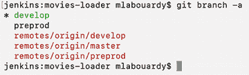

接下来，将书籍 GitHub 仓库中的代码复制到每个 Git 仓库的开发分支，然后将更改推送到远程仓库：

```
git add .
git commit -m "loading from json file"
git push origin develop
```

GitHub 仓库应类似于图 7.5。

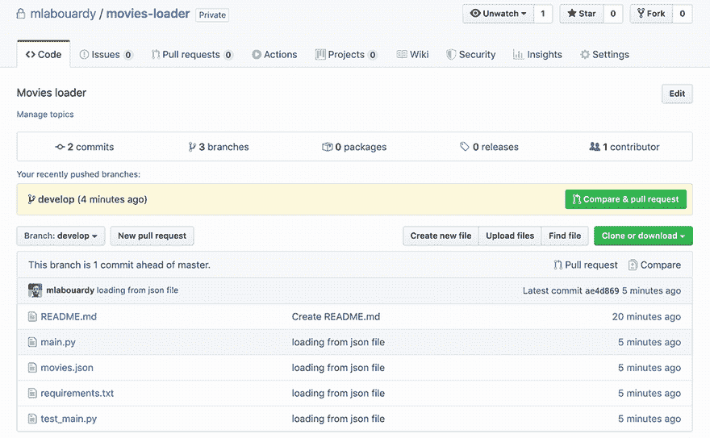

图 7.5 Loader GitHub 仓库包含服务源代码。

注意：目前，我们直接将更改推送到开发分支。稍后，您将看到如何创建拉取请求并使用 Jenkins 设置审查流程。

movies-loader 源代码位于 chapter7/microservices/movies-loader 文件夹中。重复相同的步骤来创建 movies-parser、movies-store 和 movies-marketplace GitHub 仓库。

## 7.2 定义多分支流水线作业

要将应用程序源代码与 Jenkins 集成，我们需要创建 Jenkins 作业以持续构建它。转到 Jenkins 网页仪表板，点击左上角的“新建项目”按钮，或点击“创建新作业”链接来创建新作业，如图 7.6 所示。

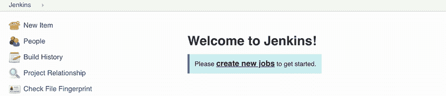

图 7.6 Jenkins 新作业创建

注意：有关部署 Jenkins 的分步指南，请参阅第五章。

在结果页面上，您将看到各种类型的 Jenkins 作业可供选择。输入项目名称，向下滚动，选择多分支流水线，然后点击“确定”按钮。多分支流水线选项允许我们自动为源控制仓库中的每个分支创建流水线。

图 7.7 显示了 movies-loader 服务的多分支作业流水线。

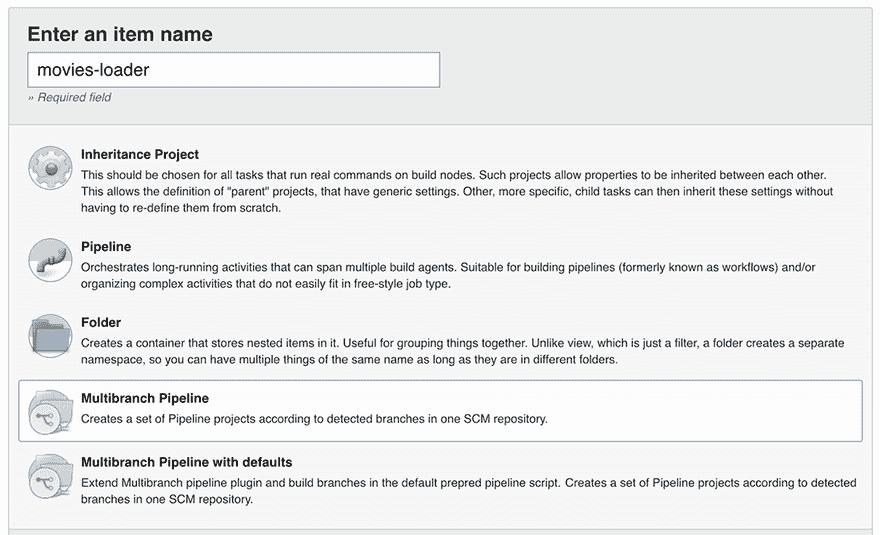

图 7.7 Jenkins 新作业设置

注意：Jenkins 多分支流水线插件（[`plugins.jenkins.io/workflow-multibranch/`](https://plugins.jenkins.io/workflow-multibranch/））默认安装在预制的 Jenkins 主机 AMI 上。

我将简要总结这里的新作业类型，然后在接下来的章节中更详细地解释每个类型：

+   *自由风格项目*—这是创建 Jenkins 作业的经典方式，其中每个 CI 阶段都通过 UI 组件和表单来表示。作业是基于网页的配置，任何修改都是通过 Jenkins 仪表板进行的。

+   *继承项目*—此项目类型的目的在于在多个作业定义之间实现 Jenkins 中的真正属性继承。它允许您只需共享一次公共属性，然后创建 Jenkins 作业以在许多项目中继承它们。

+   *流水线*—此作业类型允许您直接将 Jenkinsfile 粘贴到作业 UI 中，或者将单个 Git 仓库作为源并指定 Jenkinsfile 所在的单个分支。如果您计划使用基于主干的工作流程来管理项目源代码，此作业可能很有用。

+   *文件夹*—这是一种将多个项目组合在一起的方法，而不是项目本身的一种类型。这与 Jenkins 仪表板上的视图选项卡不同，后者仅提供过滤器。相反，这就像服务器上的目录文件夹，存储嵌套项。

+   *多分支管道*——这是我们将在本书中使用的项目类型。正如其名称所示，它允许我们为包含 Jenkinsfile 的每个 Git 分支自动创建嵌套作业。

+   *组织*——某些源代码控制平台提供了一种将多个仓库分组到组织中的机制。此项目类型允许你在组织内的仓库中使用 Jenkinsfile，并基于 Jenkinsfile 执行管道。目前，此项目类型仅支持 GitHub 和 Bitbucket 组织。

注意：基于主干的策略使用一个中央仓库，所有对项目的更改都通过一个单一入口（称为*主干*或*master*）进行。

为了明确起见，这些新工作类型的可用性取决于是否安装了必要的插件。如果你使用第四章 4.3.2 节中提供的插件列表烘焙了 Jenkins 主机机器镜像，你将获得前面列表中讨论的所有工作类型。

## 7.3 Git 和 GitHub 集成

管道脚本（Jenkinsfile）将在 GitHub 上版本化。因此，我们需要配置 Jenkins 作业以从远程仓库获取它。

在“常规”部分设置名称和描述。然后，从“分支源”部分选择代码源。通过从下拉列表中选择 GitHub 来配置管道以引用 GitHub 进行源代码管理；参见图 7.8。

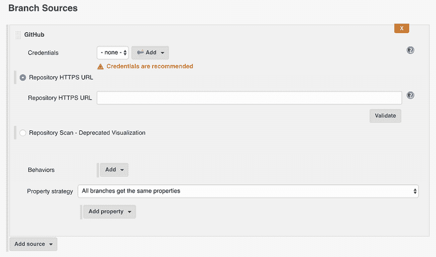

图 7.8 分支源配置

对于检出凭证，打开一个新标签页并转到 Jenkins 仪表板。点击凭证，然后点击系统。在全局凭证页面上，从左侧菜单中，点击添加凭证链接。接下来，创建一个新的 Jenkins 全局凭证，类型为用户名和密码，以访问 Git 中的微服务项目。GitHub 用户名和密码可以设置如图 7.9 所示。然而，不建议使用个人 GitHub 账户。

注意：Jenkins 凭证插件（[`plugins.jenkins.io/credentials/`](https://plugins.jenkins.io/credentials/））默认安装在烘焙的 Jenkins 主机机器镜像上。它是第四章 4.3.2 节中列出的基本插件之一。

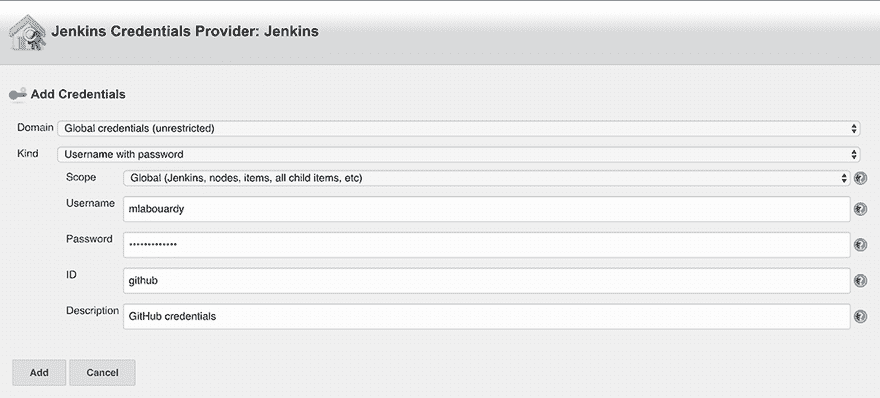

图 7.9 Jenkins 凭证提供者

因此，我在 GitHub 上创建了一个专门的 Jenkins 服务账户，并使用访问令牌而不是账户密码。你可以通过使用 GitHub 凭证登录并导航到设置来创建访问令牌。然后，从左侧菜单中选择开发者设置，并选择个人访问令牌，如图 7.10 所示。

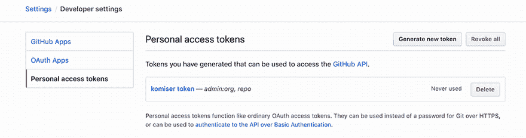

图 7.10 GitHub 个人访问令牌

点击生成新令牌按钮，为访问令牌命名，并从授权范围列表中选择 `repo` 访问，如图 7.11 所示。对于私有仓库，您必须确保已选择 `repo` 范围，而不仅仅是 `repo:status` 和 `public_repo` 范围。令牌名称很有帮助，因为您可能为许多应用程序拥有许多这样的令牌。

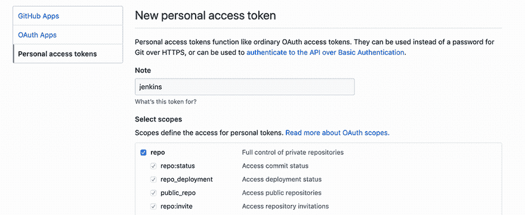

图 7.11 Jenkins 专为 GitHub 访问的令牌

如图 7.12 所示的 GitHub 警告指出，您必须在生成令牌后复制它，因为您将无法再次看到它。如果您未能这样做，您唯一的选择将是重新生成令牌。

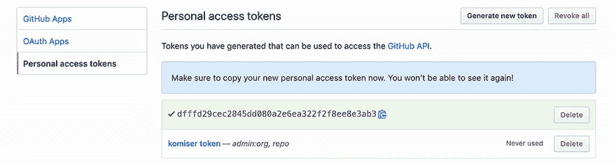

图 7.12 Jenkins 个人访问令牌

将 GitHub 个人访问令牌粘贴到密码字段中。通过在 ID 字段中输入一个字符串为您的 GitHub 凭据提供一个唯一的 ID，并在描述字段中添加一个有意义的描述，如图 7.13 所示。然后点击保存按钮。

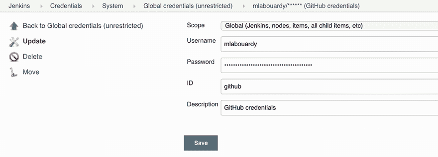


返回图 7.14 所示的作业配置选项卡，从凭据下拉列表中选择您创建的凭据。设置仓库 HTTPS 克隆 URL 并将发现行为设置为允许扫描所有仓库分支。然后，滚动到页面底部并点击应用和保存按钮。

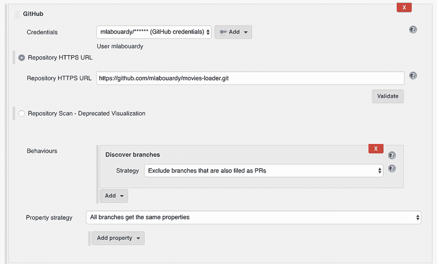


注意：我们将在第九章中介绍 Jenkins 高级扫描行为和策略。

Jenkins 将扫描 GitHub 仓库，寻找根仓库中具有 Jenkinsfile 的分支。到目前为止，还没有找到，我们可以通过从左侧侧边栏点击扫描仓库日志按钮来验证这一点。

注意：在这本书中，我们将使用“管道即代码”的概念，而不是像 Jenkins 经典自由式作业那样在 UI 中表示每个 CI 阶段。管道将在 Jenkinsfile 中进行描述。

日志输出确认，GitHub 仓库中尚未找到 Jenkinsfile，如图 7.15 所示。

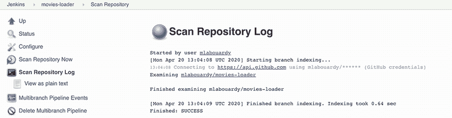


是时候创建一个 Jenkinsfile 了。使用您喜欢的文本编辑器或 IDE，在您本地 movies-loader Git 仓库的根目录下创建并保存一个名为 `Jenkinsfile` 的新文本文件。复制以下脚本化管道代码并将其粘贴到您的空 Jenkinsfile 中。

列表 7.1 使用脚本方法的 Jenkinsfile

```
node('workers'){
    stage('Checkout'){
        checkout scm
    }
}
```

注意：我们将在 Jenkinsfile 中使用脚本化管道语法来编写大部分内容。然而，当 CI 管道完成时，将采用声明式方法。

`Checkout`阶段，正如其名称所示，将简单地检出触发运行的参考点处的代码。您可以通过提供额外的参数来自定义检出过程。此外，阶段将在 Jenkins 工作节点上执行——因此，在节点块中使用了`workers`标签。我们假设我们已经在标记为`workers`的 Jenkins 实例上设置了一个 Jenkins 工作节点。如果没有提供标签，Jenkins 将在任何机器（主节点或工作节点）上可用的第一个执行器上运行管道。

保存您编辑后的 Jenkinsfile，并通过运行以下命令将更改推送到 develop 分支：

```
git add Jenkinsfile
git commit -m "creating Jenkinsfile"
git push origin develop
```

Jenkinsfile 与源代码一起存储在 GitHub 中。因此，就像任何代码一样，它可以在合并到主分支之前进行同行评审、评论和批准；见图 7.16。

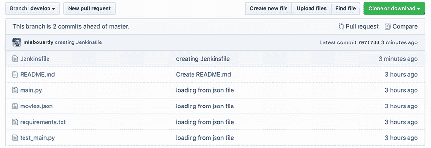

图 7.16 Jenkinsfile 与源代码一起存储

返回 Jenkins 仪表板，并再次触发扫描，请点击“立即扫描仓库”按钮。默认情况下，这将自动触发所有新发现的分支的构建，如图 7.17 所示。

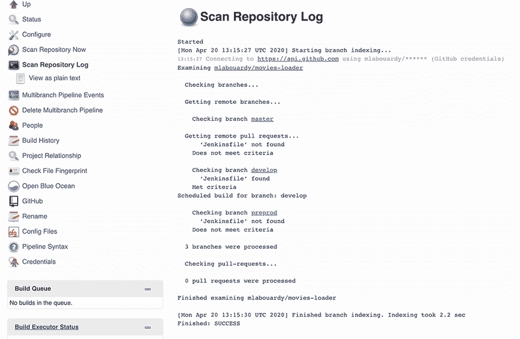

图 7.17 在 develop 分支上检测到的 Jenkinsfile

在我们当前的设置中，仅在 develop 分支上找到了 Jenkinsfile。如果我们再次点击 movies-loader 作业，Jenkins 应该为 develop 分支创建了一个嵌套作业，如图 7.18 所示。由于预生产和 master 分支上还没有 Jenkinsfile，因此没有为这些分支安排任何管道。

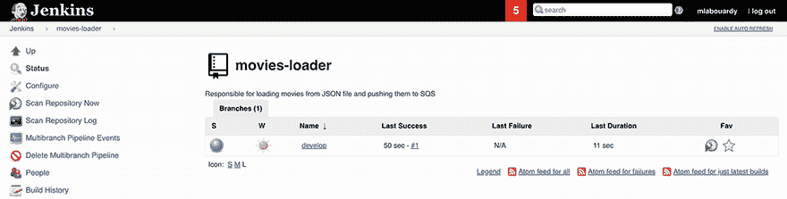

图 7.18 在 develop 分支上触发的构建作业

注意：如果您遇到分支作业未自动创建或构建的问题，请检查左侧作业侧边栏中的“扫描仓库日志”项。

构建应该自动在 develop 分支上触发，检出阶段将被执行并变为绿色。请注意，Git 客户端应该安装在执行构建的工作节点上。

Jenkins 阶段视图，如图 7.19 所示，让我们能够实时可视化管道各个阶段的进度。

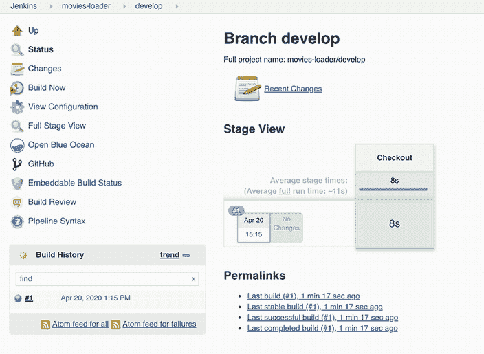

图 7.19 管道执行

注意：Jenkins 阶段视图是作为 2.*x*版本的一部分新功能出现的。它仅与 Jenkins Pipeline 和 Jenkins Multibranch pipeline 作业一起工作。

点击检出阶段列以查看阶段的日志。您可以看到 Jenkins 已克隆了 movies-loader GitHub 仓库，并检出 develop 分支以从远程仓库获取最新的源代码更改，如图 7.20 所示。

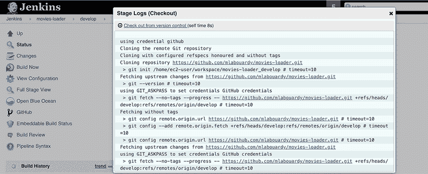

图 7.20 检出阶段日志

要查看完整的构建日志，请查找左侧的“构建历史”。构建历史记录选项卡将列出所有已运行的构建。点击最后一个构建编号；见图 7.21。

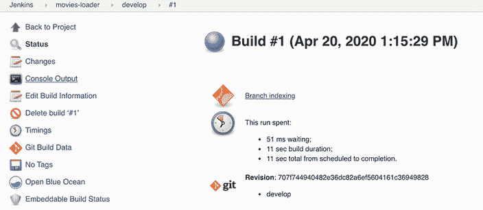

图 7.21 构建编号设置

然后，点击左上角的控制台输出项。完整的构建日志将会显示，如图 7.22 所示。


图 7.22 构建控制台日志

现在我们已经为 movies-loader 创建了一个 Jenkins 作业，接下来让我们为 movies-parser 服务创建另一个 Jenkins 作业；再次，前往 Jenkins 主页并点击新建项目按钮。然而，为了节省时间，请复制前一个作业的配置，如图 7.23 所示。


图 7.23 解析作业创建

点击确定按钮。movies-parser 作业将反映克隆的 movies-loader 作业的所有功能。根据图 7.24 更新 GitHub 仓库 HTTPS 克隆 URL、作业描述和显示名称。

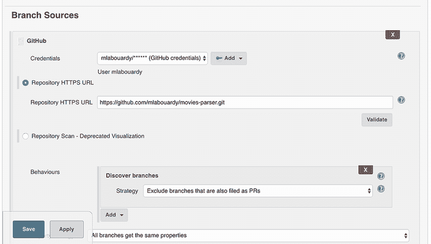

图 7.24 解析作业 GitHub 配置

将之前作业中使用的相同的 Jenkinsfile 推送到 movies-parser GitHub 仓库的 develop 分支。然后点击应用更改以使更改生效。

保存后，构建将始终从 Jenkinsfile 的当前版本运行到仓库中，如图 7.25 所示。

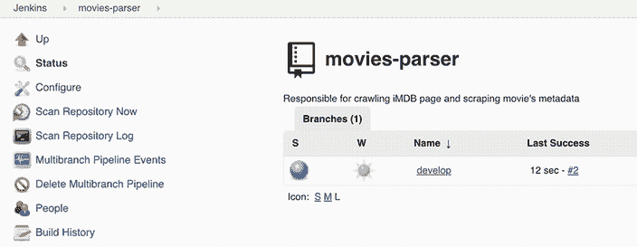

图 7.25 解析作业活动分支列表

按照相同的步骤创建 movies-store 和 movies-marketplace 服务的 Jenkins 作业。

虽然 Git 是目前最常用的分布式版本控制系统，但 Jenkins 内置了对 Subversion 的支持。要使用来自 Subversion 仓库的源代码，你只需提供相应的 Subversion URL——它将很好地与 HTTP、SVN 或 File 中的任何三个 Subversion 协议一起工作。Jenkins 将在您输入 URL 时立即检查该 URL 是否有效。如果仓库需要身份验证，您可以从图 7.26 所示的凭据下拉列表中创建一个类型为用户名的凭据，并选择它。

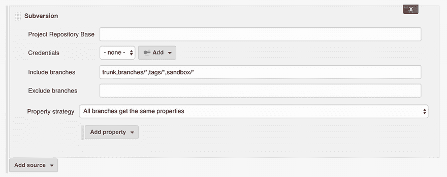

图 7.26 SVN 仓库配置

你可以通过在“检出策略”下拉列表中选择适当的值来微调 Jenkins 从你的 Subversion 仓库获取最新源代码的方式。

## 7.4 发现 Jenkins 作业的 XML 配置

创建或克隆一个多分支管道作业的另一种方法是导出现有作业的 config.xml 文件。如你所预期，该 XML 文件包含了构建作业的配置细节。

你可以通过将浏览器指向 JENKINS _DNS/job/JOB_NAME/config.xml 来查看作业的 XML 配置。它应该在浏览器页面中输出作业 XML 定义，如图 7.27 所示。

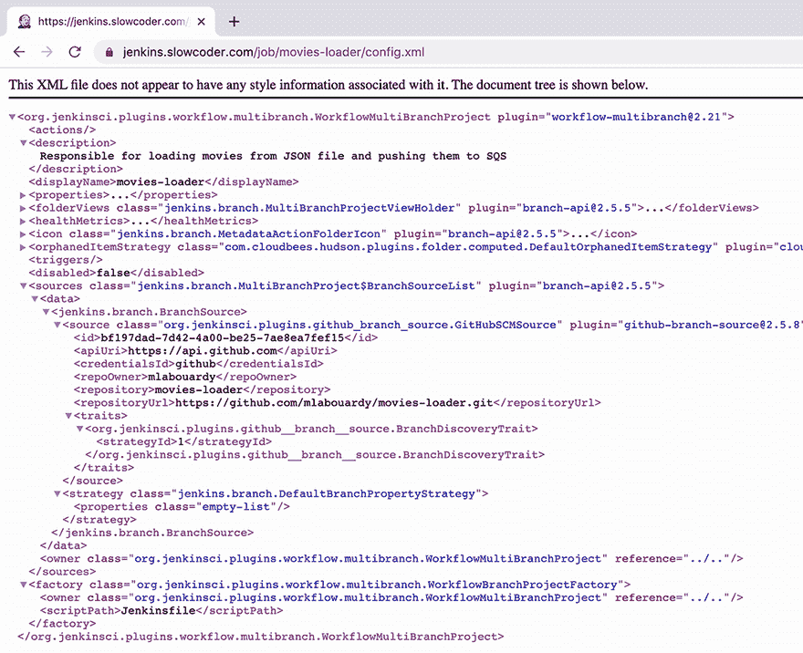

图 7.27 作业 XML 配置

将作业定义保存为 XML 文件，并根据你计划创建的目标 Jenkins 作业，在表 7.2 中更新相应的 XML 标签。

表 7.2 XML 标签

| XML 标签 | 描述 |
| --- | --- |
| `<description>` | 有意义的描述，用几句话解释 Jenkins 作业的目的 |
| `<displayName>` | Jenkins 作业的显示名称；通常的做法是将存储源代码的仓库名称用作显示名称的值 |
| `<repository>` | 存储源代码的 GitHub 仓库名称，例如 movies-store |
| `<repositoryURL>` | GitHub 仓库 HTTPS 克隆 URL，格式如下：https://github.com/username/repository.git |

注意：在第十四章中，我们将介绍如何使用 Jenkins CLI 自动化导入和导出 Jenkins 中的多个作业和插件。

以下列表是 movies-store 作业的 XML 配置文件示例。它展示了 Jenkins 作业 XML 配置的典型结构。

列表 7.2 电影存储配置.xml

```
<?xml version="1.0" encoding="UTF-8"?>
<org.jenkinsci.plugins.workflow
.multibranch.WorkflowMultiBranchProject plugin="workflow-multibranch@2.21">
   <actions />
   <description>Movies store RESTful API</description>                      ❶
   <displayName>movies-store</displayName>                                  ❶
   <sources class="jenkins.branch
.MultiBranchProject$BranchSourceList" plugin="branch-api@2.5.5">
      <data>
         <jenkins.branch.BranchSource>
            <source class="org.jenkinsci.plugins
.github_branch_source.GitHubSCMSource" plugin="github-branch-source@2.5.8">
               <id>bf197dad-7d42-4a00-be25-7ae8ea7fef15</id>
               <apiUri>https://api.github.com</apiUri>                      ❷
               <credentialsId>github</credentialsId>                        ❷
               <repoOwner>mlabouardy</repoOwner>                            ❷
               <repository>movies-store</repository>                        ❷
               <repositoryUrl>
https://github.com/mlabouardy/movies-store.git
               </repositoryUrl>                                             ❸
               <traits>                                                     ❸
                  <org.jenkinsci.plugins.github__branch__source.BranchDiscoveryTrait>    ❸
                     <strategyId>1</strategyId>                             ❸
</org.jenkinsci.plugins.github__branch__source.BranchDiscoveryTrait>        ❸
               </traits>
            </source>
         </jenkins.branch.BranchSource>
      </data>
   </sources>
</org.jenkinsci.plugins.workflow.multibranch.WorkflowMultiBranchProject>
```

❶ 定义作业的名称和描述

❷ 定义项目的 GitHub 仓库 URL（HTTPS 格式）

❸ 告知 Jenkins 扫描 GitHub 仓库中的所有分支以查找 Jenkinsfile

注意：为了简洁，XML 已被裁剪。完整的作业 XML 定义可在 GitHub 仓库的 chapter7/jobs/movies-store.xml 中找到。

一旦您已使用适当的值更新了 config.xml 文件，请向包含作业 XML 定义的负载的 Jenkins URL 发出 HTTP POST 请求，查询参数`name`等于目标作业的名称。图 7.28 展示了使用 Postman HTTP API 客户端创建 movies-store 作业的示例。

注意：如果 Jenkins 启用了 CSRF 保护，您需要创建一个 API 令牌而不是 crumb 发行者令牌。有关更多信息，请参阅第二章。

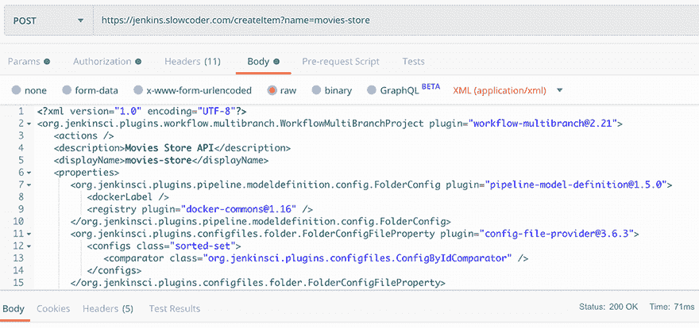

图 7.28 使用 Postman 创建作业的 Jenkins RESTful API

可以使用一行 cURL 命令来克隆并创建一个新的作业：

```
curl -s https:///<USER>:<API_TOKEN>@JENKINS_HOST/job/JOBNAME/config.xml
| curl -X POST 'https:///<USER>:<API_TOKEN>@JENKINS_HOST/createItem?name=JOBNAME.
--header "Content-Type: application/xml" -d @-
```

Jenkins API 令牌（`API_TOKEN`变量）可以通过登录到 Jenkins 仪表板并使用您想要生成 API 令牌的用户来创建。然后打开用户配置文件页面，并点击“配置”以打开用户配置页面。

定位到“添加新令牌”按钮，为新令牌命名，然后点击“生成”按钮，如图 7.29 所示。获取令牌，并将前面的 cURL 命令中的`API_TOKEN`变量替换为生成的令牌值。

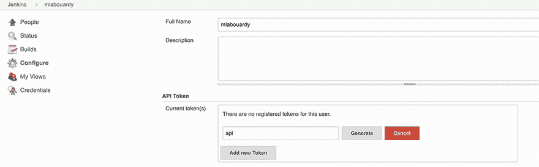

图 7.29 Jenkins API 令牌生成

注意：Jenkins 作业也可以通过直接将 XML 文件复制到 Jenkins 主实例的/var/lib/jenkins/jobs/<*作业名称*>文件夹中，并使用`service jenkins restart`命令重启 Jenkins 来创建，以便更改生效。

一旦创建了四个 Jenkins 作业，您应该在 Jenkins 主页上看到图 7.30 所示的作业。您可以通过创建一个 Jenkins 文件夹来将这些作业组织在一个视图中。您可以创建一个名为 Watchlist 的文件夹，并将这些作业移动到其中。

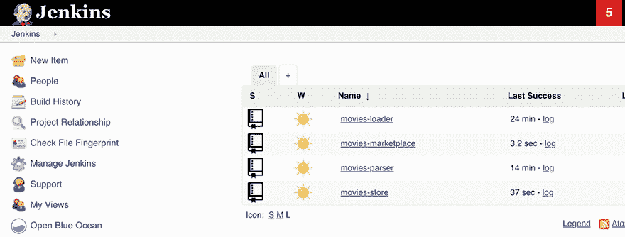

图 7.30 Jenkins 中的微服务作业

要这样做，请按照以下步骤操作：从侧边栏中点击新建项目，在文本框中输入 `Watchlist` 作为名称，并选择文件夹以创建文件夹。要将现有作业移动到文件夹中，点击作业右侧的箭头并选择移动。选择 `Watchlist` 作为目标文件夹并点击移动。

微服务作业可以通过以下 URL 格式访问：JENKINS_DNS/job/Watchlist/job。

即使 Jenkins CLI 的使用已被弃用且不推荐用于安全漏洞（至少对于 Jenkins 2.53 及更早版本），也可以使用它来导入或导出作业。你可以运行以下命令来导入你的 Jenkins 作业 XML 文件：

```
java -jar jenkins-cli.jar -s JENKINS_URL 
-auth USERNAME:PASSWOR.
create-job movies-marketplace < config.xml
```

另一种身份验证方法是使用访问令牌，通过将 `-auth` 选项替换为 `username:token` 参数。

## 7.5 配置 Jenkins 的 SSH 验证

之前，你学习了如何使用用户名和密码凭据在 Jenkins 上配置 GitHub。我们还介绍了如何创建具有细粒度权限的 GitHub API 访问令牌。本节将介绍如何使用 SSH 密钥而不是凭据来验证项目仓库。

注意：你可以使用 `ssh-keygen` 命令生成一个用于 SSH 验证的单一用途 SSH 密钥。

首先，配置 GitHub 上的 Jenkins 公共 SSH 密钥。你可以通过访问仓库设置并在部署密钥部分添加部署密钥来配置 GitHub 仓库上的 SSH。或者，简单地从用户配置文件设置中全局配置 SSH 密钥。给一个如 `Jenkins` 的名称，并将公钥（从 id_rsa.pub 文件中）粘贴进去；见图 7.31。

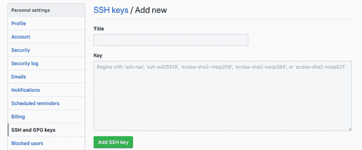

图 7.31 GitHub SSH 配置

注意：一旦一个密钥被用作一个仓库的部署密钥，它就不能用于另一个仓库。

要确定密钥是否已成功配置，请在你的 Jenkins SSH 会话中输入以下命令。使用 `-i` 标志提供 Jenkins 私钥的路径：

```
ssh -T -ai PRIVATE_KEY_PATH git@github.com
```

如果响应看起来像 `Hi` `username`，则密钥已正确配置。

现在，转到 Jenkins 控制台左侧的凭据，并点击全局。然后选择添加凭据，创建一个类型为 SSH 用户名的凭据。给它一个名称，并设置 SSH 私钥的值，如图 7.32 所示。用户名应该是托管项目的 GitHub 账户的用户名。在密码短语文本框中，写下生成 SSH RSA 密钥时给出的密码短语。如果没有设置，请留空。

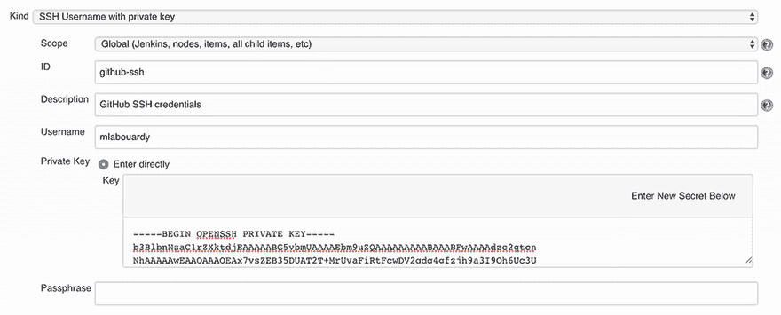

图 7.32 在 Jenkins 上配置 GitHub SSH 凭据

返回 Jenkins 作业，在分支源下，从下拉列表中选择 Git，设置仓库 SSH 克隆 URL，并选择已保存的凭据标题名称；见图 7.33。

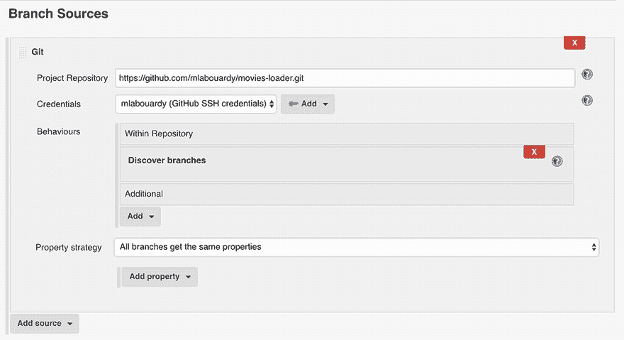

图 7.33 配置 Jenkins 作业以使用 SSH 密钥

如果您查看构建输出，它应该清楚地列出正在使用 SSH 密钥进行身份验证。以下是一个突出显示相同内容的示例输出：

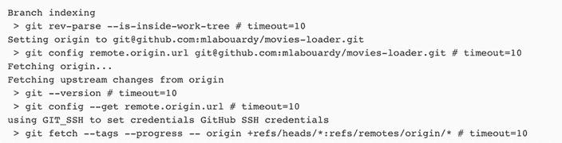

到目前为止，`Checkout`阶段一直使用当前 Jenkins 作业中配置的凭据和设置。如果您想自定义设置并使用特定的凭据，可以替换以下列表。

列表 7.3 定制的 git clone 命令

```
stage('Checkout') {
    steps {
        git branch: 'develop',
            credentialsId: 'github-ssh',
            url: 'git@github.com:mlabouardy/movies-loader.git'
    }
}
```

本例将使用存储在 github-ssh Jenkins 凭证中的 SSH 凭据克隆 movies-loader GitHub 仓库的 develop 分支。

## 7.6 使用 GitHub webhooks 触发 Jenkins 构建

到目前为止，我们总是通过点击构建现在按钮手动构建管道。它工作得很好，但不是很方便。所有团队成员都必须记住，在提交到仓库后，他们需要打开 Jenkins 并开始构建。

要通过推送事件触发作业，我们将在每个服务的 GitHub 仓库上创建一个 webhook，如图 7.34 所示。记住，相应的分支上也应该有一个 Jenkinsfile，以便告诉 Jenkins 在发现仓库中的更改时需要做什么。

注意，*Webhooks*是用户定义的 HTTP 回调。它们由 Web 应用程序中的事件触发，可以促进不同应用程序或第三方 API 的集成。

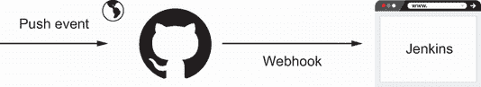

图 7.34 Webhook 解释

导航到您想要连接到 Jenkins 的 GitHub 仓库，并点击仓库设置选项。在左侧菜单中，点击 Webhooks，如图 7.35 所示。

GitHub webhooks 允许您通过向配置的服务 URL 发送 POST 请求，在发生某些 Git 事件（推送、合并、提交、分支等）时通知外部服务。


图 7.35 GitHub Webhooks 部分

点击添加 Webhook 按钮，弹出相关对话框，如图 7.36 所示。填写以下值：

+   负载 URL 应采用以下格式：JENKINS_URL/github-webhook/（确保包括最后一个正斜杠）。

+   内容类型可以是 application/json 或 application/x-www-form-urlencoded。

+   选择推送事件作为触发器，并保留密钥字段为空（除非在 Jenkins Configure System > GitHub Plugin 部分创建了并配置了密钥）。

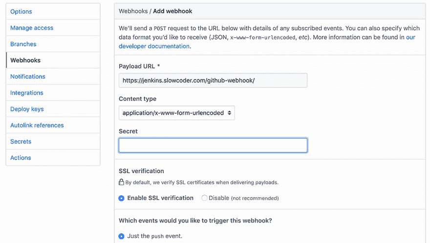

图 7.36 Jenkins webhook 设置

将其余选项保留为默认值，然后点击添加 Webhook 按钮。应向 Jenkins 发送测试负载以设置钩子。如果负载成功被 Jenkins 接收，您应该看到带有绿色勾选标记的 webhook，如图 7.37 所示。

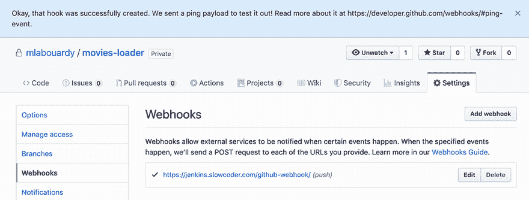

图 7.37 Jenkins webhook 设置

完成这些 GitHub 更新后，如果您将更改推送到 Git 仓库，应该会自动触发一个新事件。在这种情况下，我们更新 README.md 文件：

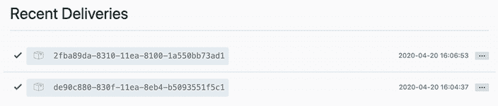

返回您的 Jenkins 项目，您将看到在上一步骤中执行的提交自动触发了新的作业。点击作业旁边的箭头并选择控制台输出。图 7.38 显示了输出。

更新 README 的消息确认，在将新的 README.md 推送到 GitHub 仓库后，构建被自动触发。现在，每次您将更改发布到远程仓库时，GitHub 都会触发您的新 Jenkins 作业。通过遵循相同的程序，在剩余的 GitHub 仓库上创建类似的 webhook。

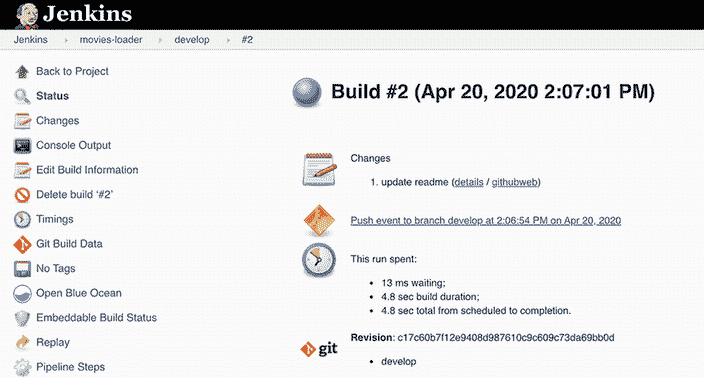

图 7.38 GitHub 推送事件

注意：如果您想使 SVN 用户在每次提交后持续触发 Jenkins 作业，您可以选择配置 Jenkins 定期轮询 SVN 服务器，或者在远程仓库上设置 post-commit 钩子。

在不同的情况下，Jenkins 仪表板可能无法从公共网络访问。您可以通过在 GitHub 服务器和 Jenkins 之间设置一个公共反向代理作为中间件，并配置 GitHub webhook 使用中间件 URL 来代替手动执行作业。图 7.39 解释了如何使用 AWS 托管服务在 VPC 内为 Jenkins 实例设置 webhook 转发器。

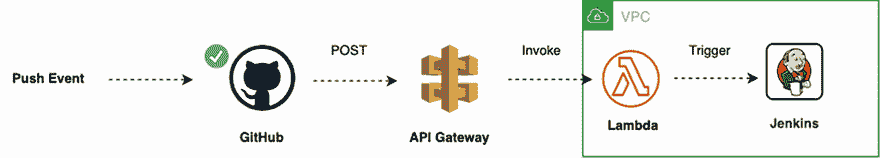

图 7.39 使用 API 网关设置 GitHub webhook

注意：您可以将这种方法推广到其他服务，例如 Bitbucket 或 DockerHub——或者任何实际上会发出 webhooks 的服务。

如果您使用 AWS 作为云提供商，您可以使用名为 Amazon API Gateway 的托管代理，在特定端点上对 POST 请求进行调用时调用 Lambda 函数，如图 7.40 所示。

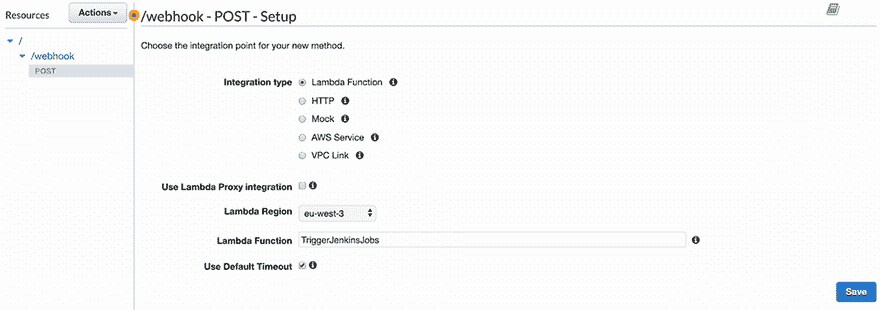

图 7.40 使用 API 网关触发 Lambda 函数

Lambda 函数将从 API 网关接收 GitHub 有效负载并将其转发到 Jenkins 服务器。以下列表是一个用 JavaScript 编写的函数入口点。

列表 7.4 Lambda 函数处理程序

```
const Request = require('request');
exports.handler = (event, context, callback) => {
    Request.post({
        url: process.env.JENKINS_URL,
        method: "POST",
        headers: {
            "Content-Type": "application/json",
            "X-GitHub-Event": event.headers["X-GitHub-Event"]
        },
        json: JSON.parse(event.body)
    }, (error, response, body) => {
        callback(null, {
            "statusCode": 200,
            "headers": {
                "content-type": "application/json"
            },
            "body": "success",
            "isBase64Encoded": false
        })
    })
};
```

要部署 GitHub webhook 和 AWS 资源，我们将使用 Terraform。但首先，我们需要创建一个包含 Lambda 函数 index.js 入口点的部署包。部署包是一个可以通过以下命令生成的 zip 文件：

```
zip deployment.zip index.js
```

注意：本节假设您熟悉 Terraform 的常规计划/应用工作流程。如果您是 Terraform 的新手，请参阅第五章。

接下来，我们定义一个名为 lambda.tf 的文件，其中包含 AWS Lambda 函数的 Terraform 资源定义。我们将运行时设置为 Node.js 运行环境（Lambda 处理程序是用 JavaScript 编写的）。我们定义一个名为`JENKINS_URL`的环境变量，其值指向 Jenkins 网页仪表板的 URL，如下一列表所示。

列表 7.5 基于 Node.js 运行的 Lambda 函数

```
resource "aws_lambda_function" "lambda" {
  filename = "../deployment.zip"
  function_name = "GitHubWebhookForwarder"
  role = aws_iam_role.role.arn
  handler = "index.handler"
  runtime = "nodejs14.x"
  timeout = 10
  environment {
    variables = {
      JENKINS_URL = var.jenkins_url
    }
  }
}
```

然后，我们定义一个 API Gateway RESTful API，当在 /webhook 端点发生 POST 请求时触发前面的 Lambda 函数。在上一步骤的 lambda.tf 相同目录下创建一个新文件 apigateway.tf，并粘贴以下内容。

列表 7.6 API Gateway RESTful API

```
resource "aws_api_gateway_rest_api" "api" {
  name        = "GitHubWebHookAPI"
  description = "GitHub Webhook forwarder"
}

resource "aws_api_gateway_resource" "path" {
   rest_api_id = aws_api_gateway_rest_api.api.id
   parent_id   = aws_api_gateway_rest_api.api.root_resource_id
   path_part   = "webhook"
}

resource "aws_api_gateway_integration" "request_integration" {
  rest_api_id = aws_api_gateway_rest_api.api.id
  resource_id = aws_api_gateway_method.request_method.resource_id
  http_method = aws_api_gateway_method.request_method.http_method
  type        = "AWS_PROXY"
  uri         = aws_lambda_function.lambda.invoke_arn
  integration_http_method = "POST"
}
```

最后，在以下列表中，我们创建一个 API Gateway 部署以激活配置，并在可用于 webhook 配置的 URL 上公开 API。我们使用 Terraform 输出变量通过引用 API 部署阶段来显示 API 部署 URL。

列表 7.7 API 新部署阶段

```
resource "aws_api_gateway_deployment" "stage" {
   rest_api_id = aws_api_gateway_rest_api.api.id
   stage_name  = "v1"
}

output "webhook" {
    value = "${aws_api_gateway_deployment.stage.invoke_url}/webhook"
}
```

在发出 `terraform apply` 命令之前，您需要定义前面资源中使用的变量。variables.tf 文件将包含变量列表，这些变量在表 7.3 中详细说明。

表 7.3 GitHub webhook 代理的 Terraform 变量

| 变量 | 类型 | 值 | 描述 |
| --- | --- | --- | --- |
| `region` | 字符串 | `none` | 部署 AWS 资源的 AWS 区域。它也可以从 `AWS_REGION` 环境变量中获取。 |
| `shared_credentials_file` | 字符串 | `none` | 共享凭据文件的路径。如果没有设置此值且指定了配置文件，则使用 ~/.aws/credentials。 |
| `aws_profile` | 字符串 | `profile` | 在共享凭据文件中设置的 AWS 配置文件名称。 |
| `jenkins_url` | 字符串 | `none` | Jenkins URL，格式为 http://IP:8080，或使用 HTTPS（如果使用 SSL 证书）。 |

当 Terraform 完成部署 AWS 资源后，应创建一个名为 `GitHubWehookForwarder` 的新 Lambda 函数，其触发类型为 API Gateway，如图 7.41 所示。

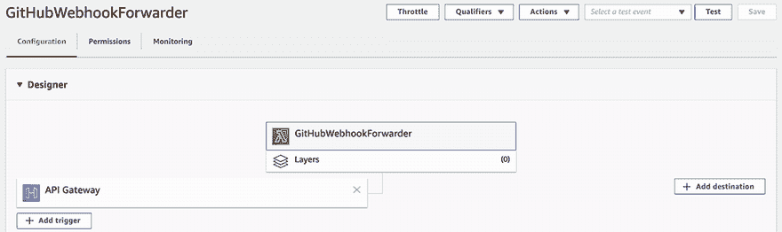

图 7.41 `GitHubWebhookForwarder` Lambda 函数

此外，Terraform 将显示 RESTful API 部署 URL，您可以使用它来在目标 GitHub 仓库上创建 webhook，如图 7.42 所示。

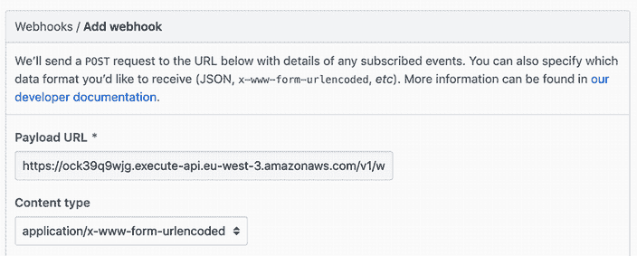

图 7.42 基于 API Gateway URL 的 GitHub webhook

Webhooks 应该现在正在流动。您可以对您的仓库进行更改，并检查构建是否很快开始。您还可以通过要求请求密钥并在 Lambda 函数端验证传入请求签名来添加额外的安全层。

如果您在本地运行 Jenkins，可以使用构建触发器轮询 SCM 并定期运行，如图 7.43 所示。在这种情况下，Jenkins 将定期检查仓库，如果发生任何更改，它将运行作业。

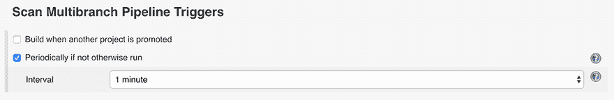

图 7.43 在作业设置下，您可以定义检查的间隔。

首次手动运行管道后，自动触发器被设置。然后它每分钟检查 GitHub，对于新的提交，开始构建。为了测试它是否按预期工作，您可以将任何内容提交到 GitHub 仓库并查看构建是否开始。

注意：轮询源代码管理（SCM），即使它不太直观，如果 Git 提交频繁且构建时间较长，可能仍然有用，因为每次推送事件都执行构建可能会导致过载。

到目前为止，你已经学习了如何将 Git 仓库与 Jenkins 集成并定义多分支流水线作业。我们最终创建了我们第一个完整的提交流水线。然而，在当前状态下，它并没有做太多。在接下来的章节中，我们将看到可以对提交流水线进行哪些改进，以便使其更加完善，并且我们将从在 Jenkins 流水线中运行自动化测试开始。

## 摘要

+   Webhook 是一种机制，可以在远程 Git 仓库中提交提交时自动触发 Jenkins 项目的构建。

+   团队或组织内部应仔细选择开发工作流程，因为它会影响持续集成（CI）过程并定义代码的开发方式。

+   使用多仓库或单仓库策略来组织代码库将定义持续集成/持续部署（CI/CD）管道的复杂性，因为组织内部的应用程序数量会随着时间而演变。

+   当 Jenkinsfile 和应用程序源代码位于同一 Git 仓库中时，流水线可以经过标准的代码开发过程（代码审查、拉取请求、自动化测试等）。

+   Jenkins 将运行作业的配置文件存储在一个 XML 文件中。编辑这些 XML 配置文件的效果与通过 Web 仪表板编辑 Jenkins 作业相同。

+   反向代理可以用来让 Git webhook 到达位于防火墙后面的运行中的 Jenkins 服务器。
