# 8 使用 Jenkins 运行自动化测试

本章涵盖

+   为基于 Python、Go、Node.js 和 Angular 的服务实现 CI 管道

+   使用无头 Chrome 运行预集成测试和自动化 UI 测试

+   在 Jenkins 管道中执行 SonarQube 静态代码分析

+   在 Docker 容器内运行单元测试并发布代码覆盖率报告

+   在 Jenkins 管道中集成依赖性检查并在 DevOps 中注入安全性

在上一章中，你学习了如何为容器化微服务设置多分支管道作业，以及如何使用 webhooks 在推送事件上持续触发 Jenkins。在本章中，我们将在 CI 管道中运行自动化测试。图 8.1 总结了当前的 CI 工作流程阶段。

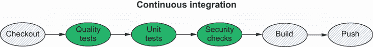

图 8.1 本章涵盖的测试阶段

测试自动化通常被认为是敏捷开发的基础。如果你想快速发布——甚至每天——并且保持合理的质量，你必须转向自动化测试。另一方面，对测试的重视不足可能导致客户不满和产品延迟。然而，自动化测试过程比自动化构建、发布和部署过程要困难一些。通常需要大量努力来自动化应用程序中使用的几乎所有测试用例。这是一个随着时间的推移而成熟的活动。并不是所有的测试都可以自动化。但想法是自动化尽可能多的测试。

到本章结束时，我们将实现如图 8.2 所示的 CI 管道中的测试阶段。

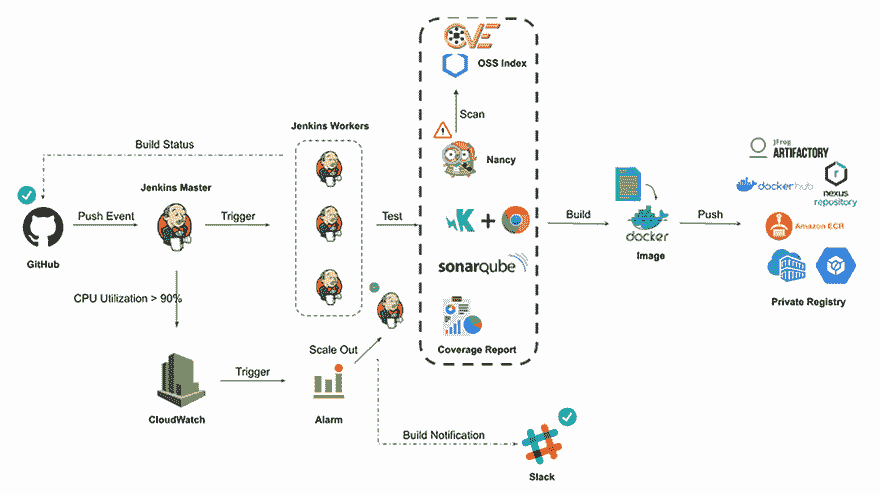

图 8.2 目标 CI 管道

在继续 CI 管道实现之前，关于我们与 Jenkins 集成的 Web 分布式应用程序的快速提醒：它基于微服务架构，并分为用不同编程语言和框架编写的组件/服务。图 8.3 说明了这种架构。

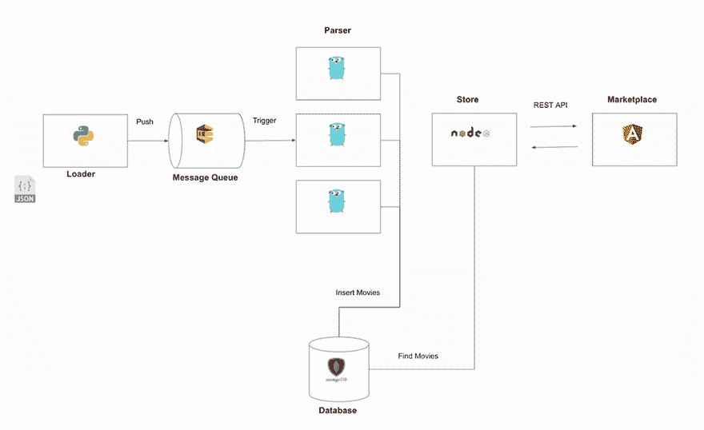

图 8.3 观察列表微服务架构

在接下来的章节中，你将学习如何将各种类型的测试集成到我们的 CI 工作流程中。我们将从单元测试开始。

## 8.1 在 Docker 容器内运行单元测试

*单元*测试是尽早识别问题的前沿工作。测试需要小而快速执行，以便高效。

movies-loader 服务是用 Python 编写的。为了定义单元测试，我们将使用 unittest 框架（它随 Python 的安装一起提供）。要使用它，我们需要导入 unittest 模块，它提供了一套丰富的用于构建和运行测试的方法。以下列表，test_main.py，演示了一个简短的单元测试，用于测试 JSON 加载和解析机制。

列表 8.1 Python 中的单元测试

```
import unittest
import json

class TestJSONLoaderMethods(unittest.TestCase):
    movies = []

    @classmethod
    def setUpClass(cls):
        with open('movies.json') as json_file:
            cls.movies = json.load(json_file)

    def test_rank(self):
        self.assertEqual(self.movies[0]['rank'], '1')

    def test_title(self):
        self.assertEqual(self.movies[0]['title'], 'The Shawshank Redemption')

   def test_id(self):
        self.assertEqual(self.movies[0]['id'], 'tt0111161')

if __name__ == '__main__':
    unittest.main()
```

`setUpClass()` 方法允许我们在每个测试方法执行之前加载 movies.json 文件。三个单独的测试是通过以 `test` 前缀开头的方法定义的。这种命名约定通知测试运行器哪些方法代表测试。每个测试的核心是一个调用 `assertEqual()` 的操作，以检查预期的结果。例如，我们检查从 JSON 文件解析出的第一部电影标题属性是否为 `The` `Shawshank` `Redemption`。

要运行测试，我们可以在 Jenkins 上执行 `python test_main.py` 命令。但是，它需要安装 Python 3。为了避免为构建的每个服务安装运行时环境，我们将在 Docker 容器中运行测试。这样，我们将在所有 Jenkins 工作节点上使用 Docker 作为执行环境。

在 movies-loader 仓库中，使用您喜欢的文本编辑器或 IDE 创建一个名为 Dockerfile.test 的文件，内容如下。

列表 8.2 Movie loader 的 Dockerfile.test

```
FROM python:3.7.3
WORKDIR /ap.
COPY test_main.py .
COPY movies.json .
```

Dockerfile 是从 Python 3.7.3 官方镜像构建的。它设置了一个名为 app 的工作目录，并将测试文件复制到工作目录中。

注意：使用 *Dockerfile.test* 的命名约定是为了避免与用于构建主应用程序 Docker 镜像的 *Dockerfile* 发生名称冲突。

现在，更新列表 7.1 中给出的 Jenkinsfile，并添加一个新的 `Unit` `Test` 阶段，如下所示。该阶段将基于 Dockerfile .test 创建 Docker 镜像，然后从创建的镜像启动 Docker 容器以运行 `python` `test_main.py` 命令以启动单元测试。`Unit` `Test` 阶段使用类似 DSL 的语法来定义 shell 指令。

列表 8.3 Movie loader 的 Jenkinsfile

```
def imageName = 'mlabouardy/movies-loader'

node('workers'){
    stage('Checkout'){
        checkout scm
    }

    stage('Unit Tests'){
        sh "docker build -t ${imageName}-test -f Dockerfile.test ."
        sh "docker run --rm ${imageName}-test"
    }
}
```

使用 `docker build` 和 `docker run` 命令分别创建镜像和从镜像构建容器。

注意：`docker run` 命令中的 `--rm` 标志用于在容器退出时自动清理容器并删除文件系统。

您可以在 Windows 工作节点上的管道中使用 `powershell` 步骤。此步骤具有与 `sh` 指令相同的选项。

使用以下命令将更改提交到 develop 分支：

```
git add Dockerfile.test Jenkinsfile
git commit -m "unit tests execution"
git push origin develop
```

在几秒钟内，应该会在 develop 分支的 movies-loader 作业上触发一个新的构建。从 movies-loader 多分支流水线作业中，点击相应的 develop 分支。在结果页面上，您将看到 develop 分支流水线的阶段视图，如图 8.4 所示。

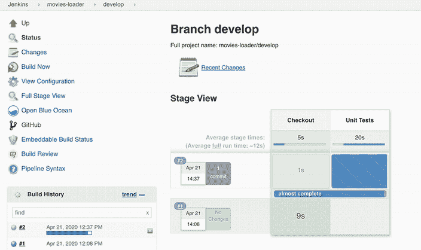

图 8.4 单元测试阶段执行

点击控制台输出选项以查看测试结果。所有三个测试用例都已运行，日志中的状态显示为 `SUCCESS`，如图 8.5 所示。

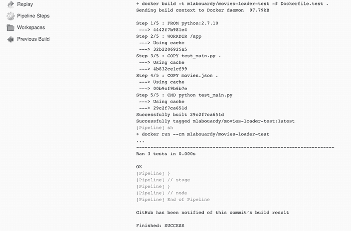

图 8.5 单元测试成功执行日志

可以用 Docker DSL 指令替换 shell 命令。我建议在适当的地方使用它们，而不是通过 shell 运行 Docker 命令，因为它们提供了高级封装和易于使用：

```
stage('Unit Tests'){
        def imageTest= docker.build("${imageName}-test",
 "-f Dockerfile.test .")
        imageTest.inside{
            sh 'python test_main.py'
        }
}
```

`docker.build()`方法类似于运行`docker build`命令。该方法返回的值可以用于后续调用以创建 Docker 容器并运行单元测试。图 8.6 显示了管道成功运行的示例。

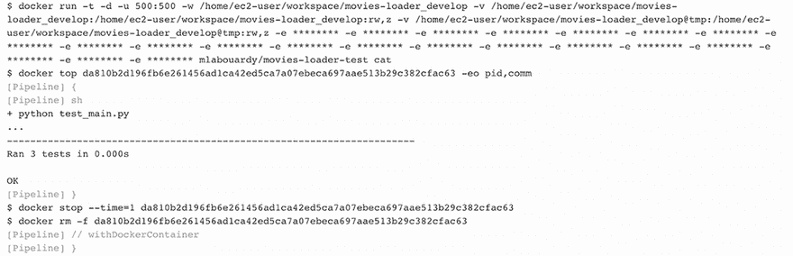

图 8.6 使用 Docker DSL 运行测试

为了以图形化、可视化的方式显示结果，我们可以在 Jenkins 上使用 JUnit 报告集成插件来消费由 Python 单元测试生成的 XML 文件。

注意：JUnit 报告集成插件([`plugins.jenkins.io/junit/`](https://plugins.jenkins.io/junit/))默认安装在预制的 Jenkins 主机机器镜像中。

更新 test_main.py 文件以使用 xmlrunner 库，并将其传递给 unittest.main 方法：

```
import xmlrunner
...
if __name__ == '__main__':
    runner = xmlrunner.XMLTestRunner(output='reports')
    unittest.main(testRunner=runner)
```

这将在“reports”目录中生成测试报告。然而，我们需要解决一个问题：测试容器将存储它自身执行的测试结果。我们可以通过将一个卷映射到“reports”目录来解决这个问题。更新 Jenkinsfile 以告诉 Jenkins 在哪里找到 JUnit 测试报告：

```
stage('Unit Tests'){
        def imageTest= docker.build("${imageName}-test",
 "-f Dockerfile.test .")
        sh "docker run --rm -v $PWD/reports:/app/reports ${imageName}-test"
        junit "$PWD/reports/*.xml"
}
```

注意：您也可以通过使用`docker cp`命令将报告文件复制到当前工作区来获取报告结果。然后，将工作区作为 JUnit 命令的参数设置。

让我们继续执行这个操作。这将添加一个图表到 Jenkins 的项目页面，在更改推送到 develop 分支并且 CI 执行完成后；参见图 8.7。

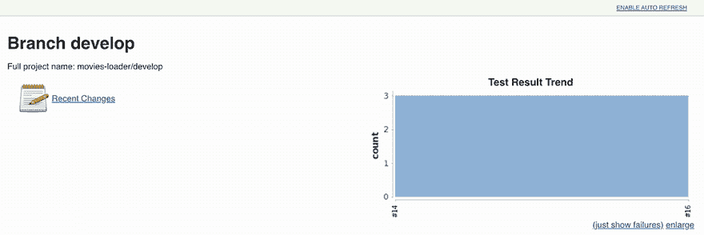

图 8.7 JUnit 测试图表分析器

历史图表显示了在一段时间内与测试执行相关的几个指标（包括失败、总数和持续时间）。您还可以点击图表以获取有关单个测试的更多详细信息。

## 8.2 使用 Jenkins 自动化代码检查器集成

CI 管道中要实现的测试示例之一是*代码检查*。检查器可以用来检查源代码，查找拼写错误、语法错误、未声明的变量以及对未定义或已弃用的函数的调用。它们可以帮助您编写更好的代码并预测潜在的 bug。让我们看看如何将代码检查器与 Jenkins 集成。

movies-parser 服务是用 Go 编写的，因此我们可以使用 Go 检查器来确保代码遵循代码风格。检查器可能听起来像是一个可选的工具，但对于大型项目来说，它有助于在整个项目中保持一致的样式。

Dockerfile.test 使用 golang:1.13.4 作为基础镜像，并安装了`golint`工具和服务依赖项，如下所示。

列表 8.4 Movie 解析器的 Dockerfile.test

```
FROM golang:1.13.4
WORKDIR /go/src/github.com/mlabouardy/movies-loader
ENV GOCACHE /tmp
WORKDIR /go/src/github/mlabouardy/movies-parser
RUN go get -u golang.org/x/lint/golint
COPY . .
RUN go get -v
```

将`Quality Tests`阶段添加到 Jenkinsfile 中，使用`docker.build()`命令基于 Dockerfile.test 构建 Docker 镜像，然后使用`inside()`指令在构建的镜像上以守护模式启动 Docker 容器来执行`golint`命令：

```
def imageName = 'mlabouardy/movies-parser'
node('workers'){
    stage('Checkout'){
        checkout scm
    }

    stage('Quality Tests'){
       def imageTest= docker.build("${imageName}-test", "-f Dockerfile.test .")
        imageTest.inside{
            sh 'golint'
        }
    }
}
```

注意：如果 Dockerfile.test 中定义了`ENTRYPOINT`指令，`inside()`指令将把其作用域内定义的命令作为参数传递给`ENTRYPOINT`指令。

`golint`执行将产生如图 8.8 所示的日志。

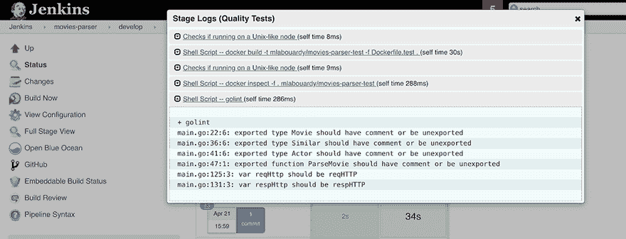

图 8.8 `golint`命令输出标识了缺失的注释。

默认情况下，`golint`仅打印样式问题，并返回（带有 0 退出代码），因此 CI 永远不会考虑出了问题。如果您指定`-set_exit_status`，如果`golint`报告问题，则流水线将失败。

我们还可以为 movies-parser 服务实现一个单元测试。Go 有一个内置的测试命令`go test`和包*testing*，它们结合提供了一个最小但完整的单元测试体验。

类似于 movies-loader 服务，我们将编写一个 Dockerfile.test 文件来执行在 main_test.go 文件中编写的测试。以下列表中的代码为了简洁和突出主要部分而进行了裁剪。您可以在第七章的`chapter7/microservices/movies-parser/main_test.go`中浏览完整代码。

列表 8.5 电影解析器的单元测试

```
package main

import (
    "testing"
)
const HTML = `
<div class="plot_summary ">
    <div class="summary_text">
        An ex-hit-man comes out of retirement to track down the gangster.
that killed his dog and took everything from him.
    </div>
    ...
</div>
`
func TestParseMovie(t *testing.T) {
    expectedMovie := Movie{
            Title:       "John Wick (2014)",
            ReleaseDate: "24 October 2014 (USA)",
            Description: "An ex-hit-man comes ...",
    }

    currentMovie, err := ParseMovie(HTML)
    if expectedMovie.Title != currentMovie.Title {
     t.Errorf("returned wrong title: got %v want %v"
, currentMovie.Title, expectedMovie.Title)
    }
}
```

此代码展示了 Go 中单元测试的基本结构。内置的测试包由 Go 的标准库提供。单元测试是一个接受类型为`*testing.T`的参数并调用`t.Error()`方法来指示失败的函数。此函数必须以`Test`关键字开头，并且后缀名应以大写字母开头。在我们的用例中，该函数测试`ParseMovie()`方法，该方法接受`HTML`参数并返回`Movie`结构。

## 8.3 生成代码覆盖率报告

`Unit Tests`阶段很简单：它将在从 Docker 测试镜像创建的 Docker 容器内执行`go test`。我们不是在每个阶段构建测试镜像，而是将`docker.build()`指令移出阶段以加快流水线执行时间，如下所示。

列表 8.6 电影解析器的 Jenkinsfile

```
def imageName = 'mlabouardy/movies-parser'
node('workers'){
    stage('Checkout'){
        checkout scm
   }

    def imageTest= docker.build("${imageName}-test", "-f Dockerfile.test .")
    stage('Quality Tests'){
        imageTest.inside{
            sh 'golint'
        }
    }
    stage('Unit Tests'){
        imageTest.inside{
            sh 'go test'
        }
    }
}
```

将更改推送到 develop 分支，并触发 Jenkinsfile 中定义的三个阶段执行，如图 8.9 所示。

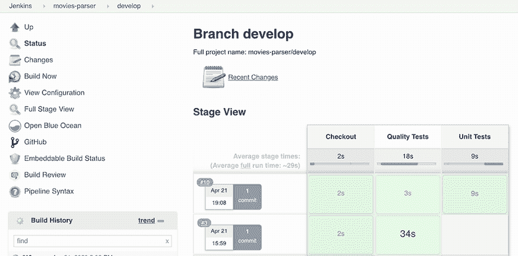

图 8.9 Go CI 流水线

`go test`命令的输出如图 8.10 所示。

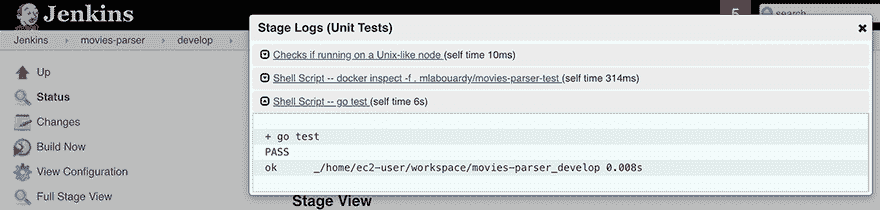

图 8.10 `go test`命令输出

注意：Go 提供了`-cover`标志作为`go test`命令的内置功能，用于检查代码覆盖率。

如果我们想以 HTML 格式获取覆盖率报告，需要添加以下命令：

```
go test -coverprofile=cover/cover.cov
go tool cover -html=cover/coverage.cov -o coverage.html

```


图 8.11 覆盖率.html 内容可以在测试阶段结束时从 Jenkins 仪表板提供。

命令会渲染一个 HTML 页面，如图 8.11 所示，该页面可视化地显示了 main.go 文件中每个受影响行的逐行覆盖率。

您可以将前面的命令包含在 CI 工作流程中，以生成 HTML 格式的覆盖率报告。

## 8.4 在 CI 管道中注入安全

确保不会将任何漏洞发布到生产环境中非常重要——至少不要发布关键或重大的漏洞。在 CI 管道中扫描项目依赖项可以确保这一额外的安全级别。存在几种依赖项扫描解决方案，包括商业和开源。在本部分，我们将使用 Nancy。

Nancy ([`github.com/sonatype-nexus-community/nancy`](https://github.com/sonatype-nexus-community/nancy)) 是一个开源工具，用于检查你的 Go 依赖项中的漏洞。它使用 Sonatype 的 OSS Index ([`ossindex.sonatype.org/`](https://ossindex.sonatype.org/))，这是公共漏洞和暴露（CVE）数据库的镜像，来检查你的依赖项是否存在公开报告的漏洞。

注意：第九章介绍了如何在 Jenkins 上使用 OWASP Dependency-Check 插件来检测对已分配 CVE 条目的依赖项的引用。

该过程的第一个步骤是从官方发布页面安装 Nancy 二进制文件。更新 movies-parser 项目的 Dockerfile.test，以安装 Nancy 版本 1.0.22（本书编写时），并在`PATH`变量上配置可执行文件，如下所示。

列表 8.7 Movie parser 的 Dockerfile.test

```
FROM golang:1.13.4
ENV VERSION 1.0.22
ENV GOCACHE /tmp
WORKDIR /go/src/github/mlabouardy/movies-parser
RUN wget https://github.com/sonatype-nexus-community/nancy/releases/download/$VERSION/nancy

linux.amd64-$VERSION -O nancy && \
    chmod +x nancy && mv nancy /usr/local/bin/nancy
RUN go get -u golang.org/x/lint/golint
COPY . .
RUN go get -v
```

要开始使用此工具，请在 Jenkinsfile 中添加一个`Security Tests`阶段，以使用 Gopkg.lock 文件作为参数运行 Nancy，该文件包含 movies-parser 服务中使用的 Go 依赖项列表：

```
stage('Security Tests'){
        imageTest.inside(‘-u root:root’){
           sh 'nancy /go/src/github/mlabouardy/movies-parser/Gopkg.lock'
        }
}
```

将更改推送到远程仓库。将启动一个新的管道。在`Security` `Tests`阶段，将执行 Nancy，并且不会报告任何依赖项安全漏洞，如图 8.12 所示。

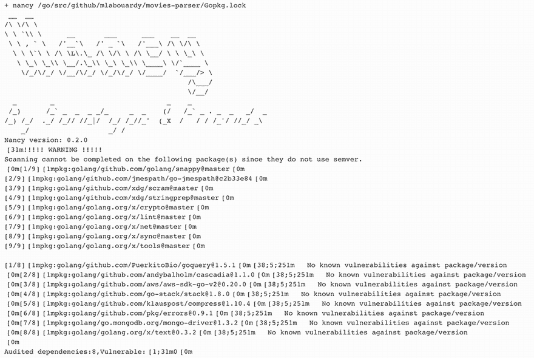

图 8.12 已知漏洞的依赖项扫描

如果 Nancy 在您的依赖项中找到一个漏洞，它将以非零代码退出，这样您就可以将 Nancy 作为 CI/CD 流程中的工具使用，并使构建失败。

尽管你应该努力解决所有安全漏洞，但某些安全扫描结果可能包含误报。例如，如果你在不太可能适用于你项目的隐蔽条件下看到一个理论上的拒绝服务攻击，那么可能安全地安排在未来一周或两周内修复。另一方面，一个更严重的漏洞可能会允许未经授权访问客户信用卡数据，应该立即修复。无论情况如何，都要掌握漏洞知识，这样你和你的团队就可以确定适当的行动方案来减轻安全威胁。

将依赖项扫描添加到你的管道（图 8.13）是减少你的攻击面的简单第一步。这很容易实现，因为它不需要服务器重新配置或额外的服务器来工作。在其最基本的形式中，只需安装 Nancy 二进制文件并将其部署。

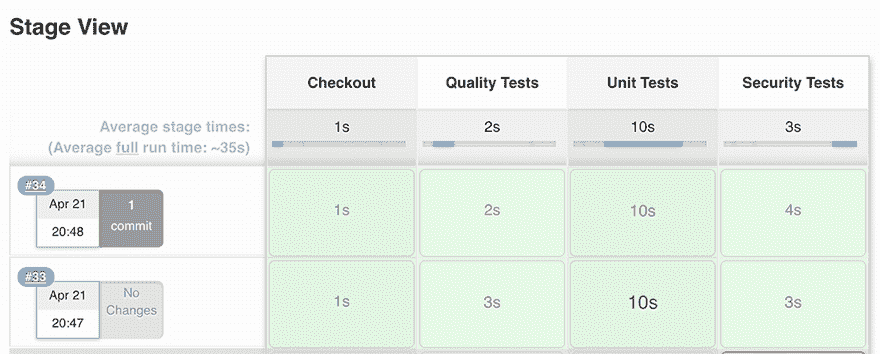

图 8.13 CI 管道中的安全注入

## 8.5 使用 Jenkins 运行并行测试

到目前为止，预集成测试是顺序运行的。我们总是遇到的一个问题是如何在保持管道时间合理和更改流畅的同时运行所有确保高质量更改所需的测试。更多的测试意味着更大的信心，但也意味着更长的等待时间。

注意：在第九章中，我们将介绍如何使用并行测试执行插件在多个 Jenkins 工作者之间并行运行测试。

你经常看到的 Jenkins 管道的一个特性是它能够通过使用 `parallel` DSL 步骤并行运行构建的部分。

更新 Jenkinsfile 以使用 `parallel` 关键字，如下所示列表。`parallel` 部分包含一个要并行运行的嵌套测试阶段列表。此外，你可以通过添加 `failFast true` 指令来强制所有并行阶段在任何一个失败时全部中止。

列表 8.8 并行运行测试

```
node('workers'){
    stage('Checkout'){
        checkout scm
    }

    def imageTest= docker.build("${imageName}-test", "-f Dockerfile.test .")
    stage('Pre-integration Tests'){
            parallel(
                'Quality Tests': {
                    imageTest.inside{
                        sh 'golint'
                    }
                },
                'Unit Tests': {
                    imageTest.inside{
                        sh 'go test'
                    }
                },
                'Security Tests': {
                    imageTest.inside('-u root:root'){
                        sh 'nancy Gopkg.lock'
                    }
                }
            )
    }
}
```

如果你将这些更改推送到远程仓库，将触发一个新的构建（图 8.14）。然而，标准管道视图的一个缺点是你无法轻易地看到并行步骤的进度，因为管道是线性的，就像管道一样。Jenkins 通过提供另一种视图：Blue Ocean 来解决这个问题。

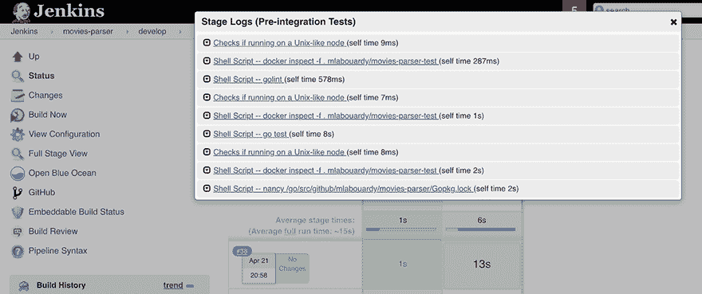

图 8.14 预集成测试的并行执行

图 8.15 显示了相同管道的结果，其中在 Blue Ocean 模式下执行并行测试。

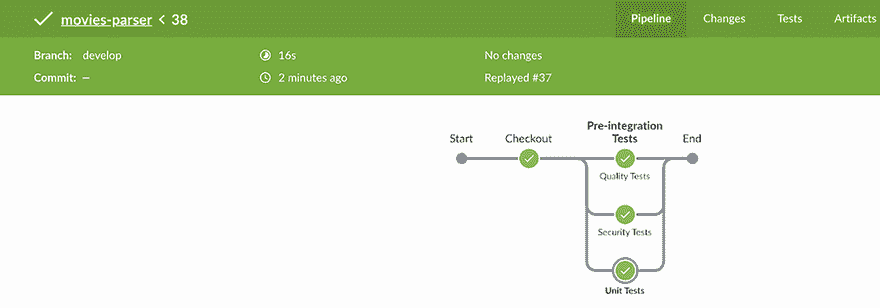

图 8.15 Blue Ocean 中的并行阶段

这看起来很棒，为并行管道阶段提供了很好的可视化。

## 8.6 通过代码分析提高质量

除了持续集成代码之外，现在的 CI 管道还包括执行持续检查的任务——以持续的方式检查代码的质量。

电影商店应用程序是用 TypeScript 编写的。我们将使用 Dockerfile.test 来构建 Docker 镜像以运行自动化测试，如下所示列表。

列表 8.9 电影商店的 Dockerfile.test

```
FROM node:14.0.0
WORKDIR /app
COPY package-lock.json .
COPY package.json .
RUN npm i
COPY . .
```

第一类测试将是源代码的代码检查。正如你在这章前面看到的，代码检查是检查源代码中程序性、语法和风格错误的流程。代码检查使整个服务保持统一格式。代码检查可以通过编写一些规则来实现。有许多代码检查工具可用，包括 JSLint、JSHint 和 ESLint。

当涉及到 TypeScript 代码的代码检查时，ESLint ([`eslint.org/`](https://eslint.org/)) 比其他工具具有更高的性能架构。因此，我正在使用 ESLint 对 Node.js 项目进行代码检查，如下所示列表。

列表 8.10 电影存储的 Jenkinsfile

```
def imageName = 'mlabouardy/movies-store'

node('workers'){
    stage('Checkout'){
        checkout scm
   }

    def imageTest= docker.build("${imageName}-test", "-f Dockerfile.test .")

    stage('Quality Tests'){
        imageTest.inside{
            sh ‘npm run lint'
         }
    }
}
```

将此内容复制到 movies-store Jenkinsfile，并将更改推送到 develop 分支。应该触发一个新的构建。在`质量` `测试`阶段，我们将看到有关未定义关键字（如图 8.16 所示）的错误，例如`describe`和`before`，它们是 Mocha ([`mochajs.org/`](https://mochajs.org/)) 和 Chai ([www.chaijs.com](http://www.chaijs.com)) JavaScript 框架的一部分。这些框架用于高效且方便地描述单元测试（位于 test 文件夹下）。

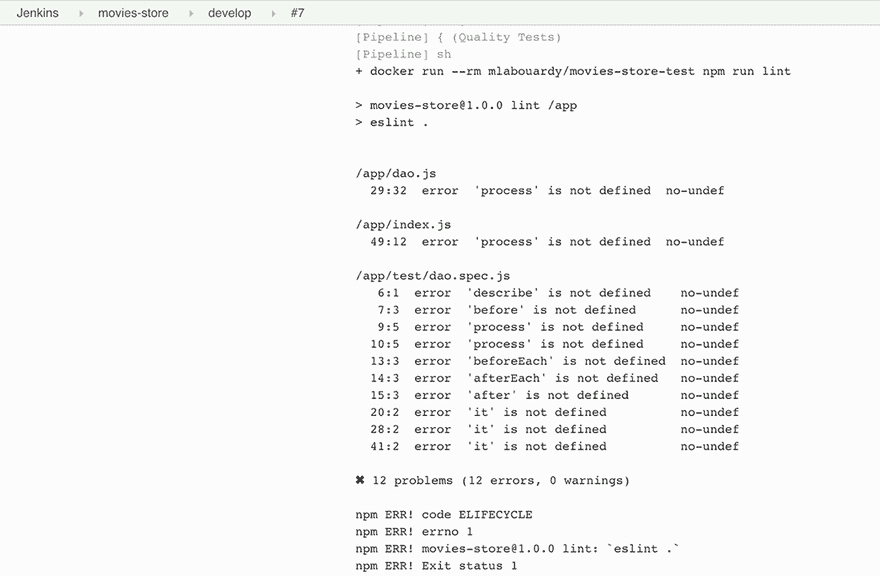

图 8.16 ESLint 问题检测

ESLint 将返回退出码 1 的错误，这将中断管道。为了修复发现的问题，通过启用 Mocha 环境来扩展 ESLint 规则。我们使用 eslintrc.json 中的`key`属性来指定我们想要启用的环境，将`mocha`设置为`true`：

```
{
    "env": {
        "node": true,
        "commonjs": true,
        "es6": true,
        "mocha": true
    },

}
```

如果你这次推送更改，静态代码分析的结果将会成功，如图 8.17 所示。

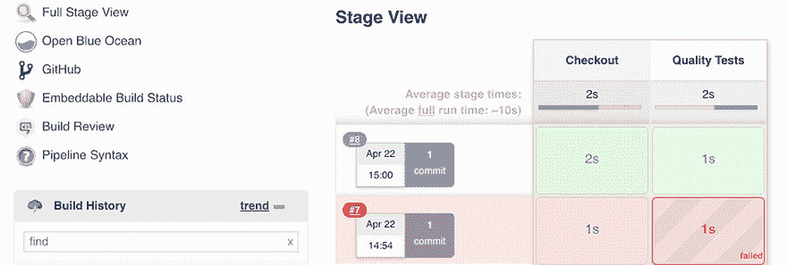

图 8.17 修复 ESLint 错误后的 CI 管道执行

## 8.7 运行模拟数据库测试

当许多开发者专注于单元测试的 100%覆盖率时，你编写的代码不能仅仅在隔离状态下进行测试。集成和端到端测试通过一起测试应用程序的各个部分，为你提供了额外的信心。这些部分可能各自运行良好，但在一个大型系统中，代码单元很少单独工作。

通常，对于集成或端到端测试，你的脚本将需要连接到用于测试目的的真实、专用数据库。这涉及到编写在每次测试用例/套件开始和结束时运行的代码，以确保数据库处于干净、可预测的状态。

使用真实数据库进行测试确实存在一些挑战：数据库操作可能相对较慢，测试环境可能很复杂，运营开销可能会增加。Java 项目广泛使用 DbUnit 与内存数据库（例如，H2，[www.h2database.com/html/main.html](http://www.h2database.com/html/main.html)）进行此目的。从另一个平台重用良好的解决方案并将其应用于 Node.js 世界可能是这里的方法。

Mongo-unit ([www.npmjs.com/package/mongo-unit](http://www.npmjs.com/package/mongo-unit)) 是一个 Node.js 包，可以通过使用 Node 包管理器（npm）或 Yarn 进行安装。它可以在内存中运行 MongoDB。通过与 Mocha 框架的良好集成并提供一个简单的 API 来管理数据库状态，它使得集成测试变得容易。

注意：在第九章和第十章中，我们将在 Jenkins 管道中运行侧车容器，例如 MongoDB 数据库，以运行端到端测试。

下面的列表是一个简单的测试 (/chapter7/microservices/movies-store/test/dao.spec.js)，使用 Mocha 和 Chai 编写，并使用 mongo-unit 包通过运行内存数据库来模拟 MongoDB。

列表 8.11 Mocha 和 Chai 单元测试

```
const Expect = require('chai').expect
const MongoUnit = require('mongo-unit')
const DAO = require('../dao')
const TestData = require('./movies.json')

describe('StoreDAO', () => {
  before(() =>  MongoUnit.start().then(() => {
    process.env.MONGO_URI = MongoUnit.getUrl()
    DAO.init(.
  }))
  beforeEach(() => MongoUnit.load(TestData))
  afterEach(() => MongoUnit.drop())
  after(() => {
    DAO.close()
    return MongoUnit.stop()
  })
 it('should find all movies', () => {
   return DAO.Movie.find()
    .then(movies => {
      Expect(movies.length).to.equal(8)
      Expect(movies[0].title).to.equal('Pulp Fiction (1994)')
    })
 })
})
```

接下来，我们更新 Jenkinsfile 以添加一个新的阶段，该阶段执行 `npm run test` 命令：

```
stage('Integration Tests'){
        sh "docker run --rm ${imageName}-test npm run test"
}
```

`npm run test` 命令是一个别名；它运行 Mocha 命令行对测试文件夹中的测试用例进行操作（图 8.18）。该命令在 package.json 中定义，如下所示。

列表 8.12 电影商店的 package.json

```
"scripts": {
    "start": "node index.js",
    "test": "mocha ./test/*.spec.js",
    "lint": "eslint .",
    "coverage-text": "nyc --reporter=text mocha",
    "coverage-html": "nyc --reporter=html mocha"
}
```

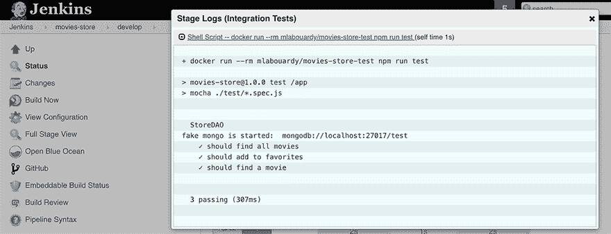

图 8.18 使用 Mocha 框架进行单元测试

注意 如果您的测试依赖于其他服务，可以使用 Docker Compose 来简化所有依赖服务的启动和连接。

## 8.8 生成 HTML 覆盖率报告

我们创建一个新的阶段来运行覆盖率工具，并使用文本输出格式：

```
stage('Coverage Reports'){
        sh "docker run --rm ${imageName}-test npm run coverage-text"
}
```

这将输出文本报告到控制台输出，如图 8.19 所示。

注意 Istanbul 是一个 JavaScript 代码覆盖率工具。更多信息，请参阅官方指南 [`istanbul.js.org`](https://istanbul.js.org)。

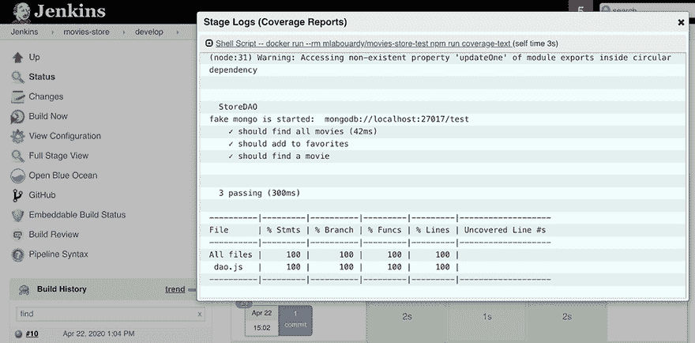

图 8.19 Istanbul 文本格式覆盖率报告

您在覆盖率报告中可能看到的指标可以定义为表 8.1 所示。

表 8.1 覆盖率报告指标

| 指标 | 描述 |
| --- | --- |
| 语句 | 程序中实际调用的语句数量，占总语句数量的比例 |
| 分支 | 执行的控制结构分支数量 |
| 函数 | 调用的函数数量，占总定义函数数量的比例 |
| 行数 | 被测试的源代码行数，占总代码行数的比例 |

默认情况下，Istanbul 使用文本报告器，但还有各种其他报告器可用。您可以在 [`mng.bz/DKoE`](http://mng.bz/DKoE) 查看完整列表。

要生成 HTML 格式，我们将一个卷映射到 /app/coverage，这是 Istanbul 生成报告的文件夹。然后，我们将使用 Jenkins HTML 发布插件来显示生成的代码覆盖率报告，如下所示。

列表 8.13 发布代码覆盖率 HTML 报告

```
stage('Coverage Reports'){
        sh "docker run --r.
-v $PWD/coverage:/app/coverage ${imageName}-tes.
npm run coverage-html"
        publishHTML (target: [
          allowMissing: false,
          alwaysLinkToLastBuild: false,
          keepAll: true,
          reportDir: "$PWD/coverage",
          reportFiles: "index.html",
          reportName: "Coverage Report"
        ])
}
```

`publishHTML` 命令将 `target` 块作为主要参数。在此参数内，我们有几个子参数。`allowMissing` 参数设置为 `false`，因此如果在生成覆盖率报告时出现问题且报告缺失，`publishHTML` 指令将引发错误。

在 CI 管道结束时，将生成一个 HTML 文件，并由 HTML 发布插件使用，如图 8.20 所示。


图 8.20 使用 Istanbul 生成 HTML 报告

通过点击左侧面板的覆盖率报告项，可以从 Jenkins 访问 HTML 报告；见图 8.21。

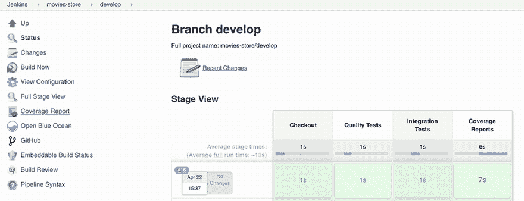

图 8.21 覆盖率报告可以从 Jenkins 面板访问。

注意：Cobertura 插件（[`plugins.jenkins.io/cobertura/`](https://plugins.jenkins.io/cobertura/））也可以用来发布 HTML 报告。这两个插件显示相同的结果。

我们可以深入挖掘以识别未覆盖的行和函数，如图 8.22 所示。

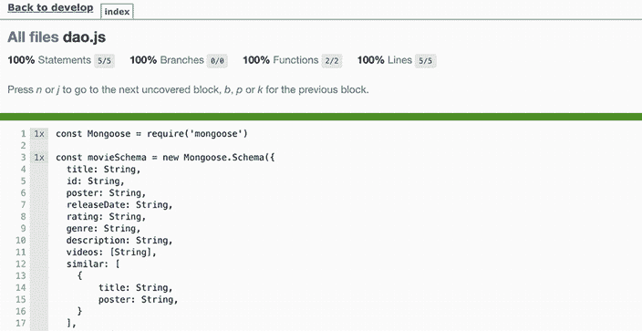

图 8.22 深入覆盖率报告

注意：根据你使用的语言，存在多种创建覆盖率报告的工具（例如，SimpleCov 用于 Ruby，Coverage.py 用于 Python，JaCoCo 用于 Java）。

你可以将这一过程进一步扩展，并行运行阶段以减少测试运行的等待时间，如下面的列表所示。

列表 8.14 并行运行预集成测试

```
stage('Tests'){
        parallel(
            'Quality Tests': {
                sh "docker run --rm ${imageName}-test npm run lint"
            },
            'Integration Tests': {
                sh "docker run --rm ${imageName}-test npm run test"
            },
            'Coverage Reports': {
                sh "docker run --r.
-v $PWD/coverage:/app/coverage ${imageName}-tes.
npm run coverage-html"
                publishHTML (target: [
                    allowMissing: false,
                    alwaysLinkToLastBuild: false,
                    keepAll: true,
                    reportDir: "$PWD/coverage",
                    reportFiles: "index.html",
                    reportName: "Coverage Report"
                ])
            }
        )
}
```

图 8.23 显示了在 Blue Ocean 视图中运行此作业的最终结果。

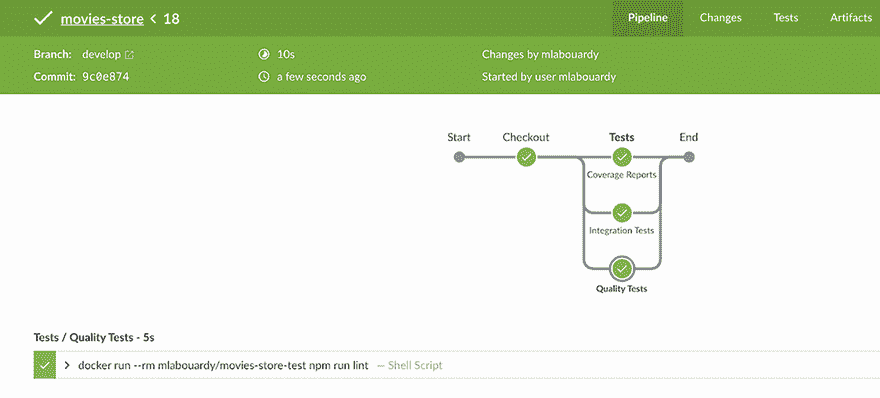

图 8.23 并行运行测试

## 8.9 使用无头 Chrome 自动化 UI 测试

对于 Angular 应用程序，我们将创建一个 Dockerfile.test 文件，该文件安装 Angular CLI（[`angular.io/cli`](https://angular.io/cli)）和运行自动化测试所需的依赖项；请参见以下列表。

列表 8.15 电影市场 Dockerfile.test 文件

```
FROM node:14.0.0
ENV CHROME_BIN=chromium
WORKDIR /app
COPY package-lock.json .
COPY package.json .
RUN npm i && npm i -g @angular/cli
COPY . .
```

代码检查状态与上一部分类似；我们将使用默认安装的 TSLint 代码检查器。因此，我们将运行 package.json 中定义的`npm run lint`别名命令，如下面的列表所示。

列表 8.16 电影市场 package.json

```
"scripts": {
    "start": "ng serve",
    "build": "ng build",
    "test": "ng test --browsers=ChromeHeadlessCI --code-coverage=true",
    "lint": "ng lint",
    "e2e": "ng e2e"
  }
```

我们使用以下内容更新 Jenkinsfile。

列表 8.17 电影市场 Jenkinsfile

```
def imageName = 'mlabouardy/movies-marketplace'
node('workers'){
    stage('Checkout'){
        checkout scm
    }

    def imageTest= docker.build("${imageName}-test", "-f Dockerfile.test .")
    stage('Pre-integration Tests'){
        parallel(
            'Quality Tests': {
                sh "docker run --rm ${imageName}-test npm run lint"
            }
        )
    }
}
```

让我们保存这个配置并运行构建。由于 TSLint 上的强制规则，管道应该失败并变成红色，如图 8.24 所示。


图 8.24 CI 管道失败。

如果你点击质量测试阶段的日志，日志应该显示有关缺少分号和尾随空白的错误，如图 8.25 所示。

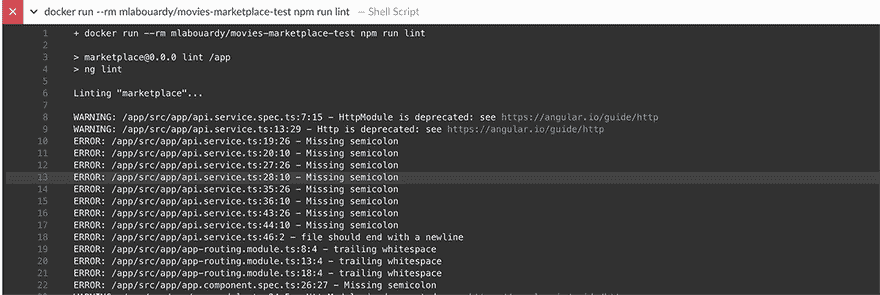

图 8.25 Angular 代码检查输出日志。

如果你希望让 TSLint 在你的代码中通过（图 8.26），你需要更新 tslint.json 以禁用强制规则或在每个文件的开始处添加`/* tslint:disable */`指令，以便 TSLint 跳过这些文件的代码检查过程。

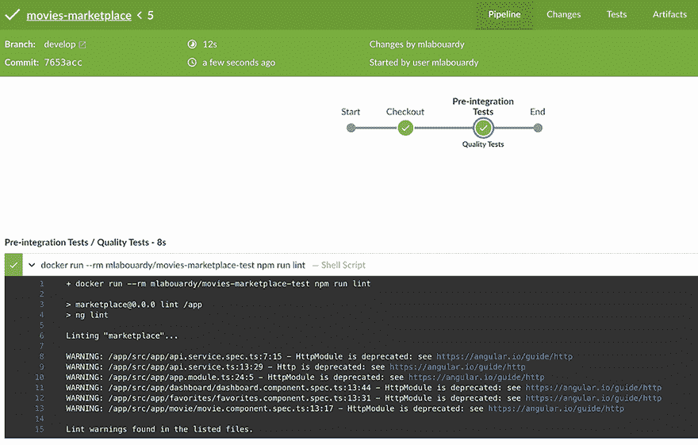

图 8.26 Angular 代码检查输出日志。

对于 Angular 单元测试，我们将使用 Jasmine ([`jasmine.github.io/`](https://jasmine.github.io/)) 和 Karma ([`karma-runner.github.io/latest/index.html`](https://karma-runner.github.io/latest/index.html)) 框架。这两个测试框架都支持 BDD 实践，它以人类可读的格式描述测试，便于非技术人员理解。以下列表中的示例单元测试（chapter7/microservices/movies-marketplace/src/app/app.component.spec.ts）是自我解释的。它测试了应用组件是否有一个值为 `Watchlist` 的 `text` 属性，该属性在 `span` 元素标签内的 HTML 中渲染。

列表 8.18 电影市场 Karma 测试

```
import { TestBed, async } from '@angular/core/testing';
import { RouterTestingModule } from '@angular/router/testing';
import { AppComponent } from './app.component';

describe('AppComponent', () => {
  beforeEach(async(() => {
    TestBed.configureTestingModule({
      imports: [
        RouterTestingModule
      ],
      declarations: [
        AppComponent
      ],
    }).compileComponents();
  }));
  it('should create the app', () => {
    const fixture = TestBed.createComponent(AppComponent);
    const app = fixture.debugElement.componentInstance;
    expect(app).toBeTruthy();
  });
  it('should render title', () => {
    const fixture = TestBed.createComponent(AppComponent);
    fixture.detectChanges();
    const compiled = fixture.debugElement.nativeElement;
    expect(compiled.querySelector('.toolbar span').textContent).toContain('Watchlist');
  });
});
```

注意：当使用 Angular CLI 创建 Angular 项目时，默认使用 Jasmine 和 Karma 创建和运行单元测试。

运行前端 Web 应用的单元测试需要它们在 Web 浏览器中进行测试。虽然在工作站或主机机器上这不是问题，但在受限环境中（如 Docker 容器）运行时可能会变得繁琐。实际上，这些执行环境通常是轻量级的，并且不包含任何图形环境。

幸运的是，Karma 测试可以使用无界面浏览器运行，主要有两种选项：Chrome Headless 或 PhantomJS。以下列表中的示例使用 Chrome Headless 和 Puppeteer，这可以在 Karma 配置中的简单标志上进行配置（chapter7/microservices/movies-marketplace/karma.conf.js）。

列表 8.19 Karma 运行器配置

```
module.exports = function (config) {
  config.set({
    basePath: '',
    frameworks: ['jasmine', '@angular-devkit/build-angular'],
    customLaunchers: {
      ChromeHeadlessCI: {
        base: 'Chrome',
        flags: [
          '--headless',
          '--disable-gpu',
          '--no-sandbox',
          '--remote-debugging-port=9222'
        ]
      }
    },
    browsers: ['ChromeHeadless', 'Chrome'],
    singleRun: true,  });
};
```

Headless Chrome 需要 sudo 权限才能运行，除非使用 `--no-sandbox` 标志。接下来，我们需要更新 Dockerfile.test 以安装 Chromium：

```
RUN apt-get update && apt-get install -y chromium
```

注意：Chromium/Google Chrome 自 59 版本起已包含无头模式。

然后，我们更新 Jenkinsfile 以使用 `npm run test` 命令运行单元测试。该命令将启动 Headless Chrome 并执行 Karma.js 测试。接下来，我们将生成一个 HTML 格式的覆盖率报告，该报告将由 HTML 发布器插件使用，如下所示。

列表 8.20 将工作区文件夹映射到 Docker 容器卷。

```
stage('Pre-integration Tests'){
       parallel(
            'Quality Tests': {
                sh "docker run --rm ${imageName}-test npm run lint"
            },
            'Unit Tests': {
                sh "docker run --r.
-v $PWD/coverage:/app/coverage ${imageName}-tes.
npm run test"
                publishHTML (target: [
                    allowMissing: false,
                    alwaysLinkToLastBuild: false,
                    keepAll: true,
                   reportDir: "$PWD/coverage",
                    reportFiles: "index.html",
                    reportName: "Coverage Report"
                ])}
        )
}
```

一旦将更改推送到 GitHub 仓库，将触发新的构建，并执行单元测试，如图 8.27 所示。


图 8.27 在 Docker 容器内运行无头 Chrome

Karma 启动器将在 Headless Chrome 浏览器上运行测试，并显示代码覆盖率统计信息，如图 8.28 所示。

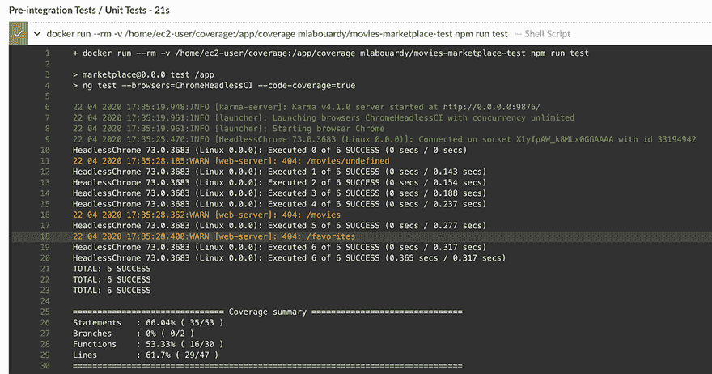

图 8.28 Karma 单元测试成功执行

此外，生成的 HTML 报告将在 Blue Ocean 视图中的“工件”部分可用，如图 8.29 所示。

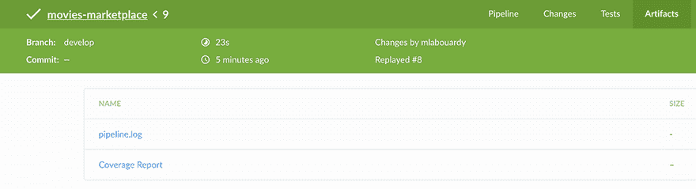

图 8.29 覆盖率报告与其他工件并列

如果您点击覆盖率报告链接，它应显示 Angular 组件和服务通过语句和函数的覆盖率，如图 8.30 所示。

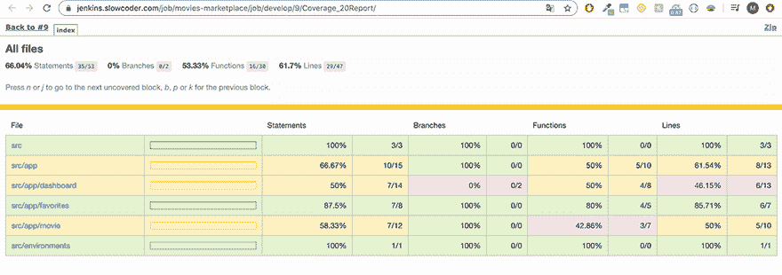

图 8.30 按文件名统计的覆盖率统计

完成此操作后，现在可以在 Docker 容器内使用 Chromium 运行单元测试。

## 8.10 将 SonarQube Scanner 与 Jenkins 集成

虽然代码检查器可以给你一个关于代码质量的总体概述，但如果你想要执行深入的静态代码分析和检查以检测潜在的错误和漏洞，它们仍然有限。这就是 SonarQube 发挥作用的地方。它将通过集成外部库如 PMD、Checkstyle 和 FindBugs，为你提供一个代码库质量的 360 度视角。每次代码提交时，都会执行代码分析。

注意：SonarQube 可以用于检查超过 20 种编程语言的代码，包括 Java、PHP、Go 和 Python。

要部署 SonarQube，我们将使用 Packer 烘焙一个新的 AMI。类似于前面的章节，我们创建一个 template.json 文件，其内容如下（chapter8/sonarqube/packer/template.json）。

列表 8.21 Jenkins 工作节点的 Packer 模板。

```
{
    "variables" : {...},
   "builders" : [
        {
            "type" : "amazon-ebs",
            "profile" : "{{user `aws_profile`}}",
            "region" : "{{user `region`}}",
            "instance_type" : "{{user `instance_type`}}",
            "source_ami" : "{{user `source_ami`}}",
            "ssh_username" : "ubuntu",
            "ami_name" : "sonarqube-8.2.0.32929",
            "ami_description" : "SonarQube community edition"
        }
    ],
    "provisioners" : [
        {
            "type" : "file",
            "source" : "sonar.init.d",
            "destination" : "/tmp/"
        },
        {
            "type" : "shell",
            "script" : "./setup.sh",
            "execute_command" : "sudo -E -S sh '{{ .Path }}'"
        }
    ]
}
```

暂时性 EC2 实例将基于 Amazon Linux AMI，并使用 shell 脚本来配置实例以安装 SonarQube 和配置所需的依赖项。

setup.sh 脚本将从官方发布页面安装 SonarQube。在此示例中，将安装 SonarQube 8.2.0。SonarQube 支持 PostgreSQL、MySQL、Microsoft SQL Server (MSSQL) 和 Oracle 作为后端。我选择使用 PostgreSQL 来存储配置和报告结果。然后，脚本创建一个名为 sonar 的目录，设置权限，并配置 SonarQube 以自动启动；请参见以下列表。

列表 8.22 安装 SonarQube LT。

```
wget https://binaries.sonarsource.com/
Distribution/sonarqube/$SONAR_VERSION.zip -P /tmp
unzip /tmp/$SONAR_VERSION.zip
mv $SONAR_VERSION sonarqube
mv sonarqube /opt/

apt-get install -y unzip curl
sh -c 'echo "deb http://apt.postgresql.org/pub/repos/apt/
 `lsb_release -cs`-pgdg main" >> /etc/apt/sources.list.d/pgdg.list'
wget -q https://www.postgresql.org/media/keys/ACCC4CF8.as.
-O - | sudo apt-key add -
apt-get install -y postgresql postgresql-contrib
systemctl start postgresql
systemctl enable postgresql
cat > /tmp/db.sql <<EOF
CREATE USER $SONAR_DB_USER WITH ENCRYPTED PASSWORD '$SONAR_DB_PASS';
CREATE DATABASE $SONAR_DB_NAME OWNER $SONAR_DB_USER;
EOF
sudo -u postgres psql postgres < /tmp/db.sql

mv /tmp/sonar.properties /opt/sonarqube/conf/sonar.properties
sed -i 's/#RUN_AS_USER=/RUN_AS_USER=sonar/' sonar.sh
sysctl -w vm.max_map_count=262144
groupadd sonar
useradd -c "Sonar System User" -d /opt/sonarqube -g sonar -s /bin/bash sonar
chown -R sonar:sonar /opt/sonarqube
ln -sf /opt/sonarqube/bin/linux-x86-64/sonar.sh /usr/bin/sonar
cp /tmp/sonar.init.d /etc/init.d/sonar
chmod 755 /etc/init.d/sonar
update-rc.d sonar defaults
service sonar start
```

注意：完整的 shell 脚本可在 GitHub 仓库中找到，附带逐步指南。同时，请确保您至少有 4 GB 的内存来运行 SonarQube 的 64 位版本。

一旦定义了所需的 Packer 变量，执行 packer build 命令以启动配置过程。一旦 AMI 被烘焙，它应该可以在图 8.31 所示的 EC2 仪表板中的镜像部分找到。

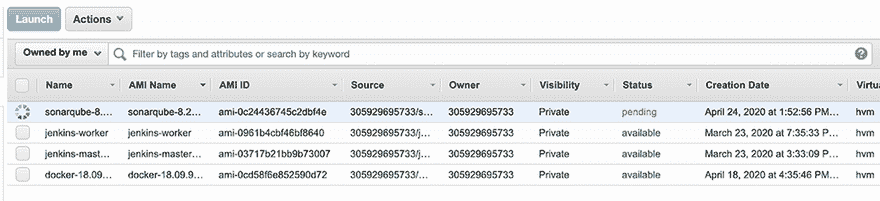

图 8.31 SonarQube 机器镜像

从那里，使用 Terraform 部署基于 SonarQube AMI 的私有 EC2 实例，如下所示。

列表 8.23 使用 Terraform 的 SonarQube EC2 实例资源

```
resource "aws_instance" "sonarqube" {
  ami                    = data.aws_ami.sonarqube.id
  instance_type          = var.sonarqube_instance_type
  key_name               = var.key_name
  vpc_security_group_ids = [aws_security_group.sonarqube_sg.id]
  subnet_id              = element(var.private_subnets, 0)

  root_block_device {
    volume_type           = "gp2"
    volume_size           = 30
    delete_on_termination = false
  }

  tags = {
    Name   = "sonarqube"
    Author = var.author
  }
}
```

然后，定义一个公共负载均衡器，将传入的 HTTP 和 HTTPS（可选）流量转发到端口 9000（SonarQube 仪表板暴露的端口）上的实例。同时，在 Route 53 中创建一个指向负载均衡器 FQDN 的 A 记录。

执行 `terraform apply` 命令以配置实例和其他资源。实例应在几秒钟内部署完成，如图 8.32 所示。

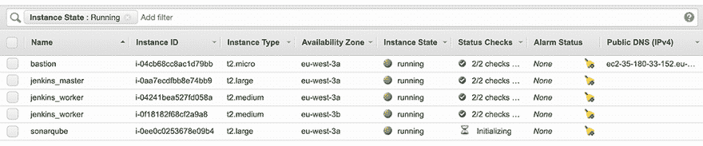

图 8.32 SonarQube 私有 EC2 实例

在终端上，你应该在输出部分看到公共负载均衡器的 URL，如图 8.33 所示。

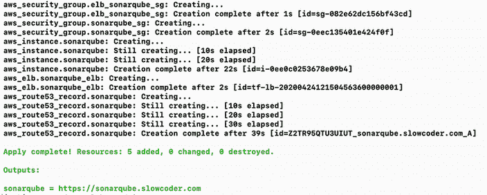

图 8.33 SonarQube DNS URL

转到 URL 并使用默认凭证（图 8.34）登录。目前，SonarQube 中没有配置用户帐户。然而，默认情况下，存在一个名为`admin`的管理员帐户，密码为`admin`。

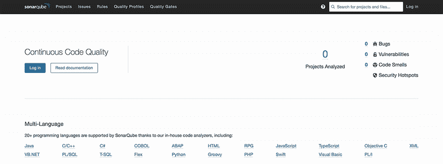

图 8.34 SonarQube 网络仪表板

接下来，确保从 SonarQube 插件部分启用 TypeScript 分析器，如图 8.35 所示。

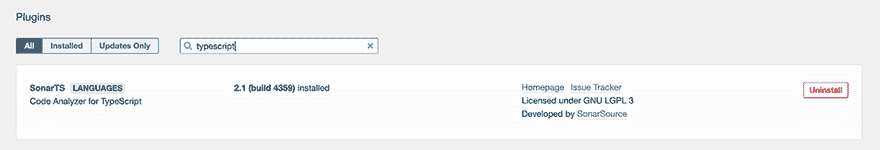

图 8.35 SonarQube TypeScript 分析插件

然后，为 Jenkins 生成一个新的令牌，以避免出于安全目的使用 SonarQube 管理员凭证。转到管理界面并导航到安全。在同一个页面下的令牌部分有一个生成令牌的选项；点击图 8.36 所示的生成按钮。

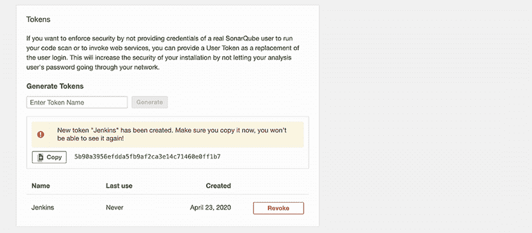

图 8.36 SonarQube Jenkins 专用令牌

服务器身份验证令牌应从 Jenkins 创建为`Secret text`凭证，如图 8.37 所示。

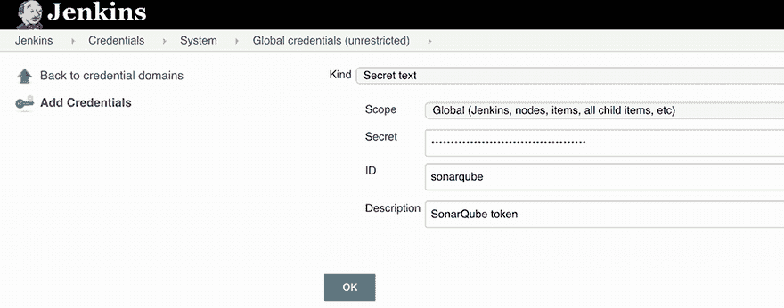

图 8.37 SonarQube 秘密文本凭证

要从 CI 管道触发扫描，我们需要安装 SonarQube Scanner。您可以选择自动安装或为 Jenkins 工作节点提供此工具的安装路径。可以通过选择管理 Jenkins > 全局工具配置来安装它。或者，您可以使用以下列表中的命令创建一个新的 Jenkins 工作节点镜像，其中包含 SonarQube Scanner。

列表 8.24 SonarQube Scanner 安装

```
wget https://binaries.sonarsource.com/
Distribution/sonar-scanner-cli/sonar-scanner-cli-2.0.1873-linux.zip -P /tmp
unzip /tmp/sonar-scanner-cli-4.2.0.1873-linux.zip
mv sonar-scanner-4.2.0.1873-linux sonar-scanner
ln -sf /home/ec2-user/sonar-scanner/bin/sonar-scanner /usr/bin/sonar-scanner
```

注意：Jenkins 工作节点的启动配置是不可变的。您需要克隆启动配置，使用新构建的 AMI 更新它，并将其附加到 Jenkins 工作节点的自动扩展组，以创建带有 Sonar Scanner 工具的新工作节点。

最后，从 Manage Jenkins 中的配置菜单使 Jenkins 了解 SonarQube 服务器的安装情况，如图 8.38 所示。

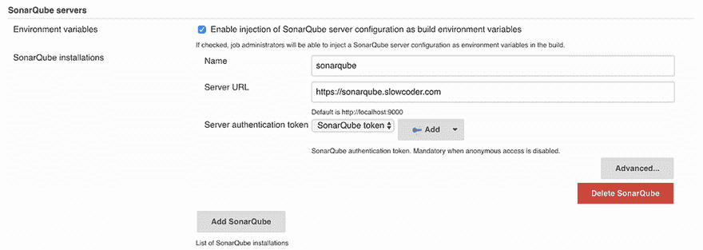

图 8.38 SonarQube 服务器设置

然后，在 movies-marketplace 根目录下创建一个 sonar-project.properties 文件，以便将覆盖率报告发布到 SonarQube 服务器。此文件包含某些 sonar 属性，例如要扫描和排除的文件夹以及项目的名称；请参阅以下列表。

列表 8.25 SonarQube 项目配置

```
sonar.projectKey=angular:movies-marketplace
sonar.projectName=movies-marketplace
sonar.projectVersion=1.0.0
sonar.sourceEncoding=UTF-8
sonar.sources=src
sonar.exclusions=**/node_modules/**,**/*.spec.ts
sonar.tests=src/app
sonar.test.inclusions=**/*.spec.ts
sonar.ts.tslint.configPath=tslint.json
sonar.javascript.lcov.reportPaths=/home/ec2-user/coverage/marketplace/lcov.info
```

接下来，更新 Jenkinsfile 以创建一个新的`静态` `代码` `分析`阶段。

然后，使用`withSonarQubeEnv`块注入 SonarQube 全局配置（秘密令牌和 SonarQube 服务器 URL 值），并调用`sonar-scanner`命令以启动分析过程，如以下列表所示。

列表 8.26 触发 SonarQube 分析

```
stage('Static Code Analysis'){
        withSonarQubeEnv('sonarqube') {
            sh 'sonar-scanner'
        }
}
```

您可以使用 `-D` 标志来覆盖属性值：

```
sh 'sonar-scanner -Dsonar.projectVersion=$BUILD_NUMBER'
```

此选项允许我们将 Jenkins 构建号附加到我们执行的每个分析和发布的 SonarQube。

在构建成功后，日志将显示 SonarQube 已扫描的文件和文件夹。扫描后，分析报告将发布到我们已集成的 SonarQube 服务器。此分析基于 SonarQube 定义的规则。如果代码通过错误阈值，则允许其生命周期中的下一步。但如果它超过错误阈值，则会被丢弃：

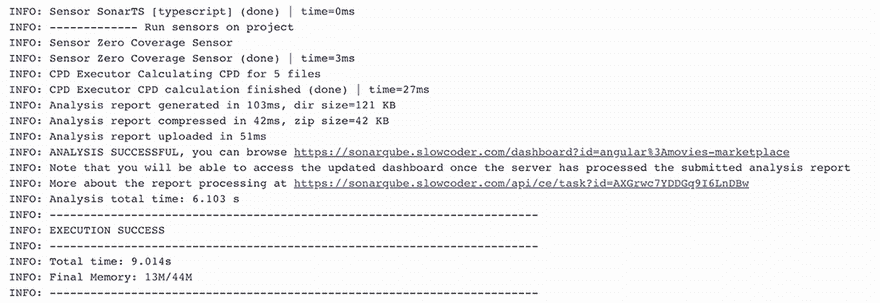

您可以通过创建质量配置文件来定义自己的自定义阈值，这些配置文件是一组规则，如果代码库中提出问题，则会导致管道失败。

注意：请参考此官方文档以获取创建带有质量配置文件的 SonarQube 自定义规则的逐步指南：[`mng.bz/l9vy`](http://mng.bz/l9vy)。

最后，在访问 SonarQube 服务器时，项目详情应显示所有从代码覆盖率报告中捕获的指标，如图 8.39 所示。

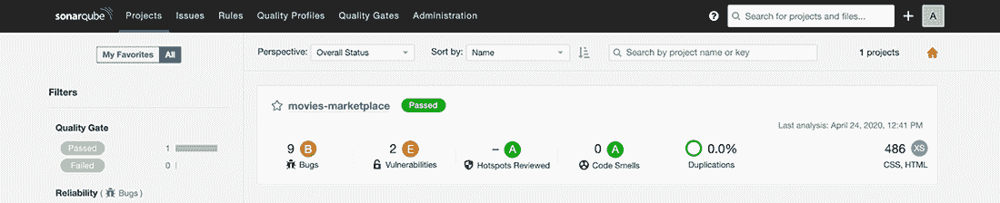

图 8.39 SonarQube 项目指标

现在，您可以进入 movies-marketplace 项目并发现问题、错误、代码异味、覆盖率或重复。仪表板（图 8.40）让您一眼就能看到质量状况。

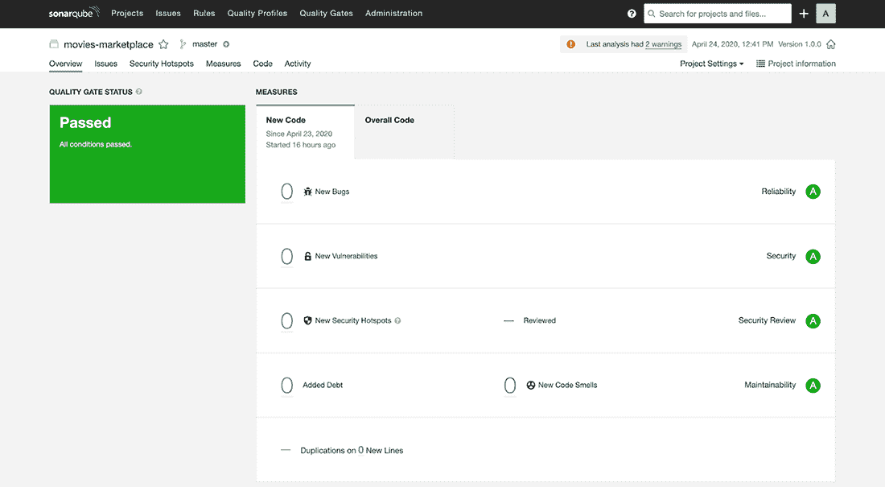

图 8.40 SonarQube 项目深度指标和问题

此外，当作业完成时，SonarQube Scanner 插件将检测到在构建过程中进行了 SonarQube 分析。然后，插件将在 Jenkins 作业页面上显示一个徽章和一个小部件，其中包含到 SonarQube 仪表板的链接以及质量门状态，如图 8.41 所示。

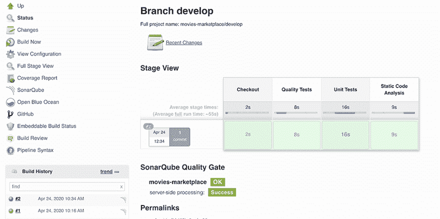

图 8.41 SonarQube 与 Jenkins 集成

SonarQube 分析速度快，但对于较大的项目，分析可能需要几分钟才能完成。

要等待分析完成，我们将使用`withForQualityGate`步骤暂停管道，该步骤等待 SonarQube 分析完成。为了通知 CI 管道关于分析完成的情况，我们需要在 SonarQube 上创建一个 webhook，以便在项目分析完成后通知 Jenkins，如图 8.42 所示。

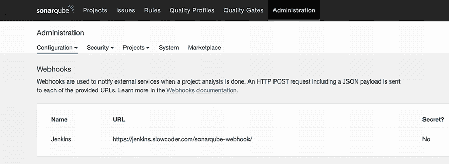

图 8.42 SonarQube webhook 创建

接下来，在下面的列表中，我们更新 Jenkinsfile 以集成`waitForQualityGate`步骤，该步骤暂停管道直到 SonarQube 分析完成并返回质量门状态。

列表 8.27 在 Jenkinsfile 中添加质量门

```
stage('Static Code Analysis'){
        withSonarQubeEnv('sonarqube') {
            sh 'sonar-scanner'
        }
}
stage("Quality Gate"){
        timeout(time: 5, unit: 'MINUTES') {
            def qg = waitForQualityGate()
            if (qg.status != 'OK') {
                error "Pipelin.
aborted due to quality gate failure: ${qg.status}"
            }
        }
}
```

注意：质量门可以移出`node{}`块之外，以避免占用等待 SonarQube 通知的 Jenkins 工作节点。

提交更改并将它们推送到远程仓库。将触发新的构建，并自动启动 SonarQube 分析。一旦分析完成，就会向 CI 管道发送通知以恢复管道阶段，如图 8.43 所示。

注意：我们可以在 Jenkins 中设置 Post-build 操作来通知用户关于测试结果。

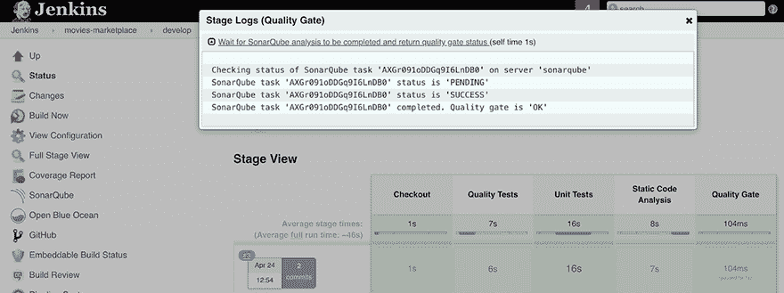

图 8.43 SonarQube 项目分析状态

因此，一旦开发者在 GitHub 上提交代码，Jenkins 就会从 GitHub 仓库中获取/拉取代码，在 Sonar Scanner 的帮助下执行静态代码分析，并将分析报告发送到 SonarQube 服务器。

在本章中，你学习了如何运行各种自动化测试，以及如何集成外部工具如 Nancy 和 SonarQube 来检查代码质量、检测错误，并在 Jenkins CI 管道中持续构建微服务的同时避免潜在的安全漏洞。在下一章中，我们将在测试成功运行后构建 Docker 镜像，并将镜像推送到私有远程仓库。

## 摘要

+   使用 Docker 容器来运行测试，以避免为每个我们要集成的服务安装多个运行时环境，并保持所有 Jenkins 工作节点之间的一致执行环境。

+   将传统安全实践（如外部依赖项扫描）推广到 CI/CD 工作流程中，可以增加一个安全层，以避免安全漏洞和漏洞。

+   无头 Chrome 是一种在无头环境中运行 UI 测试的方法，而不需要完整的浏览器 UI。

+   并行 DSL 步骤提供了轻松并行运行管道阶段的能力。

+   SonarQube 是一个代码质量管理工具，允许团队管理、跟踪和改进其源代码的质量。
