# 9 在 CI 管道中构建 Docker 镜像

本章涵盖

+   在 Jenkins 管道中构建 Docker 镜像和编写 Dockerfile 的最佳实践

+   在 Jenkins 声明式管道中使用 Docker 代理作为执行环境

+   将 Jenkins 构建状态集成到 GitHub 拉取请求中

+   部署和配置托管和管理的 Docker 私有仓库解决方案

+   开发周期内 Docker 镜像的生命周期和打标签策略

+   在 Jenkins 管道中扫描 Docker 镜像中的安全漏洞

在上一章中，你学习了如何在 CI 管道中运行 Docker 容器内的自动化测试。在本章中，我们将通过构建 Docker 镜像并将其存储在私有远程仓库中以实现版本控制来完成 CI 工作流程；见图 9.1。

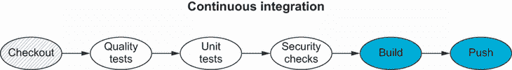

图 9.1 本章将实现构建和推送阶段。

到本章结束时，你应该能够使用以下步骤构建类似的 CI 管道：

1.  从远程仓库检出源代码。CI 服务器在推送事件发生时从版本控制系统（VCS）中获取代码。

1.  在 Docker 容器内运行预集成测试，如单元测试、安全测试、质量测试和 UI 测试。这些可能包括生成覆盖率报告和集成质量检查工具，如 SonarQube 进行静态代码分析。

1.  编译源代码并构建 Docker 镜像（自动化打包）。

1.  标记最终镜像并将其存储在私有仓库中。

图 9.2 总结了 CI 工作流程的最终结果。

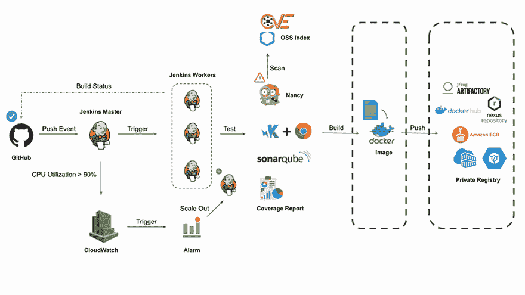

图 9.2 CI 管道过程

本 CI 管道的目的在于自动化持续构建、测试并将 Docker 镜像上传到私有仓库的过程。在每一个阶段都会进行失败/成功的报告。

注意：本章和前几章中讨论的 CI 设计可以根据任何类型项目的需求进行修改；用户只需要确定可以使用 Jenkins 的正确工具和配置即可。

## 9.1 构建 Docker 镜像

目前，每次向远程仓库的推送事件都会触发 Jenkins 上的管道。管道将根据 Jenkinsfile 中定义的阶段执行。首先启动的阶段将是从远程仓库克隆代码、运行自动化测试和发布覆盖率报告。图 9.3 显示了 movies-loader 服务的当前 CI 工作流程。

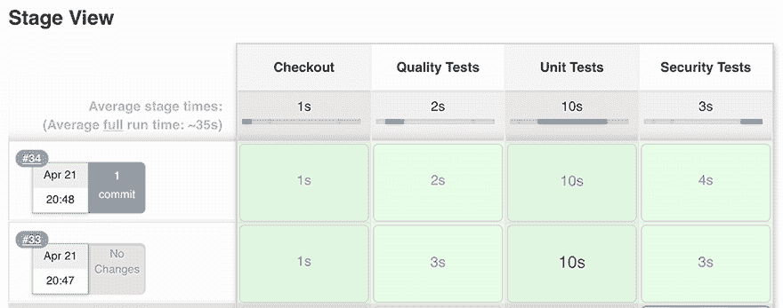

图 9.3 当前 CI 工作流程

如果测试成功，下一个阶段将是构建工件；在我们的例子中，它将是一个 Docker 镜像。

注意：当你为你的应用程序构建 Docker 镜像时，你是在一个现有镜像的基础上构建的。一个损坏的基础镜像可能导致生产中断（例如安全漏洞）。我建议使用最新且维护良好的镜像。

### 9.1.1 使用 Docker DSL

要构建主应用程序 Docker 镜像，我们需要定义一个包含一系列指令的 Dockerfile，这些指令指定了要使用的环境和要运行的命令。在 movies-loader 项目的顶级目录中创建一个 Dockerfile，使用以下代码。

列表 9.1 Movie loader 的 Dockerfile

```
FROM python:3.7.3
LABEL MAINTAINER mlabouardy
WORKDIR /ap.
COPY requirements.txt .
RUN pip install -r requirements.txt
COPY movies.json main.py ./
CMD python main.py
```

基于 Python 的应用程序将使用 Python v3.7.3 作为基础镜像，使用 pip 管理器安装运行时依赖项，并将 `python main.py` 设置为 Docker 镜像的主命令。

注意：为了保持镜像构建的一致性，创建一个包含所有使用依赖项的传递性固定版本的 requirements.txt 文件。

Dockerfile 中指令的顺序很重要。每当源代码发生任何更改时，都会重新构建 Docker 镜像。这就是为什么我把 `pip install` 命令放在列表 9.1 中的原因，因为依赖项不经常更改。因此，Docker 将依赖于层缓存，这将加快镜像的构建时间。有关 Docker 构建缓存的更多信息，请参阅官方 Docker 文档：[`mng.bz/B10J`](https://shortener.manning.com/B10J)。

最后，我们在 Jenkinsfile 中添加了一个 `Build` 阶段，它使用 Docker DSL 基于存储库中的 Dockerfile 构建镜像：

```
stage('Build'){
        docker.build(imageName)
}
```

默认情况下，`build()` 方法会在当前目录中构建 Dockerfile。您可以通过提供 `build()` 方法的第二个参数作为 Dockerfile 路径来覆盖此行为。

使用以下命令将更改推送到 develop 分支：

```
git add Jenkinsfile Dockerfile
git commit -m "building docker image"
git push origin develop
```

然后，应该触发一个新的构建，并构建镜像，如图 9.4 所示。

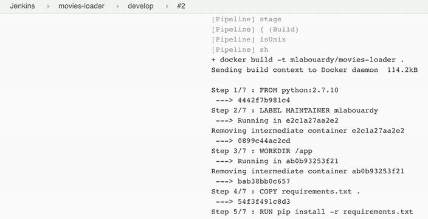

图 9.4 Python Docker 镜像构建日志

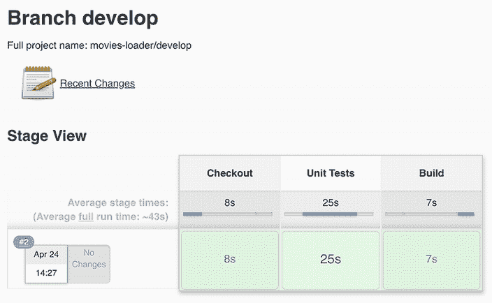

图 9.5 Movie loader CI 管道

到目前为止，我们已经为 movies-loader CI 管道在图 9.5 中定义了 CI 阶段。movies-parser 服务的 Dockerfile 将会有所不同，因为它是用 Go 编写的。由于 Go 是一种编译型语言，我们不需要在服务的运行时使用它。因此，我们将使用 Docker 的多阶段构建功能来减小 Docker 镜像的大小，如下面的列表所示。

列表 9.2 多阶段构建使用

```
FROM golang:1.16.5
WORKDIR /go/src/github.com/mlabouardy/movies-parser
COPY main.go go.mod .
RUN go get -v
RUN CGO_ENABLED=0 GOOS=linux go build -a -installsuffix cgo -o app main.go

FROM alpine:latest
LABEL Maintainer mlabouardy
RUN apk --no-cache add ca-certificates
WORKDIR /root/
COPY --from=0 /go/src/github.com/mlabouardy/movies-parser/app .
CMD ["./app"]
```

Dockerfile 被分为两个阶段。第一个阶段使用 `go build` 命令构建二进制文件。第二个阶段使用 Alpine 作为基础镜像，这是一个轻量级镜像，然后从第一个阶段复制二进制文件。

Go 构建工具和编译发生的中间层大约有 300 MB。最终的镜像具有最小的 8 MB 脚印。最终结果是和之前一样的微小生产镜像，但复杂性显著降低。Go SDK 和任何中间工件都被留下，并且没有保存在最终的镜像中。

注意：多阶段构建功能需要在守护程序和客户端上使用 Docker engine 17.05 或更高版本。

在之前的 Dockerfile 中，阶段没有被命名，而是通过它们的整数编号（从 0 开始，对应第一个`FROM`指令）来引用。然而，我们可以通过将`AS NAME`传递给`FROM`指令来命名阶段，如以下列表所示。

列表 9.3 命名 Docker 多阶段

```
FROM golang:1.16.5 AS builder
WORKDIR /go/src/github.com/mlabouardy/parser
...
FROM alpine:latest
...
COPY --from=builder /go/src/github.com/mlabouardy/movies-parser/app .
```

将`Build`阶段添加到项目的 Jenkinsfile 中，并将更改推送到 develop 分支。管道将被触发，构建的结果应该类似于图 9.6 中所示。

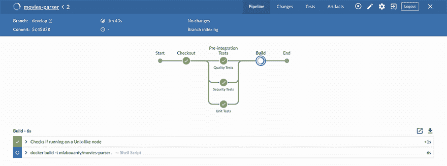

图 9.6 电影解析 CI 管道

注意：您同样可以基于 scratch 或 distroless 镜像构建最终镜像，但我更喜欢使用 Alpine 的便利性。此外，它是一个减少镜像大小的安全选择。

movies-store Docker 镜像将使用 DockerHub 中的 Node.js 基础镜像；我们使用的是写作时的最新 LTS 节点版本。我更喜欢指定一个特定版本，而不是像`node:lts`或`node:latest`这样的浮动标签，这样如果有人在其他机器上构建此镜像，他们将获得相同的版本，而不是冒着意外升级和随之而来的困惑的风险。

注意：在大多数情况下，从 DockerHub（[`hub.docker.com/`](https://hub.docker.com/)）提供的官方镜像中选择的基镜像是最好的选择。它们通常比社区创建的镜像控制得更好。

然后，我们通过传递`--only=prod`安装运行时所需的依赖项。最后，我们将`npm start`命令设置为在容器创建时启动 express 服务器，如以下列表所示。

列表 9.4 电影存储 Dockerfile

```
FROM node:14.17.0
WORKDIR /app
COPY package-lock.json package.json .
RUN npm i --only=prod
COPY index.js dao.js ./
EXPOSE 3000
CMD npm start
```

注意，我们不是复制整个工作目录，而是只复制 package.json 和 package-lock.json 文件。这使我们能够利用缓存的 Docker 层。package-lock.json 文件记录了所有依赖项的版本，以确保 Docker 构建中的`npm install`命令的一致性。

一旦管道更改被版本化并且执行完成，到目前为止的 CI 管道对于 movies-store 应该看起来与图 9.7 中的 Blue Ocean 视图相似。

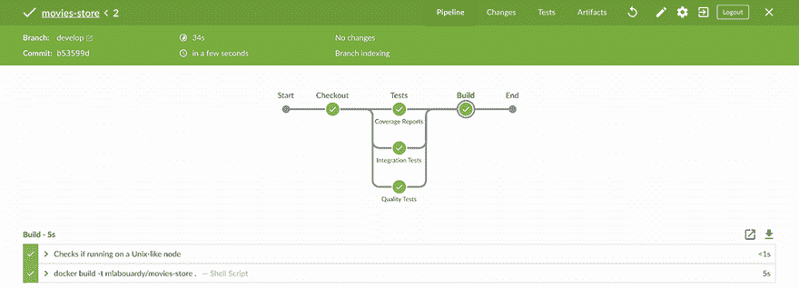

图 9.7 电影存储 CI 管道

注意：在镜像构建过程中，Docker 会取上下文目录中的所有文件。为了提高 Docker 构建性能，可以通过在上下文目录中添加`.dockerignore`文件来排除文件和目录。

### 9.1.2 Docker 构建参数

最后，对于 Angular 应用程序（即 movies-marketplace），我们再次使用多阶段构建功能，通过`ng build`命令构建静态文件夹。然后我们将文件夹复制到 NGINX 镜像中，通过 Web 服务器提供服务；请参阅以下列表。

列表 9.5 电影市场 Dockerfile

```
FROM node:14.17.0 as builder
ARG ENVIRONMENT
ENV CHROME_BIN=chromium
WORKDIR /app
RUN apt-get update && apt-get install -y chromium
COPY package-lock.json package.json .
RUN npm i && npm i -g @angular/cli
COPY . .
RUN ng build -c $ENVIRONMENT

FROM nginx:alpine
RUN rm -rf /usr/share/nginx/html/*
COPY --from=builder /app/dist /usr/share/nginx/html
EXPOSE 80
CMD ["nginx", "-g", "daemon off;"]
```

注意：`ENV`指令在构建和运行时都可用。`ARG`指令（列表 9.5）仅在构建时可用。

由于我们可能基于不同的运行环境拥有多个 Angular 配置（具有不同的设置），我们将在构建时注入一个构建参数来指定目标环境，如下所示：

```
stage('Build'){
        docker.build(imageName, '--build-arg ENVIRONMENT=sandbox .')
}
```

当向`build()`方法传递参数时，最后一个值应以要使用的文件夹作为构建上下文结束。

最后，请确保在项目的根目录中创建一个.dockerignore 文件，以防止本地模块、调试日志和临时文件被复制到 Docker 镜像中。为了排除这些目录，我们创建了一个包含以下内容的.dockerignore 文件：

```
nodes_modules
coverage
dist
tmp
```

在推送更改后，管道应类似于图 9.8 中的 Blue Ocean 视图。

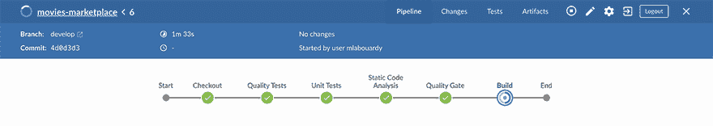

图 9.8 电影市场 CI 管道

现在项目 Docker 镜像已构建，我们需要将它们存储在某处。因此，我们将在项目开发周期中构建的所有镜像上部署一个私有注册库。

## 9.2 部署 Docker 私有注册库

持续集成导致频繁的构建和打包。因此，我们需要一个机制来存储所有这些二进制代码（构建、打包、第三方插件等）在一个类似于版本控制系统的系统中。由于 VCSs 如 Git 和 SVN 存储代码而不是二进制文件，我们需要一个二进制存储库工具。

存在许多解决方案，例如 Nexus 或 Artifactory。然而，它们带来了挑战，包括管理和加固实例。幸运的是，也存在托管解决方案，这取决于您使用的云提供商，例如 Amazon Elastic Container Registry (ECR)、Google Container Registry 和 Azure Container Registry。

注意您也可以在 DockerHub 上托管您的 Docker 镜像。如果您选择这种方法，您可以跳过这部分。

### 9.2.1 Nexus Repository OSS

Nexus Repository OSS ([www.sonatype.com/products/repository-oss](http://www.sonatype.com/products/repository-oss))是一个广泛使用的开源、免费工件存储库，可以用于存储二进制和构建工件。它可以用于分发 Maven/Java、npm、Helm、Docker 等。

注意由于您已经熟悉 Docker，您可以使用 Sonatype 的 Docker 镜像在 Docker 容器中运行 Nexus Repository OSS。

要部署 Nexus Repository OSS，我们需要使用 Packer 制作一个新的机器镜像。以下列表提供了 template.json 的内容（完整的模板可在第九章/nexus/packer/template.json 中找到）。

列表 9.6 Nexus Repository OSS Packer 模板

```
{
    "variables" : {...},
    "builders" : [
        {
            "type" : "amazon-ebs",
            "ami_name" : "nexus-3.22.1-02",
            "ami_description" : "Nexus Repository OSS"
        }
    ],
    "provisioners" : [
        {
            "type" : "file",
            "source" : "./nexus.rc",
            "destination" : "/tmp/nexus.rc"
        },
        {
            "type" : "file",
            "source" : "./repository.json",
            "destination" : "/tmp/repository.json"
        },
        {
            "type" : "shell",
            "script" : "./setup.sh",
            "execute_command" : "sudo -E -S sh '{{ .Path }}'"
        }
    ]
}
```

这将基于 Amazon Linux 镜像创建一个临时实例，并使用一个 shell 脚本（列表 9.7）安装从官方仓库的 Nexus OSS 版本，并将其配置为使用 init.d 运行服务，以便在实例重启后重新启动。此示例使用版本 3.30.1-01。完整的脚本可在第九章/nexus/packer/setup.sh 中找到。

列表 9.7 安装 Nexus Repository OSS 版本（setup.sh）

```
NEXUS_USERNAME="admin"                                                   ❶
NEXUS_PASSWORD="admin123"                                                ❶
echo "Install Java JDK 8"
yum update -y
yum install -y java-1.8.0-openjdk                                        ❷
echo "Install Nexus OSS"
wget https://download.sonatype.com/nexus/3/latest-unix.tar.gz -P /tmp    ❸
tar -xvf /tmp/latest-unix.tar.gz                                         ❸
mv nexus-* /opt/nexus                                                    ❸
mv sonatype-work /opt/sonatype-work                                      ❸
useradd nexu.
chown -R nexus:nexus /opt/nexus/ /opt/sonatype-work/
ln -s /opt/nexus/bin/nexus /etc/init.d/nexus
chkconfig --add nexus
chkconfig --levels 345 nexus on
mv /tmp/nexus.rc /opt/nexus/bin/nexus.rc
echo "nexus.scripts.allowCreation=true" >> nexus-default.propertie.
systemctl enable nexus
Systemctl start nexus
```

❶ 定义 Nexus OSS 默认凭据（admin/admin123）

❷ 安装 Java JDK 1.8.0，这是运行 Nexus OSS 所必需的

❸ 从官方仓库下载 Nexus OSS 并将存档提取到目标位置

然后，脚本将使用 `service nexus restart` 命令启动 Nexus 服务器，并等待其启动并准备好，如下一列表所示。

列表 9.8 等待 Nexus 服务器启动（setup.sh）

```
until $(curl --output /dev/nul.
--silent --head --fail http://localhost:8081); do
    printf '.'
    sleep 2
done
```

一旦服务器响应，将向 Nexus 脚本 API 发出 POST 请求以创建 Docker 托管仓库。脚本 API 可以用于自动化 Nexus 仓库管理器的复杂任务，如下所示。

列表 9.9 Nexus OSS 脚本 API（setup.sh）

```
curl -v -X POST -u $NEXUS_USERNAME:$NEXUS_PASSWORD                                        ❶
--header "Content-Type: application/json" 'http://localhost:8081/service/rest/v1/script'  ❶
-d @/tmp/repository.json                                                                  ❶
```

❶ 通过在请求中包含默认凭据和在请求负载中包含 Docker 仓库配置，对 Nexus 服务器执行 POST 请求

注意：Nexus REST API 端点和功能的完整列表通过 NEXUS_HOST/swagger-ui 端点进行文档化。

请求负载是一个暴露在端口 5000 的 Docker 主机注册表的 Groovy 脚本：

```
import org.sonatype.nexus.blobstore.api.BlobStoreManager;
import org.sonatype.nexus.repository.storage.WritePolicy;
repository.createDockerHosted('docker-registry'.
5000, 443,
BlobStoreManager.DEFAULT_BLOBSTORE_NAME, true, true, WritePolicy.ALLOW, true)
```

执行 `packer build` 命令来烘焙 AMI。一旦配置完成，Nexus AMI 应该可以在 AWS 管理控制台的“图像”部分中找到，如图 9.9 所示。

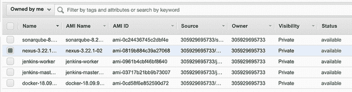

图 9.9 Nexus OSS AMI

从那里，使用 Terraform 基于烘焙的 Nexus OSS AMI 配置一个 EC2 实例。创建一个包含以下列表内容的 nexus.tf 文件。

列表 9.10 Nexus EC2 实例资源

```
resource "aws_instance" "nexus" {
  ami                    = data.aws_ami.nexus.id
  instance_type          = var.nexus_instance_type
  key_name               = var.key_name
  vpc_security_group_ids = [aws_security_group.nexus_sg.id]
  subnet_id              = element(var.private_subnets, 0)

  root_block_device {
    volume_type           = "gp2"
    volume_size           = 50
    delete_on_termination = false
  }

  tags = {
    Author = var.author
   Name = "nexus"
  }
}
```

注意：在没有问题的前提下运行 Nexus OSS 至少需要 8 GB 的内存。此外，我强烈建议使用一个专门的 EBS 用于 blob 存储 ([`mng.bz/dr7Q`](http://mng.bz/dr7Q))。

此外，还需要配置一个公共负载均衡器，将传入的 HTTP 和 HTTPS 流量转发到 EC2 实例的 8081 端口，这是 Nexus 仓库管理器（仪表板）暴露的端口。创建一个名为 loadbalancers.tf 的新文件，内容如下列表所示。

列表 9.11 Nexus 仓库管理器公共负载均衡器

```
resource "aws_elb" "nexus_elb" {
  subnets                   = var.public_subnets
  cross_zone_load_balancing = true
  security_groups           = [aws_security_group.elb_nexus_sg.id]
  instances                 = [aws_instance.nexus.id]

  listener {
    instance_port      = 8081
    instance_protocol  = "http"
    lb_port            = 443
    lb_protocol        = "https"
    ssl_certificate_id = var.ssl_arn
  }

  health_check {
    healthy_threshold   = 2
    unhealthy_threshold = 2
    timeout             = 3
    target              = "TCP:8081"
    interval            = 5
  }

  tags = {
    Name   = "nexus_elb"
    Author = var.author
  }
}
```

在同一文件中，添加另一个公共负载均衡器，如下一列表所示。这将访问指向 Nexus 仓库管理器托管仓库端口 5000 的 Docker 私有注册表。

列表 9.12 Docker 注册表公共负载均衡器

```
resource "aws_elb" "registry_elb" {
  subnets                   = var.public_subnets
  cross_zone_load_balancing = true
  security_groups           = [aws_security_group.elb_registry_sg.id]
  instances                 = [aws_instance.nexus.id]

  listener {
    instance_port      = 5000
    instance_protocol  = "http"
    lb_port            = 443
    lb_protocol        = "https"
    ssl_certificate_id = var.ssl_arn
  }
}
```

使用 `terraform apply` 配置 AWS 资源、Nexus 仪表板和 Docker 注册表。在配置过程的“输出”部分应显示 URL，如图 9.10 所示。

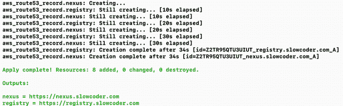

图 9.10 Nexus Terraform 资源

将您喜欢的浏览器指向 Nexus URL，如图 9.11 所示的 Web 仪表板应该会显示出来。默认的 `admin` 密码可以在 `/opt/sonatype-work/nexus3/admin.password` 中找到。

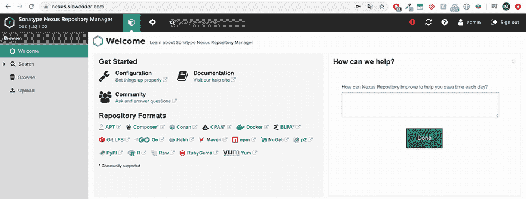

图 9.11 Nexus 仓库管理器

如果您从齿轮图标跳转到设置，然后是仓库，应该会创建一个新的 Docker 托管仓库。该仓库禁用了标签不可变性，并允许后续使用相同标签的镜像推送覆盖图像标签。如果启用此选项，如果您尝试推送一个在仓库中已存在的标签的镜像，将返回错误。其余的配置应类似于图 9.12。

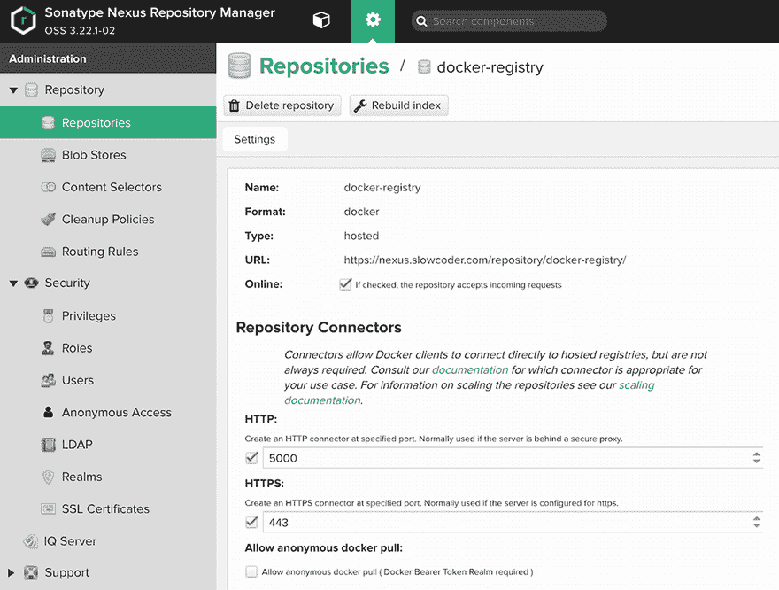

图 9.12 Nexus 上的 Docker 托管注册库

要能够从注册库拉取和推送 Docker 镜像，我们将从安全部分创建一个自定义 Nexus 角色。如图 9.13 所示，此角色将授予对 Docker 托管注册库的完全访问权限。

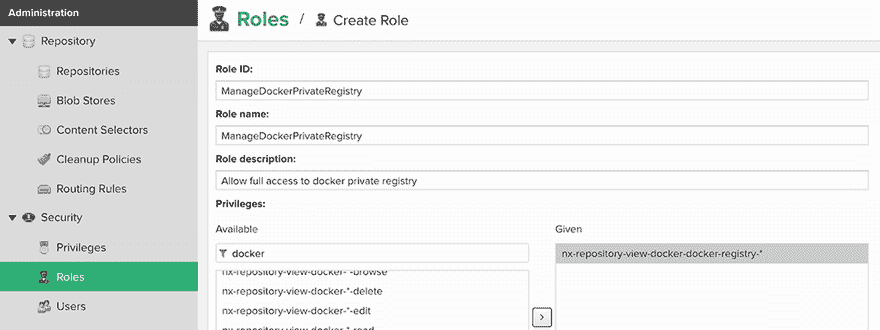

图 9.13 Docker 注册库的 Nexus 自定义角色

注意：对于推送和拉取操作，只需要 `nx-*-registry-add` 和 `nx-* -registry-read` 权限。

接下来，我们创建一个 Jenkins 用户，并将其分配给我们刚刚创建的自定义 Nexus 角色，如图 9.14 所示。

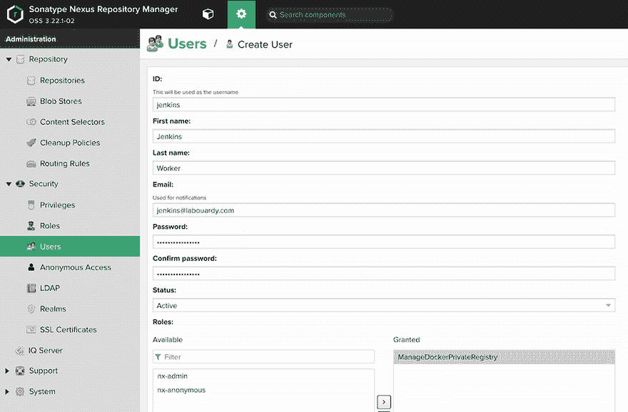

图 9.14 Jenkins 的 Docker 注册库凭证

我们可以通过回到本地机器上的终端会话并发出 `docker login` 命令来测试身份验证：

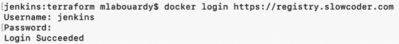

注意：默认情况下，托管 Docker 仓库通过 HTTPS 暴露。但是，如果您仅在纯 HTTP 端点暴露私有仓库，则需要配置 Docker 守护程序以允许不安全连接，通过将 `–insecure-registry` 标志传递给 Docker 引擎。

最后，在 Jenkins 上，使用我们迄今为止为 Jenkins 创建的 Nexus 凭证创建一个类型为用户名的注册凭证，带有密码（如图 9.15）。

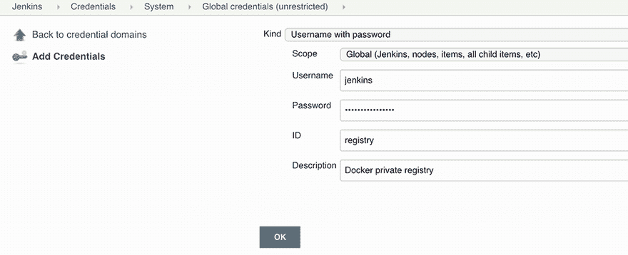

图 9.15 Docker 注册库凭证

Nexus 仓库 OSS 的另一个替代方案是 AWS 管理服务。

### 9.2.2 亚马逊弹性容器注册库

如果您像我一样使用 AWS，可以使用名为 Elastic Container Registry (ECR) 的托管 AWS 服务来托管您的私有 Docker 镜像。从 AWS 管理控制台导航到 Amazon ECR ([`console.aws.amazon.com/ecr/repositories`](https://console.aws.amazon.com/ecr/repositories))。然后，为要托管或存储的每个 Docker 镜像创建一个仓库。在我们的项目中，我们需要创建四个仓库，每个微服务一个。例如，服务加载器仓库如图 9.16 所示。

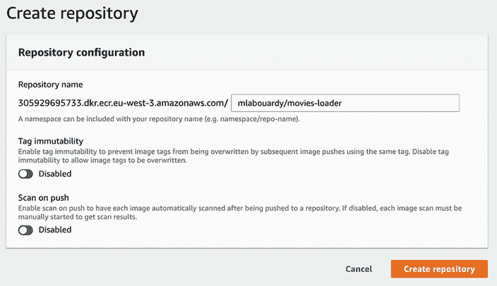

图 9.16 ECR 新仓库

一旦创建了仓库，您可以点击“查看推送命令”按钮，应该会弹出一个对话框，其中包含有关如何对远程仓库进行标记、推送和拉取镜像的说明列表；参见图 9.17。

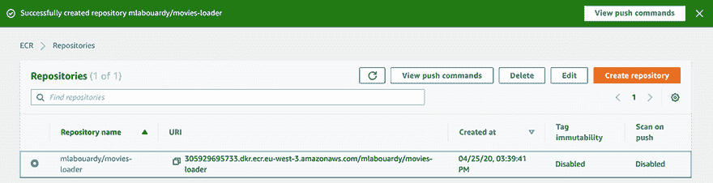

图 9.17 电影加载器 ECR 仓库

在与仓库交互之前，您需要使用 ECR 进行身份验证。以下命令适用于 Mac 和 Linux 用户，可用于登录远程仓库：

```
aws ecr get-login-password --region REGION 
| docker login --username AWS --password-stdi.
ACCOUNT_ID.dkr.ecr.REGION.amazonaws.com/
mlabouardy/movies-loader
```

注意：将`ACCOUNT_ID`和`REGION`分别替换为您的 Amazon 账户 ID 和 AWS 区域。

对于 Windows 用户，以下是命令：

```
(Get-ECRLoginCommand).Password | 
docker login --username AWS --password-stdi.
ACCOUNT_ID.dkr.ecr.REGION.amazonaws.com/mlabouardy/movies-loader
```

重复相同的步骤，为每个微服务创建专门的 ECR 仓库，如图 9.18 所示。

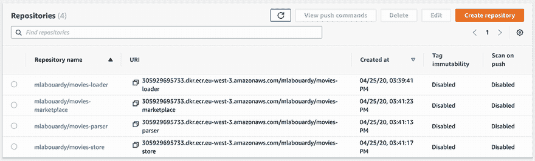

图 9.18 每个微服务的 ECR 仓库

### 9.2.3 Azure Container Registry

对于 Azure 用户，可以使用 Azure Container Registry 服务来存储容器镜像，而无需管理私有注册表。在 Azure 门户([`portal.azure.com/`](https://portal.azure.com/))中，导航到容器注册表服务，点击添加按钮以创建新的注册表。指定您想要部署注册表的区域，并给它一个名称，如图 9.19 所示。

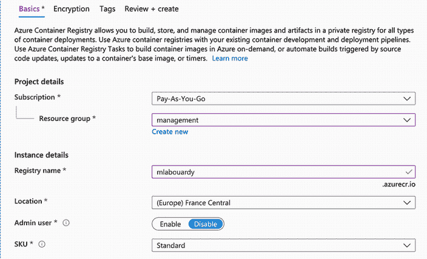

图 9.19 Azure 新注册表配置

将其他字段保留为默认值，然后点击创建。一旦创建注册表，导航到设置部分下的访问密钥，在那里您将找到可用于从 Jenkins 推送或拉取 Docker 镜像的 admin 用户名和密码；见图 9.20。

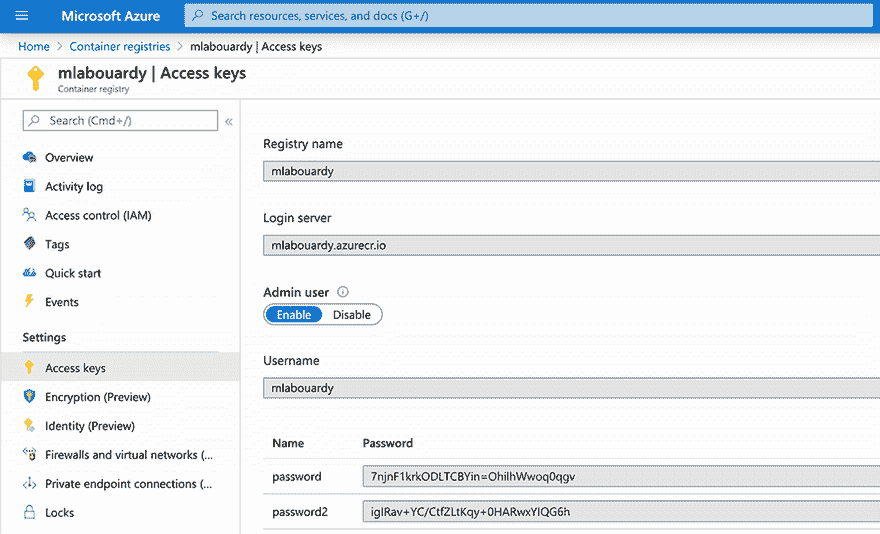

图 9.20 Azure Docker 注册表管理员凭据

您可以使用这些凭据在 Jenkins 中推送 CI 管道内的镜像。然而，我建议通过使用基于角色的访问控制（RBAC）或最小权限原则来创建具有细粒度访问控制的令牌。管理员账户仅设计为单个用户访问注册表，主要用于测试目的。

导航到令牌部分，点击添加按钮以创建新的访问令牌。给它一个名称，并将`_repositories_push`作用域关联起来，以允许仅执行`docker push`操作（Jenkins 只需要将镜像推送到注册表）；见图 9.21。

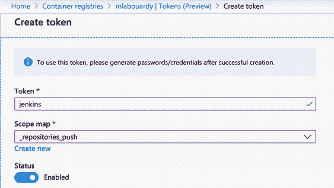

图 9.21 Azure Docker 注册表新访问令牌

在创建令牌后，如图 9.22 所示，生成密码。为了与注册表进行身份验证，令牌必须启用并具有有效的密码。

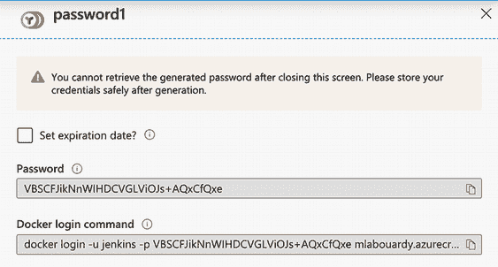

图 9.22 Azure Docker 注册表凭据

在生成密码后，将其复制并保存为 Jenkins 凭据类型为用户名和密码。在关闭对话框屏幕后，您无法检索生成的密码，但可以生成一个新的。

### 9.2.4 Google Container Registry

对于 Google Cloud Platform 用户，可以使用名为 Google Container Registry (GCR) 的托管服务来托管 Docker 镜像。要开始使用，您需要为您的 GCP 项目启用 API Container Registry ([`cloud.google.com/container-registry/docs/quickstart`](https://cloud.google.com/container-registry/docs/quickstart))，然后安装`gcloud`命令行工具。对于 Linux 用户，运行以下列表。

列表 9.13 `gcloud`安装

```
curl -O https://dl.google.com/dl/cloudsdk/channels/
rapid/downloads/google-cloud-sdk-344.0.0-linux-x86_64.tar.gz
tar zxvf google-cloud-sdk-344.0.0-linux-x86_64.tar.gz
 google-cloud-sdk
./google-cloud-sdk/install.sh
```

注意：有关如何安装 Google Cloud SDK 的进一步说明，请参阅官方 GCP 指南 [`cloud.google.com/sdk/install`](https://cloud.google.com/sdk/install)。

接下来，运行以下命令以对注册表进行身份验证。生成的身份验证令牌将持久化到 ~/.docker/config.json，并用于对该存储库的任何后续交互：

```
gcloud auth configure-docker
```

您需要使用 GCR URI (`gcr.io/[PROJECT-ID]`) 标记目标镜像，并使用 `docker push` 命令推送镜像。图 9.23 展示了如何标记和推送 movies-loader Docker 镜像到 GCR：

```
docker tag mlabouardy/movies-loader
eu.gcr.io/PROJECT_ID/mlabouardy/movies-loader
docker push eu.gcr.io/PROJECT_ID/mlabouardy/movies-loader
```

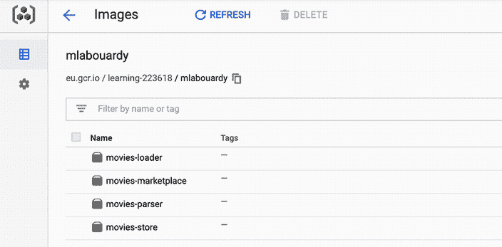

图 9.23 Google 容器注册表镜像

现在，我们已经介绍了如何部署私有 Docker 注册表，我们将更新每个服务的 Jenkinsfile，以便在成功的 CI 管道执行结束时将镜像推送到远程私有注册表。

## 9.3 正确标记 Docker 镜像

在 Jenkinsfile 中添加一个新的推送阶段，使用 `withRegistry` 块，通过第二个参数提供的凭据对第一个参数中提供的注册表 URL 进行身份验证。然后，它将更改持久化到 ~/.docker/config.json。最后，它使用等于构建编号 ID 的标签值（使用 `env.BUILD_ID` 关键字）推送镜像。以下是在实现 `Push` 阶段后 movies-loader 服务的 Jenkinsfile 列表。

列表 9.14 将 Docker 镜像发布到注册表

```
def imageName = 'mlabouardy/movies-loader'
def registry = 'https://registry.slowcoder.com'
node('workers'){
    stage('Checkout'){
        checkout scm
    }

    stage('Unit Tests'){
        def imageTest= docker.build("${imageName}-test".
"-f Dockerfile.test .")
        imageTest.inside{
            sh 'python test_main.py'
        }
    }

    stage('Build'){
        docker.build(imageName)
    }

    stage('Push'){
        docker.withRegistry(registry, 'registry') {
           docker.image(imageName).push(env.BUILD_ID)
        }
    }
}
```

注意：`imageName` 和 `registry` 值必须替换为您自己的 Docker 私有注册表 URL 和要存储的镜像名称。

在这个例子中，构建编号是 2；因此，movies-loader 镜像在标记为 2 后被推送到注册表，如图 9.24 所示。

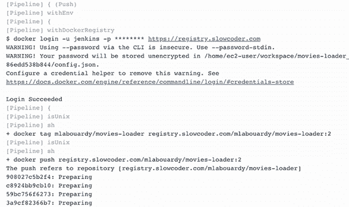

图 9.24 Docker 推送命令日志

如果我们回到注册表（例如，在 Nexus Repository Manager 上），我们可以看到 movies-loader 镜像已成功推送（图 9.25）。

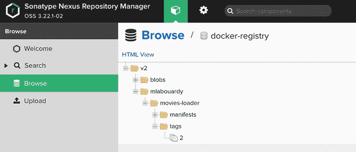

图 9.25 Nexus 中存储的 Docker 镜像

虽然可以使用 Jenkins 构建编号来标记镜像，但这可能不太方便。更好的标识符是 Git 提交 ID。在这个例子中，我们将使用它来标记构建的 Docker 镜像。在声明性和脚本管道中，此信息不是默认可用的。因此，我们将创建一个函数，该函数使用 Git 命令行获取提交 ID 并返回它：

```
def commitID() {
   sh 'git rev-parse HEAD > .git/commitID'
   def commitID = readFile('.git/commitID').trim()
   sh 'rm .git/commitID'
   commitID
}
```

从那里，我们可以更新 `Push` 阶段，使用 `commitID()` 函数返回的值标记镜像：

```
stage('Push'){
        docker.withRegistry(registry, 'registry') {
            docker.image(imageName).push(commitID())
       }
}
```

注意：在第十四章中，我们将介绍如何创建带有自定义函数的 Jenkins 共享库，以避免在 Jenkinsfile 中重复代码。

使用以下命令将更改推送到 GitHub 仓库：

```
git add Jenkinsfile
git commit -m "tagging docker image with git commit id"
git push origin develop
```

新的 CI 管道阶段应该看起来像图 9.26 中的 movies-loader 服务。

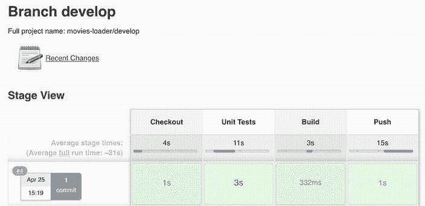

图 9.26 电影加载 CI 管道

在 Nexus Repository Manager 上成功运行后，应该有一个带有提交 ID 的新镜像可用（如图 9.27 所示）。

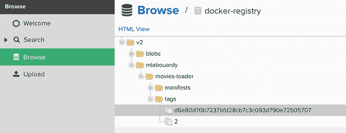

图 9.27 提交 ID 镜像标签

我们将进一步操作，并基于分支名称推送相同的镜像。这个标签在处理持续部署和交付时将非常有用。它将允许我们为每个环境分配特定的标签：

+   *Latest*—用于将镜像部署到生产环境

+   *Preprod*—用于将镜像部署到预发布或预生产环境

+   *Develop*—用于将镜像部署到沙盒或开发环境

`Push`阶段的代码块如下：

```
stage('Push'){
        docker.withRegistry(registry, 'registry') {
           docker.image(imageName).push(commitID())

            if (env.BRANCH_NAME == 'develop') {
                docker.image(imageName).push('develop')
            }
        }
}
```

`env.BRANCH_NAME`变量包含分支名称。您也可以直接使用`BRANCH_NAME`而不需要`env`关键字（自从 Pipeline Groovy Plugin 2.18 以来就没有要求了）。

最后，如果您使用 Amazon ECR 作为私有仓库，在发出推送指令之前，您需要先使用 AWS CLI 对远程仓库进行认证。对于 AWS CLI 2 用户，请使用以下列表中的 shell 指令来调用`aws ecr`命令。

列表 9.15 将 Docker 镜像发布到 ECR

```
def imageName = 'mlabouardy/movies-loader'
def registry = 'ACCOUNT_ID.dkr.ecr.eu-west-3.amazonaws.com'
def region = 'REGION'

node('workers'){
    ...
    stage('Push'){
        sh "aws ecr get-login-password --region ${region} .
docker login --username AW.
--password-stdin ${registry}/${imageName}"

        docker.image(imageName).push(commitID())
        if (env.BRANCH_NAME == 'develop') {
            docker.image(imageName).push('develop')
        }
    }
}
```

确保将`ACCOUNT_ID`和`REGION`变量分别替换为您的 AWS 账户 ID 和 AWS 区域。如果您使用的是 AWS CLI 1.x 版本，请使用以下代码块：

```
stage('Push'){
        sh "\$(aws ecr get-logi.
--no-include-email --region ${region}) || true"
        docker.withRegistry("https://${registry}") {
            docker.image(imageName).push(commitID())
            if (env.BRANCH_NAME == 'develop') {
                docker.image(imageName).push('develop')
            }
        }
}
```

在触发 CI 管道之前，您需要授予 Jenkins 工作节点对 ECR 注册表执行推送操作的权利。因此，您需要将 AmazonEC2ContainerRegistryFullAccess 策略分配给 Jenkins 工作节点实例的 IAM 实例配置文件。图 9.28 展示了分配给 Jenkins 工作节点的 IAM 实例配置文件。

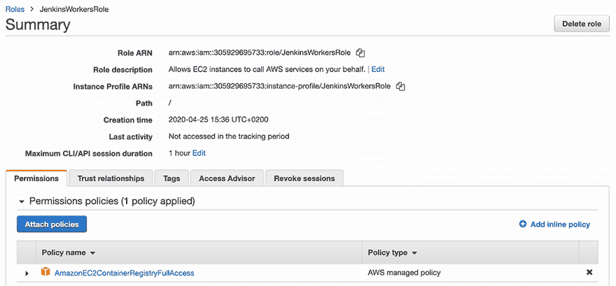

图 9.28 Jenkins 工作节点的 IAM 实例配置文件

一旦您完成了必要的更改，应该触发一个新的构建。在 CI 管道的末尾，应该将一个新的镜像标签推送到 ECR 仓库，如图 9.29 所示。

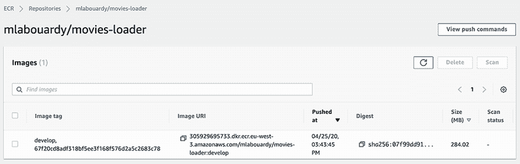

图 9.29 电影加载器 ECR 仓库镜像

对其他微服务重复相同的步骤，将它们的 Docker 镜像推送到 CI 管道的末尾，如图 9.30 所示。

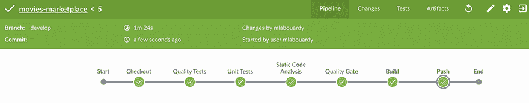

图 9.30 电影市场 CI 管道

在典型的流程中，Docker 镜像应该进行分析、检查，并针对安全规则进行合规性和审计。这就是为什么在接下来的章节中，我们将集成容器检查和分析平台到 CI 管道中，以持续检查构建的 Docker 镜像中的安全漏洞。

## 9.4 扫描 Docker 镜像以查找漏洞

*Anchore* *Engine* ([`github.com/anchore/anchore-engine`](https://github.com/anchore/anchore-engine))是一个开源项目，它提供了一个集中的服务，用于检查、分析和认证容器镜像。您可以将 Anchore Engine 作为一个独立的服务或作为 Docker 容器运行。

注意：独立安装至少需要 4 GB 的 RAM 和足够的磁盘空间来支持您打算分析的容器镜像。

您可以从头使用 Packer 制作自己的 AMI 来安装 Anchore Engine 并设置 PostgreSQL 数据库。然后，使用 Terraform 来部署堆栈，或者您可以直接使用 Docker Compose 部署配置好的堆栈。有关如何使用 Terraform 和 Packer 的说明，请参阅第四章和第五章。

在预装了 Docker 社区版 (CE) 的 *管理* VPC 中启动一个私有实例，然后从 Docker 官方指南页面安装 Docker Compose 工具。使用以下命令部署 Anchore Engine。

```
curl https://docs.anchore.com/current/docs/
engine/quickstart/docker-compose.yaml > docker-compose.yaml
docker-compose up -d
```

几分钟后，您的 Anchore Engine 服务应该已经启动并运行，准备使用。您可以使用 `docker-compose` `ps` 命令验证容器是否正在运行。图 9.31 显示了输出。请确保仅从 Jenkins 主安全组 ID 允许端口 8228（Anchore API）的入站流量，如图 9.32 所示。

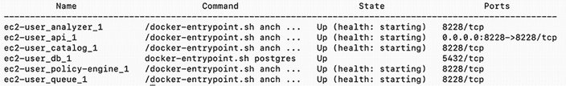

图 9.31 Docker Compose 堆栈服务

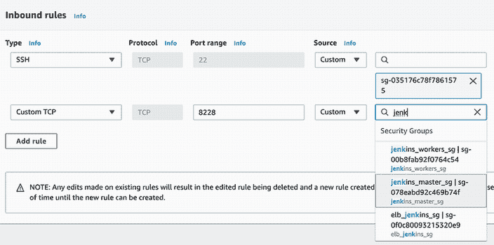

图 9.32 Anchore 实例的安全组

注意：您可以进一步操作，在 EC2 实例前部署一个负载均衡器，并在 Route 53 中创建一个指向负载均衡器 FQDN 的 A 记录。

当涉及到 Jenkins 时，一个可用的插件已经使得集成变得容易得多。从主 Jenkins 菜单中选择“管理 Jenkins”，然后跳转到“管理插件”部分。点击“可用”标签，安装 Anchore 容器镜像扫描插件，如图 9.33 所示。

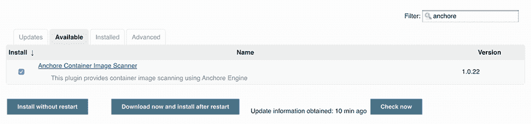

图 9.33 Anchore 容器镜像扫描插件

接下来，从“管理 Jenkins”菜单中选择“配置系统”，然后滚动到“Anchore 配置”。然后，设置 Anchore URL，包括 /v1 路由和凭据（默认为 admin/foobar），如图 9.34 所示。

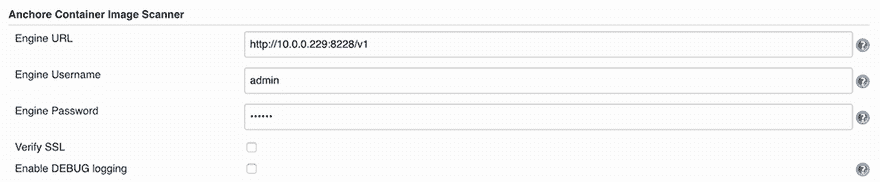

图 9.34 Anchore 插件配置

最后，通过在项目工作区中创建一个名为 *images* 的文件来将 Anchore 集成到 Jenkins 管道中。此文件应包含要扫描的 Docker 镜像的名称，并可选地包含 Dockerfile。然后，使用创建的文件作为参数调用 Anchore 插件，如下所示。

列表 9.16 使用 Anchore 分析 Docker 镜像

```
stage('Analyze'){
            def scannedImage .
"${registry}/${imageName}:${commitID().
${workspace}/Dockerfile"
            writeFile file: 'images', text: scannedImage
            anchore name: 'images'
}
```

使用以下命令将更改推送到 develop 分支上的远程仓库：

```
git add Jenkinsfile
git commit -m "image scanning stage"
git push origin develop
```

CI 管道将在推送事件上触发。在镜像构建并推送到注册表后，应调用 Anchore Scanner。由于 Anchore 无法从私有注册表中拉取 Docker 镜像进行分析和检查，它将抛出一个错误。

幸运的是，Anchore 集成并支持分析与 Docker v2 兼容的任何仓库中的镜像。为了允许 Anchore 访问远程镜像，从 Anchore EC2 实例安装 `anchor-cli` 二进制文件：

```
yum install -y epel-release python-pip
pip install anchorecli
```

接下来，我们为私有 Docker 仓库定义凭证。运行此命令；`REGISTRY` 参数应包括仓库的完全限定主机名和端口号（如果公开）。

```
anchore-cli registry add REGISTRY USERNAME PASSWORD
```

注意：相同的命令可以用来配置托管在 Nexus 或其他解决方案上的 Docker 仓库。

由于我们使用 Amazon ECR 仓库并在 EC2 实例上运行 Anchore，我们将使用带有 AmazonEC2ContainerRegistryReadOnly 策略的 IAM 实例配置文件。在这种情况下，我们将为 `USERNAME` 和 `PASSWORD` 都传递 `awsauto`，并指示 Anchore 引擎从底层 EC2 实例继承角色：

```
anchore-cli --u admin --p foobar registry add ACCOUNT_ID.dkr.ecr.REGION .amazonaws.com awsauto awsauto --registry-type=awsecr
```

为了验证凭证是否已正确配置，运行以下命令以列出定义的仓库：

```
anchore-cli --u admin --p foobar registry list
```

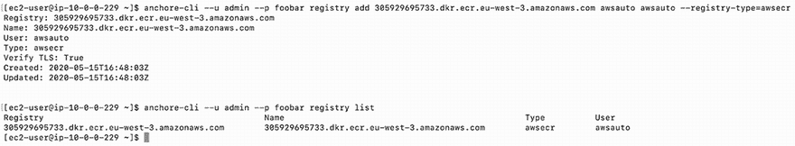

使用重放按钮重新运行管道。这次，Anchore 将检查镜像文件系统中的漏洞。如果发现严重漏洞，这将导致镜像构建失败，如图 9.35 所示。

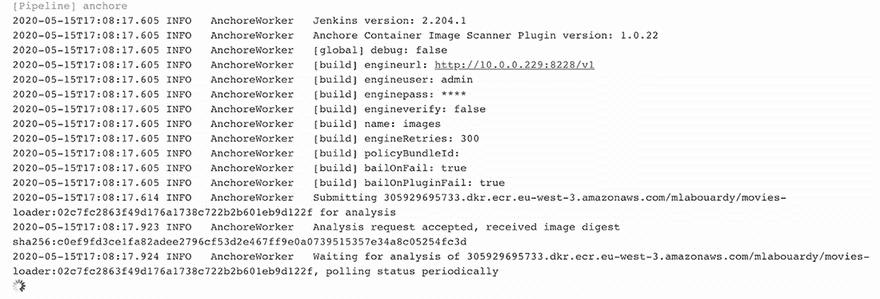

图 9.35 使用 Anchore 进行镜像扫描

一旦扫描完成，如果镜像有任何已知的严重问题，Anchore 将返回非零退出代码。Anchore 策略评估的结果将保存在 JSON 文件中。此外，管道将显示构建的状态（停止、警告或失败），如图 9.36 所示。

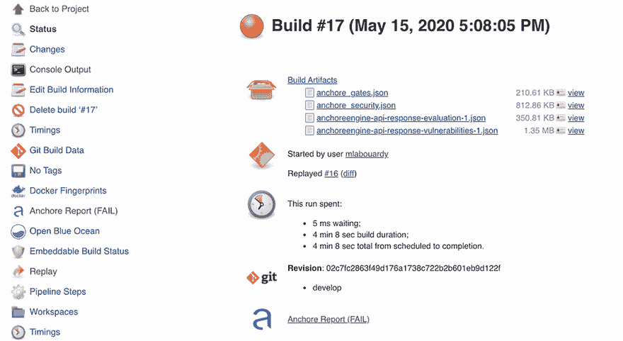

图 9.36 Anchore 报告结果

HTML 报告也会自动发布在新创建的页面上。点击 Anchore 报告链接将显示一个图形化策略报告，显示摘要信息和策略检查的详细列表；见图 9.37。

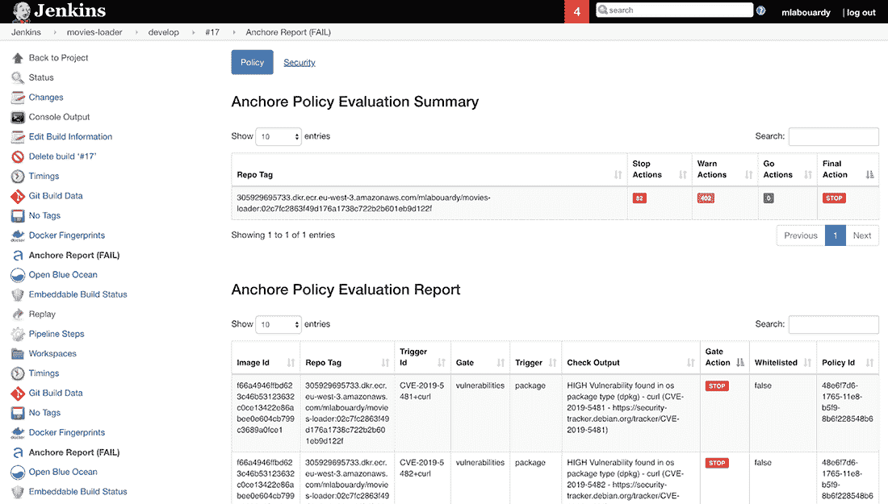

图 9.37 Anchore 常见漏洞和暴露（CVE）报告

注意：您可以根据自己的安全策略自定义 Anchore 引擎，以允许/阻止外部包、操作系统扫描等。

这就是从头开始在 Jenkins 上为 Docker 化的微服务定义持续集成管道的方法。

注意：另一种解决方案是 Aqua Trivy ([`github.com/aquasecurity/trivy`](https://github.com/aquasecurity/trivy))，这是一个免费提供的社区版。付费解决方案也可以轻松集成到 Jenkins 中，例如 Sysdig ([`sysdig.com/`](https://sysdig.com/)) 和 Aqua。

## 9.5 编写 Jenkins 声明式管道

除了前面的章节，我们由于 Groovy 语法的灵活性，使用了脚本式流水线方法来定义我们项目的 CI 流水线。本节将介绍如何使用声明式流水线方法获得相同的流水线输出。这是一个简化且友好的语法，具有用于定义它们的特定语句，无需学习或掌握 Groovy 语言。

以 movies-loader 服务的脚本式流水线为例。以下列表提供了服务的 Jenkinsfile（为了简洁而截断）。

列表 9.17 Jenkinsfile 脚本式流水线

```
node('workers'){
    stage('Checkout'){
        checkout scm
    }
    stage('Unit Tests'){
        def imageTest= docker.build("${imageName}-test".
"-f Dockerfile.test .")
        imageTest.inside{
            sh "python main_test.py"
        }
    }
    stage('Build'){
        docker.build(imageName)
    }
    stage('Push'){
        docker.withRegistry(registry, 'registry') {
            docker.image(imageName).push(commitID())

            if (env.BRANCH_NAME == 'develop') {
                docker.image(imageName).push('develop')
            }
        }
    }
}
```

通过以下步骤，可以将此脚本式流水线轻松转换为声明式版本：

1.  将`node('workers')`指令替换为`pipeline`关键字。所有有效的声明式流水线都必须包含在`pipeline`块内。

1.  在`pipeline`块内部定义一个顶级`agent`部分，以定义流水线将要执行的执行环境。在我们的例子中，执行将在 Jenkins 工作节点上进行。

1.  将`stage`块用`stages`部分包裹。`stages`部分包含 CI 流水线每个离散部分的阶段，如`Checkout`、`Test`、`Build`和`Push`。

1.  将每个给定的`stage`命令和指令用`steps`块包裹。

创建一个包含所需更改的 Jenkinsfile.declarative 文件。最终结果应如下列表所示。

列表 9.18 Jenkinsfile 声明式流水线

```
pipeline{
    agent{
        label 'workers'                              ❶
    }
    stages{
        stage('Checkout'){
            steps{
                checkout scm                         ❷
            }
        }
        stage('Unit Tests'){
            steps{                                   ❸
                script {
                    def imageTest= docker.build("${imageName}-test".
"-f Dockerfile.test .")
                    imageTest.inside{
                        sh "python test_main.py"
                    }
                }
            }                                        ❸
        }
        stage('Build'){                              ❹
            steps{
                script {
                    docker.build(imageName)
                }
            }
        }                                            ❹
        stage('Push'){                               ❺
            steps{
                script {
                    docker.withRegistry(registry, 'registry') {
                        docker.image(imageName).push(commitID())

                        if (env.BRANCH_NAME == 'develop') {
                            docker.image(imageName).push('develop')
                        }
                    }
                }
            }
        }                                            ❺
    }
}
```

❶ 定义流水线应该在哪里执行。在示例中，流水线阶段将在带有 workers 标签的代理上执行。

❷ 克隆 Jenkins 作业设置中配置的 GitHub 仓库

❸ 基于 Dockerfile.test 构建 Docker 镜像，并从镜像中部署容器以运行 Python 单元测试

❹ 从 Dockerfile 构建应用程序的 Docker 镜像

❺ 使用 Docker 远程仓库进行身份验证并将应用程序镜像推送到仓库

注意：声明式流水线也可能包含一个`post`部分来执行如通知或清理环境的后构建步骤。这部分内容在第十章中介绍。

通过更新脚本路径字段，将 Jenkins 作业配置更新为使用新的声明式流水线文件，如图 9.38 所示。

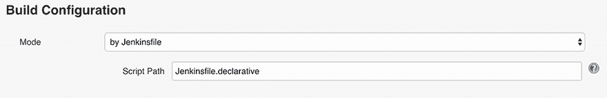

图 9.38 Jenkinsfile 路径配置。

使用以下命令将声明式流水线推送到远程仓库：

```
git add Jenkinsfile.declarative
git commit -m "pipeline with declarative approach"
git push origin develop
```

GitHub webhook 会在推送事件发生时通知 Jenkins，并执行新的声明式流水线，如图 9.39 所示。

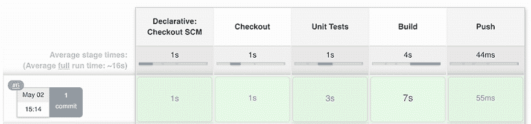

图 9.39 Jenkinsfile 声明式流水线执行。

您现在可以从该流水线中任何已运行的最高级阶段重新启动任何完成的声明式流水线。您可以通过经典 UI 中的侧面板进行运行，并如图 9.40 所示点击从阶段重启。

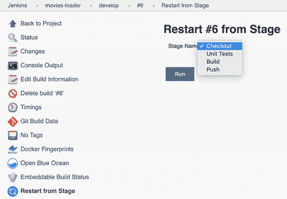

图 9.40 从阶段重启功能。

您将提示从原始运行中执行过的顶级阶段列表中选择，按照它们执行的顺序。这允许您从由于暂时性或环境考虑而失败的阶段重新运行管道。

注意：重启阶段也可以在 Blue Ocean UI 中完成，无论您的管道是成功还是失败后。

Docker 也可以在 `agent` 部分用作运行 CI/CD 管道的执行环境，如下面的列表所示。

列表 9.19 带有 Docker 代理的声明式管道

```
pipeline{
    agent{
        docker .
            image 'python:3.7.3'
        }
    }
    stages{
       stage('Checkout'){
            steps{
                checkout scm
            }
        }
        stage('Unit Tests'){
            steps{
                script {
                    sh 'python test_main.py'
                }
            }
        }
    }
}
```

如果我们尝试执行此管道，构建将迅速失败，因为管道假设任何配置的机器/实例都能够运行基于 Docker 的管道。在本例中，构建是在主机器上运行的。然而，由于此机器上未安装 Docker，管道失败了：

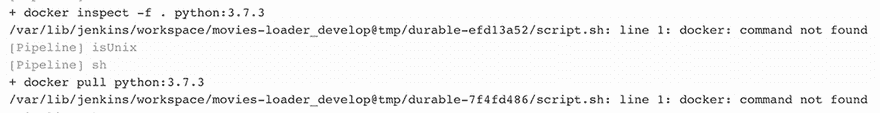

仅在 Jenkins 工作节点上运行管道时，请从 Jenkins 作业配置中更新 Pipeline 模型定义设置，并在 Docker 标签字段中设置 `workers` 标签，如图 9.41 所示。

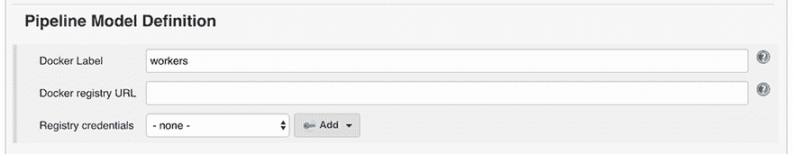

图 9.41 管道模型定义。

当管道执行时，Jenkins 将自动启动指定的容器并执行其中定义的步骤。此管道执行相同阶段和相同步骤。

## 9.6 使用 Jenkins 管理拉取请求

目前，我们直接推送到 develop 分支；然而，我们应该创建功能分支，然后创建拉取请求以运行测试并提供反馈给 GitHub，如果测试失败则阻止提交批准。让我们看看如何使用 Jenkins 为拉取请求设置审查流程。

使用以下命令从 develop 分支创建一个新的功能分支：

```
git checkout -b feature/featureA
```

进行一些更改；在本例中，我已更新了 README.md 文件。然后，提交更改并将新功能分支推送到远程仓库：

```
git add README.md
git commit -m "update readme"
git push feature/featureA
```

转到 GitHub 仓库，并创建一个新的拉取请求以合并功能分支到 develop 分支，如图 9.42 所示。

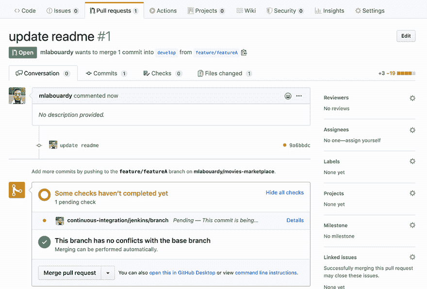

图 9.42 新的拉取请求

在 Jenkins 上，将在功能分支上触发一个新的构建，如图 9.43 所示。


图 9.43 特定分支上的构建执行

一旦 CI 完成，Jenkins 将更新 GitHub 上的状态（图 9.44）。GitHub 上的构建指示器将根据构建状态变为红色或绿色。

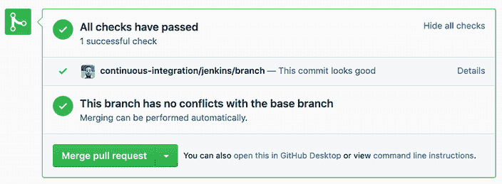

图 9.44 Jenkins 在 GitHub PR 上的构建状态

注意：您还可以配置 SonarQube 以分析拉取请求，以确保代码干净且已批准合并。

此过程允许你在每次提交时运行构建和后续的自动化测试，这样只有最好的代码才会被合并。早期发现并自动修复错误可以减少引入生产环境中的问题数量，因此你的团队能够构建更好、更高效的软件。现在我们可以合并功能分支并删除它；请参见图 9.45。

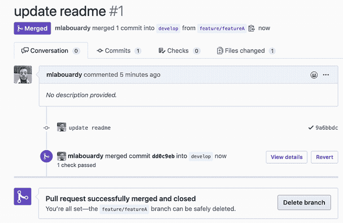

图 9.45 合并并删除功能分支。

这将触发 develop 分支上的另一个构建，这将触发 CI 阶段并将带有 `develop` 标签的镜像推送到远程 Docker 仓库。

一旦构建完成，我们可以通过点击 GitHub 仓库中的 Commits 部分，来检查之前提交的状态。根据构建的状态，应该会显示绿色、黄色或红色的勾选标记；请参见图 9.46。

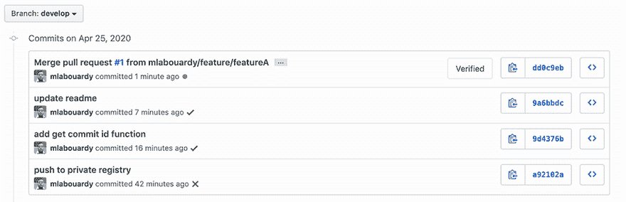

图 9.46 Jenkins 构建状态历史

最后，为了防止开发者直接向 develop 分支推送，以及在没有 Jenkins 构建通过的情况下合并，我们将创建一个新的规则来保护 develop 分支。在 GitHub 仓库设置中，转到 Branches 部分，并添加一个新保护规则，要求在合并之前 Jenkins 状态检查必须成功。图 9.47 显示了规则配置。

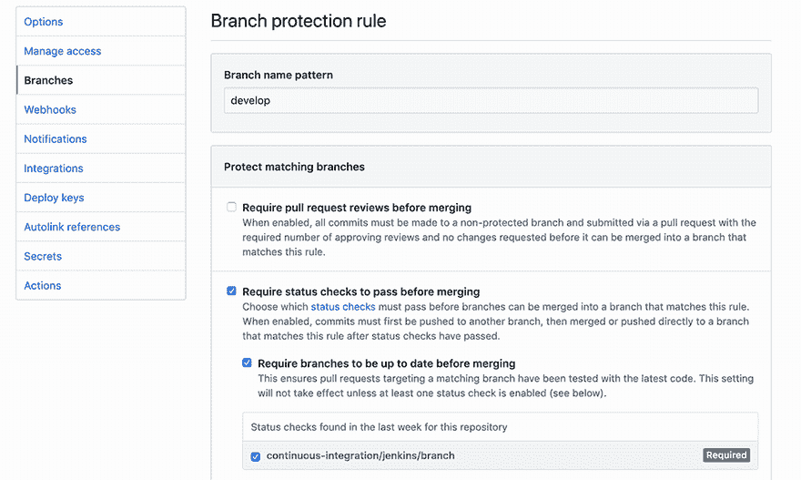

图 9.47 GitHub 分支保护

对预生产和 master 分支应用相同的规则。然后，对项目的其余 GitHub 仓库重复相同的程序。

将 Docker 镜像安全存储在私有仓库中，并将构建状态发布到 GitHub 后，我们已经完成了使用 Jenkins 多分支管道实现 Docker 化微服务的 CI 管道的实施。接下来的两章将介绍如何使用 Jenkins 实现持续部署和交付实践，针对云原生应用中最常用的两个容器编排平台：Docker Swarm 和 Kubernetes。

## 摘要

+   你可以使用 Docker 缓存层、多阶段构建功能和轻量级基础镜像（如 Alpine 基础镜像）来优化 Docker 镜像以适应生产环境。

+   提交 ID 和 Jenkins 构建 ID 可以用来对 Docker 镜像进行版本控制，并在应用程序部署失败的情况下回滚到工作版本。

+   如 Nexus 和 Artifactory 这样的二进制仓库工具可以管理和存储构建工件，以供以后使用。

+   Anchore Engine 是一个开源工具，允许你在 CI 工作流中扫描 Docker 镜像以查找安全漏洞。

+   在 CI 环境中，构建的频率太高，每次构建都会生成一个包。由于所有构建的包都在一个地方，开发者可以自由选择在更高环境中推广什么，不推广什么。
