# 11 在 K8s 上 Docker 化微服务

本章涵盖

+   使用 Terraform 在 AWS 上设置 Kubernetes 集群

+   使用 Jenkins 管道自动化 Kubernetes 上的应用程序部署

+   打包和版本化 Kubernetes Helm 图表

+   使用 Kompose 将 Compose 文件转换为 Kubernetes 清单

+   在 CI/CD 管道中运行部署后测试和健康检查

+   发现 Jenkins X 并设置无服务器 CI/CD 管道

前一章介绍了如何从头开始为在 Docker Swarm 中运行的容器化应用程序设置 CI/CD 管道（图 11.1）。本章介绍了如何在 Kubernetes（K8s）中部署相同的应用程序并自动化部署。此外，您还将学习如何使用 Jenkins X 来简化在 Kubernetes 中运行的本地区域应用程序的工作流程。

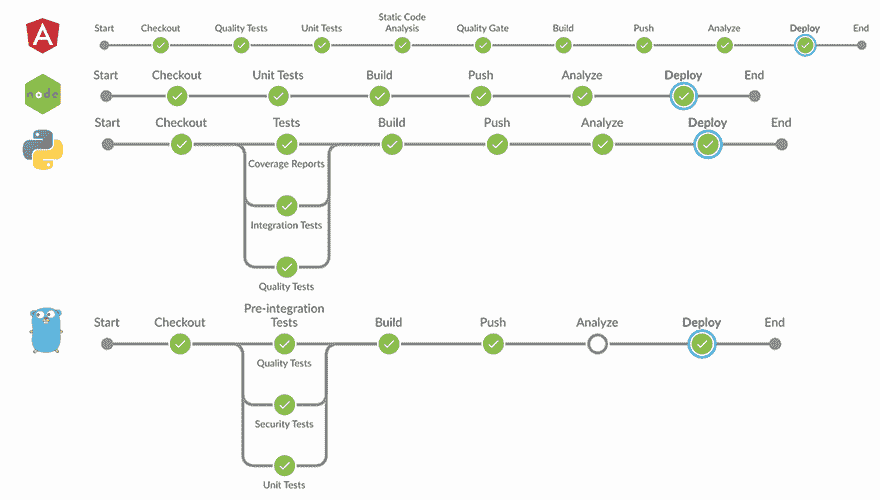

图 11.1 当前 CI/CD 管道工作流程

Docker Swarm 可能是初学者和较小工作负载的好解决方案。然而，对于大型部署和一定规模的工作负载，您可能需要考虑转向 Kubernetes。

对于那些 AWS 高级用户来说，Amazon Elastic Kubernetes Service (EKS) 是一个自然的选择。其他云服务提供商也提供托管 Kubernetes 解决方案，包括 Azure Kubernetes Service (AKS) 和 Google Kubernetes Engine (GKE)。

## 11.1 设置 Kubernetes 集群

如我所说，AWS 提供了 Amazon Elastic Kubernetes Service ([`aws.amazon.com/eks`](https://aws.amazon.com/eks))。EKS 集群将在多个私有子网中的自定义 VPC 内部署。EKS 在多个 AWS 可用区运行 Kubernetes 控制平面，以消除单点故障，如图 11.2 所示。


图 11.2 AWS EKS 架构由部署在私有子网中的节点组组成。

一些工具（包括 AWS CloudFormation、eksctl 和 kOps）允许您快速在 EKS 上启动和运行。在本章中，我们选择了 Terraform，因为我们已经在 AWS 上使用它来管理我们的 Jenkins 集群。

要开始，请为沙箱环境配置一个新的 VPC 并将其划分为两个私有子网。Amazon EKS 至少需要两个可用区的子网。VPC 是为了隔离 Kubernetes 工作负载而创建的。为了使 EKS 能够发现 VPC 子网并管理网络资源，我们使用 `kubernetes.io/cluster/<cluster-name>` 标记它们。《cluster-name》的值与 EKS 集群的名称匹配，即 `sandbox`。创建一个名为 vpc.tf 的文件，其内容如下所示。

列表 11.1 Kubernetes 自定义 VPC

```
resource "aws_vpc" "sandbox" {
  cidr_block           = var.cidr_block
  enable_dns_hostnames = true
  tags = {
    Name   = var.vpc_name
    Author = var.author
    "kubernetes.io/cluster/${var.cluster_name}" = "shared"
  }
}
```

然后，定义子网并设置适当的路由表。有关完整源代码，请参阅 chapter11/eks/vpc.tf，或返回 chapter 10 以获取在 AWS 上部署自定义 VPC 的分步指南。

接下来，我们创建一个新的 eks_masters.tf 文件，并定义 `sandbox` EKS 集群，这是一个托管的 K8s 控制平面，如下所示。

列表 11.2 EKS 沙箱集群

```
resource "aws_eks_cluster" "sandbox" {
  name            = var.cluster_name
  role_arn        = aws_iam_role.cluster_role.arn
  vpc_config {
    security_group_ids = [aws_security_group.cluster_sg.id]
    subnet_ids         = [for subnet in aws_subnet.private_subnets : subnet.id]
  }
  depends_on = [
    aws_iam_role_policy_attachment.cluster_policy,
    aws_iam_role_policy_attachment.service_policy,
  ]
}
```

管理控制平面使用具有 AmazonEKSClusterPolicy 和 AmazonEKServicePolicy 策略的 IAM 角色。这些附加项授予集群它需要自行管理的权限。

现在是时候启动一些工作节点了。节点是一个简单的 EC2 实例，它运行 Kubernetes 对象（pods、deployments、services 等）。主机的自动调度会考虑每个节点上的可用资源。在 eks_workers.tf 中定义 EKS 节点组资源，如下所示。

列表 11.3 Kubernetes 节点组资源

```
resource "aws_eks_node_group" "workers_node_group" {
  cluster_name    = aws_eks_cluster.sandbox.name
  node_group_name = "${var.cluster_name}-workers-node-group"
  node_role_arn   = aws_iam_role.worker_role.arn
  subnet_ids      = [for subnet in aws_subnet.private_subnets : subnet.id]
  scaling_config {
    desired_size = 2
    max_size     = 5
    min_size     = 2
  }
  depends_on = [
    aws_iam_role_policy_attachment.worker_node_policy,
    aws_iam_role_policy_attachment.cni_policy,
    aws_iam_role_policy_attachment.ecr_policy,
  ]
}
```

我们还创建了一个 IAM 角色，工作节点将假定该角色。我们授予 AmazonEKSWorkerNodePolicy、AmazonEKS_CNI_Policy 和 AmazonEC2ContainerRegistryReadOnly 策略。有关完整源代码，请参阅 chapter11/eks/eks_workers.tf。

注意：本节假设你熟悉通常的 Terraform 计划/应用工作流程；如果你是 Terraform 的新手，请首先参考第五章。

最后，在`variables.tf`文件中定义表 11.1 中列出的变量。

表 11.1 EKS Terraform 变量

| 变量 | 类型 | 值 | 描述 |
| --- | --- | --- | --- |
| `region` | 字符串 | None | 部署 EKS 集群的区域名称，例如`eu-central-1` |
| `shared_credentials_file` | 字符串 | `~/.aws/credentials` | 共享凭据文件的路径。如果未设置且指定了配置文件，则将使用`~/.aws/credentials`。 |
| `aws_profile` | 字符串 | `profile` | 在共享凭据文件中设置的 AWS 配置文件名称 |
| `author` | 字符串 | None | EKS 集群的所有者名称。标记你的 AWS 资源以跟踪按所有者或环境划分的月度成本是可选的，但建议这么做。 |
| `availability_zones` | 列表 | None | 启动 VPC 子网的可用区 |
| `vpc_name` | 字符串 | `sandbox` | VPC 的名称 |
| `cidr_block` | 字符串 | `10.1.0.0/16` | VPC CIDR 块 |
| cluster_name | 字符串 | `sandbox` | EKS 集群的名称 |
| public_subnets_count | 数字 | 2 | 要创建的公共子网数量 |
| `private_subnets_count` | 数字 | 2 | 要创建的私有子网数量 |

然后，执行`terraform init`命令以初始化工作目录并下载 AWS 提供者插件。在你的初始化目录中，运行`terraform plan`以审查计划中的操作。你的终端输出应指示计划正在运行以及将要创建的资源。这应包括 EKS 集群、VPC 和 IAM 角色。

如果你对执行计划感到满意，请使用`terraform apply`确认运行。此配置过程可能需要几分钟。部署成功后，将为沙箱环境部署一个新的 EKS 集群，并在 AWS EKS 控制台中可用，如图 11.3 所示。

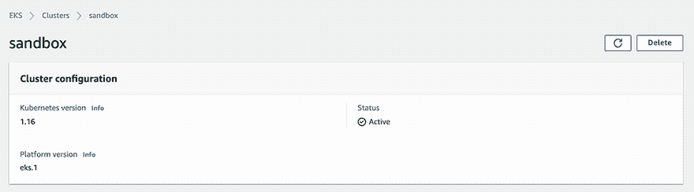

图 11.3 EKS 沙箱集群

现在您已经配置了 EKS 集群，您需要配置 kubectl。这是一个用于与集群 API 服务器通信的命令行实用程序。在撰写本书时，我使用的是版本 v1.18.3。

注意：kubectl 工具在许多操作系统包管理器中可用；有关安装说明，请参阅官方文档（[`kubernetes.io/docs/tasks/tools/`](https://kubernetes.io/docs/tasks/tools/)）。

要授予 kubectl 对 K8s API 的访问权限，我们需要生成一个 kubeconfig 文件（位于您家目录下的.kube/config）。您可以使用 AWS CLI 的`update-kubeconfig`命令创建或更新 kubeconfig 文件。运行以下命令以获取您集群的访问凭证：

```
aws eks update-kubeconfig --name sandbox --region AWS_REGION
```

要验证您的集群配置正确且正在运行，请执行以下命令。

```
kubectl get nodes
```

输出将列出集群中的所有节点以及每个节点的状态：

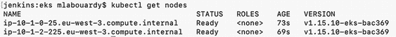

注意：为了优化 K8s 成本，您可以使用 EC2 Spot 实例，因为它们比按需实例便宜约 30-70%。然而，这需要一些特殊考虑，因为它们可能只有 2 分钟的警告就被终止。

到目前为止，您应该能够使用 Kubernetes。在下一节中，我们将按照 PaC 方法使用 Jenkins 自动化第七章中描述的 Watchlist 应用程序的部署到 K8s 集群。

## 11.2 使用 Jenkins 自动化持续部署流程

要从 Jenkins 完成 Kubernetes 部署，我们只需要 K8s 部署文件，这些文件将包含对 Docker 镜像的引用，以及配置设置（例如端口、网络名称、标签和约束）。要运行此文件，我们需要执行`kubectl apply`命令。

在 watchlist-deployment GitHub 仓库的 develop 分支上，创建一个 deployments 文件夹。在其内部，使用您喜欢的文本编辑器或 IDE 创建一个 movies-loader-deploy.yaml 文件，内容如下所示。该部署指令指导 Kubernetes 如何创建和更新 movies-loader 服务。

列表 11.4 Movie loader 部署资源

```
apiVersion: apps/v1
kind: Deployment
metadata:
  name: movies-loader
  namespace: watchlist
spec:
  selector:
    matchLabels:
      app: movies-loader
  template:
    metadata.
      labels.
        app: movies-loader
    spec:
      containers:
      - name: movies-loader
        image: ID.dkr.ecr.REGION.amazonaws.com/USER/movies-loader:develop
        env:
        - name: AWS_REGION
          value: REGION
        - name: SQS_URL
          value: https://sqs.REGION.amazonaws.com/ID/movies_to_parse_sandbox
```

注意：作为提醒，movies-loader 和 movies-store 服务分别使用 Amazon SQS 加载和消费电影条目。为了授予这些服务与 SQS 交互的权限，您需要将 AmazonSQSFullAccess 策略分配给 EKS 节点组。

movies-loader 服务可以通过部署资源部署到 Kubernetes。部署定义使用 movies-loader Docker 镜像的`develop`标签，并定义了一组环境变量，例如 SQS URL 和 AWS 区域。MongoDB 资源也可以使用以下列表中的 mongodb-deploy.yaml 文件进行部署。

列表 11.5 MongoDB 部署资源

```
apiVersion: apps/v1
kind: Deployment
metadata:
  name: mongodb
  namespace: watchlist
spec:
  selector:
    matchLabels:
      app: mongodb
  template:
    metadata.
      labels.
        app: mongodb
    spec:
      containers:
      - name: mongodb
        image: bitnami/mongodb:latest
        env:
        - name: MONGODB_USERNAME
          valueFrom:
            secretKeyRef:
              name: mongodb-access
              key: username
        - name: MONGODB_PASSWORD
          valueFrom:
            secretKeyRef:
              name: mongodb-access
              key: password
        - name: MONGODB_DATABASE
          valueFrom:
            secretKeyRef:
              name: mongodb-access
              key: database
```

这个部署定义中最有趣的部分是环境变量部分。我们不是使用硬编码的 MongoDB 凭据，而是使用 K8s 机密。我们正在创建秘密存储认证凭据，以便只有 Kubernetes 可以访问它们。

在我们创建 Kubernetes 机密之前，我们需要在 Kubernetes 集群中维护一个空间，以便我们可以查看我们用于构建和运行应用程序的 pods、服务和部署的列表。我们将使用以下命令创建一个专用命名空间来关联所有我们的 Kubernetes 对象：

```
kubectl create namespace watchlist
```

然后，在您的本地机器上执行以下 Kubernetes 命令以创建 MongoDB 凭据机密：

```
kubectl create secret generic mongodb-access --from-literal=database='watchlist' 
--from-literal=username='root.
--from-literal=password='PASSWORD' -n watchlist
```

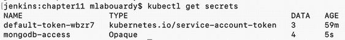

为其余服务创建部署文件：movies-store、movies-parser 和 movies-marketplace。部署文件夹结构应如下所示：

```
mongodb-deploy.yaml
movies-store-deploy.yaml
movies-loader-deploy.yaml
movies-parser-deploy.yaml
movies-marketplace-deploy.yaml
```

所有源代码都可以从 GitHub 仓库下载，位于 chapter11/deployment/kubectl/deployments 文件夹下。

要使用 Jenkins 部署应用程序，请在 watchlist-deployment 项目的顶级目录中创建一个 Jenkinsfile.eks 文件，如下所示。Jenkinsfile 将使用 `aws eks update-kubeconfig` 命令配置 kubectl。然后它发出一个 `kubectl apply` 命令来部署部署资源。`kubectl apply` 命令将部署文件夹作为参数。

列表 11.6 Jenkinsfile 部署阶段

```
def region = 'AWS REGION'                                                   ❶
def accounts = [master:'production', preprod:'staging', develop:'sandbox']

node('master'){
    stage('Checkout'){
        checkout scm
    }

    stage('Authentication'){
        sh "aws eks update-kubeconfig 
        --name ${accounts[env.BRANCH_NAME]} --region ${region}"             ❷
    }

    stage('Deploy'){
        sh 'kubectl apply -f deployments/'                                  ❸
    }
}
```

❶ 部署 EKS 集群的 AWS 区域

❷ 配置 kubectl 以连接到 Amazon EKS 集群

❸ 将新更改部署到 EKS

在将 Jenkinsfile 和部署文件推送到 Git 远程仓库之前，我们需要在 Jenkins 主机上安装 kubectl 命令行。此外，我们需要通过 IAM 角色提供对 EKS 的访问权限。为了授予 Jenkins 主机与 K8s 集群交互的权限，我们必须编辑 Kubernetes 中的 `aws-auth` ConfigMap。在您的本地机器上，运行以下命令：

```
kubectl edit -n kube-system configmap/aws-auth
```

将打开一个文本编辑器；将 Jenkins 实例的 IAM 角色添加到 `mapRoles` 部分。然后保存文件并退出文本编辑器。使用以下命令检查 ConfigMap 是否配置正确：

```
kubectl describe -n kube-system configmap/aws-auth
```

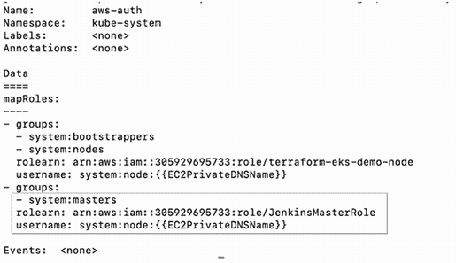

一旦配置了 ConfigMap，安装 aws-iam-authenticator，这是一个用于管理 Kubernetes 访问的 AWS IAM 凭据的工具。有关安装指南，请参阅 AWS 文档[`mng.bz/AOWW`](http://mng.bz/AOWW)。然后，使用 AWS CLI 的 `update-kubeconfig` 命令生成 kubeconfig。命令应创建一个没有警告的 /home/ec2-user/.kube/config 文件。现在我们可以发出 `kubectl get nodes` 命令：

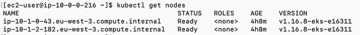

现在，我们已经准备好将 Jenkinsfile 和 Kubernetes 部署文件推送到 develop 分支下的 Git 仓库：

```
git add .
git commit -m "k8s deployment files"
git push origin develop
```

在推送 K8s 部署文件后，GitHub 仓库内容应类似于图 11.4。

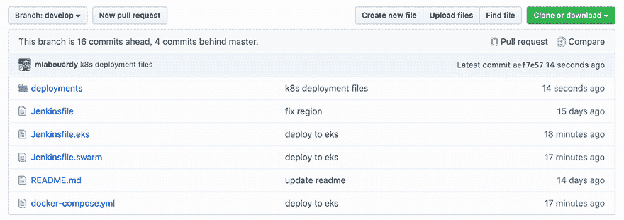

图 11.4 Git 仓库中的 Kubernetes 部署文件

一旦提交更改，我们在第 7.6 节中创建的 GitHub webhook 将在 develop 分支的嵌套作业上触发 watchlist-deployment 多分支作业的构建；见图 11.5。

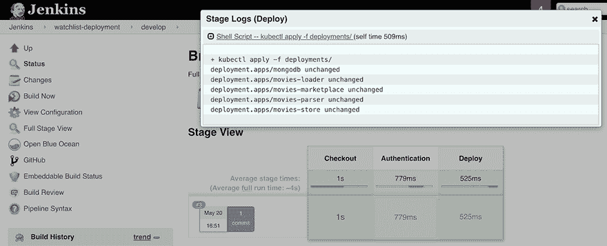

图 11.5 `kubectl apply`命令的输出。

在`Deploy`阶段，将执行`kubectl apply`命令以部署应用程序部署资源。在您的本地机器上，运行此命令以列出在沙盒 K8s 集群中运行的部署：

```
kubectl get deployments --namespace=watchlist
```

我们应用程序的四个组件（加载器、解析器、存储器和市场）将与 MongoDB 服务器一起部署：

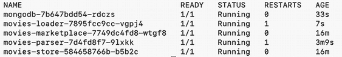

这些部署资源正在引用存储在 Amazon ECR 中的 Docker 镜像。在部署 EKS 集群时，我们已经授予 K8s 集群与 ECR 交互的权限。然而，如果您的 Docker 镜像托管在需要用户名/密码身份验证的远程仓库中，您需要使用以下命令创建一个 Docker Registry 秘密：

```
kubectl create secret docker-registry registry 
--docker-username=USERNAME
--docker-password=PASSWOR.
--namespace watchlist
```

然后，您需要在部署文件中的`spec`部分引用此秘密，如下所示：

```
spec:
  containers:
  - name: movies-loader
    image: REGISTRY_URL/USER/movies-loader:develop
  imagePullSecrets:
  - name: registry
```

我们的应用程序已部署。要访问它，我们需要为市场和服务创建 K8s 服务，如下所示列表。在根仓库中创建一个服务目录，然后创建一个名为 movies-store 的服务，称为 movies-store.svc.yaml。该服务创建一个云网络负载均衡器（例如，AWS Elastic Load Balancer）。这提供了一个外部可访问的 IP 地址，用于访问电影存储 API。

列表 11.7 电影存储服务资源

```
apiVersion: v1
kind: Service
metadata:
  name: movies-store
  namespace: watchlist
spec:
  ports:
  - port: 80
    targetPort: 3000
  selector:
    app: movies-store
  type: LoadBalancer
```

此外，我们创建另一个服务以公开电影市场（UI）。将以下列表中的内容添加到 movies-marketplace.svc.yaml 中。

列表 11.8 电影市场服务资源

```
apiVersion: v1
kind: Service
metadata:
  name: movies-marketplace
  namespace: watchlist
spec:
  ports:
  - port: 80
    targetPort: 80
  selector:
    app: movies-marketplace
  type: LoadBalancer
```

movies-store 和 movies-parser 服务将电影元数据存储在 MongoDB 服务中。因此，我们需要通过 Kubernetes 服务公开 MongoDB 部署，以允许 MongoDB 接收传入的操作。该服务暴露在集群的内部 IP 上。`ClusterIP`关键字使服务仅可在集群内部访问。由服务针对的 MongoDB pod 由`LabelSelector`确定。将以下 YAML 块添加到 mongodb-svc.yaml。

列表 11.9 电影市场服务资源

```
apiVersion: v1
kind: Service
metadata:
  name: mongodb
  namespace: watchlist
spec:
  ports:
    - port: 27017
  selector:
    app: mongodb
    tier: mongodb
  clusterIP: None
```

最后，我们将列表 11.6 中的 Jenkinsfile 更新为通过将服务文件夹作为参数提供给`kubectl apply`命令来部署 Kubernetes 服务：

```
stage('Deploy'){
        sh 'kubectl apply -f deployments/'
        sh 'kubectl apply -f services/'
}
```

将更改推送到 develop 分支。将触发新的构建，并将服务部署，如图 11.6 所示。

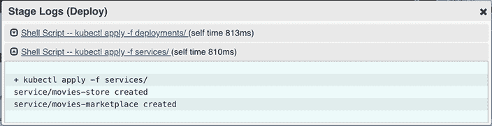

图 11.6 `kubectl apply`命令的输出

在您的本地机器上输入以下命令：

```
kubectl get svc -n watchlist
```

它应该显示三个 K8s 服务的负载均衡器：

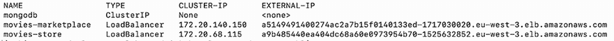

在 AWS 管理控制台中，应在 EC2 仪表板中创建两个面向公众的负载均衡器（[`mng.bz/Zx7Z`](http://mng.bz/Zx7Z)），如图 11.7 所示。

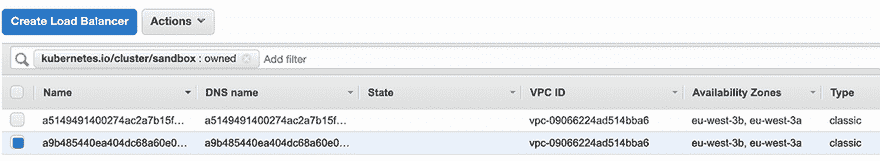

图 11.7 电影商店和市场 ELB

注意：确保在电影市场项目的 environment.sandbox.tf 文件中设置负载均衡器的 FQDN。API URL 将在构建市场 Docker 镜像时注入。有关更多详细信息，请参阅第 9.1.2 节。

要保护对商店 API 的访问，我们可以通过更新电影商店服务并应用以下列表中详细说明的更改来在公共负载均衡器上启用 HTTPS 监听器。

列表 11.10 HTTPS 监听器配置

```
apiVersion: v1
kind: Service
metadata:
  name: movies-store
  namespace: watchlist
  annotations:
    service.beta.kubernetes.io/aws-load-balancer-backend-protocol: http   ❶
    service.beta.kubernetes.io/aws-load-balancer-ssl-cert:                ❶
     arn:aws:acm:{region}:{user id}:certificate/{id}                      ❶
    service.beta.kubernetes.io/aws-load-balancer-ssl-ports: "https"       ❶
spec:
  ports:
  - name: http
    port: 80
    targetPort: 3000
  - name: https                                                           ❷
    port: 443                                                             ❷
    targetPort: 3000                                                      ❷
  selector:
    app: movies-store
  type: LoadBalancer
```

❶ 用于在监听器后面指定后端（pod）所使用的协议

❷ 公开端口 443（HTTPS）并将请求内部转发到电影商店 pod 的端口 3000

将更改推送到远程仓库。Jenkins 将部署更改并更新负载均衡器监听器配置，以在端口 443（HTTPS）上接受传入流量，如图 11.8 所示。

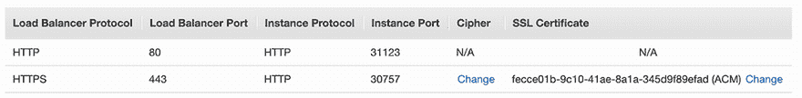

图 11.8 负载均衡器 HTTP/HTTPS 监听器

这不是必需的，但你可以在 Amazon Route 53 中创建一个指向负载均衡器 FQDN 的 A 记录，并将 environment.sandbox.ts 更新为使用友好域名而不是负载均衡器 FQDN；请参阅以下列表。

列表 11.11 市场 Angular 环境变量

```
export const environment = {
  production: false,
  apiURL: 'https://api.sandbox.domain.com',
};
```

如果你将浏览器指向市场 URL，它应该调用电影商店 API 并列出从 IMDb 页面爬取的电影，如图 11.9 所示。DNS 传播和市场出现可能需要几分钟。

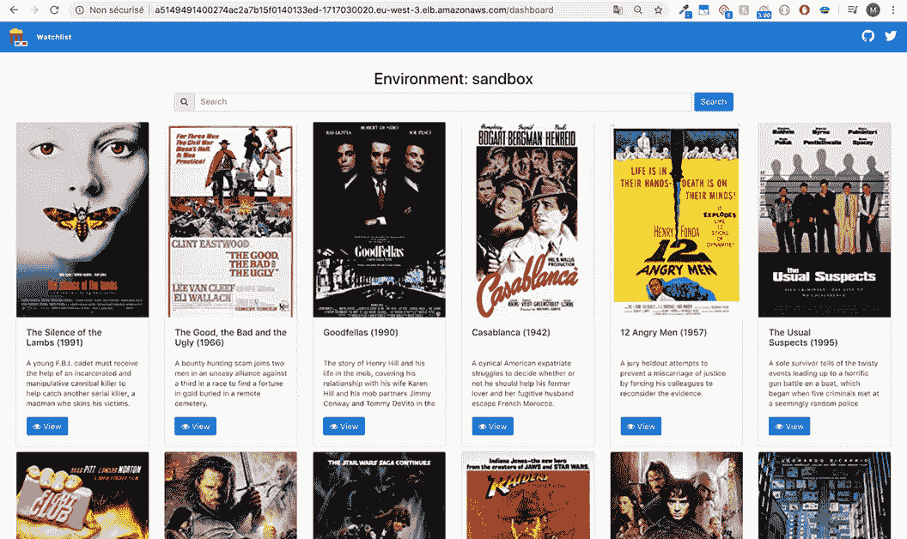

图 11.9 观看列表市场应用程序

现在，每次你更改四个微服务中的任何一个的源代码时，管道都会被触发，更改将被部署到沙盒 Kubernetes 集群中，如图 11.10 所示。

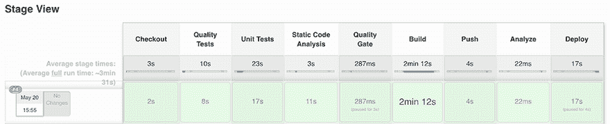

图 11.10 电影市场 CI/CD 工作流程。

最后，为了可视化我们的应用程序，我们可以在终端会话中运行以下命令来部署 Kubernetes 仪表板：

```
kubectl apply -f https://github.com/kubernetes-sigs/
metrics-server/releases/latest/download/components.yaml
kubectl apply -f https://raw.githubusercontent.com/kubernetes/
dashboard/v2.0.5/aio/deploy/recommended.yaml
```

这些命令将在 kube-system 命名空间下部署 metrics-server 和 K8s 仪表板 v2.0.5。收集来自 Kubelet 的资源指标的 metrics-server 必须在集群中运行，以便在 Kubernetes 仪表板中可用指标和图形。

要从 K8s 仪表板授予对集群资源的访问权限，我们需要创建一个 eks-admin 服务账户和集群角色绑定，以具有管理员权限安全地连接到仪表板。创建一个 eks-admin.yaml 文件，其中包含以下列表中的内容（`ClusterRoleBinding` 资源的 `apiVersion` 可能在不同版本的 Kubernetes 中有所不同）。

列表 11.12 Kubernetes 仪表板服务账户

```
apiVersion: v1
kind: ServiceAccount
metadata:
  name: eks-admin
  namespace: kube-system
---
apiVersion: rbac.authorization.k8s.io/v1beta1
kind: ClusterRoleBinding
metadata:
  name: eks-admin
roleRef:
  apiGroup: rbac.authorization.k8s.io
  kind: ClusterRole
  name: cluster-admin
subjects:
- kind: ServiceAccount
  name: eks-admin
  namespace: kube-system
```

然后，使用以下命令创建一个服务账户：

```
kubectl apply -f eks-admin.yaml
```

现在，创建一个代理服务器，它将允许你从本地机器上的浏览器导航到仪表板。这将一直运行，直到你通过按 Ctrl-C 停止进程。发出`kubectl` `proxy`命令，仪表板应该可以通过[`localhost:8001/api/v1/namespaces/kubernetes-dashboard/services/https:kubernetes-dashboard:/proxy/#/login`](http://localhost:8001/api/v1/namespaces/kubernetes-dashboard/services/https:kubernetes-dashboard:/proxy/#/login)访问。

打开此 URL 将带我们到 Kubernetes 仪表板的账户认证页面。为了访问仪表板，我们需要认证我们的账户。使用以下命令检索 eks-admin 服务账户的认证令牌：

```
kubectl -n kube-system describe secret 
$(kubectl -n kube-system get secre.
| grep eks-admi.
| awk '{print $1}')
```

现在复制令牌并将其粘贴到登录屏幕上的“输入令牌”字段。点击“登录”按钮，就这样。你现在已作为管理员登录。

Kubernetes 仪表板，如图 11.11 所示，提供了用户友好的功能来管理和调试已部署的应用程序。太棒了！你已经在 K8s 中成功构建了一个云原生应用的 CI/CD 管道。

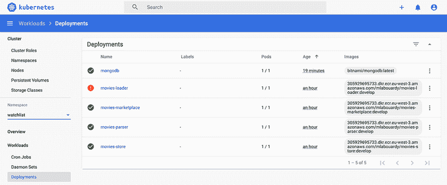

图 11.11 Kubernetes 仪表板

### 11.2.1 使用 Kompose 将 Docker Compose 迁移到 K8s 清单

创建部署文件的另一种方式是将第十章列表 10.12 中定义的 docker-compose.yml 文件转换为开源工具 Kompose。有关安装指南，请参阅项目的官方 GitHub 仓库（[`github.com/kubernetes/kompose`](https://github.com/kubernetes/kompose)）。

一旦安装了 Kompose，请对第十章提供的 docker-compose.yml 文件（chapter10/deployment/sandbox/docker-compose.yml）运行以下命令：

```
kompose convert -f docker-compose.yml
```

这应该会根据 docker-compose.yml 中指定的设置和网络拓扑创建 Kubernetes 部署和服务：

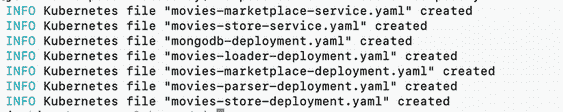

你可以将这些文件推送到远程 Git 仓库，Jenkins 将发出`kubectl` `apply` `-f`命令来部署服务和部署。

然而，为所有必需的 Kubernetes 对象编写和维护 Kubernetes YAML 清单可能是一项耗时且繁琐的任务。对于最简单的部署，你需要至少三个包含重复和硬编码值的 YAML 清单。这就是像 Helm ([`helm.sh/`](https://helm.sh/))这样的工具发挥作用来简化此过程并创建一个可以推广到你的集群的单个包的地方。

## 11.3 漫步通过持续交付步骤

Helm 是 Kubernetes 的有用包管理器。它有两个部分：客户端（CLI）和服务器（在 Helm 3 中被移除，称为 Tiller）。客户端位于你的本地机器上，服务器位于 Kubernetes 集群中以执行所需操作。

要完全掌握 Helm，你需要熟悉这三个概念。

+   *图表*——一组预配置的 Kubernetes 资源

+   *发布*—使用 Helm 部署到集群的图表的特定实例

+   *Repository*—一组已发布的图表，可以通过远程仓库提供给其他人

查看入门页面以获取有关下载和安装 Helm 的说明：[`helm.sh/docs/intro/install/`](https://helm.sh/docs/intro/install/).

注意 Helm 假设与 *n*-3 版本的 Kubernetes 兼容。请参阅 Helm 版本支持策略文档，以确定与您的 K8s 集群兼容的 Helm 版本。

在撰写本书时，正在使用 Helm v3.6.1。安装 Helm 后，在 watchlist-deployment 项目的顶级目录中创建一个名为 `watchlist` 的新图表：

```
helm create watchlist
```

这将创建一个名为 watchlist 的目录，包含以下文件和文件夹：

+   *Values.yaml*—定义了我们想要注入到 Kubernetes 模板中的所有值

+   *Chart.yaml*—可以用来描述我们正在打包的图表版本

+   *.helmignore*—类似于 .gitignore 和 .dockerignore，包含在打包 Helm 图表时排除的文件和文件夹列表

+   *templates**/*—包含实际的清单，如 Deployments、Services、ConfigMaps 和 Secrets

接下来，在模板文件夹内为每个微服务定义模板文件。模板文件描述了如何在 Kubernetes 上部署每个服务：

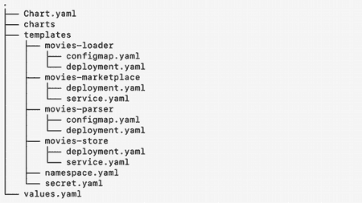

例如，movies-loader 模板文件夹使用我们在列表 11.4 中定义的相同部署文件，但它引用了在 values.yaml 中定义的变量。

deployment.yaml 文件负责根据 movies-loader Docker 镜像部署部署对象。此定义从 Docker 仓库拉取构建的 Docker 镜像，并在 Kubernetes 中创建一个新的部署；请参见以下列表。

列表 11.13 电影加载器部署

```
apiVersion: apps/v.
kind: Deploymen.
metadata.
  name: movies-loader
  namespace: {{ .Values.namespace }}
  labels.
    app: movies-loader
    tier: backen.
spec:
  selector.
    matchLabels.
      app: movies-loader
  template.
    metadata.
      name: movies-loader
      labels.
        app: movies-loader
        tier: backen.
      annotations:
        jenkins/build: {{ .Values.metadata.jenkins.buildTag | quote }}
        git/commitId: {{ .Values.metadata.git.commitId | quote }}
    spec:
      containers.
        - name: movies-loader
          image: "{{ .Values.services.registry.uri }}/
mlabouardy/movies-loader:{{ .Values.deployment.tag }}&quot.
          imagePullPolicy: Always
          envFrom:
            - configMapRef:
                name: {{ .Values.namespace }}-movies-loader
            - secretRef:
                name: {{ .Values.namespace }}-secrets
          {{- if .Values.services.registry.secret }}
          imagePullSecrets:
          - name: {{ .Values.services.registry.secret }}
          {{- end }}
```

Helm 图表使用 `{{}}` 进行模板化，这意味着其中的内容将被解释以提供输出值。我们还可以使用管道机制将两个或多个命令组合起来进行脚本编写和过滤。

movies-loader 容器引用的环境变量，如 `AWS_REGION` 和 `SQS_URL`，在 configmap.yaml 中定义，如下列表所示。

列表 11.14 电影加载器 ConfigMap

```
apiVersion: v1
kind: ConfigMap
metadata:
  name: {{ .Values.namespace }}-movies-loader
  namespace: {{ .Values.namespace }}
  labels.
    app: {{ .Values.namespace }}-movies-loader
data:
  AWS_REGION: {{ .Values.services.aws.region }}
  SQS_URL: https://sqs.{{ .Values.services.aws.region }}
.amazonaws.com/{{ .Values.services.aws.account }}/
movies_to_parse_{{ .Values.environment }}
```

部署文件还引用了敏感信息，例如 MongoDB 凭据。这些凭据存储在 Kubernetes 机密中，如下列表所示。

列表 11.15 应用程序密钥

```
apiVersion: v1
kind: Secret
metadata:
  name: {{ .Values.namespace }}-secrets
  namespace: {{ .Values.namespace }}
data:
  MONGO_URI: {{ .Values.services.mongodb.uri | b64enc }}
  MONGO_DATABASE : {{ .Values.mongodb.mongodbDatabase | b64enc }}
  MONGODB_USERNAME : {{ .Values.mongodb.mongodbUsername | b64enc }.
  MONGODB_PASSWORD : {{ .Values.mongodb.mongodbPassword | b64enc }}
```

Helm 图表使得在 values.yaml 文件中设置可覆盖的默认值变得容易，允许我们定义基本设置。我们可以将尽可能多的变量从模板移动到 values.yaml 文件中。这样，我们可以在安装时轻松更新和注入新值：

```
namespace: 'watchlist'
services:
  registry:
    uri: ''
    secret: ''
deployment:
  tag: ''
  workers:
    replicas: 2
```

这允许我们创建一个可移植的包，在运行时可以通过覆盖值进行自定义：

此外，请注意在部署文件中使用自定义注释或元数据。我们将在 Helm 图表的构建过程中注入 Jenkins 构建 ID 和 Git 提交 ID。这可以用于调试和解决正在运行的 Kubernetes 部署的问题：

```
annotations:
        jenkins/build: {{ .Values.metadata.jenkins.buildTag | quote }}
        git/commitId: {{ .Values.metadata.git.commitId | quote }}
```

MongoDB 提供了一个稳定且官方的 Helm 图表，可用于在 Kubernetes 上直接安装和配置。我们在 `Chart.yaml` 下的 `dependencies` 部分将 MongoDB 图表定义为依赖项：

```
dependencies:
  - name: mongodb
    version: 7.8.10
    repository: https://charts.bitnami.com/bitnami
    alias: mongodb
```

现在我们已经定义了图表，在你的终端会话中，输入以下命令通过我们刚刚创建的 Helm 图表安装监视列表应用程序：

```
helm install watchlist ./watchlist -f values.override.yaml
```

命令接受 `values.override.yaml` 文件，其中包含在运行时覆盖的值，例如环境名称和 MongoDB 用户名和密码：

```
environment: 'sandbox'
mongodb:
  mongodbUsername: 'watchlist'
  mongodbPassword: 'watchlist'
deployment:
  tag: 'develop'
  workers:
    replicas: 2
```

通过检查部署和 Pod 的状态来检查安装进度。输入 `kubectl get pods -n watchlist` 以显示正在运行的 Pod：

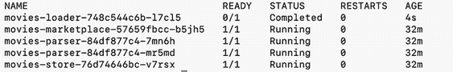

注意：要检查发布生成的清单而不安装图表，请使用 `--dry-run` 标志以返回渲染的模板。

我们现在可以更新 Jenkinsfile（chapter11/Jenkinsfile.eks），使用 Helm 命令行而不是 kubectl。由于我们的应用程序图表已经安装，我们将使用 `helm upgrade` 命令来升级图表。此命令接受覆盖的参数值，并设置来自 Jenkins 环境变量 `BUILD_TAG` 和 `commitID()` 方法的注释值，如下所示。

列表 11.16 在 Jenkins 管道中升级 Helm

```
stage('Deploy'){
        sh """
            helm upgrade --install watchlis.
./watchlist -f values.override.yaml \
                --set metadata.jenkins.buildTag=${env.BUILD_TAG} \
                --set metadata.git.commitId=${commitID()}
        """
}
```

Helm 尝试执行最不侵入性的升级。它将只更新自上次发布以来已更改的内容。

将更改推送到开发分支。GitHub 仓库应类似于图 11.12。

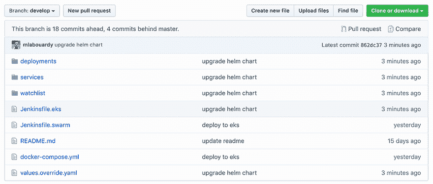

图 11.12 监视列表 Helm 图表

在 Jenkins 上，将触发一个新的构建。在 `Deploy` 阶段结束时，将执行 `helm upgrade` 命令；输出如图 11.13 所示。

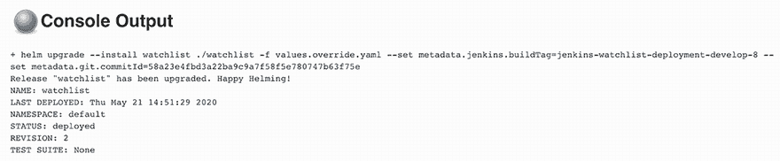

图 11.13 Helm 升级输出

现在，开发分支上的每次更改都将构建一个新的 Helm 图表并在沙盒集群上创建一个新的发布。如果 Docker 镜像已更改，Kubernetes 滚动更新提供了在 0% 停机时间内部署更改的功能。

注意：如果在发布过程中出现计划外的情况，可以使用 `helm rollback` 命令轻松回滚到之前的发布。

对于将代码提升到预发布环境，我们只需更新 `.override.yaml` 文件，将环境值设置为 `staging` 并使用 `preprod` 镜像标签，如下所示。

列表 11.17 预发布变量。

```
environment: 'staging'
mongodb:
  mongodbUsername: 'watchlist'
  mongodbPassword: 'watchlist'
deployment:
  tag: 'preprod'
  workers:
    replicas: 2
```

如果你将更改推送到预生产分支，应用程序将被部署到 Kubernetes 预发布集群，如图 11.14 所示。

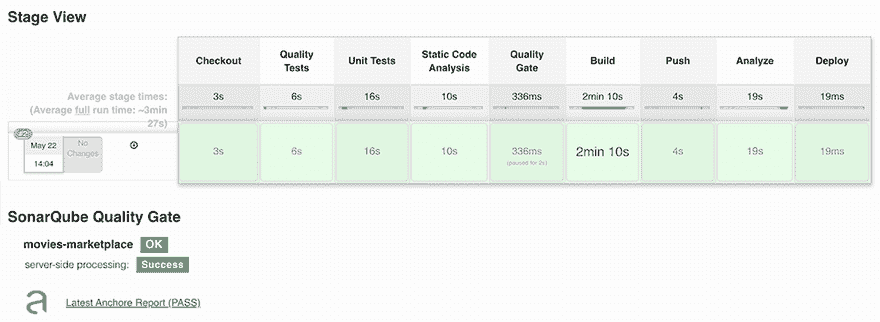

图 11.14 预生产分支上的 CI/CD 工作流程

我们可以通过输入以下命令来验证预生产版本已被部署：

```
kubectl describe deployment movies-marketplace -n watchlist
```

movies-marketplace 部署具有 git/commitId 等于触发 Jenkins 作业的 GitHub 提交 ID 的注解，jenkins/build 注解的值是触发部署的 Jenkins 作业的名称（图 11.15）。

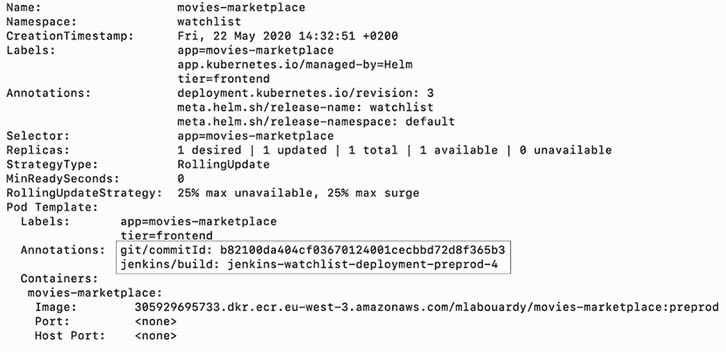

图 11.15 Movies Marketplace 部署描述

对于生产部署，使用以下列表更新 values.override.yaml 中的适当值。在此示例中，我们将镜像标签设置为`latest`，环境设置为`production`，并配置了五个 movies-parser 服务的副本。

列表 11.18 生产变量

```
environment: production
mongodb:
  mongodbUsername: 'watchlist'
  mongodbPassword: 'watchlist'
deployment:
  tag: 'latest'
  workers:
    replicas: 5
```

将新文件推送到 master 分支。在流水线结束时，堆栈将被部署到 K8s 生产集群。

现在如果在任何一个四个微服务的 master 分支上发生推送事件，CI/CD 流水线将被触发，并请求用户批准，如图 11.16 所示。


图 11.16 生产部署的用户批准

如果部署得到批准，watchlist-deployment 作业将被触发，并执行 master 嵌套作业。因此，将在生产环境中创建 watchlist 应用程序的新 Helm 发布，如图 11.17 所示。

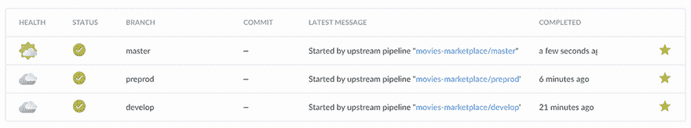

图 11.17 生产中的应用程序部署

部署过程完成后，将向预先配置的 Slack 频道发送 Slack 通知，如图 11.18 所示。

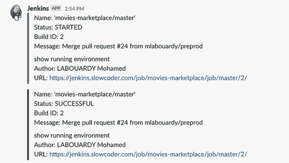

图 11.18 生产部署 Slack 通知

运行`kubectl get pods`命令。这应该会基于 movies-parser Docker 镜像显示五个 Pod：


要查看市场仪表板，在`kubectl get services -n watchlist`输出的`EXTERNAL-IP`列中找到负载均衡器的外部 IP：


在您的浏览器中导航到该地址，应该会显示 Movies Marketplace UI，如图 11.19 所示。

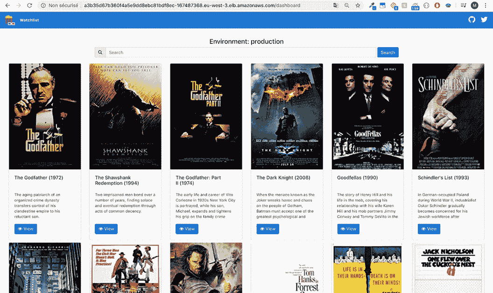

图 11.19 市场生产环境

在生产环境中，您应将负载均衡器的 FQDN 替换为 Route 53 中的别名。有关说明，请参阅官方 AWS 文档：[`mng.bz/Rq8P`](http://mng.bz/Rq8P)。

## 11.4 使用 Helm 打包 Kubernetes 应用程序

到目前为止，您已经看到了如何为基于微服务应用程序创建单个图表，以及如何在新的 Git 提交后使用 Jenkins 创建新发布。另一种打包应用程序的方法是为每个微服务创建单独的图表，然后在主图表中引用这些图表作为依赖项（类似于 MongoDB 图表）。图 11.20 说明了 Helm 图表如何在 CI/CD 流水线中打包。

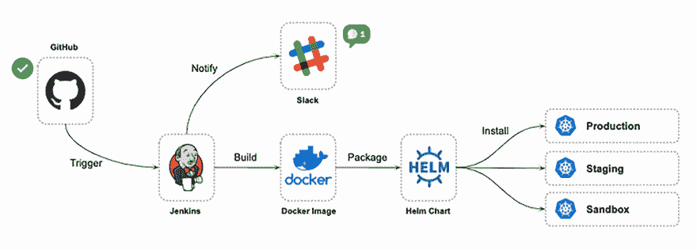

图 11.20 使用 Helm 的容器化应用程序的 CI/CD

在推送事件上，将触发 Jenkins 构建，以构建 Docker 图像并将新版本打包到 Helm 图表中。从那里，新的图表被部署到相应的 Kubernetes 环境。在此过程中，将发送 Slack 通知以通知开发者有关管道状态。

在电影市场项目上，通过输入以下命令在顶级目录中创建一个新的 Helm 图表：

```
helm create chart
```

它应该创建一个名为 chart 的新文件夹，具有以下结构：

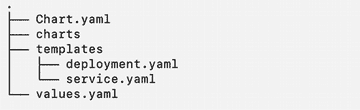

如前所述，Helm 图表由用于帮助描述应用程序、定义对所需的最小 Kubernetes 和/或 Helm 版本的约束以及管理图表版本元数据组成。所有这些元数据都位于 Chart.yaml 文件中（chapter11/microservices/movies-marketplace），如下所示。

列表 11.19 电影加载器图表

```
apiVersion: v2
name: movies-marketplace
description: UI to browse top 100 IMDb movies
type: application
version: 1.0.0
appVersion: 1.0.0
```

为了能够从主 watchlist 图表中引用此图表，我们需要将其存储在某个地方。有许多开源解决方案可用于存储 Helm 图表。GitHub 可以用作 Helm 图表的远程注册库。创建一个名为 watchlist-charts 的新 GitHub 仓库，并创建一个空的 index.yaml 文件。此文件将包含有关存储库中可用图表的元数据。

注意 Nexus Repository OSS 也支持 Helm 图表。您可以将图表发布到 Nexus 托管的 Helm 仓库。

然后，通过执行以下命令将此文件推送到主分支。

```
git clone https://github.com/mlabouardy/watchlist-charts.git
cd watchlist-charts
touch index.yaml
git add index.yaml
git commit -m "add index.yaml"
git push origin master
```

GitHub 仓库将看起来像图 11.21。

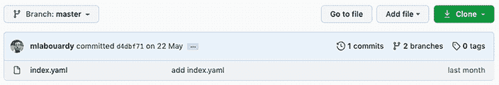

图 11.21 Helm 图表 GitHub 仓库

Helm 仓库是一个具有文件 index.yaml 和所有您的图表文件的 HTTP 服务器。为了将 GitHub 仓库变成 HTTP 服务器，我们将启用 GitHub Pages。

点击设置选项卡。向下滚动到 GitHub Pages 部分，并选择 master 分支作为源，如图 11.22 所示。

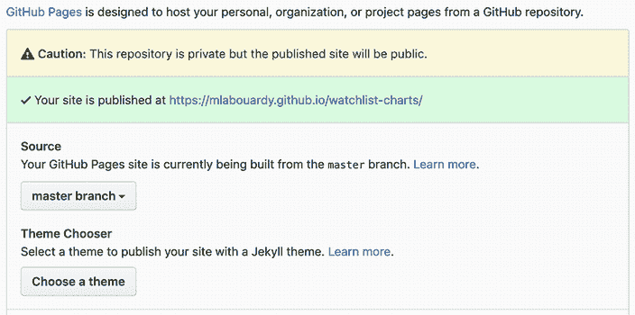

图 11.22 启用 GitHub 页面

私有 Helm 仓库准备就绪并可供使用后，让我们打包并发布我们的第一个 Helm 图表。在 movies-marketplace 项目中，更新 `Build` 阶段以使用并行构建来构建 Docker 图像和 Helm 图表。`Build` 阶段应如下所示。（完整的 Jenkinsfile 可在 chapter11/pipeline/movies-marketplace/Jenkinsfile 中找到。）

列表 11.20 构建 Docker 图像和 Helm 图表

```
stage('Build') {
 parallel(
  'Docker Image': {
   switch (env.BRANCH_NAME) {
    case 'develop':
       docker.build(imageName, '--build-arg ENVIRONMENT=sandbox .')     ❶
     break
    case 'preprod':
       docker.build(imageName, '--build-arg ENVIRONMENT=staging .')     ❶
     break
    ...
   }
  },
  'Helm Chart': {
     sh 'helm package chart'                                            ❷
  }
 )
}
```

❶ 通过注入目标环境设置构建适当的 Docker 图像

❷ 将应用程序打包到 Helm 图表中

`helm package` 命令，如其名称所示，将图表目录打包到图表存档（movies-marketplace-1.0.0.tgz）。最后，更新 `Push` 阶段以使用并行步骤，如下所示。

列表 11.21 在私有注册表中存储 Docker 图像

```
stage('Push') {
 parallel(
  'Docker Image': {
    sh "\$(aws ecr get-login --no-include-email --region ${region}) || true" ❶
    docker.withRegistry("https://${registry}") {                             ❷
        docker.image(imageName).push(commitID())                             ❷
        if (env.BRANCH_NAME == 'develop') {                                  ❷
            docker.image(imageName).push('develop')                          ❷
        }                                                                    ❷
        ...                                                                  ❷
    }                                                                        ❷
  },
  'Helm Chart': {                                                            ❸
    ...
  }
 )
}
```

❶ 通过 ECR 进行身份验证，以便之后推送 Docker 图像

❷ 标记并存储图像到 ECR

❸ 将 Helm 图表发布到 GitHub——有关完整说明，请参阅列表 11.22。

`Helm` `Chart`阶段将使用`git clone`命令克隆 watchlist-charts GitHub 仓库，并使用`helm` `repo` `index`命令将新打包的 Helm 图表的元数据添加到 index.yaml 中。然后它将 index.yaml 和存档图表推送到 Git 仓库；请参阅以下列表。

列表 11.22 将 Helm 图表发布到 GitHub

```
'Helm Chart': {
    sh 'helm repo index --url https://mlabouardy.github.io/watchlist-charts/ .' ❶
    sshagent(['github-ssh']) {                                                  ❷
      sh 'git clone git@github.com:mlabouardy/watchlist-charts.git.
      sh 'mv movies-marketplace-1.0.0.tgz watchlist-charts/'
      dir('watchlist-charts'){                                                  ❸
          sh 'git add index.yaml movies-marketplace-1.0.0.tg.
&& git commit -m "movies-marketplace&quot.
&& git push origin master'                                                      ❹
      }
     }
  }
```

❶ 根据包含打包图表的目录生成索引文件

❷ 通过 ssh-agent 为构建提供 SSH 凭据

❸ 将当前目录更改为 watchlist-charts 文件夹

❹ 将存档和索引文件提交并推送到 GitHub

如果你将新的 Jenkinsfile 推送到 Git 远程仓库，将触发一个新的流水线，如图 11.23 所示。在`构建`阶段，将打包 movies-marketplace Docker 镜像和 Helm 图表。接下来，将执行`推送`阶段，将 Docker 镜像推送到 Docker 私有仓库，将 Helm 图表推送到 GitHub 仓库。

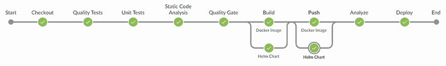

图 11.23 使用 Helm 和 Docker 的 CI/CD 工作流程

CI/CD 管道完成后，GitHub 仓库中将出现一个新的存档图表，如图 11.24 所示。

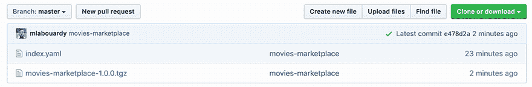

图 11.24 打包 Movies Marketplace 图表

index.yaml 文件将在`entries`部分引用新构建的 Helm 图表，如图 11.25 所示。

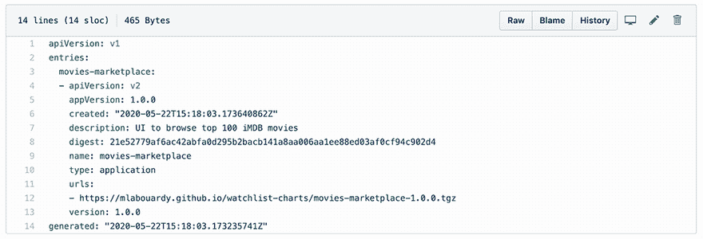

图 11.25 Helm 仓库元数据

你可以通过在打包 Helm 图表时使用`--version`标志提供新版本来覆盖 Chart.yaml 中设置的图表版本：

```
sh 'helm package chart --app-version ${appVersion} --version ${chartVersion}'
```

对其他仓库重复相同的步骤以为每个服务创建一个 Helm 图表。完成后，Helm 图表仓库应包含四个存档文件（图 11.26）。

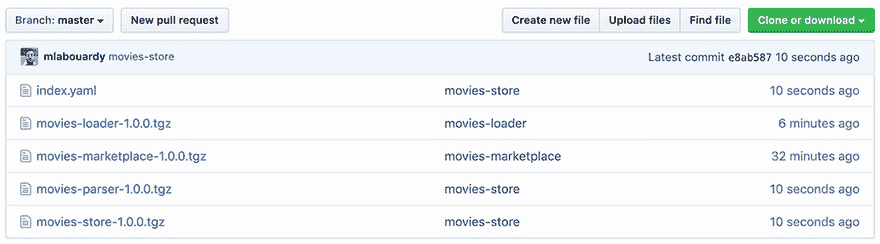

图 11.26 存储在 GitHub 仓库中的应用图表

接下来，我们配置 GitHub 仓库作为 Helm 仓库：

```
helm repo add watchlist https://mlabouardy.github.io/watchlist-charts
```

最后，我们可以在以下列表中`dependencies`部分下的 watchlist Chart.yaml 文件中引用这些图表，如下所示。

列表 11.23 观察列表应用图表

```
apiVersion: v2
name: watchlist
description: Top 100 iMDB best movies in history
type: application
version: 1.0.0
appVersion: 1.0.0
maintainers:
    - name: Mohamed Labouardy
      email: mohamed@labouardy.com
dependencies:
  - name: mongodb
    version: 7.8.10
    repository: https://charts.bitnami.com/bitnami
    alias: mongodb
  - name: movies-loader
    version: 1.0.0
    repository: https://mlabouardy.github.io/watchlist-charts
  - name: movies-parser
    version: 1.0.0
    repository: https://mlabouardy.github.io/watchlist-charts
  - name: movies-store
    version: 1.0.0
    repository: https://mlabouardy.github.io/watchlist-charts
  - name: movies-marketplace
    version: 1.0.0
    repository: https://mlabouardy.github.io/watchlist-charts
```

现在所有组件都在一起运行，我们已经检查了核心功能，让我们验证该解决方案是否适用于典型的 GitFlow 开发流程。

## 11.5 运行部署后烟雾测试

微服务已部署。但这并不意味着这些服务已正确配置并且正确执行了它们应该执行的所有任务。

你希望有一个健康检查，指示你的服务的当前健康操作。你可以通过实现一个对服务 URL 的 HTTP 请求并检查响应代码是否为 200 来设置一个简单的检查。

例如，让我们为 movies-store 服务实现一个健康检查。更新 movies-store 项目的 Jenkinsfile（chapter11/pipeline/movies-store/Jenkinsfile），添加以下列表中显示的功能。

列表 11.24 返回 API URL 的 Groovy 函数

```
def getUrl(){
    switch(env.BRANCH_NAME){
        case 'preprod':
            return 'https://api.staging.domain.com'
        case 'master':
            return 'https://api.production.domain.com'
        default:
            return 'https://api.sandbox.domain.com'
    }
}
```

该函数根据当前的 Git 分支名称返回服务 URL。最后，我们在管道的末尾添加一个 `Healthcheck` 阶段，对服务 URL 执行 cURL 命令：

```
stage('Healthcheck'){
    sh "curl -m 10 ${getUrl()}"
}
```

`-m` 标志用于设置 10 秒的超时时间，以便在检查服务健康状态之前，给 Kubernetes 足够的时间拉取最新构建的镜像并将更改部署到集群中。

一旦你将更改推送到 Git 远程仓库，就会触发一个新的构建。CI/CD 管道完成后，将执行一个 cURL 命令，对服务 URL 进行 GET 请求，如图 11.27 所示。

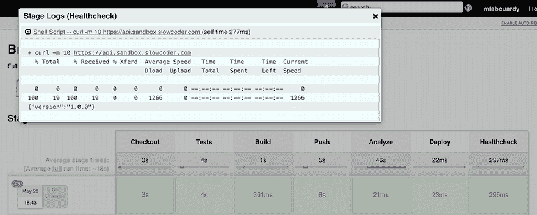


如果服务在超时时间之前响应，cURL 命令将返回成功的退出代码。否则，将抛出错误，使管道失败。

然而，如果服务正在响应，这并不意味着它运行正确，或者服务的新版本已经成功部署。

为了能够对服务 URL 发出高级 HTTP 请求，我们将从 Jenkins 插件页面安装 Jenkins HTTP 请求插件（[www.jenkins.io/doc/pipeline/steps/http_request/](https://www.jenkins.io/doc/pipeline/steps/http_request/))，如图 11.28 所示。

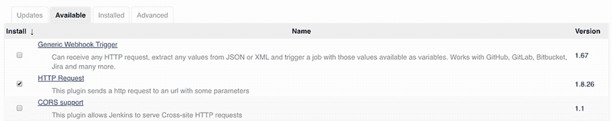

 Jenkins HTTP 请求插件

我们现在可以更新 movies-store 的 Jenkinsfile。该插件提供了一个 `httpRequest` DSL 对象，可以用来调用远程 URL。在下面的列表中，`httpRequest` 返回一个响应对象，通过 `content` 属性公开响应体。然后，我们使用 `JsonSlurper` 类将响应解析为 JSON 对象。更新的 `Healthcheck` 阶段在下面的列表中显示。

列表 11.25 电影商店健康检查阶段

```
stage('Healthcheck'){
     def response = httpRequest getUrl()
     def json = new JsonSlurper().parseText(response.content)
     def version = json.get('version')

     if version != '1.0.0' {
        error "Expected API version 1.0.0 but got ${version}"
     }
}
```

服务返回在 Kubernetes 中部署的版本号。这个值在服务源代码中是固定的，但在构建服务的 Docker 镜像时，你可以将 Jenkins 构建 ID 注入为版本号，并在 `Healthcheck` 阶段检查返回的版本是否等于 Jenkins 构建 ID。

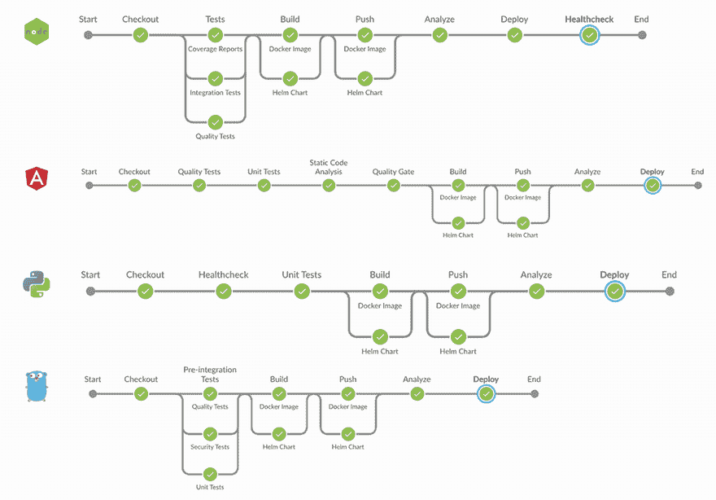 显示了在 Kubernetes 中运行的每个微服务的 CI/CD 管道的最终结果。


当你选择使用 Jenkins 来构建运行在 Kubernetes 中的云原生应用时，你需要创建大量的配置，并且需要花费相当多的时间去学习和使用所有必要的插件来实现这一目标。幸运的是，Jenkins X 出现了，它提供了简单易用的模板。

## 11.6 发现 Jenkins X

*Jenkins X* ([`jenkins-x.io/`](https://jenkins-x.io/))是 Kubernetes 上现代云应用的 CI/CD 解决方案。它用于简化配置，并让你利用 Jenkins 2.0 的力量。它还让你能够使用像 Helm、Artifact Hub、ChartMuseum、Nexus 和 Docker Registry 这样的开源工具，轻松构建云原生应用。

Jenkins X 为 Jenkins 添加了缺失的功能：对持续交付的全面支持，以及管理将项目提升到运行在 Kubernetes 中的预览、测试和生产环境的推广。它使用 GitOps 来管理部署到每个环境的 Kubernetes 资源的配置和版本。因此，每个环境都有自己的 Git 仓库，其中包含所有 Helm 图表、它们的版本以及在该环境中运行的应用程序的配置。

在遵循此方法时，Git 是基础设施代码和应用代码的唯一真相来源。所有对期望状态的变化都是 Git 提交。因此，很容易看到谁在何时进行了更改，更重要的是，如果更改导致不良后果，那么很容易回滚这些更改。

话虽如此，让我们动手实践，了解 Jenkins X 是如何工作的。要开始，请安装 Jenkins X CLI，并选择适合你操作系统的最合适说明：[`mng.bz/20ZX`](http://mng.bz/20ZX)。运行`jx` `version` `--short`以确保你使用的是最新稳定版本。我在撰写本书时使用的是版本 2.1.71。

Jenkins X 运行在 Kubernetes 集群上。如果你在主要的云服务提供商（Amazon EKS、GKE 或 AKS）上运行，Jenkins X 提供了多种创建此集群的方法：

```
jx create cluster eks --cluster-name=watchlist
Jx create cluster aks --cluster-name=watchlist
Jx create cluster gke --cluster-name=watchlist
Jx create cluster iks --cluster-name=watchlist
```

注意：你可以通过参考官方指南在现有的 EKS 集群上运行 Jenkins X，官方指南请见[`jenkins-x.io/v3/admin/setup/operator/`](https://jenkins-x.io/v3/admin/setup/operator/)。

通过在终端会话中运行以下命令，在 K8s 集群上安装 Jenkins X：

```
jx boot
```

你将需要回答一系列问题来配置安装，如图 11.30 所示。

安装完成后，你将看到有用的链接和 Jenkins X 相关服务的密码。不要忘记将其保存在某处以备将来使用。

Jenkins X 还部署了一系列支持服务，包括 Jenkins 仪表板、Docker Registry、ChartMuseum 和 Artifact Hub 来管理 Helm 图表，以及 Nexus，它作为 Maven 和 npm 仓库。

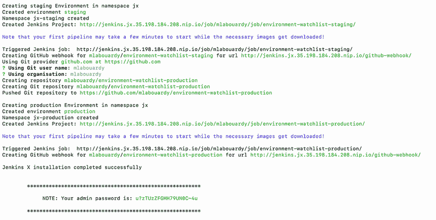

图 11.30 Jenkins X 安装输出

以下是在`kubectl` `get` `svc`命令的输出：

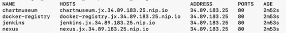

将你的浏览器指向安装过程中打印的 Jenkins URL，并使用图 11.30 中显示的管理员用户名和密码登录。图 11.31 中的仪表板应该被提供。

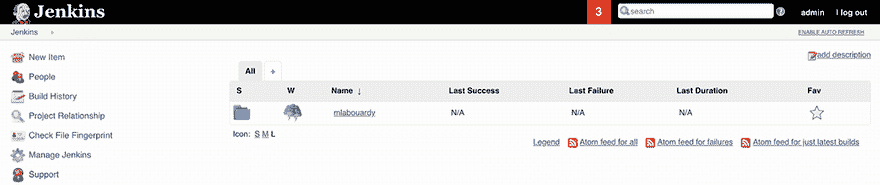

图 11.31 Jenkins 网页仪表板

在安装 Jenkins X 的同时，你可以以无服务器模式运行 Jenkins。然后，你不需要运行持续消耗 CPU 和内存资源的 Jenkins 网页仪表板，而只需在你需要时运行 Jenkins。

Jenkins X 安装还默认创建了两个 Git 仓库：一个用于你的暂存环境，一个用于生产环境，如图 11.32 所示：

+   *暂存*—在项目主分支上执行的任何合并都将自动作为新版本部署到暂存环境（自动提升）。

+   *生产*—你必须手动使用 `jx` `promote` 命令将你的暂存应用程序版本提升到生产环境。

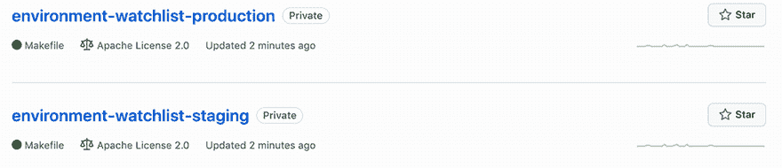

图 11.32 应用部署环境

Jenkins X 使用这些仓库来管理每个环境的部署，并且通过 Git pull 请求进行提升。每个仓库都包含一个 Helm 图表，指定要部署到相应环境的应用程序。每个仓库还有一个 Jenkinsfile 来处理提升。

现在你已经安装了 Jenkins X 的运行集群，我们将创建一个可以使用 Jenkins X 构建和部署的应用程序。为了清晰起见，我使用 Go 创建了一个 RESTful API，它提供了一个包含前 100 部 IMDb 电影的 HTTP 端点列表。我们将使用以下命令将此项目导入 Jenkins：

```
jx import
```

如果你希望导入一个已经存在于远程 Git 仓库中的项目，你可以使用 `--url` 参数：

```
jx import --url https://github.com/mlabouardy/jx-movies-store
```

以下为导入命令的输出：

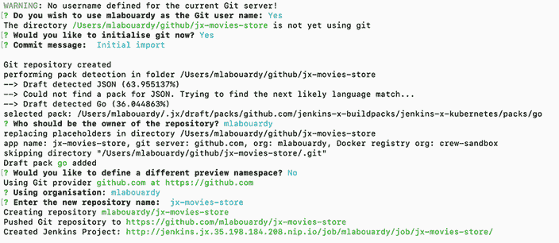

Jenkins X 将检查代码并根据项目使用的编程语言选择正确的默认构建包。我们的项目是用 Go 开发的，所以它将是一个 Go 构建包。Jenkins X 将根据项目的运行环境生成 Jenkinsfile、Dockerfile 和 Helm 图表。导入命令将在 GitHub 上创建一个远程仓库，注册一个 webhook，并将代码推送到远程仓库，如图 11.33 所示。

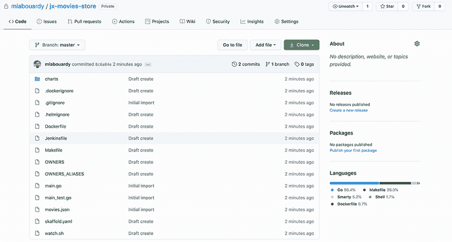

图 11.33 应用 GitHub 仓库

Jenkins X 还会自动为项目创建一个 Jenkins 多分支管道作业，并且管道将被触发。你可以使用以下命令检查管道的进度：

```
jx get activity -f jx-movies-store -w
```

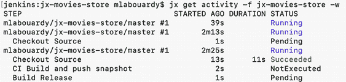

你也可以通过点击项目作业从 Jenkins 仪表板跟踪管道的进度；图 11.34 显示了结果。

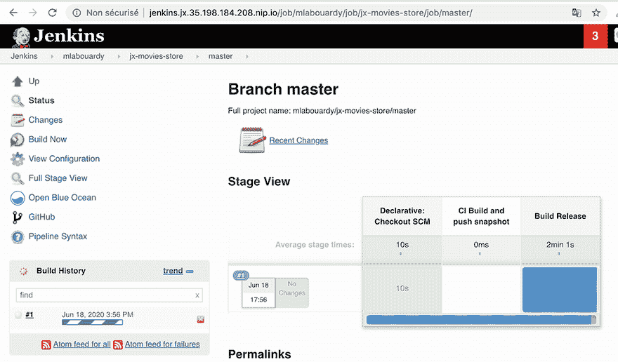

图 11.34 应用构建管道

管道阶段在我们在前面配置的 Kubernetes 集群中运行的 Kubernetes pod 上执行，如图 11.35 所示。

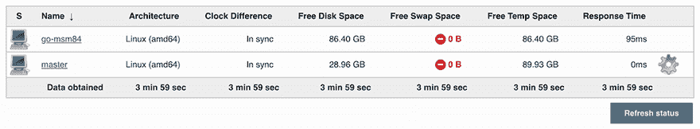

图 11.35 基于 Kubernetes pod 的 Jenkins 工作节点

执行的管道将克隆仓库，构建 Docker 镜像，并将其推送到 Docker 仓库，如下面的列表所示。

列表 11.26 主分支上发生事件时的构建阶段

```
stage('Build Release') {
      when {
        branch 'master'
      }
      steps {
        container('go') {
          dir('/home/jenkins/agent/go/src/
github.com/mlabouardy/jx-movies-store') {
            checkout scm
            sh "git checkout master"
            sh "git config --global credential.helper store"
            sh "jx step git credentials"
            sh "echo \$(jx-release-version) > VERSION"
            sh "jx step tag --version \$(cat VERSION)"
            sh "make build"
            sh "export VERSION=`cat VERSION.
&& skaffold build -f skaffold.yaml"
            sh "jx step post build --image $DOCKER_REGISTRY/$ORG/$APP_NAME:\$(cat VERSION)"
          }
        }
      }
}
```

Helm 图表将被打包并推送到 ChartMuseum 仓库，同时在项目的 GitHub 仓库中发布一个新版本，如图 11.36 所示。Jenkins X 使用语义版本控制进行标记。

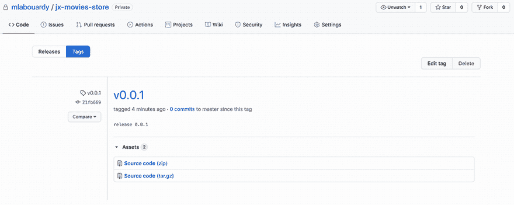

图 11.36 发布应用程序版本

版本将自动推广到预发布环境，如图 11.37 所示。

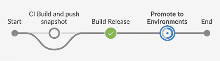

图 11.37 主分支上的 Jenkins 管道

在推广阶段，Jenkins X 将创建一个新的 PR 来将新版本部署到预发布环境。这个 PR 将在我们的 Git 仓库中的 env/requirements.yaml 文件中添加我们的应用程序及其版本，如图 11.38 所示。

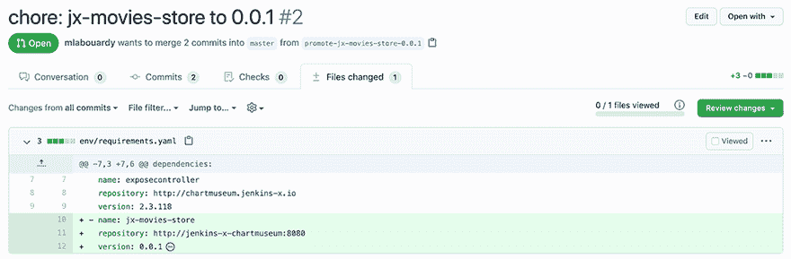

图 11.38 将应用程序推广到预发布环境

现在您可以看到，多分支 jx-movies-store 管道被触发以处理拉取请求。它将检出 PR，执行 `helm build`，并在环境中执行测试，包括代码审查和批准。成功后，它将合并 PR 到主分支，见图 11.39。

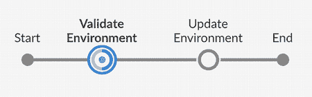

图 11.39 将应用程序部署到预发布环境

一旦应用程序部署完成，我们可以输入 `jx get applications` 来获取应用程序的访问 URL，如图 11.40 所示。

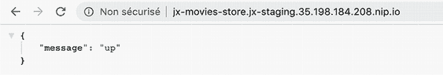

图 11.40 应用程序整体健康状况

现在我们将更新我们的应用程序并看看会发生什么！让我们创建一个新的功能分支：

```
git checkout -b feature/readme
git add README.md
git commit -m "update readme"
git push origin feature/readme
```

Jenkins X 在导入我们的应用程序期间创建了一个 GitHub webhook。这意味着我们只需提交一个更改，我们的应用程序就会自动更新，如图 11.41 所示。

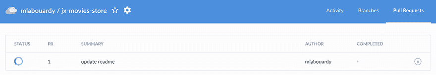

图 11.41 构建 GitHub 拉取请求

Jenkins X 在导入我们的应用程序期间创建了一个 GitHub webhook。这意味着我们只需提交一个更改，我们的应用程序就会自动更新，如图 11.41 所示。

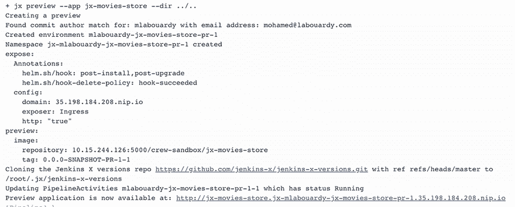

Jenkins X 为应用程序的更改创建了一个预览环境，并显示了评估新功能的链接，如图 11.42 所示。

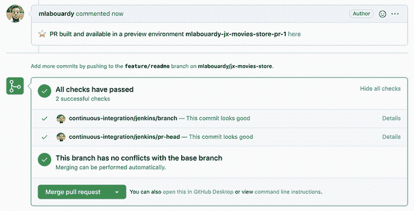

图 11.42 拉取请求预览环境

每当对仓库进行更改时，都会创建一个预览环境，允许任何相关用户验证或评估功能、错误修复或安全热修复。如果我们点击预览环境的 URL，我们应该可以访问服务 REST API，如图 11.43 所示。

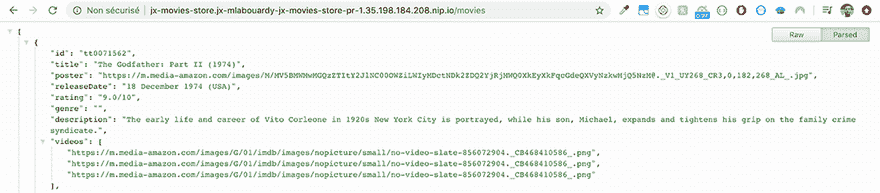

图 11.43 电影商店 API

一旦新更改得到验证，我们可以通过一个 `/approve` 注释来确认代码和功能更改，如图 11.44 所示。这个简单的注释会将代码更改合并回主分支，并在主分支上启动构建。

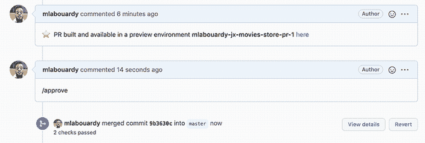

图 11.44 Git PR 中的 ChatOps 命令

Jenkins X 提供了多个在管理拉取请求时可以使用的命令。每个命令都会触发特定的操作。表 11.2 总结了最常用的命令。

在主分支构建完成后，将发布一个新的版本，如图 11.45 所示。

表 11.2 ChatOps 命令

| 命令 | 描述 |
| --- | --- |
| /`approve` | 此 PR 可以合并。此命令必须来自仓库 OWNERS 文件中的人。 |
| /`retest` | 重新运行此 PR 的任何失败的测试管道上下文。 |
| `/assign USER` | 将 PR 分配给指定的用户。 |
| /`lgtm` | 这个 PR 看起来不错。此命令可以来自任何有权访问仓库的人。 |

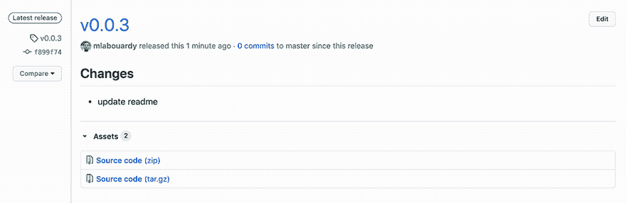

图 11.45 新应用程序发布

当您对应用程序满意时，您可以使用 `jx` CLI 通过 GitOps 方法将应用程序提升到不同的环境。例如，我们可以使用以下命令将我们的应用程序提升到生产环境：

```
jx promote --app jx-movies-store --version 0.0.3 --env production
```

将创建一个新的 PR，但这次是在我们的生产仓库中，并且触发了环境监视列表生产作业，如图 11.46 所示。

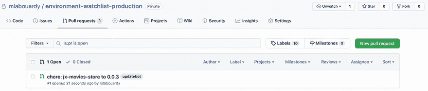

图 11.46 将应用程序提升到生产环境

一旦拉取请求得到验证，生产管道运行 Helm，部署环境，从 ChartMuseum 拉取 Helm 图表和从 Docker 仓库拉取 Docker 镜像。Kubernetes 创建项目的资源，通常是 pod、服务和 ingress。

Jenkins X 使用 Git 分支模式来确定哪些分支名称会自动设置为 CI/CD。默认情况下，主分支以及任何以 *PR-* 或 *feature* 开头的分支将被扫描。您可以使用以下命令设置自己的分支发现机制：

```
jx import --branches "develop|preprod|master|PR-.*"
```

注意：如果您完成了您的 Amazon EKS 集群，您应该删除它及其资源，以免产生额外费用。发出 `terraform destroy` 命令以删除 AWS 资源。

## 摘要

+   Kubernetes 通过帮助操作员部署、扩展、更新和维护他们的服务，并提供服务发现机制，在节点集群上管理容器化应用程序。

+   `kubectl apply` 命令可以从 Jenkins 管道中使用，以在 K8s 集群上执行部署。

+   Helm 图表封装了 Kubernetes 对象定义，并提供了一种在部署时进行配置的机制。

+   GitHub 页面内置了对从 HTTP 服务器安装 Helm 图表的支持。

+   Jenkins X 为每个启动的代理创建一个 Kubernetes 容器，由运行 Docker 镜像定义，并在每次构建后停止它。

+   Jenkins X 预览环境用于在更改合并到主分支之前对应用程序的更改获取早期反馈。

+   Jenkins X 并不旨在取代 Jenkins，而是通过最佳开源工具构建在它之上。这是一个包含电池的 CI/CD 的绝佳方式，无需组装任何东西。
