# 12 基于 Lambda 的无服务器函数

本章涵盖

+   从零开始实现基于无服务器的应用程序的 CI/CD 管道

+   使用 AWS Lambda 设置持续部署和交付

+   分离多个 Lambda 部署环境

+   使用 Lambda 别名和阶段变量实现 API 网关的多阶段部署

+   在 CI/CD 管道完成后发送带有附件的电子邮件通知

在前面的章节中，你学习了如何为在 Docker Swarm 和 Kubernetes 上运行的可容器化应用程序编写 CI/CD 管道。在本章中，你将学习如何部署使用不同架构编写的相同应用程序。

*无服务器* 是目前增长最快的架构运动。它允许开发者通过将底层基础设施的全部管理责任委托给云服务提供商，更快地开发可扩展的应用程序。然而，采用无服务器架构也带来了一些关键挑战，其中之一就是持续集成/持续部署（CI/CD）。

## 12.1 基于 Lambda 的应用程序部署

目前有多个无服务器提供商，但为了简化，我们将使用 AWS——具体来说，是 AWS Lambda ([`aws.amazon.com/lambda/`](https://aws.amazon.com/lambda/))，这是目前在无服务器领域最知名且最成熟的服务。AWS Lambda 于 2014 年 AWS re:Invent 上推出，是第一个无服务器计算的实施。用户可以将他们的代码上传到 Lambda，Lambda 然后代表用户执行操作和扩展活动。

该服务遵循事件驱动架构。这意味着部署在 Lambda 中的代码可以响应来自像 Amazon API Gateway ([`aws.amazon.com/api-gateway/`](https://aws.amazon.com/api-gateway/)) 这样的服务发出的 HTTP 请求等事件。

在进一步详细介绍如何为无服务器应用程序创建 CI/CD 管道之前，我们将查看相应的架构。图 12.1 展示了像 Amazon API Gateway、Amazon DynamoDB、Amazon S3 和 AWS Lambda 这样的无服务器服务如何融入应用程序架构。

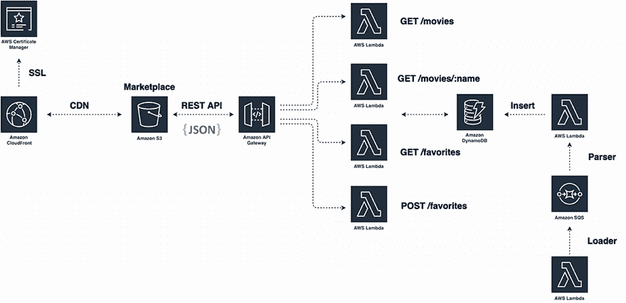

图 12.1 基于无服务器架构的 Watchlist 应用程序。每个 Lambda 函数负责单个 API 端点。端点通过 API Gateway 管理，并由托管在 S3 存储桶上的 Marketplace 服务消费。

AWS Lambda 推动了微服务开发。也就是说，每个端点都会触发不同的 Lambda 函数。这些函数彼此独立，可以用不同的语言编写。因此，这导致了函数级别的扩展、更简单的单元测试和松散耦合。所有来自客户端的请求首先通过 API Gateway。然后根据需要将传入的请求路由到正确的 Lambda 函数。这些函数是无状态的，因此 DynamoDB 就在这里发挥作用，以管理 Lambda 函数之间的数据持久性。Amazon S3 存储桶用于提供市场静态 Web 应用程序。最后，使用 Amazon CloudFront 分发（可选）从全球边缘缓存位置交付静态资产，如层叠样式表（CSS）或 JavaScript 文件。

要部署 Lambda 函数，我们需要创建一个 AWS Lambda 资源和一个 IAM 执行角色，该角色列出了 Lambda 函数在运行时可以访问的 AWS 资源。例如，Lambda 函数 `MoviesStoreListMovies` 在 DynamoDB 表上执行 `Scan` 操作以获取电影列表。因此，Lambda 执行角色应授予对 DynamoDB 表的访问权限。

为了避免代码重复并提供创建 Lambda 函数的轻量级抽象，我们将使用 Terraform 模块。*模块*是用于一起使用的一组多个资源的容器。

注意：您可以使用 Terraform 注册表 ([`registry.terraform.io/`](https://registry.terraform.io/)) 下载社区构建的经过良好测试的模块或远程发布您自己的模块。

负责创建 AWS Lambda 资源的模块位于模块文件夹（chapter12/terraform/modules）下。为每个 Lambda 函数创建一个新的 lambda.tf 文件，其中包含模块块，如下所示。模块资源通过 `source` 参数引用自定义模块，并覆盖默认变量，例如 Lambda 运行时环境和环境变量。

列表 12.1 使用 Terraform 模块创建 Lambda 函数

```
module "MoviesLoader" {
  source = "./modules/function"
  name = "MoviesLoader"
  handler = "index.handler"
  runtime = "python3.7"
  environment = {
    SQS_URL = aws_sqs_queue.queue.id
  }
}

module "MoviesParser" {
  source = "./modules/function"
  name = "MoviesParser"
  handler = "main"
  runtime = "go1.x"
  environment = {
    TABLE_NAME = aws_dynamodb_table.movies.id
  }
}

module "MoviesStoreListMovies" {
  source = "./modules/function"
  name = "MoviesStoreListMovies"
  handler = "src/movies/findAll/index.handler"
  runtime = "nodejs14.x"
  environment = {
    TABLE_NAME = aws_dynamodb_table.movies.id
  }
}

module "MoviesStoreSearchMovies" {
  source = "./modules/function"
  name = "MoviesStoreSearchMovies"
  handler = "src/movies/findOne/index.handler"
  runtime = "nodejs14.x"
  environment = {
    TABLE_NAME = aws_dynamodb_table.movies.id
  }
}

module "MoviesStoreViewFavorites" {
  source = "./modules/function"
  name = "MoviesStoreViewFavorites"
  handler = "src/favorites/findAll/index.handler"
  runtime = "nodejs14.x"
  environment = {
    TABLE_NAME = aws_dynamodb_table.favorites.id
  }
}

module "MoviesStoreAddToFavorites" {
  source = "./modules/function"
  name = "MoviesStoreAddToFavorites"
  handler = "src/favorites/insert/index.handler"
  runtime = "nodejs14.x"
  environment = {
    TABLE_NAME = aws_dynamodb_table.favorites.id
  }
}
```

此代码将基于 Python 3.7 运行时环境部署一个 `MoviesLoader` Lambda 函数，一个基于 Go 运行时的 `MoviesParser` 函数，以及一个基于 Node.js 环境的 `MoviesStoreListMovies` 函数。

接下来，我们将使用 Amazon API Gateway 部署一个 RESTful API，并定义 HTTP 端点，以便在传入的 HTTP/HTTPS 请求上触发 Lambda 函数。列表 12.2 中的 Terraform 代码在 /movies 资源上公开了一个 GET 方法。当在 /movies 端点上调用 GET 方法时，`MoviesStoreListMovies` Lambda 函数将被触发，以返回存储在 DynamoDB 表上的 IMDb 电影列表。将以下列表中的代码添加到 apigateway.tf 中。

列表 12.2 GET /movies 端点定义

```
resource "aws_api_gateway_resource" "path_movies" {
   rest_api_id = aws_api_gateway_rest_api.api.id
   parent_id   = aws_api_gateway_rest_api.api.root_resource_id
   path_part   = "movies"
}
module "GetMovies" {
  source = "./modules/method"
  api_id = aws_api_gateway_rest_api.api.id
  resource_id = aws_api_gateway_resource.path_movies.id
  method = "GET"
  lambda_arn = module.MoviesStoreListMovies.arn
  invoke_arn = module.MoviesStoreListMovies.invoke_arn
  api_execution_arn = aws_api_gateway_rest_api.api.execution_arn
}
```

注意：除了为 Lambda 函数提供统一的入口点外，API 网关还提供了强大的功能，如缓存、跨源资源共享（CORS）配置、安全和身份验证。

定义剩余的 API 端点，或者从第十二章/terraform/apigateway.tf 下载完整的 apigateway.tf 文件。

电影市场的所有内容——包括 HTML、CSS、JavaScript、图片和其他文件——将托管在 Amazon S3 存储桶中。最终用户将通过使用 Amazon S3 提供的公共网站 URL 访问应用程序。因此，我们不需要运行任何像 NGINX 或 Apache 这样的 Web 服务器来使 Web 应用程序可用。以下列表（s3.tf）中的 Terraform 代码创建了一个 S3 存储桶并启用了网站托管。

列表 12.3 S3 网站托管配置

```
resource "aws_s3_bucket" "marketplace" {
  bucket = "marketplace.${var.domain_name}"
  acl    = "public-read"
  website {
    index_document = "index.html"
    error_document = "index.html"
  }
}
```

存储桶的访问控制列表（ACL）必须设置为 `public-read`。`website` 块是我们定义应用程序索引文档的地方。此外，我们通过附加存储桶策略来授予对静态内容的访问权限。存储桶策略授予所有主体对存储桶中任何对象的 `s3:GetObject` 权限。

注意：除非您想通过 S3 存储桶 URL 访问市场，否则您可以使用 CloudFront 在 S3 上通过使用自定义域名和 SSL 提供应用程序内容。

使用 `terraform init` 命令安装本地模块，并运行 `terraform apply` 以配置 AWS 资源。创建整个基础设施可能需要几秒钟。创建步骤完成后，API 和市场 URL 将在 `输出` 部分显示，如图 12.2 所示。

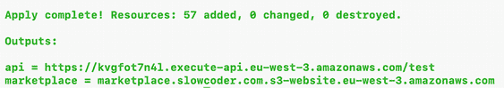

图 12.2 API 网关和 S3 网站 URL

`api` 变量包含由 API 网关提供的 RESTful API URL，而 `marketplace` 变量是市场应用程序的 S3 网站 URL。如果您访问 AWS Lambda 控制台（[`mng.bz/10Qg`](http://mng.bz/10Qg)），图 12.3 中的 Lambda 函数应该已经部署。

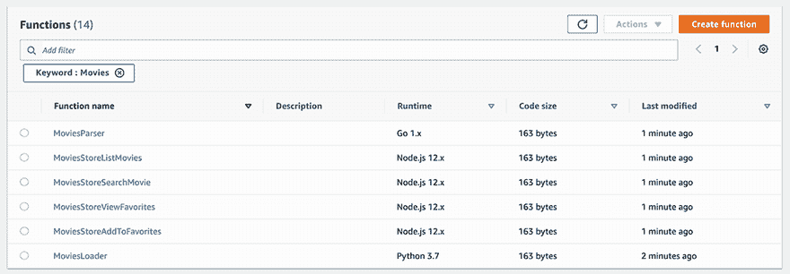

图 12.3 Watchlist 应用程序的 Lambda 函数

将您喜欢的浏览器指向 API 网关 URL，并导航到 /movies 端点。HTTP 请求应触发负责列出电影的 `MoviesStoreListMovies` Lambda 函数。图 12.4 中的错误消息将被显示。

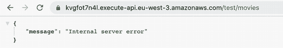

图 12.4 `MoviesStoreListMovies` HTTP 响应

目前，Lambda 函数中没有部署任何代码，所以看不到任何内容。要列出电影，我们需要将函数的代码部署到 Lambda 资源。在下一节中，我们将在 Jenkins 中创建 CI/CD 管道来自动化 Lambda 函数的部署。图 12.5 展示了目标 CI/CD 工作流程。

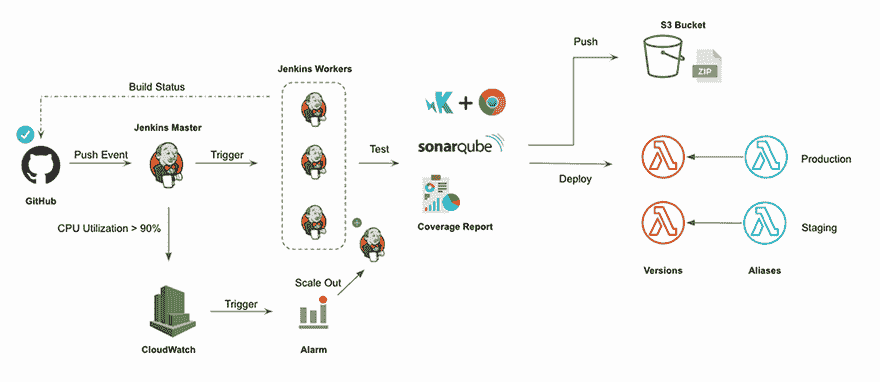


每当您对应用程序的源代码进行更改时，都会触发一个流水线。Jenkins 主节点将在可用的 Jenkins 工作节点之一上安排构建。工作节点将执行位于应用程序 Git 仓库根目录中的 Jenkinsfile 中描述的阶段。第八章中提供了 `Checkout` 和 `Tests` 阶段。`Build` 阶段将编译源代码，安装所需的依赖项，并生成部署包（zip 归档）。接下来，`Push` 阶段将 zip 文件存储在远程 S3 桶中，最后执行 `Deploy` 阶段以更新 Lambda 函数的代码，并应用最新的更改。

## 12.2 创建部署包

在将无服务器应用程序集成到 Jenkins 之前，我们需要将 Lambda 函数的源代码存储在集中式远程仓库中以便进行版本控制。对于无服务器应用程序，最常用的两种策略是将函数组织到仓库中：

+   *单仓库*—所有内容都放入同一个仓库；协同工作以提供业务功能的函数被组合在同一个仓库下。

+   *每个服务一个仓库*—每个 Lambda 函数都有自己的 Git 仓库，并拥有自己的 CI/CD 流水线。

本节不深入探讨哪种方法更好，而是展示如何使用两种方法构建 CI/CD 流水线。

### 12.2.1 单仓库策略

由单个用 Python 编写的 Lambda 函数组成的 MoviesLoader 服务，负责将电影列表加载到消息队列中。为 movies-loader Lambda 函数创建一个 GitHub 仓库，如图 12.6 所示，然后将书中仓库（chapter12/functions）中可用的源代码推送到 develop 分支。

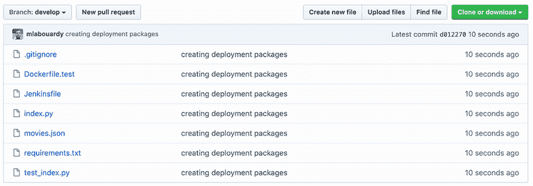

图 12.6 MoviesLoader Lambda 函数 GitHub 仓库

Jenkinsfile（位于 chapter12/functions/movies-loader/Jenkinsfile）存储在根仓库中。它与第八章的列表 8.3 提供的类似。在推送事件发生时，它将检出函数源代码，并在 Docker 容器内运行单元测试。适当的单元测试可以保护 Lambda 代码的后续更新。以下列表中显示的定义文件必须提交到 Lambda 函数的代码仓库。

列表 12.4 在 Docker 容器内运行函数单元测试

```
def imageName = 'mlabouardy/movies-loader'
node('workers'){
    try {
        stage('Checkout'){
            checkout scm
            notifySlack('STARTED')           ❶
        }
        stage('Unit Tests'){
            def imageTest= docker.build("${imageName}-test", "-f Dockerfile.test .")
            imageTest.inside{
                sh "python test_index.py"
            }
        }
    } catch(e){
        currentBuild.result = 'FAILED'       ❷
        throw e
    } finally {
        notifySlack(currentBuild.result)     ❸
    }
}
```

❶ 通过使用自定义的 notifySlack 方法在构建开始时发送 Slack 通知

❷ 当发生错误时，它将被缓存在此处，并将 currentBuild.result 变量设置为 FAILED，以便之后发送正确的 Slack 通知。

❸ 当流水线完成（成功或失败）时，将发送 Slack 通知，以引起对流水线状态的注意。

在列表 12.5 中，我们创建了一个部署包，这是一个包含 Python 代码及其运行所需的任何依赖项的 zip 文件。`构建`阶段生成一个 zip 文件，并使用 Git 提交 ID 作为名称。最后，我们将 zip 文件推送到 S3 桶中以进行版本控制，并删除文件以节省空间。

列表 12.5 生成部署包

```
def functionName = 'MoviesLoader'
def imageName = 'mlabouardy/movies-loader'
def bucket = 'deployment-packages-watchlist'                                ❶
def region = 'AWS REGION'

node('workers'){
    try {
        stage('Checkout'){...}                                              ❷

        stage('Unit Tests'){...}                                            ❸

        stage('Build'){
            sh "zip -r ${commitId}.zip index.py movies.json"                ❹
        }

        stage('Push'){
            sh "aws s3 cp ${commitId}.zip s3://${bucket}/${functionName}/"  ❺
        }
    } catch(e){
        currentBuild.result = 'FAILED'
        throw e
    } finally {
        notifySlack(currentBuild.result)
        sh "rm -rf ${commitId}.zip "                                        ❻
    }
}
```

❶ 存储部署包（zip 文件）的 S3 桶的名称

❷ 克隆 Git 仓库。为了简洁，省略了说明；请参阅第十二章/函数/movies-loader/Jenkinsfile 中的命令。

❸ 在 Docker 容器内运行单元测试。有关说明，请参阅第十二章/函数/movies-loader/Jenkinsfile。

❹ 创建一个包含函数入口点（index.py）和电影 JSON 数组的存档（zip 文件）。使用 commitId 函数根据当前的 Git 提交 ID 创建存档的唯一 ID。

❺ 将存档存储到 S3 桶中

❻ 在管道结束时删除存档以节省硬盘空间

注意：我们使用 Git 提交 ID 作为部署包的名称，为每个发布提供一个有意义的名称，并在出现问题时能够回滚到特定的提交。

在 Jenkins 上，为 `MoviesLoader` Lambda 函数创建一个新的多分支管道作业（请参阅第七章以获取逐步指南）。Jenkins 将发现 develop 分支，并开始一个新的构建；请参阅图 12.7。

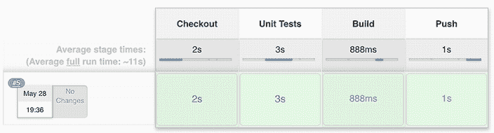

图 12.7 MoviesLoader Lambda 函数管道

您可以深入查看 UI 上的步骤，这些步骤与 Jenkinsfile 中的步骤相匹配。当 Jenkins 执行每个阶段时，您可以看到活动。您可以看到作为 `单元` `测试` 阶段一部分运行的测试（图 12.8）。如果测试成功，将生成一个 zip 文件并将其存储在 S3 桶中。

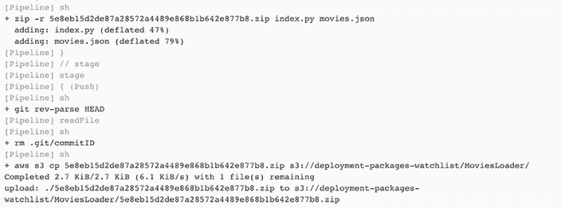

图 12.8 管道执行日志

打开 S3 控制台并单击用于包存储的管道使用的桶。应有一个新的部署包可用，其键名与 Git 提交 ID 相同，如图 12.9 所示。

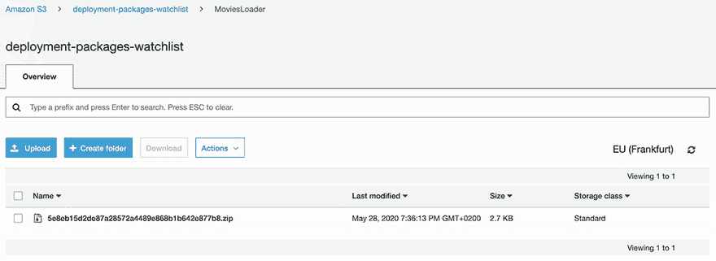

图 12.9 部署包存储的 S3 桶

对于 movies-parser 函数，同样将函数源代码推送到一个专门的 GitHub 仓库，如图 12.10 所示。

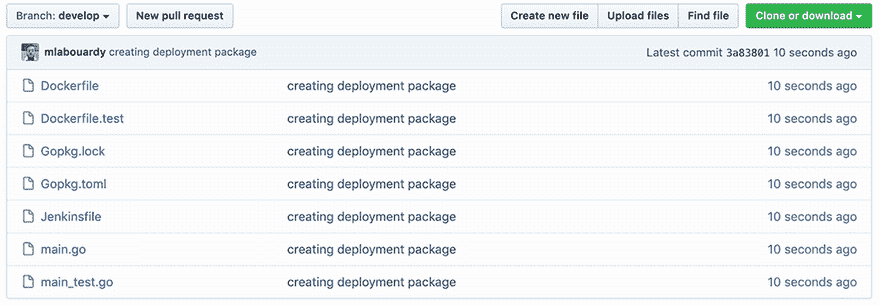

图 12.10 MoviesParser Lambda 函数 GitHub 仓库

在 Git 仓库的顶级目录中创建一个 Jenkinsfile（chapter12/functions/movies-parser/Jenkinsfile），其阶段与第八章的列表 8.8 类似；请参阅以下列表。

列表 12.6 并行运行函数预集成测试

```
def imageName = 'mlabouardy/movies-parser'

node('workers'){
    try{
        stage('Checkout'){
            checkout scm
        }

        def imageTest= docker.build("${imageName}-test".
"-f Dockerfile.test .")
        stage('Pre-integration Tests'){
            parallel(
                'Quality Tests': {
                    imageTest.inside{
                        sh 'golint'
                    }
                },
                'Unit Tests': {
                    imageTest.inside{
                        sh 'go test'
                    }
                },
                'Security Tests': {
                    imageTest.inside('-u root:root'){
                       sh 'nancy /go/src/github/mlabouardy/
movies-parser/Gopkg.lock'
                    }
                }
            )
        }
    } catch(e){
        currentBuild.result = 'FAILED'
        throw e
    } finally {
        notifySlack(currentBuild.result)
    }
}
```

由于该函数是用 Go 编写的，因此我们需要使用 Docker 多阶段构建功能构建一个二进制文件，如第 9.2 节所述。然后，从 Docker 容器中复制构建的二进制文件并生成一个 zip 包。最后，将部署包推送到 S3 桶中，如下所示。

列表 12.7 构建 Go 基础 Lambda 部署包

```
def functionName = 'MoviesParser'
def imageName = 'mlabouardy/movies-parser'
def region = 'eu-west-3'

node('workers'){
    try{
     stage('Checkout'){...}                  ❶
     stage('Pre-integration Tests'){...}     ❶

     stage('Build'){
       sh """
        docker build -t ${imageName} .
        docker run --rm ${imageName}
        docker cp ${imageName}:/go/src/github.com/mlabouardy/
movies-parser/main main
        zip -r ${commitID()}.zip main
       """
      }

      stage('Push'){
        sh "aws s3 cp ${commitID()}.zip s3://${bucket}/${functionName}/"
      }
    } catch(e){
        currentBuild.result = 'FAILED'
        throw e
    } finally {
        notifySlack(currentBuild.result)
        sh "rm ${commitID()}.zip"
    }
}
```

❶ 请参考列表 12.6 中的说明。

将更改推送到 movies-parser Git 仓库，并为 movies-parser 创建一个新的多分支管道作业。管道阶段应该被执行。完成后，管道在 Blue Ocean 视图中应类似于图 12.11。

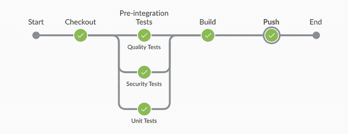

图 12.11 MoviesParser Lambda 函数工作流程

图 12.12 显示了 `Push` 阶段的控制台输出。函数部署包将被存储在 MoviesParser 子文件夹下。

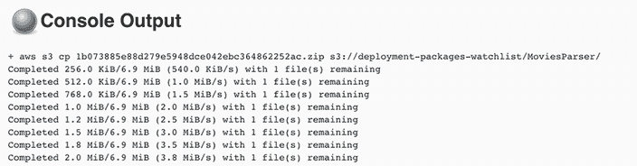

图 12.12 将部署包发布到 S3

多仓库模式的明显对应模式是单仓库方法。在这种模式中，单个仓库包含按业务能力分组的 Lambda 函数集合。

### 12.2.2 多仓库策略

Movies Store API 被拆分为多个 Lambda 函数（`MoviesStoreListMovies`、`MoviesStoreSearchMovie`、`MoviesStoreViewFavorites`、`MoviesStoreAddToFavorites`）。在这些函数之间共享代码的最简单方法是让它们都在单个仓库中。创建一个新的 GitHub 仓库（chapter12/functions/movies-store），如图 12.13 所示。

根目录下的 src/ 文件夹由一系列服务组成。每个服务处理相对较小且自包含的函数。例如，movies/findAll 文件夹负责从 DynamoDB 表中提供电影列表。package.json 文件位于仓库的根目录。然而，在服务目录中有一个单独的 package.json 是相当常见的。

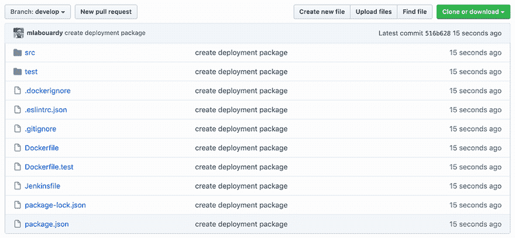

图 12.13 单个仓库中存储的多个 Lambda 函数

在 movies-store 仓库中，使用您喜欢的文本编辑器或 IDE 创建一个 Jenkinsfile（chapter12/functions/movies-store/Jenkinsfile），内容如下一列表所示。有关实现阶段的更多详细信息，请参考列表 8.14。

列表 12.8 运行质量测试和生成代码覆盖率报告

```
def imageName = 'mlabouardy/movies-store'
node('workers'){
    try {
        stage('Checkout'){
            checkout scm
            notifySlack('STARTED')
        }

        def imageTest= docker.build("${imageName}-test".
"-f Dockerfile.test .")

        stage('Tests'){
            parallel(
                'Quality Tests': {
                    sh "docker run --rm ${imageName}-test npm run lint"
                },
                'Unit Tests': {
                    sh "docker run --rm ${imageName}-test npm run test"
                },
                'Coverage Reports': {
                    sh "docker run --r.
-v $PWD/coverage:/app/coverage ${imageName}-tes.
npm run coverage"
                    publishHTML (target: [
                        allowMissing: false,
                        alwaysLinkToLastBuild: false,
                        keepAll: true,
                        reportDir: "$PWD/coverage",
                        reportFiles: "index.html",
                        reportName: "Coverage Report"
                    ])
                }
            )
        }
    } catch(e){
        currentBuild.result = 'FAILED'
        throw e
    } finally {
        notifySlack(currentBuild.result)
    }
}
```

接下来，我们从 Node.js 基础镜像运行 Docker 容器，通过执行 `npm install` 命令来安装外部依赖。然后，我们将运行容器中的 node_modules 文件夹复制到当前工作区，并创建一个 zip 文件，如下一列表所示。部署包的大小将影响函数的冷启动。为了保持部署包的大小较小，我们通过将 `--prod=only` 传递给 `npm install` 命令，只安装运行时依赖。

列表 12.9 构建 Node.js 基础 Lambda 部署包

```
stage('Build'){
    sh """
      docker build -t ${imageName} .
      containerName=\$(docker run -d ${imageName})
      docker cp \$containerName:/app/node_modules node_modules
      docker rm -f \$containerName
      zip -r ${commitID()}.zip node_modules src
    """
}
```

注意：动态预配的一个缺点是称为 *冷启动* 的现象。本质上，一段时间内未使用的函数启动和响应第一个请求需要更长的时间。

然后，在以下列表中，我们将生成的 zip 文件推送到 S3 桶，使用循环遍历每个函数名称，并将 zip 文件保存在 S3 桶下的函数文件夹中。您可以使用 Serverless 框架（[www.serverless.com](http://www.serverless.com)）为每个函数创建一个 zip 文件，并排除未使用的依赖项和文件。

列表 12.10 将 Node.js 部署包发布到 S3

```
def functions = ['MoviesStoreListMovies'.
'MoviesStoreSearchMovie'.
'MoviesStoreSearchMovie'.
'MoviesStoreAddToFavorites']
def bucket = 'deployment-packages-watchlist'

node('workers'){
    try {
        stage('Checkout'){...}
        stage('Tests'){...}
        stage('Build'){...}
        stage('Push'){
            functions.each { function ->
                sh "aws s3 cp ${commitID()}.zip s3://${bucket}/${function}/"
            }
        }
    } catch(e){
        currentBuild.result = 'FAILED'
        throw e
    } finally {
        notifySlack(currentBuild.result)
        sh "rm --rf ${commitID()}.zip"
    }
}
```

返回 Jenkins 仪表板，为 movies-store 项目创建一个新的多分支管道作业，并将更改提交到 develop 分支。几秒钟后，应该会在 develop 分支的 movies-store 作业上触发一个新的构建。在结果页面上，您将看到 develop 分支管道的阶段视图，如图 12.14 所示。

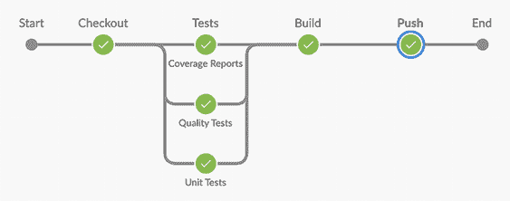

图 12.14 MoviesStore Lambda 函数 CI 工作流程

对于常见情况，构建和推送阶段可能会占用 CI/CD 执行时间的大部分。因此，我们可以使用以下列表中的 `parallel` 键，以并行运行推送阶段，以保持管道周转时间短。

列表 12.11 带有映射结构的并行指令

```
stage('Push'){
    def fileName = commitID()                                       ❶
    def parallelStagesMap = functions.collectEntries {              ❷
      ["${it}" : {                                                  ❷
         stage("Lambda: ${it}") {                                   ❷
           sh "aws s3 cp ${fileName}.zip s3://${bucket}/${it}/"     ❷
         }                                                          ❷
      }]                                                            ❷
    }                                                               ❷
    parallel parallelStagesMap                                      ❸
}
```

❶ 将存档的名称设置为 Git 提交 ID

❷ 并行指令期望一个映射结构，因此我们正在构建一个。我们遍历函数列表，并创建相应的命令将存档文件存储到适当的 S3 文件夹中。

❸ 并行运行阶段

`parallel` 指令接受一个字符串和闭包的映射。字符串是并行执行的显示名称（函数名称），闭包是实际的 `aws` `s3` `cp` 指令，用于将部署包复制到 S3 中相应的函数文件夹。因此，每个函数的部署包存储将并行运行，如图 12.15 所示。

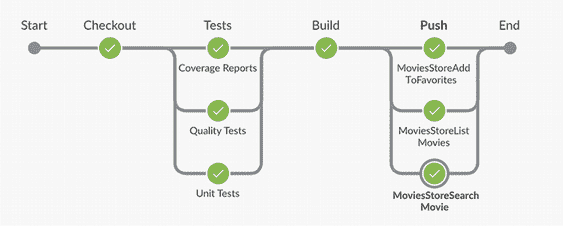

图 12.15 MoviesStore CI 工作流程

一旦管道执行完成，在 S3 桶中，应该为每个 Lambda 函数存储一个部署包，如图 12.16 所示。

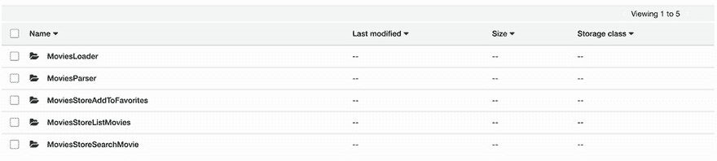

图 12.16 Lambda 函数部署包

到目前为止，部署包已存储在 S3 桶中，因此我们可以继续更新 Lambda 函数的源代码，使用构建的 zip 文件。

## 12.3 更新 Lambda 函数代码

对于 `MoviesLoader` 和 `MoviesParser` Lambda 函数，将以下 `Deploy` 阶段添加到它们的 Jenkinsfile 中（第十二章/函数/movies-loader/Jenkinsfile 和第十二章/函数/movies-parser/Jenkinsfile）。该阶段使用 AWS Lambda CLI 发出 `update-function-code` 命令来更新函数代码，该代码存储在之前 S3 桶中，如下列表所示。

列表 12.12 使用 AWS CLI 更新 Lambda 函数的代码

```
stage('Deploy'){
  sh "aws lambda update-function-code --function-name ${functionName.
          --s3-bucket ${bucket} --s3-key ${functionName}/${commitID()}.zi.
          --region ${region}"
}
```

该命令将作为参数接受存储 zip 文件的 S3 桶的名称以及部署包的 Amazon S3 密钥。

一旦将更改推送到 Git 远程仓库，Jenkins 将使用`update-function-code`命令更新 Lambda 函数的代码。图 12.17 中的输出确认了这一点。

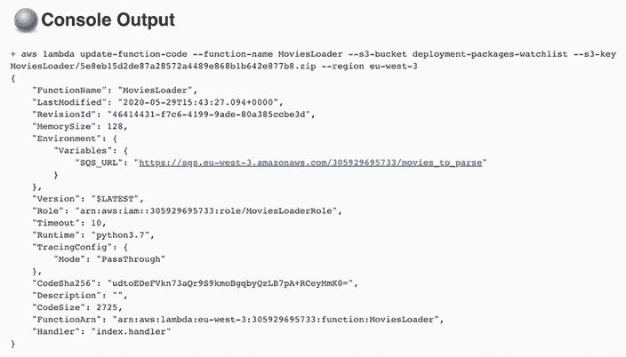

图 12.17 `UpdateFunction-Code`操作日志

`MoviesLoader`和`MoviesParser`函数的 CI/CD 流水线应包含图 12.18 中显示的阶段。

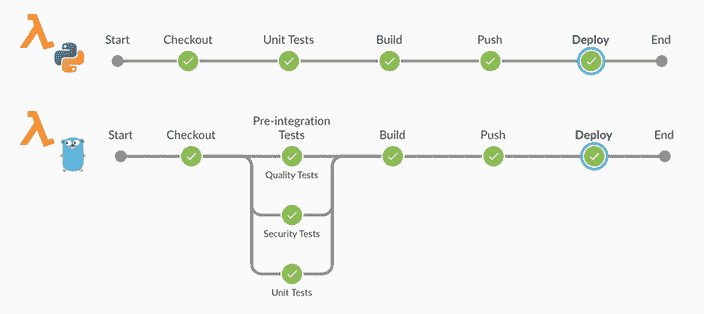

图 12.18 基于 Python 和 Go 的 Lambda 函数 CI/CD 流水线

注意：Serverless 框架([`serverless.com/`](https://serverless.com/))或 AWS Serverless 应用程序模型(SAM)也可以用于在 Jenkins 流水线中编写和部署 Lambda 函数。

类似地，将相同的阶段添加到`MoviesStore` Lambda 函数中——这次，我们将使用`for`循环将`update-function-code`命令包装在同一个 GitHub 仓库内的每个函数版本中；请参阅以下列表。

列表 12.13 更新多个 Lambda 函数

```
stage('Deploy'){
  functions.each { function ->
    sh "aws lambda update-function-cod.
--function-name ${function.
--s3-bucket ${bucket.
--s3-key ${function}/${commitID()}.zi.
--region ${region}"
  }
}
```

当新阶段被提交时，在推送事件触发后，流水线将被触发，图 12.19 中的 CI/CD 阶段将被执行。

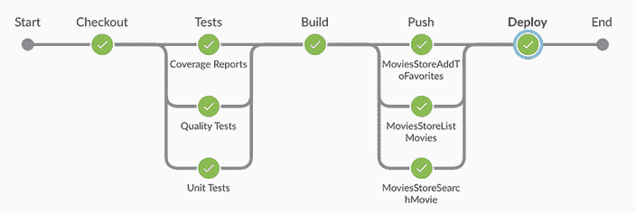

图 12.19 MoviesStore CI/CD 流水线

在我们自动化部署市场之前，我们需要将一些数据加载到 DynamoDB 表中。从 AWS 管理控制台触发`MoviesLoader`函数，或者从您的终端会话中执行以下命令：

```
aws lambda invoke --function-name MoviesLoader --payload '{}' response.json
```

注意：确保将`AWSLambda_FullAccess`策略分配给配置了您的 AWS CLI 的 IAM 用户。

之前的命令将调用`MoviesLoader`函数并将函数的输出保存到 response.json 文件中。该函数将电影加载到 SQS 并触发`MoviesParser` Lambda 函数，该函数将爬取电影的 IMDb 页面并将信息存储在图 12.20 所示的 Movies DynamoDB 表中。

图 12.20。

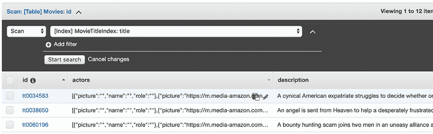

图 12.20 Movies DynamoDB 表

SQS 中的每条消息都会调用`MoviesParser`函数；一旦队列变空，DynamoDB 表应包含前 100 部 IMDb 电影。

## 12.4 在 S3 上托管静态网站

电影市场是一个单页应用程序(SPA)，使用 TypeScript 编写，采用 Angular 框架。该应用程序提供静态内容（HTML、JavaScript 和 CSS 文件），这对于 S3 网站托管功能来说可能是一个不错的选择。

让我们自动化将市场部署到 S3 存储桶，如下所示。首先，创建一个 GitHub 项目以版本控制市场源代码。然后，编写一个 Jenkinsfile 以运行质量、单元测试和静态代码分析，使用 SonarQube。有关更多详细信息，请参阅第八章。

列表 12.14 将 Angular 应用程序与 Jenkinsfile 集成

```
def imageName = 'mlabouardy/movies-marketplace'
def region = 'AWS REGION'

node('workers'){
    try{
        stage('Checkout'){
            checkout scm
            notifySlack('STARTED')
        }

        def imageTest= docker.build("${imageName}-test".
"-f Dockerfile.test .")                                             ❶
        stage('Quality Tests'){
            sh "docker run --rm ${imageName}-test npm run lint"     ❷
        }
        stage('Unit Tests'){
            sh "docker run --r.
-v $PWD/coverage:/app/coverag.
${imageName}-test npm run test"                                     ❸
            publishHTML (target: [                                  ❹
                allowMissing: false,                                ❹
                alwaysLinkToLastBuild: false,                       ❹
                keepAll: true,                                      ❹
                reportDir: "$PWD/coverage/marketplace",             ❹
                reportFiles: "index.html",                          ❹
                reportName: "Coverage Report"                       ❹
            ])                                                      ❹
        }
        stage('Static Code Analysis'){
            withSonarQubeEnv('sonarqube') {                         ❺
                sh 'sonar-scanner'                                  ❺
            }                                                       ❺
        }
        stage("Quality Gate"){
            timeout(time: 5, unit: 'MINUTES') {                     ❻
                def qg = waitForQualityGate()                       ❻
                if (qg.status != 'OK') {                            ❻
                    error "Pipeline aborted due to                  ❻
quality gate failure: ${qg.status}"                                 ❻
                }                                                   ❻
            }                                                       ❻
        }
    } catch(e){
        currentBuild.result = 'FAILED'
        throw e
    } finally {
        notifySlack(currentBuild.result)
    }
}
```

❶ 基于 Dockerfile.test 构建 Docker 镜像以运行自动化测试

❷ 运行代码检查过程

❸ 运行单元测试并生成覆盖率报告

❹ 使用 Jenkins Publish HTML 插件消费覆盖率报告

❺ 使用 SonarQube 运行代码质量检查

❻ 如果 SonarQube 检查超过 5 分钟，则中断检查

添加一个 `Build` 阶段来创建一个 Docker 容器，安装 npm 依赖项，并将依赖项文件夹以及生成的静态 Web 应用程序文件复制到当前工作区，如下所示。注意使用 `--build-arg` 参数在构建时注入 API 网关 URL。

列表 12.15 构建 Angular 应用程序

```
stage('Build'){
            sh """
                docker build -t ${imageName} --build-arg ENVIRONMENT=sandbox .
                containerName=\$(docker run -d ${imageName})
                docker cp \$containerName:/app/dist dist
                docker rm -f \$containerName
            """
 }
```

然后，在以下列表中，使用 AWS CLI 将生成的静态 Web 应用程序推送到启用了网站托管功能的 S3 存储桶。

列表 12.16 将 Angular 静态应用程序存储到 S3

```
stage('Push'){
    sh "aws s3 cp --recursive dist/ s3://${bucket}/"     ❶
}
```

❶ 递归地将本地文件复制到 S3

将更改推送到 develop 分支。应该触发一个新的管道，并且图 12.21 中的阶段将成功执行。

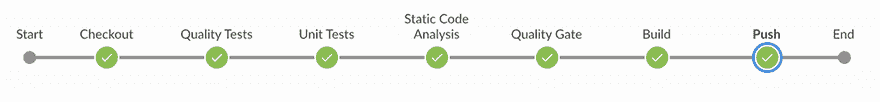

图 12.21 市场 CI/CD 工作流程

你可以通过 Amazon S3 存储桶仪表板验证文件是否已成功存储，或者通过在终端会话中运行 `aws s3 ls` 命令。图 12.22 显示了市场 S3 存储桶的内容。

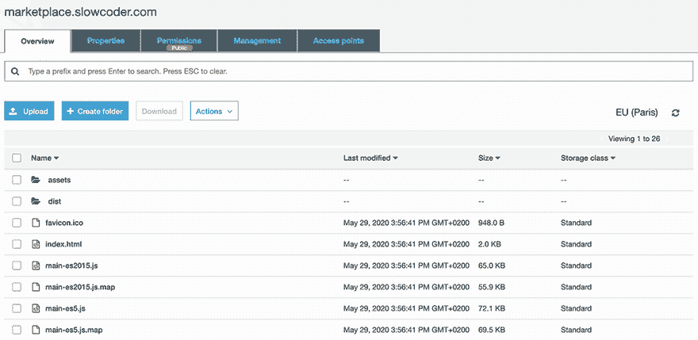

图 12.22 市场 S3 存储桶内容

如果你访问 S3 网站 URL（http://BUCKET.s3-website-REGION.amazonaws.com/），它应该显示市场 UI，如图 12.23 所示。

那太好了！然而，当你构建无服务器应用程序时，你必须将部署环境分开，以测试新更改而不影响生产。因此，在构建无服务器应用程序时拥有多个环境是有意义的。

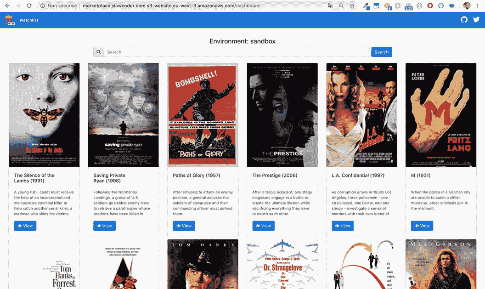

图 12.23 在沙盒环境中运行的 Marketplace 仪表板

## 12.5 维护多个 Lambda 环境

AWS Lambda 允许你发布一个版本，它代表了函数代码和配置在时间上的状态。默认情况下，每个 Lambda 函数都有一个 `$LATEST` 版本，指向部署到函数的最新更改。

从 `$LATEST` 版本发布新版本时，需要更新 Jenkinsfile（chapter12/functions/movies-loader/Jenkinsfile），添加一个新阶段以发布新的 Lambda 函数版本，如下所示。

列表 12.17 发布新的 Lambda 版本

```
stage('Deploy'){
   sh "aws lambda update-function-code --function-name ${functionName}
           --s3-bucket ${bucket} --s3-key ${functionName}/${commitID()}.zip
           --region ${region}"

   sh "aws lambda publish-version --function-name ${functionName.
           --description ${commitID()} --region ${region}"
}
```

当你发布 Lambda 函数的新版本时，你应该给它一个有意义的版本名称，这样你就可以通过其开发周期跟踪对函数所做的不同更改。在列表 12.17 中，我们使用 Git 提交 ID 作为版本方案。然而，你可以使用更高级的版本机制，如语义版本化([`semver.org/`](https://semver.org/))。

当管道执行时，在 `Deploy` 阶段将执行前面的命令。图 12.24 展示了它们的执行日志。

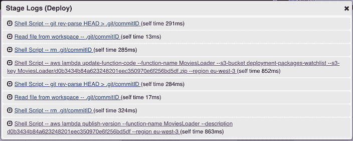

图 12.24 在部署阶段执行的更新和发布命令

注意版本是不可变的：一旦创建，就无法更新它们的代码或设置（内存、执行时间、VPC 配置等）。

在 MoviesLoader Lambda 仪表板上，将基于 develop 分支的源代码发布新版本，如图 12.25 所示。

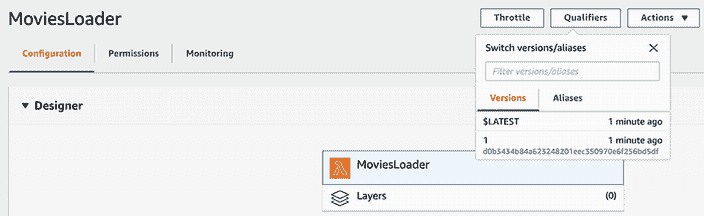

图 12.25 MoviesLoader Lambda 新发布的版本

将 MoviesStore API 的 Lambda 版本发布并行进行，以减少管道的执行时间；见图 12.26。

因此，您可以在开发工作流程中与 Lambda 函数的不同变体一起工作。

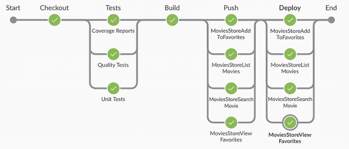

图 12.26 并行运行发布命令

目前，API Gateway 根据 `$LATEST` 版本触发 `MoviesStore` Lambda 函数，因此每次发布新版本时，都需要更新 API Gateway 以指向最新版本（图 12.27）——这是一个繁琐且不方便的任务。

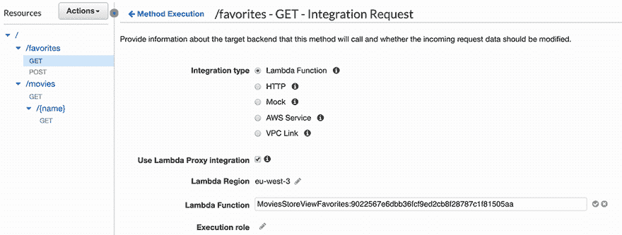

图 12.27 GET /favorites 集成请求

幸运的是，有 *Lambda 别名* 的概念。别名是一个指向特定版本的指针，允许您将函数从一个环境提升到另一个环境（例如从预发布到生产）。与不可变的版本不同，别名是可变的。现在，您不再需要在 API Gateway 集成请求中直接分配 Lambda 函数版本，而是可以分配 Lambda 别名，其中别名是一个变量。该变量将在运行时解析其值。

也就是说，使用 AWS 命令行创建指向最新发布的版本的沙盒、预发布和生产环境的别名：

```
aws lambda create-alias --function-name MoviesStoreViewFavorites --name sandbox    --version 1
```

一旦创建，新的别名应添加到“Qualifiers”下拉列表下的“别名”列表中（图 12.28）。

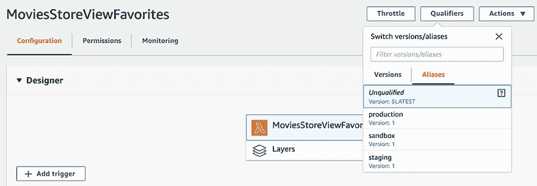

图 12.28 使用多个别名引用不同的环境

我们可以更新 Jenkinsfile 以直接更新别名。更新 `Deploy` 阶段，使用下一列表中的代码。它更新 Lambda 函数代码，发布新版本，并将对应于当前 Git 分支的别名（master 分支 = 生产别名，preprod 分支 = 预发布别名，develop 分支 = 沙盒别名）指向新部署的版本。

列表 12.18 更新 Lambda 别名为指向最新版本

```
sh "aws lambda update-function-code --function-name ${it}
        --s3-bucket ${bucket} --s3-key ${it}/${fileName}.zip
        --region ${region}"

def version = sh(
    script: "aws lambda publish-version --function-name ${it}
                 --description ${fileName}
--region ${region} | jq -r '.Version'",
    returnStdout: true
).trim()

if (env.BRANCH_NAME in ['master','preprod','develop']){
    sh "aws lambda update-alias  --function-name ${it}
            --name ${environments[env.BRANCH_NAME]}
--function-version ${version}
            --region ${region}"
}
```

`publish-version` 操作返回包含已部署版本号作为属性的 JSON 输出。使用 `jq` 命令解析 `Version` 属性并将其值存储在 `version` 变量中。然后，根据当前的 Git 分支，相应的别名将指向发布的版本号。

将更改推送到 develop 分支。函数代码将被更新，将创建一个新版本，并且沙盒别名将指向最新发布的版本，如图 12.29 所示。

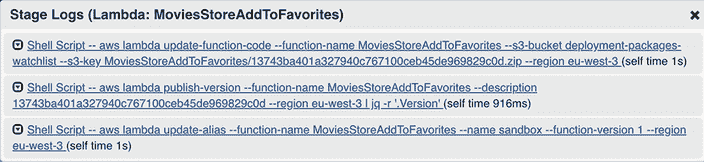

图 12.29 更新 Lambda 别名为已部署版本

例如，在`MoviesStoreListMovies` Lambda 中，沙箱别名应指向包含 develop 分支源代码的版本，如图 12.30 所示。

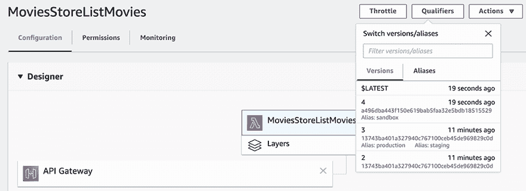

图 12.30 沙箱别名指向新的 Lambda 版本

现在你已经看到了如何在 Jenkins 管道中创建别名并切换其值，让我们配置 API Gateway 以使用这些别名和阶段变量。

*阶段变量*是环境变量，可以在 API Gateway 的每个部署阶段的运行时更改方法的行为。

在 API Gateway 控制台中，导航到 Movies API，单击实例的 GET 方法，并将目标 Lambda 函数更新为使用阶段变量而不是硬编码的 Lambda 函数版本，如图 12.31 所示。

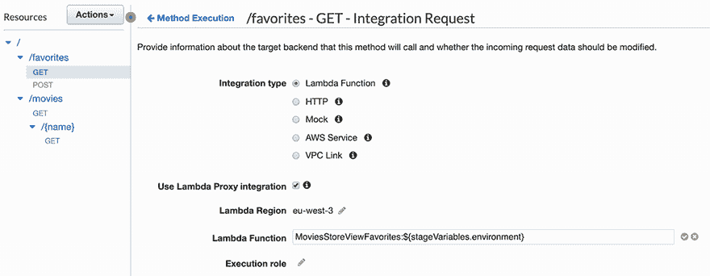

图 12.31 配置 API 集成请求时使用阶段变量

在 Lambda 函数字段中，`${stageVariables.environment}`告诉 API Gateway 在运行时从阶段变量中读取此字段的值。

当你保存配置时，会出现一个新的提示，要求你授权 API Gateway 调用你的 Lambda 函数别名。此时，我们需要部署我们的 API 以使其公开可用。

从操作下拉菜单中选择部署 API。选择“新建部署阶段”选项，输入`sandbox`作为阶段名称，并部署它。或者使用列表 12.19 中的 Terraform 代码。沙箱阶段将设置环境阶段变量为`sandbox`。因此，如果用户在沙箱部署的任何端点上发起 HTTP 请求，将触发具有沙箱别名的相应 Lambda 函数。

列表 12.19 使用别名阶段变量进行 API 部署

```
resource "aws_api_gateway_deployment" "sandbox" {
   depends_on = [
     module.GetMovies,
     module.GetOneMovie,
     module.GetFavorites,
     module.PostFavorites
   ]

   variables = {
    "environment" = "sandbox"
  }

   rest_api_id = aws_api_gateway_rest_api.api.id
   stage_name  = "sandbox"
}
```

为预发布和生产环境创建额外的部署阶段。在完成`terraform apply`命令后，将显示三个部署阶段 URL，如图 12.32 所示。

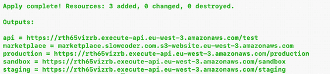

图 12.32 API Gateway 部署 URL

如果你打开 API 在 https://id.execute-api.region.amazonaws.com/sandbox/movies，你将获得 Lambda `MoviesStoreListMovies`的别名`sandbox`的响应。

要将无服务器应用程序部署到预发布环境，创建一个合并 develop 分支到 preprod 分支的 pull request。Jenkins 将在 PR 上发布 develop 作业的构建状态（图 12.33）。然后，将 develop 合并到 preprod。

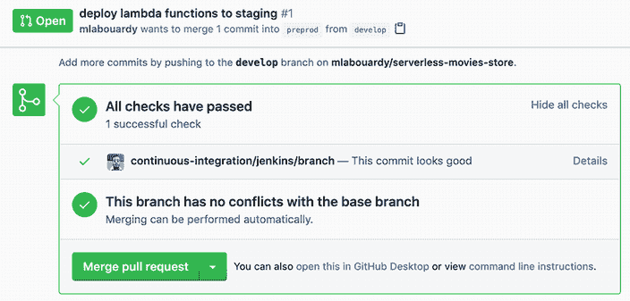

图 12.33 Jenkins 在 GitHub PR 上的构建状态

一旦 PR 合并，preprod 分支将触发新的构建。在 CI/CD 管道的末尾，预发布别名将指向新部署的版本，如图 12.34 所示。

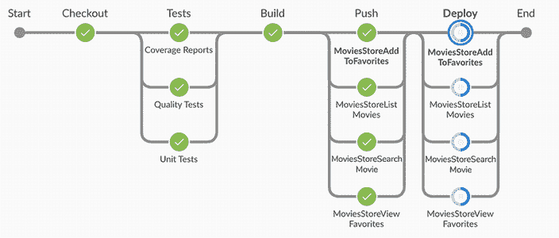

图 12.34 将 Lambda 函数部署到预发布环境

现在，为了在多个环境中部署市场，我们将根据当前分支名称注入环境名称；请参阅以下列表。

列表 12.20 在构建过程中注入环境名称

```
stage('Build'){
  sh """
     docker build -t ${imageName}
--build-arg ENVIRONMENT=${environments[env.BRANCH_NAME]} .
     containerName=\$(docker run -d ${imageName})
     docker cp \$containerName:/app/dist dist
     docker rm -f \$containerName
  """
}
```

然后，在列表 12.21 中，我们将 `aws s3 cp` 指令更新为将静态文件推送到 S3 桶下以环境名称命名的文件夹。您也可以为每个环境创建一个 S3 桶，但为了简单起见，我们使用单个 S3 来存储市场 place 的不同环境。

列表 12.21 将静态文件推送到 S3 桶

```
if (env.BRANCH_NAME in ['master','preprod','develop']){
  stage('Push'){
   sh "aws s3 cp --recursive dist/ s3://${bucket}/${environments[env.BRANCH_NAME]}/"
  }
}
```

将这些更改推送到功能分支。然后发起一个拉取请求以合并到 develop 分支。当合并发生时，图 12.35 中的新管道将被执行。

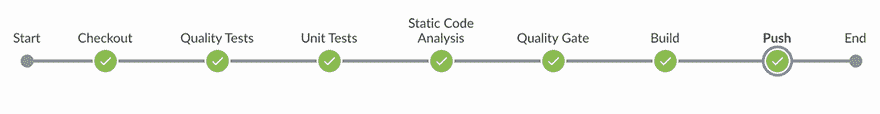

图 12.35 市场 place 新 CI/CD 管道

将更改合并到 preprod 以将应用程序部署到阶段。然后，从 preprod 合并到 master 分支以进行生产部署。结果，S3 桶应包含三个文件夹。每个文件夹包含市场 place 的不同运行环境，如图 12.36 所示。

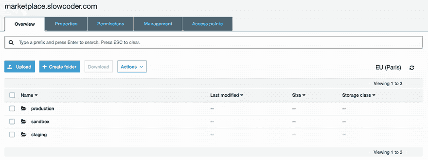

图 12.36 具有多个环境的 S3 桶

如果您指向 S3 桶的网站 URL 并添加 /staging 端点，它应提供市场 place 的阶段环境，如图 12.37 所示。

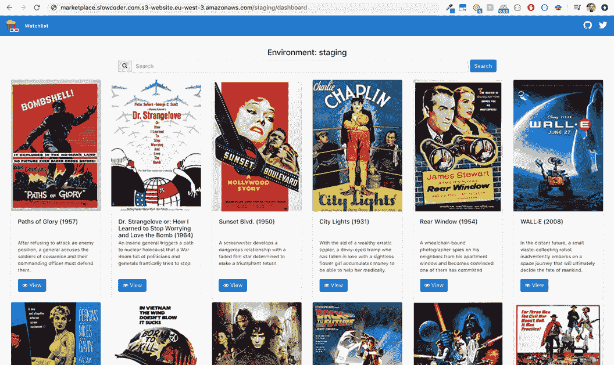

图 12.37 市场 place 阶段环境

现在，要将 Lambda 函数部署到生产环境，通过发起拉取请求将 preprod 分支合并到 master 分支，如图 12.38 所示。

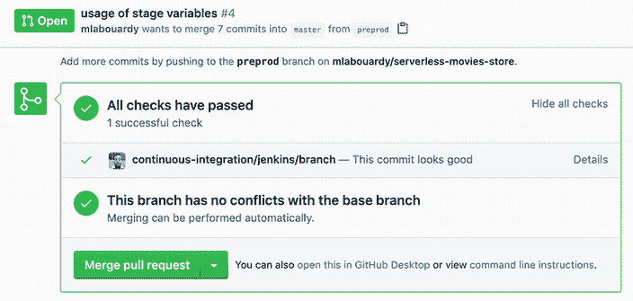

图 12.38 将 movies-store Lambda 函数的 preprod 分支合并到 master

当合并发生时，管道将在 master 分支上触发；见图 12.39。

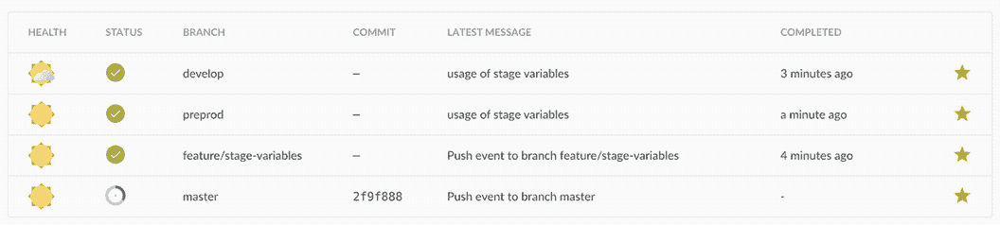

图 12.39 部署 Lambda 函数到生产

movies-store 函数将进行更新，将创建一个新版本，并且生产别名将指向新部署的版本。

您可以使用 Jenkins Input Step 插件在实际上线部署之前请求开发者授权；参见以下列表。当达到 `Deploy` 阶段时，将弹出输入对话框以进行部署确认。

列表 12.22 在生产部署之前请求用户批准

```
if (env.BRANCH_NAME == 'preprod' || env.BRANCH_NAME == 'develop'){
   sh "aws lambda update-alias  --function-name ${it}
           --name ${environments[env.BRANCH_NAME]}
--function-version ${version}
           --region ${region}"
}

if(env.BRANCH_NAME == 'master'){
   timeout(time: 2, unit: "HOURS") {
        input message: "Deploy to production?", ok: "Yes"
   }
   sh "aws lambda update-alias  --function-name ${it}
           --name ${environments[env.BRANCH_NAME]}
--function-version ${version}
           --region ${region}"
}
```

交互式输入将询问我们是否批准部署。如果我们点击是，管道将继续，并且生产别名将指向新部署的版本，如图 12.40 所示。

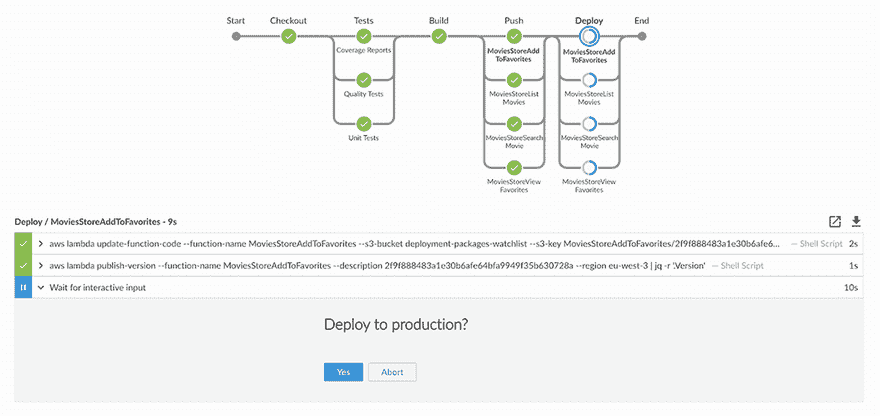

图 12.40 Jenkins 管道中的生产部署确认

因此，现在如果我们对我们的无服务器应用程序进行任何更改，CI/CD 管道将被触发，新发布的 Lambda 函数代码将被升级到生产环境。部署作业状态也会发送 Slack 通知，如图 12.41 所示。

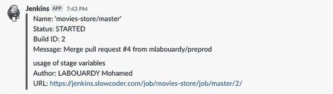

图 12.41 生产部署 Slack 通知

在管道触发和进度上发送通知有助于在团队成员之间沟通工作。到目前为止，我们已经用它来发送启动、完成和失败通知。但 Slack 也可以用于从聊天窗口执行操作或命令，例如确认生产部署或触发 Jenkins 作业的构建。

另一种提高作业构建状态意识并报告测试结果的方法是通过电子邮件通知。

## 12.6 在 Jenkins 中配置电子邮件通知

在 Jenkins 中，可以通过 Email Extension 插件（[`plugins.jenkins.io/email-ext/`](https://plugins.jenkins.io/email-ext/)) 来实现电子邮件通知。此插件包含了一系列在 Jenkins 上安装的必备插件。

要启用电子邮件通知，您需要配置一个 SMTP 服务器。转到“管理 Jenkins”，然后配置系统。滚动到“扩展电子邮件通知”部分。如果您使用的是 Gmail，请输入您的 SMTP 凭据，然后输入 `smtp.gmail.com` 作为 SMTP 服务器，并输入您的 Gmail 用户名和密码。选择使用 SSL，并输入端口号为 465。

要发送电子邮件，您需要配置一个收件人地址列表。然后，点击如图 12.42 所示的“应用”和“保存”按钮。

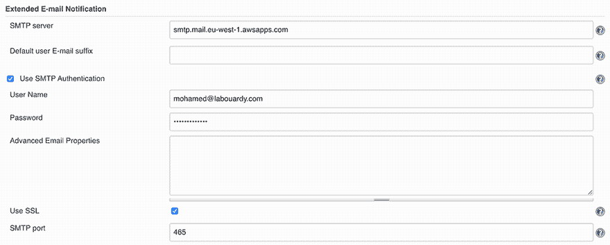

图 12.42 扩展电子邮件通知配置

您可以通过输入收件人电子邮件地址并点击“测试配置”来测试配置。如果一切正常，您将看到消息“电子邮件已成功发送”。

现在插件已配置，请在您的 Jenkinsfile 中输入以下列表，以定义一个根据作业构建状态发送具有可定制属性的电子邮件的功能。

列表 12.23 发送电子邮件以报告作业构建状态

```
def sendEmail(String buildStatus){
    buildStatus =  buildStatus ?: 'SUCCESSFUL'
    emailext body: "More info at: ${env.BUILD_URL}",
             subject: "Name: '${env.JOB_NAME}' Status: ${buildStatus}",
             to: '$DEFAULT_RECIPIENTS'
}
```

最后，您可以通过在 `finally` 块上调用 `sendEmail()` 方法来在 CI/CD 管道完成后调用该功能。在下面的列表中，只有当主分支上正在运行构建时才会发送电子邮件通知，以避免垃圾邮件。

列表 12.24 在生产部署发生时发送电子邮件

```
node('workers'){
    try {
        stage('Checkout'){...}
        stage('Tests'){...}
        stage('Build'){...}
        stage('Push'){...}
        stage('Deploy'){...}
    } catch(e){
        currentBuild.result = 'FAILED'
        throw e
    } finally {
        notifySlack(currentBuild.result)

        if (env.BRANCH_NAME == 'master'){
            sendEmail(currentBuild.result)
        }
    }
}
```

将新的 Jenkinsfile 推送到 GitHub。当主分支上正在执行构建时，将会发送电子邮件。一旦管道完成，您应该能够看到类似于图 12.43 中的电子邮件。

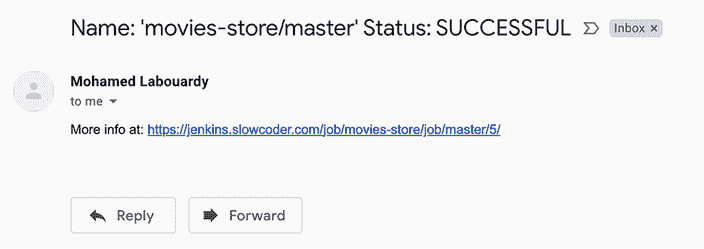

图 12.43 报告作业构建状态的电子邮件通知

电子邮件的主题包含 Jenkins 作业的名称及其构建状态。电子邮件正文包含作业输出的链接。

编写 Jenkinsfiles 的声明式方法提供了一个 `post` 部分，可以用来放置后执行脚本。您可以通过将其放置在 `post` 构建部分来调用 `sendEmail()` 方法，如下面的列表所示。

列表 12.25 Jenkins 声明式管道中的后置步骤

```
pipeline {
    agent{
        label 'workers'
    }
    stages {
        stage('Checkout'){...}
        stage('Unit Tests'){...}
        stage('Build'){...}
        stage('Push'){...}
    }
    post {
        always {
            if (env.BRANCH_NAME == 'master'){
                sendEmail(currentBuild.currentResult)
            }
        }
    }
}
```

您还可以通过启用以下列表中的 `attachLog` 属性来附加作业构建日志。

列表 12.26 在通知邮件中附加日志文件

```
def sendEmail(String buildStatus){
    buildStatus =  buildStatus ?: 'SUCCESSFUL'
    emailext body: "More info at: ${env.BUILD_URL}",
             subject: "Name: '${env.JOB_NAME}' Status: ${buildStatus}",
             to: '$DEFAULT_RECIPIENTS',
             attachLog: true
}
```

因此，Jenkins 发送的电子邮件现在将包含作业状态以及完整的控制台输出作为附件，如图 12.44 所示。

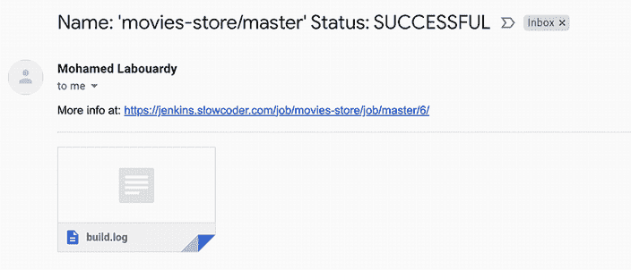

图 12.44 将作业日志作为电子邮件通知附件发送

## 摘要

+   Terraform 模块允许您更好地组织您的基础设施配置代码，并使资源可重用。

+   当将无服务器应用程序作为一组 Lambda 函数构建时，您需要决定是单独将每个函数推送到其自己的 Git 仓库，还是将它们全部捆绑在一起作为一个单一仓库。

+   AWS Lambda 支持别名，它们是对特定版本的命名指针。这使得使用单个 Lambda 函数用于沙箱、预发布和生产环境变得容易。

+   API 网关阶段变量功能使您能够动态访问不同的 Lambda 函数环境。

+   电子邮件扩展插件允许您配置电子邮件通知的各个方面。您可以自定义何时发送电子邮件，谁应该接收它，以及电子邮件的内容。
