# 13 收集持续交付指标

本章涵盖

+   有效监控 Jenkins 及其作业

+   将 Jenkins 构建日志转发到集中式日志平台

+   将 Jenkins 日志解析成结构化和可查询的形式

+   使用 Prometheus 暴露 Jenkins 内部指标

+   使用 Grafana 构建交互式仪表板

+   为 Jenkins 创建基于指标的警报

在前几章中，你学习了如何使用自动化工具从头开始设计、构建和部署 Jenkins 集群；你还学习了如何为几个云原生应用设置一个完全工作的 CI/CD 流水线。在本章中，我们将深入探讨高级 Jenkins 主题：监控运行中的 Jenkins 服务器以及检测异常和资源耗尽。在这个过程中，我们将介绍如何为 Jenkins 日志构建一个集中式日志平台。

## 13.1 监控 Jenkins 集群健康

我们在第五章中构建的集群由一个 Jenkins 主节点和多个工作节点组成，每个节点都在 EC2 实例内部运行。图 13.1 显示了一个典型的 Jenkins 节点配置。

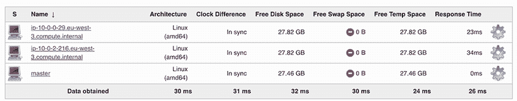

图 13.1 Jenkins 分布式构建架构

到目前为止，Jenkins 集群运行得如预期。然而，你永远不应该将你的 IT 基础设施视为理所当然。你的 Jenkins 主节点或工作节点总有一天会出故障并需要更换。那么，如果你不监控它，你怎么知道你的 Jenkins 集群是否在有效运行呢？

监控 Jenkins 应该成为你 IT 管理的关键部分。监控可以帮助你寻找异常并发现集群中运行的实例上的问题，通过最小化网络中断来节省金钱，并提高效率。

在 AWS 中，你可以使用 Amazon CloudWatch ([`aws.amazon.com/cloudwatch`](https://aws.amazon.com/cloudwatch)) 监控 Jenkins 实例。该平台消耗来自所有 AWS 服务的数据，并允许用户可视化、查询并对数据进行操作。默认情况下，Amazon EC2 将指标数据发送到 CloudWatch。

注意：如果你想在 Azure 或 GCP 环境中监控 Jenkins 实例的整体健康和性能，可以使用 Azure Monitor ([`mng.bz/wQYQ`](https://shortener.manning.com/wQYQ)) 或 Google Cloud 的操作 ([`cloud.google.com/monitoring/quickstart-lamp`](https://cloud.google.com/monitoring/quickstart-lamp))。

导航到 Amazon CloudWatch 控制台并跳转到所有指标选项卡。然后，在 EC2 下，通过在搜索栏中输入它们的实例 ID 来查找运行集群的实例，如图 13.2 所示。

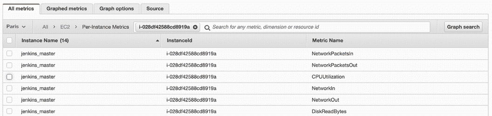

图 13.2 EC2 监控的关键指标

你将看到一份相当长的报告指标列表，针对你的 Jenkins EC2 实例。你可以滚动并选择一个或多个指标来显示（例如，EC2 实例 CPU 利用率），并创建一个图形小部件来显示它们，如图 13.3 所示。

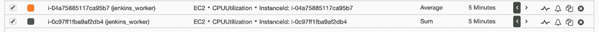

图 13.3 当前在 Jenkins 实例上使用的已分配 EC2 计算单元的百分比

默认情况下，EC2 以 5 分钟间隔向 CloudWatch 报告度量。然而，如果您的 Jenkins 集群被广泛使用（例如，托管多个作业和调度许多 CI/CD 管道），您可以在每个实例上启用增强监控功能([`mng.bz/GOZR`](http://mng.bz/GOZR))以获取 1 分钟间隔的度量（尽管会产生额外的费用）。

CloudWatch 也提供仪表板，可以快速查看您的实例性能，同时在数据可视化方面具有极大的灵活性——例如，放大或缩放。

您可以自定义仪表板并添加额外的图表，例如，显示所有网络接口接收和发送的字节数，或磁盘使用情况（从所有实例存储卷写入和读取的字节数），如图 13.4 所示。


图 13.4 构建 CloudWatch 仪表板以监控 Jenkins 实例

现在您已经知道如何使用 CloudWatch 监控 Jenkins 实例。然而，为所有 Jenkins 实例设置 CloudWatch 监控可能会出错且繁琐（以及记住为用于扩展事件的 Jenkins 工作节点执行此操作）。此外，一些度量通过 CloudWatch 不可用（例如，内存使用）。因此，我们将使用高级监控堆栈。

注意：Amazon CloudWatch 代理可以安装在 EC2 实例上以报告额外的有用度量。这个功能很少使用，但了解它的存在是好的。有关说明，请参阅官方指南[`mng.bz/q5J2`](https://shortener.manning.com/q5J2)。

许多工具，从开源到商业级别，都可以帮助您监控您的基础设施并在出现任何故障时通知您。（第 13.3 节介绍了如何设置几乎实时通知您的警报。）好事是，由于维护它的开源社区，一个强大的开源监控解决方案可用。图 13.5 总结了我们将要实施的开源解决方案。

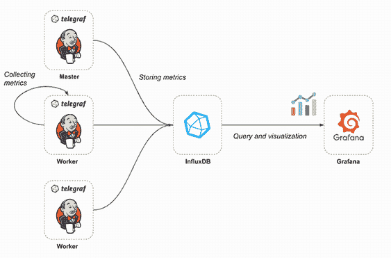

图 13.5 Telegraf 将收集度量，将它们存储在 InfluxDB 中，然后我们可以在 Grafana 中可视化它们。

此监控解决方案可以分为三个部分：

+   *Telegraf*—一个度量收集代理，安装在每一个 Jenkins 实例上。它收集内部度量并将它们发送到时间序列数据库。

+   *InfluxDB*—一个开源的时间序列数据库（TSDB），针对快速、高可用性存储进行了优化。它消耗来自 Telegraf 代理的遥测数据。

+   *Grafana*—一个开源的可视化平台，用于基于存储在 InfluxDB 中的数据构建动态和交互式仪表板。

现在架构已经清晰，我们需要在 EC2 实例上部署一个 InfluxDB 服务器。请查看 InfluxDB 官方文档[`mng.bz/7lJy`](https://shortener.manning.com/7lJy)，以获取如何安装和配置 InfluxDB 的分步指南。

一旦实例启动并运行，通过 SSH 连接到 InfluxDB 实例，并在终端中输入 `influx` 命令。`influx` CLI 是包含在所有 InfluxDB 软件包中的，它是一种轻量级且简单的方式与数据库交互。我们需要创建两个数据库：

+   *instances*——用于存储有关资源使用的指标，例如 CPU 利用率、内存、网络流量、磁盘使用率等。

+   *containers*——用于存储在 Jenkins 工作节点中运行的容器的指标。容器基本上是安排给 Jenkins 工作节点的构建作业。

使用 `CREATE` `DATABASE` Influx 查询语言 (InfluxQL) 语句创建数据库：

```
CREATE DATABASE containers;
CREATE DATABASE instances;
```

也可以通过向端口 8086 上的 InfluxDB API 发送原始 HTTP 请求来创建数据库（见 [`mng.bz/m1z2`](https://shortener.manning.com/m1z2)）。

现在我们有了数据库，InfluxDB 准备接受查询和写入。要收集 Jenkins 实例指标，我们需要在每个服务器上安装一个 Telegraf 代理。一种方法是在现有实例上安装 Telegraf，但这个解决方案无法扩展，因为每次部署新的 Jenkins 工作节点时，我们都需要安装和配置一个 Telegraf 代理。因此，最好的方法是将在 Jenkins AMI 中打包 Telegraf。再次使用 Packer 将 Jenkins 主节点和工作节点 AMI 打包，其中预安装并配置了 Telegraf 代理。

将下一列表中的代码添加到第四章提供的 setup.sh（chapter13/telegraf/setup.sh）脚本中。此代码将安装 Telegraf 的最新稳定版本（在撰写本书时，版本为 1.19.0）。

列表 13.1 使用 Yum 工具安装 Telegraf 代理

```
wget https://dl.influxdata.com/telegraf/releases/telegraf-1.19.0-1.x86_64.rpm
yum localinstall telegraf-1.19.0-1.x86_64.rpm
systemctl enable telegraf
systemctl restart telegraf
```

接下来，我们告诉 Telegraf 要收集哪些指标，通过在 /etc/telegraf/telegraf.conf 创建一个配置文件。该配置文件由 *inputs*（指标来源）和 *outputs*（指标去向）组成。以下列表指定了三个输入（CPU 内存使用和 Docker），并将 InfluxDB 指定为输出。Docker 输入读取 Docker 守护进程的指标，然后将这些数据输出到 InfluxDB。

列表 13.2 Telegraf 配置文件，包含各种输入

```
[global_tags]
hostname="Jenkins"                         ❶

[[inputs.cpu]]                             ❷
  percpu = false
  totalcpu = true
  fieldpass = [ "usage*" ]
  name_suffix = "_vm"

[[inputs.disk]]                            ❸
  fielddrop = [ "inodes*" ]
  Mount_points = ["/"]
  name_suffix = "_vm"

[[inputs.mem]]                             ❹
  name_suffix = "_vm"

[[inputs.swap]]                            ❺
  name_suffix = "_vm"

[[inputs.system]]                          ❻
  name_suffix = "_vm"

[[inputs.docker]]                          ❼
  endpoint = "unix:///var/run/docker.sock"
  container_names = []
  name_suffix = "_docker"

[[outputs.influxdb]]                       ❽
  database = "instances"
  urls = ["http://INFLUXDB_IP:8086"]
  namepass = ["*_vm"]

[[outputs.influxdb]]                       ❾
  database = "containers"
  urls = ["http://INFLUXDB_IP:8086"]
  namepass = ["*_docker"]
```

❶ 覆盖默认主机名；如果为空，则使用 os.Hostname()

❷ 收集系统 CPU 的指标

❸ 收集磁盘使用情况的指标。默认情况下，统计信息会收集所有挂载点的信息，设置 Mount_points 将限制统计信息仅限于根卷。

❹ 收集系统内存指标

❺ 收集系统交换空间指标

❻ 收集系统负载、运行时间和登录用户数的通用统计信息。它与 Unix 的 uptime 命令类似。

❼ 使用 Docker 引擎 API 收集运行中的 Docker 容器的指标

❽ 将系统指标写入 InfluxDB 实例数据库

❾ 将 Docker 指标写入 InfluxDB 容器数据库

确保将 `INFLUXDB_IP` 变量替换为运行 InfluxDB 服务器的实例的 IP 地址。

按照第 5.3 节中描述的步骤制作一个新的 Jenkins AMI，并使用新构建的镜像重新部署 Jenkins 集群。一旦新的 Jenkins 集群启动并运行，Telegraf 将开始收集指标并将它们流式传输到 InfluxDB 以进行存储和索引。

要探索指标，我们将使用 Grafana。您可以从 Yum 仓库安装 Grafana 或通过运行 Docker 镜像来安装。（有关更多详细信息，请参阅 Grafana 官方文档[`mng.bz/5ZY1`](https://shortener.manning.com/5ZY1)。一旦安装了 Grafana，请将浏览器导航到 HOST_IP:3000。在登录页面，输入 `admin` 作为用户名和密码。

在创建用于监控 Jenkins 实例整体健康状况的仪表盘之前，我们需要将 InfluxDB 数据库链接到 Grafana。为此，我们需要为每个 InfluxDB 数据库创建一个数据源。

在侧面板中，点击齿轮图标，然后点击配置 > 数据源。点击图 13.6 所示的添加数据源按钮。然后在设置页面填写以下值：

+   *名称*—数据源名称。（这是您在查询中引用数据源的方式。）

+   *URL*—您的 InfluxDB API 的 HTTP、IP 地址和端口号。（默认情况下，InfluxDB API 端口为 8086。）

+   *数据库*—InfluxDB 数据库的名称（*实例*或*容器*数据库）。


图 13.6 在 Grafana 中配置基于 InfluxDB 的数据源

配置好 InfluxDB 连接后，使用 Grafana 和 InfluxQL 查询并可视化存储在 InfluxDB 中的时序数据。从左侧面板点击仪表盘。从顶部菜单点击首页以获取仪表盘列表。点击底部的新建按钮创建一个新的仪表盘。要添加图表，只需在面板过滤器中点击图表按钮。在查询部分，输入以下 InfluxQL 语句：

```
SELECT mean("used_percent") FROM "mem_vm" 
WHERE $timeFilte.
GROUP BY time($__interval), "host" fill(null)
```

此查询从 `mem_vm` 测量中选择内存使用情况，并按 Jenkins 节点分组结果。查询结果如图 13.7 所示。

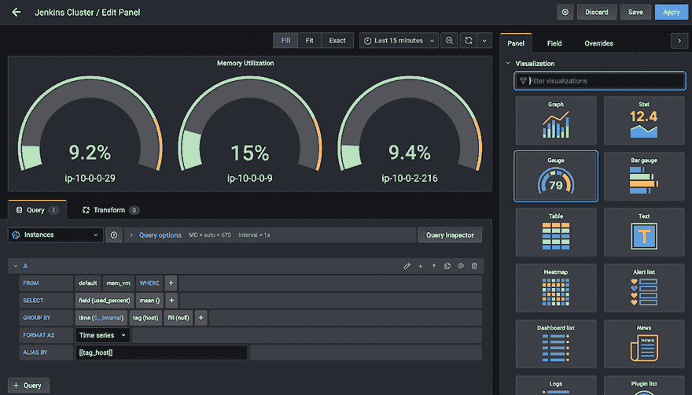

图 13.7 构建内存利用率仪表图

要监控 Jenkins 作业的构建时间，可以使用以下语句：

```
SELECT mean("uptime_ns") FROM "docker_container_status_docker" 
WHERE ("hostname" = 'Jenkins') AND $timeFilte.
GROUP BY time($__interval), "container_name" fill(null)
```

此查询从 `docker_container_status_docker` 测量中选择容器在线和运行的时间（即在线时间）值，并按容器名称分组结果（如图 13.8 所示）。

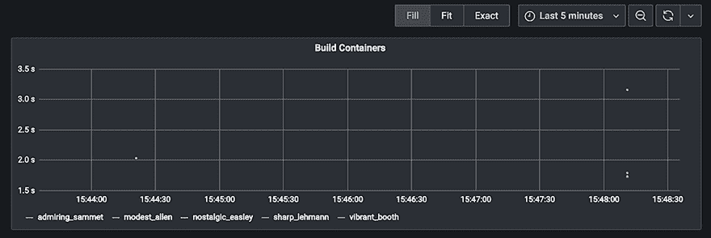

图 13.8 监控 CI/CD 管道内构建的容器

返回 Grafana，您可以为 Jenkins 集群的各个指标创建多个图表进行监控：

+   Jenkins 节点（主节点和工作节点）的 CPU 使用率

+   网络流量（进出字节数）

+   每个 Jenkins 节点的内存利用率

+   运行构建作业的数量

+   总体健康状态和工作者数量

图 13.9 显示了 Jenkins 集群的宿主级详细信息。完整的仪表板可以从 JSON 文件（chapter13/grafana/dashboard/influxdb.json）中导入。有关说明，请参阅 [`mng.bz/6mGD`](http://mng.bz/6mGD)。

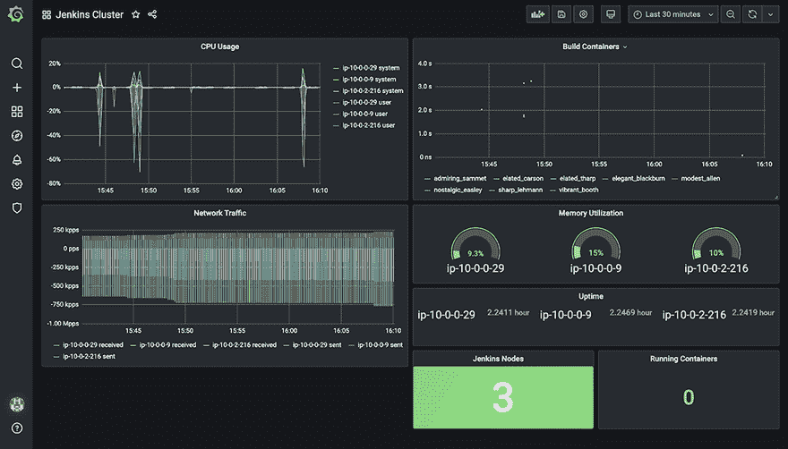

图 13.9 Jenkins 宿主指标

如前所述，监控实例的状态对于保持 Jenkins 集群健康至关重要，通过使用 Telegraf 提供的上述指标（以及许多其他指标），你可以相对容易地实现这一点。

到目前为止，你已经看到了如何监控 Jenkins 实例（服务器端）。现在让我们探索如何监控 Jenkins 服务器本身（应用端）。正如你可能已经猜到的，一个 Jenkins 监控插件可以提供关于 Jenkins 内部发生的事情以及 Jenkins 执行的任务的大量数据。例如，指标插件 ([`plugins.jenkins.io/metrics/`](https://plugins.jenkins.io/metrics/)) 通过在 Jenkins 服务器上的 $JENKINS_URL/metrics 端点公开 API 来提供健康检查。该 API 提供以下信息：

+   HTTP 会话和当前 HTTP 请求

+   按周期详细统计构建时间和构建步骤

+   线程、操作系统进程列表和堆转储

例如，图 13.10 中的 API 调用返回了 Jenkins 可用执行器的统计信息。

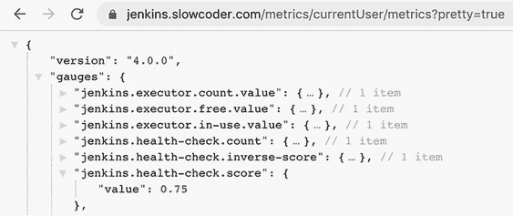

图 13.10 指标 API 与健康检查端点

要创建基于这些指标的仪表板，我们可以编写一个自定义脚本来定期将这些值保存到 InfluxDB，或者使用 Prometheus 指标插件 ([`plugins.jenkins.io/prometheus/`](https://plugins.jenkins.io/prometheus/)) 来公开一个端点（默认为 /prometheus），Prometheus 服务器可以抓取这些指标。

Prometheus ([`prometheus.io/`](https://prometheus.io/)) 是一个具有维度数据模型、灵活的查询语言、高效的时序数据库和现代警报方法的开源监控系统。

注意：用于烘焙和部署 Prometheus 服务器的 Packer 模板文件和 Terraform HCL 文件位于 chapter13/prometheus 文件夹中。

首先，从“管理插件”部分安装 Prometheus 指标插件 ([`plugins.jenkins.io/prometheus/`](https://plugins.jenkins.io/prometheus/))。安装完成后，你可以在 JENKINS _URL/prometheus（图 13.11）中看到插件的输出。

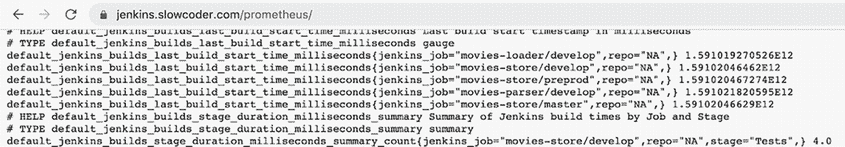

图 13.11 Prometheus 端点提供指标列表

然后，你需要配置一个 Prometheus 服务器以从 Jenkins 抓取指标。编辑 /etc/prometheus/prometheus.yml 配置文件（列表 13.3）。在 `scrape_configs` 部分添加一个针对 Jenkins 服务器的作业。此配置文件的编写格式可以在 [`mng.bz/o8Vr`](https://shortener.manning.com/o8Vr) 找到。

列表 13.3 配置 Prometheus 从 Jenkins 抓取指标

```
global:
  scrape_interval: 10s

scrape_configs:
  - job_name: 'prometheus_master'
    scrape_interval: 5s
    static_configs:
      - targets: ['localhost:9090']
  - job_name: 'jenkins'
    metrics_path: '/prometheus/'
    scheme: https
    static_configs:
       - targets: ['JENKINS_URL']
```

在 Prometheus 控制台（默认端口为 9090）中，您可以探索从 Jenkins 收集的指标。您将看到图 13.12 中的屏幕。


图 13.12 从 Prometheus 控制台探索 Jenkins 指标

收集的指标如果没有可视化则不太有用。通过创建新的数据源将 Prometheus 与 Grafana 连接起来。要在 Grafana 中创建 Prometheus 数据源，请按照以下步骤操作：

1.  点击侧面板中的齿轮图标以打开配置菜单。

1.  点击数据源。

1.  点击“添加数据源”。

1.  选择 Prometheus 作为类型。

1.  设置适当的 Prometheus 服务器 URL 为 [`prometheus:9090`](http://prometheus:9090)。

1.  点击“保存并测试”以保存新的数据源。

然后，根据可用的指标创建一个仪表板。仪表板包括应用级指标（跟踪队列中作业的总数、待处理作业的数量以及卡住或延迟的作业数量），接着是内部操作指标（JVM），最后是系统级指标（磁盘 I/O、网络、内存等）。图 13.13 展示了仪表板的一部分。

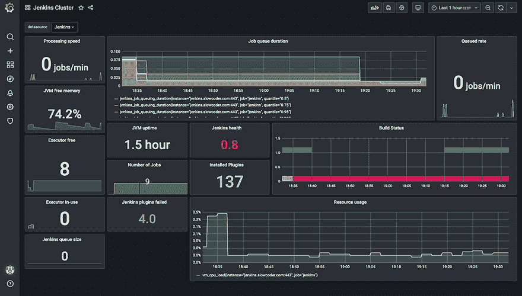

图 13.13 作业和构建的全面 Jenkins 监控摘要

完整的仪表板可以从以下 JSON 文件导入：chapter13/grafana/dashboard/prometheus.json。

另一个流行的 Jenkins 监控解决方案是监控插件（之前称为 JavaMelody）。此插件生成关于 Jenkins 状态的全面 HTML 报告，包括 CPU 和系统负载、平均响应时间和内存使用情况；有关更多详细信息，请参阅 [`plugins.jenkins.io/monitoring/`](https://plugins.jenkins.io/monitoring/)。此外，报告由 Jenkins 控制台提供，如图 13.14 所示。

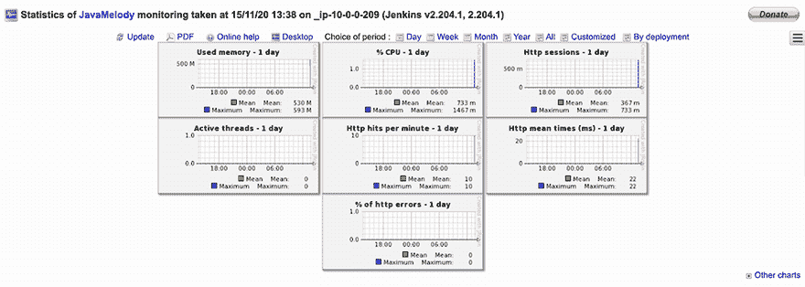

图 13.14 JavaMelody 监控的统计信息

太好了！现在您应该能够监控在生产环境中运行的 Jenkins 集群。为了进一步了解您的 Jenkins 环境，您可以收集和分析实时系统和安全事件的 Jenkins 日志，并将它们与性能和服务器指标相关联，以识别和解决问题。

## 13.2 使用 ELK 对 Jenkins 日志进行集中式记录

默认情况下，Jenkins 日志位于 /var/log/jenkins/jenkins.log。要查看这些日志，使用堡垒主机 SSH 到 Jenkins 主实例，然后执行以下命令：

```
tail -f -n 100 /var/log/jenkins/jenkins.log
```

图 13.15 显示了命令输出。

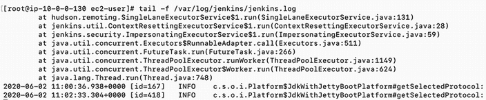

图 13.15 查看 /var/log/jenkins/jenkins.log 中的 Jenkins 日志

您也可以从网络控制台（图 13.16）查看这些日志。转到 Jenkins 控制台，并在管理 Jenkins 页面上选择系统日志。

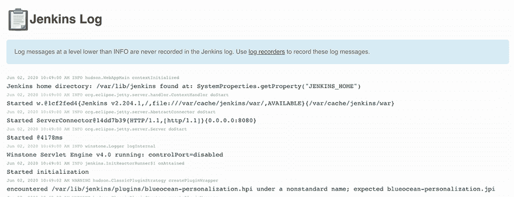

图 13.16 从 Jenkins 控制台查看 Jenkins 日志

默认情况下，Jenkins 将每个 `INFO` 日志记录到 stdout，但您可以通过创建自定义日志记录器来配置 Jenkins 记录特定 Jenkins 插件的日志。从系统日志页面，点击“添加新日志记录器”按钮并选择一个有意义的名称。图 13.17 中的示例创建了一个 Slack 插件的日志记录器（Java 包位于 jenkins.plugins.slack）。

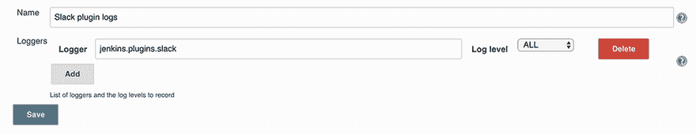

图 13.17 使用自定义日志记录器捕获 Slack 插件的登录信息

现在，如果 Jenkins 管道发送任何 Slack 通知，应该会捕获如图 13.18 所示的日志。

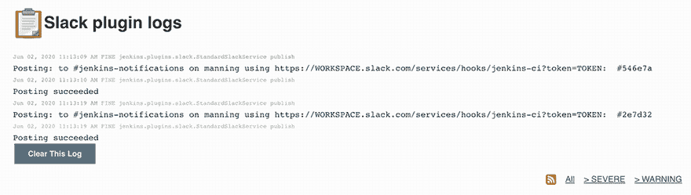

图 13.18 Slack 插件的日志显示

您还可以通过导航到仪表板中的作业项并点击“控制台输出”，或查看 $JENKINS_HOME/jobs/$JOB_NAME/builds/$BUILD_NUMBER/log 中的日志文件内容来查看特定作业的构建日志。

根据日志轮转配置，日志可能会保存 *X* 次构建（或天数等），这意味着旧的工作日志可能会丢失。这就是为什么您需要将日志持久化到集中式日志平台，以便进行审计和潜在的故障排除。

注意：您可以在每个项目或作业配置页面中启用“丢弃旧构建”插件 ([`plugins.jenkins.io/discard-old-build/`](https://plugins.jenkins.io/discard-old-build/)) 来配置保留旧构建的间隔（例如，每月一次，每 10 次构建一次等）。

此外，分析 Jenkins 日志可以提供大量信息，有助于排查管道作业失败的根本原因。构建日志包含完整的记录，如构建名称、编号、执行时间等。然而，要分析这些日志，您需要将它们发送到外部日志平台。这就是像 ELK 堆栈（Elasticsearch、Logstash 和 Kibana）这样的平台发挥作用的地方。

### 13.2.1 使用 Filebeat 流式传输日志

Filebeat ([www.elastic.co/beats/filebeat](http://www.elastic.co/beats/filebeat))，一个轻量级代理，将安装在 Jenkins 主实例上，并将日志发送到 Logstash ([www.elastic.co/logstash](http://www.elastic.co/logstash)) 进行处理和聚合。从那里，日志将被存储在 Elasticsearch ([www.elastic.co/elasticsearch](http://www.elastic.co/elasticsearch)) 中，并通过交互式仪表板在 Kibana ([www.elastic.co/kibana](http://www.elastic.co/kibana)) 中可视化。图 13.19 总结了整个工作流程。

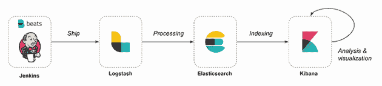

图 13.19 使用 Filebeat 将 Jenkins 日志发送到 ELK 平台

要部署此架构，我们需要为每个组件创建一个机器镜像。您可以使用 Packer 来烘焙 AMI（图 13.20）。Packer 模板可在 GitHub 仓库的 chapter13/COMPONENT_NAME/packer/template.json 中找到。

一旦创建了 AMI，你就可以使用 Terraform 来部署 ELK 堆栈。模板资源可在 GitHub 仓库 chapter13/COMPONENT_NAME/terraform/*.tf 中找到。

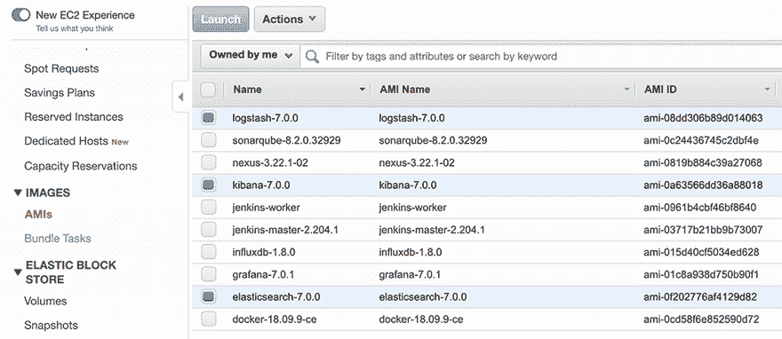

图 13.20 使用 Packer 构建的 Logstash、Kibana 和 Elasticsearch AMI

在配置过程结束时，应该创建了三个 EC2 实例，如图 13.21 所示。

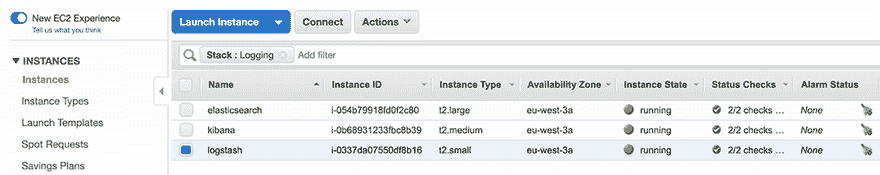

图 13.21 在 AWS 上部署的 ELK 堆栈

当日志平台准备好消费传入的 Jenkins 日志时，我们需要在 Jenkins 主实例上安装 Filebeat。通过 SSH 连接到 Jenkins 服务器，并运行以下列表中的命令来安装 Filebeat 的最新稳定版本（在撰写本书时，版本为 7.13.2）。

列表 13.4 在 Jenkins 服务器上安装 Filebeat 代理

```
curl -L -O https://artifacts.elastic.co/downloads/beats/
filebeat/filebeat-7.13.2-x86_64.rpm
sudo rpm -vi filebeat-7.13.2-x86_64.rpm
```

接下来，我们需要设置我们想要转发到 ELK 的日志文件的路径。这里我们希望将日志转发到 /var/log/jenkins/jenkins.log。转到 /etc/filebeat 下的 Filebeat 配置目录，并使用以下列表更新 filebeat.yml。

列表 13.5 Filebeat 输入配置

```
filebeat.inputs:
- type: log
  enabled: true
  paths:
    - /var/log/jenkins/jenkins.log                     ❶
  fields:                                              ❷
    type: jenkins                                      ❷
  multiline.pattern: '[0-9]{4}-[0-9]{2}-[0-9]{2}'      ❸
  multiline.negate: true                               ❸
  multiline.match: after                               ❸
output.logstash:                                       ❹
  hosts: ["LOGSTASH_HOST"]                             ❹

processors:                                            ❺
 - add_host_metadata: ~                                ❺
 - add_cloud_metadata: ~                               ❺
 - add_docker_metadata: ~                              ❺
 - add_kubernetes_metadata: ~                          ❺
```

❶ 从 /var/log/jenkins/jenkins.log 文件中提取行

❷ 在输出中添加一个名为 type 的字段，以便我们能够轻松识别来自 Jenkins 的日志

❸ 配置 Filebeat 以处理多行消息

❹ 直接将日志发送到 Logstash

❺ 使用主机机的相关元数据注释每个日志事件

Jenkins 日志中常见的多行消息，尤其是包含 Java 栈跟踪的日志消息。以下是一个 Java 栈跟踪的示例：

```
2020-10-22 20:06:58.217+0000[id=124635] FATAL: Ping failed.
                        java.util.concurrent.TimeoutException:
                        at hudson.remoting.PingThread.ping(PingThread.java:134)
                        at hudson.remoting.PingThread.run(PingThread.java:90)
```

为了正确处理这些多行消息，我们使用 `multiline` 设置来指定哪些行是单个日志消息的一部分。

将 `LOGSTASH_HOST` 变量替换为 Logstash 服务器的 IP 地址。然后使用以下命令重新启动 Filebeat 代理：

```
systemctl restart filebeat
```

前往 Kibana 仪表板（在 `KIBANA_IP:5601`），跳转到管理标签，然后到索引模式。我们必须创建一个新的索引模式。创建索引模式意味着将 Kibana 与 Elasticsearch 索引映射。由于 Logstash 将传入的 Jenkins 日志存储到一系列格式为 *jenkins-YYYY.MM.DD* 的索引中，因此我们将创建一个索引模式 `jenkins-*` 来探索所有日志，如图 13.22 所示。

点击下一步选项。从时间过滤器字段名称下拉菜单中选择 @timestamp。然后点击创建索引模式按钮。

现在，要查看日志，请转到发现页面。你可以看到你的索引数据正在传入（如图 13.23 所示）。

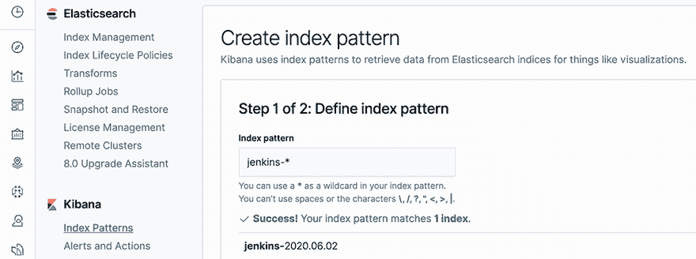

图 13.22 将 Elasticsearch 索引连接到 Kibana

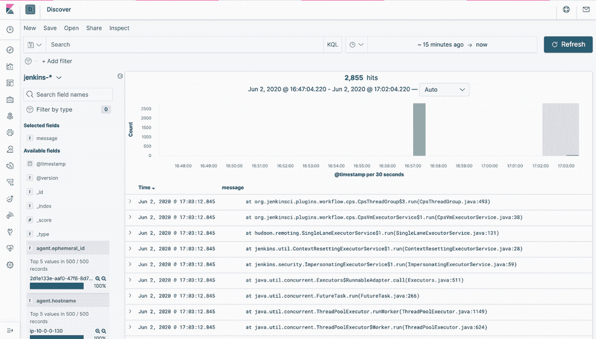

图 13.23 从 Kibana 可视化 Jenkins 日志

现在，你已经有一个可以读取 Jenkins 日志的工作管道。然而，你会注意到日志消息的格式并不理想。你希望解析日志消息以从日志中创建特定的命名字段。以下是一个 Jenkins 日志的示例：

```
2020-06-02 15:21:56.990+0000 INFO  o.j.p.workflow.job.WorkflowRun#finish: movies-loader/develop #7 completed: SUCCESS
```

行首的时间戳很容易定义为日志级别（`INFO`、`WARNING`、`DEBUG` 等）。要解析行，我们可以编写一个 Grok 表达式。

Grok 通过解析文本模式，使用正则表达式，并将它们分配给一个标识符来工作。语法是 `%{PATTERN:IDENTIFIER}`。我们可以编写一系列 Grok 模式并将前一条日志消息的各个部分分配给不同的标识符，如下面的列表所示。

列表 13.6 解析 Jenkins 日志消息的 Grok 表达式

```
%{TIMESTAMP_ISO8601:createdAt} %{LOGLEVEL:level}%{SPACE}%{JAVACLASS:class}%{DATA:state}:%{SPACE}%{JOBNAME:project} #%{NUMBER:buildNumber} %{DATA:execution}: %{WORD:status}
```

Grok 随带自己的模式字典，你可以直接使用。但你可以始终定义自己的自定义模式，如下面的列表所示。

列表 13.7 Grok 自定义模式定义

```
JAVACLASS (?:[a-zA-Z0-9-]+\.)+[A-Za-z0-9$]+
JOBNAME [a-zA-Z0-9\-\/]+
```

你可以使用 Kibana Grok Debugger 控制台来调试表达式。此功能在 Kibana 中自动启用，位于 DevTools 选项卡上。

在“样本数据”字段中输入日志消息，在“Grok 模式”字段中输入 Grok 表达式。然后点击模拟。你将看到应用 Grok 模式后产生的模拟事件（图 13.24）。

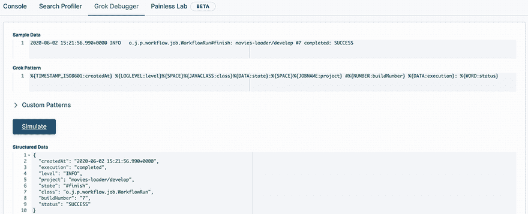

图 13.24 使用 Grok Debugger 工具模拟 Grok 解析

注意：Grok 模式引用了 `JAVACLASS` 和 `JOBNAME` 自定义模式。它们在自定义模式部分定义。每个模式定义都在其自己的行上。

注意：如果发生错误，你可以继续迭代自定义模式，直到输出匹配你期望的事件。

Grok 表达式正在工作，但我们希望解析机制在将日志存储到 Elasticsearch 之前完成。这就是为什么我们将更新 Logstash 配置（chapter13/logstash/packer/jenkins.conf）以解析来自 Filebeat 的传入日志。`filter` 部分将尝试匹配来自 Jenkins 的消息与之前定义的 Grok 表达式，如下面的列表所示。

列表 13.8 在 Logstash 层解析 Jenkins 日志

```
filter {
  if [type] == "jenkins" {
    grok {
      patterns_dir => ["/etc/logstash/patterns"]
      match => {
        "message" => "%{TIMESTAMP_ISO8601:createdAt}%{SPACE}\[id=%{INT:buildId}\]
%{SPACE}%{LOGLEVEL:level}%{SPACE}%{JAVACLASS:class}
%{DATA:state}:%{SPACE}%{JOBNAME:project.
#%{NUMBER:buildNumber} %{DATA:execution}: %{WORD:status}"
      }
    }
  }
}
```

此代码将 Filebeat 收集的 Jenkins 日志解析成字段，并将字段发送到 Elasticsearch。`pattern_dir` 设置告诉 Logstash 你的自定义模式目录在哪里。你可以通过添加更多处理来自定义解析机制，例如删除未使用的字段或重命名字段。有关更多信息，请参阅 [`mng.bz/J6Av`](https://shortener.manning.com/J6Av) 上的 Mutate Filter 插件。

重新启动 Logstash 以重新加载配置。你的 Jenkins 日志将被收集并结构化成字段（图 13.25）。目前里面没有多少内容，因为你只收集了 Jenkins 日志。在这里，你可以搜索和浏览你的日志。

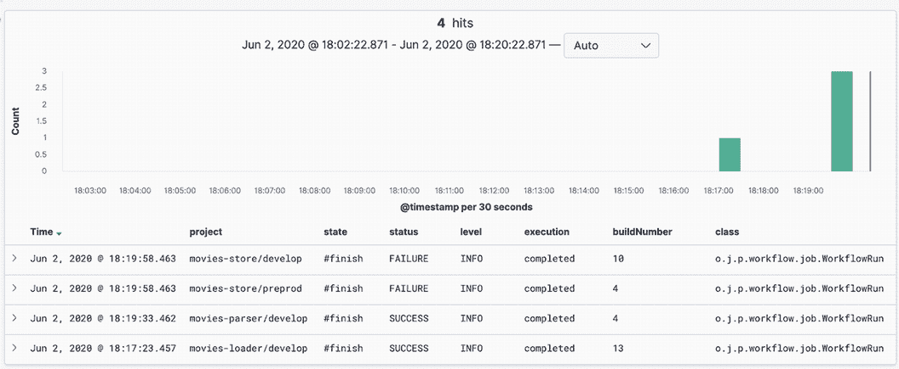

图 13.25 将 Jenkins 日志结构化成可查询的字段

来自 Jenkins 的每个日志消息都将匹配并产生表 13.1 中列出的字段。

表 13.1 Elasticsearch 中的 Jenkins 索引字段

| 字段 | 描述 |
| --- | --- |
| `time` | 消息的数据和时间，以 UTC 格式表示 |
| `level` | 日志消息级别（INFO、WARNING、DEBUG、FATAL、ERROR） |
| `project` | Jenkins 作业的构建名称 |
| `buildNumber` | 作业的构建号，用于标识 Jenkins 运行此构建过程的次数 |
| `status` | 构建状态（失败或成功） |
| `execution` | 构建当前状态（运行中、挂起、已终止或已完成） |

您可以根据`status`字段在一段时间内显示失败与成功构建数量的堆叠柱状图；见图 13.26。

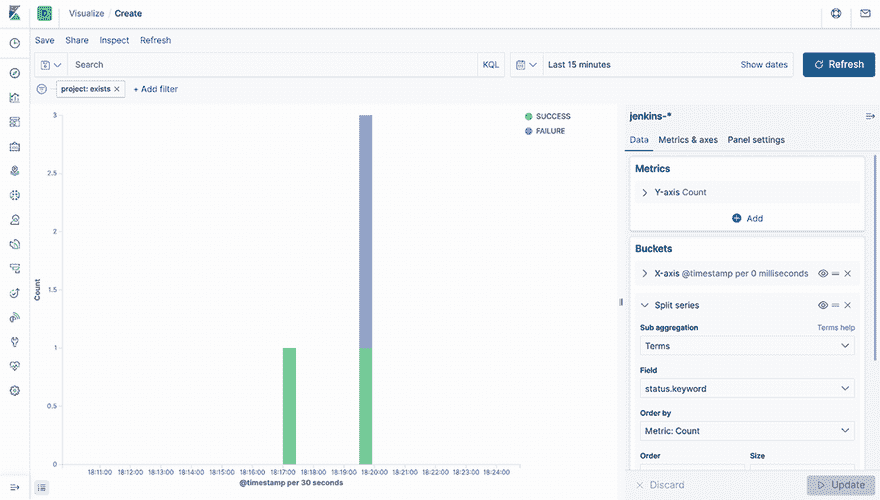

图 13.26 基于 Jenkins 结构化字段构建交互式小部件

您可以将柱状图保存为小部件并导入到仪表板中。使用仪表板，您可以将多个可视化组合到单个页面上，然后通过提供搜索查询或通过在可视化中单击元素来选择过滤器来过滤它们。仪表板在您想要获取 Jenkins 日志的概览并在不同可视化之间建立关联时非常有用；见图 13.27。

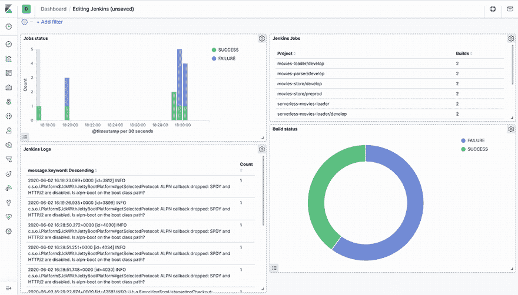

图 13.27 从 Kibana 仪表板分析 Jenkins 日志

完整的仪表板可以从以下 JSON 文件导入：chapter13/kibana/dashboard/jenkins.json。

就这样！您已成功创建了一个使用 Filebeat 将 Jenkins 日志作为输入，将这些日志转发到 Logstash 进行解析，并将解析后的数据写入 Elasticsearch 服务器的管道。

### 13.2.2 使用 Logstash 插件流式传输日志

您可以通过 Jenkins 上的 Logstash 插件（[`plugins.jenkins.io/logstash/`](https://plugins.jenkins.io/logstash/)）直接将 Jenkins 日志发送到 Elasticsearch 实例来跳过 Filebeat 和 Logstash 的配置。如果您尚未使用外部 Logstash 代理将您的基础设施或应用程序日志流式传输到 Elasticsearch，并且不需要使用自定义 Grok 表达式丰富日志解析机制，则此解决方案非常理想。此外，Logstash 插件可以将 Jenkins 实例的日志数据流式传输到任何索引解决方案（包括 Redis、RabbitMQ 和 Elasticsearch）。在当前场景中，我们将使用 Elasticsearch。

在 Jenkins 仪表板的全球配置中成功安装 Logstash 插件后，我们需要使用目标索引器配置该插件。配置 URI，即 Elasticsearch 服务器运行的地址，如图 13.28 所示。

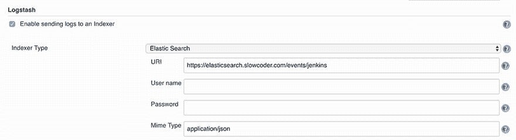

图 13.28 配置 Logstash 插件将日志流式传输到 Elasticsearch 服务器

在 Logstash 配置中配置 Elasticsearch 端点后，您可以在您的管道中添加以下块。这样，所有在`logstash`步骤中产生的日志都将流式传输到 Elasticsearch：

```
logstash {
     echo "Job:${env.JOB_NAME}"
}
```

您可以通过访问如图 13.29 所示的 Kibana 仪表板来查看流式日志。

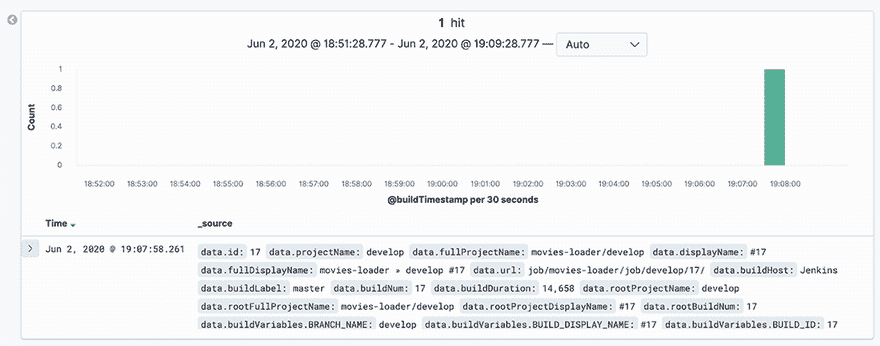

图 13.29 发送到 Elasticsearch 的日志消息示例

现在我们可以将 Jenkins 实例的日志数据流式传输到 Elasticsearch，最终传输到 Kibana。

## 13.3 基于指标创建警报

我们可以将日志和监控解决方案进一步扩展并设置警报。最常见的用例是 DevOps 团队接收事件通知，例如当失败构建率显著高于正常水平时。不用说，这个问题可能会对新功能的发布产生重大影响，从而影响业务和用户体验。

您可以使用 Kibana 在指定的条件下定义一个有意义的警报；参见图 13.30。例如，您可以定义一个警报来定期检查失败构建率。对于通知通道，您可以使用 Slack、OpsGenie 或简单的电子邮件通知。

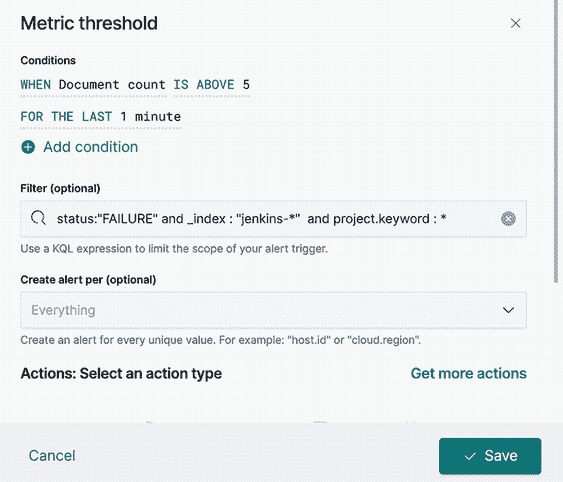

图 13.30 在 Kibana 上配置警报

您还可以通过使用 Grafana 警报功能，根据 Prometheus 或 Telegraf 收集的指标创建警报。

注意：虽然设置和使用 Grafana 警报很简单，但在将警报规则应用于您的指标查询方面更为有限。如果您正在寻找一个高级解决方案，请选择 Prometheus Alertmanager ([`prometheus.io/docs/alerting/latest/alertmanager/`](https://prometheus.io/docs/alerting/latest/alertmanager/))。

在创建监控警报之前，我们需要添加将通过其接收通知的通知通道。在这里，我们将添加 Slack 作为通知通道。

要设置 Slack，您需要配置一个传入的 Slack webhook URL。通过访问 [`api.slack.com/apps/new`](https://api.slack.com/apps/new) 创建 Slack 应用程序。创建应用程序后，您将被重定向到新应用的设置页面（图 13.31）。从那里，通过切换单选按钮到“开启”来启用“传入 webhook”功能。

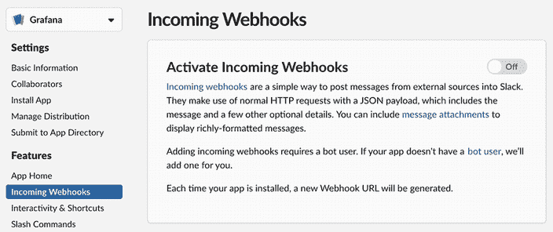

图 13.31 在 Slack 应用程序上启用传入 webhook

现在，启用传入 webhook 后，设置页面应该刷新，并出现一些额外选项。其中之一将是一个非常有用的按钮，标记为“添加新 webhook 到 Workspace”，您应该点击它。

请继续选择 Grafana 将要发布消息的 Slack 频道，然后点击“授权您的应用”。您将被返回到您的应用设置页面，在那里您现在应该在“您的 Workspace”部分的 webhook URLs 下看到一个新条目，其中包含一个 webhook URL。复制它。

在创建 webhook URL 后，您需要在 Grafana 中创建一个通知通道。在 Grafana 侧边栏中，将鼠标悬停在“警报”图标上，然后单击“通知通道”，如图 13.32 所示。按照以下步骤创建 Slack 通知通道：

1.  输入频道的名称。

1.  将类型更改为 Slack 并输入您已创建的 webhook URL。

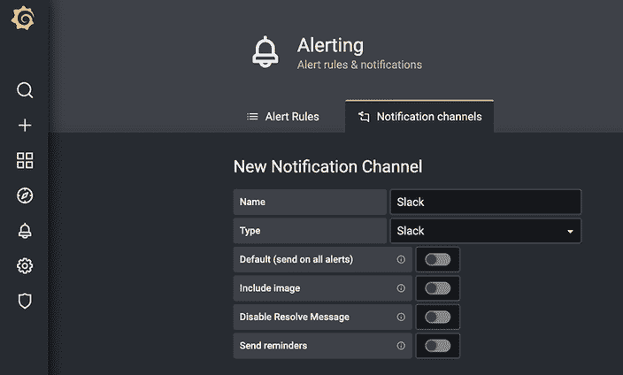

图 13.32 配置新的 Slack 通知通道

你可以通过点击底部的发送测试按钮来测试设置。设置所有字段后，只需点击保存按钮。

现在，让我们创建警报。选择你想要创建警报的面板。例如，我们可以在内存使用指标上创建警报。点击警报选项卡，然后点击创建警报。这将打开一个配置警报的表单，你可以设置以下选项：

+   *评估间隔*—你希望警报规则评估的时间间隔。对于本例，我们可以将选项设置为每 1 分钟评估 1 分钟。这意味着 Grafana 将每分钟评估一次规则。如果指标违反规则，Grafana 将等待 1 分钟。如果 1 分钟后指标没有恢复，Grafana 将触发警报。

+   *条件*—我们可以使用 `avg()` 函数，因为我们想验证我们的规则与平均内存利用率。

当平均内存利用率超过 90% 时，将触发此警报，如图 13.33 所示。

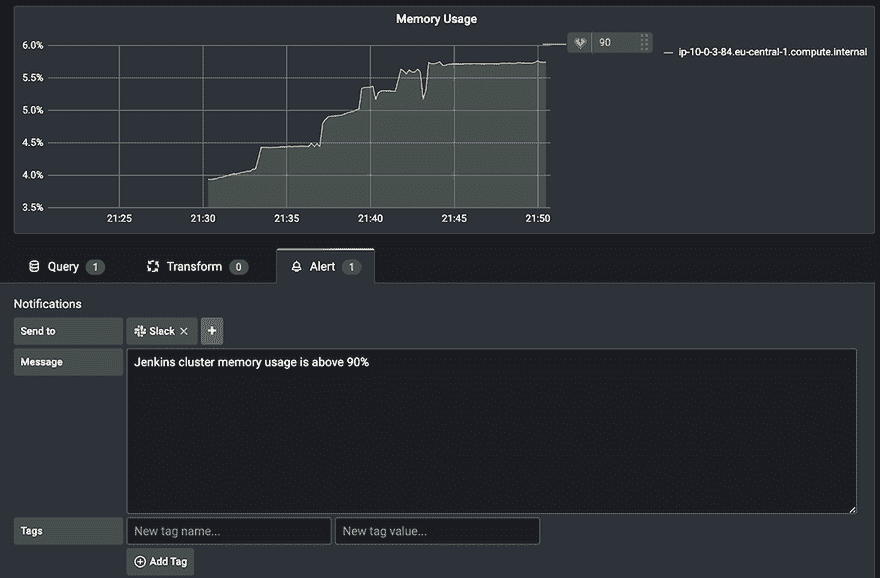

图 13.33 定义内存使用警报规则

此外，我们需要添加需要发送警报的通知渠道以及警报消息。如果警报被触发，你将在 Slack 频道上看到图 13.34 中的消息。

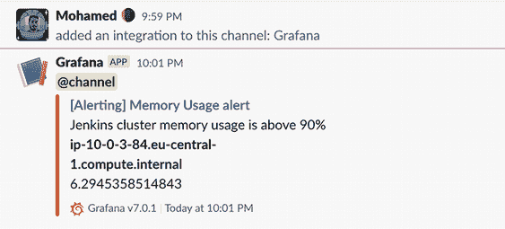

图 13.34 超过内存阈值时的 Slack 通知

创建一个发送到类似 Slack 的消息应用的警报非常有用。这确保了如果发生错误，你和你的团队成员会立即收到通知。你可以提及你的团队 Slack 群组或使用 `@here` 或 `@channel` 确保你的团队收到消息。

## 摘要

+   你可以使用 Telegraf、InfluxDB 和 Grafana 构建一个监控堆栈，以收集、存储和可视化 Jenkins 实例指标。

+   你可以通过编写 Grok 表达式将 Jenkins 日志收集和解析到结构化字段中。

+   Prometheus 插件可用于在 Jenkins 中公开内部和客户端指标。

+   Logstash 插件是集成 Jenkins 日志与 ELK 堆栈的简单方法。

+   Filebeat 可以作为代理安装在 Jenkins 主实例上，以便将日志发送到 Logstash 进行解析。从那里，日志将被存储在 Elasticsearch 中，并在 Kibana 的交互式仪表板中进行分析。
