# 14 Jenkins 管理和最佳实践

本章涵盖

+   在 CI/CD 管道中共享通用代码和步骤

+   授予用户作业权限

+   使用 GitHub 进行认证信息以保护 Jenkins 实例

+   备份和恢复 Jenkins 插件和作业

+   将 Jenkins 用作 cron 作业的调度器

+   将构建作业迁移到新的 Jenkins 实例

第十三章介绍了如何监控 Jenkins 集群，以及如何配置警报并将 Jenkins 日志和指标关联起来以识别问题和避免停机。在本章中，您将学习如何通过为登录用户设置基于角色的访问控制 (RBAC) 以实现细粒度访问来加强 Jenkins 的安全性，以及如何通过使用 GitHub 认证机制添加额外的安全层。

我们还将讨论一些在维护 Jenkins 实例时可能觉得有用的技巧和窍门。我们将探讨如何备份、恢复和存档构建作业，或者将它们从一个服务器迁移到另一个服务器。

## 14.1 探索 Jenkins 安全性和 RBAC 授权

当前 Jenkins 的配置允许未登录用户具有读取访问权限，而登录用户几乎可以访问一切。要覆盖此默认行为，请从管理 Jenkins（图 14.1）转到配置全局安全性部分。

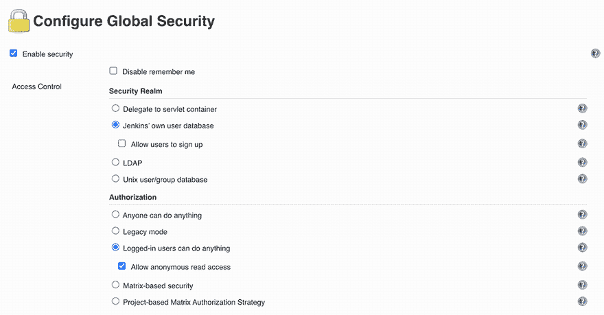

图 14.1 在 Jenkins 中启用安全性

禁用允许匿名读取访问并启用允许用户注册，然后您将被重定向到登录页面。此选项允许用户通过图 14.2 中显示的创建账户链接自行创建账户。


图 14.2 Jenkins 登录页面

点击创建账户链接。您将被提示添加新用户。在图 14.3 中，我们正在设置一个开发者账户。

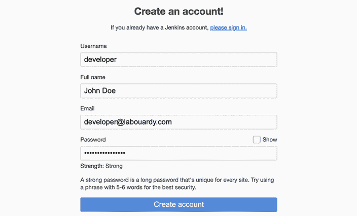

图 14.3 设置开发者账户

创建新账户后，登录。您会注意到它对 Jenkins 具有完全控制权。让登录用户做任何事情当然很灵活，也许这对一个小团队来说就足够了。对于更大的团队或多个团队，或者当 Jenkins 在开发环境之外使用时，通常需要更安全的方法。

注意 默认情况下，如果用户创建账户，Jenkins 不使用 CAPTCHA 验证。如果您想启用 CAPTCHA 验证，请安装支持插件，例如 Jenkins JCaptcha 插件 ([`plugins.jenkins.io/jcaptcha-plugin/`](https://plugins.jenkins.io/jcaptcha-plugin/))。

### 14.1.1 矩阵授权策略

要为登录用户设置细粒度访问，我们可以使用 Jenkins 矩阵授权策略插件 ([`plugins.jenkins.io/matrix-auth/`](https://plugins.jenkins.io/matrix-auth/))。此插件允许您通过指定用户控制每个项目的作业权限，这些用户可以在该作业上执行某些操作。

一旦安装了矩阵授权策略插件，请转到配置全局安全。在授权部分，启用基于项目的矩阵授权策略。Jenkins 将显示一个包含授权用户和对应于你可以分配给这些用户的各种权限的复选框的表格（图 14.4）。

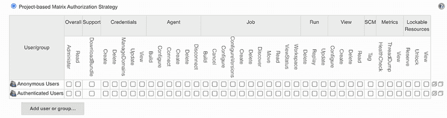

图 14.4 基于矩阵的安全配置

权限被组织到几个组中，例如这些。

+   *总体*—涵盖基本的系统级权限。

+   *凭据*—涵盖管理 Jenkins 凭据。

+   *代理*—涵盖与构建节点或工作者的权限（添加或删除 Jenkins 节点）。

+   *作业*—涵盖与作业相关的权限（创建新的构建作业、更新或删除现有的构建作业）。

+   *运行*—涵盖与构建历史中特定构建相关的权利。

+   *查看*—涵盖管理视图。Jenkins 中的视图允许我们将作业和内容组织到标签页分类中。

+   *源代码管理（SCM）*—涵盖与版本控制系统（如 Git 或 SVN）相关的权限。

矩阵控制用户可以执行的操作（读取作业、执行构建、安装插件等）。我们有几个内置的授权需要考虑：

+   *匿名用户*—任何未登录的用户

+   *认证用户*—任何已登录的用户

你可以通过点击添加用户或组来为特定用户配置权限。添加两个用户：一个管理员（例如，`mlabouardy/admin`）和一个普通用户（例如，`developer`）。

用户旁边的所有复选框都是用于设置全局权限的。选择所有复选框以授予管理员完全权限。对于开发者（即 John Doe），我们在作业下选择读取权限。这样，开发者现在将有权查看我们在前几章中创建的所有作业；请参阅图 14.5。

点击保存，如果你使用开发者凭据登录，则会打开登录页面。在此模式下，开发者账户只有读取权限，如图 14.6 所示（例如，开发者无法触发构建或配置作业设置）。


图 14.5 精细调整用户权限

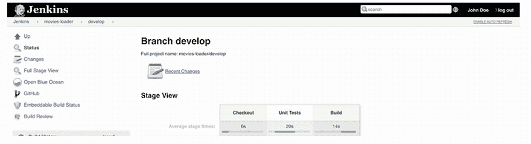

图 14.6 Jenkins 只读访问

到目前为止，你已经看到了如何创建和管理 Jenkins 用户，以及如何为这些用户授予细粒度的访问权限。然而，在一个大型组织中，为多个用户分配细粒度的权限可能会很繁琐。幸运的是，你可以在 Jenkins 中创建具有适当权限的不同角色，并将它们分配给不同的用户。

### 14.1.2 基于角色的授权策略

要管理不同的角色，请从插件管理页面安装基于角色的授权策略插件（[`plugins.jenkins.io/role-strategy/`](https://plugins.jenkins.io/role-strategy/))。然后从管理全局安全页面激活基于角色的策略选项，如图 14.7 所示。

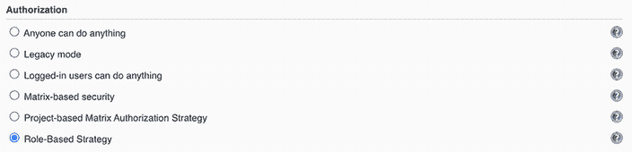

图 14.7 启用基于角色的授权策略插件

然后，你可以在管理 Jenkins 页面上通过选择管理并分配角色选项（图 14.8）来定义全局角色。请注意，只有当你正确安装了插件时，管理并分配角色才会可见。

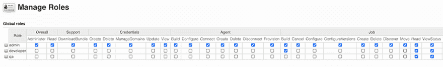

图 14.8 定义自定义角色

点击管理角色选项以添加新角色。创建三个具有适当权限的自定义角色：

+   *管理员*—将被分配给 Jenkins 管理员以获得对 Jenkins 的完全访问权限

+   *开发者*—将被分配给开发者以获得构建作业和查看其日志和状态的权限

+   *质量保证*—将被分配给软件质量保证工程师以查看作业状态/健康的权限

然后，从分配角色屏幕（图 14.9）将这些角色分配给特定的用户。在这些设置中，我们将管理员角色分配给管理员账户，将开发者角色分配给开发团队成员，将质量保证角色分配给软件质量保证人员。

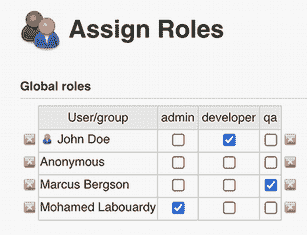

图 14.9 管理和分配角色

如果你在组织内部使用 Jenkins，创建和管理用户访问可能是一项繁琐的任务。你可以使用 GitHub 作为认证机制。

注意：你可以使用 Jenkins 配置许多 OAuth2 认证服务，包括 GitLab、Google 和 OpenID。

## 14.2 配置 Jenkins 的 GitHub OAuth

Jenkins 支持多个认证插件，除了内置的用户名和密码认证之外。如果你在组织内部使用 GitHub 作为版本控制系统，你也可以使用 GitHub OAuth 服务进行用户认证和权限管理。

在 Jenkins 上，从管理插件中安装 GitHub 认证插件（[`plugins.jenkins.io/github-oauth/`](https://plugins.jenkins.io/github-oauth/))。安装完成后，前往你的 GitHub 账户并创建一个新的应用程序（[`github.com/settings/applications/new`](https://github.com/settings/applications/new))，命名为 `Jenkins`，并使用图 14.10 中的设置。

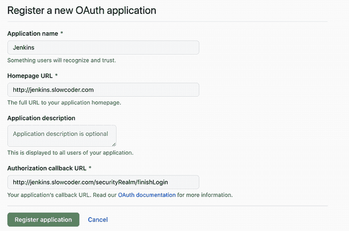

图 14.10 配置 GitHub OAuth 应用

授权回调 URL 必须是 JENKINS_URL/securityRealm/finishLogin。点击注册应用程序按钮。将生成客户端 ID 和密钥，如图 14.11 所示。保持页面打开以进行应用程序注册，以便可以将此信息复制到你的 Jenkins 配置中。

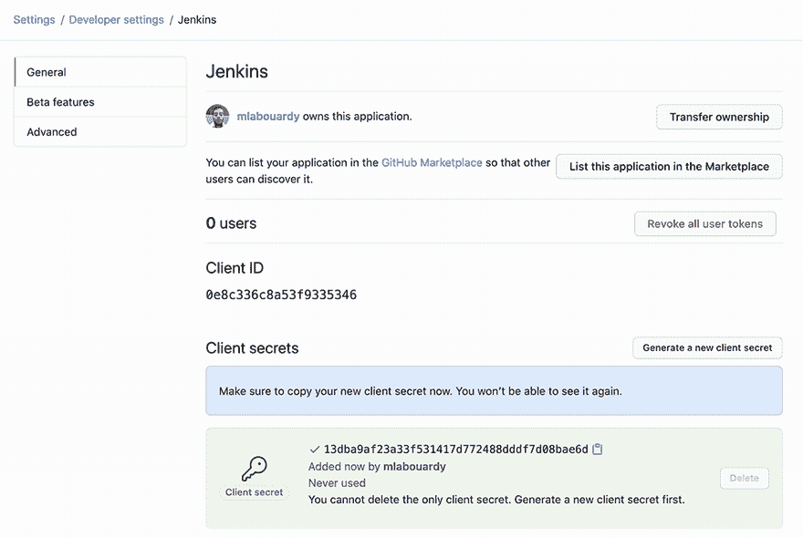

图 14.11 应用程序客户端 ID 和客户端密钥

返回 Jenkins，在全局安全配置中，将安全领域选项设置为 GitHub 认证插件。然后设置客户端 ID、客户端密钥和 OAuth 范围，如图 14.12 所示。


图 14.12 配置 Jenkins 客户端设置以进行 OAuth

点击保存和应用按钮以重新加载配置。你现在可以使用你的 GitHub 账户登录，如图 14.13 所示。

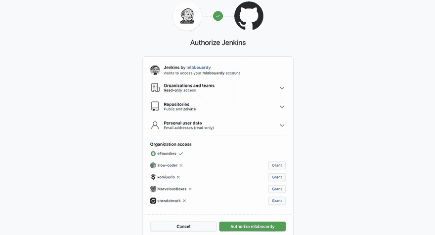

图 14.13 授权 Jenkins 访问您的 GitHub 账户

与经典的用户名和密码身份验证类似，您可以使用基于项目的矩阵授权策略来确定每个 GitHub 账户的 Jenkins 权限。

另一个选项是使用 GitHub 提交者授权策略。如果您选择此选项，可以使用 GitHub 仓库权限来确定每个 Jenkins 项目的权限。如果项目的 GitHub 仓库是公开的，所有经过身份验证的用户都将具有只读访问权限，而项目协作者可以构建、编辑、配置、取消或删除 Jenkins 作业。然而，如果项目的 GitHub 仓库是私有的，只有协作者才能管理 Jenkins 作业。

要根据 GitHub 访问权限确定 Jenkins 访问权限，请从“管理 Jenkins”转到“配置全局安全”部分（图 14.14）。

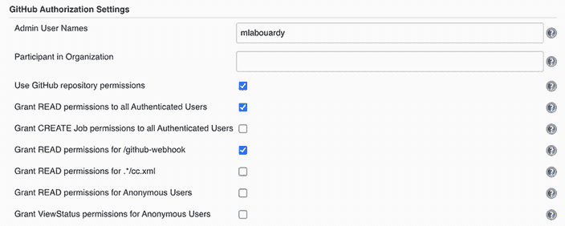

图 14.14 配置 GitHub 授权设置

注意：我们已经授权使用 /github-webhook 回调 URL 接收来自 GitHub 的 post-commit 钩子。

## 14.3 跟踪 Jenkins 用户操作

除了配置用户账户和访问权限之外，跟踪个别用户操作也可能很有用：换句话说，谁对您的 Jenkins 配置做了什么。这种审计跟踪功能在许多组织中对于安全合规性甚至是必需的。

Audit Trail 插件([`plugins.jenkins.io/audit-trail/`](https://plugins.jenkins.io/audit-trail/))会跟踪一组滚动日志文件中的主要用户操作。要设置此插件，请转到插件管理器页面，并在可用插件列表中选择 Audit Trail 插件。然后，像往常一样，在插件下载完成后，点击安装并重启 Jenkins。

要启用审计日志记录，请从主 Jenkins 配置页面配置插件。选择“日志文件”作为记录器；这样，插件将生成系统风格的日志文件。然后，设置日志位置（日志文件要写入的目录），如图 14.15 所示。当然，您需要确保运行您的 Jenkins 实例的用户有权写入此目录。

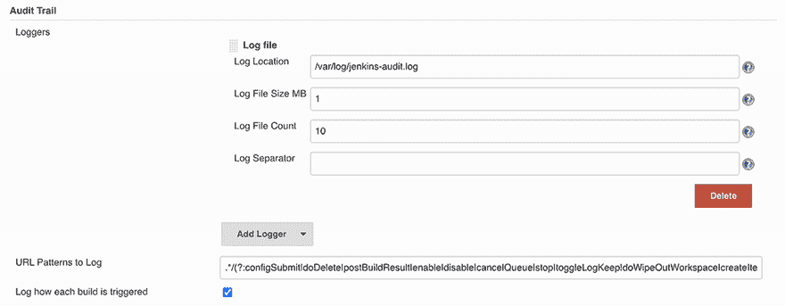

图 14.15 配置 Audit Trail 插件

默认情况下，审计日志中记录的详细信息相对较少——它们有效地记录了执行的关键操作，例如创建、修改或删除作业配置或视图，以及执行这些操作的用户。日志还显示了单个构建作业是如何启动的。图 14.16 显示了默认日志的摘录。

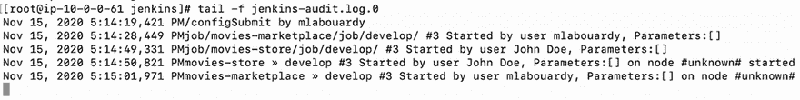

图 14.16 查看授权用户活动审计日志

您还可以配置要维护的日志文件数量以及每个文件的最大大小。在之前的配置中，我们将日志文件计数设置为 10；在这种情况下，Jenkins 将写入名为 jenkins-audit.log.0、jenkins-audit.log.1 ... jenkins-audit.log.9 的日志文件。现在，您可以访问整个服务器的配置历史，包括系统配置更新以及每个项目配置的更改。

注意：您可以将前面的配置进一步扩展，将这些日志文件流式传输到集中的 ELK 平台，并设置对未经授权用户活动的警报。有关分步指南，请返回第十三章。

## 14.4 使用共享库扩展 Jenkins

在整本书中，您已经学习了如何为多个应用程序编写 CI/CD 管道，在实现这些管道步骤时，我们已经调用了多个自定义函数。以下列表中显示的这些函数在多个 Jenkinsfiles 中重复出现。

列表 14.1 Git 和 Slack 的辅助函数

```
def commitAuthor(){
    sh 'git show -s --pretty=%an > .git/commitAuthor'
    def commitAuthor = readFile('.git/commitAuthor').trim()
    sh 'rm .git/commitAuthor'
    commitAuthor
}

def commitID() {}
def commitMessage() {}
def notifySlack(String buildStatus){}
```

因此，我们在不同的管道中有些共同的代码。为了避免在不同的管道中复制粘贴相同的代码，并减少冗余，我们可以在 Jenkins 中的共享库中集中这些共同代码。这样，我们就可以在所有管道中引用相同的代码。

*共享库*是一组存储在 Git 仓库中的独立 Groovy 脚本。这意味着您可以进行版本控制、打标签，并执行您习惯使用 Git 的所有操作。在我们编写第一个 Jenkins 共享库之前，我们需要创建一个 GitHub 仓库，其中将存储 Groovy 脚本。

在仓库内部，创建一个 vars 文件夹，并为每个函数编写一个 Groovy 脚本。例如，创建一个名为 commitAuthor.groovy 的文件，并定义一个名为`call`的函数。当调用`commitAuthor`指令时，将执行函数的主体，如下所示。

列表 14.2 在共享库中定义全局变量

```
#!/usr/bin/env groovy                                        ❶

def call() {                                                 ❷
 sh 'git show -s --pretty=%an > .git/commitAuthor'           ❸
 def commitAuthor = readFile('.git/commitAuthor').trim()     ❸
 sh 'rm .git/commitAuthor'                                   ❸
 commitAuthor                                                ❸
}
```

❶ 在您的路径中搜索 Groovy 以执行脚本

❷ 允许以类似于步骤的方式调用全局变量

❸ 打印 Git 提交作者

注意，Groovy 脚本必须实现`call`方法。在花括号`{}`内编写您的自定义代码。您还可以向您的函数添加参数。对其他函数也这样做，并将更改推送到远程仓库。最终，您的仓库应该看起来像图 14.17 所示。

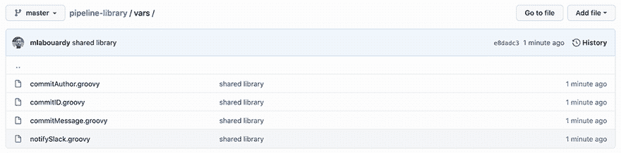

图 14.17 共享库自定义全局变量

现在您已经使用自定义步骤创建了您的库，您需要通知 Jenkins。要添加共享库，请转到作业配置。在 Pipeline Libraries 下，添加具有以下设置的库：

+   *名称*—在管道脚本中将使用的简短标识符

+   *默认版本*—可以是 Git 能理解的任何内容，例如分支、标签或提交 ID 哈希

接下来，从图 14.18 所示的 GitHub 仓库的 master 分支加载库。

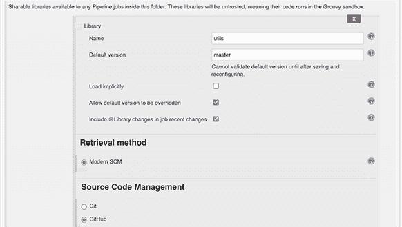

图 14.18 从 GitHub 加载共享库

注意：你还可以在“管理 Jenkins”>“配置系统”>“全局管道库”中全局定义共享库。这样，所有管道都可以使用在此库中实现的功能。

要在管道中加载共享库，你需要使用管道定义顶部的 `@Library` 注解来导入它。然后通过其名称调用目标函数，如下面的列表所示。

列表 14.3 在脚本管道中导入共享库

```
@Library('utils')_      ❶

node('workers'){
 stage('Checkout'){
    checkout scm
    notifySlack 'STARTED'
 }
}
```

❶ 如果紧跟在 `@Library` 注解之后的行不是导入语句，则需要下划线。

下划线不是打字错误或错误；如果紧跟在 `@Library` 注解之后的行不是导入语句，你需要这个下划线。你可以使用 `@Library('id@version')` 注解覆盖为库定义的默认版本。

如果你使用的是声明式管道，你需要将库名称包裹在库部分中，如下面的列表所示。

列表 14.4 在声明式管道中导入共享库

```
libraries {
     lib('utils')
 }
 pipeline {
     // Your pipeline would go here....
 }
```

当使用库时，你也可以指定以下格式的版本：

```
 libraries {
     lib('utils@VERSION')
 }
```

运行前面的管道，输出应该类似于图 14.19。

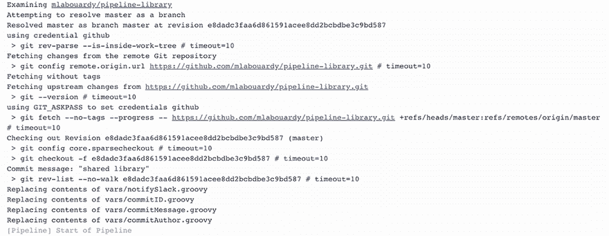

图 14.19 在管道中从 Git 加载共享库。

编写库的另一种方法是定义 Groovy 类中的函数。在 src/com/labouardy/utils 中创建 `Git.groovy` 类，如下面的列表所示。

列表 14.5 编写共享库

```
#!/usr/bin/env groovy
package com.labouardy.utils

class Git {
   Git(){}

   def commitAuthor() {
       sh 'git show -s --pretty=%an > .git/commitAuthor'
       def commitAuthor = readFile('.git/commitAuthor').trim()
       sh 'rm .git/commitAuthor'
       commitAuthor
   }

   def commitID() {
       sh 'git rev-parse HEAD > .git/commitID'
       def commitID = readFile('.git/commitID').trim()
       sh 'rm .git/commitID'
       commitID
   }

   def commitMessage() {
       sh 'git log --format=%B -n 1 HEAD > .git/commitMessage'
       def commitMessage = readFile('.git/commitMessage').trim()
       sh 'rm .git/commitMessage'
       commitMessage
   }
}
```

你可以通过选择它们的完全限定名称来加载库中定义的类：

```
@Library('utils') import com.labouardy.utils.Git
this.commitAuthor()
```

或者你可以创建一个对象构造函数，然后从对象中调用方法：

```
def gitUtils = new Git(this)
gitUtils.commitAuthor
```

注意：通过使用 `@Grab` 注解，你可以从受信任的库代码中使用 Maven Central ([`search.maven.org/`](https://search.maven.org/)) 中找到的第三方 Java 库。有关详细信息，请参阅 Grape 文档 ([`mng.bz/nrxg`](http://mng.bz/nrxg))。

## 14.5 备份和恢复 Jenkins

备份数据是一种普遍推荐的做法，你的 Jenkins 服务器不应例外。幸运的是，备份 Jenkins 相对容易。在本节中，我们将探讨几种备份的方法。

在 Jenkins 中，所有设置、构建日志和归档的工件都存储在 `$JENKINS_HOME` 目录下。你可以手动备份该目录，或者使用像 ThinBackup ([`plugins.jenkins.io/thinBackup/`](https://plugins.jenkins.io/thinBackup/)) 这样的插件。该插件提供了一个简单的用户界面，你可以使用它来备份和恢复你的 Jenkins 配置和数据。

安装插件后，您需要配置备份目录，如图 14.20 所示。指定备份目录为/var/lib/backups。确保 Jenkins 有写入权限！

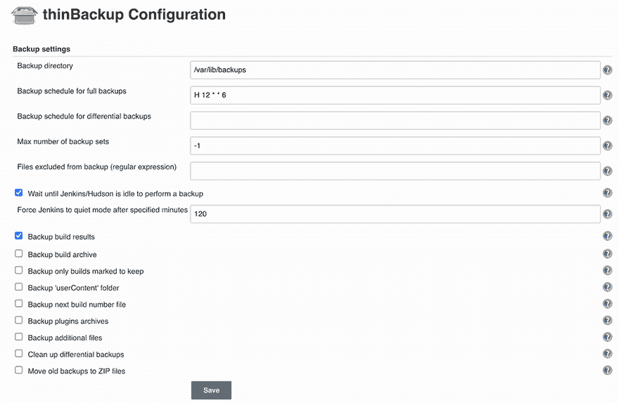

图 14.20 配置 ThinBackup 插件

现在，您可以通过点击“立即备份”选项来测试备份是否正常工作。它将在设置中指定的备份目录中创建 Jenkins 数据的备份：

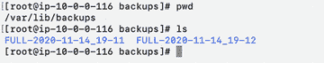

要恢复以前的配置，只需转到“恢复”页面并选择您希望恢复的配置日期，如图 14.21 所示。一旦配置已恢复到之前的状态，您需要从磁盘重新加载 Jenkins 配置或重启 Jenkins。


图 14.21 恢复以前的配置

由于备份，在数据损坏或人为事件发生的情况下，您可以从较早的时间点恢复 Jenkins。

注意：ThinBackup 插件将备份存储在本地以供生产使用。强烈建议将备份存储在远程服务器上或挂载外部数据存储。

如果您不喜欢插件，您可以在 Jenkins 上设置一个 cron 作业（下一节将提供更多详细信息）来安排定期备份。它将备份位于/var/lib/jenkins 的所有内容到远程存储库，如以下列表所示。

列表 14.6 将$JENKINS_HOME 文件夹备份到 S3 存储桶

```
cd $JENKINS_HOME
BACKUP_TIME=$(date +'%m.%d.%Y')
zip -r backup-${BACKUP_TIME} .
aws s3 cp  backup-${BACKUP_TIME} s3://BUCKET/
```

有时您需要将 Jenkins 构建作业从一个 Jenkins 实例移动或复制到另一个实例，而不复制整个 Jenkins 配置。例如，您可能正在将构建作业迁移到全新实例上的 Jenkins 服务器。

您可以通过简单地复制或移动构建作业目录到新的 Jenkins 实例来在项目实例之间复制或移动构建作业。我已经构建了一个名为 Butler 的开源 CLI（[`github.com/mlabouardy/butler`](https://github.com/mlabouardy/butler)），以便轻松导入/导出 Jenkins 作业和插件。

要开始，找到适合您系统的适当软件包并下载它。以下是 Linux 的命令：

```
wget https://s3.us-east-1.amazonaws.com/butlercli/1.0.0/linux/butler
chmod +x butler
cp butler /usr/local/bin/
```

通过打开新的终端会话并检查 Butler 是否可用来验证安装是否成功。要导出 Jenkins 插件，您需要提供 Jenkins URL：

```
butler jobs export --server JENKINS_URL --username USERNAME --password PASSWORD
```

每次在 Jenkins 中创建一个新的工作目录，每个工作都会有一个自己的配置文件，config.xml。

要导入插件，请运行`butler plugins export`命令。Butler 将列出已安装的插件到 stdout，并生成一个新文件，plugins.txt，其中包含已安装的 Jenkins 插件的名称和版本对，如图 14.22 所示。

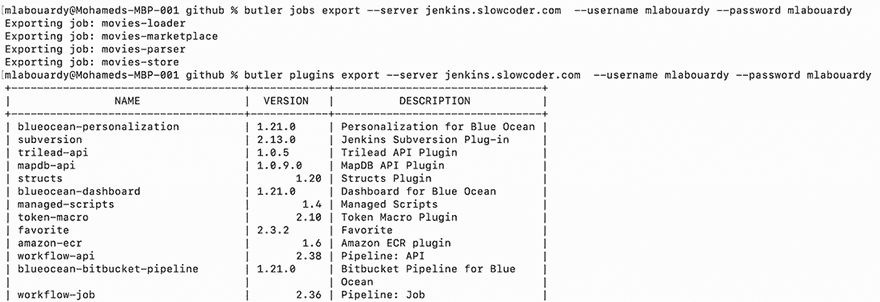

图 14.22 已安装 Jenkins 插件的列表

您可以使用 `butler plugins/jobs import` 命令导入导出的作业和插件。Butler 将使用导出的文件向目标 Jenkins 实例发出 API 调用来导入插件和作业。

因此，总的来说，在 Jenkins 实例之间迁移构建作业并不那么困难——您只需要知道一些针对特殊情况的小技巧，并且如果您知道在哪里查找，Jenkins 提供了一些很好的工具来使过程更顺畅。

如果您希望 $JENKINS_HOME 内容即使在 Jenkins 主实例重启或关闭后也能在磁盘上持久化，您可以在 $JENKINS_HOME 文件夹上挂载一个远程文件系统。

如果您在 AWS 上运行 Jenkins，可以使用 AWS 的一项服务，称为 Amazon Elastic File System（EFS）。通过单击创建文件系统按钮（图 14.23）在 EFS 上创建一个文件系统。

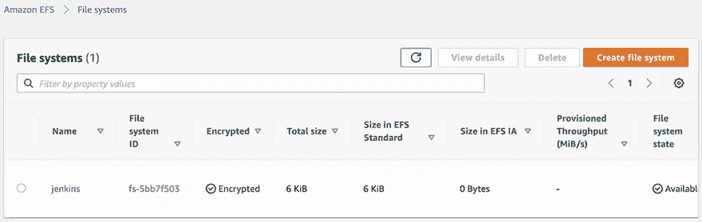

图 14.23 创建 Amazon EFS 文件系统

一旦文件系统创建并处于可用状态，请在 /var/lib/jenkins 目录下挂载 EFS 文件系统，这样所有配置都将保存在 EFS 中：

```
sudo mount -t nfs4 
-o nfsvers=4.1,rsize=1048576,wsize=1048576,
hard,timeo=600,retrans=2,noresvpor.
EFS_ID.efs.REGION.amazonaws.com:/ /var/lib/jenkins/
```

如果您想测试它，终止您的 EC2 实例，将自动启动一个新的具有相同配置的实例（确保在烘焙 Jenkins 主 AMI 时将挂载命令添加到 Packer 模板中）。

## 14.6 使用 Jenkins 设置 cron 作业

Jenkins 提供了一个类似于 cron 的功能，用于定期构建项目。此功能主要用于运行计划构建，如夜间/周构建或运行测试。例如，您可能希望在用户不访问测试的后端时，在夜间运行 Android 或 iOS 发布的性能测试或集成测试。

要配置一个在特定日期和时间运行的计划夜间构建，请转到 Jenkins 仪表板。创建一个新的作业并选择 Freestyle Project。根据图 14.24 中的作业详情进行相应配置。

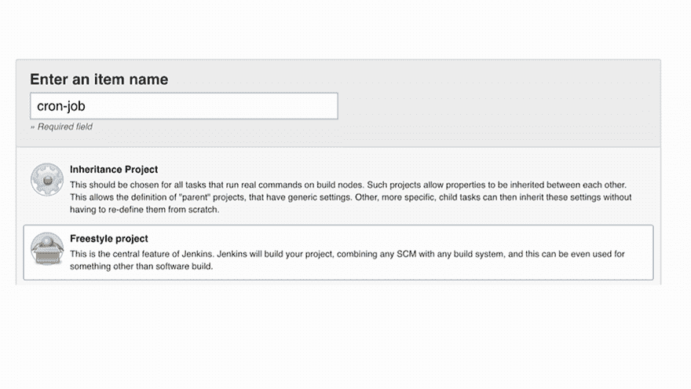

图 14.24 创建 Freestyle 项目

通过在构建触发器选项卡中编写图 14.25 中所示的 cron 语法，并选择构建周期性选项，来安排您的构建。填写一个 cron 类似的值，以触发管道执行的所需时间。

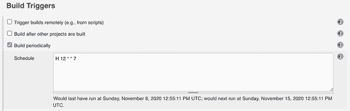

图 14.25 定义 cron 作业表达式

Jenkins 使用 cron 表达式，字段如下。

+   MINUTES — 一小时中的分钟数（0–59）

+   HOURS — 一天中的小时数（0–23）

+   DAYMONTH — 一个月中的某一天（1–31）

+   MONTH — 一年中的月份（1–12）

+   DAYWEEK — 周中的某一天（0–7），其中 0 和 7 是周日

例如（图 14.26），要在周日午夜触发构建，cron 值 `H 12 * * 7` 就可以完成这项工作。

注意：您应该知道时区是相对于您的 Jenkins 虚拟机运行的位置而言的。此示例使用协调世界时（UTC）。

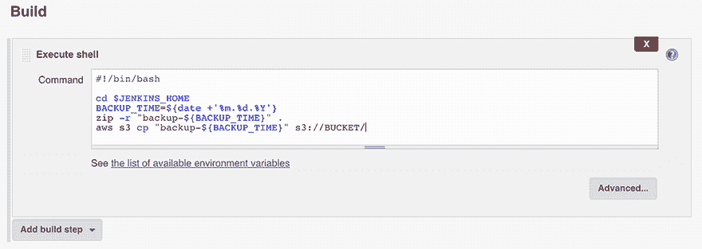

图 14.26 备份 $JENKINS_HOME 文件夹的 Shell 脚本

构建你的作业以测试一切是否按预期工作。你的构建结果应类似于图 14.27。

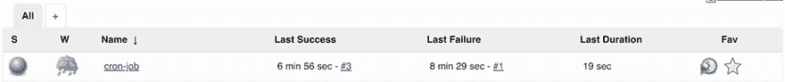

图 14.27 手动触发 cron 作业

下次，你的作业将在午夜 12:00 自动执行，因为你已经使用 cron 语法安排了在此时间运行。

Jenkins 作业可以通过程序方式运行，使用 API 调用或 Jenkins CLI。这为通过集成外部服务（如 AWS Lambda）根据不同事件调用 Jenkins 构建作业以实现复杂的计划构建提供了机会；参见图 14.28。

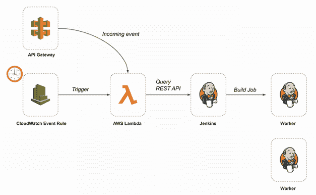

图 14.28 从 Lambda 函数触发 Jenkins 作业

此图说明了如何通过 Jenkins RESTful API 从 Lambda 函数触发 Jenkins 构建作业。Lambda 函数在即将到来的 CloudWatch 事件规则（云管理的 cron 作业）或来自 API Gateway 的 HTTPS 请求上被调用。

## 14.7 在本地作为 Docker 容器运行 Jenkins

如果你需要调试 Jenkins 或测试新的插件，你可以在你的机器上本地部署 Jenkins 并将其作为 Docker 容器运行。这样，你可以轻松创建和销毁 Jenkins 服务器。

你可以使用来自 DockerHub 仓库的官方 Jenkins Docker 镜像（[`hub.docker.com/_/jenkins`](https://hub.docker.com/_/jenkins)）。该镜像包含 Jenkins 的当前 LTS 版本（在撰写本文时为 v2.60.3）。

要开始，在你的终端中，使用以下命令在 Docker 中创建一个桥接网络：

```
docker network create jenkins
```

我们需要 Docker 守护进程来动态配置 Jenkins 工作节点。这就是为什么我们将基于 Docker 镜像部署一个 Docker 容器：

```
docker run -d --name docker --privileged 
--network jenkins --network-alias docke.
--env DOCKER_TLS_CERTDIR=/cert.
--volume jenkins-docker-certs:/certs/clien.
--volume jenkins-data:/var/jenkins_hom.
--publish 2376:2376 docker:dind
```

为了避免暴露在主机机器上运行的 Docker 守护进程（/var/run.docker.sock），我们将运行一个提供自助和短暂 Docker 引擎的 Docker 容器，Jenkins 将使用它而不是工作机的 Docker 引擎。这种模式被称为 *Docker in Docker*，或 *嵌套容器化*。

我们将覆盖 Jenkins 官方镜像以安装 Docker CLI 和 Jenkins 所需的插件。创建一个包含以下列表内容的 Dockerfile。

列表 14.7 构建自定义 Jenkins 镜像的 Dockerfile

```
FROM jenkins/jenkins:lts
MAINTAINER mlabouardy <mohamed@labouardy.com>

USER root
RUN apt-get update && apt-get install -y apt-transport-https \
      ca-certificates curl gnupg2 \
      software-properties-common
RUN curl -fsSL https://download.docker.com/linux/debian/gpg | apt-key add -
RUN apt-key fingerprint 0EBFCD88
RUN add-apt-repository \
      "deb [arch=amd64] https://download.docker.com/linux/debian \
      $(lsb_release -cs) stable"
RUN apt-get update && apt-get install -y docker-ce-cli      ❶
USER jenkins                                                ❷
RUN jenkins-plugin-cl.
--plugins blueocean:1.24.3 workflow-aggregator:2..
github:1.32.0 docker-plugin:1.2.1                           ❸
```

❶ 安装 Docker 社区版（CE）客户端

❷ 切换到 Jenkins 用户，以避免默认以特权模式运行容器

❸ 安装 Jenkins 插件

此 Dockerfile 执行以下操作：

+   安装 Docker 社区版 CLI

+   安装 Jenkins 插件，包括以下内容：

    +   *Blue Ocean*—对 CD 管道的高级可视化，快速直观地理解软件管道状态

    +   *Workflow*—一套插件，允许你将管道作为代码（Jenkinsfiles）编写

    +   *GitHub*—GitHub API 集成和对 Git 操作的支持

+   *Docker*—允许你在 Docker 容器上配置 Jenkins 工作节点

从此 Dockerfile 构建一个新的 Docker 镜像，并为镜像分配一个有意义的名称：

```
docker build -t jenkins-custom:lts .
```

然后，使用以下`docker` `run`命令基于构建的镜像部署容器：

```
docker run -d --name jenkins --network jenkins 
--env DOCKER_HOST=tcp://docker:2376
--env DOCKER_CERT_PATH=/certs/clien.
--env DOCKER_TLS_VERIFY=.
--publish 8080:8080 --publish 50000:5000.
--volume jenkins-data:/var/jenkins_hom.
--volume jenkins-docker-certs:/certs/client:r.
jenkins-custom:lts
```

此命令将 Docker 卷映射到/var/jenkins_home 文件夹。如果你需要重新启动或恢复 Jenkins 实例，所有状态都存储在 Docker 卷中。

你也可以通过编写 docker-compose.yml 文件来构建和部署所有服务，如下所示。

列表 14.8 Grok 自定义模式定义

```
version: "3.8"

services:
 docker:
   image: docker:dind
   ports:
     - "2376:2376"
   networks:
     jenkins:
         aliases:
           - docker
   environment:
     - DOCKER_TLS_CERTDIR=/certs
   volumes:
     - jenkins-docker-certs:/certs/client
     - jenkins-data:/var/jenkins_home
   privileged: true

 jenkins:
   build: .
   ports:
     - "8080:8080"
     - "50000:50000"
   networks:
     - jenkins
   environment:
     - DOCKER_HOST=tcp://docker:2376
     - DOCKER_CERT_PATH=/certs/client
     - DOCKER_TLS_VERIFY=1
   volumes:
     - jenkins-data:/var/jenkins_home
     - jenkins-docker-certs:/certs/client:ro

volumes:
 jenkins-docker-certs: {}
 jenkins-data: {}

networks:
 jenkins:
```

运行`docker-compose up`，Docker Compose 将启动并运行 Jenkins。

访问 localhost:8080；你应该看到登录页面。作为 Jenkins 设置的一部分，我们需要查看容器实例内的密码；使用容器 ID（或名称）并运行`docker exec`命令：

```
docker container exec ID sh -c "cat /var/jenkins_home/secrets/initialAdminPassword"
```

运行命令后，你应该看到代码。将其复制并粘贴到仪表板上以解锁 Jenkins；见图 14.29。

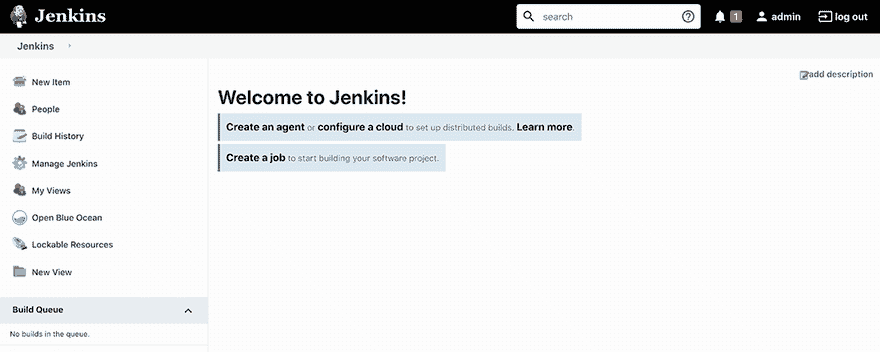

图 14.29 Jenkins 服务器在 Docker 容器内运行

要设置工作者，选择“管理 Jenkins”和“系统配置”。然后在云部分点击“配置”标签。Docker 选项将可用。将 Docker URI 设置为`tcp://docker:2376`，如图 14.30 所示。点击“测试”按钮以检查连接。

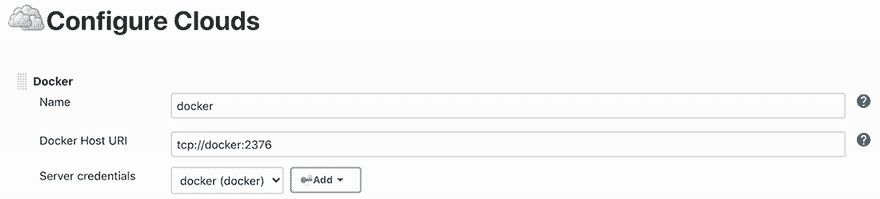

图 14.30 在 Jenkins 上配置 Docker 远程 API

Docker API 应该返回一个错误：“服务器向 HTTPS 客户端返回 HTTP 响应”。你需要配置客户端 TLS 证书以连接到 Docker 守护进程。证书可以在 Jenkins 容器内的/certs/client 文件夹中找到。

创建一个新的 Jenkins 凭据，类型为证书，并设置以下设置：

+   *客户端密钥*—/certs/client/key.pem 内容

+   *客户端证书*—/certs/client/cert.pem 内容

+   *服务器 CA 证书*—/certs/client/ca.pem 内容

凭据设置应类似于图 14.31 中的设置。

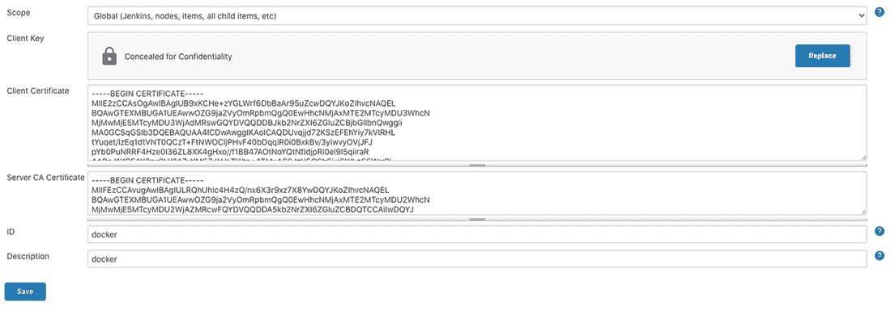

图 14.31 Jenkins 服务器在本地 Docker 容器内部署

然后，我们需要定义一个代理模板，如图 14.32 所示；此模板是启动 Jenkins 工作者的蓝图。你需要一个可以用来运行 Jenkins 代理运行时的 Docker 镜像。你可以使用 jenkins/ssh-agent ([`hub.docker.com/r/jenkins/ssh-agent`](https://hub.docker.com/r/jenkins/ssh-agent))作为 Jenkins 工作者的基础。该镜像已安装了 SSHD（当你尝试通过 SSH 连接时，它会监听传入的连接）。

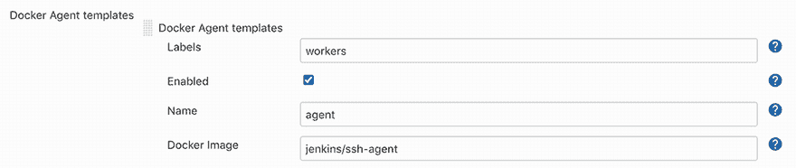

图 14.32 配置新的 Docker 代理模板

你还可以构建一个包含所有依赖项和构建项目所需的软件包的自定义 Docker 代理镜像。为了测试它，创建一个新的 Jenkins 管道，内容如图 14.33 所示。

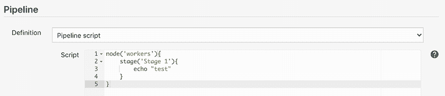

图 14.33 新的内联管道

通过点击左侧导航菜单中的“立即构建”链接来触发管道；作业将启动一个容器并执行管道（图 14.34）。

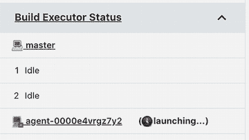

图 14.34 基于 Docker 容器启动 Jenkins 代理

代理将在每次构建后动态配置并停止。

## 摘要

+   您可以通过编写 Jenkins 共享库来在多个管道中共享通用代码和步骤。

+   您可以使用矩阵授权策略插件对每个项目的用户/组权限进行细粒度控制。

+   您还可以使用角色策略插件创建一个具有权限列表的自定义角色，并将该角色分配给用户，而不是为每个用户分配适当的权限。

+   在您的 Jenkins 实例中实现身份验证时，请使用 GitHub 自己的身份验证方案。

+   Docker 插件将在 Docker 容器内运行动态 Jenkins 代理。

## 总结

我们在这本书中的旅程即将结束。您了解了 Jenkins 和代码化管道方法。您发现了针对云原生应用的几个 CI/CD 实现，例如 Kubernetes 中的容器化应用和无服务器应用。您设计和部署了云上的 Jenkins 集群以实现可扩展性，并精通了 Jenkins 的监控和故障排除。

技术变化迅速，因此拥有一些可以获取最新新闻和信息资源的渠道是非常好的。每周的 DevOps Bulletin ([`devopsbulletin.com`](https://devopsbulletin.com)) 特集了一系列关于 PaC 和 DevOps 领域最新奇的文章。我还建议关注 DevOps World ([`www.devopsworld.com`](http://www.devopsworld.com))，在那里您可以受到专家和同行的启发，并获得您在组织内部和整体上塑造软件交付未来的工具。

我希望您喜欢这本书，并从中有所收获。PaC 仍然很新，但意识正在迅速增长。在未来几年里，您将看到许多大小组织都将采用 PaC 以实现更快发布并缩短反馈循环。
