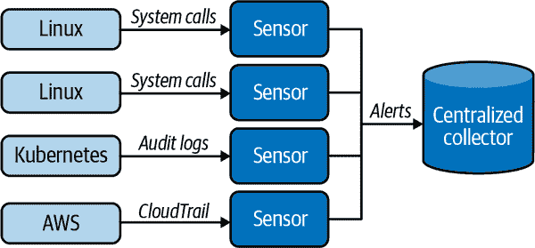
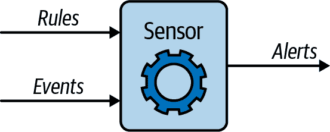

# 第一章：介绍 Falco

这本书的第一章的目标是解释什么是 Falco。别担心，我们会循序渐进！我们首先将看看 Falco 的功能，包括其功能的高层视图和每个组件的简介描述。我们将探讨启发 Falco 并至今指导其发展的设计原则。然后，我们将讨论你可以用 Falco 做什么，以及它所不涵盖的领域，以及你可以用其他工具更好地完成的任务。最后，我们将提供一些历史背景来全面看待这些事情。

# Falco 简介

在最高层面上，Falco 非常直接：通过在分布式基础设施中安装多个*sensors*来部署它。每个传感器收集数据（从本地机器或通过某些 API 通信），对其运行一组规则，并在发生问题时通知你。图 1-1 展示了其工作原理的简化图表。



###### 图 1-1 Falco 的高层架构

你可以把 Falco 想象成你基础设施的安全摄像头网络：你在关键位置放置传感器，它们观察发生的情况，并在检测到有害行为时通知你。对于 Falco 来说，不良行为由社区为你创建和维护的一组规则定义，你可以根据需要自定义或扩展。由你的 Falco 传感器群生成的警报理论上可以留在本地机器上，但实际上它们通常会导出到一个集中的收集器。为了集中警报收集，你可以使用通用安全信息与事件管理（SIEM）工具或类似 Falcosidekick 的专业工具。（我们将在第十二章中详细介绍警报收集。）

现在让我们深入了解 Falco 架构，探索其主要组件，从传感器开始。

## 传感器

图 1-2 展示了 Falco 传感器的工作原理。



###### 图 1-2 Falco 传感器架构

传感器包括一个引擎，具有两个输入：数据源和一组规则。传感器对来自数据源的每个事件应用规则。当规则匹配事件时，将生成输出消息。非常直接明了，对吧？

## 数据源

每个传感器能够从多个来源收集输入数据。最初，Falco 被设计为专门处理系统调用，迄今仍然是其最重要的数据源之一。我们将在第三章和第四章中详细介绍系统调用，但现在您可以将其视为运行程序用于与外部世界交互的方式。打开或关闭文件，建立或接收网络连接，从磁盘或网络读取和写入数据，执行命令，使用管道或其他类型的进程间通信与其他进程通信等都是系统调用的使用示例。

Falco 通过在 Linux 操作系统（OS）的内核中进行仪器化来收集系统调用。它可以通过两种不同的方式实现：部署内核模块（即可安装在操作系统内核中以扩展内核功能的可执行代码片段）或使用称为 eBPF 的技术，该技术允许在 OS 内部安全执行操作。我们将在第四章中广泛讨论内核模块和 eBPF。

利用这些数据，Falco 可以极大地增强对基础设施中发生的一切事情的可见性。以下是 Falco 可以为您检测到的一些示例：

+   特权升级

+   访问敏感数据

+   所有权和模式更改

+   意外的网络连接或套接字变化

+   未经授权的程序执行

+   数据外泄

+   合规性违规

Falco 还可以扩展到除系统调用之外的其他数据源（我们将在整本书中为您展示示例）。例如，Falco 可以实时监视您的云日志，并在云基础设施发生问题时通知您。以下是它可以为您检测到的一些更多示例：

+   当用户未经多因素身份验证登录时

+   当云服务配置被修改时

+   当有人访问 Amazon Web Services（AWS）S3 存储桶中的一个或多个敏感文件时

Falco 经常添加新的数据源，因此我们建议查看[网站](https://falco.org)和[Slack 频道](https://oreil.ly/Y4bUt)以了解最新信息。

## 规则

*规则*告诉 Falco 引擎如何处理来自源的数据。它们允许用户以紧凑且易读的格式定义策略。Falco 预装了一套全面的规则，涵盖主机、容器、Kubernetes 和云安全，您可以轻松创建自己的规则来自定义它。我们将在第七章和第十三章中详细讨论规则；在阅读完本书后，您将成为规则的专家。以下是一个示例来激发您的兴趣：

```
- rule: shell_in_container
  desc: shell opened inside a container
  condition: spawned_process and container.id != host and proc.name = bash
  output: shell in a container (user=%user.name container_id=%container.id)
  Source: syscall
  priority: WARNING
```

此规则检测容器内启动 bash shell 的情况，这在不可变的基于容器的基础设施中通常不是一件好事。规则的核心条目是*条件*，告诉 Falco 要查看什么，以及*输出*，即条件触发时 Falco 将告诉您的内容。正如您所见，条件和输出都作用于*字段*，这是 Falco 的核心概念之一。条件是一个布尔表达式，它结合了对字段与值的检查（本质上是一个过滤器）。输出是文本和字段名称的组合，其值将在通知中打印出来。其语法类似于编程语言中的`print`语句。

这是否让你想起像 tcpdump 或 Wireshark 这样的网络工具？很有眼光：它们是 Falco 的重要灵感来源。

## 数据丰富

丰富的数据源和灵活的规则引擎帮助使 Falco 成为一个强大的运行时安全工具。此外，来自各种提供者的元数据丰富了其检测能力。

当 Falco 告诉您发生了某事，例如系统文件已被修改，通常您需要更多信息来理解问题的原因和范围。是哪个进程做的？这发生在容器中吗？如果是，容器和镜像的名称是什么？发生这种情况的服务/命名空间是什么？这是在生产环境还是开发环境中进行的更改？这是由 root 用户做出的改变吗？

Falco 的数据丰富引擎通过构建环境状态来帮助回答所有这些问题，包括运行中的进程和线程、它们打开的文件、它们所在的容器和 Kubernetes 对象等。所有这些状态对 Falco 的规则和输出都是可访问的。例如，您可以轻松地将规则范围限定为仅在生产环境或特定服务中触发。

## 输出通道

每当触发规则时，对应的引擎会发出输出通知。在最简单的配置中，引擎将通知写入标准输出（正如你可以想象的那样，通常不是很有用）。幸运的是，Falco 提供了复杂的输出路由方式，可以将输出定向到多个地方，包括日志收集工具、像 S3 这样的云存储服务，以及像 Slack 和电子邮件这样的通信工具。其生态系统包括一个名为 Falcosidekick 的精彩项目，专门设计用于将 Falco 连接到世界上，并使输出收集变得轻松（详见第十二章了解更多信息）。

## 容器和更多

Falco 专为现代云原生应用程序设计，因此在容器、Kubernetes 和云端具有出色的开箱即用支持。由于本书是关于云原生安全的，我们将主要关注这一点，但请记住，Falco 并不局限于在云中运行的容器和 Kubernetes。您绝对可以将其用作主机安全工具，它的许多预加载规则可以帮助您保护 Linux 服务器群。Falco 还对网络检测有很好的支持，允许您检查连接、IP 地址、端口、客户端和服务器的活动，并在它们展示不良或意外/非典型行为时收到警报。

# Falco 的设计原则

现在您了解了 Falco 的功能后，让我们谈谈它为什么会成为现在这个样子。当您开发一个非常复杂的软件时，重要的是专注于正确的使用案例并优先考虑最重要的目标。有时候这意味着要接受一些权衡。Falco 也不例外。它的开发受到一组核心原则的指导。在本节中，我们将探讨为什么选择了这些原则以及它们如何影响 Falco 的架构和功能集。了解这些原则将帮助您判断 Falco 是否适合您的使用案例，并帮助您充分利用它。

## 专为运行时优化

Falco 引擎旨在在您的服务和应用程序运行时检测威胁。当它检测到不良行为时，Falco 应该立即（最多几秒钟内）向您发出警报，以便您能够立即获得信息并做出反应，而不是在几分钟或几小时后才做出反应。

这一设计原则体现在三个重要的架构选择中。首先，Falco 引擎被设计为流式引擎，能够在数据到达时快速处理数据，而不是存储数据然后再处理。其次，它被设计为独立评估每个事件，而不是根据事件序列生成警报；这意味着即使可以，也不把相关事件作为主要目标，事实上是不鼓励的。第三，Falco 尽可能在数据源附近评估规则。如果可能的话，在处理数据之前避免传输信息，并倾向于在端点部署更丰富的引擎。

## 适用于生产环境

您应该能够在任何环境中部署 Falco，包括生产环境，稳定性和低开销至关重要。它不应该使您的应用崩溃，并且应该尽可能地减少对其性能的影响。

这一设计原则影响数据收集架构，特别是当 Falco 运行在具有多个进程或容器的端点时。Falco 的驱动程序（内核模块和 eBPF 探针）经历了多次迭代和多年测试，以保证其性能和稳定性。通过接入操作系统内核来收集数据，而不是对被监控的进程/容器进行仪表化，确保您的应用程序不会因 Falco 中的错误而崩溃。

Falco 引擎采用 C++ 编写，并采用多种手段来降低资源消耗。例如，它避免处理读取或写入磁盘或网络数据的系统调用。在某些方面，这是一种限制，因为它阻止用户创建检查有效负载内容的规则，但这也确保 CPU 和内存消耗保持较低水平，这更为重要。

## 无意图仪表化

Falco 设计用于观察应用程序行为，而无需用户重新编译应用程序、安装库或重建带监控钩子的容器。在现代容器化环境中，这非常重要，因为对每个组件应用更改将需要不切实际的工作量。它还确保 Falco 能够看到每个进程和容器，无论其来源、由谁运行或存在多长时间。

## 优化以在边缘运行

与其他策略引擎（例如 OPA）相比，Falco 明确设计为具有分布式、多传感器架构。其传感器设计轻量、高效且可移植，并能在各种环境中运行。它可以部署在物理主机、虚拟机或容器中。Falco 二进制文件适用于多个平台，包括 ARM。

## 避免移动和存储大量数据

大多数当前市场上的威胁检测产品基于向集中式 SIEM 工具发送大量事件，然后在收集的数据上执行分析。Falco 围绕着一个非常不同的原则设计：尽可能靠近端点执行检测，并只向集中式收集器发送警报。这种方法导致解决方案在执行复杂分析方面略显能力不足，但操作简单、成本效益更高，并且在水平方向上具有很好的扩展性。

## 可扩展

谈到规模，Falco 的另一个重要设计目标是应该能够扩展以支持全球最大的基础设施。如果你可以运行它，Falco 应该能够保护它。正如我们刚才描述的，保持有限的状态和避免集中存储是这一目标的重要组成部分。边缘计算也是一个重要因素，因为分发规则评估是实现 Falco 工具真正水平扩展的唯一方法。

可扩展性的另一个关键部分是端点仪表化。Falco 的数据收集堆栈不使用诸如旁路、库链接或进程仪表化等技术。原因是所有这些技术的资源利用率随要监视的容器、库或进程数量增加而增长。繁忙的机器有许多容器、库和进程——对于这些技术来说太多了，但它们只有一个操作系统内核。在内核中捕获系统调用意味着您只需要一个 Falco 传感器每台机器，无论这台机器有多大活动量。这使得在具有大量活动的大型主机上运行 Falco 成为可能。

## 真实的

使用系统调用作为数据源的另一个好处？系统调用永远不会撒谎。Falco 难以逃避，因为它用于收集数据的机制非常难以禁用或规避。如果您试图逃避或规避它，您将留下 Falco 可以捕获的痕迹。

## 坚固的默认设置，丰富的可扩展性

另一个关键的设计目标是尽量减少从 Falco 中提取价值所需的时间。您只需安装它即可完成这一目标；除非您有高级需求，否则不需要进行定制。

尽管如此，每当确实需要定制时，Falco 提供了灵活性。例如，您可以通过丰富而表达性强的语法创建新规则，开发和部署扩展检测范围的新数据源，并将 Falco 集成到您想要的通知和事件收集工具中。

## 简单

简单性是支持 Falco 的最后一个设计选择，但也是最重要的选择之一。Falco 规则语法设计为紧凑、易读和易学习。在可能的情况下，Falco 规则条件应该适合一行。任何人，不仅仅是专家，都应该能够编写新规则或修改现有规则。如果这降低了语法的表达能力也没关系：Falco 的业务是提供高效的安全规则引擎，而不是完整的领域特定语言。对于那些，有更好的工具。

简单性还体现在扩展 Falco 以警报新数据源并与新云服务或容器类型集成的过程中，这只需编写任何语言的插件，包括 Go、C 和 C++。Falco 可以轻松加载这些插件，您可以使用它们来支持新的数据源或新的字段以用于规则中。

# 使用 Falco 可以做什么

Falco 在运行时和实时检测威胁、入侵和数据盗窃方面表现突出。它在传统基础设施上运行良好，但在支持容器、Kubernetes 和云基础设施方面表现出色。它保护工作负载（进程、容器、服务）和基础设施（主机、虚拟机、网络、云基础设施和服务）。它被设计为轻量级、高效和可扩展，适用于开发和生产环境。它可以检测多类威胁，但如果您需要更多功能，可以自定义它。它还有一个支持并不断增强的活跃社区。

# Falco 的局限性

没有单一工具能解决所有问题。了解 Falco 不能做什么与知道何时使用它同样重要。与任何工具一样，都有权衡。首先，Falco 不是通用的策略语言：它不提供完整编程语言的表达能力，也不能在不同引擎间执行相关性。相反，其规则引擎设计为在您基础设施的多个地方高频应用相对无状态的规则。如果您寻找强大的集中式策略语言，我们建议您查看[OPA](https://oreil.ly/nXYQI)。

其次，Falco 并非设计用来将其收集的数据存储在集中式存储库中，以便您可以对其进行分析。规则验证在端点执行，只有警报会发送到集中位置。如果您专注于高级分析和大数据查询，我们建议您使用市场上提供的众多日志收集工具之一。

最后，出于效率考虑，Falco 不会检查网络有效载荷。因此，它不适合实施第 7 层（L7）安全策略。传统的基于网络的入侵检测系统（IDS）或 L7 防火墙更适合这种用例。

# 背景和历史

本书的作者们是 Falco 历史的一部分，这一最后部分展示了我们的记忆和观点。如果您只对操作 Falco 感兴趣，可以跳过本章的其余部分。但是，我们认为了解 Falco 的起源可以为其架构提供有用的背景，最终帮助您更好地使用它。此外，这也是一个有趣的故事！

## 网络数据包：BPF、libpcap、tcpdump 和 Wireshark

在 1990 年代末互联网高潮时期，计算机网络变得极为流行。对于观察、故障排除和保护它们的需求也同样增长。然而，许多运营商当时无法承担那时所有都是商业化且非常昂贵的网络可见性工具。因此，很多人在黑暗中摸索。

很快，全球各地的团队开始致力于解决这一问题。有些解决方案涉及扩展现有操作系统，以增加数据包捕获功能：换句话说，将现成的计算机工作站转换为可以放置在网络上并收集其他工作站发送或接收的所有数据包的设备。伯克利数据包过滤器（BPF）是这样一种解决方案，由加州大学伯克利分校的 Steven McCanne 和 Van Jacobson 开发，旨在扩展 BSD 操作系统内核。如果您使用 Linux，您可能熟悉 eBPF，这是一个可以安全地在 Linux 内核中执行任意代码的虚拟机（“e”代表“扩展”）。eBPF 是 Linux 内核中最热门的现代功能之一。经过多年的改进，它已经发展成为一种非常强大和灵活的技术，但它最初只是 BSD Unix 的一个可编程数据包捕获和过滤模块。

BPF 随附一个名为*libpcap*的库，任何程序都可以使用它来捕获原始网络数据包。其可用性引发了大量的网络和安全工具。基于*libpcap*的第一个工具是一个命令行网络分析器，名为 tcpdump，它仍然是几乎所有 Unix 发行版的一部分。然而，在 1998 年，推出了一个基于 GUI 的开源协议分析器，名为 Ethereal（2006 年更名为 Wireshark）。它成为了行业标准的数据包分析工具，至今仍然如此。

tcpdump、Wireshark 和许多其他流行的网络工具共同之处在于能够访问丰富、准确和可信的数据源，并且可以以非侵入式的方式进行收集：即原始网络数据包。在继续阅读时，请牢记这个概念！

## Snort 与基于数据包的运行时安全

类似 tcpdump 和 Wireshark 的内省工具是 BPF 数据包捕获堆栈的自然早期应用。然而，人们很快开始在数据包的用例上展开创意。例如，1998 年，Martin Roesch 发布了一个开源网络入侵检测工具，名为 Snort。Snort 是一个规则引擎，处理从网络捕获的数据包。它拥有一套大量的规则，可以通过检查数据包、它们包含的协议和它们携带的有效负载来检测威胁和不受欢迎的活动。它启发了类似工具如 Suricata 和 Zeek 的创建。

像 Snort 这样的工具之所以强大，是因为它们能够在应用程序运行时验证网络和应用程序的安全性。这一点很重要，因为它提供了实时保护，而对运行时行为的关注使得可以基于尚未公开的漏洞检测到威胁。

## 网络数据包危机

你刚刚看到了什么使网络数据包成为可见性、安全性和故障排除的数据源。基于它们的应用推动了几个成功的行业。然而，出现了趋势，侵蚀了数据包作为真相来源的有用性：

+   在云等环境中，收集数据包变得越来越复杂，特别是在访问路由器和网络基础设施受限的情况下。

+   加密和网络虚拟化使提取有价值信息更具挑战性。

+   容器和类似 Kubernetes 的编排器的兴起使基础设施更具弹性。与此同时，可靠地收集网络数据变得更加复杂。

这些问题在 2010 年代初期变得明显，随着云计算和容器的流行。再次出现了一个令人兴奋的新生态，但没有人确切知道如何进行故障排除和安全保护。

## 以系统调用作为数据源：sysdig

这就是你的作者介入的地方。我们发布了一个名为 *sysdig* 的开源工具，我们受到一系列问题的启发而建立它：如何最好地为现代云原生应用程序提供可见性？我们能否将基于数据包捕获的工作流应用于这个新世界？最佳的数据源是什么？

sysdig 最初专注于从操作系统内核收集系统调用。系统调用是丰富的数据源，甚至比数据包更丰富，因为它们不仅关注网络数据：它们包括文件 I/O、命令执行、进程间通信等等。它们是云原生环境的比数据包更好的数据源，因为它们可以从内核中收集，适用于容器和云实例。此外，收集它们简单、高效且最小化侵入。

sysdig 最初由三个独立的组件组成。

+   内核捕获探针（提供内核模块和 eBPF 两种版本）

+   一组库以便于开发捕获程序

+   具有解码和过滤功能的命令行工具

换句话说，它是将 BPF 堆栈移植到系统调用。sysdig 的设计旨在支持最流行的网络数据包工作流程：跟踪文件、简单过滤、可脚本化等等。从一开始，我们还包括了与 Kubernetes 和其他编排器的本地集成，旨在使它们在现代环境中有用。sysdig 立即在社区中非常流行，验证了技术方法的有效性。

## Falco

那么下一个逻辑步骤会是什么呢？你猜对了：一个类似于 Snort 的系统调用工具！我们认为，在 sysdig 库之上实现一个灵活的规则引擎，将是一种可靠和高效地检测现代应用程序异常行为和入侵的强大工具——本质上是应用于系统调用的 Snort 方法，设计用于在云中工作。

因此，Falco 就这样诞生了。第一个（相当简单的）版本于 2016 年底发布，包括大部分重要组件，如规则引擎。Falco 的规则引擎受到 Snort 的启发，但设计用于处理更丰富和更通用的数据集，并插入到 sysdig 库中。它提供了一组相对较小但有用的规则。这个最初版本的 Falco 主要是单机工具，没有分布式部署的能力。我们将其作为开源发布，因为我们看到社区对它有广泛需求，并且当然也是因为我们热爱开源！

### 扩展到 Kubernetes

随着工具的发展和社区的接受，Falco 的开发人员将其扩展到新的适用领域。例如，在 2018 年，我们添加了 Kubernetes 审计日志作为数据源。这一功能允许 Falco 访问由审计日志产生的事件流，并在事件发生时检测配置错误和威胁。

创建这一功能需要我们改进引擎，这使得 Falco 更加灵活，更适合更广泛的用例。

### 加入云原生计算基金会

2018 年，Sysdig 将 Falco 贡献给了云原生计算基金会（CNCF）作为一个沙箱项目。CNCF 是现代云计算基础的许多重要项目的归属地，例如 Kubernetes、Prometheus、Envoy 和 OPA。对我们团队而言，将 Falco 纳入 CNCF 是将其发展为真正社区驱动的努力的一种方式，以确保其能够与云原生栈的其余部分无缝集成，并为其提供长期支持。在 2021 年，通过将 sysdig 内核模块、eBPF 探针和库贡献给 CNCF，将这一努力扩展为 Falco 组织的一个子项目。完整的 Falco 栈现在掌握在一个中立和关怀的社区手中。

### 插件和云

随着时间的推移和 Falco 的成熟，有几点变得很明显。首先，其复杂的引擎、高效的特性和易于部署使其适用于远不止基于系统调用的运行时安全。其次，随着软件变得越来越分布式和复杂，运行时安全变得至关重要，以立即检测到威胁，无论是预期的还是意外的。最后，我们相信世界需要一种一致和标准化的方式来处理运行时安全。特别是，对于一种可以在一个统一的方式中保护工作负载（进程、容器、服务、应用程序）和基础设施（主机、网络、云服务）的解决方案有巨大的需求。

因此，Falco 演进的下一个步骤是添加模块化、灵活性和对更多跨不同领域的数据源的支持。例如，在 2021 年，添加了一个新的插件基础设施，允许 Falco 访问数据源，如云提供商日志，以检测配置错误、未经授权的访问、数据窃取等等。

### 一个漫长的旅程

Falco 的故事跨越了二十多年，并连接了许多人、发明和一开始看起来并不相关的项目。在我们看来，这个故事充分展示了开源的魅力：成为贡献者让你能够向之前的聪明人学习，建立在他们创新的基础上，并以创造性的方式连接社区。
