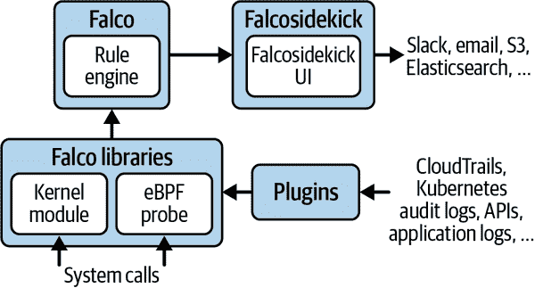
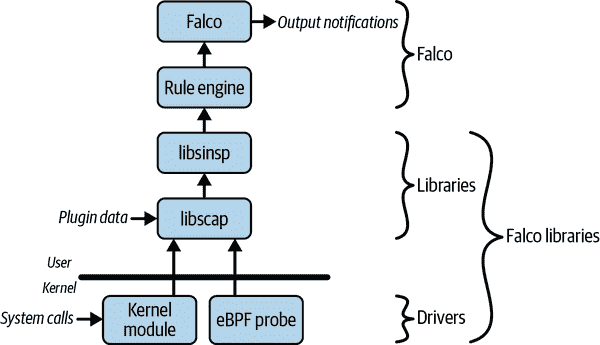
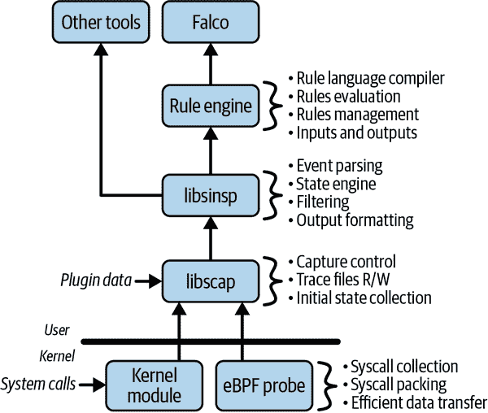
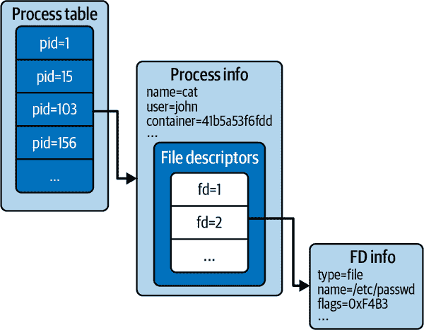

# 第三章：理解 Falco 的架构

欢迎来到本书的 Part II！在 Part I 中，您了解了 Falco 的定义及其功能。您还高层次地了解了其架构，将其安装在您的计算机上，并进行了试用。现在是时候提升您的水平了！

在本书的这一部分（从第三章到第八章），我们将深入探讨 Falco 的内部工作原理。您将更详细地了解其架构，包括其主要组件以及数据在这些组件之间的流动方式。我们将展示 Falco 如何与操作系统的内核和云日志接口以收集数据，并且如何通过上下文和元数据丰富这些数据。第六章 将介绍字段和过滤器这一重要主题，而第七章 将让您更加熟悉 Falco 规则。我们将通过讨论输出框架，Falco 的关键部分，来结束 Part II。

您真的需要了解 Falco 的内部结构才能操作它吗？答案通常是人生中常见的“这要看情况”。如果您的目标只是在其默认配置下部署 Falco 并向老板展示它正在运行，那么您可能可以跳过本书的这一部分。然而，这样做会使某些事情变得困难，而其他事情则变得不可能。例如，在第 III 和 IV 部分中，我们将讨论：

+   解读 Falco 的输出

+   确定警报是否可能是误报

+   优化 Falco 以优先考虑准确性而不是噪音

+   精确地调整 Falco 以适应您的环境

+   自定义和扩展 Falco

所有这些任务都要求您真正理解 Falco 及其架构背后的核心概念，这正是我们在这里要帮助您实现的。

真正的安全从不是琐碎的。它需要一种超越表面理解的投入。但是这种投入通常会百倍回报，因为它可能决定了您的软件是否会受到攻击，以及您的公司是否因错误的原因出现在新闻中。

假设我们已经说服了您，让我们开始吧。图 3-1 描述了典型 Falco 传感器部署的主要组件。



###### 图 3-1。典型 Falco 传感器部署的高级架构

在 [GitHub 上的 Falcosecurity 组织](https://oreil.ly/ClRJj) 中，代码级别组织的架构反映在 图 3-1 中。在这个粒度级别上，主要组件包括：

Falco 库

[Falco libraries](https://oreil.ly/6CbQH)，或“libs”，负责收集传感器将处理的数据。它们还管理状态并为收集的数据提供多层次的丰富化。

插件

[插件](https://oreil.ly/9Jyi8)通过额外的数据源扩展了传感器的功能。例如，插件使得 Falco 能够使用 AWS CloudTrail 和 Kubernetes 审计日志作为数据源。

Falco

这是包括规则引擎在内的[主传感器可执行文件](https://oreil.ly/2IQkj)。

Falcosidekick

[Falcosidekick](https://oreil.ly/lmOie)负责路由通知并连接传感器与外部世界。

在图 3-1 中的组件中，Falco 和 Falco libs 是必需的并且始终安装，而 Falcosidekick 和插件是可选的；您可以根据部署策略和需求进行安装。

# Falco 和 Falco Libraries：数据流视图

让我们来看看刚才描述的两个最重要的组件，即 Falco 库和 Falco，并探索它们的数据流和关键模块。

正如图 3-2 所示，系统调用是数据的核心来源之一。这些由 Falco 的两个驱动程序之一在操作系统的内核中捕获：*内核模块*和*eBPF（扩展伯克利数据包过滤器）探针*。



###### 图 3-2\. 传感器数据流和主要模块

收集的系统调用流入 Falco 核心库的第一个库*libscap*，该库还可以接收来自插件的数据，并为上层提供一个通用接口。数据然后传递到另一个关键库*libsinsp*进行解析和增强。接下来，数据传递给规则引擎进行评估。Falco 接收规则引擎的输出并生成相应的通知，可以选择性地发送到 Falcosidekick。

相当直接了，对吧？图 3-3 提供了关于每个模块功能的更多细节，在接下来的章节中，我们将更深入地探讨它们。



###### 图 3-3\. 传感器主要模块的关键角色

# 驱动程序

系统调用是 Falco 的原始数据源，直到今天它们仍然是最重要的。收集系统调用是 Falco 能够以非常精细和高效的方式跟踪进程、容器和用户行为核心。可靠和高效的系统调用收集需要在操作系统内核内部执行驱动程序，因此需要一个在操作系统内部运行的驱动程序。如前所述，Falco 提供了两种这样的驱动程序：内核模块和 eBPF 探针。

这两个组件提供相同的功能，并以互斥的方式部署：如果部署了内核模块，则无法运行 eBPF 探针，反之亦然。那么它们有什么区别呢？

内核模块与 Linux 内核的任何版本兼容，包括较旧的版本。此外，它需要更少的资源来运行，因此在关心 Falco 尽可能小的开销时应使用它。

另一方面，eBPF 探针仅在 Linux 的较新版本上运行，从内核版本 4.11 开始。其优势在于更安全，因为其代码在执行之前会严格由操作系统验证。这意味着即使它包含错误，理论上也不会导致系统崩溃。与内核模块相比，它还能更好地防止可能危及你运行它的机器的安全漏洞。因此，在大多数情况下，eBPF 探针是你应该选择的选项。还要注意，某些环境——特别是基于云的托管容器化环境——禁止加载操作系统内核中的内核模块。在这种环境中，eBPF 探针是你唯一的选择。

内核模块和 eBPF 探针都承担一组非常重要的任务：

捕获系统调用

驱动程序的首要责任是捕获系统调用。这是通过一个称为[tracepoints](https://oreil.ly/tEYsq)的内核设施完成的，并且经过了大量优化，以最小化对被监视应用程序性能的影响。

系统调用打包

然后，驱动程序将系统调用信息编码到一个传输缓冲区中，使用一种 Falco 堆栈其余部分可以轻松高效解析的格式。

零拷贝数据传输

最后，驱动程序负责将这些数据高效地从内核传输到用户级，*libscap*将在那里接收它。事实上，我们应该称这种方式为高效地*不*传输数据，因为内核模块和 eBPF 探针都设计成零拷贝架构，将数据缓冲区映射到用户级内存，使*libscap*能够访问原始数据，而无需复制或传输它。

在第四章中，你将学习有关驱动程序的所有必要知识，包括它们的架构、功能和使用场景。

# 插件

插件是一种简单地向 Falco 添加额外数据源而无需重新构建它的方法。插件实现了一个接口，将事件馈送到 Falco，类似于内核模块和 eBPF 探针所做的事情。然而，插件不仅限于捕获系统调用：它们可以向 Falco 馈送任何类型的数据，包括日志和 API 事件。

Falco 拥有几个强大的插件，扩展了其范围。例如，CloudTrail 插件从 AWS CloudTrail 中摄取 JSON 日志，并允许 Falco 在你的云基础设施中发生危险事件时向你发出警报。插件可以用任何语言编写，但有 Go 和 C++的软件开发工具包（SDK）可用，这使得用这些语言编写插件更容易。我们将在第四章和第十一章中更详细地讨论插件。

# libscap

名称*libscap*代表“系统捕获库”，清楚地提示了它的目的。*libscap*是数据进入 Falco 处理流水线之前经过的门户。让我们看看*libscap*为我们做了哪些主要工作。

## 管理数据源

*libscap* 库包含了控制内核模块和 eBPF 探针的逻辑，包括它们的加载、启动和停止捕获，以及读取它们生成的数据。它还包括加载、管理和运行插件的逻辑。

*libscap* 的设计旨在向堆栈的上层导出通用的捕获源抽象。这意味着无论您如何收集数据（内核模块、eBPF 探针、插件），使用*libscap*的程序都将拥有一致的方式来枚举和控制数据源，启动和停止捕获，并接收捕获的事件，而不必担心与这些不同输入源进行接口的细微差别。

## 支持跟踪文件

*libscap* 中另一个极为重要的功能是支持跟踪文件。如果您曾经使用 Wireshark 或 tcpdump 创建或打开过 PCAP 文件，我们相信您一定了解跟踪文件的概念是多么有用（和强大！）。如果还不了解，请允许我们解释。

除了捕获和解码网络流量外，协议分析器（如 Wireshark 和 tcpdump）允许您将捕获的网络数据包“转储”到*跟踪文件*中。跟踪文件包含每个数据包的副本，以便稍后分析该网络段的活动。您还可以与他人共享它或过滤其内容以隔离相关信息。

跟踪文件通常被称为 PCAP *文件*，这个名称源自用于编码其中数据的*.pcap*文件格式（这是一种开放、标准化的格式，全球所有网络工具都能理解）。这使得在计算机网络中关键的“现在捕获，以后分析”的工作流程变得无穷无尽。

许多 Falco 用户并不了解，Falco 支持使用*.pcap*格式的跟踪文件。这个功能非常强大，并且在您积累更多经验时，绝对应该成为您工具库的一部分。例如，当您撰写新规则时，跟踪文件无价。

我们将详细讨论如何利用跟踪文件，例如在第四章和第十三章，但现在让我们通过两个简单的步骤来激发您的兴趣，教您如何创建跟踪文件并让 Falco 读取它。为此，我们需要介绍一个名为 sysdig 的命令行工具。您将在第四章更多地了解 sysdig，但现在我们将它作为一个简单的跟踪文件生成器使用。

### 步骤 1：创建跟踪文件

按照[安装说明](https://oreil.ly/Rmkxr)在您的 Linux 主机上安装 sysdig。安装完成后，在命令行上运行以下命令，指示 sysdig 捕获主机生成的所有系统调用，并将它们写入名为*testfile.scap*的文件：

```
$ sudo sysdig -w testfile.scap
```

等待几秒钟，确保您的机器正在工作，然后按 Ctrl-C 停止 sysdig。

现在，您拥有了主机活动几秒钟快照的快照。让我们看看它包含了什么：

```
$ sysdig -r testfile.scap
1 17:41:13.628568857 0 prlcp (4358) < write res=0 data=.N;.n... 
2 17:41:13.628573305 0 prlcp (4358) > write fd=6(<p>pipe:[43606]) size=1 
3 17:41:13.628588359 0 prlcp (4358) < write res=1 data=. 
4 17:41:13.609136030 3 gmain (2935) < poll res=0 fds= 
5 17:41:13.609146818 3 gmain (2935) > write fd=4(<e>) size=8 
6 17:41:13.609149203 3 gmain (2935) < write res=8 data=........ 
7 17:41:13.609151765 3 gmain (2935) > read fd=7(<i>) size=4096 
8 17:41:13.609153301 3 gmain (2935) < read res=-11(EAGAIN) data= 
9 17:41:13.626956525 0 Xorg (3214) < epoll_wait res=1 
10 17:41:13.626964759 0 Xorg (3214) > setitimer 
11 17:41:13.626966955 0 Xorg (3214) < setitimer 
12 17:41:13.626969972 0 Xorg (3214) > recvmsg fd=42(<u>@/tmp/.X11-unix/X0) 
13 17:41:13.626976118 0 Xorg (3214) < recvmsg res=28 size=28 data=....E..... ... 
14 17:41:13.626992585 0 Xorg (3214) > writev fd=42(<u>@/tmp/.X11-unix/X0) size=32 
15 17:41:13.627013409 0 Xorg (3214) < writev res=32 data=...7E.............. ... 

...
```

我们稍后会详细介绍此输出的格式，但您可能已经注意到，这是由像 Xorg、gmain 和 prlcp 这样的系统工具在空闲时在此计算机上运行的大量后台输入/输出（I/O）活动。

### 第 2 步：使用 Falco 处理跟踪文件

把跟踪文件想象成带我们回到过去：您在特定时间点拍摄了主机的快照，现在可以跟踪在该时间周围生成的主机系统调用，详细观察每个进程。使用 Falco 处理跟踪文件很容易，让您快速查看在那段时间内是否发生了任何安全违规。以下是其输出的示例：

```
$ falco -e testfile.scap
Wed Sep 29 18:04:00 2021: Falco version 0.30.0
Wed Sep 29 18:04:00 2021: Falco initialized with configuration file /etc/falco
/falco.yaml
Wed Sep 29 18:04:00 2021: Loading rules from file /etc/falco/falco_rules.yaml:
Wed Sep 29 18:04:00 2021: Reading system call events from file: testfile.scap
Events detected: 0
Rule counts by severity:
Triggered rules by rule name:
Syscall event drop monitoring:
   - event drop detected: 0 occurrences
   - num times actions taken: 0
```

幸运的是，看起来我们很安全。当编写或单元测试规则时，这种一致且回溯式的 Falco 运行方式非常有用。我们将在第十三章详细讨论它，那时我们将深入研究编写 Falco 规则的内容。

## 收集系统状态

系统状态收集是一个与捕获系统调用密切相关的重要任务。内核模块和 eBPF 探针产生原始系统调用，缺少 Falco 所需的一些重要上下文。

让我们来看一个例子。一个非常常见的系统调用是`read`，顾名思义，它从文件描述符中读取数据到缓冲区中。这是`read`的原型：

```
ssize_t read(int fd, void *buf, size_t count);
```

它有三个输入：数字文件描述符标识符、要填充的缓冲区和缓冲区大小。它返回在缓冲区中写入的数据量。

*文件描述符*类似于操作系统内核中对象的 ID：它可以指示文件、网络连接（具体来说是套接字）、管道的端点、互斥量（用于进程同步）、定时器或其他几种类型的对象。

当编写 Falco 规则时，知道文件描述符编号并不是很有用。作为用户，我们更喜欢考虑文件或目录名称，或者可能是连接的 IP 地址和端口，而不是文件描述符编号。*libscap*帮助我们做到这一点。当 Falco 启动时，*libscap*从操作系统内部的多种来源（例如*/proc* Linux 文件系统）获取大量数据。它使用这些数据构建一组表，可以将加密的数字（例如文件描述符、进程 ID 等）解析为逻辑实体及其详细信息，这对人类来说更容易使用。

这个功能是为什么 Falco 的语法比大多数类似工具更具表现力和可用性的一部分。本书中你会经常听到一个主题，即*没有上下文的粒度数据是无用的*。这为你提供了这个意思的一个提示。接下来我们将深入探讨另一个重要的 Falco 库：*libsinsp*。

# libsinsp

*libsinsp*代表“系统检查库”。这个库利用*libscap*生成的数据流，对其进行丰富，并提供了许多高级原语来处理它。让我们首先探索它最重要的功能，即状态引擎。

## 状态引擎

正如我们在前一节中所指出的，当 Falco 启动时，*libscap*构建了一组表，用于将低级标识符（如文件描述符号）转换为高级可操作信息，如 IP 地址和文件名。这很棒，但如果一个程序在 Falco 启动后打开一个文件会怎么样呢？例如，在 Unix 中一个非常常见的系统调用是`open`，它接受两个输入参数，文件名和一些标志，并返回一个标识新打开文件的文件描述符：

```
int open(const char *pathname, int flags);
```

在实践中，`open`像许多其他系统调用一样，会创建一个新的文件描述符，有效地改变调用它的进程的状态。如果一个进程在 Falco 启动后调用`open`，它的新文件描述符将不会出现在状态表中，Falco 也不会知道如何处理该描述符。然而，请考虑这一点：`open`是一个系统调用。更普遍地说，系统调用总是用于创建、销毁或修改文件描述符。还要记住，Falco libs 捕获*每个*进程的*所有*系统调用。

特别是*libsinsp*有逻辑来检查每个改变状态的系统调用，并根据系统调用的参数更新状态表。换句话说，它跟踪整个机器的活动，以保持状态与底层操作系统同步。此外，它以一种准确地支持容器的方式进行操作。*libsinsp*将这些不断更新的信息保存在分层结构中。这个结构（图 3-4）从进程表开始，每个条目包含文件描述符表等信息。

这些准确的、不断更新的状态表是 Falco 数据增强的核心，进而是规则引擎的关键构建块。



###### 图 3-4\. libsinsp 状态层次结构

## 事件解析

状态引擎需要大量的逻辑来理解系统调用并解析其参数。这正是 *libsinsp* 的 *事件解析器* 所做的。状态跟踪利用事件解析，但也用于其他目的。例如，它从系统调用或其他数据源中提取有用的参数，使它们可供规则引擎使用。它还整理和重构可以分布在多个收集消息中的缓冲区，从而更容易地从 Falco 规则中解码其内容。

## 过滤器

过滤是 Falco 中最重要的概念之一，而且它在 *libsinsp* 中得到了完全实现。*过滤器* 是一个布尔表达式，它将多个*检查*联系在一起，每个检查都将一个过滤字段与常量值进行比较。当我们查看规则时，过滤器的重要性显而易见。（事实上，它如此重要，以至于我们专门在 第六章 中全面讨论了它。）让我们看一下这里显示的简单规则：

```
- rule: shell_in_container
  desc: shell opened inside a container
  condition: container.id != host and proc.name = bash
  output: shell in a container (user=%user.name container_id=%container.id)
  priority: WARNING
```

规则中的 `condition` 部分是 *libsinsp* 的过滤器。我们的示例中的条件检查容器 ID 不是 `host`，并且进程名称是 `bash`。每个满足这两个条件的捕获系统调用都将触发该规则。

*libsinsp* 负责定义和实现与系统调用相关的过滤字段。它还包含评估过滤器并告诉我们是否应触发规则的引擎，因此可以说 *libsinsp* 是 Falco 的核心，这一点并非言过其实。

## 输出格式化

如果我们再次看一下示例规则，我们可以看到 `output` 部分使用了类似于 `condition` 部分的语法：

```
  output: shell in a container (user=%user.name container_id=%container.id)
```

触发规则时，Falco 打印的内容就是输出——是的，在此部分中您可以通过在字段名前加上 `%` 字符来使用 `condition` 部分中同样可以使用的过滤字段。*libsinsp* 具有解析这些字段并创建最终输出字符串的逻辑。值得一提的是，如果您成为编写条件过滤器的专家，您也将掌握输出字符串的技能！

## *libsinsp* 的另一重要事项

到目前为止，您可能已经看到 Falco 很多逻辑都在 *libsinsp* 中。这是有意为之的。Falco 的开发人员认识到了其数据收集堆栈的价值（以及其优雅性），并意识到它可以成为许多其他工具的基础。这就是 *libsinsp* 存在的原因。它位于强大的 Falco 收集堆栈（包括驱动程序、插件和 *libscap*）之上，并以可重复使用的方式添加了 Falco 逻辑的最重要部分。更重要的是，*libsinsp* 包含了从容器、虚拟机、Linux 主机和云基础设施收集安全和取证数据所需的一切。它稳定、高效且文档完善。

还有几个其他开源和商业工具是基于 *libsinsp* 构建的。如果你想编写一个，或者只是好奇想了解更多，我们建议你从 [*falcosecurity/libs* 仓库](https://oreil.ly/Cp2Nt) 开始。

# 规则引擎

Falco 规则引擎是你在运行 Falco 时互动的组件。以下是规则引擎负责的一些事务：

+   载入 Falco 规则文件

+   解析文件中的规则

+   根据本地规则文件对规则应用本地定制（例如追加和覆盖）。

+   使用 *libsinsp* 编译每个规则的条件和输出。

+   当规则触发时执行适当的操作，包括输出结果。

由于 *libscap* 和 *libsinsp* 的强大功能，规则引擎简单且相对独立于堆栈的其他部分。

# 结论

现在你知道了 Falco 的内部构成及其组件之间的关系，你已经在掌握它的路上了！在接下来的章节中，我们将更深入地探讨本章介绍的一些组件和概念。
