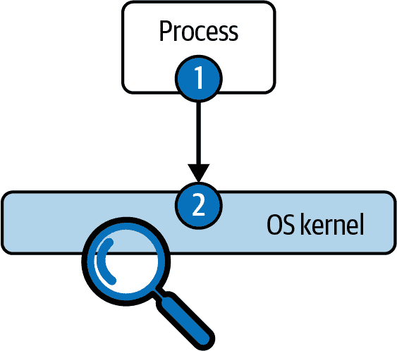
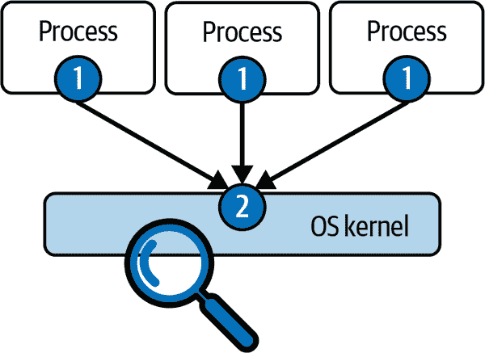
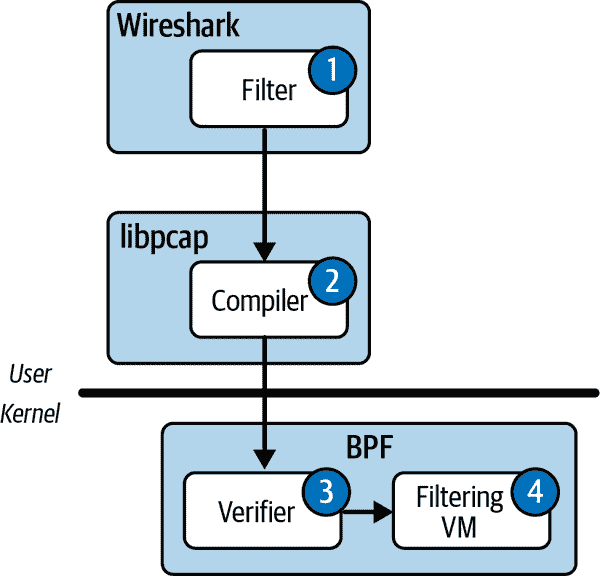
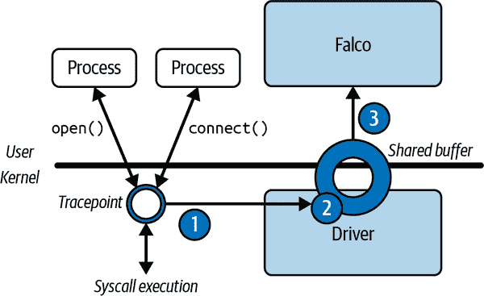
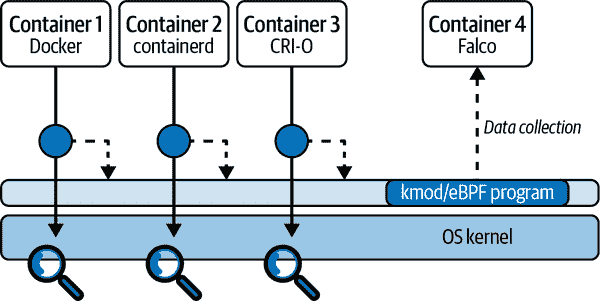
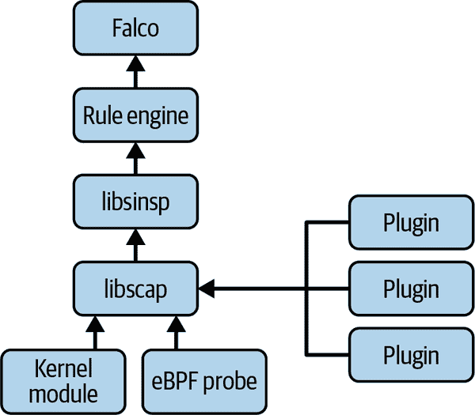

# 第四章：数据源

在本章中，我们将深入研究操作系统内核和 Falco 数据收集堆栈。您将了解 Falco 如何捕获喂入其规则引擎的不同类型事件，其数据收集过程如何与替代方法进行比较，以及为什么它被构建成现在这样。到本章结束时，您将充分了解细节，能够选择并部署适合您需求的正确驱动程序和插件。

首要任务是了解 Falco 中可以使用的数据源。Falco 的数据源可以分为两大类：系统调用和插件。系统调用是 Falco 的原始数据源。它们来自操作系统的内核，并提供对进程、容器、虚拟机和主机活动的可见性。Falco 使用它们来保护工作负载和应用程序。第二类数据源，插件，相对较新：2022 年添加了支持。插件将各种输入连接到 Falco，如云日志和 API。

Falco 先前支持 Kubernetes 审计日志作为第三个独立的数据源类型；然而，从 Falco 0.32 开始，这个数据源已被重新实现为插件，因此我们不会在本章涵盖它。

# 系统调用

正如我们已经多次提到的，系统调用是 Falco 的一个重要数据源，也是使其独特的关键因素之一。但系统调用究竟是什么？让我们从维基百科的高层次定义开始：

> 在计算机领域，系统调用（通常缩写为 syscall）是计算机程序向其所在操作系统的内核请求服务的编程方式。这可能涉及硬件相关的服务（例如访问硬盘驱动器或访问设备的摄像头）、创建和执行新进程，以及与内核的核心服务进行通信，例如进程调度。

让我们详细解释一下。在最高抽象层次上，计算机由运行各种软件的硬件组成。然而，在现代计算中，程序直接在硬件上运行的情况极为罕见。相反，在绝大多数情况下，程序在操作系统之上运行。Falco 的驱动程序专门针对驱动云和现代数据中心的操作系统 Linux。

操作系统是一种旨在进行和支持其他软件执行的软件。除了许多其他功能外，操作系统还负责：

+   进程调度

+   管理内存

+   中介硬件访问

+   实现网络连接

+   处理并发性

显然，几乎所有这些功能都需要向运行在操作系统之上的程序公开，以便它们可以做一些有用的事情。显然，软件公开功能的最佳方式是提供一个 *应用程序编程接口* (API)：一组客户程序可以调用的函数。这几乎就是系统调用的作用：与操作系统交互的 API。

等等，为什么几乎？

嗯，操作系统是一种独特的软件，你不能像调用库一样直接调用它。操作系统在称为特权模式的分离执行模式中运行，与用户模式（用于执行常规进程，即运行程序的上下文）隔离开来。这种分离使得调用操作系统变得更加复杂。在某些 CPU 中，您通过触发中断来调用系统调用。然而，在大多数现代 CPU 中，您需要使用特定的 CPU 指令。如果我们排除这种额外的复杂性，可以说系统调用就是访问操作系统功能的 API。它们有很多，每个系统调用都有自己的输入参数和返回值。

每个程序，无一例外，都广泛而持续地使用系统调用接口来处理任何非纯计算的事务：读取输入，生成输出，访问磁盘，网络通信，运行新程序等等。这意味着，正如你所能想象的那样，观察系统调用能够提供每个进程活动的非常详细的图像。

操作系统开发者长期以来一直将系统调用接口视为稳定的 API。这意味着，即使内核内部发生了巨大变化，您也可以期望它保持不变。这一点非常重要，因为它确保了时间和执行环境的一致性，使系统调用 API 成为收集可靠安全信号的理想选择。例如，Falco 规则可以引用特定系统调用，并假定在任何 Linux 发行版上使用它们都可以正常工作。

## 例子

Linux 提供了 *许多* 系统调用——超过 300 个。要完整讲解它们几乎是不可能且非常无聊的，所以我们就不细说了。但是，我们确实想给你一些可用系统调用类型的概念。

表 4-1 包括了一些对像 Falco 这样的安全工具最相关的系统调用类别。对于每个类别，表中列出了代表性系统调用的示例。你可以通过在 Linux 终端或浏览器的搜索栏中输入 `**man 2 *X***` 来查找每个系统调用的更多信息，其中 `***X***` 是系统调用的名称。

表 4-1\. 重要的系统调用类别

| 类别 | 示例 |
| --- | --- |
| 文件 I/O | `open`, `creat`, `close`, `read`, `write`, `ioctl`, `link`, `unlink`, `chdir`, `chmod`, `stat`, `seek`, `mount`, `rename`, `mkdir`, `rmdir` |
| 网络 | `socket`, `bind`, `connect`, `listen`, `accept`, `sendto`, `recvfrom`, `getsockopt`, `setsockopt`, `shutdown` |
| 进程间通信 | `pipe`, `futex`, `inotify_add_watch`, `eventfd`, `semop`, `semget`, `semctl`, `msgctl` |
| 进程管理 | `clone`, `execve`, `fork`, `nice`, `kill`, `prctl`, `exit`, `setrlimit`, `setpriority`, `capset` |
| 内存管理 | `brk`, `mmap`, `mprotect`, `mlock`, `madvise` |
| 用户管理 | `setuid`, `getuid`, `setgid`, `getgid` |
| 系统 | `sethostname`, `setdomainname`, `reboot`, `syslog`, `uname`, `swapoff`, `init_module`, `delete_module` |

###### 提示

如果您有兴趣查看完整的 Linux 系统调用列表，请在 Linux 终端或搜索引擎中键入`**man syscalls**`。这将显示官方 Linux 手册页面，其中包含系统调用的全面列表，并带有超链接，以深入了解其中的许多内容。此外，软件工程师 Filippo Valsorda 在他的个人主页上提供了一个清晰组织且可搜索的[列表](https://oreil.ly/P12lw)。

## 观察系统调用

考虑到系统调用对于 Falco 和一般运行时安全性是多么重要，学习如何捕获、观察和解释它们至关重要。这是一项有价值的技能，在许多情况下都会很有用。我们将向您展示两种不同的工具，您可以用它们来实现这个目的：strace 和 sysdig。

### strace

strace 是一个工具，在几乎每台运行 Unix 兼容操作系统的机器上都可以找到。它的最简单用法是运行一个程序，它会将程序发出的每个系统调用打印到标准错误输出。换句话说，只需将`**strace**`添加到任意命令行的开头，你就能看到该命令行生成的所有系统调用：

```
$ strace echo hello world
execve("/bin/echo", ["echo", "hello", "world"], 0x7ffc87eed490 /* 32 vars */) = 0
brk(NULL)                               = 0x558ba22bf000
access("/etc/ld.so.nohwcap", F_OK)      = -1 ENOENT (No such file or directory)
access("/etc/ld.so.preload", R_OK)      = -1 ENOENT (No such file or directory)
openat(AT_FDCWD, "/etc/ld.so.cache", O_RDONLY|O_CLOEXEC) = 3
fstat(3, {st_mode=S_IFREG|0644, st_size=121726, ...}) = 0
mmap(NULL, 121726, PROT_READ, MAP_PRIVATE, 3, 0) = 0x7f289009c000
close(3)                                = 0
access("/etc/ld.so.nohwcap", F_OK)      = -1 ENOENT (No such file or directory)
openat(AT_FDCWD, "/lib/x86_64-linux-gnu/libc.so.6", O_RDONLY|O_CLOEXEC) = 3
read(3, "\177ELF\2\1\1\3\0\0\0\0\0\0\0\0\3\0>\0\1\0\0\0\20\35\2\0\0\0\0\0" ...
fstat(3, {st_mode=S_IFREG|0755, st_size=2030928, ...}) = 0
mmap(NULL, 8192, PROT_READ|PROT_WRITE, MAP_PRIVATE|MAP_ANONYMOUS, -1, 0) ...
mmap(NULL, 4131552, PROT_READ|PROT_EXEC, MAP_PRIVATE|MAP_DENYWRITE, 3, 0) ...
mprotect(0x7f288fc87000, 2097152, PROT_NONE) = 0
mmap(0x7f288fe87000, 24576, PROT_READ|PROT_WRITE, MAP_PRIVATE|MAP_FIXED| ...
mmap(0x7f288fe8d000, 15072, PROT_READ|PROT_WRITE, MAP_PRIVATE|MAP_FIXED| ...
close(3)                                = 0
arch_prctl(ARCH_SET_FS, 0x7f289009b540) = 0
mprotect(0x7f288fe87000, 16384, PROT_READ) = 0
mprotect(0x558ba2028000, 4096, PROT_READ) = 0
mprotect(0x7f28900ba000, 4096, PROT_READ) = 0
munmap(0x7f289009c000, 121726)          = 0
brk(NULL)                               = 0x558ba22bf000
brk(0x558ba22e0000)                     = 0x558ba22e0000
openat(AT_FDCWD, "/usr/lib/locale/locale-archive", O_RDONLY|O_CLOEXEC) = 3
fstat(3, {st_mode=S_IFREG|0644, st_size=3004224, ...}) = 0
mmap(NULL, 3004224, PROT_READ, MAP_PRIVATE, 3, 0) = 0x7f288f7c2000
close(3)                                = 0
fstat(1, {st_mode=S_IFCHR|0620, st_rdev=makedev(136, 2), ...}) = 0
write(1, "hello world\n", 12hello world
)           = 12 
close(1)                                = 0
close(2)                                = 0
exit_group(0)                           = ?
+++ exited with 0 +++
```

请注意，strace 的输出模仿 C 语法，看起来像一系列函数调用的流，每行末尾的`=`符号后面加上返回值。例如，看看`write`系统调用（加粗）将字符串“hello world”输出到标准输出（文件描述符 1）。它返回成功写入的字节数 `12`。请注意，在`write`系统调用返回之前，“hello world”字符串已经打印到标准输出，并且 strace 在屏幕上打印其返回值。

使用 strace 的第二种方法是通过在命令行上指定进程 ID（PID）指向运行中的进程：

```
$ sudo strace -p`pidof vi`
strace: Process 16472 attached
select(1, [0], [], [0], NULL)           = 1 (in [0])
read(0, "\r", 250)                      = 1
select(1, [0], [], [0], {tv_sec=0, tv_usec=0}) = 0 (Timeout)
select(1, [0], [], [0], {tv_sec=0, tv_usec=0}) = 0 (Timeout)
write(1, "\7", 1)                       = 1
select(1, [0], [], [0], {tv_sec=4, tv_usec=0}) = 0 (Timeout)
select(1, [0], [], [0], NULL
**^C**
strace: Process 16472 detached
<detached ...>
```

strace 有一些优点和一些缺点。它得到了广泛的支持，因此它要么已经可用，要么可以轻松安装。它的使用也很简单，在需要检查单个进程时非常理想，因此非常适合调试用途。

至于缺点，strace 仅对单个进程进行仪器化，这使得它不适合检查整个系统的活动或者当你没有特定的起点进程时使用。此外，strace 基于 ptrace 进行系统调用收集，这使得它在生产环境中非常慢且不适用。当你附加 strace 时，应该预期进程会显著减速（有时减速数倍）。

### sysdig

我们在第三章中介绍了 sysdig 的追踪文件。sysdig 比 strace 更复杂，并包含几个高级功能。虽然这可能使它有点难以使用，但好消息是 sysdig 与 Falco 的数据模型、输出格式和过滤语法相同——因此你可以在 sysdig 中应用你在 Falco 中学到的很多内容，反之亦然。

首先要记住的是，与 strace 不同，你不需要像对待单个进程那样指定 sysdig。相反，只需运行它，它将捕获机器上内外的每个系统调用：

```
$ sudo sysdig
1 17:41:13.628568857 0 prlcp (4358) < write res=0 data=.N;.n... 
2 17:41:13.628573305 0 prlcp (4358) > write fd=6(<p>pipe:[43606]) size=1 
4 17:41:13.609136030 3 gmain (2935) < poll res=0 fds= 
5 17:41:13.609146818 3 gmain (2935) > write fd=4(<e>) size=8 
6 17:41:13.609149203 3 gmain (2935) < write res=8 data=........ 
9 17:41:13.626956525 0 Xorg (3214) < epoll_wait res=1 
10 17:41:13.626964759 0 Xorg (3214) > setitimer 
11 17:41:13.626966955 0 Xorg (3214) < setitimer
```

通常这会造成很大噪音，且不太有用，所以你可以通过使用过滤器来限制 sysdig 显示的内容。sysdig 接受与 Falco 相同的过滤语法（顺便说一句，这使它成为一个测试和调试 Falco 规则的强大工具）。以下是一个例子，我们将 sysdig 限制为仅捕获名为“cat”的进程的系统调用：

```
$ sudo sysdig proc.name=cat & cat /etc/hosts
47190 14:40:39.913809700 12 cat (377163.377163) < execve res=0 exe=cat 
args=/etc/hosts. tid=377163(cat) pid=377163(cat) ptid=5860(zsh) cwd= 
fdlimit=1024 pgft_maj=0 pgft_min=60 vm_size=424 vm_rss=4 vm_swap=0 comm=cat 
cgroups=cpuset=/user.slice.cpu=/user.slice.cpuacct=/.io=/user.slice.memory=
/user.slic... env=SYSTEMD_EXEC_PID=3558.GJS_DEBUG_TOPICS=JS ERROR;JS 
LOG.SESSION_MANAGER=local/... tty=34817 pgid=377163(cat) loginuid=1000 flags=0 
47194 14:40:39.913846153 12 cat (377163.377163) > brk addr=0 
47196 14:40:39.913846951 12 cat (377163.377163) < brk res=55956998C000 
vm_size=424 vm_rss=4 vm_swap=0 
47205 14:40:39.913880404 12 cat (377163.377163) > arch_prctl 
47206 14:40:39.913880871 12 cat (377163.377163) < arch_prctl 
47207 14:40:39.913896493 12 cat (377163.377163) > access mode=4(R_OK) 
47208 14:40:39.913900922 12 cat (377163.377163) < access res=-2(ENOENT) 
name=/etc/ld.so.preload 
47209 14:40:39.913903872 12 cat (377163.377163) > openat dirfd=-100(AT_FDCWD) 
name=/etc/ld.so.cache flags=4097(O_RDONLY|O_CLOEXEC) mode=0 
47210 14:40:39.913914652 12 cat (377163.377163) < openat 
fd=3(<f>/etc/ld.so.cache) dirfd=-100(AT_FDCWD) name=/etc/ld.so.cache 
flags=4097(O_RDONLY|O_CLOEXEC) mode=0 dev=803
```

这个输出需要比 strace 更详细的解释。sysdig 打印的字段包括：

+   增量事件编号

+   事件时间戳

+   CPU ID

+   命令名称

+   进程 ID 和线程 ID（TID），用点号分隔

+   事件方向（`>` 表示 *进入*，`<` 表示 *退出*）

+   事件类型（对于我们来说，这是系统调用的名称）

+   系统调用参数

与 strace 不同，sysdig 为每个系统调用打印了 *两* 行：*进入* 行是系统调用开始时生成的，*退出* 行是系统调用返回时打印的。如果你需要确定系统调用运行时间或找出卡在系统调用中的进程，这种方法非常有效。

还要注意，默认情况下，sysdig 除了打印进程 ID 外还打印线程 ID。*线程* 是操作系统和 sysdig 的核心执行单元。多个线程可以存在于同一个进程或命令中，并共享资源，比如内存。TID 是在跟踪机器上执行活动时跟踪执行活动的基本标识符。你可以通过查看 TID 号码或使用如下命令行来过滤掉噪音：

```
$ sysdig thread.tid=1234
```

这将仅保留线程 1234 的执行流。

线程存在于进程内部，进程通过进程 ID 进行标识。在平均 Linux 系统上运行的大部分进程都是单线程的，在这种情况下，`thread.tid`和`proc.pid`是相同的。通过`proc.pid`进行过滤很有用，可以观察线程在进程内部的交互情况。

### 追踪文件

正如在 Chapter 3 中所学到的，您可以指示 sysdig 将其捕获的系统调用保存到跟踪文件中，例如：

```
$ sudo sysdig -w testfile.scap
```

您可能想要使用过滤器来控制文件大小。例如：

```
$ sudo sysdig -w testfile.scap proc.name=cat
```

当读取跟踪文件时，您也可以使用过滤器：

```
$ sysdig -r testfile.scap proc.name=cat
```

sysdig 的过滤器非常重要，我们将专门为它们撰写一整章（Chapter 6）。

我们建议您使用 sysdig 并探索 Linux 中常见程序的活动。这将在稍后创建或解释 Falco 规则时非常有帮助。

# 捕获系统调用

好的，系统调用很酷，我们需要捕获它们。那么最好的方法是什么？

在本章的前面部分，我们描述了系统调用是如何将执行流从运行中的进程转移到操作系统内核的。直觉上，如图 Figure 4-1 所示，可以在两个地方捕获系统调用：在运行的进程中或操作系统内核中。



###### 图 4-1\. 系统调用捕获选项

在运行的进程中捕获系统调用通常涉及修改进程或其某些库以进行某种形式的仪器化。由于 Linux 中大多数程序使用 C 标准库，也称为 *glibc*，来执行系统调用，使得仪器化它非常吸引人。因此，有大量工具和框架用于修改 *glibc*（和其他系统库）以进行仪器化。这些技术可以是静态的，改变库的源代码并重新编译它，或者是动态的，在目标进程的地址空间中找到其位置并插入钩子。

###### 注意

捕获系统调用的另一种方法是利用操作系统的调试工具。例如，strace 使用一个名为 *ptrace* 的工具，^(1) 这个工具是像 GNU 调试器（gdb）这样工具的基础。

第二种选择涉及在系统调用转移到操作系统后拦截其执行。这需要在操作系统内核中运行一些代码。这往往更加棘手和风险更高，因为在内核中运行代码需要提升的权限。在内核中运行的任何内容都有可能控制机器、其进程、其用户和其硬件。因此，内核中运行的任何错误可能导致重大的安全风险、数据损坏或在某些情况下甚至机器崩溃。这就是为什么许多安全工具选择仪器化选项 1 并在用户级别内捕获系统调用的原因。

Falco 则相反：它完全基于内核的仪器化。选择背后的理由可以总结为三个词：准确性、性能和可伸缩性。让我们依次探讨每一个。

## 准确性

用户级别的工具技术，特别是在*glibc*层面工作的技术，有几个主要问题。首先，一个有动机的攻击者可以通过避开使用*glibc*来规避它们！你并不一定需要使用库来发出系统调用，攻击者可以很容易地编写一系列简单的 CPU 指令，完全绕过*glibc*的检测。这不是好事。

更糟糕的是，有一些主要类别的软件根本不加载*glibc*。例如，在容器中非常常见的静态链接的 C 程序，在编译时导入*glibc*函数并将它们嵌入到可执行文件中。对于这些程序，你无法替换或修改库。Go 语言编写的程序也是如此，它有自己静态链接的系统调用接口库。

内核级别的捕获不受这些限制。它支持任何语言、任何堆栈和任何框架，因为系统调用的收集发生在所有库和抽象层之下。这意味着内核级别的工具更难以被攻击者规避。

## 性能

一些用户级别的捕获技术，比如使用`ptrace`，因为产生了大量的上下文切换，所以有很大的开销。每个系统调用都需要被单独传递到一个独立的进程，这就需要在进程之间来回“乒乓”。这非常非常慢，甚至影响到在生产环境中使用这种技术，因为对被检测进程的影响太大是不可接受的。

*glibc*基础的捕获确实可以更有效率，但是对于基本操作如事件时间戳的捕获仍然引入了高开销。相比之下，内核级别的捕获不需要任何上下文切换，并且可以从内核中收集所有必要的上下文信息，比如时间戳。这使得它比任何其他技术都要快得多，因此最适合生产环境。

## 可伸缩性

如其名，进程级别的捕获要求对每个单独的进程“做某事”。这个“某事”可能有所不同，但它仍然引入了与观察到的进程数量成正比的开销。而使用内核级别的工具则不会出现这种情况。看看图 4-2。

如果你在正确的位置插入内核工具，可以有一个单一的工具插点（在图 4-2 中标记为 2），无论有多少进程在运行。这不仅确保了最大效率，还确保你永远不会遗漏任何事情，因为没有进程能逃过内核级别的捕获。



###### 图 4-2\. 系统调用捕获的可伸缩性，进程级别与内核

## 那么，稳定性和安全性呢？

我们提到过，内核级仪器化更为微妙，因为一个 bug 可能会导致严重问题。您可能会想，“选择基于内核仪器化的 Falco 这样的工具，而不是基于用户级仪器化的产品，是否会增加额外的风险？”

实际上并不是这样。首先，内核级仪器化受益于有文档记录、稳定的挂钩接口，而像基于*glibc*的捕获方法则不够干净且内在风险更高。它们可能不会导致机器崩溃，但绝对可以导致被检测的进程崩溃，结果通常是糟糕的。除此之外，像 eBPF 这样的技术大大降低了在内核中运行代码的风险，使内核级仪器化即使对于风险规避的用户也是可行的。

## 内核级仪器化方法

我们希望我们已经说服了您，无论何时可以使用，内核仪器化都是运行时安全的最佳选择。现在的问题是，实施它的最佳机制是什么？在不同可用方法中，两种对于像 Falco 这样的工具是相关的：内核模块或 eBPF 探针。让我们看看这两种方法。

### 内核模块

可加载内核模块是可以在运行时加载到内核中的代码片段。在 Linux（以及许多其他操作系统）的历史上，模块被广泛用于使内核具有可扩展性、高效性和更小的体积。

内核模块扩展了内核的功能，无需重新启动系统。它们通常用于实现设备驱动程序、网络协议和文件系统。内核模块使用 C 语言编写，并针对特定内核进行编译。换句话说，不可能在一台机器上编译模块然后在另一台机器上使用它（除非它们具有完全相同的内核）。当用户不再需要时，内核模块也可以被卸载以节省内存。

Linux 长期支持内核模块，因此它们甚至与非常旧的 Linux 版本兼容。它们还可以广泛访问内核，这意味着它们几乎没有什么限制可以做什么。这使它们成为 Falco 等运行时安全工具所需的详细信息的收集的绝佳选择。由于它们使用 C 语言编写，内核模块也非常高效，因此在性能重要时是一个不错的选择。

如果您想查看在您的 Linux 系统上加载的模块列表，请使用以下命令：

```
$ sudo lsmod
```

### eBPF

正如第一章中提到的，eBPF 是伯克利数据包过滤器（BPF）的“下一代”。BPF 于 1992 年为 BSD 操作系统设计用于网络数据包过滤，今天仍然被像 Wireshark 这样的工具使用。BPF 的创新之处在于能够在操作系统内核中执行任意代码。然而，由于这种代码在机器上拥有几乎无限的特权，因此这可能存在潜在风险，必须谨慎使用。

图 4-3 显示了 BPF 如何在内核中安全地运行任意数据包过滤器。



###### 图 4-3\. BPF 过滤器部署步骤

让我们来看看这里描述的步骤：

1.  用户在诸如 Wireshark 的程序中输入过滤器（例如，`port 80`）。

1.  过滤器被输入到编译器中，编译器将其转换为虚拟机的字节码。这在概念上类似于编译 Java 程序，但在使用 BPF 时，程序和虚拟机（VM）指令集都简单得多。例如，我们的`port 80`过滤器在编译后变成了这样：

    ```
    (000) ldh      [12]
    (001) jeq      #0x86dd          jt 2    jf 10
    (002) ldb      [20]
    (003) jeq      #0x84            jt 6    jf 4
    (004) jeq      #0x6             jt 6    jf 5
    (005) jeq      #0x11            jt 6    jf 23
    (006) ldh      [54]
    (007) jeq      #0x50            jt 22   jf 8
    (008) ldh      [56]
    (009) jeq      #0x50            jt 22   jf 23
    (010) jeq      #0x800           jt 11   jf 23
    (011) ldb      [23]
    (012) jeq      #0x84            jt 15   jf 13
    (013) jeq      #0x6             jt 15   jf 14
    (014) jeq      #0x11            jt 15   jf 23
    (015) ldh      [20]
    (016) jset     #0x1fff          jt 23   jf 17
    (017) ldxb     4*([14]&0xf)
    (018) ldh      [x + 14]
    (019) jeq      #0x50            jt 22   jf 20
    (020) ldh      [x + 16]
    (021) jeq      #0x50            jt 22   jf 23
    (022) ret      #262144
    (023) ret      #0
    ```

1.  为了防止编译的过滤器造成损害，它在注入内核之前由验证器分析。验证器检查字节码，并确定过滤器是否具有危险属性（例如，导致过滤器永不返回的无限循环，消耗大量内核 CPU）。

1.  如果过滤器代码不安全，验证器将拒绝它，并向用户返回错误，停止加载过程。如果验证器满意，字节码将传递给虚拟机，虚拟机将其针对每个传入的数据包运行。

eBPF 是 BPF 的更新版本（也更为强大），于 2014 年添加到 Linux，并首次随内核版本 3.18 一同发布。eBPF 将 BPF 的概念提升到新的水平，提供更高效的性能，并利用更新的硬件。最重要的是，通过内核各处的钩子，eBPF 使得除了简单的数据包过滤外，还能支持跟踪、性能分析、调试和安全等用例。它本质上是一个通用的代码执行虚拟机，保证其运行的程序不会造成损害。

这里是 eBPF 相比经典 BPF 引入的一些改进：

+   更先进的指令集，意味着 eBPF 可以运行更复杂的程序。

+   即时（JIT）编译器。经典 BPF 是解释执行的，而验证通过的 eBPF 程序会被转换为本机 CPU 指令。这意味着它们可以以接近本机 CPU 速度运行得更快。

+   能够编写真正的 C 程序，而不仅仅是简单的数据包过滤器。

+   一个成熟的库集，允许您从诸如 Go 之类的语言控制 eBPF。

+   运行子程序和辅助函数的能力。

+   安全访问多个内核对象。eBPF 程序可以安全地“窥视”内核结构以收集信息和上下文，这对于像 Falco 这样的工具非常重要。

+   *映射* 的概念，可以用来高效、轻松地与用户级交换数据的内存区域。

+   更复杂的验证器，使得 eBPF 程序在保持安全性的同时可以做更多事情。

+   在内核中运行的位置更多，使用诸如 tracepoints、kprobes、uprobes、Linux 安全模块钩子和用户态静态定义跟踪（USDT）等设施，而不仅限于网络堆栈。

eBPF 技术正在迅速发展，并迅速成为扩展 Linux 内核的标准方法。eBPF 脚本灵活安全，运行速度极快，非常适合捕获运行时活动。

# Falco 驱动程序

Falco 提供了两种不同的驱动程序实现，分别实现了我们刚才描述的两种方法：一个是内核模块，另一个是 eBPF 探针。这两种实现具有相同的功能，在使用 Falco 时可以互换。因此，我们可以描述它们的工作方式，而不必专注于特定的实现。

高级捕获流程显示在图 4-4 中。



###### 图 4-4\. 驱动程序的捕获流程

Falco 驱动程序用于捕获系统调用的方法包括图中标记的三个主要步骤：

1.  内核设施称为追踪点截获了系统调用的执行。追踪点使得可以在操作系统内核中的特定位置插入一个钩子，以便每次内核执行到达该点时调用一个回调函数。Falco 驱动程序为系统调用安装了两个追踪点：一个用于系统调用进入内核，另一个用于系统调用退出内核并将控制返回给调用进程。

1.  当在追踪点回调函数中时，驱动程序将系统调用参数“打包”到共享内存缓冲区中。在此阶段，系统调用也会被时间戳标记，并且从操作系统中收集额外的上下文信息（例如线程 ID，或者某些套接字系统调用的连接详情）。这个阶段需要非常高效，因为直到驱动程序的追踪点回调函数返回之前，系统调用才不能被执行。

1.  共享缓冲区现在包含系统调用数据，并且 Falco 可以通过*libscap*直接访问它（在第 3 章介绍）。在此阶段不复制任何数据，从而最大程度地减少 CPU 利用率并优化缓存一致性。

在使用 Falco 进行系统调用捕获时需要记住几件事情。第一点是，系统调用在缓冲区中的打包方式是灵活的，并不一定反映原始调用的参数。在某些情况下，驱动程序跳过不需要的参数以最大化性能。在其他情况下，驱动程序添加包含状态、有用上下文或额外信息的字段。例如，Falco 中的 `clone` 事件包含许多字段，增加了有关新创建进程的信息，如环境变量。

第二点需要记住的是，即使系统调用是驱动程序捕获的数据中最重要的来源，但它们并不是唯一的来源。使用追踪点，驱动程序还钩入内核中的其他地方（如调度程序），以捕获上下文切换和信号传递。看一下这个命令：

```
$ sysdig evt.type=switch
```

这行代码显示通过上下文切换追踪点捕获的事件。

## 您应该使用哪个驱动程序？

如果您不确定应该使用哪个驱动程序，请参考以下简单指南：

+   在您有高 I/O 负载并且关心保持尽可能低的仪器化开销时，请使用内核模块。内核模块的开销比 eBPF 探针低，在生成大量系统调用的机器上，它对运行中的进程的性能影响较小。很难估计内核模块的性能会比 eBPF 探针好多少，因为这取决于进程产生多少系统调用，但是期望在每秒生成大量系统调用的磁盘或网络密集型工作负载中能够明显感觉到差异。

+   当您需要支持早于 Linux 版本 4.12 的内核时，也应使用内核模块。

+   在所有其他情况下，请使用 eBPF 探针。

就是这样！

## 在容器内捕获系统调用

基于跟踪点的内核级捕获的优势在于它可以看到运行在机器上的任何东西，无论是容器内还是容器外。它没有任何漏网之鱼。而且部署简单，无需在被监视的容器内运行任何东西，也不需要 sidecars。

图 4-5 展示了如何在容器化环境中部署 Falco，其中包含一个简化的图表，显示了基于不同容器运行时的机器上运行三个容器（标记为 1、2 和 3）。



###### 图 4-5\. 在容器化环境中部署 Falco

在这种情况下，Falco 通常作为一个容器安装。像 Kubernetes 这样的编排器使得在每个主机上部署 Falco 变得容易，使用诸如 DaemonSets 和 Helm charts 等工具。

当 Falco 容器启动时，它会将驱动程序安装在操作系统中。一旦安装完成，驱动程序可以看到任何容器中任何进程的系统调用，无需进一步的用户操作，因为所有这些系统调用都通过相同的跟踪点。驱动程序中的高级逻辑可以将每个捕获的系统调用归因于其容器，以便 Falco 始终知道哪个容器生成了系统调用。Falco 还从容器运行时获取元数据，便于创建依赖于容器标签、镜像名称和其他元数据的规则。（Falco 还包括基于 Kubernetes 元数据的进一步增强，我们将在下一章讨论。）

# 运行 Falco 驱动程序

现在您对它们的工作原理有了一个概念，让我们看看如何在本地机器上部署和使用两个 Falco 驱动程序。（如果您想在生产环境中安装 Falco，请参阅第九章和第十章。）

## 内核模块

默认情况下，Falco 使用内核模块运行，因此如果要使用它作为驱动程序，则不需要额外的步骤。只需运行 Falco，它将加载内核模块。如果要卸载内核模块并加载不同版本，例如因为您构建了自己的定制模块，请使用以下命令：

```
$ sudo rmmod falco
$ sudo insmod *path/to/your/module/falco.ko*
```

## eBPF 探针

要在 Falco 中启用 eBPF 支持，您需要设置`FALCO_BPF_PROBE`环境变量。如果将其设置为空值（`FALCO_BPF_PROBE=""`），Falco 将从*~/.falco/falco-bpf.o*加载 eBPF 探针。否则，您可以显式指定 eBPF 探针所在的路径：

```
export FALCO_BPF_PROBE="*path/to/your/ebpf/probe/falco-bpf.o*"
```

设置环境变量后，只需正常运行 Falco，它将使用 eBPF 探针。

###### 提示

要确保 Falco 的 eBPF 探针（以及任何其他 eBPF 程序）具有最佳性能，请确保您的内核启用了`CONFIG_BPF_JIT`并且`net.core.bpf_jit_enable`设置为`1`。这会在内核中启用 BPF JIT 编译器，显著加快 eBPF 程序的执行速度。

## 在无法访问内核的环境中使用 Falco：pdig

在可能的情况下，总是优先选择内核仪器化。但如果您想在禁止访问内核的环境中运行 Falco 会怎样？这在托管容器环境（如 AWS Fargate）中很常见。在这种环境中，安装内核模块不是选项，因为云提供商会阻止它。

对于这些情况，Falco 开发人员实现了一个称为[*pdig*](https://oreil.ly/amRqP)的用户级仪器驱动程序。它建立在 ptrace 之上，因此使用与 strace 相同的方法。与 strace 类似，pdig 可以以两种方式运行：可以运行您在命令行上指定的程序，也可以附加到正在运行的进程。无论哪种方式，pdig 都会以产生与 Falco 兼容的事件流的方式对进程及其子进程进行仪器化。

请注意，与 strace 类似，pdig 需要您为容器运行时启用`CAP_SYS_PTRACE`。确保以此能力启动您的容器，否则 pdig 将无法工作。

eBPF 探针和内核模块在全局主机级别工作，而 pdig 在进程级别工作。这可能会使容器仪器化更具挑战性。幸运的是，pdig 可以跟踪已仪器化进程的子进程。这意味着使用 pdig 运行容器的入口点将允许您捕获该容器中任何进程生成的每个系统调用。

pdig 的最大限制是性能。ptrace 功能广泛，但会对仪器化进程引入大量开销。pdig 采用了几种技巧来减少这种开销，但仍比内核级别的 Falco 驱动程序慢得多。

## 使用 pdig 运行 Falco

您可以像使用 strace 一样，使用要跟踪的进程的路径（以及参数，如果有）。以下是一个示例：

```
$ pdig [-a] curl https://example.com/
```

`-a` 选项启用了完整的过滤器，提供了更丰富的系统调用仪表化集合。出于性能原因，您可能不希望在 Falco 中使用此选项。

您还可以使用 `-p` 选项附加到正在运行的进程：

```
$ pdig [-a] -p 1234
```

要观察任何效果，您需要在单独的进程中运行 Falco。使用 `-u` 命令行标志：

```
$ falco -u
```

这将启用用户空间的仪器化。

# Falco 插件

除了系统调用，Falco 还可以收集和处理许多其他类型的数据，例如应用程序日志和云活动流。让我们通过探索此功能的基础机制来结束本章：Falco 的插件框架。

插件是扩展 Falco 输入的一种模块化、灵活的方式。任何人都可以使用它们将新的数据源（本地或远程）添加到 Falco 中。图 4-6 显示了插件在 Falco 捕获堆栈中的位置：它们是 *libscap* 的输入，并作为捕获系统调用时驱动程序的替代品。

插件实现为符合文档化 API 的共享库。它们允许您添加新的事件源，并使用过滤表达式和 Falco 规则对其进行评估。它们还允许您定义可以从事件中提取信息的新字段。



###### 图 4-6\. Falco 插件

## 插件架构概念

插件是动态共享库（Unix 中的 *.so* 文件，Windows 中的 *.dll* 文件），导出 C 调用约定函数。Falco 动态加载这些库并调用导出的函数。插件使用语义化版本控制进行版本管理，以减少回归和兼容性问题。它们可以用任何语言编写，只要导出所需函数即可。首选用于编写插件的语言是 Go，其次是 C/C++。

插件包括两个主要功能模块，也称为 *能力*：

事件溯源

此功能用于实现新的事件源。事件源可以通过 `next` 方法“打开”和“关闭”事件流，并将事件返回给 *libscap*。换句话说，它用于向 Falco 提供新的“内容”。

字段提取

字段提取专注于从其他插件或核心库生成的事件中生成字段。字段是 Falco 规则的基本组成部分，因此暴露新字段相当于扩展 Falco 规则的适用范围到新的领域。例如，JSON 解析就是一个例子，插件可以从任意 JSON 负载中提取字段。关于字段的更多信息，请参见 第六章。

单个插件可以同时提供事件溯源功能、字段提取功能，或者两者兼具。通过实现插件 API 接口中的特定函数来导出这些功能。

为了更容易编写插件，有处理内存管理和类型转换细节的 [Go](https://oreil.ly/ylcdv) 和 [C++](https://oreil.ly/0c2CH) SDK。它们提供了一种简化的方式来实现插件，而不必处理构成插件 API 的所有底层函数的细节。

为了保护 Falco 和其他消费者免受损坏数据的影响，库将尽一切可能验证来自插件的数据。但基于性能考虑，插件是受信任的，并且因为它们与 Falco 在相同的线程和地址空间中运行，*可能*会导致程序崩溃。Falco 假定作为用户的你可以控制，确保只加载或打包了你审查过的插件。

## Falco 如何使用插件

Falco 根据 *falco.yaml* 中的配置加载插件。截至 2022 年夏季，本书印刷时，如果加载了源插件，则仅处理来自该插件的事件，并且禁用系统调用捕获。此外，运行中的 Falco 实例只能使用一个插件。如果在单台机器上希望 Falco 从多个插件或从插件和驱动程序中收集数据，则需要运行多个 Falco 实例，并为每个实例使用不同的来源。^(3)

Falco 通过 *falco.yaml* 中的 `plugins` 属性配置插件。以下是一个示例：

```
plugins:
  - name: cloudtrail
    library_path: libcloudtrail.so
    init_config: "..."
    open_params: "..."

load_plugins: [cloudtrail]
```

*falco.yaml* 中的 `plugins` 属性定义了 Falco 可以加载的插件集合，而 `load_plugins` 属性控制 Falco 启动时加载哪些插件。

插件加载的机制在 *libscap* 中实现，并利用操作系统的动态库功能。^(4) 插件加载代码还确保：

+   插件有效（即，它导出了预期的符号集）。

+   插件的 API 版本号与插件框架兼容。

+   对于给定事件源，一次只能加载一个源插件。

+   如果为给定事件源加载了源和提取器插件的混合体，则导出字段具有不会跨插件重叠的唯一名称。

最新的 Falco 插件列表可以在 [插件仓库](https://oreil.ly/g495C) 中找到，属于 Falcosecurity GitHub 组织。截至本文写作时，Falcosecurity 组织正式维护 CloudTrail、GitHub、Okta、Kubernetes 审计日志和 JSON 的插件。除此之外，还有第三方插件可用于 seccomp 和 Docker。

如果你有兴趣编写自己的插件，你可以在 第十四章 找到所有需要知道的内容。如果你迫不及待，只想看代码，你可以在插件库中找到所有当前可用插件的源代码。

# 结论

恭喜您完成了一个充满大量信息的丰富章节！您在这里学到的内容是理解和操作 Falco 的核心。这也构成了一个坚实的架构基础，每次在 Linux 上运行或部署安全工具时都会很有用。

接下来，您将了解如何向捕获的数据添加上下文，从而使 Falco 的功能更加强大。

^(1) 运行 `**man 2 ptrace**` 以获取更多信息。

^(2) 更多信息，请参阅 Mathieu Desnoyer 的文章 [“Using the Linux Kernel Tracepoints”](https://oreil.ly/5ulP5)。

^(3) 请注意，Falco 的开发人员正在努力消除这一限制。因此，将来 Falco 将能够同时从多个插件接收数据或捕获系统调用并同时使用插件。

^(4) 在 Unix 系统中使用 `dlopen/dlsym` 或在 Windows 中使用 `LoadLibrary/GetProcAddress` 加载动态库。
