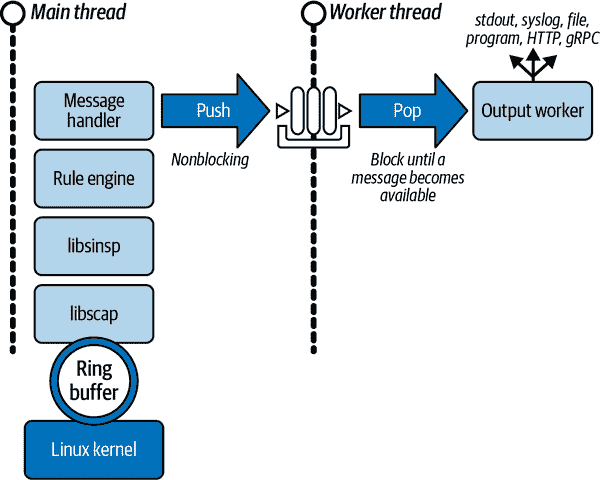

# 第八章：输出框架

在前几章中，你学到了 Falco 如何收集事件（其输入）以及如何处理它们以使你能够接收重要的安全通知（其输出）。在这个处理管道的最后，Falco 的一个关键部分——*输出框架*——使其能够将这些通知（也称为*警报*）传递到正确的位置。我们将其称为框架，因为其模块化设计提供了你需要的一切，可以将通知传递到任何你希望的目的地。在本章中，你将学习输出框架的工作原理以及如何配置和扩展它。

# Falco 的输出架构

输出框架是本书这部分描述的事件处理管道的最后一部分。Falco 的用户空间程序在内部实现了核心机制，但外部工具可以扩展它。它的工作是及时将通知传递到正确的目的地。每当上游事件（由驱动程序、插件或任何 Falco 支持的其他输入源产生）满足规则条件时，规则引擎会要求输出框架向下游消费者发送通知，这可以是环境中的任何其他程序或系统（或仅仅是你自己）。

传送警报的过程涉及两个不同的阶段，如图 8-1 所示。

在第一阶段中，*处理程序*接收事件数据和事件触发规则的信息。它使用提供的信息准备通知，并根据规则的`output`键格式化文本表示。然后，为了防止输出目的地阻塞运行在主执行线程中的处理管道，处理程序将通知推入并发队列中^(1)。推送操作是非阻塞的，因此处理管道无需等待通知消费者拉取通知；它可以继续执行其工作而不受干扰。事实上，Falco 需要尽快执行这个阶段，以便处理管道可以处理下一个事件。



###### 图 8-1。Falco 中传送通知的两个阶段

在队列的另一端，等待弹出通知的*输出工作者*（运行在单独的执行线程中）。这时第二阶段开始。一旦输出工作者收到通知，它立即将该通知扩散到所有配置的输出通道。*输出通道*（或简称*输出*）是输出框架的一部分，允许 Falco 将警报转发到目的地。每个输出通道实现了通知特定类别的警报消费者的实际逻辑。例如，一些消费者希望将通知写入文件，而其他人则更喜欢将其发布到 Web 终端点（参见第十章）。

这种两阶段方法允许处理管道在不受输出传递过程干扰的情况下运行。但是，传递可能仍会出现问题。特别是，当传递通知涉及 I/O 操作时，这些操作可能会暂时阻塞调用者（例如，在网络减速时）或无限期阻塞（例如，在目标磁盘上没有剩余空间时）。两个阶段之间的队列非常擅长吸收临时减速，以至于您甚至都不会注意到（默认情况下，Falco 可以在队列中积累未决通知达到两秒）。但是，当通知的接收者长时间（或无限期）阻塞时，Falco 无法自动执行任何操作。作为最后的手段，它会尝试通过记录到[标准错误流（*stderr*）](https://oreil.ly/IbBik)通知您发生了什么。当这种情况发生时，通常是配置错误的症状（例如，目标路径错误）或资源不足（目标中没有剩余空间），用户需要手动修复。

一旦通知传递过程完成，Falco 的用户空间程序已经完成了其目的。接下来由消费者决定如何处理警报。

输出框架适用于许多不同的用例，并且可以处理许多可能的问题。它还足够灵活，可以让您以各种方式和到不同目的地接收通知。本章的其余部分将详细介绍所有可用的可能性。我们还将快速查看一些其他工具，这些工具允许您在将通知传递到最终目的地之前进一步扩展输出处理（我们将在第十三章深入讨论这个问题）。

# 输出格式化

在通知传递的第一阶段，Falco 会在转发到输出通道之前对通知应用格式化。您可以自定义 Falco 向其消费者呈现通知的方式，以便轻松集成到您的具体用例中。

Falco 配置文件（*/etc/falco/falco.yaml*）中有两个选项控制此操作。第一个控制时间戳的格式化：

```
time_format_iso_8601: false
```

如果此选项为`false`（默认值），Falco 将根据*/etc/localtime*的设置显示日期和时间。如果为`true`（当 Falco 在容器中运行时的默认值），Falco 将使用 ISO 8601 标准表示日期和时间。请注意，此选项不仅控制输出通知，还包括 Falco 记录的任何其他消息。

第二个选项实际上是一组选项，用于启用通知的 JSON 格式化。默认情况下，禁用了 JSON 格式化：

```
json_output: false
```

使用此设置，Falco 将通知格式化为纯文本字符串（包括时间戳、严重性和消息）。如果设置为`true`，Falco 将通知封装在 JSON 格式的字符串中，包括多个字段。以下两个选项允许您包含或排除输出中的某些字段：

`json_include_output_property: true`

如果启用此选项（默认情况下是启用的），你仍然可以在 JSON 对象的`output`字段中找到通知的纯文本表示。如果不需要，可以禁用此选项以节省一些字节。

`json_include_tags_property: true`

如果启用此选项，您将在 JSON 对象中找到一个`tags`字段，其中包含匹配规则中指定的标签数组。未定义标签的规则在输出中将具有空数组（`tags:[]`）。如果禁用此选项，您将无法在 JSON 对象中获取`tags`字段。

###### 注意

尽管名字是`json_output`，但它并不是一个输出通道。`json_output`配置控制处理第一阶段的通知格式化，因此它会影响通道传递的通知内容。接下来的部分描述了可用的输出通道。

# 输出通道

Falco 提供了六种内置输出通道，列在 Table 8-1 中。我们将在接下来的子章节中更详细地描述每一种。默认情况下仅启用了两个通道——[标准输出](https://oreil.ly/kBm4I)和 syslog 输出——但 Falco 允许您同时启用多个通道。

Table 8-1\. Falco 的内置输出通道

| 通道 | 描述 |
| --- | --- |
| 标准输出 | 将通知发送到 Falco 的标准输出（stdout） |
| Syslog 输出 | 通过 syslog 发送通知到系统 |
| 文件输出 | 将通知写入文件 |
| 程序输出 | 将通知发送到程序的标准输入 |
| HTTP 输出 | 将通知发布到 URL |
| gRPC 输出 | 允许客户端程序通过 gRPC API 消费通知 |

您可以在 Falco 配置文件（*/etc/falco/falco.yaml*）中配置这些输出。请注意，本节中的所有配置片段都是该文件的一部分。

每个输出通道至少有一个名为`enabled`的选项，可以是`true`或`false`。其他特定输出可能有其他选项（你很快会发现）。此外，还有一些全局选项可以影响所有或部分输出通道的功能。其中一个选项（你在上一节看到的）是`json_output`；当启用时，警报消息将以 JSON 格式呈现，无论使用的输出通道是哪种。可以影响输出通道行为的其他全局选项列在 Table 8-2 中。

Table 8-2\. 输出通道的全局选项

| 全局选项（带默认值） | 描述 |
| --- | --- |
| `buffered_outputs: false` | 此选项启用或禁用输出通道的完全缓冲。当禁用时，Falco 在每次警报时立即刷新输出缓冲区，这可能会导致更高的 CPU 使用率，但在将输出导入另一个进程或脚本时非常有用。除非您遇到默认值的问题，通常不需要启用此选项。请注意，Falco 的`--unbuffered`命令行标志可以覆盖此选项。并非所有输出通道都遵循此全局选项。某些输出通道可能实现了您无法禁用的特定缓冲策略。 |
| `output_timeout: 2000` | 此选项的值指定在超过传递通知截止时间之前等待的持续时间（以毫秒为单位）。当通知消费者阻塞且输出通道无法在给定的截止时间内传递警报时，Falco 将报告一个错误，指示哪个输出正在阻止通知。这样的错误表明消费者中存在配置错误或 I/O 问题，Falco 无法恢复。 |

| `outputs:` `rate: 1`

`max_burst: 1000` | 这些选项控制通知速率限制器，以防止输出通道淹没其目标。速率限制器实现了令牌桶算法。要发送通知，系统必须从桶中移除一个令牌。`rate`设置系统每秒获取的令牌数，`max_burst`设置桶中的最大令牌数。使用默认设置，Falco 可以连续发送高达 1,000 个通知；然后，必须等待将令牌添加到桶中，该过程以每秒 1 个令牌的速率进行。换句话说，一旦桶被清空，通知的发送速率限制为每秒一个。 |

###### 提示

尽管与输出机制不严格相关，Falco 的其他设置可能会影响您在输出中收到的内容。例如，配置`priority: *<severity>*`控制要加载和运行的最小规则优先级级别，命令行选项`-t *<tag>*`允许您仅加载具有特定标签的规则。在这些情况下，显然，您将不会收到 Falco 未加载规则相关的任何输出。一般来说，任何与规则相关的选项或配置都可能间接影响输出。

现在您已经了解了输出通道及其行为可能发生变化的设置，让我们依次进行详细说明。

## 标准输出

标准输出（配置文件中的`stdout_output`，默认情况下启用）是 Falco 最直接的输出通道。启用时，Falco 将为每个警报在标准输出打印一行。这允许您在从控制台手动运行 Falco 或查看容器或 Kubernetes Pod 日志时查看警报通知。此输出通道唯一的特定可用选项是`enabled`（可以是`true`或`false`）。但是，它也受全局缓冲选项`buffered_outputs`的影响。当输出被缓冲时，stdout 流将完全缓冲或在流是交互设备（如 TTY）时进行行缓冲。

## Syslog 输出

syslog 输出通道（配置文件中的`syslog_output`，默认情况下也启用）允许 Falco 为每个警报发送一个 syslog 消息。与标准输出类似，该输出通道唯一的可用选项是`enabled`（可以是`true`或`false`）。启用时，Falco 会使用`LOG_USER`^(2)设施和由规则定义的优先级值作为严重级别发送消息到 syslog。

根据您使用的 syslog 守护程序，您可以使用类似于`tail -f /var/log/syslog`或`journalctl -xe`的命令读取这些消息。实际的消息格式也取决于 syslog 守护程序。

## 文件输出

如果启用文件输出，Falco 将每个警报写入一个文件。此输出通道的默认配置为：

```
file_output:
  enabled: false
  keep_alive: false
  filename: ./events.txt
```

`filename`选项允许您指定 Falco 将写入的目标文件。如果文件尚不存在，则会创建该文件，如果文件已存在，则不会尝试截断或旋转该文件。

如果禁用`keep_alive`（默认情况），Falco 将为每个警报打开文件进行追加写入，然后关闭文件。如果将`keep_alive`设置为`true`，Falco 将仅在第一个警报之前打开文件一次，并将保持打开状态以处理所有后续警报。无论`keep_alive`是否启用，Falco 在接收到`SIGUSR1`信号时关闭并重新打开文件。如果您想要使用程序来旋转输出文件（例如`logrotate`），这个特性非常方便。

最后，除非禁用全局缓冲选项，否则写入文件通常会进行缓冲。关闭文件将刷新缓冲区。

## 程序输出

程序输出与文件输出非常相似，但在这种情况下，Falco 将每个警报的内容写入到配置文件中指定的程序的标准输入中。此输出通道的默认配置为：

```
program_output:
  enabled: false
  keep_alive: false
  program: > 
    jq '{text: .output}' | curl -d @- -X POST https://hooks.slack.com/services...
```

`program`字段允许您指定将警报发送到的程序。Falco 通过 shell 运行程序，因此您可以在将消息传递到程序之前指定任何处理步骤的命令管道。该字段的默认值显示了其用法的一个很好的例子：当执行时，这个单行程序将警报发布到 Slack webhook 端点。（然而，使用 Falcosidekick 会是一个更好的选择；请参阅第十二章。）

如果将`keep_alive`设置为`false`，Falco 在每次有通知需要传递时都会重新启动程序，并将警报内容写入其标准输入。如果将`keep_alive`设置为`true`，Falco 会在发送第一个警报之前启动程序一次，并保持程序管道开放以传递后续警报。

当接收到`SIGUSR1`信号时，Falco 关闭并重新打开程序。然而，该程序与 Falco 运行在同一个进程组中，因此它会接收到 Falco 接收到的所有信号。如果需要，您可以覆盖程序信号处理程序。

缓冲通过全局选项支持。当 Falco 关闭程序时，它也会刷新缓冲区。

## HTTP 输出

当您需要通过 HTTP(S)连接发送警报时，最好的选择是使用 HTTP 输出。其默认配置非常简单：

```
http_output:
  enabled: false
  url: http://some.url
```

一旦启用，您需要指定的唯一其他配置是您端点的`url`。Falco 将为每个警报向指定的 URL 发起 HTTP POST 请求。支持未加密的 HTTP 和安全的 HTTPS 端点。该输出通道始终启用缓冲（即使您禁用了全局缓冲选项）。

当您使用 Falcosidekick 时，首选 HTTP 输出通道；它以扇出方式将 Falco 的警报转发到许多不同的目的地（目前支持 50 多个）。如果您希望 Falco 将警报转发到 Falcosidekick，请应用此 Falco 配置：

```
json_output: true
json_include_output_property: true
http_output:
  enabled: true
  url: "http://localhost:2801/"
```

请注意，此配置假定您已经运行并配置了 Falcosidekick 来监听`localhost:2801`；如果您的设置不同，请相应更改。您可以在第十二章以及其[在线文档](https://oreil.ly/uUQBR)中找到有关配置 Falcosidekick 的详细信息。

## gRPC 输出

[gRPC](https://grpc.io)输出是最复杂的输出通道。与其他通道相比，它允许更大的控制权，可以完全控制所接收的信息。如果您希望将警报发送到通过 Falco 的 gRPC API 连接的外部程序，则可以选择此输出通道。其默认配置为：

```
grpc_output:
  enabled: false
```

如您所见，默认情况下它是禁用的——在您启用它之前，有一些事情您应该考虑。Falco 自带一个暴露 API 的 gRPC 服务器。您需要同时启用 gRPC 服务器和 gRPC 输出（我们稍后会向您展示如何操作）。该 API 提供了多个 gRPC 服务，其中只有一些与 gRPC 输出相关。一个服务允许您获取所有待处理的警报，另一个服务允许您订阅警报流。客户端程序可以决定哪种实现最适合其需求。在两种情况下，当启用 gRPC 输出时，Falco 使用内部队列暂时存储警报，直到客户端程序消费它们。这意味着如果没有设置好客户端程序来消费警报，则不应启用 gRPC 输出；否则，内部队列可能会无限增长。全局缓冲选项不会影响此输出通道。

有了这些，为了使此输出通道正常工作，您首先必须启用 gRPC 服务器。它支持两种绑定类型：在 Unix socket 上和在具有强制性双向 TLS 认证的网络上。

下面是如何在 Unix socket 上启用 gRPC 服务器：

```
grpc:
  enabled: true
  bind_address: "unix:///var/run/falco.sock"
  threadiness: 0
```

以及如何在网络上启用具有强制性双向 TLS 认证的 gRPC 服务器：

```
grpc:
  enabled: true
  bind_address: "0.0.0.0:5060"
  threadiness: 0
  private_key: "/etc/falco/certs/server.key"
  cert_chain: "/etc/falco/certs/server.crt"
  root_certs: "/etc/falco/certs/ca.crt"
```

两种绑定类型都提供相同的 gRPC 功能，因此您可以选择满足您需求的那一种。一旦启用了 gRPC 服务器，下一步是启用 gRPC 输出：

```
grpc_output:
  enabled: true
```

最后，您将需要配置您的客户端程序以连接到 Falco gRPC API。如何完成这一步取决于您使用的程序。Falcosecurity 组织提供了两个可以连接到此输出的程序（参见 第二章）：[falco-exporter](https://oreil.ly/FN9gE)，它连接到 Falco gRPC API 以导出 Prometheus 可消耗的指标（更多信息请参阅 第十二章），以及 [event-generator](https://oreil.ly/4MHw1)，它可以选择连接到 Falco gRPC API，以测试是否实际处理了虚假事件（在开发集成测试时很有帮助）。您也可以实现自己的程序。Falcosecurity 组织提供了 SDK，允许您轻松地使用多种编程语言为 Falco 创建 gRPC 客户端程序，例如 [Golang 的 client-go](https://oreil.ly/HXPKL)，[Rust 的 client-rs](https://oreil.ly/XdgVp) 和 [Python 的 client-py](https://oreil.ly/A64Dh)。您可以在 第十四章 中找到关于使用 Falco gRPC API 进行开发的更多信息。

最后，这是 Falco 通过 gRCP API 发送的消息的 proto 定义摘录：

```
// The `response` message is the representation of the output model.
// It contains all the elements that Falco emits in an output along 
// with the definitions for priorities and source.
message response {
  google.protobuf.Timestamp time = 1;
  falco.schema.priority priority = 2;
  falco.schema.source source_deprecated = 3 [deprecated=true];
  string rule = 4;
  string output = 5;
  map<string, string> output_fields = 6;
  string hostname = 7;
  repeated string tags = 8;
  string source = 9;
}
```

`response` 消息包括已经格式化的警报字符串（您将在 `output` 字段中找到）以及所有组件信息，这些信息分布在各种字段中。客户端程序可以根据需要组装和处理它们，这在您希望在 Falco 之上构建自己的应用程序时非常有用。

## 其他日志选项

到目前为止，我们已经描述了输出框架的核心部分。现在让我们看看一些帮助您进行故障排除的选项。与大多数应用程序一样，Falco 可以输出调试信息和错误。这些信息性的消息涉及到 Falco 本身的功能，而不是其主要输出。

Falco 在内部实现了各种日志消息。它们可能会随着不同的发布版本而有所变化。一个常见的例子是 Falco 启动时打印的初始信息。另一个不太常见的情况是当 Falco 通知您无法加载驱动时：

```
Mon Dec 20 14:00:23 2021: Unable to load the driver.
```

###### 注

术语 *logging* 不涉及输出安全通知的过程。本节讨论的日志消息不是安全警报。日志选项不以任何方式影响通知处理。此外，由于这些日志消息不是通知，因此 Falco 不会通过输出渠道输出它们。尽管在终端中运行 Falco 时可能会看到通常的通知与日志消息交织在一起，但请记住它们是不同的。

Falco 通过 [标准错误流](https://oreil.ly/yatpB) 输出这些消息，并将它们发送到 syslog。您可以配置 Falco 根据其严重性级别丢弃某些消息。表 8-3 列出了您可以在 Falco 配置文件（*/etc/falco/falco.yaml*）中配置的日志选项。

表 8-3\. Falco 内部日志选项

| 日志选项（带默认值） | 描述 |
| --- | --- |
| `log_stderr: true` | 如果启用，Falco 将日志消息发送到 stderr。 |
| `log_syslog: true` | 如果启用，Falco 将日志消息发送到 syslog。请注意，此选项与 syslog 输出无关，也不会影响它。 |
| `log_level: info` | 此选项定义要包含在日志中的最低日志级别：`emergency`、`alert`、`critical`、`error`、`warning`、`notice`、`info` 或 `debug`。请注意，尽管这些值相似，但它们不是规则优先级级别。 |

# 结论

本章结束了本书的 第二部分。在这一点上，您应该对 Falco 的架构及其内部工作原理有一个扎实的理解。您对处理管道数据流的熟悉，以输出框架结束，将允许您以多种方式使用 Falco。例如，您可以在喜爱的仪表板中查看安全通知，甚至在 Falco 之上创建响应引擎（在特定事件发生时采取行动的机制）。要发现更多用例，请发挥您的想象力，并继续阅读本书。

接下来是真实的使用案例，所以第 III 部分 是关于在生产环境中运行 Falco 的内容。像往常一样，我们会指导您完成每一步。

^(1) *并发队列* 是实现多个运行线程可以安全并行访问的一种 [队列数据结构](https://oreil.ly/NWtzd)。*pop* 和 *push* 操作是队列支持的典型操作（分别用于入队和出队）。大多数实现允许以阻塞或非阻塞方式执行这些操作。

^(2) 在 syslog 协议中，设施值确定创建消息的进程的功能。`LOG_USER` 用于用户级应用程序生成的消息。
