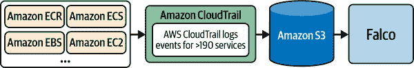
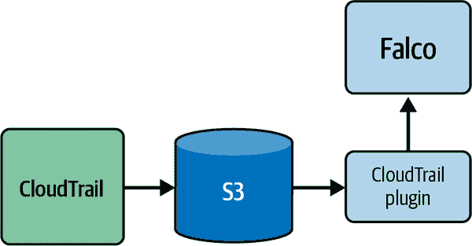
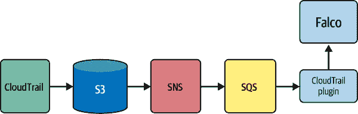

# 第十一章：使用 Falco 进行云安全

现在您已经学会了如何配置和运行 Falco 的所有必要知识，是时候关注一个对您的安全姿态有重大影响的重要主题了：云安全。

如果您正在阅读本书，那么您的一些软件（或者全部！）很可能在云中运行。由于 AWS 是云服务的领先提供者，您的软件很可能也在那里运行。

公共云环境非常适合运行软件。它们对弹性、灵活性和自动化的支持使得构建和运行应用程序更加容易和高效。然而，基于云的应用程序及其使用的数据面临来自全球的攻击。它们还容易受到来自内部团队的配置错误、失误和恶意行为的影响。

综合安全姿态需要考虑许多领域，包括应用程序、用户（内部和外部）以及数据。如果不能正确保护这些领域中的任何一个，将会产生漏洞，从而导致风险。例如，保护在容器和主机中运行的工作负载（你可以通过 Falco 有效实现）如果不涵盖这些工作负载所运行的云基础设施，就不会有实际益处。

幸运的是，Falco 可以填补这一差距，并帮助您实现所需的覆盖范围。让我们来学习如何做到！

# 为什么选择 Falco 用于 AWS 安全？

云安全是一个肥沃且不断发展的领域，具有许多实施选项。从架构上讲，大多数选项都可以归为两种基本类别：

1.  查询云 API 或监视云数据存储以检测配置错误或漏洞的工具

1.  将云日志流式传输到后端并对其进行索引以及让您进行查询的工具

如果您的目标是检测基于云的软件中的威胁，那么第一类工具并不是非常有用。轮询对于检测漏洞和验证合规性很有用，但缺乏检测威胁并快速响应所需的实时性质。第二类工具功能强大，但在像公共云这样产生大量日志的环境中非常昂贵，并且部署和使用起来也不友好。

Falco 的运行时安全方法为解决这一问题提供了非常有效的解决方案。Falco 的理念基于三个关键概念。首先，它以流式处理方式解析数据，实时检测威胁。其次，它在轻量级易于运行和部署的引擎上实现检测。第三，它提供一种紧凑的规则语言，快速学习但灵活表达。正如您在整本书中看到的那样，这种理念在系统调用和像 AWS CloudTrail 生成的日志中同样有效。

Falco 资源消耗极少，并且最重要的是，以流式方式分析数据——无需执行昂贵的复制或等待数据索引。Falco 实时查看您的数据，并在几秒钟内通知您存在的问题。正如您在本书的 Part I 中看到的那样，只需几分钟即可使其运行，并将其用于云日志和系统调用允许了统一的威胁检测方法。让我们看看它是如何工作的。

# Falco 的架构与 AWS 安全

当部署在 AWS 基础设施安全环境中时，Falco 在 AWS CloudTrail 生成的日志之上实施检测。其工作原理如 Figure 11-1 所示。



###### Figure 11-1\. Falco 用于 AWS 安全的高级架构

CloudTrail 是亚马逊提供的日志聚合服务。它从数百个 AWS 服务收集日志，并使用一致且有文档化的格式存储在 S3 中。CloudTrail 容易设置，并提供一致的层，使客户免受收集用户和服务活动日志的复杂性影响。

CloudTrail 事件是 CloudTrail 定期写入 S3 存储桶中的 JSON 文件条目。Falco 通过 CloudTrail 插件（Figure 11-2）理解如何读取和解析这些事件，该插件由 Falco 社区创建和维护。（如果您需要了解 Falco 插件及其工作原理，请参阅 Chapter 4。）



###### Figure 11-2\. 使用 CloudTrail 插件进行事件收集

除了提供多种收集 CloudTrail 日志的方法（本章稍后详细介绍每种方法），CloudTrail 插件还使用 AWS 特定字段扩展了 Falco，您可以使用这些字段创建类似这样的规则：

```
- rule: Console Login Without MFA
  desc: Detect a console login without MFA.
  condition: >
    ct.name="ConsoleLogin" and ct.error=""
    and ct.user.identitytype!="AssumedRole" 
    and json.value[/responseElements/ConsoleLogin]="Success"
    and json.value[/additionalEventData/MFAUsed]="No"
  output: >
    Detected a console login without MFA 
    (requesting user=%ct.user, requesting IP=%ct.srcip, AWS region=%ct.region)
  priority: CRITICAL
  source: aws_cloudtrail
```

一旦将 Falco 的 CloudTrail 插件配置为以 CloudTrail 跟踪作为输入，Falco 将持续分析跟踪的即将到来的数据，提供实时异常和威胁检测。这就像为您的云活动安装了安全摄像头！

## 检测示例

这是配置为 AWS 安全时 Falco 可以检测到的一些事物：

+   有人在 AWS 控制台上未使用多因素身份验证（MFA）登录。

+   有人为根用户停用了多因素身份验证（MFA）。

+   有人创建了新的 AWS 用户或组。

+   有人在非批准的区域运行实例。

+   有人更改了 S3 存储桶的权限。

+   有人禁用了 CloudTrail 日志记录。

要获取完整列表，请参考 CloudTrail [rules file](https://oreil.ly/beQYF)。

# 配置和运行 Falco 以保障 CloudTrail 安全

本章的这部分将概述使用 Falco 设置云安全的方法，描述各组件，并指导您正确配置所有内容。正如我们提到的，Falco 与 CloudTrail 的集成通过[CloudTrail 插件](https://oreil.ly/OWVgb)完成。可以配置插件以三种不同方式接收日志文件：

+   一个 Simple Queue Service（SQS）队列，传递有关新日志文件的 Simple Notification Service（SNS）通知

+   一个 S3 存储桶

+   本地文件系统路径

在这三种方法中，第一种是您在绝大多数生产情况下将使用的方法，因此我们将首先重点介绍它。

## 通过 SQS 队列接收日志文件

此部署方法利用 SQS 来通知 Falco 新的 CloudTrail 日志产生。当新日志到达时，Falco 会监视 SQS 队列并实时解析这些日志。该过程如图 11-3 所示。



###### 图 11-3\. SQS 队列集合图示

在此配置中设置 Falco 的过程包括三个步骤：

1.  创建 CloudTrail 跟踪并配置与 SNS 主题关联。SNS 主题检测到跟踪将文件存储在其中的 S3 存储桶的更改并广播到全球。

1.  创建 SQS 队列并将其附加到 SNS 主题。这将创建一个 Falco 可以使用来检测新数据到达的端点。

1.  配置 Falco 以使用 SQS 队列接收日志。

我们将通过逐步说明来指导您设置所有这些内容，以便您全面了解各个组成部分。但在此之前，我们将向您展示一个简单的快捷方式：一个 Terraform 模块将为您完成这些工作。

### 基于 Terraform 的部署

您可以在[GitHub](https://oreil.ly/4qvQX)上找到 Terraform 模块。将存储库克隆到本地计算机，然后执行以下命令：

```
$ cd examples/single-account
$ terraform init
$ terraform validate
$ terraform apply
```

如果一切顺利，您应该获得类似于以下输出：

```
Apply complete! Resources: 14 added, 0 changed, 0 destroyed.

Outputs:

cloudtrail_sns_subscribed_sqs_arn = "arn:aws:sqs:*ZZZZ*"
cloudtrail_sns_subscribed_sqs_url = "https://sqs.*<REGION>*.amazonaws.com/.../
*<QUEUE_NAME>*"
```

您现在可以在*falco.yaml*文件中使用`*<QUEUE_NAME>*`了：

```
plugins:
  - name: cloudtrail
    library_path: libcloudtrail.so
    init_config: ""
    open_params: "sqs://*`<QUEUE_NAME>`*"
  - name: json
    library_path: libjson.so
    init_config: ""
load_plugins: [cloudtrail, json]
```

接下来，配置*falco.yaml*的`rules_file`部分以加载 CloudTrail 规则：

```
rules_file:
  - /etc/falco/aws_cloudtrail_rules.yaml
```

现在您可以启动 Falco 了！

### 手动部署

如果您不想使用 Terraform 脚本，以下是设置使用 SQS 队列的 Falco 的步骤。第一步是创建跟踪。您可以按以下步骤执行：

1.  转到 AWS 控制台的 CloudTrail 部分。

1.  单击“创建跟踪”。

1.  将跟踪命名为*Falco*。

1.  作为存储位置，您可以选择一个现有的跟踪或告诉 AWS 创建一个新的跟踪。

1.  不选中“日志文件 SSE-KMS 加密”。SSE 加密是您应该使用的良好实践，但配置它超出了本章的范围。

1.  勾选“SNS 通知交付”。

1.  在“创建新 SNS 主题”下，选择新建并命名主题*falco-cloudtrail-logs*。

1.  单击下一步。

1.  “选择日志事件”页面让您选择要捕获的日志。默认设置足以使 Falco 正常运行。勾选“数据事件”或“排除 Amazon RDS 数据 API 事件”将允许您如有需要创建更精细的数据事件规则，例如 S3 存储桶级别和对象级别的访问。

1.  点击下一步。

1.  点击“创建跟踪”。

接下来，创建 SQS 队列：

1.  转到 AWS 控制台的 SQS 部分。

1.  点击“创建队列”。

1.  将队列命名为 *falco-queue*。

1.  Falco 可以直接使用默认访问策略正常运行。但是，考虑实施一个更少权限的访问策略，例如使用 [AWS 策略生成器](https://oreil.ly/fyxDD)。

1.  在页面底部点击“创建队列”。这将带您进入 *falco-queue* 详细信息页面。

1.  点击“订阅 Amazon SNS 主题”。

1.  选择名称以 *falco-cloudtrail-logs* 结尾的主题。

1.  点击保存。

现在您需要配置 Falco。这涉及设置 AWS 身份验证和配置 Falco 本身。要从 S3 存储桶读取日志文件或从 SQS 队列接收 SNS 通知，Falco 需要身份验证凭据，并且需要配置 AWS 区域。Falco 依赖于与 [AWS Go SDK](https://oreil.ly/DmUSL) 相同的身份验证机制：环境变量或共享配置文件。请按以下方式配置这些内容：

环境变量

使用 `AWS_REGION=*xxx*` 指定 AWS 区域，使用 `AWS_ACCESS_KEY_ID=*xxx*` 指定访问密钥 ID，使用 `AWS_SECRET_ACCESS_KEY=*xxx*` 指定秘密密钥。以下是一个示例命令行：

```
AWS_DEFAULT_REGION=us-west-1 \
AWS_ACCESS_KEY_ID=*xxx* \
AWS_SECRET_ACCESS_KEY=*xxx* \
falco -c *<path-to-falco.yaml>* -r *<path-to-falco-rules>*
```

共享配置文件

在 *$HOME/.aws/config* 文件中指定 AWS 区域，并在 *$HOME/.aws/credentials* 文件中指定凭证。以下是这些文件的示例内容：

```
$HOME/.aws/config
[default]
region = us-west-1

$HOME/.aws/credentials
[default]
aws_access_key_id=*<YOUR-AWS-ACCESS-KEY-ID-HERE>*
aws_secret_access_key=*<YOUR-AWS-SECRET-ACCESS-KEY-HERE>*
```

现在，设置 Falco 本身：

1.  在 *falco.yaml* 中添加以下片段以配置基于 SQS 的日志收集：

    ```
    plugins:
      - name: cloudtrail
        library_path: libcloudtrail.so
        init_config: ""
        open_params: "sqs://falco-queue"
      - name: json
        library_path: libjson.so
        init_config: ""
    load_plugins: [cloudtrail, json]
    ```

1.  配置 *falco.yaml* 中的 `rules_file` 部分以加载 CloudTrail 规则：

    ```
    rules_file:
      - /etc/falco/aws_cloudtrail_rules.yaml
    ```

1.  启动 Falco。

*Et voilà:* 您的 AWS 基础设施现在受到保护！

## 从 S3 存储桶或本地文件系统读取事件

虽然推荐使用基于 SQS 的设置进行实时检测，但 Falco 也可以直接从 S3 存储桶或本地文件系统中读取 CloudTrail 日志。基于 SQS 的设置在处理到达的“实时”日志时起作用，而 S3 和本地文件系统的设置则读取存储的数据。这意味着它们实际上是在过去运行，并且在到达当前存储数据的末尾时会导致 Falco 退出。这种方法在几个方面非常有价值。首先，它允许您在规则开发过程中快速迭代。其次，它允许您在 CloudTrail 日志上“回溯”运行 Falco（即使这些日志已存储了很长时间）。想知道在过去三周内是否有人更改了存储桶的权限？指向日志，您就可以轻松找出！

让我们看看如何以此模式运行 Falco。

### S3 存储桶

首先，你需要设置 AWS 认证。我们刚刚描述了如何为 SQS 访问做这些设置，对于 S3 来说也是一样的，所以回到上一节的结尾，按照步骤操作即可。

配置好 AWS 认证后，在 *falco.yaml* 中添加以下片段：

```
plugins:
  - name: cloudtrail
    library_path: libcloudtrail.so
    init_config:
    s3DownloadConcurrency: 64
    open_params: >
        s3://my-s3-bucket/AWSLogs/411571310278/CloudTrail/us-west-1/2021/09/23/
  - name: json
    library_path: libjson.so
    init_config: ""
    load_plugins: [cloudtrail, json]
```

注意 `open_params` 键仅仅是 S3 上路径的 URI，你可以通过访问 S3 控制台中的数据并点击 “复制 S3 URI” 轻松获取。你不需要指定整个存储桶；你可以指向子目录甚至特定的日志文件。

现在你需要配置 *falco.yaml* 中的 `rules_file` 部分以加载 CloudTrail 规则：

```
rules_file:
  - /etc/falco/aws_cloudtrail_rules.yaml
```

之后，你只需运行 Falco。它会处理提供的 S3 URI 下的每个文件，并在完成后返回。

从 AWS 外部的机器（比如你的笔记本电脑）解析日志可能会非常慢，因为机器需要下载数据以便处理。你可以通过增加下载并发数（在 `init_config` 键中的 `s3DownloadConcurrency`）来加快速度，或者预先使用 AWS CLI 将数据下载到本地，然后指向 Falco 到本地日志（接下来我们将描述）。

### 本地文件系统路径

你可以通过将以下配置放入 *falco.yaml* 中来处理存储在本地文件系统中的 CloudTrail 日志：

```
plugins:
  - name: cloudtrail
    library_path: libcloudtrail.so
    init_config: ""
    open_params: >
        /home/user/cloudtrail-logs/059797578166_CloudTrail_us-east-1_2021...
  - name: json
    library_path: libjson.so
    init_config: ""
    load_plugins: [cloudtrail, json]
```

你可以指向单个文件或目录，Falco 将递归读取目录中的所有文件。

你还需要编辑 *falco.yaml* 中的 `rules_file` 部分以加载 CloudTrail 规则：

```
rules_file:
  - /etc/falco/aws_cloudtrail_rules.yaml
```

完成以上步骤后，只需运行 Falco。它会处理所有文件并在完成后退出。

# 扩展 Falco 的 AWS 规则集

Falco 提供了一个强大的基于 CloudTrail 的规则集。然而，如果需要定制，CloudTrail 插件导出了丰富的字段集，可以用于以高精度制定自己的规则。

Falco 规则的编写将在第十三章中进行详细讨论。然而，由于该章节主要集中在基于系统调用的规则上，这里有一些可以帮助你开始云规则开发的提示：

+   CloudTrail 规则需要包含以下关键字：`source: aws_cloudtrail`。这告诉 Falco 规则条件和输出中的字段必须来自 CloudTrail 插件。

+   通过使用 `--list=aws_cloudtrail` Falco 命令行开关，你可以获取可以在 CloudTrail 规则中使用的字段列表。同时，请参阅第六章中的 Table 6-10。

# 其他云平台呢？

AWS 是云计算中非常重要的一部分，所以 Falco 首先增加了对它的支持。然而，在撰写本文时，Falco 社区正在努力增加对 Microsoft Azure 和 Google Cloud Platform 的支持。预计长远来看会添加更多的云平台！

如果您想了解 Falco 是否支持您的云平台，请查看[GitHub 上的插件仓库](https://oreil.ly/W20tv)。

# 结论

在本章中，您了解到 Falco 不仅涉及系统调用和容器，还了解了如何利用它来保护您的云软件并大大提升安全姿态。在下一章中，我们将转向输出方面，并展示如何收集和处理 Falco 事件。
