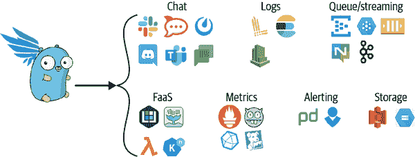
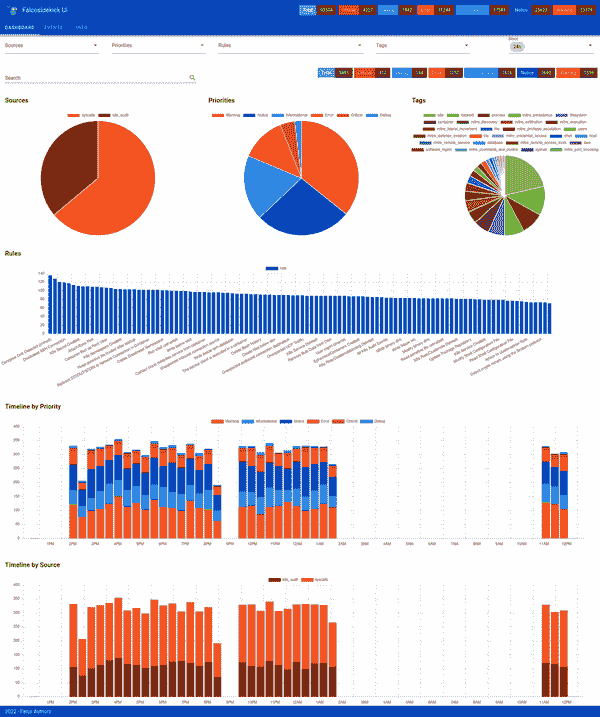
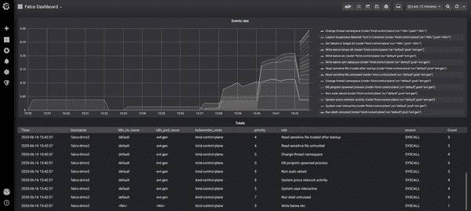
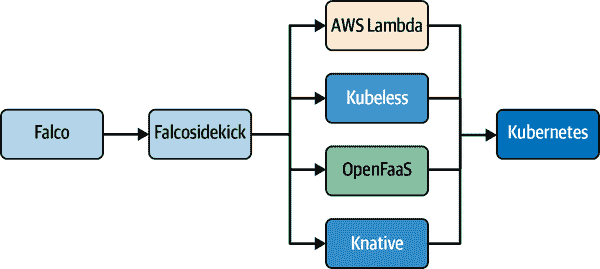

# 第十二章：消费 Falco 事件

到目前为止，您已经学会了如何运行和配置 Falco。您了解 Falco 如何用于运行时和云安全，以及它如何检测广泛的威胁。现在，是时候关注您可以如何处理 Falco 检测的内容了。消费 Falco 的输出是这个拼图的最后一块，也是本章的主题。

Falco 生成的警报对于观察和保护生产系统非常有帮助，我们将为您提供如何有效使用这些警报的建议。本章的第一部分是关于帮助您有效消费 Falco 输出的工具。我们将教您如何在 Falco 检测到安全威胁时立即获得通知，以便您的安全团队尽快采取适当的对策。最后，我们将展示一种自动响应威胁以加快响应时间的机制。

# 处理 Falco 输出

最小化的 Falco 安装会输出一个简单的文本日志，您可以稍后查阅，但这并不是很有用。幸运的是，更智能的工具允许您处理 Falco 的输出并扩展其功能，这些工具是将 Falco 整合到您生态系统中的重要部分。

本节将详细讨论本书中已提及的两个工具。第一个工具是 falco-exporter，它专为一个目标而设计：从 Falco 检测的事件生成指标。第二个工具 Falcosidekick 则是 Falco 输出的瑞士军刀，它允许您聚合来自多个 Falco 传感器的数据，过滤通知，并将它们转发到您环境中的任何其他应用程序或平台。

## falco-exporter

[falco-exporter 项目](https://oreil.ly/0j6EJ) 提供了用于 Falco 输出事件的 Prometheus 指标导出器。它通过流式 gRPC API 消费 Falco 输出，并公开指标端点。这些指标包括触发规则的数量信息，以及与规则相关的优先级和标签的详细信息，还包括用于识别每个事件来源的标签，例如主机名、命名空间和 Pod 名称。它还提供了一个预配置的 Grafana 仪表板。^(1) falco-exporter 对于只需要关于安全事件的指标非常有用。（相比之下，Falcosidekick 也可以导出指标，但它具有许多其他功能和输出。）

在安装 falco-exporter 之前，请确保已安装并配置了 Falco，且启用了通过 Unix socket 的 gRPC 服务器和 gRPC 输出（参见“gRPC 输出”进行复习）。

### 主机安装

要直接在主机上安装 falco-exporter，您需要从 [发布页面](https://oreil.ly/rfK8e) 下载最新版本，解压存档，并将可执行文件 *falco-exporter* 复制到您喜欢的位置（例如 */usr/bin*）。无论您是手动执行还是作为服务运行都可以。默认选项与 gRPC Unix 套接字 */var/run/falco.sock*（Falco 的默认选项）兼容。如果您需要自定义选项，请运行 `falco-exporter --help` 获取帮助。

### 在容器中运行

要在使用 Docker 容器中运行 falco-exporter，请使用以下命令：

```
$ docker pull falcosecurity/falco-exporter:latest
$ docker run -v /var/run/falco.sock:/var/run/falco.sock \
 falcosecurity/falco-exporter:latest
```

`docker run` 命令假设 Falco 已安装在主机上，并且 Falco 的 gRPC Unix 套接字位于 */var/run/falco.sock*。

### 部署到 Kubernetes

您可以使用 Helm 或清单文件将 falco-exporter 部署到 Kubernetes 集群（有关两种安装方法的详细信息，请参阅 第九章）。我们推荐使用 Helm。首先需要添加 Falcosecurity 图表存储库：

```
$ helm repo add falcosecurity https://falcosecurity.github.io/charts
$ helm repo update
```

然后，要安装图表，请运行：

```
$ helm install falco-exporter falcosecurity/falco-exporter
```

有关详细说明，请参阅 [falco-exporter 图表文档](https://oreil.ly/qkH5G)。如果要使用清单文件，请按照 [falco-exporter 文档](https://oreil.ly/lktaK) 中的步骤操作。

## Falcosidekick

[Falcosidekick 项目](https://oreil.ly/MVyRi) 提供了连接 Falco 到您生态系统的完整解决方案。它在 Falco 输出的基础上工作，并允许您将其通知转发到许多其他目的地（参见 图 12-1）。Falcosidekick 可以向通知添加自定义字段或按优先级过滤事件（按目的地分）。特别支持的输出包括以下平台和应用程序：

+   沟通与协作

+   指标和可观察性

+   警报

+   日志和存储

+   函数即服务（FaaS）和无服务器

+   消息队列和流式传输



###### 图 12-1\. Falcosidekick 标志（左）及其支持的部分通知目标（右）

Falcosidekick 还允许您使用一个辅助项目，[falcosidekick-ui](https://oreil.ly/o1pcB)，在愉快的 web UI 中可视化 Falco 事件（如 图 12-2 所示）。Web UI 显示有关检测事件的统计信息，并以聚合形式和时间线显示值。您还可以筛选您感兴趣的事件并快速获取所有事件详细信息。



###### 图 12-2\. Falcosidekick web UI

使用 Falcosidekick 需要对 Falco 的配置进行小修改：在使用之前，启用 JSON 格式化并配置 HTTP 输出以将事件发送到 Falcosidekick 端点（默认监听端口 2801）。有关 Falco 输出配置说明，请参阅 第八章，有关特定细节，请参阅 Falcosidekick 在线文档。

### 主机安装

要直接在主机上安装 Falcosidekick，请从[发布页面](https://oreil.ly/ToAMj)下载最新版本，解压缩存档，并将可执行文件 *falcosidekick* 复制到您喜欢的位置（例如 */usr/bin*）。是否手动执行或作为服务运行完全取决于您。您还需要创建一个 YAML 配置文件并将其路径作为参数传递。例如：

```
$ falcosidekick -c falcosidekick_config.yaml
```

Falcosidekick 仓库包含一个示例配置文件，您可以从中开始。Falcosidekick 还支持环境变量，您可以用其作为配置文件值的替代方案或进行覆盖。

### 在容器中运行

若要在使用 Docker 的容器中运行 Falcosidekick，请使用以下命令：

```
$ docker pull falcosecurity/falcosidekick:latest
$ docker run -d -p 2801:2801 falcosecurity/falcosidekick:latest
```

`docker run` 命令假定 Falco 已安装在主机上，并且 HTTP 输出已配置为将事件发送到端口 2801。使用 Docker 的 `-e` 选项，您可以使用环境变量传递配置。或者，使用 Docker 的 `-v` 选项给它一个 YAML 配置文件。

### 部署到 Kubernetes

与 falco-exporter 类似，您可以使用 Helm 或清单文件将 Falcosidekick 部署到 Kubernetes 集群中。我们建议使用 Helm 安装选项，它有两种变体。在我们探索它们之前，如果您还没有将 Falcosecurity 图表仓库添加到 Helm，请通过运行以下命令来添加：

```
$ helm repo add falcosecurity https://falcosecurity.github.io/charts
$ helm repo update
```

现在，您可以准备部署到您的 Kubernetes 集群了。这样做的第一种更普通的方式是，当您已经部署并配置了 Falco 来发送事件到 Falcosidekick，并且只需安装 Falcosidekick 图表：

```
$ helm install falcosidekick falcosecurity/falcosidekick
```

另一种变体允许您在单个 Helm 安装中部署 Falco 和 Falcosidekick，并自动配置这两个图表以共同工作。通常这是最方便的解决方案。要执行此操作，请运行：

```
$ helm install falco falcosecurity/falco --set falcosidekick.enabled=true
```

可选地，如果您还想要部署 Falcosidekick 的 Web UI，请在安装命令中添加 `--set webui.enabled=true`（无论您选择哪种变体）。

您可以在[Falcosidekick 图表文档](https://oreil.ly/QaipZ)中找到关于其他选项的详细信息。如果您想使用清单文件，可以使用提供的[在线示例](https://oreil.ly/fziYL)。^(2)

# 可观察性和分析

Falco 允许您观察和分析您的云原生环境的安全性。如果您计划利用 Falco 的检测功能进行审计或取证，通常需要尽可能多地存储信息，并使 Falco 的结果易于访问和搜索。本章描述的工具将为您提供充分的支持。

存储 Falco 事件就像摄取任何其他应用程序日志一样。这意味着您可以重用现有的日志后端用于 Falco。此外，Falcosidekick 可以轻松地将 Falco 事件发送到允许您存储和分析大量日志数据的系统，如 Elasticsearch 和 Splunk。由于您可能会使用这种方法进行后续分析，我们建议保留 Falco 发出的所有事件，不进行任何过滤。

您可能还希望收集指标，因为这可以帮助您检测应用程序中的错误和异常。例如，一个指标报告 Falco 规则在特定机器上定期触发可能是安全问题、配置错误或正在运行的应用程序中的实现 bug 的症状。用于此目的的可靠工具是 falco-exporter：它公开指标，连接 Falco 到 Prometheus，并提供一个预配置的 Grafana 仪表板（图 12-3）。



###### 图 12-3\. falco-exporter 提供的预配置 Grafana 仪表板，用于展示 Falco 事件指标

# 接收通知

尽管存储和聚合 Falco 事件对于可观察性是可以的，但在需要立即对安全事件做出反应时并不有用。您可能希望立即且在正确的位置接收重要的通知，以便您或您的团队可以立即采取对策或开始调查。

Falco 的内置输出通道没有提供特定的即时通知机制，但是 Falcosidekick 允许您仅转发重要的通知。例如，假设您希望在事件触发 *Sudo 潜在权限升级* 规则（具有 `priority: CRITICAL`）时收到通知，而不是其他优先级较低的更嘈杂的规则。Falcosidekick 允许您配置一个最低优先级级别，以便将事件发送到特定目的地，并可以为每个目的地调整此配置。它支持大多数的呼叫系统，如 PagerDuty、Opsgenie 和 Prometheus Alertmanager，并且可以将通知发送到包括 Slack、Mattermost、Rocket.Chat、Microsoft Teams 和 Discord 在内的大多数常见通信平台。

您可以使用 Falcosidekick 的配置轻松地将 Falco 警报集成到现有环境中。而且因为 Falcosidekick 允许您同时将 Falco 通知发送到多个目的地，例如同时将警报发送到 PagerDuty 和 Slack 频道。

# 响应威胁

另一种有意义且更复杂的使用 Falco 事件的方式是创建系统，以自动响应威胁或安全事件。实施针对威胁的自定义操作比您想象的要容易。

虽然 Falco 项目本身不提供专门用于此目的的工具，但社区中的一些新兴项目正在实现这一概念。这类系统有时被称为 *响应引擎*，通常专门用于管理 Kubernetes 中的威胁。

响应引擎提供了一个简单的机制，用于在违反 Falco 规则条件时执行预定义任务。您可以使用 Falcosidekick 创建一个简单的实现，将 Falco 通知转发到一个 FaaS 平台或无服务器解决方案，该解决方案进而执行所需的操作。例如，您可以通过实现一个使用 Kubernetes API 删除受损 Pod 的云函数来自动终止 Kubernetes Pod，每当 Falco 规则确定该 Pod 受到威胁时。Figure 12-4 展示了这种方法，并展示了 Falcosidekick 支持的一些云函数提供者。



###### 图 12-4\. Kubernetes 响应引擎功能方案示例，使用 Falcosidekick 输出执行操作

您可能希望无论规则的优先级如何都收到通知，但您可能只希望针对特定规则执行操作。例如，您可能只希望具有 `CRITICAL` 优先级的规则终止 Pods。Falcosidekick 在此方面非常有帮助，因为它允许您基于其优先级值过滤通知，从而控制每个目标接收的信息。

我们建议您分析您的需求并设计响应引擎以满足这些需求。Falco 和类似 Falcosidekick 的工具将为支持您的解决方案提供所需的一切。

# 结论

本章结束了 第三部分。您已经了解了在生产环境中运行 Falco 的所有基本方面，并且现在可以为几乎任何需求和场景配置和定制它。您还了解了如何正确消费 Falco 事件并将其集成到您的生态系统中。

在 第四部分 中，您将超越普通用户的知识，学习如何扩展 Falco 以满足任何高级需求。

^(1) [Grafana 仪表板](https://oreil.ly/2sVSm) 是一组组织良好的 UI 元素，用于可视化数据。仪表板配置可以存储在文件中并进行共享。您可以从 Grafana 的 [在线画廊](https://oreil.ly/F25kV) 获取大多数可用的仪表板。

^(2) Falcosidekick 示例清单文件的实际 URL 可能会不时更改，但您始终可以在 Falcosecurity GitHub 组织下找到它们。请注意，任何 Helm 图表都可以生成这样的文件。事实上，与 Falco 的清单文件一样，Falcosidekick 的文件也是从其图表开始渲染的。
