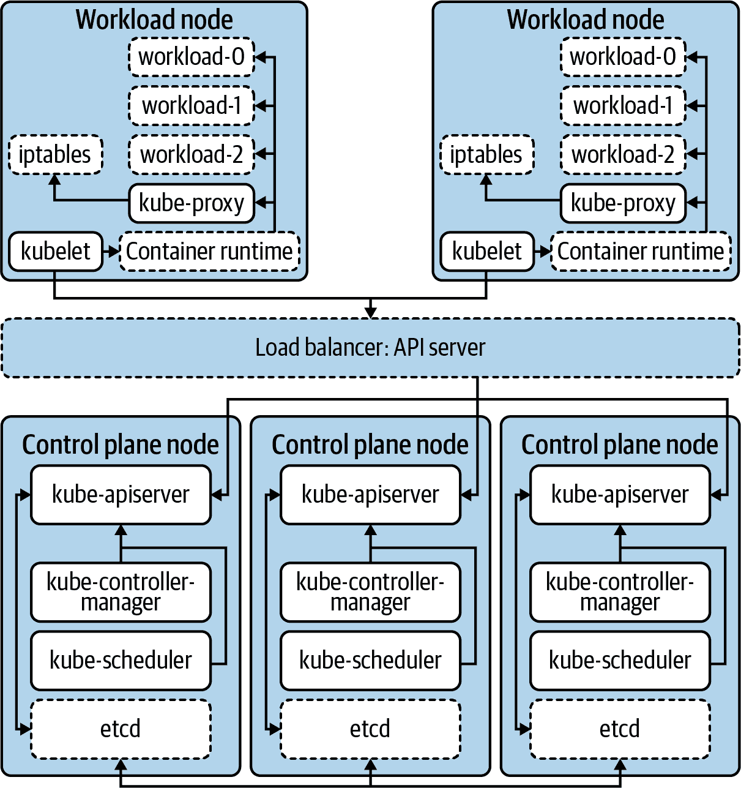
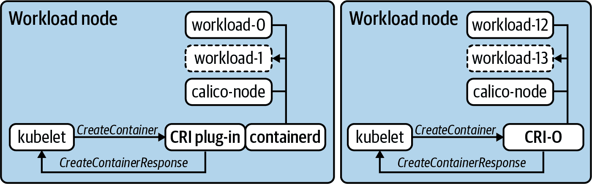
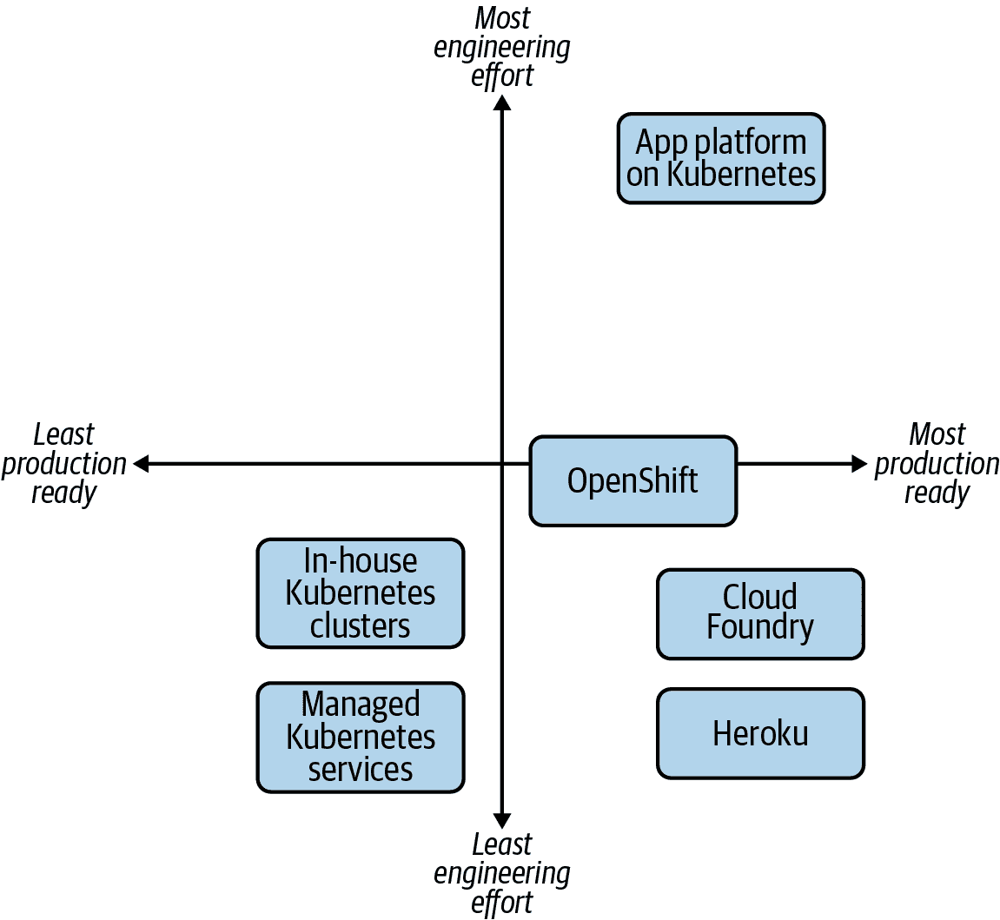
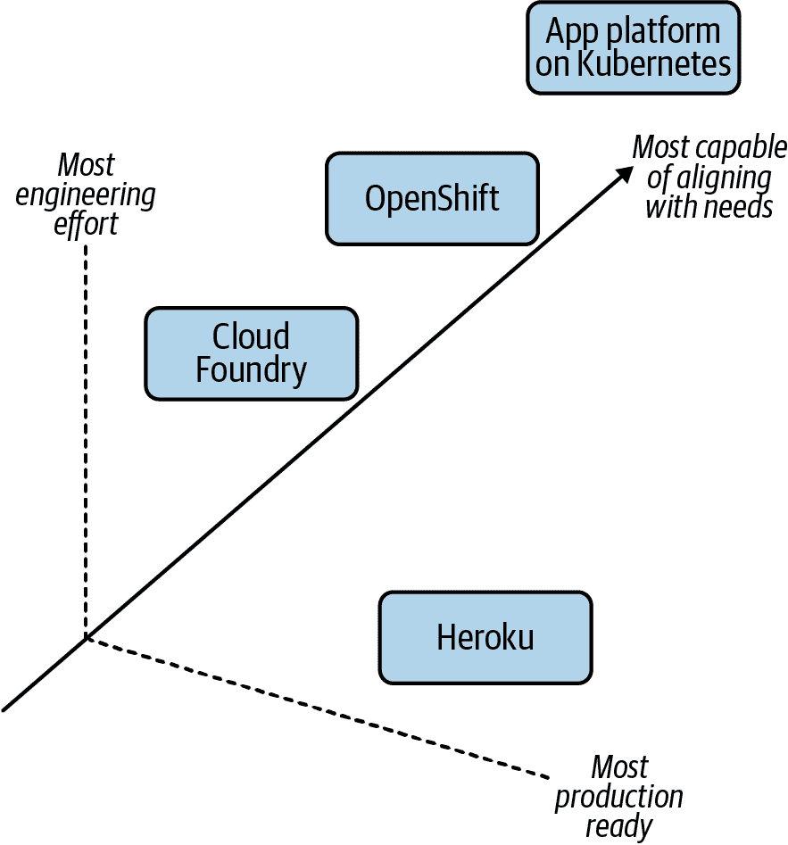
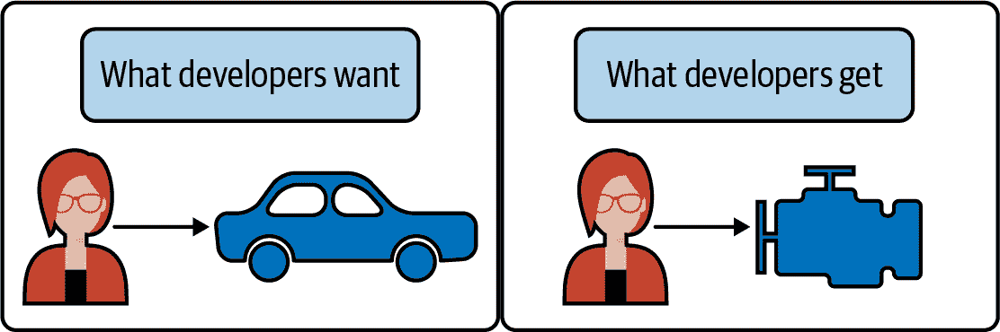
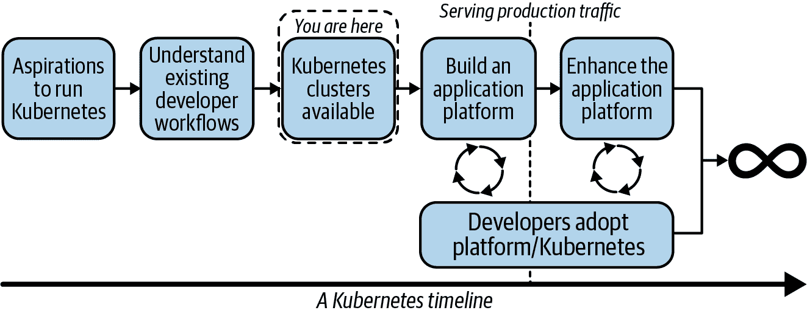
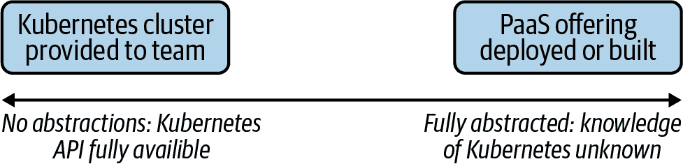
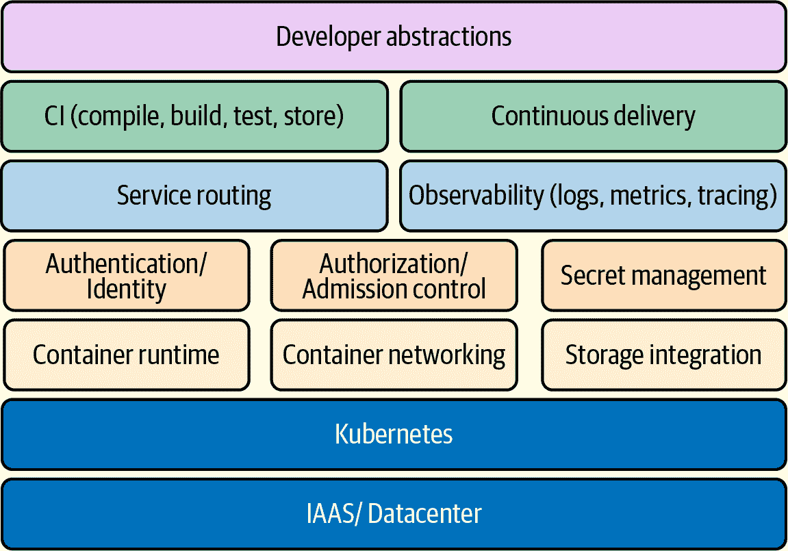

# 第一章：通向生产的路径

多年来，全球各组织广泛采用了 Kubernetes。它的流行无疑是由容器化工作负载和微服务的广泛使用加速的。随着运维、基础设施和开发团队达到需要构建、运行和支持这些工作负载的关键时刻，许多团队将 Kubernetes 视为解决方案的一部分。相对于其他大规模开源项目如 Linux，Kubernetes 是一个相对年轻的项目。根据我们与许多客户的经验，对于大多数 Kubernetes 用户来说，现在仍处于早期阶段。虽然许多组织已经在使用 Kubernetes，但达到生产环境的组织远远不多，更别提在大规模上运行的了。在本章中，我们将为许多工程团队在 Kubernetes 上的旅程奠定基础。具体来说，我们将探讨在定义通向生产路径时考虑的一些关键问题。

# 定义 Kubernetes

Kubernetes 是一个平台吗？基础设施？一个应用程序？有许多思想领袖可以为你提供他们对 Kubernetes 是什么的精确定义。而不是增加这些意见的堆砌，让我们把精力集中在澄清 Kubernetes 解决的问题上。一旦定义了这些问题，我们将探讨如何在这个特性集的基础上构建，以推动我们朝向生产结果的方向发展。"生产 Kubernetes" 的理想状态意味着我们已经达到了工作负载成功提供生产流量的状态。

*Kubernetes* 这个名称可能有点像一个总称。在 GitHub 上快速浏览可以发现，`kubernetes` 组织（截至本文撰写时）包含了 69 个仓库。然后还有 `kubernetes-sigs`，大约有 107 个项目。更别提数百个云原生计算基金会（CNCF）在这个领域中运作的项目！在本书中，*Kubernetes* 将专指核心项目。那么，核心是什么？核心项目包含在 [kubernetes/kubernetes](https://github.com/kubernetes/kubernetes) 仓库中。这是大多数 Kubernetes 集群中的关键组件的所在地。当运行包含这些组件的集群时，我们可以期待以下功能：

+   在许多主机上调度工作负载

+   提供一个声明式、可扩展的 API，用于与系统进行交互

+   提供一个 CLI，`kubectl`，供人类与 API 服务器进行交互。

+   从当前对象状态到期望状态的协调

+   提供基本的服务抽象以帮助路由请求到工作负载和从工作负载中请求

+   提供多个接口以支持可插拔的网络、存储等

这些功能创建了项目本身声称的 *生产级容器编排器*。简单来说，Kubernetes 提供了一种方式，让我们在多个主机上运行和调度容器化工作负载。在深入研究过程中，请记住这个主要能力。随着时间的推移，我们希望证明这种能力虽然基础，但只是我们走向生产的一部分旅程。

## 核心组件

提供我们讨论过的功能的组件是什么？正如我们所提到的，核心组件驻留在 `kubernetes/kubernetes` 代码库中。我们中的许多人以不同的方式使用这些组件。例如，运行托管服务（如 Google Kubernetes Engine（GKE））的人可能会在主机上找到每个组件。其他人可能会从仓库下载二进制文件或从供应商那里获取签名版本。无论如何，任何人都可以从 `kubernetes/kubernetes` 代码库下载 Kubernetes 发行版。下载并解压发行版后，可以使用 `cluster/get-kube-binaries.sh` 命令检索二进制文件。这将自动检测您的目标架构并下载服务器和客户端组件。让我们在以下代码中查看这一点，然后探索关键组件：

```
$ ./cluster/get-kube-binaries.sh

Kubernetes release: v1.18.6
Server: linux/amd64  (to override, set KUBERNETES_SERVER_ARCH)
Client: linux/amd64  (autodetected)

Will download kubernetes-server-linux-amd64.tar.gz from https://dl.k8s.io/v1.18.6
Will download and extract kubernetes-client-linux-amd64.tar.gz
Is this ok? [Y]/n
```

在下载的服务器组件内，可能保存在 *server/kubernetes-server-${ARCH}.tar.gz* 中，您将找到组成 Kubernetes 集群的关键项目：

API 服务器

所有 Kubernetes 组件和用户的主要交互点。在这里，我们获取、添加、删除和变更对象。API 服务器将状态委托给后端，最常见的是 etcd。

kubelet

与 API 服务器通信的主机代理，用于报告节点的状态并理解应该在其上调度什么工作负载。它与主机的容器运行时（如 Docker）通信，以确保为节点调度的工作负载已启动并保持健康。

控制器管理器

一组控制器，打包在单个二进制文件中，负责协调 Kubernetes 中许多核心对象的调和。当声明所需状态时，例如 Deployment 中的三个副本，控制器会处理创建新 Pod 来满足此状态。

调度器

根据其认为最佳节点的位置确定工作负载应在何处运行。它使用过滤和评分来做出这些决策。

Kube Proxy

实现 Kubernetes 服务，提供可以路由到后端 Pod 的虚拟 IP。这是通过主机上的数据包过滤机制（如 `iptables` 或 `ipvs`）实现的。

虽然不是详尽的列表，但这些是构成我们讨论的核心功能的主要组件。从架构上看，图 1-1 展示了这些组件如何协同工作。

###### 注意

Kubernetes 架构有许多变体。例如，许多集群将 kube-apiserver、kube-scheduler 和 kube-controller-manager 作为容器运行。这意味着控制平面也可以运行容器运行时、kubelet 和 kube-proxy。这类部署考虑将在下一章中详细介绍。



###### 图 1-1\. 组成 Kubernetes 集群的主要组件。虚线边框表示非核心 Kubernetes 组件。

## 超越编排——扩展功能

有些地方 Kubernetes 做的不仅仅是工作负载编排。正如提到的，kube-proxy 组件编程主机以为工作负载提供虚拟 IP（VIP）体验。因此，内部 IP 地址被建立并路由到一个或多个底层的 Pod。这个问题显然超出了运行和调度容器化工作负载的范围。从理论上讲，而不是将其作为核心 Kubernetes 的一部分实现，该项目可以定义一个服务 API，并要求插件来实现服务抽象。这种方法要求用户在生态系统中选择各种插件。

许多 Kubernetes API，如 Ingress 和 NetworkPolicy，都采用了这种模型。例如，在 Kubernetes 集群中创建一个 Ingress 对象并不保证会采取行动。换句话说，虽然 API 存在，但它不是核心功能。团队必须考虑他们希望插入的技术来实现此 API。对于 Ingress，许多人使用像 [ingress-nginx](https://kubernetes.github.io/ingress-nginx) 这样的控制器，在集群中运行。它通过读取 Ingress 对象并为指向 Pod 的 NGINX 实例创建 NGINX 配置来实现 API。然而，`ingress-nginx` 只是众多选项之一。[Project Contour](https://projectcontour.io) 实现了相同的 Ingress API，但它使用 envoy 这个代理来执行。由于这种可插拔模型，团队有多种选择。

## Kubernetes 接口

在扩展功能的思想上，我们现在应该探讨接口。Kubernetes 接口使我们能够定制和构建核心功能。我们认为接口是如何与某物交互的定义或契约。在软件开发中，这类似于定义类或结构体可以实现的功能。在像 Kubernetes 这样的系统中，我们部署满足这些接口的插件，提供诸如网络功能等功能。

这种接口/插件关系的一个具体示例是 [容器运行时接口](https://github.com/kubernetes/cri-api) (CRI)。在 Kubernetes 初始阶段，只支持单一容器运行时 Docker。虽然今天许多集群仍然使用 Docker，但越来越多的人开始关注使用诸如 [containerd](https://containerd.io) 或 [CRI-O](https://github.com/cri-o/cri-o) 等替代方案。图 1-2 显示了这两个容器运行时之间的关系。



###### 图 1-2\. 两个工作负载节点运行两种不同的容器运行时。kubelet 发送在 CRI 中定义的命令，如 `CreateContainer`，并期望运行时满足请求并做出响应。

在许多接口中，例如 `CreateContainerRequest` 或 `PortForwardRequest`，命令都作为远程过程调用 (RPC) 发出。对于 CRI，通信是通过 GRPC 进行的，kubelet 期望得到诸如 `CreateContainerResponse` 和 `PortForwardResponse` 的响应。在 图 1-2 中，你还会注意到满足 CRI 的两种不同模型。CRI-O 是从头开始作为 CRI 的实现构建的。因此，kubelet 直接向其发出这些命令。containerd 支持一个插件，作为 kubelet 和其自身接口之间的桥梁。无论具体的架构如何，关键在于使容器运行时执行，而不需要 kubelet 对每种可能的运行时都具有操作知识。这一概念是我们在架构、构建和部署 Kubernetes 集群时如何使用接口的强大之处。

随着时间的推移，我们甚至看到一些功能从核心项目中移除，转而采用插件模型。这些功能历史上存在于“in-tree”内，即在`kubernetes/kubernetes`的代码库中。一个例子是[云提供商集成](https://github.com/kubernetes/cloud-provider)（CPIs）。大多数 CPIs 传统上被整合到组件中，如 kube-controller-manager 和 kubelet。这些集成通常处理诸如供应负载均衡器或公开云提供商元数据等问题。有时，在创建[容器存储接口（CSI）](https://kubernetes-csi.github.io/docs/introduction.html)之前，这些提供商提供块存储并使其对运行在 Kubernetes 中的工作负载可用。这么多功能都驻留在 Kubernetes 中，更不用说它需要为每个可能的提供商重新实现！作为更好的解决方案，支持被移至其自己的接口模型，例如[kubernetes/cloud-provider](https://github.com/kubernetes/cloud-provider)，可以由多个项目或供应商实现。除了在 Kubernetes 代码库中减少蔓延外，这还使得 CPI 功能能够在核心 Kubernetes 集群之外管理。这包括常见的流程，如升级或修补漏洞。

今天，有几个接口使得在 Kubernetes 中进行定制化和附加功能成为可能。以下是一个高层次列表，我们将在本书的各章节中详细展开讨论：

+   容器网络接口（CNI）使网络提供商能够定义从 IPAM 到实际数据包路由的操作方式。

+   容器存储接口（CSI）使得存储提供商能够满足集群内工作负载的请求。通常用于像 ceph、vSAN 和 EBS 这样的技术。

+   容器运行时接口（CRI）支持各种运行时，常见的包括 Docker、containerd 和 CRI-O。它还促进了非传统运行时的增多，例如利用 KVM 提供最小化虚拟机的 firecracker。

+   服务网格接口（SMI）是最新一批涉及 Kubernetes 生态系统的接口之一。它希望在定义流量策略、遥测和管理等方面推动一致性。

+   云提供商接口（CPI）使 VMware、AWS、Azure 等提供商能够为其云服务与 Kubernetes 集群编写集成点。

+   开放容器倡议运行时规范（OCI）标准化了镜像格式，确保从一个工具构建的容器镜像在符合规范时可以在任何符合 OCI 的容器运行时中运行。虽然与 Kubernetes 没有直接关联，但它在推动可插拔容器运行时（CRI）的愿望方面提供了辅助。

## Kubernetes 概述

现在我们已经聚焦于 Kubernetes 的范围。它是一个*容器编排器*，还带有一些额外的功能。它还可以通过利用插件到接口来进行扩展和定制。对于许多寻求优雅运行其应用程序手段的组织来说，Kubernetes 可能是基础性的。然而，请让我们稍作停顿。如果我们将用于在您的组织中运行应用程序的当前系统替换为 Kubernetes，那就足够了吗？对于我们许多人来说，当前“应用平台”组成的部件和机制要复杂得多。

历史上，我们看到很多组织在持有“Kubernetes”战略的观点时或者他们认为 Kubernetes 将是推动他们如何构建和运行软件的充分手段时，经历了很多痛苦。Kubernetes 是一种技术，是一种很棒的技术，但它真的不应该成为您在现代基础设施、平台和/或软件领域所追寻的重点。如果这显而易见，我们深感抱歉，但是您会惊讶地发现，有多少高管或更高级别的架构师认为 Kubernetes 本身就是问题的答案，而实际上他们的问题围绕应用交付、软件开发或组织/人员问题。Kubernetes 最好被视为您拼图的一部分，它使您能够为应用程序提供平台。我们一直在围绕应用平台的这个概念打转，接下来我们将深入探讨。

# 定义应用平台

在我们的生产路径中，关键是考虑应用平台的概念。我们定义应用平台为运行工作负载的可行场所。就像本书中的大多数定义一样，如何满足这一点将因组织而异。目标结果将对业务的不同部分产生广泛和有吸引力的影响，例如，开发者的满意度、操作成本的降低以及软件交付中更快的反馈循环等。应用平台通常是我们发现自己处于应用程序和基础设施交集的地方。开发者体验（devx）等问题通常是这一领域的关键要素之一。

应用平台有各种各样的形式和大小。一些主要是抽象的基础问题，如 IaaS（例如 AWS）或编排器（例如 Kubernetes）。Heroku 是这种模型的一个很好的例子。使用 Heroku，你可以轻松地将使用 Java、PHP 或 Go 等语言编写的项目部署到生产环境中，只需一个命令即可。除了您的应用程序之外，还运行着许多平台服务，否则您需要自己操作。这些服务包括指标收集、数据服务和持续交付（CD）。它还为您提供了运行高可用工作负载的基本组件，可以轻松扩展。Heroku 是否使用 Kubernetes？它是否在自己的数据中心运行，或者在 AWS 之上运行？这些细节对于 Heroku 用户来说并不重要。重要的是将这些问题委托给一个提供商或平台，使开发人员能够更多地专注于解决业务问题。这种方法并不局限于云服务。RedHat 的 OpenShift 采用了类似的模型，其中 Kubernetes 更多是一种实现细节，开发人员和平台运营商与其上的一组抽象交互。

为什么不在这里停下？如果像 Cloud Foundry、OpenShift 和 Heroku 这样的平台已经为我们解决了这些问题，那为什么还要费心使用 Kubernetes？许多预构建的应用平台的一个重要权衡是需要遵循它们对世界的看法。将对底层系统的所有权委托给其他人，会显著减轻你的运维负担。同时，如果平台处理诸如服务发现或秘密管理等问题的方式不符合你的组织需求，你可能没有足够的控制权来解决这些问题。此外，还存在供应商或观点锁定的概念。随着抽象的出现，关于应用程序应如何架构、打包和部署的观点也会随之而来。这意味着将工作负载迁移到另一个系统可能并不容易。例如，将工作负载从 Google Kubernetes Engine（GKE）移动到 Amazon Elastic Kubernetes Engine（EKS）比从 EKS 移动到 Cloud Foundry 要容易得多。

## 方法的光谱

现在清楚地看到，建立成功的应用平台有几种方法。为了演示起见，让我们做一些大胆的假设，并评估不同方法之间的理论权衡。对于我们合作的平均公司，比如中大型企业，图 1-3 展示了对方法的任意评估。

在左下方的四分之一中，我们看到部署 Kubernetes 集群本身，涉及的工程工作相对较少，特别是当像 EKS 这样的托管服务为您处理控制平面时。这些在生产就绪性方面较低，因为大多数组织会发现，在 Kubernetes 之上还需要做更多工作。但是，也有使用情况，比如团队为其工作负载使用专用集群，可能仅仅使用 Kubernetes 就足够了。



###### 图 1-3\. 提供应用平台给开发者的多种选择。

在右下角，我们有更加成熟的平台，这些平台提供了开箱即用的端到端开发者体验。Cloud Foundry 就是解决许多应用平台关注点的一个很好的例子。在 Cloud Foundry 中运行软件更多是确保软件符合其观点。另一方面，OpenShift 对于大多数人来说比仅仅 Kubernetes 更加适合生产环境，它有更多的决策点和设置考虑。这种灵活性是一个好处还是一个麻烦？这是您需要考虑的一个关键问题。

最后，在右上角，我们有在 Kubernetes 之上构建应用平台。相对于其他选项，至少从平台角度来看，这无疑需要最大的工程投入。然而，利用 Kubernetes 的可扩展性意味着你可以创建与开发者、基础设施和业务需求对齐的东西。

## 对齐您的组织需求

图表 Figure 1-3 中缺少的是第三维度，即展示方法与您需求对齐程度的 z 轴。让我们考虑另一个视觉表现。 Figure 1-4 描绘了考虑平台与组织需求对齐时可能的情况。



###### 图 1-4\. 这些选项与您组织需求对齐的增加复杂性，即 z 轴。

在平台的需求、特性和行为方面，建设平台几乎总是最为一致的选择。或者至少是最具备一致性的选择。这是因为你可以构建任何东西！如果你想在 Kubernetes 上内部重新实现 Heroku，并对其能力进行轻微调整，从技术上讲是可行的。然而，成本与回报应该与其他轴（x 和 y）权衡。让我们通过考虑下一代平台的以下需求来使这个练习更具体：

+   法规要求您主要在本地运行

+   需要支持裸金属设备以及您的 vSphere 启用数据中心

+   希望支持开发者将应用程序打包成容器的不断增长需求

+   需要构建自助式 API 机制，摆脱基于“票证”的基础设施供应

+   希望确保您构建的 API 不依赖于特定供应商，并且不会因为您过去迁移这类系统而花费了数百万。

+   开放以支持多种堆栈产品的企业支持，但不愿承诺对整个堆栈按节点、核心或应用实例授权的模型。

我们必须了解我们的工程成熟度、建立和赋权团队的愿望以及可用资源，以确定构建应用平台是否是一个明智的举措。

## 总结应用平台

确实，什么构成应用平台仍然相当模糊。我们专注于一系列我们认为可以为团队带来超越工作负载编排的体验的平台。我们还表明，Kubernetes 可以定制和扩展以达到类似的结果。通过将我们的思维推进到“我如何获得一个 Kubernetes”的问题之外，而是关注“当前的开发者工作流程、痛点和需求”，平台和基础设施团队将更成功地构建他们的产品。专注于后者，我们认为，您更有可能规划出正确的上线路径并实现不平凡的采用。归根结底，我们希望满足基础设施、安全性和开发者的要求，以确保我们的客户——通常是开发者——获得符合其需求的解决方案。通常情况下，我们不希望简单地提供一个“强大”的引擎，让每个开发者都必须在其上构建自己的平台，正如在图 1-5 中开玩笑地描述的那样。



###### 图 1-5\. 当开发者期望一个端到端的体验（例如一辆可驾驶的汽车）时，不要期望一个仅有引擎而没有车架、轮子等的东西足够。

# 在 Kubernetes 上构建应用平台

现在我们已经确定了 Kubernetes 在我们通往生产路径中的一个部分。因此，人们会合理地问：“那么 Kubernetes 只是少了一些东西吗？” Unix 哲学中“让每个程序做好一件事”这一原则对 Kubernetes 项目是一个令人向往的追求。我们相信它最好的特性很大程度上是它所没有的！特别是在被那些试图为你解决全球问题的一刀切平台所伤害后。Kubernetes 在成为一个出色的编排器的同时，明确了它可以如何在其上构建的清晰接口。这可以类比为家的基础。

一个良好的基础应该在结构上是稳固的，可以在其上建造，并为路由工具提供适当的接口。尽管重要，但仅有一个基础很少能成为我们的应用程序生活的宜居之地。通常情况下，我们需要在基础之上存在某种形式的家。在讨论像 Kubernetes 这样的基础之上的*构建*之前，让我们考虑一个像预装家具公寓一样的场景，如图 1-6 所示。


###### 图 1-6\. 一个可以立即入住的公寓。类似于 Heroku 等平台即服务选项。由 Jessica Appelbaum 插图。

此选项与我们的示例（如 Heroku）类似，无需额外工作即可居住。当然，我们可以在内部定制体验，但是许多问题已经为我们解决了。只要我们对租金的价格感到满意，并愿意遵循其中的不可协商意见，我们就可以在第一天就取得成功。

回到 Kubernetes，我们将其比作是一个基础，现在可以在其上构建一个适合居住的家，如图 1-7 所示。


###### 图 1-7\. 建造一座房子。类似于建立一个应用平台，其中 Kubernetes 是基础。Jessica Appelbaum 插图。

在规划、工程和维护的代价下，我们可以构建出色的平台来运行整个组织的工作负载。这意味着我们完全控制输出中的每个元素。房子可以且应该根据未来租户（我们的应用程序）的需求进行定制。现在让我们分解使这一切成为可能的各种层面和考虑因素。

## 从底层开始

首先，我们必须从底层开始，包括 Kubernetes 预期运行的技术。通常这是数据中心或云提供商，提供计算、存储和网络。一旦建立，Kubernetes 就可以在其上启动。几分钟内，您可以在底层基础设施之上拥有运行的集群。有几种引导 Kubernetes 的方法，我们将在第二章中详细介绍它们。

从 Kubernetes 集群存在的角度来看，我们接下来需要查看一个概念流程，以确定我们应该在其上构建什么。关键的关节在图 1-8 中表示。



###### 图 1-8\. 我们的团队可能在使用 Kubernetes 进行生产路径时经历的流程。

从 Kubernetes 存在的角度来看，您可以期望迅速收到如下问题：

+   “如何确保工作负载之间的流量完全加密？”

+   “如何确保出口流量通过网关，保证一致的源 CIDR？”

+   “如何为应用程序提供自助跟踪和仪表盘？”

+   “如何让开发人员在不成为 Kubernetes 专家的情况下上船？”

这个列表可能是无穷无尽的。通常我们需要确定哪些需求在平台级别解决，哪些在应用级别解决。关键在于深入了解现有工作流程，以确保我们构建的东西符合当前的期望。如果我们无法满足这一功能集，这将对开发团队产生什么影响？接下来我们可以开始在 Kubernetes 之上构建一个平台。在这样做时，关键是我们要与愿意尽早上手并理解体验的开发团队保持配合，以便基于快速反馈做出明智的决策。在达到生产环境后，这种流程不应该停止。平台团队不应该期望交付的东西是开发者将会使用几十年的静态环境。为了取得成功，我们必须始终与我们的开发团队保持一致，了解存在哪些问题或潜在缺失功能可能会增加开发速度。开始考虑我们应该期望开发人员与 Kubernetes 互动的程度是一个很好的起点。这就是我们应该期望多大程度上，或者多小程度上抽象的概念。

## 抽象光谱

在过去，我们听过类似“如果你的应用开发人员知道他们在使用 Kubernetes，那么你就失败了！”这样的装腔作势。特别是在构建产品或服务时，底层编排技术对最终用户来说可能无关紧要。也许你正在构建一个支持多种数据库技术的数据库管理系统（DBMS）。无论数据库的分片还是实例是通过 Kubernetes、Bosh 还是 Mesos 运行，对你的开发人员来说可能并不重要！然而，将这种哲学从推特上整体引入到你团队的成功标准中是一件危险的事情。当我们在 Kubernetes 上叠加组件并构建平台服务以更好地服务我们的客户时，我们将面临许多决策点，以确定适当的抽象看起来如何。图 1-9 提供了这一光谱的可视化。



###### 图 1-9\. 光谱的各种端点。从为每个团队提供自己的 Kubernetes 集群开始，到完全将 Kubernetes 从用户抽象出来，通过平台即服务（PaaS）提供。

这可能是让平台团队夜不能寐的问题。提供抽象化确实有很多优点。像 Cloud Foundry 这样的项目提供了一个完全成熟的开发者体验——例如，在一个 `cf push` 的上下文中，我们可以将一个应用程序构建、部署，并让其提供生产流量服务。以此目标和体验作为主要关注点，随着 Cloud Foundry 在 Kubernetes 上的进一步支持，我们预计会看到这种过渡更多地成为一个实施细节，而不是功能集的变化。我们还看到的另一个模式是希望在公司内提供不仅仅是 Kubernetes 的选择，但不让开发人员明确选择技术的愿望。例如，一些公司既有 Mesos 的足迹，又有 Kubernetes 的足迹。然后他们构建了一个抽象化，使得工作负载的落地选择变得透明，而不将这个责任放在应用程序开发者身上。这也防止了技术锁定的发生。这种方法的一个折衷是在两个操作方式不同的系统上构建抽象化需要大量的工程努力和成熟度。此外，虽然开发人员从 Kubernetes 或 Mesos 交互的负担中得到了缓解，但他们需要理解如何使用一个抽象化的公司特定系统。在开源的现代时代，来自整个堆栈的开发人员对于不在组织之间转化的系统学习并不感兴趣。最后，我们看到的一个陷阱是对抽象化的痴迷导致无法暴露 Kubernetes 的关键特性。随着时间的推移，这可能会变成一个试图跟上项目并且潜在地使您的抽象化变得和它所抽象的系统一样复杂的猫鼠游戏。

另一方面，希望为开发团队提供自助集群的平台组织也是一个很好的模式。这确实是一个很好的模式。这将把 Kubernetes 成熟性的责任放在开发团队身上。他们是否了解 Deployments、ReplicaSets、Pods、Services 和 Ingress APIs 的工作原理？他们是否了解如何设置 millicpus 以及资源过量提交的工作原理？他们是否知道如何确保配置有多个副本的工作负载始终安排在不同的节点上？如果是的话，这是一个完美的机会，可以避免在应用平台上过度设计，而是让应用团队从 Kubernetes 层面开始处理。

开发团队拥有自己集群的这种开发模式相对较少见。即使有一支具备 Kubernetes 背景的团队，他们也不太可能希望抽出时间来确定如何管理其 Kubernetes 集群的生命周期，尤其是在升级时。Kubernetes 提供了很多强大的功能，但对于许多开发团队来说，期望他们成为 Kubernetes 专家并在发布软件的同时处理这些事务是不现实的。正如你将在接下来的章节中发现的那样，抽象化并不是一个二进制的决定。在许多时候，我们可以根据具体情况做出明智的抉择，确定在哪些地方使用抽象化是有意义的。我们将确定在哪些地方我们可以为开发人员提供适当的灵活性，同时简化他们完成工作的能力。

## 确定平台服务

在构建 Kubernetes 之上，关键的决定是相对于在应用程序级别解决的功能应该内建到平台中。通常情况下，这是一个需要按情况评估的问题。例如，假设每个 Java 微服务都实现了一个库，用于在服务之间实现互相认证的互斥 TLS（mTLS），以及在网络上传输数据的加密。作为平台团队，我们需要深入了解这种用法，以确定我们是否应该在平台级别提供或实施这种功能。许多团队希望通过在集群中实施一种称为服务网格的技术来解决这个问题。通过权衡利弊，我们可以得出以下考虑。

引入服务网格的优点：

+   Java 应用程序不再需要捆绑库来实现 mTLS。

+   非 Java 应用程序可以参与相同的 mTLS/加密系统。

+   应用团队减少了解决问题的复杂性。

引入服务网格的缺点：

+   运行服务网格并非小事。这是另一个具有操作复杂性的分布式系统。

+   服务网格通常引入远远超出身份验证和加密的功能。

+   网格的身份验证 API 可能与现有应用程序使用的后端系统不同步。

权衡这些优缺点，我们可以得出结论，决定在平台级别解决这个问题是否值得努力。关键在于我们不需要也不应该在新平台中解决每一个应用程序的问题。这是在你阅读本书中的许多章节时需要考虑的另一个平衡。我们将分享几个建议、最佳实践和指导，但像任何事情一样，你应该根据业务需求的优先级评估每一个。

## 构建基础

让我们通过明确地识别你在构建平台时将拥有的关键构建块来结束这一章。这包括从基础组件到可选平台服务的一切。

图 1-10 中的组件对不同的受众具有不同的重要性。



###### 图 1-10。建立应用平台所涉及的许多关键构建块。

一些组件，如容器网络和容器运行时，对于每个集群都是必需的，考虑到一个不能运行工作负载或允许它们通信的 Kubernetes 集群将不会很成功。您可能会发现一些组件在是否应该实现的问题上存在差异。例如，如果应用程序已经从外部秘密管理解决方案获取其密钥，则可能不打算实现秘密管理作为平台服务。

一些领域，如安全性，明显缺失于图 1-10。这是因为安全性不是一个特性，而是从 IAAS 层以上的所有内容如何实现的结果。让我们在高层次上探讨这些关键领域，理解到我们将在本书中更深入地探讨它们。

### IAAS/数据中心和 Kubernetes

IAAS/数据中心和 Kubernetes 构成了我们在本章中多次提到的基础层。我们并不是要贬低这一层，因为它的稳定性将直接影响我们平台的稳定性。然而，在现代环境中，我们花费的时间远少于确定支持 Kubernetes 的架构的机架架构，而是更多地花费在选择各种部署选项和拓扑结构之间。基本上，我们需要评估如何提供和使 Kubernetes 集群可用。

### 容器运行时

容器运行时将在每个主机上管理我们的工作负载的生命周期。这通常使用可以管理容器的技术来实现，例如 CRI-O、containerd 和 Docker。通过容器运行时接口（CRI），我们能够选择这些不同的实现方式。除了这些常见的示例外，还有支持特定要求的专用运行时，例如希望在微型虚拟机中运行工作负载的需求。

### 容器网络

我们选择的容器网络通常涉及工作负载的 IP 地址管理（IPAM）和路由协议，以促进通信。常见的技术选择包括 Calico 或 Cilium，这要归功于容器网络接口（CNI）。通过将容器网络技术插入集群，kubelet 可以请求工作负载的 IP 地址。一些插件甚至进一步在 Pod 网络的顶部实现服务抽象。

### 存储集成

存储集成涵盖了当主机磁盘存储无法满足需求时的应对措施。在现代 Kubernetes 中，越来越多的组织将有状态的工作负载部署到其集群中。这些工作负载需要一定程度的保证，在应用程序故障或重新调度事件中状态将是弹性的。存储可以由常见的系统提供，如 vSAN、EBS、Ceph 等等。通过容器存储接口（CSI），我们可以选择各种后端以满足应用程序请求的存储需求。类似于 CNI 和 CRI，我们能够在集群中部署插件，理解如何满足应用程序请求的存储需求。

### 服务路由

服务路由是我们在 Kubernetes 中运行的工作负载之间流量的促进。Kubernetes 提供了一个 Service API，但这通常只是支持更丰富的路由能力的第一步。服务路由建立在容器网络基础上，并创建了更高级别的功能，如第 7 层路由、流量模式等。许多时候，这些功能是使用称为 Ingress 控制器的技术实现的。在服务路由的深层次上，有各种服务网格技术。这种技术具备完整的功能，例如服务到服务的 mTLS、可观察性以及支持应用程序机制，如断路器。

### 机密管理

机密管理涵盖了工作负载所需的敏感数据的管理和分发。Kubernetes 提供了一个 Secrets API，可以与敏感数据交互。然而，默认情况下，许多集群的机密管理和加密能力不足以满足多个企业的需求。这主要是关于深度防御的讨论。在简单级别上，我们可以确保数据在存储之前进行加密（静态加密）。在更高级别上，我们可以与各种专注于机密管理的技术集成，如 Vault 或 Cyberark。

### 身份验证

身份验证涵盖了对人员和工作负载的身份验证。集群管理员最常见的初始要求之一是如何对用户进行身份验证，例如 LDAP 或云提供商的 IAM 系统。除了人类，工作负载可能希望识别自己以支持零信任网络模型，其中工作负载的冒充要困难得多。这可以通过集成身份提供者并使用诸如 mTLS 之类的机制来实现，以验证工作负载的身份。

### 授权/准入控制

授权是在我们可以验证人类或工作负载的身份之后的下一步。当用户或工作负载与 API 服务器交互时，我们如何允许或拒绝他们访问资源？Kubernetes 提供了一种基于资源/动作级别控制的 RBAC 功能，但是在我们组织内部特定于授权的自定义逻辑又如何处理呢？准入控制是我们可以进一步推进的地方，通过构建验证逻辑，这可以简单到查看静态规则列表，也可以动态调用其他系统来确定正确的授权响应。

### 软件供应链

软件供应链涵盖了将软件从源代码到运行时的整个生命周期。这涉及到持续集成（CI）和持续交付（CD）周围的常见问题。许多时候，开发人员主要与他们在这些系统中建立的流水线进行交互。确保 CI/CD 系统与 Kubernetes 良好集成可能对平台的成功至关重要。除了 CI/CD，还涉及到有关工件存储、从漏洞角度的安全性以及确保在集群中运行的镜像完整性的问题。

### Observability

Observability 是一个涵盖所有帮助我们理解集群中发生情况的术语。这包括系统和应用程序层面。通常，我们认为可观察性涵盖三个关键领域。这些领域是日志、指标和追踪。日志通常涉及将工作负载上的日志数据转发到目标后端系统。通过这个系统，我们可以聚合和分析日志，以便消化。指标涉及捕获某个时间点表示状态的数据。我们经常将这些数据聚合或抓取到某个系统进行分析。追踪由于需要理解组成我们应用程序堆栈的各个服务之间的交互而日益普及。当追踪数据被收集时，它可以被提取到一个聚合系统，通过某种上下文或关联 ID 显示请求或响应的生命周期。

### 开发者抽象化

开发者抽象化是我们为了使开发人员在我们的平台上成功而设置的工具和平台服务。正如前面讨论的，抽象化方法存在于一个光谱上。一些组织将选择使 Kubernetes 的使用对开发团队完全透明化。其他团队则选择暴露 Kubernetes 提供的许多强大控制选项，并为每个开发人员提供显著的灵活性。解决方案还倾向于关注开发者入职体验，确保他们能够获得访问和安全控制他们可以在平台上利用的环境。

# 总结

在本章中，我们探讨了涵盖 Kubernetes、应用平台甚至在 Kubernetes 上构建应用平台的各种想法。希望这让你开始思考，关于如何更好地理解如何在这个强大的工作负载编排器上构建应用的各种领域。在本书的剩余部分中，我们将深入探讨这些关键领域，并提供见解、轶事和建议，进一步拓展你在平台构建方面的视角。让我们开始这条通往生产之路吧！
