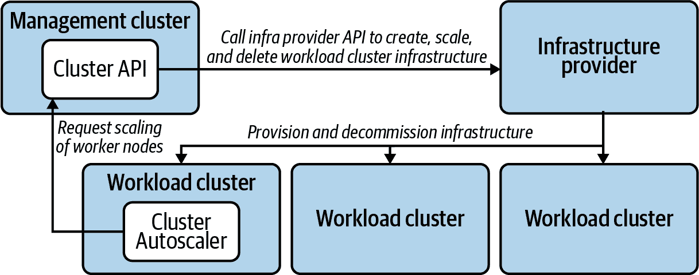
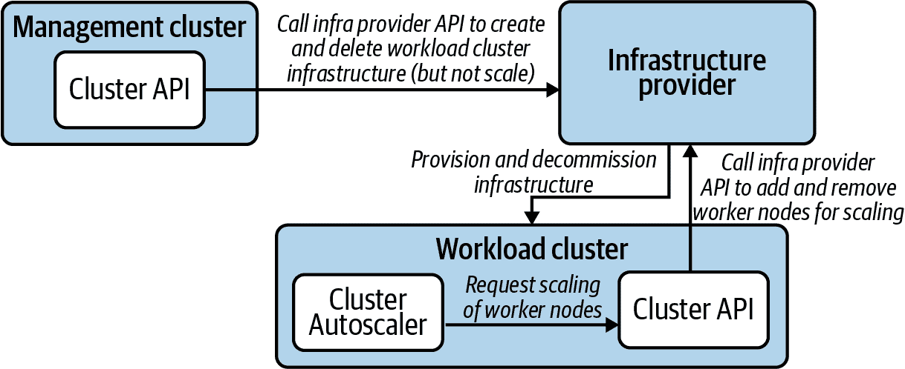
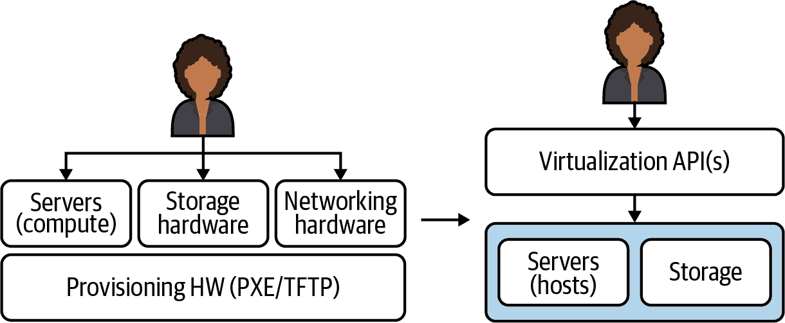
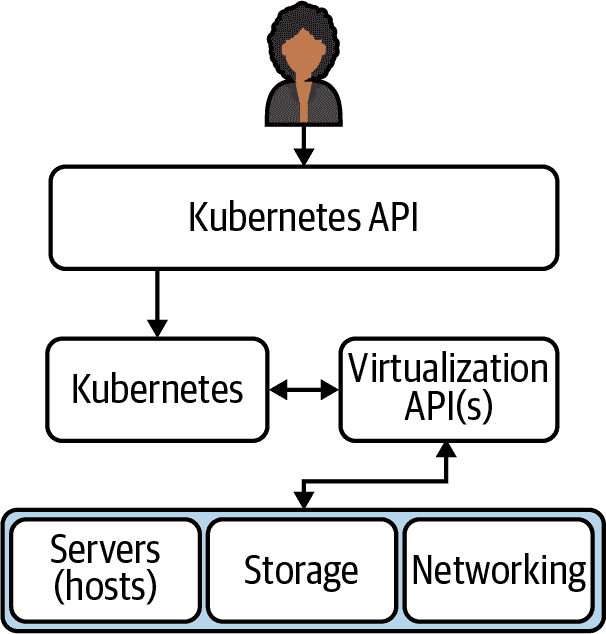
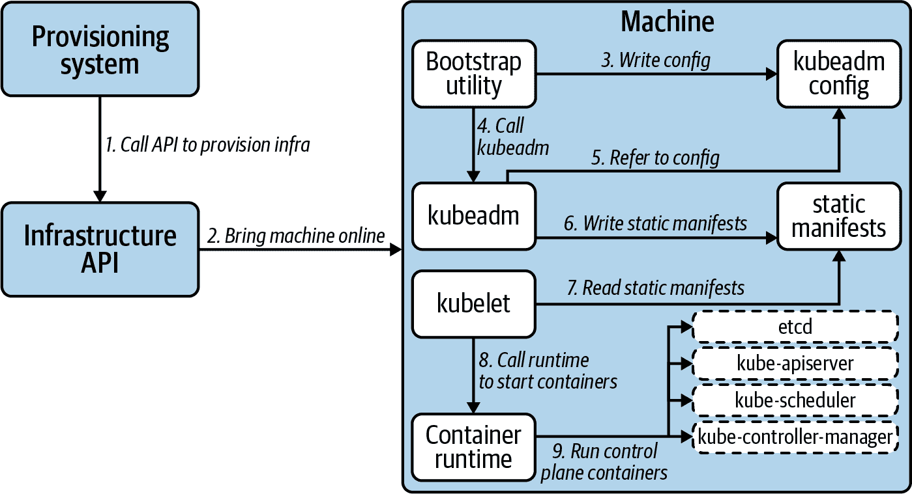
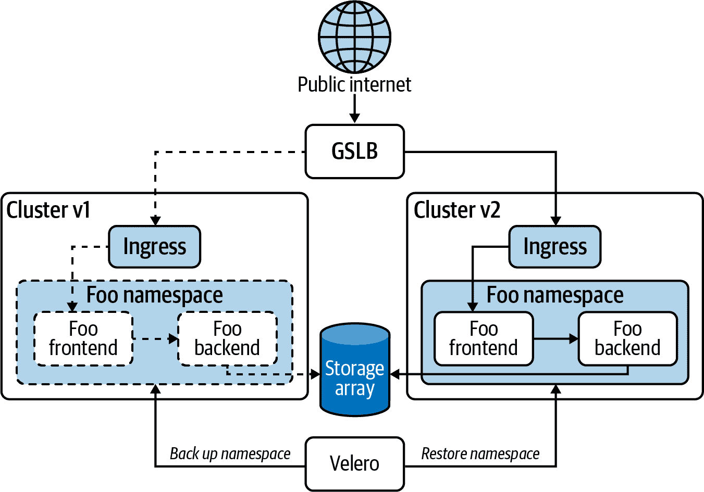
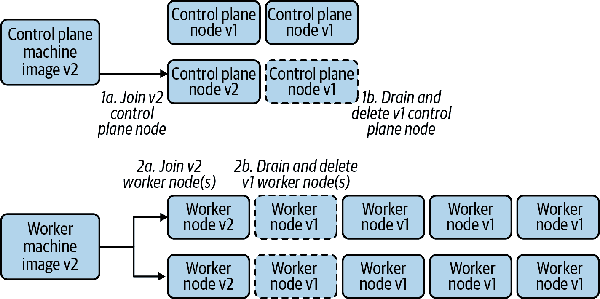

# 第二章：部署模型

在生产环境中使用 Kubernetes 的第一步显而易见：使 Kubernetes 存在。这包括安装系统以供应 Kubernetes 集群，并管理未来的升级。由于 Kubernetes 是一个分布式软件系统，部署 Kubernetes 主要归结为软件安装的过程。与大多数其他软件安装相比的重要区别在于，Kubernetes 与基础设施是内在联系的。因此，软件安装和安装它的基础设施需要同时解决。

在本章中，我们首先解决部署 Kubernetes 集群及应该如何充分利用托管服务和现有产品或项目的初步问题。对于那些大量利用现有服务、产品和项目的人来说，本章大部分内容可能不感兴趣，因为本章约 90% 的内容涵盖了如何处理定制自动化的方法。如果你正在评估用于部署 Kubernetes 的工具，本章仍然可能感兴趣，以便你可以思考可用的不同方法。对于那些处于少数需要为部署 Kubernetes 构建定制自动化的位置的人来说，我们将解决总体架构问题，包括对 etcd 的特殊考虑以及如何管理各种受管理集群。我们还将探讨管理各种软件安装的有用模式以及基础设施依赖项，并分解各种集群组件，并揭示它们如何相互配合。我们还将探讨管理你安装到基础 Kubernetes 集群的附加组件的方法，以及升级 Kubernetes 和构成你的应用平台的附加组件的策略。

# 托管服务与自主部署

在我们深入讨论 Kubernetes 的部署模型之前，我们应该先思考是否*需要*一个完整的 Kubernetes 部署模型的概念。云服务提供商提供的托管 Kubernetes 服务大多数情况下可以减轻部署的烦恼。你仍然需要开发可靠的、声明式的系统来供应这些托管的 Kubernetes 集群，但将大部分集群如何启动的细节抽象出来可能是有利的。

## 托管服务

使用托管 Kubernetes 服务的理由归结为节省工程努力。在正确管理 Kubernetes 的部署和生命周期中需要考虑相当大的技术设计和实施。记住，Kubernetes 只是你的应用平台的一个组成部分——容器编排器。

实质上，通过托管服务，您可以获得一个 Kubernetes 控制平面，随时可以连接工作节点。缓解了扩展、确保可用性和管理控制平面的责任。这些都是重大关注点。此外，如果您已经使用云服务提供商的现有服务，您将会占据先机。例如，如果您使用亚马逊网络服务（AWS）并已经使用 Fargate 进行无服务器计算，Identity and Access Management (IAM) 进行基于角色的访问控制，以及 CloudWatch 进行可观察性，您可以利用这些服务与其 Elastic Kubernetes Service (EKS)，解决应用平台中的多个问题。

这与使用托管数据库服务并无二致。如果您的核心问题是为您的业务需求提供服务的应用程序，并且该应用程序需要关系数据库，但是您无法为聘请专门的数据库管理员提供理由，那么向云服务提供商支付获取数据库的费用将会大大提升效率。您可以更快地启动和运行。托管服务提供商将代表您管理可用性，进行备份并执行升级。在许多情况下，这是一个明显的好处。但是，总是存在权衡。

## 自行部署

使用托管 Kubernetes 服务可以节省成本，但代价是失去灵活性和自由。其中一部分是厂商锁定的威胁。托管服务通常由云基础设施提供商提供。如果您大量投资于使用特定供应商的基础设施，那么您设计的系统和利用的服务很可能不会是供应商中立的。令人担忧的是，如果他们未来提高价格或者服务质量下降，您可能会发现自己陷入困境。您为处理那些您没有时间处理的问题支付的专家现在可能会对您的命运具有危险的影响力。

当然，您可以通过使用多个提供商的托管服务来进行多样化，但是它们之间在暴露 Kubernetes 功能的方式上可能存在差异，而且暴露的功能可能会成为一个尴尬的不一致性问题。

因此，您可能更喜欢自行部署 Kubernetes。Kubernetes 上有大量的旋钮和控制杆可供调整。这种可配置性使其既灵活又强大。如果您投资于理解和管理 Kubernetes 本身，应用平台世界将为您敞开大门。您将能够实现任何功能，满足任何需求。而且，您将能够在基础设施提供商之间无缝实现，无论是公共云提供商还是您自己的私有数据中心中的服务器。一旦考虑到不同基础设施的不一致性，平台中显露的 Kubernetes 功能将保持一致。使用您平台的开发人员将不会关心——甚至可能不知道——提供底层基础设施的是谁。

只需记住开发人员只关心平台的功能，而不关心底层基础设施或提供者是谁。如果你控制可用的功能，并且你提供的功能在各个基础设施提供者之间是一致的，你就有自由向开发人员提供卓越的体验。你将控制你使用的 Kubernetes 版本。你将访问控制平面组件的所有标志和功能。你将访问安装在底层机器上的软件以及写入磁盘的静态 Pod 清单。你将拥有一个强大而危险的工具，用于努力赢得开发人员的支持。但绝不能忽视你需要深入学习这个工具的责任。不这样做会使自己和他人受伤。

## 做出决定

当你开始旅程时，通向荣耀的道路很少是清晰的。如果你在选择托管 Kubernetes 服务或自行部署集群之间犹豫不决，你离 Kubernetes 旅程的开始比辉煌的最终结论更近。而选择托管服务还是自行部署的决定足够基础，它将对你的业务产生长期影响。因此，以下是一些指导原则，帮助这个过程。

如果你遇到以下情况，你应该倾向于使用托管服务：

+   对理解 Kubernetes 的想法听起来非常艰难

+   管理关键对你的业务成功至关重要的分布式软件系统听起来很危险

+   由供应商提供的功能限制带来的不便似乎可以应对

+   你相信你的托管服务供应商能够响应你的需求并成为良好的商业伙伴

如果你遇到以下情况，你应该倾向于自行部署 Kubernetes：

+   由供应商施加的限制让你感到不安

+   你对提供云计算基础设施的企业巨头缺乏信任或完全不信任

+   你对围绕 Kubernetes 构建平台的强大力量感到兴奋

+   你很乐意利用这个惊人的容器编排器来为开发人员提供愉快的体验

如果你决定使用托管服务，考虑跳过本章剩余大部分内容。 “附加组件” 和 “触发机制” 对你的使用场景仍然适用，但本章的其他部分则不适用。另一方面，如果你想管理自己的集群，请继续阅读！接下来我们将更深入地探讨应考虑的部署模型和工具。

# 自动化

如果您打算为您的 Kubernetes 集群设计部署模型，自动化的主题至关重要。任何部署模型都需要以此作为指导原则。消除人力劳动是降低成本和提高稳定性的关键。人力成本高昂。为工程师支付工资以执行例行琐碎操作，意味着资金无法用于创新。此外，人类是不可靠的。他们会犯错误。在一系列步骤中的一个错误可能会引入不稳定性，甚至阻止系统工作。通过软件系统自动化部署的前期工程投入将在未来节省大量的劳动和故障排除中带来回报。

如果您决定管理自己的集群生命周期，您必须制定适合您的策略。您可以选择使用预先构建的 Kubernetes 安装程序，或者从头开始开发自己的定制自动化。这个决定与选择托管服务与自行搭建之间有相似之处。一条路可以赋予您强大的权力、控制和灵活性，但代价是工程投入。

## 预构建安装程序

现在有无数个开源和企业支持的 Kubernetes 安装程序可供选择。举个例子：目前 [CNCF 的网站](https://www.cncf.io/certification/kcsp) 上列出了 180 个 Kubernetes 认证服务提供商。有些您需要付费，并有经验丰富的现场工程师帮助您启动以及支持团队在需要时提供支持。其他安装程序需要研究和实验才能理解和使用。通常情况下，那些您需要付费的安装程序可以一键完成从零到 Kubernetes 的过程。如果您符合提供的建议和可用的选择，并且您的预算能够承担支出，这种安装程序方法可能非常合适。在撰写本文时，使用预构建安装程序是我们在实际应用中最常见的方法。

## 自定义自动化

即使使用预构建安装程序，通常也需要一定量的定制自动化。这通常是与团队现有系统集成的形式。然而，在本节中，我们讨论的是开发自定义 Kubernetes 安装程序。

如果您刚开始使用 Kubernetes 或正在改变您的 Kubernetes 策略方向，自建的自动化路径可能只有在以下所有条件都适用时才是您的选择：

+   您不仅有一两个工程师投入到这个工作中。

+   您的员工拥有深入的 Kubernetes 经验

+   您有特殊需求，没有任何托管服务或预构建安装程序能够很好地满足

大部分本章的内容适用于以下情况之一：

+   您适合构建定制自动化的使用案例

+   您正在评估安装程序，并希望更深入地了解良好的模式是什么样的。

这让我们深入了解如何构建定制自动化来安装和管理 Kubernetes 集群的详细信息。在所有这些考虑的基础上，你应该清楚理解你的平台需求。这些需求主要应由你的应用开发团队驱动，特别是那些将是最早采用者的团队。不要陷入在真空中构建平台的陷阱中，没有与平台的消费者密切合作。将早期的预发布版本提供给开发团队进行测试。培养一个有效的反馈循环来修复错误和添加功能。你的平台成功采用依赖于此。

接下来我们将讨论在任何实施开始之前应考虑的架构问题。这包括 etcd 的部署模型，将部署环境分成层级，解决管理大量集群的挑战，以及可能用于托管工作负载的节点池类型。之后，我们将详细介绍 Kubernetes 的安装细节，首先是基础设施依赖项，然后是安装在集群虚拟或物理机器上的软件，最后是构成 Kubernetes 集群控制平面的容器化组件。

# 架构与拓扑

本节涵盖了对用于配置和管理 Kubernetes 集群的系统具有广泛影响的架构决策。它们包括 etcd 的部署模型以及你必须考虑该平台组件的独特问题。其中包括如何根据其服务级别目标 (SLO) 将管理的各种集群组织成层级的主题。我们还将讨论节点池的概念以及它们如何在给定集群中用于不同目的。最后，我们将讨论您可以用于集群的联合管理和部署到它们的软件的方法。

## etcd 部署模型

作为 Kubernetes 集群中对象的数据库，etcd 应受到特别关注。etcd 是一个分布式数据存储，使用共识算法在多台机器上维护集群状态的副本。这引入了节点在 etcd 集群中维持一致性的网络考虑因素。它具有独特的网络延迟要求，在设计网络拓扑时需要考虑。我们将在本节中讨论这个主题，并且还会看一下 etcd 部署模型的两个主要架构选择：专用与共存以及在容器中运行还是直接安装在主机上。

### 网络考虑因素

etcd 的默认设置是针对单个数据中心的延迟设计的。如果将 etcd 分布到多个数据中心，应测试成员之间的平均往返时间，并根据需要调整 etcd 的心跳间隔和选举超时时间。我们强烈反对跨不同地区分布 etcd 集群的使用。如果使用多个数据中心以提高可用性，它们至少应在同一地区内的近距离范围内。

### 专用与共同托管

我们经常收到有关部署方式的常见问题，即是应该为 etcd 提供专用机器，还是与 API 服务器、调度器、控制器管理器等共同托管在控制平面机器上。首先要考虑的是您将管理的集群大小，即每个集群运行的工作节点数量。关于集群大小的权衡将在本章后面讨论。您对此的看法主要决定了是否为 etcd 分配专用机器。显然，etcd 非常重要。如果 etcd 的性能受损，您控制集群资源的能力也将受到影响。只要您的工作负载不依赖于 Kubernetes API，它们就不应受到影响，但保持控制平面的健康状态仍然非常重要。

如果您开车在街上行驶，而方向盘停止工作，即使汽车仍在驶向前方，这也是很危险的。因此，如果您要为 etcd 放置读写需求（这是大型集群所需的），最好为它们专门分配机器，以消除与其他控制平面组件的资源争用。在这种情况下，“大型”集群取决于正在使用的控制平面机器的大小，但对于超过 50 个工作节点的任何内容，都应考虑此问题。如果计划使用超过 200 个工作节点的集群，则最好直接计划专用的 etcd 集群。如果计划较小的集群，请节省管理开销和基础设施成本，选择共同托管的 etcd。Kubeadm 是一个流行的 Kubernetes 引导工具，您可能会使用它；它支持此模型并将处理相关的问题。

### 容器化与宿主机

下一个常见的问题是关于是否在主机上安装 etcd 还是在容器中运行。让我们先解决简单的答案：如果您以协同方式运行 etcd，请在容器中运行它。当使用 kubeadm 进行 Kubernetes 引导时，此配置得到支持并经过充分测试。这是您的最佳选择。另一方面，如果您选择在专用机器上运行 etcd，您有以下选项：您可以在主机上安装 etcd，这样可以将其整合到机器映像中并消除在主机上运行容器运行时的额外问题。或者，如果在容器中运行，则最有用的模式是在机器上安装容器运行时和 kubelet，并使用静态清单来启动 etcd。这样做的好处是遵循与其他控制平面组件相同的模式和安装方法。在复杂系统中使用重复模式是有用的，但这个问题主要是一个偏好问题。

## 集群层次

按层次组织您的集群是我们在该领域几乎普遍看到的一种模式。这些层次通常包括测试、开发、暂存和生产。有些团队称这些为不同的“环境”。然而，这是一个广义术语，可能有不同的含义和影响。我们在这里将使用术语*层次*来具体讨论不同类型的集群。特别是，我们讨论与集群相关的服务级目标（SLO）和服务级协议（SLA），以及集群的用途，以及集群在应用程序生产路径中的位置，如果有的话。对于不同组织来说，这些层次的具体样貌可能有所不同，但也存在共同的主题，我们将描述这四个层次通常的含义。在所有层次上使用相同的集群部署和生命周期管理系统。在较低的层次大量使用这些系统将有助于确保它们在应用于关键生产集群时能按预期工作：

测试

测试层中的集群是单租户、临时集群，通常会应用生存期（TTL），以便在指定的时间后自动销毁，通常不超过一周。这些集群由平台工程师经常启动，用于测试他们正在开发的特定组件或平台功能。当本地集群不足以进行本地开发时，开发人员也可能使用测试层，或者在本地集群测试后进行下一步操作。当应用开发团队最初在 Kubernetes 上容器化和测试其应用程序时，这种情况更为常见。这些集群没有 SLO 或 SLA。这些集群将使用平台的最新版本，或者可能选择使用预-Alpha 版本。

开发

开发级别集群通常是“永久”集群，没有生存时间限制（TTL）。它们是多租户的（适用时）并具有生产集群的所有功能。它们用于应用程序的第一轮集成测试，并用于测试应用工作负载与平台 alpha 版本的兼容性。开发层次还用于应用开发团队的一般测试和开发。这些集群通常有一个服务水平目标（SLO），但没有与之相关的正式协议。在开发集群上运行应用程序时，可用性目标通常会接近生产级别，至少在工作时间内，因为停机将影响开发人员的生产力。相比之下，这些应用程序在开发集群上运行时没有 SLO 或 SLA，并且经常更新且处于不断变化中。这些集群将运行平台的正式发布的 alpha 和/或 beta 版本。

暂存

与开发层次类似，暂存层次中的集群也是永久集群，通常由多个租户共享使用。它们用于在推出到生产之前进行最终集成测试和批准。它们由不积极开发正在运行的软件的利益相关者使用。这些利益相关者包括项目经理、产品所有者和高管。这也可能包括需要访问软件预发布版本的客户或外部利益相关者。暂存层次的服务水平目标通常与开发集群相似。如果外部利益相关者或付费客户正在访问集群上的工作负载，则暂存层次可能会有与之关联的正式 SLA。如果平台团队严格遵循向后兼容性，这些集群将运行正式发布的 beta 版本。如果无法保证向后兼容性，则暂存集群应运行与生产中使用的平台相同的稳定版本。

生产

生产级别集群是赚钱的主力军。这些集群用于面向客户、产生收入的应用程序和网站。这里只运行经过批准、生产就绪、稳定的软件发布版本。而且只使用经过全面测试和批准的平台稳定发布版本。使用详细定义良好的服务水平目标（SLOs）并进行跟踪。通常会适用具有法律约束力的服务级别协议（SLAs）。

## 节点池

节点池是在单个 Kubernetes 集群内将节点类型组合在一起的一种方法。这些类型的节点可以通过它们的独特特征或它们扮演的角色来分组在一起。在深入了解节点池的细节之前了解使用节点池的权衡是很重要的。这种权衡通常围绕在单个集群内使用多个节点池与配置单独的不同集群之间的选择之间展开。如果您使用节点池，您将需要在您的工作负载上使用节点选择器，以确保它们最终落入适当的节点池中。您还可能需要使用节点污点来防止没有节点选择器的工作负载误入不应该落地的位置。此外，您集群内节点的扩展变得更加复杂，因为您的系统必须监视不同的池并分别扩展每个池。另一方面，如果您使用不同的集群，则将这些问题转移到集群管理和软件联邦化问题上。您将需要更多的集群。并且您需要将您的工作负载正确地定位到正确的集群上。表 2-1 总结了使用节点池的利弊。

表 2-1\. 节点池的利弊

| 优点 | 缺点 |
| --- | --- |
| 减少管理的集群数量 | 工作负载的节点选择器通常是必需的 |
| 较少的工作负载目标集群数量 | 需要应用和管理节点污点 |
|  | 更复杂的集群扩展操作 |

特征为基础的节点池是由具有某些特定工作负载所需组件或属性的节点组成的。例如，存在像图形处理单元（GPU）这样的专用设备。另一个特征的例子可能是它使用的网络接口类型。还有一个例子可能是机器上内存与 CPU 比例。我们稍后将在“基础设施”部分更深入地讨论为什么您可能使用具有不同资源比率的节点。现在只需说，所有这些特征都适合不同类型的工作负载，如果您在同一群集中同时运行它们，您将需要将它们分组到池中，以管理不同的 Pods 落地位置。

角色为基础的节点池是一个具有特定功能的节点池，您经常希望它免受资源争用的影响。切出角色为基础的池中的节点并不一定具有特殊特性，只是具有不同的功能。一个常见的例子是将一个节点池专门用于集群中的入口层。在入口池的示例中，专用池不仅可以隔离工作负载免受资源争用的影响（在这种情况下特别重要，因为目前无法为网络使用提供资源请求和限制），而且简化了网络模型以及暴露给集群外源流量的特定节点。与基于特性的节点池相比，这些角色通常不是您可以将其转移到不同集群中的问题，因为这些机器在特定集群的功能中起着重要作用。也就是说，请确保您将节点切出到池中有充分的理由。不要随意创建池。Kubernetes 集群已经足够复杂了。不要比必要的生活更加复杂。

请记住，无论您是否使用节点池，您都很可能需要解决多集群管理问题。几乎没有哪家企业使用 Kubernetes 不会积累大量的不同集群。这种情况有许多不同的原因。因此，如果您有意引入基于特性的节点池，请考虑投入工程力量来开发和完善您的多集群管理。然后，您就可以顺利地使用不同的集群为您需要提供的不同机器特性。

## 集群联合

集群联合广泛指的是如何集中管理您控制下的所有集群。Kubernetes 就像是一种令人愉快的罪恶感。一旦您发现自己有多么喜欢它，您就无法只用一个。但是，同样地，如果您不控制好这个习惯，它可能会变得混乱。联合策略是企业管理其软件依赖关系的方法，以免其螺旋式增长成为代价高昂、具有破坏性的瘾。

一个常见且有用的方法是从区域开始联合，然后扩展至全球。这可以减少联合集群的影响范围，并减少计算负载。当您开始联合工作时，您可能没有全球存在或基础设施量来证明多级联合方法的必要性，但请将其作为设计原则记在心中，以防未来需要。

让我们讨论一些与这一领域相关的重要主题。在本节中，我们将探讨管理集群如何帮助整合和集中区域服务。我们将考虑如何整合各个集群中工作负载的度量标准。我们还将讨论这如何影响以集中管理方式部署在不同集群中的工作负载。

### 管理集群

管理集群的含义如其字面意思：管理其他集群的 Kubernetes 集群。组织发现随着使用的扩展以及管理的集群数量的增加，他们需要利用软件系统来实现平稳运行。并且，顾名思义，他们通常使用基于 Kubernetes 的平台来运行这些软件。[Cluster API](https://cluster-api.sigs.k8s.io) 已成为实现此目的的流行项目。它是一组使用自定义资源（如集群和机器资源）的 Kubernetes 运算符，用于表示其他 Kubernetes 集群及其组件。常见的模式是将 Cluster API 组件部署到管理集群中，以便为其他工作负载集群部署和管理基础设施。

然而，以这种方式使用管理集群也存在缺陷。在生产环境和其他环境之间严格分离是通常明智的做法。因此，组织通常会为生产环境专门设立管理集群。这进一步增加了管理集群的开销。另一个问题是集群自动缩放，这是一种根据工作负载规模调整工作节点的方法。集群自动缩放器通常在进行扩展事件的集群中运行，以便监视需要扩展事件的条件。但管理集群包含负责管理工作节点供应和注销的控制器。这为任何使用集群自动缩放器的工作负载集群引入了对管理集群的外部依赖，如图 2-1 所示。如果在需要集群扩展以满足需求的繁忙时段管理集群不可用会怎样？

###### 图 2-1\. 集群自动缩放器访问管理集群以触发扩展事件。

一种解决方法是在工作负载集群中以自包含的方式运行 Cluster API 组件。在这种情况下，集群和机器资源也将驻留在工作负载集群中。你仍然可以使用管理集群来创建和删除集群，但工作负载集群变得相对自治，减少了对管理集群的外部依赖，例如自动缩放，如图 2-2 所示。

###### 图 2-2\. 集群自动缩放器访问本地 Cluster API 组件执行扩展事件。

此模式的另一个显著优势是，如果集群中的任何其他控制器或工作负载需要访问 Cluster API 自定义资源中包含的元数据或属性，则可以通过本地 API 读取该资源来访问它们。无需访问管理集群 API。例如，如果您有一个命名空间控制器，根据其是否位于开发或生产集群中而改变其行为，那么这是可以包含在代表其所在集群的 Cluster 资源中的信息。

此外，管理集群通常还托管由各个其他集群中的系统访问的共享或区域服务。这些不太是*管理*功能。管理集群通常只是运行这些共享服务的逻辑位置。这些共享服务的示例包括 CI/CD 系统和容器注册表。

### 可观察性

在管理大量集群时，出现的一个挑战是从整个基础设施中收集指标，并将它们（或其子集）带入到中央位置。提供您管理的集群和工作负载健康状况清晰图像的高级可测量数据点是集群联合管理的一个关键问题。[Prometheus](https://prometheus.io) 是一个成熟的开源项目，许多组织用来收集和存储指标。无论您是否使用它，它用于联合的模型非常有用，并值得研究，以便在可能的情况下与您使用的工具进行复制。它通过允许联合 Prometheus 服务器从其他低级 Prometheus 服务器中抓取指标的子集，支持区域联合方法。因此，它将适应您采用的任何联合策略。第九章 更深入地探讨了这个主题。

### 分布式软件部署

当管理各种远程集群时，另一个重要问题是如何管理将软件部署到这些集群中。能够管理集群本身是一回事，但组织将端用户工作负载部署到这些集群中是另一回事。毕竟，这些集群的存在目的是这些工作负载。也许您有必须在多个区域部署以确保可用性的关键高价值工作负载。或者，您只需根据不同集群的特性组织工作负载的部署位置。如何做出这些决定是一个具有挑战性的问题，这从解决方案的相对缺乏共识可以看出。

Kubernetes 社区长期以来一直在尝试以广泛适用的方式解决这个问题。最近的一个实现是[KubeFed](https://github.com/kubernetes-sigs/kubefed)。它还涉及集群配置，但我们更关心那些面向多个集群的工作负载定义。一个有用的设计概念是，可以联合任何在 Kubernetes 中使用的 API 类型。例如，你可以使用联合版本的 Namespace 和 Deployment 类型来声明如何将资源应用于多个集群。这是一个强大的概念，因为你可以在一个管理集群中集中创建一个 FederatedDeployment 资源，并使其在其他集群中作为多个远程 Deployment 对象被创建。然而，我们预计未来在这一领域会看到更多进展。目前，在现场管理此问题的最常见方式仍然是配置 CI/CD 工具以在部署工作负载时针对不同的集群。

现在我们已经涵盖了将如何组织和管理你的集群群体的广泛架构问题，让我们详细探讨基础设施问题。

# 基础设施

Kubernetes 的部署是一个依赖于 IT 基础设施的软件安装过程。一个 Kubernetes 集群可以在个人笔记本电脑上使用虚拟机或 Docker 容器启动。但这只是为了测试目的的模拟。对于生产使用，需要有各种基础设施组件，并且它们通常作为 Kubernetes 部署的一部分提供。

一个有用的生产就绪 Kubernetes 集群需要一定数量的计算机连接到网络上运行。为了保持术语一致，我们将使用“机器”一词来指代这些计算机。这些机器可以是虚拟的或物理的。重要的问题是你能够配置这些机器，并且一个主要的关注点是将它们联机的方法。

你可能需要购买硬件并将其安装在数据中心中。或者，你可以简单地向云服务提供商请求所需的资源，根据需要启动机器。无论哪种方式，你都需要机器以及正确配置的网络，这在你的部署模型中需要考虑到。

作为自动化工作中的重要一环，务必慎重考虑基础设施管理的自动化。远离通过在线向导中的表单点击等手动操作。倾向于使用声明性系统，该系统通过调用 API 来实现相同的结果。这种自动化模型需要能够根据需要提供服务器、网络和相关资源，就像云提供商（如亚马逊 Web 服务、微软 Azure 或 Google 云平台）一样。然而，并非所有环境都有 API 或 Web 用户界面来启动基础设施。大量的生产工作负载在由将要使用它们的公司购买和安装的数据中心中运行。这需要在安装和运行 Kubernetes 软件组件之前进行，这一点非常重要，我们需要做出这种区分，并确定适用于每种情况的模型和模式。

下一节将讨论在裸金属上运行 Kubernetes 与在虚拟机上使用作为 Kubernetes 集群节点的挑战。然后，我们将讨论集群大小的权衡和对集群生命周期管理的影响。随后，我们将审视你应考虑的计算和网络基础设施的关注点。最后，这将引导我们探讨一些针对 Kubernetes 集群的基础设施管理自动化的具体策略。

## 裸金属与虚拟化

当探索 Kubernetes 时，许多人会思考虚拟机层的相关性是否必要。难道容器不基本上做同样的事情吗？你是否会实质上运行两层虚拟化？答案是，并非必然如此。Kubernetes 的倡议可以在裸金属或虚拟化环境中大获成功。选择正确的部署介质至关重要，应通过各种技术解决方案的问题和团队在这些技术上的成熟度来决定。

虚拟化革命改变了世界如何配置和管理基础设施。历史上，基础设施团队使用诸如 PXE 引导主机、管理服务器配置以及使附属硬件（如存储）可用的方法。现代虚拟化环境将所有这些抽象为 API 的背后，可以在不知道底层硬件是什么样子的情况下自由地配置、变更和删除资源。这种模型在数据中心内通过诸如 VMware 等供应商以及在云中运行的情况下得到了验证。由于这些进展，许多在云原生世界中操作基础设施的新人可能永远不会了解到某些底层硬件问题。图 2-3 中的图示并不详尽地表示虚拟化和裸金属之间的差异，而更多地展示了互动点如何倾向于不同。

###### 图 2-3\. 在配置和管理裸金属计算基础设施与虚拟机时管理员互动的比较。

虚拟化模型的好处远远超出了使用统一 API 与其交互的便利性。在虚拟化环境中，我们有利于在硬件服务器内构建许多虚拟服务器，使我们能够将每台计算机切片成完全隔离的机器，我们可以：

+   轻松创建和克隆机器和机器镜像

+   在同一台服务器上运行多个操作系统

+   根据应用程序需求优化服务器使用，分配不同数量的资源

+   更改资源设置而不中断服务器

+   通过编程方式控制硬件服务器可以访问的内容，例如，网卡

+   每台服务器运行独特的网络和路由配置

此灵活性还使我们能够在更小的范围内确定运行问题。例如，我们现在可以升级一台主机而不影响运行在硬件上的所有其他主机。此外，在虚拟化环境中，通常更有效地创建和销毁服务器的许多机制是可用的。虚拟化有其自己的一套权衡。通常情况下，在远离金属时运行会产生开销。许多超高性能的应用程序，如交易应用程序，可能更喜欢在裸金属上运行。运行虚拟化栈本身也会产生开销。在边缘计算中，例如电信运营商运行其 5G 网络的情况下，他们可能希望直接在硬件上运行。

现在我们已经完成了虚拟化革命的简要回顾，让我们看看在使用 Kubernetes 和容器抽象时，这对我们的影响，因为这些要求我们的交互点甚至更高层次。图 2-4 通过操作员的视角展示了这一点，Kubernetes 层下的计算机被视为“计算之海”，其中工作负载可以定义它们需要的资源，并将适当地调度。

###### 图 2-4\. 使用 Kubernetes 时操作员交互。

需要注意的是，Kubernetes 集群与底层基础设施有几个集成点。例如，许多使用 CSI 驱动程序与存储提供商集成。有多个基础设施管理项目允许从提供商请求新主机并加入集群。并且，大多数情况下，组织依赖于云提供商集成（CPI），这些集成会执行额外的工作，例如在集群外部配置负载均衡器以路由流量。

从本质上讲，当放弃虚拟化技术时，基础设施团队会失去许多便利之处——这些便利 Kubernetes *本质上* 无法解决。然而，有几个与裸金属相关的项目和集成点使这一领域变得更加有前景。主要云提供商正在提供裸金属选项，并且像 Packet（最近被[Equinix Metal](https://metal.equinix.com)收购）这样的裸金属专用 IaaS 服务正在获得市场份额。裸金属的成功并非没有挑战，包括：

明显更大的节点

更大的节点通常导致每个节点更多的 Pod。当需要在原地升级时，需要排空节点以进行升级，这可能触发 1000 多次重新调度事件。

动态扩展

根据工作负载或流量需求快速启动新节点的方法。

镜像供应

快速制作和分发机器镜像，以尽可能使集群节点不可变。

缺乏负载均衡器 API

需要从集群外部提供入口路由到集群内的 Pod 网络。

较少复杂的存储集成

解决将网络附加存储传递给 Pod 的问题。

多租户安全问题

当使用虚拟化管理程序时，我们有幸确保安全敏感的容器运行在专用的虚拟化管理程序上。具体来说，我们可以任意地划分物理服务器，并基于此进行容器调度决策。

这些挑战是完全可以解决的。例如，缺乏负载均衡器集成可以通过项目如 [kube-vip](https://kube-vip.io) 或 [metallb](https://metallb.universe.tf) 来解决。与 ceph 集群集成可以解决存储集成的问题。然而，关键在于容器并不是一种新型虚拟化技术。在底层，容器（在大多数实现中）使用 Linux 内核原语使进程在主机上感觉被隔离。有无数的权衡继续解包，但本质上，我们在选择云提供商（虚拟化）、本地虚拟化和裸金属之间时的指导是考虑基于您的技术要求和组织的运营经验来选择哪种选项最合适。如果 Kubernetes 被认为是虚拟化堆栈的替代方案，请重新考虑 Kubernetes 究竟解决了什么问题。记住，学习操作 Kubernetes 并使团队能够操作 Kubernetes 已经是一项任务。增加完全改变您在其下管理基础设施的复杂性将显著增加您的工程投入和风险。

## 集群规模

您计划使用的 Kubernetes 部署模型和基础设施规划中至关重要的是您计划使用的集群大小。我们经常被问到：“生产集群应该有多少个工作节点？”这是一个与“需要多少个工作节点来满足工作负载？”完全不同的问题。如果您计划使用一个单一的生产集群来管理所有工作负载，那么这两个问题的答案将是相同的。然而，这是一种我们在实际中从未见到的理想情况。正如 Kubernetes 集群允许您将服务器机器视为牲畜一样，现代 Kubernetes 安装方法和云提供商允许您将集群本身视为牲畜。而每个使用 Kubernetes 的企业至少都有一小群集。

更大的集群提供以下优势：

更好的资源利用率

每个集群都伴随着控制平面的开销。这包括 etcd 和诸如 API 服务器等组件。此外，您会在每个集群中运行各种平台服务；例如，通过 Ingress 控制器进行代理。这些组件会增加开销。较大的集群可以最小化这些服务的复制。

较少的集群部署

如果您在自己的裸金属计算基础设施上运行，而不是从云提供商或本地虚拟化平台按需配置，根据需求启动和关闭集群以及根据需求调整集群规模会变得不太可行。如果您执行的部署策略较少，那么您的集群部署策略可以少一些自动化。完全自动化集群部署的工程投入可能比管理较少自动化策略的工程投入要大。

简化的集群和工作负载管理配置文件

如果您的生产集群较少，那么您用于分配、联邦化和管理这些问题的系统就不需要像流水线一样精简和复杂。跨集群和工作负载管理涉及到一系列复杂和具有挑战性的问题。社区一直在致力于解决这些问题。大型企业的大团队已经在为此投入了大量资源，打造了定制系统。尽管如此，这些努力迄今为止收效甚微。

较小的集群提供以下好处：

较小的影响范围

集群故障会影响较少的工作负载。

租户灵活性

Kubernetes 提供了构建多租户平台所需的所有机制。然而，在某些情况下，通过为特定租户配置一个新的集群，您可以节省大量工程资源。例如，如果一个租户需要访问类似自定义资源定义的集群范围资源，而另一个租户需要严格的隔离保证以满足安全和/或合规要求，那么为这些团队专门配置集群可能是合理的，尤其是如果他们的工作负载需要大量计算资源。

规模调优更少

随着集群扩展到数百个工作节点，我们经常会遇到需要解决的规模问题。这些问题因情况而异，但控制平面的瓶颈可能会出现。需要在故障排除和集群调优上投入工程资源。较小的集群显著减少了这些开支。

升级选项

使用较小的集群更容易进行集群替换以进行升级。集群替换确实伴随着自身的挑战，在本章后面的 “升级” 中有详细介绍，但在许多情况下，这种替换策略是一种吸引人的升级选项，而操作较小的集群甚至可以使其更加吸引人。

节点池替代方案

如果您有诸如 GPU 或内存优化节点等特殊问题的工作负载，并且您的系统可以轻松容纳大量较小的集群，那么运行专用集群以满足这些特殊需求将会变得轻松。这减轻了如前文所述管理多个节点池的复杂性。

## 计算基础设施

很显然，Kubernetes 集群需要机器。毕竟，管理这些机器的池是其核心目的。早期的考虑是选择什么类型的机器。多少核心？多少内存？多少本地存储？网络接口的等级如何？是否需要像 GPU 这样的专用设备？所有这些都是由您计划运行的软件需求驱动的问题。工作负载是计算密集型的吗？还是内存消耗大？您是否正在运行需要 GPU 的机器学习或 AI 工作负载？如果您的用例非常典型，即您的工作负载很好地适应了通用机器的计算与内存比例，并且如果您的工作负载在其资源消耗配置中变化不大，那么这将是一个相对简单的过程。然而，如果您有更不典型和更多样化的软件需要运行，那么这将会更复杂一些。让我们考虑一下考虑为您的集群选择的不同类型的机器：

etcd 机器（可选）

这是一种可选的机器类型，仅适用于为您的 Kubernetes 集群运行专用的 etcd 集群。我们在前面的部分已经讨论过这种选择的权衡。这些机器应优先考虑磁盘读写性能，因此永远不要使用旧的机械硬盘。即使在专用机器上运行 etcd，也要考虑将存储盘专用于 etcd，以便 etcd 不会因操作系统或其他程序对磁盘的使用而受到影响。还要考虑网络性能，包括网络中的接近程度，以减少给定 etcd 集群中机器之间的网络延迟。

控制平面节点（必需）

这些机器将专用于运行集群的控制平面组件。它们应该是大小和数量根据集群预期大小以及容错要求进行调整的通用机器。在更大的集群中，API 服务器将具有更多的客户端并管理更多的流量。这可以通过每台机器提供更多的计算资源或更多的机器来实现。然而，像调度程序和控制器管理器这样的组件在任何给定时间只有一个活跃的领导者。增加这些组件的容量不能通过更多副本来实现，就像 API 服务器可以的那样。如果这些组件由于资源匮乏而需求增加，则必须使用更多的计算资源垂直扩展。此外，如果您在这些控制平面机器上共存 etcd，则上述关于 etcd 机器的注意事项也适用。

工作节点（必需）

这些是承载非控制平面工作负载的通用机器。

内存优化节点（可选）

如果您的工作负载的内存配置不适合通用工作节点，您应该考虑一个内存优化的节点池。例如，如果您正在使用 AWS 通用 M5 实例类型的工作节点，其 CPU:内存比例为 1CPU:4GiB，但是您的工作负载以 1CPU:8GiB 的比例消耗资源，那么在此比例下预留资源时，这些工作负载将会留下未使用的 CPU。这种低效可以通过使用 AWS 的内存优化节点，比如 R5 实例类型（其 CPU:内存比例为 1CPU:8GiB），来克服。

计算优化节点（可选）

或者，如果您的工作负载符合计算优化节点的配置文件，比如 AWS 的 C5 实例类型，具有 1CPU:2GiB，您应该考虑添加一个使用这些机型的节点池，以提高效率。

专用硬件节点（可选）

一个常见的硬件需求是 GPU。如果您有需要专用硬件的工作负载（例如机器学习），在您的集群中添加一个节点池，并为适当的工作负载定位到这些节点，将会非常有效。

## 网络基础设施

网络通常被视为一个实施细节，但它可能对您的部署模型产生重要影响。首先，让我们来审视您需要考虑和设计的元素。

### 可路由性

您几乎肯定不希望您的集群节点暴露在公共互联网上。几乎从不有可能通过随时可以从任何地方连接到这些节点来解决获得访问这些节点的问题，但是一个良好安全的堡垒主机或跳板机将允许 SSH 访问，并进而允许您连接到集群节点，是一个很低的障碍。

然而，还有更微妙的问题需要回答，比如您的私有网络上的网络访问。您的网络上将有需要与集群相互连接的服务。例如，需要与存储阵列、内部容器注册表、CI/CD 系统、内部 DNS、私有 NTP 服务器等进行连接是很常见的。您的集群通常还需要访问公共资源，比如公共容器注册表，即使是通过出站代理。

如果出站公共互联网访问不可行，那些资源（例如开源容器映像和系统包）将需要以其他方式提供。倾向于简单且一致有效的系统。如果可能的话，远离毫无意义的基础设施部署的强制性要求和人工批准。

### 冗余性

使用可用性区域（AZs）尽可能地维持系统的可用性。为了明确起见，可用性区域是一个具有独立电源和备份以及与公共互联网独立连接的数据中心。在一个共享电源的数据中心中的两个子网并不构成两个可用性区域。然而，两个相对接近且之间有低延迟、高带宽网络连接的不同数据中心确实构成一对可用性区域。拥有两个可用性区域是不错的选择，三个更好。更多取决于您需要准备的灾难级别。数据中心有可能出现故障。在一个区域内多个数据中心同时遭遇故障是可能的，但很少见，通常表明需要考虑您的工作负载有多关键。您是否在运行对国家防御必不可少的工作负载或在线商店？还要考虑您需要冗余的位置。您是为工作负载建立冗余，还是为集群控制平面建立冗余？根据我们的经验，跨可用性区域运行 etcd 是可接受的，但在这样做时，请重新审视“网络注意事项”。请记住，将控制平面分布在多个可用性区域可以提供集群的冗余*控制*。除非您的工作负载依赖于控制平面（应尽量避免），否则您的工作负载的可用性不会受控制平面故障的影响。受影响的将是您能否对正在运行的软件进行任何更改。控制平面故障不是小事。这是一个高优先级的紧急情况。但这与用户面临的工作负载中断不同。

### 负载均衡

您将需要一个负载均衡器用于 Kubernetes API 服务器。您能否在您的环境中以编程方式提供负载均衡器？如果可以，您将能够在部署集群控制平面的过程中启动和配置它。请仔细考虑到您集群 API 的访问策略以及随后您的负载均衡器将位于哪些防火墙之后。您几乎肯定不会将其暴露在公共互联网上。对您集群控制平面的远程访问通常更常见的方式是通过 VPN 提供对您集群所在的本地网络的访问。另一方面，如果您有公开的工作负载，您将需要一个单独且独立的负载均衡器，连接到您集群的入口。在大多数情况下，此负载均衡器将为您集群中的各种工作负载提供所有传入请求的服务。部署一个负载均衡器和集群入口对每个需要从集群外部接收请求的工作负载都没有多大价值。如果运行专用的 etcd 集群，请勿在 Kubernetes API 和 etcd 之间放置负载均衡器。API 使用的 etcd 客户端将处理与 etcd 的连接，而无需负载均衡器。

## 自动化策略

在自动化 Kubernetes 集群的基础设施组件时，您需要做一些战略决策。我们将其分为两类，第一类是您可以利用的现有工具。然后，我们将讨论 Kubernetes 运算符在这方面的应用。认识到自动化能力对于裸金属安装将大不相同，我们将从您是否具有用于机器配置或将其包含在 Kubernetes 部署池中的 API 的假设开始。如果不是这种情况，您将需要通过手动操作填补空白，直到您具有程序化访问和控制。让我们从您可能可以利用的一些工具开始。

### 基础设施管理工具

如[Terraform](https://www.terraform.io)和[CloudFormation for AWS](https://aws.amazon.com/cloudformation)等工具允许您声明计算和网络基础设施的期望状态，然后应用该状态。它们使用数据格式或配置语言，允许您在文本文件中定义所需的结果，然后告诉一款软件满足这些文本文件中声明的期望状态。

它们的优势在于它们使用工程师可以轻松采用并获得结果的工具。它们擅长简化相对复杂的基础设施供应过程。当您需要重复复制一组预设基础设施，并且基础设施实例之间没有太多变化时，它们表现出色。它非常适合不可变基础设施的原则，因为可重复性是可靠的，基础设施的*替换*而不是*变异*变得相当可管理。

当基础设施需求变得显著复杂、动态且依赖于可变条件时，这些工具的价值开始下降。例如，如果您正在设计跨多个云提供商的 Kubernetes 部署系统，这些工具将变得繁琐。JSON 和配置语言等数据格式不擅长表达条件语句和循环函数。这正是通用编程语言发挥作用的地方。

在开发阶段，基础设施管理工具被广泛成功使用。在某些场所，它们确实用于管理生产环境。但随着时间的推移，它们变得难以操作，并经常带来一种几乎无法还清的技术债务。基于这些原因，强烈建议考虑使用或开发 Kubernetes 运算符来实现此目的。

### Kubernetes 运算符

如果基础设施管理工具限制了使用通用编程语言编写软件的必要性，那么这种软件应该采取什么形式？您可以编写一个 Web 应用程序来管理您的 Kubernetes 基础设施。或者是一个命令行工具。如果考虑为此目的编写定制软件开发，请务必考虑 Kubernetes 操作员。

在 Kubernetes 的背景下，操作员使用自定义资源和自定义构建的 Kubernetes 控制器来管理系统。控制器使用一种强大和可靠的管理状态方法。当您创建 Kubernetes 资源的实例时，API 服务器通过其监视机制通知负责该资源类型的控制器，然后使用资源规范中声明的期望状态作为指导来实现期望的状态。因此，通过引入代表基础设施关注点的新资源类型并开发 Kubernetes 操作员来管理这些基础设施资源的状态是非常强大的。关于 Kubernetes 操作员的主题在第十一章中有更深入的讨论。

这正是 Cluster API 项目所做的。它是一组 Kubernetes 操作员，可用于管理 Kubernetes 集群的基础设施。您可以利用这个开源项目来达成您的目标。事实上，我们建议您在开始类似项目之前检查该项目，看看它是否符合您的需求。如果不符合您的要求，您的团队是否能参与到该项目的开发中，以帮助开发您需要的功能和/或支持的基础设施提供商？

Kubernetes 提供了优秀的选项来自动化管理容器化软件部署。同样，通过使用 Kubernetes 操作员，它为集群基础设施自动化策略提供了显著的好处。强烈建议使用并在可能的情况下贡献给 Cluster API 等项目。如果您有自定义需求并且更喜欢使用基础设施管理工具，您当然可以选择这个选项取得成功。然而，由于使用配置语言和格式而不是完整功能的编程语言，您的解决方案将具有较少的灵活性和更多的变通方法。

# 机器安装

当为您的集群启动机器时，它们将需要操作系统，安装某些软件包，并编写配置。您还需要某种实用工具或程序来确定环境和其他变量的值，应用它们，并协调启动 Kubernetes 容器化组件的过程。

在这里通常有两种广泛使用的策略：

+   配置管理工具

+   机器镜像

## 配置管理

像 Ansible、Chef、Puppet 和 Salt 这样的配置管理工具在软件安装在虚拟机上并直接在主机上运行的世界中变得非常流行。这些工具非常适用于自动化配置多个远程机器。它们采用各种不同的模型，但通常管理员可以声明性地规定机器的外观，并以自动化方式应用这些规定。

这些配置管理工具的优秀之处在于它们允许您可靠地确保机器的一致性。每台机器可以安装一个有效相同的软件和配置。通常通过声明性的配方或 playbook 来完成，这些都被提交到版本控制中。所有这些使它们成为一个积极的解决方案。

在 Kubernetes 世界中，它们在带上线集群节点的速度和可靠性方面表现不佳。如果您用于将新的工作节点加入集群的过程包括配置管理工具执行安装从网络连接拉取资产的包，那么您将为该集群节点加入过程添加显著的时间。此外，配置和安装中会发生错误。从暂时不可用的包仓库到丢失或不正确的变量，任何事情都可能导致配置管理过程失败。这会完全打断集群节点的加入。如果您依赖该节点加入资源受限的自动伸缩集群，您可能会引发或延长可用性问题。

## 机器镜像

使用机器镜像是一个更优的选择。如果使用包含所有必需软件的机器镜像，那么一旦机器启动，软件就准备好运行了。不需要依赖网络进行包安装，也不需要可用的包仓库。机器镜像提高了节点加入集群的可靠性，并显著缩短了节点准备接受流量的时间。

这种方法的额外之处在于，您通常可以使用您熟悉的配置管理工具来构建机器镜像。例如，使用[HashiCorp 的 Packer](https://www.packer.io)，您可以使用 Ansible 构建一个 Amazon 机器镜像，并在需要时准备将预构建的镜像应用于您的实例。运行 Ansible playbook 构建机器镜像时发生错误并不是什么大不了的事情。相比之下，如果发生打断工作节点加入集群的 playbook 错误，可能会引发重大的生产事件。

您可以——也应该——继续将用于构建的资源放在版本控制中，安装的所有方面都可以保持声明性，并对检查仓库的任何人都是清晰的。每当需要进行升级或安全补丁时，可以更新资产，提交，并且在合并后理想情况下自动运行管道。

有些决策涉及困难的权衡。有些则显而易见。这就是其中之一。使用预构建的机器映像。

## 需要安装什么

那么您需要在机器上安装什么呢？

首先要明显的是，您需要一个操作系统。Linux 发行版通常与 Kubernetes 一起使用和测试是一个安全的选择。RHEL/CentOS 或 Ubuntu 是简单的选择。如果您对其他发行版有企业支持，或者对其充满热情，并且愿意在测试和开发上投入一些额外时间，那也可以。如果您选择了专为容器设计的发行版，比如[Flatcar Container Linux](https://www.flatcar-linux.org)，则额外加分。

要继续显而易见的顺序，您将需要像 docker 或 containerd 这样的容器运行时。在运行容器时，必须有一个容器运行时。

接下来是 kubelet。这是 Kubernetes 与其编排的容器之间的接口。这是安装在协调容器的机器上的组件。Kubernetes 是一个容器化的世界。现代的约定是 Kubernetes 本身运行在容器中。话虽如此，kubelet 是作为主机上的常规二进制文件或进程运行的组件之一。曾经尝试过将 kubelet 作为容器运行，但那只会使事情变得更复杂。不要这样做。在主机上安装 kubelet，并在容器中运行其余的 Kubernetes。这种心理模型清晰而实用性也是成立的。

到目前为止，我们有一个 Linux 操作系统，一个容器运行时来运行容器，以及 Kubernetes 与容器运行时之间的接口。现在我们需要一些能够引导 Kubernetes 控制平面的东西。kubelet 可以运行容器，但没有控制平面，它还不知道要启动哪些 Kubernetes Pod。这就是 kubeadm 和静态 Pod 的作用。

Kubeadm 远非唯一能够执行此引导过程的工具。但它在社区中得到了广泛的采用，并成功地在许多企业生产系统中使用。它是一个命令行程序，部分地将生成必要的静态 Pod 清单以启动和运行 Kubernetes。kubelet 可以配置为监视主机上的一个目录，并运行发现的任何 Pod 清单中的 Pod。Kubeadm 将适当地配置 kubelet，并根据需要生成清单。这将引导核心、必要的 Kubernetes 控制平面组件，特别是 etcd、kube-apiserver、kube-scheduler 和 kube-controller-manager。

此后，kubelet 将获得所有进一步创建 Pod 的指令，这些指令是从提交到 Kubernetes API 的清单中生成的。此外，kubeadm 将生成引导令牌，您可以使用这些令牌安全地将其他节点加入到您的全新闪亮的集群中。

最后，您将需要某种*引导实用程序*。Cluster API 项目使用 Kubernetes 自定义资源和控制器来实现这一点。但是，也可以在主机上安装一个命令行程序。该实用程序的主要功能是调用 kubeadm 并管理运行时配置。当机器启动时，提供给实用程序的参数允许其配置 Kubernetes 的引导。例如，在 AWS 中，您可以利用用户数据运行引导实用程序，并传递参数，这些参数将通知应将哪些标志添加到 kubeadm 命令中，或者应在 kubeadm 配置文件中包含什么。最少需要包含一个运行时配置，告知引导实用程序是否使用 `kubeadm init` 创建新的集群，或使用 `kubeadm join` 将机器加入现有集群。还应包括一个安全位置，用于存储引导令牌（如果正在初始化）或检索引导令牌（如果正在加入）。这些令牌确保只有经批准的机器连接到您的集群，因此请小心处理。要明确了解您需要为引导实用程序提供哪些运行时配置，请通过 kubeadm 手动安装 Kubernetes，并详细记录在官方文档中。随着您完成这些步骤，您将清楚地知道在您的环境中满足要求所需的内容。图 2-5 描述了在新的 Kubernetes 集群中启动新机器创建第一个控制平面节点所涉及的步骤。

###### 图 2-5\. 启动机器初始化 Kubernetes。

现在我们已经讨论了作为 Kubernetes 集群一部分使用的机器上安装什么，让我们继续讨论在容器中运行的软件，以形成 Kubernetes 控制平面。

# 容器化组件

用于启动集群的静态清单应包括控制平面的这些基本组件：etcd、kube-apiserver、kube-scheduler 和 kube-controller-manager。根据需要提供额外的自定义 Pod 清单，但严格限制它们只能是在 Kubernetes API 可用或注册到联合系统中之前绝对需要运行的 Pod。如果工作负载可以通过 API 服务器后续安装，请这样做。任何使用静态清单创建的 Pod 只能通过编辑机器上的那些静态清单来管理，这样做的可访问性要低得多，并且更容易自动化。

如果使用强烈推荐的 kubeadm，将在使用 `kubeadm init` 初始化控制平面节点时创建控制平面的静态清单，包括 etcd。可以使用 kubeadm 配置文件将这些组件的任何标志规范传递给 kubeadm。在上一节中讨论的调用 kubeadm 的引导实用程序可以编写一个模板化的 kubeadm 配置文件，例如。

避免直接使用引导工具自定义静态 Pod 清单。如果确实必要，可以使用 kubeadm 执行单独的静态清单创建和集群初始化步骤，这将为您提供在需要时注入自定义的机会，但仅在非常重要且无法通过 kubeadm 配置实现时才这样做。更简单、更不复杂的 Kubernetes 控制平面引导将更为健壮、更快，并且在 Kubernetes 版本升级时更不容易出现问题。

Kubeadm 还将生成用于安全连接控制平面组件所需的自签名 TLS 资产。同样，避免对此进行调整。如果您有安全要求要求使用您的企业 CA 作为信任源，那么可以这样做。如果这是一个要求，重要的是能够自动获取中间授权。请记住，如果您的集群引导系统是安全的，则控制平面使用的自签名 CA 的信任将是安全的，并且仅对单个集群的控制平面有效。

现在我们已经讨论了安装 Kubernetes 的要点，让我们深入探讨一旦您有了运行中的集群就会出现的重要问题。我们将从在 Kubernetes 上安装必要的插件的方法开始。这些插件是除了 Kubernetes 之外，您需要的组件，以交付一个生产就绪的应用程序平台。然后我们将进入关于进行平台升级的问题和策略。

# 插件

集群插件广泛涵盖添加到 Kubernetes 集群上的平台服务层。本节不涵盖作为集群插件安装的*什么*内容，这基本上是本书其余章节的主题。相反，本节讨论*如何*安装这些组件，这些组件将使您的原始 Kubernetes 集群变成一个生产就绪、开发者友好的平台。

将添加到集群中的插件视为部署模型的一部分。插件安装通常构成集群部署的最后阶段。这些插件应与 Kubernetes 集群本身一起管理和版本化。考虑将 Kubernetes 和构成平台的插件作为一个包，一起进行测试和发布是很有用的，因为某些平台组件之间不可避免地存在版本和配置依赖关系。

Kubeadm 安装了“必需”的插件，这些插件是通过 Kubernetes 项目的一致性测试所必需的，包括集群 DNS 和 kube-proxy，后者实现了 Kubernetes 服务资源。然而，还有许多同样关键的组件在 kubeadm 完成工作后需要应用。最突出的例子是容器网络接口插件。如果没有 Pod 网络，你的集群将无法发挥作用。可以说，你最终会得到一个需要添加到集群中的重要组件列表，通常以 DaemonSets、Deployments 或 StatefulSets 的形式添加到你在 Kubernetes 上构建的平台功能中。

早些时候，在“架构和拓扑”中，我们讨论了集群联合和新集群注册到该系统中。这通常是插件安装的先决条件，因为安装的系统和定义通常驻留在管理集群中。

无论使用哪种架构，一旦注册完成，可以触发集群插件的安装。这个安装过程将是一系列调用集群 API 服务器来为每个组件创建所需的 Kubernetes 资源。这些调用可以来自集群外部或内部的系统。

安装插件的一种方法是使用连续交付流水线，使用诸如 Jenkins 等现有工具。在这种情况下，“连续”部分与软件更新无关，而是安装的新目标。CI 和 CD 中的“连续”通常指的是一旦新变更已经合并到版本控制的源代码分支中，就自动部署软件。触发安装集群插件软件到新部署的集群是一个完全不同的机制，但它在流水线中通常包含安装所需功能的能力。实现的唯一需要是在响应新集群创建时调用运行流水线的调用，以及执行正确安装所需的任何变量。

另一种更符合 Kubernetes 本机的方法是使用 Kubernetes 运算符来执行任务。这种更高级的方法涉及通过一个或多个自定义资源扩展 Kubernetes API，允许你定义集群的插件组件及其版本。它还涉及编写控制器逻辑，根据自定义资源中定义的规范执行插件组件的正确安装。

这种方法的有用之处在于为集群中的附加组件提供了一个集中且清晰的真实来源。但更重要的是，它提供了以程序方式管理这些附加组件的生命周期的机会。缺点是开发和维护更复杂软件的复杂性。如果你决定承担这种复杂性，应该是因为你将实施那些能显著减少未来人力劳动的日常 2 升级和持续管理。如果你只停留在日常 1 的安装阶段，没有开发逻辑和功能来管理升级，那么你将为很少的持续收益承担显著的软件工程成本。Kubernetes 运算符在通过它们的监视功能管理代表所需状态的自定义资源的持续运营管理中提供了最大的价值。

明确一点，附加组件运算符的概念并不一定完全独立于诸如 CI/CD 之类的外部系统。事实上，它们更有可能同时使用。例如，你可以使用 CD 流水线来安装运算符和附加组件的自定义资源，然后让运算符接管。此外，运算符可能需要获取用于安装的清单，可能来自包含附加组件 Kubernetes 模板清单的代码库。

使用运算符这种方式可以减少外部依赖，从而提高可靠性。但是，外部依赖无法完全消除。只有当你有了熟悉 Kubernetes 运算符模式并有经验利用它的工程师时，才应该使用运算符来解决附加组件的问题。否则，在你推进团队在这一领域的知识和经验之时，还是坚持使用团队熟悉的工具和系统为好。

这就把我们带到了“第 1 天”关注点的结论：安装 Kubernetes 集群及其附加组件的系统。现在我们将转向“第 2 天”关注升级问题。

# 升级

集群生命周期管理与集群部署密切相关。集群部署系统不一定需要考虑未来的升级，但存在足够重叠的关注点，使其建议进行考虑。至少，在投入生产之前，您的升级策略必须得到解决。能够部署平台而没有升级和维护能力，最多是危险的。当您看到生产工作负载运行在远低于最新发布版本的 Kubernetes 上时，您正在看到一个在升级能力被添加到系统之前已部署到生产环境的集群部署系统的结果。当您首次将生产工作负载部署到运行时，会花费相当多的工程预算来解决您发现缺失的功能或您的团队在其上受伤的尖锐边缘。随着时间的推移，这些功能将被添加，尖锐的边缘将被消除，但重点是它们自然而然地会优先考虑，而升级策略则在待办列表中变得陈旧。及早预算这些第二天的关注点。您的未来自己会感谢您。

处理升级问题时，我们首先要考虑版本化您的平台，以帮助确保平台本身和将使用它的工作负载的依赖关系得到充分理解。我们还将讨论如何在出现问题时计划回滚以及验证一切按计划进行的测试。最后，我们将比较和对比升级 Kubernetes 的具体策略。

## 平台版本化

首先，对你的平台进行版本管理，并记录该平台上所有软件的版本。这包括机器操作系统版本以及安装在其中的所有软件包，如容器运行时。显然还包括正在使用的 Kubernetes 版本。同时，还应包括每个附加组件的版本，这些组件构成了你的应用平台。团队通常会采纳 Kubernetes 版本以便每个人都知道应用平台的 1.18 版本使用的 Kubernetes 版本为 1.18，避免额外的心理负担或查找。这与仅仅进行版本管理和记录相比，显得微不足道。使用团队偏好的任何系统。但是，一定要有系统、记录系统，并且严格遵循。我唯一对将平台版本与该系统的任何组件版本固定联系的反对意见是，这可能偶尔会引起混淆。例如，如果由于安全漏洞需要更新容器运行时版本，则应在平台版本中反映这一点。如果使用语义化版本约定，这可能看起来像是一个 bug 修复版本号的变更。这可能会与 Kubernetes 本身的版本变更混淆，例如，v1.18.5 → 1.18.6。考虑给你的平台分配独立的版本号，特别是如果采用遵循主版本/次版本/bug 修复约定的语义化版本化。几乎所有软件都有自己独立的版本，并依赖其他软件及其版本。如果你的平台遵循相同的约定，那么所有工程师都能立即理解其含义。

## 计划失败

从假设在升级过程中会出现问题开始。设想自己处于必须从灾难性故障中恢复的情况，并以此恐惧和痛苦作为充分准备的动力。构建自动化系统以获取和恢复你的 Kubernetes 资源备份，包括直接 etcd 快照以及通过 API 获取的 Velero 备份。对应用程序使用的持久数据也要做同样的操作。直接解决关键应用程序及其依赖项的灾难恢复。对于复杂、有状态、分布式应用程序，仅恢复应用程序状态和 Kubernetes 资源而不考虑顺序和依赖关系可能不足够。头脑风暴所有可能的故障模式，并开发自动化的恢复系统来处理和测试它们。对于最关键的工作负载及其依赖项，考虑准备好待机集群进行故障切换，并在可能的情况下自动化和测试这些切换。

仔细考虑回滚路径。如果升级引发了错误或故障，而你又不能立即诊断出问题，有回滚选项是很好的保险措施。复杂的分布式系统可能需要时间来排查故障，并且由于生产中断的压力和干扰，可能需要更多时间。当处理复杂的基于 Kubernetes 的平台时，预定的操作手册和自动化回退选项比以往任何时候都更为重要。但要实际和现实。在现实世界中，回滚并不总是一个好选择。例如，如果你在升级过程中已经进行了足够多的变更，那么回滚所有先前的更改可能是个糟糕的主意。事先考虑清楚这些问题，知道哪些是不可回退的点，并在执行这些操作之前进行战略规划。

## 集成测试

拥有一个包含所有组件版本的良好文档化版本控制系统是一回事，但如何管理这些版本又是另一回事。在基于 Kubernetes 的平台这样复杂的系统中，确保每次一切都按预期集成并正常工作是一项巨大挑战。平台内所有组件之间的兼容性至关重要，但平台上运行的工作负载与平台本身之间的兼容性也必须进行测试和确认。为了减少平台兼容性可能带来的问题，倾向于使你的应用程序对平台不可知，但在利用平台功能时，应用工作负载可能会带来巨大价值的许多情况也应考虑在内。

所有平台组件的单元测试都很重要，还有其他所有有效的软件工程实践。但集成测试同样至关重要，尽管可能更具挑战性。一个非常好的工具，可以帮助这种努力，是 Sonobuoy 符合性测试实用工具。它最常用于运行上游 Kubernetes 端到端测试，以确保您有一个正常运行的集群；即，所有集群组件按预期一起工作。通常，团队会在新集群供应后运行 Sonobuoy 扫描，以自动化通常是手动检查控制平面 Pod 并部署测试工作负载的过程，以确保集群正常运行。然而，我建议进一步采取一些步骤。开发自己的插件，测试平台特定功能和特性。测试对您组织需求关键的操作。并定期运行这些扫描。使用 Kubernetes CronJob 至少运行一部分插件，如果不是全部测试套件。虽然这今天不能完全开箱即用，但通过一些工程工作可以实现，并且非常值得：将扫描结果公开为可以显示在仪表板上并进行警报的指标。这些符合性扫描基本上可以测试分布式系统的各个部分是否协同工作，以生成您期望的功能和特性，并构成一种非常强大的自动化集成测试方法。

再次强调，集成测试必须扩展到运行在平台上的应用程序。不同的应用开发团队将采用不同的集成测试策略，这可能大部分超出了平台团队的掌控范围，但强烈倡导这样做。在尽可能接近生产环境的集群上运行集成测试，但稍后会详细说明。对于利用平台功能的工作负载来说，这将更为关键。Kubernetes 运算符是这一点的一个引人注目的例子。它们扩展了 Kubernetes API，并自然地与平台深度集成。如果您使用运算符来部署和管理您组织软件系统的任何部分的生命周期，那么跨平台版本进行集成测试尤为重要，特别是涉及 Kubernetes 版本升级时。

## 策略

我们将讨论三种升级基于 Kubernetes 的平台的策略：

+   集群替换

+   节点替换

+   原地升级

我们将按照成本最高、风险最低到成本最低、风险最高的顺序处理它们。与大多数事物一样，存在权衡，消除了一刀切、普遍理想解决方案的机会。需要考虑成本和收益，以找到适合您需求、预算和风险容忍度的正确解决方案。此外，在每种策略中，还有各种自动化和测试程度，再次取决于工程预算、风险容忍度和升级频率。

请记住，这些策略并不是互斥的。您可以使用组合。例如，您可以对专用的 etcd 集群执行就地升级，然后对其余的 Kubernetes 集群使用节点替换。您*也可以*在风险容忍度不同的不同层次上使用不同的策略。但建议在生产环境中使用相同的策略，以便您首先在开发和演示环境中彻底测试过的方法。

无论您采用哪种策略，一些原则始终不变：彻底测试并尽可能自动化。如果您构建自动化执行操作并在测试、开发和演示集群中彻底测试该自动化，您的生产升级就不太可能给最终用户带来问题，也不太可能给您的平台运维团队带来压力。

### 集群替换

集群替换是成本最高、风险最低的解决方案。它的风险低，因为它遵循应用于整个集群的不可变基础设施原则。升级是通过在旧集群旁边部署一个全新的集群来完成的。工作负载从旧集群迁移到新集群。随着工作负载的迁移，新升级的集群根据需要进行扩展。旧集群的工作节点在工作负载迁移完成后进行缩减。但在整个升级过程中，完全不同的新集群会增加相关的成本。新集群的扩展和旧集群的缩减可以减轻这种成本，也就是说，如果您要升级一个 300 节点的生产集群，您不需要一开始就为其提供 300 个节点的新集群。您可以先为其提供，比如说，20 个节点的集群。当迁移了少量工作负载后，您可以缩减使用较少的旧集群，并扩展新集群以适应其他新增的工作负载。集群自动伸缩和过量配置可以使这一过程非常流畅，但仅仅升级通常不足以成为使用这些技术的充分理由。在处理集群替换时存在两个常见的挑战。

第一项是管理入口流量。随着工作负载从一个集群迁移到下一个集群，流量需要重新路由到新的升级集群。这意味着公开的工作负载的 DNS 不解析到集群入口，而是解析到一个全局服务负载均衡器（GSLB）或反向代理，然后再将流量路由到集群入口。这为您提供了一个管理流量路由到多个集群的点。

另一个是持久存储的可用性。如果使用存储服务或设备，同样的存储需要从两个集群都可以访问。如果使用公共云提供商的托管服务，例如数据库服务，必须确保同样的服务从两个集群都可以访问。在私有数据中心，这可能涉及网络和防火墙问题。在公共云中，这将涉及网络和可用区的问题；例如，AWS EBS 卷是从特定的可用区可用的。而 AWS 中的托管服务通常与特定的虚拟私有云（VPC）相关联。因此，出于这个原因，您可能考虑为多个集群使用单个 VPC。通常 Kubernetes 安装程序假设每个集群一个 VPC，但这并不总是最佳模型。

接下来，您将关注工作负载的迁移。主要是指 Kubernetes 资源本身——部署（Deployments）、服务（Services）、配置映射（ConfigMaps）等。您可以通过以下两种方式进行工作负载迁移：

1.  重新部署来自已声明的真实来源

1.  将现有资源从旧集群复制过来

第一种选项可能涉及将部署管道指向新集群，并让其重新部署相同的资源到新集群中。这假设您在版本控制中拥有资源定义的真实来源是可靠的，并且没有进行原地更改。实际上，这种情况相当罕见。通常，人类、控制器和其他系统都进行了原地更改和调整。如果情况是这样的话，您需要选择第二种选项，并复制现有资源并将其部署到新集群中。这就是像 Velero 这样的工具极为有价值的地方。Velero 更常被吹捧为备份工具，但它作为迁移工具的价值可能更高。Velero 可以对集群中的所有资源或子集进行快照。因此，如果您一次迁移一个命名空间的工作负载，您可以在迁移时对每个命名空间进行快照，并以高度可靠的方式将这些快照恢复到新集群中。它并非直接从 etcd 数据存储中获取这些快照，而是通过 Kubernetes API，因此只要您可以为 Velero 提供对两个集群的 API 服务器的访问权限，这种方法就非常有用。图 2-6 展示了这种方法。

###### 图 2-6\. 使用 Velero 在集群之间迁移工作负载的备份和恢复。

### 节点替换

节点替换选项代表了成本和风险之间的中间地带。这是一种常见的方法，并受 Cluster API 支持。如果你管理较大的集群并且兼容性问题已经得到了充分理解，那么这是一个可以接受的选项。这种方法的最大风险之一是兼容性问题，因为在集群服务和工作负载方面，你正在原地升级控制平面。如果你在原地升级 Kubernetes，并且你的某个工作负载正在使用的 API 版本不再存在，你的工作负载可能会出现故障。有几种方法可以减轻这种风险：

+   阅读 Kubernetes 发布说明。在部署包含 Kubernetes 版本升级的新版本平台之前，务必彻底阅读 CHANGELOG。那里详细记录了任何 API 弃用或移除的信息，因此你将有充足的提前通知。

+   在生产之前进行彻底的测试。在开发和分级集群中广泛运行你平台的新版本，然后再推广到生产环境。在发布后不久在开发环境中运行最新版本的 Kubernetes，并且你将能够彻底测试，同时在生产环境中仍然运行最新版本的 Kubernetes。

+   避免与 API 的紧密耦合。这不适用于在你的集群中运行的平台服务。那些服务天生就需要与 Kubernetes 紧密集成。但是，尽可能使你的最终用户和生产工作负载与平台无关。不要将 Kubernetes API 作为依赖。例如，你的应用程序不应该知道 Kubernetes Secrets 的存在。它应该只是消耗一个环境变量或读取一个对它可见的文件。这样，只要用于部署应用程序的清单得到升级，应用程序工作负载本身将继续正常运行，不受 API 更改的影响。如果你发现希望在工作负载中利用 Kubernetes 特性，请考虑使用 Kubernetes operator。operator 的故障不应影响你应用程序的可用性。operator 的故障将是一个需要紧急解决的问题，但你的客户或最终用户不应该感知到这个问题，这是完全不同的情况。

节点替换选项在你提前构建并经过充分测试和验证的机器镜像时非常有益。然后你可以启动新的机器，并轻松将它们加入集群。这个过程将会很快，因为所有更新的软件，包括操作系统和软件包，已经安装好了，而且部署这些新机器的过程可以与原始部署使用的过程大致相同。

当替换集群的节点时，请从控制平面开始。如果你运行一个专用的 etcd 集群，请从那里开始。集群的持久化数据至关重要，必须小心处理。如果在升级第一个 etcd 节点时遇到问题，如果你准备充分，中止升级将相对不麻烦。如果你升级了所有的工作节点和 Kubernetes 控制平面，然后发现在升级 etcd 时出现问题，你就会处于无法实际回滚整个升级的情况——你需要优先解决实时问题。你失去了中止整个过程、重新整理、重新测试并稍后继续的机会。你需要解决那个问题，或者至少要切实确保你可以安全地将现有版本保持不变一段时间。

对于专用的 etcd 集群，请考虑采用减量方式替换节点；即先删除一个节点，然后添加升级后的替代节点，而不是先添加一个节点到集群，然后再删除旧节点。这种方法使你有机会保持每个 etcd 节点的成员列表不变。例如，向三节点 etcd 集群添加第四个成员将需要更新所有 etcd 节点的成员列表，并需要重新启动。如果可能的话，通过删除一个成员并用具有相同 IP 地址的新成员替换它，会显得少打扰得多。关于 etcd 的升级文档非常出色，可能会导致你考虑对 etcd 进行原地升级。这将需要在适用的情况下在机器上进行原地升级操作系统和软件包，但通常会非常可接受且完全安全。

对于控制平面节点，它们可以通过增量方式进行替换。在安装了升级的 Kubernetes 二进制文件（kubeadm、kubectl、kubelet）的新机器上使用 `kubeadm join` 和 `--control-plane` 标志。当每个控制平面节点上线并确认运行正常后，可以排空一个旧版本节点，然后将其删除。如果你在控制平面节点上运行 etcd，则在确认运行正常性和根据需要管理集群成员时包括 etcd 检查和 etcdctl。

然后可以继续替换工作节点。这可以通过增量或减量的方式进行——一次一个或一次多个。这里的一个主要关注点是集群的利用率。如果你的集群利用率很高，你会希望在排空和移除现有节点之前添加新的工作节点，以确保你有足够的计算资源来支持被重新安置的 Pod。同样，一个好的模式是使用已安装所有更新软件的机器镜像，在线并使用 `kubeadm join` 添加到集群中。并且，这可以使用与集群部署中使用的许多相同机制来实现。图 2-7 说明了逐个替换控制平面节点和分批替换工作节点的操作。

###### 图 2-7. 在集群中替换节点执行升级。

### 原地升级

在资源受限环境中，原地升级适合于无法替换节点的情况。回滚路径更为复杂，因此风险更高。但通过全面的测试可以缓解这种风险。同时也要记住，生产配置下的 Kubernetes 是一个高可用系统。如果逐个节点进行原地升级，则风险会降低。因此，如果使用类似 Ansible 这样的配置管理工具来执行升级操作的步骤，请抵制在生产环境中一次性对所有节点进行操作的诱惑。

对于 etcd 节点，请遵循该项目的文档，逐个节点脱机，执行 OS、etcd 和其他软件包的升级，然后将其重新联机。如果在容器中运行 etcd，请考虑在将成员脱机之前预拉取相关镜像，以减少停机时间。

对于 Kubernetes 控制平面和工作节点，如果使用 kubeadm 初始化集群，那么在升级时也应使用该工具。上游文档详细说明了如何从 1.13 版本开始对每个次要版本进行此过程。总而言之，始终要计划失败，尽可能自动化，并进行广泛测试。

这就结束了升级选项。现在，让我们回到开始的话题——您用来触发这些集群配置和升级选项的机制。我们将此主题放在最后讨论，因为它需要我们在本章节中所涵盖的所有内容的背景信息。

# 触发机制

现在我们已经看过 Kubernetes 部署模型中需要解决的所有问题，考虑触发安装和管理自动化的机制就显得非常有用，无论采用何种形式。无论是使用 Kubernetes 托管服务、预构建的安装程序，还是自行定制的基础自动化，如何触发集群构建、集群扩展和集群升级都非常重要。

Kubernetes 安装程序通常有一个 CLI 工具，可用于启动安装过程。然而，仅仅使用该工具会使您在没有单一真相源或集群清单记录的情况下管理您的集群清单变得困难。

近年来，GitOps 方法变得越来越流行。在这种情况下，真相源是包含集群配置的代码仓库。当提交新集群的配置时，触发自动化以部署新集群。当更新现有配置时，触发自动化以更新集群，可能扩展工作节点数量或升级 Kubernetes 和集群附加组件。

另一种更符合 Kubernetes 本地化的方法是在 Kubernetes 自定义资源中表示集群及其依赖关系，然后使用 Kubernetes 运算符根据这些自定义资源中声明的状态来 provisioning 集群。这是像 Cluster API 这样的项目采取的方法。在这种情况下，真相的源头是存储在管理集群的 etcd 中的 Kubernetes 资源。然而，通常会使用不同区域或层级的多个管理集群。在这里，可以结合使用 GitOps 方法，其中集群资源清单存储在源代码控制中，流水线将清单提交到适当的管理集群。通过这种方式，您可以同时获得 GitOps 和 Kubernetes 本地化世界的优势。

# 摘要

当开发 Kubernetes 的部署模型时，请仔细考虑可以利用的托管服务或现有的 Kubernetes 安装程序（免费和许可）。保持自动化作为构建所有系统的指导原则。深入了解所有架构和拓扑相关的问题，特别是如果有需要满足的非常规要求时。深思熟虑基础设施依赖项以及如何将它们整合到部署流程中。仔细考虑如何管理将构成集群的机器。理解将构成集群控制平面的容器化组件。制定安装集群附加组件的一致模式，以提供应用平台的基本功能。在将生产工作负载放入集群之前，版本化您的平台并确保您的第二天管理和升级路径已就位。
