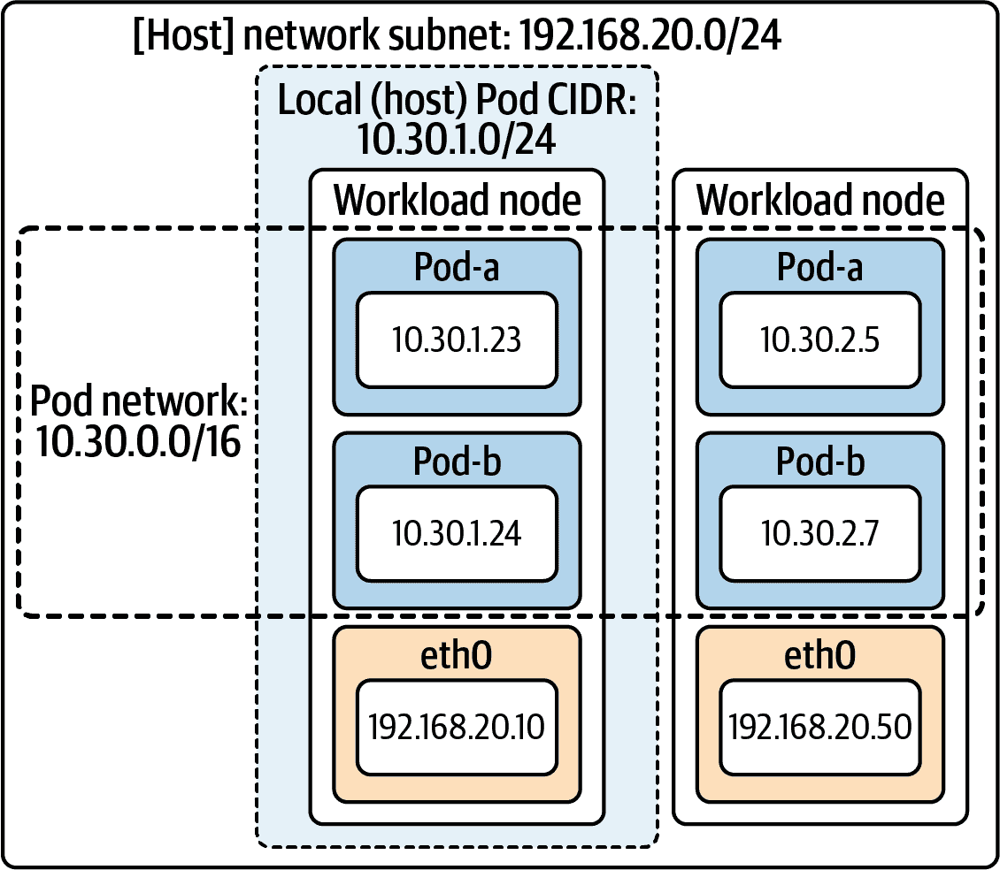
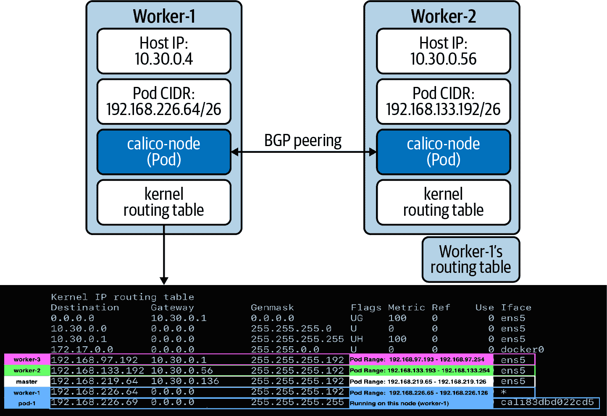
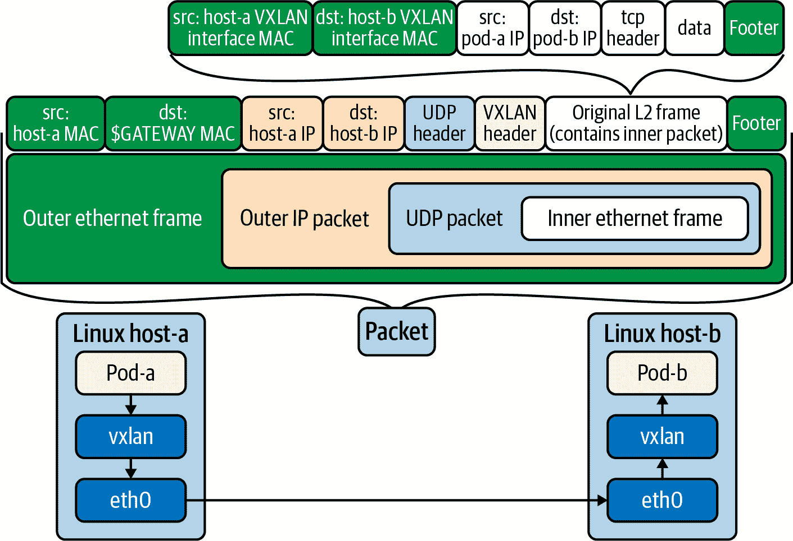
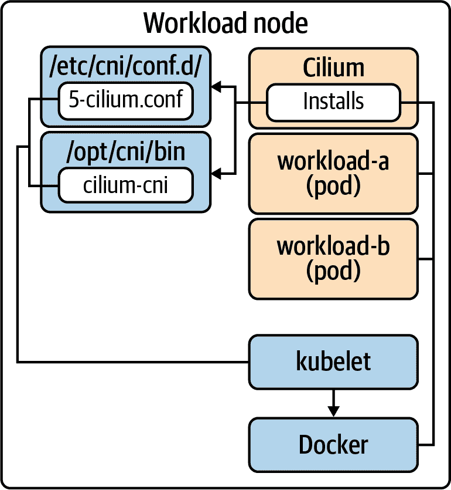
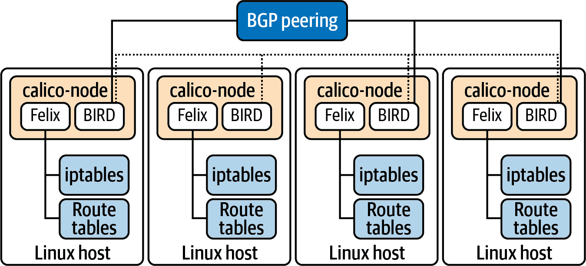
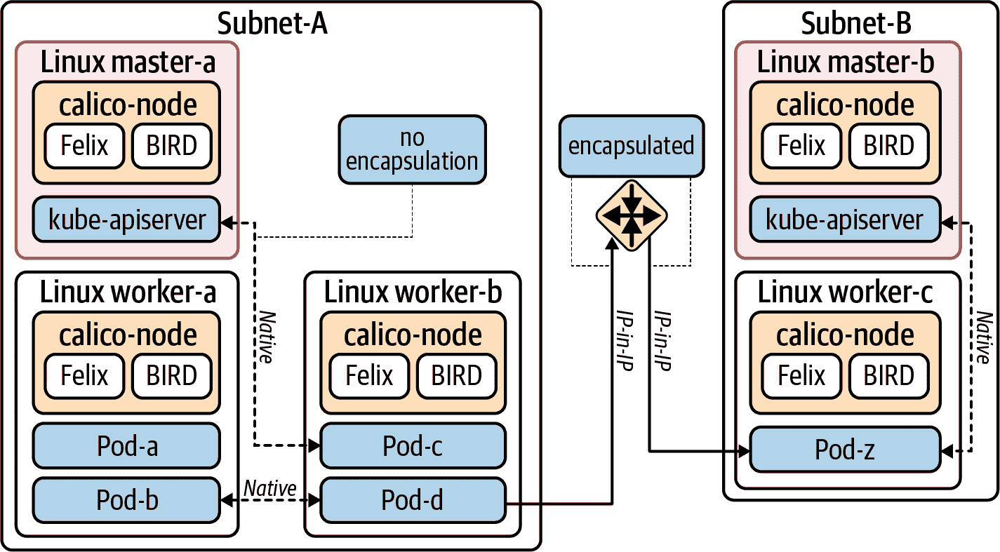
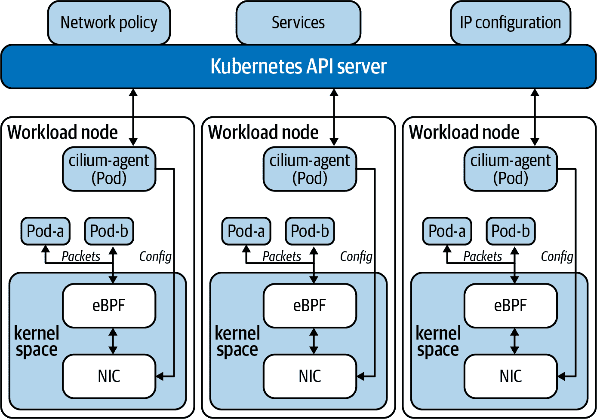
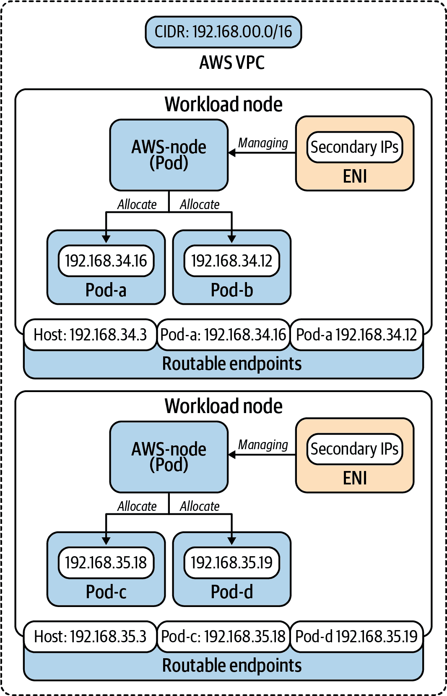
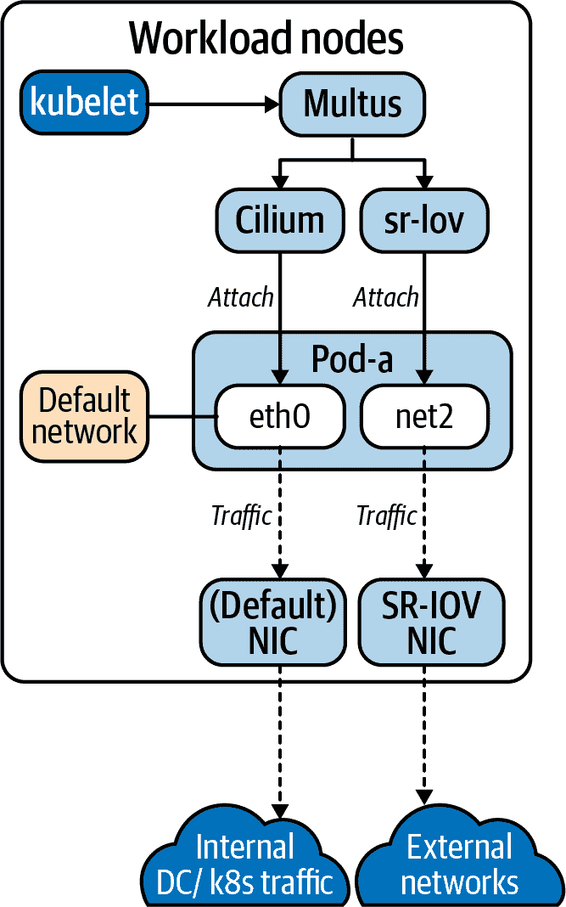

# 第五章：Pod 网络

自网络的早期以来，我们一直关注如何促进主机之间的通信。这些问题包括唯一地标识主机、在网络之间路由数据包以及已知路由的传播。在过去的十多年中，软件定义网络（SDN）通过解决这些在日益动态的环境中的问题而迅速增长。无论是在您的数据中心使用 VMware NSX 还是在云中使用 Amazon VPC，您很可能是 SDN 的消费者之一。

在 Kubernetes 中，这些原则和愿望仍然适用。虽然我们的单元从主机转移到 Pod，但我们需要确保我们的工作负载具有可寻址性和路由性。此外，考虑到 Pod 作为软件在我们的主机上运行，我们通常会建立完全基于软件定义的网络。

本章将探讨 Pod 网络的概念。我们将首先解释一些必须理解和考虑的关键网络概念，然后我们将介绍[容器网络接口（CNI）](https://github.com/containernetworking/cni)，根据您的网络需求选择网络实现。最后，我们将研究生态系统中的常见插件，如 Calico 和 Cilium，以使权衡更加具体化。最终，您将更加能够就应用平台的正确网络解决方案和配置做出决策。

###### 注意

网络本身是一个广泛的主题。我们的意图是为您提供足够的信息，以便在 Pod 网络上做出知情的决策。如果您的背景不是网络，强烈建议您与您的网络团队一起学习这些概念。Kubernetes 并不消除您组织中需要具备网络专业知识的必要性！

# 网络考虑事项

在深入讨论 Pod 网络的实施细节之前，我们应该首先考虑几个关键领域。这些领域包括：

+   IP 地址管理（IPAM）

+   路由协议

+   封装和隧道

+   工作负载的路由性

+   IPv4 和 IPv6

+   加密的工作负载流量

+   网络策略

了解了这些领域后，您可以开始确定适合您平台的正确网络解决方案。

## IP 地址管理

为了与 Pod 进行通信，我们必须确保它们具有唯一的可寻址性。在 Kubernetes 中，每个 Pod 都会分配一个 IP 地址。这些 IP 地址可能是集群内部的，也可能是外部可路由的。每个 Pod 拥有自己的地址简化了网络模型，因为我们不必担心共享 IP 上的端口冲突。然而，这种每个 Pod 拥有独立 IP 的模型也带来了它自己的挑战。

Pods 可以被视为短暂的实体。具体来说，它们容易因集群的需求或系统故障而重新启动或重新调度。这要求 IP 分配能够快速执行，并且集群 IP 池的管理必须高效。这种管理通常称为[IPAM](https://oreil.ly/eWJki)，并不限于 Kubernetes。在我们深入研究容器网络方法时，我们将探讨多种实现 IPAM 的方式。

###### 警告

这种工作负载 IP 的短暂期望在某些传统工作负载中会引发问题，例如将自身固定到特定 IP 并期望其保持静态的工作负载。根据您的容器网络实现（本章后面将介绍），您可以为特定工作负载明确保留 IP。但是，除非必要，我们建议不要采用这种模型。有许多功能强大的服务发现或 DNS 机制可以帮助工作负载有效解决此问题。请查看第六章以获取示例。

IPAM 是基于您选择的 CNI 插件实现的。这些插件中有一些关于 Pod IPAM 的共同点。首先，创建集群时可以指定 Pod 网络的[无类域间路由](https://oreil.ly/honRv)（CIDR）。如何设置取决于您如何引导 Kubernetes。在使用 `kubeadm` 的情况下，可以传递一个标志，如下所示：

```
kubeadm init --pod-network-cidr 10.30.0.0/16
```

这实际上设置了 kube-controller-manager 上的 `--cluster-cidr` 标志。Kubernetes 随后将为每个节点分配此集群 CIDR 的一部分。默认情况下，每个节点分配 `/24`。但是，可以通过在 kube-controller-manager 上设置 `--node-cidr-mask-size-ipv4` 和/或 `--node-cidr-mask-size-ipv6` 标志来控制这一点。具有此分配的节点对象如下：

```
apiVersion: v1
kind: Node
metadata:
  labels:
    kubernetes.io/arch: amd64
    kubernetes.io/hostname: test
    kubernetes.io/os: linux
    manager: kubeadm
  name: master-0
spec:
  podCIDR: 10.30.0.0/24 
  podCIDRs:
  - 10.30.0.0/24 
```


这个字段存在是为了兼容性。`podCIDRs`后来被引入为一个数组，支持在单个节点上支持双栈（IPv4 和 IPv6 CIDR）。


分配给此节点的 IP 范围是 10.30.0.0 - 10.30.0.255。这是用于 Pods 的 254 个地址，来自于 10.30.0.0/16 集群 CIDR 中可用的 65,534 个地址之一。

这些值是否在 IPAM 中使用取决于 CNI 插件。例如，Calico 检测并遵守此设置，而 Cilium 则提供一个选项，可以独立于 Kubernetes 管理 IP 池（默认情况下），或者遵守这些分配。在大多数 CNI 实现中，重要的是您的 CIDR 选择*不要*与集群的主机/节点网络重叠。但是，假设您的 Pod 网络将保持集群内部，所选的 CIDR 可以与集群外部的网络空间重叠。图 5-1 展示了这些不同 IP 空间之间的关系及分配示例。

###### 注意

设置集群的 Pod CIDR 多大通常取决于您的网络模型。在大多数部署中，Pod 网络完全是集群内部的。因此，Pod CIDR 可以非常大以适应未来的规模。当 Pod CIDR 能够路由到更大的网络时，因此消耗地址空间，您可能需要更谨慎地考虑。将每个节点的 Pod 数量乘以最终节点数量可以给出一个粗略的估计。默认情况下，kubelet 可以在每个节点上配置的 Pod 数量为 110。



###### 图 5-1\. 主机网络、Pod 网络和每个[主机]本地 CIDR 的 IP 空间和 IP 分配。

## 路由协议

一旦地址为 Pods，我们需要确保能够理解到它们的路由。这就是路由协议发挥作用的地方。可以将路由协议视为传播到各个地方和从各个地方路由的不同方式。引入路由协议通常会启用动态路由，相对于配置[静态路由](https://oreil.ly/97En2)。在 Kubernetes 中，当不利用封装（在下一节中介绍）时，理解多种路由变得重要，因为网络通常不知道如何路由工作负载 IP。

边界网关协议（BGP）是分发工作负载路由的最常用的协议之一。它在诸如[Calico](https://www.projectcalico.org)和[Kube-Router](https://www.kube-router.io)的项目中使用。BGP 不仅能够在集群中通信工作负载路由，而且其内部路由器还可以与外部路由器进行对等连接。这样可以使外部网络结构意识到如何路由到 Pod IP。在诸如 Calico 的实现中，BGP 守护进程作为 Calico Pod 的一部分运行。这个 Pod 在每个主机上运行。随着对工作负载的路由变得已知，Calico Pod 修改内核路由表以包括每个潜在工作负载的路由。这提供了通过工作负载 IP 进行原生路由的功能，特别是当在相同的 L2 段中运行时。图 5-2 展示了这种行为。



###### 图 5-2\. 使用其 BGP 对等体共享路由的`calico-pod`。然后相应地编程内核路由表。

###### 警告

看起来将 Pod IP 路由到更大的网络可能是有吸引力的，但应仔细考虑。有关更多详情，请参阅“工作负载可路由性”。

在许多环境中，原生路由到工作负载 IP 是不可能的。此外，诸如 BGP 的路由协议可能无法与底层网络集成；这种情况在运行在云提供商网络时很常见。例如，让我们考虑一个 CNI 部署，在这个部署中，我们希望支持原生路由并通过 BGP 共享路由。在 AWS 环境中，这可能由于两个原因而失败：

源/目标检查已启用

这确保了命中主机的数据包具有目标主机的目的地（和源 IP）。如果不匹配，数据包将被丢弃。此设置可以禁用。

数据包需要穿越子网

如果数据包需要离开子网，底层 AWS 路由器将评估目标 IP。当存在 Pod IP 时，将无法进行路由。

在这些场景中，我们看到了隧道协议的应用。

## 封装和隧道

隧道协议使您能够以大部分未知于底层网络的方式运行您的 Pod 网络。这是通过封装来实现的。顾名思义，封装涉及将一个数据包（内部数据包）放入另一个数据包（外部数据包）中。内部数据包的源 IP 和目标 IP 字段将引用工作负载（Pod）的 IP 地址，而外部数据包的源 IP 和目标 IP 字段将引用主机/节点的 IP 地址。当数据包离开节点时，对于底层网络来说，它将像任何其他数据包一样，因为工作负载特定数据位于有效负载中。有许多隧道协议，如 VXLAN、Geneve 和 GRE。在 Kubernetes 中，VXLAN 已成为网络插件中最常用的方法之一。图 5-3 展示了通过 VXLAN 传输封装数据包。

正如您所看到的，VXLAN 将整个以太网帧封装在 UDP 数据包中。这本质上提供了一个完全虚拟化的二层网络，通常称为覆盖网络。覆盖网络下方的网络，称为基础网络，不关心覆盖网络。这是隧道协议的主要优势之一。



###### 图 5-3. VXLAN 封装用于跨主机移动内部数据包，用于工作负载。网络只关心外部数据包，因此不需要了解工作负载 IP 及其路由。

通常情况下，您根据环境的要求/能力选择是否使用隧道协议。封装的优点是在许多场景中都能工作，因为覆盖网络与基础网络被抽象化。然而，这种方法也有一些关键的缺点：

流量可能更难理解和排除故障

包内嵌包可能在网络故障排除时增加额外复杂性。

封装/解封装会产生处理成本

当数据包离开主机时，它必须进行封装，当进入主机时，它必须进行解封装。虽然可能很小，但这将增加相对于本地路由的开销。

数据包将会变得更大

由于数据包的嵌套，它们在通过网络传输时会变得更大。这可能需要调整[最大传输单元（MTU）](https://oreil.ly/dzYBz)以确保其适合网络。

## 工作负载路由能力

在大多数集群中，Pod 网络是集群内部的。这意味着 Pod 可以直接彼此通信，但外部客户端不能直接到达 Pod IP。考虑到 Pod IP 是临时的，直接与 Pod 的 IP 进行通信通常是不良实践。依赖服务发现或负载均衡机制来抽象底层 IP 更为可取。内部 Pod 网络的一个巨大优势是它*不会*占用组织内宝贵的地址空间。许多组织管理地址空间以确保地址在公司内保持唯一。因此，当你要求每个 Kubernetes 集群引导时使用 `/16` 空间（65,536 个 IP）时，你肯定会受到质疑！

当 Pod 不直接可路由时，我们有几种模式来促进外部流量到 Pod IP。通常我们会在一些专用节点的主机网络上暴露一个入口控制器。然后，一旦数据包进入入口控制器代理，它可以直接路由到 Pod IP，因为它参与了 Pod 网络。一些云服务提供商甚至包括（外部）负载均衡器集成，自动将这一切连接在一起。我们在第六章中探讨了多种这样的入口模型及其权衡。

有时，需求要求 Pod 能够路由到更大的网络。有两种主要方法可以实现这一点。第一种是使用与底层网络直接集成的网络插件。例如，[AWS 的 VPC CNI](https://github.com/aws/amazon-vpc-cni-k8s) 将多个次要 IP 地址附加到每个节点并分配给 Pod。这样，每个 Pod 就可以像 EC2 主机一样路由。这种模型的主要缺点是它会消耗你子网/VPC 中的 IP。第二个选项是通过诸如 BGP 的路由协议传播路由到 Pod。某些使用 BGP 的插件甚至可以使你可以使 Pod 网络的子集可路由，而不是必须暴露整个 IP 空间。

###### 警告

避免使你的 Pod 网络在绝对必要之外变得可外部路由。我们经常看到传统应用程序驱动对可路由 Pod 的渴望。例如，考虑一个基于 TCP 的工作负载，其中客户端必须固定在同一个后端。通常，我们建议更新应用程序以适应容器网络范式，使用服务发现并可能重新设计后端，以避免需要客户端-服务器亲和（如果可能的话）。尽管暴露 Pod 网络看起来像是一个简单的解决方案，但这样做会增加 IP 空间的消耗，并可能使 IPAM 和路由传播配置变得更加复杂。

## IPv4 和 IPv6

当前绝大多数集群仅运行 IPv4。然而，我们注意到在某些客户端（如电信运营商），确保多个工作负载的可寻址性是至关重要的。Kubernetes 从 `1.16` 版本开始支持通过[dual-stack](https://oreil.ly/sj_jN)。在撰写本文时，双栈功能仍处于 alpha 版本。双栈功能使您能够在集群中配置 IPv4 和 IPv6 地址空间。

如果您的使用场景需要 IPv6，可以轻松启用，但需要几个组件保持一致：

+   尽管仍处于 alpha 版本，但 kube-apiserver 和 kubelet 必须启用一个功能开关。

+   kube-apiserver、kube-controller-manager 和 kube-proxy 需要额外配置以指定 IPv4 和 IPv6 空间。

+   您必须使用支持 IPv6 的 CNI 插件，例如[Calico](https://projectcalico.org)或[Cilium](https://cilium.io)。

在上述配置完成后，您将在每个节点对象上看到两个 CIDR 分配：

```
spec:
  podCIDR: 10.30.0.0/24
  podCIDRs:
  - 10.30.0.0/24
  - 2002:1:1::/96
```

CNI 插件的 IPAM 负责确定是否为每个 Pod 分配 IPv4、IPv6 或两者皆有。

## 加密的工作负载流量

Pod 与 Pod 之间的流量通常不会默认进行加密。这意味着未加密的数据包（如 TLS）在传输过程中可能会被截获为明文。许多网络插件支持在传输过程中加密流量。例如，Antrea 在使用 GRE 隧道时支持使用[IPsec](https://oreil.ly/jqzCQ)进行加密。Calico 可以通过利用节点的[WireGuard](https://www.wireguard.com)安装来加密流量。

启用加密可能看起来是一个明显的选择。然而，需要考虑权衡。我们建议与您的网络团队交流，了解今天在主机到主机的流量处理中是否已加密数据。例如，当服务之间是否都通过 TLS 进行通信？您是否计划利用服务网格，其中工作负载代理使用 mTLS？如果是这样，是否需要在服务代理和 CNI 层面进行加密？虽然加密将增加防御深度，但也会增加网络管理和故障排除的复杂性。最重要的是，需要加密和解密数据包将影响性能，从而降低潜在的吞吐量。

## 网络策略

一旦 Pod 网络连接完毕，逻辑上的下一步是考虑如何设置网络策略。网络策略类似于防火墙规则或安全组，我们可以定义允许的入口和出口流量。Kubernetes 提供了一个 [NetworkPolicy API](https://oreil.ly/1UV_3)，作为核心网络 API 的一部分。任何集群都可以向其添加策略。但是，实施策略是 CNI 提供者的责任。这意味着运行不支持 NetworkPolicy 的 CNI 提供者的集群，例如 [flannel](https://github.com/coreos/flannel)，将接受 NetworkPolicy 对象但不会执行它们。如今，大多数 CNI 都对 NetworkPolicy 有一定程度的支持。那些不支持的可以通常与插件（例如 Calico）一起使用，插件运行在仅提供策略执行的模式下。

Kubernetes 内部提供的 NetworkPolicy 又增加了一层类似防火墙样式规则管理的机制。例如，许多网络通过分布式防火墙或安全组机制提供子网或主机级别的规则。虽然这些现有解决方案通常不具有对 Pod 网络的可见性，这限制了在设置基于 Pod 工作负载通信规则时可能期望的粒度。Kubernetes NetworkPolicy 的另一个引人注目的方面是，与 Kubernetes 中的大多数对象一样，它是以声明方式定义的，并且我们认为相对于大多数防火墙管理解决方案来说，更易于管理！因此，我们通常建议考虑在 Kubernetes 层面实施网络策略，而不是尝试使现有防火墙解决方案适应这种新的范式。这并不意味着您应该放弃您现有的主机到主机防火墙解决方案。更多的是，让 Kubernetes 处理工作负载内部策略。

如果您选择使用 NetworkPolicy，重要的是要注意这些策略是 *命名空间范围* 的。默认情况下，当不存在 NetworkPolicy 对象时，Kubernetes 允许与工作负载之间的所有通信。设置策略时，您可以选择策略适用于哪些工作负载。当存在时，默认行为将反转，任何未被策略允许的出口和入口流量将被阻止。这意味着 Kubernetes NetworkPolicy API 仅指定了允许的流量。此外，命名空间中的策略是累加的。考虑以下配置了入口和出口规则的 NetworkPolicy 对象：

```
apiVersion: networking.k8s.io/v1
kind: NetworkPolicy
metadata:
  name: team-netpol
  namespace: org-1
spec:
  podSelector: {} 
  policyTypes:
  - Ingress
  - Egress
  ingress: 
  - from:
    - ipBlock:
      cidr: 10.40.0.0/24
    ports:
    - protocol: TCP
      port: 80
  egress:
  - to: 
    ports:
    - protocol: UDP
      port: 53
  - to: 
    - namespaceSelector:
        matchLabels:
          name: org-2
    - podSelector:
        matchLabels:
          app: team-b
    ports:
    - protocol: TCP
      port: 80
```


空的 `podSelector` 意味着此策略适用于该命名空间中的所有 Pod。或者，您可以根据标签进行匹配。


此入口规则允许来自 IP 范围为 10.40.0.0/24 的源的流量，协议为 TCP，端口为 80。


此出口规则允许来自工作负载的 DNS 流量。


此出口规则限制向 `org-2` 命名空间中标有 `team-b` 标签的工作负载发送 TCP 协议且目标端口为 80 的流量。

随着时间的推移，我们发现 NetworkPolicy API 对某些用例有所限制。一些常见的需求包括：

+   复杂的条件评估

+   基于 DNS 记录解析 IP 地址

+   L7 规则（主机、路径等）

+   集群范围的策略，使全局规则能够生效，而不是需要在每个命名空间中复制这些规则。

为了满足这些需求，一些 CNI 插件提供了更强大的策略 API。使用供应商特定的 API 的主要折衷是，您的规则不再跨插件可移植。在本章稍后的部分，我们将探讨 Calico 和 Cilium 的示例。

## 摘要：网络考虑因素

在前面的章节中，我们已经涵盖了关键的网络考虑因素，这些将帮助您就 Pod 网络策略做出明智的决策。在深入讨论 CNI 和插件之前，让我们回顾一些关键的考虑领域：

+   每个集群的 Pod CIDR 应该有多大？

+   您的底层网络对未来 Pod 网络有什么网络约束？

+   如果使用 Kubernetes 管理的服务或供应商提供的服务，支持哪些网络插件？

+   您的基础设施是否支持诸如 BGP 的路由协议？

+   是否可以通过网络路由未封装（原生）的数据包？

+   使用隧道协议（封装）是可取的还是必需的？

+   您是否需要支持（外部可路由的）Pods？

+   运行 IPv6 是否是您工作负载的要求？

+   您希望在哪些级别执行网络策略或防火墙规则？

+   您的 Pod 网络是否需要在传输时加密流量？

有了这些问题的答案，您可以开始学习如何插入正确的技术来解决这些问题，即容器网络接口 (CNI)。

# 容器网络接口 (CNI)

到目前为止讨论的所有考虑都清楚地表明，不同的用例需要不同的容器网络解决方案。在 Kubernetes 的早期阶段，大多数集群都在运行名为 [flannel](https://github.com/coreos/flannel) 的网络插件。随着时间的推移，诸如 [Calico](https://www.projectcalico.org) 等解决方案变得更加流行。这些新的插件带来了创建和运行网络的不同方法。这促使了像 Kubernetes 这样的系统如何请求其工作负载的网络资源的标准化。这个标准被称为 [Container Networking Interface (CNI)](https://github.com/containernetworking/cni)。今天，与 Kubernetes 兼容的所有网络选项都符合这一接口。与容器存储接口 (CSI) 和容器运行时接口 (CRI) 类似，这为我们的应用程序平台的网络堆栈提供了灵活性。

CNI 规范定义了几个关键操作：

`ADD`

添加一个容器到网络并返回相关接口、IP 及其他信息。

`DELETE`

从网络中删除一个容器并释放所有相关资源。

`CHECK`

验证容器的网络设置是否正确，并在出现问题时返回错误。

`VERSION`

返回插件支持的 CNI 版本。

此功能是通过安装在主机上的二进制文件实现的。kubelet 将根据其在主机上预期的配置与适当的 CNI 二进制文件通信。这个配置文件的示例如下：

```
{
  "cniVersion": "0.4.0", 
  "name": "dbnet", 
  "type": "bridge",
  "bridge": "cni0",
  "args": {
    "labels" : {
        "appVersion" : "1.0"
    }
  },
  "ipam": { 
    "type": "host-local",
    "subnet": "10.1.0.0/16",
    "gateway": "10.1.0.1"
  }
}
```


此插件期望使用的 CNI（规范）版本进行通信。


发送网络设置请求的 CNI 驱动（二进制文件）。


在 CNI 插件不处理 IPAM 时指定要使用的 IPAM 驱动程序。

###### 注意

CNI *conf*目录中可能存在多个 CNI 配置。它们按字典顺序评估，并使用第一个配置。

除了 CNI 配置和 CNI 二进制文件外，大多数插件还在每个处理接口附加和 IPAM 之外的主机上运行一个 Pod。这包括路由传播和网络策略编程等职责。

## CNI 安装

每个参与 Pod 网络的节点必须安装 CNI 驱动程序。此外，必须建立 CNI 配置。通常在部署 CNI 插件时进行安装。例如，当部署 Cilium 时，将创建一个 DaemonSet，它在每个节点上放置一个`cilium` Pod。此 Pod 具有一个 PostStart 命令，运行内置脚本*install-cni.sh*。此脚本首先安装回环驱动程序以支持`lo`接口。然后安装`cilium`驱动程序。该脚本的执行概念如下（为简洁起见，此示例已大大简化）：

```
# Install CNI drivers to host

# Install the CNI loopback driver; allow failure
cp /cni/loopback /opt/cin/bin/ || true

# install the cilium driver
cp /opt/cni/bin/cilium-cni /opt/cni/bin/
```

安装后，kubelet 仍然需要知道要使用哪个驱动程序。它将在*/etc/cni/net.d/*（可通过标志配置）中查找 CNI 配置。同样的*install-cni.sh*脚本将其添加如下：

```
cat > /etc/cni/net.d/05-cilium.conf <<EOF
{
 "cniVersion": "0.3.1",
 "name": "cilium",
 "type": "cilium-cni",
 "enable-debug": ${ENABLE_DEBUG}
}
EOF
```

为了演示这些操作的顺序，让我们看看一个新引导的单节点集群。此集群使用`kubeadm`引导。检查所有 Pod 后发现`core-dns` Pods 未运行：

```
NAMESPACE     NAME                           READY   STATUS    RESTARTS   AGE
kube-system   coredns-f9fd979d6-26lfr        0/1     Pending   0          3m14s
kube-system   coredns-f9fd979d6-zqzft        0/1     Pending   0          3m14s
kube-system   etcd-test                      1/1     Running   0          3m26s
kube-system   kube-apiserver-test            1/1     Running   0          3m26s
kube-system   kube-controller-manager-test   1/1     Running   0          3m26s
kube-system   kube-proxy-xhh2p               1/1     Running   0          3m14s
kube-system   kube-scheduler-test            1/1     Running   0          3m26s
```

在分析预定运行`core-dns`的主机上的 kubelet 日志后，清楚地表明缺少 CNI 配置导致容器运行时无法启动 Pod：

###### 注意

在集群引导后，DNS 未启动的情况是 CNI 问题最常见的指标之一。另一个症状是节点报告`NotReady`状态。

```
# journalctl -f -u kubelet

-- Logs begin at Sun 2020-09-27 15:40:13 UTC. --
Sep 27 17:11:18 test kubelet[2972]: E0927 17:11:18.817089 2972 kubelet.go:2103]
Container runtime network not ready: NetworkReady=false
reason:NetworkPluginNotReady message:docker: network plugin is not ready: cni
config uninitialized
Sep 27 17:11:19 test kubelet[2972]: W0927 17:11:19.198643 2972 cni.go:239]
Unable to update cni config: no networks found in /etc/cni/net.d
```

###### 注意

诸如 `kube-apiserver` 和 `kube-controller-manager` 这样的 Pod 之所以成功启动，是因为它们使用了主机网络。由于它们利用主机网络而不依赖于 Pod 网络，因此不会受到 `core-dns` 所见行为的影响。

Cilium 可以通过从 Cilium 文档中的 YAML 文件应用到集群来部署。这样做会在每个节点上部署上述的 `cilium` Pod，并运行 *cni-install.sh* 脚本。检查 CNI bin 和配置目录，我们可以看到安装的组件：

```
# ls /opt/cni/bin/ | grep -i cilium
cilium-cni

# ls /etc/cni/net.d/ | grep -i cilium
05-cilium.conf
```

有了这个配置，kubelet 和容器运行时按预期运行。最重要的是，`core-dns` Pod 正在运行！图 5-4 展示了我们在本节中所涵盖的关系。



###### 图 5-4\. Docker 用于运行容器。kubelet 与 CNI 交互，附加网络接口并配置 Pod 的网络。

虽然此示例通过 Cilium 进行安装探索，但大多数插件遵循类似的部署模型。选择插件的关键理由基于 “网络考虑” 中的讨论。考虑到这一点，我们将转向探索一些 CNI 插件，以更好地理解不同的方法。

# CNI 插件

现在我们将探讨几种 CNI 的实现方式。与其他接口（如 CRI）相比，CNI 拥有最多的选项之一。因此，我们在涵盖的插件方面不会穷尽一切，并鼓励您探索更多内容。我们选择以下插件作为客户中最常见且足够独特以展示各种方法的因素。

###### 注意

Pod 网络是任何 Kubernetes 集群的基础。因此，您的 CNI 插件将处于关键路径上。随着时间推移，您可能希望更改您的 CNI 插件。如果发生这种情况，我们建议重建集群，而不是进行原地迁移。在这种方法中，您会启动一个新的集群，使用新的 CNI。然后，根据您的架构和操作模型，将工作负载迁移到新集群。虽然可以进行原地 CNI 迁移，但这带来了非常重要的风险，应仔细权衡我们的建议。

## Calico

Calico 是云原生生态系统中一个成熟的 CNI 插件。[Project Calico](https://www.projectcalico.org)是支持此 CNI 插件的开源项目，[Tigera](https://www.tigera.io)是提供企业功能和支持的商业公司。Calico 大量使用 BGP 在节点之间传播工作负载路由，并与更大的数据中心结构集成。除了安装 CNI 二进制文件外，Calico 还在每个主机上运行一个`calico-node`代理。该代理使用 BIRD 守护程序促进节点之间的 BGP 对等体系，并使用 Felix 代理将已知路由编程到内核路由表中。这种关系在图 5-5 中有所展示。



###### 图 5-5. Calico 组件关系展示 BGP 对等体系以及相应地通信路由和 iptables 与内核路由表的编程。

对于 IPAM，Calico 最初遵循描述在“IP 地址管理”中的`cluster-cidr`设置。然而，它的功能远不止依赖于每个节点的 CIDR 分配。Calico 创建称为[IPPools](https://oreil.ly/-Nd-Q)的 CRD，这在 IPAM 中提供了很大的灵活性，特别是支持以下功能：

+   配置每个节点的块大小

+   指定 IP 池适用于哪些节点

+   将 IPPools 分配给命名空间，而不是节点

+   配置路由行为

配合每个集群可以有多个池的能力，您在 IPAM 和网络架构上有很大的灵活性。默认情况下，集群运行单个 IP 池，如下所示：

```
apiVersion: projectcalico.org/v3
kind: IPPool
metadata:
  name: default-ipv4-ippool
spec:
  cidr: 10.30.0.0/16 
  blockSize: 29 
  ipipMode: Always 
  natOutgoing: true
```


集群的 Pod 网络 CIDR。


每个节点级别 CIDR 分配的大小。


封装模式。

Calico 提供多种路由集群内部数据包的方式。这包括：

本地

不封装数据包。

IP-in-IP

简单封装。IP 数据包放置在另一个数据包的负载中。

VXLAN

高级封装。整个 L2 帧被封装在一个 UDP 数据包中。建立虚拟 L2 覆盖。

你的选择往往取决于你的网络支持能力。正如在“路由协议”中所描述的，本地路由很可能提供最佳性能、最小的数据包大小和最简单的故障排除体验。然而，在许多环境中，特别是涉及多个子网的情况下，这种模式是不可能的。封装方法在大多数环境中都有效，特别是 VXLAN。此外，VXLAN 模式不需要使用 BGP，这可以解决 BGP 对等连接被阻止的环境。Calico 封装方法的一个独特特性是，它可以专门用于跨越子网边界的流量。这使得在子网内进行路由时接近本地性能，同时不会破坏子网外的路由。通过将 IP 池的`ipipMode`设置为`CrossSubnet`即可启用此功能。图 5-6 展示了这种行为。



###### 图 5-6\. 启用 CrossSubnet IP-in-IP 模式时的流量行为。

对于保持启用 BGP 的 Calico 部署，默认情况下，由于`calico-node` Pod 中内置了 BGP 守护程序，不需要额外工作。在更复杂的架构中，组织使用此 BGP 功能作为引入[路由反射器](https://tools.ietf.org/html/rfc4456)的一种方式，特别是在大规模使用默认的全网格方法受限时。除了路由反射器，还可以配置对网络路由器的对等连接，从而使整个网络了解到 Pod IP 的路由。这一切都可以使用 Calico 的 BGPPeer CRD 进行配置，如下所示：

```
apiVersion: projectcalico.org/v3
kind: BGPPeer
metadata:
  name: external-router
spec:
  peerIP: 192.23.11.100 
  asNumber: 64567 
  nodeSelector: routing-option == 'external' 
```


与之对等连接的设备的 IP。


集群的自治系统[标识](https://oreil.ly/HiXLN)。 


应与此设备进行对等连接的集群节点。此字段是可选的。当省略时，BGPPeer 配置被视为*全局*。仅在某些节点集应提供唯一路由功能（例如提供可路由的 IP 时）时，不对等全局是明智的选择。

在网络策略方面，Calico 完全实现了 Kubernetes NetworkPolicy API。Calico 提供了两个额外的 CRD 以增强功能。这些包括[(projectcalico.org/v3).NetworkPolicy](https://oreil.ly/oMsCm)和[GlobalNetworkPolicy](https://oreil.ly/3pUOs)。这些 Calico 特定的 API 看起来类似于 Kubernetes NetworkPolicy，但具有更强大的规则和更丰富的表达式用于评估。此外，支持策略排序和应用层策略（需要与 Istio 集成）。GlobalNetworkPolicy 特别有用，因为它在集群范围内应用策略。这使得实现微分段化等模型变得更加容易，其中所有流量默认被拒绝，根据工作负载需求打开出口/入口。您可以应用一个 GlobalNetworkPolicy，拒绝除 DNS 等关键服务之外的所有流量。然后，在 Namespace 级别，您可以相应地开放对入口和出口的访问。如果没有 GlobalNetworkPolicy，我们将需要在*每个*Namespace 中添加和管理拒绝所有规则。

###### 注意

在历史上，Calico 使用 iptables 来实现数据包路由决策。对于服务，Calico 依赖 kube-proxy 进行编程，以解析服务的端点。对于网络策略，Calico 编程 iptables 确定数据包是否允许进入或离开主机。在撰写本文时，Calico 引入了 eBPF 数据平面选项。我们预计随着时间的推移，Calico 使用的更多功能将转移到这种模型中。

## Cilium

相对于 Calico，Cilium 是一种较新的 CNI 插件。它是第一个利用[扩展伯克利数据包过滤器（eBPF）](https://ebpf.io)的 CNI 插件。这意味着它可以在不离开内核空间的情况下处理数据包。与[eXpress Data Path（XDP）](https://oreil.ly/M3m6t)配对，可以在 NIC 驱动程序中建立钩子以进行路由决策。这使得数据包接收时能够立即进行路由决策。

作为一种技术，eBPF 已经在 Facebook 和 Netflix 等组织中展示了性能和规模。使用 eBPF，Cilium 能够宣称在可伸缩性、可观察性和安全性方面具有增强功能。与 BPF 的深度集成意味着，像 NetworkPolicy 执行这样的常见 CNI 问题不再通过用户空间中的 iptables 处理。相反，广泛使用的[eBPF maps](https://oreil.ly/4Rdvf)使决策能够快速发生，并且随着添加更多规则而扩展。Figure 5-7 显示了安装了 Cilium 后的堆栈的高级概述。



###### 图 5-7\. Cilium 与内核级别的 eBPF 映射和程序交互。

对于 IPAM，Cilium 遵循将 IPAM 委托给云提供商集成或自行管理的模型。在 Cilium 管理 IPAM 的最常见情况下，它将为每个节点分配 Pod CIDR。默认情况下，Cilium 将独立管理这些 CIDR，而不依赖于 Kubernetes 节点分配。节点级别的地址将在`CiliumNode` CRD 中公开。这将提供更大的 IPAM 管理灵活性，并且是首选的方法。如果希望保持基于 Kubernetes 的 Pod CIDR 默认分配的 CIDR 分配方式，Cilium 提供了`kubernetes` IPAM 模式。这将依赖于每个节点分配的 Pod CIDR，该 CIDR 在节点对象中公开。以下是`CiliumNode`对象的示例。您可以期望在集群中的每个节点上存在这样一个对象：

```
apiVersion: cilium.io/v2
kind: CiliumNode
metadata:
  name: node-a
spec:
  addresses:
  - ip: 192.168.122.126 
    type: InternalIP
  - ip: 10.0.0.245
    type: CiliumInternalIP
  health:
    ipv4: 10.0.0.78
  ipam:
    podCIDRs:
    - 10.0.0.0/24 
```


此工作负载节点的 IP 地址。


分配给此节点的 CIDR。可以使用 Cilium 的配置控制此分配的大小，例如`cluster-pool-ipv4-mask-size: "24"`。

类似于 Calico，Cilium 提供了封装和本地路由模式。默认模式是封装。Cilium 支持使用隧道协议 VXLAN 或 Geneve。只要主机到主机的路由可达，此模式应该适用于大多数网络。要以本地模式运行，必须在某个级别上理解 Pod 路由。例如，Cilium 支持使用 AWS 的 ENI 进行 IPAM。在这种模型中，Pod 的 IP 已知于 VPC 并且天然可路由。要在 Cilium 管理的 IPAM 下运行本地模式，假设集群运行在相同的 L2 段内，可以在 Cilium 的配置中添加`auto-direct-node-routes: true`。然后 Cilium 将相应地编程主机的路由表。如果跨越 L2 网络，则可能需要引入额外的路由协议，如 BGP 来分发路由。

在网络策略方面，Cilium 可以强制执行 Kubernetes 的[NetworkPolicy API](https://oreil.ly/_WUKS)。作为此策略的替代，Cilium 提供了自己的[CiliumNetworkPolicy](https://oreil.ly/EpkhJ)和[CiliumClusterwideNetworkPolicy](https://oreil.ly/RtYH5)。这两者之间的关键区别在于策略的范围。CiliumNetworkPolicy 是命名空间范围的，而 CiliumClusterwideNetworkPolicy 是整个集群范围的。这两者都具有超出 Kubernetes NetworkPolicy 功能的增强功能。除了支持基于标签的第三层策略外，它们还支持基于 DNS 解析和应用级（第 7 层）请求的策略。

虽然大多数 CNI 插件不涉及服务，Cilium 提供了一个完整的 kube-proxy 替代方案。此功能内置于部署在每个节点的 `cilium-agent` 中。在部署此模式时，您需要确保集群中不存在 kube-proxy，并且在 Cilium 中将 `KubeProxyReplacement` 设置为 `strict`。在使用此模式时，Cilium 将通过 eBPF 映射为服务配置路由，使解析速度达到 O(1)。这与 kube-proxy 实现服务在 iptables 链中有所不同，在规模或服务高变动时可能会出现问题。此外，Cilium 提供的 CLI 在诸如服务或网络策略的故障排除时提供了良好的体验。您可以直接查询系统，而无需解释 iptables 链：

```
kubectl exec -it -n kube-system cilium-fmh8d -- cilium service list

ID   Frontend               Service Type   Backend
[...]
7    192.40.23.111:80       ClusterIP      1 => 10.30.0.28:80
                                           2 => 10.30.0.21:80
```

Cilium 的使用 eBPF 程序和映射使其成为一种非常引人注目和有趣的 CNI 选项。通过继续利用 eBPF 程序，引入了更多与 Cilium 集成的功能，例如提取流数据、策略违规等。为了提取并展示这些宝贵的数据，引入了 [hubble](https://github.com/cilium/hubble)。它利用 Cilium 的 eBPF 程序为运维人员提供了 UI 和 CLI。

最后，我们应该提到，Cilium 提供的 eBPF 功能可以与许多现有的 CNI 提供程序并行运行。这是通过在其 CNI 链接模式下运行 Cilium 实现的。在此模式下，如 AWS 的 VPC CNI 这样的现有插件将处理路由和 IPAM。Cilium 的责任将专门是其各种 eBPF 程序提供的功能，包括网络可观察性、负载均衡和网络策略强制执行。在您无法完全在环境中运行 Cilium 或希望在当前 CNI 选择旁边测试其功能时，这种方法可能更可取。

## AWS VPC CNI

AWS 的 VPC CNI 展示了与迄今为止讨论的内容非常不同的方法。它不是将 Pod 网络独立于节点网络运行，而是完全将 Pod 集成到相同的网络中。由于不引入第二个网络，因此不再需要关注路由分发或隧道协议的问题。当为 Pod 提供 IP 后，它就像 EC2 主机一样成为网络的一部分。它受到与子网中任何其他主机相同的 [路由表](https://oreil.ly/HYHHp) 影响。亚马逊称之为本地 VPC 网络。

对于 IPAM，守护进程将在 Kubernetes 节点上附加第二个[弹性网络接口（ENI）](https://oreil.ly/NBjs3)。然后，它将维护一个[次要 IP 地址池](https://oreil.ly/vUGdI)，这些 IP 地址最终会附加到 Pods 上。每个节点可用的 IP 数量取决于 EC2 实例的大小。这些 IP 通常是 VPC 内的“私有”IP 地址。正如本章前面提到的，这将消耗 VPC 中的 IP 空间，并使 IPAM 系统比完全独立的 Pod 网络更加复杂。但是，由于我们没有引入新的网络，流量路由和故障排除显著简化了！图 5-8 展示了使用 AWS VPC CNI 的 IPAM 设置。



###### 图 5-8\. IPAM 守护程序负责维护 ENI 和次要 IP 地址池。

###### 注意

使用 ENI 将影响您可以在每个节点上运行的 Pod 数量。AWS 在其 GitHub 页面上[维护了一个列表](https://oreil.ly/jk_XL)，将实例类型与最大 Pod 数量进行了对应。

## Multus

到目前为止，我们已经涵盖了特定的 CNI 插件，这些插件将一个接口附加到一个 Pod 上，从而使其在网络上可用。但是，如果一个 Pod 需要连接到多个网络怎么办？这就是 Multus CNI 插件发挥作用的地方。虽然不是非常常见，但在电信行业中存在一些使用案例，这些案例要求它们的网络功能虚拟化（NFV）将流量路由到特定的专用网络。

Multus 可以被视为启用多个其他 CNI 的 CNI。在这种模型中，Multus 成为 Kubernetes 交互的 CNI 插件。Multus 配置了一个默认网络，通常是预期用于促进 Pod 与 Pod 通信的网络。这甚至可能是本章中我们讨论过的插件之一！然后，Multus 支持通过指定其他可以用于将另一个接口附加到 Pod 的插件来配置次要网络。Pods 可以像这样被注释：`k8s.v1.cni.cncf.io/networks: sriov-conf` 来附加额外的网络。图 5-9 展示了这种配置的结果。



###### 图 5-9\. 多网络 Multus 配置的流量流向。

## 额外的插件

插件的选择很广泛，我们只覆盖了非常小的一部分。然而，本章介绍的插件确实识别了一些插件中的关键差异。大多数替代方案采用不同的方法来实现网络功能，但许多核心原则保持不变。以下列表识别了一些额外的插件，并对其网络方法给予了一小部分示例：

[Antrea](https://antrea.io/docs)

数据平面通过 [Open vSwitch](https://www.openvswitch.org) 实现。提供高性能路由以及检查流数据的能力。

[Weave](https://www.weave.works/oss/net)

提供许多机制来路由流量的覆盖网络，例如使用 OVS 模块的快速数据路径选项来保持内核中的数据包处理。

[flannel](https://github.com/coreos/flannel)

简单的第三层网络用于 Pods 和早期的一个 CNI。它支持多种后端配置，但通常配置为使用 VXLAN。

# 总结

Kubernetes/容器网络生态系统充满了选择。这是件好事！正如我们在本章中所介绍的，网络需求在不同组织之间可能有显著差异。选择一个 CNI 插件可能是您最终应用平台中最基础的考虑之一。虽然探索如此多的选择可能会让人感到不知所措，但我们强烈建议您努力更好地理解您环境和应用程序的网络需求。通过深入了解，正确的网络插件选择应该就会水到渠成！
