# 第六章：服务路由

服务路由是基于 Kubernetes 的平台的关键能力。虽然容器网络层负责连接 Pod 的底层原语，但开发人员需要更高级的机制来互连服务（即东西向服务路由），以及将应用程序暴露给其客户端（即南北向服务路由）。服务路由涵盖了三个提供这种机制的关注点：Services、Ingress 和服务网格。

Services 提供了一种将一组 Pod 视为单个单元或网络服务的方式。它们提供了负载均衡和路由功能，支持应用程序在集群中的水平扩展。此外，Services 还提供了应用程序可以用来发现和与它们的依赖关系交互的服务发现机制。最后，Services 还提供第 3/4 层机制，将工作负载暴露给集群外的网络客户端。

Ingress 处理集群中的南北向路由。它充当进入集群中运行的工作负载的入口，主要是 HTTP 和 HTTPS 服务。Ingress 提供第 7 层负载均衡功能，使得比 Services 更精细的流量路由成为可能。流量的负载均衡由 Ingress 控制器处理，该控制器必须安装在集群中。Ingress 控制器利用诸如 Envoy、NGINX 或 HAProxy 等代理技术。控制器从 Kubernetes API 获取 Ingress 配置，并相应地配置代理。

服务网格是一个提供高级路由、安全性和可观察性功能的服务路由层。它主要关注东西向服务路由，但某些实现也可以处理南北向路由。网格中的服务通过增强连接的代理相互通信。代理的使用使网格具有吸引力，因为它们可以增强工作负载而无需更改源代码。

本章详细介绍了在生产 Kubernetes 平台中至关重要的服务路由能力。首先，我们将讨论服务（Services）、不同的服务类型以及它们的实现方式。接下来，我们将探索入口（Ingress）、Ingress 控制器以及在生产环境中运行 Ingress 需要考虑的不同因素。最后，我们将介绍服务网格（service mesh）、它们在 Kubernetes 上的工作原理以及在生产平台中采用服务网格时需要考虑的因素。

# Kubernetes 服务

Kubernetes 的 Service 在服务路由中具有基础性作用。Service 是一个网络抽象层，提供跨多个 Pod 的基本负载均衡。在大多数情况下，集群中运行的工作负载使用 Services 来相互通信。由于 Pod 的可替代性质，使用 Services 而不是 Pod IP 更为推荐。

在本节中，我们将审查 Kubernetes 服务及其不同的服务类型。我们还将查看 Endpoints，这是与服务密切相关的另一个 Kubernetes 资源。然后，我们将深入探讨服务的实现细节并讨论 kube-proxy。最后，我们将讨论服务发现以及在集群内 DNS 服务器的考虑事项。

## 服务抽象

服务是 Kubernetes 中的核心 API 资源，用于在多个 Pod 之间负载均衡流量。服务在 OSI 模型的 L3/L4 层进行负载均衡。它接收带有目标 IP 和端口的数据包，并将其转发到后端 Pod。

负载均衡器通常具有前端和后端池。服务也是如此。服务的前端是 ClusterIP。ClusterIP 是集群内可访问的虚拟 IP 地址（VIP）。工作负载使用此 VIP 与服务进行通信。后端池是满足服务 Pod 选择器的一组 Pod。这些 Pod 接收发送到 Cluster IP 的流量。图 6-1 描述了服务的前端及其后端池。

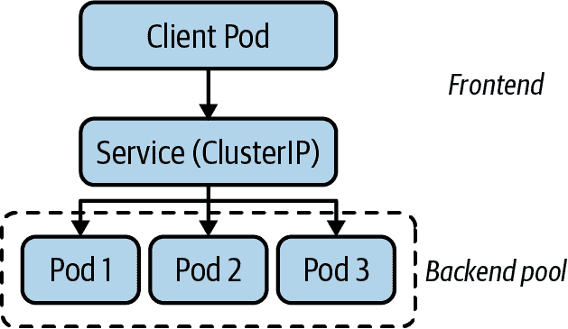

###### 图 6-1\. 服务具有前端和后端池。前端是 ClusterIP，而后端是一组 Pod。

### 服务 IP 地址管理

正如我们在上一章讨论的那样，在部署 Kubernetes 时，您配置了两个 IP 地址范围。一方面，Pod IP 范围或 CIDR 块为集群中的每个 Pod 提供 IP 地址。另一方面，服务 CIDR 块为集群中的服务提供 IP 地址。这个 CIDR 是 Kubernetes 用来为服务分配 ClusterIP 的范围。

API 服务器处理 Kubernetes 服务的 IP 地址管理（IPAM）。创建服务时，API 服务器（借助 etcd 的帮助）从服务 CIDR 块中分配一个 IP 地址，并将其写入服务的 ClusterIP 字段。

创建服务时，您还可以在服务规范中指定 ClusterIP。在这种情况下，API 服务器确保所请求的 IP 地址可用，并在服务 CIDR 块内。话虽如此，显式设置 ClusterIP 是一种反模式。

### Service 资源

服务资源包含给定服务的配置，包括名称、类型、端口等。示例 6-1 是其 YAML 表示中命名为 `nginx` 的示例服务定义。

##### 示例 6-1\. 在 ClusterIP 上公开 NGINX 的服务定义

```
apiVersion: v1
kind: Service
metadata:
  name: nginx
spec:
  selector: 
    app: nginx
  ports: 
    - protocol: TCP 
      port: 80 
      targetPort: 8080 
  clusterIP: 172.21.219.227 
  type: ClusterIP
```


Pod 选择器。Kubernetes 使用此选择器查找属于此服务的 Pod。


可通过服务访问的端口。


Kubernetes 支持服务中的 TCP、UDP 和 SCTP 协议。


可以访问服务的端口。


后端 Pod 正在侦听的端口，这可以不同于服务暴露的端口（上面的`port`字段）。


Kubernetes 为该服务分配的 ClusterIP。

服务的 Pod 选择器确定属于该服务的 Pod。Pod 选择器是一组键/值对，Kubernetes 会将其与同一 Namespace 中的 Pod 进行匹配。如果一个 Pod 的标签中有相同的键/值对，Kubernetes 会将该 Pod 的 IP 地址添加到服务的后端池中。后端池的管理由 Endpoints 控制器通过 Endpoints 资源处理。我们稍后在本章节会详细讨论 Endpoints。

### 服务类型

到目前为止，我们主要讨论了默认的 ClusterIP 服务类型。Kubernetes 还提供了多种服务类型，除了 Cluster IP 外还提供了其他附加功能。在本节中，我们将讨论每种服务类型及其用途。

#### ClusterIP

我们在之前的章节中已经讨论过这种服务类型。回顾一下，ClusterIP 服务创建一个虚拟 IP 地址（VIP），由一个或多个 Pod 支持。通常，这个 VIP 仅对运行在集群内的工作负载可用。图 6-2 展示了一个 ClusterIP 服务。

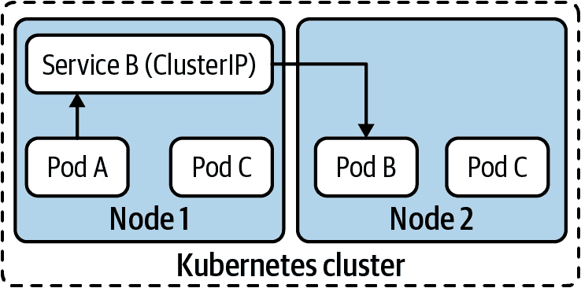

###### 图 6-2. ClusterIP 服务是一个虚拟 IP，可供集群内的工作负载访问。

#### NodePort

NodePort Service 在需要将服务暴露给集群外的网络客户端时非常有用，比如运行在虚拟机中的现有应用程序或 Web 应用程序的用户。

如其名称所示，NodePort 服务在所有集群节点上的一个端口上暴露服务。端口从可配置的端口范围中随机分配。一旦分配，集群中的所有节点都会监听该端口上的连接。图 6-3 展示了一个 NodePort 服务。

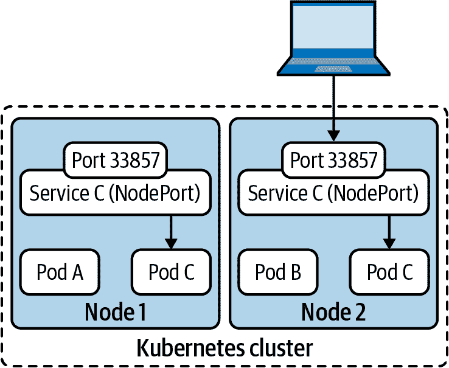

###### 图 6-3. NodePort 服务在所有集群节点上打开一个随机端口。集群外的客户端可以通过此端口访问服务。

NodePort 服务的主要挑战在于客户端需要知道服务的节点端口号以及至少一个集群节点的 IP 地址才能访问该服务。这是有问题的，因为节点可能会失败或从集群中移除。

解决这个挑战的一种常见方法是在 NodePort 服务前使用外部负载均衡器。通过这种方式，客户端不需要知道集群节点的 IP 地址或服务的端口号。相反，负载均衡器作为服务的单一入口点。

这种解决方案的缺点在于，您需要不断管理外部负载均衡器并更新其配置。开发人员创建了新的 NodePort 服务？那就创建一个新的负载均衡器。您在集群中添加了新节点？那就将新节点添加到所有负载均衡器的后端池中。

在大多数情况下，使用 NodePort 服务都有更好的替代方案。LoadBalancer 服务就是其中之一，我们将在接下来讨论它。另一个选择是 Ingress 控制器，在本章后面的 “Ingress” 中我们将进一步探讨。

#### LoadBalancer

LoadBalancer 服务建立在 NodePort 服务基础之上，以解决部分问题。从本质上讲，LoadBalancer 服务在内部是一个 NodePort 服务。然而，LoadBalancer 服务具有额外的功能，需要由控制器来满足。

控制器，也称为云提供商集成，负责自动将 NodePort 服务与外部负载均衡器连接起来。换句话说，控制器负责根据集群中 LoadBalancer 服务的配置创建、管理和配置外部负载均衡器。控制器通过与提供或配置负载均衡器的 API 进行交互来实现这一点。此交互在 Figure 6-4 中有所描述。

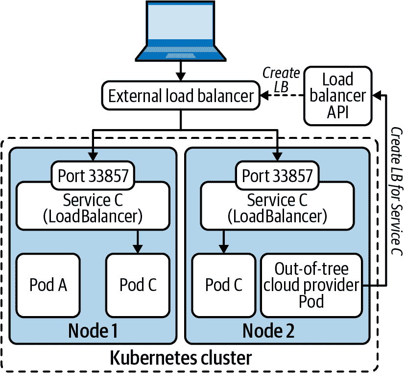

###### 图 6-4\. LoadBalancer 服务利用云提供商集成创建外部负载均衡器，将流量转发到节点端口。在节点级别上，该服务与 NodePort 相同。

Kubernetes 针对多个云提供商内置了控制器，包括 Amazon Web Services (AWS)、Google Cloud 和 Microsoft Azure。这些集成控制器通常被称为内树云提供商，因为它们是在 Kubernetes 源代码树内实现的。

随着 Kubernetes 项目的发展，出树云提供商作为内树提供商的替代方案出现了。出树提供商使得负载均衡器供应商能够提供其 LoadBalancer 服务控制循环的实现。目前，Kubernetes 同时支持内树和出树提供商。然而，鉴于内树提供商已被弃用，社区正在迅速采纳出树提供商。

#### ExternalName

ExternalName 服务类型不执行任何形式的负载均衡或代理。相反，ExternalName 服务主要是在集群 DNS 中实现的服务发现构造。ExternalName 服务将集群服务映射到一个 DNS 名称。由于没有涉及负载均衡，这种类型的服务缺乏 ClusterIP。

ExternalName 服务在不同场景中非常有用。 例如，分阶段的应用程序迁移工作可以从 ExternalName 服务中受益。 如果您将应用程序的某些组件迁移到 Kubernetes 并将一些依赖项保留在外部，则可以在完成迁移时使用 ExternalName 服务作为桥梁。 一旦整个应用程序迁移完成，您可以将服务类型更改为 ClusterIP，而无需更改应用程序部署。

虽然在创造性方式中非常有用，但 ExternalName 服务可能是使用最少的服务类型之一。

#### 无头服务

与 ExternalName 服务类似，无头服务类型不分配 ClusterIP 或提供任何负载平衡。 无头服务仅作为注册服务及其端点在 Kubernetes API 和集群 DNS 服务器中的一种方式。

当应用程序需要连接服务的特定副本或 Pod 时，无头服务非常有用。 这类应用程序可以使用服务发现找到服务背后所有 Pod 的 IP，然后建立到特定 Pod 的连接。

### 支持的通信协议

Kubernetes 服务支持一组特定的协议：TCP、UDP 和 SCTP。 在服务资源中列出的每个端口都指定了端口号和协议。 服务可以使用不同协议公开多个端口。 例如，以下代码片段显示了 kube-dns 服务的 YAML 定义。 请注意，端口列表包括 TCP 端口 53 和 UDP 端口 53：

```
apiVersion: v1
kind: Service
metadata:
  labels:
    k8s-app: kube-dns
    kubernetes.io/cluster-service: "true"
    kubernetes.io/name: KubeDNS
  name: kube-dns
  namespace: kube-system
spec:
  clusterIP: 10.96.0.10
  ports:
  - name: dns
    port: 53
    protocol: UDP
    targetPort: 53
  - name: dns-tcp
    port: 53
    protocol: TCP
    targetPort: 53
  - name: metrics
    port: 9153
    protocol: TCP
    targetPort: 9153
  selector:
    k8s-app: kube-dns
  type: ClusterIP
```

正如我们到目前为止讨论的那样，服务负载均衡流量跨越 Pod。 服务 API 资源代表负载均衡器的前端。 后端或在负载均衡器后面的 Pod 集合由 Endpoints 资源和控制器跟踪，接下来我们将讨论这些。

## 端点

Endpoints 资源是参与 Kubernetes 服务实现的另一个 API 对象。 每个服务资源都有一个相应的 Endpoints 资源。 如果您回忆起负载均衡器的类比，可以将 Endpoints 对象视为接收流量的 IP 地址池。 图 6-5 显示了服务与端点之间的关系。

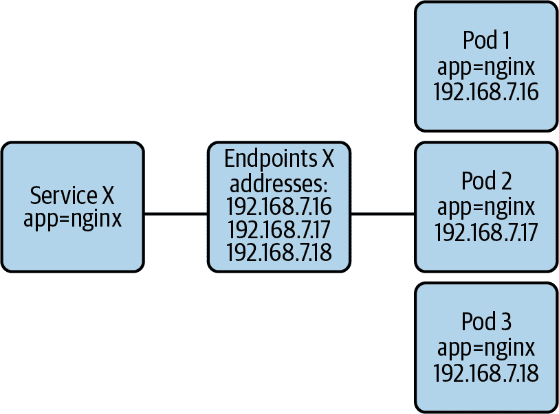

###### 图 6-5. 服务和端点资源之间的关系。

### Endpoints 资源

例如，示例 6-1 中 nginx 服务的 Endpoints 资源可能如下所示（已删除一些无关字段）：

```
apiVersion: v1
kind: Endpoints
metadata:
  labels:
    run: nginx
  name: nginx
  namespace: default
subsets:
- addresses:
  - ip: 10.244.0.10
    nodeName: kube03
    targetRef:
      kind: Pod
      name: nginx-76df748b9-gblnn
      namespace: default
  - ip: 10.244.0.9
    nodeName: kube04
    targetRef:
      kind: Pod
      name: nginx-76df748b9-gb7wl
      namespace: default
  ports:
  - port: 8080
    protocol: TCP
```

在本例中，有两个支持 nginx 服务的 Pod。 发送到 nginx ClusterIP 的网络流量在这两个 Pod 之间进行负载平衡。 还要注意端口为 8080 而不是 80。 此端口与服务中指定的 targetPort 字段匹配。 这是后端 Pod 正在侦听的端口。

### 端点控制器

关于 Endpoints 资源的一个有趣之处是，在创建 Service 时，Kubernetes 会自动创建它。这在你通常与之交互的其他 API 资源中略有不同。

Endpoints 控制器负责创建和维护 Endpoints 对象。每当创建一个 Service 时，Endpoints 控制器都会创建相应的 Endpoints 资源。更重要的是，它还根据需要更新 Endpoints 对象中的 IP 列表。

控制器使用 Service 的 Pod 选择器来查找属于该 Service 的 Pod。一旦获取了一组 Pod，控制器就会获取 Pod 的 IP 地址，并相应地更新 Endpoints 资源。

Endpoints 资源中的地址可以分为两组：(ready) addresses 和 notReadyAddresses。Endpoints 控制器通过检查对应 Pod 的 Ready 条件来确定地址是否准备就绪。而 Pod 的 Ready 条件又取决于多个因素。例如，其中一个因素是 Pod 是否已调度。如果 Pod 处于挂起状态（未调度），其 Ready 条件为 false。最终，只有在 Pod 正在运行并通过其就绪探针时，它才被认为是准备就绪的。

### Pod 的就绪状态和就绪探针

在前一节中，我们讨论了 Endpoints 控制器如何确定 Pod IP 地址是否准备好接收流量。但 Kubernetes 如何知道 Pod 是否准备好？

Kubernetes 使用两种互补的方法来确定 Pod 的就绪状态：

平台信息

Kubernetes 管理的工作负载信息丰富。例如，系统知道 Pod 是否成功调度到节点上。它还知道 Pod 的容器是否正在运行。

就绪探针

开发人员可以在其工作负载上配置就绪探针。设置后，kubelet 定期探测工作负载，以确定其是否准备好接收流量。相比基于平台信息确定就绪状态，通过探测 Pod 就绪更为强大，因为探针可以检查应用程序特定的问题。例如，探针可以检查应用程序的内部初始化过程是否已完成。

就绪探针至关重要。没有它们，集群可能会将流量路由到可能无法处理的工作负载，导致应用程序错误和终端用户的不满。确保您在部署到 Kubernetes 的应用程序中始终定义就绪探针。在第十四章中，我们将进一步讨论就绪探针。

### EndpointSlices 资源

EndpointSlices 资源是 Kubernetes v1.16 中的一项优化。它解决了在[大型集群部署](https://oreil.ly/H8rHC)中可能出现的 Endpoints 资源的可伸缩性问题。让我们来看看这些问题，并探讨 EndpointSlices 是如何帮助解决的。

要实现服务并使其可路由，集群中的每个节点都会监视 Endpoints API 并订阅变化。每当 Endpoints 资源更新时，必须将其传播到集群中的所有节点才能生效。扩展事件是一个很好的例子。每当 Endpoints 资源中的 Pod 集合发生变化时，API 服务器会将整个更新后的对象发送到所有集群节点。

由于多种原因，这种处理 Endpoints API 的方法在较大的集群中效果不佳：

+   大型集群包含许多节点。集群中的节点越多，当 Endpoints 对象发生变化时，需要发送的更新就越多。

+   集群越大，您可以托管的 Pod（和服务）就越多。随着 Pod 数量的增加，Endpoints 资源更新的频率也增加。

+   随着服务中属于的 Pod 数量增加，Endpoints 资源的大小也会增加。较大的 Endpoints 对象需要更多的网络和存储资源。

EndpointSlices 资源通过将端点集合分割到多个资源中来修复这些问题。Kubernetes 不再将所有 Pod IP 地址放在单个 Endpoints 资源中，而是将地址分布在各种 EndpointSlice 对象中。默认情况下，EndpointSlice 对象仅限于 100 个端点。

让我们探讨一个场景，以更好地理解 EndpointSlices 的影响。假设一个具有 10,000 个端点的服务，这将导致 100 个 EndpointSlice 对象。如果移除其中一个端点（例如由于规模缩小事件），API 服务器会将受影响的 EndpointSlice 对象发送到每个节点。将具有 100 个端点的单个 EndpointSlice 发送要比将具有数千个端点的单个 Endpoints 资源效率高得多。

总之，EndpointSlices 资源通过将大量的端点分割为一组 EndpointSlice 对象来改进 Kubernetes 的可扩展性。如果您运行的平台具有数百个端点的服务，您可能会从 EndpointSlice 的改进中受益。根据您的 Kubernetes 版本，EndpointSlice 功能是可选的。如果您运行的是 Kubernetes v1.18，您必须在 kube-proxy 中设置一个功能标志才能启用 EndpointSlice 资源的使用。从 Kubernetes v1.19 开始，默认情况下将启用 EndpointSlice 功能。

## 服务实施详细信息

到目前为止，我们已经讨论了 Kubernetes 集群中的服务、Endpoints 及其提供的功能。但是 Kubernetes 如何实现服务？它是如何工作的？

在本节中，我们将讨论在 Kubernetes 中实现服务时可用的不同方法。首先，我们将讨论整体的 kube-proxy 架构。接下来，我们将审查不同的 kube-proxy 数据平面模式。最后，我们将讨论 kube-proxy 的替代方案，如能够接管 kube-proxy 职责的 CNI 插件。

### Kube-proxy

Kube-proxy 是在每个集群节点上运行的代理程序。它的主要责任是通过监视 API 服务器的 Services 和 Endpoints，并编程 Linux 网络堆栈（例如使用 iptables）来处理数据包，从而使 Services 对运行在本地节点上的 Pods 可用。

###### 注意

在历史上，kube-proxy 充当节点上运行的 Pods 与 Services 之间的网络代理。这也是 kube-proxy 名称的由来。然而，随着 Kubernetes 项目的发展，kube-proxy 不再充当代理，而是更多地成为节点代理或本地化控制平面。

Kube-proxy 支持三种操作模式：userspace、iptables 和 IPVS。由于 iptables 和 IPVS 更优，所以用户空间代理模式很少使用。因此，我们只会在本章的后续部分涵盖 iptables 和 IPVS 模式。

### Kube-proxy：iptables 模式

在撰写本文时（Kubernetes v1.18），iptables 模式是默认的 kube-proxy 模式。可以肯定地说，iptables 模式是当前集群安装中最普遍的模式。

在 iptables 模式下，kube-proxy 利用 iptables 的网络地址转换 (NAT) 功能。

#### ClusterIP Services

为了实现 ClusterIP Services，kube-proxy 编程 Linux 内核的 NAT 表以对目标为 Services 的数据包执行目标地址 NAT (DNAT)。DNAT 规则将数据包的目标 IP 地址替换为 Service 端点的 IP 地址（Pod 的 IP 地址）。替换后，网络处理该数据包，就像它最初发送到 Pod 一样。

为了在多个 Service 端点之间负载均衡流量，kube-proxy 使用多个 iptables 链：

Services chain

包含每个 Service 规则的顶级链。每个规则检查数据包的目标 IP 是否与 Service 的 ClusterIP 匹配。如果匹配，则将数据包发送到特定于 Service 的链。

特定于 Service 的链

每个 Service 都有自己的 iptables 链。此链包含每个 Service 端点的规则。每个规则使用 `statistic` iptables 扩展随机选择一个目标端点。每个端点被选中的概率为 1/n，其中 n 是端点的数量。一旦选择了端点，数据包就会被发送到 Service 端点链。

Service 端点链

每个 Service 端点都有一个执行 DNAT 的 iptables 链。

下面列出的 iptables 规则示例显示了一个 ClusterIP Service 的示例。该 Service 名为 `nginx`，有三个端点（为简洁起见，删除了多余的 iptables 规则）：

```
$ iptables --list --table nat
Chain KUBE-SERVICES (2 references) 
target     prot opt source destination
KUBE-MARK-MASQ  tcp  -- !10.244.0.0/16        10.97.85.96
    /* default/nginx: cluster IP */ tcp dpt:80
KUBE-SVC-4N57TFCL4MD7ZTDA  tcp  --  anywhere             10.97.85.96
    /* default/nginx: cluster IP */ tcp dpt:80
KUBE-NODEPORTS  all  --  anywhere             anywhere
    /* kubernetes service nodeports; NOTE: this must be the last rule in
    this chain */ ADDRTYPE match dst-type LOCAL

Chain KUBE-SVC-4N57TFCL4MD7ZTDA (1 references) 
target     prot opt source destination
KUBE-SEP-VUJFIIOGYVVPH7Q4  all  --  anywhere    anywhere    /* default/nginx: */
    statistic mode random probability 0.33333333349
KUBE-SEP-Y42457KCQHG7FFWI  all  --  anywhere    anywhere    /* default/nginx: */
    statistic mode random probability 0.50000000000
KUBE-SEP-UOUQBAIW4Z676WKH  all  --  anywhere    anywhere    /* default/nginx: */

Chain KUBE-SEP-UOUQBAIW4Z676WKH (1 references)  
target     prot opt source destination
KUBE-MARK-MASQ  all  --  10.244.0.8    anywhere             /* default/nginx: */
DNAT       tcp  --  anywhere           anywhere             /* default/nginx: */
    tcp to:10.244.0.8:80

Chain KUBE-SEP-VUJFIIOGYVVPH7Q4 (1 references)
target     prot opt source destination
KUBE-MARK-MASQ  all  --  10.244.0.108    anywhere           /* default/nginx: */
DNAT       tcp  --  anywhere             anywhere           /* default/nginx: */
    tcp to:10.244.0.108:80

Chain KUBE-SEP-Y42457KCQHG7FFWI (1 references)
target     prot opt source destination
KUBE-MARK-MASQ  all  --  10.244.0.6           anywhere     /* default/nginx: */
DNAT       tcp  --  anywhere             anywhere          /* default/nginx: */
    tcp to:10.244.0.6:80
```


这是顶级链。它包含集群中所有 Services 的规则。请注意，`KUBE-SVC-4N57TFCL4MD7ZTDA` 规则指定目标 IP 为 10.97.85.96。这是 `nginx` Service 的 ClusterIP。


这是 `nginx` Service 的链。请注意，每个 Service 端点都有一个匹配规则的概率。


这条链路对应于一个服务端点（SEP 代表服务端点）。该链路中的最后一条规则执行 DNAT，将数据包转发到端点（或 Pod）。

#### NodePort 和 LoadBalancer 服务

在使用 NodePort 和 LoadBalancer 服务时，kube-proxy 配置 iptables 规则类似于用于 ClusterIP 服务的规则。主要区别在于规则基于它们的目标端口号匹配数据包。如果匹配，则规则将数据包发送到服务特定的链路，其中进行 DNAT。下面的片段显示了 NodePort 服务`nginx`监听端口 31767 的 iptables 规则。

```
$ iptables --list --table nat
Chain KUBE-NODEPORTS (1 references) 
target     prot opt source destination
KUBE-MARK-MASQ  tcp  --  anywhere             anywhere      /* default/nginx: */
    tcp dpt:31767
KUBE-SVC-4N57TFCL4MD7ZTDA  tcp  --  anywhere     anywhere   /* default/nginx: */
    tcp dpt:31767 
```


Kube-proxy 为 NodePort 服务在`KUBE-NODEPORTS`链中编程 iptables 规则。


如果数据包的目标端口是`tcp: 31767`，则将其发送到服务特定的链路。这个链路是我们在前一个代码片段的 callout 2 中看到的服务特定的链路。

除了编程 iptables 规则外，kube-proxy 还打开分配给 NodePort 服务的端口并保持其开放。从路由的角度来看，保持端口开放没有实际功能，它只是阻止其他进程声明该端口。

使用 NodePort 和 LoadBalancer 服务时需要考虑的一个关键因素是服务的外部流量策略设置。外部流量策略确定服务是否将外部流量路由到节点本地端点（`externalTrafficPolicy: Local`）或整个集群范围的端点（`externalTrafficPolicy: Cluster`）。每种策略都有其优点和权衡，接下来会讨论。

当策略设置为`Local`时，服务将流量路由到运行在接收流量的节点上的端点（Pods）。路由到本地端点有两个重要的好处。首先，没有涉及 SNAT，因此源 IP 被保留，可供工作负载使用。其次，在将流量转发到另一个节点时，没有额外的网络跳跃。话虽如此，`Local`策略也有缺点。主要是，到达缺少服务端点的节点的流量会被丢弃。因此，通常将`Local`策略与对节点进行健康检查的外部负载均衡器结合使用。当节点没有服务端点时，负载均衡器不会将流量发送到该节点，因为健康检查失败。图 6-6 (#loadbalancer_service_with_local_external_traffic_policy) 说明了此功能。`Local`策略的另一个缺点是可能导致应用负载不平衡。例如，如果一个节点有三个服务端点，则每个端点接收到 33%的流量。如果另一个节点只有一个端点，则它接收到 100%的流量。可以通过使用反亲和性规则扩展 Pods 或使用 DaemonSet 来调度 Pods 来减轻这种不平衡。

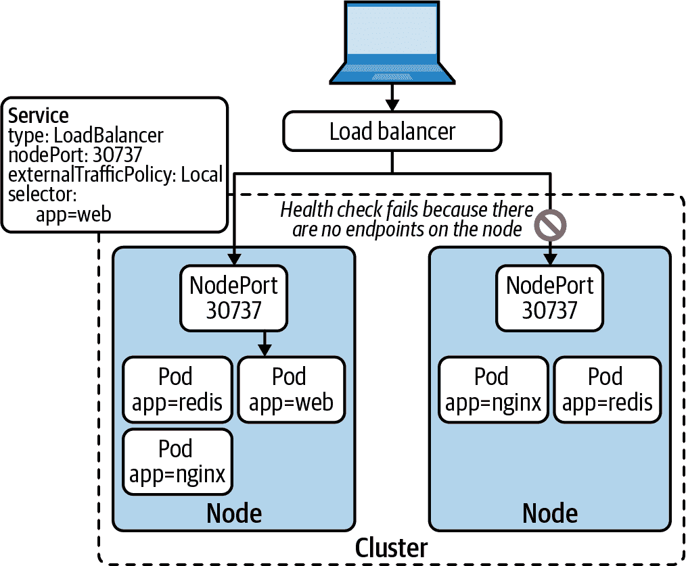

###### 图 6-6\. 使用 `Local` 外部流量策略的负载均衡服务。外部负载均衡器对节点运行健康检查。任何没有服务端点的节点都将从负载均衡器的后端池中移除。

如果您有一个处理大量外部流量的服务，通常使用 `Local` 外部流量策略是正确的选择。但是，如果没有可用的负载均衡器，应使用 `Cluster` 外部流量策略。使用此策略，流量将在集群中的所有端点间进行负载均衡，如 图 6-7 所示。可以想象，负载均衡会导致源 IP 的丢失（由于 SNAT）。它还可能导致额外的网络跳跃。但是，`Cluster` 策略不会丢弃外部流量，无论端点 Pod 运行在何处。

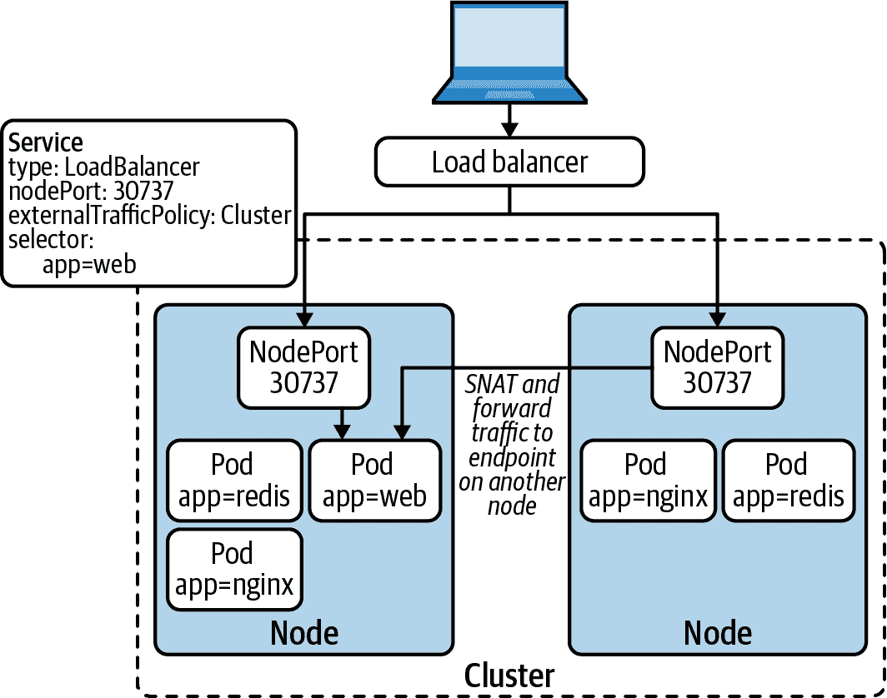

###### 图 6-7\. 使用 `Cluster` 外部流量策略的负载均衡服务。没有本地端点的节点将流量转发到另一节点上的端点。

#### 连接跟踪（conntrack）

当内核的网络堆栈对要发送到服务的数据包执行目的地址转换（DNAT）时，会向连接跟踪（conntrack）表中添加一个条目。该表跟踪执行的转换，以便对发送到同一服务的任何额外数据包应用相同的转换。该表还用于在将响应数据包发送到源 Pod 之前移除响应数据包中的 NAT。

表中的每个条目将预转换协议、源 IP、源端口、目的 IP 和目的端口映射到后转换协议、源 IP、源端口、目的 IP 和目的端口。（条目包含其他信息，但在此上下文中不相关。）图 6-8 描述了一个跟踪从 Pod (`192.168.0.9`) 到服务 (`10.96.0.14`) 的连接的表条目。注意 DNAT 后目的 IP 和端口的变化。

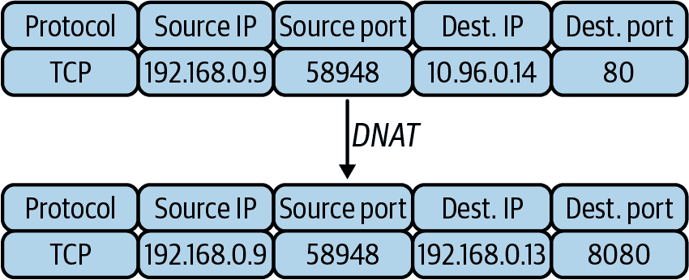

###### 图 6-8\. 跟踪连接（conntrack）表条目，跟踪来自 Pod (`192.168.0.9`) 到服务 (`10.96.0.14`) 的连接。

###### 提示

当连接跟踪表填满时，内核开始丢弃或拒绝连接，这可能对某些应用程序造成问题。如果您正在运行处理大量连接的工作负载，并且注意到连接问题，可能需要调整节点上连接跟踪表的最大大小。更重要的是，应当监视连接跟踪表的使用情况，并在表接近填满时发出警报。

#### 掩码（Masquerade）

您可能已经注意到我们在上一个示例中忽略了 `KUBE-MARK-MASQ` iptables 规则。这些规则适用于从集群外部到达节点的数据包。为了正确路由这些数据包，服务 fabric 需要在将其转发到另一个节点时对其进行伪装/源 NAT。否则，响应数据包将包含处理请求的 Pod 的 IP 地址。数据包中的 Pod IP 将导致连接问题，因为客户端发起连接到节点而不是 Pod。

Masquerading 也用于从集群中出口流量。当 Pod 连接到外部服务时，源 IP 必须是运行 Pod 的节点的 IP 地址，而不是 Pod 的 IP 地址。否则，网络会丢弃响应数据包，因为它们的目标 IP 地址将是 Pod 的 IP 地址。

#### 性能问题

iptables 模式至今已经在 Kubernetes 集群中发挥了重要作用，并继续如此。尽管如此，您应该注意某些性能和可扩展性限制，特别是在大型集群部署中可能会出现这些问题。

考虑到 iptables 规则的结构和工作方式，每当 Pod 向 Service 建立新连接时，初始数据包会遍历 iptables 规则，直到匹配其中之一。在最坏的情况下，数据包需要遍历整个 iptables 规则集。

当 iptables 模式处理数据包时，其时间复杂度为 O(n)。换句话说，iptables 模式的性能随着集群中服务数量的增加呈线性增长。随着服务数量的增加，连接到服务的性能变差。

或许更重要的是，对 iptables 规则的更新在大规模情况下也会受到影响。因为 iptables 规则不是增量的，kube-proxy 需要为每次更新写入整个表格。在某些情况下，这些更新甚至可能需要几分钟来完成，这会导致将流量发送到过时的端点。此外，kube-proxy 在这些更新期间需要保持 iptables 锁（`/run/xtables.lock`），这可能会与需要更新 iptables 规则的其他进程（例如 CNI 插件）发生争用。

线性扩展是任何系统的不良特性。尽管如此，根据 Kubernetes 社区的 [测试](https://oreil.ly/YJAu9) 结果，除非运行具有成千上万个服务的集群，否则您不应该注意到性能下降。然而，如果您在这种规模下操作，您可能会从 kube-proxy 的 IPVS 模式中受益，我们将在以下章节讨论。

### Kube-proxy：IP 虚拟服务器（IPVS）模式

IPVS 是嵌入到 Linux 内核中的负载均衡技术。Kubernetes 在 kube-proxy 中增加了对 IPVS 的支持，以解决 iptables 模式的可扩展性和性能问题。

正如前一节所讨论的，iptables 模式使用 iptables 规则来实现 Kubernetes 服务。这些 iptables 规则存储在列表中，在最坏的情况下，数据包需要完整遍历这些规则。IPVS 并不会遇到这个问题，因为它最初是为负载均衡场景设计的。

Linux 内核中的 IPVS 实现使用哈希表来查找数据包的目的地。当建立新连接时，IPVS 不会遍历服务列表，而是立即根据服务 IP 地址找到目标 Pod。

让我们讨论 IPVS 模式下的 kube-proxy 如何处理每种 Kubernetes 服务类型。

#### ClusterIP 服务

在处理具有 ClusterIP 的服务时，`ipvs` 模式下的 kube-proxy 会执行一些操作。首先，它将 ClusterIP 服务的 IP 地址添加到节点上称为 `kube-ipvs0` 的虚拟网络接口中，如以下片段所示：

```
$ ip address show dev kube-ipvs0
28: kube-ipvs0: <BROADCAST,NOARP> mtu 1500 qdisc noop state DOWN group default
    link/ether 96:96:1b:36:32:de brd ff:ff:ff:ff:ff:ff
    inet 10.110.34.183/32 brd 10.110.34.183 scope global kube-ipvs0
       valid_lft forever preferred_lft forever
    inet 10.96.0.10/32 brd 10.96.0.10 scope global kube-ipvs0
       valid_lft forever preferred_lft forever
    inet 10.96.0.1/32 brd 10.96.0.1 scope global kube-ipvs0
       valid_lft forever preferred_lft forever
```

更新虚拟接口后，kube-proxy 使用 ClusterIP 服务的 IP 地址创建一个 IPVS 虚拟服务。最后，对于每个服务端点，它将一个 IPVS 真实服务器添加到 IPVS 虚拟服务中。以下片段显示了具有三个端点的 ClusterIP 服务的 IPVS 虚拟服务和真实服务器：

```
$ ipvsadm --list --numeric --tcp-service 10.110.34.183:80
Prot LocalAddress:Port Scheduler Flags
  -> RemoteAddress:Port           Forward Weight ActiveConn InActConn
TCP  10.110.34.183:80 rr 
  -> 192.168.89.153:80            Masq    1      0          0 
  -> 192.168.89.154:80            Masq    1      0          0
  -> 192.168.89.155:80            Masq    1      0          0
```


这是 IPVS 虚拟服务。其 IP 地址是 ClusterIP Service 的 IP 地址。


这是 IPVS 的一个真实服务器之一。它对应于服务端点（Pod）之一。

#### NodePort 和 LoadBalancer 服务

对于 NodePort 和 LoadBalancer 服务，kube-proxy 为服务的集群 IP 创建一个 IPVS 虚拟服务。Kube-proxy 还为每个节点的 IP 地址和回环地址创建一个 IPVS 虚拟服务。例如，以下片段显示了监听 TCP 端口 30737 的 NodePort 服务所创建的 IPVS 虚拟服务清单：

```
ipvsadm --list --numeric
IP Virtual Server version 1.2.1 (size=4096)
Prot LocalAddress:Port Scheduler Flags
  -> RemoteAddress:Port           Forward Weight ActiveConn InActConn
TCP  10.0.99.67:30737 rr 
  -> 192.168.89.153:80            Masq    1      0          0
  -> 192.168.89.154:80            Masq    1      0          0
  -> 192.168.89.155:80            Masq    1      0          0
TCP  10.110.34.183:80 rr 
  -> 192.168.89.153:80            Masq    1      0          0
  -> 192.168.89.154:80            Masq    1      0          0
  -> 192.168.89.155:80            Masq    1      0          0
TCP  127.0.0.1:30737 rr 
  -> 192.168.89.153:80            Masq    1      0          0
  -> 192.168.89.154:80            Masq    1      0          0
  -> 192.168.89.155:80            Masq    1      0          0
TCP  192.168.246.64:30737 rr 
  -> 192.168.89.153:80            Masq    1      0          0
  -> 192.168.89.154:80            Masq    1      0          0
  -> 192.168.89.155:80            Masq    1      0          0
```


IPVS 虚拟服务监听在节点的 IP 地址上。


IPVS 虚拟服务监听在服务的 ClusterIP 地址上。


IPVS 虚拟服务监听在 `localhost` 上。


IPVS 虚拟服务监听在节点的第二网络接口上。

### 在没有 kube-proxy 的情况下运行

历史上，kube-proxy 是所有 Kubernetes 部署的一个重要组件。它是使 Kubernetes 服务正常工作的关键组成部分。然而，随着社区的发展，我们可能开始看到一些不运行 kube-proxy 的 Kubernetes 部署。这是如何实现的？谁来处理服务？

随着扩展的伯克利数据包过滤器（eBPF）的出现，诸如 [Cilium](https://oreil.ly/sWoh5) 和 [Calico](https://oreil.ly/0jrKG) 等 CNI 插件可以吸收 kube-proxy 的职责。这些 CNI 插件不再使用 iptables 或 IPVS 处理服务，而是直接将服务编程到 Pod 网络数据平面中。使用 eBPF 可以提高 Kubernetes 中服务的性能和可扩展性，因为 eBPF 实现使用哈希表进行端点查找。它还改进了服务更新处理，因为它能够高效地处理单个服务的更新。

消除 kube-proxy 的需求并优化服务路由是一个值得称道的成就，尤其是对于大规模操作的用户。然而，在生产环境中运行这些解决方案仍处于早期阶段。例如，Cilium 实现要求较新的内核版本来支持无 kube-proxy 的部署（在撰写本文时，最新的 Cilium 版本是 `v1.8`）。同样，Calico 团队不鼓励在生产环境中使用 eBPF，因为它仍处于技术预览阶段（在撰写本文时，最新的 Calico 版本是 `v3.15.1`）。随着时间的推移，我们预计 kube-proxy 的替代方案会变得更加普遍。Cilium 甚至支持在其他 CNI 插件旁边运行其代理替代功能（称为 [CNI chaining](https://oreil.ly/jZ-2r)）。

## 服务发现

服务发现提供了一种机制，使应用程序能够发现网络上可用的服务。虽然不是 *路由* 关注的内容，但服务发现与 Kubernetes 服务密切相关。

平台团队可能会疑惑是否需要在集群中引入专用的服务发现系统，例如 Consul。虽然这是可能的，但通常是不必要的，因为 Kubernetes 为运行在集群中的所有工作负载提供了服务发现。在本节中，我们将讨论 Kubernetes 中可用的不同服务发现机制：基于 DNS 的服务发现、基于 API 的服务发现和基于环境变量的服务发现。

### 使用 DNS

Kubernetes 为运行在集群内部的工作负载提供了基于 DNS 的服务发现。符合规范的 Kubernetes 部署运行一个与 Kubernetes API 集成的 DNS 服务器。今天最常用的 DNS 服务器是 [CoreDNS](https://coredns.io)，这是一个开源的、可扩展的 DNS 服务器。

CoreDNS 在 Kubernetes API 服务器中监视资源。对于每个 Kubernetes 服务，CoreDNS 创建具有以下格式的 DNS 记录：`<service-name>.<namespace-name>.svc.cluster.local`。例如，名为 `nginx` 的服务在 `default` 命名空间中将获得 DNS 记录 `nginx.default.svc.cluster.local`。但是 Pod 如何使用这些 DNS 记录？

为了启用基于 DNS 的服务发现，Kubernetes 为 Pod 配置 CoreDNS 作为 DNS 解析器。在设置 Pod 的沙盒时，kubelet 会将 */etc/resolv.conf* 写入容器中，指定 CoreDNS 作为命名服务器，并将配置文件注入容器中。Pod 的 */etc/resolv.conf* 文件如下所示：

```
$ cat /etc/resolv.conf
search default.svc.cluster.local svc.cluster.local cluster.local
nameserver 10.96.0.10
options ndots:5
```

根据这个配置，Pod 在尝试按名称连接到服务时会向 CoreDNS 发送 DNS 查询。

解析器配置中另一个有趣的技巧是使用 `ndots` 和 `search` 简化 DNS 查询。当 Pod 想要连接同一命名空间中存在的服务时，可以将服务的名称用作域名，而不是完全限定域名（`nginx.default.svc.cluster.local`）：

```
$ nslookup nginx
Server:		10.96.0.10
Address:	10.96.0.10#53

Name:	nginx.default.svc.cluster.local
Address: 10.110.34.183
```

同样，当 Pod 想要连接另一个命名空间中的服务时，可以通过将命名空间名称附加到服务名称来实现：

```
$ nslookup nginx.default
Server:		10.96.0.10
Address:	10.96.0.10#53

Name:	nginx.default.svc.cluster.local
Address: 10.110.34.183
```

考虑 `ndots` 配置对与集群外部服务通信的应用程序的影响。`ndots` 参数指定域名中必须出现多少个点号才能被视为绝对或完全限定名称。当解析非完全限定名称时，系统会使用 `search` 参数中的条目进行多次查找，如下例所示。因此，当应用程序解析非完全限定的集群外部名称时，解析器会在尝试将名称解析为绝对名称之前向集群 DNS 服务器发出多个无用的请求。为了避免此问题，可以通过在应用程序中添加 `.` 结尾的完全限定域名来使用完全限定域名。另外，您还可以通过 Pod 规范中的 `dnsConfig` 字段调整 Pod 的 DNS 配置。

下面的代码片段展示了 `ndots` 配置对解析外部名称的 Pod 的影响。请注意，在解析少于配置的 `ndots` 的点数的名称时，会导致多次 DNS 查询，而解析绝对名称则只产生单个查询：

```
$ nslookup -type=A google.com -debug | grep QUESTIONS -A1 
  QUESTIONS:
google.com.default.svc.cluster.local, type = A, class = IN
--
  QUESTIONS:
google.com.svc.cluster.local, type = A, class = IN
--
  QUESTIONS:
google.com.cluster.local, type = A, class = IN
--
  QUESTIONS:
google.com, type = A, class = IN

$ nslookup -type=A -debug google.com. | grep QUESTIONS -A1 
  QUESTIONS:
google.com, type = A, class = IN
```


尝试解析少于 5 个点的名称（非完全限定）。解析器执行多次查找，每个查找项在 */etc/resolv.conf* 的 `search` 字段中。


尝试解析完全限定名称。解析器执行单次查找。

总体而言，通过 DNS 进行服务发现非常有用，因为它降低了应用程序与 Kubernetes 服务交互的障碍。

### 使用 Kubernetes API

Kubernetes 中发现服务的另一种方法是使用 Kubernetes API。社区维护着不同语言的各种 Kubernetes 客户端库，包括 Go、Java、Python 等。一些应用程序框架（如 Spring）也通过 Kubernetes API 支持服务发现。

在特定情况下，使用 Kubernetes API 进行服务发现非常有用。例如，如果您的应用程序需要在服务端点更改时立即知道，它们将从监视 API 中受益。

通过 Kubernetes API 执行服务发现的主要缺点是将应用程序紧密耦合到底层平台。理想情况下，应用程序应该不了解平台的存在。如果选择使用 Kubernetes API 进行服务发现，请考虑构建一个接口，将 Kubernetes 的详细信息从业务逻辑中抽象出来。

### 使用环境变量

Kubernetes 将环境变量注入到 Pod 中以促进服务发现。对于每个 Service，Kubernetes 根据 Service 的定义设置多个环境变量。例如，监听端口 80 的 `nginx` ClusterIP Service 的环境变量如下：

```
NGINX_PORT_80_TCP_PORT=80
NGINX_SERVICE_HOST=10.110.34.183
NGINX_PORT=tcp://10.110.34.183:80
NGINX_PORT_80_TCP=tcp://10.110.34.183:80
NGINX_PORT_80_TCP_PROTO=tcp
NGINX_SERVICE_PORT=80
NGINX_PORT_80_TCP_ADDR=10.110.34.183
```

此方法的缺点是环境变量无法在不重启 Pod 的情况下更新。因此，必须在 Pod 启动之前准备好服务。

## DNS 服务性能

如前所述，在您的平台上为工作负载提供基于 DNS 的服务发现非常重要。随着集群规模和应用程序数量的增长，DNS 服务可能成为瓶颈。在本节中，我们将讨论您可以使用的技术，以提供高性能的 DNS 服务。

### 每个节点上的 DNS 缓存

Kubernetes 社区维护名为 [NodeLocal DNSCache](https://oreil.ly/lQdTH) 的 DNS 缓存插件。该插件在每个节点上运行 DNS 缓存，以解决多个问题。首先，缓存减少了 DNS 查询的延迟，因为工作负载可以从本地缓存中获取答案（假设命中缓存），而不是向 DNS 服务器请求（可能在另一个节点上）。其次，由于大部分时间工作负载使用缓存，CoreDNS 服务器的负载减少了。最后，在缓存未命中的情况下，本地 DNS 缓存在向中央 DNS 服务发出 DNS 查询时将其升级为 TCP。使用 TCP 而不是 UDP 提高了 DNS 查询的可靠性。

DNS 缓存作为 DaemonSet 在集群中运行。每个 DNS 缓存副本拦截其节点上发起的 DNS 查询。无需更改应用程序代码或配置即可使用该缓存。NodeLocal DNSCache 插件的节点级架构如 图 6-9 所示。

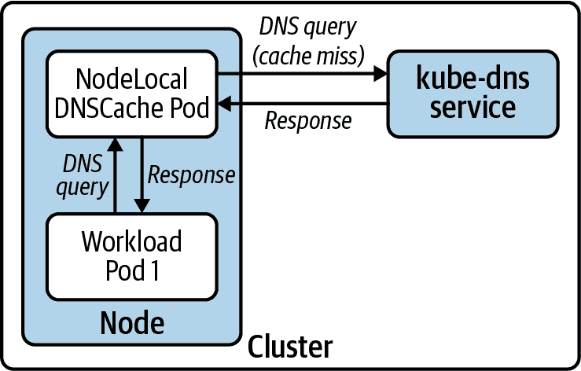

###### 图 6-9\. NodeLocal DNSCache 插件的节点级架构。DNS 缓存拦截 DNS 查询，并在有缓存命中时立即响应。在缓存未命中的情况下，DNS 缓存将查询转发给集群 DNS 服务。

### 自动扩展 DNS 服务器部署

除了在集群中运行节点本地 DNS 缓存外，您还可以根据集群的大小自动调整 DNS 部署。请注意，此策略不利用水平 Pod 自动缩放器。相反，它使用[集群比例自动缩放器](https://oreil.ly/432we)，根据集群中的节点数量来调整工作负载。

集群比例自动缩放器作为一个 Pod 在集群中运行。它有一个配置标志来设置需要自动缩放的工作负载。要自动缩放 DNS，必须将目标标志设置为 CoreDNS（或 kube-dns）部署。一旦运行，自动缩放器每 10 秒（默认）轮询 API 服务器以获取集群中节点和 CPU 核心的数量。然后，如果需要，它会调整 CoreDNS 部署的副本数。所需的副本数由可配置的副本-节点比率或副本-核心比率控制。要使用的比率取决于您的工作负载及其对 DNS 的需求程度。

在大多数情况下，使用节点本地 DNS 缓存足以提供可靠的 DNS 服务。但是，当自动缩放具有足够范围的最小和最大节点的集群时，自动缩放 DNS 是另一种可用的策略。

# Ingress

正如我们在第五章中讨论的那样，运行在 Kubernetes 中的工作负载通常无法从集群外访问。如果您的应用程序没有外部客户端，则这不是问题。批处理工作负载是这类应用程序的一个很好的例子。然而，现实情况是，大多数 Kubernetes 部署托管具有端用户的 Web 服务。

Ingress 是将运行在 Kubernetes 中的服务暴露给集群外客户端的一种方法。尽管 Kubernetes 默认不支持 Ingress API，但它是任何基于 Kubernetes 的平台的标配。通常情况下，现成的 Kubernetes 应用程序和集群附加组件都期望在集群中运行 Ingress 控制器。此外，您的开发人员需要它来成功地在 Kubernetes 中运行其应用程序。

本节旨在指导您在平台中实现 Ingress 时必须考虑的因素。我们将审查 Ingress API、您将遇到的最常见的 Ingress 流量模式以及在基于 Kubernetes 的平台中 Ingress 控制器的关键角色。我们还将讨论不同的部署 Ingress 控制器的方法及其权衡。最后，我们将解决您可能遇到的常见挑战，并探讨与生态系统中其他工具的有益集成。

## Ingress 的案例

Kubernetes 服务已经提供了将流量路由到 Pod 的方法，那么为什么还需要额外的策略来实现相同的功能呢？尽管我们喜欢保持平台简单，但事实是服务存在重要的限制和缺点：

有限的路由能力

服务根据传入请求的目标 IP 和端口路由流量。这对于小型和相对简单的应用程序可能很有用，但对于更大规模的基于微服务的应用程序，这种方法很快就会失效。这些类型的应用程序需要更智能的路由功能和其他高级能力。

成本

如果您在云环境中运行，集群中每个 LoadBalancer 服务都会创建一个外部负载均衡器，例如 AWS 中的 ELB。为平台中每个服务运行单独的负载均衡器可能很快变得成本高昂。

Ingress 解决了这些限制。不再局限于 OSI 模型的第 3/4 层负载均衡，Ingress 在第 7 层提供负载均衡和路由功能。换句话说，Ingress 在应用层操作，这导致了更先进的路由特性。

Ingress 的另一个好处是无需多个负载均衡器或平台入口点。由于 Ingress 提供的先进路由能力，例如根据 `Host` 头部路由 HTTP 请求的能力，您可以将所有服务流量路由到单一入口点，并让 Ingress 控制器处理流量的复用。这极大地降低了将流量引入您的平台的成本。

平台只需一个入口点，也减少了非云部署的复杂性。不再需要管理多个带有大量 NodePort 服务的外部负载均衡器，只需操作一个外部负载均衡器即可将流量路由到 Ingress 控制器。

尽管 Ingress 解决了与 Kubernetes 服务相关的大部分问题，但后者仍然是必需的。Ingress 控制器本身运行在平台内部，因此需要暴露给存在于外部的客户端。您可以使用 Service（无论是 NodePort 还是 LoadBalancer）来实现。此外，大多数 Ingress 控制器在处理 HTTP 流量时表现出色。如果想要能够托管使用其他协议的应用程序，可能需要根据 Ingress 控制器的功能来决定是否同时使用 Service。

## Ingress API

Ingress API 允许应用团队公开其服务，并根据其需求配置请求路由。由于 Ingress 主要关注 HTTP 路由，因此 Ingress API 资源提供了根据传入 HTTP 请求属性路由流量的不同方法。

一种常见的路由技术是根据 HTTP 请求的 `Host` 头部路由流量。例如，根据以下 Ingress 配置，`Host` 头部设置为 `bookhotels.com` 的 HTTP 请求将路由到一个服务，而目标为 `bookflights.com` 的请求将路由到另一个服务：

```
---
apiVersion: networking.k8s.io/v1
kind: Ingress
metadata:
  name: hotels-ingress
spec:
  rules:
  - host: bookhotels.com
    http:
      paths:
      - path: /
        backend:
          serviceName: hotels
          servicePort: 80
---
apiVersion: networking.k8s.io/v1
kind: Ingress
metadata:
  name: flights-ingress
spec:
  rules:
  - host: bookflights.com
    http:
      paths:
      - path: /
        backend:
          serviceName: flights
          servicePort: 80
```

在 Kubernetes 中，将应用程序托管在集群范围域名的特定子域名上是一种常见的方法。在这种情况下，你为平台分配一个域名，每个应用程序都有一个子域名。延续前面旅行主题的例子，旅行预订应用程序基于子域名的路由示例可以是 `hotels.cluster1.useast.example.com` 和 `flights.cluster1.useast.example.com`。基于子域名的路由是你可以采用的最佳策略之一。它还可以支持其他有趣的用例，比如在特定租户域名上托管软件即服务 (SaaS) 应用程序的租户（例如 `tenantA.example.com` 和 `tenantB.example.com`）。我们将在后面的章节进一步讨论如何实现基于子域名的路由。

Ingress API 支持超越基于主机的路由的功能。通过 Kubernetes 项目的演进，Ingress 控制器扩展了 Ingress API。不幸的是，这些扩展是通过注解而不是通过演变 Ingress 资源来完成的。使用注解的问题在于它们没有模式。这可能导致用户体验不佳，因为 API 服务器无法捕捉到配置错误。为了解决这个问题，一些 Ingress 控制器提供了自定义资源定义 (CRD)。这些资源具有定义良好的 API，提供了通过 Ingress 无法获得的功能。例如，Contour 提供了一个名为 `HTTPProxy` 的自定义资源。虽然利用这些 CRD 使您能够访问更广泛的功能，但如果需要，您可能会放弃更换 Ingress 控制器的能力。换句话说，您会“锁定”自己到特定的控制器中。

## Ingress 控制器及其工作原理

如果你还记得第一次与 Kubernetes 玩耍的情景，你可能会遇到 Ingress 的一个令人困惑的场景。你下载了一堆示例 YAML 文件，其中包括一个 Deployment 和一个 Ingress，并将它们应用到你的集群。你注意到 Pod 很好地启动了，但是却无法访问它。实际上，Ingress 资源什么也没有做。你可能会想，这是怎么回事？

Ingress 是 Kubernetes 中留给平台构建者实现的 API 之一。换句话说，Kubernetes 暴露了 Ingress 接口，并期望另一个组件提供实现。这个组件通常被称为 *Ingress* *controller*。

Ingress 控制器是运行在集群中的平台组件。控制器负责监视 Ingress API，并根据 Ingress 资源中定义的配置进行操作。在大多数实现中，Ingress 控制器与反向代理配对，如 NGINX 或 Envoy。这种两组件架构与其他软件定义网络系统类似，其中控制器是 Ingress 控制器的控制平面组件，而代理是数据平面组件。图 6-10 展示了 Ingress 控制器的控制平面和数据平面。

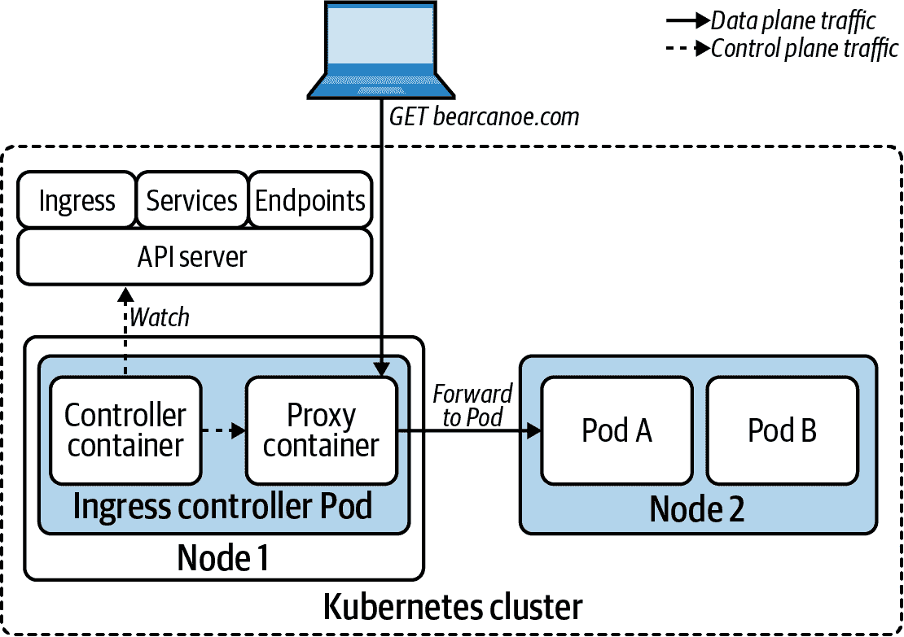

###### 图 6-10\. Ingress 控制器监视 API 服务器中的各种资源，并相应地配置代理。代理处理传入的流量，并根据 Ingress 配置转发到 Pod。

Ingress 控制器的控制平面连接到 Kubernetes API，并监视各种资源，如 Ingress、Services、Endpoints 等。每当这些资源发生变化时，控制器会收到监视通知，并配置数据平面以依据 Kubernetes API 中声明的期望状态进行操作。

数据平面处理网络流量的路由和负载平衡。正如之前提到的，数据平面通常使用现成的代理实现。

因为 Ingress API 建立在 Service 抽象之上，Ingress 控制器可以选择通过 Services 转发流量，或直接发送到 Pods。大多数 Ingress 控制器选择后者。它们不使用 Service 资源，仅用于验证 Ingress 资源中引用的 Service 是否存在。在路由方面，大多数控制器将流量转发到对应 Endpoints 对象中列出的 Pod IP 地址。直接将流量路由到 Pod 可以绕过 Service 层，从而降低延迟并添加不同的负载平衡策略。

## Ingress 流量模式

Ingress 的一个重要方面是每个应用程序都可以根据自己的需求配置路由。通常，每个应用程序在处理传入流量时有不同的需求。有些可能需要在边缘进行 TLS 终止。有些可能希望自己处理 TLS，而另一些可能根本不支持 TLS（希望不是这种情况）。

在本节中，我们将探讨我们遇到的常见 Ingress 流量模式。这应该让您了解 Ingress 能为开发人员提供什么，并且 Ingress 如何适应您的平台需求。

### HTTP 代理

HTTP 代理是 Ingress 的核心功能。该模式涉及暴露一个或多个基于 HTTP 的服务，并根据 HTTP 请求的属性进行流量路由。我们已经讨论了基于 `Host` 头的路由。其他可能影响路由决策的属性包括 URL 路径、请求方法、请求头等，具体取决于 Ingress 控制器。

下面的 Ingress 资源将 `app1` 服务暴露在 `app1.example.com` 上。任何具有匹配 `Host` HTTP 头的传入请求都将发送到 `app1` Pod。

```
apiVersion: networking.k8s.io/v1
kind: Ingress
metadata:
  name: app1
spec:
  rules:
  - host: app1.example.com
    http:
      paths:
      - path: /
        backend:
          serviceName: app1
          servicePort: 80
```

应用以上配置后，数据平面流向如图 6-11 所示。

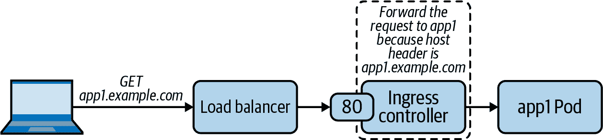

###### 图 6-11\. 客户端到目标 Pod 通过 Ingress 控制器的 HTTP 请求路径。

### 使用 TLS 的 HTTP 代理

支持 TLS 加密对于 Ingress 控制器来说是基本要求。从路由的角度来看，这种 Ingress 流量模式与 HTTP 代理相同。然而，客户端通过安全的 TLS 连接与 Ingress 控制器通信，而不是明文 HTTP。

下面的示例显示了一个将 `app1` 以 TLS 方式暴露的 Ingress 资源。控制器从引用的 Kubernetes Secret 获取 TLS 服务证书和密钥。

```
apiVersion: networking.k8s.io/v1
kind: Ingress
metadata:
  name: app1
spec:
  tls:
  - hosts:
      - app1.example.com
    secretName: app1-tls-cert
  rules:
  - host: app1.example.com
    http:
      paths:
      - path: /
        backend:
          serviceName: app1
          servicePort: 443
```

当涉及到 Ingress 控制器与后端服务之间的连接时，Ingress 控制器支持不同的配置。外部客户端与控制器之间的连接是安全的（TLS），而控制器与后端应用程序之间的连接则不一定要安全。控制器与后端之间的连接是否安全取决于应用程序是否监听 TLS 连接。默认情况下，大多数 Ingress 控制器会终止 TLS 并通过非加密连接转发请求，如图 6-12 所示。

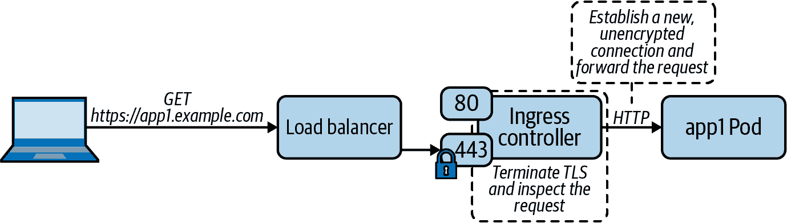

###### 图 6-12\. Ingress 控制器通过终止 TLS 处理 HTTPS 请求，并将请求转发到后端 Pod，使用非加密连接。

在需要与后端建立安全连接的情况下，Ingress 控制器会在边缘终止 TLS 连接，并与后端建立新的 TLS 连接（如图 6-13 所示）。重新建立 TLS 连接有时对某些应用程序不合适，例如那些需要与其客户端进行 TLS 握手的应用程序。在这些情况下，我们将在后面进一步讨论 TLS 穿透作为可行的替代方案。

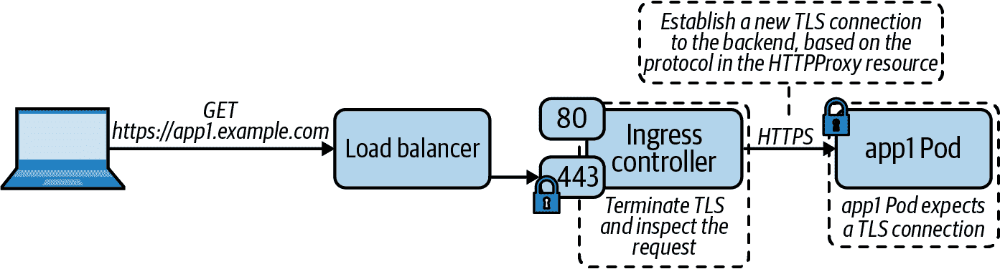

###### 图 6-13\. Ingress 控制器在处理 HTTPS 请求时终止 TLS 并与后端 Pod 建立新的 TLS 连接。

### 第 3/4 层代理

尽管 Ingress API 的主要重点是第 7 层代理（HTTP 流量），一些 Ingress 控制器可以在第 3/4 层代理（TCP/UDP 流量）中代理流量。如果需要暴露不使用 HTTP 的应用程序，则这可能很有用。在评估 Ingress 控制器时，您必须牢记这一点，因为各个控制器对第 3/4 层代理的支持程度不同。

代理 TCP 或 UDP 服务的主要挑战在于，Ingress 控制器通常仅监听有限数量的端口，通常是 80 和 443。可以想象，如果没有区分流量的策略，将不可能在同一端口上暴露不同的 TCP 或 UDP 服务。不同的 Ingress 控制器通过不同的方式解决了这个问题。例如，Contour 支持仅代理使用 Server Name Indication（SNI）TLS 扩展的 TLS 加密 TCP 连接。这样做的原因是 Contour 需要知道流量的目的地。在使用 SNI 时，目标域名在 TLS 握手的 ClientHello 消息中是可用的（未加密）。由于 TLS 和 SNI 依赖于 TCP，Contour 不支持 UDP 代理。

下面是一个示例 HTTPProxy 自定义资源，Contour 支持此资源。在第 3/4 层代理的常见情况下，自定义资源提供比 Ingress API 更好的体验：

```
apiVersion: projectcontour.io/v1
kind: HTTPProxy
metadata:
  name: tcp-proxy
spec:
  virtualhost:
    fqdn: tcp.bearcanoe.com
    tls:
      secretName: secret
  tcpproxy:
    services:
    - name: tcp-app
      port: 8080
```

在上述配置中，Contour 读取 SNI 扩展中的服务器名称，并将流量代理到后端 TCP 服务。图 6-14 展示了此功能。

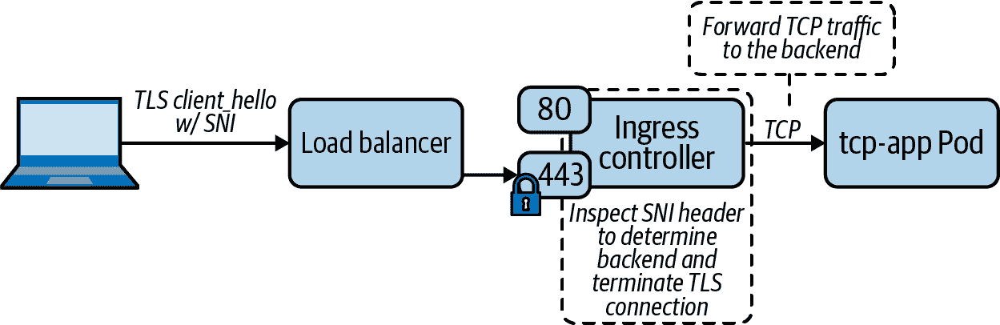

###### 图 6-14\. Ingress 控制器检查 SNI 头以确定后端，终止 TLS 连接，并将 TCP 流量转发到 Pod。

其他 Ingress 控制器会公开配置参数，您可以使用这些参数告知底层代理为第 3/4 层代理绑定附加端口。然后，您将这些额外的端口映射到集群中运行的特定服务。这是由社区主导的 NGINX Ingress 控制器在第 3/4 层代理中采用的方法。

第 3/4 层代理的常见用例是 TLS 穿透。TLS 穿透涉及一个应用程序暴露 TLS 端点，并需要直接与客户端进行 TLS 握手处理。正如我们在“使用 TLS 进行 HTTP 代理”的模式中讨论的那样，Ingress 控制器通常会终止面向客户端的 TLS 连接。这种 TLS 终止是必需的，以便 Ingress 控制器可以检查 HTTP 请求，否则该请求将会被加密。然而，使用 TLS 穿透时，Ingress 控制器不会终止 TLS，而是将安全连接代理到后端 Pod。图 6-15 描述了 TLS 穿透。

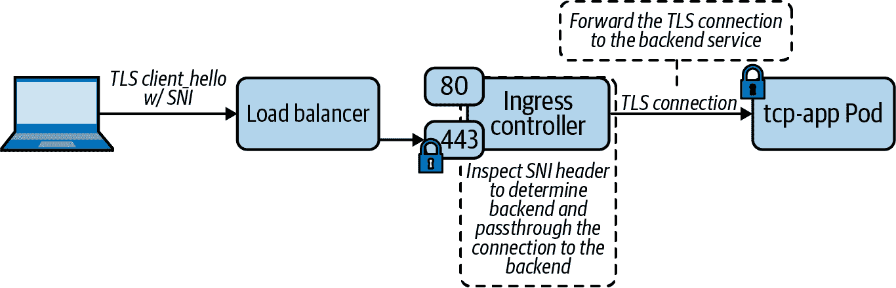

###### 图 6-15。当启用 TLS 透传时，入口控制器检查 SNI 头部以确定后端，并相应地转发 TLS 连接。

## 选择一个入口控制器

有几种入口控制器可以选择。根据我们的经验，NGINX 入口控制器是最常用的之一。但这并不意味着它对你的应用平台最好。其他选择包括 Contour、HAProxy、Traefik 等等。与本书主题一致，我们的目标不是告诉你应该使用哪个，而是为你提供做出这个决定所需的信息。我们还将突出显示适用时的重大权衡。

退一步来看，入口控制器的主要目标是处理应用程序流量。因此，在选择入口控制器时，自然而然地转向应用程序作为主要因素。具体来说，你的应用程序需要哪些特性和要求？以下是你可以从应用支持的角度评估入口控制器的标准列表：

+   应用程序是否公开 HTTPS 端点？它们是否需要直接与客户端处理 TLS 握手，或者在边缘终止 TLS 会合适？

+   应用程序使用哪些 SSL 密码？

+   应用程序是否需要会话亲和性或粘性会话？

+   应用程序是否需要高级请求路由能力，例如基于 HTTP 头部的路由、基于 Cookie 的路由、基于 HTTP 方法的路由等等？

+   应用程序是否需要不同的负载均衡算法要求，例如轮询、加权最少请求或随机？

+   应用程序是否需要支持跨源资源共享（CORS）？

+   应用程序是否将身份验证问题卸载到外部系统？一些入口控制器提供身份验证功能，你可以利用这些功能提供应用程序之间的通用认证机制。

+   是否有应用程序需要公开 TCP 或 UDP 端点？

+   应用程序是否需要能力来限制传入流量的速率？

除了应用程序需求之外，另一个关键考虑因素是你的组织对数据平面技术的经验。如果你已经对特定的代理非常熟悉，通常从那里开始是一个安全的选择。你将已经对它的工作原理有了很好的理解，更重要的是，你将了解它的局限性以及如何进行故障排除。

支持性是另一个需要考虑的关键因素。入口是你平台的一个重要组成部分。它存在于你的客户和他们试图访问的服务之间的中间。当入口控制器出现问题时，你希望在面对停机时能够获得所需的支持。

最后，请记住您可以使用 Ingress 类在平台上运行多个 Ingress 控制器。这样做会增加平台的复杂性和管理难度，但在某些情况下是必要的。您的平台越受欢迎，并且运行的生产工作负载越多，他们对您的 Ingress 层的需求就越多。完全有可能您最终会有一组无法通过单个 Ingress 控制器满足的需求。

## Ingress 控制器部署注意事项

无论是哪种 Ingress 控制器，在部署和运行 Ingress 层时都需要考虑一些因素。这些考虑因素中的一些也可能对平台上运行的应用程序产生影响。

### 专用的 Ingress 节点

将一组节点专门用于运行 Ingress 控制器，并因此作为集群“边缘”的节点，是一种我们发现非常成功的模式。图 6-16 展示了这种部署模式。起初，使用专用的 Ingress 节点可能会显得浪费。然而，我们的理念是，如果您有能力运行专用的控制平面节点，那么您可能也有能力为集群上所有工作负载的关键路径层专用节点。为 Ingress 使用专用节点池带来了显著的好处。

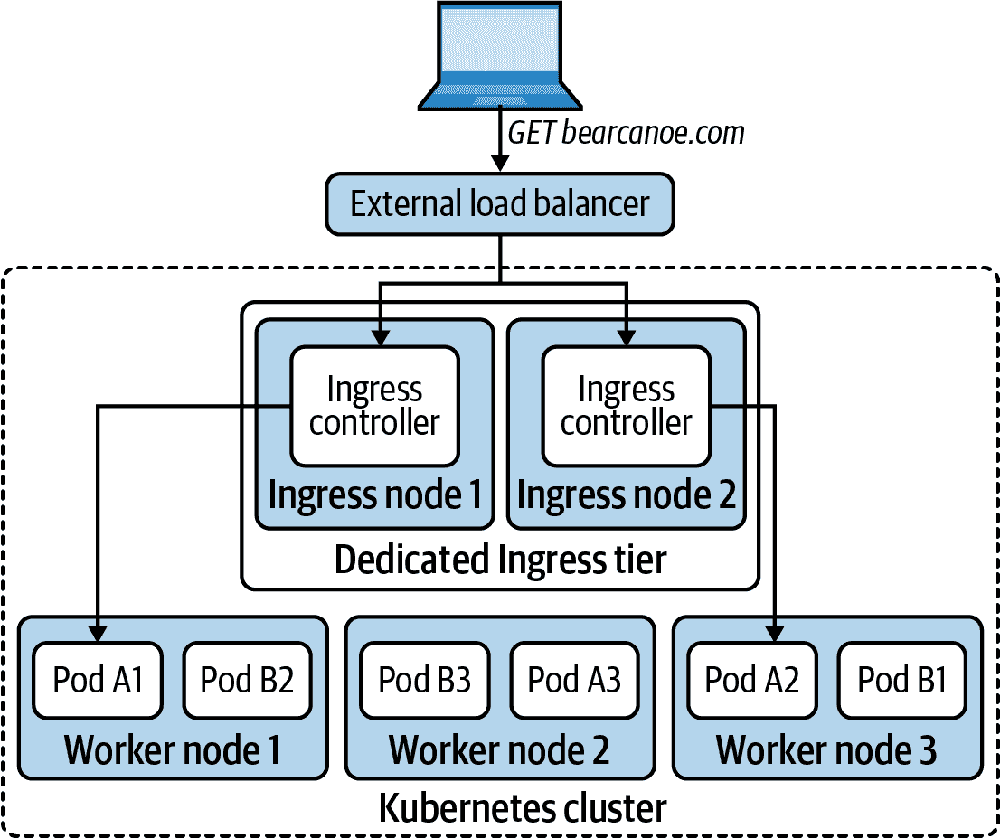

###### 图 6-16\. 专用的 Ingress 节点专门为 Ingress 控制器保留。Ingress 节点充当集群的“边缘”或 Ingress 层。

主要好处是资源隔离。尽管 Kubernetes 支持配置资源请求和限制，但我们发现平台团队在设置这些参数时可能会遇到困难。特别是当平台团队在他们的 Kubernetes 之旅的开始阶段，并且不了解支持资源管理的实现细节时（例如，完全公平调度器、cgroups）。此外，在撰写本文时，Kubernetes 不支持网络 I/O 或文件描述符的资源隔离，这使得保证这些资源的公平共享变得具有挑战性。

在专用节点上运行 Ingress 控制器的另一个原因是合规性。我们发现许多组织拥有预设的防火墙规则和其他安全实践，这些规则可能与 Ingress 控制器不兼容。在这些环境中，专用的 Ingress 节点非常有用，因为通常更容易为集群节点的一个子集获取异常，而不是全部节点。

最后，在裸金属或本地安装中限制运行 Ingress 控制器的节点数量可能会有所帮助。在这种部署中，Ingress 层面由硬件负载均衡器作为前端。在大多数情况下，这些是传统的负载均衡器，缺乏 API，并且必须静态配置以将流量路由到特定的后端集合。少量的 Ingress 节点可以简化这些外部负载均衡器的配置和管理。

总体而言，将节点专用于 Ingress 可以帮助提高性能、合规性和管理外部负载均衡器。实施专用 Ingress 节点的最佳方法是对 Ingress 节点进行标签和污点设置。然后，将 Ingress 控制器部署为一个 DaemonSet，该 DaemonSet (1) 允许容忍该污点，并且 (2) 具有一个节点选择器，指定目标为 Ingress 节点。采用这种方法时，必须考虑 Ingress 节点的故障处理，因为 Ingress 控制器不会在未保留给 Ingress 的节点上运行。在理想情况下，故障节点会自动替换为可以继续处理 Ingress 流量的新节点。

### 绑定到主机网络

要优化 Ingress 流量路径，可以将 Ingress 控制器绑定到底层主机的网络上。通过这样做，传入请求会绕过 Kubernetes Service 体系结构，直接到达 Ingress 控制器。在启用主机网络时，请确保 Ingress 控制器的 DNS 策略设置为 `ClusterFirstWithHostNet`。以下代码片段显示了 Pod 模板中的主机网络和 DNS 策略设置：

```
spec:
  containers:
  - image: nginx
    name: nginx
  dnsPolicy: ClusterFirstWithHostNet
  hostNetwork: true
```

尽管直接在主机网络上运行 Ingress 控制器可以增加性能，但必须记住，这样做会移除 Ingress 控制器与节点之间的网络命名空间边界。换句话说，Ingress 控制器可以完全访问主机上所有网络接口和可用的网络服务。这对于 Ingress 控制器的威胁模型有影响。换句话说，它降低了在数据平面代理漏洞案例中对敌对行动进行侧向移动的门槛。此外，绑定到主机网络是一个特权操作。因此，Ingress 控制器需要提升的特权或例外来作为特权工作负载运行。

即便如此，我们发现将 Ingress 控制器绑定到主机网络是值得权衡的，并且通常是暴露平台 Ingress 控制器的最佳方式。Ingress 流量直接到达控制器的网关，而不是经过 Service 栈（如 “Kubernetes Services” 中讨论的可能不太理想）。

### Ingress 控制器和外部流量策略

如果未正确配置，使用 Kubernetes Service 来暴露 Ingress 控制器会影响 Ingress 数据平面的性能。

如果您回顾一下“Kubernetes Services”，一个服务的外部流量策略决定如何处理来自集群外部的流量。如果您正在使用 NodePort 或 LoadBalancer 服务来暴露 Ingress 控制器，请确保将外部流量策略设置为`Local`。

使用`Local`策略可以避免不必要的网络跳跃，因为外部流量到达本地 Ingress 控制器而不是跳到另一个节点。此外，`Local`策略不使用 SNAT，这意味着客户端 IP 地址对处理请求的应用程序是可见的。

### 跨失败域分布 Ingress 控制器

为确保 Ingress 控制器群的高可用性，使用 Pod 反亲和性规则将 Ingress 控制器分布在不同的故障域中。

## DNS 及其在入口中的作用

正如我们在本章中讨论的那样，运行在平台上的应用程序共享 Ingress 数据平面，因此共享平台网络的单个入口点。随着请求的到来，Ingress 控制器的主要责任是消除流量的歧义并根据 Ingress 配置进行路由。

确定请求的目标的主要方式之一是通过目标主机名（在 HTTP 的情况下是`Host`头部，在 TCP 的情况下是 SNI），这使得 DNS 成为您的 Ingress 实现的一个重要组成部分。我们将讨论 DNS 和 Ingress 时可用的两种主要方法。

### 通配符 DNS 记录

我们持续采用的最成功模式之一是将一个域名分配给环境，并通过将子域名分配给不同的应用程序来切割它。我们有时称之为“基于子域的路由”。这种模式的实现涉及创建一个通配符 DNS 记录（例如，`*.bearcanoe.com`），将其解析为集群的 Ingress 层。通常情况下，这是一个位于 Ingress 控制器前面的负载均衡器。

使用通配符 DNS 记录为您的 Ingress 控制器带来了几个好处：

+   应用程序可以使用其子域名下的任何路径，包括根路径（`/`）。开发者不必花费工程师的时间来让他们的应用程序在子路径上运行。在某些情况下，应用程序期望在根路径上托管，并且在其他情况下则无法正常工作。

+   DNS 的实现相对简单。不需要在 Kubernetes 和您的 DNS 提供商之间进行集成。

+   单个通配符 DNS 记录消除了使用每个应用程序的不同域名可能出现的 DNS 传播问题。

### Kubernetes 和 DNS 整合

与使用通配符 DNS 记录的替代方法是将您的平台与 DNS 提供商集成。Kubernetes 社区维护了一个名为 [external-dns](https://github.com/kubernetes-sigs/external-dns) 的控制器，提供了这种集成。如果您使用受支持的 DNS 提供商，请考虑使用此控制器自动创建域名。

正如您可能期望的那样，external-dns 不断协调您上游 DNS 提供程序中的 DNS 记录和在 Ingress 资源中定义的配置。换句话说，external-dns 根据 Ingress API 中发生的更改创建、更新和删除 DNS 记录。External-dns 需要两个信息来配置 DNS 记录，这两个信息都是 Ingress 资源的一部分：所需的主机名在 Ingress 规范中，目标 IP 地址在 Ingress 资源的状态字段中。

如果需要支持多个域名，将平台与您的 DNS 提供程序集成可能很有用。控制器负责根据需要自动创建 DNS 记录。然而，重要的是要记住以下权衡：

+   您必须将额外的组件（external-dns）部署到您的集群中。额外的插件会给您的部署带来更多复杂性，因为您需要操作、维护、监控、版本化和升级平台中的一个额外组件。

+   如果 external-dns 不支持您的 DNS 提供程序，您必须开发自己的控制器。构建和维护控制器需要工程努力，这些努力本应用于更高价值的工作。在这些情况下，最好简单实现一个通配符 DNS 记录。

## 处理 TLS 证书

Ingress 控制器需要证书及其相应的私钥以通过 TLS 提供应用程序服务。根据您的 Ingress 策略，管理证书可能会很麻烦。如果您的集群托管单个域名并实现基于子域的路由，则可以使用单个通配符 TLS 证书。然而，在某些情况下，集群托管跨多个域的应用程序，这使得有效管理证书变得具有挑战性。此外，您的安全团队可能不赞成使用通配符证书。无论如何，Kubernetes 社区已经围绕一个名为 [cert-manager](https://cert-manager.io) 的证书管理插件进行了集体努力。

`cert-manager` 是在您的集群中运行的控制器。它安装了一组 CRD，通过 Kubernetes API 实现对证书颁发机构（CA）和证书的声明式管理。更重要的是，它支持不同的证书发行者，包括基于 ACME 的 CA、HashiCorp Vault、Venafi 等。它还提供了一个扩展点来在必要时实现自定义发行者。

`cert-manager` 的证书铸造功能围绕着发行者和证书展开。`cert-manager` 有两种发行者自定义资源。发行者资源代表在特定 Kubernetes 命名空间中签署证书的 CA。如果要跨所有命名空间发行证书，可以使用 ClusterIssuer 资源。以下是一个使用存储在 Kubernetes 秘钥中的私钥 `platform-ca-key-pair` 的示例 ClusterIssuer 定义：

```
apiVersion: cert-manager.io/v1
kind: ClusterIssuer
metadata:
  name: prod-ca-issuer
spec:
  ca:
    secretName: platform-ca-key-pair
```

cert-manager 的优点在于它与 Ingress API 集成，自动为 Ingress 资源签发证书。例如，给定以下 Ingress 对象，cert-manager 会自动创建适用于 TLS 的证书密钥对：

```
apiVersion: networking.k8s.io/v1
kind: Ingress
metadata:
  annotations:
    cert-manager.io/cluster-issuer: prod-ca-issuer 
  name: bearcanoe-com
spec:
  tls:
  - hosts:
    - bearcanoe.com
    secretName: bearcanoe-cert-key-pair 
  rules:
  - host: bearcanoe.com
    http:
      paths:
      - path: /
        backend:
          serviceName: nginx
          servicePort: 80
```


`cert-manager.io/cluster-issuer` 注解告诉 cert-manager 使用 `prod-ca-issuer` 来签发证书。


Cert-manager 将证书和私钥存储在名为 `bearcanoe-cert-key-pair` 的 Kubernetes Secret 中。

在幕后，cert-manager 处理证书请求过程，包括生成私钥，创建证书签名请求（CSR），并将 CSR 提交给 CA。一旦签发者签发证书，cert-manager 将其存储在 `bearcanoe-cert-key-pair` 证书中。然后，Ingress 控制器可以获取证书并开始通过 TLS 提供应用程序。图 6-17 更详细地描述了该过程。

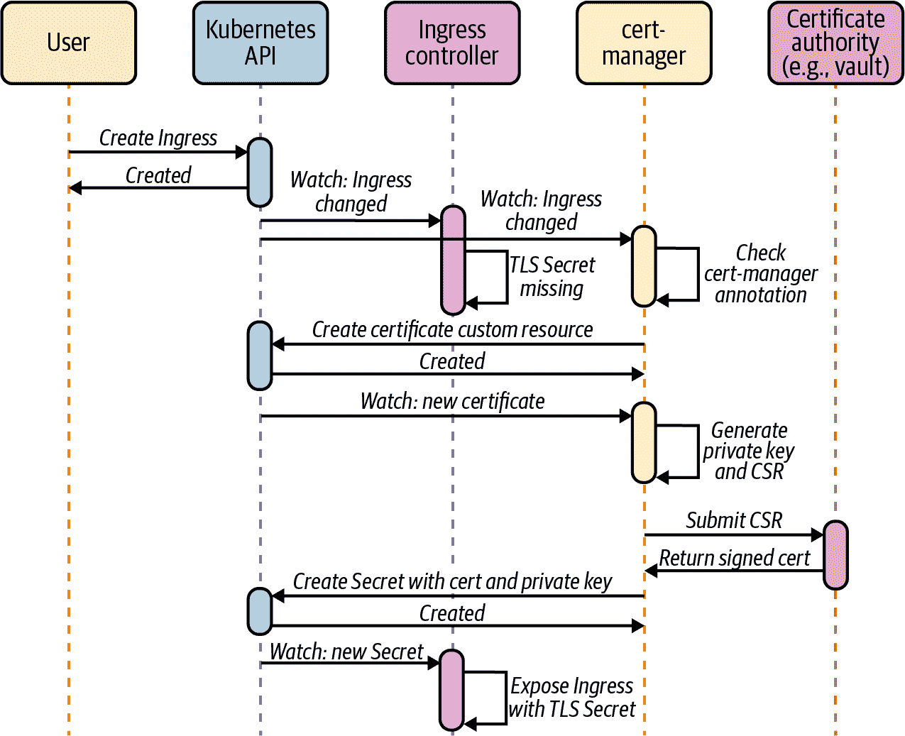

###### 图 6-17\. Cert-manager 监视 Ingress API，并在 Ingress 资源具有 `cert-manager.io/cluster-issuer` 注解时向证书颁发机构请求证书。

如您所见，cert-manager 简化了 Kubernetes 上的证书管理。我们遇到的大多数平台都以某种方式使用 cert-manager。如果您在平台上使用 cert-manager，请考虑使用诸如 Vault 等外部系统作为 CA。将 cert-manager 与外部系统集成，而不是使用由 Kubernetes Secret 支持的 CA，是一种更强大和安全的解决方案。

# 服务网格

随着行业继续采用容器和微服务，服务网格变得非常流行。虽然术语“服务网格”相对较新，但它所包含的概念并非如此。服务网格是服务路由、负载平衡和遥测的预先存在的理念的再次整合。在容器和 Kubernetes 兴起之前，超大规模的互联网公司实现了服务网格的前身，因为他们在微服务方面遇到了挑战。例如，Twitter 开发了 [Finagle](https://twitter.github.io/finagle)，一个 Scala 库，所有微服务都内嵌了该库。它处理负载平衡、熔断、自动重试、遥测等功能。Netflix 开发了 [Hystrix](https://github.com/Netflix/Hystrix)，一个类似的 Java 库。

容器和 Kubernetes 改变了格局。服务网格不再像它们的前身那样是特定语言的库。今天，服务网格本身就是分布式系统。它们包含一个控制平面，该控制平面配置一组代理，这些代理实现了数据平面。路由、负载平衡、遥测和其他功能都内置于代理中，而不是应用程序中。向代理模型的转移使更多的应用程序能够利用这些功能，因为不需要对代码进行更改来参与网格。

服务网格提供了一系列广泛的功能，可以分为三大支柱：

路由和可靠性

高级流量路由和可靠性功能，例如流量转移、流量镜像、重试和断路器。

安全性

身份和访问控制功能，支持服务之间的安全通信，包括身份、证书管理和双向 TLS（mTLS）。

可观测性

自动收集来自网格中所有交互的指标和跟踪信息。

在本章的其余部分中，我们将更详细地讨论服务网格。然而，在这样做之前，让我们回到本书的中心主题，并问：“我们需要服务网格吗？”一些组织将服务网格视为实现前述功能的灵丹妙药，因此服务网格越来越受欢迎。然而，我们发现组织应仔细考虑采用服务网格的影响。

## 何时（不）使用服务网格

服务网格可以为应用平台及其上运行的应用程序提供巨大的价值。它提供了一组吸引力强大的功能，您的开发人员会很喜欢。与此同时，服务网格带来了大量复杂性，您必须处理这些复杂性。

Kubernetes 是一个复杂的分布式系统。到目前为止，在本书中，我们已经涉及了构建基于 Kubernetes 的应用平台所需的一些基本组件，还有很多章节尚未讲解。事实是，构建一个成功的基于 Kubernetes 的应用平台是一项艰巨的工作。在考虑使用服务网格时，请记住这一点。在您开始 Kubernetes 之旅时实施服务网格将会减慢您的步伐，甚至可能导致失败。

在实地工作中，我们亲眼见证了这些情况。我们与平台团队合作过，他们被服务网格的诱人功能所蒙蔽。诚然，这些功能将使他们的平台对开发人员更具吸引力，从而增加平台的采用率。然而，时间是重要的。在开始考虑服务网格之前，等到在生产环境中获得操作经验。

或许更重要的是你理解你的需求或者你试图解决的问题。把车放在马前面不仅会增加平台失败的几率，还会导致工程资源的浪费。这种错误的一个典型例子是一个组织在开发基于 Kubernetes 的平台时，还未投入生产就盲目采用了服务网格。“我们需要服务网格，因为它提供的所有功能我们都需要”，他们说。十二个月后，他们唯一使用的功能只有网格的 Ingress 能力。没有双向 TLS，没有复杂的路由，没有跟踪。只有 Ingress。为了使专用的 Ingress 控制器准备投入生产的工程资源远远少于全功能网格的实现。在将最小可行产品投入生产后，逐步增加功能也有其积极的一面。

在阅读完本节后，你可能会觉得我们认为应用平台中没有服务网格的位置。恰恰相反，如果有需求，服务网格可以解决大量问题，并且如果能够充分利用，它可以带来巨大的价值。最终，我们发现一个成功的服务网格实现取决于选择合适的时机和出于正确的动机。

## 服务网格接口（SMI）

Kubernetes 提供了各种可插拔组件的接口。这些接口包括容器运行时接口（CRI）、容器网络接口（CNI）等。正如本书所述，正是这些接口使 Kubernetes 成为一个可扩展的基础设施。服务网格正在逐步成为 Kubernetes 平台的重要组成部分。因此，服务网格社区合作建立了服务网格接口（SMI）。

与我们已经讨论过的其他接口类似，SMI 指定了 Kubernetes 与服务网格之间的交互。然而，SMI 与其他 Kubernetes 接口不同的是，它不是核心 Kubernetes 项目的一部分。相反，SMI 项目利用自定义资源定义（CRD）来指定接口。SMI 项目还包括用于实现接口的库，例如用于 Go 的 SMI SDK。

SMI 通过一组 CRD 覆盖了我们在前一节讨论的三大支柱。Traffic Split API 关注于跨多个服务的流量路由和分割。它支持基于百分比的流量分割，从而实现不同的部署场景，如蓝绿部署和 A/B 测试。以下片段展示了一个 TrafficSplit 的示例，用于执行“flights” Web 服务的金丝雀部署：

```
apiVersion: split.smi-spec.io/v1alpha3
kind: TrafficSplit
metadata:
  name: flights-canary
  namespace: bookings
spec:
  service: flights 
  backends: 
  - service: flights-v1
    weight: 70
  - service: flights-v2
    weight: 30
```


客户连接的顶层服务（即`flights.bookings.cluster.svc.local`）。


接收流量的后端服务。v1 版本接收 70% 的流量，而 v2 版本接收其余的流量。

流量访问控制和流量规格 API 一起实现安全功能，如访问控制。流量访问控制 API 提供 CRD 来控制网格中允许的服务交互。借助这些 CRD，开发人员可以指定访问控制策略，确定哪些服务可以在什么条件下进行通信（例如允许的 HTTP 方法列表）。流量规格 API 提供了描述流量的方法，包括用于 HTTP 流量的`HTTPRouteGroup` CRD 和用于 TCP 流量的`TCPRoute`。与流量访问控制 CRD 一起，这些在应用程序级别应用策略。

例如，以下 HTTPRouteGroup 和 TrafficTarget 允许来自 bookings 服务到 payments 服务的所有请求。HTTPRouteGroup 资源描述流量，而 TrafficTarget 指定了源和目标服务：

```
apiVersion: specs.smi-spec.io/v1alpha3
kind: HTTPRouteGroup
metadata:
  name: payment-processing
  namespace: payments
spec:
  matches:
  - name: everything 
    pathRegex: ".*"
    methods: ["*"]
---
apiVersion: access.smi-spec.io/v1alpha2
kind: TrafficTarget
metadata:
  name: allow-bookings
  namespace: payments
spec:
  destination: 
    kind: ServiceAccount
    name: payments
    namespace: payments
    port: 8080
  rules: 
  - kind: HTTPRouteGroup
    name: payment-processing
    matches:
    - everything
  sources: 
  - kind: ServiceAccount
    name: flights
    namespace: bookings
```


允许在这个 HTTPRouteGroup 中的所有请求。


目标服务。在本例中，使用`payments`命名空间中`payments`服务账户的 Pod。


控制源和目标服务之间流量的 HTTPRouteGroups。


源服务。在本例中，使用`bookings`命名空间中`flights`服务账户的 Pod。

最后，流量度量 API 提供了服务网格的遥测功能。这个 API 与其他 API 稍有不同，因为它定义的是输出而不是提供输入的机制。流量度量 API 定义了公开服务度量标准。需要这些度量标准的系统，如监控系统、自动缩放器、仪表板等，可以以标准化的方式使用它们。以下片段显示了一个展示两个 Pod 之间流量度量指标的示例 TrafficMetrics 资源：

```
apiVersion: metrics.smi-spec.io/v1alpha1
kind: TrafficMetrics
resource:
  name: flights-19sk18sj11-a9od2
  namespace: bookings
  kind: Pod
edge:
  direction: to
  side: client
  resource:
    name: payments-ks8xoa999x-xkop0
    namespace: payments
    kind: Pod
timestamp: 2020-08-09T01:07:23Z
window: 30s
metrics:
- name: p99_response_latency
  unit: seconds
  value: 13m
- name: p90_response_latency
  unit: seconds
  value: 7m
- name: p50_response_latency
  unit: seconds
  value: 3m
- name: success_count
  value: 100
- name: failure_count
  value: 0
```

SMI 是 Kubernetes 社区中最新的接口之一。尽管仍在开发和迭代中，但它描绘了我们作为一个社区未来的图景。与 Kubernetes 中的其他接口一样，SMI 使平台构建者能够使用便携和与提供者无关的 API 来提供服务网格，进一步增加了 Kubernetes 的价值、灵活性和能力。

## 数据平面代理

服务网格的数据平面是连接服务的一组代理。[Envoy 代理](https://www.envoyproxy.io)是云原生生态系统中最流行的服务代理之一。最初由 Lyft 开发，自 2016 年末开源以来，迅速成为云原生系统中的重要组成部分。

Envoy 用于 Ingress 控制器（[Contour](https://projectcontour.io)）、API 网关（[Ambassador](https://www.getambassador.io)、[Gloo](https://docs.solo.io/gloo/latest)）以及服务网格（[Istio](https://istio.io)、[OSM](https://github.com/openservicemesh/osm)）。

Envoy 之所以成为优秀的构建块之一，原因之一在于其支持通过 gRPC/REST API 实现动态配置。早期的开源代理程序在 Kubernetes 这样动态环境下并未设计得如 Envoy 那样，它们使用静态配置文件，需要重启才能生效配置更改。相反，Envoy 提供了 xDS（*discovery service*）API，用于动态配置（详见 图 6-18）。此外，Envoy 还支持热重启功能，允许在重新初始化时不中断任何活动连接。

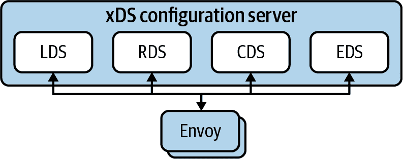

###### 图 6-18\. Envoy 通过 XDS API 支持动态配置。Envoy 连接到配置服务器并使用 LDS、RDS、EDS、CDS 和其他 xDS API 请求其配置。

Envoy 的 xDS 是一组 API 集合，包括 Listener Discovery Service (LDS)、Cluster Discovery Service (CDS)、Endpoints Discovery Service (EDS)、Route Discovery Service (RDS) 等。一个 Envoy *configuration server* 实现这些 API，并作为 Envoy 动态配置的源头。在启动期间，Envoy 连接到配置服务器（通常通过 gRPC）并订阅配置更改。随着环境变化，配置服务器会向 Envoy 流式传输变更。让我们更详细地审视 xDS API。

LDS API 配置了 Envoy 的 *Listeners*。Listeners 是代理的入口点，Envoy 可以打开多个 Clients 可以连接的 Listener。典型示例是监听端口 80 和 443 以处理 HTTP 和 HTTPS 流量。

每个 Listener 都有一组过滤器链，决定如何处理传入的流量。HTTP 连接管理器过滤器利用 RDS API 获取路由配置。路由配置告诉 Envoy 如何路由传入的 HTTP 请求，提供有关虚拟主机和请求匹配（基于路径、基于标头等）的详细信息。

路由配置中的每条路由引用了一个 *Cluster*。Cluster 是属于同一服务的一组 *Endpoints*。Envoy 使用 CDS 和 EDS API 发现 Cluster 和 Endpoints。有趣的是，EDS API 实际上没有 Endpoint 对象，而是使用 *ClusterLoadAssignment* 对象将 Endpoints 分配给 Clusters。

虽然深入探讨 xDS API 的细节值得一本专门的书籍，但我们希望前述概述能让您了解 Envoy 的工作原理及其功能。总结一下，监听器绑定到端口并接受来自客户端的连接。监听器具有过滤器链，决定如何处理传入连接。例如，HTTP 过滤器检查请求并将其映射到集群。每个集群有一个或多个端点，最终接收并处理流量。图 6-19 展示了这些概念的图形表示及其相互关系。

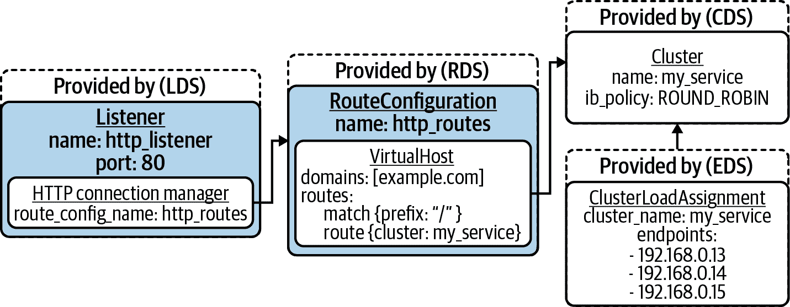

###### 图 6-19\. Envoy 配置，监听器绑定到端口 80\. 监听器具有 HTTP 连接管理器过滤器，引用路由配置。路由配置匹配以`/`前缀开头的请求，并将其转发到`my_service`集群，该集群有三个端点。

## Kubernetes 上的服务网格

在前面的部分，我们讨论了服务网格的数据平面如何为服务之间提供连接。我们还谈到了 Envoy 作为数据平面代理，以及它通过 xDS API 支持动态配置的方式。要在 Kubernetes 上构建服务网格，我们需要一个控制平面，根据集群内部的情况配置网格的数据平面。控制平面需要理解服务、端点、Pod 等概念。此外，它需要暴露 Kubernetes 自定义资源，供开发人员用来配置服务网格。

Kubernetes 中最流行的服务网格实现之一是 Istio。Istio 实现了基于 Envoy 的服务网格的控制平面。控制平面实现在一个名为 istiod 的组件中，它本身有三个主要子组件：Pilot、Citadel 和 Galley。Pilot 是一个 Envoy 配置服务器，它实现了 xDS API，并将配置流式传输到与应用程序并行运行的 Envoy 代理。Citadel 负责网格内的证书管理，它颁发证书用于建立服务身份和相互 TLS。最后，Galley 与 Kubernetes 等外部系统交互以获取配置。它抽象了底层平台并为其他 istiod 组件翻译配置。图 6-20 显示了 Istio 控制平面组件之间的交互。

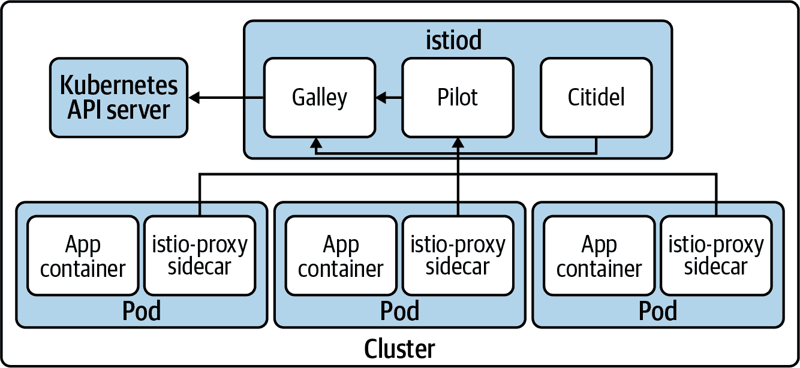

###### 图 6-20\. Istio 控制平面交互。

Istio 在配置服务网格的数据平面之外还提供了其他功能。首先，Istio 包括一个变更接受的 Webhook，将 Envoy Sidecar 注入到 Pod 中。参与网格的每个 Pod 都有一个处理所有入站和出站连接的 Envoy Sidecar。变更接受的 Webhook 提升了平台上的开发体验，开发人员无需手动将 Sidecar 代理添加到所有应用程序部署清单中，平台会自动以选择加入和退出的模式注入 Sidecar。尽管如此，仅仅注入 Envoy 代理 Sidecar 到工作负载旁边并不意味着工作负载会自动开始通过 Envoy 发送流量。因此，Istio 使用一个 init-container 安装 iptables 规则，拦截 Pod 的网络流量并将其路由到 Envoy。以下摘录（为简洁起见进行了修剪）显示了 Istio init-container 的配置：

```
...
initContainers:
- args:
  - istio-iptables
  - --envoy-port 
  - "15001"
  - --inbound-capture-port 
  - "15006"
  - --proxy-uid
  - "1337"
  - --istio-inbound-interception-mode
  - REDIRECT
  - --istio-service-cidr 
  - '*'
  - --istio-inbound-ports 
  - '*'
  - --istio-local-exclude-ports
  - 15090,15021,15020
  image: docker.io/istio/proxyv2:1.6.7
  imagePullPolicy: Always
  name: istio-init
...
```


Istio 安装了一个 iptables 规则，捕获所有出站流量并将其发送到该端口的 Envoy。


Istio 安装了一个 iptables 规则，捕获所有入站流量并将其发送到该端口的 Envoy。


要重定向到 Envoy 的 CIDR 列表。在这种情况下，我们重定向所有 CIDR。


要重定向到 Envoy 的端口列表。在这种情况下，我们重定向所有端口。

现在我们已经讨论了 Istio 的架构，让我们来讨论一些通常使用的服务网格特性。我们在现场遇到的更常见的需求之一是服务间的身份验证和服务间流量的加密。这个功能由 SMI 中的流量访问控制 API 提供支持。Istio 和大多数服务网格实现都使用双向 TLS 来实现这一点。在 Istio 的情况下，默认情况下，所有参与网格的服务都启用了双向 TLS。工作负载将未加密的流量发送到 Sidecar 代理。Sidecar 代理升级连接到 mTLS 并将其发送到另一端的 Sidecar 代理。默认情况下，服务仍然可以从网格外的其他服务接收非 TLS 流量。如果您想强制所有交互使用 mTLS，Istio 支持 `STRICT` 模式，该模式配置网格中的所有服务只接受 TLS 加密的请求。例如，您可以在 `istio-system` 命名空间中的配置中全局启用严格的 mTLS：

```
apiVersion: "security.istio.io/v1beta1"
kind: "PeerAuthentication"
metadata:
  name: "default"
  namespace: "istio-system"
spec:
  mtls:
    mode: STRICT
```

流量管理是服务网格处理的另一个关键问题。流量管理在 SMI 的 Traffic Split API 中被捕获，尽管 Istio 的流量管理功能更为先进。除了流量分割或转移外，Istio 还支持故障注入、熔断、镜像和更多功能。当涉及到流量转移时，Istio 使用两个独立的自定义资源进行配置：VirtualService 和 DestinationRule。

+   *VirtualService* 资源在网格中创建服务并指定流量路由方式。它指定了服务的主机名以及控制请求目的地的规则。例如，VirtualService 可以将 90% 的流量发送到一个目的地，将其余的发送到另一个目的地。一旦 VirtualService 评估了规则并选择了目的地，它会将流量发送到 *DestinationRule* 的特定子集之一。

+   *DestinationRule* 资源列出了特定服务可用的“真实”后端。每个后端都在单独的子集中。每个子集可以有自己的路由配置，如负载均衡策略、双向 TLS 模式等。

举例来说，让我们考虑一个场景，我们想要逐步推出服务的第二个版本。我们可以使用以下 DestinationRule 和 VirtualService 来实现这一目标。DestinationRule 创建了两个服务子集：v1 和 v2。VirtualService 引用了这些子集。它将 90% 的流量发送到 v1 子集，将 10% 的流量发送到 v2 子集：

```
apiVersion: networking.istio.io/v1alpha3
kind: DestinationRule
metadata:
  name: flights
spec:
  host: flights
  subsets:
  - name: v1
    labels:
      version: v1
  - name: v2
    labels:
      version: v2
---
apiVersion: networking.istio.io/v1alpha3
kind: VirtualService
metadata:
  name: flights
spec:
  hosts:
  - flights
  http:
  - route:
    - destination:
        host: flights
        subset: v1
      weight: 90
    - destination:
        host: flights
        subset: v2
      weight: 10
```

服务可观测性是另一个常被追求的特性。由于网格中所有服务之间都有代理，因此推导服务级别的指标是直接的。开发人员可以获取这些指标，而无需为其应用程序进行工具化。这些指标以 Prometheus 格式公开，可供广泛的监控系统使用。以下是由 sidecar 代理捕获的示例指标（为简洁起见移除了一些标签）。该指标显示，来自航班预订服务到支付处理服务的成功请求数量为 7183：

```
istio_requests_total{
  connection_security_policy="mutual_tls",
  destination_service_name="payments",
  destination_service_namespace="payments",
  destination_version="v1",
  request_protocol="http",
  ...
  response_code="200",
  source_app="bookings",
  source_version="v1",
  source_workload="bookings-v1",
  source_workload_namespace="flights"
} 7183
```

总体而言，Istio 提供了所有在 SMI 中捕获的特性。但是，它尚未实现 SMI API（Istio v1.6）。SMI 社区维护了一个 [适配器](https://github.com/servicemeshinterface/smi-adapter-istio)，您可以使用它将 SMI API 与 Istio 兼容。我们主要讨论 Istio，因为这是我们在现场最常遇到的服务网格。话虽如此，Kubernetes 生态系统中还有其他网格，包括 Linkerd、Consul Connect、Maesh 等。这些实现之间变化的一件事是数据平面架构，我们将在接下来讨论。

## 数据平面架构

服务网格是服务之间可以用来通信的高速公路。为了进入这条高速公路，服务使用作为匝道的代理。在数据平面方面，服务网格遵循旁路代理或节点代理两种架构模型之一。

### 旁路代理

在两种架构模型中，旁路代理是最常见的模型之一。正如我们在前一节中讨论的那样，Istio 使用这种模型来实现其通过 Envoy 代理的数据平面。Linkerd 也采用了这种方法。实质上，遵循此模式的服务网格在工作负载的 Pod 内部部署代理，与服务一起运行。一旦部署，旁路代理拦截进出服务的所有通信，如图 6-21 所示。

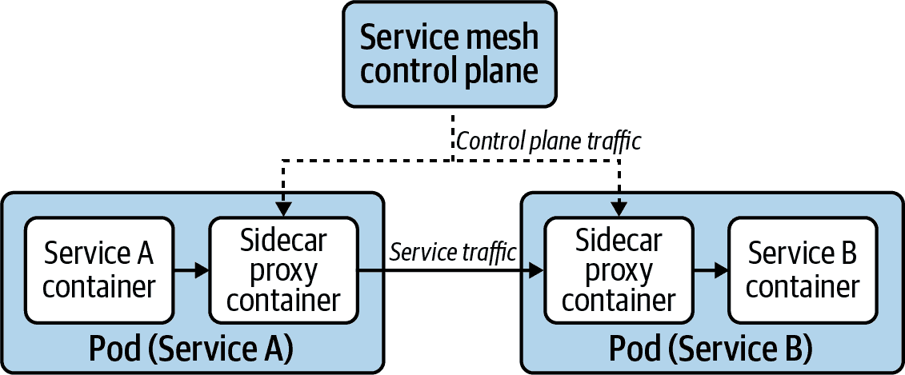

###### 图 6-21\. 参与网格的 Pod 具有拦截 Pod 网络流量的旁路代理。

与节点代理方法相比，旁路代理架构在数据平面升级时对服务的影响可能更大。升级涉及滚动所有服务的 Pod，因为没有办法在不重新创建 Pod 的情况下升级旁路代理。

### 节点代理

节点代理是一种备选的数据平面架构。与向每个服务注入旁路代理不同，服务网格由每个节点上运行的单个代理组成。每个节点代理处理其节点上运行的所有服务的流量，如图 6-22 所示。遵循此架构的服务网格包括 [Consul Connect](https://www.consul.io/docs/connect) 和 [Maesh](https://containo.us/maesh)。Linkerd 的第一个版本也使用了节点代理，但是在第二个版本中项目已经转向了旁路代理模型。

与旁路代理架构相比，节点代理方法对服务可能有更大的性能影响。因为代理由节点上所有服务共享，服务可能会遭受邻居干扰问题，代理也可能成为网络瓶颈。

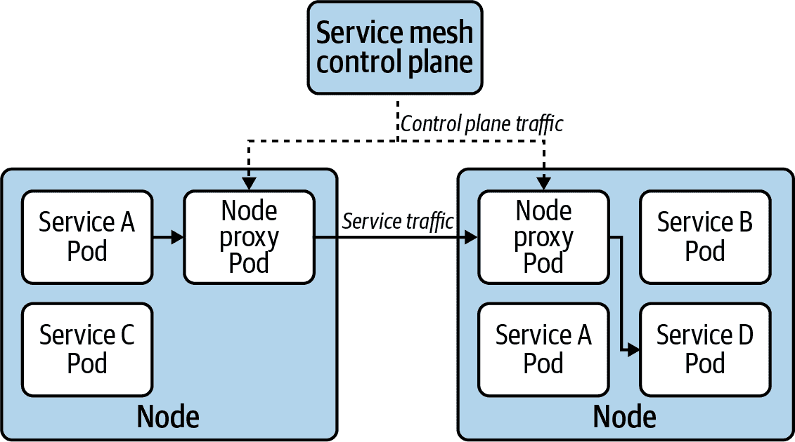

###### 图 6-22\. 节点代理模型涉及处理节点上所有服务流量的单个服务网格代理。

## 采用服务网格

采用服务网格可能看起来像是一项艰巨的任务。你应该将其部署到现有集群吗？如何避免影响已经运行的工作负载？如何有选择地引入服务进行测试？

在本节中，我们将探讨在引入服务网格到应用平台时您应该考虑的不同因素。

### 优先考虑支柱之一

首先要做的事情之一是优先考虑服务网格的某一个支柱。这样做将使您能够从实施和测试的角度缩小范围。根据您的需求（如果您正在采用服务网格，那么您已经建立了需求，对吧？），例如，您可能会将双向 TLS 作为第一个支柱优先考虑。在这种情况下，您可以专注于部署支持此功能所需的 PKI。无需担心设置跟踪堆栈或花费开发周期测试流量路由和管理。

焦点放在其中一个支柱上使您能够了解网格在您的平台上的行为，并获得运营专业知识。一旦您感到舒适，可以根据需要实施额外的支柱。实际上，如果您采用分阶段部署而不是一次性实施，您将更加成功。

### 部署到新集群还是现有集群？

根据您的平台生命周期和拓扑结构，您可能可以选择将服务网格部署到新的、全新的集群，或者将其添加到现有集群中。在可能的情况下，最好选择新集群路线。这样可以消除对正在现有集群中运行的应用程序可能造成的任何潜在干扰。如果您的集群是短暂存在的，将服务网格部署到新集群应该是一个自然的选择。

在必须将服务网格引入现有集群的情况下，请务必在开发和测试层进行广泛测试。更重要的是，在上线到暂存和生产层之前，提供一个允许开发团队实验和测试其服务与网格配合使用的入门窗口。最后，提供一个机制，允许应用程序选择加入网格。启用选择加入机制的常见方式是提供一个 Pod 注释。例如，Istio 提供了一个注释（`sidecar.istio.io/inject`），该注释决定平台是否应该将 sidecar 代理注入工作负载中，如下片段中所示：

```
apiVersion: apps/v1
kind: Deployment
metadata:
  name: nginx
spec:
  template:
    metadata:
      annotations:
        sidecar.istio.io/inject: "true"
    spec:
      containers:
      - name: nginx
        image: nginx
```

### 处理升级

在将服务网格作为平台的一部分提供时，您必须制定一个稳固的升级策略。请记住，服务网格数据平面处于连接您的服务的关键路径上，包括您集群的边缘（无论您使用的是网格的入口网关还是其他入口控制器）。当存在影响网格代理的 CVE 时会发生什么？您如何有效地处理升级？不要在不了解这些问题并没有建立良好升级策略的情况下采用服务网格。

升级策略必须考虑到控制平面和数据平面。控制平面升级的风险较小，因为网格的数据平面应该继续在没有控制平面的情况下运行。话虽如此，不要忽略控制平面升级。你应该理解控制平面与数据平面的版本兼容性。如果可能，按照 [Istio 项目](https://oreil.ly/TZj7F)推荐的暗能升级模式进行操作。同时，请确保检查任何服务网格自定义资源定义（CRD）更改及其是否会影响你的服务。

由于平台上运行的代理数量较多，并且代理正在处理服务流量，因此数据平面升级更为复杂。当代理作为侧卡运行时，为了升级代理，必须重新创建整个 Pod，因为 Kubernetes 不支持容器就地升级。无论是进行完整的数据平面升级还是新数据平面代理的缓慢滚动升级，取决于升级背后的原因。如果你升级数据平面以处理代理中的漏洞，你必须重新创建参与网格的每个 Pod，以解决漏洞。正如你所想的，这可能对某些应用程序造成干扰。如果另一方面，你升级是为了利用新的功能或修复漏洞，可以让代理的新版本在 Pod 创建或移动到集群中时逐步推出。这种较慢的且不具破坏性的升级导致了代理的版本增长，只要服务网格支持，这可能是可以接受的。无论你是出于何种原因进行升级，总是要利用开发和测试层练习和验证服务网格升级。

另一个需要牢记的是，网格通常仅支持一系列 Kubernetes 版本。Kubernetes 升级如何影响你的服务网格？使用服务网格会妨碍你尽早升级 Kubernetes 吗？考虑到 Kubernetes API 相对稳定，这应该不会发生。然而，这是可能的，并且需要注意。

### 资源开销

使用服务网格的一个主要权衡因素是它所携带的资源开销，尤其是在侧卡架构下。正如我们讨论过的，服务网格会向集群中的每个 Pod 注入一个代理。为了完成工作，代理消耗了其他服务可用的资源（CPU 和内存）。在采用服务网格时，你必须理解这种开销，是否值得进行权衡。如果你在数据中心运行集群，那么这个开销可能是可接受的。然而，这种开销可能会阻止你在资源约束更为紧张的边缘部署中使用服务网格。

更重要的是，服务网格在服务之间引入了延迟，因为服务调用在源服务和目标服务上都经过代理。虽然服务网格中使用的代理通常性能很高，但理解它们引入的延迟开销以及您的应用程序能否在这种开销下运行是非常重要的。

在评估服务网格时，花些时间调查其资源开销是非常重要的。更好的方法是通过与您的服务一起运行性能测试，了解在负载下网格的行为。

### 用于互相 TLS 的证书颁发机构

服务网格的身份特性通常基于 X.509 证书。网格中的代理使用这些证书在服务之间建立互相 TLS（mTLS）连接。

在能够利用服务网格的 mTLS 功能之前，您必须建立证书管理策略。虽然网格通常负责签发服务证书，但确定证书颁发机构（CA）是由您决定的。在大多数情况下，服务网格使用自签名证书作为 CA。但是，成熟的服务网格允许您在必要时使用自己的 CA。

由于服务网格处理服务间的通信，使用自签名 CA 是足够的。CA 本质上是对应用程序及其客户端不可见的实现细节。尽管如此，安全团队可能不赞成使用自签名 CA。在采用服务网格时，请确保将安全团队引入讨论。

如果使用自签名 CA 来进行 mTLS 不可行，您将不得不提供一个 CA 证书和密钥，以供服务网格用于签发证书。或者，在集成可用时，您可以与 Vault 等外部 CA 进行集成。

### 多集群服务网格

一些服务网格提供多集群功能，您可以使用这些功能将网格扩展到多个 Kubernetes 集群中。这些功能的目标是通过一个对应用程序透明的安全通道连接运行在不同集群中的服务。多集群网格增加了平台的复杂性。它们可能会对性能和故障域有影响，开发人员可能需要了解这些影响。总之，虽然创建多集群网格可能看起来很有吸引力，但在成功在单个集群中运行服务网格之前，应该避免使用它们。

# 概要

在构建基于 Kubernetes 的应用程序平台时，服务路由是一个关键问题。服务提供了第三/四层的路由和负载均衡功能给应用程序。它们使应用程序能够与集群中的其他服务通信，而无需担心 Pod IP 的变化或者集群节点的故障。此外，开发人员可以使用 NodePort 和 LoadBalancer 服务将其应用程序暴露给集群外的客户端。

Ingress 构建在服务之上，以提供更丰富的路由能力。开发人员可以使用 Ingress API 根据应用级别的关注点来路由流量，例如请求的 `Host` 头或客户端尝试访问的路径。在使用 Ingress 资源之前，您必须部署 Ingress 控制器来满足 Ingress API 的需求。一旦安装完成，Ingress 控制器将处理传入的请求，并根据 API 中定义的 Ingress 配置来路由这些请求。

如果您拥有基于微服务的大型应用组合，您的开发人员可能会从服务网格的能力中受益。在使用服务网格时，服务通过增强交互的代理彼此通信。服务网格可以提供多种功能，包括流量管理、双向 TLS、访问控制、自动服务指标收集等。与 Kubernetes 生态系统中的其他接口一样，服务网格接口（SMI）旨在使平台运营商能够使用服务网格而不将自己限制在特定的实现上。然而，在采用服务网格之前，请确保您的团队具备操作经验，以管理 Kubernetes 之上的额外分布式系统。
