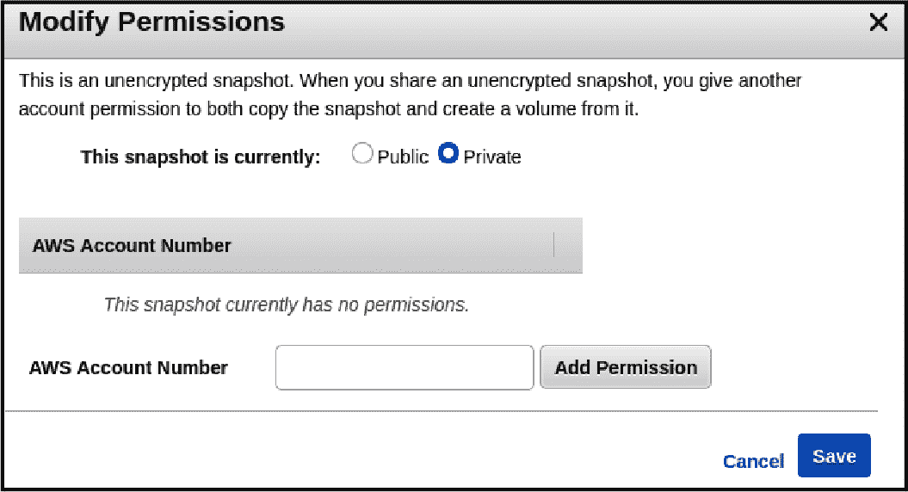
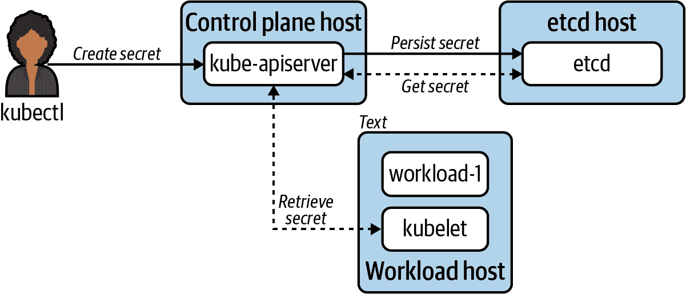
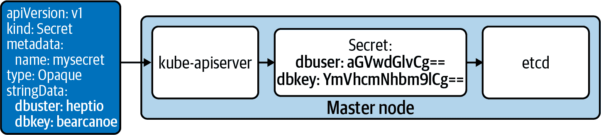
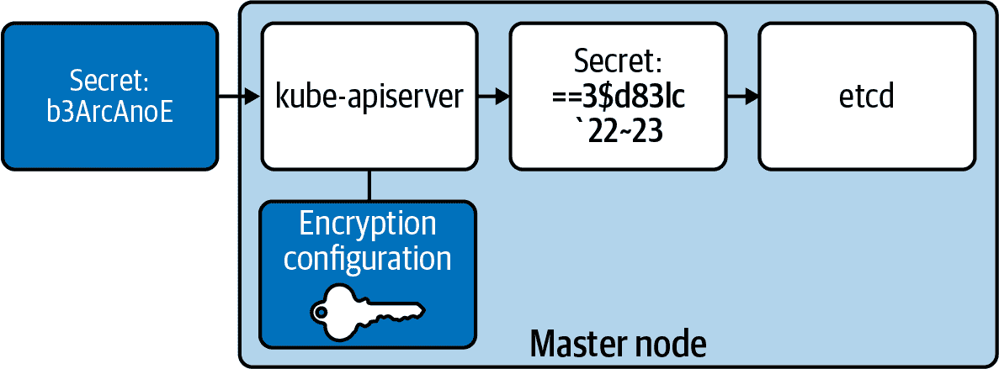
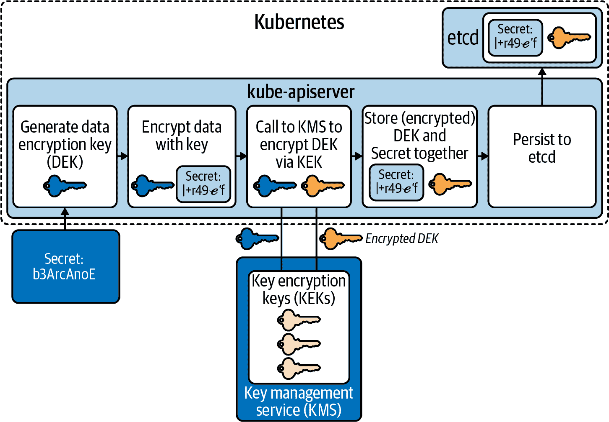
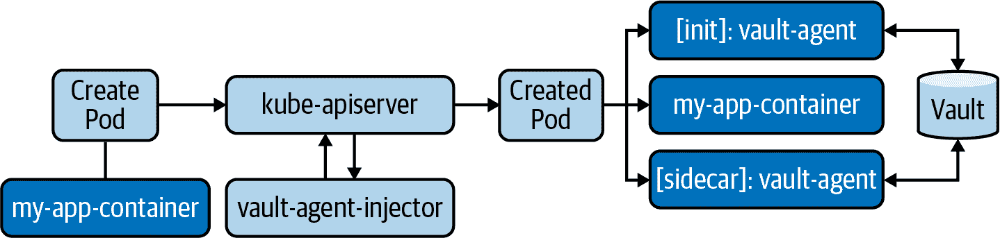
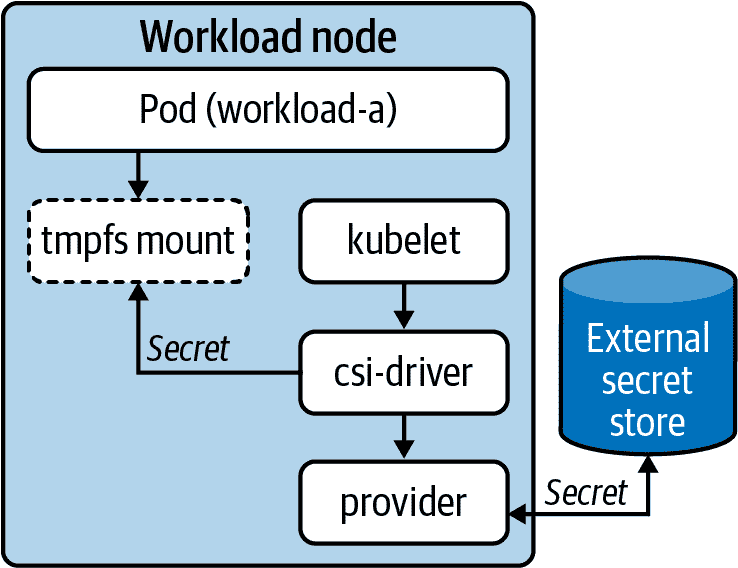
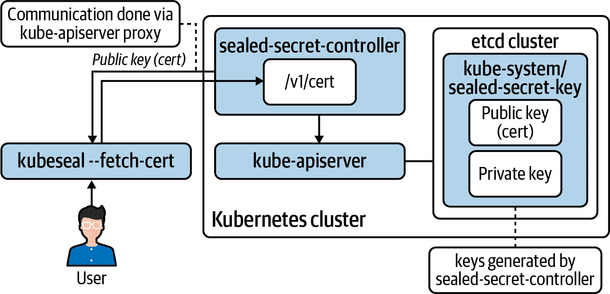
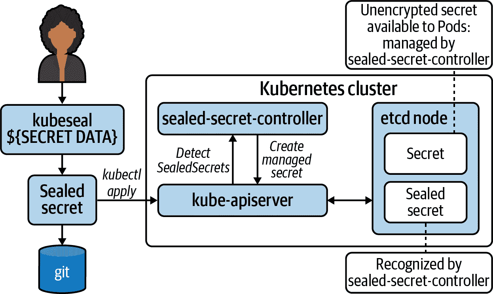

# 第七章：机密管理

在任何应用程序堆栈中，我们几乎肯定会遇到机密数据。这是应用程序希望保持秘密的数据。通常，我们将机密与凭据关联起来。通常这些凭据用于访问集群内或外的系统，如数据库或消息队列。当使用私钥时，我们也会遇到机密数据，这些私钥可能支持我们的应用程序与其他应用程序进行双向 TLS 通信。这些类型的问题在第十一章中有详细讨论。机密的存在带来了许多需要考虑的操作问题，例如：

机密轮换策略

机密可以保留多长时间之前必须更改？

密钥（加密）轮换策略

假设机密数据在持久化到磁盘之前在应用层进行了加密，那么加密密钥可以在多长时间内保留不变？

机密存储策略

存储机密数据需要满足哪些要求？您是否需要将机密持久化到隔离的硬件中？您的机密管理解决方案是否需要与硬件安全模块（HSM）集成？

补救计划

如果机密或加密密钥泄露，您计划如何进行补救？您的计划或自动化是否可以在不影响应用程序的情况下运行？

一个很好的起点是确定为应用程序提供机密管理的哪一层。一些组织选择不在平台级别解决此问题，而是期望应用团队动态地将机密注入其应用程序中。例如，如果一个组织正在运行像 Vault 这样的机密管理系统，应用程序可以直接与 API 通信以进行身份验证和检索机密。应用程序框架甚至可以提供库直接与这些系统通信。例如，Spring 提供了 spring-vault 项目来对接 Vault，检索机密并直接将其值注入 Java 类中。尽管可以在应用程序层面完成此操作，但许多平台团队希望提供企业级别的机密能力作为平台服务，使应用程序开发人员无需关心机密是如何到达那里或者在幕后使用了哪个外部提供者（例如 Vault）。

在本章中，我们将深入探讨如何在 Kubernetes 中处理机密数据。我们将从 Kubernetes 运行的较低级别层开始，逐步向上工作到 Kubernetes 公开的 API，使机密数据可供工作负载使用。像本书中的许多主题一样，您会发现这些考虑和建议存在一个光谱上——一个端点包括您愿意相对于工程投入和风险承受能力有多安全，另一个端点侧重于您希望为使用此平台的开发人员提供什么级别的抽象。

# 深度防御

保护我们机密数据的关键在于我们愿意采取多深的措施来确保其安全。尽管我们很想说我们总是选择最安全的选项，但现实是我们做出合理的决策，保持“足够安全”，并在时间上加以加固。这伴随着风险和技术债务，这是我们工作的本质。然而，不可否认的是对“足够安全”判断失误可能很快让我们声名大噪，但不是以好的方式。在接下来的章节中，我们将深入探讨这些安全层次，并指出一些最关键的要点。

防御可以从物理层面开始。一个典型例子是谷歌。它有多篇[白皮书](https://cloud.google.com/security/overview/whitepaper)，甚至还有一段[YouTube](https://oreil.ly/dtHUx)视频介绍其数据中心安全方法。这包括金属探测器、能够阻止半挂卡车的车辆屏障，以及多层楼宇安全措施以进入数据中心。这种注意细节的扩展超出了现场设备的范围。当驱动器退役时，谷歌授权员工将数据清零，然后可能粉碎和撕碎驱动器。虽然物理安全的主题很有趣，但本书不会深入讨论数据中心物理安全问题，而是云服务提供商为确保其硬件安全所采取的步骤令人惊叹，而这只是个开始。

假设人类在磁盘被清零或压碎之前某种方式获取了访问权限。大多数云服务提供商和数据中心通过确保磁盘在静止状态下进行加密来保护其物理磁盘。提供商可能使用他们自己的加密密钥和/或允许客户提供自己的密钥，这使得提供商几乎无法访问您的未加密数据。这是深度防御的一个完美例子。我们从物理层面、数据中心内部和扩展到对物理磁盘上数据加密，关闭了内部恶意行为者进一步处理用户数据的机会。

## 磁盘加密

让我们更仔细地看看磁盘加密领域。有多种加密磁盘的方法。在 Linux 中，用于全块加密的常见方法是利用 Linux Unified Key System (LUKS)。LUKS 与 dm-crypt 加密子系统配合工作，在 Linux 内核 2.6 版本以来就可用。对于像 vSAN、ceph 或 Gluster 等专用存储系统，每种都提供一种或多种加密静止状态的方式。在云提供商中，默认的加密行为可能会有所不同。例如，对于 AWS，您应该查阅其文档以启用弹性块存储的加密。AWS 提供了启用默认加密的能力，这是我们推荐的最佳实践设置。而 Google Cloud 则以加密静止状态作为其默认模式。与 AWS 类似，它可以配置密钥管理服务 (KMS)，从而使您能够自定义加密行为，例如提供自己的加密密钥。

不论你对云服务提供商或数据中心运营商的信任程度如何，我们强烈建议将数据加密设为默认做法。加密数据在静止状态下意味着数据是*存储*加密的。这不仅有助于减少攻击向量，还能提供一定的保护，防止可能的错误。例如，虚拟机技术使得创建主机快照变得非常简单。快照最终成为像任何其他文件一样的数据，太容易意外暴露于内部或外部网络。为了多层防御的精神，我们应该保护自己免受这种情况的影响，即使通过用户界面或 API 字段选择了错误按钮，泄漏的数据对于没有私钥访问权限的人是毫无用处的。图 7-1 显示了如何轻松切换这些权限的用户界面。



###### 图 7-1\. AWS 快照上的权限设置，警告称“公开”将允许其他人从此快照创建卷，并有可能访问数据。

## 传输安全

对于加密的静止数据有了更好的理解，那么处于活动状态中的数据呢？尽管尚未探索 Kubernetes 密钥管理架构，让我们来看看在服务之间传输时，密钥可能经过的路径。图 7-2 展示了一些密钥在网络主机之间移动的交互点。



###### 图 7-2\. 展示密钥可能通过网络传输的交点的图示。

图表显示了秘密数据通过网络传输到不同主机的情况。无论我们的静态加密策略有多强大，如果任何交互点没有通过 TLS 进行通信，我们就暴露了我们的秘密数据。正如所示 图 7-2，这包括人与系统的交互，kubectl，以及系统与系统之间的交互，kubelet 到 API 服务器。总之，与 API 服务器和 etcd 的通信必须专门通过 TLS 进行。我们不会花太多时间讨论这个需求，因为几乎每种 Kubernetes 集群的安装或引导模式都是默认的。通常，您可能唯一希望执行的配置就是提供一个证书颁发机构（CA）来生成证书。但请记住，这些证书是 Kubernetes 系统组件内部使用的。有了这个理解，您可能不需要覆盖 Kubernetes 将生成的默认 CA。

## 应用加密

应用加密是在我们的系统组件或运行在 Kubernetes 中的工作负载内执行的加密。应用加密本身可以有多个层级。例如，Kubernetes 中的工作负载可以在将数据持久化到 Kubernetes 之前加密数据，然后 Kubernetes 可能再次加密数据，并将其持久化到 etcd，在那里它将在文件系统级别加密。前两个加密点被认为是“应用级别”的。这是很多层加密啊！

尽管我们并不总是会在这么多层次上进行加密或解密，但至少在应用级别对数据进行加密是有意义的。考虑到我们迄今为止讨论的内容：TLS 上的加密和静态数据的加密。如果我们止步于此，我们已经有了一个不错的开始。当机密数据在传输时，它将被加密，并且在物理磁盘上也将被加密。但在运行系统时怎么办呢？尽管存储到磁盘的比特可能已经加密，如果用户能够访问系统，他们可能能够读取这些数据！想象一下你的加密桌面电脑，你可能在一个 dotfile 中保存了敏感凭据（我们都这样做过）。如果我偷走了你的电脑并尝试通过“滑雪”磁盘来访问这些数据，我将无法获取我想要的信息。然而，如果我成功地启动你的计算机并“以你的身份”登录，我现在可以完全访问这些数据。

应用程序加密是在用户空间级别使用密钥加密数据的行为。在这个计算机示例中，我可以使用一个（强大的）密码保护的 gpg 密钥来加密那个 dotfile，需要我的用户在可以使用它之前对其进行解密。编写一个简单的脚本可以自动化这个过程，你可以用更深的*安全模型*来做。作为登录为您的攻击者，即使解密密钥是无用的，因为没有密码它只是无用的位。这个考虑对 Kubernetes 也是适用的。我们将假定在您的集群中设置了两个事物：

+   在 Kubernetes 使用的文件系统和/或存储系统中启用了静态加密。

+   为所有 Kubernetes 组件和 etcd 启用了 TLS。

有了这个，让我们开始探讨 Kubernetes 应用层的加密。

# Kubernetes Secret API

Kubernetes Secret API 是 Kubernetes 中最常用的 API 之一。虽然我们可以以多种方式填充 Secret 对象，但 API 为工作负载提供了一种一致的方式与秘密数据交互。秘密对象与 ConfigMaps 非常相似。它们在工作负载如何消耗对象的机制上也有类似的机制，通过环境变量或卷数据。考虑以下 Secret 对象：

```
apiVersion: v1
kind: Secret
metadata:
  name: mysecret
type: Opaque
data:
  dbuser: aGVwdGlvCg==
  dbkey: YmVhcmNhbm9lCg==
```

在`data`字段中，`dbuser`和`dbkey`是 base64 编码的。所有 Kubernetes 秘密数据都是。如果您希望向 API 服务器提交非编码字符串数据，可以使用以下`stringData`字段：

```
apiVersion: v1
kind: Secret
metadata:
  name: mysecret
type: Opaque
stringData:
  dbuser: heptio
  dbkey: bearcanoe
```

在应用时，`stringData`将在 API 服务器上编码并应用于 etcd。一个常见的误解是，Kubernetes 将此数据编码为安全实践。事实并非如此。秘密数据可以包含各种奇怪的字符或二进制数据。为了确保它被正确存储，它被 base64 编码。默认情况下，确保秘密不被泄露的关键机制是 RBAC。理解 RBAC 动词在秘密中的意义对于防止引入攻击向量至关重要。

`get`

通过名称检索已知秘密的数据。

`list`

获取所有秘密和/或*秘密数据*的列表。

`watch`

查看任何秘密更改和/或更改为*秘密数据*。

正如你可以想象的那样，小的 RBAC 错误，比如给用户列出访问权限，会暴露命名空间中的每一个秘密，或者更糟糕的是整个集群如果意外使用了 ClusterRoleBinding。事实上，在许多情况下，用户根本不需要这些权限。这是因为用户的 RBAC 并不决定工作负载可以访问哪些秘密。通常，kubelet 负责使秘密对容器中的 Pod 可用。总之，只要您的 Pod 引用了有效的秘密，kubelet 将通过您指定的方式使其可用。有几种选项可以在工作负载中公开秘密，下面将介绍。

## 秘密消费模型

对于希望使用秘密的工作负载，有几种选择。如何摄取秘密数据的偏好可能取决于应用程序。但是，选择的方法存在一些权衡。在接下来的几节中，我们将看一下在工作负载中消费秘密数据的三种方法。

### 环境变量

可以将秘密数据注入到环境变量中。在工作负载的 YAML 中，可以指定任意键和对秘密的引用。对于已预期通过减少应用程序代码的需求而在 Kubernetes 上移动的工作负载，这可能是一个不错的功能。考虑以下 Pod 示例：

```
apiVersion: v1
kind: Pod
metadata:
  name: nginx
spec:
  containers:
  - name: nginx
    image: nginx
    env:
      - name: USER 
        valueFrom:
          secretKeyRef:
            name: mysecret 
            key: dbuser 
      - name: PASS
        valueFrom:
          secretKeyRef:
            name: mysecret
            key: dbkey
```


在应用程序中可用的环境变量键。


Kubernetes 中秘密对象的名称。


应该注入到`USER`变量中的秘密对象中的键。

在环境变量中暴露秘密的缺点在于它们无法进行热重新加载。在秘密对象更改后，直到重新创建 Pod，更改才会生效。这可能通过手动干预或系统事件（如需要重新调度）发生。此外，有人认为环境变量中的秘密比从卷挂载中读取的方式不安全。这一点可能会有争议，但公平地指出一些常见的泄露机会是值得的。即在检查进程或容器运行时时，可能会以明文方式看到环境变量。此外，一些框架、库或语言可能支持调试或崩溃模式，其中它们会将环境变量输出到日志中。在使用环境变量之前，应考虑这些风险。

### 卷

或者，秘密对象可以通过卷注入。在工作负载的 YAML 中，配置了一个卷，其中引用了秘密。应将秘密注入到的容器使用`volumeMount`引用该卷：

```
apiVersion: v1
kind: Pod
metadata:
  name: nginx
spec:
  containers:
  - name: nginx
    image: nginx
    volumeMounts:
    - name: creds 
      readOnly: true
      mountPath: "/etc/credentials" 
  volumes: 
  - name: creds
    secret:
      secretName: mysecret
```


可挂载的 Pod 级别卷。指定的名称必须在挂载中引用。


要挂载到容器文件系统中的卷对象。


挂载在容器文件系统中的位置。

使用此 Pod 清单，秘密数据在*/etc/credentials*下可用，秘密对象中的每个键/值对都有自己的文件：

```
root@nginx:/# cat /etc/credentials/db
dbkey   dbuser
```

通过卷的方法最大的好处是可以动态更新秘密，而无需重启 Pod。当看到秘密发生变化时，kubelet 将重新加载秘密，并且在容器的文件系统中显示为已更新。需要强调的是，kubelet 在 Linux 上使用 tmpfs 确保秘密数据仅存储在内存中。我们可以通过查看 Linux 主机上的挂载表文件来验证这一点：

```
# grep 'secret/creds' secret/creds

tmpfs
/var/lib/kubelet/pods/
e98df9fe-a970-416b-9ddf-bcaff15dff87/volumes/
kubernetes.io~secret/creds tmpfs rw,relatime 0 0
```

如果从此主机上移除 `nginx` Pod，则此挂载将被丢弃。在考虑这种模型时，特别需要注意的是，秘密数据*永远*不应该很大。理想情况下，它仅包含凭据或密钥，永远不应用作伪数据库。

从应用程序的角度来看，只需在目录或文件上进行简单的监控，然后将值重新注入应用程序即可处理秘密变更。无需理解或与 Kubernetes API 服务器通信。我们在许多工作负载中看到了这种模式的成功应用。

### 客户端 API 消费

最后的消费模型，客户端 API 消费，并不是核心 Kubernetes 功能。这种模型要求应用程序与 kube-apiserver 通信以检索 Secret(s) 并将其注入应用程序。有许多框架和库可以使应用程序轻松与 Kubernetes 通信。例如，对于 Java，Spring 的 Spring Cloud Kubernetes 将此功能引入到了 Spring 应用程序中。它将常用的 Spring PropertySource 类型连接到 Kubernetes，以检索 Secret 和/或 ConfigMap。

现在我们已经介绍了在工作负载级别消费秘密的方式，是时候谈谈存储秘密数据了。

## etcd 中的秘密数据

像大多数 Kubernetes 对象一样，Secrets 存储在 etcd 中。默认情况下，在将 Secrets 持久化到 etcd 之前，Kubernetes 层不进行任何加密。图 7-3 展示了从清单到 etcd 的秘密流程。



###### 图 7-3\. Kubernetes 中默认的秘密数据流程（有时 colocated etcd 运行在单独的主机上）。

虽然 Kubernetes 并*不*加密秘密数据，但这并不意味着在获得硬件访问权限后可以访问数据。请记住，可以通过诸如 Linux 统一密钥设置（LUKS）之类的方法对磁盘上的数据进行加密，这样即使物理访问硬件，也只能访问到加密数据。对于许多云提供商和企业数据中心来说，这是默认的操作模式。然而，如果我们获得了对运行 etcd 的服务器的`ssh`访问权限，并且有特权或者可以升级权限来查看其文件系统，则我们可能会获取到秘密数据。

对于某些情况，这种默认模型可能是可接受的。etcd 可以在 Kubernetes API 服务器外部运行，确保至少由一个分区隔离。在这种模型中，攻击者可能需要获取 etcd 节点的 root 访问权限，找到数据位置，然后从 etcd 数据库中读取秘密。另一个入口点将是对手获取 API 服务器的 root 访问权限，找到 API 服务器和 etcd 证书，然后冒充 API 服务器与 etcd 通信以读取秘密。这两种情况都假设可能存在其他漏洞。例如，攻击者必须获取正在运行控制平面组件的内部网络或子网的访问权限。此外，他们需要获取适当的密钥以便`ssh`进入节点。坦率地说，在这种情况之前，RBAC 错误或应用程序的妥协将暴露秘密更有可能。

为了更好地理解威胁模型，让我们通过一个示例来说明攻击者如何获取秘密的过程。假设攻击者通过 SSH 访问并获得了 kube-apiserver 节点的 root 访问权限。攻击者可以设置以下脚本：

```
#!/bin/bash

# Change this based on location of etcd nodes
ENDPOINTS='192.168.3.43:2379'

ETCDCTL_API=3 etcdctl \
  --endpoints=${ENDPOINTS} \
  --cacert="/etc/kubernetes/pki/etcd/ca.crt" \
  --cert="/etc/kubernetes/pki/apiserver-etcd-client.crt" \
  --key="/etc/kubernetes/pki/apiserver-etcd-client.key" \
  ${@}
```

在此片段中看到的证书和密钥位置是 Kubernetes 通过 kubeadm 引导时的默认设置，这也是许多工具如 cluster-api 所使用的。etcd 将秘密数据存储在目录*/registry/secrets/${NAMESPACE}/${SECRET_NAME}*中。使用此脚本获取名为`login1`的秘密将如下所示：

```
# ./etcctl-script get /registry/secrets/default/login1

/registry/secrets/default/login1
k8s

v1Secret

login1default"*$6c991b48-036c-48f8-8be3-58175913915c2bB
0kubectl.kubernetes.io/last-applied-configuration{"apiVersion":"v1","data":
{"dbkey":"YmVhcmNhbm9lCg==","dbuser":"aGVwdGlvCg=="},"kind":"Secret",
"metadata":{"annotations":{},"name":"login1","namespace":"default"},
"type":"Opaque"}
z
dbkey
bearcanoe

dbuserheptio
Opaque"
```

通过这样，我们成功地泄露了秘密`login1`。

即使存储未加密的秘密可能被接受，许多平台运营商选择不止步于此。Kubernetes 支持几种在 etcd 内部加密数据的方式，从而进一步加深了您在秘密保护方面的防御深度。这些方式包括支持在静止状态下加密（即在 Kubernetes 层进行加密）之前在 etcd 中存储秘密的模型。这些模型包括静态密钥加密和信封加密。

## 静态密钥加密

Kubernetes API 服务器支持在静止状态下加密秘密。这通过向 Kubernetes API 服务器提供加密密钥来实现，它将用于在将所有秘密对象持久化到 etcd 之前对其进行加密。图 7-4 展示了在使用静态密钥加密时秘密的流动过程。



###### 图 7-4. 在 API 服务器上使用的加密密钥与在将秘密存储到 etcd 之前对其进行加密之间的关系。

放置在`EncryptionConfiguration`中的密钥用于在秘密对象通过 API 服务器时进行加密和解密。如果攻击者访问了 etcd，他们将看到其中的加密数据，这意味着秘密数据并未泄露。可以使用各种提供者（包括 secretbox、aescbc 和 aesgcm）创建密钥。

每个提供商都有自己的权衡，我们建议与您的安全团队合作选择合适的选项。Kubernetes 问题＃81127 对于这些提供商的一些考虑是一个很好的阅读资料。如果您的企业需要符合 Federal Information Processing Standards（FIPS）等标准，应仔细考虑这些选择。在我们的示例中，我们将使用 secretbox，它作为一种性能良好且安全的加密提供程序。

要设置静态密钥加密，我们必须生成一个 32 字节的密钥。我们的加密和解密模型是对称的，因此一个单独的密钥可以同时用于两个目的。如何生成密钥可能会因企业而异。如果我们对其熵满意，可以在 Linux 主机上轻松使用`/dev/urandom`：

```
head -c 32 /dev/urandom | base64
```

使用这个密钥数据，应该在运行 kube-apiserver 的所有节点上添加 EncryptionConfiguration。如果使用 Cluster API，应使用配置管理工具如 ansible 或 KubeadmConfigSpec 添加此静态文件。这确保了密钥可以添加、删除和轮转。以下示例假定配置存储在*/etc/kubernetes/pki/secrets/encryption-config.yaml*中：

```
apiVersion: apiserver.config.k8s.io/v1
kind: EncryptionConfiguration
resources:
  - resources:
    - secrets
    providers:
    - secretbox:
        keys:
        - name: secret-key-1
          secret: u7mcOcHKbFh9eVluB18hbFIsVfwpvgbXv650QacDYXA==
    # identity is a required (default) provider
    - identity: {}
```

提供者列表是有序的，这意味着加密将始终使用第一个密钥，解密将按密钥列表的顺序尝试。身份是默认的明文提供者，应该放在最后。如果它是第一个，密码将不会加密。

要遵循上述配置，必须更新 kube-apiserver 的每个实例以在本地加载 EncryptionConfiguration。在*/etc/kubernetes/manifests/kube-apiserver.yaml*中，可以添加参数如下。

```
--encryption-provider-config=/etc/kubernetes/pki/secrets/encryption-config.yaml
```

一旦 kube-apiserver(s)重新启动，此更改将生效，并且在发送到 etcd 之前将加密密码。kube-apiserver 的重启可能是自动的。例如，当使用静态 Pod 来运行 API 服务器时，对清单文件的更改将触发重新启动。一旦您经过实验阶段，建议预先使用此文件预配置主机，并确保默认情况下启用`encryption-provider`。可以使用配置管理工具如 Ansible 或者使用 cluster-api，在 kubeadmConfigSpec 中设置该静态文件来添加 EncryptionConfiguration 文件。请注意，这种 cluster-api 方法将 EncryptionConfiguration 放在用户数据中；确保用户数据已加密！通过向 ClusterConfiguration 中的 apiServer 添加参数，可以通过向 API 服务器添加`encryption-provider-config`标志来完成。假设您正在使用 kubeadm，否则，请根据启动服务器的机制确保标志存在。

要验证加密，您可以将一个新的 secret 对象应用到 API 服务器上。假设秘密的名称是`login2`，使用上一节的脚本，我们可以如下检索它：

```
# ./etcctl-script get /registry/secrets/default/login2

/registry/secrets/default/login2
k8s:enc:secretbox:v1:secret-key-1:^Dʜ
                                     HN,lU/:L kdR<_h (fO$V
y.
  r/m
MٜjVĄGP<%B0kZHY}->q|&c?a\i#xoZsVXd+8_rCצgcjMv<X5N):MQ'7݋t
'pLBxqݡ)b݉/+r49ޓ`f
 6(iciQⰪſ$'.ejbprλ=Cp+R-D%q!r/pbv1_.izyPlQ)1!7@X\0
                                                                  EiĿr(dwlS
```

这里我们可以看到数据完全加密在 etcd 中。请注意，有元数据指定了使用的提供者（`secretbox`）和密钥（`secret-key-1`）进行加密。这对 Kubernetes 很重要，因为它同时支持多个提供者和密钥。任何在设置加密密钥之前创建的对象，假设`login1`，可以查询并仍然以明文显示：

```
# ./etcctl-script get /registry/secrets/default/login1

/registry/secrets/default/login1
k8s
```

这演示了两个重要概念。其一，`login1` *未* 加密。虽然加密密钥已就位，但只有新创建或修改的秘密对象将使用此密钥进行加密。其二，当通过 kube-apiserver 返回时，不存在提供者/密钥映射，也不会尝试解密。后一概念很重要，因为强烈建议您在定义的时间内轮换加密密钥。假设您每三个月轮换一次。当三个月过去后，我们将如下更改 EncryptionConfiguation：

```
- secretbox:
        keys:
        - name: secret-key-2
          secret: xgI5XTIRQHN/C6mlS43MuAWTSzuwkGSvIDmEcw6DDl8=
        - name: secret-key-1
          secret: u7mcOcHKbFh9eVluB18hbFIsVfwpvgbXv650QacDYXA=
```

*关键*在于不要删除`secret-key-1`。虽然它将不会用于新的加密，但它用于以前由它加密的现有秘密对象的解密！删除此密钥将阻止 API 服务器向客户端返回秘密对象，例如`login2`。由于此密钥是第一个，它将用于所有新的加密。更新秘密对象时，它们将随时间重新使用此新密钥进行重新加密。在此之前，原始密钥可以作为后备解密选项保留在列表中。如果删除该密钥，您将从客户端看到以下响应：

```
Error from server (InternalError): Internal error occurred: unable to transform
key "/registry/secrets/default/login1": no matching key was found for the
provided Secretbox transformer
```

## 信封加密

Kubernetes 1.10 及更高版本支持与 KMS 集成以实现信封加密。信封加密涉及两个密钥：密钥加密密钥（KEK）和数据加密密钥（DEK）。KEK 存储在 KMS 中并且只有在 KMS 提供者被 ompromise 的情况下才会有风险。KEK 用于加密 DEK，DEK 负责加密 Secret 对象。每个 Secret 对象都有其自己独特的 DEK 用于加密和解密数据。由于 DEK 由 KEK 加密，它们可以与数据本身一起存储，从而使 kube-apiserver 无需了解许多密钥。从架构上讲，信封加密的流程将看起来像[图 7-5 中显示的图表。



###### 图 7-5. 使用信封加密加密秘密的流程。KMS 层位于集群外。

根据 KMS 提供者的不同，此流程的工作方式可能会有所不同，但通常这演示了信封加密的功能。这种模型有多个好处：

+   KMS 外部到 Kubernetes，通过隔离增强安全性。

+   KEK 的集中化使密钥轻松旋转。

+   DEK 和 KEK 的分离意味着秘密数据永远不会被发送到或被 KMS 知道

+   KMS 仅关注解密 DEK。

+   DEK 的加密意味着它们很容易与其密钥一起存储，使得与其密钥相关的管理变得容易。

提供者插件通过在运行 kube-apiserver 的主节点上运行实现 gRPC 服务器的特权容器来工作，该容器可以与远程 KMS 通信。然后，类似于在上一节设置加密时，必须向主节点添加一个 EncryptionConfiguration，其中包含与 KMS 插件通信的设置：

```
apiVersion: apiserver.config.k8s.io/v1
kind: EncryptionConfiguration
resources:
- resources:
- secrets
providers:
- kms:
    name: myKmsPlugin
    endpoint: unix:///tmp/socketfile.sock
    cachesize: 100
    timeout: 3s
# required, but not used for encryption
- identity: {}
```

假设 EncryptionConfiguration 保存在每个主节点的*/etc/kubernetes/pki/secrets/encryption-config.yaml*，则必须更新 kube-apiserver 的参数以包含以下内容：

```
--encryption-provider-config=/etc/kubernetes/pki/secrets/encryption-config.yaml
```

更改该值应重新启动 kube-apiserver。如果没有重新启动，则需要重新启动才能生效。

从设计角度来看，这是一个可行的模型。然而，KMS 插件的实现非常稀缺，现有的实现也比较不成熟。在我们撰写本书时，以下数据点是真实的。对于 aws-encryption-provider（AWS）或 k8s-cloudkms-plugin（Google），都没有标记的发布版本。Azure 的插件 kubernetes-kms 存在显著的限制，比如不支持密钥轮换。因此，除了在如 GKE 这样的托管服务中运行，其中 KMS 插件是自动可用且受 Google 支持的情况下，使用可能会不稳定。最后，唯一的跨云提供商通用的 KMS 插件是 kubernetes-vault-kms-plugin，但它只部分实现，并且已经归档（放弃）。

# 外部提供者

Kubernetes 并不是我们认为的企业级秘密存储系统。虽然它确实提供了 Secret API，可用于诸如服务账户之类的东西，但对于企业秘密数据，它可能表现不佳。使用它来存储应用程序秘密并没有什么本质上的问题，只要理解风险和选项，这正是本章节迄今为止主要描述的内容！然而，许多客户需要比 Secret API 能提供的更多，特别是那些在金融服务等行业工作的用户。这些用户需要诸如与硬件安全模块（HSM）集成和高级密钥轮换策略之类的能力。

我们的建议通常是从 Kubernetes 提供的功能开始，并查看是否适用于加固其安全性（即加密）的方法。正如前一节所述，提供信封加密的 KMS 加密模型在 etcd 中保护秘密数据的安全性方面具有相当强大的功能。如果需要进一步扩展（我们通常会这样做），我们会寻找工程团队已有操作知识的秘密管理工具。在生产环境中运行秘密管理系统可能是一项具有挑战性的任务，类似于运行任何需要不仅高可用性而且需要保护免受潜在攻击者侵害的有状态服务。

## 金库

Vault 是 HashiCorp 推出的开源项目。在我们的客户中，当涉及到秘密管理解决方案时，它迄今为止是最受欢迎的项目。Vault 在云原生领域找到了几种集成方式。已经在提供类似 Spring 和 Kubernetes 本身的框架中进行了工作，提供了一流的集成。一个新兴的模式是在 Kubernetes 中运行 Vault，并允许 Vault 使用 TokenReview API 对抗 Kubernetes API Server 进行身份验证请求。接下来，我们将探讨两个常见的 Kubernetes 集成点，包括 sidecar 和 initContainer 注入以及一个更新的方法，CSI 集成。

## Cyberark

Cyberark 是另一个我们与客户见到的流行选择。作为一家公司，它已经存在了一段时间，并且我们经常发现已有的投资和希望将 Kubernetes 与其集成的愿望。Cyberark 提供凭据提供程序和动态访问提供程序（DAP）。DAP 提供多种企业机制，Kubernetes 管理员可能希望与之集成。与 Vault 类似，它支持与应用程序一起使用 initContainers 与 DAP 进行通信的能力。

## 注入集成

一旦外部密钥存储对 Kubernetes 中的工作负载可用，有几种检索选项。本节介绍了这些方法、我们的建议以及权衡。我们将介绍每种设计方法来使用秘密并描述 Vault 的实现。

当可能时，此方法运行一个 initContainer 和/或 sidecar 容器与外部秘密存储通信。通常，秘密被注入到 Pod 的文件系统中，使其对所有运行在 Pod 中的容器可用。我们强烈推荐此方法。其主要优点是完全将秘密存储与应用程序解耦。但是，这确实使平台更复杂，因为现在 Kubernetes 平台的服务之一是促进秘密注入。

Vault 实现这一模型的方式是使用指向 vault-agent-injector 的 MutatingWebhook。随着 Pod 的创建，基于注释，vault-agent-injector 添加一个 initContainer（用于检索初始秘密）和一个 sidecar 容器以保持必要时更新的秘密。图 7-6 展示了 Pod 和 Vault 之间交互流的过程。



###### 图 7-6\. Sidecar 注入架构。除了 my-app-container，所有 Vault Pod 都作为 sidecar 运行。

将注入这些特定于 vault 的容器的 MutatingWebhook 的配置如下所示：

```
apiVersion: admissionregistration.k8s.io/v1
kind: MutatingWebhookConfiguration
metadata:
  labels:
    app.kubernetes.io/instance: vault
    app.kubernetes.io/managed-by: Helm
    app.kubernetes.io/name: vault-agent-injector
  name: vault-agent-injector-cfg
webhooks:
- admissionReviewVersions:
  - v1beta1
  clientConfig:
    caBundle: REDACTED
    service:
      name: vault-agent-injector-svc
      namespace: default
      path: /mutate
      port: 443
  failurePolicy: Ignore
  matchPolicy: Exact
  name: vault.hashicorp.com
  namespaceSelector: {}
  objectSelector: {}
  reinvocationPolicy: Never
  rules:
  - apiGroups:
    - ""
    apiVersions:
    - v1
    operations:
    - CREATE
    - UPDATE
    resources:
    - pods
    scope: '*'
  sideEffects: Unknown
  timeoutSeconds: 30
```

MutatingWebhook 在每个 Pod 创建或更新事件时被调用。虽然每个 Pod 都会进行评估，但并不是每个 Pod 都会被改变或者注入 vault-agent。vault-agent-injector 在每个 Pod 规范中寻找两个注释：

`vault.hashicorp.com/agent-inject: "true"`

指示注入器包含一个 vault-agent initContainer，该容器检索秘密并将其写入 Pod 的文件系统，以在其他容器启动之前完成。

`vault.hashicorp.com/agent-inject-status: "update"`

指示注入器包含一个运行在工作负载旁边的 vault-agent sidecar。它将在 Vault 中的秘密更改时更新该秘密。此模式下仍然运行 initContainer。此参数是可选的，当不包括时，不会添加 sidecar。

当 vault-agent-injector 根据`vault.hashicorp.com/agent-inject: "true"`进行突变时，将添加以下内容：

```
initContainers:
- args:
  - echo ${VAULT_CONFIG?} | base64 -d > /tmp/config.json
  - vault agent -config=/tmp/config.json
  command:
  - /bin/sh
  - -ec
  env:
  - name: VAULT_CONFIG
    value: eyJhd
  image: vault:1.3.2
  imagePullPolicy: IfNotPresent
  name: vault-agent-init
  securityContext:
    runAsGroup: 1000
    runAsNonRoot: true
    runAsUser: 100
  volumeMounts:
  - mountPath: /vault/secrets
    name: vault-secrets
```

当 vault-agent-injector 看到注解`vault.hashicorp.com/agent-inject-status: "update"`时，将添加以下内容：

```
containers:
  #
  # ORIGINAL WORKLOAD CONTAINER REMOVED FOR BREVITY
  #
- name: vault-agent
  args:
  - echo ${VAULT_CONFIG?} | base64 -d > /tmp/config.json
  - vault agent -config=/tmp/config.json
  command:
  - /bin/sh
  - -ec
  env:
  - name: VAULT_CONFIG
    value: asdfasdfasd
  image: vault:1.3.2
  imagePullPolicy: IfNotPresent
  securityContext:
    runAsGroup: 1000
    runAsNonRoot: true
    runAsUser: 100
  volumeMounts:
  - mountPath: /vault/secrets
    name: vault-secrets
```

存在代理后，它们将基于 Pod 的注解检索和下载秘密，例如请求从 Vault 获取数据库秘密的以下注解：

```
vault.hashicorp.com/agent-inject-secret-db-creds: "serets/db/creds"
```

默认情况下，秘密值将被持久化，就像打印出 Go map 一样。从语法上看，它如下所示。所有秘密都放在*/vault/secrets*中：

```
key: map[k:v],
key: map[k:v]
```

为了确保秘密的格式对使用最佳，Vault 支持将模板添加到 Pod 的注解中。这使用了标准的 Go 模板。例如，要创建一个 JDBC 连接字符串，可以将以下模板应用于名为`creds`的秘密：

```
spec:
  template:
    metadata:
      annotations:
        vault.hashicorp.com/agent-inject: "true"
        vault.hashicorp.com/agent-inject-status: "update"
        vault.hashicorp.com/agent-inject-secret-db-creds: "secrets/db/creds"
        vault.hashicorp.com/agent-inject-template-db-creds: |
          {{- with secret "secrets/db/creds" -}}
          jdbc:oracle:thin:{{ .Data.data.username }}/{{ .Data.data.password }}
          {{- end }}
```

在此模型中的主要复杂性区域是请求 Pod 的身份验证和授权。Vault 提供了多种[认证方法](https://www.vaultproject.io/docs/auth)。在 Kubernetes 中运行 Vault，特别是在此 sidecar 注入模型中，您可能希望设置 Vault 针对 Kubernetes 进行身份验证，以便 Pod 可以将其现有的服务账户令牌作为身份提供。设置此身份验证机制如下所示：

```
# from within a vault container 
vault write auth/kubernetes/config \
    kubernetes_host="https://$KUBERNETES_PORT_443_TCP_ADDR:443" \ 
    kubernetes_ca_cert=@/var/run/secrets/kubernetes.io/serviceaccount/ca.crt \
    token_reviewer_jwt=\
    "$(cat /var/run/secrets/kubernetes.io/serviceaccount/token)" 
```


此环境变量默认应出现在 Vault Pod 中。


此 Pod 的服务账户令牌位置，用于对抗 Kubernetes API 服务器进行 TokenReview 请求时进行身份验证。

当秘密请求进入 Vault 时，Vault 可以通过与 Kubernetes TokenReview API 通信来验证请求者的身份。假设身份已验证，Vault 接着必须确定服务账户是否被授权访问秘密。必须在 Vault 中配置和维护这些授权策略和服务账户与策略之间的绑定。在 Vault 中，策略编写如下：

```
# from within a vault container
vault policy write team-a - <<EOF

path "secret/data/team-a/*" {
 capabilities = ["read"]
}
EOF
```

这在 Vault 中创建了一个名为`team-a`的策略，它提供对*secret/data/team-a/*中所有秘密的读取访问权限：

```
vault policy list
default
team-a
root
```

最后一步是将请求者的服务账户与策略关联，以便 Vault 授权访问：

```
vault write auth/kubernetes/role/database \
    bound_service_account_names=webapp \ 
    bound_service_account_namespaces=team-a \ 
    policies=team-a \ 
    ttl=20m 
```


请求者的服务账户名称。


请求者的命名空间。


绑定以将此帐户关联到一个或多个策略。


Vault 特定授权令牌应该存活多久。一旦过期，将再次执行认证/授权。

我们迄今探索的 Vault 特定过程可能适用于任何种类的外部秘密管理存储。在处理超出 Kubernetes 核心的系统时，你将面临一定程度的身份和授权集成开销。

## CSI 集成

秘密存储集成的较新方法是利用 secrets-store-csi-driver。在撰写本文时，这是 kubernetes-sigs 内的 Kubernetes 子项目。此方法使得可以在更低级别上集成秘密管理系统。具体来说，它使得 Pod 能够访问外部托管的秘密，而无需运行 sidecar 或 initContainer 将秘密数据注入到 Pod 中。结果是秘密交互更像是一个平台服务，而不是应用程序需要集成的东西。secrets-store-csi-driver 在每个主机上运行一个驱动 Pod（作为 DaemonSet），类似于你期望 CSI 驱动程序与存储提供程序合作的方式。

然后，驱动程序依赖于负责在外部系统中查找秘密的提供程序。在 Vault 的情况下，这将涉及在每台主机上安装 `vault-provider` 二进制文件。二进制文件的位置应该是驱动程序的 `provider-dir` 挂载设置的地方。这个二进制文件可能已经存在于主机上，或者通常通过类似于 DaemonSet 的进程进行安装。整体架构看起来与 图 7-7 所示的接近。



###### 第 7-7 图。CSI 驱动程序的交互流程。

这是一个基于其用户体验和抽象秘密提供程序能力而显有前景的相对较新的方法。然而，它确实带来了额外的挑战。例如，当 Pod 本身没有请求秘密时，身份如何处理？这是驱动程序和/或提供程序必须解决的问题，因为它们代表 Pod 发出请求。目前，我们可以查看主要的 API，其中包括 SecretProviderClass。要与 Vault 等外部系统进行交互，SecretProviderClass 将如下所示：

```
apiVersion: secrets-store.csi.x-k8s.io/v1alpha1
kind: SecretProviderClass
metadata:
  name: apitoken
spec:
  provider: vault
  parameters:
    roleName: "teama"
    vaultAddress: "https://vault.secret-store:8000" 
    objects:  |
      array:
        - |
          objectPath: "/secret/team-a" 
          objectName: "apitoken" 
          objectVersion: ""
```


这是 Vault 的位置，应该是服务名称 (`vault`) 后跟命名空间 `secret-store`。


这是 Vault 中写入 Key/Value 对象的路径。


这是在 `team-a` 中查找的实际对象。

有了 SecretProviderClass，Pod 可以如下消费和引用此内容：

```
kind: Pod
apiVersion: v1
metadata:
  name: busybox
spec:
  containers:
  - image:
    name: busybox
    volumeMounts:
    - name: secrets-api
      mountPath: "/etc/secrets/apitoken"
      readOnly: true
  volumes:
    - name: secrets-api
      csi:
        driver: secrets-store.csi.k8s.com
        readOnly: true
        volumeAttributes:
          secretProviderClass: "apitoken"
```

当此 Pod 启动时，驱动程序和提供程序尝试检索秘密数据。假设对外部提供者的身份验证和授权成功，秘密数据将以卷挂载的形式出现，就像任何 Kubernetes 密钥一样。从节点上的驱动 Pod，您可以查看日志，看到发送给提供程序的命令：

```
level=info msg="provider command invoked: /etc/kubernetes/
secrets-store-csi-providers/vault/provider-vault --attributes [REDACTED]
--secrets [REDACTED] [--targetPath /var/lib/kubelet/pods/
643d7d88-fa58-4f3f-a7eb-341c0adb5a88/volumes/kubernetes.io~csi/
secrets-store-inline/mount --permission 420]"
```

总结一下，secret-store-csi-driver 是值得关注的一种方法。随着项目的稳定和提供者开始成熟，随着时间的推移，我们可能会看到这种方法在构建基于 Kubernetes 的应用程序平台时变得普遍起来。

# 在声明式世界中的 Secrets

应用部署、持续集成和持续交付的共同愿景是纯粹地转向声明式模型。这与 Kubernetes 中使用的模型相同，在这里你声明一个期望的状态，随着时间推移，控制器会努力协调期望状态与当前状态。对于应用开发者和 DevOps 团队来说，这些愿景通常表现为一个称为 GitOps 的模式。大多数 GitOps 方法的核心是将一个或多个 git 仓库作为工作负载的真实来源。当在某个分支或标签上看到提交时，它可以被构建和部署流程接收，通常在集群内完成。最终目标是使可用的工作负载能够接收流量。类似 GitOps 的模型在第十五章中有更详尽的讨论。

当采用纯粹声明式方法时，秘密数据会带来独特的挑战。当然，您可以将配置与代码一起提交，但是应用程序使用的凭据和密钥怎么办？我们觉得在提交中出现 API 密钥可能会让某些人感到不安。有一些解决方法。当然，其中之一是将秘密数据保留在声明式模型之外，并且对 GitOps 的神灵忏悔你的罪行。另一种方法是考虑“封存”您的秘密数据，以一种访问数据不会暴露有意义值的方式，这将在下一节中探讨。

## 密封 Secrets

我们如何真正地封存一个秘密？这个概念并不新鲜。使用非对称加密，我们可以确保一种方法来加密秘密，将其提交到指定位置，而不必担心有人暴露数据。在这种模型中，我们有一个加密密钥（通常是公钥）和一个解密密钥（通常是私钥）。其思想是，由加密密钥创建的任何秘密，如果没有私钥被泄露，其值就无法被破解。当然，我们需要确保在这种模型中安全的许多事情，例如选择一个可信赖的密码算法，确保私钥始终安全，并建立加密密钥和秘密数据轮换策略。我们将在即将到来的章节中探讨的模型是，在集群中生成私钥时，开发者可以分发他们自己的加密密钥，用于他们的秘密数据。

## 密封的 Secrets 控制器

Bitnami-labs/sealed-secrets 是一个常用的开源项目，用于实现上述描述。然而，如果您选择替代工具或自行构建，关键概念不太可能发生重大变化。

该项目的关键组件是运行在集群内部的 sealed-secret-controller。默认情况下，它会生成执行加密和解密所需的密钥。在客户端，开发人员使用名为 kubeseal 的命令行实用程序。由于我们使用的是非对称加密，kubeseal 只需知道公钥（用于加密）。一旦开发人员使用它加密其数据，他们甚至无法直接解密这些值。为了开始工作，我们首先将控制器部署到集群中：

```
kubectl apply -f
https://github.com/bitnami-labs/sealed-secrets/releases/\
download/v0.9.8/controller.yaml
```

默认情况下，控制器将为我们创建加密和解密密钥。但是，也可以使用自己的证书。公（证书）和私（键）存储在 *kube-system/sealed-secret-key* 下的 Kubernetes Secret 中。下一步是允许开发人员检索加密密钥，以便他们开始工作。这不应通过直接访问 Kubernetes Secret 来完成。相反，控制器公开了一个端点，可以用于检索加密密钥。如何访问此服务取决于您，但客户端需要能够使用以下命令调用它，其流程在图 7-8 中有详细介绍：

```
kubeseal --fetch-cert
```



###### 图 7-8\. Sealed-secret-controller 架构。

一旦在 kubeseal 中加载了公钥，就可以生成包含（加密的）秘密数据的 SealedSecret CRD。这些 CRD 存储在 etcd 中。sealed-secret-controller 通过标准的 Kubernetes Secrets 使秘密数据可用。为确保 SealedSecret 数据正确转换为 Secret，您可以在 SealedSecret 对象中指定模板。

您可以从 Kubernetes Secret 开始，就像任何其他的一样：

```
apiVersion: v1
kind: Secret
metadata:
  name: mysecret
type: Opaque
data:
  dbuser: aGVwdGlvCg==
  dbkey: YmVhcmNhbm9lCg==
```

要“密封”秘密，您可以对其运行 kubeseal，并生成 JSON 中的加密输出：

```
kubeseal mysecret.yaml
```

```
{
  "kind": "SealedSecret",
  "apiVersion": "bitnami.com/v1alpha1",
  "metadata": {
    "name": "mysecret",
    "namespace": "default",
    "creationTimestamp": null
  },
  "spec": {
    "template": {
      "metadata": {
        "name": "mysecret",
        "namespace": "default",
        "creationTimestamp": null
      },
      "type": "Opaque"
    },
    "encryptedData": {
      "dbkey": "gCHJL+3bTRLw6vL4Gf......",
      "dbuser": "AgCHJL+3bT......"
    }
  },
  "status": {

  }
}
```

前面的 SealedSecret 对象可以放置在任何地方。只要 sealed-secret-controller 持有的密封密钥未被泄露，数据就是安全的。在这个模型中，特别重要的是轮换，这在后续部分中有详细介绍。

一旦应用，流程和存储看起来如图 7-9 所描述。

由 sealed-secret-controller 制作的 Secret 对象归其相应的 SealedSecret CRD 所有：

```
ownerReferences:
- apiVersion: bitnami.com/v1alpha1
  controller: true
  kind: SealedSecret
  name: mysecret
  uid: 49ce4ab0-3b48-4c8c-8450-d3c90aceb9ee
```



###### 图 7-9\. 围绕管理密封和非密封秘密的 Sealed-secret-controller 交互。

这意味着如果删除 SealedSecret，则其对应的 Secret 对象将被垃圾收集。

## 密钥更新

如果密封的密钥泄漏（可能是由于 RBAC 配置错误），则应该视每个密钥为已泄漏。特别重要的是要定期更新密封密钥，并理解“更新”的范围。默认行为是每 30 天更新一次此密钥。它不会替换现有的密钥，而是追加到能够解封数据的现有密钥列表中。然而，新密钥用于所有新的加密活动。最重要的是，现有的密封密钥不会重新加密。

如果发生密钥泄漏事件，您应该：

+   立即旋转您的加密密钥。

+   旋转所有现有的秘密。

+   请记住，仅重新加密是不够的。例如，某人可以轻松地进入 git 历史记录，找到旧的加密资产，并使用已泄露的密钥对其进行操作。一般来说，您应该有密码和密钥的旋转和更新策略。

SealedSecrets 使用一个技巧，在加密过程中使用 Namespace。这提供了一种隔离机制，使得 SealedSecret 真正属于其创建的 Namespace，而不能仅仅在它们之间移动。一般来说，这种默认行为是最安全的，应该保持不变。然而，它确实支持可配置的访问策略，这在 sealed-secrets 文档中有所覆盖。

## 多集群模型

封密模型的另一个关键考虑因素是涉及多个集群的部署拓扑。这些拓扑中的许多将集群视为临时的。在这些情况下，可能更难以运行封密样式的控制器，因为——除非您在它们之间共享私钥——否则现在您需要担心为每个集群使用唯一的密钥。此外，开发人员获取加密密钥的交互点（如前述章节所述）从一个集群变为多个集群。虽然这并不是一个不可能解决的问题，但值得考虑。

# 秘密的最佳实践

应用程序对秘密的消耗高度依赖于所涉及的语言和框架。尽管差异很大，但我们推荐通用的最佳实践，并鼓励应用程序开发人员考虑。

## 始终审核秘密交互

Kubernetes 集群应配置为启用审核。审核允许您指定围绕特定资源发生的事件。这将告诉您资源何时以及由谁进行了交互。对于变更，它还将详细说明发生了什么变化。审计秘密事件对于响应访问问题至关重要。有关审核的详细信息，请参阅集群审核文档。

## 不要泄漏秘密

虽然泄漏机密从未是理想的情况，但在多租户 Kubernetes 环境中，重要的是考虑如何可能泄漏机密。一个常见的情况是意外记录密钥。例如，我们曾在平台工程师构建操作者时几次看到这种情况（在 第十一章 中有介绍）。这些操作者通常处理他们正在管理的系统以及可能需要连接的外部系统的密钥。在开发阶段，为了调试的目的，记录这些秘密数据是很常见的。日志输出到 stdout/stderr，并且在许多基于 Kubernetes 的平台上，会转发到日志分析平台。这意味着秘密可能以明文形式通过许多环境和系统传递。

Kubernetes 主要是一个声明式系统。开发人员编写的清单文件很容易包含秘密数据，特别是在测试时。开发人员应谨慎操作，确保在测试期间使用的秘密不会提交到源代码版本库中。

## 更倾向于使用卷而不是环境变量

访问 Kubernetes 提供的秘密数据的最常见方法是将值传播到环境变量或卷中。对于大多数应用程序，应该更倾向于使用卷。环境变量通过各种方式泄漏的可能性较高，例如在测试期间执行的 echo 命令，或者框架在启动或崩溃期间自动转储环境变量。这并不意味着卷能完全解决这些问题！

除了安全性外，对于应用程序开发人员的关键好处在于，当密钥发生更改时，卷会自动更新；这将支持如令牌等秘密的热重载。要使环境变量发生密钥更改，必须重新启动 Pod。

## 使秘密存储提供者对您的应用程序保持未知

应用程序可以采取几种方法来检索和使用所需的机密信息。这些方法可以从在业务逻辑中调用密钥存储，到期望在启动时设置环境变量。遵循关注分离的哲学，我们建议以一种方式实现机密信息的消费，使得应用程序不必关心是 Kubernetes、Vault 还是其他提供者在管理密钥。这样做可以使您的应用程序具备可移植性和平台无关性，并减少应用程序交互的复杂性。复杂性减少是因为应用程序要从提供者那里获取密钥，它需要理解如何与提供者通信，并能够进行身份验证以进行通信。

要实现这种供应商无关的实现，应用程序应优先从环境变量或卷中加载密钥。正如我们之前所说，卷是最理想的选择。在这种模型中，应用程序将假定在一个或多个卷中存在密钥。由于卷可以动态更新（无需 Pod 重启），如果需要密钥的热重载，应用程序可以监视文件系统。通过从容器的本地文件系统消费，无论后备存储是 Kubernetes 还是其他方式，都没有关系。

一些应用程序框架（如 Spring）包括库，用于直接与 API 服务器通信并自动注入密钥和配置。尽管这些工具很方便，但考虑刚刚讨论的要点，以确定哪些方法对您的应用程序最有价值。

# 摘要

在本章中，我们探讨了 Kubernetes Secret API、与密钥交互的方式、存储密钥的方法、如何密封密钥以及一些最佳实践。有了这些知识，重要的是我们考虑我们有兴趣保护的深度，并据此确定如何优先解决每一层的问题。
