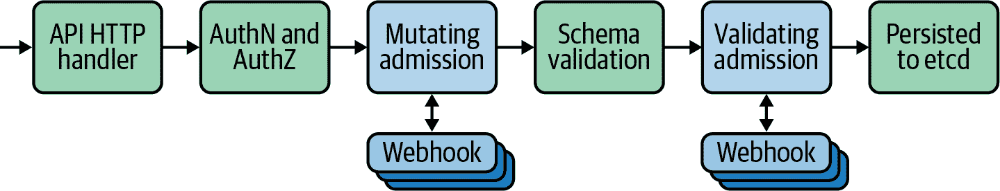

# 第八章：准入控制

本书中我们已多次提到 Kubernetes 灵活、模块化的设计是其伟大优势之一。合理的默认设置可以被替换、增强或基于其上构建，为平台消费者提供替代或更完整的体验。准入控制是特别受益于这一灵活设计目标的领域之一。准入控制关注的是在对象被持久化到 etcd 之前 *验证和修改* Kubernetes API 服务器的请求。这种能力以细粒度和控制拦截对象打开了许多有趣的用例。例如：

+   确保正在被删除（处于终止状态）的命名空间中不能创建新对象。

+   强制新 Pod 不以 root 用户身份运行

+   确保一个命名空间中所有 Pod 使用的内存总和不超过用户定义的限制。

+   确保 Ingress 规则不能被意外覆盖。

+   向每个 Pod 添加一个 Sidecar 容器（例如 Istio）

首先，我们将高层次地查看准入控制链，这是所有发送到 API 服务器的请求都要经过的过程。然后我们将继续介绍内置的控制器。这些内置的准入控制器可以通过 API 服务器的标志启用和禁用，并支持前面提到的一些用例。其他用例则需要更加定制的实现，并通过灵活的 Webhook 模型集成。我们将花大量时间深入探讨 Webhook 模型，因为它为将准入控制集成到集群中提供了最强大和灵活的选项。最后，我们将介绍 Gatekeeper，这是一个倾向于的开源项目，实现了 Webhook 模型，并提供额外的用户友好功能。

###### 注意

在本章的更深部分，我们将深入了解用 Go 编程语言编写的一些代码。Kubernetes 和许多其他云原生工具之所以选择 Go 语言实现，是因为它快速的开发速度、强大的并发原语和清晰的设计。虽然了解 Go 并不是理解本章大部分内容的必要条件（但如果你对 Kubernetes 工具感兴趣，我们建议你去了解它），我们将讨论定制与现成工具选择时需要开发技能的权衡。

# Kubernetes 准入链

在我们更详细地了解各个控制器的功能和机制之前，让我们首先了解 Kubernetes API 服务器的请求和响应流程，如图 8-1 所示。



###### 图 8-1 准入链。

最初，当请求到达 API 服务器时，它们会经过身份验证和授权，以确保客户端是有效的，并能根据配置的 RBAC 规则执行请求的操作（例如，在特定命名空间创建一个 Pod）。

在下一阶段，请求通过突变接入控制器，由图 8-1 中最左边的蓝色框表示。这些可以是内置控制器或对外部（外部树）突变 Webhook 的调用（我们稍后将讨论这些内容）。这些控制器能够在传递到后续阶段之前修改资源属性。作为为什么这可能有用的示例，让我们考虑 Service Account 控制器（默认情况下内置并启用）。当提交 Pod 时，Service Account 控制器会检查 Pod 的规范，以确保它已设置了`serviceAccount`（SA）字段。如果没有，它会添加该字段，并将其设置为 Namespace 的`default` SA。它还添加`ImagePullSecrets`和一个 Volume，以允许 Pod 访问其[Service Account 令牌](https://oreil.ly/K6e5E)。

然后，请求将经过模式验证，以确保所提交的对象根据定义的模式是有效的。这里确保像强制字段这样的内容已设置。这种顺序很重要，因为它意味着我们可以在验证对象之前设置突变接入控制器中的字段。

在对象持久化到 etcd 之前的最后阶段，它必须通过验证接入控制器，由图 8-1 中最右边的蓝色框表示。这些可以是内置控制器或对外部（外部树）验证 Webhook 的调用（我们稍后将简要介绍这些内容）。这些验证控制器与突变控制器不同，因为它们只能批准或拒绝请求，*不能*修改负载。它们与之前的*模式验证*步骤不同，因为它们关注的是操作逻辑验证，而不是标准化模式。

一个示例验证接入控制器是`NamespaceLifecycle`控制器。它有几个与命名空间相关的工作，但我们将查看的是它拒绝在当前正在删除的命名空间中创建新对象的请求。我们可以在此代码片段中看到这种行为：

```
// ensure that we're not trying to create objects in terminating Namespaces if a.GetOperation() == admission.Create {
  if namespace.Status.Phase != v1.NamespaceTerminating {
    return nil 
  }

  err := admission.NewForbidden(a, fmt.Errorf("unable to create new content in
  namespace %s because it is being terminated", a.GetNamespace()))
  if apierr, ok := err.(*errors.StatusError); ok {
    apierr.ErrStatus.Details.Causes = append(apierr.ErrStatus.Details.Causes,
    metav1.StatusCause{
      Type:    v1.NamespaceTerminatingCause,
      Message: fmt.Sprintf("namespace %s is being terminated", a.GetNamespace()),
      Field:   "metadata.namespace",
    })
  }
  return err 
}
```


如果操作是创建，但命名空间当前*未*终止，请不要返回错误。请求将通过此控制器。


否则，返回一个 API 错误，说明命名空间正在终止。如果返回错误，则请求被拒绝。

###### 注意

要使请求通过并将对象持久化到 etcd 中，它必须由*所有*验证接入控制器批准。要拒绝它，只需一个控制器拒绝即可。

# 内置接入控制器

当 Kubernetes 初次发布时，用户只能使用少量接口来*插入*或扩展外部功能，例如容器网络接口（CNI）。其他与云提供商、存储提供商的集成，以及准入控制器的实现，都是嵌入到核心 Kubernetes 代码中的，通常被描述为*内置*。随着时间推移，项目试图增加可插拔接口的数量，我们看到了容器存储接口（CSI）的创建，以及向外部云提供商的转移。

准入控制器是仍然有许多核心功能内置的一个领域。Kubernetes 附带许多不同的准入控制器，可以通过配置 API 服务器标志来启用或禁用。对于那些历史上没有权限配置这些标志的云托管 Kubernetes 平台的用户，这种模型已经证明是有问题的。PodSecurityPolicy（PSP）是一个示例，它可以在整个集群中启用高级和强大的安全功能，但*不*默认启用，因此排除了用户从中获益的可能性。

然而，准入控制正在缓慢地遵循将代码从 API 服务器移出并向增加可插拔性的趋势发展。这一过程的开始是通过添加变异和验证 Webhook 来实现的。这两个灵活的准入控制器允许我们指定 API 服务器应该转发请求（符合特定条件的请求），并将准入决策委托给外部 Webhook。我们将在下一节详细讨论这些内容。

在这个过程中的另一步是[宣布废弃](https://github.com/kubernetes/enhancements/issues/5)当前的 PodSecurityPolicy 内置控制器。虽然有多种方法来替代它，我们认为 PSP 的实现将委托给外部准入控制器，因为社区继续将代码移出内置。事实上，我们相信更多内置准入控制器最终会被移出内置。这些将被推荐使用第三方工具或标准化组件来替换，这些组件存在于 Kubernetes 上游组织中，但不在核心代码库中，从而允许用户在需要时选择合理的默认选项。

###### 注意

一些内置准入控制器的子集默认启用。这些被设计为大多数集群中运行良好的*合理默认值*。我们不会在此重复列表，但您应注意确保启用您需要的控制器。此外，请注意此功能的用户体验可能有点令人困惑。要启用额外的（非默认）控制器，您必须使用`--enable-admission-plugins`标志向 API 服务器添加，要*禁用*默认控制器，您必须指定`--disable-admission-plugins`列表参数。

官方 Kubernetes 文档中有大量关于内部控制器的信息，因此我们不会在这里详细介绍它们。准入控制器的真正威力是通过两个特殊的验证和变异 Webhook 启用的，这是我们接下来要讨论的地方！

# Webhook

###### 注意

所有的准入控制器都位于请求发送到 Kubernetes API 服务器的**关键路径**上。它们的作用范围各不相同，因此并非所有请求都会被拦截，但在启用和/或注入它们时，您一定要注意这一点。在讨论 Webhook 准入控制器时尤为重要，原因有二。首先，由于它们位于外部且必须通过 HTTPS 调用，因此会增加延迟。其次，它们具有广泛的功能潜力，甚至可能调用第三方系统。必须极为小心地确保准入控制器尽可能高效地执行，并在最早的机会返回。

Webhook 是一种特殊类型的准入控制器。我们可以配置 Kubernetes API 服务器，向外部 Webhook 终端点发送 API 请求，并接收一个决策（原始请求是否应允许、拒绝或更改/变异）的响应。出于多种原因，这非常强大：

+   接收 Web 服务器可以用任何能够暴露 HTTPS 监听器的语言编写。我们可以利用可能可用的 Web 框架、库和专业知识来实现我们需要进行准入决策的任何逻辑。

+   它们可以在集群内或集群外运行。如果要在集群内运行它们，我们可以利用可用的发现和操作者原语，或者例如实现可重用功能的无服务器函数。

+   我们能够调用 Kubernetes 外部的系统和数据存储来进行策略决策。例如，我们可以查询集中的安全系统，检查 Kubernetes 清单中是否批准使用特定镜像。

###### 注释

API 服务器将通过 TLS 调用 Webhook，因此 Webhook 必须提供 Kubernetes API 所信任的证书。通常通过在集群中部署 Cert Manager 并自动生成证书来实现这一点。如果在集群外运行，则需要提供 Kubernetes API 服务器信任的证书，可以来自公共根 CA 或 Kubernetes 知道的某个内部 CA。

要使 Webhook 模型正常工作，必须为 API 服务器和 Webhook 服务器之间交换的请求和响应消息定义一个明确定义的模式。在 Kubernetes 中，这被定义为 AdmissionReview 对象，是一个包含有关请求信息的 JSON 负载，包括：

+   API 版本、组和类型

+   元数据，如名称和命名空间，以及用于与响应决策进行关联的唯一 ID

+   尝试的操作（例如，CREATE）

+   有关发起请求的用户信息，包括他们的组成员身份

+   是否为*干预运行*请求（这一点很重要，因为后面在讨论设计考虑时会看到）

+   实际资源

所有这些信息可以被接收 Webhook 使用以计算接受决策。一旦决定，服务器需要用自己的 AdmissionReview 消息做出响应（这次包括一个`response`字段）。它将包含：

+   请求的唯一 ID（用于关联）

+   是否应允许请求继续进行

+   可选的自定义错误状态和消息

验证 Webhook 无法修改发送到它们的请求，并且只能接受或拒绝原始对象。这一限制使它们相当有限；但是，在确保应用到集群的对象符合安全标准（特定用户 ID、无主机挂载等）或包含所有所需的元数据（内部团队标签、注解等）时，它们非常合适。

在*变异* Webhook 的情况下，响应结构也可以包括一个补丁集（如果需要）。这是一个包含有效 JSONPatch 结构的 base64 编码字符串，封装了请求在提交到 API 服务器之前应进行的更改。如果你想详细了解 AdmissionReview 对象的所有字段和结构，那么[官方文档](https://oreil.ly/NWagy)在这里做得非常好。

变异控制器的一个简单示例可能是向 Pod 或 Deployments 添加一组包含团队或工作负载特定元数据的标签。你可能会遇到的变异控制器的另一个更复杂但常见的用法是在许多服务网格实现中注入 sidecar 代理。其工作方式是服务网格（例如 Istio）运行一个 Admission 控制器，该控制器变异 Pod 规范以添加一个将参与网格数据平面的 sidecar 容器。此注入默认情况下发生，但可以通过 Namespace 或 Pod 级别的注解进行覆盖，以提供额外的控制。

这种模型是丰富 Deployments 以增强功能的有效方式，但将这种复杂性隐藏起来以改善最终用户体验。然而，与许多决策一样，这可能是一把双刃剑。变异控制器的一个缺点是，从最终用户的视角来看，对象被应用到集群中，而这些对象与他们最初创建的对象不一致，如果用户不知道集群上正在运行变异控制器，可能会造成混淆。

## 配置 Webhook Admission 控制器

集群管理员可以使用 MutatingWebhookConfiguration 和 ValidatingWebhookConfiguration 类型来指定动态 Webhook 的配置。下面是一个带注释的示例，简要描述相关部分。在接下来的部分中，我们将深入探讨一些字段的更高级考虑事项。

```
apiVersion: admissionregistration.k8s.io/v1
kind: MutatingWebhookConfiguration
metadata:
  name: "test-mutating-hook"
webhooks:
- name: "test-mutating-hook"
  rules: 
  - apiGroups:   [""]
    apiVersions: ["v1"]
    operations:  ["CREATE"] 
    resources:   ["pods"] 
    scope:       "Namespaced" 
  clientConfig: 
    service:
      namespace: test-ns
      name: test-service
      path: /test-path
      port: 8443
    caBundle: "Ci0tLS0tQk...tLS0K" 
  admissionReviewVersions: ["v1", "v1beta1"] 
  sideEffects: "None" 
  timeoutSeconds: "5" 
  reinvocationPolicy: "IfNeeded" 
  failurePolicy: "Fail" 
```


匹配规则。该 webhook 应发送到哪个 API / 类型 / 版本 / 操作。


应该触发调用 webhook 的操作。


要针对的类型。


应该针对 Namespace 范围还是集群范围的资源。


描述 API 服务器如何连接到 webhook。在本例中，它位于集群中的*test-service.test-ns.svc*。


一个 PEM 编码的 CA bundle，用于验证 webhook 的服务器证书。


声明该 webhook 支持的`admissionReviewVersions`。


描述 webhook 是否具有对外部系统的外部副作用（调用/依赖）。


等待多长时间才能触发`failurePolicy`。


这个 webhook 是否可以重新调用（这可能发生在其他 webhook 调用之后）。


webhook 是否应该失败“开”还是“关”。这对安全有影响。

正如您在上述配置中所看到的，我们可以非常精确地选择要拦截的请求，以我们的准入 webhook。例如，如果我们只想目标创建 Secrets 的请求，我们可以使用以下规则：

```
# <...snip...>
rules: 
- apiGroups:   [""]
  apiVersions: ["v1"]
  operations:  ["CREATE"] 
  resources:   ["secrets"] 
  scope:       "Namespaced" 
# <...snip...>
```

我们还可以结合 Namespace 或对象选择器，以进一步细化控制粒度。这些允许我们指定任意数量的 Namespace 来目标和/或具有特定标签的对象；例如，在以下代码片段中，我们只选择那些在具有标签`webhook: enabled`的 Namespace 中的 Secrets：

```
# <...snip...>
namespaceSelector:
  matchExpressions:
  - key: webhook
    operator: In
    values: ["enabled"]
# <...snip...>
```

## webhook 设计考虑因素

在编写和实施准入 webhook 时需要注意几个因素。我们将在下一节详细讨论这些因素如何影响一些实际场景，但在高层次上，您应该注意以下几点：

失败模式

如果无法访问 webhook 或向 API 服务器发送未知响应，则视为失败。管理员必须选择在此情况下通过将`failurePolicy`字段设置为`Ignore`（允许请求）或`Fail`（拒绝请求）来选择是失败“开”还是“关”。

###### 警告

对于安全相关（或关键功能）的 webhook，`Fail`是最安全的选项。对于非关键的 hook，`Ignore`可能安全（可能与一个协调控制器作为备份一起使用）。结合这些推荐与本列表中讨论的性能项。

排序

关于 API 服务器请求流程的第一要点是，变更 Webhook 将在验证 Webhook 被调用之前（可能超过一次）*之前*被调用。这很重要，因为它使验证 Webhook（可能基于安全要求拒绝请求）始终可以在应用资源之前看到*最终*版本。

不能保证按特定顺序调用变更 Webhook，并且如果后续钩子修改请求，可能会多次调用。可以通过指定`reinvocationPolicy`来修改这一点，但理想情况下，Webhook 应设计为幂等，以确保顺序不影响其功能。

性能

Webhook 作为流向 API 服务器的请求关键路径的一部分被调用。如果一个 Webhook 很关键（与安全相关）并且失败后关闭（如果发生超时，则拒绝请求），则应考虑设计具有高可用性的解决方案。正如我们的一位[尊敬的前同事](https://twitter.com/mauilion)经常评论的那样，如果用户在应用程序中不小心使用，接受控制可能会成为*作为服务的瓶颈*。

如果 Webhook 需要大量资源和/或具有外部依赖项，则应考虑 Webhook 被调用的频率以及将功能添加到关键路径中的性能影响。在这些情况下，可能更倾向于编写在集群中仅协调对象一次的控制器。在编写 Webhook 配置时，应尽可能缩小作用范围，以确保不会不必要地或在不相关资源上调用它们。

副作用

一些 Webhook 可能负责根据对 Kubernetes API 的请求修改外部资源（例如，云提供商中的某些资源）。这些 Webhook 应意识到并尊重`dryRun`选项，并在启用时跳过对外部状态的修改。 Webhook 负责声明它们是否没有副作用，或通过设置`sideEffects`字段来尊重此选项。有关此字段的有效选项以及每个选项的行为的详细信息在[官方文档](https://oreil.ly/8FGic)中有详细说明。

# 编写变更 Webhook

在本节中，我们将探讨两种编写变更接受 Webhook 的方法。首先，我们将简要讨论使用通用 HTTPS 处理程序实现的方法。然后，我们将深入探讨一个真实用例，同时涵盖旨在帮助团队开发 Kubernetes 控制器组件的 controller-runtime 上游项目。

在本节中的两种解决方案都需要熟练掌握 Go 语言（用于控制器运行时）或其他编程语言。在某些情况下，这种要求可能妨碍了创建和实现准入控制器。如果您的团队没有经验或需要编写定制的 Webhook，本章的最后一节提供了一种不需要编程知识的可配置准入策略解决方案。

## 简单的 HTTPS 处理程序

准入控制器的 Webhook 模型的一个优势是，我们能够使用任何语言从头开始实现它们。我们这里使用的示例是用 Go 语言编写的，但任何支持 TLS 启用的 HTTP 处理和 JSON 解析的语言都是可以接受的。

这种编写 Webhook 的方式能够最大程度地与当前使用的堆栈集成，但需要付出许多高级抽象的代价（尽管具有成熟的 Kubernetes 客户端库的语言可以缓解这一点）。

如本节介绍中所述，准入控制 Webhook 接收并返回 API 服务器的请求。这些消息的模式是众所周知的，因此可以接收请求并手动修改对象（通过补丁）。

作为这种方法的具体示例，让我们深入了解一下[AWS IAM Roles for Service Accounts mutating webhook](https://oreil.ly/rW3ym)。此 Webhook 用于将 Projected Volume 注入具有可用于 AWS 服务认证的 Service Account 令牌的 Pod 中。（有关此用例的安全方面的更多细节，请参阅第十章。）

```
// <...snip...> type patchOperation struct { 
  Op    string      `json:"op"`
  Path  string      `json:"path"`
  Value interface{} `json:"value,omitempty"`
}

volume := corev1.Volume{ 
  Name: m.volName,
  VolumeSource: corev1.VolumeSource{
    Projected: &corev1.ProjectedVolumeSource{
      Sources: []corev1.VolumeProjection{
        {
          ServiceAccountToken: &corev1.ServiceAccountTokenProjection{
            Audience:          audience,
            ExpirationSeconds: &m.Expiration,
            Path:              m.tokenName,
          },
        },
      },
    },
  },
}

patch := []patchOperation{ 
  {
    Op:    "add",
    Path:  "/spec/volumes/0",
    Value: volume,
  },
}

if pod.Spec.Volumes == nil { 
  patch = []patchOperation{
    {
      Op:   "add",
      Path: "/spec/volumes",
      Value: []corev1.Volume{
        volume,
      },
    },
  }
}

patchBytes, err := json.Marshal(patch) 
// <...snip...>
```


定义一个`patchOperation`结构体，该结构体将被编组为 JSON 以便回应 Kubernetes API 服务器。


用相关的 ServiceAccountToken 内容构造`Volume`结构体。


使用先前构建的 Volume 内容创建一个`patchOperation`实例。


如果当前没有 Volume，则创建该键并添加先前构建的 Volume 内容。


创建包含补丁内容的 JSON 对象。

注意，此准入 Webhook 的实际实现包括一些额外功能，这些功能也增加了补丁集（例如添加环境变量），但出于本示例的目的，我们将忽略这些。完成补丁集后，我们需要返回包含我们的补丁集的 AdmissionResponse 对象（下面代码段中的`Patch`字段）：

```
return &v1beta1.AdmissionResponse{
  Allowed: true,
  Patch:   patchBytes,
  PatchType: func() *v1beta1.PatchType {
    pt := v1beta1.PatchTypeJSONPatch
    return &pt
  }(),
}
```

我们可以在这个例子中看到，需要大量的手工工作来生成补丁集并构造适当的响应给 API 服务器。 即使在使用 Go 语言中的一些 Kubernetes 库时，这种情况也存在。 但是，我们省略了一大部分需要处理错误、优雅关闭、HTTP 头处理等的支持代码。

虽然这种方法为我们提供了最大的灵活性，但它需要更多的领域知识，并且在实现和维护上更加复杂。 这种权衡对于大多数读者来说将会非常熟悉，因此在评估您特定的用例和内部专业知识时需要谨慎考虑。

在下一节中，我们将看到一种方法，它减少了大量的样板和定制工作，而采用了实现上游辅助框架 controller-runtime。

## 控制器运行时

在本节中，我们将深入研究上游项目[controller-runtime](https://github.com/kubernetes-sigs/controller-runtime)，并看看它在原生 Kubernetes 客户端库之上提供的抽象，以便更加流畅地编写准入控制器。 为了提供更多细节，我们将使用一个我们构建的开源控制器来满足社区需求，作为说明 controller-runtime 的一些优势的方式，并覆盖之前讨论的一些技术和陷阱。 虽然为简洁起见，我们在某种程度上简化了控制器的功能和代码，但核心的基本思想仍然存在。

我们将要讨论的控制器是一个 webhook，旨在执行以下操作：

1.  观察 Cluster API VSphereMachine 对象。

1.  基于可配置字段，在外部 IPAM 系统（在本例中为 Infoblox）中分配一个 IP 地址。

1.  将分配的 IP 插入到 VSphereMachine 的静态 IP 字段中。

1.  允许变异请求通过到 Kubernetes API 服务器，由 Cluster API 控制器执行并持久化到 etcd 中。

对于一些原因，这个用例是一个使用 controller-runtime 构建的自定义（变异 webhook）的好选择：

+   我们需要变异请求以在请求到达 API 服务器之前添加一个 IP 地址*之前*（否则会出错）。

+   我们正在调用一个外部系统（Infoblox），因此可以利用其 Go 库进行交互。

+   少量的样板代码允许新的社区和/或客户端开发者理解和扩展功能。

###### 注意

虽然超出了*本*章节的范围，但我们伴随这个 webhook 一起编写了一个在集群中运行的控制器。 当您的 webhook 与并且修改或依赖于*外部*状态（在本例中为 Infoblox）进行交互时，这一点非常重要，因为您应该不断地协调那个状态，而不是仅依赖于准入时看到的状态。 在构建变异准入 webhook 时需要考虑这一点，并且如果需要额外的组件，可能会增加解决方案的复杂性。

Controller-runtime webhooks 必须实现一个`Handle`方法，其签名为：

```
func (w *Webhook) Handle(
  ctx context.Context,
  req admission.Request) admission.Response
```

`admission.Request`对象是对 webhook 接收的原始 JSON 的抽象，并提供对原始应用对象、执行的操作（例如`CREATE`）和许多其他有用的元数据的简便访问：

```
vm := &v1alpha3.VSphereMachine{} 
err := w.decoder.DecodeRaw(req.Object, vm) 
if err != nil {
  return admission.Errored(http.StatusBadRequest, err) 
}
```


创建一个新的 VSphereMachine 对象。


使用内置解码器将请求中的原始对象解码为 Go VSphereMachine 对象。


使用便捷方法`Errored`来构建并返回错误响应，如果解码步骤返回错误。

在返回响应之前，可以对请求中的`vm`对象进行任何修改或验证。在下面的示例中，我们检查 VSphereMachine 对象上是否存在`infoblox`注解（表示我们的 webhook 应采取行动）。这是在 webhook 早期执行的重要步骤，因为如果不需要采取任何操作，我们可以从任何进一步的逻辑中快速退出。如果注解不存在，则使用方便的`Allowed`方法尽快将未修改的对象返回给 API 服务器。正如我们在“Webhook 设计考虑”中讨论的那样，webhook 是 API 请求的关键路径，我们在其中执行的任何操作都应尽可能快：

```
if _, ok := vm.Annotations["infoblox"]; !ok {
  return admission.Allowed("Nothing to do")
}
```

假设我们*应该*处理此请求，并且前面的逻辑没有触发，我们从 Infoblox（未显示）中检索一个 IP 地址，并直接将其写入`vm`对象：

```
vm.Spec.VirtualMachineCloneSpec.Network.Devices[0].IPAddrs[0] = ipFromInfoblox 
marshaledVM, err := json.Marshal(vm) 
if err != nil { 
  return admission.Errored(http.StatusInternalServerError, err)
}
return admission.PatchResponseFromRaw(req.Object.Raw, marshaledVM) 
```


在`vm`对象上设置 IP 字段，从而*改变*它。


将`vm`对象编组为 JSON，准备发送回 API 服务器。


如果编排失败，我们将使用我们之前看到的便捷错误处理方法。


另一个便捷方法`PatchReponseFromRaw`，将响应发送回去。我们稍后会更详细地讨论这一点。

###### 注意

有些情况下，您可能希望并/或需要拦截对 API 服务器的`DELETE`请求。其中一个示例可能是清理一些与集群中资源相关的外部状态。虽然这*可以*在 webhook 中完成，但您应考虑您是“失败开放”还是“失败关闭”，以及在前一种情况下存在不对齐状态的风险。理想情况下，删除逻辑应使用[finalizer](https://oreil.ly/Y1iGD)和在集群中运行的自定义控制器来实现，以保证清理工作。

在前面的片段中，我们看到了另一个 controller-runtime 的便利方法`PatchResponseFromRaw`。此方法将在发送正确序列化的响应之前，自动计算所需的 JSONPatch 差异，这些差异是在原始原始对象和我们修改的对象之间。与前一节中更手动的方法相比，这是一种去除一些样板代码、使我们的控制器代码更精简的好方法。

在简单的验证挂钩情况下，我们还可以利用像`admission.Allowed()`和`admission.Denied()`这样的便利函数，这些函数可以在处理所需逻辑后使用。

###### 注意

如果我们作为准入控制器的一部分操作外部状态，我们需要注意并检查`req.DryRun`条件。如果设置了这个条件，用户只执行干跑（dry run），不会执行实际请求，我们应确保我们的控制器在这种情况下*不会*改变外部状态。

Controller-runtime 为构建准入控制器提供了非常强大的基础，使我们能够专注于要实现的逻辑，减少样板代码的使用。然而，这需要编程专业知识，并且准入逻辑被混淆在控制器代码内部，可能会给最终用户带来更多困惑或意外的结果。

在本章的下一节中，我们将介绍一种新兴的模型，该模型集中策略逻辑，并引入一种标准语言来编写决策规则。在这一领域出现的工具力求将自定义控制器的灵活性与更少技术操作员和/或最终用户的更高可用性功能结合起来。

# 集中化策略系统

到目前为止，我们已经看过多种不同的方法来实现和配置准入控制器。每种方法都有其特定的权衡考虑因素，在选择采用它们时必须加以考虑。在本节的最后部分，我们将介绍一种新兴的模型，将策略逻辑集中到一个地方，并使用标准化语言来表达允许/拒绝规则。这种模型有两个主要优点：

+   创建准入控制器不需要编程知识，因为我们可以使用特定的策略语言表达规则（而不是通用编程语言）。这也意味着逻辑的更改不需要每次重建和重新部署控制器。

+   策略和规则存储在一个单一位置（在大多数情况下是集群本身），便于查看、编辑和审计。

此模型正在通过几个开源工具进行构建和实施，通常由两个组件组成：

+   一个能够表达条件的策略/查询语言，判断对象是否应该被接受或拒绝。

+   一个位于集群中作为准入控制器的控制器。该控制器的任务是评估针对进入 API 服务器的对象的策略/规则，并做出接受或拒绝的决策。

在本章的其余部分，我们将专注于称为[Gatekeeper](https://github.com/open-policy-agent/gatekeeper)的这种集中式策略模型的最流行实现，尽管其他工具如[Kyverno](https://kyverno.io)也正在获得关注。Gatekeeper 建立在一个名为 Open Policy Agent（OPA）的低级工具之上。OPA 是一个开源策略引擎，将用 Rego 语言编写的策略应用于摄取的 JSON 文档并返回结果。

一个调用应用可以通过接收结果并决定如何继续（做出策略决策）来利用 OPA。我们从本章了解到，Kubernetes 有一个标准模式用于发送请求和接收准入决策响应，因此这似乎立即是一个很有前景的选择。然而，OPA 本身是平台/上下文无关的，只是一个在 JSON 上操作的策略引擎。我们需要一个控制器作为 OPA 引擎和 Kubernetes 之间的接口。Gatekeeper 是履行这一接口角色并在模板和可扩展性方面提供一些额外的 Kubernetes 本地功能的工具，以便平台操作员更轻松地编写和应用策略。Gatekeeper 被部署到集群作为准入控制器，允许用户编写规则在 Rego 中做出有关应用到集群的 Kubernetes 资源的准入策略决策。

Gatekeeper 使得集群操作员可以创建并公开预设策略模板作为`ConstraintTemplate` CRD。这些模板为可以接受自定义输入参数的特定约束创建新的 CRD（类似于函数）。这种方法非常强大，因为最终用户可以使用自己的值创建约束的实例，Gatekeeper 将其作为集群准入控制的一部分使用。

###### **注意**

出于本节后部详细列出的一些原因，您应该意识到 Gatekeeper 目前默认情况下是*开放失败*的。这可能会带来严重的安全影响，因此在将这些解决方案投入生产之前，您应该仔细了解每种方法的权衡（本章及大部分官方文档中详细说明）。

我们在现场实施的一个常见规则是确保团队无法覆盖现有的 Ingress 资源。这在大多数 Kubernetes 集群中是一个要求，一些 Ingress 控制器（例如 Contour）提供了保护机制以防止此类问题。然而，如果您的工具不具备这种机制，您可以使用 Gatekeeper 来强制执行此规则。这种情况是一系列在[官方 Gatekeeper 文档](https://oreil.ly/LINGy)中维护的常见策略库之一。

在这种情况下，需要基于 *外部存在于被应用到集群的对象* 的数据做出策略决策。我们需要直接查询 Kubernetes，以了解已存在的 Ingress 资源，并能够检查它们周围的元数据，以与正在应用的对象进行比较。

让我们举一个更复杂的例子来建立在这些想法之上，并且我们将逐步实施每个资源的实现。在这种情况下，我们将用正则表达式模式注释一个 Namespace，并确保在该 Namespace 中应用的任何 Ingress 符合该正则表达式。我们之前提到过，Gatekeeper 需要集群信息可用于制定策略决策。这是通过定义同步配置来实现的，以指定应同步到 Gatekeeper 缓存的 Kubernetes 中的哪些资源（以提供可查询的数据源）：

```
apiVersion: config.gatekeeper.sh/v1alpha1
kind: Config
metadata:
  name: config
  namespace: "gatekeeper-system"
spec:
  sync: 
    syncOnly:
      - group: "extensions"
        version: "v1beta1"
        kind: "Ingress"
      - group: "networking.k8s.io"
        version: "v1beta1"
        kind: "Ingress"
      - group: ""
        version: "v1"
        kind: "Namespace"
```


`sync` 部分指定 Gatekeeper 应缓存的所有 Kubernetes 资源，以协助进行策略决策。

###### 注意

缓存存在的目的是消除 Gatekeeper 不断查询 Kubernetes API 服务器以获取所需资源的需要。然而，Gatekeeper 基于 *过时* 数据做出决策的潜力是存在的。为了减轻这一点，存在一种审核功能，定期针对现有资源运行策略，并在每个约束的 `status` 字段中记录违规。应监控这些以确保通过的违规（可能是由于过时的缓存读取）不被忽略。

一旦配置应用完成，管理员就可以创建 `ConstraintTemplate`。此资源定义了策略的主要内容以及管理员或其他运营商可以提供/覆盖的任何输入参数：

```
apiVersion: templates.gatekeeper.sh/v1beta1
kind: ConstraintTemplate
metadata:
  name: limitnamespaceingress
spec:
  crd:
    spec:
      names:
        kind: LimitNamespaceIngress
        listKind: LimitNamespaceIngressList
        plural: limitnamespaceingresss
        singular: limitnamespaceingress
      validation:
        # Schema for the `parameters` field in the constraint
        openAPIV3Schema:
          properties: 
            annotation:
              type: string
  targets: 
    - target: admission.k8s.gatekeeper.sh
      rego: |
        package limitnamespaceingress

        violation[{"msg": msg}] {
          cluster := data.inventory.cluster.v1
          namespace := cluster.Namespace[input.review.object.metadata.namespace]
          regex := namespace.metadata.annotations[input.parameters.annotation]
          hosts := input.review.object.spec.rules[_].host
          not re_match(regex, hosts)
          msg := sprintf("Only ingresses matching %v in namespace %v allowed",
             [regex ,input.review.object.metadata.namespace])
        }
```


`properties` 部分定义了将可用于每个规则实例化中注入 Rego 策略的输入参数。


`targets` 部分包含我们策略规则的 Rego 代码。我们不会在这里深入讨论 Rego 语法，但请注意，输入参数通过 `input.parameters.<parameter_name>`（在本例中为 `annotation`）被引用。

自定义输入参数中的 `annotation` 允许用户指定 Gatekeeper 应从中提取正则表达式模式的特定注释名称。如果任何语句返回 `False`，Rego 将不会触发违规。在这种情况下，我们正在检查主机是否与正则表达式匹配，因此为了确保不触发违规，我们需要使用 `not` 来反转 `re_match()`，以确保正向匹配不触发违规，而是 *允许* 请求通过准入控制。

最后，我们创建了上述策略的一个实例，以配置 Gatekeeper 在准入控制的一部分针对特定资源应用它。`LimitNamespaceIngress` 对象指定规则应适用于 `apiGroups` 的 Ingress 对象，并指定 `allowed-ingress-pattern` 作为应检查正则表达式模式的注解（这是可自定义的输入参数）：

```
apiVersion: constraints.gatekeeper.sh/v1beta1
kind: LimitNamespaceIngress
metadata:
  name: limit-namespace-ingress
spec:
  match:
    kinds:
      - apiGroups: ["extensions", "networking.k8s.io"]
        kinds: ["Ingress"]
  parameters:
    annotation: allowed-ingress-pattern
```

最后，Namespace 对象本身应用了自定义注解和模式。这里我们在 `allowed-ingress-pattern` 字段中指定了正则表达式 `\w\.my-namespace\.com`：

```
apiVersion: v1
kind: Namespace
metadata:
  annotations:
    # Note regex special character escaping
    allowed-ingress-pattern: \w\.my-namespace\.com
  name: ingress-test
```

设置步骤现在已经全部完成。我们可以开始添加 Ingress 对象，并且我们配置的规则将针对它们进行评估，然后允许或拒绝持久性/创建 Ingress：

```
# FAILS because the host doesn't match the pattern above
apiVersion: networking.k8s.io/v1beta1
kind: Ingress
metadata:
  name: test-1
  namespace: ingress-test
spec:
  rules:
  - host: foo.other-namespace.com
    http:
      paths:
      - backend:
          serviceName: service1
          servicePort: 80
---
# SUCCEEDS as the pattern matches
apiVersion: networking.k8s.io/v1beta1
kind: Ingress
metadata:
  name: test-2
  namespace: ingress-test
spec:
  rules:
  - host: foo.my-namespace.com
    http:
      paths:
      - backend:
          serviceName: service2
          servicePort: 80
```

第二个 Ingress 将成功，因为 `spec.rules.host` 符合 `ingress-test` Namespace 上 `allowed-ingress-pattern` 注解中指定的正则表达式模式。然而，第一个 Ingress 不匹配，导致错误：

```
Error from server ([denied by limit-namespace-ingress] Only ingresses with
host matching \w\.my-namespace\.com are allowed in namespace ingress-test):
error when creating "ingress.yaml": admission webhook "validation.gatekeeper.sh"
denied the request: [denied by limit-namespace-ingress] Only ingresses with host
matching \w\.my-namespace\.com are allowed in namespace ingress-test
```

Gatekeeper 有许多优点：

+   可扩展的 `ConstraintTemplate` 模型允许管理员定义常见策略，并在整个组织中共享/重用它们作为库。

+   虽然它确实需要 Rego 知识，但不需要额外的编程语言经验，降低了政策设计和创建的准入门槛。

+   底层技术（OPA）在社区中已经相当成熟并得到良好支持。Gatekeeper 是一个较新的层，但在早期得到了强有力的支持。

+   将所有策略强制执行到一个准入控制器中使我们能够访问集中的审计日志，这在受监管的环境中通常很重要。

Gatekeeper 的主要弱点是它目前无法对请求进行 *变异*。虽然它支持外部数据源（通过各种方法），但实施起来可能会很麻烦。这些问题将来势必会得到解决，但如果您在这些领域有强烈的要求，很可能需要实施前面章节中描述的一种自定义准入控制解决方案。

在使用 Gatekeeper（以及任何通用准入控制器）时的最后一点考虑是，这些工具捕获的请求范围可能非常广泛。这是它们能够发挥作用的必要条件，因为可以编写涵盖许多不同对象的规则，并且控制器本身需要包含一个权限的超集以能够捕获它们。然而，这有几个重要影响：

+   如前所述，这些工具位于关键路径上。如果控制器或您的配置存在错误或其他问题，则可能会导致广泛的停机。

+   作为前一点的延续，因为控制器拦截了对控制平面的请求，管理员在执行补救步骤时可能也会暂时被排除在外。这在资源对集群操作（例如网络资源等）重要和/或必不可少的情况下尤为重要。

+   广泛的范围要求必须将广泛的 RBAC 策略附加到准入控制器/策略服务器上。如果这个软件存在漏洞，那么潜在的破坏行为可能是显著的。

###### 注意

您应避免配置准入 Webhook 来拦截针对 `kube-system` 命名空间的资源。该命名空间中的对象通常对集群的操作非常重要，意外的变异或拒绝这些对象可能会在集群中造成严重问题。

# 摘要

在本章中，我们涵盖了许多控制哪些对象被允许进入 Kubernetes 集群的方式。就像本书涵盖的许多关注点一样，每种方式都有其特定的权衡和决策，需要考虑到您的个人需求。准入控制是一个领域，需要更加仔细的检查和更深入的知识，因为它在集群和工作负载安全领域的应用非常广泛。

内置控制器提供了一组可靠的功能，但可能并不完全满足您的所有需求。我们预计越来越多的操作会转移到外部（out-of-tree）控制器，利用变异和验证 Webhook 的能力。在短期内，您可能会发现需要构建自己的 Webhook（无论是从头开始还是使用框架）来实现更复杂的功能。然而，随着类似 Gatekeeper 这样的广泛准入策略工具变得更加成熟，我们认为这是增加价值的关键点。
