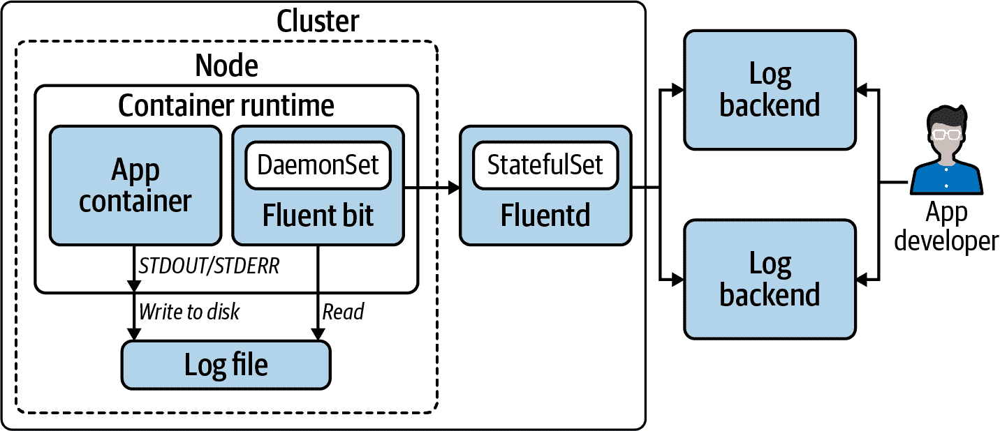
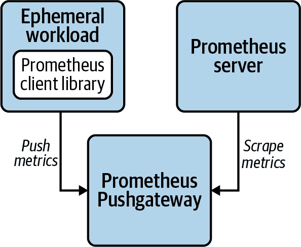
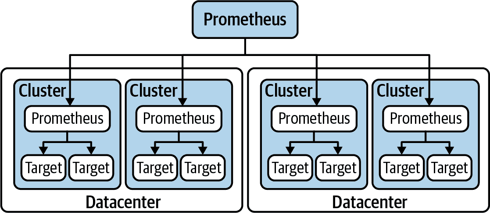
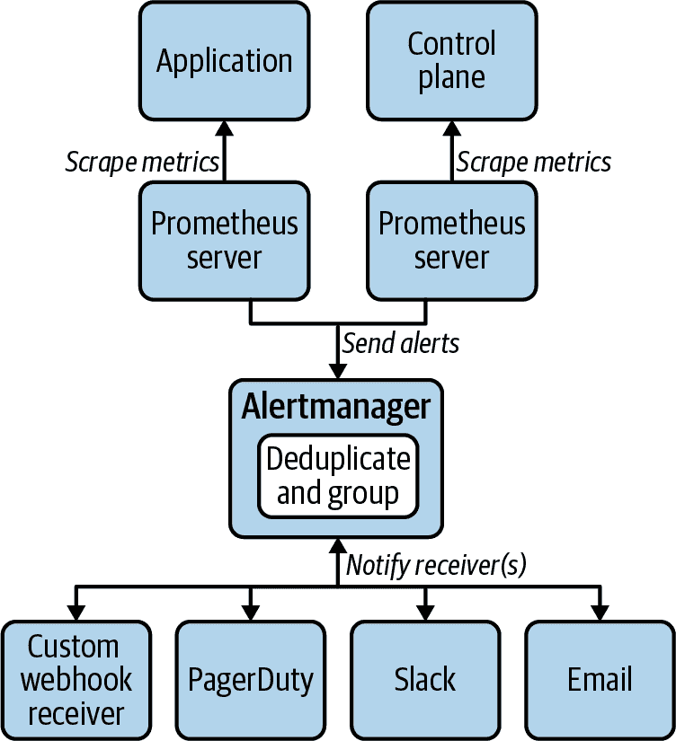
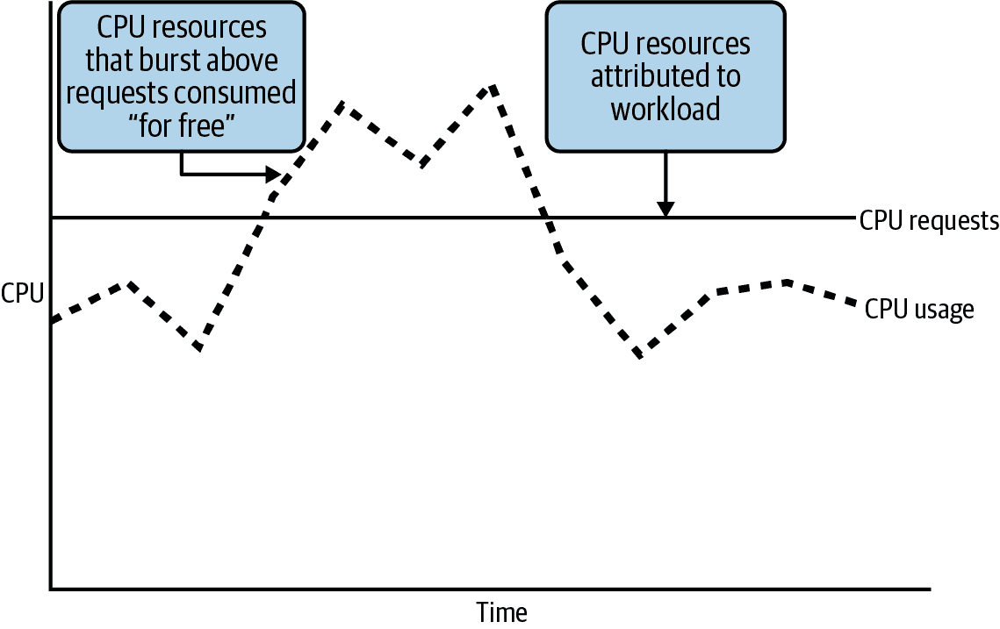
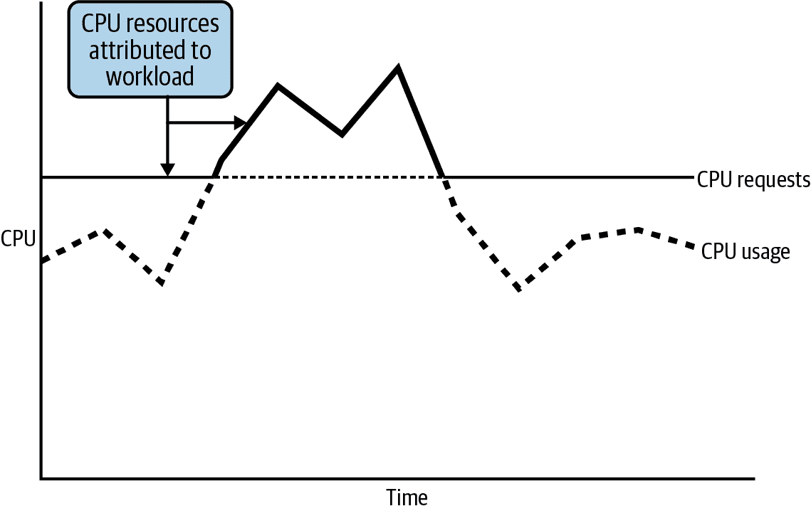
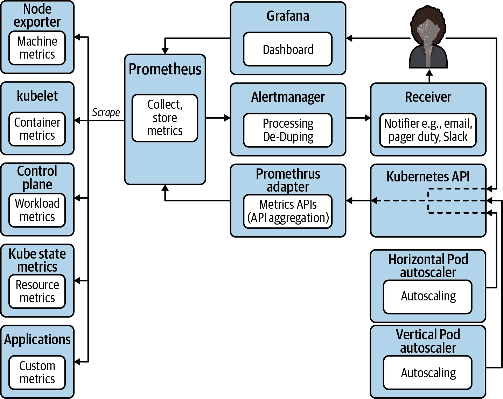
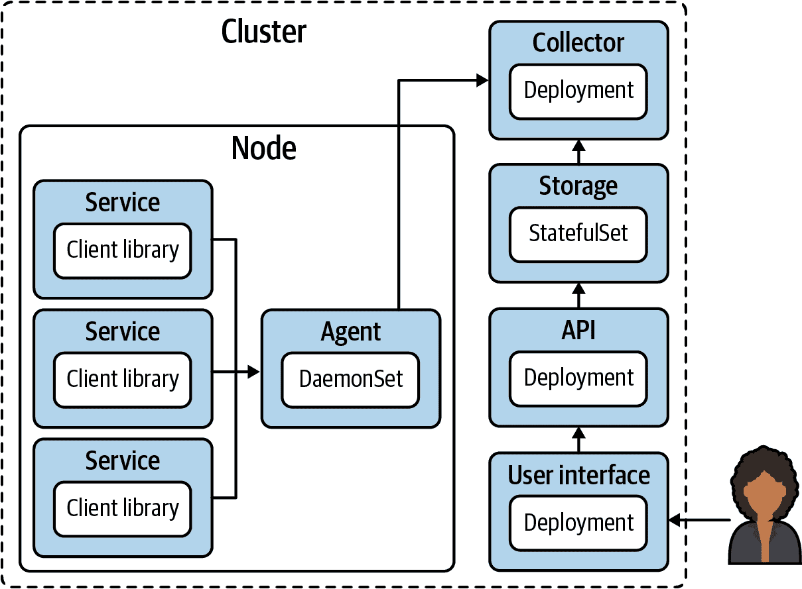

# 第九章：可观测性

观察任何软件系统的能力是至关重要的。如果您不能检查正在运行的应用程序的状态，您就无法有效地管理它们。这就是我们通过可观测性来解决的问题：我们用于理解我们负责的正在运行的软件状态的各种机制和系统。我们应该承认，在这种情况下，我们并未遵循控制理论对可观测性的定义。我们选择使用这个术语仅仅是因为它变得流行，并且我们希望人们能够轻松理解我们的意图。

可观测性的组成部分可以分为三类：

日志记录

聚合并存储由程序编写的日志事件消息

指标

收集时间序列数据，将其显示在仪表板上，并对其进行警报

追踪

捕获跨多个不同工作负载的请求数据

在本章中，我们将讨论如何在基于 Kubernetes 的平台中实现有效的可观测性，以便您可以安全地管理生产中的平台及其托管的工作负载。首先，我们将探讨日志记录，并检查聚合日志并将其转发到公司的日志后端的系统。接下来，我们将讨论如何收集指标、如何可视化数据以及如何对其进行警报。最后，我们将探讨通过分布式系统跟踪请求，以便更好地理解在由不同工作负载组成的应用程序运行时发生的情况。让我们开始日志记录，并覆盖那里通常成功的模型。

# 日志记录机制

本节涵盖了在基于 Kubernetes 的平台中的日志记录问题。我们主要处理从您的平台组件和租户工作负载捕获、处理和转发日志到存储后端的机制。

从前，我们在生产中运行的软件通常将日志写入磁盘上的文件中。聚合日志——如果有的话——是一个更简单的过程，因为工作负载较少，而且这些工作负载的实例也较少，与今天的系统相比。在容器化的世界中，我们的应用程序通常将日志记录到标准输出和标准错误输出，就像交互式命令行界面一样。事实上，即使在容器变得普遍之前，这已经成为现代面向服务的软件的最佳实践。在云原生软件生态系统中，有更多不同的工作负载和每个工作负载的实例，但它们也是短暂的，通常没有挂载磁盘以保存日志——因此，远离将日志写入磁盘的做法。这引入了在收集、聚合和存储日志方面的挑战。

通常，单个工作负载将具有多个副本，并且可能有多个不同的组件需要检查。如果没有集中式日志聚合，分析（查看和解析）此场景中的日志将变得非常繁琐，甚至几乎不可能。考虑必须分析具有*数十个*副本的工作负载的日志。在这些情况下，具有允许您跨副本搜索日志条目的中心收集点至关重要。

在讨论日志机制时，我们首先看一下在您的平台中捕获和路由容器化工作负载的日志策略。这包括 Kubernetes 控制平面和平台实用程序的日志，以及平台租户的日志。在本节中，我们还将涵盖 Kubernetes API 服务器审计日志以及 Kubernetes 事件。最后，我们将讨论在日志数据中发现条件时的警报概念以及替代策略。我们不会涵盖日志的存储，因为大多数企业都有一个我们将集成的日志后端，这通常不是基于 Kubernetes 平台本身的关注点。

## 容器日志处理

让我们看看基于 Kubernetes 平台的容器化工作负载的三种日志处理方式：

应用程序转发

直接从应用程序将日志发送到后端。

旁车处理

使用旁车来管理应用程序的日志。

节点代理转发

在每个节点上运行一个 Pod，为该节点上所有容器的日志转发到后端。

### 应用程序转发

在这种情况下，应用程序需要与后端日志存储集成。开发人员必须将此功能集成到他们的应用程序中并维护该功能。如果日志后端发生变化，可能需要更新应用程序。由于日志处理几乎是普遍存在的，因此将其从应用程序中卸载显得更加合理。在大多数情况下，应用程序转发并不是一个好的选择，并且在生产环境中很少见。只有在将遗留应用程序迁移到已经与日志后端集成的基于 Kubernetes 平台时，才显得合理。

### 旁车处理

在此模型中，应用程序在一个容器中运行，并将日志写入 Pod 的共享存储中的一个或多个文件。同一 Pod 中的另一个容器（旁车）读取这些日志并处理它们。旁车使用以下两种方式处理日志：

1.  直接将它们转发到日志存储后端

1.  将日志写入标准错误和标准输出

直接转发到后端是旁车日志处理的主要用例。这种方法并不常见，通常是一个临时解决方案，平台没有日志聚合系统的情况下使用。

在侧车将日志写入标准输出和标准错误时，为了利用节点代理转发（在下一节中介绍），它会这样做。这也是一种不常见的方法，只有在运行一个无法将日志写入标准输出和标准错误的应用程序时才有用。

### 节点代理转发

使用节点代理转发，集群中每个节点上都运行一个日志处理工作负载，读取容器运行时写入的每个容器的日志文件，并将日志转发到后端存储。

这是我们通常推荐的模型，迄今为止，也是最常见的实现。这是一个有用的模式，因为：

+   在日志转发器和后端之间有一个集成点，而不是不同的 sidecar 或应用程序必须维护该集成。

+   标准化过滤、附加元数据和转发到多个后端的配置是集中化的。

+   kubelet 或容器运行时负责处理日志轮换。如果应用程序在容器内部写入日志文件，则应用程序本身或 sidecar（如果有）需要处理日志轮换。

用于此节点代理日志转发的主流工具是 [Fluentd](https://www.fluentd.org) 和 [Fluent Bit](https://fluentbit.io)。如其名称所示，它们是相关的项目。Fluentd 是原始的，主要由 Ruby 编写，并且有一个丰富的插件生态系统围绕它。Fluent Bit 是针对嵌入式 Linux 等环境的更轻量级解决方案的需求而来。它是用 C 编写的，内存占用比 Fluentd 小得多，但可用的插件数量没有那么多。

我们向平台工程师提供的一般指导是，在选择日志聚合和转发工具时，使用 Fluent Bit，除非 Fluentd 有引人注目的插件功能。如果发现需要利用 Fluentd 插件，请考虑将其作为集群范围的聚合器与 Fluent Bit 作为节点代理一起运行。在此模型中，您使用 Fluent Bit 作为节点代理，它作为 DaemonSet 部署。Fluent Bit 将日志转发到在集群中以 Deployment 或 StatefulSet 运行的 Fluentd。Fluentd 进行进一步的标记并将日志路由到一个或多个开发者访问的后端。图 9-1 说明了这种模式。



###### 图 9-1\. 从容器化应用程序聚合日志到后端。

虽然我们强烈推荐节点代理转发方法，但值得指出集中日志聚合可能出现的问题。这会为每个节点引入单点故障，或者如果在堆栈中使用集群范围的聚合器，那么整个集群会有单点故障。如果您的节点代理由于一个工作负载的过度记录而变得不堪重负，这可能会影响该节点上所有工作负载的日志收集。如果您在部署中运行 Fluentd 集群范围聚合器，它将使用其 Pod 中的临时存储层作为缓冲区。如果在它能够将缓冲区中的日志刷新之前被杀死，您将丢失日志。因此，考虑将其作为 StatefulSet 运行，以便在 Pod 停止时不会丢失这些日志。

## Kubernetes 审计日志

本节介绍从 Kubernetes API 收集审计日志的方法。这些日志提供了一种查找集群中谁做了什么的方式。在生产环境中，您应该启用这些日志，以便在出现问题时进行根本原因分析。您可能还有要求的合规性。

API 服务器启用并配置了标志，允许您捕获发送到其的每个请求的每个阶段的日志，包括请求和响应体。实际情况下，您可能不希望记录*每个*请求。由于向 API 服务器发出大量调用，因此将有大量的日志条目需要存储。您可以使用审计策略中的规则来限定您希望 API 服务器为其编写日志的请求和阶段。如果没有任何审计策略，API 服务器实际上不会写入任何日志。使用`--audit-policy-file`标志告知 API 服务器您的审计策略位于控制平面节点的文件系统上。示例 9-1 展示了几个规则，说明了策略规则的工作原理，以便您可以限制日志信息的量，而不会排除重要数据。

##### 示例 9-1\. 示例审计策略

```
apiVersion: audit.k8s.io/v1
kind: Policy
rules:
- level: None  
  users: ["system:kube-proxy"]
  verbs: ["watch"]
  resources:
  - group: "" # core
    resources: ["endpoints", "services", "services/status"]
- level: Metadata  
  resources:
  - group: ""
    resources: ["secrets", "configmaps"]
  - group: authentication.k8s.io
    resources: ["tokenreviews"]
  omitStages:
  - "RequestReceived"
- level: Request  
  verbs: ["get", "list", "watch"]
  resources:
  - group: ""
  - group: "apps"
  - group: "batch"
  omitStages:
  - "RequestReceived"
- level: RequestResponse  
  resources:
  - group: ""
  - group: "apps"
  - group: "batch"
  omitStages:
  - "RequestReceived"
# Default level for all other requests.
- level: Metadata  
  omitStages:
  - "RequestReceived"
```


`None` 审计级别意味着 API 服务器不会记录与此规则匹配的事件。因此，当用户 `system:kube-proxy` 请求对列出的资源进行监视时，该事件不会被记录。


`Metadata` 级别意味着只记录请求的元数据。当 API 服务器收到列出的资源的任何请求时，它将记录哪个用户对什么资源进行了什么类型的请求，但不记录请求或响应的正文。`RequestReceived` 阶段不会被记录。这意味着当首次接收请求时不会写入单独的日志条目。在开始长时间监视的响应后，它将写入日志条目。在完成向客户端的响应后，它将写入日志条目。并且将记录发生的任何 panic。但在首次接收请求时不会记录日志条目。


`Request` 级别将指示 API 服务器记录请求元数据和请求主体，但*不*记录响应主体。因此，当任何客户端发送获取、列表或观察请求时，可能包含对象的冗长响应主体不会被记录。


`RequestResponse` 级别记录了最多的信息：请求元数据、请求主体和响应主体。此规则列出了与之前相同的 API 组。因此，实际上，此规则表示如果请求*不是*用于这些组中的资源的获取、列表或观察，则还记录响应主体。实际上，这成为列出的组的默认日志级别。


对于未匹配到先前规则的任何其他资源，都将应用此默认值，该值表示在接收到请求时跳过附加日志消息，并仅记录请求元数据以及排除的请求和响应主体。

与系统中的其他日志一样，您希望将审计日志转发到某个后端。您可以使用本章前面介绍的应用程序转发或节点代理转发策略。许多相同的原则和模式适用。

对于应用程序转发方法，您可以配置 API 服务器将日志直接发送到 webhook 后端。在这种情况下，您需要通过标志告知 API 服务器配置文件所在位置，该配置文件包含连接地址和凭据。此配置文件使用 kubeconfig 格式。您需要花一些时间调整缓冲和批处理的配置选项，以确保所有日志都到达后端。例如，如果设置了太低的缓冲区大小以及溢出导致事件被丢弃。

对于节点代理转发，您可以让 API 服务器将日志文件写入控制平面节点上的文件系统。您可以向 API 服务器提供标志以配置文件路径、最长保留期、最大文件数和最大日志文件大小。在这种情况下，您可以使用 Fluent Bit 和 Fluentd 等工具聚合和转发日志。如果您已经使用这些工具管理先前讨论过的节点代理转发的日志，则这很可能是一个不错的模式。

## Kubernetes 事件

在 Kubernetes 中，事件是一种原生资源。它们是平台组件通过 Kubernetes API 向不同对象公开发生情况的一种方式。实际上，它们是一种平台日志。与其他日志不同，它们通常不存储在日志后端。它们存储在 etcd 中，并且默认保留一个小时。平台操作员和用户通常在想要收集针对对象采取的操作信息时使用它们。示例 9-2 展示了描述新创建的 Pod 时提供的事件。

##### 示例 9-2\. 提供的带有 Pod 描述的事件

```
$ kubectl describe pod nginx-6db489d4b7-q8ppw
Name:         nginx-6db489d4b7-q8ppw
Namespace:    default
...
Events:
  Type    Reason     Age        From
  ----    ------     ----       ----
    Message
    -------
  Normal  Scheduled  <unknown>  default-scheduler
    Successfully assigned default/nginx-6db489d4b7-q8ppw
  Normal  Pulling    34s        kubelet, ip-10-0-0-229.us-east-2.compute.internal
    Pulling image "nginx"
  Normal  Pulled     30s        kubelet, ip-10-0-0-229.us-east-2.compute.internal
    Successfully pulled image "nginx"
  Normal  Created    30s        kubelet, ip-10-0-0-229.us-east-2.compute.internal
    Created container nginx
  Normal  Started    30s        kubelet, ip-10-0-0-229.us-east-2.compute.internal
    Started container nginx
```

您也可以直接检索与示例 9-3 中显示的相同事件。在这种情况下，它包括直接检索到的命名空间的 ReplicaSet 和 Deployment 资源的事件，以及我们在描述该资源时看到的 Pod 事件。

##### 示例 9-3\. 直接检索的命名空间事件

```
$ kubectl get events -n default
LAST SEEN   TYPE     REASON              OBJECT
    MESSAGE
2m5s        Normal   Scheduled           pod/nginx-6db489d4b7-q8ppw
    Successfully assigned default/nginx-6db489d4b7-q8ppw
2m5s        Normal   Pulling             pod/nginx-6db489d4b7-q8ppw
    Pulling image "nginx"
2m1s        Normal   Pulled              pod/nginx-6db489d4b7-q8ppw
    Successfully pulled image "nginx"
2m1s        Normal   Created             pod/nginx-6db489d4b7-q8ppw
    Created container nginx
2m1s        Normal   Started             pod/nginx-6db489d4b7-q8ppw
    Started container nginx
2m6s        Normal   SuccessfulCreate    replicaset/nginx-6db489d4b7
    Created pod: nginx-6db489d4b7-q8ppw
2m6s        Normal   ScalingReplicaSet   deployment/nginx
    Scaled up replica set nginx-6db489d4b7 to 1
```

鉴于 Kubernetes 事件可通过 Kubernetes API 获取，完全可以构建自动化来监视和响应特定事件。然而，实际上，我们并不经常看到这样做。您还可以通过将其公开为指标的事件导出器利用它们。有关更多关于 Prometheus 导出器的信息，请参见“Prometheus”。

## 日志警报

应用程序日志公开了有关软件行为的重要信息。当发生需要调查的意外故障时，它们尤其有价值。这可能会使您发现导致问题的事件模式。如果您希望设置针对日志中公开的事件的警报，请首先考虑使用指标而不是日志。如果您公开代表该行为的指标，可以针对其实施警报规则。与日志消息相比，日志警报的可靠性较低，因为它们更容易发生变化。对日志消息文本的轻微更改可能会意外地破坏使用它的警报。

## 安全性影响

不要忘记考虑用户对后端聚合的各种日志的访问权限。您可能不希望生产 API 服务器审计日志对所有人都可访问。您可能拥有包含只有特权用户应该访问的信息的敏感系统。这可能会影响日志的标记或需要使用多个后端，从而影响您的转发配置。

现在我们已经讨论了管理平台及其租户日志涉及的各种机制，让我们继续讨论指标和警报。

# 指标

指标和警报服务对于平台的可用性至关重要。指标允许我们在时间轴上绘制测量数据，并识别表明不良或意外行为的偏差。它们帮助我们了解我们的应用程序发生了什么，通知我们它们是否按预期行为，并为我们提供有关如何解决问题或改进工作负载管理的见解。并且，关键是，指标为我们提供了有用的测量来进行警报。失败的通知，或者更好地说是即将发生的失败的警告，给了我们避免和/或最小化停机时间和错误的机会。

在本节中，我们将介绍如何使用 Prometheus 作为平台服务提供度量和警报功能。这里有很多细节需要探讨，我们在进行时参考特定的软件堆栈将会很有帮助。这并不意味着你不能或不应该使用其他解决方案。在许多情况下，Prometheus 可能*不*是正确的解决方案。然而，Prometheus 确实提供了一个优秀的模型来解决这个主题。无论你使用的具体工具是什么，Prometheus 模型都为你提供了一个清晰的实现参考，将指导你如何处理这个主题。

首先，我们将简要介绍 Prometheus 是什么，它如何收集度量标准以及它提供的功能。然后我们将讨论各种一般性子主题，包括长期存储和推送度量标准的用例。接下来，我们将讨论自定义度量生成和收集，以及跨你的基础设施组织和联合度量收集。此外，我们将深入探讨警报功能，并使用度量标准进行可操作的展示和费用分摊数据。最后，我们将详细解析 Prometheus 堆栈的各个组件，并说明它们如何配合工作。

## Prometheus

Prometheus 是一种开源度量工具，已成为基于 Kubernetes 平台的普遍开源解决方案。控制平面组件公开 Prometheus 度量标准，并且几乎每个生产集群都使用 Prometheus 导出器从底层节点等获取度量标准。因此，许多企业系统，如 Datadog、New Relic 和 VMware Tanzu Observability，支持消耗 Prometheus 度量标准。

Prometheus 度量标准只是一种用于时间序列数据的标准格式，实际上可以被任何系统使用。Prometheus 采用抓取模型，通过它从目标中收集度量标准。因此，应用程序和基础设施通常不会将度量标准*发送*到任何地方，它们在端点上公开度量标准，从中 Prometheus 可以抓取它们。这种模型消除了应用程序除了要以何种格式呈现数据外，对度量系统了解任何内容的责任。

采用这种度量收集模型，它能够处理大量数据，其数据模型中使用标签以及 Prometheus 查询语言（PromQL），使其成为动态、云原生环境中的优秀度量工具。可以轻松引入和监控新的工作负载。从应用程序或系统公开 Prometheus 度量标准，向 Prometheus 服务器添加抓取配置，并使用 PromQL 将原始数据转化为有意义的洞察和警报。这些都是 Prometheus 成为 Kubernetes 生态系统中如此受欢迎选择的核心原因之一。

Prometheus 提供了几个关键的度量功能：

+   使用其抓取模型从目标中收集度量标准

+   将度量标准存储在时间序列数据库中

+   根据警报规则发送警报，通常发送到稍后在本章讨论的 Alertmanager

+   [Prometheus](https://oreil.ly/wcaVl)为其他组件提供了 HTTP API，以访问其存储的指标数据。

+   提供了一个仪表板，可用于执行临时指标查询并获取各种状态信息。

大多数团队在开始时使用 Prometheus 进行指标收集，并结合 Grafana 进行可视化。然而，在生产环境中，对系统的有组织使用可能会对较小的团队构成挑战。你将不得不解决指标的长期存储问题，随着指标数量的增长而扩展 Prometheus，以及组织指标系统的联合。这些问题都不容易解决，并随着时间的推移需要持续管理。因此，如果随着系统规模扩展，指标堆栈的维护变得繁琐，你可以迁移到其中一个商业系统，而无需更改使用的指标类型。

## 长期存储

值得注意的是，Prometheus 并不适用于指标的长期存储。相反，它支持写入远程端点，并且有多种解决方案可用于此类集成。在提供应用程序平台的一部分作为指标解决方案时，你需要回答的问题涉及数据保留。你是否只在生产环境提供长期存储？如果是，在非生产环境中 Prometheus 层面提供哪些保留期？如何向用户展示长期存储中的指标？像[Thanos](https://thanos.io)和[Cortex](https://cortexmetrics.io)这样的项目提供了工具堆栈来帮助解决这些问题。只需记住你的平台租户如何能够利用这些系统，并让他们知道可以期待什么保留策略。

## 推送指标

并非所有的工作负载都适合抓取模型。在这些情况下，[Prometheus Pushgateway](https://github.com/prometheus/pushgateway)可能会被使用。例如，一个在完成工作后关闭的批处理工作负载可能不会给 Prometheus 服务器收集所有指标的机会，因此这种情况下，批处理工作负载可以将其指标推送到 Pushgateway，Pushgateway 会将这些指标暴露给 Prometheus 服务器来检索。因此，如果您的平台支持需要这种支持的工作负载，您可能需要将 Pushgateway 部署为您的指标堆栈的一部分，并发布信息以便租户利用它。他们需要知道它在集群中的位置以及如何使用其类似 REST 的 HTTP API。图 9-2 展示了一个短暂工作负载利用 Prometheus 客户端库将指标推送到 Pushgateway 的示例。这些指标然后由 Prometheus 服务器抓取。



###### 图 9-2\. 短暂工作负载使用的 Pushgateway。

## 自定义指标

Prometheus 指标可以被应用程序本地暴露。许多专为基于 Kubernetes 平台运行的应用程序专门开发的应用程序就是这样做的。有几个官方支持的[客户端库](https://oreil.ly/t9SLv)，以及一些社区支持的库。使用这些库，你的应用开发人员可能会发现轻松地为抓取暴露自定义 Prometheus 指标。这在第十四章中有详细讨论。

或者，当应用程序或系统不支持 Prometheus 指标时，可以使用*导出器*。导出器从应用程序或系统收集数据点，然后将其作为 Prometheus 指标暴露出来。一个常见的例子是 Node Exporter。它收集硬件和操作系统指标，然后将这些指标暴露给 Prometheus 服务器进行抓取。有一些[社区支持的导出器](https://oreil.ly/JO8sO)适用于各种流行工具，你可能会发现其中一些有用。

一旦部署了暴露自定义指标的应用程序，下一步就是将该应用程序添加到 Prometheus 服务器的抓取配置中。这通常通过 Prometheus Operator 使用的 ServiceMonitor 自定义资源来完成。有关 Prometheus Operator 的更多信息，请参阅“指标组件”，但现在知道可以使用自定义的 Kubernetes 资源来指示操作员基于它们的命名空间和标签自动发现服务就足够了。

简而言之，在可能的情况下，对你开发的软件进行内部仪表化。在无法进行本地仪表化时，开发或利用导出器。并使用方便的自动发现机制收集暴露的指标，以提供对系统的可见性。

###### 警告

虽然在 Prometheus 数据模型中使用标签是强大的，但权力与责任同在。你可能会因此自讨苦吃。如果过度使用标签，你的 Prometheus 服务器的资源消耗可能会变得难以承受。熟悉指标高基数的影响，并查阅 Prometheus 文档中的[仪表化指南](https://oreil.ly/RAskV)。

## 组织与联邦

处理指标可能特别耗费计算资源，因此将这种计算负载细分可以帮助管理 Prometheus 服务器的资源消耗。例如，可以使用一个 Prometheus 服务器收集平台的指标，使用其他 Prometheus 服务器收集应用程序或节点指标的自定义指标。在更大的集群中特别适用，那里有更多的抓取目标和更大量的指标需要处理。

然而，这样做会导致可以查看数据的位置分散。解决这个问题的一种方法是通过联邦。总体而言，联邦是指将数据和控制集中到一个中心化系统中。Prometheus 联邦涉及将来自各种 Prometheus 服务器的重要指标收集到一个中央 Prometheus 服务器中。这通过与用于收集工作负载指标的相同抓取模型完成。Prometheus 服务器可以从另一个 Prometheus 服务器中抓取指标的目标之一。

这可以在单个 Kubernetes 集群中进行，也可以在多个 Kubernetes 集群之间进行。这提供了非常灵活的模型，可以根据管理 Kubernetes 集群的模式组织和整合您的指标系统。包括分层或分级的联邦。图 9-3 展示了一个全局 Prometheus 服务器从不同数据中心的 Prometheus 服务器中抓取指标，这些服务器反过来从其集群中的目标中抓取指标的示例。



###### 图 9-3\. Prometheus 联邦。

尽管 Prometheus 联邦功能强大且灵活，但管理起来可能复杂且繁重。一种相对较新的解决方案，可以有效地从所有 Prometheus 服务器收集指标，是 [Thanos](https://thanos.io)，一个在 Prometheus 基础上构建联邦功能的开源项目。Prometheus Operator 支持 Thanos，并可以在现有的 Prometheus 安装上进行扩展。[Cortex](https://cortexmetrics.io) 是另一个在 CNCF 中有前景的项目。Thanos 和 Cortex 都是 CNCF 中的孵化项目。

仔细规划 Prometheus 服务器的组织和联邦，以支持平台采用增长时的扩展和扩展操作。对于租户的消费模型要进行仔细考虑。避免他们使用多种不同的仪表板来访问其工作负载的指标。

## 警报

Prometheus 使用警报规则从指标生成警报。当警报触发时，通常会发送到配置的 Alertmanager 实例。使用 Prometheus Operator 部署 Alertmanager 并配置 Prometheus 将警报发送到 Alertmanager 时相对不复杂。Alertmanager 将处理警报并与消息系统集成，以便通知工程师存在的问题。图 9-4 展示了将平台控制面和租户应用的不同 Prometheus 服务器使用共同的 Alertmanager 处理警报并通知接收者的情况。



###### 图 9-4\. 警报组件。

总体而言，要小心不要*过度*报警。过多的关键警报会使您的值班工程师感到疲惫不堪，并且虚假阳性的噪音可能会淹没实际的关键事件。因此，请花时间调整警报以使其有用。在警报的注释中添加有用的描述，以便工程师在接到问题警报时能够理解情况。考虑包含指向运行手册或其他文档的链接，以帮助解决警报事件。

除了平台的警报外，还要考虑如何向您的租户公开警报，以便他们可以针对其应用程序的指标设置警报。这包括为他们提供向 Prometheus 添加警报规则的方法，更详细地介绍在“度量组件”中。还包括通过 Alertmanager 设置通知机制，以便应用团队根据他们设置的规则接收警报。

### 死亡开关

有一个特别的警报值得关注，因为它具有普遍适用性并且尤为关键。如果您的度量和警报系统出现故障会发生什么？您将如何收到*那*个事件的警报？在这种情况下，您需要设置一个在正常运行条件下定期触发的警报，如果这些警报停止，则发出关键警报，让值班人员知道您的度量和/或警报系统已经停止运行。[PagerDuty](https://oreil.ly/zDJJE)提供了一个名为 Dead Man’s *Snitch*的集成，提供了这个功能。或者，您可以设置一个使用 Webhook 警报到您安装的系统的自定义解决方案。无论具体实现细节如何，请确保在警报系统离线时能够紧急通知您。

## Showback 和 Chargeback

*秀回*是一种常用术语，用于描述组织单位或其工作负载的资源使用情况。*成本回收*是将这种资源使用与成本关联起来。这些是有意义的、可操作的指标数据的完美例子。

Kubernetes 提供了动态管理应用开发团队使用的计算基础设施的机会。如果这些即时可用的资源没有得到有效管理，可能会出现集群扩展和资源利用率低的问题。对于企业来说，优化部署基础设施和工作负载的流程非常有利。然而，这种优化也可能导致浪费。因此，许多组织都要求他们的团队和业务部门对使用情况进行秀回和成本回收的账务管理。

为了能够收集相关指标，工作负载需要用一些有用的标签标记，例如“团队”或“所有者”名称或标识符。我们建议在您的组织中建立一个标准化的系统，并使用准入控制来强制平台租户部署的所有 Pod 使用这样的标签。偶尔还有其他有用的识别工作负载的方法，例如通过命名空间，但标签是最灵活的。

实施显示回溯的两种一般方法：

请求

请求基于团队为 Pod 中每个容器定义的资源请求来预留的资源。

资源消耗

消耗基于团队实际通过资源请求*或*实际使用的内容，以较高者为准。

### 按请求进行显示回溯

基于请求的方法利用了工作负载定义的聚合资源请求。例如，如果一个具有 10 个副本的 Deployment 每个副本请求 1 个 CPU 核心，那么认为它在运行时每个单位时间使用了 10 个核心。在这种模型中，如果一个工作负载突破了其请求并且平均每个副本使用了 1.5 个核心，那么额外消耗的 5 个核心不会*归属*于工作负载。这种方法的优势在于它基于调度器可以在集群中的节点上分配的资源。调度器将资源请求视为节点上的预留容量。如果一个节点有未使用的空闲资源，并且工作负载突破了使用了这些本来未被使用的容量，那么该工作负载就免费获得了这些资源。在图 9-5 中的实线表示使用此方法的工作负载的 CPU 资源。超过请求的消耗是*不*归属的。



###### 图 9-5\. 基于 CPU 请求的显示回溯。

### 按消耗进行显示回溯

在基于消耗的模型中，一个工作负载将被分配其资源请求的使用量*或*其实际使用量中较高的那个。采用这种方法，如果一个工作负载通常并一贯地使用超过其请求的资源，它将显示出实际消耗的资源。这种方法将消除通过设置低资源请求来规避系统的可能激励因素。这可能更可能导致超负荷节点上的资源争用。在图 9-6 中的实线表示使用这种基于消耗的方法分配给工作负载的 CPU 资源。在这种情况下，超过请求的消耗是被归因的。



###### 图 9-6\. 基于 CPU 消耗的显示回溯，当超出请求时。

在“指标组件”中，我们将介绍 kube-state-metrics，这是一个提供与 Kubernetes 资源相关的指标的平台服务。如果您将 kube-state-metrics 作为指标堆栈的一部分使用，您将可以获取以下资源请求的指标：

+   CPU：`kube_pod_container_resource_requests`

+   内存：`kube_pod_container_resource_requests_memory_bytes`

可通过以下度量指标获取资源使用情况：

+   CPU：`container_cpu_usage_seconds_total`

+   内存：`container_memory_usage_bytes`

最后，在展示时，您应该决定是使用 CPU 还是内存来确定工作负载的展示。为此，请计算工作负载占集群资源总量的百分比，分别计算 CPU 和内存。应用较高的值，因为如果集群的 CPU 或内存用尽，则无法托管更多工作负载。例如，如果一个工作负载使用集群 CPU 的 1%和集群内存的 3%，那么它实际上使用了集群的 3%，因为没有更多内存的集群无法托管更多工作负载。这也将帮助您决定是否应使用不同的节点配置文件来匹配它们托管的工作负载，这一点在“基础设施”中有讨论。

### 收费

一旦我们解决了展示成本，由于我们有了应用成本的指标，因此收费变得可能。如果使用公共云提供商，机器的成本通常会非常直接。如果您购买自己的硬件，可能会复杂一些，但不管怎样，您都需要提出两个成本值：

+   每单位 CPU 的时间成本

+   每单位内存的时间成本

将这些成本应用到确定的展示价值上，您就有了一个内部向平台租户收费的模型。

### 网络和存储

到目前为止，我们已经研究了工作负载使用的计算基础设施的展示和收费。这涵盖了我们在现场看到的大多数用例。然而，有些工作负载消耗大量的网络带宽和磁盘存储。这种基础设施可以在运行某些应用程序的真实成本中起到重要作用，并且在这些情况下应予考虑。模型将大体相同：收集相关指标，然后决定是按照预留的资源、消耗的资源，还是两者的组合进行收费。如何收集这些指标将取决于用于该基础设施的系统。

到目前为止，我们已经介绍了 Prometheus 的工作原理以及您在深入部署组件详细信息之前应掌握的一般主题。接下来是对在 Prometheus 指标堆栈中常用的那些组件进行介绍。

## 指标组件

在本节中，我们将检查部署和管理指标堆栈的一个非常常见的方法中的组件。我们还将介绍一些可供您使用的管理工具及其如何组合在一起。图 9-7 展示了 Prometheus 指标堆栈中组件的常见配置。它不包括 Prometheus 操作员，后者是用于部署和管理此堆栈的实用程序，而不是堆栈本身的一部分。该图包括一些自动缩放组件，以说明 Prometheus 适配器的角色，即使这里不涵盖自动缩放。有关该主题的详细信息，请参阅第十三章。



###### 图 9-7。Prometheus 指标堆栈中的常见组件。

### Prometheus 操作员

[Prometheus Operator](https://oreil.ly/k1lMx) 是一个 Kubernetes 操作器，帮助部署和管理用于平台本身及租户工作负载的 Kubernetes 度量系统的各个组件。关于 Kubernetes 操作器的更多信息，请参见“操作器模式”。Prometheus Operator 使用多个自定义资源来表示 Prometheus 服务器：Alertmanager 部署、抓取配置（通知 Prometheus 要从中抓取指标的目标）以及用于记录指标和对其进行警报的规则。这极大地减少了在平台中部署和配置 Prometheus 服务器时的工作量。

这些自定义资源对平台工程师非常有用，同时也为您的平台租户提供了非常重要的接口。如果他们需要专用的 Prometheus 服务器，可以通过向其命名空间提交 Prometheus 资源来实现。如果他们需要向现有的 Prometheus 服务器添加警报规则，可以通过 PrometheusRule 资源实现。

相关的[kube-prometheus](https://oreil.ly/DITxj) 项目是使用 Prometheus Operator 的绝佳起点。它提供了用于完整度量堆栈的一组清单。它包括 Grafana 仪表板配置，可以方便地进行实用的可视化。但是将其视为一个起点，并理解系统，以便根据您的需求来塑造它，使其适合您的要求，以便在生产中对您的系统进行全面的度量和警报。

本节的其余部分涵盖了您将在 kube-prometheus 部署中获得的组件，以便您可以清楚地理解和根据自身需求定制这些组件。

### Prometheus 服务器

在您的集群中使用 Prometheus Operator，您可以创建 Prometheus 自定义资源，以促使操作员为 Prometheus 服务器创建一个新的 StatefulSet。示例 9-4 是用于 Prometheus 资源的示例清单。

##### 示例 9-4\. Prometheus 清单示例

```
apiVersion: monitoring.coreos.com/v1
kind: Prometheus
metadata:
  name: platform
  namespace: platform-monitoring
  labels:
    monitor: platform
    owner: platform-engineering
spec:
  alerting:  
    alertmanagers:
    - name: alertmanager-main
      namespace: platform-monitoring
      port: web
  image: quay.io/prometheus/prometheus:v2.20.0  
  nodeSelector:
    kubernetes.io/os: linux
  replicas: 2
  resources:
    requests:
      memory: 400Mi
  ruleSelector:  
    matchLabels:
      monitor: platform
      role: alert-rules
  securityContext:
    fsGroup: 2000
    runAsNonRoot: true
    runAsUser: 1000
  serviceAccountName: platform-prometheus
  version: v2.20.0
  serviceMonitorSelector:  
    matchLabels:
      monitor: platform
```


告知 Prometheus 的配置以便发送警报。


Prometheus 使用的容器镜像。


告知 Prometheus Operator 适用于此 Prometheus 服务器的 PrometheusRules。任何带有这些标签的 PrometheusRule 将被应用于此 Prometheus 服务器。


对于 ServiceMonitors，这与`ruleSelector`对 PrometheusRules 的作用相同。任何具有此标签的 ServiceMonitor 资源都将用于通知此 Prometheus 服务器的抓取配置。

Prometheus 自定义资源允许平台操作员轻松部署 Prometheus 服务器以收集指标。如 “组织和联邦” 所述，在任何给定的集群中，将指标收集和处理负载分割到多个 Prometheus 部署中可能是有用的。这种模型依赖于使用自定义 Kubernetes 资源来快速部署 Prometheus 服务器的能力。

在某些用例中，使用 Prometheus Operator 快速部署 Prometheus 服务器的能力也对平台租户公开是有帮助的。一个团队的应用程序可能会产生大量指标，这将超出现有 Prometheus 服务器的处理能力。您可能希望将团队的指标收集和处理包括在其资源预算中，因此在其命名空间中拥有一个专用的 Prometheus 服务器可能是一个有用的模型。并非每个团队都愿意采用这种部署和管理自己 Prometheus 资源的方式。许多团队可能需要进一步的抽象细节，但这是一个可以考虑的选项。如果采用这种模型，请不要忽视这将为仪表板和指标收集的警报，以及联邦和长期存储引入的额外复杂性。

部署 Prometheus 服务器只是一回事，但对它们的配置进行持续管理是另一回事。为此，Prometheus Operator 还有其他自定义资源，最常见的是 ServiceMonitor。当创建一个 ServiceMonitor 资源时，Prometheus Operator 会更新相关 Prometheus 服务器的抓取配置。示例 9-5 展示了一个 ServiceMonitor，将创建一个抓取配置，用于从 Kubernetes API 服务器收集 Prometheus 的指标。

##### 示例 9-5\. ServiceMonitor 资源的示例清单

```
apiVersion: monitoring.coreos.com/v1
kind: ServiceMonitor
metadata:
  labels:
    k8s-app: apiserver
    monitor: platform 
  name: kube-apiserver
  namespace: platform-monitoring
spec:
  endpoints:  
  - bearerTokenFile: /var/run/secrets/kubernetes.io/serviceaccount/token
    interval: 30s
    port: https
    scheme: https
    tlsConfig:
      caFile: /var/run/secrets/kubernetes.io/serviceaccount/ca.crt
      serverName: kubernetes
  jobLabel: component  
  namespaceSelector:  
    matchNames:
    - default
  selector:  
    matchLabels:
      component: apiserver
      provider: kubernetes
```


这是 示例 9-1 中 `Prometheus` 清单中 `serviceMonitorSelector` 所指的标签。


`endpoints` 提供有关要使用的端口以及如何连接 Prometheus 将从中抓取指标的实例的配置。本示例指示 Prometheus 使用 HTTPS 进行连接，并提供证书颁发机构和服务器名称来验证连接端点。


在 Prometheus 的术语中，“job” 是服务实例的集合。例如，单独的 apiserver 就是一个“实例”。集群中的所有 apiserver 共同构成一个“job”。此字段指示哪个标签包含应在 Prometheus 中用于 job 的名称。在这种情况下，job 将是 `apiserver`。


`namespaceSelector` 指示 Prometheus 在哪些命名空间中查找要为此目标抓取指标的服务。


`selector` 通过 Kubernetes Service 上的标签实现服务发现。换句话说，任何包含指定标签的 Service（在默认命名空间中）都将用于查找要从中抓取指标的目标。

Prometheus 服务器中的抓取配置也可以通过 PodMonitor 资源来管理，用于监控一组 Pods（而不是通过 ServiceMonitor 监控的服务），以及用于监控 Ingresses 或静态目标的 Probe 资源。

PrometheusRule 资源指示操作员生成一个规则文件，其中包含用于记录指标和基于指标发出警报的规则。 示例 9-6 展示了一个 PrometheusRule 配置文件的示例，其中包含一个记录规则和一个警报规则。 这些规则将放置在 ConfigMap 中，并挂载到 Prometheus 服务器的 Pod/s 中。

##### 示例 9-6\. PrometheusRule 资源的示例配置文件

```
apiVersion: monitoring.coreos.com/v1
kind: PrometheusRule
metadata:
  labels:
    monitor: platform
    role: alert-rules 
  name: sample-rules
  namespace: platform-monitoring
spec:
  groups:
  - name: kube-apiserver.rules
    rules:
    - expr: |  
        sum by (code,resource) (rate(
            apiserver_request_total{job="apiserver",verb=~"LIST|GET"}[5m]
        ))
      labels:
        verb: read
      record: code_resource:apiserver_request_total:rate5m
  - name: kubernetes-apps
    rules:
    - alert: KubePodNotReady  
      annotations:
        description: Pod {{ $labels.namespace }}/{{ $labels.pod }} has been in a
          non-ready state for longer than 15 minutes.
        summary: Pod has been in a non-ready state for more than 15 minutes.
      expr: |
        sum by (namespace, pod) (
          max by(namespace, pod) (
            kube_pod_status_phase{job="kube-state-metrics", phase=~"Pending|Unknown"}
          ) * on(namespace, pod) group_left(owner_kind) topk by(namespace, pod) (
            1, max by(namespace, pod, owner_kind) (kube_pod_owner{owner_kind!="Job"})
          )
        ) > 0
      for: 15m
      labels:
        severity: warning
```


这是 示例 9-1 中 `Prometheus` 配置文件中 `ruleSelector` 所引用的标签。


这是一个关于在 5 分钟内所有 Kubernetes API 服务器实例的总 LIST 和 GET 请求的记录规则示例。 它使用 API 服务器暴露的 `apiserver_request_total` 指标上的表达式，并存储一个名为 `code_resource:apiserver_request_total:rate5m` 的新指标。


如果任何 Pod 处于非就绪状态超过 15 分钟，这里是一个警报规则，将提示 Prometheus 发送警报。

使用 Prometheus Operator 和这些自定义资源来管理 Prometheus 服务器及其配置已被证明是一种非常有用的模式，并在该领域中变得非常普遍。 如果您将 Prometheus 作为主要指标工具使用，我们强烈推荐使用它。

### Alertmanager

下一个主要组件是 Alertmanager。 这是一个独立的工作负载，用于处理警报并将其路由到构成与值班工程师通信的接收者。 Prometheus 具有警报规则，以响应可测量条件触发警报。 这些警报会发送到 Alertmanager，那里它们将被分组和去重，以避免在影响多个副本或组件的故障发生时向人员发送大量警报。 然后通过配置的接收者发送通知。 接收者是支持的通知系统，如电子邮件、Slack 或 PagerDuty。 如果要实现不受支持或自定义的通知系统，Alertmanager 有一个 webhook 接收器，允许您提供一个 URL，Alertmanager 将向其发送带有 JSON 负载的 POST 请求。

使用 Prometheus Operator 时，可以通过配置文件部署一个新的 Alertmanager，就像 示例 9-7 中所示。

##### 示例 9-7\. Alertmanager 资源的示例配置文件

```
apiVersion: monitoring.coreos.com/v1
kind: Alertmanager
metadata:
  labels:
    alertmanager: main
  name: main
  namespace: platform-monitoring
spec:
  image: quay.io/prometheus/alertmanager:v0.21.0
  nodeSelector:
    kubernetes.io/os: linux
  replicas: 2  
  securityContext:
    fsGroup: 2000
    runAsNonRoot: true
    runAsUser: 1000
  serviceAccountName: alertmanager-main
  version: v0.21.0
```


可能需要多个副本来请求以高可用配置部署 Alertmanager。

虽然这个自定义资源为您提供了非常方便的方法来部署 Alertmanager 实例，但在集群中几乎没有必要部署多个 Alertmanager，特别是因为它可以部署在高可用配置中。您可以考虑为多个集群使用一个集中式 Alertmanager，但每个集群一个 Alertmanager 是明智的，因为这样可以减少每个集群的外部依赖。利用集群的公共 Alertmanager 为租户提供了使用单个 PrometheusRule 资源配置其应用程序的新警报规则的机会。在这种模型中，每个 Prometheus 服务器被配置为向集群的 Alertmanager 发送警报。

### Grafana

对于平台操作员能够推理出在基于复杂 Kubernetes 的平台中发生的情况至关重要，关键是从存储在 Prometheus 中的数据构建图表和仪表板。[Grafana](https://grafana.com)是一个开源的可视化层，已成为查看 Prometheus 指标的默认解决方案。kube-prometheus 项目提供了多种仪表板作为基础和起点，更不用说社区中还有许多其他可用的仪表板。当然，您也可以自由地构建自己的图表，以显示您管理的任何系统的时间序列数据的情况。

对于应用团队来说，可视化指标也是至关重要的。这与您如何部署您的 Prometheus 服务器相关。如果您在集群中利用多个 Prometheus 实例，那么您如何向平台的租户公开收集的指标呢？一方面，为每个 Prometheus 服务器添加一个 Grafana 仪表板可能是一个有用的模式。这可能会提供方便的关注点分离。然而，另一方面，如果用户发现他们不得不经常登录到多个不同的仪表板，这可能会很麻烦。在这种情况下，您有两个选择：

+   使用联邦机制从不同服务器收集指标并汇总到单一服务器，然后为一组系统的指标访问添加仪表盘。这是像 Thanos 这样的项目所采用的方法。

+   将多个数据源添加到单个 Grafana 仪表板。在这种情况下，一个单一的仪表板展示了来自多个 Prometheus 服务器的指标。

选择要么在联邦 Prometheus 实例中增加复杂性，要么管理更复杂的 Grafana 配置。还要考虑使用联邦服务器选项时的额外资源消耗，但如果可以接受，这主要是一种偏好问题。

如果您在集群中使用单个 Prometheus 服务器，并且您的平台操作员和租户都去同一个地方获取指标，那么您需要考虑关于查看和编辑仪表盘的权限。您可能需要根据您的用例适当地配置组织、团队和用户。

### 节点导出器

[Node exporter](https://github.com/prometheus/node_exporter) 是通常作为 Kubernetes DaemonSet 运行的节点代理，用于收集机器和操作系统的度量标准。它提供主机级别的 CPU、内存、磁盘 I/O、磁盘空间、网络统计和文件描述符信息等度量标准，默认情况下收集的仅是其中的一部分。正如前面提到的，这是一个导出器的最常见示例之一。Linux 系统并不原生导出 Prometheus 度量标准，节点导出器知道如何从内核收集这些度量标准，然后将其公开供 Prometheus 抓取。任何时候您想要通过 Prometheus 监控类 Unix 系统的系统和硬件时，它都非常有用。

### kube-state-metrics

[kube-state-metrics](https://github.com/kubernetes/kube-state-metrics) 提供与各种 Kubernetes 资源相关的度量标准。它本质上是一个导出器，用于从 Kubernetes API 收集资源信息。例如，kube-state-metrics 公开了 Pod 的启动时间、状态、标签、优先级类、资源请求和限制等信息；这些信息通常需要使用 `kubectl get` 或 `kubectl describe` 命令来收集。这些度量标准对于检测关键集群条件非常有用，例如卡在崩溃循环中的 Pod 或接近资源配额的命名空间。

### Prometheus 适配器

[Prometheus 适配器](https://github.com/DirectXMan12/k8s-prometheus-adapter) 在此处包括，因为它是 kube-prometheus 堆栈的一部分。然而，它不是一个导出器，也不涉及 Prometheus 的核心功能。相反，Prometheus 适配器是 Prometheus 的一个客户端。它从 Prometheus API 中检索度量标准，并通过 Kubernetes 的度量标准 API 提供给用户。这使得工作负载的自动伸缩功能成为可能。更多关于自动伸缩的信息，请参考 第十三章。

如您所见，构建生产级别的度量标准和警报系统有许多组件。我们已经看过如何通过 Prometheus 和 kube-prometheus 堆栈（包括 Prometheus Operator）来实现这一点，以减轻管理这些问题的繁琐工作。既然我们已经涵盖了日志和度量标准，现在让我们来看一下追踪。

# 分布式追踪

追踪通常指一种特殊的事件捕获，用于跟踪执行路径。尽管追踪可以适用于单个软件，但本节讨论的是跨多个工作负载的分布式追踪，用于微服务架构中跟踪请求。已经采用分布式系统的组织从这项技术中获益良多。在本节中，我们将讨论如何将分布式追踪作为平台服务提供给您的应用团队。

分布式追踪与日志记录和指标的重要区别在于，应用程序和平台之间的追踪技术必须兼容。只要应用程序将日志记录到 stdout 和 stderr，平台服务聚合日志并不关心应用程序内部如何编写日志。而常见的指标如 CPU 和内存消耗可以从工作负载中收集，而无需专门的仪表化。然而，如果一个应用程序使用的客户端库与平台提供的追踪系统不兼容，追踪将根本无法工作。因此，在这一领域，平台和应用程序开发团队之间的紧密协作至关重要。

在讨论分布式追踪时，我们将首先看一下 OpenTracing 和 OpenTelemetry 规范，以及在讨论追踪时使用的一些术语。然后，我们将涵盖一些流行的用于追踪的项目中常见的组件。之后，我们将触及启用追踪所需的应用程序仪表化，以及使用服务网格的影响。

## OpenTracing 和 OpenTelemetry

[OpenTracing](https://opentracing.io)是用于分布式追踪的开源规范，有助于生态系统在实现标准上达成共识。该规范围绕三个重要概念展开，这些概念对理解追踪至关重要：

追踪

当分布式应用程序的最终用户发出请求时，该请求会经过处理请求并参与满足客户请求的不同服务。追踪表示整个事务，并且是我们有兴趣分析的实体。一个追踪由多个跨度组成。

跨度

处理请求的每个不同服务代表一个跨度。在工作负载边界内发生的操作构成了一个跨度，它们是追踪的一部分。

标签

标签是附加到跨度的元数据，用于在追踪中对其进行上下文化，并提供可搜索的索引。

当可视化追踪时，它们通常会包括每个单独的追踪，并明确指出系统中哪些组件对性能影响最大。它们还有助于追踪错误发生的位置及其如何影响应用程序的其他组件。

最近，OpenTracing 项目与 OpenCensus 合并形成了[OpenTelemetry](https://opentelemetry.io)。在撰写本文时，OpenTelemetry 的支持在 Jaeger 中仍处于实验阶段，这是对采纳的公正指标，但可以合理预期 OpenTelemetry 将成为事实标准。

## 追踪组件

要将分布式跟踪作为平台服务提供，需要一些平台组件。我们将在这里讨论的模式适用于开源项目，如[Zipkin](https://zipkin.io)和[Jaeger](https://www.jaegertracing.io)，但这些模型通常也适用于其他实现 OpenTracing 标准的项目和商业支持产品。

### 代理人

分布式应用程序中的每个组件将为每个处理的请求输出一个跨度。代理充当应用程序可以向其发送跨度信息的服务器。在基于 Kubernetes 的平台中，通常会有一个节点代理运行在集群中的每台机器上，并接收该节点上工作负载的所有跨度。代理将批处理后的跨度转发到中央收集器。

### 收集器

收集器处理这些跨度并将它们存储在后端数据库中。它负责验证、索引和执行任何转换，然后将跨度持久化到存储中。

### 存储

支持的数据库因项目而异，但通常会选择[Cassandra](https://cassandra.apache.org)和[Elasticsearch](https://www.elastic.co/elasticsearch)。即使在采样时，分布式跟踪系统也会收集大量数据。使用的数据库需要能够处理和快速搜索这些大量的数据，以产生有用的分析。

### API

正如你可能期望的那样，下一个组件是一个 API，允许客户端访问存储的数据。它向其他工作负载或可视化层公开跟踪和它们的跨度。

### 用户界面

这是你平台租户的实际情况。这个可视化层查询 API 并向应用开发人员显示收集的数据。工程师可以在这里查看有用的图表，分析他们的系统和分布式应用程序。

图 9-8 说明了这些跟踪组件及其彼此之间的关系，以及常见的部署方法。



###### 图 9-8\. 跟踪平台服务的组件。

## 应用程序工具化

为了将这些跨度收集并归纳到跟踪中，应用程序必须被工具化以提供这些信息。因此，从你的应用开发团队那里获取认同是至关重要的。如果应用程序没有提供所需的原始数据，即使是世界上最好的跟踪平台服务也是无用的。第十四章更深入地讨论了这个主题。

## 服务网格

如果使用服务网格，您可能希望将网格数据包含在您的追踪中。服务网格实现了代理，用于处理进出工作负载的请求，获取这些代理的时间跟踪跨度有助于理解它们如何影响性能。请注意，即使使用服务网格，您的应用程序仍需要进行仪表化。请求头需要通过追踪从一个服务请求传播到下一个服务请求。服务网格在第六章中有详细介绍。

# 摘要

可观测性是平台工程的核心关注点。可以说，如果没有解决可观测性问题，任何应用平台都无法被视为生产就绪。作为基线，确保能够可靠地从容器化工作负载中收集日志，并将其与来自 Kubernetes API 服务器的审计日志一起转发到日志后端。还需考虑指标和警报作为最低要求。收集 Kubernetes 控制平面暴露的指标，将其显示在仪表板上，并对其进行警报。与应用开发团队合作，为其应用程序添加指标仪表化，以便在适用时暴露和收集这些指标。最后，如果您的团队已经采用了微服务架构，还需与应用开发团队合作，为其应用程序添加追踪功能，并安装平台组件以利用这些信息。有了这些系统，您将能够看到运行情况并优化操作，以改善性能和稳定性。
