# 第十章：身份

在设计和实施 Kubernetes 平台时，确立用户和应用程序工作负载的身份是一个关键问题。没有人希望因系统被入侵而登上新闻头条。因此，我们必须确保只有适当特权的实体（人类或应用程序）可以访问特定的系统或执行某些操作。为此，我们需要确保已经实施了认证和授权系统。作为复习：

+   “认证”是建立应用程序或用户身份的过程。

+   “授权”是在认证后确定应用程序或用户能够执行什么操作的过程。

本章专注于认证。这并不意味着授权不重要，我们会在适当的地方简要提及。欲了解更多信息，您应当详细研究 Kubernetes 中的基于角色的访问控制（RBAC）（有许多优秀的资源可用），并确保为您自己的应用程序实施一个坚固的策略，以便了解您可能部署的任何外部应用程序所需的权限。

为了认证的目的，建立身份是几乎每个分布式系统的关键要求。每个人都用过的一个简单例子是用户名和密码。这些信息一起识别你作为系统的用户。因此，在这种背景下，“身份”需要具备几个属性：

+   它需要是可验证的。如果用户输入他们的用户名和密码，我们需要能够访问数据库或真实数据源，比对数值以确保其正确性。在 TLS 证书的情况下，我们需要能够验证该证书是否由可信的颁发证书机构（CA）颁发。

+   它需要是唯一的。如果提供给我们的身份不唯一，我们无法特定识别持有者。然而，我们只需要在“我们期望的范围内”保持唯一性，例如用户名或电子邮件地址。

在处理授权问题之前，建立身份也是一个至关重要的先决条件。在我们确定应授予资源访问的范围之前，我们需要唯一标识验证系统的实体。

Kubernetes 集群通常为多个租户提供服务，在单个集群中部署和操作多个应用程序的多个用户和团队。解决 Kubernetes 中的租户问题会带来挑战（本书中涵盖了许多），其中之一是身份认证。考虑到必须考虑的权限和资源矩阵，我们必须解决许多部署和配置场景。开发团队应该可以访问其应用程序。运维团队应该可以访问所有应用程序，并可能需要访问平台服务。应用程序间的通信应该受到限制。接下来又该考虑什么？共享服务？安全团队？部署工具？

这些都是常见的问题，会给集群配置和维护增加显著的复杂性。请记住，我们还必须找到方法及时更新这些权限。这些问题很容易出错。但好消息是，Kubernetes 具有使我们能够与外部系统集成，并以安全方式建模身份和访问控制的能力。

在本章中，我们将首先讨论*用户*身份以及在 Kubernetes 中对用户进行认证的不同方法。然后，我们将进入选项和模式，以在 Kubernetes 集群中建立*应用程序*身份。我们将了解如何将应用程序认证到 Kubernetes API 服务器（用于编写与 Kubernetes 直接交互的工具，例如操作员）。我们还将涵盖如何建立独特的应用程序身份，使这些应用程序能够在集群内互相认证，同时也能认证到*外部*服务如 AWS。

# 用户身份

在本节中，我们将讨论在您的 Kubernetes 集群中实施强大的*用户*身份系统的方法和模式。在这个上下文中，我们将用户定义为直接与集群交互的人员（通过 Kubectl CLI 或 API）。身份的属性（在前一节中描述）对用户和应用程序身份都是通用的，但某些方法会有所不同。例如，我们始终希望我们的身份是可验证和唯一的；然而，对于使用 OpenID Connect（OIDC）的用户和使用服务账号令牌的应用程序，这些属性的实现方式将有所不同。

## 认证方法

Kubernetes 操作员可以使用多种不同的认证方法，每种方法都有其优势和劣势。与本书的核心主题保持一致，了解您的特定用例是至关重要的，评估什么对您有效，与您的系统集成，提供用户体验（UX），并提供组织所需的安全姿态。

在这一节中，我们将介绍建立*用户*身份的每种方法及其权衡，同时描述我们在现场实施的一些常用模式。这里描述的一些方法是特定于平台的，并与某些云供应商提供的功能相关联，而其他方法则是平台无关的。系统如何与您现有的技术架构集成良好，绝对会影响是否采纳它。权衡是在新工具提供的额外功能与与现有堆栈集成的易维护性之间。

除了提供身份外，这里描述的某些方法还可能提供加密。例如，公钥基础设施（PKI）方法描述的流程提供了可以用于互联传输层安全性（mTLS）通信的证书。但是，加密并非本章的重点，而是身份授予方法的附带好处。

### 共享密钥

共享密钥是由调用实体和服务器共同持有的唯一信息片段（或集合）。例如，当应用程序需要连接到 MySQL 数据库时，它可以使用用户名和密码组合进行身份验证。此方法要求双方以某种形式访问该组合。您必须在 MySQL 中创建一个包含该信息的条目，然后将密钥分发给可能需要它的任何调用应用程序。图 10-1 显示了此模式，后端应用程序存储了需要由前端提供以获取访问权限的有效凭据。

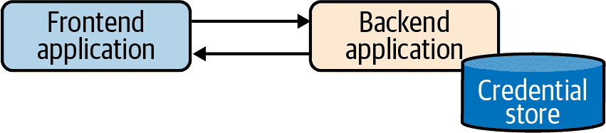

###### 图 10-1\. 共享密钥流程。

Kubernetes 提供了两种选项，允许您使用共享密钥模型对 API 服务器进行身份验证。在第一种方法中，您可以向 API 服务器提供一个逗号分隔值（CSV）映射用户名（以及可选的组）到静态令牌的列表。当您要对 API 服务器进行身份验证时，可以在 HTTP 授权头中提供令牌作为 Bearer 令牌。Kubernetes 将把请求视为来自映射用户，并相应地操作。

另一种方法是向 API 服务器提供一个用户名（以及可选的组）和密码映射的 CSV。使用此方法配置后，用户可以在 HTTP 基本授权头中提供 Base64 编码的凭据。

###### 注意

Kubernetes 没有称为用户或组的资源或对象。这些只是在 RBAC RoleBindings 内部标识目的的预定义名称。用户可以从静态文件映射到令牌或密码（如前所述），可以从 x509 证书的 CN 中提取，或者可以作为 OAuth 请求的字段读取，等等。确定用户和组的方法完全取决于正在使用的身份验证方法，而 Kubernetes 没有办法在内部定义或管理它们。在我们看来，这种模式是 API 的一个优点，因为它允许我们插入各种不同的实现，并将这些问题委托给专门设计来处理它们的系统。

这两种方法都存在严重的弱点，不建议使用。其中一些弱点是由于 Kubernetes 的具体实现，而一些则是共享密钥模型固有的问题，我们将很快讨论它们。在 Kubernetes 中，主要问题包括：

+   静态令牌和/或密码文件必须以明文形式存储在 API 服务器可访问的某个位置。这比起初看起来的风险要小，因为如果有人能够 compromise API 服务器并访问该节点，你将有更大的问题要担心，而不仅仅是一个未加密的密码文件。然而，Kubernetes 安装大多是自动化的，设置所需的所有资产应存储在一个仓库中。这个仓库必须是安全的、经过审计和更新的。这打开了另一个潜在的疏忽或不良实践泄露凭据的可能区域。

+   静态令牌和用户名/密码组合均没有过期日期。如果任何凭据被泄露，必须快速识别并通过移除相关凭据并重新启动 API 服务器来修复漏洞。

+   对这些凭据文件的任何修改都要求 API 服务器重新启动。在实践中（以及孤立情况下），这相当简单。然而，许多组织正逐渐从手动干预转向其运行软件和服务器的过程。现在，改变配置大多是重新构建和重新部署的过程，而不仅仅是通过 SSH 进入机器（牛群而非宠物）。因此，修改 API 服务器配置并重新启动进程可能是一个更为复杂的操作。

除了刚刚描述的特定于 Kubernetes 的劣势外，共享密钥模型还遭受另一个缺点的困扰。如果我是一个不受信任的实体，我如何首先在*第一次*中进行身份验证，以接收适当的身份？我们将更详细地讨论这个*安全引入*问题以及如何在“应用程序/工作负载身份验证”中解决它。

### 公钥基础设施

###### 注意

本节假设您已经熟悉 PKI 概念。

PKI 模型使用证书和密钥来唯一标识和认证用户到 Kubernetes。Kubernetes 广泛使用 PKI 来保护系统的所有核心组件之间的通信。可以通过多种方式配置证书颁发机构（CA）和证书，但我们将演示使用 kubeadm 的方式，这是现场中最常见的方法（也是上游 Kubernetes 的事实标准安装方法）。

在安装 Kubernetes 集群后，通常会得到一个 kubeconfig 文件，其中包含`kubernetes-admin`用户的详细信息。这个文件本质上是集群的根密钥。通常，这个 kubeconfig 文件称为*admin.conf*，类似于这样：

```
apiVersion: v1
clusters:
- cluster:
    certificate-authority-data: <.. SNIP ...>
    server: https://127.0.0.1:32770
  name: kind-kind
contexts:
- context:
    cluster: kind-kind
    user: kind-kind
  name: kind-kind
current-context: kind-kind
kind: Config
preferences: {}
users:
- name: kind-kind
  user:
    client-certificate-data: <.. SNIP ...>
    client-key-data: <.. SNIP ...>
```

要确定将用于向集群进行身份验证的用户，我们需要首先对`client-certificate-data`字段进行 base64 解码，然后使用类似`openssl`的工具显示其内容：

```
Certificate:
    Data:
        Version: 3 (0x2)
        Serial Number: 2587742639643938140 (0x23e98238661bcd5c)
    Signature Algorithm: sha256WithRSAEncryption
        Issuer: CN=kubernetes
        Validity
            Not Before: Jul 25 19:48:42 2020 GMT
            Not After : Jul 25 19:48:44 2021 GMT
        Subject: O=system:masters, CN=kubernetes-admin
        Subject Public Key Info:
            Public Key Algorithm: rsaEncryption
                Public-Key: (2048 bit)
                Modulus:
                    <.. SNIP ...>
                Exponent: 65537 (0x10001)
        X509v3 extensions:
            X509v3 Key Usage: critical
                Digital Signature, Key Encipherment
            X509v3 Extended Key Usage:
                TLS Web Client Authentication
    Signature Algorithm: sha256WithRSAEncryption
         <.. SNIP ...>
```

我们从证书中看到，它是由 Kubernetes CA 签发的，并且在`system:masters`组中标识用户为`kubernetes-admin`（主题`CN`字段）。在使用 x509 证书时，任何存在的组织（O=）将被 Kubernetes 视为用户应该被视为其中一部分的组。我们将在本章后面讨论关于用户和组配置以及权限的一些高级方法。

在前面的示例中，我们看到了`kubernetes-admin`用户的默认配置，这是一个保留的默认名称，使其具有集群范围的管理特权。看看如何配置证书的配发以识别其他常规系统用户，并可以使用 RBAC 系统为他们分配适当的权限也会很有用。使用内置资源，Kubernetes 可以帮助我们进行证书工件的配发和维护，虽然这是一个艰巨的任务。

为了使下面描述的 CSR 流程能够正常运行，控制器管理器需要配置`--cluster-signing-cert-file`和`--cluster-signing-key-file`参数，如下所示：

```
spec:
  containers:
  - command:
    - kube-controller-manager
    - --cluster-signing-cert-file=/etc/kubernetes/pki/ca.crt
    - --cluster-signing-key-file=/etc/kubernetes/pki/ca.key
    # Additional flags removed for brevity
    image: k8s.gcr.io/kube-controller-manager:v1.17.3
```

任何具有适当 RBAC 权限的实体都可以向 Kubernetes API 提交证书签名请求对象。如果用户应该能够*自行提交*，这意味着我们需要为用户提供提交这些请求的机制。一种做法是明确配置权限，允许`system:anonymous`用户和/或`system:unauthenticated`组提交和检索 CSR。

如果没有这样做，任何未经身份验证的用户都基本上无法启动允许他们进行身份验证的流程。但是，我们应该谨慎对待这种方法，因为我们绝不希望向未经身份验证的用户提供访问 Kubernetes API 服务器的权限。因此，为 CSRs 提供自服务的常见方法是，在 Kubernetes 之上提供一个薄抽象或门户，并具有适当的权限运行。用户可以使用其他凭据（通常是 SSO）登录门户，并启动此 CSR 流程（如图 10-2 所示）。

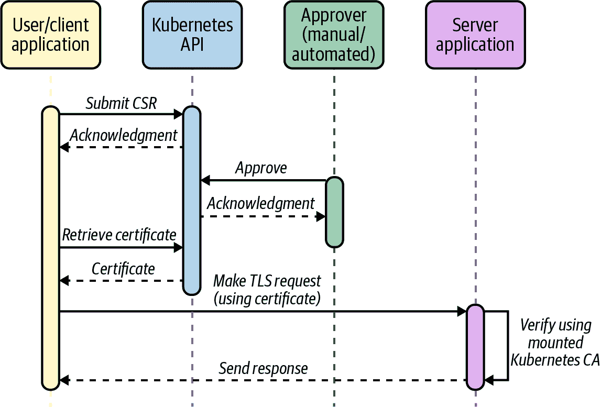

###### 图 10-2\. CSR 流程。

在这种流程中，用户可以在本地生成私钥，然后通过门户提交。或者，门户可以为每个用户生成私钥，并在批准证书后将其返回给用户。生成可以使用`openssl`或任何其他工具/库进行。CSR 应包含用户希望编码到其 x509 证书中的元数据，包括他们的用户名和任何其他应该成为一部分的组。以下示例创建一个证书请求，将用户标识为*john*：

```
$ openssl req -new -key john.key -out john.csr -subj "/CN=john"
$ openssl req -in john.csr -text
Certificate Request:
    Data:
        Version: 0 (0x0)
        Subject: CN=john
        Subject Public Key Info:
            Public Key Algorithm: rsaEncryption
                Public-Key: (1024 bit)
                Modulus:
                    <.. SNIP ...>
                Exponent: 65537 (0x10001)
        Attributes:
            a0:00
    Signature Algorithm: sha256WithRSAEncryption
         <.. SNIP ...>
```

在生成 CSR 之后，我们可以通过我们的门户将其提交给集群中的 CertificateSigningRequest 资源。以下是请求的示例，作为 YAML 对象，但我们的门户通常会通过 Kubernetes API 程序化地应用它，而不是手动构建 YAML：

```
cat <<EOF | kubectl apply -f -
apiVersion: certificates.k8s.io/v1beta1
kind: CertificateSigningRequest
metadata:
  name: john
spec:
  request: $(cat john.csr | base64 | tr -d '\n')
  usages:
  - client auth
EOF
```

这在 Kubernetes 中创建一个具有`pending`状态的 CSR 对象，等待批准。此 CSR 对象包含（base64 编码的）签名请求和请求者的用户名。如果使用服务账户令牌进行身份验证访问 Kubernetes API（如 Pod 在自动化流程中会这样），则用户名将是服务账户名。在以下示例中，我作为`kubernetes-admin`用户通过 Kubernetes API 进行了认证，并显示在请求者字段中。如果使用门户，我们会看到分配给该门户组件的服务账户。

```
$ kubectl get csr
NAME     AGE   REQUESTOR            CONDITION
my-app   17h   kubernetes-admin     Pending
```

在请求待定时，用户尚未获得任何证书。下一阶段涉及集群管理员（或具有适当权限的用户）批准 CSR。如果可以程序化确定用户的身份，批准也可能是自动化的。批准将向用户发放一个证书，用于在 Kubernetes 集群上声明身份。因此，执行验证提交请求者*是*其声称的身份非常重要。这可以通过向 CSR 添加一些额外的标识元数据，并通过自动化流程验证信息与声称的身份进行对比，或通过一个独立的流程验证用户的身份来实现。

一旦 CSR 被批准，证书（在 CSR 的`status`字段中）就可以被检索和使用（与它们的私钥一起）用于与 Kubernetes API 进行 TLS 通信。在我们的门户实现中，CSR 将由门户系统拉取，并在用户重新登录并重新检查门户后为请求用户提供：

```
apiVersion: certificates.k8s.io/v1beta1
kind: CertificateSigningRequest
metadata:
  name: my-app
# Additional fields removed for brevity
status:
  certificate: <.. SNIP ...>
  conditions:
  - lastUpdateTime: "2020-03-04T15:45:30Z"
    message: This CSR was approved by kubectl certificate approve.
    reason: KubectlApprove
    type: Approved
```

解码证书时，我们可以看到它包含 CN 字段中的相关身份信息（*john*）：

```
Certificate:
    Data:
        Version: 3 (0x2)
        Serial Number:
            66:82:3f:cc:10:3f:aa:b1:df:5b:c5:42:cf:cb:5b:44:e1:45:49:7f
    Signature Algorithm: sha256WithRSAEncryption
        Issuer: CN=kubernetes
        Validity
            Not Before: Mar  4 15:41:00 2020 GMT
            Not After : Mar  4 15:41:00 2021 GMT
        Subject: CN=john
        Subject Public Key Info:
            Public Key Algorithm: rsaEncryption
                Public-Key: (2048 bit)
                Modulus:
                    <.. SNIP ...>
                Exponent: 65537 (0x10001)
        X509v3 extensions:
            X509v3 Extended Key Usage:
                TLS Web Client Authentication
            X509v3 Basic Constraints: critical
                CA:FALSE
            X509v3 Subject Key Identifier:
                EE:8E:E5:CC:98:41:78:4A:AE:32:75:52:1C:DC:DD:D0:9B:95:E0:81
    Signature Algorithm: sha256WithRSAEncryption
         <.. SNIP ...>
```

最后，我们可以制作一个 kubeconfig，其中包含我们的私钥和批准的证书，使我们能够作为*john*用户与 Kubernetes API 服务器通信。从前面的 CSR 流程中获得的证书将放入 kubeconfig 中显示的`client-certificate-data`字段：

```
apiVersion: v1
clusters:
- cluster:
    certificate-authority-data: <.. SNIP ...>
    server: https://127.0.0.1:32770
  name: kind-kind
contexts:
- context:
    cluster: kind-kind
    user: kind-kind
  name: kind-kind
current-context: kind-kind
kind: Config
preferences: {}
users:
- name: kind-kind
  user:
    client-certificate-data: <.. SNIP ...>
    client-key-data: <.. SNIP ...>
```

我们在现场看到这种模型的实施，其中自动化系统基于一些可验证的 SSO 凭据或其他认证方法提供证书。当自动化时，这些系统可能会成功，但我们不建议使用。将 x509 证书作为 Kubernetes 用户的主要认证方法会引入许多问题：

+   通过 Kubernetes CSR 流程提供的证书在到期之前无法吊销。目前在 Kubernetes 中没有支持证书吊销列表或在线证书状态协议(OSCP)装订的支持。

+   需要额外的 PKI 进行提供、支持和维护，除了创建和维护负责基于外部认证提供证书的组件。

+   x509 证书具有到期时间戳，应保持相对较短，以减少密钥/证书对被 compromise 的风险。这种短暂的生命周期意味着证书的大量更换，并且必须定期将其分发给用户，以确保对集群的持续访问。

+   需要一种方式来验证任何请求证书的人的身份。在自动化系统中，可以通过外部可验证的元数据来设计此类验证方式。在缺乏此类元数据的情况下，离线验证通常太耗时，不实用，特别是考虑到先前提到的证书的短生命周期。

+   证书局限于一个集群。在现场，我们看到许多（10 至 100 个）Kubernetes 集群跨项目和组存在。为每个集群需要独特的凭据会增加存储和维护相关凭据的复杂性。这导致用户体验下降。

###### 警告

即使不将证书作为主要认证方法，也要记住将*admin.conf* kubeconfig 保存在安全的地方。如果由于某些原因其他认证方法不可用，这可以作为管理员备用解决方案来访问集群。

### OpenID Connect (OIDC)

我们认为，在设置 Kubernetes 用户身份验证和身份时，最好的选择是与现有的单点登录系统或提供者集成。几乎每个组织都已经有了诸如 Okta、Auth0、Google，甚至是内部 LDAP/AD 之类的解决方案，提供了一个统一的地方供用户进行身份验证并获得对内部系统的访问。对于像身份验证这样安全性是一个重要因素的情况，外包复杂性是一个稳妥的选择，除非您有非常专业的需求。

这些系统有很多优点。它们建立在广为人知和广泛支持的标准上。它们将用户帐户和对单个安全系统的访问的所有管理都集中到一个良好安全的系统中，使得维护和删除帐户/访问变得简单。此外，当使用通用 OIDC 框架时，它们还允许用户访问下游应用程序而不向这些系统暴露凭据。另一个优点是，许多跨多个环境的 Kubernetes 集群可以利用单个身份提供者，从而减少了集群配置之间的差异。

Kubernetes 直接支持 OIDC 作为认证机制（如图 10-3 所示）。如果您的组织本身就提供了相关 OIDC 端点，那么配置 Kubernetes 以利用这一点就很简单。

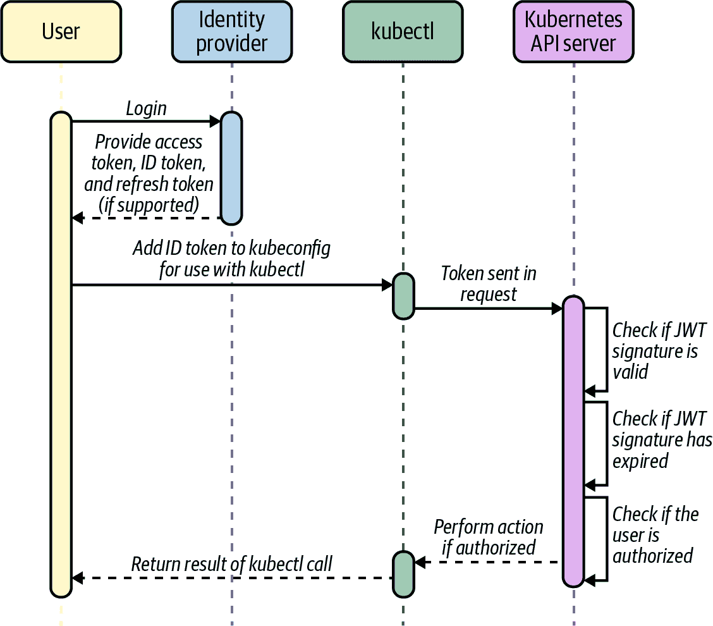

###### 图 10-3。OIDC 流程。摘自[官方 Kubernetes 文档](https://oreil.ly/VZCz5)。

然而，在某些情况下，可能需要或期望使用一些额外的工具来提供附加功能或改善用户体验。首先，如果您的组织有多个身份提供者，则有必要使用 OIDC 聚合器。Kubernetes 仅支持在其配置选项中定义单个身份提供者，而 OIDC 聚合器可以作为多个其他提供者（无论是 OIDC 还是其他方法）的单个中间人。我们以前在云原生计算基金会内使用过 Dex（[一个沙盒项目](https://oreil.ly/_maX6)），并且取得了成功，尽管其他流行的选项如 Keycloak 和 UAA 也提供了类似的功能。

###### 注意   注意

请记住，身份验证是集群访问的关键路径。Dex、Keycloak 和 UAA 都可以根据不同程度进行配置，当实施这些解决方案时，您应该优化可用性和稳定性。这些工具是额外的维护负担，必须进行配置、更新和保护。在实践中，我们总是强调理解和拥有您的环境和集群引入的任何额外复杂性的必要性。

虽然配置 API 服务器以利用 OIDC 是直截了当的，但必须注意为集群用户提供无缝的用户体验。OIDC 解决方案将返回一个标识我们的令牌（在成功登录后）；然而，为了访问并在集群上执行操作，我们需要一个格式正确的 kubeconfig。当我们在现场遇到这种用例时，我们的同事开发了一个简单的 Web UI，称为 Gangway，用于通过 OIDC 提供者自动化登录过程，并从返回的令牌生成符合标准的 kubeconfig（包括相关的端点和证书）。

尽管 OIDC 是我们首选的身份验证方法，但并不适用于所有情况，可能需要使用次要方法。OIDC（如规范中定义的）要求用户直接通过身份提供者的 Web 接口登录。这是为了明显的原因，以确保用户只向受信任的提供者提供凭据，而不是向消费应用程序提供。这种要求在机器人用户需要访问系统的情况下可能会引起问题。这对于自动化工具如 CI/CD 系统和其他无法响应基于 Web 的凭据挑战的系统是常见的。

在这些情况下，我们看到了几种不同的模型/解决方案：

+   在机器人用户绑定到集中管理的账户的情况下，可以实现一个 kubectl 认证插件，该插件会登录到外部系统并接收一个令牌作为响应。Kubernetes 可以配置以通过 webhook 令牌认证器方法验证此令牌。这种方法可能需要一些定制编码来创建令牌生成器/webhook 服务器。

+   对于其他情况，我们看到用户回退到使用基于证书的身份验证，适用于不需要集中管理的机器人账户。当然，这意味着您需要管理证书的签发和轮换，但不需要任何定制组件。

+   另一个手动但有效的替代解决方案是为工具创建一个服务账户，并利用为 API 访问生成的令牌。如果工具在集群内运行，它可以直接使用挂载到 Pod 中的凭据。如果工具在集群外运行，我们可以手动复制并粘贴令牌到工具可访问的安全位置，并在进行 kubectl 或 API 调用时使用。服务账户的更多细节在 “Service Account Tokens (SAT)” 中有详细介绍。

## 为用户实施最小特权权限

现在我们已经看到了实现身份验证和认证的不同方式，让我们转向授权的相关主题。在本书的范围之外深入讨论如何配置跨集群的 RBAC 不是我们的目的。这将在应用程序、环境和团队之间有显著差异。然而，我们确实想描述一种成功实施的模式，围绕最小权限原则设计管理访问角色。

无论您选择了每个团队一个集群的方法还是多租户集群的方法，您都可能在操作团队上有*超级管理员*用户，负责配置、升级和维护环境。尽管个别团队应根据其所需的访问权限进行限制，这些管理员将对整个集群拥有完全控制权，因此更有可能意外执行破坏性操作。

在理想情况下，所有集群访问和操作都应由自动化流程（如 GitOps 或类似工具）执行。然而，从实际操作角度来看，我们经常看到用户单独访问集群，并发现以下模式是限制潜在问题的有效方式。有时候，将管理员角色直接绑定到特定操作员的用户名/身份上是很诱人的，但可能因为加载了错误的 kubeconfig 而误删重要内容。在此之前，这种情况不应该发生，但却经常发生！

Kubernetes 支持*模拟（impersonation）*的概念，通过这种方式，我们可以创建一个行为与 Linux 系统上的*sudo*非常接近的体验，通过限制用户的默认权限并要求他们提升权限来执行敏感命令。从实际操作角度来看，我们希望这些用户默认情况下可以查看所有内容，但必须有意提升权限才能进行写操作。这种模式显著降低了发生上述情况的可能性。

让我们详细讨论一下如何实现刚才描述的权限提升模式。我们假设我们操作团队的用户身份都是 Kubernetes 中`ops-team`组的一部分。正如前面提到的，Kubernetes 本身没有定义组的概念，所以我们指的是那些在其 Kubernetes 身份中具有额外属性（如 x509 证书、OIDC 声明等）以标识他们属于该组的用户。

我们创建了 ClusterRoleBinding，允许`ops-team`组的用户访问`view`内置 ClusterRole，这是我们默认只读访问的基础：

```
apiVersion: rbac.authorization.k8s.io/v1
kind: ClusterRoleBinding
metadata:
  name: cluster-admin-view
roleRef:
  apiGroup: rbac.authorization.k8s.io
  kind: ClusterRole
  name: view
subjects:
- apiGroup: rbac.authorization.k8s.io
  kind: Group
  name: ops-team
```

现在我们创建一个 ClusterRoleBinding，允许我们的 `cluster-admin` 用户在集群上拥有 `cluster-admin` ClusterRole 权限。请记住，我们不直接将此 ClusterRole 绑定到我们的 `ops-team` 组。没有用户可以直接标识为 `cluster-admin` 用户；这将是一个被模拟的用户，并且他们的权限将被另一个经过身份验证的用户*假定*。

```
apiVersion: rbac.authorization.k8s.io/v1
kind: ClusterRoleBinding
metadata:
  name: cluster-admin-crb
roleRef:
  apiGroup: rbac.authorization.k8s.io
  kind: ClusterRole
  name: cluster-admin
subjects:
- apiGroup: rbac.authorization.k8s.io
  kind: User
  name: cluster-admin
```

最后，我们创建一个名为 `cluster-admin-impersonator` 的 ClusterRole，允许模拟 `cluster-admin` 用户，并创建一个 ClusterRoleBinding，将该功能绑定到 `ops-team` 组中的每个人：

```
apiVersion: rbac.authorization.k8s.io/v1
kind: ClusterRole
metadata:
  name: cluster-admin-impersonator
rules:
- apiGroups: [""]
  resources: ["users"]
  verbs: ["impersonate"]
  resourceNames: ["cluster-admin"]
---
apiVersion: rbac.authorization.k8s.io/v1
kind: ClusterRoleBinding
metadata:
  name: cluster-admin-impersonate
roleRef:
  apiGroup: rbac.authorization.k8s.io
  kind: ClusterRole
  name: cluster-admin-impersonator
subjects:
- apiGroup: rbac.authorization.k8s.io
  kind: Group
  name: ops-team
```

现在让我们使用 `ops-team` 组中的用户（john）的 kubeconfig，看看特权的提升在实践中如何运作：

```
$ kubectl get configmaps
No resources found.

$ kubectl create configmap my-config --from-literal=test=test
Error from server (Forbidden): configmaps is forbidden: User "john"
cannot create resource "configmaps" in API group "" in the namespace "default"

$ kubectl --as=cluster-admin create configmap my-config --from-literal=test=test
configmap/my-config created
```

我们使用前述设置用于管理员用户，尽管为每个用户实施类似的模式（拥有 *team-a* 组、*team-a* 视图角色和 *team-a* 管理员用户）是一种可靠的模式，可以消除许多潜在的昂贵错误。此外，刚才描述的模仿方法的一大优点是，所有这些都记录在 Kubernetes 审计日志中，因此我们可以看到原始用户登录，模拟集群管理员，然后采取行动。

# 应用程序/工作负载身份

在前一节中，我们看到了 Kubernetes 的人类用户建立身份的主要方法和模式，以及他们如何对集群进行身份验证。在这一节中，我们将看看如何为在集群中运行的工作负载建立身份。我们将检查三个主要的用例：

+   工作负载将自己标识给集群内的其他工作负载，可能为它们之间建立互相认证以提供额外的安全性。

+   工作负载标识自身以获得适当的访问 Kubernetes API 本身。这是自定义控制器常见的用例，需要监视和操作 Kubernetes 资源。

+   工作负载标识自身并向集群外部的服务进行身份验证。这可能是集群外的任何内容，但主要是运行在 AWS、GCP 等上的云供应商服务。

在 “网络身份” 中，我们将看看两种最流行的容器网络接口（CNI）工具（Calico 和 Cilium），并看看它们如何分配身份和限制访问，主要用于我们刚刚描述的第一个用例。

其次，我们将转向服务账户令牌（SAT）和预计服务账户令牌（PSAT）。这些是灵活且重要的 Kubernetes 原语，除了是工作负载之间身份识别（第一个用例）的主要机制外，还是工作负载向 Kubernetes API 本身标识的主要机制（第二个用例）。

接下来我们将讨论应用程序身份由平台本身提供的选项。我们在现场看到的最常见用例是需要访问 AWS 服务的工作负载，并且我们将看看今天可能的三种主要方法。

最后，我们将扩展平台中介的身份概念，考虑旨在在多个平台和环境中提供一致身份模型的工具。这种方法的灵活性可以用来涵盖我们提到的所有用例，并展示这是一个非常强大的能力。

在实施本节描述的任何模式之前，您应该确实评估与建立工作负载身份相关的需求。通常，建立这种能力是一项高级活动，大多数组织可能最初不需要解决这个问题。

## 共享密钥

大多数关于用户身份共享密钥的讨论也适用于应用程序身份；然而，基于现场经验，还有一些额外的细微差别和指导。

一旦我们在客户端和服务器上有已知的密钥，我们如何在到期时安全地旋转它们？理想情况下，我们希望这些密钥有一个固定的生命周期，以减少如果某个密钥被破坏可能造成的潜在损害。此外，因为它们是*共享*的，它们需要重新分发到客户端应用程序和服务器上。Hashicorp 的 Vault 是一个著名的企业秘密存储示例，具有与许多解决此重新同步问题的工具集成。然而，Vault 也受到我们在 “用户身份” 中首次遇到的安全引入问题的困扰。

这是我们在试图确保共享密钥在我们建立身份和认证模型之前（鸡和蛋问题）安全分发到客户端和服务实体的问题。任何尝试在两个实体之间最初种子化密钥的行为都可能被破坏，打破了我们对身份和独特认证的保证。

尽管已经讨论了缺陷，共享密钥在一个方面具有强大的优势，即几乎所有用户和应用程序都支持并理解该模型。这使得它成为跨平台操作的强大选择。我们将在本章后面看到如何通过更高级的身份验证方法来解决 Vault 和 Kubernetes 的安全引入问题。一旦 Vault 使用这些方法进行了安全配置，它就是一个很好的选择（我们已经多次实施过），因为许多共享密钥的问题都得到了缓解。

## 网络身份

网络原语，如 IP 地址、VPN、防火墙等，历来被用作控制应用程序对各种服务访问权限的一种形式。然而，在云原生生态系统中，这些方法正在失效，范式也在发生变化。根据我们的经验，教育整个组织的团队（尤其是网络和安全团队）了解这些变化，以及如何调整实践来适应和接纳这些变化至关重要。但往往会遇到团队对安全性和/或控制方面的担忧而产生抵制。实际上，如果有必要，几乎可以实现任何姿态，但需要花时间了解团队的*实际需求*，而不是陷入实施细节中。

在基于容器的环境中，工作负载共享网络堆栈和基础设备。工作负载日益短暂，经常在节点之间移动。这导致 IP 地址和网络变化的不断变动。

在多云和 API 驱动的世界中，网络不再是主要边界。常见情况是跨多个提供商对外部服务进行调用，每个提供商可能需要一种方式来证明我们调用应用程序的身份。

现有的传统（平台级别）网络原语（主机 IP 地址、防火墙等）已不再适用于建立工作负载身份，如有使用，也只应作为深度防御的附加层次。这并不是说网络原语*总体上*不好，而是它们必须具有额外的工作负载上下文才能发挥作用。在本节中，我们将探讨 CNI 选项如何为 Kubernetes 集群提供身份，并如何最好地利用它们。通过结合从 Kubernetes API 检索的网络原语和元数据，CNI 提供者能够对请求进行上下文化处理并提供身份。我们将简要介绍一些最流行的 CNI 实现，并看看它们能提供哪些功能。

### Calico

[Calico](https://www.projectcalico.org)在 OSI 模型的第 3 层（网络层）和第 4 层（传输层）提供网络策略强制执行，使用户能够基于它们的命名空间、标签和其他元数据限制 Pod 之间的通信。此强制执行是通过修改网络配置（如`iptables`/`ipvs`）来允许/禁止 IP 地址来实现的。

当与[Envoy 代理](https://www.envoyproxy.io)（无论是独立的 Envoy 还是作为服务网格（如[Istio](https://istio.io)）的一部分部署）结合使用时，Calico 还支持使用称为 Dikastes 的组件基于服务账户做出策略决策。此方法使得能够基于应用程序协议的属性（如头部等）和相关的加密身份（证书等），在第 7 层（应用层）执行强制执行。

默认情况下，Istio（Envoy）只会执行 mTLS 并确保工作负载呈现由 Istio CA（Citadel）签名的证书。Dikastes 作为 Envoy 的插件以 sidecar 形式运行，正如我们可以在 Figure 10-3 中的架构图中看到的那样。Envoy 在查询 Dikastes 决定是否接受或拒绝请求之前会验证 CA。Dikastes 基于用户定义的 Calico NetworkPolicy 或 GlobalNetworkPolicy 对象作出决策：

```
apiVersion: projectcalico.org/v3
kind: GlobalNetworkPolicy
metadata:
  name: summary
spec:
  selector: app == 'summary'
  ingress:
    - action: Allow
      source:
        serviceAccounts:
          names: ["customer"]
        NamespaceSelector: app == 'bank'
  egress:
    - action: Allow
```

前述规则指定该策略适用于任何带有标签 `app: summary` 的 Pod，并限制了从 `customer` Service Account 调用的 Pod 的访问权限（在带有标签 `app: bank` 的 Namespace 中）。这有效是因为 Calico 控制平面（Felix 节点代理）通过协调正在特定 Service Account 下运行的 Pod 及其 IP 地址来计算规则，随后通过 Unix 套接字将此信息同步到 Dikastes。

这种离线验证在 Istio 环境中尤为重要，因为它有助于减轻潜在的攻击向量。Istio 将每个 Service Account 的 PKI 资产存储在集群中的一个 Secret 中。如果没有这种额外验证，攻击者如果能够窃取该 Secret，就能够伪装成所断言的 Service Account（通过展示这些 PKI 资产），尽管可能并非以该账户的身份运行。

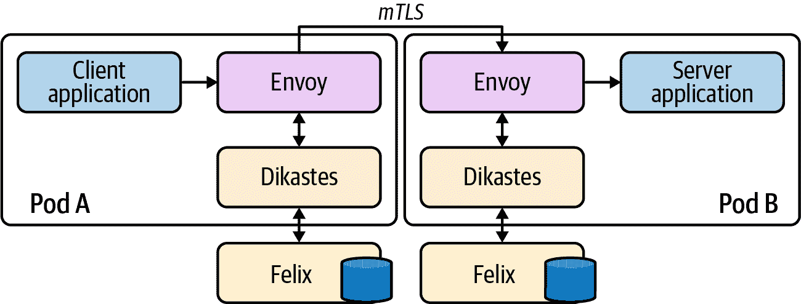

###### 图 10-4\. 使用 Envoy 的 Dikastes 架构图。

如果您的团队已经在使用 Calico，那么 Dikastes 可以在深度防御中提供额外的安全层，绝对值得考虑。然而，这需要 Istio 或其他类似的服务网格解决方案（例如独立的 Envoy）在环境中可用并运行，以验证工作负载所呈现的身份。这些主张无法独立进行加密验证，而是依赖于网格与每个连接的服务的存在。这本身增加了相当大的复杂性，应仔细评估其权衡。这种方法的一个优势是 Calico 和 Istio 都是跨平台的，因此此设置可用于在环境内运行的 Kubernetes 应用程序的身份验证（而某些选项则仅适用于 Kubernetes）。

### Cilium

像 Calico 一样，[Cilium](https://docs.cilium.io) 也提供第 3 和第 4 层的网络策略执行，使用户能够根据其 Namespace 和其他元数据（例如标签）限制 Pod 之间的通信。Cilium 还支持在第 7 层应用策略，并通过 Service Account 限制对服务的访问，而无需额外的工具支持。

与 Calico 不同，Cilium 中的执行并不基于 IP 地址（和更新节点网络配置）。相反，Cilium 为每个唯一的 Pod/端点（基于多个选择器）计算身份，并将这些身份编码到每个数据包中。然后，它使用 [eBPF](https://oreil.ly/Jl9yw) 内核钩子在数据路径的各个点上根据这些身份来执行是否允许数据包通过。

让我们简要探讨一下 Cilium 如何计算端点（Pod）的身份。以下是列出一个应用程序的 Cilium 端点的输出代码。我们省略了片段中的标签列表，但在列表的最后一个 Pod (`deathstar-657477f57d-zzz65`) 中添加了一个额外的标签，这个标签在其他四个 Pod 中不存在。因此，我们可以看到最后一个 Pod 因此被分配了一个*不同*的身份。除了这个单一不同的标签外，部署中的所有 Pod 都共享一个命名空间、服务账户和几个其他任意的 Kubernetes 标签。

```
$ kubectl exec -it -n kube-system cilium-oid9h -- cilium endpoint list
NAMESPACE     NAME                              ENDPOINT ID   IDENTITY ID
default       deathstar-657477f57d-jpzgb        1474          1597
default       deathstar-657477f57d-knxrl        2151          1597
default       deathstar-657477f57d-xw2tr        16            1597
default       deathstar-657477f57d-xz2kk        2237          1597
default       deathstar-657477f57d-zzz65        1             57962
```

如果我们移除了不同的标签，`deathstar-657477f57d-zzz65` Pod 将被重新分配与其四个同行相同的身份。这种粒度的控制赋予了我们在为单个 Pod 分配身份时的强大和灵活性。

Cilium 实现了 Kubernetes 本机的 NetworkPolicy API，并像 Calico 一样以 CiliumNetworkPolicy 和 CiliumClusterwideNetworkPolicy 对象的形式公开了更完整的功能：

```
apiVersion: "cilium.io/v2"
kind: CiliumNetworkPolicy
metadata:
  name: "k8s-svc-account"
spec:
  endpointSelector:
    matchLabels:
      io.cilium.k8s.policy.serviceaccount: leia
  ingress:
  - fromEndpoints:
    - matchLabels:
        io.cilium.k8s.policy.serviceaccount: luke
    toPorts:
    - ports:
      - port: '80'
        protocol: TCP
      rules:
        http:
        - method: GET
          path: "/public$"
```

在这个例子中，我们使用特殊的 `io.cilium.k8s.policy.*` 标签选择器来定位集群中特定的 Service Account。然后，Cilium 使用其身份注册表（我们之前看到的）根据需要限制/允许访问。在所示的策略中，我们限制了对具有 `leia` Service Account 的 Pod 在端口 80 上 `/public` 路径的访问。我们只允许来自具有 `luke` Service Account 的 Pod 的访问。

与 Calico 一样，Cilium 是跨平台的，因此可以在 Kubernetes 和非 Kubernetes 环境中使用。Cilium *需要* 在每个连接的服务中存在以验证身份，因此您的网络设置的整体复杂性可能会因此增加。但是，Cilium 不需要服务网格组件来运行。

## Service Account Tokens (SAT)

###### 注意

Service Account 是 Kubernetes 中为一组 Pod 提供身份的基元。每个 Pod 都在一个 Service Account 下运行。如果管理员没有预先创建并分配给 Pod 的 Service Account，则它们将被分配到所在命名空间的默认 Service Account。

Service Account tokens 是作为 Kubernetes Secrets 创建的 JSON Web Tokens (JWT)。每个 Service Account（包括默认的 Service Account）都有一个相应的 Secret，其中包含 JWT。除非另有规定，否则这些令牌被挂载到每个在该 Service Account 下运行的 Pod 中，并可用于向 Kubernetes API（以及本节显示的其他服务）发出请求。

Kubernetes 服务账户为一组工作负载分配身份提供了一种方式。然后，在集群内可以应用基于角色的访问控制（RBAC）规则来限制特定服务账户的访问范围。服务账户通常是 Kubernetes 自身在集群内部身份验证 API 访问的方式：

```
apiVersion: v1
kind: ServiceAccount
metadata:
  name: default
  namespace: default
secrets:
- name: default-token-mf9v2
```

当创建服务账户时，还会创建一个相关的秘密，其中包含标识该账户的唯一 JWT：

```
apiVersion: v1
data:
  ca.crt: <.. SNIP ...>
  namespace: ZGVmYXVsdA==
  token: <.. SNIP ...>
kind: Secret
metadata:
  annotations:
    kubernetes.io/service-account.name: default
    kubernetes.io/service-account.uid: 59aee446-b36e-420f-99eb-a68895084c98
  name: default-token-mf9v2
  namespace: default
type: kubernetes.io/service-account-token
```

默认情况下，如果 Pod 未指定要使用的特定服务账户，则 Pod 将自动获取其命名空间中的`default`服务账户令牌挂载。为确保所有服务账户令牌都明确挂载到 Pod 并且其访问范围被明确定义和理解（而不是回退并假设默认值），可以（而且应该）[禁用](https://oreil.ly/kX5mI)此功能。

要为 Pod 指定服务账户，请在 Pod 规范的`serviceAccountName`字段中使用：

```
apiVersion: v1
kind: Pod
metadata:
  name: my-pod
spec:
  serviceAccountName: my-pod-sa
# Additional fields removed for brevity
```

这将导致服务账户的秘密（包含令牌）被挂载到 Pod 的`/var/run/secrets/kubernetes.io/serviceaccount/`目录中。应用程序可以检索令牌并在集群中向其他应用程序/服务发出请求。

目标应用程序可以通过调用 Kubernetes `TokenReview` API 来验证提供的令牌：

```
curl -X "POST" "https://<kubernetes API IP>:<kubernetes API Port>\
/apis/authentication.k8s.io/v1/tokenreviews" \
     -H 'Authorization: Bearer <token>' \ 
     -H 'Content-Type: application/json; charset=utf-8' \
     -d $'{
  "kind": "TokenReview",
  "apiVersion": "authentication.k8s.io/v1",
  "spec": {
    "token": "<token to verify>"  }
}'
```


此令牌是挂载到目标应用程序 Pod 中的秘密，使其能够与 API 服务器通信。


此令牌是调用应用程序呈现作为身份证明的令牌。

Kubernetes API 将响应关于要验证的令牌的元数据，以及是否已经验证过的信息：

```
{
  "kind": "TokenReview",
    "apiVersion": "authentication.k8s.io/v1",
    "metadata": {
        "creationTimestamp": null
    },
    "spec": {
        "token": "<token to verify>"
    },
    "status": {
        "authenticated": true,
        "user": {
            "username": "system:serviceaccount:default:default",
            "uid": "4afdf4d0-46d2-11e9-8716-005056bf4b40",
            "groups": [
                "system:serviceaccounts",
                "system:serviceaccounts:default",
                "system:authenticated"
            ]
        }
    }
}
```

上述流程显示在图 10-5 中。

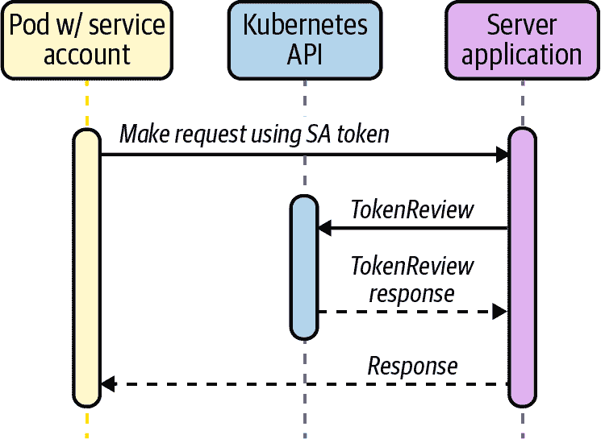

###### 图 10-5\. 服务账户令牌。

Kubernetes 服务账户令牌自早期以来就是 Kubernetes 的一部分，并以可消耗的 JWT 格式与平台紧密集成。作为操作员，我们对其有效性也有相当严格的控制，因为如果删除服务账户或秘密，则会使令牌无效。但是，它们有一些特性使其作为标识符的使用不够理想。最重要的是，这些令牌仅限于特定服务账户的范围，因此无法验证更精细的范围内的任何内容，例如 Pod 或单个容器。如果要使用和验证令牌作为客户端身份的形式，则还需要向我们的应用程序添加功能，包括使用自定义组件调用 TokenReview API。

令牌也仅限于单个集群，因此我们无法将一个集群发行的服务帐户令牌作为从其他集群调用的服务的身份文件使用，而无需暴露每个集群的 TokenReview API 并对请求起源集群的一些附加元数据进行编码。所有这些都会给设置增加显著的复杂性，因此我们建议不要选择这种用于跨集群服务身份验证的方法。

###### 注意

为了确保权限可以以适当的细粒度方式授予应用程序，应为每个需要访问 Kubernetes API 服务器的工作负载创建唯一的服务帐户。此外，如果工作负载*不需要*访问 Kubernetes API 服务器，请通过在`ServiceAccount`对象上指定`automountServiceAccountToken: false`字段来禁用服务帐户令牌的挂载。

例如，可以在命名空间的默认服务帐户上设置此项，以禁用凭证令牌的自动挂载。此字段也可以设置在`Pod`对象上，但请注意，如果两个地方都设置了，则以`Pod`字段为准。

## 投影的服务帐户令牌（PSAT）

从 Kubernetes v1.12 开始，还提供了一种可用的附加身份验证方法，该方法建立在服务帐户令牌的思想上，但旨在解决一些弱点（例如缺乏 TTL、广泛作用域和持久性）。

为了使 PSAT 流程正常工作，Kubernetes API 服务器需要配置显示的参数键（所有这些都是可配置的）：

```
spec:
  containers:
  - command:
    - kube-apiserver
    - --service-account-signing-key-file=/etc/kubernetes/pki/sa.key
    - --service-account-key-file=/etc/kubernetes/pki/sa.pub
    - --service-account-issuer=api
    - --service-account-api-audiences=api
    # Additional flags removed for brevity
    image: k8s.gcr.io/kube-apiserver:v1.17.3
```

建立和验证身份的流程与 SAT 方法类似。但是，不是让我们的 Pod/应用程序读取自动挂载的服务帐户令牌，而是将投影的服务帐户令牌作为卷挂载。这也会向 Pod 注入令牌，但是您可以为令牌指定 TTL 和自定义受众：

```
apiVersion: v1
kind: Pod
metadata:
  name: test
  labels:
    app: test
spec:
  serviceAccountName: test
  containers:
  - name: test
    image: ubuntu:bionic
    command: ['sh', '-c', 'echo Hello Kubernetes! && sleep 3600']
    volumeMounts:
    - mountPath: /var/run/secrets/tokens
      name: app-token
  volumes:
  - name: app-token
    projected:
      sources:
      - serviceAccountToken:
          audience: api 
          expirationSeconds: 600
          path: app-token
```


`audience`字段很重要，因为它防止目标应用程序使用来自调用应用程序的令牌并尝试冒充调用应用程序。根据目标应用程序的不同，受众应该始终正确范围化。在这种情况下，我们将范围限定为与 API 服务器本身通信。

###### 注意

当使用 PSAT 时，必须创建并使用指定的服务帐户。Kubernetes 不会为命名空间默认服务帐户挂载 PSAT。

调用应用程序可以读取投影令牌，并在集群内的请求中使用它。目标应用程序可以通过调用`TokenReview` API 并传递接收到的令牌来验证令牌。使用 PSAT 方法，审查还将验证 TTL 未过期，并返回关于呈现应用程序的其他元数据，包括特定的 Pod 信息。这提供了比普通 SAT（仅断言服务帐户）更紧密的范围。

```
// Additional fields removed for brevity
"extra": {
  "authentication.kubernetes.io/pod-name": ["test"],
  "authentication.kubernetes.io/pod-uid":
    ["8b9bc1be-c71f-4551-aeb9-2759887cbde0"]
}
```

如图 Figure 10-6 所示，SAT 和 PSAT 流程本身没有实质性区别（除了服务器验证 `audience` 字段），只在于令牌所断言的身份的有效性和粒度。`audience` 字段非常重要，因为它标识了令牌的预期接收者。根据 [JWT 官方规范](https://oreil.ly/gKlA7)，API 将拒绝目标与 API 服务器配置中指定的不匹配的令牌。

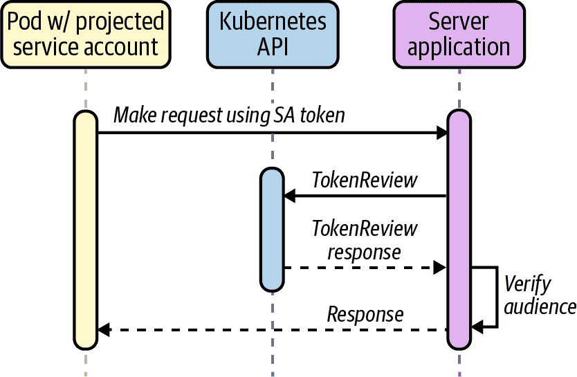

###### Figure 10-6\. 预投影服务账户令牌。

预投影服务账户令牌是 Kubernetes 功能集的一个相对较新但非常强大的补充。它们本身与平台本身紧密集成，提供可配置的 TTL，并且具有紧密的范围（个别 Pod）。它们还可以用作构建更强大模式的基础模块（正如我们将在后面的章节中看到的）。

## 平台中介节点身份

在所有工作负载均运行在同质平台（例如 AWS）的情况下，平台本身可以根据其拥有的有关工作负载的上下文元数据来确定和分配身份。

身份不是由工作负载本身断言的，而是由一个带外提供者基于其属性确定的。该提供者返回给工作负载一个凭据来证明身份，可以用于与平台上的其他服务通信。其他服务可以轻松验证该凭据，因为它们也位于同一基础平台上。

在 AWS 上，EC2 实例可以请求凭据以连接到不同的服务，例如 S3 存储桶。AWS 平台检查实例的元数据，并可以向实例提供特定角色的凭据，以便进行连接，如 Figure 10-7 所示。

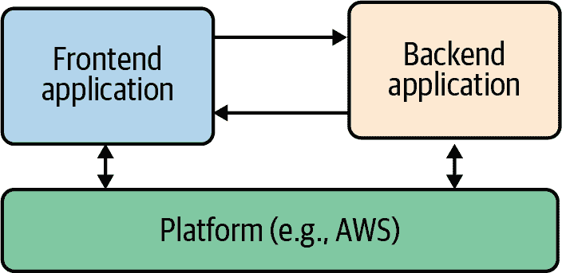

###### Figure 10-7\. 平台中介身份。

###### 注意

请记住，平台仍需对请求执行 *授权*，以确保使用的身份具有适当的权限。此方法仅用于 *认证* 请求。

许多云供应商在本节描述的功能上提供了相似的功能。我们选择关注适用于并与 Amazon Web Services（AWS）集成的工具，因为这是我们在现场中最常见的供应商。

### AWS 平台认证方法/工具

AWS 通过 EC2 元数据 API 在节点级别提供了强大的身份解决方案。这是一个平台介导的系统的例子，平台（AWS）能够根据多个内在属性确定调用实体的身份，而无需实体自己声明任何凭据/身份声明。然后，平台可以向实例（例如角色形式）提供安全凭据，使其能够访问由相关策略定义的任何服务。总体而言，这被称为身份和访问管理（IAM）。

此模型支撑了 AWS（以及许多其他供应商）如何向其自己的云服务提供安全访问的方式。然而，随着容器和其他多租户应用模型的兴起，这种基于每个节点的身份验证系统出现了问题，需要额外的工具和替代方法。

在本节中，我们将介绍我们在领域中遇到的三种主要工具选项。我们将涵盖 kube2iam 和 kiam，这两个独立的工具共享相似的实现模型（因此具有类似的优缺点）。我们还将描述为何今天我们不推荐使用这些工具，并且为何您应该考虑更集成的解决方案，例如我们介绍的最终选项，即服务帐户的 IAM 角色（IRSA）。

#### kube2iam

[kube2iam](https://github.com/jtblin/kube2iam) 是一个充当正在运行的工作负载与 AWS EC2 元数据 API 之间代理的开源工具。其架构显示在 图 10-8 中。

###### 注意

kube2iam 要求集群中的每个节点能够假定 Pods 可能需要的所有角色的超集。这种安全模型意味着，如果发生容器突破，所提供的访问范围可能会非常庞大。因此，强烈建议不要使用 kube2iam。我们在这里讨论它是因为我们经常在现场遇到它，并希望在深入了解实现的限制之前确保您了解它。

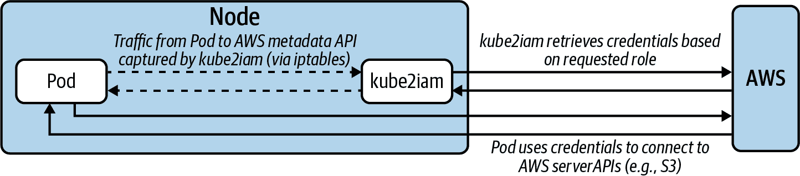

###### 图 10-8\. kube2iam 架构和数据流。

kube2iam Pods 通过 DaemonSet 在每个节点上运行。每个 Pod 注入一个 iptables 规则以捕获对元数据 API 的出站流量，并将其重定向到该节点上正在运行的 kube2iam 实例。

希望与 AWS API 交互的 Pods 应在 spec 中的注释中指定要假定的角色。例如，在以下部署规范中，您可以看到角色在 `iam.amazonaws.com/role` 注释中指定：

```
apiVersion: apps/v1
kind: Deployment
metadata:
  name: nginx-deployment
spec:
  replicas: 3
  template:
    metadata:
      annotations:
        iam.amazonaws.com/role: <role-arn>
      labels:
        app: nginx
    spec:
      containers:
      - name: nginx
        image: nginx:1.9.1
        ports:
        - containerPort: 80
```

#### kiam

与 kube2iam 类似，[kiam](https://github.com/uswitch/kiam) 是一个开源工具，用作 AWS EC2 元数据 API 的代理，尽管其架构（以及因此而得到的安全模型）有所不同并略有改进，如 图 10-9 所示。

###### 注意

虽然比 kube2iam 更安全，kiam 也引入了一个潜在的严重安全漏洞。本节描述了对该漏洞的缓解措施，但在使用 kiam 时仍应谨慎并理解攻击向量。

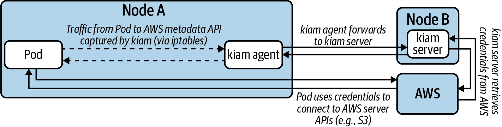

###### 图 10-9\. kiam 架构和数据流。

kiam 同时具有服务器和代理组件。代理作为 DaemonSet 运行在集群中的每个节点上。服务器组件可以（并且应该）限制为仅适用于控制平面节点或群集节点的子集。代理捕获 EC2 元数据 API 请求并将其转发给服务器组件，以完成与 AWS 的适当身份验证。只有服务器节点需要访问以承担 AWS IAM 角色（再次，这是可能需要的所有角色的超集），如 图 10-10 所示。

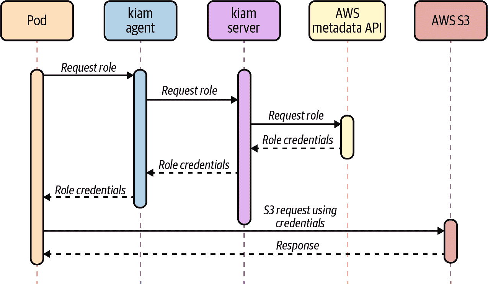

###### 图 10-10\. kiam 流程。

在这种模型中，应设置控制措施以确保没有工作负载能够在服务器节点上运行（从而获取无限制的 AWS API 访问）。像 kube2iam 一样，通过在 Pod 上注释所需的角色来实现角色的承担：

```
apiVersion: apps/v1
kind: Deployment
metadata:
  name: nginx-deployment
spec:
  replicas: 3
  template:
    metadata:
      annotations:
        iam.amazonaws.com/role: <role-arn>
      labels:
        app: nginx
    spec:
      containers:
      - name: nginx
        image: nginx:1.9.1
        ports:
        - containerPort: 80
```

虽然安全模型比 kube2iam 更好，但 kiam 仍存在潜在的攻击向量，即如果用户能够直接调度 Pod 到节点（通过填充其 `nodeName` 字段，绕过 Kubernetes 调度器和任何潜在的防护措施），则他们将能够无限制地访问 EC2 元数据 API。

对此问题的缓解措施是运行一个变更或验证入站 Webhook，确保在向 Kubernetes API 发送 Pod 创建和更新请求时，`nodeName` 字段未预填充。

kiam 为使单个 Pod 能够访问 AWS API 提供了一个强大的解决方案，采用现有 AWS 用户熟悉的模型（角色承担）。在许多情况下，只要在使用前采取了前述缓解措施，这是一个可行的解决方案。

#### IAM Roles for Service Accounts (IRSA)

从 2019 年底以来，AWS 提供了 Kubernetes 和 IAM 之间的本地集成，称为 [IAM Roles for Service Accounts](https://oreil.ly/dUoJJ) (IRSA)。

在高层次上，IRSA 提供了一种类似于 kiam 和 kube2iam 的体验，用户可以使用 AWS IAM 角色对他们的 Pod 进行注解以指定其所需承担的角色。尽管实现方式有很大不同，但消除了早期方法的安全顾虑。

AWS IAM 支持将身份联合到第三方 OIDC 提供者，例如 Kubernetes API 服务器。正如您在 PSAT 中已经看到的那样，Kubernetes 能够为每个 Pod 创建和签署短期令牌。

AWS IRSA 将这些特性与在其 SDK 中的额外凭据提供程序结合起来，调用 `sts:AssumeRoleWithWebIdentity`，传递 PSAT。PSAT 和所需的角色需要作为 Pod 内的环境变量注入（有一个基于所需的 `serviceAccountName` 将自动执行此操作的 Webhook）：

```
apiVersion: apps/v1
kind: Pod
metadata:
  name: myapp
spec:
  serviceAccountName: my-serviceaccount
  containers:
  - name: myapp
    image: myapp:1.2
    env:
    - name: AWS_ROLE_ARN
      value: "arn:aws:iam::123456789012:role/\
        eksctl-irptest-addon-iamsa-default-my-\
        serviceaccount-Role1-UCGG6NDYZ3UE"
    - name: AWS_WEB_IDENTITY_TOKEN_FILE
      value: /var/run/secrets/eks.amazonaws.com/serviceaccount/token
    volumeMounts:
    - mountPath: /var/run/secrets/eks.amazonaws.com/serviceaccount
        name: aws-iam-token
        readOnly: true
  volumes:
  - name: aws-iam-token
    projected:
      defaultMode: 420
      sources:
      - serviceAccountToken:
          audience: sts.amazonaws.com
          expirationSeconds: 86400
          path: token
```

Kubernetes 并不原生暴露`.well-known` OIDC 端点，因此需要额外的工作来配置公共位置（静态 S3 存储桶），以便 AWS IAM 使用 Kubernetes 的公共服务账号签名密钥验证令牌。

经验证后，AWS IAM 响应应用程序的请求，将 PSAT 交换为所需的 IAM 角色凭据，如图 10-11 所示。

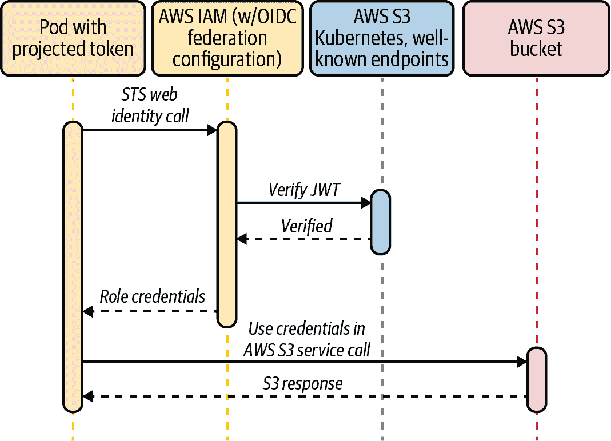

###### 图 10-11\. 服务账号的 IAM 角色。

尽管 IRSA 的设置有些笨拙，但它具有所有 Pod IAM 角色假设方法中最佳的安全模型。

对于已经利用 AWS 服务的组织来说，IRSA 是一个强有力的选择，因为它使用的模式和基元将与您的运营和开发团队熟悉。所采用的模型（将服务账号映射到 IAM 角色）也是一种易于理解且具有强大安全模型的模型。

主要缺点是，如果未使用亚马逊弹性 Kubernetes 服务（EKS），则 IRSA 部署和配置起来可能有些繁琐。然而，Kubernetes 本身的最新添加将减轻部分技术挑战，比如将 Kubernetes 本身暴露为 OIDC 提供者。

正如我们在本节中看到的，通过一个通用平台（在本例中为 AWS）调解身份具有许多优点。在下一节中，我们将深入探讨旨在实现相同模型但能够跨*多个*底层平台运行的工具。

### 使用 SPIFFE 和 SPIRE 的跨平台身份

安全生产身份框架（SPIFFE）是一个标准，指定了身份（SPIFFE 可验证身份文档，SVID）的语法，可以利用现有的加密格式，如 x509 和 JWT。它还指定了一些用于提供和消费这些身份的 API。SPIFFE ID 的形式为`spiffe://trust-domain/hierarchical/workload`，`spiffe://`后的所有部分都是可以在多种方式中使用的任意字符串标识符（尽管创建某种层次结构是最常见的）。

SPIFFE 运行时环境（SPIRE）是 SPIFFE 的参考实现，具有多个 SDK 和集成，允许应用程序使用（提供和消费）SVID。

本节将假设同时使用 SPIFFE 和 SPIRE，除非另有说明。

#### 架构和概念

SPIRE 运行一个服务器组件，作为身份签发机构，并维护所有工作负载身份及其颁发身份文档所需条件的注册表。

SPIRE 代理作为 DaemonSet 在每个节点上运行，它们通过 Unix 套接字公开 API，以便工作负载通过它请求身份。代理还配置为对 kubelet 具有只读访问权限，以确定节点上的 Pod 的元数据。SPIRE 架构显示在图 10-12 中。

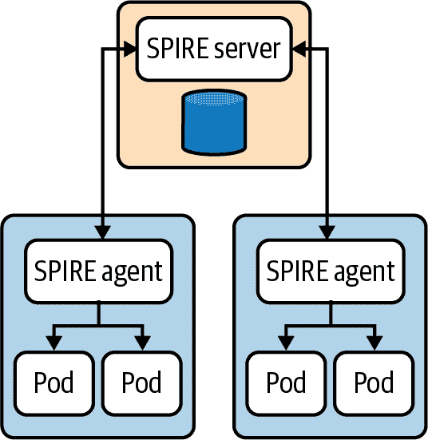

###### 图 10-12\. SPIRE 架构。取自[官方 SPIRE 文档](https://oreil.ly/6VY4A)。

当代理上线时，它们通过一种称为*节点认证*的过程验证并向服务器注册自己（如图 10-13 所示）。此过程利用环境上下文（例如，AWS EC2 元数据 API 或 Kubernetes PSATs）来识别节点并为其分配 SPIFFE ID。然后服务器以 x509 SVID 的形式向节点发出身份。以下是节点的注册示例：

```
/opt/spire/bin/spire-server entry create \
  -spiffeID spiffe://production-trust-domain/nodes \
  -selector k8s_psat:cluster:production-cluster \
  -selector k8s_psat:agent_ns:spire \
  -selector k8s_psat:agent_sa:spire-agent \
  -node
```

这告诉 SPIRE 服务器，对于任何满足所指定选择器的代理 Pod 的节点，都要分配 SPIFFE ID `spiffe://production-trust-domain/nodes`；在这种情况下，我们选择 Pod 在 `production-cluster` 上在 `spire-agent` 服务账户下运行的 SPIRE 命名空间中（通过 PSAT 验证）。

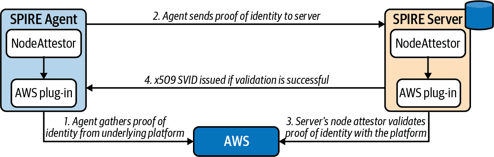

###### 图 10-13\. 节点认证。取自[官方 SPIRE 文档](https://oreil.ly/Q5eEW)。

当工作负载上线时，它们调用节点本地的工作负载 API 请求 SVID。SPIRE 代理使用其在平台上可用的信息（来自内核、kubelet 等）来确定调用工作负载的属性。此过程称为*工作负载认证*（如图 10-14 所示）。然后 SPIRE 服务器根据已知的工作负载标识基于其选择器匹配属性，并返回一个 SVID 给工作负载（通过代理），可用于对其他系统进行身份验证：

```
/opt/spire/bin/spire-server entry create \
  -spiffeID spiffe://production-trust-domain/service-a \
  -parentID spiffe://production-trust-domain/nodes \
  -selector k8s:ns:default \
  -selector k8s:sa:service-a \
  -selector k8s:pod-label:app:frontend \
  -selector k8s:container-image:docker.io/johnharris85/service-a:v0.0.1
```

这告诉 SPIRE 服务器，对于任何满足以下条件的工作负载，都要分配 SPIFFE ID `spiffe://production-trust-domain/service-a`：

+   正在运行在 ID 为 `spiffe://production-trust-domain/nodes` 的节点上。

+   正在运行在 `default` 命名空间中。

+   正在 `service-a` 服务账户下运行。

+   具有 Pod 标签 `app: frontend`。

+   使用 `docker.io/johnharris85/service-a:v0.0.1` 镜像构建。

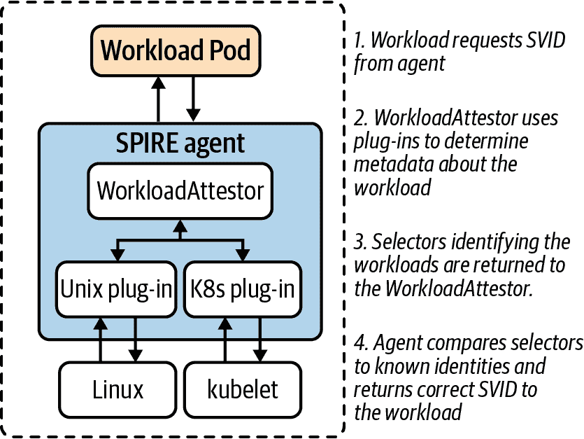

###### 图 10-14\. 工作负载认证。取自[官方 SPIRE 文档](https://oreil.ly/Eh7Xl)。

###### 警告

请注意，工作负载 attestor 插件可以使用其服务账户查询 kubelet（以发现有关工作负载的信息）。然后 kubelet 使用 `TokenReview` API 来验证持有者令牌。这需要连接到 Kubernetes API 服务器。因此，API 服务器停机可能会中断工作负载认证。

`--authentication-token-webhook-cache-ttl` kubelet 标志控制 kubelet 缓存 TokenReview 响应的时间长度，可以帮助缓解这个问题。然而，不建议设置过长的缓存 TTL 值，因为这可能影响权限撤销。有关更多详细信息，请参阅 [SPIRE 工作负载认证者文档](https://oreil.ly/Pn1ZP)。

本节描述的模式在尝试为工作负载构建强大的身份系统时具有显著优势，无论是在 Kubernetes 内外。SPIFFE 规范利用了在 x509 和 JWT 中广为人知和广泛支持的密码学标准，SPIRE 实现还支持许多不同的应用程序集成方法。另一个关键特性是通过将预期服务账户令牌与其自身的选择器结合来将身份范围化到非常细粒度的能力，以识别单个 Pod。这在存在边车容器的 Pod 中尤其有用，并且每个容器需要不同级别的访问时。

这种方法无疑是最费时的，并且需要在工具化和环境中维护另一个组件的专业知识和努力。虽然可能需要注册每个工作负载，但这可以自动化（社区已在自动注册工作负载的领域进行工作）。

SPIFFE/SPIRE 在工作负载应用程序中有多个集成点。选择适当的集成点取决于对平台耦合程度的期望以及用户对环境的控制量。

#### 直接应用访问

SPIRE 为 Go、C 和 Java 提供 SDK，供应用程序直接集成 SPIFFE 工作负载 API 使用。这些 SDK 封装了现有的 HTTP 库，但提供了获取和验证身份的本地支持。以下是在 Go 中调用 Kubernetes 服务 `service-b` 并期望特定 SPIFFE ID（通过 x509 SVID）的示例：

```
err := os.Setenv("SPIFFE_ENDPOINT_SOCKET",
  "unix:///run/spire/sockets/agent.sock")
conn, err := spiffe.DialTLS(ctx, "tcp", "service-b",
  spiffe.ExpectPeer("spiffe://production-trust-domain/service-b"))
if err != nil {
  log.Fatalf("Unable to create TLS connection: %v", err)
}
```

SPIRE 代理还为那些希望与平台紧密集成但在没有 SDK 可用的语言中工作的用户提供了 [gRPC](https://grpc.io/about) API。

对于最终用户应用程序，不建议直接集成（如本小节中所述）的原因如下：

+   它紧密地将应用程序与平台/实现耦合。

+   需要将 SPIRE 代理 Unix 套接字挂载到 Pod 中。

+   它不容易扩展。

如果正在构建一些中间平台工具，直接使用这些库是合适的主要领域，它们包装或扩展了工具集的某些现有功能。

#### 边车代理

SPIRE 原生支持 Envoy SDS API，用于发布证书供 Envoy 代理消费。Envoy 然后可以使用 SVID x509 证书与其他服务建立 TLS 连接，并使用信任捆绑包验证传入连接。

Envoy 还支持验证仅特定 SPIFFE ID（编码到 SVID 中）应能够连接的功能。有两种方法实现此验证：

+   在 Envoy 配置中指定 `verify_subject_alt_name` 值的列表。

+   通过利用 Envoy 的外部授权 API 将准入决策委托给外部系统（例如，Open Policy Agent）。以下是一个实现此目的的 Rego 策略示例：

```
package envoy.authz

import input.attributes.request.http as http_request
import input.attributes.source.address as source_address

default allow = false

allow {
    http_request.path == "/api"
    http_request.method == "GET"
    svc_spiffe_id == "spiffe://production-trust-domain/frontend"
}

svc_spiffe_id = client_id {
    [_, _, uri_type_san] := split(
      http_request.headers["x-forwarded-client-cert"], ";")
    [_, client_id] := split(uri_type_san, "=")
}
```

在此示例中，Envoy 对请求的 TLS 证书与 SPIRE 信任捆绑进行验证，然后将授权委托给 Open Policy Agent（OPA）。Rego 策略检查 SVID，如果 SPIFFE ID 匹配 `spiffe://production-trust-domain/frontend`，则允许请求。此流程的架构显示在 图 10-15 中。

###### 警告

这种方法将 OPA 插入关键请求路径中，因此在设计流程/架构时应考虑这一点。

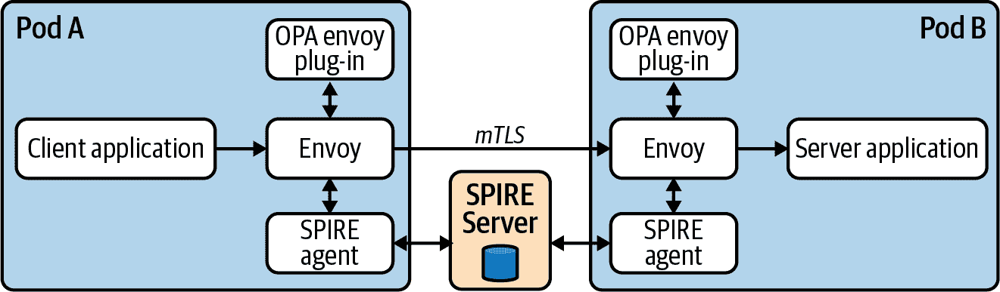

###### 图 10-15\. SPIRE 与 Envoy。

#### 服务网格（Istio）

Istio 的 CA 为所有服务账户创建 SVID，将 SPIFFE ID 编码为格式 `spiffe://cluster.local/ns/<namespace>/sa/<service_account>`。因此，Istio 网格中的服务可以利用 SPIFFE-aware 端点。

###### 注意

虽然服务网格不在本章的讨论范围内，但许多服务网格尝试解决身份验证和认证问题。大多数尝试包括或基于本章详细介绍的方法和工具。

#### 其他应用程序集成方法

除了刚讨论的主要方法外，SPIRE 还支持以下功能：

+   将 SVID 和信任捆绑直接拉取到文件系统，使应用程序能够检测更改并重新加载。虽然这样可以使应用程序在某种程度上对 SPIRE 保持不可知，但也会打开从文件系统中窃取证书的攻击向量。

+   Nginx 模块允许从 SPIRE 流式传输证书（类似于之前描述的 Envoy 集成）。有定制的 Nginx 模块使用户能够指定应允许连接到服务器的 SPIFFE ID。

#### 与秘密存储（Vault）的集成

当应用程序需要从 [HashiCorp Vault](https://www.vaultproject.io) 获得一些共享秘密材料时，SPIRE 可用于解决安全引入问题。可以配置 Vault 使用 OIDC 联合身份验证与 SPIRE 服务器作为 OIDC 提供者来对客户端进行身份验证。

Vault 中的角色可以绑定到特定主体（SPIFFE ID），因此当工作负载从 SPIRE 请求 JWT SVID 时，可以有效地获取角色和因此访问 Vault 的凭证。

#### 与 AWS 的集成

SPIRE 还可以用于建立身份并向 AWS 服务进行认证。该过程利用了 AWS IRSA 和 Vault 部分中的 OIDC 联合身份认证思想。工作负载请求 JWT SVID，然后 AWS 通过对联合 OIDC 提供程序（SPIRE 服务器）验证以验证它们。这种方法的缺点是，SPIRE 必须是公开可访问的，以便 AWS 发现验证 JWT 所需的 JSON Web Key Set（JWKS）材料。

# 摘要

在本章中，我们深入探讨了我们在现场成功看到和实施的模式和工具。

身份是一个多层次的主题，随着您对不同模式的复杂性以及其与每个个体组织需求的契合程度感到更加舒适，您的方法也会随之演变。通常在用户身份方面，您可能已经有某种第三方 SSO，但直接通过 OIDC 将其集成到 Kubernetes 可能看起来并不简单。在这些情况下，我们看到 Kubernetes 通常**独立于**主要组织身份策略之外。根据需求，这可能是可以接受的，但直接集成将提供更大的环境可见性和控制，特别是对于具有多个集群的情况。

在工作负载/应用程序方面，我们经常看到这被视为事后处理（超出默认的服务账户）。同样地，根据内部需求，这可能是可以接受的。确实，对于工作负载身份的强大解决方案的实施，无论是集群内还是跨平台，有时会引入显著的复杂性，并需要深入了解外部工具。然而，当组织在 Kubernetes 方面达到一定成熟度时，我们认为实施本章描述的模式可以显著提升您的 Kubernetes 环境的安全姿态，并在发生违规事件时提供额外的深度防御层。
