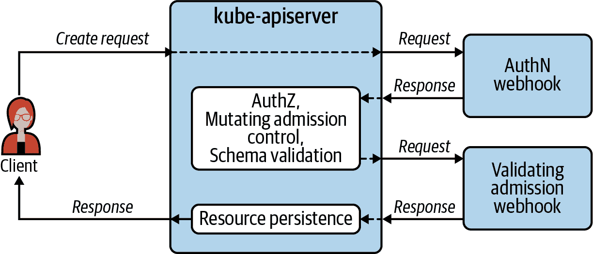
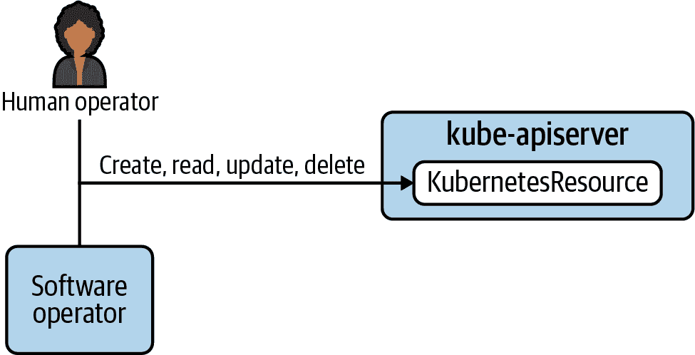
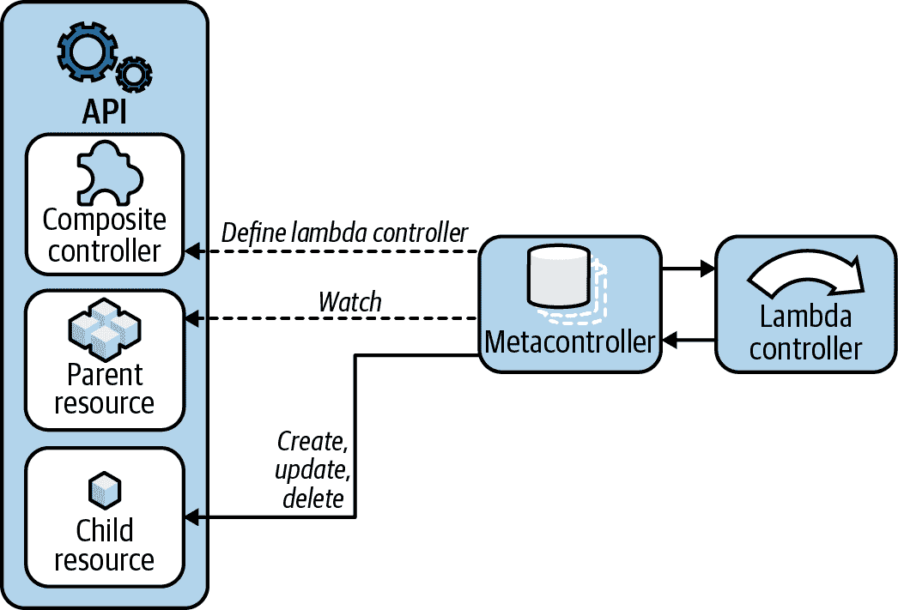

# 第十一章：构建平台服务

平台服务是安装的组件，用于为应用平台添加功能。它们通常作为容器化工作负载部署到某个`*-system`命名空间，并由平台工程团队维护。这些平台服务与应用开发团队维护的工作负载有所区别。

云原生生态系统中有许多项目可用作应用平台的一部分。此外，有大量供应商愿意提供平台服务解决方案。请在成本效益分析通过的地方使用它们。它们甚至可能将您带到应用平台的目的地。但我们发现，基于 Kubernetes 平台的企业用户通常会构建定制组件。您可能需要将基于 Kubernetes 的平台与某些现有的内部系统集成。您可能需要满足一些独特而复杂的工作负载要求。您可能需要考虑到一些罕见或特定于业务需求的边缘情况。无论情况如何，本章将详细讨论如何通过定制解决方案扩展您的应用平台，以填补这些空白。

构建定制平台服务的核心思想是消除人力劳动。这不仅仅是自动化。自动化是基石，但自动化组件的整合是灰泥。系统间的平稳可靠交互既具有挑战性又至关重要。API 驱动软件的概念之所以强大，是因为它促进了软件系统的集成。这也是为什么 Kubernetes 取得了如此广泛的应用：它使您的整个平台都能实现 API 驱动行为，而无需为每个添加到平台的软件构建和公开 API。此类软件可以通过管理核心资源或添加自定义资源来利用 Kubernetes API，以表示新对象的状态。如果我们在构建平台服务时遵循这些集成自动化的模式，我们就有可能消除巨大的人力劳动。如果我们在这方面取得成功，我们将为创新、发展和进步开辟更大的机会。

在本章中，我们将探讨如何扩展 Kubernetes 控制平面。我们正在采用 Kubernetes 使用的有效工程模式，并利用这些模式来构建这些系统。在本章的大部分内容中，我们将探讨 Kubernetes 运算符、它们的设计模式和用例，以及如何开发它们。然而，首先我们需要了解 Kubernetes 的扩展点，以便保持构建平台服务的整体视图。我们需要明确的上下文，并应用与整体系统和谐的解决方案。最后，我们将研究如何扩展可能是生态系统中最重要的 Kubernetes 控制器：调度器。

# 扩展点

Kubernetes 是一个极具扩展性的系统。这无疑是其最强大的特性之一。在软件开发中的一个常见的关键错误是试图添加功能以满足每一个可能的用例。系统很快就会变成一个选项迷宫，到达结果的路径不清晰。此外，随着内部依赖关系的增长和系统组件之间脆弱的连接，系统往往变得不稳定，可靠性逐渐下降。Unix 哲学的核心原则之一是做好一件事并使其可互操作。Kubernetes 永远无法满足用户在编排其容器化工作负载时可能遇到的每一个需求。构建这样一个系统是不可能的。它提供的核心功能已经足够具有挑战性了。实际上，即使是具有相对狭窄关注点的 Kubernetes，也是一个相对复杂的分布式软件系统。它不可能满足每一个需求，也不需要，因为它提供了扩展点，允许专门的解决方案满足专门的需求，这些解决方案可以很容易地集成。它可以被扩展和定制，以满足你可能有的几乎所有需求。

我们称之为插件扩展的上下文，这些扩展满足 Kubernetes 定义的接口，在本书的其他部分已广泛涵盖，一些流行的 Webhook 扩展解决方案也是如此。我们在这里简要回顾它们，以围绕运算符扩展主题画一个轮廓，本章将在其中花费大量时间。

## 插件扩展

这是一类广泛的扩展，通常帮助将 Kubernetes 与重要且经常是运行在 Kubernetes 上的工作负载不可或缺的相邻系统集成起来。它们是第三方可以使用来实现解决方案的规范，而不是实现本身：

网络

容器网络接口（CNI）定义了插件必须满足的接口，以为容器提供网络连接。存在许多插件来满足这一要求，但它们都必须满足 CNI 的标准。本主题在第五章中有所涉及。

存储

容器存储接口（CSI）提供了一种系统，用于向容器化工作负载公开存储系统。同样，有许多不同的卷插件从不同提供商公开存储。这个主题在 第四章 中进行了探讨。

容器运行时

容器运行时接口（CRI）定义了容器运行时需要暴露的操作标准，使得 kubelet 不关心使用的运行时是什么。历史上 Docker 是最流行的，但现在有其他具有自身优势的运行时也变得流行起来。我们在 第三章 中详细讨论了这个话题。

设备

Kubernetes 设备插件框架允许工作负载访问底层节点上的设备。我们在实际应用中发现的最常见的例子是用于计算密集型工作负载的图形处理单元（GPU）。通常为具有这些专用设备的节点集群添加节点池，以便将工作负载分配给它们。关于这个主题，请参阅 第二章。

这些插件的开发通常由支持或销售与集成的产品的供应商进行。根据我们的经验，很少有平台开发人员在这个领域构建自定义解决方案。相反，通常是评估可用选项并利用符合您需求的选项。

## Webhook 扩展

Webhook 扩展作为 Kubernetes API 服务器的后端服务器，用于满足核心 API 功能的自定义版本。每个请求到达 API 服务器时，都经历了几个步骤。客户端经过身份验证以确保他们被允许访问（AuthN）。API 检查客户端是否被授权执行他们请求的操作（AuthZ）。API 服务器根据启用的准入插件对资源进行修改。验证资源模式，并通过验证准入控制执行任何专门或自定义的验证。图 11-1 描述了客户端、Kubernetes API 和 API 利用的 webhook 扩展之间的关系。

### 认证扩展

认证扩展，例如 OpenID Connect（OIDC），提供了将请求身份验证任务卸载到 API 服务器的机会。这个主题在 第十章 中有详细介绍。

您还可以让 API 服务器调用 webhook 来授权经过身份验证的用户对资源可以采取的操作。尽管 Kubernetes 内置了强大的基于角色的访问控制系统，这种实现方式并不常见。但是，如果您发现这种系统因某种原因不足够，您可以选择这种选项。

### 准入控制

Admission 控制是一个特别有用且广泛使用的扩展点。如果启用，当向 API 服务器发送请求执行操作时，API 服务器会根据验证和变更的 admission webhook 配置调用任何适用的 admission webhooks。有关此主题的详细信息，请参见 第八章。



###### 图 11-1\. Webhook 扩展是 Kubernetes API 服务器利用的后端服务器。

## 操作符扩展

操作符是 API 服务器的客户端，而不是后端 webhook。如 图 11-2 所示，软件操作符作为 Kubernetes API 的客户端与之交互，就像人工操作员一样。这些软件操作符通常称为 *Kubernetes 操作符*，遵循官方文档中的 [操作符模式](https://oreil.ly/HLXtJ)。它们的主要目的是减轻人工操作员的工作负担，并代表他们执行操作。这些操作符扩展遵循与核心 Kubernetes 控制平面组件相同的工程原理。在将操作符扩展作为平台服务开发时，想象它们是你应用平台控制平面的自定义扩展。



###### 图 11-2\. 操作符扩展是 Kubernetes API 服务器的客户端。

# 操作符模式

你可以说操作符模式归根结底就是用 Kubernetes 扩展 Kubernetes。我们创建新的 Kubernetes 资源，并开发 Kubernetes 控制器来协调其中定义的状态。我们使用称为自定义资源定义（CRD）的 Kubernetes 资源来定义我们的新资源。这些 CRD 创建新的 API 类型，并告诉 Kubernetes API 如何验证这些新对象。然后，我们采用使 Kubernetes 控制器如此高效的相同原理和设计，并利用这些原则构建系统的软硬件扩展。这两个核心机制是我们在构建操作符时使用的：自定义资源和控制器。

操作符的概念由 CoreOS 的创始人之一 Brandon Phillips 于 2016 年 11 月引入。早期对操作符的定义是操作符是一个特定于应用的控制器，用于管理复杂的有状态应用程序。这个定义仍然非常有用，但多年来有所扩展，现在 Kubernetes 文档将使用 CRD 的任何控制器归类为操作符。这个更通用的定义是我们将在构建平台服务时使用的定义。你的平台服务可能不是“复杂的有状态应用程序”，但仍然可以从使用这种强大的操作符模式中受益。

接下来的部分将介绍 Kubernetes 控制器，这些控制器提供了我们将在自定义控制器中使用的功能模型。然后我们将研究存储期望状态和现有状态的自定义资源，这些资源由我们的控制器协调。

## Kubernetes 控制器

控制器的核心功能和功能由 Kubernetes 提供。它们监视资源类型，并响应资源的创建、变更和删除，以实现期望的状态。例如，kube-controller-manager 预装的控制器会监视 ReplicaSet 资源类型。当创建 ReplicaSet 时，控制器会创建与 ReplicaSet 中的 `replicas` 字段定义的数量相同的 Pod。稍后，如果更改该值，控制器将创建或删除 Pod 以满足新的期望状态。

这种监视机制是所有 Kubernetes 控制器功能的核心。它是由 Kubernetes API 服务器暴露给需要响应资源更改的控制器的 etcd 功能。控制器与 API 服务器保持连接，这使得 API 服务器能够在关心或管理的资源发生更改时通知控制器。

这种机制能够提供非常强大的行为。用户可以通过提交资源清单声明系统的期望状态。负责实现期望状态的控制器收到通知后开始工作，以使现有状态与声明的期望状态匹配。此外，除了用户提交清单外，控制器还可以执行相同的操作，从而触发其他控制器的操作。通过这种方式，您可以建立一个控制器系统，提供稳定可靠的复杂功能。

这些控制器的一个重要特点是，如果它们由于某些障碍无法满足期望的状态，它们将继续尝试在无限循环中操作。尝试满足期望状态之间的时间间隔可能随着时间的推移而增加，以便不对系统施加不必要的负荷，但它们依然会尝试。这提供了一种自我修复行为，在复杂的分布式系统中尤为重要。

例如，调度器负责将 Pod 分配给集群中的节点。调度器只是另一个 Kubernetes 控制器，但其任务非常重要且复杂。如果没有足够的计算资源可用于一个或多个 Pod，它们将进入“Pending”状态，调度器将继续尝试以一定的间隔调度 Pod。因此，如果在任何时候释放了计算资源或添加了计算节点，该 Pod 将被调度并运行。例如，如果另一个批处理工作负载完成并释放了资源，或者如果集群自动缩放器添加了一些工作节点，则“Pending” Pod 将被分配，无需运营人员进一步操作。

在遵循操作者模式来构建应用平台的扩展时，使用 Kubernetes 控制器所采用的设计原则至关重要：（1）监视 Kubernetes API 中的资源，以便在其期望状态发生更改时得到通知；以及（2）在非终止循环中努力协调现有状态与期望状态。

## 自定义资源

Kubernetes API 的最重要特性之一是其能够扩展它将识别的资源类型。如果您提交一个有效的 CRD，您将立即拥有一个新的自定义 API 类型可供使用。CRD 包含了您在自定义资源中所需的所有字段，无论是在`spec`中，您可以在那里提供资源的期望状态，还是在`status`中，您可以记录关于观察到的现有状态的重要信息。

在进一步深入这个主题之前，让我们简要回顾一下 Kubernetes 资源。在本章中，我们将大量讨论资源，因此确保我们对此主题非常清楚是很重要的。当我们在 Kubernetes 中谈论 *资源* 时，我们指的是用于记录状态的对象。一个常见资源的示例是 Pod 资源。当您创建 Pod 清单时，您正在定义将成为 Pod 资源的属性。当您使用 `kubectl apply -f pod.yaml` 或类似命令将其提交到 API 服务器时，您正在创建 Pod API 类型的实例。一方面，您有 API 类型或“种类”，它指的是在 CRD 中提供的对象的定义和形式。另一方面，我们有资源，它是该种类的实例或实例化。Pod 是一个 API 类型或种类。您使用名称“my-app”创建的 Pod 是一个 Kubernetes 资源。

不同于关系数据库，其中对象之间的关系由数据库中的外键记录和链接，Kubernetes API 中的每个对象都是独立存在的。关系是使用标签和选择器建立的，控制器的工作是管理以这种方式定义的关系。您无法像使用结构化查询语言（SQL）那样查询 etcd 中的相关对象。因此，当我们谈论资源时，我们指的是命名空间、Pod、部署、机密、配置映射等的实际实例。当我们谈论自定义资源时，我们指的是使用 CRD 添加和定义的用户定义资源。当您创建 CRD 时，您定义了新的 API 类型，使您能够像管理其他核心 Kubernetes 资源一样创建和管理自定义资源。

CRD 使用 Open API v3 模式规范来定义字段。这允许特性，如将字段设置为可选或必需，以及设置默认值。这将为 API 服务器提供验证指令，当它收到创建或更新您的自定义资源的请求时。此外，您还可以对 API 进行分组以改善逻辑组织，并且非常重要的是，也可以对您的 API 类型进行版本控制。

为了说明 CRD 是什么以及生成的自定义资源清单是什么样子，让我们看一个虚构的 WebApp API 类型的示例。在此示例中，WebApp 资源包括一个由以下六个 Kubernetes 资源组成的 Web 应用程序的期望状态：

部署

为客户提供用户界面、处理请求并将数据存储在关系数据库中的无状态应用

StatefulSet

提供 Web 应用程序的持久数据存储的关系数据库

ConfigMap

包含状态应用的配置文件，该文件被挂载到每个部署的 Pod 中

Secret

包含应用程序连接到其数据库所需的凭据

Service

路由流量到部署的后端 Pod。

Ingress

包含路由规则，使 Ingress 控制器能够正确路由客户端请求到集群中

创建 WebApp 资源将促使 WebApp 操作员创建这些各种子资源。这些创建的资源将构成一个完整、功能齐全的 Web 应用实例，为企业的最终用户和客户提供服务。

示例 11-1 展示了定义新 WebApp API 类型的 CRD 的样例。

##### 示例 11-1\. WebApp CRD 清单

```
apiVersion: apiextensions.k8s.io/v1
kind: CustomResourceDefinition
metadata:
  name: webapps.workloads.apps.acme.com  
spec:
  group: workloads.apps.acme.com
  names:  
    kind: WebApp
    listKind: WebAppList
    plural: webapps
    singular: webapp
  scope: Namespaced
  versions:
  - name: v1alpha1
    schema:
      openAPIV3Schema:
        description: WebApp is the Schema for the webapps API
        properties:
          apiVersion:
            description: 'APIVersion defines the versioned schema of this
              representation of an object. Servers should convert recognized
              schemas to the latest internal value, and may reject unrecognized
              values.'
            type: string
          kind:
            description: 'Kind is a string value representing the REST resource this
              object represents. Servers may infer this from the endpoint the client
              submits requests to. Cannot be updated. In CamelCase.'
            type: string
          metadata:
            type: object
          spec:
            description: WebAppSpec defines the desired state of WebApp
            properties:
              deploymentTier: 
                enum:
                - dev
                - stg
                - prod
                type: string
              webAppHostname:
                type: string
              webAppImage:
                type: string
              webAppReplicas:  
                default: 2
                type: integer
            required:  
            - deploymentTier
            - webAppHostname
            - webAppImage
            type: object
          status:
            description: WebAppStatus defines the observed state of WebApp
            properties:
              created:
                type: boolean
            type: object
        type: object
    served: true
    storage: true
```


自定义资源*定义*的名称，与自定义资源本身的名称不同。


自定义资源的名称，与定义不同。这包括名称的变体，如复数形式。


`deploymentTier` 字段必须包含 `enum` 列出的值之一。当 API 服务器接收到创建或更新此自定义资源实例的请求时，将执行此验证。


`webAppReplicas` 字段包含一个默认值，如果未提供该字段，则会应用该默认值。


此处列出了必填字段。注意 `webAppReplicas` 未包括在内且具有默认值。

现在让我们看看一个 WebApp 的清单会是什么样子。在将示例 11-2 中显示的清单提交给 API 服务器之前，您必须先创建示例 11-1 中显示的 CRD，以便 Kubernetes 有一个针对它的 API。否则，它将无法识别您试图创建的内容。

##### 示例 11-2\. WebApp 资源清单的示例

```
apiVersion: workloads.apps.acme.com/v1alpha1
kind: WebApp
metadata:
  name: webapp-sample
spec:
  webAppReplicas: 2  
  webAppImage: registry.acme.com/app/app:v1.4
  webAppHostname: app.acme.com
  deploymentTier: dev 
```


此清单指定了可选字段的默认值，如果需要显式指定，则是不必要的但可行的。


此字段的允许值之一被使用。任何不被允许的值将促使 API 服务器拒绝带有错误的请求。

当此 WebApp 清单提交到 Kubernetes API 时，WebApp 运算符将通过其监视收到通知，表示已创建 WebApp 类型的新实例。它将通过调用 API 服务器来创建各种需要的子资源，以启动 Web 应用程序的实例，从而实现清单中表达的所需状态。

###### 警告

虽然自定义资源模型功能强大，但不要过度使用它。不要将自定义资源用作最终用户应用程序的主要数据存储。Kubernetes 是一个容器编排系统。etcd 应该存储您的软件部署的状态，而不是应用程序的内部持久数据。这样做会给集群的控制平面带来重大负荷。坚持使用关系数据库、对象存储或适合应用程序的任何数据存储。让控制平面管理软件部署。

# 运算符使用案例

在开发基于 Kubernetes 的平台时，运算符为向该平台添加功能提供了引人注目的模型。如果您可以在自定义资源的字段中表示所需实现的系统状态，并且可以通过使用 Kubernetes 控制器调和变更以产生价值，那么运算符通常是一个很好的选择。

除了平台功能之外，运算符还可用于简化在平台上管理软件部署。它们可以提供通用抽象的便利，或者可以根据特定复杂应用程序的需求进行定制构建。无论哪种情况，使用软件来管理软件部署非常有用。

在本节中，我们将讨论您可以考虑在平台上使用的三种一般运算符类别：

+   平台实用工具

+   通用工作负载运算符

+   应用特定运算符

## 平台实用工具

运算符在开发您的平台时可以非常有用。它们允许您向集群添加功能，并在 Kubernetes 的基础上构建功能，以一种与控制平面无缝集成和利用的方式。有大量的开源项目利用运算符在 Kubernetes 上提供平台服务。这些项目已经可用，无需您开发。我们在讨论构建它们的章节中提到它们的原因是它们帮助建立一个良好的心理模型，以了解它们的工作方式。如果您发现自己不得不开发定制平台实用工具，查看现有成功项目将是有帮助的。

+   [Prometheus 运算符](https://oreil.ly/ClgDL) 允许您在平台上提供度量收集、存储和警报服务。在 第九章 中，我们深入探讨了可以从该项目中获得的价值。

+   [cert-manager](https://cert-manager.io) 提供作为服务的证书管理功能。通过提供 x509 证书的创建和更新服务，它消除了显著的重复工作和潜在的停机风险。

+   [Rook](https://rook.io) 是一种存储操作器，与 [Ceph](https://ceph.io) 等提供者集成，用于管理块、对象和文件系统存储作为服务。

这些开源解决方案是社区中可用的示例。还有无数供应商可以提供和支持类似的平台工具。然而，当不存在或不适合解决方案时，企业有时会构建自己的定制平台工具。

我们在现场常见的定制平台工具的一个常见示例是命名空间操作器。我们发现组织通常有一套标准资源，每个命名空间都会创建这些资源，例如 ResourceQuotas、LimitRanges 和 Roles。使用控制器来处理为每个命名空间创建这些资源的例行琐事已经是一种有用的模式。在后面的部分，我们将使用命名空间操作器的概念作为一个例子，以展示构建操作器时的一些实现细节。

## 通用工作负载操作器

应用开发人员的核心能力和关注点是为其构建的软件增加稳定性和功能。不是编写用于 Kubernetes 部署的 YAML。学习如何正确定义资源限制和请求，学习如何将 ConfigMap 卷或 Secret 作为环境变量挂载，学习如何使用标签选择器将服务与 Pod 关联起来——这些事情都不能为他们的软件增加功能或稳定性。

在已经为部署工作负载开发了常见模式的组织中，以通用方式抽象复杂性的模型具有相当大的潜力。这在已经采用微服务架构的组织中尤其相关。在这些环境中，可能会部署大量具有不同功能但部署模式非常相似的软件组件。

例如，如果您的公司有大量由 Deployment、Service 和 Ingress 资源组成的工作负载，可能存在可以将这些对象的大部分资源清单抽象为操作器的模式。在每种情况下，Service 引用 Deployment 的 Pod 上的标签。在每种情况下，Ingress 引用 Service 名称。所有这些细节都可以由操作器轻松处理——确保这些细节正确无误是琐事的定义。

## 应用特定操作器

这种类型的操作器直接触及 Kubernetes 操作员的核心：自定义资源与自定义 Kubernetes 控制器结合，用于管理复杂的有状态应用程序。它们专为管理特定应用程序而构建。社区中此模型的流行示例包括各种数据库操作器。我们有 Cassandra、Elasticsearch、MySQL、MariaDB、PostgreSQL、MongoDB 等操作器。通常，它们处理初始部署以及配置更新、备份和升级等第二天管理的问题。

过去几年里，为流行的社区或供应商支持的项目开发的操作员已经变得越来越受欢迎。这种方法仍处于内部企业应用的初期阶段。在您的组织内部开发和维护复杂的有状态应用程序的情况下，可能会有利于使用特定于应用的操作员。例如，如果您的公司维护类似电子商务网站、交易处理应用程序或库存管理系统等提供关键业务功能的应用程序，您可能需要考虑这个选项。特别是当这些工作负载被广泛部署并频繁更新时，有很大的机会减少人为工作的投入，尤其是在部署和日常管理方面。

这并不是说这些特定于应用程序的操作员是管理工作负载的普遍正确选择。对于更简单的用例，它们可能过于复杂了。生产就绪的操作员开发并不是一件轻松的事情，所以需要权衡利弊。您在日常工作中管理应用程序的部署和日常管理工作花费了多少时间？与长期的例行工作相比，构建操作员的工程成本可能更低吗？像 Helm 或 Kustomize 这样的现有工具是否能提供足够的自动化来有效减少这些例行工作？

# 操作员开发

开发 Kubernetes 操作员任务并不轻松，特别是当涉及全功能、特定于应用的操作员时。将这类更复杂的项目投入生产的工程投入可能是相当可观的。与其他软件开发类型类似，如果初次涉足这个领域，建议从较简单的项目开始，同时熟悉有用的模式和成功的策略。在本节中，我们将讨论一些工具和设计策略，这些将有助于使操作员开发更高效、更成功。

我们将介绍一些您可以利用的特定项目，来帮助开发这些工具。然后，我们将详细分解设计和实现这类软件的过程。我们将包含一些代码片段来说明相关概念和最佳实践。

## 操作员开发工具

如果你有一个为自定义 Kubernetes 运算符创建强有力使用案例的需求，有几个社区项目可能对你的努力非常有帮助。如果你自己或团队中有经验丰富的 Go 程序员，熟悉 Kubernetes 的 client-go 库以及开发 Kubernetes 运算符，你完全可以从头开始编写你的运算符。然而，每个运算符都有共同的组件，使用工具来生成样板源代码和实用程序是经验丰富的运算符开发人员普遍使用的便利工具，它们可以节省时间。软件开发工具包（SDK）和框架在符合你正在开发的软件模式时会很有帮助。然而，如果它们做出的假设不适合你的目的，它们可能会成为一种麻烦。如果你的项目符合使用一个或多个自定义资源来定义配置，并使用自定义控制器来实现与这些对象相关联行为的标准模型，那么我们在这里讨论的工具很可能会对你有所帮助。

### Kubebuilder

Kubebuilder 可以被描述为构建 Kubernetes API 的 SDK。这是一个恰当的描述，但不完全符合你可能期望的预期。使用 kubebuilder 从命令行工具开始，你可以用它来生成样板。它会生成源代码、一个 Dockerfile、一个 Makefile，以及示例 Kubernetes 清单——所有你需要为每个类似项目编写的东西。因此，它在启动项目方面节省了大量时间。

Kubebuilder 还利用了一个称为 controller-runtime 的相关项目中的一系列工具。CLI 生成的源代码中包含了所需的导入和常见实现。这些工具有助于处理控制器的日常繁重工作并与 Kubernetes API 交互。它帮助设置共享缓存和客户端，以便有效地与 API 服务器进行交互。缓存允许你的控制器列出和获取对象，而无需为每个查询向 API 服务器发送新请求，从而减轻 API 服务器的负载并加快协调速度。Controller-runtime 还提供了在资源更改等事件发生时触发协调请求的机制。这些协调默认会为父自定义资源触发。通常情况下，也应在控制器创建的子资源发生更改时触发它们，函数可用来执行此操作。如果在高可用（HA）模式下运行控制器，controller-runtime 提供了启用领导选举以确保任何给定时间只有一个控制器处于活动状态的机会。此外，controller-runtime 还包括一个实现 Webhooks 的包，通常用于准入控制。最后，该库包含编写结构化日志和暴露 Prometheus 指标以进行可观察性的设施。

如果你是一个具有 Kubernetes 经验的 Go 程序员，Kubebuilder 是一个很好的选择。即使你是一位有经验的软件开发者但是对 Go 编程语言还不熟悉，Kubebuilder 也是一个不错的选择。但它只适用于 Go，不支持其他语言。

###### 提示

如果你打算为 Kubernetes 开发工具，如果你还不懂 Go 语言，你应该强烈考虑学习它。当然你也可以使用其他语言。毕竟 Kubernetes 提供了一个 REST API。并且官方支持的客户端库有 Python、Java、C＃、JavaScript 和 Haskell，更不用说许多其他社区支持的库了。如果你有使用这些语言的重要理由，你肯定可以取得成功。然而，Kubernetes 本身是用 Go 编写的，在 Kubernetes 的世界里，Go 语言的生态系统非常丰富且得到了良好的支持。

Kubebuilder 的一个特性是它可以生成 CRD，这使得它成为一个节省时间的工具。手动编写 CRD 的清单可不是闹着玩的。用于定义这些自定义 API 的 OpenAPI v3 规范非常详细和复杂。Kubebuilder CLI 将生成文件，你可以在其中定义自定义 API 类型的字段。你可以向结构定义中添加各种字段，并使用特殊标记来提供元数据，如默认值。然后你可以使用 make 目标生成 CRD 清单。非常方便。

关于 make 目标，除了生成 CRD 外，你还可以生成 RBAC 和示例自定义资源清单，在开发集群中安装自定义资源，为你的运算符构建和发布镜像，并在开发过程中对本地集群运行你的控制器。所有这些繁琐、耗时任务的便利确实提高了生产力，尤其是在项目早期。

出于这些原因，我们推荐使用 Kubebuilder 来构建运算符。它已经被成功采用和应用在多种项目中。

### Metacontroller

如果你对除了 Go 之外的某种特定编程语言感到舒适，并且有理由坚持使用它，那么在开发运算符时另一个有用的选择是 Metacontroller。这是一种完全不同的开发和部署运算符的方法，但如果你希望使用各种语言并计划在平台上部署多个自定义内部运算符，那么它值得考虑。有经验的 Kubernetes 编程工程师有时也会使用 Metacontroller 进行原型设计，然后在设计和实现细节明确之后使用 Kubebuilder 完成最终项目。这也揭示了 Metacontroller 的一个优点：一旦在集群中安装了 Metacontroller 插件，启动速度很快。

这就是 Metacontroller 的本质：一个集群附加组件，抽象出与 Kubernetes API 的交互。您的工作是编写控制器 webhook，其中包含您的控制器逻辑。Metacontroller 将其称为*lambda 控制器*。您的 lambda 控制器负责决定如何处理其关心的资源。Metacontroller 监视管理的资源，并在需要做出决策时通过 HTTP 调用通知您的控制器。Metacontroller 本身使用自定义资源来定义您的 webhook 的特性，例如其 URL 和它所管理的资源。因此，一旦 Metacontroller 在您的集群中运行，添加控制器就包括部署您的 lambda 控制器 webhook，并添加 Metacontroller 自定义资源；例如，组合控制器资源。而您的新控制器所需做的就是公开一个端点，接受来自 Metacontroller 的请求，解析包含相关 Kubernetes 资源对象的 JSON 负载，然后返回带有任何要发送到 Kubernetes API 的更改的响应。图 11-3 展示了使用 Metacontroller 时这些组件如何交互。



###### 图 11-3\. Metacontroller 为您的 lambda 控制器抽象了 Kubernetes API。

Metacontroller 不帮助您创建可能需要添加到您的集群中的任何 CRD。在这方面，您是独立的。如果您正在编写一个响应核心 Kubernetes 资源变化的控制器，这不是问题。但是，如果您正在开发自定义资源，那么 Kubebuilder 在这一领域具有显著优势。

### 运算符框架

运算符框架是由红帽发起的一套开源工具，现在作为 CNCF 的孵化项目。该框架便于运算符的开发。它包括运算符 SDK，使用 Go 编写运算符时提供类似 Kubebuilder 的功能。与 Kubebuilder 类似，它提供了一个 CLI 来为项目生成样板。它还使用 controller-runtime 工具来帮助集成 Kubernetes API。除了 Go 项目，运算符 SDK 还允许开发人员使用 Helm 或 Ansible 来管理操作。该框架还包括运算符生命周期管理器，它提供了安装和升级运算符的抽象。该项目还维护了一个运算符中心，为用户发现他们使用的软件的运算符提供了一种方式。我们在现场尚未遇到使用这些工具的平台团队。作为由红帽维护的项目，它在基于 Red Hat 的 Kubernetes 提供方 OpenShift 的用户中可能更为常见。

## 数据模型设计

就像您可能通过定义 Web 应用程序将使用的数据库模式来开始设计应用程序一样，在构建操作员时，一个很好的起点是操作员将使用的自定义资源的数据模型。事实上，在开始之前，您可能已经对自定义资源规范中需要哪些字段有了一些想法。一旦您意识到需要解决的问题或填补的空白，定义所需状态的对象的属性就会开始成形。

在本章早些时候的示例中，Namespace 操作员可以作为一个将创建各种资源的操作员开始：LimitRange、ResourceQuota、Roles 和 NetworkPolicies，以及一个新的应用开发团队的 Namespace。您可能希望立即将团队负责人绑定到 `namespace-admin` 角色，然后将 Namespace 的管理工作交给该人。这自然会导致您向自定义资源的规范中添加一个 `adminUsername` 字段。自定义资源清单可能看起来像 示例 11-3。

##### Example 11-3\. AcmeNamespace 资源清单的示例

```
apiVersion: tenancy.acme.com/v1alapha1
kind: AcmeNamespace
metadata:
  name: team-x
spec:
  namespaceName: app-y  
  adminUsername: sam  
```


Namespace 的一个任意名称——在本例中，它将托管一个工作负载，“app-y”。


此用户名应与公司的身份提供程序使用的用户名相对应，通常是 Active Directory 系统或类似系统。

提交示例 11-3 中的清单将导致用户名 `sam` 被添加到一个角色绑定的主体中，该角色绑定将其绑定到 `namespace-admin` 角色，具体方式如示例 11-4 所示。

##### Example 11-4\. 为 `team-x` 的 AcmeNamespace 创建角色和角色绑定的示例

```
apiVersion: rbac.authorization.k8s.io/v1
kind: Role
metadata:
  name: namespace-admin
  namespace: app-y
rules:
- apiGroups:
  - "*"
  resources:
  - "*"
  verbs:
  - "*"
---
apiVersion: rbac.authorization.k8s.io/v1
kind: RoleBinding
metadata:
  name: namespace-admin
  namespace: app-y
roleRef:
  apiGroup: rbac.authorization.k8s.io
  kind: Role
  name: namespace-admin
subjects:
- kind: User
  name: sam  
  namespace: app-y
```


在 AcmeNamespace 清单中提供的 `adminUsername` 将被插入到此处，以绑定到 `namespace-admin` 角色。

在考虑所需行为时，将 Sam 绑定到 `namespace-admin` 角色所需的数据变得非常清晰：Sam 的用户名和 Namespace 的名称。因此，从明显的数据片段开始，这些数据片段是为了提供功能而需要的，定义您的 CRD 规范中的字段。在 Kubebuilder 项目中的示例可能类似于 示例 11-5。

##### Example 11-5\. `AcmeNamespaceSpec` 的类型定义

```
// api/v1alpha1/acmenamespace_types.go

...

// AcmeNamespaceSpec defines the desired state of AcmeNamespace
type AcmeNamespaceSpec struct {

    // The name of the namespace
    NamespaceName string `json:"namespaceName"`

    // The username for the namespace admin
    AdminUsername string `json:"adminUsername"`
...
```

这是 Kubebuilder 将用来生成您的 CRD 清单以及用于测试和演示的样例 AcmeNamespace 清单的源代码。

现在我们有了一个数据模型，我们*认为*可以充分管理我们想要的行为状态，是时候开始编写控制器了。在开发过程中，我们可能会发现我们的数据模型不够用，需要额外的字段来实现我们想要的结果。但这是一个很好的起点。

## 逻辑实现

逻辑是在我们的控制器中实现的。控制器的主要工作是管理一个或多个自定义资源。当使用类似 Kubebuilder 和 Metacontroller 这样的工具时，控制器将监视这些受管理的自定义资源。即使只使用 client-go 库，GitHub 仓库中也有优秀的代码示例可供参考，这部分也非常简单易懂。通过对其自定义资源的监视，控制器将收到关于此类资源的任何更改的通知。在这一点上，控制器的工作如下：

+   收集系统现有状态的准确图像

+   检查系统的期望状态

+   采取必要的操作来使现有状态与期望状态协调一致

### 现有状态

实际上，控制器可以从三个地方收集现有状态信息：

+   您自定义资源的 `status`

+   集群中的其他相关资源

+   集群外或其他系统中的相关条件

`status` 字段为 Kubernetes 中的控制器提供了记录观察到的现有状态的位置。例如，Kubernetes 在一些资源（如 Pods 和 Namespaces）上使用 `status.phase` 字段来跟踪资源是否处于 `Running`（对于 Pods）或 `Active`（对于 Namespaces）状态。

让我们回到一个命名空间操作符的例子。控制器收到一个新的 AcmeNamespace 资源及其规范的通知。控制器不能假设这是一个新资源，然后机械地创建子命名空间和角色资源。如果这只是一个已存在的资源，只是进行了一些更改呢？尝试再次创建子资源将从 Kubernetes API 得到错误。然而，按照前面 Kubernetes 的例子，如果我们在 CRD 的 `status` 中包含一个 `phase` 字段，控制器可以检查它来评估现有状态。当首次创建时，控制器会发现 `status.phase` 字段为空。这将告诉控制器这是一个新资源的创建，应该继续创建所有子资源。一旦所有子资源通过 API 成功响应创建，控制器可以将 `status.phase` 字段填充为 `Created` 值。然后，如果后来更改了 AcmeNamespace 资源，当控制器收到通知时，它可以从此字段中看到它已经被之前创建过，并继续进行其他协调步骤。

到目前为止，使用`status.phase`字段来确定现有状态有一个关键缺陷。它假设控制器本身永远不会失败。如果在创建子资源时遇到问题怎么办？例如，控制器收到新的 AcmeNamespace 通知，创建了子命名空间，但在创建相关的角色资源之前崩溃了。当控制器重新启动时，它会发现 AcmeNamespace 资源在`status.phase`字段中没有`Created`，尝试创建子命名空间并在没有令人满意的方式下失败。为了防止这种情况发生，控制器可以在发现新的 AcmeNamespace 已创建时，作为第一步向`status.phase`添加`CreationInProgress`值。这样，如果在创建过程中发生故障，当控制器重新启动并看到`CreationInProgress`阶段时，它将知道无法仅通过`status`准确确定现有状态。这时它需要查看集群中的其他相关资源来确定现有状态。

当无法从 AcmeNamespace 的`status`确定现有状态时，它可以查询 API 服务器或者更好地查询 API 服务器中对象的本地缓存，以便获取其关心的条件。如果发现 AcmeNamespace 的阶段设置为`CreationInProgress`，它可以开始查询 API 服务器，检查其期望存在的子资源是否存在。在我们使用的故障示例中，它将查询子命名空间是否存在，发现它确实存在，然后继续。它将查询角色资源，发现*不存在*，然后继续创建这些资源。通过这种方式，我们的控制器可以容忍失败。我们应该始终假设会发生故障，并相应地开发控制器逻辑。

此外，有时我们的控制器会对集群外的现有状态感兴趣。云基础设施控制器是一个很好的例子。必须从集群外的云提供商 API 中查询基础设施系统的状态。现有状态可能会高度依赖于问题操作器的目的，并且通常会很清楚。

### 期望状态

系统的期望状态在相关资源的`spec`中表达。在我们的命名空间操作器中，由`namespaceName`提供的期望状态告诉控制器结果命名空间的`metadata.name`字段应该是什么。`adminUsername`字段确定了`namespace-admin`角色绑定的`subjects[0].name`应该是什么。这些是期望状态直接映射到子资源字段的示例。通常，实现方式不那么直接。

我们之前在本章中的 `AcmeStore` 示例中使用了 `deploymentTier` 字段的示例。它允许用户指定一个单一变量，用于通知控制器逻辑要使用的默认值。我们可以将类似的想法应用到 Namespace 操作符上。我们的新修改的 AcmeNamespace 清单可能看起来像 示例 11-6。

##### 示例 11-6\. 添加了新字段的 AcmeNamespace 清单

```
apiVersion: tenancy.acme.com/v1alapha1
kind: AcmeNamespace
metadata:
  name: team-x
spec:
  namespaceName: app-y
  adminUsername: sam
  deploymentTier: dev  
```


AcmeNamespace API 类型的数据模型的新添加。

这将促使控制器创建一个类似于 示例 11-7 的 ResourceQuota。

##### 示例 11-7\. 为 `team-x` 的 AcmeNamespace 创建的 ResourceQuota

```
apiVersion: v1
kind: ResourceQuota
metadata:
  name: dev
spec:
  hard:
    cpu: "5"
    memory: 10Gi
    pods: "10"
```

默认的 `deploymentTier: prod` ResourceQuota 可能看起来像 示例 11-8。

##### 示例 11-8\. 当 `deploymentTier: prod` 在 AcmeNamespace 中设置时创建的另一种 ResourceQuota

```
apiVersion: v1
kind: ResourceQuota
metadata:
  name: prod
spec:
  hard:
    cpu: "500"
    memory: 200Gi
    pods: "100"
```

### 协调

在 Kubernetes 中，协调是将现有状态更改为匹配所需状态的过程。这可以是像 kubelet 请求容器运行时停止与已删除 Pod 关联的容器那样简单。或者它可以更复杂，例如操作员根据表示有状态应用程序的自定义资源创建一系列新资源。这些是通过创建或删除表示所需状态的资源来触发的协调示例。但很多时候，协调涉及对变更的响应。

简单的变更示例是如果你将 Deployment 资源上的副本数从 5 更新为 10。现有状态是工作负载的 5 个 Pod。期望的状态是 10 个 Pod。在这种情况下，Deployment 控制器执行的协调包括更新相关 ReplicaSet 上的副本数。然后 ReplicaSet 控制器通过创建 5 个新的 Pod 资源来协调状态，这些资源依次由调度程序安排，从而促使适用的 kubelet 从容器运行时请求新的容器。

另一个稍微复杂的变更示例是如果你在 Deployment 规范中更改镜像。这通常是为了更新正在运行的应用程序的版本。默认情况下，Deployment 控制器将执行滚动更新以协调状态。它将为新版本的应用程序创建一个 *新* 的 ReplicaSet，增加新 ReplicaSet 上的副本数，并减少旧 ReplicaSet 上的副本数，以便逐个替换 Pod。一旦所有新的镜像版本以所需数量的副本运行，协调工作就完成了。

对于管理自定义资源的自定义控制器，协调看起来会因自定义资源代表的内容不同而大不相同。但有一件事情应该保持不变，那就是如果由于超出控制器域的条件导致协调失败，它应该无限重试。一般来说，协调循环应该在迭代之间实现递增延迟。例如，如果可以合理地期望集群中的其他系统正在主动协调阻止控制器完成其操作的状态，那么可能在 1 秒后重试。但是，为了防止不必要的资源消耗，建议在每次迭代之间按指数增加延迟，直到达到某个合理的限制，比如说，5 分钟。在那时，控制器将每隔 5 分钟重试一次协调。这允许在限制资源消耗和网络流量的情况下无人参与解决系统问题。

### 实现细节

大致而言，为了实现 Namespace 操作员的初始控制器功能，我们希望能够：

+   编写或生成类似之前示例的简明 AcmeNamespace 清单

+   将清单提交到 Kubernetes API

+   通过创建一个 Namespace、ResourceQuota、LimitRange、角色和角色绑定来让控制器响应。

在 kubebuilder 项目中，创建这些资源的逻辑将存在于 `Reconcile` 方法中。创建一个带有控制器的 Namespace 的初始实现可能看起来像是 示例 11-9。

##### 示例 11-9\. AcmeNamespace 控制器的 `Reconcile` 方法

```
// controllers/acmenamespace_controller.go 
package controllers

import (
	"context"

	"github.com/go-logr/logr"
	corev1 "k8s.io/api/core/v1"
	metav1 "k8s.io/apimachinery/pkg/apis/meta/v1"
	"k8s.io/apimachinery/pkg/runtime"
	ctrl "sigs.k8s.io/controller-runtime"
	"sigs.k8s.io/controller-runtime/pkg/client"

	tenancyv1alpha1 "github.com/lander2k2/namespace-operator/api/v1alpha1"
)

...

func (r *AcmeNamespaceReconciler) Reconcile(req ctrl.Request) (ctrl.Result, error) {
	ctx := context.Background()
	log := r.Log.WithValues("acmenamespace", req.NamespacedName)

	var acmeNs tenancyv1alpha1.AcmeNamespace  
	r.Get(ctx, req.NamespacedName, &acmeNs)  

	nsName := acmeNs.Spec.NamespaceName
	adminUsername := acmeNs.Spec.AdminUsername

	ns := &corev1.Namespace{  
		ObjectMeta: metav1.ObjectMeta{
			Name: nsName,
			Labels: map[string]string{
				"admin": adminUsername,
			},
		},
	}

	if err := r.Create(ctx, ns); err != nil {  
		log.Error(err, "unable to create namespace")
		return ctrl.Result{}, err
	}

	return ctrl.Result{}, nil
}
...
```


表示已创建、更新或删除的 AcmeNamespace 对象的变量。


获取来自请求的 AcmeNamespace 对象的内容。为简洁起见，省略了错误捕获。


创建新的 Namespace 对象。


在 Kubernetes API 中创建新的 Namespace 资源。

这个简化的片段演示了控制器创建新的 Namespace。向控制器添加 Namespace 管理员的角色和角色绑定将类似，如 示例 11-10 所示。

##### 示例 11-10\. AcmeNamespace 控制器创建角色和角色绑定

```
// controllers/acmenamespace_controller.go
...
	role := &rbacv1.Role{
		ObjectMeta: metav1.ObjectMeta{
			Name:      "namespace-admin",
			Namespace: nsName,
		},
		Rules: []rbacv1.PolicyRule{
			{
				APIGroups: []string{"*"},
				Resources: []string{"*"},
				Verbs:     []string{"*"},
			},
		},
	}

	if err := r.Create(ctx, role); err != nil {
		log.Error(err, "unable to create namespace-admin role")
		return ctrl.Result{}, err
	}

	binding := &rbacv1.RoleBinding{
		ObjectMeta: metav1.ObjectMeta{
			Name:      "namespace-admin",
			Namespace: nsName,
		},
		RoleRef: rbacv1.RoleRef{
			APIGroup: "rbac.authorization.k8s.io",
			Kind:     "Role",
			Name:     "namespace-admin",
		},
		Subjects: []rbacv1.Subject{
			{
				Kind:      "User",
				Name:      adminUsername,
				Namespace: nsName,
			},
		},
	}

	if err := r.Create(ctx, binding); err != nil {
		log.Error(err, "unable to create namespace-admin role binding")
		return ctrl.Result{}, err
	}

	return ctrl.Result{}, nil
}
...
```

在此时，我们能够提交一个 AcmeNamespace 清单到 API，我们的 Namespace 操作器将创建 Namespace，Namespace 管理员的角色以及绑定到我们提供的用户名的 RoleBinding。正如我们之前讨论的，当我们创建一个新的 AcmeNamespace 时，这将正常工作，但是在以后的任何时间尝试协调它时会出现问题。如果 AcmeNamespace 以任何方式被更改，这将发生。如果控制器由于任何原因重新启动，也会发生这种情况。当控制器重新启动时，它必须重新列出和协调所有现有资源，以防发生更改。因此，在这一点上，简单地重启我们的控制器将使其中断。让我们通过添加对状态字段的简单使用来修复这个问题。首先，示例 11-11 展示了向`AcmeNamespaceStatus`添加字段的过程。

##### 示例 11-11\. 向 AcmeNamespace 状态添加字段

```
// api/v1alpha1/acmenamespace_types.go

// AcmeNamespaceStatus defines the observed state of AcmeNamespace
type AcmeNamespaceStatus struct {

	// Tracks the phase of the AcmeNamespace
	// +optional
	// +kubebuilder:validation:Enum=CreationInProgress;Created
	Phase string `json:"phase"`
}

// +kubebuilder:object:root=true
// +kubebuilder:subresource:status
...
```

现在，我们可以像在示例 11-12 中展示的那样，在我们的控制器中利用这个领域。

##### 示例 11-12\. 在 AcmeNamespace 控制器中使用新的状态字段

```
// controllers/acmenamespace_controller.go
...

const (
	statusCreated    = "Created"
	statusInProgress = "CreationInProgress"
)

...

func (r *AcmeNamespaceReconciler) Reconcile(req ctrl.Request) (ctrl.Result, error) {
	...

	switch acmeNs.Status.Phase {
	case statusCreated:
		// do nothing
		log.Info("AcmeNamespace child resources have been created")
	case statusInProgress:
		// TODO: query and create as needed
		log.Info("AcmeNamespace child resource creation in progress")
	default:
		log.Info("AcmeNamespace child resources not created")

		// set status to statusInProgress
		acmeNs.Status.Phase = statusInProgress
		if err := r.Status().Update(ctx, &acmeNs); err != nil {
			log.Error(err, "unable to update AcmeNamespace status")
			return ctrl.Result{}, err
		}

		// create namespace, role and role binding
		...

		// set status to statusCreated
		acmeNs.Status.Phase = statusCreated
		if err := r.Status().Update(ctx, &acmeNs); err != nil {
			log.Error(err, "unable to update AcmeNamespace status")
			return ctrl.Result{}, err
		}
	}

	return ctrl.Result{}, nil
}

...
```

现在我们有一个可以安全重启的控制器。它现在还具有一个系统的开始，用于检查现有状态，使用自定义资源的状态并执行基于该现有状态的协调步骤。

我们通常还应该为子资源设置所有权。如果我们将 AcmeNamespace 资源设置为 Namespace、Role 和 RoleBinding 的所有者，那么我们只需删除所有者 AcmeNamespace 资源即可删除所有子资源。这种所有权将由 API 服务器管理。即使控制器没有运行，如果删除所有者 AcmeNamespace 资源，子资源也会被删除。

这引出了我们的 AcmeNamespace API 类型的作用域问题。在使用 Kubebuilder 时，默认为 Namespaced 作用域。但是，Namespace 作用域的 API 类型不能成为集群作用域资源（如 Namespace）的所有者。通过 Kubebuilder，我们可以使用方便的标记来生成带有适当作用域的 CRD 清单，如示例 11-13 所示。

##### 示例 11-13\. 在 Kubebuilder 项目中更新 API 定义

```
// api/v1alpha1/acmenamespace_types.go package v1alpha1

import (
	metav1 "k8s.io/apimachinery/pkg/apis/meta/v1"
)

// EDIT THIS FILE!  THIS IS SCAFFOLDING FOR YOU TO OWN! 
// NOTE: json tags are required.  Any new fields you add must have json tags // for the fields to be serialized. 
// AcmeNamespaceSpec defines the desired state of AcmeNamespace type AcmeNamespaceSpec struct {

	// The name of the namespace 	NamespaceName string `json:"namespaceName"`

	// The username for the namespace admin 	AdminUsername string `json:"adminUsername"`
}

// AcmeNamespaceStatus defines the observed state of AcmeNamespace type AcmeNamespaceStatus struct {

	// Tracks the phase of the AcmeNamespace 	// +optional 	// +kubebuilder:validation:Enum=CreationInProgress;Created 	Phase string `json:"phase"`
}

// +kubebuilder:resource:scope=Cluster 
// +kubebuilder:object:root=true // +kubebuilder:subresource:status 
// AcmeNamespace is the Schema for the acmenamespaces API type AcmeNamespace struct {
	metav1.TypeMeta   `json:",inline"`
	metav1.ObjectMeta `json:"metadata,omitempty"`

	Spec   AcmeNamespaceSpec   `json:"spec,omitempty"`
	Status AcmeNamespaceStatus `json:"status,omitempty"`
}

// +kubebuilder:object:root=true 
// AcmeNamespaceList contains a list of AcmeNamespace type AcmeNamespaceList struct {
	metav1.TypeMeta `json:",inline"`
	metav1.ListMeta `json:"metadata,omitempty"`
	Items           []AcmeNamespace `json:"items"`
}

func init() {
	SchemeBuilder.Register(&AcmeNamespace{}, &AcmeNamespaceList{})
```


当使用`make manifests`生成清单时，此标记将设置 CRD 的正确作用域。

这将生成一个看起来像示例 11-14 的 CRD。

##### 示例 11-14\. 用于 AcmeNamespace API 类型的集群范围 CRD

```
---
apiVersion: apiextensions.k8s.io/v1beta1
kind: CustomResourceDefinition
metadata:
  annotations:
    controller-gen.kubebuilder.io/version: (devel)
  creationTimestamp: null
  name: acmenamespaces.tenancy.acme.com
spec:
  group: tenancy.acme.com
  names:
    kind: AcmeNamespace
    listKind: AcmeNamespaceList
    plural: acmenamespaces
    singular: acmenamespace
  scope: Cluster  
  subresources:
    status: {}
  validation:
    openAPIV3Schema:
      description: AcmeNamespace is the Schema for the acmenamespaces API
      properties:
        apiVersion:
          description: 'APIVersion defines the versioned schema of this
            representation of an object. Servers should convert recognized
            schemas to the latest internal value, and may reject unrecognized
            values.'
          type: string
        kind:
          description: 'Kind is a string value representing the REST resource this
            object represents. Servers may infer this from the endpoint the client
            submits requests to. Cannot be updated. In CamelCase.'
          type: string
        metadata:
          type: object
        spec:
          description: AcmeNamespaceSpec defines the desired state of AcmeNamespace
          properties:
            adminUsername:
              description: The username for the namespace admin
              type: string
            namespaceName:
              description: The name of the namespace
              type: string
          required:
          - adminUsername
          - namespaceName
          type: object
        status:
          description: 'AcmeNamespaceStatus defines the observed state of
			AcmeNamespace'
          properties:
            phase:
              description: Tracks the phase of the AcmeNamespace
              enum:
              - CreationInProgress
              - Created
              type: string
          type: object
      type: object
  version: v1alpha1
  versions:
  - name: v1alpha1
    served: true
    storage: true
status:
  acceptedNames:
    kind: ""
    plural: ""
  conditions: []
  storedVersions: []
```


资源作用域已正确设置。

现在我们可以将 AcmeNamespace 设置为所有子资源的所有者。这将在每个子资源的 metadata 中引入一个`ownerReferences`字段。此时，我们的`Reconcile`方法看起来像示例 11-15。

##### 示例 11-15\. 设置 AcmeNamespace 子资源的所有权

```
func (r *AcmeNamespaceReconciler) Reconcile(req ctrl.Request) (ctrl.Result, error) {
	ctx := context.Background()
	log := r.Log.WithValues("acmenamespace", req.NamespacedName)

	var acmeNs tenancyv1alpha1.AcmeNamespace
	if err := r.Get(ctx, req.NamespacedName, &acmeNs); err != nil {
		if apierrs.IsNotFound(err) {  
			log.Info("resource deleted")
			return ctrl.Result{}, nil
		} else {
			return ctrl.Result{}, err
		}
	}

	nsName := acmeNs.Spec.NamespaceName
	adminUsername := acmeNs.Spec.AdminUsername

	switch acmeNs.Status.Phase {
	case statusCreated:
		// do nothing 		log.Info("AcmeNamespace child resources have been created")
	case statusInProgress:
		// TODO: query and create as needed 		log.Info("AcmeNamespace child resource creation in progress")
	default:
		log.Info("AcmeNamespace child resources not created")

		// set status to statusInProgress 		acmeNs.Status.Phase = statusInProgress
		if err := r.Status().Update(ctx, &acmeNs); err != nil {
			log.Error(err, "unable to update AcmeNamespace status")
			return ctrl.Result{}, err
		}

		ns := &corev1.Namespace{
			ObjectMeta: metav1.ObjectMeta{
				Name: nsName,
				Labels: map[string]string{
					"admin": adminUsername,
				},
			},
		}

		// set owner reference for the namespace 
		err := ctrl.SetControllerReference(&acmeNs, ns, r.Scheme)
        if err != nil {
			log.Error(err, "unable to set owner reference on namespace")
			return ctrl.Result{}, err
		}

		if err := r.Create(ctx, ns); err != nil {
			log.Error(err, "unable to create namespace")
			return ctrl.Result{}, err
		}

		role := &rbacv1.Role{
			ObjectMeta: metav1.ObjectMeta{
				Name:      "namespace-admin",
				Namespace: nsName,
			},
			Rules: []rbacv1.PolicyRule{
				{
					APIGroups: []string{"*"},
					Resources: []string{"*"},
					Verbs:     []string{"*"},
				},
			},
		}

		// set owner reference for the role 
		err = ctrl.SetControllerReference(&acmeNs, role, r.Scheme)
        if err != nil {
			log.Error(err, "unable to set owner reference on role")
			return ctrl.Result{}, err
		}

		if err := r.Create(ctx, role); err != nil {
			log.Error(err, "unable to create namespace-admin role")
			return ctrl.Result{}, err
		}

		binding := &rbacv1.RoleBinding{
			ObjectMeta: metav1.ObjectMeta{
				Name:      "namespace-admin",
				Namespace: nsName,
			},
			RoleRef: rbacv1.RoleRef{
				APIGroup: "rbac.authorization.k8s.io",
				Kind:     "Role",
				Name:     "namespace-admin",
			},
			Subjects: []rbacv1.Subject{
				{
					Kind:      "User",
					Name:      adminUsername,
					Namespace: nsName,
				},
			},
		}

		// set owner reference for the role binding 
		err = ctrl.SetControllerReference(&acmeNs, binding, r.Scheme);
        if err != nil {
			log.Error(err, "unable to set reference on role binding")
			return ctrl.Result{}, err
		}

		if err := r.Create(ctx, binding); err != nil {
			log.Error(err, "unable to create role binding")
			return ctrl.Result{}, err
		}

		// set status to statusCreated 		acmeNs.Status.Phase = statusCreated
		if err := r.Status().Update(ctx, &acmeNs); err != nil {
			log.Error(err, "unable to update AcmeNamespace status")
			return ctrl.Result{}, err
		}
	}

	return ctrl.Result{}, nil
}
...
```


检查资源是否未找到，因此我们不会尝试在 AcmeNamespace 已被删除时进行协调。


在 Namespace 上设置所有者引用。


在 Role 上设置所有者引用。


在 RoleBinding 上设置所有者引用。

请注意，我们不得不添加错误检查以查看是否找到了 AcmeNamespace 资源。这是因为当它被删除时，由于不再存在所需的状态来协调，正常的协调将失败。在这种情况下，我们在子资源上放置了一个所有者引用，因此 API 服务器会处理删除事件的协调状态。

这说明了协调必须不对现有状态进行假设的观点。协调在以下情况下触发：

+   控制器启动或重新启动

+   创建资源

+   对资源进行更改，包括控制器自身进行的更改

+   删除资源

+   定期与 API 进行重新同步以确保系统的准确视图

为此，请确保您的协调不对触发协调的事件做出假设。使用`status`字段，在其他资源中确定相关条件，并据此进行协调。

### 管理入场网络钩子

如果您发现自定义资源需要默认值或验证，而这些内容无法使用创建新 API 类型的 CRD 中的 OpenAPI v3 规范实现，您可以转向验证和变异入场网络钩子。Kubebuilder CLI 提供了一个`create webhook`命令，专门用于通过生成样板代码来加快您的启动速度。

验证 Webhook 的一个示例可能与我们的 Namespace 操作员示例及其 AcmeNamespace 资源有关，在验证`adminUsername`字段时尤其有用。作为便利，您的 Webhook 可以调用公司身份提供程序，以确保提供的用户名有效，从而防止需要人工干预来纠正错误。

默认示例可以将`deploymentTier`默认为最常见、成本最低的`dev`选项。当您对自定义资源数据模型进行更改以添加新字段时，这尤其有用，用于保持与现有资源定义的向后兼容性。

管理入场网络钩子通常不包括在操作员的原型或预阿尔法版本中，但在项目的稳定版本中，通常在优化用户体验时发挥作用。第八章深入讨论了入场控制的主题。

### 最终处理器

我们已经看过将自定义资源设置为子资源所有者的示例，以确保在删除父自定义资源时它们将被删除。然而，这种机制并不总是足够的。如果自定义资源与集群中其他资源存在关系，其中所有权不合适，或者在删除自定义资源时需要更新集群外的条件，那么使用终结器可能非常重要。

终结器被添加到资源的元数据中，如示例 11-16 所示。

##### 示例 11-16\. 带有终结器的 AcmeNamespace 清单

```
apiVersion: tenancy.acme.com/v1alapha1
kind: AcmeNamespace
metadata:
  name: team-x
  finalizers:
  - namespace.finalizer.tenancy.acme.com  
spec:
  namespaceName: app-y
  adminUsername: sam
```


作为终结器使用的字符串值。

作为您的终结器使用的字符串值对系统中除您的控制器之外的任何其他内容都不重要。只需使用一个安全地确保在其他控制器需要向同一资源应用终结器时独特的值即可。

当资源上存在任何终结器时，API 服务器将不会删除该资源。如果收到删除请求，它将更新资源以在其元数据中添加`deletionTimestamp`字段。这对资源的更新将触发控制器中的协调。需要在控制器的`Reconcile`方法中添加对`deletionTimestamp`的检查，以便完成任何预删除操作。完成后，您的控制器可以移除终结器。这将告知 API 服务器它现在可以删除该资源。

常见的预删除操作示例发生在集群外的系统中。在命名空间操作器示例中，如果存在跟踪命名空间使用情况并在删除命名空间时需要更新的公司计费系统，那么一个终结器可以提示您的操作器在删除命名空间之前更新外部系统。其他常见的示例包括工作负载使用托管服务，例如数据库或对象存储，作为应用堆栈的一部分。当删除应用程序实例时，这些托管服务实例可能也需要清理。

# 扩展调度器

调度器在 Kubernetes 中提供核心功能。Kubernetes 的价值主张的一个重要部分是抽象化用于运行工作负载的机器池。调度器确定 Pod 的运行位置。可以说，与 kubelet 一起，这两个控制器形成了 Kubernetes 的核心，其它所有内容都围绕它们构建。调度器是应用程序平台的一个基石平台服务。在本节中，我们将探讨定制、扩展和替换调度器的行为。

记住核心控制平面组件（如调度程序）与本章前面所检查的自定义操作员之间的类比是有帮助的。在这两种情况下，我们都在处理管理 Kubernetes 资源的 Kubernetes 控制器。对于我们的自定义操作员，我们开发全新的自定义控制器，而调度程序是一个与每个 Kubernetes 集群一起部署的核心控制器。对于我们的自定义操作员，我们设计并创建新的自定义资源，而调度程序管理核心的 Pod 资源。

我们发现 Kubernetes 用户很少有需要扩展调度程序或修改其行为的情况。然而，考虑到调度程序对集群功能的重要性，了解调度程序如何做出调度决策以及如何在需要时修改这些决策是明智的。值得再次强调的是：Kubernetes 的一大特点是其可扩展性和模块化性。如果您发现调度程序不能满足您的需求，可以修改或增强其行为，甚至完全替换它。

在探索这个主题时，我们将研究调度程序如何确定在哪里分配 Pod，以便了解每个调度决策的内部机制，然后看看我们如何通过调度策略影响这些决策。我们还将讨论运行多个调度程序的选项，甚至编写您自己的自定义调度程序。

## 断言和优先级

在我们探讨如何扩展或修改调度程序之前，我们首先需要了解调度程序如何做出决策。调度程序使用两步流程来确定将 Pod 调度到哪个节点。

第一步是过滤。在这一步中，调度程序使用多个断言来过滤出不适合托管 Pod 的节点。例如，有一个断言检查要调度的 Pod 是否容忍节点的污点。控制平面节点通常使用污点来确保常规工作负载不会在此调度。如果一个 Pod 没有容忍性，任何带有污点的节点都将被过滤掉，不符合 Pod 的合格目标。另一个断言检查确保节点具有足够的 CPU 和内存资源来满足这些资源的请求。如果节点资源不足以满足 Pod 规范，预期将其过滤为不合格的主机。当所有断言检查节点的合格性时，过滤步骤完成。此时如果没有合格的节点，Pod 将保持在`Pending`状态，直到条件改变，例如集群中增加了一个新的合格节点。如果节点列表中只有一个节点，可能会在这一点上进行调度。如果有多个合格的节点，调度程序将继续进行第二步。

第二步是评分。这一步使用优先级来确定哪个节点最适合特定的 Pod。一个提高节点评分的优先级是，节点上存在 Pod 使用的容器镜像。另一个提高节点评分的优先级是，没有任何与待调度的 Pod 共享相同服务的 Pod。也就是说，调度器将尝试将共享服务的 Pod 分布在多个节点上，以提高节点故障容忍性。评分步骤也是实现 Pod 上 `preferred...` 亲和规则的地方。在评分步骤结束时，每个符合条件的节点都有一个相关的评分。评分最高的节点被认为是 Pod 的最佳选择，并将其调度到该节点上。

## 调度策略

调度策略用于配置调度器要使用的谓词和优先级。您可以编写一个包含调度策略的配置文件，并将其保存到控制平面节点上，然后通过提供调度器 `--policy-config-file` 标志来提供给调度器，但更推荐的方法是使用 ConfigMap。提供调度器 `--policy-configmap` 标志，然后可以通过 API 服务器更新调度策略。请注意，如果选择使用 ConfigMap 方法，您可能需要更新 `system:kube-scheduler` ClusterRole，以添加获取 ConfigMaps 的规则。

###### 警告

在撰写本文时，调度器的 `--policy-config-file` 和 `--policy-configmap` 标志仍在使用，但在官方文档中已标记为不推荐使用。因此，如果您正在实施新的自定义调度行为，建议使用下一节讨论的调度配置文件，而不是这里讨论的策略。

例如，示例 11-17 中的策略 ConfigMap 将使节点仅在具有键为 `selectable` 的标签时才能被 Pod 通过 `nodeSelector` 选择。

##### 示例 11-17\. 定义调度策略的 ConfigMap 示例

```
apiVersion: v1
kind: ConfigMap
metadata:
  name: scheduler-policy-config
  namespace: kube-system
data:
  policy.cfg: |+  
    apiVersion: v1
    kind: Policy
    predicates:
    - name: "PodMatchNodeSelector" 
      argument:
        labelsPresence:
          labels:
          - "selectable" 
          presence: true 
```


调度策略的文件名调度器将预期使用。


实现 `nodeSelectors` 的谓词名称。


您希望用于为选择添加约束的标签键。例如，在此示例中，如果节点没有此标签键存在，则不会被 Pod 选择。


这表明提供的标签必须存在。如果设置为 `false`，则必须不存在。如果使用 `presence: true` 的示例配置，则没有标签 `selectable: ""` 的节点将无法被 Pod 选择。

使用此调度策略，仅当节点同时具有 `device: gpu` 和 `selectable: ""` 标签时，才会将示例 11-18 中定义的 Pod 调度到符合条件的节点。

##### 示例 11-18\. 使用`nodeSelector`字段来指导调度的 Pod 清单

```
apiVersion: v1
kind: Pod
metadata:
  name: terminator
spec:
  containers:
  - image: registry.acme.com/skynet/t1000:v1
    name: terminator
  nodeSelector:
    device: gpu
```

## 调度配置文件

调度配置文件允许您启用或禁用编译到调度器中的插件。您可以通过在运行调度器时将文件名传递给`--config`标志来指定配置文件。这些插件实现了各种扩展点，包括但不限于我们之前介绍的过滤器和评分步骤。根据我们的经验，很少需要以这种方式定制调度器。但是，如果您发现有这样的需要，请查阅 Kubernetes 文档获取详细说明。

## 多个调度器

需要注意的是，您不限于使用一个调度器。您可以部署任意数量的调度器，这些调度器可以是具有不同策略和配置文件的 Kubernetes 调度器，甚至是自定义构建的调度器。如果运行多个调度器，您可以在 Pod 的规格中提供`schedulerName`，以确定哪个调度器为该 Pod 执行调度。鉴于遵循这种多调度器模型的复杂性增加，请考虑为具有此类专用调度要求的工作负载使用专用集群。

## 自定义调度器

如果在使用策略和配置文件的情况下仍无法使用 Kubernetes 调度器，您可以开发并使用自己的调度器。这将涉及开发一个控制器，该控制器监视 Pod 资源，每当创建新的 Pod 时，确定 Pod 应该在何处运行，并更新该 Pod 的`nodeName`字段。尽管这个范围很窄，但这并不是一个简单的练习。正如我们在本节中看到的那样，核心调度器是一个复杂的控制器，定期评估多个复杂因素来做出调度决策。如果您的需求足够特殊以至于需要一个自定义调度器，那么您可能需要花费大量的工程工作来优化其行为。我们建议只有在用现有调度器尝试了所有选项并且在项目中具有深入的 Kubernetes 专业知识时，才继续采用这种方法。

# 总结

理解 Kubernetes 提供的扩展点及如何最佳添加满足租户需求的平台服务至关重要。研究操作员模式及 Kubernetes 操作员的用例。如果发现有必要构建操作员，请决定使用何种开发工具和语言，设计您的自定义资源数据模型，然后构建一个 Kubernetes 控制器来管理该自定义资源。最后，如果默认调度器行为不符合您的要求，请查看调度策略和配置文件以修改其行为。在极端情况下，您可以选择开发自己的自定义调度器来替换或与默认调度器并行运行。

使用本章节中提出的原则和实践，您不再受制于社区或公司供应商提供的工具和软件。如果您遇到重要需求，而现有解决方案尚不存在，您可以利用现有工具和指南添加任何您的业务需要的专门平台服务。
