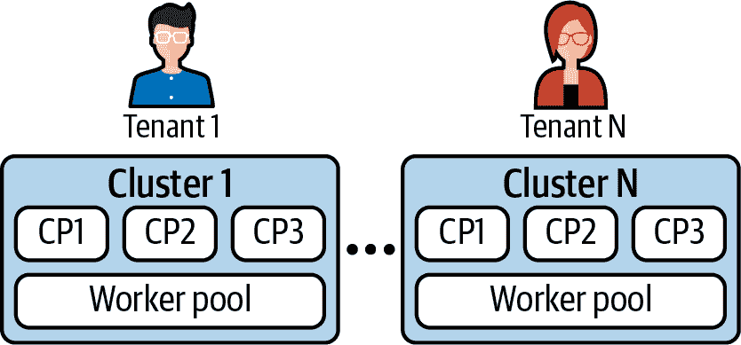
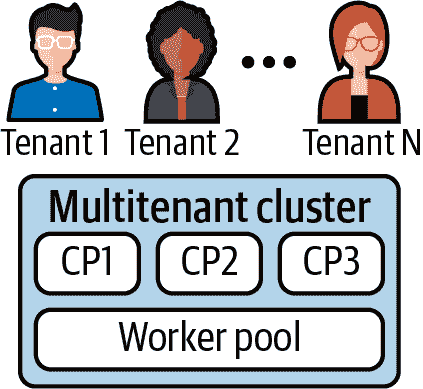
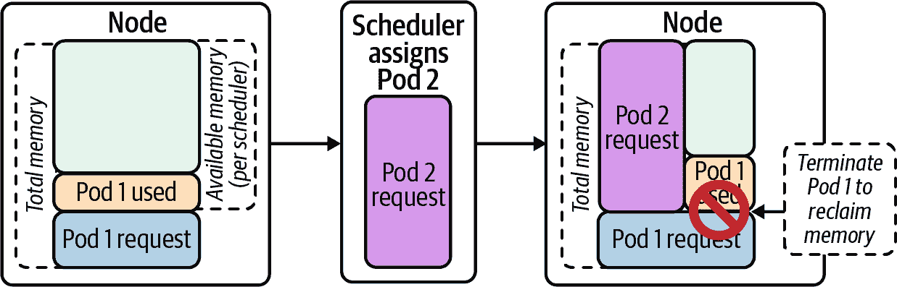
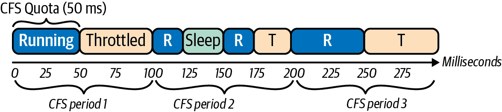
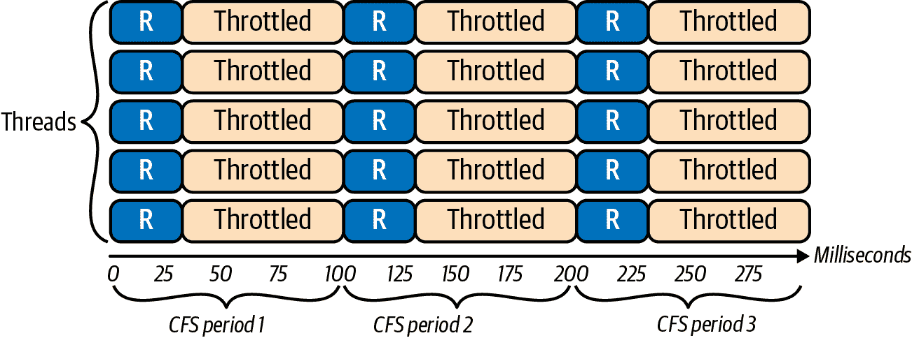

# 第十二章：多租户

在构建基于 Kubernetes 的生产应用平台时，您必须考虑如何处理将在平台上运行的租户。正如我们在本书中讨论过的那样，Kubernetes 提供了一组基础功能，可以用来实现许多需求。工作负载的租赁也不例外。Kubernetes 提供了各种调控手段，可以确保租户可以安全地共存于同一平台上。话虽如此，Kubernetes 并未定义租户。租户可以是一个应用程序、一个开发团队、一个业务单元或其他内容。租户的定义由您和您的组织来决定，我们希望本章能够帮助您完成这项任务。

一旦确定了您的租户是谁，您必须确定是否应该让多个租户在同一平台上运行。根据我们帮助大型组织构建应用程序平台的经验，我们发现平台团队通常有兴趣运行多租户平台。话虽如此，这个决定牢固地植根于不同租户的性质以及它们之间的信任关系。例如，提供共享应用程序平台的企业与为外部客户提供容器即服务的公司是两回事。

在本章中，我们将首先探讨您可以在 Kubernetes 中实现的租户隔离程度。您的工作负载的性质以及您的具体需求将决定您需要提供多少隔离。隔离越强，您在这方面的投资就越大。然后，我们将讨论 Kubernetes 命名空间，这是实现 Kubernetes 中大部分多租户功能的基础构建块。最后，我们将深入探讨您可以利用的不同 Kubernetes 功能，这些功能可以在多租户集群中隔离租户，包括基于角色的访问控制（RBAC）、资源请求和限制、Pod 安全策略等等。

# 隔离程度

Kubernetes 适合各种租户模型，每种模型都有其利弊。确定要实施的模型的最关键因素是您的工作负载所需的隔离程度。例如，运行由不同第三方开发的不受信任代码通常需要比托管您组织内部应用程序更强大的隔离。总体而言，您可以遵循两种租户模型：单租户集群和多租户集群。让我们讨论每种模型的优势和劣势。

## 单租户集群

单租户集群模型（如 图 12-1 所示）在租户之间提供了最强的隔离，因为集群资源不共享。这种模型相当吸引人，因为您不必解决可能出现的复杂多租户问题。换句话说，没有租户隔离问题需要解决。



###### 图 12-1\. 每个租户在单独的集群中运行（CP 代表控制平面节点）。

单租户集群在租户数量较少时是可行的。然而，这种模型可能会面临以下几个不利因素：

资源开销

每个单租户集群都必须运行自己的控制平面，在大多数情况下，这至少需要三个专用节点。租户越多，用于集群控制平面的资源也就越多——这些资源本来可以用来运行工作负载。除了控制平面外，每个集群还承载一组工作负载以提供平台服务。这些平台服务也会带来开销，因为它们本来可以在多租户集群中不同租户之间共享。监控工具、策略控制器（如 Open Policy Agent）和 Ingress 控制器都是很好的例子。

增加的管理复杂性

对于平台团队来说，管理大量集群可能成为一个挑战。每个集群都需要部署、跟踪、升级等操作。想象一下在数百个集群中修复安全漏洞的过程。为了有效地完成这些任务，平台团队需要投资于先进的工具。

尽管刚提到的缺点，我们在实地中看到了许多成功的单租户集群实现。随着类似 [Cluster API](https://oreil.ly/8QRz7) 这样的集群生命周期工具的成熟，单租户模型变得更易于采纳。尽管如此，我们在现场的大部分工作重点是帮助组织实施多租户集群，我们将在接下来讨论这一点。

## 多租户集群

承载多个租户的集群可以解决我们之前讨论过的单租户集群的不利因素。与为每个租户部署和管理一个集群相比，平台团队可以专注于更少数量的集群，这降低了资源开销和管理复杂性（如 图 12-2 中所示）。尽管如此，这其中存在一定的权衡。实施多租户集群更为复杂和微妙，因为您必须确保租户可以共存而不相互影响。



###### 图 12-2\. 多个租户共享的单个集群（CP 代表控制平面节点）。

多租户有两种广义的形式，即软多租户和硬多租户。*软多租户*有时被称为“多团队”，假设租户之间存在一定程度的信任。这种模型通常在租户属于同一组织时是可行的。例如，托管不同租户的企业应用平台通常可以假设采用软多租户的姿态。这是因为租户有动机成为良好的邻居，以推动他们的组织取得成功。尽管意图是积极的，但考虑到可能出现的意外问题（例如漏洞、错误等），租户隔离仍然是必要的。

另一方面，*硬多租户*模型建立在租户之间没有信任的基础上。从安全的角度来看，租户甚至被视为对手，以确保正确的隔离机制得以实施。一个运行来自不同组织的不受信任代码的平台就是一个很好的例子。在这种情况下，租户之间强大的隔离至关重要，以确保他们可以安全地共享集群。

延续我们在第一章中的住房类比主题，我们可以说软多租户模型相当于一家人一起生活。他们共享厨房、客厅和公共设施，但每个家庭成员都有自己的卧室。相比之下，硬多租户模型更像是一个公寓楼。多个家庭共享建筑物，但每个家庭都在一个锁定的前门后面生活。

虽然软多租户和硬多租户模型可以帮助引导关于多租户平台的讨论，但实施起来并不那么明确。事实上，多租户最好描述为一个光谱。一端是完全没有隔离。租户可以在平台上自由操作并消耗所有资源。另一端是完全的租户隔离，其中租户在平台的所有层面都严格控制和隔离。

正如您可以想象的那样，在没有租户隔离的生产多租户平台是不可行的。同时，建立具有完全租户隔离的多租户平台可能是一个昂贵（甚至是徒劳）的尝试。因此，找到适合您的工作负载和整个组织的多租户光谱中的甜蜜点是非常重要的。

要确定您的工作负载所需的隔离级别，您必须考虑基于 Kubernetes 平台可以应用隔离的不同层次：

工作负载平面

工作负载平面由工作负载运行的节点组成。在多租户场景中，工作负载通常会在共享的节点池中进行调度。在这个级别的隔离涉及节点资源的公平共享、安全性和网络边界等方面。

控制平面

控制平面包括构成 Kubernetes 集群的各种组件，如 API 服务器、控制器管理器和调度器。Kubernetes 提供了不同的机制来在这个层次上隔离租户，包括授权（即 RBAC）、准入控制和 API 优先级与公平性。

平台服务

平台服务包括集中日志记录，监控，入口，集群内 DNS 等等。根据工作负载的不同，这些服务或能力可能需要一定程度的隔离。例如，您可能希望阻止租户查看彼此的日志或通过集群的 DNS 服务器发现彼此的服务。

Kubernetes 提供了不同的原语，您可以使用这些原语在每个层次上实现隔离。在深入讨论这些之前，我们将讨论 Kubernetes Namespace，这是允许您在集群中隔离租户的基础边界。

# Namespace 边界

Namespaces 允许在 Kubernetes API 中实现多种不同的功能。它们允许您组织您的集群，强制执行策略，控制访问等等。更重要的是，它们是实现多租户 Kubernetes 平台的关键构建块，因为它们提供了在集群中引入和隔离租户的基础。

然而，在涉及租户隔离时，重要的是要记住 Namespace 是 Kubernetes 控制平面中的逻辑构造。没有额外的策略或配置，Namespace 对工作负载平面没有任何影响。例如，属于不同 Namespace 的工作负载可能会在同一节点上运行，除非设置了高级调度约束。最终，Namespace 只是附加到 Kubernetes API 资源的元数据。

话虽如此，本章将探讨的许多隔离机制都依赖于 Namespace 构造。RBAC、资源配额和网络策略就是这些机制的例子。因此，在设计租户策略时的首要决策之一就是确定如何利用 Namespaces。在帮助现场组织时，我们看到了以下几种方法：

每个团队一个 Namespace

在这种模型中，每个团队在集群中有一个单独的 Namespace。这种方法使得对特定团队应用策略和配额变得简单。然而，如果一个团队拥有许多服务，存在于单个 Namespace 中可能会具有挑战性。总体来看，我们发现这种模型对于刚开始使用 Kubernetes 的小型组织是可行的。

每个应用程序一个 Namespace

这种方法为集群中的每个应用程序提供了一个命名空间，从而更容易应用特定于应用程序的策略和配额。缺点是，这种模型通常导致租户可以访问多个命名空间，这可能会使租户入驻流程复杂化，并且难以应用租户级别的策略和配额。尽管如此，对于构建多租户平台的大型组织和企业来说，这种方法可能是最可行的。

每层级别一个命名空间

该模式通过使用命名空间建立了不同的运行时层（或环境）。通常情况下，我们避免使用这种方法，因为我们更倾向于为开发、测试和生产层使用单独的集群。

使用的方法主要取决于您的隔离要求和组织结构。如果您倾向于每个团队一个命名空间的模型，请记住命名空间中的所有资源都可以被团队中的所有成员或命名空间中的工作负载访问。例如，假设 Alice 和 Bob 在同一个团队，如果他们都被授权获取团队命名空间中的 Secrets，那么无法阻止 Alice 查看 Bob 的 Secrets。

# Kubernetes 中的多租户

到目前为止，我们已经讨论了构建基于 Kubernetes 平台的不同租户模型。在本章的其余部分，我们将重点介绍多租户集群以及您可以利用的各种 Kubernetes 功能，以安全有效地托管您的租户。在阅读这些部分时，您会发现我们在其他章节中已经涵盖了一些这些功能。在这些情况下，我们将再次概述它们，但我们会专注于它们的多租户方面。

首先，我们将关注控制平面层中可用的隔离机制。主要包括 RBAC、资源配额和验证入口 Webhook。然后，我们将转向工作负载平面，讨论资源请求和限制、网络策略以及 Pod 安全策略。最后，我们将涉及监控和集中日志记录作为设计多租户的示例平台服务。

## 基于角色的访问控制（RBAC）

在同一集群中托管多个租户时，您必须在 API 服务器层强制执行隔离，以防止租户修改不属于他们的资源。RBAC 授权机制使您能够配置这些策略。正如我们在第十章中讨论的那样，API 服务器支持不同的机制来建立用户或租户的身份。一旦建立了身份，租户的身份就会传递到 RBAC 系统，该系统决定是否授权租户执行请求的操作。

在将租户引入集群时，可以授予他们访问一个或多个命名空间的权限，以便他们可以创建和管理 API 资源。为了授权每个租户，必须将角色或 ClusterRole 与他们的身份绑定。这通过 RoleBinding 资源实现。以下片段展示了一个示例 RoleBinding，授予 `app1-viewer` 组对 `app1` 命名空间的查看访问权限。除非有充分的使用案例，否则避免为租户使用 ClusterRoleBindings，因为它会授权租户在所有命名空间中利用绑定角色。

```
apiVersion: rbac.authorization.k8s.io/v1
kind: RoleBinding
metadata:
  name: viewers
  namespace: app1
roleRef:
  apiGroup: rbac.authorization.k8s.io
  kind: ClusterRole
  name: view
subjects:
- apiGroup: rbac.authorization.k8s.io
  kind: Group
  name: app1-viewer
```

你会注意到示例中，RoleBinding 引用了名为 `view` 的 ClusterRole。这是 Kubernetes 中提供的一个内置角色。Kubernetes 提供了一组内置角色，涵盖了常见的使用案例：

查看

视图角色授予租户对命名空间范围内资源的只读访问权限。例如，该角色可以绑定到团队中的所有开发人员，因为它允许他们在生产集群中检查和排查他们的资源。

编辑

编辑角色允许租户创建、修改和删除命名空间范围内的资源，以及查看这些资源。鉴于此角色的能力，该角色的绑定高度依赖于你的应用部署方法。

管理员

除了查看和编辑资源外，管理员角色还可以创建角色和角色绑定。通常将此角色绑定到租户管理员以委派命名空间管理问题。

这些内置角色是一个很好的起点。话虽如此，它们可能被认为过于宽泛，因为它们授予对 Kubernetes API 中大量资源的访问权限。为了遵循最小权限原则，可以创建严格范围的角色，允许完成任务所需的最小资源集和操作。然而，请注意，这可能会导致管理开销，因为你可能需要管理许多唯一的角色。

###### 警告

在大多数 Kubernetes 部署中，租户通常被授权列出集群上所有命名空间。如果你需要防止租户了解其他存在的命名空间，这会成为问题，因为目前使用 Kubernetes RBAC 系统无法实现此目的。如果确实有此要求，必须构建一个更高级的抽象来处理它（OpenShift 的 [Project](https://oreil.ly/xIAT8) 资源是解决这个问题的一个示例抽象）。

在同一集群中运行多个租户时，RBAC 是必需的。它在控制平面层提供隔离，这对防止租户查看和修改彼此资源至关重要。在构建基于 Kubernetes 的多租户平台时，请务必利用 RBAC。

## 资源配额

作为提供多租户平台的平台运营商，你需要确保每个租户得到有限集群资源的适当份额。否则，一个野心勃勃（或者说是恶意的）租户可能会消耗整个集群资源，从而有效地使其他租户资源匮乏。

为了限制资源消耗，您可以使用 Kubernetes 的资源配额功能。资源配额适用于命名空间级别，可以限制两种资源。一方面，您可以控制命名空间中可用的计算资源量，如 CPU、内存和存储。另一方面，您可以限制可以在命名空间中创建的 API 对象的数量，如 Pod、Service 等。一个常见的场景是限制云环境中负载均衡服务的数量，因为这可能会变得昂贵。

由于配额应用于命名空间级别，您的命名空间策略影响如何配置配额。如果租户可以访问单个命名空间，则为每个租户在其命名空间中创建资源配额是直接的。当租户可以访问多个命名空间时，情况就会变得更复杂。在这种情况下，您需要额外的自动化或额外的控制器来跨不同命名空间强制执行配额。([分层命名空间控制器](https://oreil.ly/PyPDK)是解决这个问题的一种尝试)。

为了进一步探索资源配额，在下面的示例中展示了一个将命名空间限制为最多消耗 1 个 CPU 和 512 MiB 内存的资源配额：

```
apiVersion: v1
kind: ResourceQuota
metadata:
  name: cpu-mem
  namespace: app1
spec:
  hard:
    requests.cpu: "1"
    requests.memory: 512Mi
    limits.cpu: "1"
    limits.memory: 512Mi
```

当`app1`命名空间中的 Pod 开始被调度时，配额会相应地被消耗。例如，如果我们创建一个请求 0.5 个 CPU 和 256 MiB 内存的 Pod，我们可以看到更新后的配额如下：

```
$ kubectl describe resourcequota cpu-mem
Name:            cpu-mem
Namespace:       app1
Resource         Used   Hard
--------         ----   ----
limits.cpu       500m   1
limits.memory    512Mi  512Mi
requests.cpu     500m   1
requests.memory  512Mi  512Mi
```

尝试超出配置配额的资源将被一个准入控制器阻止，如下错误消息所示。在这种情况下，我们试图消耗 2 个 CPU 和 2 GiB 内存，但受配额限制：

```
$ kubectl apply -f my-app.yaml
Error from server (Forbidden):
  error when creating "my-app.yaml": pods "my-app" is forbidden:
    exceeded quota: cpu-mem,
      requested: limits.cpu=2,limits.memory=2Gi,
                 requests.cpu=2,requests.memory=2Gi,
      used: limits.cpu=0,limits.memory=0,
                 requests.cpu=0,requests.memory=0,
      limited: limits.cpu=1,limits.memory=512Mi,
                 requests.cpu=1,requests.memory=512Mi
```

正如您所看到的，资源配额赋予了您控制租户如何消耗集群资源的能力。在运行多租户集群时，它们非常关键，因为它们确保租户可以安全地共享集群的有限资源。

## 准入 Webhook

Kubernetes 有一组内置的准入控制器，您可以使用这些控制器来执行策略。我们刚刚介绍的资源配额功能是使用准入控制器实现的。虽然内置控制器帮助解决了常见的用例，但我们通常发现组织需要扩展准入层以进一步隔离和限制租户。

验证和变更准入 Webhook 是一种机制，允许您将自定义逻辑注入准入流程。我们不会深入探讨这些 Webhook 的实现细节，因为我们已经在第八章中涵盖了它们。相反，我们将探讨一些我们在现场通过自定义准入 Webhook 解决的多租户使用案例：

标准化标签

您可以使用验证入场 Webhook 强制所有 API 对象上的一组标准标签。例如，您可以要求所有资源都具有 `owner` 标签。具有一组标准标签很有用，因为标签提供了查询集群的方法，甚至支持更高级别的功能，如网络策略和调度约束。

需要字段

就像强制执行一组标准标签一样，您可以使用验证入场 Webhook 将某些资源的字段标记为必填。例如，您可以要求所有租户设置其 Ingress 资源的 `https` 字段。或者要求租户始终在其 Pod 规范中设置就绪和存活探针。

设置防护栏

Kubernetes 拥有一系列广泛的功能，您可能希望限制甚至禁用其中的某些功能。Webhook 可让您在特定功能周围设置防护栏。例如，禁用特定的服务类型（例如 NodePorts），不允许节点选择器，控制 Ingress 主机名等。

多命名空间资源配额

我们在现场经历过组织需要跨多个命名空间强制实施资源配额的情况。您可以使用自定义入场 Webhook/控制器来实现此功能，因为 Kubernetes 中的 ResourceQuota 对象是命名空间范围的。

总体而言，入场 Webhook 是在您的多租户集群中强制自定义策略的好方法。而像 [Open Policy Agent (OPA)](https://www.openpolicyagent.org) 和 [Kyverno](https://github.com/kyverno/kyverno) 这样的策略引擎的出现使得实施它们变得更加简单。考虑利用这些引擎来隔离和限制您集群中的租户。

## 资源请求和限制

Kubernetes 将工作负载安排到共享的集群节点池中。通常，来自不同租户的工作负载被安排到同一节点上，因此共享节点的资源。确保资源公平共享是运行多租户平台时最关键的问题之一。否则，租户可能会对共享同一节点的其他租户产生负面影响。

Kubernetes 中的资源请求和限制是在计算资源方面将租户相互隔离的机制。资源请求通常在 Kubernetes 调度器级别满足（CPU 请求也会在运行时反映出来，我们稍后会看到）。相比之下，资源限制是在节点级别使用 Linux 控制组（cgroups）和 Linux 完全公平调度器（CFS）实现的。

###### 注意

虽然请求和限制为生产工作负载提供了足够的隔离，但应注意，在容器化环境中，这种隔离不如由虚拟化程序提供的严格。确保在给定 Kubernetes 节点上负载多个工作负载的情况下进行实验并理解其影响。

除了提供资源隔离外，资源请求和限制还确定了 Pod 的服务质量（QoS）类。QoS 类很重要，因为它决定了 kubelet 在节点资源不足时驱逐 Pod 的顺序。Kubernetes 提供以下 QoS 类：

Guaranteed

CPU 限制等于 CPU 请求，内存限制等于内存请求的 Pod。这必须对所有容器成立。Kubelet 很少会驱逐保证型 Pod。

Burstable

不符合 Guaranteed 标准且至少有一个容器具有 CPU 或内存请求的 Pod。Kubelet 根据它们消耗超出请求的资源量驱逐 Burstable Pod。消耗超出请求的 Pod 将在消耗接近其请求的 Pod 之前被驱逐。

BestEffort

没有 CPU 或内存限制或请求的 Pod。这些 Pod 以“尽力而为”的方式运行。它们是 kubelet 驱逐的首选对象。

###### 注意

Pod 驱逐是一个复杂的过程。除了使用 QoS 类来对 Pod 进行排名外，kubelet 在进行驱逐决策时还考虑 Pod 的优先级。Kubernetes 文档中有一篇出色的文章详细讨论了[“资源不足”处理](https://oreil.ly/LuCD9)。

现在我们知道资源请求和限制提供了租户隔离，并确定了 Pod 的 QoS 类，让我们深入讨论资源请求和限制的详细信息。尽管 Kubernetes 支持请求和限制不同的资源，我们将专注于 CPU 和内存，这是所有工作负载在运行时都需要的基本资源。让我们首先讨论内存请求和限制。

每个 Pod 中的容器都可以指定内存请求和限制。当设置了内存请求后，调度器会将它们相加以获取 Pod 的总体内存请求量。有了这些信息，调度器会找到一个具备足够内存容量来托管该 Pod 的节点。如果集群中没有节点具备足够的内存，该 Pod 将保持在等待状态。一旦被调度，Pod 中的容器则确保获得请求的内存量。

Pod 的内存请求代表内存资源的保证下限。但是，如果节点上有可用的额外内存，它们可以消耗额外的内存。这是有问题的，因为 Pod 使用了调度器可以分配给其他工作负载或租户的内存。当新 Pod 被调度到同一节点上时，这些 Pod 可能会争夺内存。为了尊重两个 Pod 的内存请求，超出其请求的 Pod 将被终止。图 12-3 描述了这个过程。



###### 图 12-3\. 当 Pod 消耗超过其请求的内存时，将终止以回收内存以供新 Pod 使用。

为了控制租户可以消耗的内存量，我们必须在工作负载上包含内存限制，这些限制强制执行给定工作负载可用内存的上限。如果工作负载试图消耗超过限制的内存，则会终止该工作负载。这是因为内存是一种不可压缩的资源。无法对内存进行节流，因此在节点的内存争用时必须终止进程。以下片段显示了一个因内存不足而被杀死（OOMKilled）的容器。请注意输出的“Last State”部分中的“Reason”：

```
$ kubectl describe pod memory
Name:         memory
Namespace:    default
Priority:     0
... <snip> ...
Containers:
  stress:
    ... <snip> ...
    Last State:     Terminated
      Reason:       OOMKilled
      Exit Code:    1
      Started:      Fri, 23 Oct 2020 10:11:51 -0400
      Finished:     Fri, 23 Oct 2020 10:11:56 -0400
    Ready:          True
    Restart Count:  1
    Limits:
      memory:  100Mi
    Requests:
      memory:     100Mi
```

我们在实际场景中经常遇到的一个常见问题是，是否应该允许租户将内存限制设置得高于请求。换句话说，节点是否应该在内存上进行超额订阅。这个问题归结为节点密度和稳定性之间的权衡。当您超额订阅节点时，您增加了节点密度，但降低了工作负载的稳定性。正如我们所见，当内存争用时，消耗超过其请求的内存的工作负载会被终止。在大多数情况下，我们鼓励平台团队避免超额订阅节点，因为他们通常认为稳定性比紧密打包节点更重要。特别是在托管生产工作负载的集群中。

现在我们已经介绍了内存请求和限制，让我们将讨论重点转移到 CPU 上。与内存不同，CPU 是一种可压缩资源。当 CPU 争用时，可以对进程进行节流。因此，CPU 请求和限制比内存请求和限制略显复杂。

CPU 请求和限制使用 CPU 单位来指定。在大多数情况下，1 个 CPU 单位相当于 1 个 CPU 核心。请求和限制可以是分数（例如，0.5 CPU），并且可以通过添加`m`后缀以毫秒表示。1 个 CPU 单位等于 1000m CPU。

当 Pod 中的容器指定 CPU 请求时，调度程序将找到具有足够容量放置 Pod 的节点。放置后，kubelet 将请求的 CPU 单位转换为 cgroup CPU 份额。CPU 份额是 Linux 内核中授予 cgroup（即 cgroup 内进程）CPU 时间的机制。以下是 CPU 份额的关键方面：

+   CPU 份额是相对的。1000 个 CPU 份额并不意味着 1 个 CPU 核心或 1000 个 CPU 核心。相反，CPU 容量按其相对份额在所有 cgroup 中进行比例分配。例如，考虑两个处于不同 cgroup 中的进程。如果进程 1（P1）有 2000 份额，而进程 2（P2）有 1000 份额，则 P1 将获得两倍于 P2 的 CPU 时间。

+   CPU 份额仅在 CPU 争用时生效。如果 CPU 未被充分利用，则不会对进程进行节流，进程可以消耗额外的 CPU 周期。根据前面的例子，只有当 CPU 完全忙碌时，P1 才会获得比 P2 两倍的 CPU 时间。

CPU 份额（CPU 请求）提供了在同一节点上运行不同租户所需的 CPU 资源隔离。只要租户声明 CPU 请求，CPU 容量就会根据这些请求进行共享。因此，租户无法通过获取 CPU 时间来使其他租户饥饿。

CPU 限制的工作方式不同。它们设定了每个容器可以使用的 CPU 时间的上限。 Kubernetes 利用完全公平调度器（CFS）的带宽控制功能来实现 CPU 限制。 CFS 带宽控制使用时间周期来限制 CPU 消耗。每个容器在可配置周期内获得一个配额。该配额确定每个周期可以消耗多少 CPU 时间。如果容器用尽了配额，则在剩余的周期内容器被节流。

默认情况下，Kubernetes 将周期设置为 100 毫秒。具有 0.5 个 CPU 限制的容器每 100 毫秒获得 50 毫秒的 CPU 时间，如图 12-4 所示。具有 3 个 CPU 限制的容器在每个 100 毫秒周期内获得 300 毫秒的 CPU 时间，有效地允许容器每 100 毫秒消耗多达 3 个 CPU。



###### Figure 12-4\. 一个在具有 100 毫秒 CFS 周期和 50 毫秒 CPU 配额的 cgroup 中运行的进程的 CPU 消耗和节流情况。

由于 CPU 限制的性质，它们有时会导致意外行为或意外的节流现象。这通常发生在多线程应用程序中，它们可以在周期的最开始消耗整个配额。例如，具有 1 个 CPU 限制的容器每 100 毫秒获得 100 毫秒的 CPU 时间。假设容器有 5 个线程在使用 CPU，则容器在 20 毫秒内消耗完 100 毫秒的配额，并在剩余的 80 毫秒内被节流。这在图 12-5 中有所描述。



###### Figure 12-5\. 多线程应用程序在 100 毫秒周期的前 20 毫秒内消耗整个 CPU 配额。

强制执行 CPU 限制对于最小化应用程序性能的变化非常有用，特别是在跨不同节点运行多个副本时。这种性能变化源于没有 CPU 限制，副本可以突发并消耗空闲的 CPU 周期，这些周期可能在不同的时间*可能*可用。通过将 CPU 限制设置为 CPU 请求，您消除了这种变化，因为工作负载准确获得了它们请求的 CPU。 （Google 和 IBM 发表了一篇关于更详细讨论 CFS 带宽控制的优秀[白皮书](https://oreil.ly/39Pu7)。）同样，CPU 限制在性能测试和基准测试中起着关键作用。如果没有任何 CPU 限制，您的基准测试将产生无法确定的结果，因为可用于工作负载的 CPU 会根据它们被调度到的节点和可用的空闲 CPU 量而变化。

如果您的工作负载需要对 CPU 的访问具有可预测性（例如，对延迟敏感的应用程序），将 CPU 的限制设置为 CPU 请求的大小是有帮助的。否则，在 CPU 循环上设置上限是不必要的。当节点上的 CPU 资源存在竞争时，CPU 共享机制确保工作负载根据其容器的 CPU 请求获取公平的 CPU 时间份额。当 CPU 没有竞争时，空闲的 CPU 循环并不会浪费，因为工作负载可以机会性地利用它们。

## 网络策略

在大多数部署中，Kubernetes 假设平台上运行的所有 Pod 可以相互通信。正如您可以想象的那样，这种立场对于多租户集群是有问题的，因为您可能希望在租户之间强制执行网络层面的隔离。NetworkPolicy API 是您可以利用的机制，以确保在网络层面上租户彼此隔离。

我们在第五章中探讨了网络策略，讨论了容器网络接口（CNI）插件在执行网络策略中的作用。在本节中，我们将讨论*默认拒绝所有*的网络策略模型，这是网络策略的常见方法，特别是在多租户集群中。

作为平台操作员，您可以在整个集群中建立默认的拒绝所有网络策略。通过这样做，您采取了关于网络安全和隔离的最严格立场，因为一旦租户加入平台，他们就完全隔离。此外，您要求租户声明其工作负载的网络交互，这有助于提高其应用程序的网络安全性。

当涉及实施默认的拒绝所有策略时，您可以选择两种不同的路径，每种路径都有其优缺点。第一种方法利用了 Kubernetes 中可用的 NetworkPolicy API。由于这是一个核心 API，这种实现在不同的 CNI 插件之间是可移植的。然而，由于 NetworkPolicy 对象是命名空间范围的，这要求您创建和管理多个默认的拒绝所有 NetworkPolicy 资源，每个命名空间一个。此外，因为租户需要授权来创建自己的 NetworkPolicy 对象，您必须实现额外的控制（通常通过之前讨论过的准入 Webhook）来防止租户修改或删除默认的拒绝所有策略。以下代码片段显示了一个默认的拒绝所有 NetworkPolicy 对象。空的 Pod 选择器选择命名空间中的所有 Pod：

```
apiVersion: networking.k8s.io/v1
kind: NetworkPolicy
metadata:
  name: default-deny-all
  namespace: tenant-a
spec:
  podSelector: {}
  policyTypes:
  - Ingress
  - Egress
```

另一种方法是利用 CNI 插件特定的自定义资源定义（CRD）。一些 CNI 插件，如 Antrea、Calico 和 Cilium，提供了 CRD，使您能够指定集群级或“全局”网络策略。这些 CRD 帮助您减少默认拒绝所有策略的实施和管理复杂性，但它们将您绑定到特定的 CNI 插件。以下片段显示了一个示例 Calico GlobalNetworkPolicy CRD，实现了默认拒绝所有策略。

```
apiVersion: projectcalico.org/v3
kind: GlobalNetworkPolicy
metadata:
  name: default-deny
spec:
  selector: all()
  types:
  - Ingress
  - Egress
```

###### 注意

通常，实施默认拒绝所有网络策略会例外允许基本网络流量，例如向集群的 DNS 服务器发出的 DNS 查询。此外，它们不适用于 kube-system Namespace 和任何其他系统级 Namespace，以防止破坏集群。上述代码中的 YAML 片段未解决这些问题。

与大多数选择一样，是使用内置 NetworkPolicy 对象还是 CRD 之间存在可移植性和简单性的权衡。根据我们的经验，我们发现通过利用特定于 CNI 的 CRD 所获得的简单性通常是值得的，考虑到切换 CNI 插件是一种不常见的事件。话虽如此，未来您可能无需做出这种选择，因为 Kubernetes 网络特别兴趣小组（sig-network）正在考虑演变 NetworkPolicy API 以支持集群范围的网络策略。

一旦默认的拒绝所有策略生效，租户就有责任在网络结构中打洞，以确保他们的应用程序能够正常运行。他们通过使用 NetworkPolicy 资源来实现这一点，在其中指定适用于他们工作负载的入站和出站规则。例如，以下片段展示了可以应用于 Web 服务的 NetworkPolicy。它允许来自 Web 前端的入站流量，并允许连接到其数据库的出站流量。

```
apiVersion: networking.k8s.io/v1
kind: NetworkPolicy
metadata:
  name: webservice
  namespace: reservations
spec:
  podSelector:
    matchLabels:
      role: webservice
  policyTypes:
  - Ingress
  - Egress
  ingress:
  - from:
    - podSelector:
        matchLabels:
          role: frontend
    ports:
    - protocol: TCP
      port: 8080
  egress:
  - to:
    - podSelector:
        role: database
    ports:
    - protocol: TCP
      port: 3306
```

实施默认拒绝所有网络策略是一种重要的租户隔离机制。在构建基于 Kubernetes 的平台时，我们强烈建议您遵循这种模式，特别是如果您计划托管多个租户。

## Pod 安全策略

Pod 安全策略（PSPs）是另一种重要机制，确保租户可以安全共存于同一集群中。PSPs 在运行时控制 Pod 的关键安全参数，例如它们作为特权用户运行的能力，访问主机卷，绑定到主机网络等。没有 PSPs（或类似的策略执行机制），工作负载可以在集群节点上做几乎任何事情。

Kubernetes 使用准入控制器来强制执行大多数通过 PSP 实施的控制。（有时，要求非 root 用户由 kubelet 在下载镜像后验证容器的运行时用户来执行。）启用准入控制器后，除非 PSP 允许，否则创建 Pod 的尝试将被阻止。 示例 12-1 展示了我们通常在多租户集群中定义为 *默认* 策略的限制性 PSP。

##### 示例 12-1\. 示例限制性 PodSecurityPolicy

```
apiVersion: policy/v1beta1
kind: PodSecurityPolicy
metadata:
  name: default
  annotations:
    seccomp.security.alpha.kubernetes.io/allowedProfileNames: |
      'docker/default,runtime/default'
    apparmor.security.beta.kubernetes.io/allowedProfileNames: 'runtime/default'
    seccomp.security.alpha.kubernetes.io/defaultProfileName:  'runtime/default'
    apparmor.security.beta.kubernetes.io/defaultProfileName:  'runtime/default'
spec:
  privileged: false 
  allowPrivilegeEscalation: false
  requiredDropCapabilities:
    - ALL
  volumes: 
    - 'configMap'
    - 'emptyDir'
    - 'projected'
    - 'secret'
    - 'downwardAPI'
    - 'persistentVolumeClaim'
  hostNetwork: false 
  hostIPC: false
  hostPID: false
  runAsUser:
    rule: 'MustRunAsNonRoot' 
  seLinux:
    rule: 'RunAsAny' 
  supplementalGroups: 
    rule: 'MustRunAs'
    ranges:
      - min: 1
        max: 65535
  fsGroup: 
    rule: 'MustRunAs'
    ranges:
      - min: 1
        max: 65535
  readOnlyRootFilesystem: false
```


不允许特权容器。


控制 Pods 可以使用的卷类型。


阻止 Pods 绑定到底层主机的网络堆栈。


确保容器以非 root 用户身份运行。


此策略假设节点使用的是 AppArmor 而不是 SELinux。


指定容器可以使用的允许组 ID。 禁止使用 root gid (0)。


控制应用于卷的组 ID。 禁止使用 root gid (0)。

允许 Pod 存在的 PSP 是不够的，Pod 必须被授权*使用*这个 PSP。 PSP 的授权是通过 RBAC 处理的。 如果它们的 Service Account 被授权使用 PSP，则 Pod 可以使用 PSP。 如果创建 Pod 的执行者被授权使用 PSP，Pod 也可以使用 PSP。 然而，考虑到 Pod 很少由集群用户创建，使用 Service Accounts 进行 PSP 授权是更常见的方法。 以下代码片段显示了授权特定 PSP `sample-psp` 使用的角色和角色绑定：

```
kind: Role
apiVersion: rbac.authorization.k8s.io/v1
metadata:
  name: sample-psp
rules:
- apiGroups: ['policy']
  resources: ['podsecuritypolicies']
  resourceNames: ['sample-psp']
  verbs: ['use']
---
apiVersion: rbac.authorization.k8s.io/v1beta1
kind: RoleBinding
metadata:
  name: sample-psp
subjects:
- kind: ServiceAccount
  name: my-app
roleRef:
  apiGroup: rbac.authorization.k8s.io
  kind: Role
  name: sample-psp
```

在大多数情况下，平台团队负责创建和管理 PSP，并启用租户使用它们。 在设计策略时，始终遵循最小权限原则。 仅允许 Pods 完成其工作所需的最小权限集和能力。 作为起点，我们通常建议创建以下策略：

默认

默认策略可供集群中所有租户使用。 它应该是一个阻止所有特权操作、放弃所有 Linux 能力、不允许作为 root 用户运行等策略。（有关此策略的 YAML 定义，请参见 示例 12-1。）要使其成为默认策略，您可以授权集群中所有 Pod 使用此 PSP，方法是使用 ClusterRole 和 ClusterRoleBinding。

Kube-system

kube-system 策略适用于存在于 kube-system 命名空间中的系统组件。由于这些组件的性质，此策略需要比默认策略更宽松。例如，它必须允许 Pod 挂载`hostPath`卷并以 root 身份运行。与默认策略相反，RBAC 授权是通过针对 kube-system 命名空间中所有服务账户范围的 RoleBinding 实现的。

网络

网络策略针对集群的网络组件，如 CNI 插件。这些 Pod 需要更多的特权来操作集群节点的网络堆栈。为了将此策略隔离到网络 Pod，创建一个 RoleBinding，仅授权网络 Pod 的服务账户使用该策略。

有了这些策略，租户可以将非特权工作负载部署到集群中。如果有一个需要额外特权的工作负载，您必须确定是否可以容忍在同一集群中运行该特权工作负载的风险。如果可以，创建一个针对该工作负载量身定制的不同策略。授予工作负载所需的特权，并仅授权该工作负载的服务账户使用 PSP。

PSP 是多租户平台中的关键执行机制。它们控制租户在运行时可以做什么和不能做什么，因为它们与其他租户一起在共享节点上运行。在构建平台时，您应该利用 PSP 来确保租户被隔离并受到保护。

###### 注意

Kubernetes 社区正在[讨论](https://oreil.ly/ayN8j)是否从核心项目中移除 PodSecurityPolicy API 和准入控制器的可能性。如果移除，您可以利用诸如[Open Policy Agent](https://oreil.ly/wrz23)或[Kyverno](https://oreil.ly/v7C2H)之类的策略引擎来实现类似的功能。

## 多租户平台服务

除了在平台上隔离 Kubernetes 控制平面和工作负载平面外，您还可以在提供的不同服务中强制执行隔离。这些服务包括日志记录、监控、入口等。在实施此隔离的一个重要决定因素是您用于提供服务的技术。在某些情况下，工具或技术可能会直接支持多租户，从而极大简化您的实施。

另一个需要考虑的重要问题是在这一层是否*需要*隔离租户。租户之间查看彼此的日志和指标是否可以？他们可以自由地发现彼此的服务吗？他们可以共享入口数据路径吗？回答这些类似的问题将有助于澄清您的需求。最终，这归结为您在平台上托管的租户之间的信任级别。

在帮助平台团队时，我们经常遇到的典型情况是使用 Prometheus 进行多租户监控。Prometheus 默认情况下不支持多租户。指标被摄取并存储在单个时间序列数据库中，任何具有 Prometheus HTTP 端点访问权限的人都可以访问。换句话说，如果 Prometheus 实例从多个租户那里抓取指标，就没有办法阻止不同租户看到彼此的数据。为了解决这个问题，我们需要为每个租户部署单独的 Prometheus 实例。

在解决这个问题时，我们通常利用 [prometheus-operator](https://oreil.ly/j38-Q)。正如在 第九章 中讨论的那样，prometheus-operator 允许您使用自定义资源定义来部署和管理多个 Prometheus 实例。借助这一能力，您可以提供一个监控平台服务，安全地支持各种租户。租户完全隔离，因为他们会得到一个包括 Prometheus、Grafana、Alertmanager 等在内的专用监控堆栈。

根据平台的目标用户体验，您可以允许租户使用运算符部署他们自己的 Prometheus 实例，或者在租户入驻时自动创建实例。当平台团队有能力时，我们推荐后者，因为它减轻了平台租户的负担，并提供了更好的用户体验。

集中式日志记录是另一个可以考虑多租户实现的平台服务。通常，这涉及将不同租户的日志发送到不同的后端或数据存储中。大多数日志转发器都有路由功能，可以用来实现多租户解决方案。

在 Fluentd 和 Fluent Bit 的情况下，当配置转发器时，您可以利用它们基于标签的路由功能。以下代码片段显示了一个样例 Fluent Bit 输出配置，将 Alice 的日志（`alice-ns` 命名空间中的 Pod）路由到一个后端，将 Bob 的日志（`bob-ns` 命名空间中的 Pod）路由到另一个后端：

```
[OUTPUT]
    Name            es
    Match           kube.var.log.containers.**alice-ns**.log
    Host            alice.es.internal.cloud.example.com
    Port            ${FLUENT_ELASTICSEARCH_PORT}
    Logstash_Format On
    Replace_Dots    On
    Retry_Limit     False

[OUTPUT]
    Name            es
    Match           kube.var.log.containers.**bob-ns**.log
    Host            bob.es.internal.cloud.example.com
    Port            ${FLUENT_ELASTICSEARCH_PORT}
    Logstash_Format On
    Replace_Dots    On
    Retry_Limit     False
```

除了在后端隔离日志外，您还可以实现速率限制或节流，以防止一个租户占用日志转发基础设施。Fluentd 和 Fluent Bit 都有您可以使用的插件来执行这些限制。最后，如果有适当的用例需要，您可以利用日志运算符来支持更高级的用例，例如通过 Kubernetes CRD 公开日志配置。

平台服务层的多租户有时会被平台团队忽视。在构建多租户平台时，请考虑您的需求及其对您想要提供的平台服务的影响。在某些情况下，这可能会推动对平台基础设施方案和工具的决策。

# 总结

Workload tenancy is a crucial concern you must consider when building a platform atop Kubernetes. On one hand, you can operate single-tenant clusters for each of your platform tenants. While this approach is viable, we discussed its downsides, including resource and management overhead. The alternative is multitenant clusters, where tenants share the cluster’s control plane, workload plane, and platform services.

When hosting multiple tenants on the same cluster, you must ensure tenant isolation such that tenants cannot negatively affect each other. We discussed the Kubernetes Namespace as the foundation upon which we can build the isolation. We then discussed many of the isolation mechanisms available in Kubernetes that allow you to build a multitenant platform. These mechanisms are available in different layers, mainly the control plane, the workload plane, and the platform services.

The control plane isolation mechanisms include RBAC to control what tenants can do, resource quotas to divvy up the cluster resources, and admission webhooks to enforce policy. On the workload plane, you can segregate tenants by using Resource Requests and Limits to ensure fair-sharing of node resources, Network Policies to segment the Pod network, and Pod Security Policies to limit Pods capabilities. Finally, when it comes to platform services, you can leverage different technologies to implement multitenant offerings. We explored monitoring and centralized logging as example platform service that you can build to support multiple tenants.
