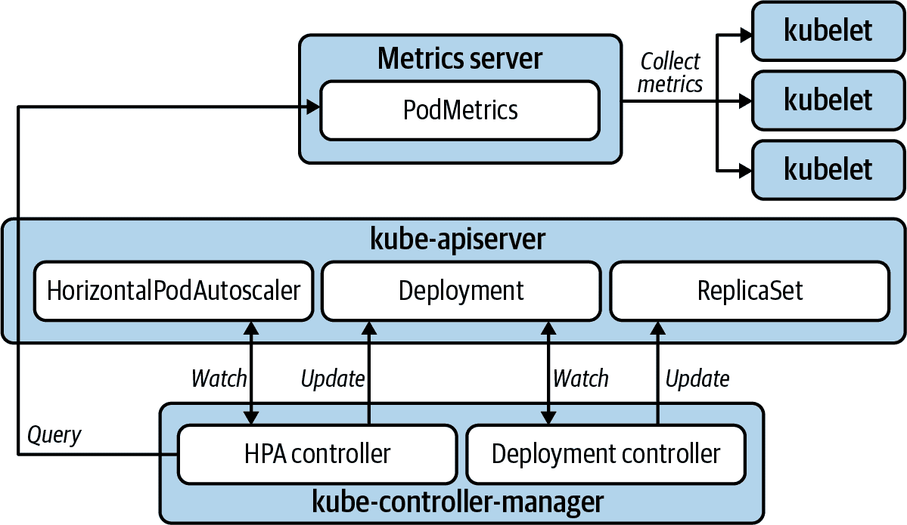
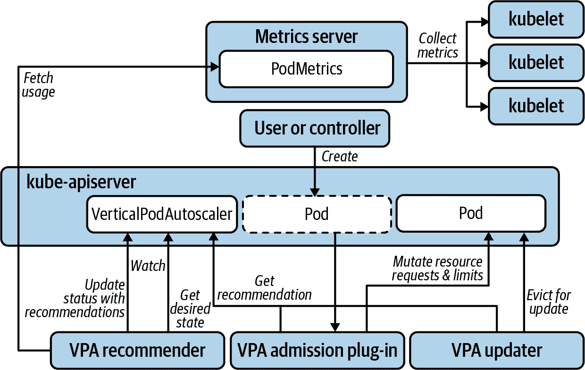
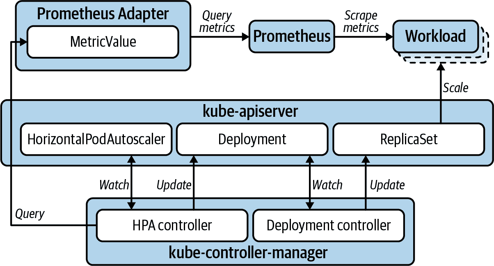
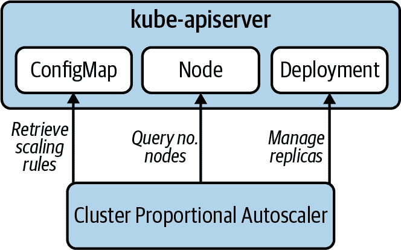
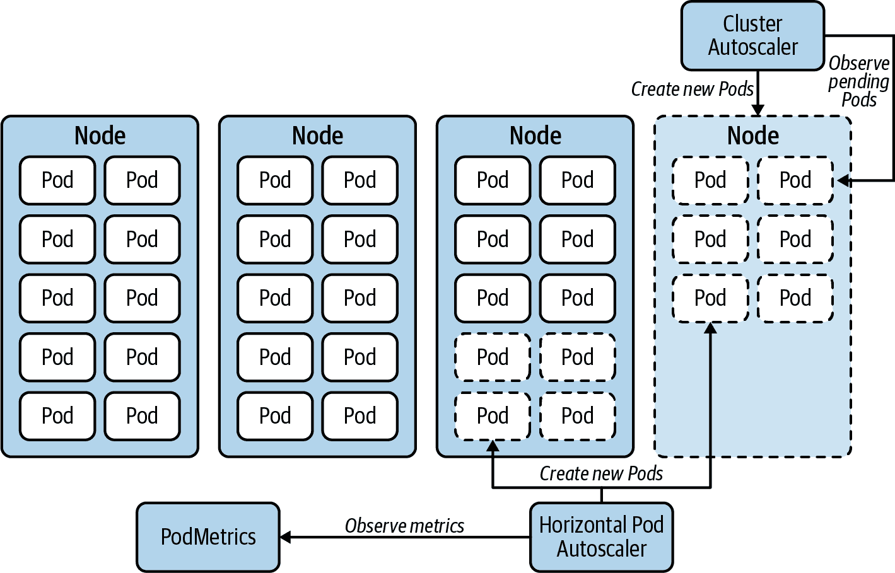
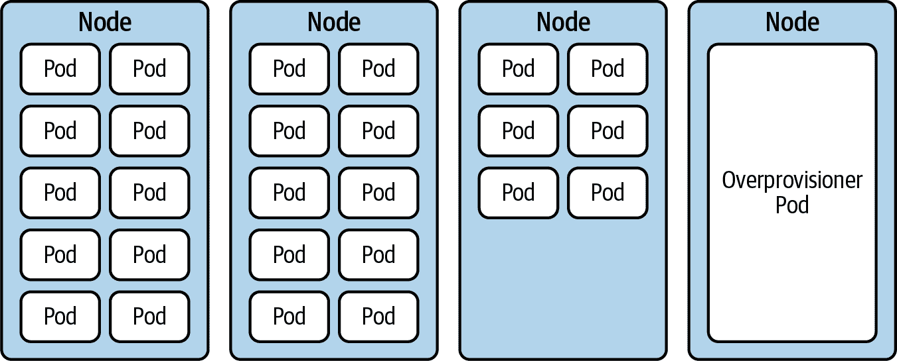
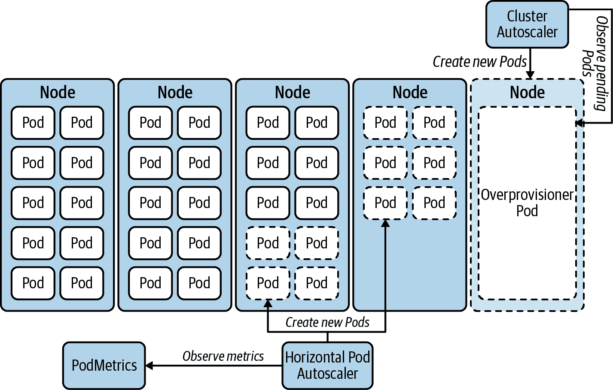

# 第十三章：自动缩放

自动缩放工作负载容量的能力是云原生系统的一个引人注目的好处之一。如果您的应用程序面临容量需求显著变化，自动缩放可以降低成本并减少在管理这些应用程序时的工程工作量。自动缩放是在无需人工干预的情况下增加和减少工作负载容量的过程。这始于利用度量标准来提供应用程序容量应何时扩展的指示器。它包括调整响应这些指标的设置。最终目标是通过系统来实际扩展和收缩应用程序可用的资源，以适应其必须执行的工作。

尽管自动缩放可以提供很好的好处，但重要的是要认识到何时**不**使用自动缩放。自动缩放为应用程序管理引入了复杂性。除了初始设置外，您很可能需要重新审视和调整自动缩放机制的配置。因此，如果应用程序的容量需求变化不显著，为应用程序能够处理的最高流量预留资源可能是完全可以接受的。如果您的应用程序负载在可预见的时间发生变化，那么在这些时间手动调整容量的工作量可能微不足道，以至于投资于自动缩放可能不值得。与几乎所有技术一样，只有在长期利益超过系统设置和维护的情况下才能利用它们。

我们将把自动缩放的主题划分为两个广泛的类别：

工作负载自动缩放

对个别工作负载容量的自动化管理

集群自动缩放

对托管工作负载的底层平台容量的自动化管理

在我们检视这些方法时，请记住自动缩放的主要动机：

成本管理

当您从公共云提供商租用服务器或为使用虚拟化基础设施而内部计费时，这点最为相关。集群自动缩放允许您动态调整所支付的机器数量。为了实现基础设施的弹性，您将需要利用工作负载自动缩放来管理集群中相关应用程序的容量。

容量管理

如果您有一组静态的基础设施可以利用，自动缩放为您提供了动态管理固定容量分配的机会。例如，为您的业务最终用户提供服务的应用程序通常在最繁忙的时间和日子会有高峰。工作负载自动缩放允许应用程序在需要时动态扩展其容量，并在集群中占用大量资源。它还允许它收缩并为其他工作负载腾出空间。也许您有可以在非高峰时期利用未使用计算资源的批处理工作负载。集群自动缩放可以消除大量人工管理计算基础设施容量的工作量，因为您的集群使用的机器数量会在无人干预的情况下进行调整。

对于负载和流量波动的应用程序，自动缩放是非常有效的。如果没有自动缩放，您有两个选择：

+   过度配置你的应用容量，增加业务成本。

+   提醒您的工程师进行手动缩放操作，增加运维中的额外劳动成本。

在本章中，我们首先探讨如何实现自动缩放，并设计软件以利用这些系统。然后我们将深入探讨特定系统的细节，这些系统可以用于在基于 Kubernetes 的平台中自动缩放我们的应用程序。这将包括水平和垂直自动缩放，包括触发缩放事件所应使用的指标。我们还将研究如何按比例缩放工作负载以适应集群本身，以及您可能考虑的自定义自动缩放示例。最后，在“集群自动缩放”中，我们将讨论扩展平台本身的缩放，以便它能够适应其托管的工作负载的需求显著变化。

# 缩放类型

在软件工程中，缩放通常分为两类：

水平缩放

这涉及更改工作负载的相同副本数量。这可以是特定应用程序的 Pod 的数量，也可以是托管应用程序的集群中的节点数量。未来提到水平缩放将使用术语“外扩”或“内缩”来指示增加或减少 Pod 或节点的数量。

垂直缩放

这涉及修改单个实例的资源容量。对于应用程序来说，这意味着更改应用程序容器的资源请求和/或限制。对于集群的节点来说，通常涉及改变可用的 CPU 和内存资源的数量。未来提到垂直缩放将使用术语“上升”或“下降”来表示这些变化。

对于需要动态扩展的系统，即频繁、显著变化负载的系统，尽可能偏好水平扩展。垂直扩展受限于可用的最大机器。此外，通过垂直扩展增加容量需要应用程序重新启动。即使在虚拟化环境中，动态扩展机器也是可能的，但 Pod 需要重新启动，因为此时不能动态更新资源请求和限制。与之相比，水平扩展不需要现有实例重新启动，并且通过添加副本动态增加容量。

# 应用程序架构

自动扩展的主题对面向服务的系统尤为重要。将应用程序分解为不同组件的好处之一是能够独立扩展应用程序的不同部分。在云原生出现之前，我们在 n 层架构中已经做到了这一点。将网页应用程序与其关系数据库分离并独立扩展已成常态。通过微服务架构，我们可以进一步扩展。例如，企业网站可能有一个支持在线商店的服务，与一个服务提供博客文章的服务不同。在进行市场活动时，可以扩展在线商店而不影响博客服务，博客服务可能保持不变。

有了独立扩展不同服务的机会，您能够更有效地利用工作负载使用的基础设施。但是，您引入了管理多个独立工作负载的管理开销。自动化这一扩展过程变得非常重要。在某一时刻，它变得至关重要。

自动扩展非常适合那些具有小型、敏捷的工作负载，其镜像大小小且启动速度快。如果将容器镜像拉到特定节点所需时间短，并且一旦创建容器后应用程序启动时间也很短，则工作负载可以迅速响应扩展事件。可以更快速地调整容量。镜像大小超过一千兆字节且启动脚本运行几分钟的应用程序，则不太适合响应负载变化。在设计和构建应用程序时请牢记这一点。

还需注意的是，自动扩展将涉及停止应用程序实例。当然，这不适用于工作负载的扩展。然而，扩展之后，也必须缩回。这将涉及停止正在运行的实例。而对于垂直扩展的工作负载，需要重新启动以更新资源分配。无论哪种情况，你的应用程序能够优雅地关闭的能力都是很重要的。详细讨论请参见第十四章。

现在我们已经解决了需要注意的设计问题，让我们深入探讨在 Kubernetes 集群中自动扩展工作负载的详细信息。

# 工作负载自动扩展

本节将重点讨论自动扩展应用程序工作负载。这涉及监控某些指标并在没有人为干预的情况下调整工作负载容量。虽然这听起来像是一种设定并忘记的操作，但不要这样对待，特别是在初始阶段。即使在负载测试自动缩放配置之后，您仍需要确保生产环境中的行为符合您的意图。负载测试并不总能准确模拟生产条件。因此，一旦投入生产使用，您将希望检查应用程序，以验证它是否在正确的阈值上进行扩展，并满足效率和最终用户体验的目标。强烈建议设置警报，以便在出现重要的扩展事件时得到通知，并根据需要查看和调整其行为。

本节大部分内容将涉及水平 Pod 自动缩放器和垂直 Pod 自动缩放器。这些是在 Kubernetes 上自动扩展工作负载时最常用的工具。我们还将深入探讨工作负载使用的指标以触发扩展事件的情况，以及在考虑自定义应用程序指标用于此目的时应考虑的内容。我们还将探讨集群比例自动缩放器以及适合使用该工具的用例。最后，我们将简要讨论超出这些特定工具范围的自定义方法。

## 水平 Pod 自动缩放器

水平 Pod 自动缩放器（HPA）是在基于 Kubernetes 平台上自动扩展工作负载时最常用的工具。它由 Kubernetes 原生支持，通过水平 Pod 自动缩放器资源和捆绑到 kube-controller-manager 中的控制器实现。如果您使用 CPU 或内存消耗作为工作负载自动缩放的度量标准，使用 HPA 的门槛就很低。

在这种情况下，您可以使用 [Kubernetes Metrics Server](https://oreil.ly/S0vbj) 将 PodMetrics 提供给 HPA。Metrics Server 从集群中的 kubelet 收集容器的 CPU 和内存使用情况指标，并通过 PodMetrics 资源在资源指标 API 中提供这些指标。Metrics Server 利用 [Kubernetes API 聚合层](https://oreil.ly/eXDcl)。对于 API 组和版本 `metrics.k8s.io/v1beta1` 的资源请求将被代理到 Metrics Server。

图 13-1 展示了组件如何执行这一功能。度量服务器收集平台上容器的资源使用度量数据。它从集群中每个节点上运行的 kubelet 获取数据，并使这些数据对需要访问它的客户端可用。HPA 控制器每 15 秒默认从 Kubernetes API 服务器查询一次资源使用数据。Kubernetes API 代理请求到度量服务器，并提供所请求的数据。HPA 控制器保持对 HorizontalPodAutoscaler 资源类型的监视，并使用在那里定义的配置来确定应用程序副本数量是否合适。示例 13-1 展示了如何进行此决定。应用程序通常使用 Deployment 资源进行定义，当 HPA 控制器确定需要调整副本数时，它通过 API 服务器更新相关的 Deployment。随后，Deployment 控制器响应并更新 ReplicaSet，从而改变 Pod 的数量。



###### 图 13-1\. 水平 Pod 自动扩展。

HPA 的期望状态在 HorizontalPodAutoscaler 资源中声明，如下例所示。`targetCPUUtilizationPercentage` 用于确定目标工作负载的副本数。

##### 示例 13-1\. Deployment 和 HorizontalPodAutoscaler 配置示例。

```
apiVersion: apps/v1
kind: Deployment
metadata:
  name: sample
spec:
  selector:
    matchLabels:
      app: sample
  template:
    metadata:
      labels:
        app: sample
    spec:
      containers:
      - name: sample
        image: sample-image:1.0
        resources:
          requests:
            cpu: "100m"  
---
apiVersion: autoscaling/v1
kind: HorizontalPodAutoscaler
metadata:
  name: sample
spec:
  scaleTargetRef:
    apiVersion: apps/v1
    kind: Deployment
    name: sample
  minReplicas: 1  
  maxReplicas: 3  
  targetCPUUtilizationPercentage: 75  
```


度量使用的 `resources.requests` 必须为设置值。


副本数永远不会低于此值进行缩减。


副本数永远不会超出此值进行扩展。


期望的 CPU 利用率。如果实际利用率显著超出此值，则副本数将增加；如果显著低于，则减少。

###### 注意

如果您有使用多个度量触发扩展事件的用例，例如 CPU *和* 内存，您可以使用 `autoscaling/v2beta2` API。在这种情况下，HPA 控制器将根据每个度量单独计算合适的副本数，然后应用最高值。

这是最常见和广泛使用的自动扩展方法，适用性广泛，并且相对简单实现。但是，理解此方法的局限性非常重要：

并非所有工作负载都可以进行水平扩展。

对于无法在不同实例之间共享负载的应用程序，水平扩展毫无用处。这对某些有状态工作负载和领导选举应用程序是正确的。对于这些用例，您可以考虑使用垂直 Pod 自动扩展。

集群大小将限制扩展能力。

当应用程序扩展时，可能会耗尽集群工作节点中的可用容量。这可以通过提前配置足够的容量来解决，使用警报来提示平台操作员手动添加容量，或者使用集群自动缩放来解决，这在本章的另一节中进行了讨论。

CPU 和内存可能不是用于扩展决策的正确指标。

如果您的工作负载暴露了更好地标识需要进行扩展的自定义指标，则可以使用它。我们将在本章的后面部分讨论这种用例。

###### 警告

避免根据不总是与应用程序负载放置成比例变化的指标自动缩放工作负载。最常见的自动缩放指标是 CPU。但是，如果特定工作负载的 CPU 随增加的负载并未显著变化，而是更直接地与增加的负载成比例地消耗内存，则不要使用 CPU。一个不太明显的例子是如果工作负载在启动时消耗了额外的 CPU。在正常运行期间，CPU 可能是一个完全有用的自动缩放触发器。然而，在启动时的 CPU 峰值将被 HPA 解释为触发缩放事件，即使流量未引起峰值。可以通过 kube-controller-manager 标志来减轻这种情况，例如 `--horizontal-pod-autoscaler-cpu-initialization-period`，它将提供一个启动宽限期，或者 `--horizontal-pod-autoscaler-sync-period`，它允许您增加缩放评估之间的时间。但请注意，这些标志是设置在 kube-controller-manager 上的。这将影响整个集群中所有 HPAs，这将影响那些启动时 CPU 消耗不高的工作负载。您可能会减少整个集群中工作负载的 HPA 响应性。如果您发现您的团队在使用变通方法使 CPU 消耗作为自动缩放需求的触发器，请考虑使用更具代表性的自定义指标。例如，收到的 HTTP 请求数量可能会更好地作为衡量标准。

这就结束了水平 Pod 自动缩放器。接下来，我们将看一下 Kubernetes 中另一种可用的自动缩放形式：竖直 Pod 自动缩放。

## 竖直 Pod 自动缩放器

出于早前在 “扩展类型” 中讨论的原因，竖直扩展工作负载是一个较少见的需求。此外，在 Kubernetes 中实现竖直缩放的自动化更为复杂。虽然 HPA 包含在核心 Kubernetes 中，但 VPA 需要通过部署三个不同的控制器组件以及度量服务器来实现。因此，[竖直 Pod 自动缩放器（VPA）](https://oreil.ly/TxeiY) 比 HPA 更少被使用。

VPA 由三个不同的组件组成：

推荐器

基于 PodMetrics 资源中 Pod 的使用情况，确定最佳的容器 CPU 和/或内存请求值。

准入插件

当根据推荐者的建议创建新 Pod 时，会变异资源请求和限制。

更新程序

将 Pod 驱逐，以便由准入插件应用更新后的值。

Figure 13-2 说明了组件与 VPA 的交互。



###### 图 13-2\. 垂直 Pod 自动缩放。

在 VerticalPodAutoscaler 资源中声明 VPA 的期望状态，如示例 Example 13-2 所示。

##### Example 13-2\. 一个 Pod 资源和配置垂直自动缩放的 VerticalPodAutoscaler 资源

```
apiVersion: v1
kind: Pod
metadata:
  name: sample
spec:
  containers:
  - name: sample
    image: sample-image:1.0
    resources:  
      requests:
        cpu: 100m
        memory: 50Mi
      limits:
        cpu: 100m
        memory: 50Mi
---
apiVersion: "autoscaling.k8s.io/v1beta2"
kind: VerticalPodAutoscaler
metadata:
  name: sample
spec:
  targetRef:
    apiVersion: "v1"
    kind: Pod
    name: sample
  resourcePolicy:
    containerPolicies:
      - containerName: '*'  
        minAllowed:  
          cpu: 100m
          memory: 50Mi
        maxAllowed:  
          cpu: 1
          memory: 500Mi
        controlledResources: ["cpu", "memory"]  
  updatePolicy:
    updateMode: Recreate  
```


当更新值时，VPA 将保持请求:限制比例。在这个保证的 QOS 示例中，对请求的任何更改都将导致限制的相同更改。


这个缩放策略将适用于每个容器——在这个示例中只有一个。


资源请求不会设置低于这些值。


资源请求不会设置超过这些值。


指定正在自动缩放的资源。


有三种 `updateMode` 选项。`Recreate` 模式将激活自动缩放。`Initial` 模式将应用准入控制以在创建时设置资源值，但不会驱逐任何 Pod。`Off` 模式将建议资源值，但永远不会自动更改它们。

我们很少在现场看到 VPA 处于完全的 `Recreate` 模式。但是，在 `Off` 模式下使用它也是有价值的。在应用发布到生产之前，建议进行全面的负载测试和应用程序分析，但这并非总是现实。在企业环境中，由于截止日期的存在，工作负载通常在理解资源消耗配置文件之前就已部署到生产中。这通常导致过度请求资源作为一种安全措施，这往往导致基础设施的低利用率。在这些情况下，VPA 可以用来推荐值，然后由工程师评估并手动更新一旦生产负载已应用，他们可以放心工作负载不会在峰值使用时间被驱逐，这对于尚未优雅关闭的应用程序尤为重要。但是，由于 VPA 推荐值，它节省了一些审查资源使用度量和确定最佳值的工作。在这种用例中，它不是一个自动缩放器，而是一个资源调整辅助工具。

要从处于 `Off` 模式的 VPA 获取建议，请运行 `kubectl describe vpa <vpa name>`。您将在 `Status` 部分获得类似于 Example 13-3 的输出。

##### Example 13-3\. 垂直 Pod 自动缩放建议

```
  Recommendation:
    Container Recommendations:
      Container Name:  coredns
      Lower Bound:
        Cpu:     25m
        Memory:  262144k
      Target:
        Cpu:     25m
        Memory:  262144k
      Uncapped Target:
        Cpu:     25m
        Memory:  262144k
      Upper Bound:
        Cpu:     427m
        Memory:  916943343
```

它将为每个容器提供建议。使用 `Target` 值作为 CPU 和内存请求的基线建议。

## 使用自定义指标进行自动缩放

如果 CPU 和内存消耗不是缩放特定工作负载的好指标，您可以利用自定义指标作为替代方案。我们仍然可以使用 HPA 等工具。但是，我们将更改用于触发自动缩放的指标来源。第一步是从应用程序中公开适当的自定义指标。第十四章 解释了如何执行此操作。

接下来，您需要将自定义指标公开给自动缩放器。这将需要一个自定义指标服务器，用于替代之前介绍过的 Kubernetes Metrics Server。一些供应商，如 Datadog，在 Kubernetes 中提供了执行此操作的系统。您还可以使用 Prometheus 进行此操作，假设您有一个 Prometheus 服务器在抓取和存储应用程序的自定义指标，这在 第十章 中有所介绍。在这种情况下，我们可以使用 [Prometheus 适配器](https://oreil.ly/vDgk3) 提供自定义指标。

Prometheus 适配器将从 Prometheus 的 HTTP API 中检索自定义指标，并通过 Kubernetes API 公开这些指标。与 Metrics Server 类似，Prometheus 适配器使用 Kubernetes API 聚合来指示 Kubernetes 代理请求以获取指向 Prometheus 适配器的指标 API。事实上，除了自定义指标 API 外，Prometheus 适配器还实现了资源指标 API，允许您完全用 Prometheus 适配器替换 Metrics Server 的功能。此外，它还实现了外部指标 API，提供了根据集群外部指标调整应用程序规模的机会。

在利用自定义指标进行水平自动缩放时，Prometheus 从应用程序中抓取这些指标。Prometheus 适配器从 Prometheus 获取这些指标，并通过 Kubernetes API 服务器公开它们。HPA 查询这些指标，并相应地调整应用程序规模，如图 13-3 所示。

尽管以这种方式利用自定义指标引入了一些额外的复杂性，但如果您已经从工作负载中公开有用的指标并使用 Prometheus 对其进行监视，则用 Prometheus 适配器替换 Metrics Server 不是一个巨大的飞跃。而且它开启的额外自动缩放机会使其值得考虑。



###### 图 13-3\. 使用自定义指标的水平 Pod 自动缩放。

## 集群比例自动缩放器

[集群比例自动扩展器](https://oreil.ly/2ATBG)（CPA）是一种水平工作负载自动扩展器，根据集群中节点（或节点子集）的数量来扩展副本。因此，与 HPA 不同，它不依赖任何度量 API。因此，它不依赖于 Metrics Server 或 Prometheus Adapter。此外，它不是使用 Kubernetes 资源进行配置，而是使用标志来配置目标工作负载和用于缩放配置的 ConfigMap。图 13-4 说明了 CPA 的简化操作模型。



###### 图 13-4\. 集群比例自动扩展。

CPA 具有较窄的使用案例。通常需要根据集群比例扩展的工作负载通常限于平台服务。在考虑 CPA 时，评估是否 HPA 能提供更好的解决方案，特别是如果您已经与其他工作负载一起使用 HPA。如果您已经使用 HPAs，则已经部署了 Metrics Server 或 Prometheus Adapter 来实现必要的度量 API。因此，部署另一个自动扩展器以及随之而来的维护开销可能不是最佳选择。或者，如果在尚未使用 HPAs 的集群中，并且 CPA 提供所需功能，则由于其简单的操作模型，它变得更具吸引力。

CPA 使用的两种扩展方法有：

+   线性方法会按照集群中节点或核心数的数量直接扩展您的应用程序。

+   阶梯方法使用阶梯函数来确定节点：副本和/或核心：副本的比例。

我们已经看到 CPA 在诸如集群 DNS 这样的服务中成功使用，允许集群扩展到数百个工作节点。在这种情况下，服务在 5 个节点时的流量和需求将与 300 个节点时大不相同，因此这种方法非常有用。

## 自定义自动扩展

关于工作负载自动扩展，到目前为止，我们已经讨论了社区中可用的一些具体工具：HPA、VPA 和 CPA，以及 Metrics Server 和 Prometheus Adapter。但是，扩展您的工作负载不仅限于这些工具集。任何您可以采用的自动化方法，实现您需要的扩展行为，都属于同一类别。例如，如果您知道应用程序流量在哪些天和时间增加，您可以实施像 Kubernetes CronJob 这样简单的解决方案，更新相关部署的副本计数。实际上，如果您能利用像这样的简单、直接的方法，更倾向于选择更简单的解决方案。少运动部件的系统更不太可能产生意外结果。

这些是自动缩放工作负载的方法。我们已经探讨了几种使用核心 Kubernetes、社区开发的附加组件和定制解决方案的方法。接下来，我们将看一看如何对托管这些工作负载的基础结构进行自动缩放：即 Kubernetes 集群本身。

# 集群自动伸缩器

Kubernetes [集群自动伸缩器（CA）](https://oreil.ly/Q5Xdp) 提供了一种自动化方案，用于横向扩展集群中的工作节点。它解决了 HPA 的一些限制，并可以显著减少围绕 Kubernetes 基础设施的容量和成本管理的工作量。

随着平台团队采用基于 Kubernetes 的平台，您需要在新租户上线时管理集群的容量。这可能是一个手动的常规审查过程。也可以是基于警报驱动的，通过使用使用率指标的警报规则通知您需要增加或移除工作节点的情况。或者您可以完全自动化操作，只需添加和移除租户，让 CA 管理集群扩展以适应需求。

此外，如果您正在利用工作负载自动缩放，并且资源消耗波动显著，CA 的作用会更加突出。当 HPA 管理的工作负载负载增加时，其副本数量将增加。如果您的集群计算资源不足，一些 Pod 将无法调度并保持在`Pending`状态。CA 会检测到这种确切条件，计算出满足需求的节点数量，并向您的集群添加新节点。图 图 13-5 显示了集群扩展以容纳横向扩展应用程序的情况。



###### 图 13-5\. 集群自动伸缩器响应 Pod 副本扩展而扩展节点。

另一方面，当负载减少并且 HPA 缩减应用程序的 Pod 时，CA 将寻找长时间未被充分利用的节点。如果可以将低利用率节点上的 Pod 重新调度到集群中的其他节点，CA 将取消分配低利用率节点以进行集群缩减。

当您调用这种动态管理工作节点的方法时，请记住它将不可避免地重新分配 Pod 在节点间的分布。Kubernetes 调度器通常会在 Pod 刚创建时在工作节点间均匀地分布 Pod。然而，一旦 Pod 开始运行，决定其所属的调度决策将不会重新评估，除非它被驱逐。因此，当特定应用程序水平扩展然后再次缩减时，您可能会发现 Pod 在工作节点上分布不均匀。在某些情况下，可能会导致一个部署的多个副本聚集在几个节点上。如果这对工作负载的节点故障容忍性构成威胁，您可以使用 [Kubernetes descheduler](https://github.com/kubernetes-sigs/descheduler) 根据不同的策略将它们驱逐出去。一旦被驱逐，Pod 将被重新调度。这将有助于重新平衡它们在节点间的分布。我们尚未发现许多情况下确实存在这样的迫切需求，但这是一个可用的选择。

如果您正在考虑集群自动缩放，您需要计划基础设施管理方面的问题。首先，您需要使用项目存储库中记录的受支持的云提供商之一。接下来，您将需要授权 CA 为您创建和销毁机器。

如果您使用 [Cluster API](https://github.com/kubernetes-sigs/cluster-api) 项目与 CA 配合使用，那么这些基础设施管理问题将有所变化。Cluster API 使用其自己的 Kubernetes 操作符来管理集群基础设施。在这种情况下，CA 不再直接连接云提供商来添加和删除工作节点，而是将此操作卸载给 Cluster API。CA 只需更新 `MachineDeployment` 资源中的副本数，这由 Cluster API 控制器来协调。这消除了需要使用与 CA 兼容的云提供商的必要性（但是，您需要检查是否有适用于您云提供商的 Cluster API 提供程序）。权限问题也被转移到 Cluster API 组件上处理。从许多方面来看，这是一个更好的模型。然而，Cluster API 通常使用管理集群进行实现。这为集群自动缩放引入了应该考虑的外部依赖关系。有关此主题的进一步信息，请参阅 “管理集群”。

CA 的扩展行为是可以配置的。CA 使用在项目的 [GitHub 上的常见问题解答](https://oreil.ly/DzQ0J) 中记录的标志进行配置。示例 13-4 展示了针对 AWS 的 CA 部署清单，并包括如何设置一些常见标志的示例。

##### 示例 13-4\. CA 部署清单针对亚马逊 Web 服务自动缩放组

```
apiVersion: apps/v1
kind: Deployment
metadata:
  name: aws-cluster-autoscaler
spec:
  replicas: 1
  selector:
    matchLabels:
      app.kubernetes.io/name: "aws-cluster-autoscaler"
  template:
    metadata:
      labels:
        app.kubernetes.io/name: "aws-cluster-autoscaler"
    spec:
      containers:
        - name: aws-cluster-autoscaler
          image: "us.gcr.io/k8s-artifacts-prod/autoscaling/cluster-autoscaler:v1.18"
          command:
            - ./cluster-autoscaler
            - --cloud-provider=aws  
            - --namespace=kube-system
            - --nodes=1:10:worker-auto-scaling-group  
            - --logtostderr=true
            - --stderrthreshold=info
            - --v=4
          env:
            - name: AWS_REGION
              value: "us-east-2"
          livenessProbe:
            httpGet:
              path: /health-check
              port: 8085
          ports:
            - containerPort: 8085
```


配置所支持的云服务提供商；在这种情况下是 AWS。


此标志配置 CA 以更新名为`worker-auto-scaling-group`的 AWS 自动扩展组。它允许 CA 在此组中的机器数量在 1 和 10 之间进行扩展。

集群自动缩放可以非常有用。它解锁了云原生基础设施提供的引人注目的好处之一。然而，它引入了不小的复杂性。在依赖其自主管理生产环境中关键业务平台的扩展之前，请确保进行负载测试并深入了解系统的行为。一个重要的考虑因素是清楚地了解您的集群将达到的上限。如果您的平台托管大量工作负载能力，并且允许您的集群扩展到数百个节点，请了解在平台组件开始引入瓶颈之前它将扩展到的位置。有关集群大小的更多讨论可以在第二章中找到。

集群自动缩放的另一个考虑因素是在需要时集群将扩展的速度。这是过度配置可能有所帮助的地方。

## 集群过度配置

重要的是要记住，集群自动缩放器响应因集群中计算资源不足而无法调度的`Pending` Pod。因此，在 CA 采取扩展集群节点的操作时，您的集群已经满了。这意味着，如果管理不当，您的扩展工作负载可能会因为新节点变得可用以进行调度所需的时间而受到容量不足的影响。这是[集群过度配置器](https://oreil.ly/vXij5)可以帮助的地方。

首先，重要的是要了解新节点启动、加入集群并准备接受工作负载需要多长时间。一旦理解了这一点，您可以针对您的情况找到最佳解决方案：

+   将目标利用率在您的 HPAs 中设置得足够低，以便在应用程序达到最大容量之前充分扩展您的工作负载。这可以提供缓冲区，允许时间来配置节点。这样可以减轻过度配置集群的需要，但如果需要考虑负载特别急剧增加的情况，可能需要将目标利用率设置得过低以防止容量短缺。这将导致您在长期过度配置工作负载能力以应对罕见事件的情况。

+   另一种解决方案是使用集群过度配置。通过这种方法，您可以将空节点准备好以提供工作负载扩展的缓冲区。这将减轻在准备高负载事件时人为地将 HPAs 的目标利用率设置得过低的需求。

集群过度配置通过部署执行以下操作的 Pod 来工作：

+   请求足够的资源来为节点预留几乎所有资源

+   不消耗实际资源

+   使用优先级类使它们在任何其他 Pod 需要时立即被驱逐

将过度配置器 Pod 上的资源请求设置为保留整个节点，然后通过调整过度配置器 Deployment 上的副本数量来调整待命节点的数量。通过简单增加过度配置器 Deployment 上的副本数量，可以实现特定事件或营销活动的过度配置。

图 13-6 展示了这一过程。此图示仅显示了一个 Pod 副本，但可以根据需要提供足够的缓冲区以应对扩展事件。



###### 图 13-6\. 集群过度配置。

现在过度配置器 Pod 占用的节点处于待命状态，随时准备为集群中的另一个 Pod 所需。您可以通过创建一个优先级类，并将其应用于过度配置器 Deployment，来实现这一点，其中 `value: -1` 将使所有其他工作负载默认具有更高的优先级。如果来自另一个工作负载的 Pod 需要资源，过度配置器 Pod 将立即被驱逐，为扩展工作负载腾出空间。过度配置器 Pod 将进入 `Pending` 状态，这将触发集群自动缩放器来准备一个新节点待命，如图 13-7\. 使用集群过度配置扩展 所示。



###### 图 13-7\. 使用集群过度配置扩展。

使用集群自动缩放器和集群过度配置器，您可以有效地水平扩展您的 Kubernetes 集群，这与水平扩展工作负载非常匹配。我们在这里没有涵盖垂直扩展集群，因为我们还没有发现通过水平扩展无法解决的用例。

# 概要

如果您的应用程序需要显著变化的容量需求，请尽量倾向于使用水平扩展。如果可能的话，开发能够自动扩展的应用程序，并确保其能够频繁停止和启动，并暴露自定义指标，如果 CPU 或内存不是触发扩展的良好指标。测试您的自动扩展以确保其行为符合预期，以优化效率和最终用户体验。如果您的工作负载将超出集群容量，请考虑自动扩展集群本身。如果您的扩展事件特别急剧，请考虑使用集群过度配置器将节点放置在待命状态。
