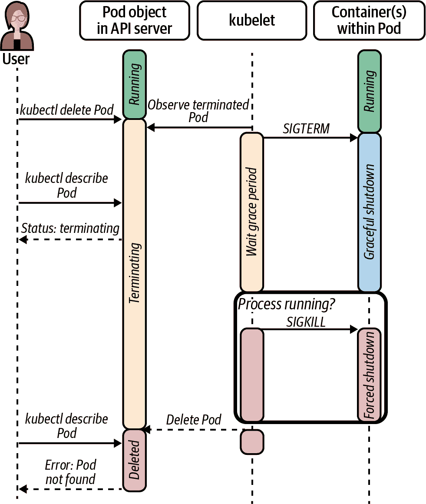
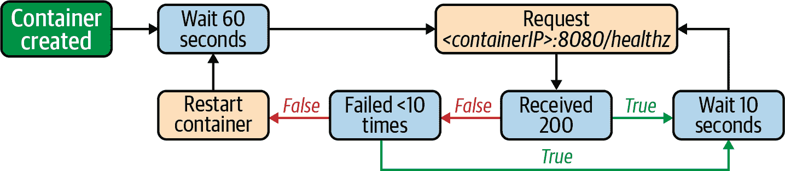
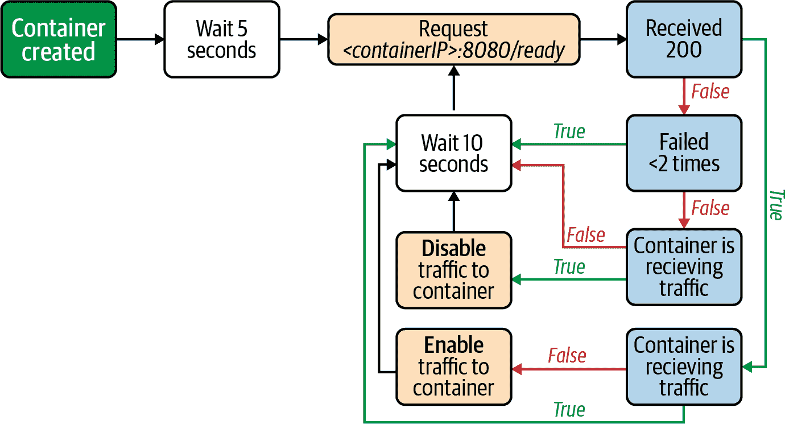
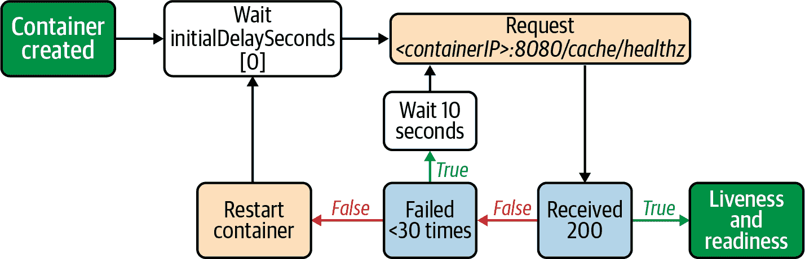
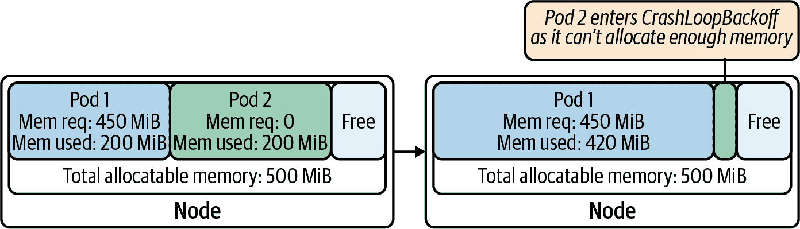

# 第十四章：应用考虑因素

当涉及到 Kubernetes 可以运行和管理的应用程序类型时，它相当灵活。除了操作系统和处理器类型的限制外，Kubernetes 基本上可以运行任何东西。大型单体应用、分布式微服务、批处理工作负载，应有尽有。Kubernetes 对工作负载施加的唯一要求是它们以容器镜像的形式分发。话虽如此，您可以采取一些步骤来使您的应用程序成为更好的 Kubernetes 公民。

在本章中，我们将讨论重点转移到应用程序，而不是平台。如果您是平台团队的一员，请不要跳过本章。虽然您可能认为这仅适用于开发人员，但它也适用于您。作为平台团队的成员，您很可能会构建应用程序，为平台上提供定制服务。即使您不这样做，本章的讨论也将帮助您更好地与使用平台的开发团队对齐，甚至教育那些可能对基于容器的平台不熟悉的团队。

本章涵盖了在 Kubernetes 上运行应用程序时应考虑的各种因素。主要包括：

+   将应用程序部署到平台上，并管理部署清单的机制，如模板化和打包。

+   配置应用程序的方法，例如使用 Kubernetes API（ConfigMaps/Secrets），并集成外部系统进行配置和密钥管理。

+   Kubernetes 的功能，可提高工作负载的可用性，如预停止容器钩子、优雅终止和调度约束。

+   State probes，这是 Kubernetes 的一个功能，使您能够向平台展示应用程序的健康信息。

+   资源请求和限制对确保应用程序在平台上正常运行至关重要。

+   日志、指标和跟踪作为调试、故障排除和有效操作工作负载的机制。

# 将应用程序部署到 Kubernetes

一旦您的应用程序被容器化并存储在容器镜像注册表中，您就可以准备将其部署到 Kubernetes 上。在大多数情况下，部署应用程序涉及编写描述运行应用程序所需的 Kubernetes 资源的 YAML 清单，例如 Deployments、Services、ConfigMaps、CRDs 等。然后，您将清单发送到 API 服务器，Kubernetes 会处理其余工作。使用原始 YAML 清单是入门的好方法，但在将应用程序部署到不同集群或环境时，它很快可能变得不切实际。您很可能会遇到类似以下问题：

+   在演练和生产环境中运行时如何提供不同的凭证？

+   在不同数据中心部署时如何使用不同的镜像注册表？

+   如何在开发和生产环境中设置不同的副本计数？

+   如何确保不同清单中的所有端口号匹配？

清单不胜枚举。虽然您可以为每个问题解决方案创建多组清单，但排列组合使得管理变得相当具有挑战性。在本节中，我们将讨论您可以采取的方法来解决清单管理问题。主要包括清单模板化和为 Kubernetes 打包应用程序。然而，我们不会详细讨论社区中可用的各种工具。我们经常发现，团队在考虑不同选择时陷入分析瘫痪。我们的建议是选择*某种*方法，然后继续解决更高价值的问题。

## 模板化部署清单

模板化涉及在您的部署清单中引入占位符。占位符提供了一种机制，可以根据需要注入值，而不是在清单中硬编码值。例如，以下模板化清单使您可以将复制数量设置为不同的值。也许在开发环境中您只需要一个副本，但在生产环境中需要五个副本。

```
apiVersion: apps/v1
kind: Deployment
metadata:
  labels:
    app: nginx
  name: nginx
spec:
  replicas: {{ .Values.replicaCount }}
  selector:
    matchLabels:
      app: nginx
  template:
    metadata:
      labels:
        app: nginx
    spec:
      containers:
      - image: nginx
        name: nginx
```

## Kubernetes 应用程序打包

创建自包含软件包是另一种可以用来部署应用程序并解决清单管理问题的机制。打包解决方案通常建立在模板化的基础上，但它们引入了其他有用的附加功能，例如能够将包推送到兼容 OCI 的注册表、生命周期管理钩子等等。

软件包是消耗由第三方维护的软件或将软件交付给第三方的重要机制。如果您已经使用 Helm 将软件安装到 Kubernetes 集群中，则已经利用了打包的好处。如果您对 Helm 不熟悉，以下片段为您展示了安装软件包所需的步骤：

```
$ helm repo add hashicorp https://helm.releases.hashicorp.com
"hashicorp" has been added to your repositories

$ helm install vault hashicorp/vault
```

如您所见，软件包是在 Kubernetes 上部署和管理软件的好方法。话虽如此，当涉及到需要高级生命周期管理的复杂应用程序时，软件包可能会显得力不从心。对于这样的应用程序，我们发现操作员是更好的解决方案。我们在第二章中详细讨论了操作员。尽管该章节侧重于平台服务，但所讨论的概念在构建用于复杂应用程序的操作员时同样适用。

# 配置和密钥摄入

应用程序通常具有告知它们在运行时如何行为的配置。配置通常包括日志记录级别、依赖项的主机名（例如，数据库的 DNS 记录）、超时等内容。其中一些设置可能包含敏感信息，例如密码，通常称为密钥。在本节中，我们将讨论在基于 Kubernetes 平台的应用程序配置的不同方法。首先，我们将审查 Kubernetes 核心中提供的 ConfigMap 和 Secret API。然后，我们将探讨与外部系统集成的 Kubernetes API 替代方法。最后，我们将根据实地经验提供关于这些方法的指导，介绍哪些方法最有效。

在深入讨论之前，值得一提的是，您应该避免将配置或密钥捆绑在应用程序的容器镜像中。应用程序二进制文件与其配置的紧密耦合会破坏运行时配置的目的。此外，对于密钥而言，这种做法还存在安全问题，因为镜像可能被不应访问密钥的角色访问到。您应该利用平台特性在运行时注入配置，而不是将配置包含在镜像中。

## Kubernetes 的 ConfigMaps 和 Secrets

ConfigMaps 和 Secrets 是 Kubernetes API 中的核心资源，使您能够在运行时配置您的应用程序。与 Kubernetes 中的任何其他资源一样，它们通过 API 服务器创建，并通常以 YAML 形式声明，例如以下示例：

```
apiVersion: v1
kind: ConfigMap
metadata:
  name: my-config
data:
  debug: "false"
```

让我们讨论如何在您的应用程序中使用 ConfigMaps 和 Secrets。

第一种方法是将 ConfigMaps 和 Secrets 作为文件挂载到 Pod 文件系统中。在构建 Pod 规范时，您可以添加引用 ConfigMaps 或 Secrets 的卷，并将它们挂载到容器的特定位置。例如，以下片段定义了一个 Pod，将名为 `my-config` 的 ConfigMap 挂载到名为 `my-app` 的容器中，路径为 `/etc/my-app/config.json`：

```
apiVersion: v1
kind: Pod
metadata:
  name: my-app
spec:
  containers:
  - image: my-app
    name: my-app:v0.1.0
    volumeMounts:
    - name: my-config
      mountPath: /etc/my-app/config.json
  volumes:
  - name: my-config
    configMap:
      name: my-config
```

利用卷挂载是在消费 ConfigMaps 和 Secrets 时的首选方法。原因在于 Pod 中的文件是动态更新的，这使您能够重新配置应用程序而无需重新启动应用程序或重新创建 Pod。尽管如此，应用程序必须支持这一功能。应用程序必须监视磁盘上的配置文件，并在文件更改时应用新配置。许多库和框架使实现此功能变得容易。当这不可行时，您可以引入一个 sidecar 容器来监视配置文件，并在有新配置可用时向主进程发信号（例如，使用 SIGHUP）。

通过环境变量消费 ConfigMaps 和 Secrets 是另一种可以使用的方法。如果您的应用程序通过环境变量来期望配置，这是一个自然的方法。环境变量还可以在需要通过命令行标志提供设置时提供帮助。在以下示例中，Pod 使用名为`my-config`的 ConfigMap 设置了`DEBUG`环境变量，该 ConfigMap 有一个名为`debug`的键，其包含以下值：

```
apiVersion: v1
kind: Pod
metadata:
  name: my-app
spec:
  containers:
    - name: my-app
      image: my-app:v0.1.0
      env:
        - name: DEBUG
          valueFrom:
            configMapKeyRef:
              name: my-config
              key: debug
```

使用环境变量的一个缺点是，对于 ConfigMaps 或 Secrets 的更改在运行的 Pod 中不会反映出来，直到它重新启动。这对某些应用程序可能并非问题，但您应该牢记这一点。另一个缺点，主要针对 Secrets，是某些应用程序或框架在启动时或崩溃时可能会将环境细节转储到日志中。这会造成安全风险，因为秘密可能会不经意地泄露到日志文件中。

这两种首选的 ConfigMap 和 Secret 消费方法依赖于 Kubernetes 将配置注入到工作负载中。另一个选择是应用程序与 Kubernetes API 通信来获取其配置。应用程序不使用配置文件或环境变量，而是直接从 Kubernetes API 服务器读取 ConfigMaps 和 Secrets。应用程序还可以监听 API，以便在配置更改时执行操作。开发人员可以使用许多 Kubernetes 库或 SDK 来实现此功能，或者利用支持此功能的应用程序框架，如 Spring Cloud Kubernetes。

虽然利用 Kubernetes API 进行应用程序配置可能很方便，但我们发现有一些重要的缺点需要考虑。首先，连接到 API 服务器以获取配置会在应用程序和 Kubernetes 平台之间创建紧密耦合关系。这种耦合会引发一些有趣的问题。如果 API 服务器宕机会发生什么？当平台团队升级 API 服务器时，您的应用程序会经历停机时间吗？

其次，应用程序要从 API 获取其配置时，需要凭据，并且需要具有适当的权限。这些要求增加了部署的复杂性，因为现在您必须提供一个服务账户，并为您的工作负载定义 RBAC 角色。

最后，越多应用程序使用此方法获取配置，API 服务器上的负载就越大。由于 API 服务器是集群控制平面的关键组件，这种应用程序配置方法可能与集群的整体可扩展性相冲突。

总的来说，当涉及到消费 ConfigMaps 和 Secrets 时，我们更喜欢使用卷挂载和环境变量，而不是直接集成 Kubernetes API。这样一来，应用程序与底层平台保持解耦。

## 从外部系统获取配置

当涉及配置应用程序时，ConfigMaps 和 Secrets 非常方便。它们内置于 Kubernetes API 中，可以随时供您使用。话虽如此，配置和密钥在 Kubernetes 出现之前就一直是应用程序开发者面临的问题。虽然 Kubernetes 提供了解决这些问题的功能，但并没有阻止您使用外部系统。

在现场遇到的外部配置或密钥管理系统中，最普遍的一个例子是[HashiCorp Vault](https://www.vaultproject.io)。Vault 提供了在 Kubernetes Secrets 中无法获得的高级密钥管理功能。例如，Vault 提供动态密钥、密钥轮换、基于时间的令牌等功能。如果您的应用程序已经利用了 Vault，那么在 Kubernetes 上运行应用程序时可以继续使用。即使尚未使用 Vault，评估其作为 Kubernetes Secrets 更强大的替代方案也是值得的。我们在第七章中广泛讨论了密钥管理考虑因素和 Vault 与 Kubernetes 的集成。如果您想了解更多关于 Kubernetes 中的密钥管理以及 Vault 集成的低级细节，请查阅该章节。

在利用外部系统进行配置或密钥时，我们发现尽可能将集成任务转移到平台上是有益的。与 Vault 等外部系统的集成可以作为平台服务提供，以将 Secrets 作为 Pods 中的卷或环境变量暴露出来。平台服务抽象了外部系统，并使您的应用程序能够消费 Secret，而无需担心集成的实现细节。总体而言，利用这样的平台服务可以降低应用程序的复杂性，并实现应用程序间的标准化。

# 处理重新调度事件

Kubernetes 是一个高度动态的环境，在这里工作负载会因各种原因而被移动。集群节点可能会来来去去；它们可能会耗尽资源，甚至失败。平台团队可以排空、隔离或删除节点以执行集群生命周期操作（例如升级）。这些都是可能导致您的工作负载被终止并重新调度的情况的示例，还有许多其他情况。

不论原因如何，Kubernetes 的动态特性都可能影响您应用的可用性和操作。尽管应用架构对干扰影响最大，但 Kubernetes 中的功能可以帮助您最小化这种影响。本节将探讨这些功能。首先，我们将深入了解预停止容器生命周期钩子。如其名称所示，这些钩子允许您在 Kubernetes 停止容器之前采取行动。然后，我们将讨论如何优雅地关闭容器，包括在应用程序内响应关闭事件的信号处理。最后，我们将审查 Pod 反亲和规则，这是一个可以用来跨故障域分布应用程序的机制。正如前面提到的，这些机制可以帮助*最小化*干扰的影响，但不能消除故障的潜在可能性。阅读本节时请牢记这一点。

## 预停止容器生命周期钩子

Kubernetes 可以出于任何原因终止工作负载。如果您需要在终止容器之前执行操作，可以利用预停止容器生命周期钩子。Kubernetes 提供两种类型的钩子。`exec`生命周期钩子在容器内部运行命令，而`HTTP`生命周期钩子则针对您指定的端点（通常是容器本身）发出 HTTP 请求。使用哪种钩子取决于您的具体要求和您试图实现的目标。

[Contour](https://projectcontour.io)中的预停止钩子是展示预停止钩子强大功能的一个绝佳示例。为了避免中断进行中的客户端请求，Contour 包含一个容器预停止钩子，告诉 Kubernetes 在停止容器之前执行一个命令。以下是来自 Contour Deployment YAML 文件的预停止钩子配置片段：

```
# <... snip ...>
    spec:
      containers:
      - command:
        - /bin/contour
        args:
          - envoy
          - shutdown-manager
        image: docker.io/projectcontour/contour:main
        lifecycle:
          preStop:
            exec:
              command:
                - /bin/contour
                - envoy
                - shutdown
# <... snip ...>
```

容器预停止钩子使您能够在 Kubernetes 停止容器之前采取操作。它们允许您运行容器内存在但不是运行进程的命令或脚本。需要牢记的一个关键考虑因素是这些钩子仅在计划的生命周期或重新调度事件面前执行。例如，如果节点失败，这些钩子将不会运行。此外，作为预停止钩子的一部分执行的任何操作受 Pod 的优雅关闭期限的控制，我们将在接下来讨论。

## 优雅的容器关闭

在执行预停止钩子（如果提供）后，Kubernetes 通过向工作负载发送 SIGTERM 信号启动容器关闭过程。此信号告知容器它即将被停止。同时，它开始计时终止关闭期限，默认为 30 秒。您可以使用 Pod 规范的`terminationGracePeriodSeconds`字段来调整此期限。

在优雅终止期间，应用程序可以在关闭之前完成任何必要的操作。根据应用程序的不同，这些操作可以包括持久化数据、关闭开放连接、将文件刷新到磁盘等。完成这些操作后，应用程序应以成功的退出代码退出。优雅终止的示例在图 14-1 中有所说明，我们可以看到 kubelet 发送 SIGTERM 信号并等待容器在优雅终止期间内终止。

如果应用程序在终止期间内关闭，Kubernetes 将完成关闭流程并继续。否则，它将通过发送 SIGKILL 信号强制停止进程。图 14-1 还显示了这种强制终止在图表右下角。



###### 图 14-1\. Kubernetes 中的应用程序终止。kubelet 首先向工作负载发送 SIGTERM 信号，并等待配置的优雅终止期间。如果进程在期间结束后仍在运行，kubelet 将发送 SIGKILL 信号终止进程。

要使您的应用程序能够优雅地终止，它必须处理 SIGTERM 信号。每种编程语言或框架都有其配置信号处理程序的方法。有些应用程序框架甚至可能会为您处理这些事务。以下代码片段展示了一个配置 SIGTERM 信号处理程序的 Go 应用程序，在接收到信号后停止应用程序的 HTTP 服务器：

```
func main() {
	// App initialization code here...
	httpServer := app.NewHTTPServer()

	// Make a channel to listen for an interrupt or terminate signal
	// from the OS.

	// Use a buffered channel because the signal package requires it.
	shutdown := make(chan os.Signal, 1)
	signal.Notify(shutdown, os.Interrupt, syscall.SIGTERM)

	// Start the application and listen for errors
	errors := make(chan error, 1)
	go httpServer.ListenAndServe(errors)

	// Block main and waiting for shutdown.
	select {
	case err := <-errors:
		log.Fatalf("http server error: %v", err)

	case <-shutdown:
        log.Printf("shutting down http server")
		httpServer.Shutdown()
	}
}
```

在 Kubernetes 上运行应用程序时，我们建议您为 SIGTERM 信号配置信号处理程序。即使没有关闭操作需要执行，处理信号也会使您的工作负载成为更好的 Kubernetes 元素，因为它减少了停止应用程序所需的时间，从而为其他工作负载释放资源。

## 满足可用性要求

容器预停钩和优雅终止与应用程序的单个实例或副本相关。如果您的应用程序具有水平扩展性，那么您很可能在集群中运行多个副本以满足可用性要求。运行多个工作负载实例可以提高容错能力。例如，如果群集节点故障并将其中一个应用程序实例带走，其他副本可以继续工作。但是，请注意，如果这些副本运行在相同的故障域中，则拥有多个副本并不能提高可用性。

确保您的 Pods 分布在不同故障域的一种方法是使用 Pod 反亲和性规则。通过 Pod 反亲和性规则，您告诉 Kubernetes 调度器，您希望根据 Pod 定义中定义的约束条件来调度您的 Pods。更具体地说，您要求调度器避免将 Pod 放置在已经运行负载副本的节点上。考虑一个具有三个副本的 Web 服务器。为了确保这三个副本不会放置在同一故障域中，您可以像下面的片段中使用 Pod 反亲和性规则一样。在这种情况下，反亲和性规则告诉调度器，它应优先将 Pods 放置在按照集群节点上的 `zone` 标签确定的区域内：

```
# ... <snip> ...
      affinity:
        PodAntiAffinity:
          preferredDuringSchedulingIgnoredDuringExecution:
            - labelSelector:
                matchExpressions:
                  - key: "app"
                    operator: In
                    values:
                    - my-web-server
              topologyKey: "zone"
# ... <snip> ...
```

除了 Pod 反亲和性之外，Kubernetes 还提供了 Pod 拓扑扩展约束，这是在将 Pods 分布在不同故障域方面对 Pod 反亲和性规则的改进。反亲和性规则的问题在于无法保证 Pods 在域内均匀分布。您可以“偏好”根据拓扑键调度它们，或者可以保证每个故障域内只有一个副本。

Pod 拓扑扩展约束提供了一种方式告诉调度器如何分布您的工作负载。与 Pod 反亲和性规则类似，它们仅对需要调度的新 Pods 进行评估，因此不会对已存在的 Pods 进行反向强制执行。以下代码片段展示了一个 Pod 拓扑扩展约束的示例，该约束导致 Pods 在不同区域（基于节点的 `zone` 标签）中分布。如果无法满足约束条件，则不会调度 Pods。

```
# ... <snip> ...
spec:
  topologySpreadConstraints:
  - maxSkew: 1
    topologyKey: zone
    whenUnsatisfiable: DoNotSchedule
    labelSelector:
      matchLabels:
        foo: bar
# ... <snip> ...
```

当运行多个应用程序实例时，应利用这些 Pod 放置特性来提高应用程序对基础设施故障的容忍度。否则，您面临的风险是 Kubernetes 可能以未能实现所需故障容忍度的方式调度您的工作负载。

# 状态探针

Kubernetes 使用许多信号来确定平台上运行的应用程序的状态和健康状况。在健康方面，Kubernetes 将工作负载视为不透明的盒子。它知道进程是否运行。尽管这些信息很有帮助，但通常不足以有效地运行和管理应用程序。这就是探针的作用所在。探针为 Kubernetes 提供了增加应用程序状态可见性的功能。

Kubernetes 提供三种探针类型：活跃探针（liveness）、就绪探针（readiness）和启动探针（startup）。在详细讨论每种类型之前，让我们回顾一下所有探针类型共有的不同探测机制：

Exec

kubelet 在容器内部执行命令。如果命令返回零退出代码，则探针被视为成功。否则，kubelet 将容器视为不健康。

HTTP

kubelet 向 Pod 中的端点发送 HTTP 请求。只要 HTTP 响应代码大于或等于 200 且小于 400，探针就被视为成功。

TCP

kubelet 在可配置端口与容器建立 TCP 连接。如果连接成功建立，则容器被视为健康。

除了共享探测机制外，所有探测都有一组通用的参数，您可以根据工作负载调整探测。这些参数包括成功和失败的阈值、超时时间等。Kubernetes 文档详细描述了每个设置，因此我们在这里不会深入讨论它们。

## 活跃探测

活跃探测帮助 Kubernetes 了解集群中 Pod 的健康状况。在节点级别，kubelet 会持续探测配置了活跃探测的 Pod。当活跃探测超过失败阈值时，kubelet 将认为 Pod 不健康，并重新启动它。图 14-2 显示了一个展示 HTTP 活跃探测的流程图。kubelet 每 10 秒探测一次容器。如果 kubelet 发现最近的 10 次探测失败，它将重新启动容器。



###### 图 14-2\. 显示基于 HTTP 的活跃探测的流程图，间隔为 10 秒。如果连续失败 10 次，则认为 Pod 不健康，kubelet 会重新启动它。

###### 提示

鉴于活跃探测失败会导致容器重新启动，我们通常建议活跃探测实现不要检查工作负载的外部依赖项。通过将活跃探测限制在您的工作负载范围内，并且不检查外部依赖项，您可以防止可能发生的级联故障。例如，与数据库交互的服务不应将“数据库可用性”检查作为其活跃探测的一部分，因为重新启动工作负载通常不会解决问题。如果应用程序检测到与数据库的问题，应用程序可以进入只读模式或优雅地禁用依赖于数据库的功能。另一种选择是使应用程序在其就绪探测中失败，我们将在下面讨论。

## 就绪探测

就绪探测可能是 Kubernetes 中最常见和最重要的探测类型，特别是用于处理请求的服务。Kubernetes 使用就绪探测来控制是否将服务流量路由到 Pod。因此，就绪探测为应用程序提供了一种机制，告知平台它们已准备好接受请求。

与生存探测一样，kubelet 负责对应用程序进行探测，并根据探测结果更新 Pod 的状态。当探测失败时，平台将失败的 Pod 从可用端点列表中移除，有效地将流量重定向到其他准备好的副本。图 14-3 显示了一个解释基于 HTTP 的可用性探测的流程图。探测具有 5 秒的初始延迟和 10 秒的探测周期。在启动时，应用程序只有在可用性探测成功后才开始接收流量。然后，如果连续两次探测失败，平台将停止向 Pod 发送流量。

在部署服务型工作负载时，请确保配置一个可用性探测，以避免将请求发送到无法处理的副本上。可用性探测不仅在 Pod 启动时至关重要，在 Pod 的生命周期中也很重要，以防止将客户端路由到已变得不可用的副本上。



###### 图 14-3\. 显示基于 HTTP 的可用性探测流程图，间隔为 10 秒。如果连续两次探测失败，Pod 被视为未准备好，并从准备好的端点集中移除。

## 启动探测

自 Kubernetes 的第一个版本以来，生存探测和可用性探测一直可用。随着系统的普及，社区认识到需要实现一种额外的探测方法，即启动探测。启动探测为启动缓慢的应用程序提供了额外的初始化时间。与生存探测类似，启动探测失败会导致容器重新启动。然而，与生存探测不同的是，启动探测仅在成功之前执行，此后由生存探测和可用性探测接管。

如果你想知道为什么仅仅有一个生存探测还不够，让我们考虑一个平均需要 300 秒初始化时间的应用程序。你确实可以使用一个等待 300 秒的生存探测来停止容器。在启动期间，这个生存探测可以工作。但是当应用程序运行后呢？如果应用程序进入不健康状态，平台将等待 300 秒后再重启它！这就是启动探测解决的问题。它在启动期间看管工作负载，然后自动退出。图 14-4 显示了一个流程图，详细说明了一个类似我们刚讨论的启动探测。它的失败阈值是 30 次，探测周期是 10 秒。



###### 图 14-4\. 显示基于 HTTP 的启动探测流程图，探测周期为 10 秒。如果探测返回成功响应，则禁用启动探测并启用生存/可用性探测。否则，如果连续失败 30 次，则 kubelet 重新启动 Pod。

尽管启动探针对某些应用程序可能有用，但我们通常建议除非绝对必要，否则应避免使用它们。我们发现，大多数情况下使用活跃性和就绪性探针是合适的。

## 实施探针

现在我们已经讨论了不同的探针类型，让我们深入探讨在您的应用程序中如何处理它们，特别是活跃性探针和就绪性探针。我们知道，失败的活跃性探针会导致平台重新启动 Pod，而失败的就绪性探针会阻止流量路由到 Pod。鉴于这些不同的结果，我们发现大多数同时使用活跃性和就绪性探针的应用程序应该配置不同的探针端点或命令。

理想情况下，只有在存在需要重新启动的问题时，例如死锁或其他永久阻止应用程序进展的条件时，活跃性探针才会失败。通常，暴露 HTTP 服务器的应用程序会实现一个无条件返回 200 状态代码的活跃性端点。只要 HTTP 服务器健康且应用程序能够响应，就无需重新启动它。

与活跃性端点相比，就绪性端点可以检查应用程序内部的不同条件。例如，如果应用程序在启动时预热内部缓存，则在缓存未预热时就绪性端点可以返回 false。另一个例子是服务过载，这种情况下应用程序可以通过失败就绪性探针来卸载负载。可以想象，检查的条件因应用程序而异。但通常，它们都是随时间推移解决的临时条件。

总结一下，我们通常建议对处理请求的工作负载使用就绪性探针，因为在其他应用程序类型（如控制器、作业等）中，就绪性探针是没有意义的。至于活跃性探针，我们建议仅在重新启动应用程序有助于解决问题时考虑使用。最后，我们倾向于避免启动探针，除非绝对必要。

# Pod 资源请求与限制

Kubernetes 的主要功能之一是在集群节点上调度应用程序。调度过程包括寻找能够托管工作负载的候选节点，除了其他因素外，还需要找到足够的资源来容纳工作负载。为了有效地放置工作负载，Kubernetes 调度器首先需要知道您的应用程序的资源需求。通常，这些资源包括 CPU 和内存，但也可以包括其他资源类型，如临时存储甚至自定义或扩展资源。

除了调度应用程序外，Kubernetes 还需要在运行时提供资源信息，以确保这些资源。毕竟，平台上有限的资源需要在应用程序之间共享。提供资源需求对于您的应用程序能够*使用*这些资源至关重要。

在本节中，我们将讨论资源请求和资源限制，以及它们如何影响您的应用程序。我们不会深入讨论平台如何实现资源请求和限制的详细信息，因为我们已经在第十二章中讨论过。

## 资源请求

资源请求指定应用程序运行所需的最小资源量。在大多数情况下，部署应用程序到 Kubernetes 时，您应该指定资源请求。通过这样做，您可以确保您的工作负载在运行时能够访问所请求的资源。如果您不指定资源请求，当节点上的资源竞争时，您可能会发现应用程序的性能显著下降。甚至可能会因为节点需要回收内存以供其他工作负载使用而终止您的应用程序。图 14-5 显示了一个应用程序被终止的情况，因为另一个带有内存请求的工作负载开始消耗额外内存。



###### 图 14-5\. Pod 1 和 Pod 2 共享节点的内存。每个 Pod 最初消耗了 500 MiB 总内存中的 200 MiB。当 Pod 1 需要消耗额外内存时，Pod 2 因其规格中没有内存请求而被终止。Pod 2 进入崩溃循环，因为它无法分配足够内存启动。

资源请求的主要挑战之一是找到合适的数字。如果您正在部署现有应用程序，则可能已经有数据可以分析以确定应用程序的资源请求，例如应用程序随时间的实际利用率或托管其的 VM 大小。当您没有历史数据时，您将不得不使用合理的猜测，并随时间收集数据。另一个选项是使用垂直 Pod 自动缩放器（VPA），它可以建议 CPU 和内存请求的值，并随时间调整这些值。有关 VPA 的更多信息，请参见第十三章。

## 资源限制

资源限制允许您指定工作负载可以消耗的最大资源量。您可能想知道为什么要设置人为限制。毕竟，资源越多越好。尽管对于某些工作负载来说是正确的，但无限制地访问资源可能会导致性能不可预测，因为 Pod 在资源可用时可以访问额外资源，但当其他 Pod 需要节点上的资源时则不能。内存情况更糟。鉴于内存是不可压缩的资源，平台在需要回收被机会性消耗的内存时别无选择，只能终止 Pod。

在处理应用程序日志时，首先要弄清楚的一件事是 *什么* 应该包含在日志中。尽管开发团队通常有他们自己的哲学，但我们发现他们往往在日志记录方面过度。如果记录过多，会导致噪音过多，可能会错过重要信息。相反，如果记录过少，可能会影响有效地排查应用程序故障。像大多数事情一样，在这里需要取得平衡。

如果你尝试针对工作负载运行性能测试或基准测试，限制也很重要。可以想象，每次测试运行将在不同时间调度在不同节点上的 Pod 上执行。如果工作负载上未强制执行资源限制，则测试结果可能会因为工作负载超出资源请求而高度变化，特别是当节点有空闲资源时。

通常情况下，你应该将资源限制设置为与资源请求相等，这样可以确保你的应用程序在旁边运行的其他 Pod 发生变化时仍然拥有相同数量的资源。

# 在设置资源限制时需要考虑的一个重要因素是是否需要将这些限制传播到工作负载本身。Java 应用程序是一个很好的例子。如果应用程序使用较旧的 Java 版本（JDK 版本 8u131 或更早版本），则需要将内存限制传播到 Java 虚拟机（JVM）。否则，JVM 将不知道限制并尝试消耗超出允许的内存。对于 Java 应用程序，可以使用 `JAVA_OPTIONS` 环境变量配置 JVM 的内存设置。另一个选项，虽然并非总是可行，是更新 JVM 版本，因为较新版本可以在容器中检测到内存限制。如果部署的应用程序利用运行时环境，请考虑是否需要传播资源限制以便应用程序理解它们。

应用程序日志对于开发和生产环境中应用程序的故障排除和调试至关重要。运行在 Kubernetes 上的应用程序应尽可能日志记录到标准输出和标准错误流（STDOUT/STDERR）。这不仅简化了应用程序的复杂性，而且从平台的角度来看，也是将日志发送到中央位置时的最简解决方案。我们在 第九章 中讨论了这个问题，我们还讨论了不同的日志处理策略、系统和工具。在本节中，我们将涉及一些在考虑应用程序日志时需要考虑的因素。首先，我们将讨论首先应该记录什么。然后，我们将讨论非结构化与结构化日志。最后，我们将讨论通过在日志消息中包含上下文信息来提高日志的实用性。

## 何时记录日志

应用程序日志

在与应用团队合作时，我们发现一个有用的经验法则是询问是否可以采取行动来确定是否记录某条消息。如果答案是肯定的，这是一个很好的指示，值得记录该消息。否则，这表明该日志消息可能没有用处。

## 非结构化与结构化日志的对比

应用程序日志可以分为非结构化或结构化。如其名称所示，非结构化日志是缺乏特定格式的文本字符串。它们可以说是最常见的日志类型，因为团队不需要预先进行任何计划。尽管团队可能有一些通用的指导方针，但开发人员可以按照自己喜欢的格式记录消息。

结构化日志与非结构化日志相反，其具有预定义的字段，在记录事件时必须提供这些字段。通常格式为 JSON 行或键-值行（例如，`time="2015-08-09T03:41:12-03:21" msg="hello world!" thread="13" batchId="5"`）。结构化日志的主要优点在于其采用机器可读格式，便于查询和分析。话虽如此，结构化日志往往较难以人类可读的方式呈现，因此在实施应用程序日志记录时必须仔细权衡这一利弊。

## 日志中的上下文信息

日志的主要目的是提供关于应用程序在某一时间点发生了什么的见解。也许您正在解决生产环境中的问题，或者您正在执行根本原因分析，以了解为什么会发生某些事情。要完成这些任务，通常需要日志消息中的上下文信息，除了事件本身。

以支付应用为例。当应用程序请求服务管道遇到错误时，除了记录错误本身外，尝试包括围绕错误的上下文信息。例如，如果出现错误是因为未找到收款人，则包括收款人姓名或 ID、尝试进行付款的用户 ID、付款金额等。这样的上下文信息将提升您解决问题和预防此类问题的能力。话虽如此，在日志中避免包含敏感信息。您不希望泄露用户的密码或信用卡信息。

# 暴露指标

除了日志外，指标提供了关于应用程序行为的关键见解。一旦您拥有应用程序指标，您可以配置警报以在应用程序需要关注时通知您。此外，通过随时间聚合指标，您可以发现随着软件新版本的发布而出现的趋势、改进和退化。本节讨论了应用程序仪表化及您可以捕获的一些指标，包括 RED（速率、错误、持续时间）、USE（利用率、饱和度、错误）和特定于应用程序的指标。如果您对启用监控的平台组件以及有关指标的更多讨论感兴趣，请查阅 第九章。

## 仪表化应用程序

在大多数情况下，平台可以测量和展示有关应用程序外部可见行为的指标。例如 CPU 使用率、内存使用率、磁盘 IOPS 等指标可以直接从运行应用程序的节点获取。虽然这些指标很有用，但是为了从内部暴露关键指标，对应用程序进行仪表化是值得的。

Prometheus 是 Kubernetes 平台上最流行的监控系统之一，我们在现场经常遇到它。我们在 第九章 中广泛讨论了 Prometheus 及其组件。在本节中，我们将重点讨论为 Prometheus 仪表化应用程序的相关内容。

Prometheus 通过 HTTP 请求在可配置的端点（通常为 `/metrics`）从您的应用程序中提取指标。这意味着您的应用程序必须暴露此端点以供 Prometheus 抓取。更重要的是，端点的响应必须包含 Prometheus 格式的指标。根据您想要监视的软件类型，可以采取两种方法来暴露指标：

本地仪表化

该选项涉及使用 Prometheus 客户端库对应用程序进行仪表化，以便从应用程序进程内部暴露指标。当您可以控制应用程序源代码时，这是一个很好的方法。

外部导出器

这是一个额外的进程，与您的工作负载并行运行，转换预先存在的指标并以兼容 Prometheus 的格式暴露它们。这种方法最适合无法直接进行仪表化的现成软件，并且通常使用 sidecar 容器模式实现。例如 [NGINX Prometheus Exporter](https://oreil.ly/g0ZCt) 和 [MySQL Server Exporter](https://oreil.ly/SJOka) 就是这种情况的例子。

Prometheus 仪表化库支持四种指标类型：计数器（Counters）、仪表（Gauges）、直方图（Histograms）和摘要（Summaries）。计数器是只能增加的指标，而仪表是可以上升或下降的指标。直方图和摘要比计数器和仪表更高级。直方图将观察结果放入可配置的桶中，您可以使用这些桶来计算 Prometheus 服务器上的分位数（例如 95th 百分位数）。摘要与直方图类似，但它们在滑动时间窗口内在客户端上计算分位数。[Prometheus 文档](https://oreil.ly/epvwC)更深入地解释了这些指标类型。

使用 Prometheus 库对应用程序进行仪表化有三个主要步骤。让我们通过一个 Go 服务的仪表化示例来详细了解。首先，您需要启动一个 HTTP 服务器来暴露 Prometheus 需要抓取的指标。该库提供了一个 HTTP 处理程序，负责将指标编码成 Prometheus 格式。添加处理程序会类似于以下内容：

```
func main() {
  // app code...

  http.Handle("/metrics",
    promhttp.HandlerFor(
      prometheus.DefaultGatherer,
      promhttp.HandlerOpts{},
  ))

  log.Fatal(http.ListenAndServe("localhost:8080", nil))
}
```

接下来，您需要创建并注册指标。例如，如果您想暴露一个名为`items_handled_total`的计数器指标，您可以使用类似以下的代码：

```
// create the counter
var totalItemsHandled = prometheus.NewCounter(
  prometheus.CounterOpts{
    Name: "items_handled_total",
    Help: "Total number of queue items handled.",
  },
)

// register the counter
prometheus.MustRegister(totalItemsHandled)
```

最后，根据应用程序的实际情况更新指标。继续上面的计数器示例，您将使用计数器的`Inc()`方法来增加它：

```
func handleItem(item Item) {

  // item handling code...

  // increment the counter as we handle items
  totalItemsHandled.Inc()
}
```

使用 Prometheus 库来对应用程序进行仪表化相对简单。更复杂的任务是确定应用程序应该公开的指标。在接下来的几节中，我们将讨论可以作为选择指标起点的不同方法或哲学。

## USE 方法

USE 方法由[Brendan Gregg](http://www.brendangregg.com/usemethod.html)提出，侧重于系统资源。使用此方法时，您可以捕获应用程序使用的每个资源的利用率、饱和度和错误（USE）。这些资源通常包括 CPU、内存、磁盘等，也可以包括存在于应用软件内部的资源，如队列、线程池等。

## RED 方法

与 USE 方法相比，RED 方法更注重服务本身，而不是底层资源。最初由[Tom Wilkie](https://oreil.ly/sW3al)提出，RED 方法捕捉服务处理的请求速率、错误和持续时间。对于在线服务来说，RED 方法可能更合适，因为这些指标可以揭示用户的体验以及他们如何从自己的角度看待服务。

## 四个黄金信号

您还可以采用另一种哲学，即测量四个黄金信号，正如谷歌在《*网站可靠性工程*》（O’Reilly）中提出的那样。谷歌建议您为每个服务测量四个关键信号：延迟、流量、错误和饱和度。您可能会注意到，这些信号与 RED 方法捕获的指标有些相似，但增加了饱和度。

## 应用特定指标

USE 方法、RED 方法和四个黄金信号捕获了适用于大多数（如果不是所有）应用程序的通用指标。还有一类指标显示了特定于应用程序的信息。例如，将商品添加到购物车需要多长时间？或者客户与代理人连接需要多长时间？通常，这些指标与业务关键绩效指标（KPI）相关联。

无论您选择哪种方法，从应用程序导出指标对其成功至关重要。一旦您可以访问这些指标，您可以构建仪表板来可视化系统的行为，设置警报以在发生问题时通知负责团队，并执行趋势分析以推导能够推进组织的业务智能。

# 为分布式跟踪服务添加仪表

分布式跟踪使您能够分析由多个服务组成的应用程序。它们提供了在请求穿越组成应用程序的不同服务时执行流程的可见性。正如在第九章中讨论的那样，基于 Kubernetes 的平台可以使用诸如[Jaeger](https://www.jaegertracing.io)或[Zipkin](https://zipkin.io)等系统作为平台服务提供分布式跟踪。然而，与监控和指标类似，您必须为服务添加仪表以利用分布式跟踪。在本节中，我们将探讨如何使用 Jaeger 和[OpenTracing](https://opentracing.io)来为服务添加仪表。首先，我们将讨论如何初始化跟踪器。然后，我们将深入探讨如何在服务中创建跨度。*跨度*是构成分布式跟踪的命名、计时操作的基本单元。最后，我们将探讨如何从一个服务传播跟踪上下文。我们将使用 Go 语言和 Go 库作为示例，但这些概念适用于其他编程语言。

## 初始化跟踪器

在能够在服务内创建跨度之前，您必须初始化跟踪器。初始化的一部分涉及根据应用程序运行的环境配置跟踪器。跟踪器需要知道服务名称、发送跟踪信息的 URL 等。对于这些设置，我们建议使用 Jaeger 客户端库的环境变量。例如，您可以使用`JAEGER_SERVICE_NAME`环境变量设置服务名称。

除了配置追踪器外，你还可以在初始化追踪器时将其与你的度量和日志库集成。追踪器使用度量库来发布关于追踪器活动的度量，例如跟踪和采样的跨度数量，成功报告的跨度数量等。另一方面，当遇到错误时，追踪器利用日志库来记录日志。你还可以配置追踪器来记录跨度，这在开发中非常有用。

要在 Go 服务中初始化 Jaeger 追踪器，你需要向应用程序添加类似以下的代码。在这种情况下，我们使用 Prometheus 作为度量库和 Go 的标准日志库：

```
package main

import (
	"log"

	jaeger "github.com/uber/jaeger-client-go"
	"github.com/uber/jaeger-client-go/config"
	"github.com/uber/jaeger-lib/metrics/prometheus"
)

func main() {
  // app initialization code... 
  metricsFactory := prometheus.New() 

  cfg := config.Configuration{} 
  tracer, closer, err := cfg.NewTracer( 
    config.Metrics(metricsFactory),
    config.Logger(jaeger.StdLogger),
  )
  if err != nil {
    log.Fatalf("error initializing tracer: %v", err)
  }

  defer closer.Close()

  // continue main()... }
```


创建一个 Prometheus 的度量工厂，供 Jaeger 使用来发布度量。


创建一个默认的 Jaeger 配置，不要硬编码配置（使用环境变量替代）。


从配置创建一个新的追踪器，并提供度量工厂和 Go 标准库日志记录器。

有了初始化的追踪器，我们可以开始在我们的服务中创建跨度。

## 创建跨度

现在我们有了一个追踪器，我们可以开始在我们的服务中创建跨度。假设服务在请求处理流程的中间位置，服务需要从前一个服务的传入跨度信息中反序列化，并创建一个子跨度。我们的示例是一个 HTTP 服务，因此跨度上下文通过 HTTP 头部传播。以下代码从头部提取上下文信息并创建一个新的跨度。请注意，我们在前一节初始化的追踪器必须在作用域内：

```
package main

import (
	"github.com/opentracing/opentracing-go"
	"github.com/opentracing/opentracing-go/ext"
	"net/http"
)

func (s server) handleListPayments(w http.ResponseWriter, req *http.Request) {
	spanCtx, err := s.tracer.Extract( 
		opentracing.HTTPHeaders,
		opentracing.HTTPHeadersCarrier(req.Header),
	)
	if err != nil {
		// handle the error 	}

	span := opentracing.StartSpan( 
		"listPayments",
		ext.RPCServerOption(spanCtx),
	)
	defer span.Finish()
}
```


从 HTTP 头部提取上下文信息。


使用提取的跨度上下文创建一个新的跨度。

当服务处理请求时，它可以为我们刚刚创建的跨度添加子跨度。例如，假设服务调用一个执行 SQL 查询的函数。我们可以使用以下代码为该函数创建一个子跨度，并将操作名称设置为 `listPayments`：

```
func listPayments(ctx context.Context) ([]Payment, error) {
  span, ctx := opentracing.StartSpanFromContext(ctx, "listPayments")
  defer span.Finish()

  // run sql query
}
```

## 传播上下文

到目前为止，我们在同一个服务或进程内创建了跨度。当其他服务参与请求处理时，我们需要通过网络传播跟踪上下文给另一端的服务。如前文所述，你可以使用 HTTP 头部来传播上下文。

OpenTracing 库提供了一些辅助函数，你可以用来将上下文注入到 HTTP 头部中。以下代码展示了一个使用 Go 标准库 HTTP 客户端来创建和发送请求的示例：

```
import (
    "github.com/opentracing/opentracing-go"
  	"github.com/opentracing/opentracing-go/ext"

	  "net/http"
)

// create an HTTP request req, err := http.NewRequest("GET", serviceURL, nil)
if err != nil {
  // handle error }

// inject context into the request's HTTP headers ext.SpanKindRPCClient.Set(span) 
ext.HTTPUrl.Set(span, url)
ext.HTTPMethod.Set(span, "GET")
span.Tracer().Inject( 
  span.Context(),
  opentracing.HTTPHeaders,
  opentracing.HTTPHeadersCarrier(req.Header),
)

// send the request resp, err := http.DefaultClient.Do(req)
```


添加一个标签，将该跨度标记为服务调用的客户端端点。


将跨度上下文注入到请求的 HTTP 头中。

正如我们在这些章节中讨论的那样，为了对应用程序进行跟踪，需要初始化跟踪器，在服务内创建跨度，并将跨度上下文传播到其他服务。还有其他功能需要您探索，包括标记、日志记录和行李。如果平台团队提供跟踪作为平台服务，那么现在您已经了解如何利用它了。

# 概要

有多项措施可以使您的应用程序在 Kubernetes 中运行更加顺畅。尽管大多数需要投入时间和精力来实施，但我们发现它们对于实现应用程序的生产级成果至关重要。在将应用程序引入到您的平台时，请务必考虑本章提供的指导，包括在运行时注入配置和密钥、指定资源请求和限制、使用探针公开应用程序健康信息，以及为应用程序添加日志、度量和跟踪。
