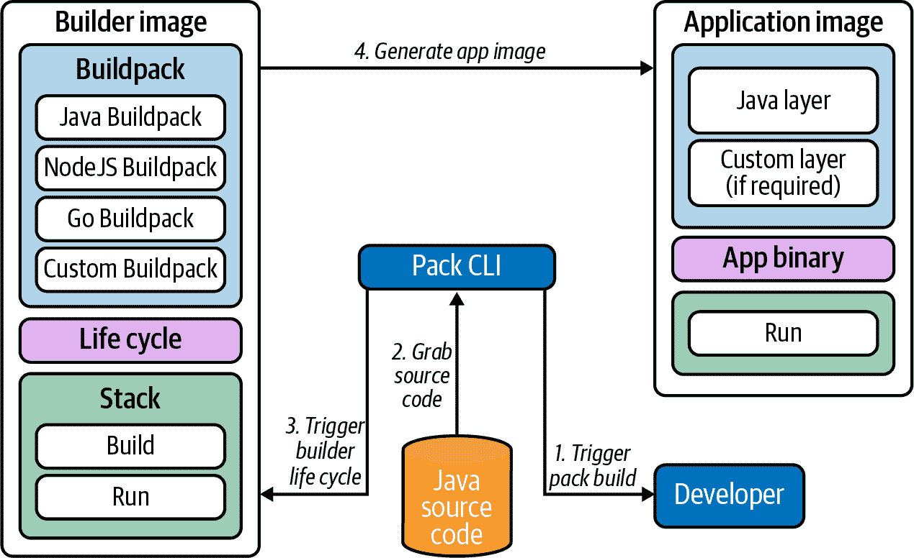
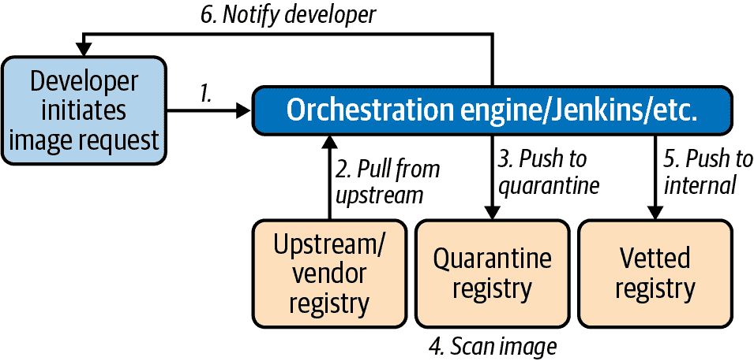
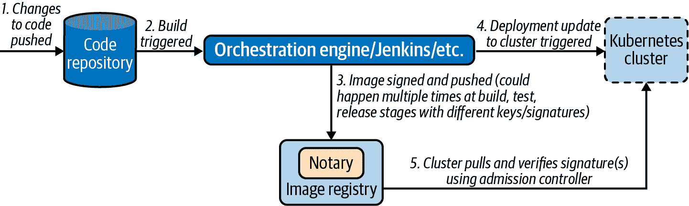
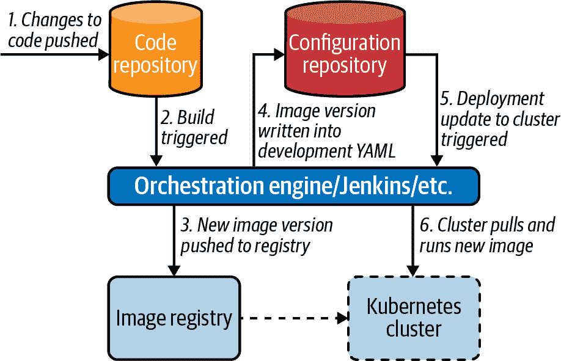
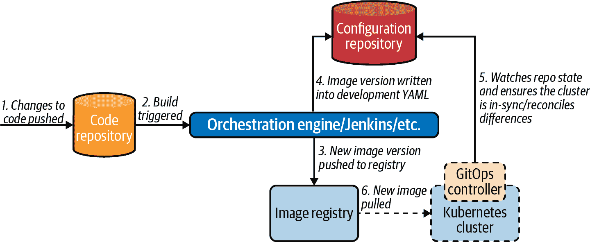

# 第十五章：软件供应链

实施 Kubernetes 平台绝不应该是你团队或公司的目标（假设你不是供应商或顾问！）。对于一个完全致力于 Kubernetes 的书籍来说，这可能听起来是一个奇怪的说法，但让我们稍作停顿。所有公司都是为了提供他们的*核心竞争力*而存在。这可能是电子商务平台、SaaS 监控系统，或者是一个保险网站。像 Kubernetes 这样的平台（以及几乎任何其他工具）存在的目的是*促进*核心业务价值的交付，这一点在设计和实施 IT 解决方案时经常被团队忽视。

怀着这样的情感，本章将专注于在 Kubernetes 上将代码从开发者手中推送到生产环境的实际过程。为了最好地覆盖我们认为相关的每个阶段，我们将遵循许多人熟悉的管道模型。

首先，我们将讨论构建容器镜像（我们部署的资产）时的一些考虑因素。如果您已经在使用 Kubernetes 或其他容器平台，您可能已经熟悉本节中的一些概念，但希望我们能涵盖一些您可能尚未考虑的问题。如果您*对容器是新手*，那么这将是一个从您当前构建软件的方式（WAR 文件、Go 二进制文件等）到考虑容器镜像及其构建和维护细微差别的范式转变。

一旦我们构建好我们的资产，我们就需要一个地方来存储它们。我们将讨论容器注册表（例如 DockerHub、Harbor、Quay）及其在选择时认为重要的功能。容器注册表的许多属性与安全性相关，我们将讨论像图像扫描、更新和签名等选项。

最后，我们将花一些时间来审查持续交付，并了解这些实践及其相关工具如何与 Kubernetes 交集。我们将探讨一些新兴的想法，如 GitOps（通过同步集群状态从 git 仓库进行部署），以及更传统的命令式流水线方法。

即使您尚未运行 Kubernetes，您可能已经考虑过并/或解决了所有上述高层次领域（构建、资产存储、部署）。每个人都有现有工具和方法的投资和专业知识，我们很少遇到组织希望从头开始全新构建其整个软件供应链的情况。本章我们将尝试强调的一点是，在管道中存在清晰的交接点，我们可以为每个阶段选择最有效的方法。就像本书涵盖的许多主题一样，完全有可能（也是建议）在保持专注于提供业务价值的同时，实施*渐进的*正向变革。

# 构建容器镜像

在容器之前，我们会将应用程序打包为二进制、压缩资产或原始源代码，以便部署到服务器上。这些应用程序可以独立运行或嵌入到应用服务器中。除了应用程序本身外，我们还需要确保环境包含了正确的依赖项和配置，以便在目标环境中成功运行。

在基于容器的环境中，容器镜像是可部署的资产。它不仅包含应用程序二进制本身，还包括执行环境和所有相关的依赖项。镜像本身是一组压缩的“文件系统层”，以及一些元数据，这些层共同遵循开放容器倡议（OCI）镜像规范。这是云原生社区内的一种约定标准，旨在确保可以以多种不同方式实现镜像构建（我们将在接下来的章节中看到一些方式），同时生成的构件可以被所有不同的容器运行时运行（更多关于此的信息可以在第三章找到）。

典型情况下，构建容器镜像涉及创建描述镜像的 Dockerfile，并使用 Docker 引擎执行 Dockerfile。话虽如此，在不同场景下，有一系列工具生态系统（每个都有其独特的方法），可以用来创建容器镜像。借用 BuildKit（Docker 构建的一个工具）的一个概念，我们可以从“前端”和“后端”角度来思考构建。其中，“前端”是定义应该用来构建镜像的高层过程的方法，例如 Dockerfile 或 Buildpack（本章后面会详细介绍）。而“后端”则是实际的构建引擎，它接受由“前端”生成的定义，并在文件系统上执行命令以构建镜像。

在许多情况下，“后端”是 Docker 守护程序，但这并非所有情况都适用。例如，如果我们想要在 Kubernetes 中运行构建，我们需要在容器内部运行 Docker 守护程序（Docker in Docker），或者将 Docker Unix 套接字从主机机器挂载到构建容器中。这两种方法都有缺点，尤其是后者可能会存在安全问题。为了应对这些问题，出现了其他构建后端，如 Kaniko。Kaniko 使用相同的“前端”（Dockerfile），但在内部使用不同的技术来创建镜像，使其成为在 Kubernetes Pod 中运行的可靠选择。在决定如何构建镜像时，您应该回答以下问题：

+   我们能否以 root 用户身份运行构建器？

+   我们是否可以接受挂载 Docker 套接字？

+   我们是否关心运行守护程序？

+   我们是否希望将构建容器化？

+   我们是否希望在 Kubernetes 的工作负载中运行它们？

+   我们打算如何充分利用层缓存？

+   我们的工具选择将如何影响分发构建？

+   我们想要使用什么*前端*或镜像定义机制？支持什么？

在本节中，我们首先会涵盖构建容器镜像（云原生构建包）时遇到的一些模式和反模式，希望这些内容能帮助您在构建更好的容器镜像的道路上更进一步。然后，我们将审查另一种构建容器镜像的替代方法，以及如何将所有这些技术集成到流水线中。

组织早期经常遇到的一个问题是，谁应该负责构建镜像？在 Docker 变得流行之初，它主要被作为一个面向开发者的工具。根据我们的经验，规模较小的组织仍然让开发人员负责编写 Dockerfile 并定义其应用镜像的构建过程。然而，随着组织试图大规模采用容器（和 Kubernetes），让个别开发者或开发团队各自创建自己的 Dockerfile 变得不可持续。首先，这给开发者带来额外的工作，使他们远离其核心责任；其次，导致生成的镜像差异巨大，几乎没有标准化。

因此，我们看到一种趋势是将构建过程从开发团队中抽象出来，转移责任给运维和平台团队来实现*源到镜像*的模式和工具化，这些工具接收代码仓库作为输入，并能够生成准备通过流水线的容器镜像。我们将在“云原生构建包”中更详细地讨论这种模式。与此同时，我们通常看到平台团队开展研讨会或协助开发团队使用 Dockerfile 和镜像创建。随着组织规模的扩展，这可能是一个有效的第一步，但通常不可持续，因为开发团队与平台人员的比例不匹配。

## 金基础镜像反模式

在现场工作中，我们遇到了几种反模式，这些反模式通常是团队没有调整思维方式，不能接纳在容器和云原生领域中出现的模式所导致的。其中可能最常见的是预定的*金*镜像的概念。场景是，在预容器环境中，特定的基础镜像（例如预配置的 CentOS 基础镜像）会被批准在组织内使用，并且所有进入生产的应用程序都必须基于该镜像。这种方法通常是出于*安全*原因，因为镜像中的工具和库已经经过了充分的审查。然而，当转向容器时，团队发现自己被限制在重新发明轮子中，从第三方和供应商那里拉取有用的上游镜像，并将其重新基于自己的应用程序和配置。

这引入了一些相关问题。首先，需要额外的工作将上游镜像转换为内部定制版本。其次，现在内部平台团队有责任存储和维护这些内部镜像。由于这种情况可能会扩展（考虑到在典型环境中使用的镜像数量），这种方法通常会导致*更糟糕*的安全姿态，因为更新频率较低（如果有的话），这是由于额外的工作所致。

我们在这一领域的建议通常是与安全团队合作，并确定金镜像服务的具体要求。通常会适用以下几点：

+   确保特定的代理程序/软件已安装

+   确保不存在可疑的库

+   确保用户帐户具有正确的权限

通过理解限制背后的原因，我们可以将这些要求编码为工具，这些工具将在流水线中运行，拒绝或警报非符合的镜像，并保持期望的安全姿态，同时广泛允许团队重复使用来自上游社区的镜像（及其背后的工作）。我们将更深入地研究一个示例工作流程，详见“镜像注册表”。

指定基础操作系统的一个更有说服力的原因之一是确保组织中存在操作知识以便在需要时进行故障排除。然而，深入挖掘后，这并不像看起来那么有用。很少需要`exec`到容器中以排查特定问题，即使需要，Linux-based 操作系统之间的差异对所需的支持类型来说也是相当微不足道的。此外，越来越多的应用程序被打包成超轻量级的 scratch 或 distroless 镜像，以减少容器内的开销。

应避免尝试将所有*上游*/供应商镜像重构为自己的基础镜像，原因见本节描述。但我们并不断言维护一组内部精选的基础镜像是一个坏主意。这些镜像可以作为构建自己应用的基础，并且我们将在下一节讨论构建这些内部基础时的一些考虑因素。

## 选择基础镜像

容器的基础镜像决定了应用容器镜像要构建在哪些底层。基础镜像至关重要，因为它通常包含操作系统的库和工具，这些将成为你的应用容器镜像的一部分。如果在选择基础镜像时不慎，它可能会包含不必要的库和工具，这不仅会使容器镜像变得臃肿，还可能成为安全漏洞的来源。

根据您的组织成熟度和安全态势，可能在选择基础镜像时无法自由选择。我们与许多有责任策划和维护一组批准的基础镜像的专门团队合作过。话虽如此，如果您有选择权或是审核基础镜像团队的一部分，考虑以下指导原则会很有帮助：

+   确保镜像由信誉良好的供应商发布。您不希望使用来自随机 DockerHub 用户的基础镜像。毕竟，这些镜像将是大多数甚至所有应用程序的基础。

+   了解更新周期，优先选择持续更新的镜像。如前所述，基础镜像通常包含需要在发现新漏洞时进行修补的库和工具。

+   优先选择具有开源构建过程或规范的镜像。通常这是一个 Dockerfile，您可以检查以了解镜像的构建方式。

+   避免使用带有不必要工具或库的镜像。优先选择提供小型基础的最小镜像，以便开发者在需要时进行构建。

大多数情况下，如果您正在构建自己的镜像，我们建议使用 scratch 或 distroless 作为一个坚实的选择，因为它们体现了前述原则。scratch 镜像绝对不包含任何内容，因此对于简单的静态二进制来说，scratch 可能是最精简的镜像。但是，如果您需要根 CA 证书或其他资产，则需要将其复制进去，这是需要考虑的问题。distroless 基础镜像在大多数情况下是我们推荐的，因为它们预先创建了一些合理的用户（如 `nonroot`、`nobody` 等）和一组基础库，具体取决于所选的基础镜像的类型。distroless 还有几种特定语言的基础变体供您选择。

在接下来的几节中，我们将继续讨论最佳实践模式，首先要重视为应用程序指定适当的用户身份。

## 运行时用户

由于容器隔离模型（主要是容器共享底层 Linux 内核），容器的运行时用户具有一些开发者未考虑到的重要影响。在大多数情况下，如果未指定容器的运行时用户，进程将以 root 用户身份运行。这是有问题的，因为它增加了容器的攻击面。例如，如果攻击者成功攻击应用程序并逃离容器，他们可能会在底层主机上获得 root 访问权限。

在构建容器映像时，考虑容器的运行时用户非常关键。应用程序是否需要以 root 用户身份运行？应用程序是否依赖于*/etc/passwd*文件的内容？您是否需要向容器映像添加非 root 用户？在回答这些问题时，请确保在容器映像的配置中指定运行时用户。如果您使用 Dockerfile 来构建映像，您可以使用`USER`指令来指定运行时用户，例如下面的示例，该示例使用`nonroot`用户和组 ID（默认作为 distroless 镜像集的一部分配置）来运行`my-app`二进制文件：

```
FROM gcr.io/distroless/base
USER nonroot:nonroot
COPY ./my-app /my-app
CMD ["./my-app", "serve"]
```

尽管您可以在 Kubernetes 部署清单中指定运行时用户，但将其定义为容器映像规范的一部分非常有价值，因为这会导致生成自我记录的容器映像。这还确保开发人员在其本地或开发环境中与容器一起工作时使用相同的用户和组 ID。

## 固定包版本

如果您的应用程序利用外部包，您很可能会使用`apt`、`yum`或`apk`等包管理器安装它们。在构建容器映像时，重要的是要固定或指定这些包的版本。例如，以下示例显示了一个依赖于 imagemagick 的应用程序。Dockerfile 中的`apk`指令将 imagemagick 固定为与应用程序兼容的版本：

```
FROM alpine:3.12
<...snip...>
RUN ["apk", "add", "imagemagick=7.0.10.25-r0"]
<...snip...>
```

如果您未指定包版本，可能会获取不同的包，这可能会破坏您的应用程序。因此，在容器映像中安装包时，请始终指定包的版本。这样做可以确保您的容器映像生成是可重复的，并且生成具有兼容包版本的容器映像。

## 构建映像与运行时映像

除了打包应用程序以供部署外，开发团队还可以利用容器来构建其应用程序。容器可以提供一个明确定义的构建环境，可以编码到 Dockerfile 中，例如。这对开发人员很有用，因为他们不需要在其系统中安装构建工具。更重要的是，容器可以在整个开发团队及其持续集成（CI）系统中提供标准化的构建环境。

使用容器构建应用程序虽然很有用，但重要的是要区分构建容器映像和运行时映像。构建映像包含编译应用程序所需的所有工具和库，而运行时映像包含要部署的应用程序。例如，在 Java 应用程序中，我们可能有一个构建映像，其中包含 JDK、Gradle/Maven 以及所有的编译和测试工具。然后我们的运行时映像可以仅包含 Java 运行时和我们的应用程序。

鉴于应用程序通常在运行时不需要构建工具，运行时镜像不应包含这些工具。这将导致更轻量的容器镜像，分发更快，并具有更紧凑的攻击面。如果您使用 docker 构建镜像，可以利用其多阶段构建功能将构建与运行时镜像分开。以下代码段显示了一个用于 Go 应用程序的 Dockerfile。构建阶段使用`golang`镜像，其中包含 Go 工具链，而运行时阶段使用 scratch 基础镜像，并且只包含应用程序二进制文件：

```
# Build stage
FROM golang:1.12.7 as build 

WORKDIR /my-app

COPY go.mod . 
RUN go mod download

COPY main.go .
ENV CGO_ENABLED=0
RUN go build -o my-app

# Deploy stage
FROM gcr.io/distroless/base 
USER nonroot:nonroot 
COPY --from=build --chown=nonroot:nonroot /my-app/my-app /my-app 
CMD ["/my-app"]
```


主要的`golang`镜像包含所有的 Go 构建工具，在运行时不需要。


我们首先复制*go.mod*文件并下载，以便在代码更改但依赖项不变时可以缓存此步骤。


我们可以使用`distroless`作为运行时镜像，以便利用最小化的基础镜像，但不包含不必要的额外依赖。


如果可能，我们希望以非 root 用户身份运行我们的应用程序。


只有编译后的文件（*my-app*）从构建阶段复制到部署阶段。

###### 注

容器运行单个进程，通常没有监控程序或初始化系统。因此，您需要确保信号被正确处理，并且孤立的进程被正确重新父化和收回。有几个最小化的初始化脚本可以满足这些要求，并作为应用程序实例的引导程序。

## 云原生构建包

另一种构建容器镜像的方法涉及分析应用程序源代码的工具，并自动生成容器镜像。与特定于应用程序的构建工具类似，这种方法极大简化了开发者的体验，因为开发者不必创建和维护 Dockerfile。云原生构建包是这种方法的一个实现，其高级流程如图 15-1 所示。



###### 图 15-1\. 构建包流程。

Cloud Native Buildpacks（CNB）是 Buildpacks 的一种面向容器的实现，这是 Heroku 和 Cloud Foundry 多年来用来为这些平台打包应用程序的技术。在 CNB 的情况下，它将应用程序打包成 OCI 容器镜像，准备在 Kubernetes 上运行。为了构建镜像，CNB 分析应用程序源代码并相应地执行 buildpacks。例如，如果你的源代码中存在 Go 文件，则会执行 Go buildpack。类似地，如果 CNB 发现了 *pom.xml* 文件，则会执行 Maven（Java）buildpack。所有这些都是在幕后进行的，开发人员可以使用名为 `pack` 的 CLI 工具启动这个过程。这种方法的优点在于 buildpacks 的范围严格限定，这样可以构建遵循最佳实践的高质量镜像。

除了改善开发人员的体验和降低平台采用门槛外，平台团队还可以利用自定义 buildpacks 来强制执行政策、确保合规性，并标准化在其平台上运行的容器镜像。

总的来说，提供一个从源代码构建容器镜像的解决方案可能是一个值得尝试的努力。此外，我们发现，这种解决方案的价值随着组织规模的增长而增加。归根结底，开发团队希望专注于在应用程序中构建价值，而不是如何将其容器化。

# 镜像注册表

如果您已经在使用容器，那么您可能有一个偏好的注册表。这是利用 Docker 和 Kubernetes 的核心要求之一，因为我们需要一个地方来存储在一台机器上构建的镜像，并希望在许多其他机器上运行（无论是独立还是在集群中）。与镜像类似，OCI 也定义了注册表操作的标准规范（以确保互操作性），并且有许多专有和开源的解决方案可用，其中大多数共享一组共同的核心功能。大多数镜像注册表由三个主要组件组成：服务器（用于用户界面和 API 逻辑）、blob 存储（用于镜像本身）和数据库（用于用户和镜像元数据）。通常情况下，存储后端是可配置的，这可能会影响您设计注册表架构的方式。我们稍后会详细讨论这一点。

在本节中，我们将看看注册表提供的一些最重要的特性以及将它们集成到您的流水线中的一些模式。我们不会深入研究任何*特定*的注册表实现，因为功能通常是相似的；然而，根据您现有的设置或要求，可能有些场景您可能希望朝某个方向倾斜。

如果您已经利用像 Artifactory 或 Nexus 这样的构件存储库，您可能希望利用它们的镜像托管能力来方便管理。同样，如果您的环境大量依赖云服务，使用像 AWS Elastic Container Registry（ECR）、Google Container Registry（GCR）或 Azure Container Registry（ACR）这样的云提供商注册表可能会带来成本效益。

在选择注册表时另一个关键因素是您的环境和集群的拓扑结构、架构和故障域。您可以选择在每个故障域放置注册表以确保高可用性。在这样做时，您需要决定是否希望使用集中的 blob 存储，还是希望在每个区域设置 blob 存储并在注册表之间设置镜像复制。镜像复制是大多数注册表的功能之一，允许您将镜像推送到一组注册表中的一个并自动将该镜像推送到该组中的其他注册表。即使您选择的注册表不直接支持此功能，使用流水线工具（例如 Jenkins）和在每次镜像推送时触发的 Webhook，设置基本的复制也是相当简单的。

在选择单个注册表与多个注册表时，也受到您需要支持多少吞吐量的影响。在每次代码提交时触发代码和镜像构建的数千名开发人员组织中，同时进行的操作（拉取和推送）数量可能相当可观。因此，重要的是要理解，尽管镜像注册表在管道中只起到有限作用，但它不仅在生产部署中，而且在开发活动中都是关键路径的一部分。它是必须像其他关键组件一样进行监控和维护，以实现高水平的服务可用性。

许多注册表的构建旨在轻松在集群或容器化环境中运行。这种方法（我们将在“持续交付”中再次讨论）具有许多优点。主要优势在于，我们能够利用 Kubernetes 内的所有基元和约定来保持服务运行、可发现和易配置。这里的明显缺点是，现在我们依赖集群内部的一个服务来提供镜像以启动该集群内的新服务。更常见的是看到注册表在共享服务集群上运行，并具有故障转移系统以备份集群，以确保始终有一个注册表实例能够提供服务请求。

我们通常也会看到在 Kubernetes 之外运行的*注册表*，作为一个更独立的*引导*组件，所有集群都需要它。这通常是组织已经在使用现有的 Artifactory 或另一个注册表实例，并重新用于镜像托管的情况。在这里，使用云注册表也是一种常见模式，尽管您还需要注意它们的可用性保证（因为同样的拓扑问题也适用）和可能的额外延迟。

在接下来的小节中，我们将讨论选择和使用注册表时的一些最常见关注点。这些关注点都与安全有关，因为保护我们的软件供应链围绕着我们部署的构件（镜像）展开。首先，我们将讨论漏洞扫描以及如何确保我们的镜像不包含已知的安全缺陷。然后，我们将描述一种常用的隔离流程，可以有效地将外部/供应商镜像引入我们的环境。最后，我们将讨论镜像的信任和签名。这是许多组织感兴趣的一个领域，但上游的工具和方法仍在成熟中。

## 漏洞扫描

扫描已知漏洞是大多数镜像注册表的一个关键能力。通常，扫描本身以及常见漏洞和曝光（CVE）数据库被委托给第三方组件。Clair 是一个流行的开源选择，在许多情况下，它是可插拔的，如果您有特定的需求的话。

每个组织对于在考虑 CVE 评分时什么构成可接受风险都有自己的要求。注册表通常会公开控制功能，允许您禁用拉取包含超过定义分数阈值的 CVE 的镜像。此外，将 CVE 添加到允许列表的能力对于绕过在您的环境中标记但不相关的问题，或者对于被视为可接受风险和/或没有发布和可用修复的 CVE 非常有用。

初始拉取时的静态扫描可以作为起点，但是如果在已经使用的环境中随着时间的推移发现了漏洞，会发生什么？可以定期安排扫描以检测这些变化，但接下来我们需要制定更新和替换镜像的计划。自动进行修复（修补）并推送更新镜像可能是诱人的选择，也有解决方案始终尝试保持镜像更新。然而，这可能会带来问题，因为镜像更新可能会引入不兼容的更改，甚至破坏正在运行的应用程序。这些自动化镜像更新系统可能也会超出您指定的部署变更流程，并且在环境中可能难以审计。即使是阻塞镜像拉取（前面描述过的）也可能会引起问题。如果核心应用程序的镜像发现了新的 CVE 并且突然禁止拉取，这可能会导致应用程序的可用性问题，特别是如果这些工作负载被调度到新节点并且镜像无法拉取。正如我们在本书中多次讨论过的那样，在实施每种解决方案时（在本例中是安全性与可用性之间），理解遇到的权衡是至关重要的，并做出经过深思熟虑和充分记录的决策。

比起简短描述的自动修复模型，更常见的模型是对镜像漏洞扫描进行警报和/或监控，并将其提升给运维和安全团队。根据您选择的注册表提供的功能，警报实施方式可能会有所不同。某些注册表可以配置在扫描完成时触发 Webhook 调用，载荷包括受影响镜像和发现的 CVE 的详细信息。其他可能会公开一组可抓取的指标，其中包含镜像和 CVE 的详细信息，可以使用标准工具进行警报（详见第九章有关指标和警报工具的更多详细信息）。虽然这种方法需要更多的手动干预，但它允许您在环境中查看镜像的安全状态，并在何时以及如何进行修补方面具有更多控制权。

一旦我们获得了镜像的 CVE 信息，就可以根据漏洞的影响程度决定是否以及何时修补镜像。如果需要修补并更新镜像，我们可以通过常规部署流水线触发更新、测试和部署。这确保了我们具有完全的透明性和审计能力，并且所有这些变更都通过我们的常规流程进行。稍后在本章中我们将详细讨论 CI/CD 和部署模型。

虽然本小节介绍的静态镜像漏洞扫描是组织软件供应链中常见的一部分，但它只是容器安全策略中应该是*深层防御*战略的一层。镜像可能在部署后下载恶意内容，或者容器化应用程序可能在运行时被篡改/劫持。因此，实施某种形式的运行时扫描至关重要。在更简单的形式中，这可以采用对运行容器进行周期性文件系统扫描的形式，以确保不会在部署后引入易受攻击的二进制文件和/或库。然而，为了更强大的保护，有必要限制容器能够执行的*操作*和*行为*。这消除了 CVE 被发现和修补时可能发生的游戏，而是集中于容器化应用程序应具备的能力。运行时扫描是一个更大的主题，我们在这里没有足够的空间来全面覆盖，但您应该查看像[Falco](https://falco.org)和[Aqua Security 套件](https://github.com/aquasecurity)这样的工具。

## 隔离工作流程

正如提到的，大多数注册表提供了扫描已知漏洞并限制镜像拉取的机制。但是，在使用镜像之前可能还有其他要求必须满足。我们也遇到过开发人员无法直接从公共互联网拉取镜像，必须使用内部注册表的情况。这两种情况都可以通过使用具有隔离工作流管道的多注册表设置来解决，接下来我们会描述这一流程。

首先，我们可以为开发人员提供一个自助门户来请求镜像。像 ServiceNow 或 Jenkins 任务在这里都很合适，我们已经见过很多次了。聊天机器人也可以为开发人员提供更无缝的集成，并且越来越受欢迎。一旦请求镜像，它将自动拉取到一个*隔离*注册表，可以在镜像上运行检查，并且管道可以启动环境来拉取和验证镜像是否符合特定标准。

一旦检查通过，镜像可以被签名（这是可选的，请参阅“镜像签名”获取更多信息），并推送到已批准的注册表。开发人员也可以被通知（通过聊天机器人、或者更新的工单/任务等）镜像已被批准（或拒绝，并说明理由）。整个流程可以在图 15-2 中查看。



###### 图 15-2\. 隔离流程。

可以将此流程与准入控制器结合使用，以确保只允许签名的镜像或来自特定注册表的镜像在集群上运行。

## 镜像签名

随着应用程序越来越依赖于越来越多的外部依赖项（无论是代码库还是容器镜像），供应链安全问题变得更加普遍。

当讨论图像时经常提到的安全功能之一是签名的概念。简单来说，签名的概念是，图像发布者可以在将其推送到注册表之前，通过生成图像的哈希并将其与其身份关联起来进行加密签名。然后用户可以通过验证签名的哈希与发布者的公钥进行验证来验证图像的真实性。

这个工作流程很吸引人，因为它意味着我们可以在软件供应链的开始创建一个图像，并在每个管道阶段之后进行签名。也许我们可以在测试完成后签名，然后在通过发布管理团队批准部署后再次签名。然后在部署时，我们可以根据是否由我们指定的各方签名来控制将图像部署到生产环境中。我们不仅确保它已通过这些批准，而且确保它与现在推广到生产环境的相同图像。这个高级流程如图 Figure 15-3 所示。



###### 图 15-3\. 签名流程。

该领域的主要项目是 Notary，最初由 Docker 开发，建立在安全分发软件更新的框架 The Update Framework（TUF）之上。

尽管有其好处，由于几个原因，我们在现场并未看到图像签名的广泛采用。首先，Notary 包括服务器和多个数据库等多个组件。这些都是需要安装、配置和维护的额外组件。不仅如此，由于签名和验证图像通常是软件部署中的关键路径，因此 Notary 系统必须配置为高可用性和韧性。

其次，Notary 要求每个图像都使用全局唯一名称（GUN）进行标识，该名称包含注册表 URL 作为名称的一部分。如果您有多个注册表（例如缓存、边缘位置），这会使签名变得更加棘手，因为签名与注册表绑定，不能移动/复制。

最后，Notary 和 TUF 要求在签名过程中使用不同的密钥对。每个密钥具有不同的安全要求，并且在安全漏洞发生时更换密钥对可能具有挑战性。虽然它提供了学术上设计良好的解决方案，但当前的 Notary/TUF 实现对许多刚刚开始适应某些基础技术的组织来说是门槛太高了。因此，许多组织并未准备好为了签名工作流提供的额外安全性益处而交换更多的便利和知识。

在撰写本文时，正在进行开发和发布第二版 Notary 的工作。这个更新版本应该通过解决刚讨论的许多问题来改善用户体验，例如通过将 OCI 映像与签名捆绑在一起，从而减少密钥管理的复杂性和消除签名不可转移的约束。

已经有几个现有项目实施了准入 Webhook，将检查映像以确保它们在允许在 Kubernetes 集群中运行之前已经签名。一旦问题得到解决，我们预计签名将成为软件供应链中更经常实施的属性，而这些签名准入 Webhook 也将进一步成熟。

# 持续交付

在前面的章节中，我们详细讨论了将源代码转换为容器映像的过程。我们还研究了映像存储的位置以及在选择和部署映像注册表时需要做出的架构和过程决策。在最后这一节中，我们将转向检查将这些早期步骤与实际将映像部署到可能的多个 Kubernetes 集群（测试、预发布、生产）联系起来的整个流水线的审查。

在查看那些已经熟悉的命令驱动的管道之前，我们将覆盖如何将构建过程集成到自动化管道中。最后，我们将研究 GitOps 领域出现的一些原则和工具，这是一种相对较新的部署方法，利用版本控制存储库作为应部署到我们环境的资产的真实来源。

值得注意的是，持续交付是一个非常广阔的领域，也是许多书籍的唯一主题。在本节中，我们假设读者已经了解 CD 原则的一些知识，并且我们将专注于如何在 Kubernetes 和相关工具中实现这些原则。

## 将构建集成到管道中

对于本地开发和测试阶段，开发人员可以在本地使用 Docker 构建映像。然而，超出这些早期阶段之外，组织将希望在由提交代码到中央版本控制存储库触发的自动化管道的一部分中执行构建。我们将在本章后面讨论更多关于实际映像*部署*的高级模式，但在本节中，我们希望纯粹关注如何使用云原生流水线自动化工具在集群中运行构建阶段。

我们通常希望通过代码提交触发新的镜像构建。一些管道工具会间歇性地轮询一组配置的存储库，并在检测到更改时触发任务运行。在其他情况下，可能通过从版本控制系统中的 webhook 触发一个进程来启动。我们将使用 Tekton 的几个示例来说明本节中的一些概念，Tekton 是一个流行的开源管道工具，专为在 Kubernetes 上运行而设计。Tekton（以及许多其他本地于 Kubernetes 的工具）利用 CRD 来描述管道中的组件。在以下代码中，我们可以看到（经过大量编辑的）`Task` CRD 实例，可以在多个管道中重复使用。Tekton 维护一个常见操作的目录（例如在以下代码片段中显示的克隆 git 存储库），可以在您自己的管道中使用：

```
apiVersion: tekton.dev/v1beta1
kind: Task
metadata:
  name: git-clone
spec:
  workspaces:
    - name: output
      description: "The git repo will be cloned onto the \
      volume backing this workspace"
  params:
    - name: url
      description: git url to clone
      type: string
    - name: revision
      description: git revision to checkout (branch, tag, sha, ref…)
      type: string
      default: master
    <...snip...>
  results:
    - name: commit
      description: The precise commit SHA that was fetched by this Task
  steps:
    - name: clone
      image: "gcr.io/tekton-releases/github.com/tektoncd/\
      pipeline/cmd/git-init:v0.12.1"
      script: |
        CHECKOUT_DIR="$(workspaces.output.path)/$(params.subdirectory)"
        <...snip...>
        /ko-app/git-init \
          -url "$(params.url)" \
          -revision "$(params.revision)" \
          -refspec "$(params.refspec)" \
          -path "$CHECKOUT_DIR" \
          -sslVerify="$(params.sslVerify)" \
          -submodules="$(params.submodules)" \
          -depth "$(params.depth)"
        cd "$CHECKOUT_DIR"
        RESULT_SHA="$(git rev-parse HEAD | tr -d '\n')"
        EXIT_CODE="$?"
        if [ "$EXIT_CODE" != 0 ]
        then
          exit $EXIT_CODE
        fi
        # Make sure we don't add a trailing newline to the result!
        echo -n "$RESULT_SHA" > $(results.commit.path)
```

正如在前面的部分中提到的，有许多不同的构建 OCI 镜像的方法。其中一些需要 Dockerfile，而另一些则不需要。您可能还需要执行构建的其他操作。几乎所有管道工具都公开了阶段、步骤或任务的概念，允许用户配置可以链接在一起的离散功能块。以下代码片段显示了一个使用 Cloud Native Buildpacks 构建镜像的示例`Task`定义：

```
apiVersion: tekton.dev/v1beta1
kind: Task
metadata:
  name: buildpacks-phases
  labels:
    app.kubernetes.io/version: "0.1"
  annotations:
    tekton.dev/pipelines.minVersion: "0.12.1"
    tekton.dev/tags: image-build
    tekton.dev/displayName: "buildpacks-phases"
spec:
  params:
    - name: BUILDER_IMAGE
      description: "The image on which builds will run \
      (must include lifecycle and compatible buildpacks)."
    - name: PLATFORM_DIR
      description: The name of the platform directory.
      default: empty-dir
    - name: SOURCE_SUBPATH
      description: "A subpath within the `source` input \
      where the source to build is located."
      default: ""

  resources:
    outputs:
      - name: image
        type: image

  workspaces:
    - name: source

  steps:
    <...snip...>
    - name: build
      image: $(params.BUILDER_IMAGE)
      imagePullPolicy: Always
      command: ["/cnb/lifecycle/builder"]
      args:
        - "-app=$(workspaces.source.path)/$(params.SOURCE_SUBPATH)"
        - "-layers=/layers"
        - "-group=/layers/group.toml"
        - "-plan=/layers/plan.toml"
      volumeMounts:
        - name: layers-dir
          mountPath: /layers
        - name: $(params.PLATFORM_DIR)
          mountPath: /platform
        - name: empty-dir
          mountPath: /tekton/home
    <...snip...>
```

然后，我们可以将这个任务（及其他任务）与我们的输入存储库一起作为`Pipeline`的一部分进行绑定（此处未显示）。这涉及将我们之前克隆的 git 存储库的工作空间与我们的构建包构建器将用作源的工作空间进行映射。我们还可以指定在过程结束时将图像推送到注册表。

这种方法的灵活性（可配置的任务块）意味着管道成为在 Kubernetes 上定义构建流程的强大工具。我们可以向构建添加测试和/或检查阶段，或者某种静态代码分析。如果需要的话，我们还可以轻松地向我们的镜像添加签名步骤（如"镜像签名"中所述）。我们还可以定义自己的任务来运行其他构建工具，例如 Kaniko 或 BuildKit（如果不像本例中那样使用构建包）。

## 基于推送的部署

在前一节中，我们看到了如何在管道中自动化构建。在本节中，我们将看到如何将其扩展到实际执行部署到集群以及您希望实现的这些类型的自动交付管道中的一些模式。

由于我们之前看到的任务/步骤驱动方法的灵活性（几乎每个工具都有），在流水线末端创建一个步骤来读取新创建（并推送）图像的标签并更新部署变得微不足道。可以通过直接在集群中使用`kubectl set image`命令更新部署来实现这一点，并且一些文章/教程仍然展示了这种方法。一个更好的选择是让我们的流水线将图像标签的变化写回描述部署的 YAML 文件中，然后将此更改*提交到版本控制*中。然后我们可以触发`kubectl apply`命令来执行这一更改。后一种方法更可取，因为在这种情况下我们可以将我们的 YAML 文件视为集群的近似真实源（我们将在“GitOps”中进一步讨论这一点），但前者在迁移到这种基于 Kubernetes 的自动化流水线类型时是一个可以接受的迭代步骤。

在将应用程序部署到 Kubernetes 时，我们有两种不同类型的工件需要考虑：用于应用程序及其构建和部署的代码和配置，以及用于*构建*它的配置和*部署*它的配置。我们经常被要求权衡如何最好地组织这些工件，有些人喜欢将与应用程序相关的*所有东西*放在单个树中，而另一些人则喜欢将它们分开。

我们的建议通常是选择后者的路径，原因如下：

+   每个问题通常是组织中不同领域或团队的责任。开发人员应该了解其应用程序将如何部署，并对过程有所贡献，但围绕大小、环境、机密注入等的配置主要是平台或运维团队的责任。

+   代码存储库与包含部署流水线工件、机密和环境配置的存储库在安全权限和审计要求上可能有所不同。

一旦我们将部署配置放在一个单独的存储库中，就很容易理解部署流水线可能首先检出此存储库，然后运行图像标签的更新（使用`sed`或类似的工具），最后*将更改提交回 git*，以确保这是我们的真实源。然后我们可以在更改的清单上运行`kubectl apply -f`命令。这种命令式（或*推送驱动*）模型提供了很好的可审计性，因为我们可以利用版本控制系统提供的内置报告和日志记录功能，轻松查看更改如何通过我们的流水线流动，如图 15-4 所示。



###### 图 15-4\. 推送驱动的部署。

根据组织内部的自动化程度，您可能希望通过流水线处理环境之间的推广，甚至在不同的 Kubernetes 集群中执行部署。大多数工具都有实现这一目标的方法，有些工具对此的本地支持可能更好。然而，这是一个领域，其中命令式流水线模型在实施上可能更具挑战性，因为我们必须为每个希望用作目标的集群保持库存（和凭据）。

这种命令式方法的另一个挑战是，如果由于某种原因中断了流水线，我们需要确保重新启动或调解回健康状态。我们还需要在部署流水线上保持监控和警报（无论它们是如何实现的），以确保我们在出现部署问题时能够意识到。

## 部署模式

我们在上一节的结尾简要提到了监控流水线以确保其成功完成的需要。然而，在部署新版本的应用程序时，我们还需要一种方法来监控它们的健康状态，并决定是否需要解决问题或回滚到之前的工作状态。

组织可能希望实施的几种模式。有一些书籍专门讨论这些模式，但我们将在这里简要介绍它们，以展示如何在 Kubernetes 中实现它们：

金丝雀部署

金丝雀发布是指将应用程序的新版本部署到集群，并将小部分流量（基于元数据、用户或其他属性）指向新版本。可以密切监控此过程，以确保新版本（金丝雀）行为与先前版本相同，或至少不会导致错误场景。随着信心的增加，可以逐步增加流量的百分比。

蓝绿部署

这种方法类似于金丝雀部署，但涉及更大规模的流量切换。可以通过多个集群来实现（一个是旧版本，*蓝色*，另一个是新版本，*绿色*），也可以在同一个集群中实现。这里的想法是我们可以测试服务部署是否按预期工作，并在切换流量到新版本之前在非用户面向的环境中进行一些测试。如果我们看到错误率升高，我们可以减少流量。当然，这种方法还有一些微妙之处，因为你的应用程序可能需要优雅地处理状态、会话和其他问题。

A/B 测试

类似于金丝雀部署，我们可以推出一个应用程序的版本，该版本可能包含一些针对一部分消费者的不同行为。我们可以收集新版本的使用模式的指标和分析，以决定是回滚还是继续前进，或扩展实验。

这些模式使我们朝着能够将应用程序的*部署*与向消费者的*发布*解耦的期望状态前进，通过控制何时启用功能和/或新版本来减少在我们的环境中部署更改的风险。这些实践在减少部署变更风险方面非常有效。

大多数这些模式通过某种网络流量转移实现。在 Kubernetes 中，我们拥有一些非常丰富的网络原语和功能，使得这些模式的实现成为可能。一个开源工具，它在各种服务网格解决方案之上启用这些模式的是 Flagger。Flagger 作为 Kubernetes 集群中的一个控制器运行，并监视 Deployment 资源的 image 字段的更改。它通过以编程方式配置底层服务网格来适当地转移流量，公开了许多可调整的选项来启用前述模式。它还增加了监视新版本发布健康状况的能力，并在需要时继续或停止并回滚部署过程。

我们确实看到了深入研究 Flagger 和该领域其他解决方案的价值。然而，考虑到它们依赖的额外复杂性（大多数模式需要服务网格）和引入的复杂性，我们更常见地将这些方法作为组织 Kubernetes 旅程的第二或第三阶段来考虑。

## GitOps

到目前为止，我们已经看过如何将一个基于推送的部署阶段加入到您的 Kubernetes 交付流水线中。在部署领域出现的一个新兴替代模型是 GitOps。与向集群推出变更的命令式模型不同，GitOps 模型包括一个控制器，不断地将 git 仓库的内容与运行在集群中的资源进行协调，如图 15-5 所示。这个模型使其与 Kubernetes 本身提供的控制循环协调体验密切相关。GitOps 空间的两个主要工具是 ArgoCD 和 Flux，两个团队正在共同开发一个共同的引擎来支持他们各自的工具。



###### 图 15-5\. GitOps 流程。

这种模型有几个主要优点：

+   它是声明性的，因此部署本身的任何问题（例如工具崩溃等）或者随意删除部署将导致（尝试）协调到一个良好状态。

+   Git 成为我们的唯一真理源，我们可以利用现有的工具专业知识和熟悉度，除了默认获取更改的强大审计日志。我们可以使用拉取请求工作流作为我们集群更改的门控，并通过大多数版本控制系统提供的扩展点（Webhooks、工作流、Actions 等）根据需要集成外部工具。

然而，这种模型并非没有缺点。对于那些真正希望将 git 作为他们*唯一*的真相来源的组织来说，这意味着将秘密数据保存在版本控制中。在过去几年中，出现了几个项目来解决这个问题，其中最著名的是 Bitnami 的 Sealed Secrets。该项目允许将加密版本的 Secrets 提交到仓库，然后在应用到集群时解密（以便应用程序可以访问）。我们在第五章中详细讨论了这种方法。

我们还需要确保监控当前状态同步的健康情况。如果流水线是基于推送的并且失败了，我们将在流水线中看到一个失败。然而，由于 GitOps 方法是声明性的，我们需要确保如果观察到的状态（在集群中）和声明的状态（在 git 中）长时间保持分歧，我们会收到警报。

GitOps 的广泛采纳是我们在这个领域看到的一个趋势，尽管它显然是从传统的推送模型转变而来的范式转变。并非所有的应用程序都能直接以平面应用 YAML 资源的方式部署，可能需要在组织转向这种方法时最初构建一些顺序和一些脚本。

还要注意可能会创建、修改或删除资源的工具，在它们的生命周期中，有时需要进行一些调整以符合 GitOps 模型。一个例子是在集群中运行并监视特定 CRD，然后通过 Kubernetes API 直接创建多个其他资源的控制器。如果以*严格*模式运行，GitOps 工具可能会删除这些动态创建的资源，因为它们不在单一真实来源（git 仓库）中。当然，在大多数情况下，删除*未知*资源可能是可取的，并且这是 GitOps 的*积极*特性之一。然而，您绝对要注意可能会故意从 git 仓库之外引起变化的情况，这可能会破坏模型并需要解决。

# 总结

在本章中，我们讨论了将源代码放入容器并部署到 Kubernetes 集群的过程。您可能已经熟悉的许多阶段和原则（构建/测试、CI、CD 等）在容器/Kubernetes 环境中仍然适用，但使用的工具不同。同时，一些概念（如 GitOps）可能是新的，这些概念建立在 Kubernetes 自身的概念基础之上，以增强现有部署模式中的可靠性和安全性。

在这个领域有许多工具可以实现多种不同的流程和模式。然而，本章的关键要点之一应该是决定在组织中不同群体之间暴露这个流水线的各个部分的程度的重要性。也许开发团队已经参与了 Kubernetes，并且足够自信地编写构建和部署工件（或者至少有重要的输入）。或者可能希望将所有底层细节抽象化，以减轻开发团队的扩展和标准化问题，但这可能会增加平台团队在建立相关基础和自动化方面的负担。
