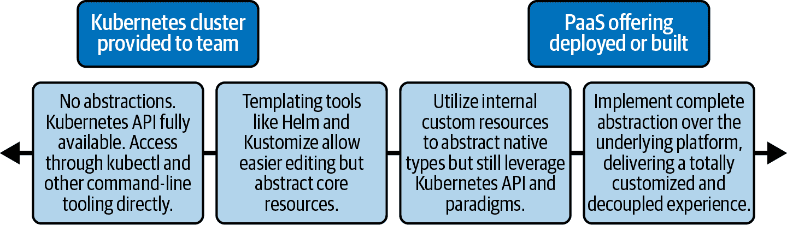

# 第十六章：平台抽象化

许多时候，我们看到组织采用“建好了，他们就会来”的方法来设计和构建 Kubernetes 平台。然而，这种哲学通常充满风险，因为它经常未能满足与平台互动的许多团队（如开发、信息安全、网络等）的关键需求，导致重新工作和额外的努力。重要的是要让其他团队跟上步伐，并确保所构建的平台符合预期。

在本章中，我们将探讨在设计其他团队（特别是开发人员）的 Kubernetes 平台的入门和使用体验时应考虑的一些角度。首先，我们将从一些更为哲学的角度来讨论问题，即开发人员应该了解多少关于 Kubernetes？然后，我们将讨论如何为开发人员构建一个平稳的入门通道，让他们开始部署到 Kubernetes 并自行部署集群。最后，我们将重新审视我们在第一章中提到的复杂度谱系，并看看我们可以采取的一些抽象层次。我们的目标是在向开发团队提供 Kubernetes 平台时，在复杂性和灵活性之间取得良好的平衡，这些团队对底层实现有不同程度的知识和期望参与。

本章的许多内容在本书的其他地方已经涵盖，我们会在适当的时候进行引用。在这里，我们的目标是从增加团队协作和构建一个能够满足组织中所有人需求的平台的具体立场来覆盖各个方面。尽管表面上这可能看起来是一个轻松的主题，但所讨论的问题往往是许多公司最难克服的障碍之一，可以决定 Kubernetes 应用平台的成功采用。

# 平台暴露

在本书中，我们多次谈到在设计和实施 Kubernetes 平台时评估个人需求的重要性，并在不同领域提出问题。一个主要问题将决定许多选择，即决定您希望开发团队对底层 Kubernetes 系统和资源有多少了解。有几个因素将影响这个决定。

Kubernetes 是一项相对较新的技术。在某些情况下，采用 Kubernetes 的推动力来自基础架构方面，旨在简化基础设施使用和提高效率，或者标准化工作负载。在其他情况下，推动力可能来自渴望实施能够容纳并加速他们开发和部署云原生应用的新技术的开发团队。无论推动力来自何方，都会影响到其他团队，不论是适应新范式、学习新工具，还是在与新平台互动时用户体验的改变。

在某些组织中，有一个强烈的要求，即开发团队不应接触底层平台。这一驱动因素是，开发人员应专注于提供业务价值，而不被正在开发的平台的实现细节所分心。这种方法确实有其价值，但根据我们的经验，我们并不总是完全同意。例如，开发人员至少需要了解一些基本平台的知识，才能有效地开发针对其的应用程序。这并不意味着增加应用程序与平台的耦合度，而是纯粹理解如何最大化平台的能力。第十四章 更详细地讨论了这种应用程序与平台关系。

要使“开发人员无需接触”的方法成功，平台团队必须具备足够的能力。首先，因为他们将完全负责维护和支持环境；其次，该团队还负责构建必要的抽象层，以便开发人员能够与平台无缝互动。这一点非常重要，即使开发人员没有直接接触 Kubernetes，他们仍然需要方法来分析应用程序的性能、调试问题和故障排除。如果给开发人员在集群中使用 `kubectl` 命令暴露了太多底层细节，那么就需要一个中间层，使开发人员能够在将应用程序推向生产环境的同时不被实现细节所淹没。在第九章 中，我们详细介绍了许多有效暴露调试工具给开发团队的主要方法。

在一些组织中，仅简化开发人员的故障排除体验可能是不够的。将应用程序部署到 Kubernetes 可能也很复杂，可能需要许多组件。也许一个应用程序需要一个 StatefulSet、PersistentVolumeClaim、Service 和 ConfigMap 才能成功部署。当不希望向开发人员暴露这些概念时，平台团队可能会更进一步，在这个领域创建抽象化。这可以通过自助服务管道或构建自定义资源来实现（这在第十一章中有详细介绍）。我们将在本章后面讨论这两种方法。

决定暴露平台多少的一个限制因素是创建抽象化的团队的技能和经验。例如，如果平台团队想要采用自定义资源路线，他们将需要一些开发技能和对 Kubernetes API 最佳实践的了解。如果他们没有这些，你可能会受限于可以构建的抽象化内容，并因此不得不向开发团队暴露更多平台内部的细节。

在接下来的部分中，我们将看到一些团队如何向开发人员（以及其他最终用户）提供自助服务模型，以便简化和标准化集群和应用程序的部署。

# 自助服务入职

在一个组织的 Kubernetes 旅程早期阶段，平台团队可能会负责为所有需要的团队提供集群的供应和配置。他们可能还至少负责帮助将应用程序部署到这些集群中。根据采用的租户模型（关于工作负载租户模型的更多信息，请参阅第十二章），在这个设置过程中会有不同的要求。在单租户模型中，集群的供应和配置可能会更加简单，具有一组通用权限、核心服务（日志记录、监控、入口等）和访问（例如单点登录）设置。然而，在多租户集群中，我们可能需要为每个团队和应用程序创建多个附加组件（例如命名空间、网络策略、配额等）来进行接入。

然而，随着组织的扩展，手动进行供应和配置已经不再可持续。这代表了平台团队的重复劳动，并阻碍了等待手动任务完成的开发团队。一旦达到一定的成熟水平，通常会看到团队开始向其内部用户提供某种形式的自助服务。通过现有的 CI/CD 工具或流程如 Jenkins 或 GitLab 提供这种服务是一种有效的方式。这两种工具都允许在执行时轻松创建管道，并提供额外定制输入的能力。

工具如`kubeadm`和 Cluster API 的成熟使得集群创建的自动化相对简单且一致。团队可以公开可调参数，如集群名称和大小，例如，流水线可以调用这些工具以使用合理的默认值为请求团队提供集群的凭证或访问权限。像许多其他事物一样，这种自动化可以根据您的选择变得非常复杂。我们已经看到的流水线可以根据请求用户的 LDAP 信息自动创建负载均衡器和 DNS，甚至可以使用相关成本中心自动标记底层基础设施。大小可以向用户开放，但根据团队、环境或项目的情况受到一定范围的限制。我们甚至可以根据应用程序的分类或安全配置选择在私有云还是公有云中进行提供。对于平台团队来说，有各种可能性来创建一个灵活而强大的自动化供给过程，以供开发团队使用。

对于多租户场景，我们不会创建集群，而是创建命名空间及其所有关联对象，以便为新应用程序提供软隔离环境。同样，我们可以使用类似的流水线方法，但这次允许开发团队选择他们的应用程序将部署到的集群（或集群）。在基本水平上，我们希望生成以下内容：

命名空间

应用程序所居住的地方，并为我们的其他组件提供逻辑隔离。

RBAC

确保只有适当授权的群组可以访问其应用程序命名空间中的资源。

网络策略

确保应用程序仅允许与自身或其他共享集群服务通信，但*不*与同一集群上的其他应用程序通信（如果需要）。

配额

限制一个命名空间或应用程序在集群中消耗的资源量，降低可能出现“吵闹邻居”情况的潜力。

限制范围

为命名空间中创建的特定对象设置合理的默认值。

Pod 安全策略

确保工作负载符合合理的默认安全设置，比如不以 root 用户身份运行。

虽然这些不是每种场景中都必需或必要的，但结合起来，它们使集群管理员和平台团队能够为新的开发团队创建无缝的入职体验和部署环境，而无需手动干预。

随着组织在使用和了解 Kubernetes 方面的成熟度，这些流水线可以以 Kubernetes 原生方式使用运算符实现。例如，我们可以定义一个`Team`资源，其结构如下：

```
apiVersion: examples.namespace-operator.io/v1
kind: Team
metadata:
  name: team-a
spec:
  owner: Alice
  resourceQuotas:
    pods: "50"
    storage: "300Gi"
```

在这个例子中，我们可能定义一个特定的`Team`，我们希望为其配置一个所有者（用户）和一些资源配额。我们在集群中的控制器将负责读取此对象，并创建相关的命名空间、RBAC 资源和配额，并将它们绑定在一起。这种方法非常强大，因为它允许我们与 Kubernetes API 紧密集成，并公开一种管理和协调资源的原生方式。例如，如果意外删除了一个角色或者修改了一个配额，控制器将能够自动修复情况。这些更高级别的资源类型（如`Team`或`Application`）也非常适合启动集群，只需添加几个团队对象和我们的控制器，就能自动化所有相关配置，准备好供使用。

我们肯定可以更深入地探索这个自动化设置。例如，让我们考虑一些可能需要为新应用程序配置的可观察性工具。也许我们的团队控制器可以为新团队或应用程序生成并提交定制的仪表板，并让 Grafana 自动重新加载它们。我们可能会为新团队或命名空间动态添加新的警报目标到 Alertmanager 中。我们可以在这些更简单、更用户友好的入职抽象背后创建非常强大的功能。

# 抽象谱系

在第一章中，我们介绍了*抽象谱系*的概念。在图 16-1 中，我们扩展了原始概念，并增加了一些具体的抽象层级。

在前面的章节中，我们讨论了一些可能影响您选择谱系位置的哲学决策和组织约束。在本节中，我们将详细介绍从左侧（无抽象）到右侧（完全抽象平台）的谱系，并在此过程中讨论一些选项和权衡。



###### 图 16-1\. 抽象谱系。

## 命令行工具

通过本地命令行工具暴露 Kubernetes API，我们处于谱系的最左端，没有任何抽象层级。在一些组织中，`kubectl`将是开发人员与 Kubernetes 交互的主要入口点。这可能是由于约束（平台团队的支持不足）或选择（熟悉并希望直接在 Kubernetes 上工作）。集群上可能仍然有一些自动化或防护措施，但开发人员将使用本地工具与其进行交互。

尽管您的开发团队*可能*对 Kubernetes 有一些了解，但这种方法也存在一些缺点：

+   需要设置和配置多个集群的认证方法可能会增加手动工作量。这包括在多个集群之间切换上下文，并确保用户始终定位到预期的集群。

+   `kubectl`命令的输出格式可能难以查看和处理。默认情况下，我们获得表格输出，但可以将其整理成不同的格式，并通过外部工具如`jq`进行管道传输，以更简洁地显示信息。但这需要开发人员了解`kubectl`的选项以及如何使用它们（还要了解外部工具）。

+   原始的`kubectl`向用户开放了 Kubernetes 的所有调整和控制选项，没有进行抽象化或中介。因此，我们不仅需要确保有适当的 RBAC 规则来限制未授权访问，还需要一个审核控制层来审查所有进入 API 服务器的请求。

各种工具可以增强这种体验。有许多`kubectl`插件可以在本地 shell 中提供更好的用户体验，比如`kubens`和`kubectx`，分别提供更好的命名空间和上下文可视性。还有一些插件可以聚合多个 Pod 的日志，或为应用程序健康提供终端用户界面。虽然这些工具不是高级工具，但它们可以消除常见问题点，避免开发人员必须了解底层实现细节的繁琐。

还有一些插件将与外部认证系统集成，简化认证流程，将 kubeconfig、证书、令牌等复杂性从用户身上抽象出来。这是一个我们经常看到的领域，原始工具得到了一些增强，因为使开发人员能够安全访问多个集群（特别是那些动态出现和消失的集群）是具有挑战性的。在非关键环境中，访问可能基于密钥对（必须生成、管理和分发），而在更稳定的环境中，访问可能与单点登录系统相关联。我们已经为几个客户开发了命令行实用程序，根据本地用户的登录凭据从中央集群注册表中提取凭据。

此外，你可以选择 Airbnb 的路线。在[最近的 QCon 演讲](https://oreil.ly/OxTSc)，Melanie Cebula 分享了 Airbnb 构建更高级工具集的方法，包括独立的二进制文件和`kubectl`插件，用于与其集群交互，连接到镜像构建、部署等方面。

开发人员的另一类工具是提供集群图形界面交互的额外类别。最近流行的选择包括[Octant](https://octant.dev)和[Lens](https://k8slens.dev)。与 Kubernetes 仪表板在集群中运行不同，这些工具在本地工作站上运行，并利用`kubeconfig`访问集群。对于那些希望看到集群及其应用程序的视觉表示的平台新手开发人员来说，这些工具可以是一个很好的入门工具。改善客户端体验是组织简化开发人员与 Kubernetes 交互的第一步。

## 通过模板化来抽象

将单个应用程序部署到 Kubernetes 可能需要创建多个 Kubernetes 对象。例如，一个*简单*的 Wordpress 应用可能需要以下内容：

Deployment

用于描述 Wordpress 实例的镜像、命令和属性。

StatefulSet

用于将 MySQL 部署为 Wordpress 的数据存储。

服务

用于为 Wordpress 和 MySQL 提供发现和负载平衡。

PVC

用于动态创建 Wordpress 数据的卷。

ConfigMaps

用于同时管理 Wordpress 和 MySQL 的配置。

Secrets

用于同时保存 Wordpress 和 MySQL 的管理凭据。

在这个列表中，我们有近 10 种不同的对象，都是为了支持一个非常小的应用程序。不仅如此，还需要配置它们的细微差别和专业知识。例如，使用 StatefulSet 时，我们需要创建一个特殊的*无头*服务来作为其前端。我们希望我们的开发人员能够将他们的应用程序部署到集群中，而*无需*知道如何自己创建和配置所有这些不同的 Kubernetes 对象类型。

在部署这些应用程序时，我们可以通过仅暴露一小部分输入并在后台生成其余的样板来简化用户体验。这种方法不需要开发人员了解所有对象中的所有字段，但仍然暴露了一些底层对象，并使用了比纯 kubectl 更高级别的工具。在这个领域具有一定成熟度的工具是像 Helm 和 Kustomize 这样的模板化工具。

### Helm

在过去几年中，Helm 已经成为 Kubernetes 生态系统中一个流行的工具。我们意识到它不仅仅是模板化，而且在我们的经验中，模板化用例（接着是编辑和应用清单）比其生命周期管理功能更为引人注目。

以下是 Wordpress Helm 图表的一个片段（描述应用程序的包），描述了一个服务：

```
ports:
  - name: http
    port: {{ .Values.service.port }}
    targetPort: http
```

这个模板并不直接暴露给开发人员，而是使用从其他地方注入或定义的值。在 Helm 的情况下，这些值可以通过命令行传递，或者更常见地通过一个 values 文件：

```
## Kubernetes configuration
## For minikube, set this to NodePort, elsewhere use LoadBalancer or ClusterIP
##
service:
  type: LoadBalancer
  ## HTTP Port
  ##
  port: 80
```

图表包含一个默认的*Values.yaml*文件，其中包含合理的设置，但开发人员可以提供一个覆盖文件，在其中仅修改他们需要的设置。这允许通过模板进行强大的定制，而无需深入了解。Helm 不仅仅是模板化值的功能，还包含基本逻辑操作的功能，允许通过值文件中的单个调整生成或修改底层模板中的大段内容。

例如，在刚才显示的示例值文件中，有一个声明`type: Loadbalancer`。这直接注入到模板的几个地方，但也负责通过条件语句和内置函数触发更复杂的模板化，如下面的代码片段所示：

```
spec:
  type: {{ .Values.service.type }}
  {{- if (or (eq .Values.service.type "LoadBalancer")
    (eq .Values.service.type "NodePort")) }}
  externalTrafficPolicy: {{ .Values.service.externalTrafficPolicy | quote }}
  {{- end }}
  {{- if (and (eq .Values.service.type "LoadBalancer")
    .Values.service.loadBalancerSourceRanges) }}
  loadBalancerSourceRanges:
  {{- with .Values.service.loadBalancerSourceRanges }}
{{ toYaml . | indent 4 }}
  {{- end }}
  {{- end }}
```

这种内联逻辑看起来可能很复杂，当然也有它的批评者。然而，复杂性是由图表的*创建者*拥有的，而不是最终用户开发团队。模板中复杂 YAML 结构的构建是从值文件中的单个`type`键开始的，这是开发人员修改配置的接口。可以在运行时指定值文件，因此可以为不同的集群、团队或环境使用不同的文件（带有不同的配置）。

使用 Helm 来配置和部署第三方和内部应用程序可以是抽象化开发人员一些底层平台的有效第一步，使他们能够更专注于他们真正需要的选项。然而，仍然存在一些缺点。接口（*Values.yaml*）仍然是 YAML，如果开发人员需要探索模板以理解更改的影响，可能会给用户带来不友好的体验（尽管良好的文档可以缓解这一点）。

对于那些希望更进一步的人来说，我们看到了开发的工具，可以将这些可调整项目抽象到用户界面中。这使得底层实现更加原生，但用户体验可以根据受众的需求进行定制。例如，可以将工作流集成到现有的部署工具（如 Jenkins）或者一个类似于票据服务的工具中，但底层的输出仍然可以是 Kubernetes 清单，然后应用于集群。虽然功能强大，但这些模型的维护可能变得复杂，并且抽象化最终可能会泄露到用户那里。

最近出现的对这种模型的有趣看法是由 [Ambassador Labs 的 K8s Initializer](https://app.getambassador.io/initializer) 实现的。使用基于浏览器的 UI 工作流程，用户被问及关于他们想要部署的服务类型和目标平台的多个问题。然后，该站点生成一个可下载的包，用户可以将其应用到集群并应用所有的定制。

所有的模板方法都有相同的优缺点。我们仍然处理应用于集群的 Kubernetes 原生对象。例如，当输出我们的 Helm 文件时，使用完成的值仍然暴露于服务、StatefulSets 等。这不是对平台的完全抽象，因此开发人员仍需要具有一定水平的底层知识。然而，另一方面，这也是这种方法的优势（无论是使用 Helm 还是来自 K8s Initializer 的更抽象方法）。如果上游的 Helm 图表或 Initializer 没有输出我们需要的内容，我们仍然可以在应用到集群之前完全灵活地修改结果。

### Kustomize

Kustomize 是一个灵活的工具，可以作为独立工具使用，也可以作为 `kubectl` 的一部分，用于对任何 Kubernetes YAML 对象中的字段进行任意的添加、删除和修改。它不是一个模板工具，但在由 Helm 模板化的一组清单上使用时非常有用，用于修改 Helm 本身没有暴露的字段。

基于前述原因，我们认为 Helm 作为一个模板工具，通过类似 Kustomize 的附加自定义进一步定制，是一个非常强大的抽象。这种方法位于抽象范围的中间某处，通常是组织的最佳选择。在接下来的部分中，我们将进一步向抽象范围的右侧移动，看看如何开始通过定制资源封装特定于每个组织/用例的底层对象。

## 抽象 Kubernetes 原语

正如本书中多次提到的那样，Kubernetes 提供了一组原始对象和 API 模式。结合使用这些，我们可以构建更高级的抽象和自定义资源，以捕捉那些没有内置的类型和想法。2019 年末，社交媒体公司 Pinterest 发布了一篇有趣的博文，描述了它如何创建 CRD（及其相关的控制器），将其内部工作负载建模为一种方式，将 Kubernetes 原生构建模块抽象出来，远离开发团队。Pinterest 总结了其采用这种方法的理由如下：

> 另一方面，Kubernetes 原生的工作负载模型，如部署、作业和守护进程集，不足以对我们自己的工作负载进行建模。可用性问题是采用 Kubernetes 的巨大障碍。例如，我们听到服务开发人员抱怨缺少或配置错误的 Ingress 会损坏其端点。我们还看到批处理作业用户使用模板工具生成数百个相同作业规范的副本，最终导致调试噩梦。
> 
> Lida Li、June Liu、Rodrigo Menezes、Suli Xu、Harry Zhang 和 Roberto Rodriguez Alcala；[“在 Pinterest 构建 Kubernetes 平台”](https://oreil.ly/Ovmgh)

在以下代码片段中，`PinterestService` 是 Pinterest 的自定义内部资源的一个示例。这个包含 25 行代码的对象会创建多个 Kubernetes 原生对象，如果直接创建的话，会超过 350 行代码：

```
apiVersion: pinterest.com/v1
kind: PinterestService
metadata:
  name: exampleservice
  project: exampleproject
  namespace: default
spec:
  iamrole: role1
  loadbalancer:
    port: 8080
  replicas: 3
  sidecarconfig:
    sidecar1:
      deps:
      - example.dep
    sidecar2:
      log_level: info
  template:
    spec:
      initcontainers:
      - name: init
        image: gcr.io/kuar-demo/kuard-amd64:1
      containers:
      - name: init
        image: gcr.io/kuar-demo/kuard-amd64:1
```

这是我们在前一节看到的模板化模型的延伸，其中只暴露给最终用户某些输入。然而，在这种情况下，我们可以构建一个在应用程序上下文中有意义的输入对象（而不是相对非结构化的 *Values.yaml* 文件），并且更容易被开发人员理解。虽然使用这种方法仍然可能发生泄漏的抽象，但由于平台团队（创建 CRDs/运算符）完全控制如何创建和修改基础资源，这种情况发生的可能性较小，而不必像 Helm 方法那样在现有对象的约束内工作。他们还可以通过通用编程语言（与 Helm 的内置函数不同）使用控制器来构建更复杂的逻辑。然而，正如我们之前讨论的那样，这需要平台团队现在具备编程专业知识。要深入了解创建平台服务和运算符，请参阅第十一章。

通过使用运算符，我们还可以调用外部 API，将更丰富的功能集成到我们的抽象对象类型中。例如，一个客户端有一个内部 DNS 系统，所有应用程序都需要在此系统中注册，以便正确工作并对外部客户端可见。以前的流程是开发人员访问 Web 门户，并手动添加他们服务的位置以及需要从分配的 DNS 名称转发的端口。我们有几个选项来增强开发人员的体验。

如果我们正在使用原生的 Kubernetes 对象（例如本例中的 Ingress），我们可以创建一个运算符，该运算符将读取应用的 Ingress 上的特殊注解，并自动将应用程序注册到 DNS 服务中。可能看起来像这样：

```
apiVersion: networking.k8s.io/v1
kind: Ingress
metadata:
  name: my-app
  annotations:
    company.ingress.required: true
spec:
  rules:
  - host: "my-app"
    http:
      paths:
      - path: /
        backend:
          service:
            name: my-app
            port:
              number: 8000
```

我们的控制器将读取 `company.ingress.required: true` 注解，并根据应用程序的名称、Namespace 或其他一些元数据来注册相应的 DNS 记录，还可能根据某些规则修改主机字段。虽然这减少了开发人员所需的大量手动工作（创建记录），但仍需要一些了解/创建 Kubernetes 对象（在这种情况下是 Ingress）。从这个角度来看，它更符合前一节描述的抽象级别。

另一个选项是使用像`PinterestService`这样的自定义资源。我们已经封装了所有我们需要的信息，并且可以通过我们的操作员创建 Ingress，以及配置像 DNS 系统这样的外部服务。我们没有泄露任何底层抽象到开发人员，并且在实现中具有完全的灵活性。

即使我们在本节讨论的自定义资源和操作员方法中，仍然向开发团队公开了平台的一些核心机制。我们需要指定有效的 Kubernetes 元数据、API 版本和资源类型。我们还暴露了 YAML（除非我们还提供管道、包装器或 UI 来构建它）及其相关的怪癖。在下一节（也是最后一节）中，我们将完全向右在我们的抽象光谱上移动，并讨论一些选项，允许开发人员直接从他们的应用程序代码到平台，甚至不需要了解 Kubernetes。

## 使 Kubernetes 不可见

在前面的部分中，我们已经在抽象的光谱上从左到右移动，从最不抽象的（原始`kubectl`访问）到最终完全抽象的平台。在本节中，我们将讨论一些情况和工具，在这些情况下开发人员甚至不知道他们在使用 Kubernetes，他们与平台的唯一接口（或多或少）是提交/推送代码，这使他们能够保持相对狭窄（和深入）的关注，而不暴露于平台细微差别。

类似 Heroku 这样的 SaaS 提供商和 Cloud Foundry 这样的工具在 10 多年前就推广了以开发人员为中心的*推送*体验。其概念是，一旦配置好工具（），将提供平台即服务（PaaS，现在是一个模糊的术语），其中包含所有必要的互补组件，以便应用程序能够正常运行（可观察性堆栈、某种形式的路由/流量管理、软件目录等），并且允许开发人员*简单地*将代码推送到源代码库。平台内的专门组件将设置适当的资源限制，根据需要提供环境以运行代码，并将标准 PaaS 组件组合在一起，以实现简化的最终用户体验。

您可能会认为这里与 Kubernetes 存在一些交叉点，它还为我们提供了一些原语来启用一些类似的功能。当最初构建 PaaS 平台时，Docker 和 Kubernetes 还不存在，更基本的容器化工作负载的普及非常有限。因此，这些工具是从头开始为基于虚拟机的环境而构建的。我们现在越来越多地看到这些工具（以及其他新工具）被移植或重写为 Kubernetes，正是因为我们早些时候确定的原因。Kubernetes 提供非常强大的机械基础、API 约定和原始原语，以*构建*这些基于它的更高级平台。

Kubernetes 经常被批评的一个观点是，它为环境引入了相当数量的额外复杂性，这对运维和开发团队来说都是一个挑战（除了还必须处理容器的范式转变）。然而，这种观点忽略了 Kubernetes 的一个主要目标，即作为一个构建平台的平台（正如联合创始人 Joe Beda 多次表达的）。复杂性总是会存在，但通过其架构决策和基本原理，Kubernetes 允许我们将复杂性抽象化给平台开发者、供应商和开源社区，让他们在 Kubernetes 之上构建无缝的开发和部署体验。

我们已经提到了 Cloud Foundry，这可能是最受欢迎和成功的开源 PaaS（现已移植到 Kubernetes），还有其他相当成熟的选择，如 Google App Engine（以及一些其他无服务器技术）和 RedHat OpenShift 的部分内容。除了这些，随着这个领域的成熟，我们看到了更多的平台出现。其中一个受欢迎的平台是[Backstage](https://backstage.io)，最初由 Spotify 创建。现在是一个 CNCF 沙盒项目，它是一个构建门户的平台，为开发人员提供定制的抽象，用于部署和管理应用程序。就在我们撰写本章的同时，HashiCorp（开发者多个云原生开源工具，如 Vault 和 Consul）刚刚宣布了 Project Waypoint，这是一个新工具，用于将最终用户与底层部署平台分离，并为开发团队提供高级抽象。在他们的宣布博客文章中，他们写道：

> 我们之所以创建 Waypoint，是因为开发人员只想部署。
> 
> Mitchell Hashimoto，[“宣布 HashiCorp Waypoint”](https://oreil.ly/ZhTJ4)

Waypoint 旨在封装软件开发的构建、部署和发布阶段。使用 Waypoint，开发人员仍然需要创建（或得到帮助创建）描述其过程的配置文件，类似于 Dockerfile，但以最简单的方式描述完整的阶段，仅征求必要的输入。这种配置文件的示例如下：

```
project = "example-nodejs"

app "example-nodejs" {
  labels = {
      "service" = "example-nodejs",
      "env" = "dev"
  }

  build {
    use "pack" {}
    registry {
        use "docker" {
          image = "example-nodejs"
          tag = "1"
          local = true
        }
    }
 }

  deploy {
    use "kubernetes" {
    probe_path = "/"
    }
  }

  release {
    use "kubernetes" {
    }
  }
}
```

注意，Waypoint 的方法仍然是将*一些*复杂性推给开发人员（编写此文件）；但是，他们已经将大量决策抽象化了。抽象化平台并不总是意味着所有复杂性从过程中消失，或者没有人需要学习新东西。相反，在这种情况下，我们可以在抽象的*正确层次*引入一个新的简化接口，达到速度和灵活性的最佳平衡点。在 Waypoint 的情况下，甚至可以在部署和发布阶段切换底层平台以使用像 Hashicorp 自己的 Nomad 或其他编排引擎。所有底层的细节和逻辑都被平台抽象化了。随着 Kubernetes 和其他平台的演变和变得更加稳定和*无趣*（有人会争论我们已经接近那里），真正的创新将继续在开发更高级平台的过程中，以更好地支持开发团队快速交付商业价值。

# 摘要

在本章中，我们讨论了平台团队可以向其用户（通常是开发团队）提供的不同抽象层，并介绍了用于实施这些层的常见工具和模式。也许比任何其他领域都多，这里是组织文化、历史、工具、技能集等都将影响您所选择的任何决策和权衡的地方，我们几乎与每一个客户在解决本章描述的问题时选择了略有不同的方式。

强调虽然我们经常宣扬开发团队不必过多关注底层部署平台的价值，但这并*不*意味着这总是正确的选择，或者开发人员不应该了解其应用程序运行的位置和方式。了解这些信息对于能够利用平台的特定功能或者调试软件问题至关重要。正如常言道，保持良好的平衡通常是最成功的前进方式。
