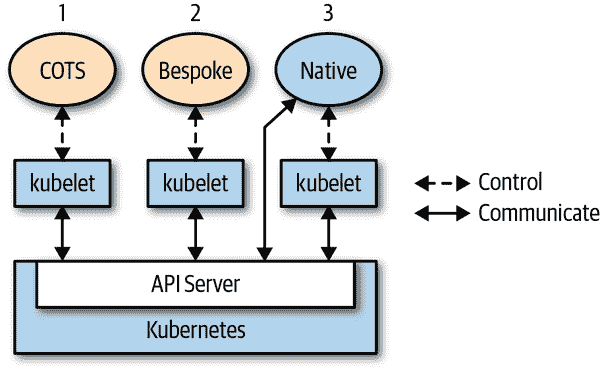
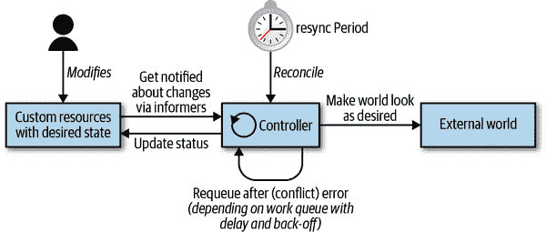
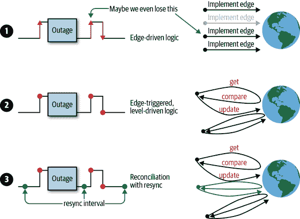
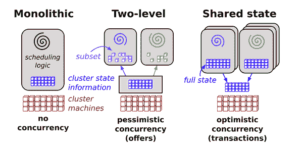
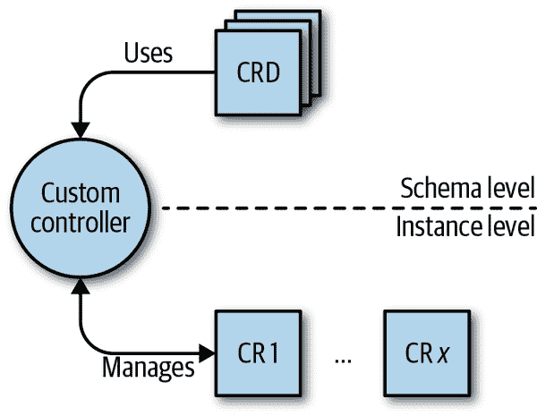
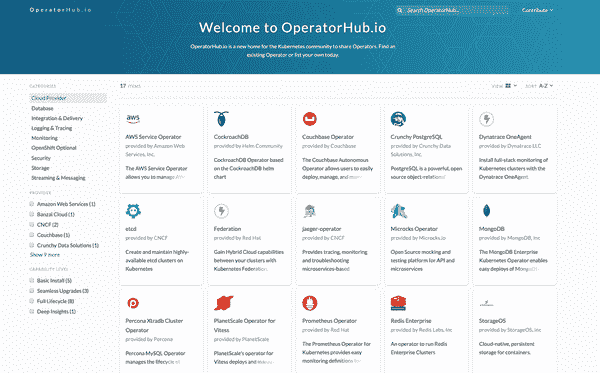

# 第一章：引言

对于不同的人，编程 Kubernetes 可能意味着不同的事情。在本章中，我们首先会确定本书的范围和重点。此外，我们将分享对我们操作环境的一组假设，以及您最好带来的东西，以便从本书中获益最大化。我们将定义编程 Kubernetes 的确切含义，Kubernetes 本地应用程序是什么，以及通过具体示例来了解它们的特征。我们将讨论控制器和操作员的基础知识，以及事件驱动的 Kubernetes 控制平面的工作原理。准备好了吗？让我们开始吧。

# 编程 Kubernetes 意味着什么？

我们假设您可以访问运行中的 Kubernetes 集群，如 Amazon EKS、Microsoft AKS、Google GKE 或 OpenShift 的某个提供方。

###### 小贴士

您将会在本地开发相当一段时间，即您开发的 Kubernetes 集群是本地的，而不是在云端或数据中心。在本地开发时，您有多种选择。根据您的操作系统和其他偏好，您可以选择以下一种（或多种）解决方案来本地运行 Kubernetes：[kind](https://kind.sigs.k8s.io)、[k3d](http://bit.ly/2Ja1LaH) 或 [Docker Desktop](https://dockr.ly/2PTJVLL).^(1)

我们还假设您是一位 Go 程序员，即您具有使用 Go 编程语言的经验或至少基本了解。如果您不符合以上任何假设，现在是一个很好的时机来进行培训：对于 Go 语言，我们推荐 [*The Go Programming Language*](https://www.gopl.io) 由 Alan A. A. Donovan 和 Brian W. Kernighan 撰写（Addison-Wesley），以及 [*Concurrency in Go*](http://bit.ly/2tdCt5j) 由 Katherine Cox-Buday 撰写（O’Reilly）。对于 Kubernetes，可以查阅以下一本或多本书籍：

+   [*Kubernetes 实战*](http://bit.ly/2Tb8Ydo) 由 Marko Lukša 撰写（Manning）

+   [*Kubernetes: Up and Running*，第 2 版](https://oreil.ly/2SaANU4) 由 Kelsey Hightower 等人撰写（O’Reilly）

+   [*使用 Kubernetes 进行云原生 DevOps*](https://oreil.ly/2BaE1iq) 由 John Arundel 和 Justin Domingus 撰写（O’Reilly）

+   [*管理 Kubernetes*](https://oreil.ly/2wtHcAm) 由 Brendan Burns 和 Craig Tracey 撰写（O’Reilly）

+   [*Kubernetes Cookbook*](http://bit.ly/2FTgJzk) 由 Sébastien Goasguen 和 Michael Hausenblas 撰写（O’Reilly）

###### 注意

为什么我们专注于使用 Go 编程 Kubernetes？好吧，这里可能有一个类比会有帮助：Unix 是用 C 编程语言编写的，如果您想为 Unix 编写应用程序或工具，您将默认使用 C。此外，即使您想使用其他语言来扩展和定制 Unix，您至少也需要能够阅读 C 语言。

现在，Kubernetes 和许多相关的云原生技术，从容器运行时到监控如 Prometheus，都是用 Go 编写的。我们相信大多数原生应用将会基于 Go，因此在本书中我们重点关注它。如果你更喜欢其他语言，请关注 [kubernetes-client](http://bit.ly/2xfSrfT) GitHub 组织。将来可能会包含你喜欢的编程语言的客户端。

在本书的上下文中，“编程 Kubernetes”指的是以下内容：你将要开发一个直接与 API 服务器交互的 Kubernetes 原生应用，查询资源的状态和/或更新它们的状态。我们不是指运行诸如 WordPress 或 Rocket Chat 或你最喜欢的企业 CRM 系统等现成的应用，通常称为 *商业可用现成的* (COTS) 应用。此外，在第七章中，我们并不真正关注操作问题，而主要关注开发和测试阶段。总之，本书关注的是开发真正的云原生应用。图 1-1 可能会帮助你更好地理解。



###### 图 1-1\. 在 Kubernetes 上运行的不同类型的应用

正如你所见，这里有不同的风格可供选择：

1.  将类似 Rocket Chat 的 COTS 应用运行在 Kubernetes 上。这种应用本身并不知道它运行在 Kubernetes 上，通常也不需要知道。Kubernetes 控制应用的生命周期 — 找到运行节点、拉取镜像、启动容器、执行健康检查、挂载卷等等 — 就是这样。

1.  拿一个定制的应用，比如你从头开始编写的东西，无论是否考虑将 Kubernetes 作为运行时环境，并在 Kubernetes 上运行它。与 COTS 的情况相同的操作方式适用。

1.  本书关注的案例是一个云原生或 Kubernetes 原生应用，它完全意识到自己正在 Kubernetes 上运行，并在一定程度上利用 Kubernetes 的 API 和资源。

你开发针对 Kubernetes API 的付出将会得到回报：一方面，你获得了可移植性，因为你的应用现在可以在任何环境中运行（从本地部署到任何公共云提供商），另一方面，你受益于 Kubernetes 提供的干净、声明式的机制。

现在我们转向一个具体的例子。

# 一个激励性的例子

要展示一个 Kubernetes 原生应用的强大，假设你想实现 `at` — 也就是在给定时间[安排命令的执行](http://bit.ly/2L4VqzU)。

我们称这个为 [`cnat`](http://bit.ly/2RpHhON) 或云原生 `at`，它的工作原理如下。假设你想在 2019 年 7 月 3 日凌晨 2 点执行命令 `echo "Kubernetes native rocks!"`。你可以用 `cnat` 来做到：

```
$ cat cnat-rocks-example.yaml
apiVersion: cnat.programming-kubernetes.info/v1alpha1
kind: At
metadata:
  name: cnrex
spec:
  schedule: "2019-07-03T02:00:00Z"
  containers:
  - name: shell
    image: centos:7
    command:
    - "bin/bash"
    - "-c"
    - echo "Kubernetes native rocks!"

$ kubectl apply -f cnat-rocks-example.yaml
cnat.programming-kubernetes.info/cnrex created
```

在幕后，涉及以下组件：

+   一个名为`cnat.programming-kubernetes.info/cnrex`的自定义资源，代表调度。

+   一个控制器，在正确的时间执行计划的命令。

此外，`kubectl` 的 CLI UX 插件将非常有用，允许通过命令如`kubectl at "02:00 Jul 3" echo "Kubernetes native rocks!"`进行简单处理。本书不会涉及此内容，但您可以参考[《Kubernetes 文档》的说明](http://bit.ly/2J1dPuN)。

在整本书中，我们将使用此示例来讨论 Kubernetes 的各个方面，其内部工作原理以及如何进行扩展。

对于第八章和第九章的更高级示例，我们将在集群中模拟一个比萨餐厅，其中包含比萨和配料对象。详细信息请参见“示例：比萨餐厅”。

# 扩展模式

Kubernetes 是一个功能强大且本质上可扩展的系统。通常，有多种方式可以自定义和/或扩展 Kubernetes：使用[配置文件和标志](http://bit.ly/2KteqbA)控制平面组件如`kubelet`或 Kubernetes API 服务器，并通过多个定义的扩展点：

+   所谓的[云提供商](http://bit.ly/2FpHInw)，传统上作为控制器管理器的一部分。从 1.11 版本开始，Kubernetes 通过提供一个[自定义 `cloud-controller-manager` 进程来支持云](http://bit.ly/2WWlcxk)，使得离线开发成为可能。云提供商允许使用特定于云提供商的工具，如负载均衡器或虚拟机（VM）。

+   二进制 `kubelet` 插件用于[网络](http://bit.ly/2L1tPzm)、[设备](http://bit.ly/2XthLgM)（如 GPU）、[存储](http://bit.ly/2x7Unaa) 和[容器运行时](http://bit.ly/2Zzh1Eq)。

+   二进制 `kubectl` 的[插件](http://bit.ly/2FmH7mu)。

+   在 API 服务器中访问扩展，例如使用[webhook 进行动态准入控制](http://bit.ly/2DwR2Y3)（参见第九章）。

+   自定义资源（参见第四章）和自定义控制器；请参阅下一节。

+   自定义 API 服务器（参见第八章）。

+   调度程序扩展，例如使用[webhook](http://bit.ly/2xcg4FL)来实现您自己的调度决策。

+   使用 webhook 进行[身份验证](http://bit.ly/2Oh6DPS)。

在本书的背景下，我们专注于自定义资源、控制器、webhook 和自定义 API 服务器，以及 Kubernetes 的[扩展模式](http://bit.ly/2L2SJ1C)。如果您对其他扩展点感兴趣，如存储或网络插件，请查阅[官方文档](http://bit.ly/2Y0L1J9)。

现在，您已经对 Kubernetes 扩展模式和本书的范围有了基本了解，让我们进入 Kubernetes 控制平面的核心部分，看看我们如何进行扩展。

# 控制器和操作员

在本节中，您将了解 Kubernetes 中控制器和运算符的工作原理。

根据 [Kubernetes 术语表](http://bit.ly/2IWGlxz)，*控制器* 实现了一个控制循环，通过 API 服务器监视集群的共享状态，并进行更改，试图将当前状态向期望状态移动。

在深入研究控制器的内部工作之前，让我们先定义术语：

+   控制器可以对核心资源（例如部署或服务）进行操作，这些资源通常是控制平面中的 [Kubernetes 控制器管理器](http://bit.ly/2WUAEVy) 的一部分，或者可以监视和操作用户定义的自定义资源。

+   运算符是编码了一些操作知识的控制器，例如应用程序生命周期管理，以及在 第四章 中定义的自定义资源。

自然地，考虑到后者的概念基于前者，我们将首先讨论控制器，然后再讨论运算符的更专业案例。

## 控制循环

通常，控制循环如下所示：

1.  首选事件驱动地读取资源状态（使用监视，如 第三章 中讨论的），详见 “事件” 和 “边缘驱动触发器与级别驱动触发器”。

1.  更改集群对象或集群外部世界的对象状态。例如，启动一个 pod，创建一个网络端点或查询云 API。详见 “更改集群对象或外部世界”。

1.  通过 API 服务器在 `etcd` 中更新资源状态的步骤 1。详见 “乐观并发性”。

1.  重复循环；返回到步骤 1。

无论您的控制器有多复杂或简单，这三个步骤——读取资源状态 ˃ 改变世界 ˃ 更新资源状态——始终保持不变。让我们深入了解 Kubernetes 控制器中这些步骤的实际实现。控制循环显示在 图 1-2 中，显示了典型的运行部件，控制器的主循环位于中间。这个主循环在控制器进程内持续运行。该进程通常在集群中的一个 pod 内运行。



###### 图 1-2\. Kubernetes 控制循环概述

从架构角度来看，控制器通常使用以下数据结构（在 第三章 中详细讨论）：

信息员

信息员以可扩展和可持续的方式监视资源的期望状态。它们还实现了重新同步机制（详见“信息员和缓存”），强制周期性协调，并经常用于确保集群状态和内存中缓存的假定状态不会偏离（例如由于错误或网络问题）。

工作队列

本质上，工作队列是一个组件，事件处理器可以使用它来处理状态变化的排队，并帮助实现重试。在`client-go`中，通过[*workqueue* package](http://bit.ly/2x7zyeK)（参见“Work Queue”）提供此功能。在更新世界或写入状态时（循环中的步骤 2 和 3），或仅因为我们必须因其他原因重新考虑资源时，资源可以重新排队。

想要更正式地讨论 Kubernetes 作为声明式引擎和状态转换的话题，请阅读[“Kubernetes 的机制”](http://bit.ly/2IV2lcb) by Andrew Chen and Dominik Tornow。

现在让我们更详细地了解控制循环，从 Kubernetes 事件驱动架构开始。

## 事件

Kubernetes 控制平面大量使用事件和松耦合组件的原则。其他分布式系统使用远程过程调用（RPC）来触发行为，但 Kubernetes 不是这样。Kubernetes 控制器监视 API 服务器中 Kubernetes 对象的更改：添加、更新和删除。当发生这样的事件时，控制器执行其业务逻辑。

例如，为了通过部署启动一个 pod，多个控制器和其他控制平面组件需要协同工作：

1.  部署控制器（位于`kube-controller-manager`内部）通过部署通知器（deployment informer）注意到用户创建了一个部署。它根据自身的业务逻辑创建一个副本集。

1.  副本集控制器（同样位于`kube-controller-manager`内部）通过副本集通知器注意到新的副本集，随后运行其业务逻辑，创建一个 pod 对象。

1.  调度器（位于`kube-scheduler`二进制文件内）——也是一个控制器——通过 pod 通知器注意到一个`spec.nodeName`字段为空的 pod。其业务逻辑将该 pod 放入调度队列。

1.  与此同时，另一个控制器`kubelet`通过其 pod 通知器注意到了新的 pod。但新 pod 的`spec.nodeName`字段为空，因此与`kubelet`的节点名称不匹配。它会忽略该 pod 并继续休眠（直到下一个事件）。

1.  调度器从工作队列中取出 pod，并根据具有足够空闲资源的节点更新 pod 的`spec.nodeName`字段，并将其写入 API 服务器。

1.  `kubelet`再次因 pod 更新事件而唤醒。它再次比较`spec.nodeName`与自身节点名称。名称匹配，因此`kubelet`启动 pod 的容器，并通过将此信息写入 pod 状态回写到 API 服务器来报告容器已启动。

1.  副本集控制器注意到更改的 pod，但没有任何操作。

1.  最终，pod 终止。`kubelet`将注意到这一点，从 API 服务器获取 pod 对象，并在 pod 的状态中设置“terminated”条件，然后将其写回 API 服务器。

1.  复制集控制器注意到已终止的 pod，并决定必须替换此 pod。它在 API 服务器上删除已终止的 pod 并创建一个新的 pod。

1.  等等。

正如您所见，许多独立的控制循环纯粹通过 API 服务器上的对象更改及这些更改触发的事件进行通信。

这些事件通过监视器（参见 “监视器”）从 API 服务器发送到控制器内的通知器，即监视事件的流连接。所有这些对用户而言大部分是不可见的。甚至 API 服务器审计机制也不会使这些事件可见；只有对象更新可见。但是，当控制器对事件作出反应时，通常会使用日志输出。

如果您想了解更多关于事件的信息，请阅读迈克尔·加斯希的博客文章 [“Kubernetes 的 DNA：事件”](http://bit.ly/2MZwbl6)，在这里他提供了更多背景和示例。

## 边缘驱动与级别驱动触发器

让我们稍微退后一步，更抽象地看待我们如何在控制器中实现业务逻辑的结构，以及为什么 Kubernetes 选择使用事件（即状态更改）来驱动其逻辑。

有两个原则选项可以检测状态变化（事件本身）：

边缘驱动触发器

在状态变化发生时刻，会触发一个处理程序，例如从无 pod 到 pod 运行。

级别驱动触发器

定期检查状态，并且如果满足某些条件（例如 pod 运行），则触发处理程序。

后者是轮询的一种形式。随着对象数量的增加，它的扩展性不佳，控制器注意到更改的延迟取决于轮询间隔和 API 服务器的响应速度。涉及许多异步控制器时，正如在 “事件” 中描述的那样，结果是系统需要很长时间来实现用户的需求。

前者选项在处理许多对象时效率更高。延迟主要取决于控制器处理事件的工作线程数。因此，Kubernetes 基于事件（即边缘驱动触发器）。

在 Kubernetes 控制平面中，许多组件更改 API 服务器上的对象，每次更改都会导致一个事件（即边缘）。我们称这些组件为*事件源*或*事件生产者*。另一方面，在控制器的上下文中，我们对消费事件感兴趣——也就是何时以及如何对事件（通过通知器）做出反应。

在分布式系统中，有许多并行运行的参与者，并且事件以任意顺序异步到来。当我们有一个有缺陷的控制器逻辑、略微错误的状态机或外部服务故障时，很容易丢失事件，意味着我们不能完全处理它们。因此，我们必须更深入地研究如何处理错误。

在 图 1-3 中，您可以看到不同的工作策略：

1.  边缘驱动逻辑的示例，可能会错过第二次状态变化。

1.  边缘触发逻辑的示例，在处理事件时总是获取最新状态（即级别）。换句话说，逻辑是边缘触发的，但是级别驱动。

1.  边缘触发、级别驱动逻辑的示例，附加重新同步。



###### 图 1-3\. 触发选项（边缘驱动 vs. 级别驱动）

策略 1 在处理丢失的事件时表现不佳，无论是因为网络故障导致丢失事件，还是因为控制器本身存在 bug 或某些外部云 API 失效。想象一下，复制集控制器仅在 pod 终止时才会替换 pods。丢失的事件意味着复制集将始终以更少的 pods 运行，因为它从不调和整个状态。

策略 2 在接收到另一个事件时从这些问题中恢复，因为它基于集群中的最新状态实现其逻辑。例如，在 replica set 控制器的情况下，它将始终将指定的复制数量与集群中运行的 pods 进行比较。当丢失事件时，它将在接收到下一个 pod 更新时替换所有丢失的 pods。

策略 3 增加了持续重新同步（例如，每五分钟一次）。如果没有 pod 事件发生，它至少每五分钟进行一次调和，即使应用程序运行非常稳定，也不会导致多个 pod 事件。

鉴于纯边缘驱动触发器的挑战，Kubernetes 控制器通常实现第三种策略。

如果你想了解触发器的起源以及在 Kubernetes 中使用调和级触发的动机，请阅读 James Bowes 的文章，《[Kubernetes 中的级触发和调和](http://bit.ly/2FmLLAW)》。

这结束了对检测外部变化和对其作出反应的不同抽象方式的讨论。控制循环中 图 1-2 的下一步是更改集群对象或按照规范更改外部世界。我们现在来看一下。

## 更改集群对象或外部世界

在此阶段，控制器更改其监督的对象的状态。例如，在 [控制器管理器](http://bit.ly/2WUAEVy) 中的 ReplicaSet 控制器正在监督 pods。在每个事件（边缘触发）中，它将观察其 pods 的当前状态，并将其与期望的状态（级别驱动）进行比较。

由于改变资源状态的行为是特定于领域或任务的，我们无法提供太多指导。相反，我们将继续关注我们之前介绍的`ReplicaSet`控制器。`ReplicaSet`在部署中使用，其相应控制器的底线是：维护指定数量的相同 Pod 副本。也就是说，如果 Pod 少于用户指定的数量——例如因为某个 Pod 已经死亡或者复制值已增加——控制器将启动新的 Pod。然而，如果 Pod 过多，它将选择一些 Pod 进行终止。控制器的整个业务逻辑可通过[*replica_set.go*包](http://bit.ly/2L4eKxa)获得，以下 Go 代码节选处理了状态变化（已编辑以增强清晰度）：

```
// manageReplicas checks and updates replicas for the given ReplicaSet.
// It does NOT modify <filteredPods>.
// It will requeue the replica set in case of an error while creating/deleting pods.
func (rsc *ReplicaSetController) manageReplicas(
	filteredPods []*v1.Pod, rs *apps.ReplicaSet,
) error {
    diff := len(filteredPods) - int(*(rs.Spec.Replicas))
    rsKey, err := controller.KeyFunc(rs)
    if err != nil {
        utilruntime.HandleError(
        	fmt.Errorf("Couldn't get key for %v %#v: %v", rsc.Kind, rs, err),
        )
        return nil
    }
    if diff < 0 {
        diff *= -1
        if diff > rsc.burstReplicas {
            diff = rsc.burstReplicas
        }
        rsc.expectations.ExpectCreations(rsKey, diff)
        klog.V(2).Infof("Too few replicas for %v %s/%s, need %d, creating %d",
        	rsc.Kind, rs.Namespace, rs.Name, *(rs.Spec.Replicas), diff,
        )
        successfulCreations, err := slowStartBatch(
        	diff,
        	controller.SlowStartInitialBatchSize,
        	func() error {
        		ref := metav1.NewControllerRef(rs, rsc.GroupVersionKind)
                err := rsc.podControl.CreatePodsWithControllerRef(
            	    rs.Namespace, &rs.Spec.Template, rs, ref,
                )
                if err != nil && errors.IsTimeout(err) {
                	return nil
                }
                return err
            },
        )
        if skippedPods := diff - successfulCreations; skippedPods > 0 {
            klog.V(2).Infof("Slow-start failure. Skipping creation of %d pods," +
            	" decrementing expectations for %v %v/%v",
            	skippedPods, rsc.Kind, rs.Namespace, rs.Name,
            )
            for i := 0; i < skippedPods; i++ {
                rsc.expectations.CreationObserved(rsKey)
            }
        }
        return err
    } else if diff > 0 {
        if diff > rsc.burstReplicas {
            diff = rsc.burstReplicas
        }
        klog.V(2).Infof("Too many replicas for %v %s/%s, need %d, deleting %d",
        	rsc.Kind, rs.Namespace, rs.Name, *(rs.Spec.Replicas), diff,
        )

        podsToDelete := getPodsToDelete(filteredPods, diff)
        rsc.expectations.ExpectDeletions(rsKey, getPodKeys(podsToDelete))
        errCh := make(chan error, diff)
        var wg sync.WaitGroup
        wg.Add(diff)
        for _, pod := range podsToDelete {
            go func(targetPod *v1.Pod) {
                defer wg.Done()
                if err := rsc.podControl.DeletePod(
                	rs.Namespace,
                	targetPod.Name,
                	rs,
                ); err != nil {
                    podKey := controller.PodKey(targetPod)
                    klog.V(2).Infof("Failed to delete %v, decrementing " +
                    	"expectations for %v %s/%s",
                    	podKey, rsc.Kind, rs.Namespace, rs.Name,
                    )
                    rsc.expectations.DeletionObserved(rsKey, podKey)
                    errCh <- err
                }
            }(pod)
        }
        wg.Wait()

        select {
        case err := <-errCh:
            if err != nil {
                return err
            }
        default:
        }
    }
    return nil
}
```

你可以看到，控制器在这一行中计算规范和当前状态之间的差异 `diff` `:= len(filteredPods) - int(*(rs.Spec.Replicas))`，然后根据这两种情况实现了两种情况：

+   `diff` `<` `0`: 复本过少；必须创建更多的 Pod。

+   `diff` `>` `0`: 复本过多；必须删除 Pod。

它还实现了一种策略，选择在`getPodsToDelete`中删除它们最不具有破坏性的 Pod。

然而，改变资源状态并不一定意味着这些资源必须是 Kubernetes 集群的一部分。换句话说，控制器可以改变位于 Kubernetes 之外的资源状态，比如云存储服务。例如，[AWS 服务操作器](http://bit.ly/2ItJcif)允许你管理 AWS 资源。除了其他功能外，它允许你管理 S3 存储桶——也就是说，S3 控制器正在监督一个存在于 Kubernetes 之外的资源（S3 存储桶），并且状态变化反映了其生命周期中的具体阶段：一个 S3 存储桶被创建，最终删除。

这应该能够让你相信，通过自定义控制器，你不仅可以管理核心资源（如 Pods）和自定义资源（如我们的`cnat`示例），甚至可以管理存在于 Kubernetes 之外的计算或存储资源。这使得控制器成为非常灵活和强大的集成机制，提供了一种统一的方式来跨平台和环境使用资源。

## 乐观并发

在“控制循环”中，我们在第 3 步讨论了一个控制器——在根据规范更新集群对象和/或外部世界之后——将结果写入在第 1 步触发控制器运行的资源的状态中。

这以及实际上任何其他写入（也在第 2 步中）都可能出错。在分布式系统中，这个控制器可能只是更新资源的众多控制器之一。由于写入冲突，并发写入可能会失败。

为了更好地理解正在发生的情况，让我们退后一步，看看图 1-4。



###### 图 1-4\. 分布式系统中的调度架构

该源代码将 Omega 的并行调度器架构定义如下：

> 我们的解决方案是围绕共享状态构建的新并行调度器架构，使用无锁乐观并发控制，以实现实施的可扩展性和性能的可伸缩性。这种架构正在被用于 Omega，Google 的下一代集群管理系统。

虽然 Kubernetes 从[Borg](http://bit.ly/2XNSv5p)继承了许多特性和经验教训，但这种特定的事务控制平面特性来自于 Omega：为了在没有锁的情况下执行并发操作，Kubernetes API 服务器使用乐观并发。

简而言之，这意味着如果 API 服务器检测到并发的写入尝试，它将拒绝后面两次写入操作中的后者。然后由客户端（控制器、调度器、`kubectl`等）来处理冲突，并可能重试写入操作。

以下演示了在 Kubernetes 中乐观并发的思想：

```
var err error
for retries := 0; retries < 10; retries++ {
    foo, err = client.Get("foo", metav1.GetOptions{})
    if err != nil {
        break
    }

    <update-the-world-and-foo>

    _, err = client.Update(foo)
    if err != nil && errors.IsConflict(err) {
        continue
    } else if err != nil {
        break
    }
}
```

代码展示了一个重试循环，在每次迭代中获取最新的对象`foo`，然后尝试将世界和`foo`的状态更新为匹配`foo`的规范。在`Update`调用之前进行的更改是乐观的。

从`client.Get`调用返回的对象`foo`包含一个*资源版本*（嵌入`ObjectMeta`结构体中—请参阅`ObjectMeta`了解详细信息），这将告诉`etcd`在`client.Update`调用后的写操作时，集群中的另一个参与者写入了`foo`对象。如果是这种情况，我们的重试循环将会遇到*资源版本冲突错误*。这意味着乐观并发逻辑失败了。换句话说，`client.Update`调用也是乐观的。

###### 注意

资源版本实际上是`etcd`的键/值版本。每个对象的资源版本在 Kubernetes 中是一个包含整数的字符串。这个整数直接来自于`etcd`。`etcd`维护一个计数器，每当修改保存对象序列化的键的值时，该计数器都会增加。

在整个 API 机制代码中，资源版本（更或多或少地）像是一个任意字符串进行处理，但其中有些排序规则。整数存储的事实仅仅是当前`etcd`存储后端的实现细节。

让我们看一个具体的例子。想象一下，您的客户端不是唯一一个修改 pod 的集群中的参与者。还有另一个参与者，即`kubelet`，因为容器不断崩溃，它会不断修改某些字段。现在，您的控制器像这样读取 pod 对象的最新状态：

```
kind: Pod
metadata:
  name: foo
  resourceVersion: 57
spec:
  ...
status:
  ...
```

现在假设控制器需要几秒钟来更新其对世界的更新。七秒钟后，它尝试更新它读取的 pod——例如，设置一个注释。与此同时，`kubelet`注意到另一个容器重新启动并更新了 pod 的状态以反映这一情况；即`resourceVersion`已增加到 58。

您的控制器发送的更新请求中的对象具有`resourceVersion: 57`。API 服务器尝试使用该值设置该 pod 的`etcd`键。`etcd`注意到资源版本不匹配，并报告说 57 与 58 冲突。更新失败。

这个例子的要点是，对于您的控制器，您需要负责实施重试策略，并适应如果乐观操作失败的情况。您永远不知道谁还在操作状态，无论是其他自定义控制器还是诸如部署控制器之类的核心控制器。

这的精髓是：*在控制器中冲突错误是完全正常的。始终预期它们并优雅地处理它们*。

乐观并发控制在基于级别逻辑上非常合适，因为通过使用级别逻辑，您可以简单地重新运行控制循环（参见“边缘驱动触发器与级别驱动触发器”）。该循环的另一次运行将自动撤销先前失败的乐观尝试所做的更改，并尝试将世界更新到最新状态。

让我们继续讨论定制控制器（以及定制资源）的具体案例：操作器。

## 操作器

Kubernetes 中的操作器的概念由 CoreOS 在 2016 年引入。在他的重要博文中，[“介绍操作器：将操作知识编入软件”](http://bit.ly/2ZC4Rui)，CoreOS 的 CTO Brandon Philips 这样定义操作器：

> 网站可靠性工程师（SRE）是一个通过编写软件来操作应用程序的人。他们是一位工程师、开发人员，了解如何专门为特定应用程序领域开发软件。结果产生的软件将应用程序的操作领域知识编程其中。
> 
> […]
> 
> 我们称这种新型软件类为操作器。操作器是一种特定于应用程序的控制器，通过扩展 Kubernetes API 代表 Kubernetes 用户创建、配置和管理复杂状态应用程序的实例。它基于基本的 Kubernetes 资源和控制器概念，但包括领域或应用程序特定的知识，以自动化常见任务。

在本书的背景下，我们将使用 Philips 所描述的操作器，并更正式地要求满足以下三个条件（另见图 1-5）：

+   有一些特定领域的操作知识您想要自动化。

+   对于这些运营知识的最佳实践已被公认，并可以明确说明，例如在 Cassandra 操作员的情况下，何时以及如何重新平衡节点，或者在服务网格的操作员的情况下，如何创建路由。

+   操作员在运算符的上下文中运送的工件有：

    +   一组*自定义资源定义*（CRD），捕获特定领域的模式和遵循这些 CRD 的自定义资源，在实例级别上代表感兴趣的领域。

    +   自定义控制器负责管理自定义资源，可能还包括核心资源。例如，自定义控制器可以启动一个 pod。



###### 图 1-5\. 操作员的概念

操作员已经从 2016 年的概念工作和原型设计发展到了 2019 年初由红帽（2018 年收购 CoreOS 并继续推动这一理念）推出的[OperatorHub.io](https://operatorhub.io)。请见图 1-6，显示了 2019 年中期的这个中心截图，展示了大约 17 个可以使用的操作员。



###### 图 1-6\. OperatorHub.io 截图

# 摘要

在本书的第一章中，我们定义了书籍的范围及对您的期望。我们解释了在本书背景下什么是编程 Kubernetes，并在为后续示例做准备时，还提供了对控制器和操作员的高级介绍。

现在您已经了解了本书的预期和您可以从中获益的方式，让我们深入研究。在下一章中，我们将更详细地了解 Kubernetes API，API 服务器的内部工作原理，以及如何使用诸如`curl`等命令行工具与 API 进行交互。

^(1) 欲了解更多相关主题，请参阅 Megan O’Keefe 的[“A Kubernetes Developer Workflow for MacOS”](http://bit.ly/2WXfzu1)，*Medium*，2019 年 1 月 24 日；以及 Alex Ellis 的博客文章，[“Be KinD to yourself”](http://bit.ly/2XkK9C1)，2018 年 12 月 14 日。

^(2) 来源：由 Malte Schwarzkopf 等人在 2013 年 Google AI 发表的文章[“Omega: Flexible, Scalable Schedulers for Large Compute Clusters”](http://bit.ly/2PjYZ59)。
