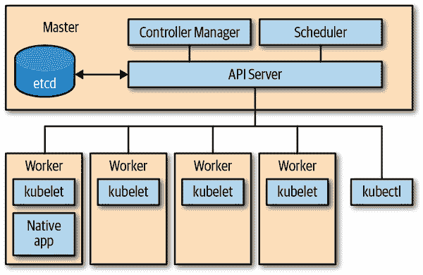
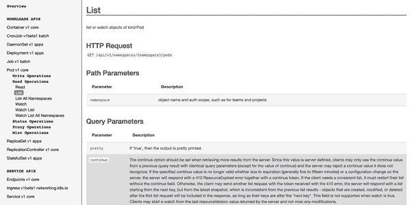
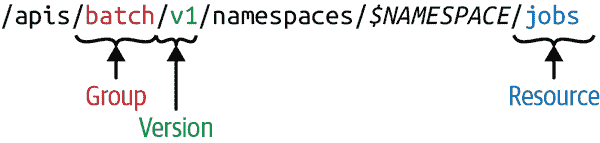
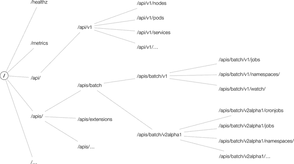
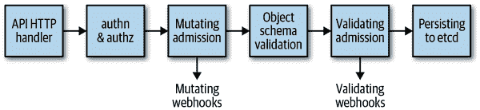

# 第二章：Kubernetes API 基础

在本章中，我们将深入介绍 Kubernetes API 的基础知识。这包括深入了解 API 服务器的内部工作、API 本身以及如何从命令行与 API 交互。我们将向你介绍 Kubernetes API 概念，如资源和种类，以及分组和版本化。

# API 服务器

Kubernetes 由一组具有不同角色的节点（集群中的机器）组成，如图 2-1 所示：控制平面位于主节点上，包括 API 服务器、控制器管理器和调度器。API 服务器是中央管理实体，也是唯一直接与分布式存储组件 `etcd` 通信的组件。

API 服务器有以下核心责任：

+   为了提供 Kubernetes API。这个 API 在集群内部被主控组件、工作节点和你的 Kubernetes 原生应用使用，同时也可以被 `kubectl` 等客户端外部使用。

+   代理集群组件，例如 Kubernetes 仪表板，或者流式传输日志、服务端口或服务 `kubectl exec` 会话。

提供 API 意味着：

+   读取状态：获取单个对象，列出它们，并流式传输更改

+   操作状态：创建、更新和删除对象

状态通过 `etcd` 持久化。



###### 图 2-1\. Kubernetes 架构概述

Kubernetes 的核心是其 API 服务器。但 API 服务器是如何工作的呢？我们首先将 API 服务器视为一个黑盒，深入研究其 HTTP 接口，然后再深入了解 API 服务器的内部工作原理。

## API 服务器的 HTTP 接口

从客户端的角度来看，API 服务器公开一个具有 JSON 或 [*protocol buffer*](http://bit.ly/1HhFC5L)（简称 *protobuf*）有效载荷的 RESTful HTTP API，主要用于集群内部通信，出于性能考虑。

API 服务器的 HTTP 接口处理 HTTP 请求，使用以下[HTTP 动词](https://mzl.la/2WX21hL)（或 HTTP 方法）查询和操作 Kubernetes 资源：

+   HTTP `GET` 动词用于检索具有特定资源的数据（例如某个 Pod）或资源的集合或列表（例如命名空间中的所有 Pod）。

+   HTTP `POST` 动词用于创建资源，例如服务或部署。

+   HTTP `PUT` 动词用于更新已存在的资源，例如修改一个 Pod 的容器镜像。

+   HTTP `PATCH` 动词用于对现有资源进行部分更新。阅读 Kubernetes 文档中的 [“使用 JSON 合并补丁更新部署”](http://bit.ly/2Xpbi6I) 以了解更多可用的策略和影响。

+   HTTP `DELETE` 动词用于以不可恢复的方式销毁资源。

如果你查看，比如 Kubernetes [1.14 API 参考](http://bit.ly/2IVevBG)，你可以看到不同的 HTTP 动词的操作。例如，要列出当前命名空间中的 Pods，并且相当于`kubectl -n` `*THENAMESPACE*` `get pods`的 CLI 命令，您需要发出`GET /api/v1/namespaces/*THENAMESPACE*/pods`（参见图 2-2）。



###### 图 2-2\. API 服务器 HTTP 接口示例：列出给定命名空间中的 Pods

想要了解如何从 Go 程序调用 API 服务器 HTTP 接口的简介，请参阅“客户端库”。

## API 术语

在我们深入讨论 API 业务之前，让我们首先定义在 Kubernetes API 服务器上下文中使用的术语：

种类

实体的类型。每个对象都有一个字段`Kind`（JSON 中的小写`kind`，Golang 中的大写`Kind`），告诉客户端（例如`kubectl`）它代表了例如一个 Pod。种类有三种类别：

+   对象表示系统中的持久实体，例如`Pod`或`Endpoints`。对象具有名称，其中许多对象存在于命名空间中。

+   列表是一个或多个实体种类的集合。列表具有一组有限的公共元数据。例如，`PodList`或`NodeList`。当你执行**`kubectl get pods`**时，就是这样。

+   专用种类用于对象的特定操作以及用于非持久性实体，例如`/binding`或`/scale`。对于发现，Kubernetes 使用`APIGroup`和`APIResource`；对于错误结果，它使用`Status`。

在 Kubernetes 程序中，种类直接对应于一个 Golang 类型。因此，作为 Golang 类型，种类是单数形式并以大写字母开头。

API 组

一个逻辑相关的`Kind`集合。例如，所有像`Job`或`ScheduledJob`这样的批处理对象都在批处理 API 组中。

版本

每个 API 组可以存在多个版本，大多数情况下都是如此。例如，一个组首先出现为`v1alpha1`，然后晋升为`v1beta1`，最后毕业为`v1`。在一个版本（例如`v1beta1`）中创建的对象可以在每个支持的版本中检索。API 服务器执行无损转换以按请求的版本返回对象。从集群用户的角度看，版本只是相同对象的不同表示。

###### 提示

在集群中，“一个对象在`v1`，另一个对象在`v1beta1`”这种说法是不成立的。相反，每个对象可以作为`v1`或`v1beta1`表示返回，根据集群用户的需求。

资源

通常是小写的复数词（例如`pods`），用于标识系统中某种对象类型的一组 HTTP 端点（路径），公开了特定对象类型的 CRUD（创建、读取、更新、删除）语义。常见的路径包括：

+   根，例如*…/pods*，列出该类型的所有实例

+   一个路径用于单个命名资源，例如*…/pods/nginx*

典型情况下，每个这些端点返回和接收一种类型（第一个情况下是`PodList`，第二个情况下是`Pod`）。但在其他情况下（例如错误情况），将返回一种`Status`类型的对象。

除了具有完整 CRUD 语义的主资源外，资源还可以具有进一步的端点以执行特定操作（例如，*…/pod/nginx/port-forward*、*…/pod/nginx/exec*或*…/pod/nginx/logs*）。我们称这些为*子资源*（参见“子资源”）。通常这些实现自定义协议而不是 REST，例如通过 WebSockets 进行的某种类型的流连接或命令式 API。

###### 提示

资源和种类经常混淆。注意清晰的区别：

+   资源对应于 HTTP 路径。

+   种类是由这些端点返回和接收的对象类型，以及持久存储到`etcd`中。

资源始终属于 API 组和版本，统称为*GroupVersionResource*（或 GVR）。GVR 唯一定义了 HTTP 路径。例如，在`default`命名空间中的具体路径将是*/apis/batch/v1/namespaces/default/jobs*。图 2-3 显示了一个命名空间资源（`Job`）的 GVR 示例。



###### 图 2-3\. Kubernetes API—GroupVersionResource (GVR)

与`jobs` GVR 示例相比，像节点或命名空间本身这样的集群范围资源在路径中不包含*$NAMESPACE*部分。例如，`nodes` GVR 示例可能如下所示：*/api/v1/nodes*。请注意，命名空间出现在其他资源的 HTTP 路径中，但它们也是资源本身，可通过*/api/v1/namespaces*访问。

类似于 GVR，每个种类都属于一个 API 组，被版本化，并通过*GroupVersionKind*（GVK）进行标识。

GVK 和 GVR 是相关联的。GVK 在由 GVR 标识的 HTTP 路径下提供服务。将 GVK 映射到 GVR 的过程称为 REST 映射。我们将在“REST 映射”中看到在 Golang 中实现 REST 映射的*RESTMappers*。

从全局角度看，API 资源空间在逻辑上形成一个树，顶级节点包括*/api*、*/apis*以及一些非分层的端点，如*/healthz*或*/metrics*。此 API 空间的一个示例呈现如图 2-4。请注意，确切的形状和路径取决于 Kubernetes 版本，而这些版本随着年份的推移趋于稳定。



###### 图 2-4\. 一个示例 Kubernetes API 空间

## Kubernetes API 版本控制

出于可扩展性原因，Kubernetes 支持在不同的 API 路径下使用多个 API 版本，例如*/api/v1*或*/apis/extensions/v1beta1*。不同的 API 版本意味着不同的稳定性和支持水平：

+   *Alpha*级别（例如，`v1alpha1`）通常默认禁用；支持某项功能可能随时停止且无需通知，并且仅应在短期测试集群中使用。

+   *Beta*级别（例如`v2beta3`）默认启用，表示代码经过了良好的测试；但是，对象的语义可能会在后续的 beta 或稳定版本中以不兼容的方式发生变化。

+   *稳定*（通常可用或 GA）级别（例如`v1`）将出现在后续许多版本的发布软件中。

让我们来看看 HTTP API 空间是如何构建的：在顶层，我们区分核心组（即位于*/api/v1*下的所有内容）和路径形式为*/apis/$`NAME`/$*`*VERSION*的命名组。

###### 注意

核心组位于`/api/v1`下，并且不是如人们所期望的位于*/apis/core/v1*下，这是由于历史原因。在引入 API 组概念之前，核心组已经存在。

还有第三种类型的 HTTP 路径—不与资源对齐的路径，API 服务器公开：全局集群实体，如*/metrics*、*/logs*或*/healthz*。此外，API 服务器支持观察；也就是说，而不是在设定的间隔内轮询资源，您可以在某些请求中添加`?watch=true`，API 服务器会进入[观察模式](http://bit.ly/2x5PnTl)。

## 声明性状态管理

大多数 API 对象在资源的*期望状态*和对象当前时间的*状态*之间做出了区分。*规范*（或简称规范）是资源期望状态的完整描述，通常存储在稳定存储中，通常是`etcd`。

###### 注意

为什么我们说“通常是`etcd`“？嗯，有一些 Kubernetes 发行版和提供，如[k3s](https://k3s.io)或 Microsoft 的 AKS，已经或正在用其他替代`etcd`。由于 Kubernetes 控制平面的模块化架构，这完全没问题。

让我们在 API 服务器的上下文中更详细地讨论规范（期望状态）与状态（观察状态）之间的区别。

规范描述了资源的期望状态，您需要通过命令行工具（如`kubectl`）或通过您的 Go 代码以编程方式提供。状态描述了资源的观察或实际状态，并由控制平面管理，可以是核心组件（如控制器管理器）或您自己的自定义控制器管理（参见“控制器和操作员”）。例如，在部署中，您可能指定希望应用程序始终运行 20 个副本。控制平面中的部署控制器，作为控制器管理器的一部分，读取您提供的部署规范，并创建一个副本集，然后负责管理副本：它创建相应数量的 Pod，最终（通过`kubelet`）在工作节点上启动容器。如果任何副本失败，部署控制器会在状态中通知您。这就是我们所说的*声明性状态管理*—即声明期望的状态，然后让 Kubernetes 处理剩余部分。

我们将在下一节看到声明性状态管理的实际操作，从命令行开始探索 API。

# 使用命令行访问 API

在本节中，我们将使用 `kubectl` 和 `curl` 来演示 Kubernetes API 的使用。如果您对这些 CLI 工具不熟悉，现在是安装并尝试它们的好时机。

首先，让我们查看资源的期望状态和观察到的状态。我们将使用控制平面组件作为例子，这个组件在每个集群中都可能可用，即 `kube-system` 命名空间中的 CoreDNS 插件（旧版 Kubernetes 使用 `kube-dns`）（此输出已经过大量编辑以突出重要部分）。

```
$ kubectl -n kube-system get deploy/coredns -o=yaml
apiVersion: apps/v1
kind: Deployment
metadata:
  name: coredns
  namespace: kube-system
  ...
spec:
  template:
    spec:
      containers:
      - name: coredns
        image: 602401143452.dkr.ecr.us-east-2.amazonaws.com/eks/coredns:v1.2.2
  ...
status:
  replicas: 2
  conditions:
  - type: Available
    status: "True"
    lastUpdateTime: "2019-04-01T16:42:10Z"
  ...
```

正如您从这个 `kubectl` 命令中可以看到的，在部署的 `spec` 部分，您可以定义诸如要使用的容器镜像以及要并行运行多少个副本之类的特性，在 `status` 部分，您可以了解当前时间点有多少个副本实际在运行。

为了进行与 CLI 相关的操作，本章的剩余部分我们将使用批量操作作为运行示例。让我们从在终端中执行以下命令开始：

```
$ kubectl proxy --port=8080
Starting to serve on 127.0.0.1:8080
```

此命令将 Kubernetes API 代理到我们的本地机器，并处理认证和授权部分。它允许我们通过 HTTP 直接发出请求，并收到 JSON 负载作为返回。让我们通过启动第二个终端会话来执行 `v1` 查询：

```
$ curl http://127.0.0.1:8080/apis/batch/v1
{
  "kind": "APIResourceList",
  "apiVersion": "v1",
  "groupVersion": "batch/v1",
  "resources": [
    {
      "name": "jobs",
      "singularName": "",
      "namespaced": true,
      "kind": "Job",
      "verbs": [
        "create",
        "delete",
        "deletecollection",
        "get",
        "list",
        "patch",
        "update",
        "watch"
      ],
      "categories": [
        "all"
      ]
    },
    {
      "name": "jobs/status",
      "singularName": "",
      "namespaced": true,
      "kind": "Job",
      "verbs": [
        "get",
        "patch",
        "update"
      ]
    }
  ]
}
```

###### 提示

您不必与 `kubectl proxy` 命令一起使用 `curl` 来直接访问 Kubernetes API 的 HTTP API。您可以使用 `kubectl get --raw` 命令：例如，将 `curl http://127.0.0.1:8080/apis/batch/v1` 替换为 `kubectl get --raw /apis/batch/v1`。

将此与 `v1beta1` 版本进行比较，注意当查看 *http://127.0.0.1:8080/apis/batch* `v1beta1` 时，您可以获取批处理 API 组的支持版本列表：

```
$ curl http://127.0.0.1:8080/apis/batch/v1beta1
{
  "kind": "APIResourceList",
  "apiVersion": "v1",
  "groupVersion": "batch/v1beta1",
  "resources": [
    {
      "name": "cronjobs",
      "singularName": "",
      "namespaced": true,
      "kind": "CronJob",
      "verbs": [
        "create",
        "delete",
        "deletecollection",
        "get",
        "list",
        "patch",
        "update",
        "watch"
      ],
      "shortNames": [
        "cj"
      ],
      "categories": [
        "all"
      ]
    },
    {
      "name": "cronjobs/status",
      "singularName": "",
      "namespaced": true,
      "kind": "CronJob",
      "verbs": [
        "get",
        "patch",
        "update"
      ]
    }
  ]
}
```

如您所见，`v1beta1` 版本还包含带有 `CronJob` 类型的 `cronjobs` 资源。在撰写本文时，cron 作业尚未升级到 `v1`。

如果您想了解集群中支持的 API 资源（包括其类型、是否命名空间以及其短名称（主要用于 `kubectl` 命令行），您可以使用以下命令：

```
$ kubectl api-resources
NAME                   SHORTNAMES APIGROUP NAMESPACED   KIND
bindings                                   true Binding
componentstatuses      cs                  false ComponentStatus
configmaps             cm                  true ConfigMap
endpoints              ep                  true Endpoints
events                 ev                  true Event
limitranges            limits              true LimitRange
namespaces             ns                  false Namespace
nodes                  no                  false Node
persistentvolumeclaims pvc                 true PersistentVolumeClaim
persistentvolumes      pv                  false PersistentVolume
pods                   po                  true Pod
podtemplates                               true PodTemplate
replicationcontrollers rc                  true ReplicationController
resourcequotas         quota               true ResourceQuota
secrets                                    true Secret
serviceaccounts        sa                  true ServiceAccount
services               svc                 true Service
controllerrevisions               apps     true ControllerRevision
daemonsets             ds         apps     true DaemonSet
deployments            deploy     apps     true Deployment
...
```

下面是一个相关的命令，用于确定集群中支持的不同资源版本的列表：

```
$ kubectl api-versions
admissionregistration.k8s.io/v1beta1
apiextensions.k8s.io/v1beta1
apiregistration.k8s.io/v1
apiregistration.k8s.io/v1beta1
appmesh.k8s.aws/v1alpha1
appmesh.k8s.aws/v1beta1
apps/v1
apps/v1beta1
apps/v1beta2
authentication.k8s.io/v1
authentication.k8s.io/v1beta1
authorization.k8s.io/v1
authorization.k8s.io/v1beta1
autoscaling/v1
autoscaling/v2beta1
autoscaling/v2beta2
batch/v1
batch/v1beta1
certificates.k8s.io/v1beta1
coordination.k8s.io/v1beta1
crd.k8s.amazonaws.com/v1alpha1
events.k8s.io/v1beta1
extensions/v1beta1
networking.k8s.io/v1
policy/v1beta1
rbac.authorization.k8s.io/v1
rbac.authorization.k8s.io/v1beta1
scheduling.k8s.io/v1beta1
storage.k8s.io/v1
storage.k8s.io/v1beta1
v1
```

# API 服务器如何处理请求

现在您已经了解了外部 HTTP 接口，让我们专注于 API 服务器的内部工作。图 2-5 展示了 API 服务器中请求处理的高级概述。



###### 图 2-5\. Kubernetes API 服务器请求处理概述

那么，当 HTTP 请求到达 Kubernetes API 时实际上发生了什么？从高层次来看，以下交互发生：

1.  HTTP 请求由注册在`DefaultBuildHandlerChain()`中的一系列过滤器处理。此链在[*k8s.io/apiserver/pkg/server/config.go*](http://bit.ly/2x9t27e)中定义，并且稍后将详细讨论。它在该请求上应用一系列的过滤器操作。如果过滤器通过并向上下文附加了相应的信息—确切地说是`ctx.RequestInfo`，其中`ctx`是 Go 语言中的[上下文](https://golang.org/pkg/context)（例如，认证用户）—或者如果请求未通过过滤器，则返回适当的 HTTP 响应代码，说明原因（例如，如果用户认证失败，则返回[`401`响应](https://httpstatuses.com/401)）。

1.  接下来，根据 HTTP 路径，[*k8s.io/apiserver/pkg/server/handler.go*](http://bit.ly/2WUd0c6)中的多路复用器将 HTTP 请求路由到相应的处理程序。

1.  为每个 API 组注册了一个处理程序—详细信息请参阅[*k8s.io/apiserver/pkg/endpoints/groupversion.go*](http://bit.ly/2IvvSKA)和[*k8s.io/apiserver/pkg/endpoints/installer.go*](http://bit.ly/2Y1eySV)。它接收 HTTP 请求以及上下文（例如用户和访问权限），从`etcd`存储中检索并传递请求的对象。

现在让我们更详细地看一下`DefaultBuildHandlerChain()`在[*server/config.go*](http://bit.ly/2LWUUnQ)中设置的过滤器链，以及每个过滤器中发生的事情：

```
func DefaultBuildHandlerChain(apiHandler http.Handler, c *Config) http.Handler {
    h := WithAuthorization(apiHandler, c.Authorization.Authorizer, c.Serializer)
    h = WithMaxInFlightLimit(h, c.MaxRequestsInFlight,
          c.MaxMutatingRequestsInFlight, c.LongRunningFunc)
    h = WithImpersonation(h, c.Authorization.Authorizer, c.Serializer)
    h = WithAudit(h, c.AuditBackend, c.AuditPolicyChecker, LongRunningFunc)
    ...
    h = WithAuthentication(h, c.Authentication.Authenticator, failed, ...)
    h = WithCORS(h, c.CorsAllowedOriginList, nil, nil, nil, "true")
    h = WithTimeoutForNonLongRunningRequests(h, LongRunningFunc, RequestTimeout)
    h = WithWaitGroup(h, c.LongRunningFunc, c.HandlerChainWaitGroup)
    h = WithRequestInfo(h, c.RequestInfoResolver)
    h = WithPanicRecovery(h)
    return h
}
```

所有的包都在[*k8s.io/apiserver/pkg*](http://bit.ly/2LUzTdx)中。更具体地说：

`WithPanicRecovery()`

负责恢复和记录恐慌。定义在[*server/filters/wrap.go*](http://bit.ly/2N0zfNB)中。

`WithRequestInfo()`

将`RequestInfo`附加到上下文中。定义在[*endpoints/filters/requestinfo.go*](http://bit.ly/2KvKjQH)中。

`WithWaitGroup()`

将所有非长时间运行的请求添加到等待组中；用于优雅关闭。定义在[*server/filters/waitgroup.go*](http://bit.ly/2ItnsD6)中。

`WithTimeoutForNonLongRunningRequests()`

对非长时间运行的请求（如大多数`GET`、`PUT`、`POST`和`DELETE`请求）设置超时，与观察和代理请求等长时间运行的请求形成对比。定义在[*server/filters/timeout.go*](http://bit.ly/2KrKk8r)中。

`WithCORS()`

提供了一个[CORS](https://enable-cors.org)实现。CORS 是跨源资源共享的缩写，是一种机制，允许嵌入在 HTML 页面中的 JavaScript 向与其来源不同的域名发出 XMLHttpRequests。定义在[*server/filters/cors.go*](http://bit.ly/2L2A6uJ)中。

`WithAuthentication()`

尝试将给定请求验证为人类或机器用户，并将用户信息存储在提供的上下文中。验证成功后，将从请求中删除`Authorization` HTTP 头部。如果身份验证失败，则返回 HTTP `401`状态码。定义在[*endpoints/filters/authentication.go*](http://bit.ly/2Fjzr4b)中。

`WithAudit()`方法

为所有传入请求装饰处理程序，并记录审计日志信息。审计日志条目包含请求的源 IP、执行操作的用户和请求的命名空间。定义在[*admission/audit.go*](http://bit.ly/2XpQN9U)中。

`WithImpersonation()`方法

通过检查尝试更改用户的请求来处理用户模拟（类似于`sudo`）。定义在[*endpoints/filters/impersonation.go*](http://bit.ly/2L2UETP)中。

`WithMaxInFlightLimit()`方法

限制正在处理的请求数量。定义在[*server/filters/maxinflight.go*](http://bit.ly/2IY4unl)中。

`WithAuthorization()`方法

通过调用授权模块检查权限，并将所有已授权的请求传递给多路复用器，该复用器将请求分派给正确的处理程序。如果用户权限不足，则返回 HTTP `403`状态码。如今的 Kubernetes 使用基于角色的访问控制（RBAC）。定义在[*endpoints/filters/authorization.go*](http://bit.ly/31M2NSA)中。

在通过通用处理程序链之后（图 2-5 中的第一个框），实际的请求处理开始执行（即，执行请求处理程序的语义）：

+   直接处理非 RESTful API 的请求，如*/*、*/version*、*/apis*、*/healthz*等。

+   RESTful 资源的请求进入由以下组成的请求管道：

    *审批*

    对象经过审批链。该链具有大约 20 个不同的审批插件。^(1) 每个插件可以是变异阶段的一部分（见图 2-5 中的第三个框），验证阶段的一部分（见图中的第四个框），或者两者兼而有之。

    在变异阶段，可以更改传入请求的有效负载；例如，根据审批配置将镜像拉取策略设置为`Always`、`IfNotPresent`或`Never`。

    第二个审批阶段纯粹用于验证；例如，验证 Pod 中的安全设置，或在创建该命名空间中的对象之前验证命名空间的存在。

    *验证*

    对象经过大型验证逻辑进行检查，该逻辑对系统中的每种对象类型都存在。例如，字符串格式检查以验证服务名称中仅使用有效的 DNS 兼容字符，或验证 Pod 中所有容器名称的唯一性。

    `etcd`支持的 CRUD 逻辑

    在这里，我们看到的不同动词在“API 服务器的 HTTP 接口”中得到了实现；例如，更新逻辑从 `etcd` 读取对象，检查没有其他用户以“乐观并发”的方式修改该对象，如果没有，则将请求对象写入 `etcd`。

我们将在接下来的章节中更详细地探讨这些步骤；例如：

自定义资源

“验证自定义资源”中的验证，“Admission Webhooks”中的接收，以及第四章中的一般 CRUD 语义。

Golang 原生资源

“验证”中的验证，“Admission”中的接收，以及“Registry and Strategy”中 CRUD 语义的实现。

# 总结

在本章中，我们首先将 Kubernetes API 服务器作为一个黑盒进行讨论，并查看了它的 HTTP 接口。然后你学习了如何在命令行中与这个黑盒交互，最后我们打开了这个黑盒，探索其内部工作。到现在，你应该知道 API 服务器的内部工作原理，以及如何使用 CLI 工具 `kubectl` 进行资源的探索和操作。

现在是时候告别命令行上的手动交互，开始使用 Go 编程接口服务器访问：介绍 `client-go`，Kubernetes“标准库”的核心。

^(1) 在 Kubernetes 1.14 集群中，这些（按此顺序）是：`AlwaysAdmit`，`NamespaceAutoProvision`，`NamespaceLifecycle`，`NamespaceExists`，`SecurityContextDeny`，`LimitPodHardAntiAffinityTopology`，`PodPreset`，`LimitRanger`，`ServiceAccount`，`NodeRestriction`，`TaintNodesByCondition`，`AlwaysPullImages`，`ImagePolicyWebhook`，`PodSecurityPolicy`，`PodNodeSelector`，`Priority`，`DefaultTolerationSeconds`，`PodTolerationRestriction`，`DenyEscalatingExec`，`DenyExecOnPrivileged`，`EventRateLimit`，`ExtendedResourceToleration`，`PersistentVolumeLabel`，`DefaultStorageClass`，`StorageObjectInUseProtection`，`OwnerReferencesPermissionEnforcement`，`PersistentVolumeClaimResize`，`MutatingAdmissionWebhook`，`ValidatingAdmissionWebhook`，`ResourceQuota`，和 `AlwaysDeny`。
