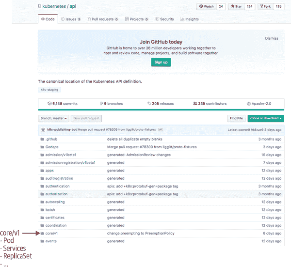
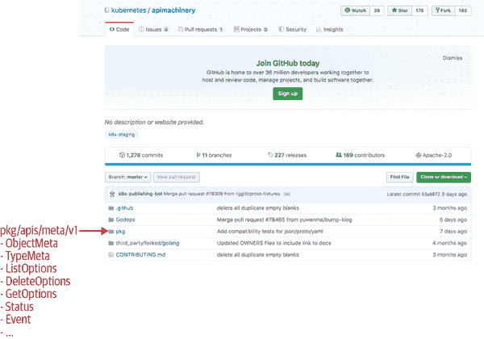
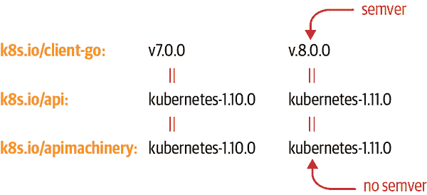
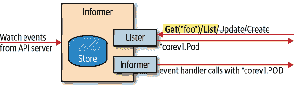
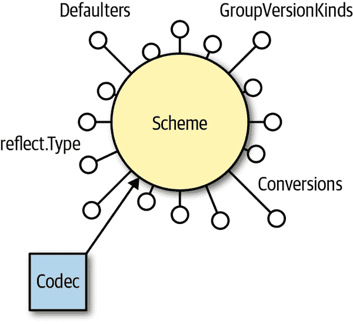
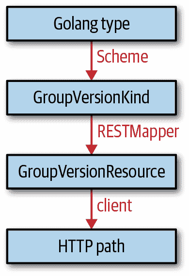

# 第三章：client-go 的基础知识

现在我们将专注于 Go 中的 Kubernetes 编程接口。您将学习如何访问 Kubernetes API 中的众所周知的原生类型，例如 pods、services 和 deployments。在后续章节中，这些技术将扩展到用户定义的类型。然而，在此之前，我们首先集中讨论每个 Kubernetes 集群都提供的所有 API 对象。

# 仓库

Kubernetes 项目在 GitHub 上的 *kubernetes* 组织下提供了许多第三方可消费的 Git 仓库。您需要将所有这些仓库使用域别名 *k8s.io/…*（而不是 *github.com/kubernetes/…*）导入到您的项目中。我们将在以下部分介绍其中最重要的仓库。

## 客户端库

Kubernetes 中使用 Go 编程接口主要由 *k8s.io/client-go* 库组成（简称为 `client-go`）。*client-go* 是一个典型的 Web 服务客户端库，支持所有官方 Kubernetes API 类型。它可以用来执行常见的 REST 动词：

+   *创建*

+   *获取*

+   *列表*

+   *更新*

+   *删除*

+   *修补*

每一个这些 REST 动词都是使用“API 服务器的 HTTP 接口”实现的。此外，还支持动词 `Watch`，这是 Kubernetes 类似 API 的特殊功能，也是与其他 API 的主要区别之一。

[`client-go`](http://bit.ly/2RryyLM) 在 GitHub 上可用（参见图 3-1），在 Go 代码中使用 *k8s.io/client-go* 包名。它与 Kubernetes 本身并行发布；也就是说，对于每个 Kubernetes `1.x.y` 发布，都有一个与之匹配的 `client-go` 发布，带有相应的标签 `kubernetes-1.x.y`。


###### 图 3-1. GitHub 上的 `client-go` 仓库

另外，还有一个语义版本控制方案。例如，`client-go` 9.0.0 对应 Kubernetes 1.12 发布，`client-go` 10.0.0 对应 Kubernetes 1.13，依此类推。未来可能会有更精细的发布。除了 Kubernetes API 对象的客户端代码，`client-go` 还包含许多通用库代码。这也用于用户定义的 API 对象在第四章中使用。参见图 3-1 以获取包列表。

尽管所有包都有其用途，但大部分与 Kubernetes API 进行交互的代码将使用 *tools/clientcmd/* 从 `kubeconfig` 文件设置客户端，以及用于实际 Kubernetes API 客户端的 *kubernetes/*。我们很快将看到执行此操作的代码。在此之前，让我们快速浏览其他相关的仓库和包。

## Kubernetes API 类型

正如我们所见，`client-go` 拥有客户端接口。用于 pods、services 和 deployments 等 Kubernetes API Go 类型的对象位于[它们自己的仓库](http://bit.ly/2ZA6dWH)中。在 Go 代码中，它被访问为 `k8s.io/api`。

Pod 是遗留 API 组的一部分（通常也称为“核心”组）版本 `v1`。因此，`Pod` Go 类型位于 *k8s.io/api/core/v1*，其他 Kubernetes 中的所有 API 类型类似。参见 图 3-2 获取包列表，其中大多数对应于 Kubernetes API 组及其版本。

实际的 Go 类型包含在一个 *types.go* 文件中（例如 *k8s.io/api/core/v1/types.go*）。此外，还有其他文件，其中大多数是由代码生成器自动生成的。



###### 图 3-2\. GitHub 上的 API 仓库

## API 机制

最后但同样重要的是，有第三个仓库称为 [API Machinery](http://bit.ly/2xAZiR2)，在 Go 中被用作 `k8s.io/apimachinery`。它包括所有用于实现类似 Kubernetes API 的通用构建模块。API 机制不仅限于容器管理，例如，它也可以用于构建在线商店或任何其他业务特定域的 API。

尽管如此，在 Kubernetes 原生 Go 代码中会遇到许多 API 机制包。其中一个重要的是 *k8s.io/apimachinery/pkg/apis/meta/v1.*。它包含许多通用的 API 类型，如 `ObjectMeta`、`TypeMeta`、`GetOptions` 和 `ListOptions`（见 图 3-3）。



###### 图 3-3\. GitHub 上的 API 机制仓库

## 创建和使用客户端

现在我们知道了创建 Kubernetes 客户端对象的所有构建模块，这意味着我们可以访问 Kubernetes 集群中的资源。假设您可以在本地环境中访问集群（即 `kubectl` 正确设置并配置了凭据），以下代码演示了如何在 Go 项目中使用 `client-go`：

```
import (
    metav1 "k8s.io/apimachinery/pkg/apis/meta/v1"
    "k8s.io/client-go/tools/clientcmd"
    "k8s.io/client-go/kubernetes"
)

kubeconfig = flag.String("kubeconfig", "~/.kube/config", "kubeconfig file")
flag.Parse()
config, err := clientcmd.BuildConfigFromFlags("", *kubeconfig)
clientset, err := kubernetes.NewForConfig(config)

pod, err := clientset.CoreV1().Pods("book").Get("example", metav1.GetOptions{})
```

代码导入 `meta/v1` 包以访问 `metav1.GetOptions`。此外，它从 `client-go` 导入 `clientcmd` 以读取和解析 kubeconfig（即包含服务器名称、凭据等的客户端配置）。然后它导入 `client-go` 的 `kubernetes` 包，其中包含用于 Kubernetes 资源的客户端集。

kubeconfig 文件的默认位置在用户的主目录中的 *.kube/config*。这也是 `kubectl` 获取 Kubernetes 集群凭据的地方。

然后使用 `clientcmd.BuildConfigFromFlags` 读取并解析 kubeconfig。我们在代码中省略了强制的错误处理，但 `err` 变量通常会包含例如 kubeconfig 格式不正确的语法错误。由于语法错误在 Go 代码中很常见，因此应适当检查此类错误，如下所示：

```
config, err := clientcmd.BuildConfigFromFlags("", *kubeconfig)
if err != nil {
    fmt.Printf("The kubeconfig cannot be loaded: %v\n", err
    os.Exit(1)
}
```

从 `clientcmd.BuildConfigFromFlags` 我们得到一个 `rest.Config`，你可以在 *k8s.io/client-go/rest* 包中找到）。这个配置传递给 `kubernetes.NewForConfig` 以创建实际的 Kubernetes *客户端集*。它被称为 *客户端集*，因为它包含多个客户端，用于访问所有原生 Kubernetes 资源。

在集群中的 Pod 内运行二进制文件时，`kubelet` 将自动将一个服务帐户挂载到容器中的 */var/run/secrets/kubernetes.io/serviceaccount*。它替换了刚提到的 kubeconfig 文件，可以通过 `rest.InClusterConfig()` 方法轻松转换为 `rest.Config`。你经常会找到以下组合：`rest.InClusterConfig()` 和 `clientcmd.BuildConfigFromFlags()`，包括对 `KUBECONFIG` 环境变量的支持。

```
config, err := rest.InClusterConfig()
if err != nil {
    // fallback to kubeconfig
    kubeconfig := filepath.Join("~", ".kube", "config")
    if envvar := os.Getenv("KUBECONFIG"); len(envvar) >0 {
        kubeconfig = envvar
    }
    config, err = clientcmd.BuildConfigFromFlags("", kubeconfig)
    if err != nil {
        fmt.Printf("The kubeconfig cannot be loaded: %v\n", err
        os.Exit(1)
    }
}
```

在以下示例代码中，我们选择 `v1` 版本的核心组 `clientset.CoreV1()`，然后访问命名空间 `"book"` 中的 pod `"example"`：

```
 pod, err := clientset.CoreV1().Pods("book").Get("example", metav1.GetOptions{})
```

注意，只有最后一个函数调用 `Get` 实际访问了服务器。`CoreV1` 和 `Pods` 都选择了客户端，并且仅为以下 `Get` 调用设置了命名空间（这通常被称为 *生成器模式*，在这种情况下用于构建请求）。

`Get` 调用向服务器发送 HTTP `GET` 请求，路径为 */api/v1/namespaces/book/pods/example*，该路径在 kubeconfig 中设置。如果 Kubernetes API 服务器以 HTTP 状态码 `200` 响应，则响应体将携带编码后的 Pod 对象，可以是 JSON 格式（这是 `client-go` 的默认传输格式）或者协议缓冲区格式。

###### 注意

你可以通过在创建客户端之前修改 REST 配置来为原生 Kubernetes 资源客户端启用协议缓冲区支持：

```
cfg, err := clientcmd.BuildConfigFromFlags("", *kubeconfig)
cfg.AcceptContentTypes = "application/vnd.kubernetes.protobuf,
 application/json"
cfg.ContentType = "application/vnd.kubernetes.protobuf"
clientset, err := kubernetes.NewForConfig(cfg)
```

注意，第四章 中介绍的自定义资源不支持协议缓冲区。

## 版本控制和兼容性

Kubernetes API 是有版本的。在前一节中我们看到 pods 属于核心组的 `v1` 版本。实际上，核心组目前只存在一个版本。但也有其他组，例如 `apps` 组，在 `v1`、`v1beta2` 和 `v1beta1`（截至本文撰写时）中存在。如果你查看 [*k8s.io/api/apps*](http://bit.ly/2L1Nyio) 包，你会找到所有这些版本的 API 对象。在 [*k8s.io/client-go/kubernetes/typed/apps*](http://bit.ly/2x45Uab) 包中，你会看到所有这些版本的客户端实现。

所有这些仅涉及客户端端。它并未涉及 Kubernetes 集群及其 API 服务器的任何内容。使用客户端与 API 服务器不支持的 API 组版本将导致失败。客户端是硬编码到一个版本中的，应用程序开发人员必须选择正确的 API 组版本以便与手头的集群进行通信。有关 API 组兼容性保证的更多信息，请参见 “API 版本和兼容性保证”。

兼容性的第二个方面是`client-go`与 API 服务器的元 API 功能。例如，有用于 CRUD 动词的选项结构体，比如`CreateOptions`、`GetOptions`、`UpdateOptions`和`DeleteOptions`。另一个重要的是`ObjectMeta`（在`ObjectMeta`中详细讨论），它是每种类型的一部分。所有这些都经常通过新功能进行扩展；在它们的字段中，注释指定何时将功能视为 alpha 或 beta。与任何其他 API 字段一样，相同的 API 兼容性保证适用于它们。

在接下来的示例中，`DeleteOptions` 结构体在包[*k8s.io/apimachinery/pkg/apis/meta/v1/types.go*](http://bit.ly/2MZ9flL)中定义：

```
// DeleteOptions may be provided when deleting an API object.
type DeleteOptions struct {
    TypeMeta `json:",inline"`

    GracePeriodSeconds *int64 `json:"gracePeriodSeconds,omitempty"`
    Preconditions *Preconditions `json:"preconditions,omitempty"`
    OrphanDependents *bool `json:"orphanDependents,omitempty"`
    PropagationPolicy *DeletionPropagation `json:"propagationPolicy,omitempty"`

    // When present, indicates that modifications should not be
    // persisted. An invalid or unrecognized dryRun directive will
    // result in an error response and no further processing of the
    // request. Valid values are:
    // - All: all dry run stages will be processed
    // +optional
    DryRun []string `json:"dryRun,omitempty" protobuf:"bytes,5,rep,name=dryRun"`
}
```

最后一个字段，`DryRun`，在 Kubernetes 1.12 中作为 alpha 版本添加，在 1.13 中作为 beta 版本（默认启用）。在较早的版本中，API 服务器无法理解它。根据功能，传递这样的选项可能会被简单地忽略或者甚至拒绝。因此，拥有一个与集群版本不相距太远的`client-go`版本非常重要。

###### 提示

哪些字段在哪个质量级别可用的参考是*k8s.io/api*中的源代码，例如，在[`release-1.13`分支](http://bit.ly/2Yrhjgq)中，为 Kubernetes 1.13 标记为 alpha 的字段已被标注。

有[生成的 API 文档](http://bit.ly/2YrfiB2)更便于使用。尽管如此，它的信息与*k8s.io/api*中的相同。

最后但同样重要的是，许多 alpha 和 beta 功能都有相应的[功能门](http://bit.ly/2RP5nmi)（请查看[主要来源](http://bit.ly/2FPZPTT)）。这些功能在[问题](http://bit.ly/2YuHYcd)中有追踪。

集群与`client-go`版本之间的正式保证支持矩阵已在`client-go`的[README](http://bit.ly/2RryyLM)中发布（参见表 3-1）。

表 3-1\. `client-go` 与 Kubernetes 版本的兼容性

|  | Kubernetes 1.9 | Kubernetes 1.10 | Kubernetes 1.11 | Kubernetes 1.12 | Kubernetes 1.13 | Kubernetes 1.14 | Kubernetes 1.15 |
| --- | --- | --- | --- | --- | --- | --- | --- |
| client-go 6.0 | ✓ | +– | +– | +– | +– | +– | +– |
| client-go 7.0 | +– | ✓ | +– | +– | +– | +– | +– |
| client-go 8.0 | +– | +– | ✓ | +– | +– | +– | +– |
| client-go 9.0 | +– | +– | +– | ✓ | +– | +– | +– |
| client-go 10.0 | +– | +– | +– | +– | ✓ | +– | +– |
| client-go 11.0 | +– | +– | +– | +– | +– | ✓ | +– |
| client-go 12.0 | +– | +– | +– | +– | +– | +– | ✓ |
| client-go HEAD | +– | +– | +– | +– | +– | +– | +– |

+   ✓: `client-go` 和 Kubernetes 版本在功能和 API 组版本上是相同的。

+   `+`：`client-go` 具有功能或 API 组版本，可能在 Kubernetes 集群中不存在。这可能是因为 `client-go` 中添加了新功能，或者因为 Kubernetes 删除了旧的、不推荐使用的功能。然而，它们共享的所有内容（即大多数 API）都将正常工作。

+   `–`：`client-go` 明知与 Kubernetes 集群不兼容。

从 表 3-1 中可以得出结论，`client-go` 库与其相应的集群版本兼容。在版本不一致的情况下，开发人员必须仔细考虑他们使用的功能和 API 组是否在应用程序所连接的集群版本中得到支持。

在 表 3-1 中列出了 `client-go` 的版本。我们在 “客户端库” 中简要提到，`client-go` 使用语义化版本控制（semver），每次增加 Kubernetes 的小版本时，增加 `client-go` 的主版本。`client-go` 1.0 是为 Kubernetes 1.4 发布的，现在我们在 Kubernetes 1.15 时的 `client-go` 版本为 12.0（截至撰写本文时）。

此 semver 仅适用于 `client-go` 本身，不适用于 API Machinery 或 API 仓库。相反，后者使用 Kubernetes 版本进行标记，如 图 3-4 所示。查看 “Vendoring” 以了解它在项目中对 *k8s.io/client-go*、*k8s.io/apimachinery* 和 *k8s.io/api* 的意义。



###### 图 3-4\. client-go 版本控制

## API 版本和兼容性保证

正如前一节所示，如果您的代码面向不同的集群版本，选择正确的 API 组版本可能至关重要。Kubernetes 使用常见的版本控制方案，其中包括 alpha、beta 和 GA（一般可用）版本。

模式为：

+   `v1alpha1`、`v1alpha2`、`v2alpha1` 等被称为 *alpha 版本*，并被认为是不稳定的。这意味着：

    +   它们可能随时以任何不兼容的方式消失或更改。

    +   数据可能会在 Kubernetes 的不同版本之间丢失、丢弃或变得不可访问。

    +   默认情况下，它们通常是禁用的，除非管理员手动选择启用。

+   `v1beta1`、`v1beta2`、`v2beta1` 等被称为 *beta 版本*。它们正在通向稳定性，这意味着：

    +   它们将与相应的稳定 API 版本并行存在至少一个 Kubernetes 发布周期。

    +   它们通常不会以不兼容的方式更改，但没有严格的保证。

    +   存储在 beta 版本中的对象不会丢失或变得不可访问。

    +   Beta 版本通常在集群中默认启用。但这可能取决于使用的 Kubernetes 分发版或云提供商。

+   `v1`、`v2` 等是稳定的、通用可用的 API；也就是说：

    +   它们将保留下去。

    +   它们将保持兼容性。

###### 提示

Kubernetes 在这些经验法则背后有一个[正式的废弃政策](http://bit.ly/2FOrKU8)。您可以在[Kubernetes 社区的 GitHub](http://bit.ly/2XKPWAX)上找到关于哪些 API 构造被视为兼容的更多详细信息。

关于 API 组版本，有两个重要的要点需要记住：

+   API 组版本适用于整个 API 资源，例如 pods 或 services 的格式。除了 API 组版本外，API 资源可能还有单独版本化的字段；例如，在其 Go 内联代码文档中，稳定的 API 中的字段可能被标记为 alpha 质量。对于这些字段，将适用于与 API 组相同的规则。例如：

    +   稳定 API 中的 alpha 字段可能会变得不兼容，丢失数据或随时消失。例如，`ObjectMeta.Initializers` 字段，从未超出 alpha 阶段，将在不久的将来消失（在 1.14 版本中已弃用）：

        ```
        // DEPRECATED - initializers are an alpha field and will be removed
        // in v1.15.
        Initializers *Initializers `json:"initializers,omitempty"
        ```

    +   通常情况下，默认情况下将禁用它，并且必须使用 API 服务器功能门限进行启用，例如：

        ```
        type JobSpec struct {
            ...
            // This field is alpha-level and is only honored by servers that
            // enable the TTLAfterFinished feature.
            TTLSecondsAfterFinished *int32 `json:"ttlSecondsAfterFinished,omitempty"
        }
        ```

    +   API 服务器的行为将因字段而异。如果未启用相应的功能门限，则某些 alpha 字段将被拒绝，而某些将被忽略。这在字段描述中有文档记录（参见前面示例中的 `TTLSecondsAfterFinished`）。

+   此外，API 组版本在访问 API 时起到了作用。在同一资源的不同版本之间，API 服务器会进行即时转换。也就是说，您可以访问在一个版本（例如 `v1beta1`）中创建的对象，而无需在应用程序中进行任何其他工作，即在任何其他支持的版本（例如 `v1`）中。这对于构建向后和向前兼容的应用程序非常方便。

    +   存储在 `etcd` 中的每个对象都以特定版本存储。默认情况下，这称为该资源的*存储版本*。虽然存储版本可以在 Kubernetes 的不同版本中更改，但在撰写本文时，存储在 `etcd` 中的对象不会自动更新。因此，集群管理员必须确保在更新 Kubernetes 集群时及时进行迁移，以防止旧版本支持被弃用。目前没有通用的迁移机制，并且迁移因 Kubernetes 发行版而异。

    +   对于应用程序开发人员而言，这些操作工作实际上并不重要。即时转换将确保应用程序对集群中的对象有一个统一的视图。应用程序甚至不会注意到使用的是哪个存储版本。存储版本控制对编写的 Go 代码是透明的。

# Kubernetes 中的 Go 对象

在“创建和使用客户端”中，我们看到如何为核心组创建客户端，以便访问 Kubernetes 集群中的 pods。接下来，我们希望更详细地查看在 Go 世界中的 pod — 或者说任何其他 Kubernetes 资源的 — 是什么。

Kubernetes 资源——或更确切地说，作为 API 服务器资源提供的对象——作为结构体表示。根据问题中的种类，它们的字段当然不同。但另一方面，它们共享一个通用结构。

从类型系统的角度来看，Kubernetes 对象实现了一个名为`runtime.Object`的 Go 接口，位于 *k8s.io/apimachinery/pkg/runtime* 包中，实际上非常简单：

```
// Object interface must be supported by all API types registered with Scheme.
// Since objects in a scheme are expected to be serialized to the wire, the
// interface an Object must provide to the Scheme allows serializers to set
// the kind, version, and group the object is represented as. An Object may
// choose to return a no-op ObjectKindAccessor in cases where it is not
// expected to be serialized.
type Object interface {
    GetObjectKind() schema.ObjectKind
    DeepCopyObject() Object
}
```

在这里，`schema.ObjectKind`（来自 *k8s.io/apimachinery/pkg/runtime/schema* 包）是另一个简单的接口：

```
// All objects that are serialized from a Scheme encode their type information.
// This interface is used by serialization to set type information from the
// Scheme onto the serialized version of an object. For objects that cannot
// be serialized or have unique requirements, this interface may be a no-op.
type ObjectKind interface {
    // SetGroupVersionKind sets or clears the intended serialized kind of an
    // object. Passing kind nil should clear the current setting.
    SetGroupVersionKind(kind GroupVersionKind)
    // GroupVersionKind returns the stored group, version, and kind of an
    // object, or nil if the object does not expose or provide these fields.
    GroupVersionKind() GroupVersionKind
}
```

换句话说，Go 中的 Kubernetes 对象是一个数据结构，可以：

+   返回*和*设置 GroupVersionKind

+   进行*深度复制*

*深度复制* 是数据结构的克隆，不与原始对象共享任何内存。它在代码需要变异对象而不修改原始对象时使用。有关在 Kubernetes 中实现深度复制的详细信息，请参阅 “全局标签”。

简而言之，一个对象存储其类型并允许克隆。

## TypeMeta

虽然 `runtime.Object` 只是一个接口，但我们想知道它是如何实际实现的。来自 *k8s.io/api* 的 Kubernetes 对象通过嵌入来实现 `schema.ObjectKind` 的类型获取器和设置器，该结构从 *k8s.io/apimachinery/meta/v1* 包中的 `metav1.TypeMeta` 结构中继承：

```
// TypeMeta describes an individual object in an API response or request
// with strings representing the type of the object and its API schema version.
// Structures that are versioned or persisted should inline TypeMeta.
//
// +k8s:deepcopy-gen=false
type TypeMeta struct {
    // Kind is a string value representing the REST resource this object
    // represents. Servers may infer this from the endpoint the client submits
    // requests to.
    // Cannot be updated.
    // In CamelCase.
    // +optional
    Kind string `json:"kind,omitempty" protobuf:"bytes,1,opt,name=kind"`

    // APIVersion defines the versioned schema of this representation of an
    // object. Servers should convert recognized schemas to the latest internal
    // value, and may reject unrecognized values.
    // +optional
    APIVersion string `json:"apiVersion,omitempty"`
}
```

有了这些，Go 中的 pod 声明看起来像这样：

```
// Pod is a collection of containers that can run on a host. This resource is
// created by clients and scheduled onto hosts.
type Pod struct {
    metav1.TypeMeta `json:",inline"`
    // Standard object's metadata.
    // +optional
    metav1.ObjectMeta `json:"metadata,omitempty"`

    // Specification of the desired behavior of the pod.
    // +optional
    Spec PodSpec `json:"spec,omitempty"`

    // Most recently observed status of the pod.
    // This data may not be up to date.
    // Populated by the system.
    // Read-only.
    // +optional
    Status PodStatus `json:"status,omitempty"`
}
```

正如你所见，`TypeMeta` 被嵌入其中。此外，pod 类型具有 JSON 标签，也声明了 `TypeMeta` 是内联的。

###### 注意

这个 `",inline"` 标签实际上在 Golang 的 JSON 解/编码器中是多余的：嵌入结构体会自动内联。

这在 [YAML 解/编码器 *go-yaml/yaml*](http://bit.ly/2ZuPZy2) 中是不同的，该解/编码器在 Kubernetes 初期代码中与 JSON 并行使用。我们继承了 [那个时代的内联标签](http://bit.ly/2IUGwcC)，但今天它仅仅是文档，没有任何实际作用。

*k8s.io/apimachinery/pkg/runtime/serializer/yaml* 中的 YAML 序列化器使用 *sigs.k8s.io/yaml* 的编组和解组函数。而这些又通过 `interface{}` 编码和解码 YAML，并使用 Golang API 结构的 JSON 编码器和解码器。

这与 pod 的 YAML 表示相匹配，所有 Kubernetes 用户都知道：^(2)

```
apiVersion: v1
kind: Pod
metadata:
  namespace: default
  name: example
spec:
  containers:
  - name: hello
    image: debian:latest
    command:
    - /bin/sh
    args:
    - -c
    - echo "hello world"; sleep 10000
```

版本存储在 `TypeMeta.APIVersion` 中，种类存储在 `TypeMeta.Kind` 中。

当在 “创建和使用客户端” 中运行示例以从集群获取一个 pod 时，请注意客户端返回的 pod 对象实际上未设置种类和版本。基于 `client-go` 的应用程序约定这些字段在内存中为空，并且只有在被编组为 JSON 或 protobuf 时才会填充实际值。这由客户端自动完成，更准确地说是由版本化序列化器完成。

换句话说，基于`client-go`的应用程序会检查对象的 Golang 类型，以确定手头的对象。在其他框架中可能会有所不同，比如操作员 SDK（参见“操作员 SDK”）。

## ObjectMeta

除了`TypeMeta`之外，大多数顶层对象都具有类型为`metav1.ObjectMeta`的字段，同样来自*k8s.io/apimachinery/pkg/meta/v1*包：

```
type ObjectMeta struct {
    Name string `json:"name,omitempty"`
    Namespace string `json:"namespace,omitempty"`
    UID types.UID `json:"uid,omitempty"`
    ResourceVersion string `json:"resourceVersion,omitempty"`
    CreationTimestamp Time `json:"creationTimestamp,omitempty"`
    DeletionTimestamp *Time `json:"deletionTimestamp,omitempty"`
    Labels map[string]string `json:"labels,omitempty"`
    Annotations map[string]string `json:"annotations,omitempty"`
    ...
}
```

在 JSON 或 YAML 中，这些字段位于*metadata*下。例如，对于先前的 pod，`metav1.ObjectMeta`存储：

```
metadata:
  namespace: default
  name: example
```

通常情况下，它包含所有的元级信息，如名称、命名空间、资源版本（不要与 API 组版本混淆）、几个时间戳以及著名的标签和注释，这些都是`ObjectMeta`的一部分。详细讨论`ObjectMeta`字段，请参阅“类型解剖”。

在“乐观并发”中已经讨论过资源版本。在`client-go`代码中几乎不会读取或写入。但它是使整个系统工作的 Kubernetes 字段之一。`resourceVersion`作为`ObjectMeta`的一部分，因为每个具有嵌入`ObjectMeta`的对象对应于`etcd`中的键，其中`resourceVersion`值起源于此。

## spec 和 status

最后，几乎每个顶级对象都有一个`spec`和一个`status`部分。这一约定来自 Kubernetes API 的声明性质：`spec`是用户的愿望，而`status`是这个愿望的结果，通常由系统中的控制器填充。有关 Kubernetes 中控制器的详细讨论，请参阅“控制器和操作员”。

系统中`spec`和`status`约定只有几个例外，例如核心组中的端点或类似`ClusterRole`的 RBAC 对象。

# 客户端集

在“创建和使用客户端”的介绍示例中，我们看到`kubernetes.NewForConfig(config)`给了我们一个*客户端集*。客户端集提供对多个 API 组和资源的客户端访问。对于来自*k8s.io/client-go/kubernetes*的`kubernetes.NewForConfig(config)`，我们获得了所有在*k8s.io/api*中定义的 API 组和资源的访问权限。这是整个由 Kubernetes API 服务器提供的资源集，除了一些例外，如`APIServices`（用于聚合 API 服务器）和`CustomResourceDefinition`（参见第四章）。

在第五章中，我们将解释这些客户端集是如何从 API 类型（*k8s.io/api*，在这种情况下）实际生成的。具有自定义 API 的第三方项目使用的不仅仅是 Kubernetes 客户端集。所有客户端集共同拥有的是 REST 配置（例如，由`clientcmd.BuildConfigFromFlags("", *kubeconfig)`返回，就像示例中的那样）。

Kubernetes 本地资源的`k8s.io/client-go/kubernetes/typed`中的客户端集主接口如下所示：

```
type Interface interface {
    Discovery() discovery.DiscoveryInterface
    AppsV1() appsv1.AppsV1Interface
    AppsV1beta1() appsv1beta1.AppsV1beta1Interface
    AppsV1beta2() appsv1beta2.AppsV1beta2Interface
    AuthenticationV1() authenticationv1.AuthenticationV1Interface
    AuthenticationV1beta1() authenticationv1beta1.AuthenticationV1beta1Interface
    AuthorizationV1() authorizationv1.AuthorizationV1Interface
    AuthorizationV1beta1() authorizationv1beta1.AuthorizationV1beta1Interface

    ...
}
```

在此接口中曾经存在未版本化的方法——例如，只有 `Apps() appsv1.AppsV1Interface`——但它们在 Kubernetes 1.14 及基于 `client-go` 11.0 之后已被弃用。如前所述，明确指定应用程序使用的 API 组的版本被视为一种良好的实践。

每个客户端集还可以访问发现客户端（它将被 `RESTMappers` 使用；参见 “REST 映射” 和 “使用命令行访问 API”）。

在每个 `GroupVersion` 方法的背后（例如 `AppsV1beta1`），我们找到 API 组的资源——例如：

```
type AppsV1beta1Interface interface {
    RESTClient() rest.Interface
    ControllerRevisionsGetter
    DeploymentsGetter
    StatefulSetsGetter
}
```

其中 `RESTClient` 是一个通用的 *REST 客户端*，每个资源都有一个接口，如下所示：

```
// DeploymentsGetter has a method to return a DeploymentInterface.
// A group's client should implement this interface.
type DeploymentsGetter interface {
    Deployments(namespace string) DeploymentInterface
}

// DeploymentInterface has methods to work with Deployment resources.
type DeploymentInterface interface {
    Create(*v1beta1.Deployment) (*v1beta1.Deployment, error)
    Update(*v1beta1.Deployment) (*v1beta1.Deployment, error)
    UpdateStatus(*v1beta1.Deployment) (*v1beta1.Deployment, error)
    Delete(name string, options *v1.DeleteOptions) error
    DeleteCollection(options *v1.DeleteOptions, listOptions v1.ListOptions) error
    Get(name string, options v1.GetOptions) (*v1beta1.Deployment, error)
    List(opts v1.ListOptions) (*v1beta1.DeploymentList, error)
    Watch(opts v1.ListOptions) (watch.Interface, error)
    Patch(name string, pt types.PatchType, data []byte, subresources ...string)
        (result *v1beta1.Deployment, err error)
    DeploymentExpansion
}
```

根据资源的范围——即集群范围还是命名空间范围——访问器（这里是 `DeploymentGetter`）可能有也可能没有 `namespace` 参数。

`DeploymentInterface` 提供对资源支持的所有动词的访问。其中大多数都是不言自明的，但需要额外评论的将在接下来描述。

## 状态子资源：UpdateStatus

部署有所谓的*状态子资源*。这意味着 `UpdateStatus` 使用一个额外的 HTTP 终端点，后缀为 `/status`。虽然在 */apis/apps/v1beta1/namespaces/*`ns`*/deployments/*`name`** 终端点上的更新只能更改部署的规范，但在 */apis/apps/v1beta1/namespaces/*`ns`*/deployments/*`name`*/status* 终端点上的更新只能更改对象的状态。这在为规范更新（由人类完成）和状态更新（由控制器完成）设置不同权限时非常有用。

默认情况下，`client-gen`（参见 “client-gen 标签”）会生成 `UpdateStatus()` 方法。方法的存在并不保证资源实际上支持子资源。在处理 CRD 时这一点非常重要，见 “子资源”。

## 列出和删除

`DeleteCollection` 允许我们一次性删除命名空间中的多个对象。`ListOptions` 参数允许我们使用*字段*或*标签选择器*定义要删除的对象：

```
type ListOptions struct {
    ...

    // A selector to restrict the list of returned objects by their labels.
    // Defaults to everything.
    // +optional
    LabelSelector string `json:"labelSelector,omitempty"`
    // A selector to restrict the list of returned objects by their fields.
    // Defaults to everything.
    // +optional
    FieldSelector string `json:"fieldSelector,omitempty"`

    ...
}
```

## Watches

`Watch` 为所有对象的更改（添加、删除和更新）提供事件接口。来自 *k8s.io/apimachinery/pkg/watch* 的返回的 `watch.Interface` 如下所示：

```
// Interface can be implemented by anything that knows how to watch and
// report changes.
type Interface interface {
    // Stops watching. Will close the channel returned by ResultChan(). Releases
    // any resources used by the watch.
    Stop()

    // Returns a chan which will receive all the events. If an error occurs
    // or Stop() is called, this channel will be closed, in which case the
    // watch should be completely cleaned up.
    ResultChan() <-chan Event
}
```

`watch` 接口的结果通道返回三种类型的事件：

```
// EventType defines the possible types of events.
type EventType string

const (
    Added    EventType = "ADDED"
    Modified EventType = "MODIFIED"
    Deleted  EventType = "DELETED"
    Error    EventType = "ERROR"
)

// Event represents a single event to a watched resource.
// +k8s:deepcopy-gen=true
type Event struct {
    Type EventType

    // Object is:
    //  * If Type is Added or Modified: the new state of the object.
    //  * If Type is Deleted: the state of the object immediately before
    //    deletion.
    //  * If Type is Error: *api.Status is recommended; other types may
    //    make sense depending on context.
    Object runtime.Object
}
```

虽然直接使用这个接口很诱人，但实际上不鼓励这样做，而是推荐使用 informers（参见 “Informers 和缓存”）。Informers 是这个事件接口和带有索引查找的内存缓存的组合。这是观察事件最常见的用例。在幕后，informers 首先调用客户端的 `List` 方法获取所有对象的集合（作为缓存的基线），然后调用 `Watch` 方法更新缓存。它们可以正确处理错误条件——即从网络问题或其他集群问题中恢复。

## 客户端扩展

`DeploymentExpansion` 实际上是一个空接口。它用于以声明方式添加自定义客户端行为，但在当前 Kubernetes 中很少使用。相反，客户端生成器允许我们以声明方式添加自定义方法（参见 “client-gen Tags”）。

再次注意，`DeploymentInterface` 中的所有方法既不期望 `TypeMeta` 字段 `Kind` 和 `APIVersion` 中的有效信息，也不在 `Get()` 和 `List()` 方法中设置这些字段（另见 `TypeMeta`）。这些字段仅在传输时填充真实的值。

## 客户端选项

值得注意的是，在创建客户端集时，我们可以设置不同的选项。在 “版本和兼容性” 之前的注释中，我们看到我们可以切换到原生 Kubernetes 类型的 protobuf 传输格式。Protobuf 比 JSON 更高效（在空间和客户端与服务器的 CPU 负载方面），因此更可取。

出于调试目的和指标的可读性，区分访问 API 服务器的不同客户端通常很有帮助。为此，我们可以在 REST 配置中设置 *用户代理* 字段。默认值是 `binary/version (os/arch) kubernetes/commit`，例如，`kubectl` 将使用类似 `kubectl/v1.14.0 (darwin/amd64) kubernetes/d654b49` 的用户代理。如果这种模式不足以满足设置要求，可以进行定制，如下所示：

```
cfg, err := clientcmd.BuildConfigFromFlags("", *kubeconfig)
cfg.AcceptContentTypes = "application/vnd.kubernetes.protobuf,application/json"
cfg.UserAgent = fmt.Sprintf(
    "book-example/v1.0 (%s/%s) kubernetes/v1.0",
    runtime.GOOS, runtime.GOARCH
)
clientset, err := kubernetes.NewForConfig(cfg)
```

REST 配置中经常被覆盖的其他值包括客户端端的 *速率限制* 和 *超时*：

```
// Config holds the common attributes that can be passed to a Kubernetes
// client on initialization.
type Config struct {
    ...

    // QPS indicates the maximum QPS to the master from this client.
    // If it's zero, the created RESTClient will use DefaultQPS: 5
    QPS float32

    // Maximum burst for throttle.
    // If it's zero, the created RESTClient will use DefaultBurst: 10.
    Burst int

    // The maximum length of time to wait before giving up on a server request.
    // A value of zero means no timeout.
    Timeout time.Duration

    ...
}
```

`QPS` 值默认为每秒 `5` 个请求，突发为 `10`。

超时在客户端 REST 配置中没有默认值，至少 Kubernetes API 服务器会在 60 秒后超时每个不是 *长期运行* 请求的请求。长期运行请求可以是观察请求或对子资源如 */exec*、*/portforward* 或 */proxy* 的无边界请求。

# Informers 和 缓存

“客户端集” 中的客户端接口包括 `Watch` 动词，提供了一个事件接口，用于响应对象的变更（添加、移除、更新）。Informers 为观察的最常见用例提供了更高级的编程接口：内存缓存和通过名称或其他属性在内存中快速索引查找对象。

每当控制器需要对象时都会访问 API 服务器，这会给系统带来很大的负载。使用内存中的缓存通过 informers 是解决这个问题的方案。此外，informers 几乎可以实时地响应对象的变更，而不需要轮询请求。

图 3-5 展示了 informers 的概念模式；特别是它们：

+   作为事件从 API 服务器获取输入。

+   提供一个名为 `Lister` 的类似客户端的接口，用于从内存缓存中获取和列出对象。

+   注册用于添加、移除和更新的事件处理程序。

+   使用 *store* 实现内存缓存。



###### 图 3-5\. Informers

通知器还具有先进的错误处理行为：当长时间运行的监视连接断开时，它们通过尝试另一个监视请求来从中恢复，捕捉事件流而不会丢失任何事件。如果中断时间很长，并且 API 服务器在新的监视请求成功之前因`etcd`从其数据库中清除了事件而丢失了事件，则通知器将重新列出所有对象。

除了*重新列出*，还有一个可配置的*重新同步周期*，用于在内存缓存和业务逻辑之间进行协调：每当此周期经过时，将为所有对象调用注册的事件处理程序。常见的值以分钟为单位（例如，10 分钟或 30 分钟）。

###### 警告

重新同步仅在内存中进行，*不会触发对服务器的调用*。这曾经有所不同，但因为监视机制的错误行为得到了改进，使得重新列出不再必要，最终进行了[更改](http://bit.ly/2FmeMge)。

所有这些先进且经过实战验证的错误处理行为是使用通知器而不是直接使用客户端`Watch()`方法部署自定义逻辑的一个很好的理由。通知器在 Kubernetes 自身的各个地方都被使用，并且是 Kubernetes API 设计中的主要架构概念之一。

虽然通知器优于轮询，但它们会给 API 服务器带来负载。一个二进制文件应该仅实例化每个 GroupVersionResource 一个通知器。为了简化通知器的共享，我们可以使用*共享的通知器工厂*来实例化通知器。

共享的通知器工厂允许在应用程序中为相同资源共享通知器。换句话说，不同的控制循环可以在幕后共用同一个对 API 服务器的监视连接。例如，`kube-controller-manager`，Kubernetes 集群的主要组件之一（参见“API 服务器”），有多个两位数的控制器。但对于每个资源（例如 pods），在进程中只有一个通知器。

###### 提示

总是使用共享的通知器工厂来实例化通知器。不要试图手动实例化通知器。开销很小，一个不使用共享通知器的复杂控制器二进制文件可能在某个地方为同一资源打开多个监视连接。

从 REST 配置开始（参见“创建和使用客户端”），使用客户端集轻松创建共享的通知器工厂。通知器由代码生成器生成，并作为`client-go`的一部分提供给标准 Kubernetes 资源在*k8s.io/client-go/informers*中：

```
import (
    ...
    "k8s.io/client-go/informers"
)
...
clientset, err := kubernetes.NewForConfig(config)
informerFactory := informers.NewSharedInformerFactory(clientset, time.Second*30)
podInformer := informerFactory.Core().V1().Pods()
podInformer.Informer().AddEventHandler(cache.ResourceEventHandlerFuncs{
    AddFunc: func(new interface{}) {...},
    UpdateFunc: func(old, new interface{}) {...},
    DeleteFunc: func(obj interface{}) {...},
})
informerFactory.Start(wait.NeverStop)
informerFactory.WaitForCacheSync(wait.NeverStop)
pod, err := podInformer.Lister().Pods("programming-kubernetes").Get("client-go")
```

本示例展示了如何获取 pods 的共享通知器。

您可以看到，通知器允许为三种情况*添加*、*更新*和*删除*添加事件处理程序。这些通常用于触发控制器的业务逻辑，即再次处理特定对象（参见“控制器和操作员”）。通常，这些处理程序只是将修改后的对象添加到工作队列中。

还要注意，可以添加许多事件处理程序。整个共享 Informer 工厂概念之所以存在，是因为在具有多个控制循环的控制器二进制文件中，每个循环都安装事件处理程序来将对象添加到它们自己的工作队列中。

在注册处理程序之后，共享 Informer 工厂必须启动。在幕后有 Go 协程来实际调用 API 服务器。`Start`方法（带有停止通道以控制生命周期）启动这些 Go 协程，而`WaitForCacheSync()`方法则使代码等待第一个`List`调用完成。如果控制器逻辑要求填充缓存，则`WaitForCacheSync`调用是必不可少的。

通常，手表背后的事件接口会导致某种程度的滞后。在进行适当的容量规划设置时，这种滞后并不严重。当然，使用度量衡来测量这种滞后是一个好的实践。但无论如何，这种滞后是存在的，因此应用程序的逻辑必须构建得足够健壮，以免影响代码的行为。

###### 警告

Informer 的滞后可能导致控制器在直接使用`client-go`在 API 服务器上进行更改时与 Informer 知道的世界状态之间发生竞争。

如果控制器更改一个对象，则同一进程中的 Informer 必须等待相应事件到达并更新内存存储。这个过程不是即时的，在前一个更改可见之前可能会通过另一个触发器启动另一个控制器工作循环。

在这个示例中，30 秒的重新同步间隔会导致所有事件的完整集合发送到注册的`UpdateFunc`，以便控制器逻辑能够将其状态与 API 服务器的状态协调。通过比较`ObjectMeta.resourceVersion`字段，可以区分真实更新和重新同步。

###### 提示

选择一个良好的重新同步间隔取决于上下文。例如，30 秒相当短。在许多情况下，几分钟，甚至 30 分钟，是一个不错的选择。在最坏的情况下，30 分钟意味着需要 30 分钟才能通过协调来修复代码中的错误（例如，由于错误处理不当而丢失信号）。

还要注意，在例子中调用`Get("client-go")`的最后一行纯粹是在内存中进行的；没有访问 API 服务器。在内存存储中的对象不能直接修改。相反，必须使用客户端集来访问资源进行任何写操作。然后，Informer 将从 API 服务器获取事件并更新其内存存储。

在示例中，Informer 构造函数`NewSharedInformerFactory`会在存储中缓存所有命名空间中资源的所有对象。如果这对应用程序来说太多，还有一个更灵活的替代构造函数：

```
// NewFilteredSharedInformerFactory constructs a new instance of
// sharedInformerFactory. Listers obtained via this sharedInformerFactory will be
// subject to the same filters as specified here.
func NewFilteredSharedInformerFactory(
    client versioned.Interface, defaultResync time.Duration,
    namespace string,
    tweakListOptions internalinterfaces.TweakListOptionsFunc
) SharedInformerFactor

type TweakListOptionsFunc func(*v1.ListOptions)
```

它允许我们指定一个命名空间，并传递一个`TweakListOptionsFunc`，它可以改变用于通过客户端的`List`和`Watch`调用列出和监视对象的`ListOptions`结构体。例如，它可以用来设置*标签*或*字段选择器*。

Informers 是控制器的构建块之一。在第六章中，我们将看到一个基于`client-go`的典型控制器的样子。在客户端和 Informers 之后，第三个主要的构建块是工作队列。现在让我们来看一下。

## 工作队列

工作队列是一种数据结构。您可以向队列中添加元素并取出元素，按照队列预定义的顺序。严格来说，这种类型的队列被称为*优先级队列*。`client-go`提供了一个强大的实现，用于构建控制器在[*k8s.io/client-go/util/workqueue*](http://bit.ly/2IV0JPz)。

更确切地说，该软件包包含了几个用于不同目的的变体。所有变体实现的基本接口看起来是这样的：

```
type Interface interface {
    Add(item interface{})
    Len() int
    Get() (item interface{}, shutdown bool)
    Done(item interface{})
    ShutDown()
    ShuttingDown() bool
}
```

在这里，`Add(item)`添加一个项目，`Len()`返回长度，`Get()`返回具有最高优先级的项目（并阻塞直到可用）。每个由`Get()`返回的项目在控制器处理完毕后需要调用`Done(item)`。与此同时，重复的`Add(item)`只会将项目标记为脏，直到调用了`Done(item)`后重新添加它。

以下队列类型是从这个通用接口派生的：

+   `DelayingInterface` 可以在稍后时间添加项目。这使得在失败后重新排队项目更容易，而不会陷入热循环：

    ```
    type DelayingInterface interface {
        Interface
        // AddAfter adds an item to the workqueue after the
        // indicated duration has passed.
        AddAfter(item interface{}, duration time.Duration)
    }
    ```

+   `RateLimitingInterface` 限制添加到队列中的项目。它扩展了`DelayingInterface`：

    ```
    type RateLimitingInterface interface {
        DelayingInterface

        // AddRateLimited adds an item to the workqueue after the rate
        // limiter says it's OK.
        AddRateLimited(item interface{})

        // Forget indicates that an item is finished being retried.
        // It doesn't matter whether it's for perm failing or success;
        // we'll stop the rate limiter from tracking it. This only clears
        // the `rateLimiter`; you still have to call `Done` on the queue.
        Forget(item interface{})

        // NumRequeues returns back how many times the item was requeued.
        NumRequeues(item interface{}) int
    }
    ```

    这里最有趣的是`Forget(item)`方法：它重置给定项目的退避。通常，在成功处理项目后会调用它。

    可以将速率限制算法传递给构造函数`NewRateLimitingQueue`。同一软件包中定义了几种速率限制器，如`BucketRateLimiter`、`ItemExponentialFailureRateLimiter`、`ItemFastSlowRateLimiter`和`MaxOfRateLimiter`。有关更多详细信息，请参阅软件包文档。大多数控制器将只使用`DefaultControllerRateLimiter() *RateLimiter`函数，这给出：

    +   以 5 毫秒开始的指数退避，最高达 1,000 秒，每次错误时延迟加倍。

    +   每秒最大 10 个项目和 100 个项目突发

根据上下文，您可能希望自定义这些值。对于某些控制器应用程序来说，每个项目的最大 1,000 秒退避是很多的。

# 深入了解 API Machinery

API Machinery 存储库实现了 Kubernetes 类型系统的基础。但是，这个类型系统到底是什么？类型首先是什么？

术语*类型*实际上在 API Machinery 的术语中并不存在。相反，它指的是*种类*。

## 种类

类型被分为 API 组并进行版本化，正如我们在 “API Terminology” 中已经看到的那样。因此，API Machinery 代码库中的核心术语是 GroupVersionKind，简称为 *GVK*。

在 Go 语言中，每个 GVK 对应于一个 Go 类型。相反，一个 Go 类型可以属于多个 GVK。

类型并不正式地一对一映射到 HTTP 路径。许多类型有用于访问给定类型对象的 HTTP REST 终点。但也有一些没有任何 HTTP 终点的类型（例如，[*admission.k8s.io/v1beta1.AdmissionReview*](http://bit.ly/2XJXBQD)，用于调用 webhook）。还有一些类型从多个终点返回，例如，[*meta.k8s.io/v1.Status*](http://bit.ly/31Ktjvz)，它由所有终点返回以报告非对象状态，如错误。

根据惯例，类型采用类似单词的 [CamelCase](http://bit.ly/31IqMSC) 格式，并且通常是单数形式。根据上下文，它们的具体格式不同。对于 CustomResourceDefinition 类型，它必须是 DNS 路径标签（RFC 1035）。

## 资源

与类型并行的是资源，正如我们在 “API Terminology” 中看到的那样，还有一个 *resource* 概念。资源再次分组并进行版本化，导致术语 *GroupVersionResource*，简称为 *GVR*。

每个 GVR 对应一个 HTTP（基本）路径。GVR 用于标识 Kubernetes API 的 REST 终点。例如，GVR *apps/v1.deployments* 映射到 */apis/apps/v1/namespaces/`namespace`/deployments*。

客户端库使用此映射来构造访问 GVR 的 HTTP 路径。

按照惯例，资源是小写且复数形式，通常对应于并行类型的复数词。它们必须符合 DNS 路径标签格式（RFC 1025）。由于资源直接映射到 HTTP 路径，这一点并不奇怪。

## REST 映射

GVK 到 GVR 的映射称为 *REST 映射*。

`RESTMapper` 是一个 [Golang 接口](http://bit.ly/2Y7wYS8)，它使我们能够请求 GVK 的 GVR：

```
RESTMapping(gk schema.GroupKind, versions ...string) (*RESTMapping, error)
```

右侧的 `RESTMapping` 类型看起来像这样：

```
type RESTMapping struct {
    // Resource is the GroupVersionResource (location) for this endpoint.
    Resource schema.GroupVersionResource.

    // GroupVersionKind is the GroupVersionKind (data format) to submit
    // to this endpoint.
    GroupVersionKind schema.GroupVersionKind

    // Scope contains the information needed to deal with REST Resources
    // that are in a resource hierarchy.
    Scope RESTScope
}
```

此外，`RESTMapper` 提供了许多便利函数：

```
// KindFor takes a partial resource and returns the single match.
// Returns an error if there are multiple matches.
KindFor(resource schema.GroupVersionResource) (schema.GroupVersionKind, error)

// KindsFor takes a partial resource and returns the list of potential
// kinds in priority order.
KindsFor(resource schema.GroupVersionResource) ([]schema.GroupVersionKind, error)

// ResourceFor takes a partial resource and returns the single match.
// Returns an error if there are multiple matches.
ResourceFor(input schema.GroupVersionResource) (schema.GroupVersionResource, error)

// ResourcesFor takes a partial resource and returns the list of potential
// resource in priority order.
ResourcesFor(input schema.GroupVersionResource) ([]schema.GroupVersionResource, error)

// RESTMappings returns all resource mappings for the provided group kind
// if no version search is provided. Otherwise identifies a preferred resource
// mapping for the provided version(s).
RESTMappings(gk schema.GroupKind, versions ...string) ([]*RESTMapping, error)
```

在这里，部分 GVR 意味着并非所有字段都已设置。例如，想象一下你输入 `**kubectl get pods**`。在这种情况下，组和版本是缺失的。具有足够信息的 `RESTMapper` 可能仍然能够将其映射到 `v1 Pods` 类型。

对于前述部署示例，一个了解部署的 `RESTMapper`（稍后会详细介绍这意味着什么）将 [*apps/v1.Deployment*](http://bit.ly/2IujaLU) 映射到 *apps/v1.deployments* 作为命名空间资源。

`RESTMapper` 接口有多种不同的实现方式。对于客户端应用程序来说，最重要的是基于发现的 [`DeferredDiscoveryRESTMapper`](http://bit.ly/2XroxUq)，位于包 *k8s.io/client-go/restmapper* 中：它使用来自 Kubernetes API 服务器的发现信息动态构建 REST 映射。它还可以处理像自定义资源这样的非核心资源。

## Scheme

我们在 Kubernetes 类型系统的上下文中想要展示的最后一个核心概念是[*方案*](http://bit.ly/2N1PGJB)，位于包 *k8s.io/apimachinery/pkg/runtime* 中。

一个方案连接了 Golang 的世界和独立于实现的 GVK 的世界。方案的主要特性是将 Golang 类型映射到可能的 GVK：

```
func (s *Scheme) ObjectKinds(obj Object) ([]schema.GroupVersionKind, bool, error)
```

正如我们在 “在 Go 中的 Kubernetes 对象” 中看到的，一个对象可以通过 `GetObjectKind() schema.ObjectKind` 方法返回其组和种类。然而，大多数时间这些值都是空的，因此在标识方面相当无用。

相反，方案通过反射获取给定对象的 Golang 类型，并将其映射到该 Golang 类型的注册 GVK(s)。为此，当然，这些 Golang 类型必须像这样注册到方案中：

```
scheme.AddKnownTypes(schema.GroupVersionKind{"", "v1", "Pod"}, &Pod{})
```

方案不仅用于注册 Golang 类型及其 GVK，还用于存储转换函数和默认值（见 图 3-6）。我们将在 第八章 更详细地讨论转换和默认值。它是实现编码器和解码器的数据源。



###### 图 3-6\. 该方案将 Golang 数据类型与 GVK、转换和默认值连接起来

对于 Kubernetes 核心类型，`client-go` 客户端集中有一个[预定义的方案](http://bit.ly/2FkXDn2)，位于包 *k8s.io/client-go/kubernetes/scheme* 中，并预先注册了所有类型。实际上，每个由 `client-gen` 代码生成器生成的客户端集都有子包 `scheme`，其中包含客户端集中所有组和版本中的所有类型。

通过这个方案，我们结束了对 API Machinery 概念的深入探讨。如果你只记住这些概念中的一件事，那就是 图 3-7。



###### 图 3-7\. 从 Golang 类型到 GVK、GVR 再到 HTTP 路径 —— API Machinery 的核心概述

# Vendoring

在本章中，我们看到 *k8s.io/client-go*、*k8s.io/api* 和 *k8s.io/apimachinery* 在 Golang 中的 Kubernetes 编程中占据了核心位置。Golang 使用 *vendoring* 将这些库包含在第三方应用程序源代码库中。

在 Golang 社区中，依赖管理一直是一个动态的目标。在撰写本文时，有几种常见的依赖管理工具，如*godeps*、*dep*和*glide*。同时，Go 1.12 开始支持 Go 模块，这可能会成为将来 Go 社区的标准依赖管理方法，但目前在 Kubernetes 生态系统中尚未准备好。

大多数项目现在使用*dep*或*glide*。Kubernetes 本身在*github.com/kubernetes/kubernetes*上已经在 1.15 开发周期中转向了 Go 模块。以下评论适用于所有这些依赖管理工具。

在*k8s.io/**仓库中，每个支持的依赖版本的真实来源是已发布的*Godeps/Godeps.json*文件。强调任何其他依赖选择都可能破坏库的功能性是非常重要的。

查看“客户端库”获取有关*k8s.io/client-go*、*k8s.io/api*和*k8s.io/apimachinery*的发布标签及其兼容性的更多信息。

## glide

使用`glide`的项目可以利用其读取任何依赖变更时的*Godeps/Godeps.json*文件的能力。这已被证明非常可靠：开发者只需声明正确的*k8s.io/client-go*版本，`glide`将选择正确版本的*k8s.io/apimachinery*、*k8s.io/api*和其他依赖项。

对于 GitHub 上的一些项目，*glide.yaml*文件可能如下所示：

```
package: github.com/book/example
import:
- package: k8s.io/client-go
  version: v10.0.0
...
```

通过执行`glide install -v`，将*k8s.io/client-go*及其依赖项下载到本地*vendor/*包中。这里的`-v`表示从依赖库的*vendor/*包中删除。这对我们的目的是必需的。

如果通过编辑*glide.yaml*更新到新版本的`client-go`，则执行`glide update -v`将下载新的依赖项，并确保版本正确。

## dep

`dep`通常被认为比`glide`更强大和先进。长期以来，它被视为生态系统中`glide`的继任者，并且似乎注定成为 Go 的*终极*依赖管理工具。在撰写本文时，其未来尚不明朗，而 Go 模块似乎是前进的道路。

在`client-go`的上下文中，要特别注意`dep`的一些限制：

+   `dep`在首次运行`dep init`时会读取*Godeps/Godeps.json*。

+   `dep`在后续的`dep ensure -update`调用中不会读取*Godeps/Godeps.json*。

这意味着当`client-go`版本在*Godep.toml*中更新时，依赖解析很可能是错误的。这是不幸的，因为它要求开发者显式地并通常是手动地声明*所有*依赖关系。

一个工作和一致的*Godep.toml*文件看起来像这样：

```
[[constraint]]
  name = "k8s.io/api"
  version = "kubernetes-1.13.0"

[[constraint]]
  name = "k8s.io/apimachinery"
  version = "kubernetes-1.13.0"

[[constraint]]
  name = "k8s.io/client-go"
  version = "10.0.0"

[prune]
  go-tests = true
  unused-packages = true

# the following overrides are necessary to enforce
# the given version, even though our
# code does not import the packages directly.
[[override]]
  name = "k8s.io/api"
  version = "kubernetes-1.13.0"

[[override]]
  name = "k8s.io/apimachinery"
  version = "kubernetes-1.13.0"

[[override]]
  name = "k8s.io/client-go"
  version = "10.0.0"
```

###### 警告

*Gopkg.toml* 不仅为 *k8s.io/apimachinery* 和 *k8s.io/api* 声明了显式版本，还为它们提供了覆盖。当项目启动时没有显式导入这两个仓库的包时，这是必要的。在这种情况下，如果没有这些覆盖，`dep` 将从一开始忽略约束，并且开发人员将从一开始就得到错误的依赖项。

即使这里显示的 *Gopkg.toml* 文件在技术上也不正确，因为它是不完整的，没有声明对 `client-go` 所需所有其他库的依赖关系。在过去，一个上游库损坏了 `client-go` 的编译。因此，如果使用 `dep` 进行依赖管理，务必要做好这种情况的准备。

## Go Modules

Go 模块是 Golang 中依赖管理的未来。它们在 Go 1.11 中引入了[初步支持](http://bit.ly/2FmBp3Y)，并在 1.12 版本中进一步稳定。像 `go run` 和 `go get` 这样的多个命令通过设置 `GO111MODULE=on` 环境变量来支持 Go 模块。在 Go 1.13 中，这将成为默认设置。

Go 模块由项目根目录中的 *go.mod* 文件驱动。以下是我们 *github.com/programming-kubernetes/pizza-apiserver* 项目的 *go.mod* 文件节选，详见第八章。

```
module github.com/programming-kubernetes/pizza-apiserver

require (
    ...
    k8s.io/api v0.0.0-20190222213804-5cb15d344471 // indirect
    k8s.io/apimachinery v0.0.0-20190221213512-86fb29eff628
    k8s.io/apiserver v0.0.0-20190319190228-a4358799e4fe
    k8s.io/client-go v2.0.0-alpha.0.0.20190307161346-7621a5ebb88b+incompatible
    k8s.io/klog v0.2.1-0.20190311220638-291f19f84ceb
    k8s.io/kube-openapi v0.0.0-20190320154901-c59034cc13d5 // indirect
    k8s.io/utils v0.0.0-20190308190857-21c4ce38f2a7 // indirect
    sigs.k8s.io/yaml v1.1.0 // indirect
)
```

`client-go` `v11.0.0`—与 Kubernetes 1.14 匹配—以及早期版本并没有明确支持 Go 模块。尽管如此，你仍然可以在 Kubernetes 库中使用 Go 模块，正如前面的例子所示。

只要 `client-go` 和其他 Kubernetes 仓库没有发布 *go.mod* 文件（至少在 Kubernetes 1.15 之前），就必须手动选择正确的版本。换句话说，你需要完整列出与 `client-go` 的 *Godeps/Godeps.json* 依赖修订版本匹配的所有依赖项。

还要注意前面示例中不太易读的修订版本。它们是从现有标签派生的伪版本，或者如果没有标签，则使用 `v0.0.0` 作为前缀。更糟糕的是，你可以在该文件中引用带有标签的版本，但是 Go 模块命令会在下一次运行时用伪版本替换它们。

`client-go` `v12.0.0`—与 Kubernetes 1.15 匹配—我们将提供一个 *go.mod* 文件，并停止支持所有其他供应工具（请参阅[相应的提案文件](http://bit.ly/2IZ9MPg)）。所提供的 *go.mod* 文件包含所有依赖项，因此你的项目 *go.mod* 文件不再需要手动列出所有传递依赖项。在后续版本中，可能会更改标签方案，以修复难看的伪修订版本，并用正确的语义版本标签替换它们。但在撰写本文时，这仍未完全实施或决定。

# 摘要

本章我们重点讨论了使用 Go 编程的 Kubernetes API。我们讨论了如何访问那些与每个 Kubernetes 集群一起提供的核心类型的 Kubernetes API 对象。

现在我们已经介绍了 Kubernetes API 的基础知识及其在 Go 中的表示。现在我们准备进入自定义资源的话题，这是运营商的支柱之一。

^(1) 参见“API 术语”。

^(2) `kubectl` `explain` `pod` 允许您查询 API 服务器以获取对象的模式，包括字段文档。
