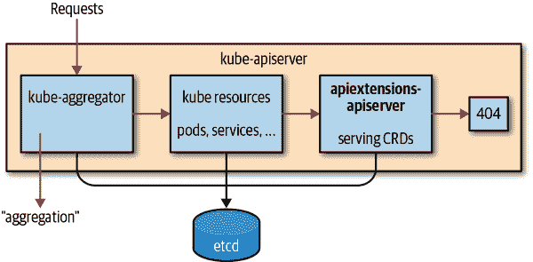
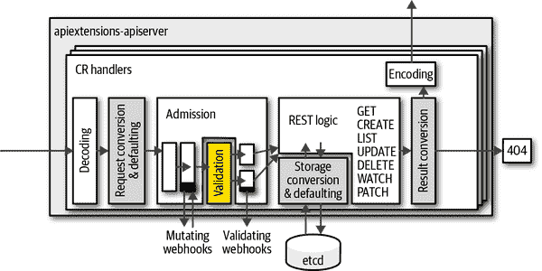

# 第四章：使用自定义资源

在本章中，我们向您介绍自定义资源（CR），这是 Kubernetes 生态系统中广泛使用的核心扩展机制之一。

自定义资源用于小型内部配置对象，没有对应的控制器逻辑——纯粹以声明方式定义。但是对于许多希望提供 Kubernetes 本地 API 体验的严肃开发项目而言，自定义资源也扮演着核心角色。例如服务网格，如 Istio、Linkerd 2.0 和 AWS App Mesh，它们都以自定义资源为核心。

还记得 第 1 章 中的“激励性例子”吗？其核心是像这样的 CR：

```
apiVersion: cnat.programming-kubernetes.info/v1alpha1
kind: At
metadata:
  name: example-at
spec:
  schedule: "2019-07-03T02:00:00Z"
status:
  phase: "pending"
```

自 Kubernetes 1.7 版本以来，每个 Kubernetes 集群都可以使用自定义资源。它们存储在与主 Kubernetes API 资源相同的 `etcd` 实例中，并由相同的 Kubernetes API 服务器提供。如 图 4-1 所示，如果资源不属于以下任何一种，请求将回退到 `apiextensions-apiserver`，它通过 CRD 定义的资源。

+   由聚合 API 服务器处理（参见 第 8 章）。

+   原生 Kubernetes 资源。



###### 图 4-1\. Kubernetes API 服务器内部的 API 扩展 API 服务器

CustomResourceDefinition（CRD）本身也是 Kubernetes 资源。它描述了集群中可用的 CR。对于前面的示例 CR，相应的 CRD 如下所示：

```
apiVersion: apiextensions.k8s.io/v1beta1
kind: CustomResourceDefinition
metadata:
  name: ats.cnat.programming-kubernetes.info
spec:
  group: cnat.programming-kubernetes.info
  names:
    kind: At
    listKind: AtList
    plural: ats
    singular: at
  scope: Namespaced
  subresources:
    status: {}
  version: v1alpha1
  versions:
  - name: v1alpha1
    served: true
    storage: true
```

CRD 的名称——在本例中为 `ats.cnat.programming-kubernetes.info`——必须与复数名称和组名匹配。它将 API 组 `cnat.programming-kubernetes.info` 中的 `At` CR 定义为命名空间资源，称为 `ats`。

如果此 CRD 在集群中创建，`kubectl` 将自动检测到该资源，用户可以通过以下方式访问它：

```
$ kubectl get ats
NAME                                         CREATED AT
ats.cnat.programming-kubernetes.info         2019-04-01T14:03:33Z
```

# 发现信息

在幕后，`kubectl` 使用来自 API 服务器的发现信息来了解新资源。让我们更深入地了解这个发现机制。

在增加 `kubectl` 的详细级别后，我们可以看到它如何学习有关新资源类型的信息：

```
$ kubectl get ats -v=7
... GET https://XXX.eks.amazonaws.com/apis/cnat.programming-kubernetes.info/
                                      v1alpha1/namespaces/cnat/ats?limit=500
... Request Headers:
... Accept: application/json;as=Table;v=v1beta1;g=meta.k8s.io,application/json
      User-Agent: kubectl/v1.14.0 (darwin/amd64) kubernetes/641856d
... Response Status: 200 OK in 607 milliseconds
NAME         AGE
example-at   43s
```

发现的详细步骤包括：

1.  最初，`kubectl` 不知道 `ats`。

1.  因此，`kubectl` 通过 */apis* 发现端点询问所有现有的 API 组。

1.  接下来，`kubectl` 通过 */apis/`group version`* 组发现端点询问所有现有 API 组中的资源。

1.  然后，`kubectl` 将给定的类型 `ats` 转换为三元组：

    +   组（这里是 `cnat.programming-kubernetes.info`）

    +   版本（这里是 `v1alpha1`）

    +   资源（这里是 `ats`）。

发现端点提供了在最后一步进行转换所需的所有必要信息：

```
$ http localhost:8080/apis/
{
  "groups": [{
    "name": "at.cnat.programming-kubernetes.info",
    "preferredVersion": {
      "groupVersion": "cnat.programming-kubernetes.info/v1",
      "version": "v1alpha1“
    },
    "versions": [{
      "groupVersion": "cnat.programming-kubernetes.info/v1alpha1",
      "version": "v1alpha1"
    }]
  }, ...]
}

$ http localhost:8080/apis/cnat.programming-kubernetes.info/v1alpha1
{
  "apiVersion": "v1",
  "groupVersion": "cnat.programming-kubernetes.info/v1alpha1",
  "kind": "APIResourceList",
  "resources": [{
    "kind": "At",
    "name": "ats",
    "namespaced": true,
    "verbs": ["create", "delete", "deletecollection",
      "get", "list", "patch", "update", "watch"
    ]
  }, ...]
}
```

这一切都由发现 `RESTMapper` 实现。我们还在 “REST Mapping” 中看到了这种非常常见的 `RESTMapper` 类型。

###### 警告

`kubectl` CLI 还在*~/.kubectl*中维护资源类型的缓存，以便在每次访问时无需重新检索发现信息。此缓存每 10 分钟失效一次。因此，CRD 的更改可能会在相应用户的 CLI 中显示最多 10 分钟后。

# 类型定义

现在让我们更详细地看看 CRD 和提供的功能：如`cnat`示例中所示，CRD 是由 Kubernetes API 服务器进程内的`apiextensions.k8s.io/v1beta1` API 组提供的 Kubernetes 资源。

CRD 的模式看起来像这样：

```
apiVersion: apiextensions.k8s.io/v1beta1
kind: CustomResourceDefinition
metadata:
  name: *`name`*
spec:
  group: *`group` `name`*
  version: *`version` `name`*
  names:
    kind: *`uppercase` `name`*
    plural: *`lowercase` `plural` `name`*
    singular: *`lowercase` `singular` `name`* # defaulted to be lowercase kind
    shortNames: *`list` `of` `strings` `as` `short` `names`* # optional
    listKind: *`uppercase` `list` `kind`* # defaulted to be *`kind`*List
    categories: *`list` `of` `category` `membership` `like` `"all"`* # optional
  validation: # optional
    openAPIV3Schema: *`OpenAPI` `schema`* # optional
  subresources: # optional
    status: {} # to enable the status subresource (optional)
    scale: # optional
      specReplicasPath: *`JSON` `path` `for` `the` `replica` `number` `in` `the` `spec` `of` `the`
                        `custom` `resource`*
      statusReplicasPath: *`JSON` `path` `for` `the` `replica` `number` `in` `the` `status` `of`
                          `the` `custom` `resource`*
      labelSelectorPath: *`JSON` `path` `of` `the` `Scale.Status.Selector` `field` `in` `the`
                         `scale` `resource`*
  versions: # defaulted to the Spec.Version field
  - name: *`version` `name`*
    served: *`boolean` `whether` `the` `version` `is` `served` `by` `the` `API` `server`* # defaults to false
    storage: *`boolean` `whether` `this` `version` `is` `the` `version` `used` `to` `store` `object`*
  - ...

```

许多字段是可选的或具有默认值。我们将在以下部分更详细地解释这些字段。

创建 CRD 对象后，`kube-apiserver`内部的`apiextensions-apiserver`将检查名称，并确定它们是否与其他资源冲突或是否在自身中保持一致。几分钟后，它将在 CRD 的状态中报告结果，例如：

```
apiVersion: apiextensions.k8s.io/v1beta1
kind: CustomResourceDefinition
metadata:
  name: ats.cnat.programming-kubernetes.info
spec:
  group: cnat.programming-kubernetes.info
  names:
    kind: At
    listKind: AtList
    plural: ats
    singular: at
  scope: Namespaced
  subresources:
    status: {}
  validation:
    openAPIV3Schema:
      type: object
      properties:
        apiVersion:
          type: string
        kind:
          type: string
        metadata:
          type: object
        spec:
          properties:
            schedule:
              type: string
          type: object
        status:
          type: object
  version: v1alpha1
  versions:
  - name: v1alpha1
    served: true
    storage: true
status:
    acceptedNames:
      kind: At
      listKind: AtList
      plural: ats
      singular: at
    conditions:
    - lastTransitionTime: "2019-03-17T09:44:21Z"
      message: no conflicts found
      reason: NoConflicts
      status: "True"
      type: NamesAccepted
    - lastTransitionTime: null
      message: the initial names have been accepted
      reason: InitialNamesAccepted
      status: "True"
      type: Established
    storedVersions:
    - v1alpha1
```

您可以看到规范中缺少的名称字段被默认，并反映在状态中作为接受的名称。此外，设置了以下条件：

+   `NamesAccepted`描述规范中给定的名称是否一致且无冲突。

+   `Established`描述 API 服务器在`status.acceptedNames`下提供给定资源的名称。

请注意，某些字段可以在创建 CRD 之后很长时间内更改。例如，您可以添加短名称或列。在这种情况下，可以建立一个 CRD，即使用旧名称提供服务，尽管规范名称存在冲突。因此，`NamesAccepted`条件将为 false，规范名称和接受名称将不同。

# 自定义资源的高级特性

在本节中，我们讨论自定义资源的高级特性，例如验证或子资源。

## 验证自定义资源

CR 可以在创建和更新期间由 API 服务器进行验证。这是基于[OpenAPI v3 模式](http://bit.ly/2RqtN5i)在 CRD 规范中的`validation`字段指定的。

当请求创建或改变 CR 时，规范中的 JSON 对象将根据此规范进行验证，如果出现错误，则冲突字段将以 HTTP 代码`400`响应返回给用户。图 4-2 显示了在`apiextensions-apiserver`内的请求处理程序中进行验证的位置。

更复杂的验证可以通过验证入站 Webhook 实现，即在一个图灵完备的编程语言中。图 4-2 显示了这些 Webhook 在本节描述的基于 OpenAPI 的验证之后直接调用的情况。在 “Admission Webhooks” 中，我们将看到如何实现和部署 Admission Webhook。在那里，我们将探讨需要考虑其他资源的验证，因此远远超出了 OpenAPI v3 验证的范围。幸运的是，对于许多用例来说，OpenAPI v3 模式已经足够了。



###### 图 4-2\. `apiextensions-apiserver` 处理程序堆栈中的验证步骤。

OpenAPI 模式语言基于 [JSON Schema 标准](http://bit.ly/2J7aIT7)，它使用 JSON/YAML 来表达模式。以下是一个示例：

```
type: object
properties:
  apiVersion:
    type: string
  kind:
    type: string
  metadata:
    type: object
  spec:
    type: object
    properties:
      schedule:
        type: string
        pattern: "^\d{4}-([0]\d|1[0-2])-([0-2]\d|3[01])..."
      command:
        type: string
    required:
    - schedule
    - command
  status:
    type: object
    properties:
      phase:
        type: string
required:
- metadata
- apiVersion
- kind
- spec
```

该模式指定该值实际上是一个 JSON 对象；^(1) 也就是说，它是一个字符串映射，而不是一个切片或者像数字那样的值。此外，除了自定义资源隐式定义的 `metadata`、`kind` 和 `apiVersion` 外，还有两个额外的属性：`spec` 和 `status`。

每个也是一个 JSON 对象。`spec` 也有两个必填字段 `schedule` 和 `command`，它们都是字符串。`schedule` 必须匹配 ISO 日期的模式（这里用一些正则表达式进行了概述）。可选的 `status` 属性有一个称为 `phase` 的字符串字段。

手动创建 OpenAPI 模式可能会很繁琐。幸运的是，通过代码生成正在进行的工作使这个过程变得更加简单：Kubebuilder 项目——参见 “Kubebuilder”——开发了 *sig.k8s.io/controller-tools* 中的 `crd-gen`，并逐步扩展到可以在其他环境中使用。生成器 `crd-schema-gen` 是 `crd-gen` 在这个方向上的一个分支。

## 短名称和类别

与原生资源类似，自定义资源可能具有较长的资源名称。它们在 API 级别上非常好用，但在 CLI 中键入时可能很繁琐。CRs 也可以有短名称，比如原生资源 `daemonsets`，可以使用 `kubectl get ds` 来查询。这些短名称也称为别名，每个资源可以有任意数量的别名。

要查看所有可用的短名称，请使用如下命令：`kubectl api-resources`。

```
$ kubectl api-resources
NAME                   SHORTNAMES  APIGROUP NAMESPACED  KIND
bindings                                    true Binding
componentstatuses      cs                   false ComponentStatus
configmaps             cm                   true ConfigMap
endpoints              ep                   true Endpoints
events                 ev                   true Event
limitranges            limits               true LimitRange
namespaces             ns                   false Namespace
nodes                  no                   false Node
persistentvolumeclaims pvc                  true PersistentVolumeClaim
persistentvolumes      pv                   false PersistentVolume
pods                   po                   true Pod
statefulsets           sts         apps     true StatefulSet
...
```

同样，`kubectl` 通过发现信息了解有关短名称的信息（参见 “Discovery Information”）。以下是一个示例：

```
apiVersion: apiextensions.k8s.io/v1beta1
kind: CustomResourceDefinition
metadata:
  name: ats.cnat.programming-kubernetes.info
spec:
  ...
  shortNames:
  - at
```

之后，`kubectl get at` 将列出命名空间中的所有 `cnat` CR。

此外，CRs——与任何其他资源一样——可以成为类别的一部分。最常见的用法是 `all` 类别，例如 `kubectl get all`。它列出集群中所有面向用户的资源，如 pods 和 services。

在集群中定义的 CR 可以通过 `categories` 字段加入类别或创建自己的类别：

```
apiVersion: apiextensions.k8s.io/v1beta1
kind: CustomResourceDefinition
metadata:
  name: ats.cnat.programming-kubernetes.info
spec:
  ...
  categories:
  - all
```

使用这种方法，`kubectl get all`还将在命名空间中列出`cnat` CR。

## 打印列

`kubectl` CLI 工具使用服务器端打印来呈现`kubectl get`的输出。这意味着它查询 API 服务器以获取要显示的列和每行中的值。

自定义资源还支持通过`additionalPrinterColumns`定义服务器端打印列。它们称为“附加”列，因为第一列始终是对象的名称。这些列定义如下：

```
apiVersion: apiextensions.k8s.io/v1beta1
kind: CustomResourceDefinition
metadata:
  name: ats.cnat.programming-kubernetes.info
spec:
  additionalPrinterColumns: (optional)
  - name: *`kubectl` `column` `name`*
    type: *`OpenAPI` `type` `for` `the` `column`*
    format: *`OpenAPI` `format` `for` `the` `column`* (optional)
    description: *`human-readable` `description` `of` `the` `column`* (optional)
    priority: *`integer,` `always` `zero` `supported` `by` `kubectl`*
    JSONPath: *`JSON` `path` `inside` `the` `CR` `for` `the` `displayed` `value`*

```

`name`字段是列名，`type`是 OpenAPI 类型，如规范中的[data types](http://bit.ly/2N0DSY4)部分定义，`format`（如同一文档中定义的）是可选的，可能会被`kubectl`或其他客户端解释。

此外，`description`是一个可选的人类可读字符串，用于文档目的。`priority`控制了`kubectl`的显示详细模式。在撰写本文时（使用 Kubernetes 1.14），仅支持零，并且所有优先级高于零的列都将隐藏。

最后，`JSONPath`定义了要显示的值。它是 CR 内的简单 JSON 路径。这里的“简单”意味着它支持对象字段语法，如`.spec.foo.bar`，但不支持更复杂的循环数组或类似的 JSON 路径。

使用这种方法，可以像这样扩展介绍中的示例 CRD，添加`additionalPrinterColumns`：

```
additionalPrinterColumns: #(optional)
- name: schedule
  type: string
  JSONPath: .spec.schedule
- name: command
  type: string
  JSONPath: .spec.command
- name: phase
  type: string
  JSONPath: .status.phase
```

然后`kubectl`将以以下方式呈现`cnat`资源：

```
$ kubectl get ats
NAME  SCHEDULER             COMMAND             PHASE
foo   2019-07-03T02:00:00Z  echo "hello world"  Pending
```

接下来，我们来看看子资源。

## 子资源

我们在“状态子资源：UpdateStatus”中简要提到了子资源。子资源是特殊的 HTTP 端点，使用附加到正常资源的 HTTP 路径后缀。例如，Pod 的标准 HTTP 路径是*/api/v1/namespace/`namespace`/pods/`name`*。Pod 具有多个子资源，如*/logs*、*/portforward*、*/exec*和*/status*。相应的子资源 HTTP 路径如下：

+   */api/v1/namespace/*`namespace`*/pods/*`name`*/logs*

+   */api/v1/namespace/*`namespace`*/pods/*`name`*/portforward*

+   */api/v1/namespace/*`namespace`*/pods/*`name`*/exec*

+   */api/v1/namespace/*`namespace`*/pods/*`name`*/status*

子资源端点使用与主资源端点不同的协议。

在撰写本文时，自定义资源支持两个子资源：*/scale*和*/status*。两者都是选择性的，即在 CRD 中必须显式启用它们。

### 状态子资源

*/status*子资源用于将 CR 实例的用户提供的规范与控制器提供的状态分开。这样做的主要动机是特权分离：

+   用户通常不应编写状态字段。

+   控制器不应编写规范字段。

访问控制的 RBAC 机制不允许在该级别的规则。这些规则始终是每个资源独立的。*/status* 子资源通过提供两个独立的端点来解决这个问题。每个端点可以独立地通过 RBAC 规则进行控制。这通常被称为 *spec-status split* 的例子是对 `ats` 资源的规则，仅适用于 */status* 子资源（而 `"ats"` 将匹配主资源）：

```
apiVersion: rbac.authorization.k8s.io/v1
kind: Role
metadata: ...
rules:
- apiGroups: [""]
  resources: ["ats/status"]
  verbs: ["update", "patch"]
```

拥有 */status* 子资源的资源（包括自定义资源）语义发生了变化，同样适用于主资源端点：

+   在创建期间（在创建期间状态只是被丢弃）和更新期间，它们忽略在主 HTTP 端点上对状态的更改。

+   同样地，*/status* 子资源端点忽略负载状态以外的更改。在 */status* 端点上的创建操作是不可能的。

+   每当 `metadata` 以外和 `status` 以外的内容发生变化（尤其是规范中的变化），主资源端点将增加 `metadata.generation` 的值。这可用作控制器的触发器，指示用户的需求已变更。

注意通常在更新请求中同时发送 `spec` 和 `status`，但从技术上讲，你可以在请求负载中省略另一个相应的部分。

还要注意 */status* 端点将忽略状态以外的所有内容，包括标签或注解的元数据更改。

自定义资源的 *spec-status* 分离启用如下：

```
apiVersion: apiextensions.k8s.io/v1beta1
kind: CustomResourceDefinition
spec:
  subresources:
    status: {}
  ...
```

在这里注意，在该 YAML 片段中，`status` 字段被分配为空对象。这是设置一个没有其他属性的字段的方法。只需写

```
subresources:
  status:
```

会导致验证错误，因为在 YAML 中结果为 `status` 的值是 `null`。

###### 警告

启用 `spec-status` 分离对 API 是一个破坏性的变更。旧控制器将写入主要的端点。他们不会注意到从启用分离的那一刻起状态总是被忽略。同样，新控制器在分离启用之前不能写入新的 */status* 端点。

在 Kubernetes 1.13 及更高版本中，可以按版本配置子资源。这使我们可以引入 */status* 子资源而不会引入破坏性变更：

```
apiVersion: apiextensions.k8s.io/v1beta1
kind: CustomResourceDefinition
spec:
  ...
  versions:
  - name: v1alpha1
    served: true
    storage: true
  - name: v1beta1
    served: true
    subresources:
      status: {}
```

这使得 `v1beta1` 可以使用 */status* 子资源，但 `v1alpha1` 不行。

###### 注意

乐观并发语义（参见 “乐观并发”）与主资源端点相同；即 `status` 和 `spec` 共享相同的资源版本计数器，因此 */status* 更新可能由于对主资源的写入而发生冲突，反之亦然。换句话说，存储层没有 `spec` 和 `status` 的分离。

### 缩放子资源

自定义资源的第二个子资源是*/scale*。*/scale*子资源是资源的（投影）^(2)视图，允许我们仅查看和修改复制品值。这个子资源对于 Kubernetes 中的部署和副本集等资源是众所周知的，这些资源显然可以进行水平扩展和缩减。

`kubectl scale`命令使用*/scale*子资源；例如，以下命令将修改给定实例中指定的复制品值：

```
$ kubectl scale --replicas=3 *`your-custom-resource`* -v=7
I0429 21:17:53.138353   66743 round_trippers.go:383] PUT
https://*`host`*/apis/*`group`*/v1/*`your-custom-resource`*/scale

```

```
apiVersion: apiextensions.k8s.io/v1beta1
kind: CustomResourceDefinition
spec:
  subresources:
    scale:
      specReplicasPath: .spec.replicas
      statusReplicasPath: .status.replicas
      labelSelectorPath: .status.labelSelector
  ...
```

更新复制品值的过程中，写入了`spec.replicas`并在`GET`期间从那里返回。

不能通过*/status*子资源更改标签选择器，只能读取。它的目的是为控制器提供信息，以计算满足此选择器的相应对象。例如，`ReplicaSet`控制器计算满足此选择器的相应 Pod 数。

标签选择器是可选的。如果您的自定义资源语义不适合标签选择器，只需不为其指定 JSON 路径即可。

在前述`kubectl scale --replicas=3 ...`示例中，值`3`被写入`spec.replicas`。当然也可以使用其他简单的 JSON 路径；例如，根据上下文，`spec.instances`或`spec.size`将是一个合理的字段名称。

从端点读取或写入的对象的种类是来自`autoscaling/v1` API 组的`Scale`。它的外观如下：

```
type Scale struct {
    metav1.TypeMeta `json:",inline"`
    // Standard object metadata; More info: https://git.k8s.io/
    // community/contributors/devel/api-conventions.md#metadata.
    // +optional
    metav1.ObjectMeta `json:"metadata,omitempty"`

    // defines the behavior of the scale. More info: https://git.k8s.io/community/
    // contributors/devel/api-conventions.md#spec-and-status.
    // +optional
    Spec ScaleSpec `json:"spec,omitempty"`

    // current status of the scale. More info: https://git.k8s.io/community/
    // contributors/devel/api-conventions.md#spec-and-status. Read-only.
    // +optional
    Status ScaleStatus `json:"status,omitempty"`
}

// ScaleSpec describes the attributes of a scale subresource.
type ScaleSpec struct {
    // desired number of instances for the scaled object.
    // +optional
    Replicas int32 `json:"replicas,omitempty"`
}

// ScaleStatus represents the current status of a scale subresource.
type ScaleStatus struct {
    // actual number of observed instances of the scaled object.
    Replicas int32 `json:"replicas"`

    // label query over pods that should match the replicas count. This is the
    // same as the label selector but in the string format to avoid
    // introspection by clients. The string will be in the same
    // format as the query-param syntax. More info about label selectors:
    // http://kubernetes.io/docs/user-guide/labels#label-selectors.
    // +optional
    Selector string `json:"selector,omitempty"`
}
```

一个实例看起来像这样：

```
metadata:
  name: *`cr-name`*
  namespace: *`cr-namespace`*
  uid: *`cr-uid`*
  resourceVersion: *`cr-resource-version`*
  creationTimestamp: *`cr-creation-timestamp`*
spec:
  replicas: 3
  status:
    replicas: 2
    selector: "environment = production"

```

注意，乐观并发语义对主资源和*/scale*子资源是相同的。也就是说，主资源的写入可能与*/scale*写入冲突，反之亦然。

# 开发者对自定义资源的看法

可以使用多种客户端从 Golang 访问自定义资源。我们将集中讨论以下内容：

+   使用`client-go`动态客户端（参见“动态客户端”）

+   使用类型化的客户端：

    +   由[kubernetes-sigs/controller-runtime](http://bit.ly/2ZFtDKd)提供，并由 Operator SDK 和 Kubebuilder 使用（参见“Operator SDK 和 Kubebuilder 的 controller-runtime 客户端”）。

    +   由`client-gen`生成，例如[*k8s.io/client-go/kubernetes*](http://bit.ly/2FnmGWA)中的（参见“通过 client-gen 创建的类型化客户端”）。

使用哪种客户端主要取决于要编写的代码的上下文，特别是实现逻辑的复杂性和要求（例如，是否需要动态和支持编译时未知的 GVK）。

前述客户端列表：

+   降低处理未知 GVK 的灵活性。

+   类型安全性的增加。

+   增加提供的 Kubernetes API 功能的完整性。

## 动态客户端

[*k8s.io/client-go/dynamic*](http://bit.ly/2Y6eeSK)中的动态客户端完全与已知的 GVKs 无关。它甚至不使用除[*unstructured.Unstructured*](http://bit.ly/2WYZ6oS)外的任何 Go 类型，后者仅包装了`json.Unmarshal`及其输出。

动态客户端既不使用方案（scheme）也不使用 RESTMapper。这意味着开发者必须通过提供 GVR 形式的资源（参见“资源”）手动提供关于类型的所有知识：

```
schema.GroupVersionResource{
  Group: "apps",
  Version: "v1",
  Resource: "deployments",
}
```

如果存在 REST 客户端配置（参见“创建和使用客户端”），动态客户端可以在一行中创建：

```
client, err := NewForConfig(cfg)
```

对给定 GVR 的 REST 访问同样简单：

```
client.Resource(gvr).
   Namespace(namespace).Get("foo", metav1.GetOptions{})
```

这为您提供了在给定命名空间中的部署`foo`。

###### 注意

您必须了解资源的范围（即它是命名空间范围的还是集群范围的）。集群范围的资源只需省略`Namespace(namespace)`调用。

动态客户端的输入和输出是`*unstructured.Unstructured`—即一个包含与`json.Unmarshal`在解组时输出相同数据结构的对象：

+   对象由`map[string]interface{}`表示。

+   数组由`[]interface{}`表示。

+   原始类型是`string`、`bool`、`float64`或`int64`。

方法`UnstructuredContent()`提供对非结构化对象内部数据结构的访问（我们也可以直接访问`Unstructured.Object`）。同一包中有助手函数使得字段的检索变得容易，并且可以对对象进行操作，例如：

```
name, found, err := unstructured.NestedString(u.Object, "metadata", "name")
```

返回部署名称——在这种情况下是`"foo"`。如果字段确实存在（不仅仅是空的，而是确实存在），则`found`为`true`。`err`报告如果现有字段的类型是意外的（在这种情况下不是字符串）。其他帮助函数是通用的，一次是结果的深度拷贝，一次没有：

```
func NestedFieldCopy(obj map[string]interface{}, fields ...string)
  (interface{}, bool, error)
func NestedFieldNoCopy(obj map[string]interface{}, fields ...string)
  (interface{}, bool, error)
```

还有其他的类型化变体，如果类型转换失败则返回错误：

```
func NestedBool(obj map[string]interface{}, fields ...string) (bool, bool, error)
func NestedFloat64(obj map[string]interface{}, fields ...string)
  (float64, bool, error)
func NestedInt64(obj map[string]interface{}, fields ...string) (int64, bool, error)
func NestedStringSlice(obj map[string]interface{}, fields ...string)
  ([]string, bool, error)
func NestedSlice(obj map[string]interface{}, fields ...string)
  ([]interface{}, bool, error)
func NestedStringMap(obj map[string]interface{}, fields ...string)
  (map[string]string, bool, error)
```

最后是一个通用的设置器：

```
func SetNestedField(obj, value, path...)
```

动态客户端在 Kubernetes 中本身用于通用控制器，例如垃圾回收控制器，它删除其父对象消失的对象。垃圾回收控制器可以处理系统中的任何资源，因此广泛使用动态客户端。

## 类型化客户端

类型化客户端不使用类似`map[string]interface{}`的通用数据结构，而是使用真正的 Golang 类型，这些类型对于每个 GVK 都是不同的和特定的。它们更容易使用，具有显著增加的类型安全性，并且使代码更加简洁和可读。但缺点是，它们不太灵活，因为处理的类型必须在编译时已知，并且这些客户端是生成的，这增加了复杂性。

在进入类型化客户端的两个实现之前，让我们深入了解 Golang 类型系统中的种类表示（参见“深入理解 API 机制”了解 Kubernetes 类型系统背后的理论）。

### 类型的解剖

类型以 Golang 结构体表示。通常，结构体的命名与其类型相同（尽管从技术上讲不一定如此），并且放置在与手头 GVK 的组和版本对应的包中。一个常见的约定是将 GVK *`group`*/*`version`*.*`Kind`*放入一个 Go 包中：

```
pkg/apis/*group*/*version*

```

并在文件*types.go*中定义一个 Golang 结构体*`Kind`*。

每个对应于 GVK 的 Golang 类型都嵌入来自包[*k8s.io/apimachinery/pkg/apis/meta/v1*](http://bit.ly/2Y5HdWT)的`TypeMeta`结构体。 `TypeMeta`仅由`Kind`和`ApiVersion`字段组成：

```
type TypeMeta struct {
    // +optional
    APIVersion string `json:"apiVersion,omitempty" yaml:"apiVersion,omitempty"`
    // +optional
    Kind string `json:"kind,omitempty" yaml:"kind,omitempty"`
}
```

此外，每个顶级类型——即具有自己的端点和因此一个（或多个）对应的 GVR（参见“REST 映射”）——必须存储名称，对于命名空间资源的命名空间，以及一系列非常多的进一步的元层字段。所有这些都存储在一个名为`ObjectMeta`的结构体中，位于包[*k8s.io/apimachinery/pkg/apis/meta/v1*](http://bit.ly/2XSt8eo)中：

```
type ObjectMeta struct {
    Name string `json:"name,omitempty"`
    Namespace string `json:"namespace,omitempty"`
    UID types.UID `json:"uid,omitempty"`
    ResourceVersion string `json:"resourceVersion,omitempty"`
    CreationTimestamp Time `json:"creationTimestamp,omitempty"`
    DeletionTimestamp *Time `json:"deletionTimestamp,omitempty"`
    Labels map[string]string `json:"labels,omitempty"`
    Annotations map[string]string `json:"annotations,omitempty"`
    ...
}
```

还有一些额外的字段。我们强烈建议您仔细阅读[详细的内联文档](http://bit.ly/2IutNyh)，因为它很好地展示了 Kubernetes 对象的核心功能。

Kubernetes 顶层类型（即具有嵌入的`TypeMeta`和`ObjectMeta`，并且在这种情况下被持久化到`etcd`中）在外观上非常相似，因为它们通常具有一个`spec`和一个`status`。参见来自[*k8s.io/kubernetes/apps/v1/types.go*](http://bit.ly/2RroTFb)的部署示例：

```
type Deployment struct {
    metav1.TypeMeta `json:",inline"`
    metav1.ObjectMeta `json:"metadata,omitempty"`

    Spec DeploymentSpec `json:"spec,omitempty"`
    Status DeploymentStatus `json:"status,omitempty"`
}
```

虽然`spec`和`status`类型的实际内容在不同类型之间有显著差异，但是将其分为`spec`和`status`在 Kubernetes 中是一个常见的主题或约定，尽管从技术上讲并非必须如此。因此，跟随 CRD 的这种结构是一个良好的做法。某些 CRD 功能甚至要求这种结构；例如，用于自定义资源的*/status*子资源（见“状态子资源”）——当启用时——始终仅适用于自定义资源实例的`status`子结构。它无法重命名。

### Golang 包结构

正如我们所见，Golang 类型传统上放置在包*pkg/apis/`group`/`version`*的文件*types.go*中。除了该文件外，我们还要浏览几个文件。一些是由开发人员手动编写的，而一些是使用代码生成器生成的。有关详细信息，请参阅第五章。

*doc.go*文件描述了 API 的目的，并包含一些包全局的代码生成标签：

```
// Package v1alpha1 contains the cnat v1alpha1 API group
//
// +k8s:deepcopy-gen=package
// +groupName=cnat.programming-kubernetes.info
package v1alpha1
```

接下来，*register.go*包括帮助程序，将自定义资源的 Golang 类型注册到方案中（参见“Scheme”）：

```
package *`version`*

import (
    metav1 "k8s.io/apimachinery/pkg/apis/meta/v1"
    "k8s.io/apimachinery/pkg/runtime"
    "k8s.io/apimachinery/pkg/runtime/schema"

    group "*`repo`*/pkg/apis/*`group`*"
)

// SchemeGroupVersion is group version used to register these objects var SchemeGroupVersion = schema.GroupVersion{
    Group: group.GroupName,
    Version: "*`version`*",
}

// Kind takes an unqualified kind and returns back a Group qualified GroupKind func Kind(kind string) schema.GroupKind {
    return SchemeGroupVersion.WithKind(kind).GroupKind()
}

// Resource takes an unqualified resource and returns a Group // qualified GroupResource func Resource(resource string) schema.GroupResource {
    return SchemeGroupVersion.WithResource(resource).GroupResource()
}

var (
    SchemeBuilder = runtime.NewSchemeBuilder(addKnownTypes)
    AddToScheme   = SchemeBuilder.AddToScheme
)

// Adds the list of known types to Scheme. func addKnownTypes(scheme *runtime.Scheme) error {
    scheme.AddKnownTypes(SchemeGroupVersion,
        &SomeKind{},
        &SomeKindList{},
    )
    metav1.AddToGroupVersion(scheme, SchemeGroupVersion)
    return nil
}

```

然后，*zz_generated.deepcopy.go* 在自定义资源的 Golang 顶层类型上定义了深度复制方法（例如，在前面的示例代码中的 `SomeKind` 和 `SomeKindList`）。此外，所有子结构（如 `spec` 和 `status`）也变得可以深度复制。

因为示例中在 *doc.go* 中使用了标签 `+k8s:deepcopy-gen=package`，所以深度复制生成是基于 opt-out 基础的；也就是说，对于不使用 `+k8s:deepcopy-gen=false` 退出的包中的每种类型，都会生成 `DeepCopy` 方法。详见 第五章 和特别是 “deepcopy-gen Tags” 获取更多细节。

### 通过 client-gen 生成的类型化客户端

使用 API 包 *pkg/apis/`group`/`version`*，客户端生成器 `client-gen` 创建了一个类型化的客户端（详见 第五章，特别是 “client-gen Tags”），默认情况下在 *pkg/generated/clientset/versioned* 中（在旧版生成器中是 pkg/client/clientset/versioned）。更准确地说，生成的顶层对象是一个客户端集。它涵盖了多个 API 组、版本和资源。

[顶层文件](http://bit.ly/2GdcikH) 如下所示：

```
// Code generated by client-gen. DO NOT EDIT.

package versioned

import (
    discovery "k8s.io/client-go/discovery"
    rest "k8s.io/client-go/rest"
    flowcontrol "k8s.io/client-go/util/flowcontrol"

    cnatv1alpha1 ".../cnat/cnat-client-go/pkg/generated/clientset/versioned/
)

type Interface interface {
    Discovery() discovery.DiscoveryInterface
    CnatV1alpha1() cnatv1alpha1.CnatV1alpha1Interface
}

// Clientset contains the clients for groups. Each group has exactly one
// version included in a Clientset.
type Clientset struct {
    *discovery.DiscoveryClient
    cnatV1alpha1 *cnatv1alpha1.CnatV1alpha1Client
}

// CnatV1alpha1 retrieves the CnatV1alpha1Client
func (c *Clientset) CnatV1alpha1() cnatv1alpha1.CnatV1alpha1Interface {
    return c.cnatV1alpha1
}

// Discovery retrieves the DiscoveryClient
func (c *Clientset) Discovery() discovery.DiscoveryInterface {
   ...
}

// NewForConfig creates a new Clientset for the given config.
func NewForConfig(c *rest.Config) (*Clientset, error) {
    ...
}
```

客户端集由接口 `Interface` 表示，并为每个版本的 API 组客户端接口提供访问，例如，在此示例代码中是 `CnatV1alpha1Interface`：

```
type CnatV1alpha1Interface interface {
    RESTClient() rest.Interface
    AtsGetter
}

// AtsGetter has a method to return a AtInterface.
// A group's client should implement this interface.
type AtsGetter interface {
    Ats(namespace string) AtInterface
}

// AtInterface has methods to work with At resources.
type AtInterface interface {
    Create(*v1alpha1.At) (*v1alpha1.At, error)
    Update(*v1alpha1.At) (*v1alpha1.At, error)
    UpdateStatus(*v1alpha1.At) (*v1alpha1.At, error)
    Delete(name string, options *v1.DeleteOptions) error
    DeleteCollection(options *v1.DeleteOptions, listOptions v1.ListOptions) error
    Get(name string, options v1.GetOptions) (*v1alpha1.At, error)
    List(opts v1.ListOptions) (*v1alpha1.AtList, error)
    Watch(opts v1.ListOptions) (watch.Interface, error)
    Patch(name string, pt types.PatchType, data []byte, subresources ...string)
        (result *v1alpha1.At, err error)
    AtExpansion
}
```

可以使用 `NewForConfig` 辅助函数创建客户端集的实例。这类似于讨论的核心 Kubernetes 资源的客户端，详见 “Creating and Using a Client”：

```
import (
    metav1 "k8s.io/apimachinery/pkg/apis/meta/v1"
    "k8s.io/client-go/tools/clientcmd"

    client "github.com/.../cnat/cnat-client-go/pkg/generated/clientset/versioned"
)

kubeconfig = flag.String("kubeconfig", "~/.kube/config", "kubeconfig file")
flag.Parse()
config, err := clientcmd.BuildConfigFromFlags("", *kubeconfig)
clientset, err := client.NewForConfig(config)

ats := clientset.CnatV1alpha1Interface().Ats("default")
book, err := ats.Get("kubernetes-programming", metav1.GetOptions{})
```

正如您所见，代码生成机制使我们可以以与核心 Kubernetes 资源完全相同的方式编写自定义资源的逻辑。还提供了像 informers 这样的高级工具；在 第五章 中查看 `informer-gen`。

## Operator SDK 和 Kubebuilder 的 controller-runtime 客户端

为了完整起见，我们想快速查看第三个客户端，它被列为 “A Developer’s View on Custom Resources” 中的第二个选项。`controller-runtime` 项目提供了操作员解决方案 Operator SDK 和 Kubebuilder 的基础，包括一个使用在 “Anatomy of a type” 中介绍的 Go 类型的客户端。

与以前 “Typed client created via client-gen” 生成的客户端相比，以及与 “Dynamic Client” 类似，这个客户端是一个实例，能够处理注册在给定方案中的任何类型。

它使用来自 API 服务器的发现信息将种类映射到 HTTP 路径。请注意，第六章 将更详细地讨论此客户端作为这两个操作员解决方案的一部分的使用方式。

下面是如何使用 `controller-runtime` 的快速示例：

```
import (
    "flag"

    corev1 "k8s.io/api/core/v1"
    metav1 "k8s.io/apimachinery/pkg/apis/meta/v1"
    "k8s.io/client-go/kubernetes/scheme"
    "k8s.io/client-go/tools/clientcmd"

    runtimeclient "sigs.k8s.io/controller-runtime/pkg/client"
)

kubeconfig = flag.String("kubeconfig", "~/.kube/config", "kubeconfig file path")
flag.Parse()
config, err := clientcmd.BuildConfigFromFlags("", *kubeconfig)

cl, _ := runtimeclient.New(config, client.Options{
    Scheme: scheme.Scheme,
})
podList := &corev1.PodList{}
err := cl.List(context.TODO(), client.InNamespace("default"), podList)
```

客户端对象的`List()`方法接受任何在给定方案中注册的`runtime.Object`，在这种情况下，是从`client-go`借用的所有标准 Kubernetes 种类。在内部，客户端使用给定的方案将 Golang 类型`*corev1.PodList`映射到 GVK。在第二步中，`List()`方法使用发现信息来获取 pods 的 GVR，即`schema.GroupVersionResource{"", "v1", "pods"}`，因此访问*/api/v1/namespace/default/pods*来获取传递命名空间中 pods 的列表。

同样的逻辑可以用于自定义资源。主要区别在于使用包含传递的 Go 类型的自定义方案：

```
import (
    "flag"

    corev1 "k8s.io/api/core/v1"
    metav1 "k8s.io/apimachinery/pkg/apis/meta/v1"
    "k8s.io/client-go/kubernetes/scheme"
    "k8s.io/client-go/tools/clientcmd"

    runtimeclient "sigs.k8s.io/controller-runtime/pkg/client"
    cnatv1alpha1 "github.com/.../cnat/cnat-kubebuilder/pkg/apis/cnat/v1alpha1"
)

kubeconfig = flag.String("kubeconfig", "~/.kube/config", "kubeconfig file")
flag.Parse()
config, err := clientcmd.BuildConfigFromFlags("", *kubeconfig)

crScheme := runtime.NewScheme()
cnatv1alpha1.AddToScheme(crScheme)

cl, _ := runtimeclient.New(config, client.Options{
    Scheme: crScheme,
})
list := &cnatv1alpha1.AtList{}
err := cl.List(context.TODO(), client.InNamespace("default"), list)
```

注意`List()`命令的调用方式完全没有变化。

想象一下，您编写了一个操作器，该操作器使用此客户端访问许多不同种类的资源。使用“通过 client-gen 创建的类型化客户端”，您将不得不将许多不同的客户端传递给操作器，使得管道代码非常复杂。相比之下，这里介绍的`controller-runtime`客户端只是一个适用于所有种类的对象。

所有三种类型的客户端都有它们的用途，具体取决于它们被使用的上下文中的优势和劣势。在处理未知对象的通用控制器中，只能使用动态客户端。在类型安全性对于强制代码正确性有很大帮助的控制器中，生成的客户端非常合适。Kubernetes 项目本身有很多贡献者，因此代码的稳定性非常重要，即使它被许多人扩展和重写。如果方便性和高速度以及最小化的管道代码是重要的话，`controller-runtime`客户端就非常适合。

# 摘要

我们在本章向您介绍了自定义资源，这是 Kubernetes 生态系统中使用的中心扩展机制。到目前为止，您应该对它们的特性和限制以及可用的客户端有了很好的理解。

现在让我们继续进行用于管理上述资源的代码生成。

^(1) 不要在这里混淆 Kubernetes 和 JSON 对象。后者只是 JSON 上下文中字符串映射的另一个术语，在 OpenAPI 中使用。

^(2) 这里的“投影”意味着`scale`对象是主资源的投影，它仅显示特定字段并隐藏其他所有内容。
