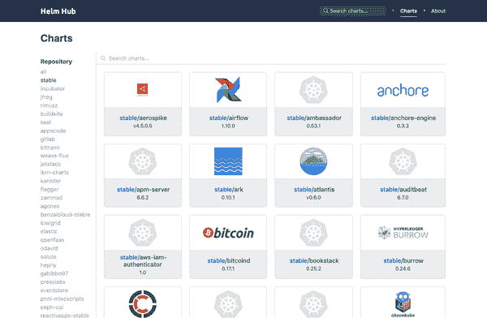
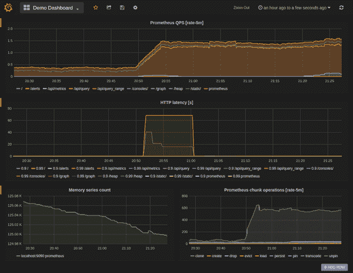

# 第七章：控制器和操作符的发布

现在您已经熟悉了自定义控制器的开发，让我们进入如何使您的自定义控制器和操作符达到生产就绪的话题。在本章中，我们将讨论控制器和操作符的操作方面，向您展示如何打包它们，引导您运行控制器的最佳实践，并确保您的扩展点不会破坏您的 Kubernetes 集群，无论是从安全性还是性能方面。

# 生命周期管理和打包

在本节中，我们考虑操作符的生命周期管理。也就是说，我们将讨论如何打包和发布您的控制器或操作符，以及如何处理升级问题。当您准备将您的操作符交付给用户时，您需要一种方法让他们安装它。为此，您需要打包相应的工件，例如定义控制器二进制文件（通常作为 Kubernetes 部署的 YAML 清单），以及 CRD 和与安全相关的资源，如服务账户和必要的 RBAC 权限。一旦您的目标用户运行了某个版本的操作符，您还希望有一个机制来升级控制器，考虑版本控制和潜在的零停机升级。

让我们从低 hanging 的水果开始：打包和交付您的控制器，以便用户可以以简单的方式安装它。

## 打包：挑战

虽然 Kubernetes 用清单定义资源，通常以 YAML 编写，声明资源状态的低级接口，但这些清单文件存在缺陷。在打包容器化应用的上下文中最重要的是，YAML 清单是静态的；也就是说，YAML 清单中的所有值都是固定的。这意味着，例如，如果您想在 [部署清单](http://bit.ly/2WZ1uRD) 中更改容器映像，您必须创建一个新的清单。

让我们看一个具体的例子。假设您有以下 Kubernetes 部署编码在一个名为 *mycontroller.yaml* 的 YAML 清单中，代表您希望用户安装的自定义控制器：

```
apiVersion: apps/v1beta1
kind: Deployment
metadata:
  name: mycustomcontroller
spec:
  replicas: 1
  template:
    metadata:
      labels:
        app: customcontroller
    spec:
      containers:
      - name: thecontroller
        image: example/controller:0.1.0
        ports:
        - containerPort: 9999
        env:
        - name: REGION
          value: eu-west-1
```

想象一下环境变量 `REGION` 定义了您的控制器的某些运行时属性，例如其他服务的可用性，比如托管服务网格。换句话说，虽然 `eu-west-1` 的默认值可能是合理的，但用户可以并且很可能会根据自己的偏好或政策进行覆盖。

现在，考虑到 YAML 清单 *mycontroller.yaml* 本身是一个静态文件，在编写时定义了所有的值——而像 `kubectl` 这样的客户端并不本质上支持清单中的可变部分——那么在运行时如何让用户提供变量值或覆盖现有值呢？也就是说，在上述示例中，用户如何在安装时将 `REGION` 设置为比如 `us-east-2`，使用（例如）`kubectl apply`？

为了克服在 Kubernetes 中构建时静态 YAML 清单的限制，有几种选项可以模板化清单（例如 Helm），或者根据用户提供的值或运行时属性启用变量输入（例如 Kustomize）。

## Helm

[Helm](https://helm.sh)，自称为 Kubernetes 的包管理器，最初由 Deis 开发，现在是 Cloud Native Computing Foundation ([CNCF](https://www.cncf.io)) 的项目，主要贡献者包括微软、谷歌和 Bitnami（现为 VMware 的一部分）。

Helm 通过定义和应用所谓的图表，有效地参数化 YAML 清单，帮助您安装和升级 Kubernetes 应用程序。以下是 [示例图表模板](http://bit.ly/2XmLk3R) 的摘录：

```
apiVersion: apps/v1
kind: Deployment
metadata:
  name: {{ include "flagger.fullname" . }}
...
spec:
  replicas: 1
  strategy:
    type: Recreate
  selector:
    matchLabels:
      app.kubernetes.io/name: {{ template "flagger.name" . }}
      app.kubernetes.io/instance: {{ .Release.Name }}
  template:
    metadata:
      labels:
        app.kubernetes.io/name: {{ template "flagger.name" . }}
        app.kubernetes.io/instance: {{ .Release.Name }}
    spec:
      serviceAccountName: {{ template "flagger.serviceAccountName" . }}
      containers:
        - name: flagger
          securityContext:
            readOnlyRootFilesystem: true
            runAsUser: 10001
          image: "{{ .Values.image.repository }}:{{ .Values.image.tag }}"
```

如您所见，变量以 `{{ ._Some.value.here_ }}` 格式编码，这恰好是 [Go 模板](http://bit.ly/2N2Q3DW)。

要安装图表，可以运行 `helm install` 命令。虽然 Helm 有几种查找和安装图表的方法，但最简单的方法是使用官方稳定版图表之一：

```
# get the latest list of charts:
$ helm repo update

# install MySQL:
$ helm install stable/mysql
Released smiling-penguin

# list running apps:
$ helm ls
NAME             VERSION   UPDATED                   STATUS    CHART
smiling-penguin  1         Wed Sep 28 12:59:46 2016  DEPLOYED  mysql-0.1.0

# remove it:
$ helm delete smiling-penguin
Removed smiling-penguin
```

要打包您的控制器，您需要为其创建一个 Helm 图表，并将其发布到某个地方，默认情况下发布到通过 [Helm Hub](https://hub.helm.sh) 索引和访问的公共存储库，如 图 7-1 所示。



###### 图 7-1\. Helm Hub 屏幕截图显示公开可用的 Helm 图表

欲了解如何创建 Helm 图表的更多指导，请随意查阅以下资源：

+   Bitnami 出色的文章 [“如何创建您的第一个 Helm 图表”](http://bit.ly/2ZIlODJ)。

+   [“将 S3 用作 Helm 存储库”](http://bit.ly/2KzwLDY)，如果您希望将图表保存在自己的组织中。

+   官方 Helm 文档：[“图表最佳实践指南”](http://bit.ly/31GbayW)。

Helm 非常流行，部分原因是其对最终用户的易用性。然而，一些人认为当前的 Helm 架构存在 [安全风险](http://bit.ly/2WXM5vZ)。好消息是社区正在积极努力解决这些问题。

## Kustomize

[Kustomize](https://kustomize.io) 提供了一种声明性的方法来定制 Kubernetes 清单文件的配置，遵循熟悉的 Kubernetes API。它于 2018 年中期 [推出](http://bit.ly/2L5Ec5f)，现在是一个 Kubernetes SIG CLI 项目。

您可以在您的机器上 [安装](http://bit.ly/2Y3JeCV) Kustomize，作为独立工具使用，或者，如果您使用的 `kubectl` 版本较新（1.14 以上），可以使用 `-k` 命令行标志来激活它，它会随 `kubectl` 一起发货。

因此，Kustomize 允许您定制原始的 YAML 清单文件，而无需修改原始清单。但是实际上是如何工作的呢？假设您想打包我们的 `cnat` 自定义控制器；您将定义一个名为 *kustomize.yaml* 的文件，内容如下：

```
imageTags:
  - name: quay.io/programming-kubernetes/cnat-operator
    newTag: 0.1.0
resources:
- cnat-controller.yaml
```

现在您可以将此应用于 *cnat-controller.yaml* 文件，比如以下内容：

```
apiVersion: apps/v1beta1
kind: Deployment
metadata:
  name: cnat-controller
spec:
  replicas: 1
  template:
    metadata:
      labels:
        app: cnat
    spec:
      containers:
      - name: custom-controller
        image: quay.io/programming-kubernetes/cnat-operator
```

使用 `kustomize build` 命令，且保持 *cnat-controller.yaml* 文件不变！输出如下：

```
apiVersion: apps/v1beta1
kind: Deployment
metadata:
  name: cnat-controller
spec:
  replicas: 1
  template:
    metadata:
      labels:
        app: cnat
    spec:
      containers:
      - name: custom-controller
        image: quay.io/programming-kubernetes/cnat-operator:0.1.0
```

然后，`kustomize build` 的输出可以例如用于 `kubectl apply` 命令中，并自动应用所有的 [自定义内容](http://bit.ly/2LbCDTr)。

有关 Kustomize 更详细的使用方法，请查看以下资源：

+   Sébastien Goasguen 的博文 [“使用 kustomize 配置 Kubernetes 应用”](http://bit.ly/2JbgJOR)。

+   Kevin Davin 的文章 [“Kustomize—在 Kubernetes 中进行模板化的正确方式”](http://bit.ly/2JpJgPm)。

+   观看视频 [“TGI Kubernetes 072：Kustomize 及其伙伴”](http://bit.ly/2XoHm6C)，您可以看到 Joe Beda 应用它。

鉴于 `kubectl` 中对 Kustomize 的原生支持，用户数量可能会不断增加。请注意，虽然它解决了一些问题（自定义），但是像验证和升级这样的生命周期管理其他领域可能需要您结合像 Google 的 [CUE](http://bit.ly/32heAZl) 这样的语言使用 Kustomize。

总结这个打包主题，让我们回顾一些从业者使用的其他解决方案。

## 其他打包选项

一些显著的替代品，以及许多其他 [在野外](http://bit.ly/2X553FE) 的选择。

UNIX 工具

要自定义原始 Kubernetes 清单的值，可以使用一系列 CLI 工具，例如 `sed`、`awk` 或 `jq` 在 shell 脚本中。这是一个流行的解决方案，至少在 Helm 出现之前是最广泛使用的选项之一，因为它最大程度上减少了依赖并且在 *nix 环境中相当可移植。

传统的配置管理系统

您可以使用任何传统的配置管理系统，如 Ansible、Puppet、Chef 或 Salt，来打包和交付您的操作员。

云原生语言

一种被称为 [云原生编程语言](http://bit.ly/2Rwh5lu) 的新一代语言，如 Pulumi 和 Ballerina，允许在其他功能中打包和管理基于 Kubernetes 的应用程序的生命周期。

[ytt](https://get-ytt.io)

使用 `ytt`，你还有另一种选项，即使用一种修改版的 Google 配置语言 [Starlark](http://bit.ly/2NaqoJh) 作为 YAML 模板工具，它在语义上操作 YAML 结构并专注于可重用性。

[Ksonnet](https://ksonnet.io)

Kubernetes 清单的配置管理工具，最初由 Heptio（现在是 VMware）开发，Ksonnet 已经被弃用，并且不再积极开发，因此使用它需自担风险。

在 Jesse Suen 的文章 [“Kubernetes 配置管理的现状：一个未解之谜”](http://bit.ly/2N9BkXM) 中进一步了解这里讨论的选项。

现在，我们已经总结了一般的打包选项，让我们看看打包和发布控制器和操作员的最佳实践。

## 打包最佳实践

在打包和发布您的操作符时，请确保您了解以下最佳实践。这些适用于无论您选择哪种机制（Helm、Kustomize、shell 脚本等）：

+   提供适当的访问控制设置：这意味着为控制器定义一个专用的服务帐户，并基于最低权限原则分配 RBAC 权限；有关详细信息，请参阅 “正确的权限获取”。

+   考虑您的自定义控制器的范围：它是否将管理单个命名空间中的 CR，还是多个命名空间？查看 [Alex Ellis 的 Twitter 对话](http://bit.ly/2ZHd5S7)，了解不同方法的利弊。

+   测试并分析您的控制器，以便了解其资源占用和可伸缩性。例如，Red Hat 在 OperatorHub 的 [贡献](http://bit.ly/2IEplx4) 指南中提供了详细的要求和说明。

+   确保 CRD 和控制器有良好的文档，最好包括在 [godoc.org](https://godoc.org) 上的内联文档和一组使用示例；参见 Banzai Cloud 的 [bank-vaults](http://bit.ly/2XtfPVB) 操作符以获取灵感。

## 生命周期管理

与打包/部署相比，更广泛和全面的方法是生命周期管理。基本思想是考虑整个供应链，从开发到部署再到升级，并尽可能自动化。在这方面，CoreOS（后来是 Red Hat）再次领先：将操作符的逻辑应用于其生命周期管理。换句话说：为了安装和稍后升级操作符的自定义控制器，您需要一个专门的操作符，它知道如何处理操作符。确实，操作符框架的一部分——也就是我们在 “操作符 SDK” 中讨论过的操作符生命周期管理器（OLM）。

Jimmy Zelinskie，OLM 背后的主要人物之一，[这样表述](http://bit.ly/2KEfoSu)：

> OLM 为操作符的作者做了很多工作，但它也解决了一个重要的问题，即很多人尚未考虑过的：如何有效管理随时间推移的 Kubernetes 的一级扩展？

简而言之，OLM 提供了一种声明式的方法来安装和升级操作符及其依赖项，这与 Helm 等打包解决方案是互补的。您可以选择是否采用完整的 OLM 解决方案，或者为版本控制和升级挑战创建一个临时解决方案；然而，您应该在这里有一些策略。对于某些领域——例如 Red Hat 操作符中心的 [认证流程](http://bit.ly/2KBlymy)，即使您不打算使用该中心，对于任何非平凡的部署场景来说，这不仅是推荐的，而且是强制的。

# 适合生产环境的部署

在这一节中，我们将讨论如何使您的自定义控制器和操作符达到生产就绪状态。以下是一个高级检查清单：

+   使用 Kubernetes [部署](http://bit.ly/2q7vR7Y)或 DaemonSets 来监控您的自定义控制器，这样它们在失败时会自动重启——而它们确实会失败。

+   通过专用端点实施健康检查，包括存活性和就绪性探测。这与前面的步骤结合起来，可以使您的操作更具弹性。

+   考虑使用主从/备用模型，以确保即使您的控制器 Pod 崩溃，也能有其他人接管。但请注意，同步状态是一个非常不简单的任务。

+   提供访问控制资源，例如服务账号和角色，应用最小权限原则；详情请参见“权限管理最佳实践”。

+   考虑自动化构建，包括测试。更多技巧可参见“自动化构建与测试”。

+   积极应对监控和日志记录；请参见“自定义控制器与可观测性”了解具体内容及操作方法。

我们还建议您阅读上述文章[“Kubernetes 运算符开发指南以提升可用性”](http://bit.ly/31P7rPC)以了解更多信息。

## 权限管理最佳实践

您的自定义控制器是 Kubernetes 控制平面的一部分。它需要读取资源状态，在 Kubernetes 内外（可能）创建资源，并且与自身资源的状态进行通信。为了实现这一切，自定义控制器需要通过一组基于角色的访问控制（RBAC）相关设置来获取适当的权限。正确设置这些是本节的主题。

首先要做的是：*始终*为运行您的控制器创建一个[专用服务账号](http://bit.ly/2RwoSQp)。换句话说：*永远不要*在命名空间中使用`default`服务账号。^(1)

为了使您的工作更轻松，您可以定义一个`ClusterRole`，其中包含必要的 RBAC 规则，并通过`RoleBinding`将其绑定到特定命名空间，有效地在命名空间之间重用该角色，如[使用 RBAC 授权](http://bit.ly/2LdVFsj)条目中所述。

遵循最小权限原则，仅分配控制器执行其工作所需的权限。例如，如果控制器只管理 Pods，则无需为其提供列出或创建部署或服务的权限。此外，请确保控制器无权安装 CRD 和/或入站 Webhooks。换句话说，控制器*不应该*具有管理 CRD 和 Webhooks 的权限。

通常用于创建自定义控制器的常用工具，如在第六章中讨论的，通常提供生成 RBAC 规则功能。例如，Kubebuilder 生成以下[RBAC 资源](http://bit.ly/2RRCyFO)，以及一个运算符：

```
$ ls -al rbac/
total 40
drwx------  7 mhausenblas  staff   224 12 Apr 09:52 .
drwx------  7 mhausenblas  staff   224 12 Apr 09:55 ..
-rw-------  1 mhausenblas  staff   280 12 Apr 09:49 auth_proxy_role.yaml
-rw-------  1 mhausenblas  staff   257 12 Apr 09:49 auth_proxy_role_binding.yaml
-rw-------  1 mhausenblas  staff   449 12 Apr 09:49 auth_proxy_service.yaml
-rw-r--r--  1 mhausenblas  staff  1044 12 Apr 10:50 rbac_role.yaml
-rw-r--r--  1 mhausenblas  staff   287 12 Apr 10:50 rbac_role_binding.yaml
```

查看自动生成的 RBAC 角色和绑定可发现细粒度的设置。在*rbac_role.yaml*文件中，您可以找到：

```
apiVersion: rbac.authorization.k8s.io/v1
kind: ClusterRole
metadata:
  creationTimestamp: null
  name: manager-role
rules:
- apiGroups:
  - apps
  resources:
  - deployments
  verbs: ["get", "list", "watch", "create", "update", "patch", "delete"]
- apiGroups:
  - apps
  resources:
  - deployments/status
  verbs: ["get", "update", "patch"]
- apiGroups:
  - cnat.programming-kubernetes.info
  resources:
  - ats
  verbs: ["get", "list", "watch", "create", "update", "patch", "delete"]
- apiGroups:
  - cnat.programming-kubernetes.info
  resources:
  - ats/status
  verbs: ["get", "update", "patch"]
- apiGroups:
  - admissionregistration.k8s.io
  resources:
  - mutatingwebhookconfigurations
  - validatingwebhookconfigurations
  verbs: ["get", "list", "watch", "create", "update", "patch", "delete"]
- apiGroups:
  - ""
  resources:
  - secrets
  verbs: ["get", "list", "watch", "create", "update", "patch", "delete"]
- apiGroups:
  - ""
  resources:
  - services
  verbs: ["get", "list", "watch", "create", "update", "patch", "delete"]
```

查看 Kubebuilder 在 `v1` 中生成的这些权限，您可能会有些惊讶。^(2) 我们当然也是：最佳实践告诉我们，如果控制器没有非常好的理由，它不应能够：

+   通常在代码中仅读取资源，例如，如果仅观察服务和部署，则在角色中删除 `create`、`update`、`patch` 和 `delete` 动词。

+   访问所有机密；也就是说，始终将其限制在最少量必要的机密集合上。

+   编写 `MutatingWebhookConfigurations` 或 `ValidatingWebhookConfigurations`。这相当于获得对集群中任何资源的访问权限。

+   编写 `CustomResourceDefinition`。请注意，刚刚显示的集群角色不允许此操作，但仍然重要的是要在这里提到：CRD 的创建应由单独的流程完成，而不是由控制器本身完成。

+   编写非管理的外部资源的 */status* 子资源（见 “子资源”）。例如，这里的部署不由 `cnat` 控制器管理，不应纳入范围。

当然，Kubebuilder 实际上无法理解您的控制器代码实际在做什么。因此，生成的 RBAC 规则过于宽松并不奇怪。我们建议仔细检查权限并将其减少到绝对最小，遵循前述检查表。

###### 警告

读取系统中所有机密的访问权限使控制器可以访问所有服务账户令牌。这相当于可以访问集群中所有密码。对 `MutatingWebhookConfigurations` 或 `ValidatingWebhookConfigurations` 具有写入权限允许您拦截和操作系统中的每个 API 请求。这打开了 Kubernetes 集群中 rootkit 的大门。这两者显然非常危险，并被认为是反模式，最好避免使用。

要避免过多权限——即仅授予绝对必要的访问权限——可以考虑使用 [audit2rbac](http://bit.ly/2IDW1qm)。该工具利用审计日志生成适当的权限集，从而实现更安全的设置，减少未来的麻烦。

从 *rbac_role_binding.yaml* 中可以学到：

```
apiVersion: rbac.authorization.k8s.io/v1
kind: ClusterRoleBinding
metadata:
  creationTimestamp: null
  name: manager-rolebinding
roleRef:
  apiGroup: rbac.authorization.k8s.io
  kind: ClusterRole
  name: manager-role
subjects:
- kind: ServiceAccount
  name: default
  namespace: system
```

有关 RBAC 和其周围工具的更多最佳实践，请查看 [*RBAC.dev*](https://rbac.dev)，这是一个专注于 Kubernetes 中 RBAC 的网站。现在让我们转向自定义控制器的测试和性能考虑。

## 自动化构建和测试

作为云原生领域的最佳实践，考虑自动构建您的自定义控制器。这通常称为*持续构建*或*持续集成*（CI），包括单元测试、集成测试、构建容器镜像，甚至可能是健全或 [烟雾](http://bit.ly/1Z9jXp5) 测试。云原生计算基金会（CNCF）维护一个互动 [列表](http://bit.ly/2J2vy4L)，列出了许多可用的开源 CI 工具。

在构建控制器时，请记住它应尽可能少地消耗计算资源，同时为尽可能多的客户提供服务。每个 CR（根据您定义的 CRD）都是客户的代理。但是，您如何知道它消耗了多少资源，是否存在内存泄漏，以及其扩展性如何？

一旦您的自定义控制器开发稳定下来，您可以并且应该进行多项测试。这些测试可以包括以下内容，但不限于此：

+   与 [Kubernetes 本身](http://bit.ly/2X556g8) 以及 [kboom](http://bit.ly/2Fuy4zU) 工具中发现的性能相关测试可以为您提供有关扩展和资源占用的数据。

+   长时间使用测试（例如，[Kubernetes 中](http://bit.ly/2KBZmZc)使用的测试）旨在揭示任何资源泄漏，如文件或主内存。

作为最佳实践，这些测试应该成为您 CI 流水线的一部分。换句话说，从第一天开始自动化构建自定义控制器、测试和打包。为了一个具体的示例设置，我们建议您查看 Marko Mudrinić 的优秀文章 [“在 CI 中生成 Kubernetes 集群进行集成和端到端测试”](http://bit.ly/2FwN1RU)。

接下来，我们将探讨提供有效故障排除基础的最佳实践：内置支持可观察性。

## 自定义控制器和可观察性

在本节中，我们将专注于您自定义控制器的*可观察性*方面，特别是日志记录和监控。

### 日志记录

确保提供足够的日志信息来帮助 [故障排除](http://bit.ly/2WXD85D)（在生产环境中）。通常在容器化设置中，日志信息被发送到 `stdout`，可以使用 `kubectl logs` 命令以每个 Pod 的方式消费，或者以聚合形式提供。云提供商特定的解决方案，如 Google Cloud 中的 Stackdriver 或 AWS 中的 CloudWatch，或者像 Elasticsearch-Logstash-Kibana/Elasticsearch-Fluentd-Kibana 这样的定制解决方案。还可以参考 Sébastien Goasguen 和 Michael Hausenblas（O’Reilly）的 [*Kubernetes Cookbook*](http://bit.ly/2FTgJzk) 来获取有关此主题的技巧。

让我们来看一下我们的 `cnat` 自定义控制器日志的一个示例摘录：

```
{ "level":"info",
  "ts":1555063927.492718,
  "logger":"controller",
  "msg":"=== Reconciling At" }
{ "level":"info",
  "ts":1555063927.49283,
  "logger":"controller",
  "msg":"Phase: PENDING" }
{ "level":"info",
  "ts":1555063927.492857,
  "logger":"controller",
  "msg":"Checking schedule" }
{ "level":"info",
  "ts":1555063927.492915,
  "logger":"controller",
  "msg":"Schedule parsing done" }
```

记录日志的方法：通常情况下，我们倾向于使用[结构化日志](http://bit.ly/31TPRu3)和可调整的日志级别，至少包括`debug`和`info`。在 Kubernetes 代码库中广泛使用的有两种方法，除非你有充分的理由不使用，否则应考虑使用这些方法：

+   `logger`接口，例如在[*httplog.go*](http://bit.ly/2WWV54w)中找到，以及一个具体类型(`respLogger`)，用于捕捉状态和错误。

+   [`klog`](http://bit.ly/31OJxUu)，Google 的`glog`的分支，是 Kubernetes 中广泛使用的结构化记录器，尽管它有其特殊性，但了解它是值得的。

记录日志的内容：确保对业务逻辑操作的正常情况有详细的日志信息。例如，从我们的 Operator SDK 实现的`cnat`控制器中，在[*at_controller.go*](http://bit.ly/2Fpo5Mi)中设置日志记录如下：

```
reqLogger := log.WithValues("namespace", request.Namespace, "at", request.Name)
```

在业务逻辑中的`Reconcile(request reconcile.Request)`函数：

```
case cnatv1alpha1.PhasePending:
  reqLogger.Info("Phase: PENDING")
  // As long as we haven't executed the command yet, we need to check if it's
  // already time to act:
  reqLogger.Info("Checking schedule", "Target", instance.Spec.Schedule)
  // Check if it's already time to execute the command with a tolerance of
  // 2 seconds:
  d, err := timeUntilSchedule(instance.Spec.Schedule)
  if err != nil {
    reqLogger.Error(err, "Schedule parsing failure")
    // Error reading the schedule. Wait until it is fixed.
    return reconcile.Result{}, err
  }
  reqLogger.Info("Schedule parsing done", "Result", "diff", fmt.Sprintf("%v", d))
  if d > 0 {
    // Not yet time to execute the command, wait until the scheduled time
    return reconcile.Result{RequeueAfter: d}, nil
  }
  reqLogger.Info("It's time!", "Ready to execute", instance.Spec.Command)
  instance.Status.Phase = cnatv1alpha1.PhaseRunning
```

这段 Go 代码片段给出了一个很好的日志记录示例，特别是何时使用`reqLogger.Info`和`reqLogger.Error`。

在处理完日志记录 101 后，让我们继续讨论一个相关主题：指标！

### 监控、仪表和审计

一个优秀的开源、容器就绪的监控解决方案，您可以在各种环境（本地和云端）中使用，是[Prometheus](https://prometheus.io)。对每个事件进行警报并不实际，因此您可能需要考虑谁需要了解何种类型的事件。例如，您可以制定一个策略，由基础设施管理员处理与节点或命名空间相关的事件，并且由命名空间管理员或开发人员接收有关 pod 级事件的页面通知。在这种情况下，为了可视化收集的指标，最流行的解决方案肯定是[Grafana](https://grafana.com)，参见图 7-2，这是来自[Prometheus 文档](http://bit.ly/2Oi4YcA)的示例，展示了在 Grafana 中可视化的 Prometheus 指标。

如果您正在使用服务网格，例如基于[Envoy 代理](https://envoy.com)（例如 Istio 或 App Mesh），或者 Linkerd，那么通常会自动提供监控，或者通过最少的配置努力即可实现。否则，您将需要使用相应的库，例如由[Prometheus](http://bit.ly/2xb2qmv)提供的库，自己在代码中公开相关的指标。在这种情况下，您可能还希望了解从 2019 年初开始引入的初创服务网格接口（[SMI](https://smi-spec.io)）项目，旨在基于 CR 和控制器为服务网格提供标准化接口。



###### 图 7-2\. Prometheus 指标在 Grafana 中的可视化

另一个 Kubernetes 通过 API 服务器提供的有用功能是[审计](http://bit.ly/2O4WBkL)，它允许您记录影响集群的一系列活动。审计策略中提供了不同的策略，从不记录日志到记录事件元数据、请求体和响应体。您可以选择简单的日志后端，也可以使用 Webhook 与第三方系统集成。

# 概要

本章重点讨论如何通过讨论控制器和操作员的操作方面使您的操作员达到生产就绪状态，包括打包、安全性和性能。

现在我们已经介绍了编写和使用自定义 Kubernetes 控制器和操作员的基础知识，现在我们转向另一种扩展 Kubernetes 的方式：开发自定义 API 服务器。

^(1) 另请参阅 Luc Juggery 的文章[“Kubernetes Tips: 使用 ServiceAccount”](http://bit.ly/2X0fjKK)，详细讨论了服务账户的使用。

^(2) 不过，我们确实对 Kubebuilder 项目提出了[Issue 748](http://bit.ly/2J7Qys4)。
