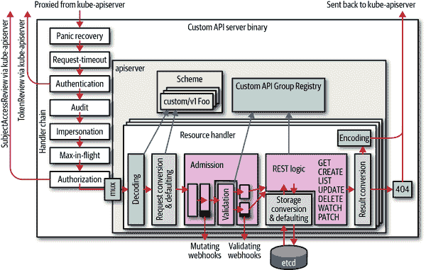
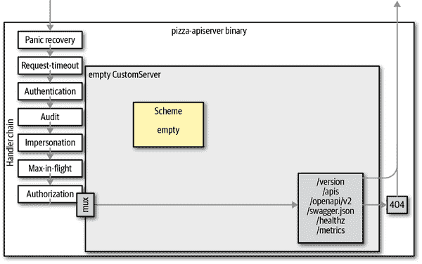
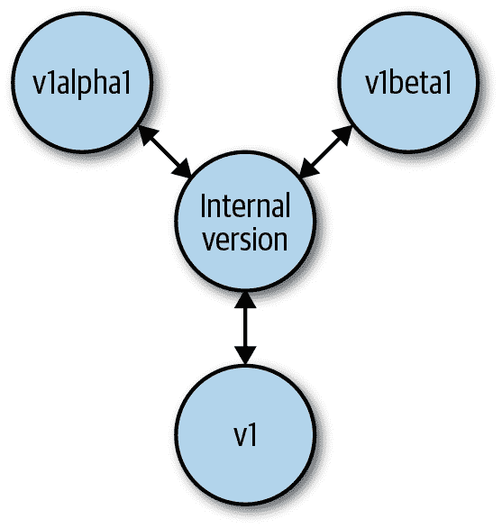
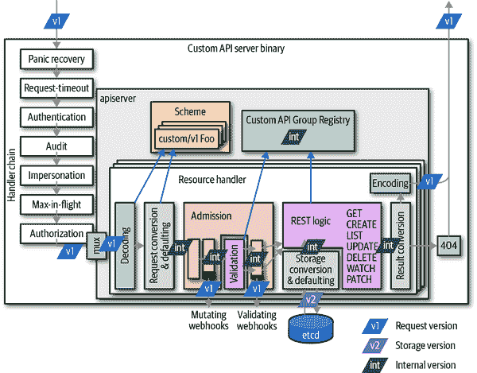
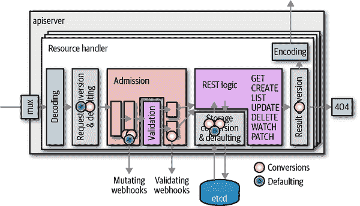
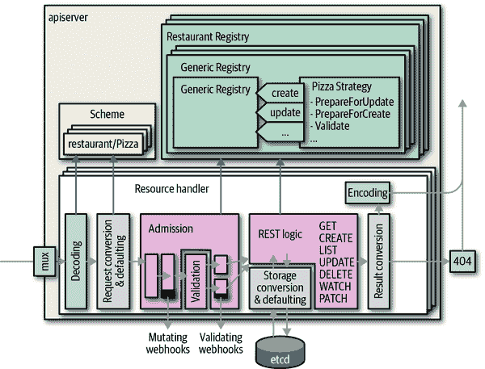

# 第八章：自定义 API 服务器

作为 CustomResourceDefinitions 的替代方案，可以使用自定义 API 服务器。自定义 API 服务器可以像主 Kubernetes API 服务器一样为 API 组提供资源服务。与 CRD 不同，自定义 API 服务器几乎没有限制，可以做任何事情。

本章首先列出了为什么 CRD 可能不适合您的用例的一些原因。它描述了聚合模式，该模式使得通过自定义 API 服务器扩展 Kubernetes API 表面成为可能。最后，您将学习如何使用 Golang 实际实现自定义 API 服务器。

# 自定义 API 服务器的用例

可以用自定义 API 服务器替代 CRD。它可以做任何 CRD 能做的事情，并提供几乎无限的灵活性。当然，这也带来了成本：开发和运维的复杂性。

让我们看一下在本文撰写时（Kubernetes 1.14 为稳定版本），CRD 的一些限制：

+   使用 `etcd` 作为它们的存储介质（或者 Kubernetes API 服务器使用的任何东西）。

+   不支持 protobuf，只支持 JSON。

+   仅支持两种子资源：*/status* 和 */scale*（参见“子资源”）。

+   不支持优雅的删除。^(1) 尽管 Finalizers 可以模拟这一过程，但不允许自定义优雅删除时间。

+   会显著增加 Kubernetes API 服务器的 CPU 负载，因为所有算法都是通用实现的（例如验证）。

+   仅为 API 端点实现标准的 CRUD 语义。

+   不支持资源共存（即不同 API 组中的资源或不同名称的资源共享存储）。^(2)

相比之下，自定义 API 服务器没有这些限制：

+   可以使用任何存储介质。例如，有以下自定义 API 服务器：

    +   [指标 API 服务器](http://bit.ly/2FvgfAV)，它将数据存储在内存中以实现最大的性能。

    +   API 服务器可以镜像 [OpenShift](http://redhat.com/openshift) 中 Docker 注册表的自定义 API 对象。

    +   API 服务器将数据写入时间序列数据库。

    +   API 服务器可以镜像云 API。

    +   API 服务器可以镜像其他 API 对象，例如 [OpenShift](http://redhat.com/openshift) 中镜像 Kubernetes 命名空间的项目。

+   可以像所有本机 Kubernetes 资源一样提供 protobuf 支持。为此，您必须使用 [go-to-protobuf](http://bit.ly/31OLSie) 创建一个 *.proto* 文件，然后使用 protobuf 编译器 `protoc` 生成序列化器，最后将其编译成二进制文件。

+   可以提供任何自定义子资源；例如，Kubernetes API 服务器提供 */exec*、*/logs*、*/port-forward* 等，大多数使用非常自定义的协议，如 WebSockets 或 HTTP/2 流式传输。

+   可以实现优雅的删除，就像 Kubernetes 对于 Pod 所做的那样。`kubectl` 等待删除操作，用户甚至可以提供自定义的优雅终止期。

+   可以使用 Golang 以最高效的方式实现所有操作，如验证、准入和转换，而无需通过 webhook 回程，这可以减少进一步的延迟。这对于高性能用例或对象数量众多的情况至关重要。想象一下在拥有数千个节点和两个数量级更多的 Pod 的大集群中，Pod 对象的情况。

+   可以实现自定义语义，例如在核心 v1 `Service`类型中对服务 IP 进行原子预留。在创建服务时，会分配一个唯一的服务 IP 并直接返回。在请求管道中，虽然可以使用准入 webhook 实现特殊语义，但这些 webhook 无法可靠地知道传递的对象实际上是创建还是更新的：它们乐观地调用，但如果请求失败，后续步骤可能会取消请求。换句话说：webhook 中的副作用很棘手，因为如果请求失败，则没有撤销触发器。

+   可以为具有共同存储机制（即公共`etcd`键路径前缀）但存在于不同 API 组或命名不同的资源提供服务。例如，Kubernetes 将部署和其他资源存储在 API 组`extensions/v1`中，然后将它们移动到更具体的 API 组，如`apps/v1`。

换句话说，自定义 API 服务器是在 CRD 仍然有限的情况下解决方案的情况。在过渡场景中，当转移到新的语义时重要的是不破坏资源兼容性时，自定义 API 服务器通常更加灵活。

# 示例：披萨餐厅

为了学习如何实现自定义 API 服务器，在本节中，我们将看一个示例项目：一个实现披萨餐厅 API 的自定义 API 服务器。让我们看看需求。

我们希望在`restaurant.programming-kubernetes.info` API 组中创建两种类型：

`Topping`

披萨配料（例如：萨拉米、马苏里拉奶酪或番茄）

`Pizza`

餐厅提供的披萨类型

配料是集群范围的资源，仅包含一个浮点值，用于配料单位的成本。一个实例如下：

```
apiVersion: restaurant.programming-kubernetes.info/v1alpha1
kind: Topping
metadata:
  name: mozzarella
spec:
  cost: 1.0
```

每个披萨可以有任意数量的配料；例如：

```
apiVersion: restaurant.programming-kubernetes.info/v1alpha1
kind: Pizza
metadata:
  name: margherita
spec:
  toppings:
  - mozzarella
  - tomato
```

配料列表是有序的（就像在 YAML 或 JSON 中的任何列表一样），但顺序对类型的语义并不真正重要。客户在任何情况下都会得到相同的披萨。我们希望允许列表中的重复项，以便允许例如额外加奶酪的披萨。

所有这些都可以通过 CRD 轻松实现。现在让我们添加一些超出基本 CRD 功能的需求：^(3)

+   我们希望在披萨规格中仅允许有相应的`Topping`对象的配料。

+   我们还希望假设我们首先将此 API 引入为`v1alpha1`版本，但最终发现我们希望在同一 API 的`v1beta1`版本中有另一种配料表示。

换句话说，我们希望拥有两个版本，并在它们之间实现无缝转换。

该 API 的完整实现作为自定义 API 服务器可以在[本书的 GitHub 存储库](http://bit.ly/2x9C3gR)中找到。在本章的其余部分，我们将深入探讨该项目的所有主要部分，并了解其工作原理。在此过程中，您将看到前一章节中呈现的许多概念以不同的方式：即，也是 Kubernetes API 服务器背后的 Golang 实现。还会更清晰地看到一些在 CRDs 中突出的设计决策。

因此，我们强烈建议您阅读本章，即使您不打算使用自定义 API 服务器。也许未来这里呈现的概念也会适用于 CRDs，那么了解自定义 API 服务器的知识对您也会有所帮助。

# 架构：聚合

在进入技术实现细节之前，我们希望在 Kubernetes 集群的背景下，从更高层次来看自定义 API 服务器架构。

自定义 API 服务器是服务 API 组的进程，通常使用通用 API 服务器库[*k8s.io/apiserver*](http://bit.ly/2X3joNX)构建。这些进程可以在集群内部或外部运行。在前一种情况下，它们在 Pod 内运行，并带有前端服务。

主要的 Kubernetes API 服务器称为`kube-apiserver`，始终是`kubectl`和其他 API 客户端的第一个接触点。由自定义 API 服务器提供的 API 组由`kube-apiserver`进程代理到自定义 API 服务器进程。换句话说，`kube-apiserver`进程了解所有自定义 API 服务器及其服务的 API 组，以便能够将正确的请求代理到它们。

执行代理的组件位于`kube-apiserver`进程内部，称为[`kube-aggregator`](http://bit.ly/2X10C9W)。代理 API 请求到自定义 API 服务器的过程称为*API 聚合*。

让我们更深入地了解针对自定义 API 服务器的请求路径，但是进入 Kubernetes API 服务器的 TCP 套接字（参见图 8-1）：

1.  请求由 Kubernetes API 服务器接收。

1.  它们通过处理程序链传递，包括身份验证、审计日志记录、模拟、最大并发限制、授权等等（图仅为草图，不完整）。

1.  由于 Kubernetes API 服务器知道聚合的 API，它可以拦截指向 HTTP 路径`/apis/`聚合 API 组名称`*`的请求。

1.  Kubernetes API 服务器将请求转发到自定义 API 服务器。


###### 图 8-1\. Kubernetes 主 API 服务器 kube-apiserver 与集成的 kube-aggregator

`kube-aggregator`代理 API 组版本的 HTTP 路径下的请求（即 */apis/`group-name`/`version`*）。它不需要知道 API 组版本中实际提供的资源。

相比之下，`kube-aggregator`本身为所有聚合的自定义 API 服务器服务发现端点 */apis* 和 */apis/`group-name`*（它使用下文解释的定义顺序），并在不与聚合的自定义 API 服务器通信的情况下返回结果。而是使用来自`APIService`资源的信息。让我们详细了解此过程。

## API 服务

Kubernetes API 服务器要了解自定义 API 服务器提供的 API 组，必须在`apiregistration.k8s.io/v1` API 组中创建一个`APIService`对象。这些对象仅列出 API 组和版本，不包括资源或任何进一步的细节：

```
apiVersion: apiregistration.k8s.io/v1beta1
kind: APIService
metadata:
  name: *`name`*
spec:
  group: *`API-group-name`*
  version: *`API-group-version`*
  service:
    namespace: *`custom-API-server-service-namespace`*
    name: *`-API-server-service`*
  caBundle: *`base64-caBundle`*
  insecureSkipTLSVerify: *`bool`*
  groupPriorityMinimum: 2000
  versionPriority: 20

```

名称是任意的，但为了清晰起见，建议您使用标识 API 组名称和版本的名称，例如*`group-name-version`*。

服务可以是集群中的普通[`ClusterIP`服务](http://bit.ly/2X0zEEu)，或者可以是带有给定 DNS 名称的`ExternalName`服务，用于集群外的自定义 API 服务器。在这两种情况下，端口必须是 443。在撰写本文时不支持其他服务端口。服务目标端口映射允许为自定义 API 服务器 pod 选择任意选择的、最好是非限制性的更高端口，因此这不是一个主要限制。

证书颁发机构（CA）捆绑包用于 Kubernetes API 服务器信任所联系的服务。请注意，API 请求可能包含机密数据。为避免中间人攻击，强烈建议设置`caBundle`字段，而不使用`insecureSkipTLSVerify`替代方案。对于任何生产集群，包括证书轮换机制，这尤为重要。

最后，在`APIService`对象中有两个优先级。这些具有一些棘手的语义，详见`APIService`类型的 Golang 代码文档：

```
// GroupPriorityMininum is the priority this group should have at least. Higher
// priority means that the group is preferred by clients over lower priority ones.
// Note that other versions of this group might specify even higher
// GroupPriorityMinimum values such that the whole group gets a higher priority.
//
// The primary sort is based on GroupPriorityMinimum, ordered highest number to
// lowest (20 before 10). The secondary sort is based on the alphabetical
// comparison of the name of the object (v1.bar before v1.foo). We'd recommend
// something like: *.k8s.io (except extensions) at 18000 and PaaSes
// (OpenShift, Deis) are recommended to be in the 2000s
GroupPriorityMinimum int32 `json:"groupPriorityMinimum"`

// VersionPriority controls the ordering of this API version inside of its
// group. Must be greater than zero. The primary sort is based on
// VersionPriority, ordered highest to lowest (20 before 10). Since it's inside
// of a group, the number can be small, probably in the 10s. In case of equal
// version priorities, the version string will be used to compute the order
// inside a group. If the version string is "kube-like", it will sort above non
// "kube-like" version strings, which are ordered lexicographically. "Kube-like"
// versions start with a "v", then are followed by a number (the major version),
// then optionally the string "alpha" or "beta" and another number (the minor
// version). These are sorted first by GA > beta > alpha (where GA is a version
// with no suffix such as beta or alpha), and then by comparing major version,
// then minor version. An example sorted list of versions:
// v10, v2, v1, v11beta2, v10beta3, v3beta1, v12alpha1, v11alpha2, foo1, foo10.
VersionPriority int32 `json:"versionPriority"`
```

换句话说，`GroupPriorityMinimum`值决定了组的优先级。如果不同版本的多个`APIService`对象不同，将选择最高值。

第二个优先级仅用于定义动态客户端首选使用的首选版本之间的顺序。

这是原生 Kubernetes API 组的`GroupPriorityMinimum`值列表：

```
var apiVersionPriorities = map[schema.GroupVersion]priority{
    {Group: "", Version: "v1"}: {group: 18000, version: 1},
    {Group: "extensions", Version: "v1beta1"}: {group: 17900, version: 1},
    {Group: "apps", Version: "v1beta1"}:                         {group: 17800, version: 1},
    {Group: "apps", Version: "v1beta2"}:                         {group: 17800, version: 9},
    {Group: "apps", Version: "v1"}:                              {group: 17800, version: 15},
    {Group: "events.k8s.io", Version: "v1beta1"}:                {group: 17750, version: 5},
    {Group: "authentication.k8s.io", Version: "v1"}:             {group: 17700, version: 15},
    {Group: "authentication.k8s.io", Version: "v1beta1"}:        {group: 17700, version: 9},
    {Group: "authorization.k8s.io", Version: "v1"}:              {group: 17600, version: 15},
    {Group: "authorization.k8s.io", Version: "v1beta1"}:         {group: 17600, version: 9},
    {Group: "autoscaling", Version: "v1"}:                       {group: 17500, version: 15},
    {Group: "autoscaling", Version: "v2beta1"}:                  {group: 17500, version: 9},
    {Group: "autoscaling", Version: "v2beta2"}:                  {group: 17500, version: 1},
    {Group: "batch", Version: "v1"}:                             {group: 17400, version: 15},
    {Group: "batch", Version: "v1beta1"}:                        {group: 17400, version: 9},
    {Group: "batch", Version: "v2alpha1"}:                       {group: 17400, version: 9},
    {Group: "certificates.k8s.io", Version: "v1beta1"}:          {group: 17300, version: 9},
    {Group: "networking.k8s.io", Version: "v1"}:                 {group: 17200, version: 15},
    {Group: "networking.k8s.io", Version: "v1beta1"}:            {group: 17200, version: 9},
    {Group: "policy", Version: "v1beta1"}:                       {group: 17100, version: 9},
    {Group: "rbac.authorization.k8s.io", Version: "v1"}:         {group: 17000, version: 15},
    {Group: "rbac.authorization.k8s.io", Version: "v1beta1"}:    {group: 17000, version: 12},
    {Group: "rbac.authorization.k8s.io", Version: "v1alpha1"}:   {group: 17000, version: 9},
    {Group: "settings.k8s.io", Version: "v1alpha1"}:             {group: 16900, version: 9},
    {Group: "storage.k8s.io", Version: "v1"}:                    {group: 16800, version: 15},
    {Group: "storage.k8s.io", Version: "v1beta1"}:               {group: 16800, version: 9},
    {Group: "storage.k8s.io", Version: "v1alpha1"}:              {group: 16800, version: 1},
    {Group: "apiextensions.k8s.io", Version: "v1beta1"}:         {group: 16700, version: 9},
    {Group: "admissionregistration.k8s.io", Version: "v1"}:      {group: 16700, version: 15},
    {Group: "admissionregistration.k8s.io", Version: "v1beta1"}: {group: 16700, version: 12},
    {Group: "scheduling.k8s.io", Version: "v1"}:                 {group: 16600, version: 15},
    {Group: "scheduling.k8s.io", Version: "v1beta1"}:            {group: 16600, version: 12},
    {Group: "scheduling.k8s.io", Version: "v1alpha1"}:           {group: 16600, version: 9},
    {Group: "coordination.k8s.io", Version: "v1"}:               {group: 16500, version: 15},
    {Group: "coordination.k8s.io", Version: "v1beta1"}:          {group: 16500, version: 9},
    {Group: "auditregistration.k8s.io", Version: "v1alpha1"}:    {group: 16400, version: 1},
    {Group: "node.k8s.io", Version: "v1alpha1"}:                 {group: 16300, version: 1},
    {Group: "node.k8s.io", Version: "v1beta1"}:                  {group: 16300, version: 9},
}

```

因此，对于类似 PaaS 的 API，使用`2000`意味着它们被放置在此列表的末尾。^(4)

API 组的顺序在`kubectl`中的 REST 映射过程中起到作用（参见“REST 映射”）。这意味着它实际上对用户体验产生影响。如果存在冲突的资源名称或简称，则具有最高`GroupPriorityMinimum`值的组将获胜。

此外，在使用自定义 API 服务器替换 API 组版本的特殊情况下，此优先级排序可能有用。例如，您可以通过将自定义 API 服务放置在比上表中的值较低的位置来替换原生 Kubernetes API 组为修改后的 API 组（出于任何原因）。

再次注意，Kubernetes API 服务器不需要知道任何发现端点 */apis* 和 */apis/`group-name`* 的资源列表，也不需要代理。资源列表仅通过第三个发现端点 */apis/`group-name`/`version`* 返回。但正如我们在前一节中看到的，此端点由聚合的自定义 API 服务器提供，而不是由`kube-aggregator`提供。

## 自定义 API 服务器的内部结构

自定义 API 服务器与组成 Kubernetes API 服务器的大部分部件相似，尽管当然具有不同的 API 组实现，并且没有嵌入式`kube-aggregator`或嵌入式`apiextension-apiserver`（用于服务 CRD）。这导致几乎与 图 8-1 中显示的架构图片相同：



###### 图 8-2。基于 k8s.io/apiserver 的聚合自定义 API 服务器。

我们观察到一些事情。一个聚合的 API 服务器：

+   具有与 Kubernetes API 服务器相同的基本内部结构。

+   具有自己的处理程序链，包括身份验证、审计、冒充、最大并发限制和授权（我们将在本章中详细解释为什么这是必要的；例如，参见“委托授权”）。

+   具有自己的资源处理程序管道，包括解码、转换、准入、REST 映射和编码。

+   调用准入 Webhook。

+   可能会写入`etcd`（尽管它可以使用不同的存储后端）。`etcd` 集群不必与 Kubernetes API 服务器使用的相同。

+   拥有自己的方案和注册表实现用于自定义 API 组。注册表实现可能有所不同，并且可以根据需要进行定制。

+   再次进行认证。通常进行客户端证书认证和基于令牌的认证，并通过`TokenAccessReview`请求回调到 Kubernetes API 服务器。我们将在稍后更详细地讨论认证和信任架构。

+   自己进行审计。这意味着 Kubernetes API 服务器会审计某些字段，但仅限于元级别。对象级别的审计是在聚合的自定义 API 服务器中完成的。

+   使用`SubjectAccessReview`请求对 Kubernetes API 服务器进行自身认证。我们将稍后更详细地讨论授权。

## 委托认证和信任

基于[*k8s.io/apiserver*](http://bit.ly/2X3joNX)构建的聚合自定义 API 服务器与 Kubernetes API 服务器使用相同的认证库。它可以使用客户端证书或令牌对用户进行身份验证。

因为聚合自定义 API 服务器在 Kubernetes API 服务器之后架构上（即 Kubernetes API 服务器接收请求并将其代理到聚合自定义 API 服务器），请求已经由 Kubernetes API 服务器进行了身份验证。 Kubernetes API 服务器将身份验证结果（即用户名和组成员资格）存储在 HTTP 请求头中，通常为`X-Remote-User`和`X-Remote-Group`（可以使用`--requestheader-username-headers`和`--requestheader-group-headers`标志进行配置）。

聚合自定义 API 服务器必须知道何时信任这些头部；否则，任何其他调用者都可以声称已进行了身份验证并且可以设置这些头部。这由特殊的请求头客户端 CA 处理。它存储在配置映射*kube-system/extension-apiserver-authentication*（文件名*requestheader-client-ca-file*）中。这里是一个示例：

```
apiVersion: v1
kind: ConfigMap
metadata:
  name: extension-apiserver-authentication
  namespace: kube-system
data:
  client-ca-file: |
    -----BEGIN CERTIFICATE-----
    ...
    -----END CERTIFICATE-----
  requestheader-allowed-names: '["aggregator"]'
  requestheader-client-ca-file: |
    -----BEGIN CERTIFICATE-----
    ...
    -----END CERTIFICATE-----
  requestheader-extra-headers-prefix: '["X-Remote-Extra-"]'
  requestheader-group-headers: '["X-Remote-Group"]'
  requestheader-username-headers: '["X-Remote-User"]'
```

有了这些信息，使用默认设置的聚合自定义 API 服务器将进行身份验证：

+   使用与给定*client-ca-file*匹配的客户端证书的客户端

+   客户端由 Kubernetes API 服务器预认证，其请求使用给定的*requestheader-client-ca-file*进行转发，并且其用户名和组成员资格存储在给定的 HTTP 头`X-Remote-Group`和`X-Remote-User`中。

最后但同样重要的是，有一个名为`TokenAccessReview`的机制，它将承载令牌（通过 HTTP 头部`Authorization: bearer *token*`接收）发送回 Kubernetes API 服务器，以验证它们是否有效。令牌访问审查机制默认情况下是禁用的，但可以选择启用；请参阅“选项和配置模式及启动管道”。

我们将在接下来的部分看到委派身份验证是如何实际设置的。虽然我们在这里详细介绍了这个机制，在聚合自定义 API 服务器内部，这大部分都是由*k8s.io/apiserver*库自动完成的。但了解幕后发生的事情在涉及安全性时确实很有价值。

## 委派授权

身份验证完成后，必须对每个请求进行授权。授权基于用户名和组列表。Kubernetes 中的默认授权机制是基于角色的访问控制（RBAC）。

RBAC 将身份映射到角色，并将角色映射到授权规则，最终接受或拒绝请求。我们这里不会详细讨论 RBAC 授权对象，如角色和集群角色，或角色绑定和集群角色绑定的所有细节（请参阅“正确设置权限”了解更多）。从架构的角度来看，了解聚合的自定义 API 服务器通过 `SubjectAccessReview` 委托授权来授权请求就足够了。它不会自己评估 RBAC 规则，而是将评估委托给 Kubernetes API 服务器。

现在让我们更详细地查看委托授权。

主题访问审查请求是从聚合的自定义 API 服务器发送到 Kubernetes API 服务器（如果在其授权缓存中找不到答案时）。以下是这样一个审查对象的示例：

```
apiVersion: authorization.k8s.io/v1
kind: SubjectAccessReview
spec:
  resourceAttributes:
    group: apps
    resource: deployments
    verb: create
    namespace: default
    version: v1
    name: example
  user: michael
  groups:
  - system:authenticated
  - admins
  - authors
```

Kubernetes API 服务器接收到这些信息后，评估集群中的 RBAC 规则并做出决策，返回一个带有状态字段设置的 `SubjectAccessReview` 对象；例如：

```
apiVersion: authorization.k8s.io/v1
kind: SubjectAccessReview
status:
  allowed: true
  denied: false
  reason: "rule foo allowed this request"
```

请注意，`allowed` 和 `denied` 可能都是 `false`。这意味着 Kubernetes API 服务器无法做出决策，此时聚合的自定义 API 服务器中的另一个授权器可以做出决策（API 服务器实现一个授权链，逐个查询，委托授权是该链中的一个授权器）。这可以用于建模非标准授权逻辑，即在某些情况下没有 RBAC 规则，而是使用外部授权系统。

为了性能原因，委托授权机制在每个聚合的自定义 API 服务器中维护一个本地缓存。默认情况下，它使用以下方式缓存 1,024 个授权条目：

+   允许授权请求的有效期为 `5` 分钟

+   拒绝授权请求的有效期为 `30` 秒

可以通过 `--authorization-webhook-cache-authorized-ttl` 和 `--authorization-webhook-cache-unauthorized-ttl` 进行这些值的自定义。

我们将在接下来的部分中看到如何在代码中设置委托授权。同样，与认证一样，在聚合的自定义 API 服务器中，委托授权大多是由 *k8s.io/apiserver* 库自动完成的。

# 编写自定义 API 服务器

在前面的部分中，我们看了聚合 API 服务器的架构。在本节中，我们想要查看在 Golang 中实现聚合自定义 API 服务器的具体实现。

主要的 Kubernetes API 服务器是通过 *k8s.io/apiserver* 库实现的。自定义 API 服务器将使用完全相同的代码。主要区别在于我们的自定义 API 服务器将在集群中运行。这意味着它可以假定集群中有一个 `kube-apiserver` 可用，并使用它进行委托授权和检索其他 kube 本地资源。

我们还假设`etcd`集群已经准备好，并且可以被聚合的自定义 API 服务器使用。重要的是这个`etcd`是专用的还是与 Kubernetes API 服务器共享的并不重要。我们的自定义 API 服务器将使用不同的`etcd`键空间以避免冲突。

本章中的代码示例引用了[Github 上的示例代码](http://bit.ly/2x9C3gR)，所以请参考完整的源代码。我们这里只展示了最有趣的摘录，但您可以随时查看完整的示例项目，进行实验，并且非常重要的是在真实集群中运行它以进行学习。

这个`pizza-apiserver`项目实现了在“示例：Pizza 餐厅”中显示的示例 API。

## 选项和配置模式以及启动管道

1.  *k8s.io/apiserver*库使用选项和配置模式来创建运行中的 API 服务器。

我们将从一些绑定到标志的选项结构开始。从*k8s.io/apiserver*获取它们，并添加我们的自定义选项。从*k8s.io/apiserver*获取的选项结构可以根据特殊用例在代码中进行调整，并且提供的标志可以应用到一个标志集中，以便用户访问。

在[示例](http://bit.ly/2x9C3gR)中，我们从`RecommendedOptions`开始，非常简单地基于这一切。这些推荐的选项设置了一切需要的内容，以便为简单 API 的“正常”聚合自定义 API 服务器使用：

```
import (
    ...
    informers "github.com/programming-kubernetes/pizza-apiserver/pkg/
 generated/informers/externalversions"
)

const defaultEtcdPathPrefix = "/registry/restaurant.programming-kubernetes.info"

type CustomServerOptions struct {
    RecommendedOptions *genericoptions.RecommendedOptions
    SharedInformerFactory informers.SharedInformerFactory
}

func NewCustomServerOptions(out, errOut io.Writer) *CustomServerOptions {
    o := &CustomServerOptions{
        RecommendedOptions: genericoptions.NewRecommendedOptions(
            defaultEtcdPathPrefix,
            apiserver.Codecs.LegacyCodec(v1alpha1.SchemeGroupVersion),
            genericoptions.NewProcessInfo("pizza-apiserver", "pizza-apiserver"),
        ),
    }

    return o
}
```

`CustomServerOptions`嵌入了`RecommendedOptions`并在顶部添加了一个字段。`NewCustomServerOptions`是填充`CustomServerOptions`结构体默认值的构造函数。

让我们来看一些更有趣的细节：

+   `defaultEtcdPathPrefix`是我们所有键的`etcd`前缀。作为键空间，我们使用*/registry/pizza-apiserver.programming-kubernetes.info*，明显区别于 Kubernetes 的键。

+   `SharedInformerFactory`是全局共享的通知器工厂，用于我们自己的 CR，以避免相同资源的不必要的通知器（参见图 3-5）。请注意，它是从我们项目中生成的通知器代码导入的，而不是从`client-go`导入的。

+   `NewRecommendedOptions`为聚合的自定义 API 服务器设置了一切，使用了默认值。

让我们快速看一下`NewRecommendedOptions`：

```
return &RecommendedOptions{
    Etcd:           NewEtcdOptions(storagebackend.NewDefaultConfig(prefix, codec)),
    SecureServing:  sso.WithLoopback(),
    Authentication: NewDelegatingAuthenticationOptions(),
    Authorization:  NewDelegatingAuthorizationOptions(),
    Audit:          NewAuditOptions(),
    Features:       NewFeatureOptions(),
    CoreAPI:        NewCoreAPIOptions(),
    ExtraAdmissionInitializers:
      func(c *server.RecommendedConfig) ([]admission.PluginInitializer, error) {
          return nil, nil
      },
    Admission:      NewAdmissionOptions(),
    ProcessInfo:    processInfo,
    Webhook:        NewWebhookOptions(),
}
```

所有这些都可以根据需要进行调整。例如，如果需要自定义默认的服务端口，可以设置`RecommendedOptions.SecureServing.SecureServingOptions.BindPort`。

让我们简要地浏览现有的选项结构：

+   `Etcd`配置存储栈，用于读取和写入`etcd`。

+   `SecureServing`配置了所有关于 HTTPS 的内容（即端口、证书等）。

+   `Authentication`设置了委托身份验证，如“委托身份验证和信任”中描述的。

+   `Authorization`设置了委托授权，如“委托授权”中描述的。

+   `Audit` 设置审计输出堆栈。默认情况下已禁用，但可以设置为输出审计日志文件或将审计事件发送到外部后端。

+   `Features` 配置 alpha 和 beta 特性的功能开关。

+   `CoreAPI` 包含访问主 API 服务器的 kubeconfig 文件的路径。默认情况下，这使用集群内配置。

+   `Admission` 是一堆变更和验证准入插件的堆栈，用于处理每个传入的 API 请求。可以通过自定义代码中的自定义准入插件来扩展它，或者可以调整自定义 API 服务器的默认准入链。

+   `ExtraAdmissionInitializers` 允许我们添加更多的准入初始化器。初始化器通过自定义 API 服务器的管道实现，例如，通过控制器或客户端。查看“准入”以了解更多关于自定义准入的信息。

+   `ProcessInfo` 包含事件对象创建的信息（即，进程名称和命名空间）。我们已将其设置为 `pizza-apiserver` 的值。

+   `Webhook` 配置 webhooks 的操作方式（例如，用于认证和准入 webhook 的通用设置）。对于在集群内运行的自定义 API 服务器，它设置了良好的默认值。对于集群外的 API 服务器，这是配置它如何访问 webhook 的地方。

选项与标志耦合；换句话说，它们通常处于与标志相同的抽象级别。作为一个经验法则，选项不保存“运行中”数据结构。它们在启动期间使用，然后转换为配置或服务器对象，然后运行。

可以通过 `Validate() error` 方法验证选项。此方法还将检查用户提供的标志值是否合乎逻辑。

可以通过设置默认值来完成选项，这些值不应出现在标志的帮助文本中，但是对于获得完整的选项集是必要的。

选项通过 `Config() (*apiserver.Config, error)` 方法转换为服务器配置（“config”）。这是通过从推荐的默认配置开始，然后将选项应用于其上来完成的：

```
func (o *CustomServerOptions) Config() (*apiserver.Config, error) {
    err := o.RecommendedOptions.SecureServing.MaybeDefaultWithSelfSignedCerts(
        "localhost", nil, []net.IP{net.ParseIP("127.0.0.1")},
    )
    if err != nil {
        return nil, fmt.Errorf("error creating self-signed cert: %v", err)
    }

    [... omitted o.RecommendedOptions.ExtraAdmissionInitializers ...]

    serverConfig := genericapiserver.NewRecommendedConfig(apiserver.Codecs)
    err = o.RecommendedOptions.ApplyTo(serverConfig, apiserver.Scheme);
    if err != nil {
        return nil, err
    }

    config := &apiserver.Config{
        GenericConfig: serverConfig,
        ExtraConfig:   apiserver.ExtraConfig{},
    }
    return config, nil
}
```

在此创建的配置包含可运行的数据结构；换句话说，配置是运行时对象，与选项形成对比，后者对应标志。`o.RecommendedOptions.SecureServing.MaybeDefaultWithSelfSignedCerts` 这一行在用户未传递用于预生成证书的标志时创建自签名证书。

正如我们所描述的，`genericapiserver.NewRecommendedConfig` 返回一个默认的推荐配置，而 `RecommendedOptions.ApplyTo` 则根据标志（和其他定制选项）对其进行更改。

`pizza-apiserver` 项目本身的配置结构只是我们示例自定义 API 服务器的 `RecommendedConfig` 的一个包装：

```
type ExtraConfig struct {
    // Place your custom config here.
}

type Config struct {
    GenericConfig *genericapiserver.RecommendedConfig
    ExtraConfig   ExtraConfig
}

// CustomServer contains state for a Kubernetes custom api server.
type CustomServer struct {
    GenericAPIServer *genericapiserver.GenericAPIServer
}

type completedConfig struct {
    GenericConfig genericapiserver.CompletedConfig
    ExtraConfig   *ExtraConfig
}

type CompletedConfig struct {
    // Embed a private pointer that cannot be instantiated outside of
    // this package.
    *completedConfig
}
```

如果需要运行中自定义 API 服务器的更多状态，`ExtraConfig` 就是放置它的地方。

类似于选项结构体，配置有一个`Complete() CompletedConfig`方法，用于设置默认值。因为必须实际调用`Complete()`来完成底层配置，通常通过引入未导出的`completedConfig`数据类型来通过类型系统强制执行。这里的想法是只有调用`Complete()`才能将`Config`转换为`completeConfig`。如果未执行此调用，编译器将报错：

```
func (cfg *Config) Complete() completedConfig {
    c := completedConfig{
        cfg.GenericConfig.Complete(),
        &cfg.ExtraConfig,
    }

    c.GenericConfig.Version = &version.Info{
        Major: "1",
        Minor: "0",
    }

    return completedConfig{&c}
}
```

最后，通过`New()`构造函数可以将完成的配置转换为`CustomServer`运行时结构体：

```
// New returns a new instance of CustomServer from the given config.
func (c completedConfig) New() (*CustomServer, error) {
    genericServer, err := c.GenericConfig.New(
        "pizza-apiserver",
        genericapiserver.NewEmptyDelegate(),
    )
    if err != nil {
        return nil, err
    }

    s := &CustomServer{
        GenericAPIServer: genericServer,
    }

    [ ... omitted API installation ...]

    return s, nil
}
```

注意我们在这里有意省略了 API 安装部分。我们将在“API 安装”中回到这一点（即在启动期间如何将*注册表*连接到自定义 API 服务器中）。注册表实现 API 组的 API 和存储语义。我们将在“注册表和策略”中看到这一点，用于餐厅 API 组。

`CustomServer`对象最终可以通过`Run(stopCh <-chan struct{}) error`方法启动。这由我们示例中选项的`Run`方法调用。也就是说，`CustomServerOptions.Run`：

+   创建配置

+   完成配置

+   创建`CustomServer`

+   调用`CustomServer.Run`

这是代码：

```
func (o CustomServerOptions) Run(stopCh <-chan struct{}) error {
    config, err := o.Config()
    if err != nil {
        return err
    }

    server, err := config.Complete().New()
    if err != nil {
        return err
    }

    server.GenericAPIServer.AddPostStartHook("start-pizza-apiserver-informers",
        func(context genericapiserver.PostStartHookContext) error {
            config.GenericConfig.SharedInformerFactory.Start(context.StopCh)
            o.SharedInformerFactory.Start(context.StopCh)
            return nil
        },
    )

    return server.GenericAPIServer.PrepareRun().Run(stopCh)
}
```

`PrepareRun()`调用连接了 OpenAPI 规范，并可能执行其他 API 安装后操作。调用它后，`Run`方法启动实际服务器，它会阻塞直到`stopCh`关闭。

此示例还连接了一个名为`start-pizza-apiserver-informers`的*后启动钩子*。顾名思义，后启动钩子在 HTTPS 服务器启动并侦听之后调用。在这里，它启动了共享的通知器工厂。

注意，即使是由自定义 API 服务器本身提供的本地进程内通知器也会通过 HTTPS 与本地主机接口通信。因此，在服务器启动并且 HTTPS 端口正在侦听之后启动它们是有意义的。

还要注意*/healthz*端点仅在所有后启动钩子成功完成后才返回成功。

有了所有小的管道组件就位，`pizza-apiserver`项目将所有内容封装到`cobra`命令中：

```
// NewCommandStartCustomServer provides a CLI handler for 'start master' command
// with a default CustomServerOptions.
func NewCommandStartCustomServer(
    defaults *CustomServerOptions,
    stopCh <-chan struct{},
) *cobra.Command {
    o := *defaults
    cmd := &cobra.Command{
        Short: "Launch a custom API server",
        Long:  "Launch a custom API server",
        RunE: func(c *cobra.Command, args []string) error {
            if err := o.Complete(); err != nil {
                return err
            }
            if err := o.Validate(); err != nil {
                return err
            }
            if err := o.Run(stopCh); err != nil {
                return err
            }
            return nil
        },
    }

    flags := cmd.Flags()
    o.RecommendedOptions.AddFlags(flags)

    return cmd
}
```

使用`NewCommandStartCustomServer`，进程的`main()`方法非常简单：

```
func main() {
    logs.InitLogs()
    defer logs.FlushLogs()

    stopCh := genericapiserver.SetupSignalHandler()
    options := server.NewCustomServerOptions(os.Stdout, os.Stderr)
    cmd := server.NewCommandStartCustomServer(options, stopCh)
    cmd.Flags().AddGoFlagSet(flag.CommandLine)
    if err := cmd.Execute(); err != nil {
        klog.Fatal(err)
    }
}
```

特别注意调用`SetupSignalHandler`：它连接 Unix 信号处理。在收到`SIGINT`（在终端按下 Ctrl-C 触发）和`SIGKILL`时，关闭停止通道。停止通道传递给运行中的自定义 API 服务器，当停止通道关闭时，它将关闭。因此，主循环将在收到信号时启动关闭过程。这种关闭是优雅的，因为会在终止之前完成正在运行的请求（默认情况下最多 60 秒），还确保所有请求都发送到审计后端，不会丢失审计数据。在所有这些操作完成后，`cmd.Execute()`将返回，进程将终止。

## 第一次启动

现在我们已经准备好首次启动自定义 API 服务器了。假设你已经配置了一个集群在 *~/.kube/config*，你可以用它进行委托的认证和授权：

```
$ cd $GOPATH/src/github.com/programming-kubernetes/pizza-apiserver
$ etcd &
$ go run . --etcd-servers localhost:2379 \
    --authentication-kubeconfig ~/.kube/config \
    --authorization-kubeconfig ~/.kube/config \
    --kubeconfig ~/.kube/config
I0331 11:33:25.702320   64244 plugins.go:158]
  Loaded 3 mutating admission controller(s) successfully in the following order:
     NamespaceLifecycle,MutatingAdmissionWebhook,PizzaToppings.
I0331 11:33:25.702344   64244 plugins.go:161]
  Loaded 1 validating admission controller(s) successfully in the following order:
     ValidatingAdmissionWebhook.
I0331 11:33:25.714148   64244 secure_serving.go:116] Serving securely on [::]:443
```

它将启动并开始提供通用 API 端点的服务：

```
$ curl -k https://localhost:443/healthz
ok
```

我们也可以列出发现端点，但结果还不是很令人满意——因为我们还没有创建 API，所以发现结果为空：

```
$ curl -k https://localhost:443/apis
{
  "kind": "APIGroupList",
  "groups": []
}
```

让我们从更高层次来看：

+   我们已经使用推荐的选项和配置启动了自定义 API 服务器。

+   我们有一个包括委托认证、委托授权和审计的标准处理器链。

+   我们有一个运行的 HTTPS 服务器，并为通用端点 */logs*、*/metrics*、*/version*、*/healthz* 和 */apis* 提供服务。

图 8-3 以一万英尺的高度展示了这一情况。



###### 图 8-3\. 没有 API 的自定义 API 服务器

## 内部类型和转换

现在我们已经设置了一个运行中的自定义 API 服务器，现在是时候实际实现 API 了。在这之前，我们必须理解 API 版本及其在 API 服务器内部处理方式。

每个 API 服务器为多个资源和版本提供服务（见 图 2-3）。某些资源有多个版本。为了支持多个版本的资源，API 服务器在各版本之间进行转换。

为了避免版本之间必要转换的二次增长，API 服务器在实现实际 API 逻辑时使用 *内部版本*。内部版本也经常被称为 *hub 版本*，因为它是每个其他版本都转换到和从中的中心（见 图 8-4）。内部 API 逻辑仅为该 hub 版本实现一次。



###### 图 8-4\. 从 hub 版本到其他版本的转换

图 8-5 展示了 API 服务器在 API 请求生命周期中如何利用内部版本：

+   用户使用特定版本（例如，`v1`）发送请求。

+   API 服务器解码有效负载并将其转换为内部版本。

+   API 服务器通过审核和验证传递内部版本。

+   API 逻辑在注册表中为内部版本实现。

+   `etcd` 读取和写入版本化对象（例如，`v2`—存储版本）；也就是说，它从内部版本转换到目标版本。

+   最终，结果被转换为请求的版本，本例中为 `v1`。



###### 图 8-5\. API 对象在请求生命周期中的转换

在内部中心版本与外部版本之间的每条边缘上，都会进行一次转换。在 图 8-6 中，您可以计算每个请求处理程序的转换次数。在写操作（如创建和更新）中，至少会执行四次转换，如果集群中部署了准入 Webhook，则可能会执行更多转换。正如您所见，转换是每个 API 实现中至关重要的操作。



###### 图 8-6\. 请求生命周期中的转换和默认值

除了转换外，图 8-6 还显示了*默认值*的设置时机。默认值是填充未指定字段值的过程。默认值与转换高度耦合，并且始终在外部版本从用户请求、从`etcd`或从准入 Webhook 接收时进行，但从中心转换到外部版本时则不会进行。

###### 警告

对于 API 服务器机制而言，转换至关重要。同样重要的是，所有转换（前后）必须正确，即符合*双向可逆*的概念。双向可逆意味着我们可以在版本图中（从 图 8-4 开始）的随机值之间前后转换，而且不会丢失任何信息；换句话说，转换是双射的或一对一的。例如，我们必须能够从一个随机（但有效的）`v1`对象转换到内部中心类型，然后转换到`v1alpha1`，再次转换到内部中心类型，然后再次转换回`v1`。得到的对象必须等同于原始对象。

实现类型的双向转换通常需要深思熟虑；它几乎总是驱动新版本的 API 设计，并影响旧类型的扩展，以存储新版本所携带的信息。

简而言之：正确实现双向转换是困难的——有时非常困难。请参阅 “双向转换测试” 以了解如何有效地测试双向转换。

默认逻辑可能会在 API 服务器的生命周期内发生变化。想象一下，您向类型添加了一个新字段。用户可能在磁盘上存储了旧对象，或者`etcd`可能存储了旧对象。如果该新字段具有默认值，当将旧存储对象发送到 API 服务器时，或者当用户从`etcd`检索到其中一个旧对象时，该字段值会被设置。在请求处理过程中，API 服务器的默认过程设置字段值，看起来就像新字段一直存在一样。

## 编写 API 类型

正如我们所看到的，要向自定义 API 服务器添加 API，我们必须编写内部中心版本类型和外部版本类型，并在它们之间进行转换。现在我们将为 [比萨示例项目](http://bit.ly/2x9C3gR) 进行详细讨论。

API 类型传统上放置在项目的 *pkg/apis/`group-name`* 包中，内部类型为 *pkg/apis/`group-name`/types.go*，外部版本为 *pkg/apis/`group-name`/`version`/types.go*)。因此，对于我们的示例，*pkg/apis/restaurant*，*pkg/apis/restaurant/v1alpha1/types.go* 和 *pkg/apis/restaurant/v1beta1/types.go*。

转换将在 *pkg/apis/`group-name`/`version`/zz_generated.conversion.go*（用于 `conversion-gen` 输出）和开发者编写的自定义转换的 *pkg/apis/`group-name`/`version`/conversion.go* 中创建。

类似地，`defaulter-gen` 输出的默认代码将被创建在 *pkg/apis/`group-name`/`version`/zz_generated.defaults.go* 和开发者编写的自定义默认代码中的 *pkg/apis/`group-name`/`version`/defaults.go*。在我们的示例中，*pkg/apis/restaurant/v1alpha1/defaults.go* 和 *pkg/apis/restaurant/v1beta1/defaults.go* 都有。

我们在“转换”和“默认情况”中详细讨论转换和默认情况。

除了转换和默认情况外，我们已经在“类型解剖”中为自定义资源定义的大部分过程已经见过了。在我们自定义的 API 服务器中，外部版本的原生类型完全以相同的方式定义。

另外，我们有 *pkg/apis/`group-name`/types.go* 用于内部类型，即中心类型。两者的主要区别在于后者的 *register.go* 文件中的 `SchemeGroupVersion` 引用了 `runtime.APIVersionInternal`（这是 `"__internal"` 的快捷方式）。

```
// SchemeGroupVersion is group version used to register these objects
var SchemeGroupVersion = schema.GroupVersion{Group: GroupName, Version:
runtime.APIVersionInternal}
```

*pkg/apis/*group-name*/types.go* 和外部类型文件之间的另一个区别是缺乏 JSON 和 protobuf 标签。

###### 提示

一些生成器使用 JSON 标签来检测 *types.go* 文件是否为外部版本或内部版本。因此，在复制和粘贴外部类型以创建或更新内部类型时，务必删除这些标签。

最后但同样重要的是，有一个助手将 API 组的所有版本安装到一个方案中。这个助手通常放置在 *pkg/apis/`group-name`/install/install.go* 中。对于我们的自定义 API 服务器 *pkg/apis/restaurant/install/install.go*，看起来就像这样简单：

```
// Install registers the API group and adds types to a scheme
func Install(scheme *runtime.Scheme) {
    utilruntime.Must(restaurant.AddToScheme(scheme))
    utilruntime.Must(v1beta1.AddToScheme(scheme))
    utilruntime.Must(v1alpha1.AddToScheme(scheme))
    utilruntime.Must(scheme.SetVersionPriority(
        v1beta1.SchemeGroupVersion,
        v1alpha1.SchemeGroupVersion,
    ))
}
```

由于我们有多个版本，必须定义优先级。此顺序将用于确定资源的默认存储版本。它曾经在内部客户端（返回内部版本对象的客户端；参见注释“过去的版本化客户端和内部客户端”）中也起过版本选择的作用。但是内部客户端已被弃用，即将消失。甚至 API 服务器内部的代码将来也将使用外部版本客户端。

## 转换

转换将一个版本中的对象转换为另一个版本中的对象。转换通过转换函数实现，其中一些是手动编写的（按照惯例放置在*pkg/apis/`group-name`/`version`/conversion.go*中），其他则由[`conversion-gen`](http://bit.ly/31RewiP)自动生成（按照惯例放置在*pkg/apis/`group-name`/`version`/zz_generated.conversion.go*中）。

通过方案（见“Scheme”）使用`Convert()`方法启动转换，传递源对象`in`和目标对象`out`：

```
func (s *Scheme) Convert(in, out interface{}, context interface{}) error
```

`context`描述如下：

```
// ...an optional field that callers may use to pass info to conversion functions.
```

它仅在非常特殊的情况下使用，并且通常为`nil`。稍后在本章中，我们将查看转换函数作用域，这使我们能够从转换函数内部访问此上下文。

要进行实际的转换，方案了解所有 Golang API 类型、它们的 GroupVersionKinds 以及在 GroupVersionKinds 之间的转换函数。为此，`conversion-gen`通过本地方案构建器注册生成的转换函数。在我们的示例自定义 API 服务器中，*zz_generated.conversion.go*文件以如下方式开始：

```
func init() {
    localSchemeBuilder.Register(RegisterConversions)
}

// RegisterConversions adds conversion functions to the given scheme.
// Public to allow building arbitrary schemes.
func RegisterConversions(s *runtime.Scheme) error {
    if err := s.AddGeneratedConversionFunc(
        (*Topping)(nil),
        (*restaurant.Topping)(nil),
        func(a, b interface{}, scope conversion.Scope) error {
            return Convert_v1alpha1_Topping_To_restaurant_Topping(
                a.(*Topping),
                b.(*restaurant.Topping),
                scope,
            )
        },
    ); err != nil {
        return err
    }
    ...
    return nil
}

...
```

函数`Convert_v1alpha1_Topping_To_restaurant_Topping()`是由生成的。它接收一个`v1alpha1`对象并将其转换为内部类型。

###### 注意

前面复杂的类型转换将有类型的转换函数变成一个统一类型的`func(a, b interface{}, scope conversion.Scope) error`。该方案使用后者的类型，因为它可以在不使用反射的情况下调用它们。由于反射需要许多必要的分配，因此反射速度较慢。

在*conversion.go*中手动编写的转换在生成过程中优先，这意味着如果在包中找到符合*Convert_`source-package-basename_Kind`To_`target-package-basename`_Kind*命名模式的手动编写函数，`conversion-gen`将跳过类型的生成。例如：

```
func Convert_v1alpha1_PizzaSpec_To_restaurant_PizzaSpec(
    in *PizzaSpec,
    out *restaurant.PizzaSpec,
    s conversion.Scope,
) error {
    ...

    return nil
}
```

在最简单的情况下，转换函数只是从源对象复制值到目标对象。但对于前面的例子，将`v1alpha1`披萨规范转换为内部类型，简单的复制是不够的。我们必须适应不同的结构，实际上看起来像下面这样：

```
func Convert_v1alpha1_PizzaSpec_To_restaurant_PizzaSpec(
    in *PizzaSpec,
    out *restaurant.PizzaSpec,
    s conversion.Scope,
) error {
    idx := map[string]int{}
    for _, top := range in.Toppings {
        if i, duplicate := idx[top]; duplicate {
            out.Toppings[i].Quantity++
            continue
        }
        idx[top] = len(out.Toppings)
        out.Toppings = append(out.Toppings, restaurant.PizzaTopping{
            Name: top,
            Quantity: 1,
        })
    }

    return nil
}
```

显然，没有代码生成可以如此聪明地预见用户在定义这些不同类型时的意图。

在转换过程中，请注意源对象绝不能被改变。但是，如果类型匹配，将源数据结构在目标对象中完全正常并且通常出于性能原因是强烈建议的。

这是如此重要，以至于我们在警告中再次强调它，因为它不仅对转换的实现有影响，还对调用者和转换输出的消费者有影响。

###### 警告

转换函数不能改变源对象，但允许输出与源对象共享数据结构。这意味着转换输出的消费者必须确保不要改变对象，如果不希望改变原始对象，则需要进行深度拷贝。

例如，假设您在内部版本中有一个`pod *core.Pod`，并将其转换为`v1`版本的`podv1 *corev1.Pod`，并且改变了结果的`podv1`。这可能也会改变原始的`pod`。如果`pod`来自于一个 informer，这是非常危险的，因为 informer 具有共享缓存，而改变`pod`会使缓存不一致。

因此，要注意这种转换特性，如有必要请进行深度拷贝，以避免不必要和潜在的危险变异。

尽管数据结构的共享会带来一些风险，但在许多情况下也可以避免不必要的分配。生成的代码会比较源结构和目标结构，并使用 Golang 的`unsafe`包通过简单的类型转换将指向具有相同内存布局的结构体的指针进行转换。因为在我们的示例中，内部类型和`v1beta1`类型的 pizza 具有相同的内存布局，所以我们得到了这个：

```
func autoConvert_restaurant_PizzaSpec_To_v1beta1_PizzaSpec(
    in *restaurant.PizzaSpec,
    out *PizzaSpec,
    s conversion.Scope,
) error {
    out.Toppings = *(*[]PizzaTopping)(unsafe.Pointer(&in.Toppings))
    return nil
}
```

在机器语言级别上，这是一个 NOOP 操作，因此速度非常快。在这种情况下，它避免了分配一个切片并从`in`复制项目到`out`。

最后但并非最不重要，关于转换函数的第三个参数的一些说明：转换范围`conversion.Scope`。

转换范围提供对多个转换元值的访问。例如，它允许我们通过以下方式访问传递给方案的`Convert(in, out interface{}, context interface{}) error`方法的`context`值：

```
s.Meta().Context
```

它还允许我们通过`s.Convert`来调用子类型的方案转换，或者在完全不考虑注册的转换函数的情况下通过`s.DefaultConvert`。

在大多数转换情况下，实际上根本不需要使用范围。为了简单起见，可以忽略其存在，直到遇到需要比源对象和目标对象更多上下文的棘手情况为止。

## 默认值

默认值是 API 请求生命周期中设置省略对象（来自客户端或`etcd`）中省略字段的默认值的步骤。例如，一个 pod 有一个`restartPolicy`字段。如果用户没有指定它，该值将默认为`Always`。

想象一下，我们正在使用一个非常旧的 Kubernetes 版本，大约在 2014 年左右。该字段`restartPolicy`刚刚在当时的最新版本中引入到系统中。在升级集群后，`etcd`中有一个没有`restartPolicy`字段的 pod。一个`kubectl get pod`将从`etcd`中读取旧的 pod，并且默认值代码会添加默认值`Always`。从用户的角度来看，旧的 pod 突然具有了新的`restartPolicy`字段，这看起来像是魔术般的变化。

参考图 8-6 以查看 Kubernetes 请求流水线中当前进行默认设置的位置。请注意，仅为外部类型执行默认操作，而不是内部类型。

现在让我们看一下执行默认设置的代码。默认设置是由*k8s.io/apiserver*代码通过方案启动的，类似于转换。因此，我们必须为我们的自定义类型在方案中注册默认函数。

同样地，大多数默认代码只是通过[`defaulter-gen`](http://bit.ly/2J108vK)二进制生成的。它遍历 API 类型，并在*pkg/apis/`group-name`/`version`/zz_generated.defaults.go*中创建默认函数。默认情况下，此代码除了调用子结构的默认函数外，不执行任何操作。

您可以通过遵循默认函数命名模式`SetDefaults*Kind*`来定义自己的默认逻辑：

```
func SetDefaults*`Kind`*(obj **`Type`*) {
    ...
}

```

此外，与转换不同的是，我们必须手动在本地方案构建器上调用生成函数的注册。不幸的是，这不会自动完成：

```
func init() {
    localSchemeBuilder.Register(RegisterDefaults)
}
```

在这里，`RegisterDefaults`在包*pkg/apis/`group-name`/`version`/zz_generated.defaults.go*内生成。

对于默认代码，了解用户何时设置了字段，何时未设置至关重要。在许多情况下，这一点并不明显。

Golang 对于每种类型都有零值，并在传递的 JSON 或 protobuf 中找不到字段时设置它们。想象一个布尔字段`foo`的默认值为`true`。零值为`false`。不幸的是，不清楚`false`是由于用户的输入设置的，还是因为`false`只是布尔值的零值。

为了避免这种情况，通常必须在 Golang API 类型中使用指针类型（例如，在前面的情况下使用`*bool`）。用户提供的`false`将导致非`nil`布尔指针指向`false`值，用户提供的`true`将导致非`nil`布尔指针指向`true`值。未提供字段将导致`nil`。这可以在默认代码中检测到：

```
func SetDefaults*`Kind`*(obj **`Type`*) {
    if obj.Foo == nil {
        x := true
        obj.Foo = &x
    }
}

```

这提供了期望的语义：“foo 默认为 true。”

###### 提示

这种使用指针的技巧适用于诸如字符串之类的原始类型。对于映射和数组，要在不识别`nil`映射/数组和空映射/数组的情况下实现往返性通常很困难。因此，Kubernetes 中大多数映射和数组的默认函数在这两种情况下都应用默认值，以解决编码和解码错误。

## 往返测试

正确进行转换很困难。往返测试是检查在随机测试中转换是否按计划进行并且在从所有已知组版本转换时不丢失数据的重要工具。

往返测试通常与*install.go*文件一起放置（例如，*pkg/apis/restaurant/install/roundtrip_test.go*），并且只需从 API Machinery 调用往返测试函数：

```
import (
    ...
    "k8s.io/apimachinery/pkg/api/apitesting/roundtrip"
    restaurantfuzzer "github.com/programming-kubernetes/pizza-apiserver/pkg/apis/
 restaurant/fuzzer"
)

func TestRoundTripTypes(t *testing.T) {
    roundtrip.RoundTripTestForAPIGroup(t, Install, restaurantfuzzer.Funcs)
}
```

在内部，`RoundTripTestForAPIGroup` 调用使用 `Install` 函数将 API 组安装到临时方案中。然后，使用给定的 fuzzer 在内部版本中创建随机对象，然后将它们转换为某些外部版本，再转换回内部版本。结果对象必须与原始对象相等。此测试将在所有外部版本中重复数百次或数千次。

*fuzzer* 是一个函数，返回内部类型及其子类型的随机函数切片。在我们的示例中，fuzzer 放置在包 *pkg/apis/restaurant/fuzzer/fuzzer.go* 中，并为 spec 结构体提供了一个随机化器：

```
// Funcs returns the fuzzer functions for the restaurant api group.
var Funcs = func(codecs runtimeserializer.CodecFactory) []interface{} {
    return []interface{}{
        func(s *restaurant.PizzaSpec, c fuzz.Continue) {
            c.FuzzNoCustom(s) // fuzz first without calling this function again

            // avoid empty Toppings because that is defaulted
            if len(s.Toppings) == 0 {
                s.Toppings = []restaurant.PizzaTopping{
                    {"salami", 1},
                    {"mozzarella", 1},
                    {"tomato", 1},
                }
            }

            seen := map[string]bool{}
            for i := range s.Toppings {
                // make quantity strictly positive and of reasonable size
                s.Toppings[i].Quantity = 1 + c.Intn(10)

                // remove duplicates
                for {
                    if !seen[s.Toppings[i].Name] {
                        break
                    }
                    s.Toppings[i].Name = c.RandString()
                }
                seen[s.Toppings[i].Name] = true
            }
        },
    }
}
```

如果没有提供随机化器函数，则底层库 [*github.com/google/gofuzz*](http://bit.ly/2KJrb27) 将尝试通用地对对象进行随机化，为基本类型设置随机值，并递归地深入指针、结构体、映射和切片，最终调用开发人员提供的自定义随机化器函数。

当为某种类型编写随机化函数时，首先调用 `c.FuzzNoCustom(s)` 是很方便的。它会随机化给定的对象 `s`，并调用子结构的自定义函数，但不会对 `s` 本身进行处理。然后开发人员可以限制和修复随机值，使对象有效。

###### 警告

尽可能将 fuzzer 设计得尽可能通用，以覆盖尽可能多的有效对象。如果 fuzzer 过于限制，测试覆盖率将变差。在 Kubernetes 的开发过程中，许多情况下由于现有的 fuzzer 不足以捕捉到回归问题。

另一方面，fuzzer 只需考虑验证对象，它们是外部版本中可定义的实际对象的投影。通常需要限制 `c.FuzzNoCustom(s)` 设置的随机值，使随机对象有效。例如，如果一个字符串包含 URL，则无需为任意值进行往返转换，如果验证将拒绝任意字符串的话。

我们之前的 `PizzaSpec` 示例首先调用 `c.FuzzNoCustom(s)`，然后通过以下方式修复对象：

+   对于配料的 `nil` 情况进行默认设置

+   为每种配料设置合理的数量（如果不这样做，在将其转换为 `v1alpha1` 时，将会增加复杂性，并且会在字符串列表中引入高数量）

+   规范化配料名称，因为我们知道在 pizza 规范中重复的配料永远不会往返（对于内部类型，注意 v1alpha1 类型存在重复）

## 验证

在反序列化、默认设置和转换为内部版本后不久，传入对象将被验证。图 8-5 早些时候展示了在执行实际创建或更新逻辑之前，如何在变异准入插件和验证准入插件之间进行验证。

这意味着只需为内部版本实现一次验证，而不是为所有外部版本实现。这具有明显的实施工作节省优势，并确保各版本之间的一致性。另一方面，这意味着验证错误不涉及外部版本。实际上，这在 Kubernetes 资源中可以观察到，但实际上并不是什么大问题。

在本节中，我们将看一下验证函数的实现。将自定义 API 服务器中的连接——也就是从配置通用注册表的策略中调用验证——将在下一节中讨论。换句话说，图 8-5 在视觉上略显简单化。

目前，仅需看一下策略内部验证的入口点即可：

```
func (pizzaStrategy) Validate(
    ctx context.Context, obj runtime.Object,
) field.ErrorList {
    pizza := obj.(*restaurant.Pizza)
    return validation.ValidatePizza(pizza)
}
```

这会调用验证包中 API 组 `pkg/apis/*group*/*validation*` 的 `Validate*Kind*(obj **Kind*) field.ErrorList` 验证函数。

验证函数返回一个错误列表。它们通常以相同的风格编写，将返回值追加到错误列表中，同时递归地深入类型，每个结构体一个验证函数：

```
// ValidatePizza validates a Pizza.
func ValidatePizza(f *restaurant.Pizza) field.ErrorList {
    allErrs := field.ErrorList{}

    errs := ValidatePizzaSpec(&f.Spec, field.NewPath("spec"))
    allErrs = append(allErrs, errs...)

    return allErrs
}

// ValidatePizzaSpec validates a PizzaSpec.
func ValidatePizzaSpec(
    s *restaurant.PizzaSpec,
    fldPath *field.Path,
) field.ErrorList {
    allErrs := field.ErrorList{}

    prevNames := map[string]bool{}
    for i := range s.Toppings {
        if s.Toppings[i].Quantity <= 0 {
            allErrs = append(allErrs, field.Invalid(
                fldPath.Child("toppings").Index(i).Child("quantity"),
                s.Toppings[i].Quantity,
                "cannot be negative or zero",
            ))
        }
        if len(s.Toppings[i].Name) == 0 {
            allErrs = append(allErrs, field.Invalid(
                fldPath.Child("toppings").Index(i).Child("name"),
                s.Toppings[i].Name,
                "cannot be empty",
            ))
        } else {
            if prevNames[s.Toppings[i].Name] {
                allErrs = append(allErrs, field.Invalid(
                    fldPath.Child("toppings").Index(i).Child("name"),
                    s.Toppings[i].Name,
                    "must be unique",
                ))
            }
            prevNames[s.Toppings[i].Name] = true
        }
    }

    return allErrs
}
```

注意如何使用 `Child` 和 `Index` 调用维护字段路径。字段路径是 JSON 路径，在错误发生时打印。

常常存在一组额外的验证函数，这些函数与更新有所不同（而之前的函数用于创建）。在我们的示例 API 服务器中，可能如下所示：

```
func (pizzaStrategy) ValidateUpdate(
    ctx context.Context,
    obj, old runtime.Object,
) field.ErrorList {
    objPizza := obj.(*restaurant.Pizza)
    oldPizza := old.(*restaurant.Pizza)
    return validation.ValidatePizzaUpdate(objPizza, oldPizza)
}
```

这可用于验证不更改只读字段。通常，更新验证也会调用正常的验证函数，并且仅添加与更新相关的检查。

###### 注意

在创建时，验证是限制对象名称的正确位置——例如，只能是单词，或者不包含任何非字母数字字符。

实际上，任何 `ObjectMeta` 字段在技术上都可以以自定义方式限制，尽管对于许多字段来说并非理想，因为这可能会破坏核心 API 机制行为。一些资源限制名称，例如，因为名称会显示在其他系统或其他需要特殊格式名称的上下文中。

即使在自定义 API 服务器中有特定的 `ObjectMeta` 验证，通用注册表也会在自定义验证通过后对其进行通用规则验证。这使我们能够首先从自定义代码返回更具体的错误消息。

## 注册表和策略

到目前为止，我们已经看到了如何定义和验证 API 类型。下一步是为这些 API 类型的 REST 逻辑实现。图 8-7 显示了注册表作为 API 组实现的核心部分。*k8s.io/apiserver* 中的通用 REST 请求处理程序代码会调用注册表。



###### 图 8-7\. 资源存储和通用注册表

### 通用注册表

REST 逻辑通常由所谓的*通用注册表*实现。正如其名称所示，它是 *k8s.io/apiserver/pkg/registry/rest* 包中注册表接口的通用实现。

通用注册表实现了“普通”资源的默认 REST 行为。几乎所有 Kubernetes 资源使用此实现。仅少数不持久化对象的资源（例如`SubjectAccessReview`；参见“委托授权”）具有自定义实现。

在 *k8s.io/apiserver/pkg/registry/rest/rest.go* 中，您将找到许多接口，它们大致对应于 HTTP 动词和某些 API 功能。如果注册表实现了某个接口，则 API 端点代码将提供某些 REST 功能。因为通用注册表实现了大多数 *k8s.io/apiserver/pkg/registry/rest* 接口，因此使用它的资源将支持所有默认的 Kubernetes HTTP 动词（参见“API 服务器的 HTTP 接口”）。以下是已实现的接口列表，包括 Kubernetes 源代码中的 GoDoc 描述：

`CollectionDeleter`

可以删除一组 RESTful 资源的对象

`Creater`

可以创建 RESTful 对象的实例的对象

`CreaterUpdater`

必须支持创建和更新操作的存储对象

`Exporter`

知道如何为导出剥离 RESTful 资源的对象

`Getter`

可以检索命名的 RESTful 资源的对象

`GracefulDeleter`

知道如何传递删除选项以允许延迟删除 RESTful 对象的对象

`Lister`

可以检索符合提供的字段和标签条件的资源的对象

`Patcher`

支持获取和更新的存储对象

`Scoper`

必须指定并指示资源所在范围的对象

`Updater`

可以更新 RESTful 对象实例的对象

`Watcher`

一个所有存储对象都应实现的对象，希望通过`Watch` API 提供监视变更能力

让我们来看看其中一个接口，`Creater`：

```
// Creater is an object that can create an instance of a RESTful object.
type Creater interface {
    // New returns an empty object that can be used with Create after request
    // data has been put into it.
    // This object must be a pointer type for use with Codec.DecodeInto([]byte,
    // runtime.Object)
    New() runtime.Object

    // Create creates a new version of a resource.
    Create(
        ctx context.Context,
        obj runtime.Object,
        createValidation ValidateObjectFunc,
        options *metav1.CreateOptions,
    ) (runtime.Object, error)
}
```

实现此接口的注册表将能够创建对象。与`NamedCreater`相反，新对象的名称要么来自`ObjectMeta.Name`，要么通过`ObjectMeta.GenerateName`生成。如果注册表实现了`NamedCreater`，则名称也可以通过 HTTP 路径传递。

重要的是要理解，实现的接口决定了在安装 API 到自定义 API 服务器时将支持哪些动词。请参见“API 安装”以了解在代码中如何实现这一点。

### 策略

通用注册表可以使用称为*策略*的对象在一定程度上进行定制。 正如我们在“验证”中看到的，策略提供了到功能的回调，例如验证。

策略实现了此处列出的 REST 策略接口及其 GoDoc 描述（请参阅*k8s.io/apiserver/pkg/registry/rest*获取定义）：

`RESTCreateStrategy`

定义了最小验证、接受的输入和名称生成行为，以创建符合 Kubernetes API 约定的对象。

`RESTDeleteStrategy`

定义了符合 Kubernetes API 约定的对象的删除行为。

`RESTGracefulDeleteStrategy`

必须由支持优雅删除的注册表实现。

`GarbageCollectionDeleteStrategy`

必须由默认要孤立依赖项的注册表实现。

`RESTExportStrategy`

定义了如何导出 Kubernetes 对象。

`RESTUpdateStrategy`

定义了最小验证、接受的输入和名称生成行为，以更新符合 Kubernetes API 约定的对象。

让我们再次看看创建情况的策略：

```
type RESTCreateStrategy interface {
    runtime.ObjectTyper
    // The name generator is used when the standard GenerateName field is set.
    // The NameGenerator will be invoked prior to validation.
    names.NameGenerator

    // NamespaceScoped returns true if the object must be within a namespace.
    NamespaceScoped() bool
    // PrepareForCreate is invoked on create before validation to normalize
    // the object. For example: remove fields that are not to be persisted,
    // sort order-insensitive list fields, etc. This should not remove fields
    // whose presence would be considered a validation error.
    //
    // Often implemented as a type check and an initailization or clearing of
    // status. Clear the status because status changes are internal. External
    // callers of an api (users) should not be setting an initial status on
    // newly created objects.
    PrepareForCreate(ctx context.Context, obj runtime.Object)
    // Validate returns an ErrorList with validation errors or nil. Validate
    // is invoked after default fields in the object have been filled in
    // before the object is persisted. This method should not mutate the
    // object.
    Validate(ctx context.Context, obj runtime.Object) field.ErrorList
    // Canonicalize allows an object to be mutated into a canonical form. This
    // ensures that code that operates on these objects can rely on the common
    // form for things like comparison. Canonicalize is invoked after
    // validation has succeeded but before the object has been persisted.
    // This method may mutate the object. Often implemented as a type check or
    // empty method.
    Canonicalize(obj runtime.Object)
}
```

嵌入的`ObjectTyper`识别对象；也就是说，它检查请求中的对象是否受注册表支持。 这对于创建正确类型的对象非常重要（例如，通过“foo”资源，只应创建“Foo”资源）。

`NameGenerator`显然是从`ObjectMeta.GenerateName`字段生成名称。

通过`NamespaceScoped`，该策略可以通过返回`false`或`true`支持整个集群或命名空间资源。

在验证之前，使用传入的对象调用`PrepareForCreate`方法。

我们之前在“验证”中见过的`Validate`方法：这是验证函数的入口点。

最后，`Canonicalize`方法对切片进行规范化（例如，排序）。

### 将策略连接到通用注册表中。

策略对象被插入到通用注册表实例中。 这是我们在[GitHub](http://bit.ly/2Y0Mtyn)上自定义 API 服务器的 REST 存储构造函数：

```
// NewREST returns a RESTStorage object that will work against API services.
func NewREST(
    scheme *runtime.Scheme,
    optsGetter generic.RESTOptionsGetter,
) (*registry.REST, error) {
    strategy := NewStrategy(scheme)

    store := &genericregistry.Store{
        NewFunc:       func() runtime.Object { return &restaurant.Pizza{} },
        NewListFunc:   func() runtime.Object { return &restaurant.PizzaList{} },
        PredicateFunc: MatchPizza,

        DefaultQualifiedResource: restaurant.Resource("pizzas"),

        CreateStrategy: strategy,
        UpdateStrategy: strategy,
        DeleteStrategy: strategy,
    }
    options := &generic.StoreOptions{
        RESTOptions: optsGetter,
        AttrFunc: GetAttrs,
    }
    if err := store.CompleteWithOptions(options); err != nil {
        return nil, err
    }
    return &registry.REST{store}, nil
}
```

它实例化了通用注册表对象`genericregistry.Store`并设置了几个字段。 这些字段中的许多是可选的，如果开发人员未设置它们，`store.CompleteWithOptions`将使用默认值。

通过`NewStrategy`构造函数首次实例化自定义策略，然后将其插入到注册表中以进行`create`、`update`和`delete`操作。

此外，`NewFunc`设置为创建新对象实例，并设置了`NewListFunc`字段以创建新对象列表。 `PredicateFunc`将选择器（可以传递到列表请求）转换为谓词函数，过滤运行时对象。

返回的对象是一个 REST 注册表，在[我们的示例项目](http://bit.ly/2Rxcv6G)中只是一个围绕通用注册表对象的简单包装：

```
type REST struct {
  *genericregistry.Store
}
```

通过这样做，我们已经准备好实例化我们的 API 并将其连接到自定义 API 服务器中。在接下来的部分中，我们将看到如何创建 HTTP 处理程序。

## API 安装

要在 API 服务器中激活 API，需要两个步骤：

1.  必须将 API 版本安装到 API 类型（以及转换和默认函数）的服务器方案中。

1.  必须将 API 版本安装到服务器 HTTP 多路复用器（mux）中。

第一步通常是在 API 服务器引导过程的某个中心位置使用`init`函数完成的。在我们示例的自定义 API 服务器中，这在*pkg/apiserver/apiserver.go*中完成，其中定义了`serverConfig`和`CustomServer`对象（参见“选项和配置模式以及启动流程”）：

```
import (
    ...
    "k8s.io/apimachinery/pkg/runtime"
    "k8s.io/apimachinery/pkg/runtime/serializer"

    "github.com/programming-kubernetes/pizza-apiserver/pkg/apis/restaurant/install"
)

var (
    Scheme = runtime.NewScheme()
    Codecs = serializer.NewCodecFactory(Scheme)
)
```

然后，对于每个应该提供服务的 API 组，我们调用`Install()`函数：

```
func init() {
    install.Install(Scheme)
}
```

由于技术原因，我们还必须向方案中添加一些与发现相关的类型（这可能会在将来的*k8s.io/apiserver*版本中消失）：

```
func init() {
    // we need to add the options to empty v1
    // TODO: fix the server code to avoid this
    metav1.AddToGroupVersion(Scheme, schema.GroupVersion{Version: "v1"})
    // TODO: keep the generic API server from wanting this
    unversioned := schema.GroupVersion{Group: "", Version: "v1"}
    Scheme.AddUnversionedTypes(unversioned,
        &metav1.Status{},
        &metav1.APIVersions{},
        &metav1.APIGroupList{},
        &metav1.APIGroup{},
        &metav1.APIResourceList{},
    )
}
```

通过这样做，我们已在全局方案中注册了我们的 API 类型，包括转换和默认函数。换句话说，图 8-3 的空方案现在已了解关于我们类型的所有内容。

第二步是将 API 组添加到 HTTP mux 中。嵌入到我们的`CustomServer`结构体中的通用 API 服务器代码提供了`InstallAPIGroup(apiGroupInfo *APIGroupInfo) error`方法，该方法为 API 组设置了整个请求流水线。

唯一需要做的就是提供一个正确填充的`APIGroupInfo`结构体。我们在`completedConfig`类型的构造函数`New() (*CustomServer, error)`中完成了这一步：

```
// New returns a new instance of CustomServer from the given config.
func (c completedConfig) New() (*CustomServer, error) {
    genericServer, err := c.GenericConfig.New("pizza-apiserver",
      genericapiserver.NewEmptyDelegate())
    if err != nil {
        return nil, err
    }

    s := &CustomServer{
        GenericAPIServer: genericServer,
    }

    apiGroupInfo := genericapiserver.NewDefaultAPIGroupInfo(restaurant.GroupName,
      Scheme, metav1.ParameterCodec, Codecs)

    v1alpha1storage := map[string]rest.Storage{}

    pizzaRest := pizzastorage.NewREST(Scheme, c.GenericConfig.RESTOptionsGetter)
    v1alpha1storage["pizzas"] = customregistry.RESTInPeace(pizzaRest)

    toppingRest := toppingstorage.NewREST(
        Scheme, c.GenericConfig.RESTOptionsGetter,
    )
    v1alpha1storage["toppings"] = customregistry.RESTInPeace(toppingRest)

    apiGroupInfo.VersionedResourcesStorageMap["v1alpha1"] = v1alpha1storage

    v1beta1storage := map[string]rest.Storage{}

    pizzaRest = pizzastorage.NewREST(Scheme, c.GenericConfig.RESTOptionsGetter)
    v1beta1storage["pizzas"] = customregistry.RESTInPeace(pizzaRest)

    apiGroupInfo.VersionedResourcesStorageMap["v1beta1"] = v1beta1storage

    if err := s.GenericAPIServer.InstallAPIGroup(&apiGroupInfo); err != nil {
        return nil, err
    }

    return s, nil
}
```

`APIGroupInfo`具有对我们在“注册表和策略”中定制的通用注册表的引用。对于每个组版本和资源，我们使用实现的构造函数创建注册表的实例。

`customregistry.RESTInPeace`包装器只是一个辅助工具，当注册表构造函数返回错误时会引发恐慌：

```
func RESTInPeace(storage rest.StandardStorage, err error) rest.StandardStorage {
    if err != nil {
        err = fmt.Errorf("unable to create REST storage: %v", err)
        panic(err)
    }
    return storage
}
```

注册表本身是版本无关的，因为它操作内部对象；请参考图 8-5。因此，我们为每个版本调用相同的注册表构造函数。

调用`InstallAPIGroup`最终使我们的完整自定义 API 服务器准备好为我们的自定义 API 组提供服务，就像图 8-7 中早先展示的那样。

在完成所有这些繁重的流程之后，现在是时候看到我们新 API 组的实际效果了。为此，我们启动服务器，如“首次启动”所示。但这次发现信息不再是空的，而是显示我们新注册的资源：

```
$ curl -k https://localhost:443/apis
{
  "kind": "APIGroupList",
  "groups": [
    {
      "name": "restaurant.programming-kubernetes.info",
      "versions": [
        {
          "groupVersion": "restaurant.programming-kubernetes.info/v1beta1",
          "version": "v1beta1"
        },
        {
          "groupVersion": "restaurant.programming-kubernetes.info/v1alpha1",
          "version": "v1alpha1"
        }
      ],
      "preferredVersion": {
        "groupVersion": "restaurant.programming-kubernetes.info/v1beta1",
        "version": "v1beta1"
      },
      "serverAddressByClientCIDRs": [
        {
          "clientCIDR": "0.0.0.0/0",
          "serverAddress": ":443"
        }
      ]
    }
  ]
}
```

通过这样做，我们几乎已经达到了为服务餐厅 API 的目标。我们已经连接了 API 组版本，转换已完成，并且验证工作正常。

缺少的是检查披萨中提到的配料是否实际存在于集群中。我们可以将此添加到验证函数中。但传统上这些只是格式验证函数，是静态的，不需要其他资源来运行。

相比之下，更复杂的检查是在准入阶段实现的——这是下一节的主题。

## 准入

每个请求在解组、默认化和转换为内部类型后都会通过一系列准入插件链；请参考图 8-2。更准确地说，请求会经过两次准入：

+   变异插件

+   验证插件

准入插件可以既变异又验证，因此可能会被准入机制调用两次：

+   一旦进入变异阶段，便按顺序调用所有变异插件。

+   一次在验证阶段，为所有验证插件（可能并行）调用

更准确地说，一个插件可以同时实现变异和验证准入接口，分别有两种不同的方法。

###### 注意

在分为变异和验证之前，每个插件只调用一次。几乎不可能监视每个插件所做的每个变异，并且因此什么顺序准入插件使得对用户行为一致性具有意义。

这种两步架构至少确保所有插件在最后进行验证，从而保证一致性。

此外，链（即两个准入阶段的插件顺序）是相同的。插件始终同时启用或禁用这两个阶段。

准入插件，至少在 Golang 中如本章节所述的那样实现的，与内部类型一起工作。相比之下，webhook 准入插件（参见“准入 Webhook”）基于外部类型，并且在向 webhook 和回传（在变异 webhook 的情况下）的途中进行转换。

但是说了这么多理论，让我们进入代码。

### 实现

准入插件是实现以下类型的类型：

+   准入插件接口`Interface`

+   可选的`MutatingInterface`

+   可选的`ValidatingInterface`

所有三者都可以在包*k8s.io/apiserver/pkg/admission*中找到：

```
// Operation is the type of resource operation being checked for
// admission control
type Operation string.

// Operation constants
const (
    Create  Operation = "CREATE"
    Update  Operation = "UPDATE"
    Delete  Operation = "DELETE"
    Connect Operation = "CONNECT"
)

// Interface is an abstract, pluggable interface for Admission Control
// decisions.
type Interface interface {
    // Handles returns true if this admission controller can handle the given
    // operation where operation can be one of CREATE, UPDATE, DELETE, or
    // CONNECT.
    Handles(operation Operation) bool.
}

type MutationInterface interface {
    Interface

    // Admit makes an admission decision based on the request attributes.
    Admit(a Attributes, o ObjectInterfaces) (err error)
}

// ValidationInterface is an abstract, pluggable interface for Admission Control
// decisions.
type ValidationInterface interface {
    Interface

    // Validate makes an admission decision based on the request attributes.
    // It is NOT allowed to mutate.
    Validate(a Attributes, o ObjectInterfaces) (err error)
}
```

您可以看到`Interface`方法`Handles`负责对操作进行过滤。通过`Admit`调用变异插件，通过`Validate`调用验证插件。

`ObjectInterfaces`提供对通常由方案实现的辅助工具的访问：

```
type ObjectInterfaces interface {
    // GetObjectCreater is the ObjectCreater for the requested object.
    GetObjectCreater() runtime.ObjectCreater
    // GetObjectTyper is the ObjectTyper for the requested object.
    GetObjectTyper() runtime.ObjectTyper
    // GetObjectDefaulter is the ObjectDefaulter for the requested object.
    GetObjectDefaulter() runtime.ObjectDefaulter
    // GetObjectConvertor is the ObjectConvertor for the requested object.
    GetObjectConvertor() runtime.ObjectConvertor
}
```

通过`Admit`或`Validate`（或两者）传递给插件的属性基本上包含从请求中提取的所有对实施高级检查重要的信息：

```
// Attributes is an interface used by AdmissionController to get information
// about a request that is used to make an admission decision.
type Attributes interface {
    // GetName returns the name of the object as presented in the request.
    // On a CREATE operation, the client may omit name and rely on the
    // server to generate the name. If that is the case, this method will
    // return the empty string.
    GetName() string
    // GetNamespace is the namespace associated with the request (if any).
    GetNamespace() string
    // GetResource is the name of the resource being requested. This is not the
    // kind. For example: pods.
    GetResource() schema.GroupVersionResource
    // GetSubresource is the name of the subresource being requested. This is a
    // different resource, scoped to the parent resource, but it may have a
    // different kind.
    // For instance, /pods has the resource "pods" and the kind "Pod", while
    // /pods/foo/status has the resource "pods", the sub resource "status", and
    // the kind "Pod" (because status operates on pods). The binding resource for
    // a pod, though, may be /pods/foo/binding, which has resource "pods",
    // subresource "binding", and kind "Binding".
    GetSubresource() string
    // GetOperation is the operation being performed.
    GetOperation() Operation
    // IsDryRun indicates that modifications will definitely not be persisted for
    // this request. This is to prevent admission controllers with side effects
    // and a method of reconciliation from being overwhelmed.
    // However, a value of false for this does not mean that the modification will
    // be persisted, because it could still be rejected by a subsequent
    // validation step.
    IsDryRun() bool
    // GetObject is the object from the incoming request prior to default values
    // being applied.
    GetObject() runtime.Object
    // GetOldObject is the existing object. Only populated for UPDATE requests.
    GetOldObject() runtime.Object
    // GetKind is the type of object being manipulated. For example: Pod.
    GetKind() schema.GroupVersionKind
    // GetUserInfo is information about the requesting user.
    GetUserInfo() user.Info

    // AddAnnotation sets annotation according to key-value pair. The key
    // should be qualified, e.g., podsecuritypolicy.admission.k8s.io/admit-policy,
    //  where "podsecuritypolicy" is the name of the plugin, "admission.k8s.io"
    // is the name of the organization, and "admit-policy" is the key
    // name. An error is returned if the format of key is invalid. When
    // trying to overwrite annotation with a new value, an error is
    // returned. Both ValidationInterface and MutationInterface are
    // allowed to add Annotations.
    AddAnnotation(key, value string) error
}
```

在变异情况下——也就是在实现`Admit(a Attributes) error`方法时——属性可能会发生变异，或者更准确地说，从`GetObject() runtime.Object`返回的对象可能会发生变异。

在验证情况下，不允许变异。

在这两种情况下，都允许调用 `AddAnnotation(key, value string) error`，这使我们能够添加注释，最终出现在 API 服务器的审计输出中。这有助于理解为何准入插件会变异或拒绝请求。

通过从 `Admit` 或 `Validate` 返回非`nil`错误来发出拒绝信号。

###### 提示

对于变异准入插件来说，验证变异的变化也是个好习惯。原因是其他插件，包括 Webhook 准入插件，可能会添加进一步的变化。如果一个准入插件保证某些不变量已被满足，只有验证步骤才能确保这一点。

准入插件必须从 `admission.Interface` 接口实现 `Handles(operation Operation) bool` 方法。同一包中有一个叫做 `Handler` 的助手。可以使用 `NewHandler(ops ...Operation) *Handler` 来实例化它，并通过将 `Handler` 嵌入到自定义准入插件中来实现 `Handles` 方法：

```
type CustomAdmissionPlugin struct {
    *admission.Handler
    ...
}
```

准入插件应始终首先检查传递对象的 GroupVersionKind：

```
func (d *PizzaToppingsPlugin) Admit(
    a admission.Attributes,
    o ObjectInterfaces,
) error {
    // we are only interested in pizzas
    if a.GetKind().GroupKind() != restaurant.Kind("Pizza") {
        return nil
    }

    ...
}
```

对于验证案例也是类似的：

```
func (d *PizzaToppingsPlugin) Validate(
    a admission.Attributes,
    o ObjectInterfaces,
) error {
    // we are only interested in pizzas
    if a.GetKind().GroupKind() != restaurant.Kind("Pizza") {
        return nil
    }

    ...
}
```

完整的示例准入实现如下所示：

```
// Admit ensures that the object in-flight is of kind Pizza.
// In addition checks that the toppings are known.
func (d *PizzaToppingsPlugin) Validate(
    a admission.Attributes,
    _ admission.ObjectInterfaces,
) error {
    // we are only interested in pizzas
    if a.GetKind().GroupKind() != restaurant.Kind("Pizza") {
        return nil
    }

    if !d.WaitForReady() {
        return admission.NewForbidden(a, fmt.Errorf("not yet ready"))
    }

    obj := a.GetObject()
    pizza := obj.(*restaurant.Pizza)
    for _, top := range pizza.Spec.Toppings {
        err := _, err := d.toppingLister.Get(top.Name)
        if err != nil && errors.IsNotFound(err) {
            return admission.NewForbidden(
                a,
                fmt.Errorf("unknown topping: %s", top.Name),
            )
        }
    }

    return nil
}
```

它采取以下步骤：

1.  检查传递的对象是否是正确的类型

1.  在 informer 就绪之前禁止访问

1.  通过配料 informer 列表检查每个比萨说明中提到的配料是否实际上作为群集中的 `Topping` 对象存在

注意这里，列表是 informer 内存存储的接口。因此，这些 `Get` 调用将非常快。

### 注册

必须注册准入插件。这通过一个 `Register` 函数来完成：

```
func Register(plugins *admission.Plugins) {
    plugins.Register(
        "PizzaTopping",
        func(config io.Reader) (admission.Interface, error) {
            return New()
        },
    )
}
```

此函数添加到 `RecommendedOptions` 的插件列表中（见 “Options and Config Pattern and Startup Plumbing”）：

```
func (o *CustomServerOptions) Complete() error {
    // register admission plugins
    pizzatoppings.Register(o.RecommendedOptions.Admission.Plugins)

    // add admisison plugins to the RecommendedPluginOrder
    oldOrder := o.RecommendedOptions.Admission.RecommendedPluginOrder
    o.RecommendedOptions.Admission.RecommendedPluginOrder =
        append(oldOrder, "PizzaToppings")

    return nil
}
```

在这里，`RecommendedPluginOrder` 列表预先填充了通用的准入插件，每个 API 服务器都应该保持启用，以便成为集群中良好的 API 约定公民。

最好不要触及顺序。一个原因是正确排序远非易事。当然，如果严格需要插件行为，可以在列表的位置添加自定义插件，而不是在列表末尾。

自定义 API 服务器的用户可以通过常规的准入链配置标志（例如 `--disable-admission-plugins`）来禁用自定义准入插件。我们默认启用自己的插件，因为我们没有明确禁用它。

可以使用配置文件配置准入插件。为此，我们解析先前展示的 `Register` 函数中 `io.Reader` 的输出。`--admission-control-config-file` 允许我们向插件传递配置文件，如下所示：

```
kind: AdmissionConfiguration
apiVersion: apiserver.k8s.io/v1alpha1
plugins:
- name: CustomAdmissionPlugin
  path: custom-admission-plugin.yaml
```

或者，我们可以进行内联配置，将所有准入配置放在一个地方：

```
kind: AdmissionConfiguration
apiVersion: apiserver.k8s.io/v1alpha1
plugins:
- name: CustomAdmissionPlugin
  configuration:
    *`your-custom-yaml-inline-config`*

```

我们简要提到我们的 Admission 插件使用配料 informer 来检查披萨中提到的配料是否存在。我们还没有讨论如何将其连接到 Admission 插件中。现在让我们来做这个。

### 资源的连接

Admission 插件通常需要客户端、informer 或其他资源来实现它们的行为。我们可以使用插件初始化器来进行这些资源的连接。

有许多标准的插件初始化器。如果您的插件希望被它们调用，它必须实现具有回调方法的特定接口（有关详细信息，请参阅 *k8s.io/apiserver/pkg/admission/initializer*）：

```
// WantsExternalKubeClientSet defines a function that sets external ClientSet
// for admission plugins that need it.
type WantsExternalKubeClientSet interface {
    SetExternalKubeClientSet(kubernetes.Interface)
    admission.InitializationValidator
}

// WantsExternalKubeInformerFactory defines a function that sets InformerFactory
// for admission plugins that need it.
type WantsExternalKubeInformerFactory interface {
    SetExternalKubeInformerFactory(informers.SharedInformerFactory)
    admission.InitializationValidator
}

// WantsAuthorizer defines a function that sets Authorizer for admission
// plugins that need it.
type WantsAuthorizer interface {
    SetAuthorizer(authorizer.Authorizer)
    admission.InitializationValidator
}

// WantsScheme defines a function that accepts runtime.Scheme for admission
// plugins that need it.
type WantsScheme interface {
    SetScheme(*runtime.Scheme)
    admission.InitializationValidator
}
```

实现其中一些插件，插件在启动期间被调用，以获取访问 Kubernetes 资源或 API 服务器全局架构的权限。

此外，预期要实现 `admission.InitializationValidator` 接口以进行最终检查，确保插件已正确设置：

```
// InitializationValidator holds ValidateInitialization functions, which are
// responsible for validation of initialized shared resources and should be
// implemented on admission plugins.
type InitializationValidator interface {
    ValidateInitialization() error
}
```

标准初始化器很好用，但我们需要访问配料 informer。因此，让我们看看如何添加我们自己的初始化器。一个初始化器由以下组成：

+   `Wants*` 接口（例如 `WantsRestaurantInformerFactory`），应由 Admission 插件实现：

    ```
    // WantsRestaurantInformerFactory defines a function that sets
    // InformerFactory for admission plugins that need it.
    type WantsRestaurantInformerFactory interface {
        SetRestaurantInformerFactory(informers.SharedInformerFactory)
        admission.InitializationValidator
    }
    ```

+   初始化器结构体，实现 `admission.PluginInitializer`：

    ```
    func (i restaurantInformerPluginInitializer) Initialize(
        plugin admission.Interface,
    ) {
        if wants, ok := plugin.(WantsRestaurantInformerFactory); ok {
            wants.SetRestaurantInformerFactory(i.informers)
        }
    }
    ```

    换句话说，`Initialize()` 方法检查传递的插件是否实现了相应的自定义初始化器 `Wants*` 接口。如果是这样，初始化器将在插件上调用该方法。

+   将初始化器构造函数连接到 `RecommendedOptions.Extra\AdmissionInitializers`（参见“选项和配置模式以及启动配置”）的管道资源：

    ```
    func (o *CustomServerOptions) Config() (*apiserver.Config, error) {
        ...
        o.RecommendedOptions.ExtraAdmissionInitializers =
            func(c *genericapiserver.RecommendedConfig) (
                []admission.PluginInitializer, error,
            ) {
                client, err := clientset.NewForConfig(c.LoopbackClientConfig)
                if err != nil {
                    return nil, err
                }
                informerFactory := informers.NewSharedInformerFactory(
                    client, c.LoopbackClientConfig.Timeout,
                )
                o.SharedInformerFactory = informerFactory
                return []admission.PluginInitializer{
                    custominitializer.New(informerFactory),
                }, nil
            }

        ...
    }
    ```

    此代码为餐厅 API 组创建了一个环回客户端，创建了相应的 informer 工厂，将其存储在选项 `o` 中，并返回了一个用于它的插件初始化器。

如约，Admission 是实现完成餐厅 API 组自定义 API 服务器的最后一步。现在我们希望看到它在实际 Kubernetes 集群中的运行情况，而不是在本地机器上人为地模拟。这意味着我们必须看一下聚合的自定义 API 服务器的部署。

# 部署自定义 API 服务器

在“API 服务”中，我们看到了 `APIService` 对象，用于将自定义 API 服务器的 API 组版本注册到 Kubernetes API 服务器内部的聚合器中：

```
apiVersion: apiregistration.k8s.io/v1beta1
kind: APIService
metadata:
  name: *`name`*
spec:
  group: *`API-group-name`*
  version: *`API-group-version`*
  service:
    namespace: *`custom-API-server-service-namespace`*
    name: *`custom-API-server-service`*
  caBundle: *`base64-caBundle`*
  insecureSkipTLSVerify: *`bool`*
  groupPriorityMinimum: 2000
  versionPriority: 20

```

`APIService` 对象指向一个服务。通常，这个服务将是一个普通的集群 IP 服务：也就是说，自定义 API 服务器部署在集群中，使用 pods。该服务将请求转发到 pods。

让我们看看 Kubernetes 清单以实现这一点。

## 部署清单

我们有以下清单（在[GitHub 上的示例代码](http://bit.ly/2J6CVIz)找到），它们将成为自定义 API 服务的集群内部部署的一部分：

+   一个 `APIService` 适用于版本 `v1alpha1`：

    ```
    apiVersion: apiregistration.k8s.io/v1beta1
    kind: APIService
    metadata:
      name: v1alpha1.restaurant.programming-kubernetes.info
    spec:
      insecureSkipTLSVerify: true
      group: restaurant.programming-kubernetes.info
      groupPriorityMinimum: 1000
      versionPriority: 15
      service:
        name: api
        namespace: pizza-apiserver
      version: v1alpha1
    ```

    …和 `v1beta1`：

    ```
    apiVersion: apiregistration.k8s.io/v1beta1
    kind: APIService
    metadata:
      name: v1alpha1.restaurant.programming-kubernetes.info
    spec:
      insecureSkipTLSVerify: true
      group: restaurant.programming-kubernetes.info
      groupPriorityMinimum: 1000
      versionPriority: 15
      service:
        name: api
        namespace: pizza-apiserver
      version: v1alpha1
    ```

    注意这里我们设置了 `insecureSkipTLSVerify`。这对开发来说是可以接受的，但对于任何生产部署来说都不够。我们将看到如何在 “证书和信任” 中修复这个问题。

+   一个在集群中运行的自定义 API 服务器实例前面的 `Service`：

    ```
    apiVersion: v1
    kind: Service
    metadata:
      name: api
      namespace: pizza-apiserver
    spec:
      ports:
      - port: 443
        protocol: TCP
        targetPort: 8443
      selector:
        apiserver: "true"
    ```

+   一个 `Deployment`（如此所示）或者 `DaemonSet` 用于自定义 API 服务器的 pod：

    ```
    apiVersion: apps/v1
    kind: Deployment
    metadata:
      name: pizza-apiserver
      namespace: pizza-apiserver
      labels:
        apiserver: "true"
    spec:
      replicas: 1
      selector:
        matchLabels:
          apiserver: "true"
      template:
        metadata:
          labels:
            apiserver: "true"
        spec:
          serviceAccountName: apiserver
          containers:
          - name: apiserver
            image: quay.io/programming-kubernetes/pizza-apiserver:latest
            imagePullPolicy: Always
            command: ["/pizza-apiserver"]
            args:
            - --etcd-servers=http://localhost:2379
            - --cert-dir=/tmp/certs
            - --secure-port=8443
            - --v=4
          - name: etcd
            image: quay.io/coreos/etcd:v3.2.24
            workingDir: /tmp
    ```

+   用于服务和部署的命名空间：

    ```
    apiVersion: v1
    kind: Namespace
    metadata:
      name: pizza-apiserver
    spec: {}
    ```

通常情况下，聚合 API 服务器部署在一些专门用于控制平面 pod 的节点上，通常称为 *masters*。在这种情况下，使用 `DaemonSet` 在每个主节点上运行一个自定义 API 服务器实例是个不错的选择。这样可以实现高可用设置。请注意，API 服务器是无状态的，这意味着它们可以轻松地部署多次，而不需要领导选举。

有了这些清单，我们几乎完成了。但通常情况下，安全部署还需要更多的思考。您可能已经注意到，通过前面部署定义的 pod 使用了一个自定义服务账号 `apiserver`。这可以通过另一个清单创建：

```
kind: ServiceAccount
apiVersion: v1
metadata:
  name: apiserver
  namespace: pizza-apiserver
```

此服务账号需要一些权限，我们可以通过 RBAC 对象添加。

## 设置 RBAC

API 服务的服务账号首先需要一些通用权限来参与：

命名空间的生命周期

只能在现有的命名空间中创建对象，并且在删除命名空间时会删除这些对象。为此，API 服务器必须获取、列出和监视命名空间。

准入 webhook

通过 `MutatingWebhookConfigurations` 和 `ValidatedWebhookConfigurations` 配置的准入 webhook 从每个 API 服务器独立调用。为此，我们的自定义 API 服务器的准入机制必须获取、列出和监视这些资源。

我们通过创建 RBAC 集群角色来配置两者：

```
kind: ClusterRole
apiVersion: rbac.authorization.k8s.io/v1
metadata:
  name: aggregated-apiserver-clusterrole
rules:
- apiGroups: [""]
  resources: ["namespaces"]
  verbs: ["get", "watch", "list"]
- apiGroups: ["admissionregistration.k8s.io"]
  resources: ["mutatingwebhookconfigurations", "validatingwebhookconfigurations"]
  verbs: ["get", "watch", "list"]
```

并通过 `ClusterRoleBinding` 将其绑定到我们的服务账号 `apiserver`：

```
apiVersion: rbac.authorization.k8s.io/v1
kind: ClusterRoleBinding
metadata:
  name: pizza-apiserver-clusterrolebinding
roleRef:
  apiGroup: rbac.authorization.k8s.io
  kind: ClusterRole
  name: aggregated-apiserver-clusterrole
subjects:
- kind: ServiceAccount
  name: apiserver
  namespace: pizza-apiserver
```

对于委托的身份验证和授权，服务账号必须绑定到预先存在的 RBAC 角色 `extension-apiserver-authentication-reader`：

```
apiVersion: rbac.authorization.k8s.io/v1
kind: RoleBinding
metadata:
  name: pizza-apiserver-auth-reader
  namespace: kube-system
roleRef:
  apiGroup: rbac.authorization.k8s.io
  kind: Role
  name: extension-apiserver-authentication-reader
subjects:
- kind: ServiceAccount
  name: apiserver
  namespace: pizza-apiserver
```

还有预先存在的 RBAC 集群角色 `system:auth-delegator`：

```
apiVersion: rbac.authorization.k8s.io/v1
kind: ClusterRoleBinding
metadata:
  name: pizza-apiserver:system:auth-delegator
roleRef:
  apiGroup: rbac.authorization.k8s.io
  kind: ClusterRole
  name: system:auth-delegator
subjects:
- kind: ServiceAccount
  name: apiserver
  namespace: pizza-apiserver
```

## 不安全地运行自定义 API 服务器

现在所有清单都已就绪并且 RBAC 已设置好，让我们将 API 服务器部署到真实的集群中。

从 [GitHub 仓库的检出](http://bit.ly/2x9C3gR)，并使用具有 `cluster-admin` 权限配置的 `kubectl`（因为 RBAC 规则永远不会升级访问权限）：

```
$ cd $GOPATH/src/github.com/programming-kubernetes/pizza-apiserver
$ cd artifacts/deployment
$ kubectl apply -f ns.yaml # create the namespace first
$ kubectl apply -f .       # creating all manifests described above
```

现在自定义 API 服务器正在启动：

```
$ kubectl get pods -A
NAMESPACE       NAME                            READY STATUS            AGE
pizza-apiserver pizza-apiserver-7779f8d486-8fpgj 0/2  ContainerCreating 1s
$ # some moments later
$ kubectl get pods -A
pizza-apiserver pizza-apiserver-7779f8d486-8fpgj 2/2  Running           75s
```

当它运行时，我们会再次检查 Kubernetes API 服务器是否正在聚合（即请求代理）。首先通过 `APIService` 检查 Kubernetes API 服务器是否认为我们的自定义 API 服务器可用：

```
$ kubectl get apiservices v1alpha1.restaurant.programming-kubernetes.info
NAME                                            SERVICE             AVAILABLE
v1alpha1.restaurant.programming-kubernetes.info pizza-apiserver/api True
```

看起来不错。让我们尝试列出披萨，启用日志记录以查看是否有什么问题：

```
$ kubectl get pizzas --v=7
...
... GET https://localhost:58727/apis?timeout=32s
...
... GET https://localhost:58727/apis/restaurant.programming-kubernetes.info/
                                v1alpha1?timeout=32s
...
... GET https://localhost:58727/apis/restaurant.programming-kubernetes.info/
                                v1beta1/namespaces/default/pizzas?limit=500
... Request Headers:
...  Accept: application/json;as=Table;v=v1beta1;g=meta.k8s.io, application/json
...  User-Agent: kubectl/v1.15.0 (darwin/amd64) kubernetes/f873d2a
... Response Status: 200 OK in 6 milliseconds
No resources found.
```

这看起来非常不错。我们看到`kubectl`查询发现信息以找出披萨是什么。它查询*restaurant.programming-kubernetes.info/v1beta1* API 来列出披萨。毫不奇怪，目前还没有。但我们当然可以改变这一点：

```
$ cd ../examples
$ # install toppings first
$ ls topping* | xargs -n 1 kubectl create -f
$ kubectl create -f pizza-margherita.yaml
pizza.restaurant.programming-kubernetes.info/margherita created
$ kubectl get pizza -o yaml margherita
apiVersion: restaurant.programming-kubernetes.info/v1beta1
kind: Pizza
metadata:
  creationTimestamp: "2019-05-05T13:39:52Z"
  name: margherita
  namespace: default
  resourceVersion: "6"
  pizzas/margherita
  uid: 42ab6e88-6f3b-11e9-8270-0e37170891d3
spec:
  toppings:
  - name: mozzarella
    quantity: 1
  - name: tomato
    quantity: 1
status: {}
```

这看起来很棒。但玛格丽特披萨很简单。让我们通过创建一个不列出任何配料的空披萨来尝试默认值的效果：

```
apiVersion: restaurant.programming-kubernetes.info/v1alpha1
kind: Pizza
metadata:
  name: salami
spec:
```

我们的默认值应将其转换为一款意大利辣香肠披萨。让我们试试：

```
$ kubectl create -f empty-pizza.yaml
pizza.restaurant.programming-kubernetes.info/salami created
$ kubectl get pizza -o yaml salami
apiVersion: restaurant.programming-kubernetes.info/v1beta1
kind: Pizza
metadata:
  creationTimestamp: "2019-05-05T13:42:42Z"
  name: salami
  namespace: default
  resourceVersion: "8"
  pizzas/salami
  uid: a7cb7af2-6f3b-11e9-8270-0e37170891d3
spec:
  toppings:
  - name: salami
    quantity: 1
  - name: mozzarella
    quantity: 1
  - name: tomato
    quantity: 1
status: {}
```

这看起来像是一款美味的意大利辣香肠披萨。

现在让我们检查我们的自定义准入插件是否正常工作。我们首先删除所有披萨和配料，然后尝试重新创建披萨：

```
$ kubectl delete pizzas --all
pizza.restaurant.programming-kubernetes.info "margherita" deleted
pizza.restaurant.programming-kubernetes.info "salami" deleted
$ kubectl delete toppings --all
topping.restaurant.programming-kubernetes.info "mozzarella" deleted
topping.restaurant.programming-kubernetes.info "salami" deleted
topping.restaurant.programming-kubernetes.info "tomato" deleted
$ kubectl create -f pizza-margherita.yaml
Error from server (Forbidden): error when creating "pizza-margherita.yaml":
 pizzas.restaurant.programming-kubernetes.info "margherita" is forbidden:
   unknown topping: mozzarella
```

没有马格丽塔披萨，没有马苏里拉奶酪，就像在任何一家好的意大利餐厅里一样。

看起来我们已经完成了在“示例：一家披萨餐厅”中描述的实现。但还不完全。安全性。再次。我们还没有处理适当的证书。一个恶意的披萨销售商可能会试图在我们的用户和自定义 API 服务器之间插入。因为 Kubernetes API 服务器只接受任何服务证书而不进行检查。让我们解决这个问题。

## 证书和信任

`APIService`对象包含`caBundle`字段。这配置了聚合器（在 Kubernetes API 服务器内部）信任自定义 API 服务器的方式。这个 CA 捆绑包含用于验证聚合 API 服务器是否具有其所声明的身份的证书（和中间证书）。对于任何严肃的部署，请将相应的 CA 捆绑包放入此字段中。

###### 警告

虽然在`APIService`中允许`insecureSkipTLSVerify`以禁用证书验证，但在生产设置中使用这个方法是个坏主意。Kubernetes API 服务器将请求发送到受信任的聚合 API 服务器。将`insecureSkipTLSVerify`设置为`true`意味着任何其他参与者都可以声称自己是聚合 API 服务器。这显然是不安全的，不应在生产环境中使用。

自定 API 服务器到 Kubernetes API 服务器的逆信任及其请求的预身份验证在“委托认证和信任”中有描述。我们不必做任何额外的事情。

回到披萨的例子：要使其安全，我们需要一个自定义 API 服务器部署中的服务证书和密钥。我们将两者放入`serving-cert`秘密，并将其挂载到*/var/run/apiserver/serving-cert/tls.{crt,key}*的容器中。然后我们使用*tls.crt*文件作为`APIService`中的 CA。所有这些都可以在[GitHub 上的示例代码](http://bit.ly/2XxtJWP)中找到。

证书生成逻辑在[Makefile](http://bit.ly/2KGn0nw)中编写。

请注意，在实际场景中，我们可能会有某种类型的集群或公司 CA 可以插入`APIService`中。

要查看其运行情况，可以从新的集群开始，或者只需重用以前的集群并应用新的安全清单：

```
$ cd ../deployment-secure
$ make
openssl req -new -x509 -subj "/CN=api.pizza-apiserver.svc"
  -nodes -newkey rsa:4096
  -keyout tls.key -out tls.crt -days 365
Generating a 4096 bit RSA private key
......................++
................................................................++
writing new private key to 'tls.key'
...
$ ls *.yaml | xargs -n 1 kubectl apply -f
clusterrolebinding.rbac.authorization.k8s.io/pizza-apiserver:system:auth-delegator unchanged
rolebinding.rbac.authorization.k8s.io/pizza-apiserver-auth-reader unchanged
deployment.apps/pizza-apiserver configured
namespace/pizza-apiserver unchanged
clusterrolebinding.rbac.authorization.k8s.io/pizza-apiserver-clusterrolebinding unchanged
clusterrole.rbac.authorization.k8s.io/aggregated-apiserver-clusterrole unchanged
serviceaccount/apiserver unchanged
service/api unchanged
secret/serving-cert created
apiservice.apiregistration.k8s.io/v1alpha1.restaurant.programming-kubernetes.info configured
apiservice.apiregistration.k8s.io/v1beta1.restaurant.programming-kubernetes.info configured
```

请注意证书中正确的通用名称 `CN=api.pizza-apiserver.svc`。Kubernetes API 服务器将请求代理到 *api/pizza-apiserver* 服务，因此其 DNS 名称必须放入证书中。

我们再次检查，确实已禁用了 `APIService` 中的 `insecureSkipTLSVerify` 标志：

```
$ kubectl get apiservices v1alpha1.restaurant.programming-kubernetes.info -o yaml
apiVersion: apiregistration.k8s.io/v1
kind: APIService
metadata:
  name: v1alpha1.restaurant.programming-kubernetes.info
  ...
spec:
  caBundle: LS0tLS1C...
  group: restaurant.programming-kubernetes.info
  groupPriorityMinimum: 1000
  service:
    name: api
    namespace: pizza-apiserver
  version: v1alpha1
  versionPriority: 15
status:
  conditions:
  - lastTransitionTime: "2019-05-05T14:07:07Z"
    message: all checks passed
    reason: Passed
    status: "True"
    type: Available
artifacts/deploymen
```

看起来如预期：`insecureSkipTLSVerify` 已经消失，并且 `caBundle` 字段填写了我们证书的 base64 值。而且：服务仍然可用。

现在让我们看看 `kubectl` 是否仍然可以查询 API：

```
$ kubectl get pizzas
No resources found.
$ cd ../examples
$ ls topping* | xargs -n 1 kubectl create -f
topping.restaurant.programming-kubernetes.info/mozzarella created
topping.restaurant.programming-kubernetes.info/salami created
topping.restaurant.programming-kubernetes.info/tomato created
$ kubectl create -f pizza-margherita.yaml
pizza.restaurant.programming-kubernetes.info/margherita created
```

margherita 披萨回来了。这次它完全安全了。恶意披萨销售者无法发动中间人攻击。享受您的美食！

## 共享 `etcd`

使用 `RecommendOptions`（参见 “Options and Config Pattern and Startup Plumbing”）的聚合 API 服务器使用 `etcd` 进行存储。这意味着任何自定义 API 服务器的部署都需要可用的 `etcd` 集群。

该集群可以是集群内部的——例如，使用 [`etcd` operator](http://bit.ly/2JTz8SK) 部署。此操作者允许我们以声明性方式启动和管理 `etcd` 集群。操作者将进行更新、扩展和备份操作。这大大减少了运维开销。

或者，可以使用集群控制平面的 `etcd`（即 `kube-apiserver` 的 `etcd`）。根据环境——自部署、本地部署或像 Google 容器引擎（GKE）这样的托管服务——这可能是可行的，或者可能完全不可能，因为用户根本无法访问集群（如 GKE 的情况）。在可行的情况下，自定义 API 服务器必须使用与 Kubernetes API 服务器或其他 `etcd` 消费者不同的键路径。在我们的示例自定义 API 服务器中，看起来是这样的：

```
const defaultEtcdPathPrefix =
    "/registry/pizza-apiserver.programming-kubernetes.github.com"

func NewCustomServerOptions() *CustomServerOptions {
    o := &CustomServerOptions{
        RecommendedOptions: genericoptions.NewRecommendedOptions(
            defaultEtcdPathPrefix,
            ...
        ),
    }

    return o
}
```

此 `etcd` 路径前缀与使用不同组 API 名称的 Kubernetes API 服务器路径不同。

最后但并非最不重要，`etcd` 可以进行代理。项目 [etcdproxy-controller](http://bit.ly/2Na2VrN) 利用操作者模式实现了这一机制；也就是说，`etcd` 代理可以自动部署到集群，并通过 `EtcdProxy` 对象进行配置。

`etcd` 代理将自动执行键映射，因此保证 `etcd` 键前缀不会冲突。这使我们能够为多个聚合 API 服务器共享 `etcd` 集群，而无需担心一个聚合 API 服务器读取或更改另一个的数据。在需要共享 `etcd` 集群的环境中（例如由于资源限制或为了避免运维开销），这将提高安全性。

根据上下文，必须选择其中之一的选项。最后，聚合 API 服务器当然也可以使用其他存储后端，至少在理论上是可以的，因为需要大量自定义代码来实现 *k8s.io/apiserver* 存储接口。

# 摘要

这是一章相当大的内容，你已经看到了结尾。你对 Kubernetes 中的 API 有了很多背景知识，以及它们是如何实现的。

我们看到自定义 API 服务器如何适配到 Kubernetes 集群的架构中。我们看到自定义 API 服务器如何接收来自 Kubernetes API 服务器的代理请求。我们看到 Kubernetes API 服务器如何预认证这些请求，以及如何实现 API 组，包括外部版本和内部版本。我们学习了如何将对象解码为 Golang 结构体，如何设置默认值，如何转换为内部类型，以及如何经历准入和验证，最终到达注册表。我们看到了如何将策略插入到通用注册表中来实现类似 Kubernetes 的“正常” REST 资源，以及如何添加自定义准入，并如何使用自定义初始化器配置自定义准入插件。现在我们知道如何进行所有的管道配置来启动一个带有多版本 API 组的自定义 API 服务器，以及如何使用 `APIServices` 在集群中部署 API 组。我们看到了如何配置 RBAC 规则以允许自定义 API 服务器执行其工作。我们讨论了 `kubectl` 如何查询 API 组。最后，我们学习了如何使用证书来保护与自定义 API 服务器的连接。

这是很多内容。现在你对 Kubernetes 中的 API 以及它们是如何实现的有了更好的理解，希望你能够有动力去做以下一项或多项：

+   实现您自己的自定义 API 服务器

+   了解 Kubernetes 的内部工作原理

+   未来为 Kubernetes 做贡献

我们希望你觉得这是一个很好的起点。

^(1) 优雅删除意味着客户端可以在删除调用中传递一个优雅删除期间。实际的删除由控制器异步完成（例如 `kubelet` 用于 Pod），通过强制删除。这样可以让 Pod 有时间干净地关闭。

^(2) Kubernetes 使用共存来迁移资源（例如，从 `extensions/v1beta1` API 组迁移到特定主题的 API 组（例如 `apps/v1`）。CRD 没有共享存储的概念。

^(3) 我们将在 第九章 中看到，在最新的 Kubernetes 版本中可用的 CRD 转换和准入 Webhook 也允许我们向 CRD 添加这些功能。

^(4) PaaS 指的是平台即服务。
