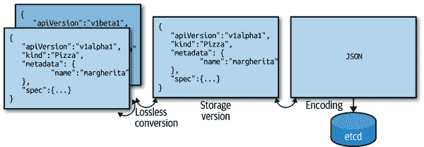
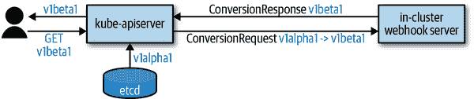
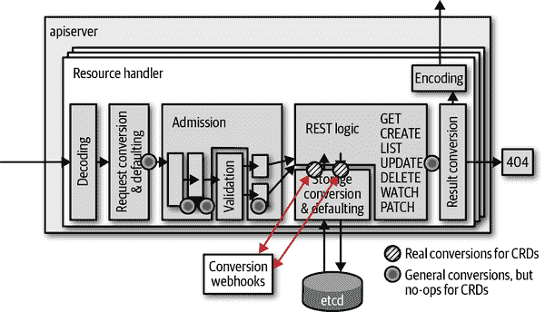
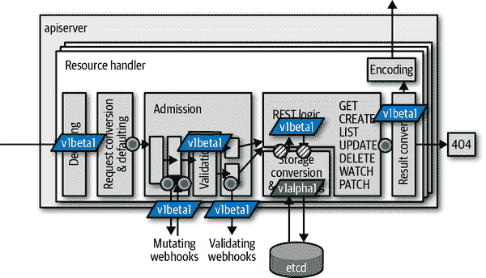
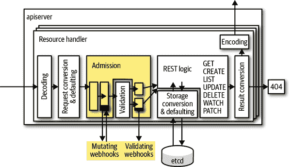

# 第九章：高级自定义资源

在本章中，我们将介绍有关 CR（Custom Resources）的高级主题：版本控制、转换和准入控制器。

有了多个版本，CRD（Custom Resource Definitions）变得更加严肃，并且在开发、维护以及操作上复杂度显著增加。我们将这些功能称为“高级”，因为它们将 CRD 从纯粹声明式的清单转移到 Golang 的世界（即一个真正的软件开发项目）。

即使您不计划构建自定义 API 服务器，而是打算直接转向 CRD，我们强烈建议不要跳过第八章。高级 CRD 的许多概念都直接源于自定义 API 服务器的世界，并且受其启发。阅读第八章将大大有助于理解本章内容。

所有这里展示和讨论的示例代码都可以通过[GitHub 仓库](http://bit.ly/2RBSjAl)获取。

# 自定义资源版本控制

在第八章中，我们看到资源如何通过不同的 API 版本提供。例如，自定义 API 服务器的示例中，pizza 资源同时存在于版本 `v1alpha1` 和 `v1beta1` 中（参见“示例：比萨饼餐厅”）。在自定义 API 服务器内部，请求中的每个对象首先从 API 终端版本转换为内部版本（参见“内部类型和转换”和图 8-5），然后再转换回外部版本以进行存储和返回响应。转换机制由转换函数实现，其中一些是手动编写的，一些是自动生成的（参见“转换”）。

API 版本控制是一种强大的机制，可以在保持与旧客户端兼容性的同时调整和改进 API。在 Kubernetes 中，版本控制无处不在，将 alpha API 推广到 beta，最终到普遍可用（GA）起着核心作用。在此过程中，API 经常会更改结构或进行扩展。

长期以来，版本控制是仅通过聚合 API 服务器作为第八章中所示的功能。任何严肃的 API 最终都需要版本控制，因为与 API 的使用者断兼容性是不可接受的。

幸运的是，最近在 Kubernetes 中已经添加了 CRD 的版本控制——在 Kubernetes 1.14 中作为 alpha 版本，而在 1.15 中提升为 beta 版本。请注意，转换需要 OpenAPI v3 验证模式，这些模式是 *结构化的*（参见 “验证自定义资源”）。结构化模式基本上就是像 Kubebuilder 等工具产生的内容。我们将在 “结构化模式” 中讨论技术细节。

我们将展示版本控制在这里的运作方式，因为在不久的将来，它将在 CR 的许多重要应用中发挥核心作用。

## 重新审视比萨餐厅

为了了解 CR 转换的工作原理，我们将重新实现比萨餐厅示例（见 第八章），这次完全使用 CRD——即不涉及聚合 API 服务器。

对于转换，我们将专注于 `Pizza` 资源：

```
apiVersion: restaurant.programming-kubernetes.info/v1alpha1
kind: Pizza
metadata:
  name: margherita
spec:
  toppings:
  - mozzarella
  - tomato
```

此对象在 `v1beta1` 版本中应该有不同的表示形式来表示配料片：

```
apiVersion: restaurant.programming-kubernetes.info/v1beta1
kind: Pizza
metadata:
  name: margherita
spec:
  toppings:
  - name: mozzarella
    quantity: 1
  - name: tomato
    quantity: 1
```

在 `v1alpha1` 中，重复的配料用于表示额外的奶酪比萨，而在 `v1beta1` 中，我们通过为每个配料使用数量字段来实现。配料的顺序并不重要。

我们想要实现这个转换——从 `v1alpha1` 转换到 `v1beta1` 并反向。不过，在此之前，让我们将 API 定义为 CRD。请注意，我们不能在同一集群中同时拥有聚合的 API 服务器和相同 GroupVersion 的 CRD。因此，在继续进行这些 CRD 之前，请确保从 第八章 中删除 APIServices。

```
apiVersion: apiextensions.k8s.io/v1beta1
kind: CustomResourceDefinition
metadata:
  name: pizzas.restaurant.programming-kubernetes.info
spec:
  group: restaurant.programming-kubernetes.info
  names:
    kind: Pizza
    listKind: PizzaList
    plural: pizzas
    singular: pizza
  scope: Namespaced
  version: v1alpha1
  versions:
  - name: v1alpha1
    served: true
    storage: true
    schema: ...
  - name: v1beta1
    served: true
    storage: false
    schema: ...
```

CRD 定义了两个版本：`v1alpha1` 和 `v1beta1`。我们将前者设置为存储版本（参见 图 9-1），这意味着要存储在 `etcd` 中的每个对象都首先转换为 `v1alpha1`。



###### 图 9-1\. 转换和存储版本

由于当前定义的 CRD，我们可以创建一个 `v1alpha1` 对象，并作为 `v1beta1` 检索它，但两个 API 端点返回相同的对象。显然，这不是我们想要的。但很快我们将改进这一点。

但在此之前，我们将在集群中设置 CRD 并创建一个玛格丽特比萨：

```
apiVersion: restaurant.programming-kubernetes.info/v1alpha1
kind: Pizza
metadata:
  name: margherita
spec:
  toppings:
  - mozzarella
  - tomato
```

我们先注册前面的 CRD，然后创建玛格丽特对象：

```
$ kubectl create -f pizza-crd.yaml
$ kubectl create -f margherita-pizza.yaml
```

如预期的那样，我们得到了相同的对象来表示两个版本：

```
$ kubectl get pizza margherita -o yaml
apiVersion: restaurant.programming-kubernetes.info/v1beta1
kind: Pizza
metadata:
  creationTimestamp: "2019-04-14T11:39:20Z"
  generation: 1
  name: margherita
  namespace: pizza-apiserver
  resourceVersion: "47959"
  selfLink: /apis/restaurant.programming-kubernetes.info/v1beta1/namespaces/pizza-apiserver/
  pizzas/margherita
  uid: f18427f0-5ea9-11e9-8219-124e4d2dc074
spec:
  toppings:
  - mozzarella
  - tomato
```

Kubernetes 使用规范的版本排序方式，即：

`v1alpha1`

不稳定：可能随时消失或更改，并且通常默认禁用。

`v1beta1`

朝向稳定：至少在一个版本中与 `v1` 并行存在；契约：没有不兼容的 API 更改。

`v1`

稳定或一般可用（GA）：将长期保留，并且兼容。

GA 版本排在前面，然后是 beta 版本，再然后是 alpha 版本，主版本高到低排序，次版本也是如此。不符合此模式的每个 CRD 版本都排在最后，按字母顺序排列。

在我们的案例中，前面的 `kubectl get pizza` 返回 `v1beta1`，尽管创建的对象是版本 `v1alpha1`。

## CR 的转换 Webhook 架构

现在让我们添加从 `v1alpha1` 到 `v1beta1` 的转换并返回。Kubernetes 中通过 webhook 实现 CRD 转换。图 9-2 显示了流程：

1.  客户端（例如我们的 `kubectl get pizza margherita`）请求一个版本。

1.  `etcd` 已经将对象存储在某个版本中。

1.  如果版本不匹配，存储对象将被发送到 webhook 服务器进行转换。Webhook 返回一个包含转换后对象的响应。

1.  转换后的对象被发送回客户端。



###### 图 9-2\. 转换 Webhook

我们必须实现这个 webhook 服务器。在此之前，让我们查看一下 webhook API。Kubernetes API 服务器在 API 组 `apiextensions.k8s.io/v1beta1` 中发送一个 `ConversionReview` 对象：

```
type ConversionReview struct {
    metav1.TypeMeta `json:",inline"`
    Request *ConversionRequest
    Response *ConversionResponse
}
```

请求字段设置在发送到 webhook 的有效负载中。响应字段设置在响应中。

请求如下所示：

```
type ConversionRequest struct {
    ...

    // `desiredAPIVersion` is the version to convert given objects to.
    // For example, "myapi.example.com/v1."
    DesiredAPIVersion string

    // `objects` is the list of CR objects to be converted.
    Objects []runtime.RawExtension
}
```

`DesiredAPIVersion` 字符串具有我们从 `TypeMeta` 知道的通常 `apiVersion` 格式：*`group/version`*。

对象字段有多个对象。它是一个切片，因为对于比萨的一个列表请求，Webhook 将接收一个转换请求，此切片是列表请求的所有对象。

Webhook 进行转换并设置响应：

```
type ConversionResponse struct {
    ...

    // `convertedObjects` is the list of converted versions of `request.objects`
    // if the `result` is successful otherwise empty. The webhook is expected to
    // set apiVersion of these objects to the ConversionRequest.desiredAPIVersion.
    // The list must also have the same size as input list with the same objects
    // in the same order (i.e. equal UIDs and object meta).
    ConvertedObjects []runtime.RawExtension

    // `result` contains the result of conversion with extra details if the
    // conversion failed. `result.status` determines if the conversion failed
    // or succeeded. The `result.status` field is required and represents the
    // success or failure of the conversion. A successful conversion must set
    // `result.status` to `Success`. A failed conversion must set `result.status`
    // to `Failure` and provide more details in `result.message` and return http
    // status 200\. The `result.message` will be used to construct an error
    // message for the end user.
    Result metav1.Status
}
```

结果状态告诉 Kubernetes API 服务器转换是否成功。

但是在请求管道中我们的转换 webhook 实际上是在什么时候被调用的？我们可以期待什么样的输入对象？为了更好地理解这一点，请看 图 9-3 中的一般请求管道：所有这些实心和条纹圆圈都是在 *k8s.io/apiserver* 代码中进行转换的地方。



###### 图 9-3\. CR 的转换 Webhook 调用

与聚合自定义 API 服务器相比（参见 “内部类型和转换”），CR 不使用内部类型，而是直接在外部 API 版本之间进行转换。因此，在 图 9-4 中，只有那些黄色圆圈实际上在进行转换；实心圆圈对于 CRD 来说是 NOOP。换句话说：CRD 转换仅在 `etcd` 之间进行。



###### 图 9-4\. CR 的转换发生的位置

因此，我们可以假设我们的 webhook 将从请求管道中的这两个位置被调用（参见 图 9-3）。

还要注意，对冲突的补丁请求会自动重试（更新无法重试，并直接向调用者返回错误）。每次重试都涉及对 `etcd` 进行读取和写入（图 9-3 中的黄色圆圈），因此每次迭代会导致 Webhook 的两次调用。

###### 警告

所有关于转换“关键性”的警告也适用于此处：转换必须正确。错误会迅速导致数据丢失和 API 不一致的行为。

在开始实现 Webhook 之前，关于 Webhook 能做什么和必须避免的最后几句话：

+   请求和响应中对象的顺序不能改变。

+   `ObjectMeta` 除了标签和注释之外，不能被改变。

+   转换要么全部成功，要么全部失败，不能部分成功。

## 转换 Webhook 实现

理论已经讲述完毕，我们准备开始实现 Webhook 项目。您可以在 [仓库](http://bit.ly/2IHXKLn) 找到源代码，其中包括：

+   一个作为 HTTPS Web 服务器的 Webhook 实现

+   多个端点：

    +   */convert/v1beta1/pizza* 在 `v1alpha1` 和 `v1beta1` 之间转换 pizza 对象。

    +   */admit/v1beta1/pizza* 将 `spec.toppings` 字段默认为 mozzarella, tomato, salami。

    +   */validate/v1beta1/pizza* 验证每个指定的配料是否有对应的 toppings 对象。

最后两个端点是准入 Webhook，在 “准入 Webhook” 中将详细讨论。同一个 Webhook 二进制文件将同时服务于准入和转换。

这些路径中的 `v1beta1` 不应与我们餐厅 API 组的 `v1beta1` 混淆，而是作为我们支持的 `apiextensions.k8s.io` API 组版本的 Webhook。有一天，该 Webhook API 的 `v1` 版本将被支持，^(1) 届时我们将添加对应的 `v1` 作为另一个端点，以支持旧（即今天的）和新的 Kubernetes 集群。可以在 CRD 清单中指定 Webhook 支持的版本。

让我们看看这个转换 Webhook 是如何工作的。之后，我们将深入探讨如何将 Webhook 部署到真实的集群中。再次注意，Webhook 转换在 1.14 版本中仍处于 alpha 阶段，必须手动启用 `CustomResourceWebhookConversion` 功能开关，但在 1.15 版本中作为 beta 版本可用。

## 设置 HTTPS 服务器

第一步是启动支持传输层安全性（TLS）的 Web 服务器（即 HTTPS）。Kubernetes 中的 Webhook 需要 HTTPS。甚至转换 Webhook 需要证书，这些证书由 Kubernetes API 服务器针对 CRD 对象中提供的 CA bundle 进行成功检查。

在示例项目中，我们使用了*k8s.io/apiserver*中的安全服务库。它提供了您在部署`kube-apiserver`或聚合 API 服务器二进制文件时可能习惯的所有 TLS 标志和行为。

*k8s.io/apiserver*安全服务代码遵循`options-config`模式（参见“选项和配置模式及启动管道”）。将该代码轻松嵌入到您自己的二进制文件中非常简单：

```
func NewDefaultOptions() *Options {
    o := &Options{
        *options.NewSecureServingOptions(),
    }
    o.SecureServing.ServerCert.PairName = "pizza-crd-webhook"
    return o
}

type Options struct {
    SecureServing options.SecureServingOptions
}

type Config struct {
    SecureServing *server.SecureServingInfo
}

func (o *Options) AddFlags(fs *pflag.FlagSet) {
    o.SecureServing.AddFlags(fs)
}

func (o *Options) Config() (*Config, error) {
    err := o.SecureServing.MaybeDefaultWithSelfSignedCerts("0.0.0.0", nil, nil)
    if err != nil {
        return nil, err
    }

    c := &Config{}

    if err := o.SecureServing.ApplyTo(&c.SecureServing); err != nil {
        return nil, err
    }

    return c, nil
}
```

在二进制的主函数中，这个`Options`结构体被实例化并连接到一个标志集：

```
opt := NewDefaultOptions()
fs := pflag.NewFlagSet("pizza-crd-webhook", pflag.ExitOnError)
globalflag.AddGlobalFlags(fs, "pizza-crd-webhook")
opt.AddFlags(fs)
if err := fs.Parse(os.Args); err != nil {
    panic(err)
}

// create runtime config
cfg, err := opt.Config()
if err != nil {
    panic(err)
}

stopCh := server.SetupSignalHandler()

...

// run server
restaurantInformers.Start(stopCh)
if doneCh, err := cfg.SecureServing.Serve(
    handlers.LoggingHandler(os.Stdout, mux),
    time.Second * 30, stopCh,
); err != nil {
    panic(err)
} else {
    <-doneCh
}
```

在这三个路径的位置，我们使用以下方法设置 HTTP 多路复用器：

```
// register handlers
restaurantInformers := restaurantinformers.NewSharedInformerFactory(
    clientset, time.Minute * 5,
)
mux := http.NewServeMux()
mux.Handle("/convert/v1beta1/pizza", http.HandlerFunc(conversion.Serve))
mux.Handle("/admit/v1beta1/pizza", http.HandlerFunc(admission.ServePizzaAdmit))
mux.Handle("/validate/v1beta1/pizza",
    http.HandlerFunc(admission.ServePizzaValidation(restaurantInformers)))
restaurantInformers.Start(stopCh)
```

由于位于*/validate/v1beta1/pizza*路径的 pizza 验证 webhook 必须知道集群中现有的 topping 对象，我们为`restaurant.programming-kubernetes.info` API 组实例化了一个共享 informer 工厂。

现在我们来看看实际的转换 webhook 实现在`conversion.Serve`背后的实现。这是一个普通的 Golang HTTP 处理函数，意味着它会获取请求和响应写入器作为参数。

请求体包含来自 API 组`apiextensions.k8s.io/v1beta1`的`ConversionReview`对象。因此，我们必须首先从请求中读取主体，然后解码字节切片。我们通过使用 API Machinery 的反序列化器来实现这一点：

```
func Serve(w http.ResponseWriter, req *http.Request) {
    // read body
    body, err := ioutil.ReadAll(req.Body)
    if err != nil {
        responsewriters.InternalError(w, req,
          fmt.Errorf("failed to read body: %v", err))
        return
    }

    // decode body as conversion review
    gv := apiextensionsv1beta1.SchemeGroupVersion
    reviewGVK := gv.WithKind("ConversionReview")
    obj, gvk, err := codecs.UniversalDeserializer().Decode(body, &reviewGVK,
        &apiextensionsv1beta1.ConversionReview{})
    if err != nil {
        responsewriters.InternalError(w, req,
          fmt.Errorf("failed to decode body: %v", err))
        return
    }
    review, ok := obj.(*apiextensionsv1beta1.ConversionReview)
    if !ok {
        responsewriters.InternalError(w, req,
          fmt.Errorf("unexpected GroupVersionKind: %s", gvk))
        return
    }
    if review.Request == nil {
        responsewriters.InternalError(w, req,
          fmt.Errorf("unexpected nil request"))
        return
    }

    ...
}
```

这段代码使用了来自一个方案的编解码工厂`codecs`。这个方案必须包括*apiextensions.k8s.io/v1beta1*的类型。我们还添加了我们的餐厅 API 组的类型。传递的`ConversionReview`对象将会在一个`runtime.RawExtension`类型中嵌入我们的 pizza 类型，稍后会详细说明这一点。

首先，让我们创建我们的方案和编解码工厂：

```
import (
    apiextensionsv1beta1 "k8s.io/apiextensions-apiserver/pkg/apis/apiextensions/v1beta1"
    "github.com/programming-kubernetes/pizza-crd/pkg/apis/restaurant/install"
    ...
)

var (
    scheme = runtime.NewScheme()
    codecs = serializer.NewCodecFactory(scheme)
)

func init() {
    utilruntime.Must(apiextensionsv1beta1.AddToScheme(scheme))
    install.Install(scheme)
}
```

`runtime.RawExtension`是包含在另一个对象字段中的类似 Kubernetes 的对象的包装器。其结构实际上非常简单：

```
type RawExtension struct {
    // Raw is the underlying serialization of this object.
    Raw []byte `protobuf:"bytes,1,opt,name=raw"`
    // Object can hold a representation of this extension - useful for working
    // with versioned structs.
    Object Object `json:"-"`
}
```

另外，`runtime.RawExtension`具有两种特殊的 JSON 和 protobuf 编组方法。此外，还存在围绕动态转换为`runtime.Object`的特殊逻辑，即在转换为内部类型时的自动编码和解码。

在 CRD 的情况下，我们没有内部类型，因此转换的魔法不起作用。只有`RawExtension.Raw`填充了发送到 webhook 进行转换的 pizza 对象的 JSON 字节切片。因此，我们将需要解码这个字节切片。再次注意，一个`ConversionReview`可能携带多个对象，因此我们必须循环遍历所有这些对象：

```
// convert objects
review.Response = &apiextensionsv1beta1.ConversionResponse{
    UID: review.Request.UID,
    Result:  metav1.Status{
        Status: metav1.StatusSuccess,
    },
}
var objs []runtime.Object
for _, in := range review.Request.Objects {
    if in.Object == nil {
        var err error
        in.Object, _, err = codecs.UniversalDeserializer().Decode(
            in.Raw, nil, nil,
        )
        if err != nil {
            review.Response.Result = metav1.Status{
                Message: err.Error(),
                Status:  metav1.StatusFailure,
            }
            break
        }
    }

    obj, err := convert(in.Object, review.Request.DesiredAPIVersion)
    if err != nil {
        review.Response.Result = metav1.Status{
            Message: err.Error(),
            Status:  metav1.StatusFailure,
        }
        break
    }
    objs = append(objs, obj)
}
```

`convert`调用实际执行了`in.Object`的转换，目标版本是所需的 API 版本。请注意，当第一个错误发生时，我们会立即中断循环。

最后，在`ConversionReview`对象中设置`Response`字段，并将其作为请求的响应体写回，使用 API Machinery 的响应写入器，再次使用我们的编解码工厂创建序列化器：

```
if review.Response.Result.Status == metav1.StatusSuccess {
    for _, obj = range objs {
        review.Response.ConvertedObjects =
          append(review.Response.ConvertedObjects,
            runtime.RawExtension{Object: obj},
          )
    }
}

// write negotiated response
responsewriters.WriteObject(
    http.StatusOK, gvk.GroupVersion(), codecs, review, w, req,
)
```

现在，我们必须实现实际的 Pizza 转换。在上面的所有这些管道之后，转换算法是最简单的部分。它只需检查我们是否确实获得了已知版本的 Pizza 对象，然后执行从`v1beta1`到`v1alpha1`和反向的转换：

```
func convert(in runtime.Object, apiVersion string) (runtime.Object, error) {
    switch in := in.(type) {
    case *v1alpha1.Pizza:
        if apiVersion != v1beta1.SchemeGroupVersion.String() {
            return nil, fmt.Errorf("cannot convert %s to %s",
              v1alpha1.SchemeGroupVersion, apiVersion)
        }
        klog.V(2).Infof("Converting %s/%s from %s to %s", in.Namespace, in.Name,
            v1alpha1.SchemeGroupVersion, apiVersion)

        out := &v1beta1.Pizza{
            TypeMeta: in.TypeMeta,
            ObjectMeta: in.ObjectMeta,
            Status: v1beta1.PizzaStatus{
                Cost: in.Status.Cost,
            },
        }
        out.TypeMeta.APIVersion = apiVersion

        idx := map[string]int{}
        for _, top := range in.Spec.Toppings {
            if i, duplicate := idx[top]; duplicate {
                out.Spec.Toppings[i].Quantity++
                continue
            }
            idx[top] = len(out.Spec.Toppings)
            out.Spec.Toppings = append(out.Spec.Toppings, v1beta1.PizzaTopping{
                Name: top,
                Quantity: 1,
            })
        }

        return out, nil

    case *v1beta1.Pizza:
        if apiVersion != v1alpha1.SchemeGroupVersion.String() {
            return nil, fmt.Errorf("cannot convert %s to %s",
              v1beta1.SchemeGroupVersion, apiVersion)
        }
        klog.V(2).Infof("Converting %s/%s from %s to %s",
          in.Namespace, in.Name, v1alpha1.SchemeGroupVersion, apiVersion)

        out := &v1alpha1.Pizza{
            TypeMeta: in.TypeMeta,
            ObjectMeta: in.ObjectMeta,
            Status: v1alpha1.PizzaStatus{
                Cost: in.Status.Cost,
            },
        }
        out.TypeMeta.APIVersion = apiVersion

        for i := range in.Spec.Toppings {
            for j := 0; j < in.Spec.Toppings[i].Quantity; j++ {
                out.Spec.Toppings = append(
                  out.Spec.Toppings, in.Spec.Toppings[i].Name)
            }
        }

        return out, nil

    default:
    }
    klog.V(2).Infof("Unknown type %T", in)
    return nil, fmt.Errorf("unknown type %T", in)
}
```

请注意，在转换的两个方向上，我们只需复制`TypeMeta`和`ObjectMeta`，将 API 版本更改为所需的版本，然后转换配料片，这实际上是对象结构上唯一不同的部分。

如果存在更多版本，则需要在它们之间进行双向转换。或者，当然，我们可以像聚合 API 服务器中那样使用中心版本（参见“内部类型和转换”），而不是实现从所有支持的外部版本到所有支持的版本的转换。

## 部署转换 Webhook

现在我们想要部署转换 Webhook。您可以在[GitHub](http://bit.ly/2KEx4xo)上找到所有清单。

CRD 的转换 Webhook 在集群中启动，并放置在服务对象后面，该服务对象由 CRD 清单中转换 Webhook 规范引用：

```
apiVersion: apiextensions.k8s.io/v1beta1
kind: CustomResourceDefinition
metadata:
  name: pizzas.restaurant.programming-kubernetes.info
spec:
  ...
  conversion:
    strategy: Webhook
    webhookClientConfig:
      caBundle: *`BASE64-CA-BUNDLE`*
      service:
        namespace: pizza-crd
        name: webhook
        path: /convert/v1beta1/pizza

```

CA 捆绑证书必须与 Webhook 使用的服务证书相匹配。在我们的示例项目中，我们使用[Makefile](http://bit.ly/2FukVac)使用 OpenSSL 生成证书，并通过文本替换将它们插入清单中。

在这里请注意，Kubernetes API 服务器假定 Webhook 支持 CRD 的所有指定版本。每个 CRD 只可能有一个这样的 Webhook。但是由于 CRD 和转换 Webhook 通常由同一个团队拥有，这应该足够了。

还要注意，当前*apiextensions.k8s.io/v1beta1* API 中服务端口必须为 443。但是，该服务可以映射到 Webhook Pod 使用的任何端口。在我们的示例中，我们将 443 映射到由 Webhook 二进制服务的 8443 端口。

## 观看转换的实际操作

现在我们理解了转换 Webhook 的工作原理以及它如何连接到集群，让我们看看它的实际效果。

我们假设您已经检出了示例项目。此外，我们假设您有一个启用 Webhook 转换的集群（在 1.14 集群中通过特性门启用，或者通过默认启用 Webhook 转换的 1.15+集群）。获取此类集群的一种方法是通过[kind 项目](http://bit.ly/2X75lvS)，该项目支持 Kubernetes 1.14.1，并提供本地*kind-config.yaml*文件以启用 Webhook 转换的 Alpha 特性门（“什么是编程 Kubernetes？”链接了其他一些开发集群的选项）：

```
kind: Cluster
apiVersion: kind.sigs.k8s.io/v1alpha3
kubeadmConfigPatchesJson6902:
- group: kubeadm.k8s.io
  version: v1beta1
  kind: ClusterConfiguration
  patch: |
    - op: add
      path: /apiServer/extraArgs
      value: {}
    - op: add
      path: /apiServer/extraArgs/feature-gates
      value: CustomResourceWebhookConversion=true
```

然后我们可以创建一个集群：

```
$ kind create cluster --image kindest/node-images:v1.14.1 --config kind-config.yaml
$ export KUBECONFIG="$(kind get kubeconfig-path --name="kind")"
```

现在我们可以部署[我们的清单](http://bit.ly/2KEx4xo)：

```
$ cd pizza-crd
$ cd manifest/deployment
$ make
$ kubectl create -f ns.yaml
$ kubectl create -f pizza-crd.yaml
$ kubectl create -f topping-crd.yaml
$ kubectl create -f sa.yaml
$ kubectl create -f rbac.yaml
$ kubectl create -f rbac-bind.yaml
$ kubectl create -f service.yaml
$ kubectl create -f serving-cert-secret.yaml
$ kubectl create -f deployment.yaml
```

这些清单包含以下文件：

*ns.yaml*

创建`pizza-crd`命名空间。

*pizza-crd.yaml*

在`restaurant.programming-kubernetes.info` API 组中指定了 pizza 资源，具有`v1alpha1`和`v1beta1`版本，并且像之前展示的 webhook 转换配置。

*topping-crd.yaml*

在同一 API 组中指定了配料 CR，但仅限于`v1alpha1`版本。

*sa.yaml*

引入了`webhook`服务帐户。

*rbac.yaml*

定义了一个角色以读取、列出和监视配料。

*rbac-bind.yaml*

将先前的 RBAC 角色绑定到`webhook`服务帐户。

*service.yaml*

定义了`webhook`服务，将 webhook pod 的端口 443 映射到 8443 端口。

*serving-cert-secret.yaml*

包含了用于 webhook pod 的服务证书和私钥。证书也直接用作前述 pizza CRD 清单中的 CA 捆绑。

*deployment.yaml*

启动 webhook pods，传递`--tls-cert-file`和`--tls-private-key`的服务证书密钥。

之后，我们终于可以创建一个玛格丽特披萨：

```
$ cat  ../examples/margherita-pizza.yaml
apiVersion: restaurant.programming-kubernetes.info/v1alpha1
kind: Pizza
metadata:
  name: margherita
spec:
  toppings:
  - mozzarella
  - tomato
$ kubectl create ../examples/margherita-pizza.yaml
pizza.restaurant.programming-kubernetes.info/margherita created
```

现在，通过转换 webhook 的设置，我们可以在两个版本中检索相同的对象。首先显式地在`v1alpha1`版本中：

```
$ kubectl get pizzas.v1alpha1.restaurant.programming-kubernetes.info \
    margherita -o yaml
apiVersion: restaurant.programming-kubernetes.info/v1alpha1
kind: Pizza
metadata:
  creationTimestamp: "2019-04-14T21:41:39Z"
  generation: 1
  name: margherita
  namespace: pizza-crd
  resourceVersion: "18296"
  pizzas/margherita
  uid: 15c1c06a-5efe-11e9-9230-0242f24ba99c
spec:
  toppings:
  - mozzarella
  - tomato
status: {}
```

然后`v1beta1`版本的同一个对象显示了不同的配料结构：

```
$ kubectl get pizzas.v1beta1.restaurant.programming-kubernetes.info \
    margherita -o yaml
apiVersion: restaurant.programming-kubernetes.info/v1beta1
kind: Pizza
metadata:
  creationTimestamp: "2019-04-14T21:41:39Z"
  generation: 1
  name: margherita
  namespace: pizza-crd
  resourceVersion: "18296"
  pizzas/margherita
  uid: 15c1c06a-5efe-11e9-9230-0242f24ba99c
spec:
  toppings:
  - name: mozzarella
    quantity: 1
  - name: tomato
    quantity: 1
status: {}
```

与此同时，在 webhook pod 的日志中，我们看到了这个转换调用：

```
I0414 21:46:28.639707       1 convert.go:35] Converting pizza-crd/margherita
  from restaurant.programming-kubernetes.info/v1alpha1
  to restaurant.programming-kubernetes.info/v1beta1
10.32.0.1 - - [14/Apr/2019:21:46:28 +0000]
  "POST /convert/v1beta1/pizza?timeout=30s HTTP/2.0" 200 968
```

因此，webhook 正在按预期工作。

# 准入 Webhooks

在“自定义 API 服务器用例”中，我们讨论了在哪些场景下聚合 API 服务器比使用 CR 更好的选择。提到的许多原因是关于使用 Golang 实现特定行为的自由，而不是受限于 CRD 清单中的声明式功能。

我们在前一节中已经看到了如何使用 Golang 构建 CRD 转换 webhook。类似的机制也用于向 CRD 添加自定义准入，同样是在 Golang 中实现。

基本上，我们与聚合 API 服务器中的自定义准入插件有着相同的自由度（参见“准入”）：有变异和验证准入 webhook，并且它们在与本机资源相同的位置调用，如图 9-5 所示。



###### 图 9-5\. CR 请求管道中的准入

我们在“验证自定义资源”中看到基于 OpenAPI 的 CRD 验证。在图 9-5 中，“验证”框中执行验证。在此之后调用验证准入 webhook，变异准入 webhook 在此之前调用。

准入 webhook 几乎放在准入插件顺序的末尾，quota 之前。准入 webhook 在 Kubernetes 1.14 中是 beta 版，因此在大多数集群中可用。

###### 提示

对于审核 webhooks API 的 v1 版本，计划允许通过审核链进行最多两次通过。这意味着更早的审核插件或 webhook 可以依赖于稍后插件或 webhook 的输出，到某个程度上。因此，在将来，这个机制将变得更加强大。

## 餐厅示例中的审核要求

餐厅示例中使用审核来完成多个任务：

+   如果 `spec.toppings` 为 `nil` 或为空，则默认为 mozzarella、tomato 和 salami。

+   从 CR JSON 中删除未知字段，并且不要在 `etcd` 中持久化。

+   `spec.toppings` 必须仅包含具有相应 topping 对象的配料。

前两个用例是变异的；第三个用例纯粹是验证的。因此，我们将使用一个变异 webhook 和一个验证 webhook 来实现这些步骤。

###### 注意

正在进行 [通过 OpenAPI v3 验证模式进行本地默认值设置](http://bit.ly/2ZFH8JY) 的工作。OpenAPI 有一个 `default` 字段，API 服务器将来会应用它。此外，通过一个称为修剪的机制，未知字段的删除将成为每个资源的标准行为，由 Kubernetes API 服务器执行（http://bit.ly/2Xzt2wm）。

在 Kubernetes 1.15 中，修剪作为 beta 版本提供。默认值计划在 1.16 的 beta 版本中可用。当目标集群中同时可用这两个功能时，可以完全不需要任何 webhook 来实现前述列表中的两个用例。

## 审核 Webhook 架构

审核 webhooks 在结构上与我们在本章前面看到的转换 webhooks 非常相似。

它们被部署在集群中，在服务映射端口 443 的背后，映射到一些 pod 的端口，并且通过 API 组 `admission.k8s.io/v1beta1` 中的审核对象 `AdmissionReview` 进行调用：

```
---
// AdmissionReview describes an admission review request/response.
type AdmissionReview struct {
    metav1.TypeMeta `json:",inline"`
    // Request describes the attributes for the admission request.
    // +optional
    Request *AdmissionRequest `json:"request,omitempty"`
    // Response describes the attributes for the admission response.
    // +optional
    Response *AdmissionResponse `json:"response,omitempty"`
}
---
```

`AdmissionRequest` 包含我们从审核属性（参见 “实施”）中熟悉的所有信息：

```
// AdmissionRequest describes the admission.Attributes for the admission request.
type AdmissionRequest struct {
    // UID is an identifier for the individual request/response. It allows us to
    // distinguish instances of requests which are otherwise identical (parallel
    // requests, requests when earlier requests did not modify etc). The UID is
    // meant to track the round trip (request/response) between the KAS and the
    // WebHook, not the user request. It is suitable for correlating log entries
    // between the webhook and apiserver, for either auditing or debugging.
    UID types.UID `json:"uid"`
    // Kind is the type of object being manipulated.  For example: Pod
    Kind metav1.GroupVersionKind `json:"kind"`
    // Resource is the name of the resource being requested.  This is not the
    // kind.  For example: pods
    Resource metav1.GroupVersionResource `json:"resource"`
    // SubResource is the name of the subresource being requested.  This is a
    // different resource, scoped to the parent resource, but it may have a
    // different kind. For instance, /pods has the resource "pods" and the kind
    // "Pod", while /pods/foo/status has the resource "pods", the sub resource
    // "status", and the kind "Pod" (because status operates on pods). The
    // binding resource for a pod though may be /pods/foo/binding, which has
    // resource "pods", subresource "binding", and kind "Binding".
    // +optional
    SubResource string `json:"subResource,omitempty"`
    // Name is the name of the object as presented in the request.  On a CREATE
    // operation, the client may omit name and rely on the server to generate
    // the name.  If that is the case, this method will return the empty string.
    // +optional
    Name string `json:"name,omitempty"`
    // Namespace is the namespace associated with the request (if any).
    // +optional
    Namespace string `json:"namespace,omitempty"`
    // Operation is the operation being performed
    Operation Operation `json:"operation"`
    // UserInfo is information about the requesting user
    UserInfo authenticationv1.UserInfo `json:"userInfo"`
    // Object is the object from the incoming request prior to default values
    // being applied
    // +optional
    Object runtime.RawExtension `json:"object,omitempty"`
    // OldObject is the existing object. Only populated for UPDATE requests.
    // +optional
    OldObject runtime.RawExtension `json:"oldObject,omitempty"`
    // DryRun indicates that modifications will definitely not be persisted
    // for this request.
    // Defaults to false.
    // +optional
    DryRun *bool `json:"dryRun,omitempty"`
}
```

相同的 `AdmissionReview` 对象用于变异和验证审核 webhooks。唯一的区别在于，在变异情况下，`AdmissionResponse` 可以有一个 `patch` 字段和 `patchType` 字段，在 webhook 响应后在 Kubernetes API 服务器内应用。在验证情况下，这两个字段在响应时保持空白。

对于我们这里的目的，最重要的字段是 `Object` 字段，与前面的转换 webhook 一样，使用 `runtime.RawExtension` 类型来存储 pizza 对象。

对于更新请求，我们还会获取旧对象，并且可以检查那些本应为只读但在请求中被更改的字段。在我们的示例中，我们并未这样做。但是在 Kubernetes 中，您会遇到许多这样实现逻辑的情况，例如对于 pod 的大多数字段，一旦创建后就无法更改 pod 的命令。

在 Kubernetes 1.14 中，由变异 Webhook 返回的补丁必须是 JSON `Patch` 类型（参见 RFC 6902）。此补丁描述了如何修改对象以满足所需的不变性。

注意，在验证每个变异 Webhook 更改时，最佳做法是在验证 Webhook 的最后验证，至少如果这些强制属性对行为至关重要的话。想象一下，某个其他变异 Webhook 触及对象中的相同字段。然后，您不能确定变异更改是否会在变异准入链的末尾生效。

目前变异 Webhook 中除了字母顺序外没有顺序。未来可能会有讨论改变这一点。

对于验证 Webhook，顺序显然无关紧要，Kubernetes API 服务器甚至并行调用验证 Webhook 以减少延迟。相比之下，变异 Webhook 会给通过它们的每个请求增加延迟，因为它们是顺序调用的。

常见的延迟（当然，这严重依赖于环境）大约在 100 毫秒左右。因此，依次运行许多 Webhook 会导致用户在创建或更新对象时经历相当的延迟。

## 注册准入 Webhook

准入 Webhook 并未在 CRD 清单中注册。原因是它们不仅适用于 CRD，还适用于任何类型的资源。您甚至可以向标准 Kubernetes 资源添加自定义准入 Webhook。

只有注册对象：`MutatingWebhookRegistration` 和 `ValidatingWebhookRegistration`。它们仅在种类名称上有所不同：

```
apiVersion: admissionregistration.k8s.io/v1beta1
kind: MutatingWebhookConfiguration
metadata:
  name: restaurant.programming-kubernetes.info
webhooks:
- name: restaurant.programming-kubernetes.info
  failurePolicy: Fail
  sideEffects: None
  admissionReviewVersions:
  - v1beta1
  rules:
  - apiGroups:
    - "restaurant.programming-kubernetes.info"
    apiVersions:
    - v1alpha1
    - v1beta1
    operations:
    - CREATE
    - UPDATE
    resources:
    - pizzas
  clientConfig:
    service:
      namespace: pizza-crd
      name: webhook
      path: /admit/v1beta1/pizza
    caBundle: *`CA-BUNDLE`*

```

这在本章开头为我们的 `pizza-crd` Webhook 注册了变异准入，用于我们的两个版本的资源 `pizza`，API 组 `restaurant.programming-kubernetes.info`，以及 HTTP 动词 `CREATE` 和 `UPDATE`（也包括补丁）。

在 Webhook 配置中有进一步的方式来限制匹配的资源，例如命名空间选择器（例如，排除控制平面命名空间以避免引导问题）以及带有通配符和子资源的更高级资源模式。

最后但同样重要的是失败模式，它可以是 `Fail` 或 `Ignore`。它指定了如果无法访问 Webhook 或因其他原因失败时该怎么做。

###### 警告

如果错误部署，准入 Webhook 可能会破坏集群。准入 Webhook 匹配核心类型可能使整个集群无法操作。必须特别注意为非 CRD 资源调用准入 Webhook。

特别是，最好的做法是排除控制平面和 Webhook 资源本身的 Webhook。

## 实施准入 Webhook

通过我们在本章开头对转换 Webhook 的工作，添加准入能力并不困难。我们还看到了路径 */admit/v1beta1/pizza* 和 */validate/v1beta1/pizza* 在 `pizza-crd-webhook` 二进制文件的主函数中注册：

```
mux.Handle("/admit/v1beta1/pizza", http.HandlerFunc(admission.ServePizzaAdmit))
mux.Handle("/validate/v1beta1/pizza", http.HandlerFunc(
admission.ServePizzaValidation(restaurantInformers)))
```

两个 HTTP 处理程序实现的第一部分看起来几乎与转换 Webhook 相同：

```
func ServePizzaAdmit(w http.ResponseWriter, req *http.Request) {
    // read body
    body, err := ioutil.ReadAll(req.Body)
    if err != nil {
        responsewriters.InternalError(w, req,
          fmt.Errorf("failed to read body: %v", err))
        return
    }

    // decode body as admission review
    reviewGVK := admissionv1beta1.SchemeGroupVersion.WithKind("AdmissionReview")
    decoder := codecs.UniversalDeserializer()
    into := &admissionv1beta1.AdmissionReview{}
    obj, gvk, err := decoder.Decode(body, &reviewGVK, into)
    if err != nil {
        responsewriters.InternalError(w, req,
          fmt.Errorf("failed to decode body: %v", err))
        return
    }
    review, ok := obj.(*admissionv1beta1.AdmissionReview)
    if !ok {
        responsewriters.InternalError(w, req,
          fmt.Errorf("unexpected GroupVersionKind: %s", gvk))
        return
    }
    if review.Request == nil {
        responsewriters.InternalError(w, req,
          fmt.Errorf("unexpected nil request"))
        return
    }

    ...
}
```

在验证 Webhook 的情况下，我们必须连接通知器（用于检查集群中的配料是否存在）。只要通知器未同步，我们就返回内部错误。未同步的通知器具有不完整的数据，因此可能不知道配料并且可能会拒绝比萨，尽管它们是有效的：

```
func ServePizzaValidation(informers restaurantinformers.SharedInformerFactory)
    func (http.ResponseWriter, *http.Request)
{
    toppingInformer := informers.Restaurant().V1alpha1().Toppings().Informer()
    toppingLister := informers.Restaurant().V1alpha1().Toppings().Lister()

    return func(w http.ResponseWriter, req *http.Request) {
        if !toppingInformer.HasSynced() {
            responsewriters.InternalError(w, req,
              fmt.Errorf("informers not ready"))
            return
        }

        // read body
        body, err := ioutil.ReadAll(req.Body)
        if err != nil {
            responsewriters.InternalError(w, req,
              fmt.Errorf("failed to read body: %v", err))
            return
        }

        // decode body as admission review
        gv := admissionv1beta1.SchemeGroupVersion
        reviewGVK := gv.WithKind("AdmissionReview")
        obj, gvk, err := codecs.UniversalDeserializer().Decode(body, &reviewGVK,
            &admissionv1beta1.AdmissionReview{})
        if err != nil {
            responsewriters.InternalError(w, req,
              fmt.Errorf("failed to decode body: %v", err))
            return
        }
        review, ok := obj.(*admissionv1beta1.AdmissionReview)
        if !ok {
            responsewriters.InternalError(w, req,
              fmt.Errorf("unexpected GroupVersionKind: %s", gvk))
            return
        }
        if review.Request == nil {
            responsewriters.InternalError(w, req,
              fmt.Errorf("unexpected nil request"))
            return
        }

        ...
    }
}
```

就像在 Webhook 转换案例中一样，我们设置了方案和编解码器工厂，其中包括准入 API 组和我们的餐厅 API 组：

```
var (
    scheme = runtime.NewScheme()
    codecs = serializer.NewCodecFactory(scheme)
)

func init() {
    utilruntime.Must(admissionv1beta1.AddToScheme(scheme))
    install.Install(scheme)
}
```

通过这两个，我们从 `AdmissionReview` 中解码嵌入的比萨对象（这次只有一个，没有切片）：

```
// decode object
if review.Request.Object.Object == nil {
    var err error
    review.Request.Object.Object, _, err =
      codecs.UniversalDeserializer().Decode(review.Request.Object.Raw, nil, nil)
    if err != nil {
        review.Response.Result = &metav1.Status{
            Message: err.Error(),
            Status:  metav1.StatusFailure,
        }
        responsewriters.WriteObject(http.StatusOK, gvk.GroupVersion(),
          codecs, review, w, req)
        return
    }
}
```

然后我们可以执行实际的突变准入（两个 API 版本的 `spec.toppings` 默认值）：

```
orig := review.Request.Object.Raw
var bs []byte
switch pizza := review.Request.Object.Object.(type) {
case *v1alpha1.Pizza:
    // default toppings
    if len(pizza.Spec.Toppings) == 0 {
        pizza.Spec.Toppings = []string{"tomato", "mozzarella", "salami"}
    }
    bs, err = json.Marshal(pizza)
    if err != nil {
        responsewriters.InternalError(w, req,
          fmt.Errorf"unexpected encoding error: %v", err))
        return
    }

case *v1beta1.Pizza:
    // default toppings
    if len(pizza.Spec.Toppings) == 0 {
        pizza.Spec.Toppings = []v1beta1.PizzaTopping{
            {"tomato", 1},
            {"mozzarella", 1},
            {"salami", 1},
        }
    }
    bs, err = json.Marshal(pizza)
    if err != nil {
        responsewriters.InternalError(w, req,
          fmt.Errorf("unexpected encoding error: %v", err))
        return
    }

default:
    review.Response.Result = &metav1.Status{
        Message: fmt.Sprintf("unexpected type %T", review.Request.Object.Object),
        Status:  metav1.StatusFailure,
    }
    responsewriters.WriteObject(http.StatusOK, gvk.GroupVersion(),
      codecs, review, w, req)
    return
}
```

或者，我们可以使用转换 Webhook 中的转换算法，然后仅为其中一个版本实现默认值。两种方法都可行，哪种更合理取决于上下文。在这里，默认值足够简单，可以实现两次。

最后一步是计算补丁——原始对象（存储在 `orig` 中作为 JSON）与新的默认对象之间的差异：

```
// compare original and defaulted version
ops, err := jsonpatch.CreatePatch(orig, bs)
if err != nil {
    responsewriters.InternalError(w, req,
        fmt.Errorf("unexpected diff error: %v", err))
    return
}
review.Response.Patch, err = json.Marshal(ops)
if err != nil {
    responsewriters.InternalError(w, req,
    fmt.Errorf("unexpected patch encoding error: %v", err))
    return
}
typ := admissionv1beta1.PatchTypeJSONPatch
review.Response.PatchType = &typ
review.Response.Allowed = true
```

我们使用 [JSON-Patch 库](http://bit.ly/2IKxwIk)（Matt Baird 的一个分支，具有 [关键修复](http://bit.ly/2XxKfWP)）从原始对象 `orig` 和修改后的对象 `bs` 中提取补丁，两者都作为 JSON 字节切片传递。或者，我们可以直接操作未类型化的 JSON 数据并手动创建 JSON-Patch。同样，这取决于上下文。使用差异库很方便。

然后，就像在 Webhook 转换中一样，我们通过使用之前创建的编解码器工厂向响应编写器写入响应来结束：

```
responsewriters.WriteObject(
    http.StatusOK, gvk.GroupVersion(), codecs, review, w, req,
)
```

验证 Webhook 非常相似，但它使用共享通知器中的配料列表器来检查配料对象的存在：

```
switch pizza := review.Request.Object.Object.(type) {
case *v1alpha1.Pizza:
    for _, topping := range pizza.Spec.Toppings {
        _, err := toppingLister.Get(topping)
        if err != nil && !errors.IsNotFound(err) {
            responsewriters.InternalError(w, req,
              fmt.Errorf("failed to lookup topping %q: %v", topping, err))
            return
        } else if errors.IsNotFound(err) {
            review.Response.Result = &metav1.Status{
                Message: fmt.Sprintf("topping %q not known", topping),
                Status:  metav1.StatusFailure,
            }
            responsewriters.WriteObject(http.StatusOK, gvk.GroupVersion(),
              codecs, review, w, req)
            return
        }
    }
    review.Response.Allowed = true
case *v1beta1.Pizza:
    for _, topping := range pizza.Spec.Toppings {
        _, err := toppingLister.Get(topping.Name)
        if err != nil && !errors.IsNotFound(err) {
            responsewriters.InternalError(w, req,
              fmt.Errorf("failed to lookup topping %q: %v", topping, err))
            return
        } else if errors.IsNotFound(err) {
            review.Response.Result = &metav1.Status{
                Message: fmt.Sprintf("topping %q not known", topping),
                Status:  metav1.StatusFailure,
            }
            responsewriters.WriteObject(http.StatusOK, gvk.GroupVersion(),
              codecs, review, w, req)
            return
        }
    }
    review.Response.Allowed = true
default:
    review.Response.Result = &metav1.Status{
        Message: fmt.Sprintf("unexpected type %T", review.Request.Object.Object),
        Status:  metav1.StatusFailure,
    }
}
responsewriters.WriteObject(http.StatusOK, gvk.GroupVersion(),
      codecs, review, w, req)
```

## 准入 Webhook 正在起作用

我们通过在集群中创建两个注册对象来部署两个准入 Webhook：

```
$ kubectl create -f validatingadmissionregistration.yaml
$ kubectl create -f mutatingadmissionregistration.yaml
```

之后，我们不能再创建具有未知配料的比萨了。

```
$ kubectl create -f ../examples/margherita-pizza.yaml
Error from server: error when creating "../examples/margherita-pizza.yaml":
  admission webhook "restaurant.programming-kubernetes.info" denied the request:
    topping "tomato" not known
```

与此同时，在 Webhook 日志中我们看到：

```
I0414 22:45:46.873541       1 pizzamutation.go:115] Defaulting pizza-crd/ in
  version admission.k8s.io/v1beta1, Kind=AdmissionReview
10.32.0.1 - - [14/Apr/2019:22:45:46 +0000]
  "POST /admit/v1beta1/pizza?timeout=30s HTTP/2.0" 200 871
10.32.0.1 - - [14/Apr/2019:22:45:46 +0000]
  "POST /validate/v1beta1/pizza?timeout=30s HTTP/2.0" 200 956
```

在创建示例文件夹中的配料后，我们可以再次创建马格里塔比萨：

```
$ kubectl create -f ../examples/topping-tomato.yaml
$ kubectl create -f ../examples/topping-salami.yaml
$ kubectl create -f ../examples/topping-mozzarella.yaml
$ kubectl create -f ../examples/margherita-pizza.yaml
pizza.restaurant.programming-kubernetes.info/margherita created
```

最后但同样重要的是，让我们检查默认值是否按预期工作。我们想要创建一个空的比萨：

```
apiVersion: restaurant.programming-kubernetes.info/v1alpha1
kind: Pizza
metadata:
  name: salami
spec:
```

这应该默认为一份萨拉米比萨，而且确实是：

```
$ kubectl create -f ../examples/empty-pizza.yaml
pizza.restaurant.programming-kubernetes.info/salami created
$ kubectl get pizza salami -o yaml
apiVersion: restaurant.programming-kubernetes.info/v1beta1
kind: Pizza
metadata:
  creationTimestamp: "2019-04-14T22:49:40Z"
  generation: 1
  name: salami
  namespace: pizza-crd
  resourceVersion: "23227"
  uid: 962e2dda-5f07-11e9-9230-0242f24ba99c
spec:
  toppings:
  - name: tomato
    quantity: 1
  - name: mozzarella
    quantity: 1
  - name: salami
    quantity: 1
status: {}
```

啊，这里有一份所有我们期望的配料的萨拉米比萨。享受吧！

在结束本章之前，我们希望关注一个 `apiextensions.k8s.io/v1` API 组版本（即非测试版，普遍可用版）的 CRDs —— 也就是结构模式的引入。

# 结构模式与自定义资源定义的未来

从 Kubernetes 1.15 开始，OpenAPI v3 验证模式（参见“验证自定义资源”）在 CRD 中将扮演更加核心的角色，因为如果使用了这些新特性中的任何一个，指定模式将成为强制要求。

+   CRD 转换（参见图 9-2）

+   修剪（参见“对比修剪与保留未知字段”）

+   默认值（参见“默认值”）

+   OpenAPI 模式 [发布](http://bit.ly/2RzeA1O)

严格来说，模式的定义仍然是可选的，每个现有的 CRD 都将继续工作，但没有模式的 CRD 将被排除在任何新特性之外。

此外，指定的模式必须遵循某些规则，以确保指定的类型确实符合 [Kubernetes API 约定](http://bit.ly/2Nfd9Hn) 的理念。我们称之为 *结构模式*。

## 结构模式

结构模式是符合以下规则的 OpenAPI v3 验证模式（参见“验证自定义资源”）：

1.  指定模式为根、对象节点的每个指定字段（通过 OpenAPI 中的 `properties` 或 `additionalProperties`）以及数组节点中的每个项目（通过 OpenAPI 中的 `items`），要求非空类型（通过 `type` 在 OpenAPI 中），但有以下例外情况：

    +   带有 `x-kubernetes-int-or-string: true` 的节点

    +   带有 `x-kubernetes-preserve-unknown-fields: true` 的节点

1.  对于对象中的每个字段和数组中的每个项目，它在 `allOf`、`anyOf`、`oneOf` 或 `not` 中设置，模式还指定了那些逻辑结合点之外的字段/项目。

1.  模式未在 `allOf`、`anyOf`、`oneOf` 或 `not` 中设置 `description`、`type`、`default`、`additionProperties` 或 `nullable`，但对于 `x-kubernetes-int-or-string: true` 的两种模式有例外情况（参见“IntOrString 和 RawExtensions”）。

1.  如果指定了 `metadata`，则只允许对 `metadata.name` 和 `metadata.generateName` 的限制。

这是一个非结构化示例：

```
properties:
  foo:
    pattern: "abc"
  metadata:
    type: object
    properties:
      name:
        type: string
        pattern: "^a"
      finalizers:
        type: array
        items:
          type: string
          pattern: "my-finalizer"
anyOf:
- properties:
    bar:
      type: integer
      minimum: 42
  required: ["bar"]
  description: "foo bar object"
```

由于以下违规，它不是结构模式：

+   根处的类型缺失（规则 1）。

+   缺少 `foo` 的类型（规则 1）。

+   `anyOf` 内部的 `bar` 在外部未指定（规则 2）。

+   `anyOf` 中 `bar` 的 `type`（规则 3）。

+   描述在 `anyOf` 中设置（规则 3）。

+   可能不会限制 `metadata.finalizer`（规则 4）。

相反，以下对应的模式是结构化的：

```
type: object
description: "foo bar object"
properties:
  foo:
    type: string
    pattern: "abc"
  bar:
    type: integer
  metadata:
    type: object
    properties:
      name:
        type: string
        pattern: "^a"
anyOf:
- properties:
    bar:
      minimum: 42
  required: ["bar"]
```

违反结构模式规则将在 CRD 的 `NonStructural` 条件中报告。

请自行验证 “验证自定义资源” 中的 `cnat` 示例的模式以及 [pizza CRD 示例](http://bit.ly/31MrFcO) 中的模式是否确实是结构化的。

## 对比修剪与保留未知字段

CRD 传统上会将任何（可能已验证的）JSON 存储为`etcd`中的原样。这意味着未指定的字段（如果有 OpenAPI v3 验证模式）将被持久化。这与像 pod 这样的本机 Kubernetes 资源形成对比。如果用户指定了一个字段`spec.randomField`，这将被 API 服务器 HTTPS 端点接受，但在将该 pod 写入`etcd`之前会被丢弃（我们称之为*修剪*）。

如果定义了结构化的 OpenAPI v3 验证模式（在全局`spec.validation.openAPIV3Schema`或每个版本中），我们可以通过将`spec.preserveUnknownFields`设置为`false`来启用修剪（在创建和更新时丢弃未指定的字段）。

让我们看看`cnat`示例。^(2) 有一个 Kubernetes 1.15 集群，我们启用修剪：

```
apiVersion: apiextensions.k8s.io/v1beta1
kind: CustomResourceDefinition
metadata:
  name: ats.cnat.programming-kubernetes.info
spec:
  ...
  preserveUnknownFields: false
```

然后我们尝试创建一个具有未知字段的实例：

```
apiVersion: cnat.programming-kubernetes.info/v1alpha1
kind: At
metadata:
  name: example-at
spec:
  schedule: "2019-07-03T02:00:00Z"
  command: echo "Hello, world!"
  someGarbage: 42
```

如果我们使用`kubectl get at example-at`检索此对象，我们会看到`someGarbage`值被丢弃：

```
apiVersion: cnat.programming-kubernetes.info/v1alpha1
kind: At
metadata:
  name: example-at
spec:
  schedule: "2019-07-03T02:00:00Z"
  command: echo "Hello, world!"
```

我们说`someGarbage`已经被*修剪*了。

从 Kubernetes 1.15 开始，*apiextensions/v1beta1*中提供了修剪功能，但默认为关闭；也就是说，`spec.preserveUnknownFields`默认为`true`。在*apiextensions/v1*中，不允许创建具有`spec.preserveUnknownFields: true`的新 CRD。

## 控制修剪

在 CRD 中使用`spec.preserveUnknownField: false`，这将启用该类型和所有版本的所有 CR 的修剪。但是，可以通过在 OpenAPI v3 验证模式中使用`x-kubernetes-preserve-unknown-fields: true`来选择退出对 JSON 子树的修剪：

```
type: object
properties:
  json:
    x-kubernetes-preserve-unknown-fields: true
```

字段`json`可以存储任何 JSON 值，而不会被修剪。

可以部分指定允许的 JSON：

```
type: object
properties:
  json:
    x-kubernetes-preserve-unknown-fields: true
    type: object
    description: this is arbitrary JSON
```

采用这种方法，仅允许对象类型值。

启用每个指定属性（或`additionalProperties`）的修剪：

```
type: object
properties:
  json:
    x-kubernetes-preserve-unknown-fields: true
    type: object
    properties:
      spec:
        type: object
        properties:
          foo:
            type: string
          bar:
            type: string
```

有了这个，值是：

```
json:
  spec:
    foo: abc
    bar: def
    something: x
  status:
    something: x
```

将被修剪为：

```
json:
  spec:
    foo: abc
    bar: def
  status:
    something: x
```

这意味着在指定的`spec`对象中，*`something`*字段被修剪了（因为指定了`spec`），但外部的所有内容都没有。`status`未指定，因此`status.*something*`不会被修剪。

## IntOrString 和 RawExtensions

有些情况下，结构模式表达力不够。其中之一是*多态*字段，即可以是不同类型的字段。我们从本机 Kubernetes API 类型中知道`IntOrString`。

可以使用`x-kubernetes-int-or-string: true`指令在 CRDs 中有`IntOrString`。类似地，可以使用`x-kubernetes-embedded-object: true`声明`runtime.RawExtensions`。

例如：

```
type: object
properties:
  intorstr:
    type: object
    x-kubernetes-int-or-string: true
  embedded:
    x-kubernetes-embedded-object: true
    x-kubernetes-preserve-unknown-fields: true
```

这声明了：

+   一个名为`intorstr`的字段，其中包含整数或字符串

+   一个名为`embedded`的字段，其中包含类似于完整的 pod 规范的 Kubernetes 对象

有关这些指令的所有详细信息，请参阅[官方 CRD 文档](http://bit.ly/2Lnmw61)。

我们想讨论的最后一个依赖于结构模式的主题是默认值。

## 默认值

在原生 Kubernetes 类型中，默认某些值是常见的。在 Kubernetes 1.15 之前，CRDs 的默认设置只能通过变更接受 Webhooks 实现（参见“Admission Webhooks”）。然而，从 Kubernetes 1.15 开始，通过前一节中描述的 OpenAPI v3 模式直接向 CRDs 添加了默认支持（请参阅[设计文档](http://bit.ly/2ZFH8JY)）。

###### 注意

到 1.15 版本为止，这仍然是一个 alpha 功能，默认情况下在特性门控`CustomResourceDefaulting`后面是禁用的。但是随着在 1.16 中晋升为 beta，它将在 CRDs 中变得普遍。

为了默认某些字段，只需在 OpenAPI v3 模式中使用 `default` 关键字指定默认值。当您向类型添加新字段时，这非常有用。

从“验证自定义资源”的`cnat`示例的模式开始，假设我们想要使容器镜像可自定义，但默认为`busybox`镜像。为此，我们向 OpenAPI v3 模式添加了 string 类型的`image`字段，并将其默认设置为`busybox`：

```
type: object
properties:
  apiVersion:
    type: string
  kind:
    type: string
  metadata:
    type: object
  spec:
    type: object
    properties:
      schedule:
        type: string
        pattern: "^\d{4}-([0]\d|1[0-2])-([0-2]\d|3[01])..."
      command:
        type: string
      image:
        type: string
        default: "busybox"
    required:
    - schedule
    - command
  status:
    type: object
    properties:
      phase:
        type: string
required:
- metadata
- apiVersion
- kind
- spec
```

如果用户创建实例而没有指定镜像，该值会自动设置：

```
apiVersion: cnat.programming-kubernetes.info/v1alpha1
kind: At
metadata:
  name: example-at
spec:
  schedule: "2019-07-03T02:00:00Z"
  command: echo "hello world!"
```

在创建时，这将自动转换为：

```
apiVersion: cnat.programming-kubernetes.info/v1alpha1
kind: At
metadata:
  name: example-at
spec:
  schedule: "2019-07-03T02:00:00Z"
  command: echo "hello world!"
  image: busybox
```

这看起来非常方便，显著提升了 CRDs 的用户体验。更重要的是，所有存储在`etcd`中的旧对象在从 API 服务器读取时将自动继承新字段^(3)。

请注意，`etcd`中持久化的对象不会被重写（即不会自动迁移）。换句话说，读取时默认值仅在需要更新对象的另一原因时添加，并且仅在对象被更新时持久化。

# 概述

Admission 和 conversion webhooks 将 CRDs 带入了一个完全不同的层次。在这些功能之前，CRs 主要用于小型、不那么严肃的用例，通常用于配置和内部应用程序，API 兼容性并不那么重要。

使用 Webhooks 后，CRs 看起来更像是本地资源，具有长寿命周期和强大的语义。我们已经看到了如何在不同资源之间实现依赖关系以及如何设置字段的默认值。

到这一步，您可能已经对这些功能在现有 CRDs 中的应用场景有了很多想法。我们很想看到社区基于这些功能未来的创新。

^(1) `apiextensions.k8s.io` 和 `admissionregistration.k8s.io` 都计划在 Kubernetes 1.16 中晋升为 v1。

^(2) 我们使用`cnat`示例而不是披萨示例，因为前者的结构简单—例如，只有一个版本。当然，所有这些都可以扩展到多个版本（即一个模式版本）。

^(3) 例如，通过`kubectl get ats -o yaml`。
